# Linux 坏块检测详解

## 1. 坏块概述

### 1.1 什么是坏块

坏块（Bad Block）是指磁盘或存储设备上无法正常读写的扇区或块。坏块的存在会导致数据丢失、系统不稳定等严重问题。

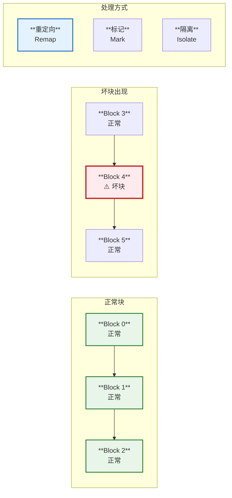

### 1.2 坏块的类型

| **类型** | **说明** | **影响** | **可恢复性** |
|---------|---------|---------|------------|
| **物理坏块** | 硬件损坏 | 永久性损坏 | 不可恢复 |
| **逻辑坏块** | 软件或固件问题 | 可能修复 | 可恢复 |
| **暂时性坏块** | 临时读写错误 | 短暂影响 | 可恢复 |
| **潜在坏块** | 将要失效 | 即将损坏 | 需监控 |

### 1.3 坏块产生原因


## 2. Linux 坏块管理架构

### 2.1 坏块管理层次

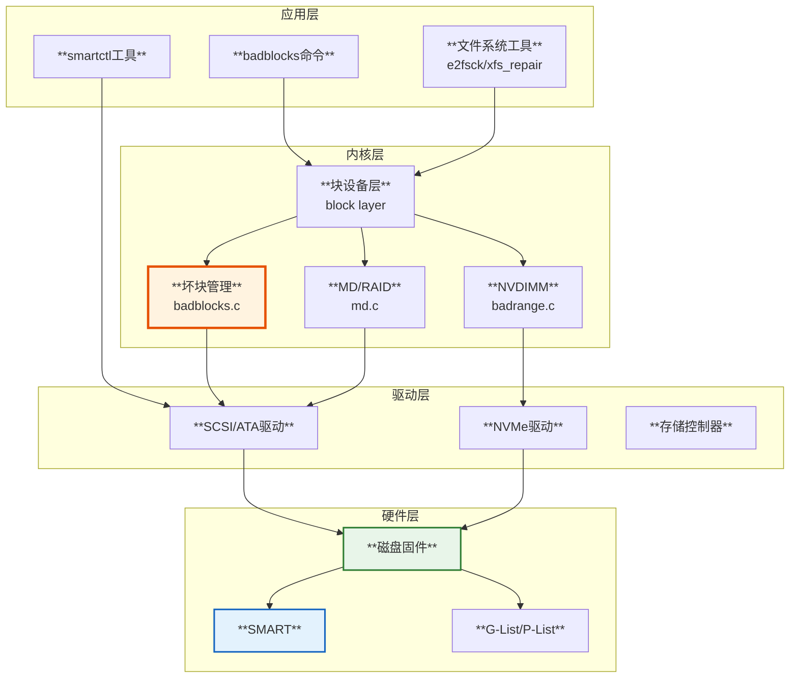

### 2.2 内核坏块数据结构

源码分析 `include/linux/badblocks.h`:

```c
// 坏块表结构
struct badblocks {
    struct device *dev;         // 设备指针
    int count;                  // 坏块数量
    int unacked_exist;          // 是否存在未确认的坏块
    int shift;                  // 扇区到块的位移
                               // 负值表示坏块功能禁用
    u64 *page;                 // 坏块列表（一页内存）
    int changed;               // 是否有变化
    seqlock_t lock;            // 顺序锁保护
    sector_t sector;           // 起始扇区
    sector_t size;             // 大小（扇区数）
};

// 坏块上下文
struct badblocks_context {
    sector_t start;            // 起始扇区
    sector_t len;              // 长度
    int ack;                   // 是否已确认
};

// 坏块条目格式 (64位)
// Bit 63:    已确认标志
// Bit 62-9:  扇区号 (54位，支持8EB)
// Bit 8-0:   长度-1 (9位，最大512个扇区)

#define BB_LEN_MASK      0x00000000000001FFULL  // 长度掩码
#define BB_OFFSET_MASK   0x7FFFFFFFFFFFFE00ULL  // 偏移掩码
#define BB_ACK_MASK      0x8000000000000000ULL  // 确认掩码
#define BB_MAX_LEN       512                    // 最大长度

// 坏块表最大条目数（一页/8字节）
#define MAX_BADBLOCKS    (PAGE_SIZE/8)
```

### 2.3 坏块条目编码

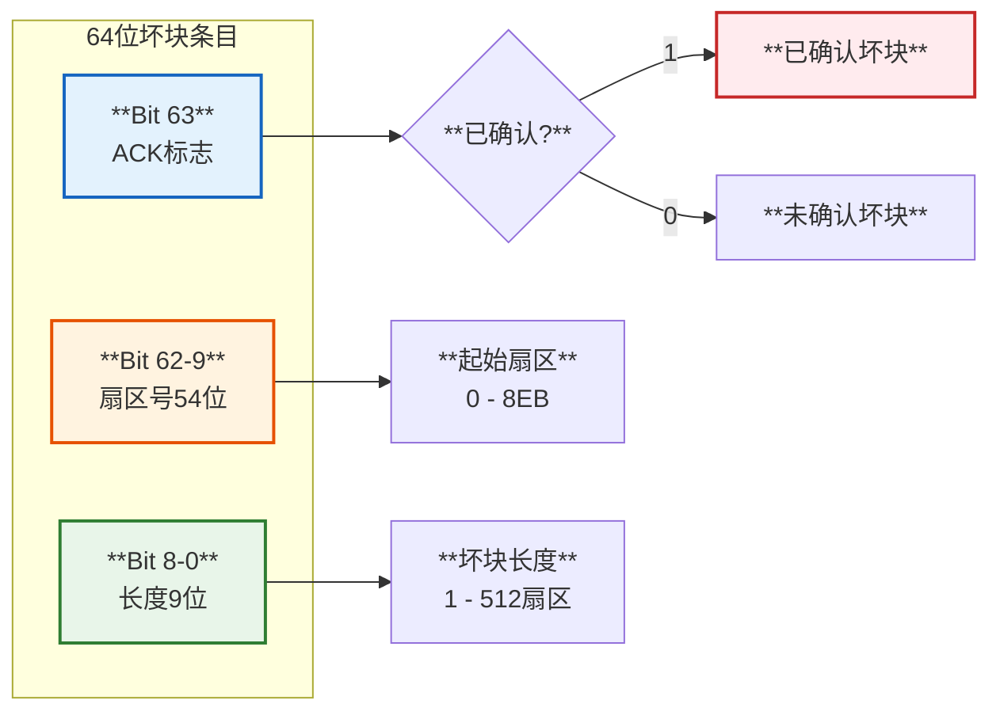

## 3. 坏块检测工具

### 3.1 badblocks - 通用坏块扫描工具

```bash
# 基本用法 - 非破坏性只读测试
badblocks /dev/sda

# 指定块大小（默认1024字节）
badblocks -b 4096 /dev/sda

# 非破坏性读写测试（推荐）
badblocks -n /dev/sda

# 破坏性写入测试（会丢失数据！）
badblocks -w /dev/sda

# 指定测试模式
# -b: 块大小
# -c: 一次测试的块数
# -p: 测试次数（遍数）
# -v: 详细输出
badblocks -b 4096 -c 65536 -p 4 -v /dev/sda

# 输出到文件
badblocks -o /root/badblocks.txt /dev/sda

# 显示进度
badblocks -s -v /dev/sda

# 测试指定范围（从第100000块开始，测试10000块）
badblocks -s -v /dev/sda 110000 100000
```

#### 3.1.1 badblocks 测试模式

| **模式** | **选项** | **特点** | **数据安全** |
|---------|---------|---------|------------|
| **只读测试** | 默认 | 只读取，不写入 | 安全 |
| **非破坏性读写** | -n | 读-写-读对比 | 安全 |
| **破坏性写入** | -w | 写入测试模式 | **危险** |

#### 3.1.2 badblocks 测试流程

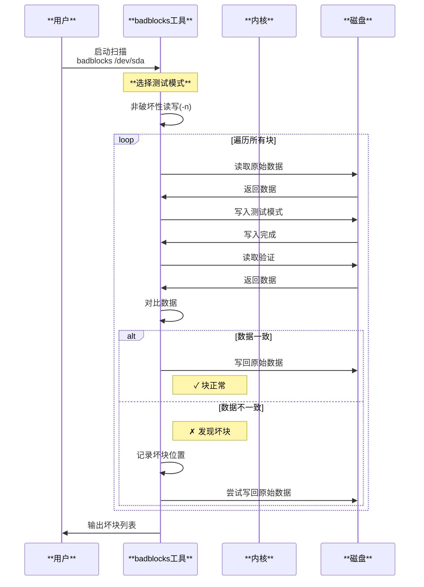

### 3.2 smartctl - SMART监控工具

SMART (Self-Monitoring, Analysis and Reporting Technology) 是硬盘内置的自监控技术。

```bash
# 安装smartmontools
apt-get install smartmontools   # Debian/Ubuntu
yum install smartmontools        # CentOS/RHEL

# 查看设备SMART信息
smartctl -i /dev/sda

# 查看SMART健康状态
smartctl -H /dev/sda

# 查看所有SMART属性
smartctl -A /dev/sda

# 查看错误日志
smartctl -l error /dev/sda

# 查看自检日志
smartctl -l selftest /dev/sda

# 执行短自检
smartctl -t short /dev/sda

# 执行长自检
smartctl -t long /dev/sda

# 执行conveyance自检（运输测试）
smartctl -t conveyance /dev/sda

# 查看坏块数量
smartctl -A /dev/sda | grep -i 'Reallocated\|Pending\|Uncorrectable'
```

#### 3.2.1 关键SMART属性

| **ID** | **属性名** | **说明** | **正常值** |
|--------|-----------|---------|-----------|
| **5** | Reallocated_Sector_Ct | 重新映射扇区数 | 0 |
| **187** | Reported_Uncorrect | 不可修正的错误 | 0 |
| **188** | Command_Timeout | 命令超时 | 0 |
| **196** | Reallocated_Event_Count | 重映射事件计数 | 0 |
| **197** | Current_Pending_Sector | 当前待处理扇区 | 0 |
| **198** | Offline_Uncorrectable | 离线不可修正 | 0 |
| **199** | UDMA_CRC_Error_Count | UDMA CRC错误 | 0 |

#### 3.2.2 SMART监控流程

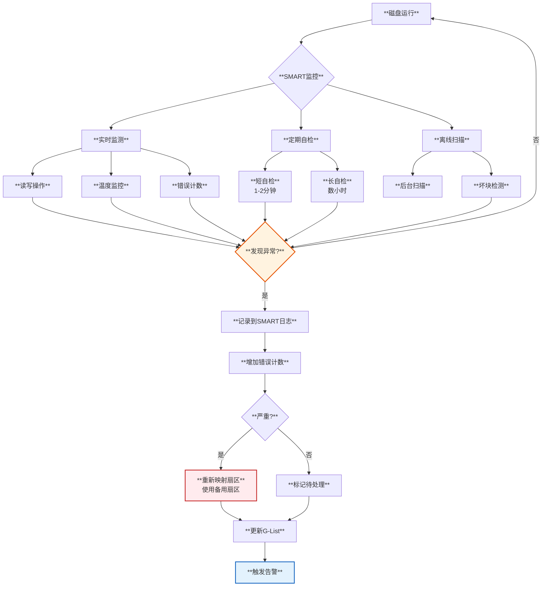

### 3.3 e2fsck/fsck - 文件系统检查工具

```bash
# 检查并修复ext4文件系统
e2fsck -f -c /dev/sda1

# -f: 强制检查，即使文件系统看起来正常
# -c: 使用badblocks检查坏块
# -y: 自动回答yes

# 使用已知坏块列表
e2fsck -l badblocks.txt /dev/sda1

# 更新坏块列表（非破坏性）
e2fsck -c /dev/sda1

# 更新坏块列表（破坏性，读写测试）
e2fsck -cc /dev/sda1
```

### 3.4 dd - 手动坏块测试

```bash
# 读取测试 - 检测读取错误
dd if=/dev/sda of=/dev/null bs=4k conv=noerror,sync status=progress

# 写入测试（危险！会清空数据）
dd if=/dev/zero of=/dev/sda bs=4k conv=noerror,sync status=progress

# 跳过指定块
dd if=/dev/sda of=/dev/null bs=4k skip=1000 count=1000
```

### 3.5 hdparm - 硬盘参数工具

```bash
# 查看硬盘信息
hdparm -I /dev/sda

# 测试读取速度（可能暴露坏块）
hdparm -t /dev/sda
hdparm -T /dev/sda

# 查看SMART状态
hdparm -H /dev/sda
```

## 4. 坏块检测原理

### 4.1 内核坏块检查函数

源码分析 `block/badblocks.c`:

```c
/**
 * badblocks_check() - 检查指定范围是否有坏块
 * @bb: badblocks结构
 * @s: 起始扇区
 * @sectors: 扇区数量
 * @first_bad: 返回第一个坏块位置
 * @bad_sectors: 返回坏块数量
 * 
 * 返回值:
 *  0:  范围内没有坏块
 *  1:  有已确认的坏块
 * -1:  有未确认的坏块
 */
int badblocks_check(struct badblocks *bb, sector_t s, int sectors,
                    sector_t *first_bad, int *bad_sectors)
{
    int unacked_badblocks, acked_badblocks;
    struct badblocks_context bad;
    u64 *p;
    
    // 使用seqlock保护并发访问
retry:
    seq = read_seqbegin(&bb->lock);
    
    p = bb->page;
    unacked_badblocks = 0;
    acked_badblocks = 0;
    
re_check:
    bad.start = s;
    bad.len = sectors;
    
    // 如果坏块表为空，直接返回
    if (badblocks_empty(bb)) {
        len = sectors;
        goto update_sectors;
    }
    
    // 二分查找第一个可能重叠的坏块范围
    prev = prev_badblocks(bb, &bad, hint);
    
    // 检查是否与前一个坏块重叠
    if ((prev >= 0) && overlap_front(bb, prev, &bad)) {
        // 检查是否已确认
        if (BB_ACK(p[prev]))
            acked_badblocks++;
        else
            unacked_badblocks++;
            
        // 计算重叠长度
        if (BB_END(p[prev]) >= (s + sectors))
            len = sectors;
        else
            len = BB_END(p[prev]) - s;
            
        // 记录第一个坏块
        if (set == 0) {
            *first_bad = BB_OFFSET(p[prev]);
            *bad_sectors = BB_LEN(p[prev]);
            set = 1;
        }
        goto update_sectors;
    }
    
update_sectors:
    s += len;
    sectors -= len;
    
    if (sectors > 0)
        goto re_check;
    
    // 检查seqlock是否有变化
    if (read_seqretry(&bb->lock, seq))
        goto retry;
    
    // 返回结果
    if (unacked_badblocks > 0)
        return -1;
    else if (acked_badblocks > 0)
        return 1;
    else
        return 0;
}
```

### 4.2 坏块设置函数

```c
/**
 * badblocks_set() - 添加坏块到表中
 * @bb: badblocks结构
 * @s: 起始扇区
 * @sectors: 扇区数量
 * @acknowledged: 是否已确认
 * 
 * 返回值:
 *  0: 成功
 *  1: 失败（表已满）
 */
int badblocks_set(struct badblocks *bb, sector_t s, int sectors,
                  int acknowledged)
{
    u64 *p;
    int rv = 0;
    
    // 如果坏块功能禁用
    if (bb->shift < 0)
        return 1;
    
    // 对齐到块边界
    if (bb->shift) {
        sector_t next = s + sectors;
        s = rounddown(s, bb->shift);
        next = roundup(next, bb->shift);
        sectors = next - s;
    }
    
    // 使用写锁保护
    write_seqlock_irqsave(&bb->lock, flags);
    
    p = bb->page;
    
re_insert:
    bad.start = s;
    bad.len = sectors;
    bad.ack = acknowledged;
    
    // 如果表为空，直接插入
    if (badblocks_empty(bb)) {
        len = insert_at(bb, 0, &bad);
        bb->count++;
        goto update_sectors;
    }
    
    // 查找插入位置
    prev = prev_badblocks(bb, &bad, hint);
    
    // 尝试合并相邻的坏块
    if (can_merge_front(bb, prev, &bad)) {
        len = front_merge(bb, prev, &bad);
        goto update_sectors;
    }
    
    // 如果表已满，无法插入
    if (badblocks_full(bb)) {
        rv = 1;
        goto out;
    }
    
    // 插入新条目
    len = insert_at(bb, prev + 1, &bad);
    bb->count++;
    
update_sectors:
    s += len;
    sectors -= len;
    
    if (sectors > 0)
        goto re_insert;
    
    // 更新状态
    set_changed(bb);
    
out:
    write_sequnlock_irqrestore(&bb->lock, flags);
    return rv;
}
```

### 4.3 坏块检测流程图

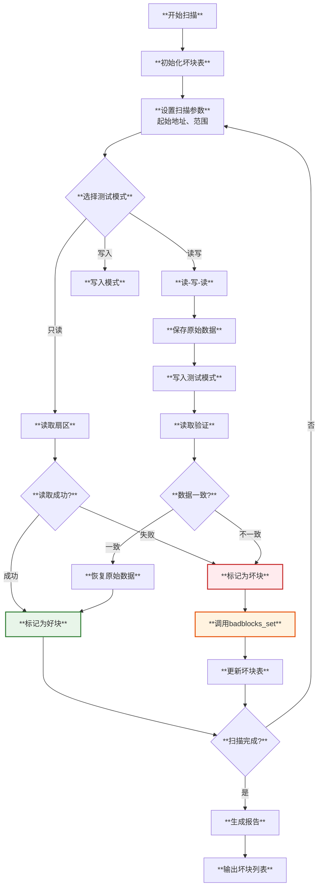

### 4.4 读写测试模式详解

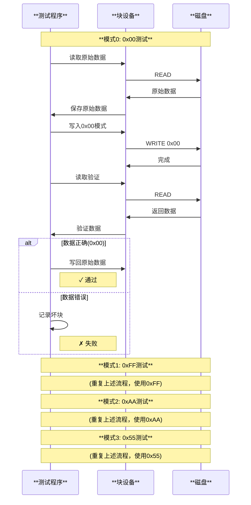

## 5. 坏块处理机制

### 5.1 磁盘内部重映射

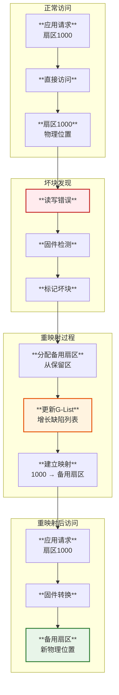

### 5.2 G-List 和 P-List

| **列表** | **名称** | **类型** | **何时生成** |
|---------|---------|---------|------------|
| **P-List** | Primary Defect List | 出厂缺陷 | 工厂测试 |
| **G-List** | Grown Defect List | 增长缺陷 | 使用过程 |

```c
// 缺陷列表的概念（伪代码）
struct defect_list {
    u32 cylinder;      // 柱面号
    u32 head;          // 磁头号
    u32 sector;        // 扇区号
    u32 spare_sector;  // 备用扇区号
};

struct disk_firmware {
    struct defect_list p_list[1000];  // P-List (只读)
    struct defect_list g_list[1000];  // G-List (可写)
    int g_list_count;                 // G-List条目数
    struct spare_area spare_sectors;  // 备用扇区池
};
```

### 5.3 坏块处理策略

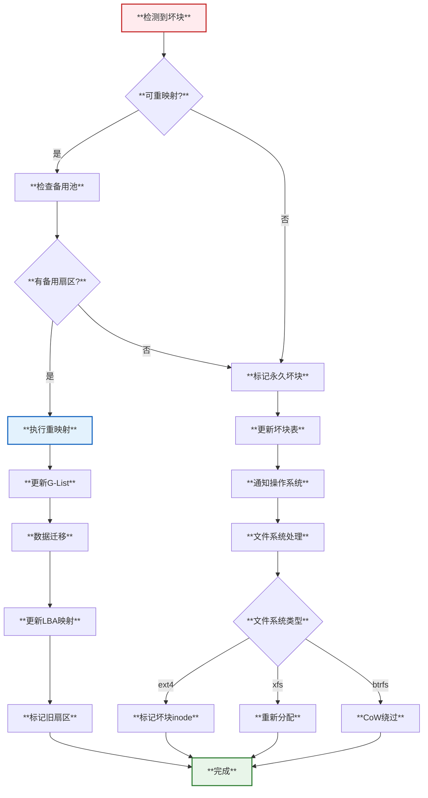

## 6. 不同设备的坏块处理

### 6.1 HDD（机械硬盘）

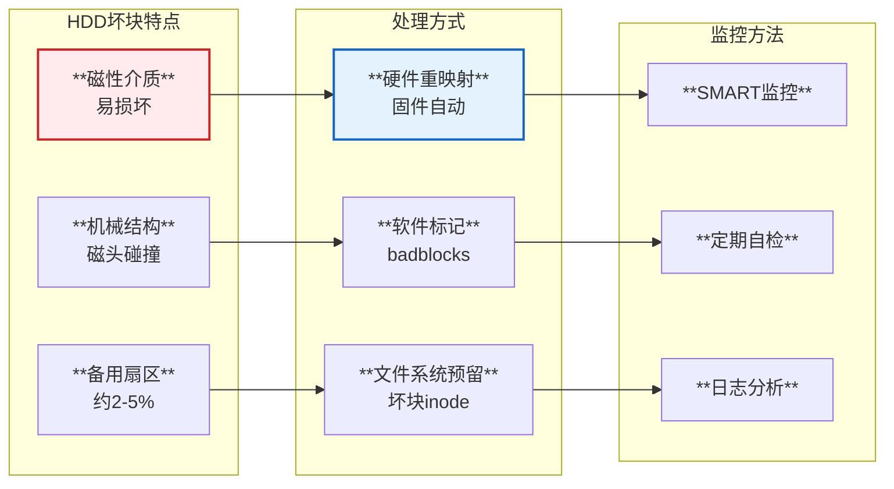

### 6.2 SSD（固态硬盘）

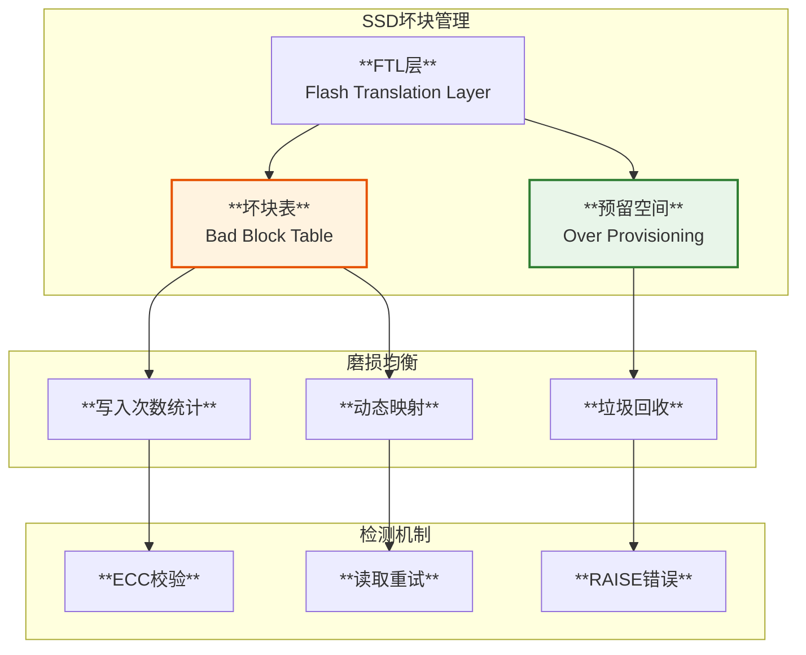

#### SSD特点

| **特性** | **说明** | **影响** |
|---------|---------|---------|
| **磨损均衡** | 分散写入到不同块 | 延长寿命 |
| **Over-Provisioning** | 预留7-30%空间 | 坏块替换 |
| **TRIM支持** | 通知已删除块 | 提升性能 |
| **ECC纠错** | 硬件纠错能力 | 减少坏块 |

### 6.3 NVMe SSD

```bash
# 查看NVMe SMART信息
nvme smart-log /dev/nvme0

# 查看错误日志
nvme error-log /dev/nvme0

# 查看坏块信息
nvme list-ns /dev/nvme0

# 格式化并标记坏块
nvme format /dev/nvme0 --ses=1

# 查看健康状况
nvme get-feature /dev/nvme0 -f 0x02
```

### 6.4 RAID磁盘阵列

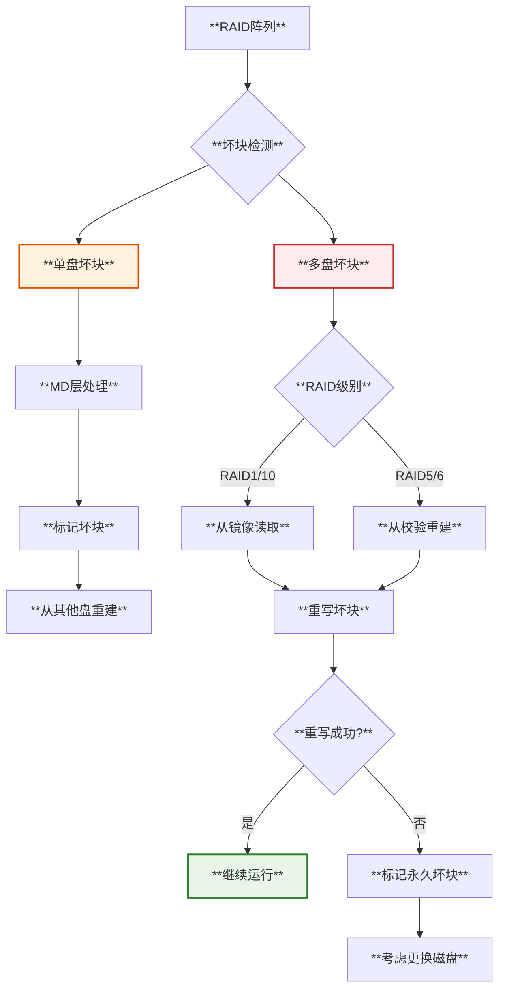

## 7. 坏块检测最佳实践

### 7.1 定期检测策略

```bash
#!/bin/bash
# 坏块定期检测脚本

DEVICE="/dev/sda"
LOG_DIR="/var/log/badblocks"
EMAIL="admin@example.com"

# 创建日志目录
mkdir -p "$LOG_DIR"

# 获取当前日期
DATE=$(date +%Y%m%d_%H%M%S)
LOG_FILE="$LOG_DIR/badblocks_$DATE.log"

# 执行坏块扫描（非破坏性）
echo "Starting badblocks scan on $DEVICE at $(date)" | tee -a "$LOG_FILE"
badblocks -n -s -v -o "$LOG_DIR/badblocks_$DATE.txt" "$DEVICE" 2>&1 | tee -a "$LOG_FILE"

# 检查是否发现坏块
if [ -s "$LOG_DIR/badblocks_$DATE.txt" ]; then
    echo "WARNING: Bad blocks detected!" | tee -a "$LOG_FILE"
    
    # 发送邮件告警
    mail -s "Bad Blocks Detected on $DEVICE" "$EMAIL" < "$LOG_DIR/badblocks_$DATE.txt"
    
    # 记录到系统日志
    logger -p user.crit "Bad blocks detected on $DEVICE"
else
    echo "No bad blocks detected." | tee -a "$LOG_FILE"
fi

# 清理旧日志（保留30天）
find "$LOG_DIR" -name "badblocks_*.log" -mtime +30 -delete
```

### 7.2 SMART监控脚本

```bash
#!/bin/bash
# SMART健康监控脚本

DEVICES="/dev/sda /dev/sdb /dev/sdc"
THRESHOLD_REALLOCATED=10
THRESHOLD_PENDING=5

for DEVICE in $DEVICES; do
    echo "Checking $DEVICE..."
    
    # 检查SMART健康状态
    HEALTH=$(smartctl -H "$DEVICE" | grep "PASSED\|FAILED")
    
    if echo "$HEALTH" | grep -q "FAILED"; then
        echo "CRITICAL: SMART health check FAILED on $DEVICE"
        logger -p user.crit "SMART health check FAILED on $DEVICE"
    fi
    
    # 检查重新映射扇区数
    REALLOCATED=$(smartctl -A "$DEVICE" | grep "Reallocated_Sector" | awk '{print $10}')
    if [ "$REALLOCATED" -gt "$THRESHOLD_REALLOCATED" ]; then
        echo "WARNING: $DEVICE has $REALLOCATED reallocated sectors"
    fi
    
    # 检查待处理扇区数
    PENDING=$(smartctl -A "$DEVICE" | grep "Current_Pending_Sector" | awk '{print $10}')
    if [ "$PENDING" -gt "$THRESHOLD_PENDING" ]; then
        echo "WARNING: $DEVICE has $PENDING pending sectors"
    fi
    
    # 检查不可修正的错误
    UNCORRECTABLE=$(smartctl -A "$DEVICE" | grep "Offline_Uncorrectable" | awk '{print $10}')
    if [ "$UNCORRECTABLE" -gt 0 ]; then
        echo "CRITICAL: $DEVICE has $UNCORRECTABLE uncorrectable sectors"
    fi
done
```

### 7.3 cron定时任务

```bash
# 编辑crontab
crontab -e

# 添加定时任务

# 每周日凌晨2点执行坏块检测
0 2 * * 0 /usr/local/bin/badblocks_check.sh

# 每天早上8点检查SMART状态
0 8 * * * /usr/local/bin/smart_check.sh

# 每月1号执行长自检
0 3 1 * * smartctl -t long /dev/sda
```

## 8. 功能时序图

### 8.1 坏块添加时序

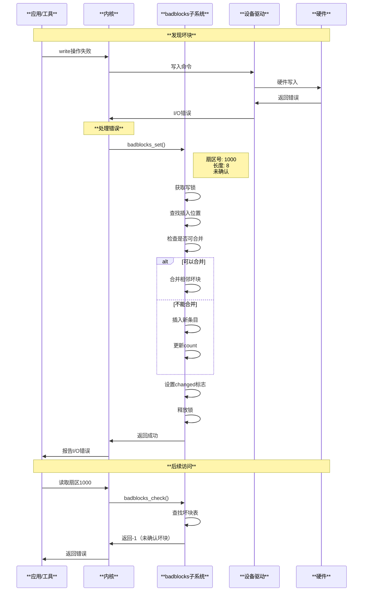

### 8.2 坏块扫描时序

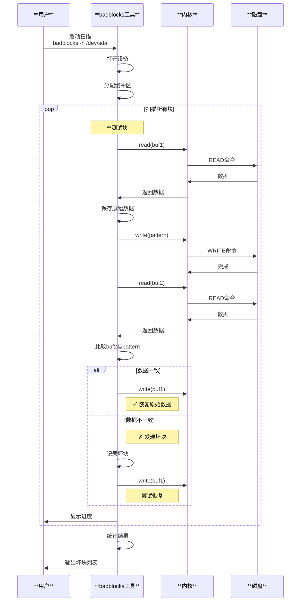

### 8.3 SMART自检时序

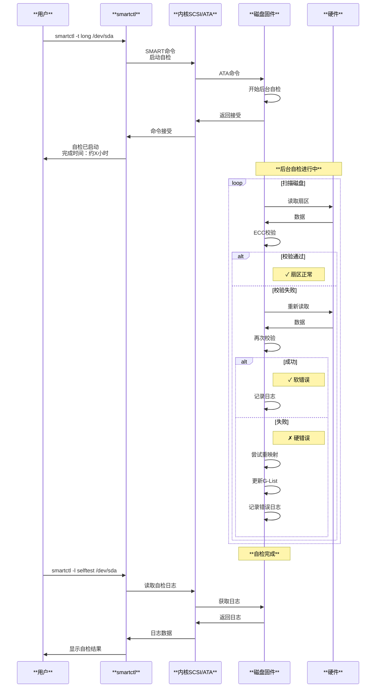

## 9. 坏块统计与可视化

### 9.1 坏块统计脚本

```python
#!/usr/bin/env python3
# 坏块统计分析工具

import subprocess
import json
import datetime

class BadBlocksAnalyzer:
    def __init__(self, device):
        self.device = device
        self.stats = {
            'device': device,
            'timestamp': datetime.datetime.now().isoformat(),
            'smart_status': {},
            'badblocks_count': 0,
            'badblocks_list': []
        }
    
    def get_smart_status(self):
        """获取SMART状态"""
        try:
            cmd = ['smartctl', '-A', self.device]
            output = subprocess.check_output(cmd, text=True)
            
            for line in output.split('\n'):
                if 'Reallocated_Sector' in line:
                    parts = line.split()
                    self.stats['smart_status']['reallocated'] = int(parts[9])
                elif 'Current_Pending_Sector' in line:
                    parts = line.split()
                    self.stats['smart_status']['pending'] = int(parts[9])
                elif 'Offline_Uncorrectable' in line:
                    parts = line.split()
                    self.stats['smart_status']['uncorrectable'] = int(parts[9])
        except Exception as e:
            print(f"Error getting SMART status: {e}")
    
    def scan_badblocks(self):
        """扫描坏块"""
        try:
            cmd = ['badblocks', '-n', '-s', self.device]
            output = subprocess.check_output(cmd, text=True, stderr=subprocess.STDOUT)
            
            # 解析输出
            for line in output.split('\n'):
                if line.strip().isdigit():
                    self.stats['badblocks_list'].append(int(line.strip()))
            
            self.stats['badblocks_count'] = len(self.stats['badblocks_list'])
        except Exception as e:
            print(f"Error scanning badblocks: {e}")
    
    def generate_report(self):
        """生成报告"""
        print("\n" + "="*50)
        print(f"Bad Blocks Analysis Report for {self.device}")
        print("="*50)
        print(f"Timestamp: {self.stats['timestamp']}")
        print("\nSMART Status:")
        print(f"  Reallocated Sectors: {self.stats['smart_status'].get('reallocated', 'N/A')}")
        print(f"  Pending Sectors: {self.stats['smart_status'].get('pending', 'N/A')}")
        print(f"  Uncorrectable: {self.stats['smart_status'].get('uncorrectable', 'N/A')}")
        print(f"\nBad Blocks Count: {self.stats['badblocks_count']}")
        
        if self.stats['badblocks_list']:
            print("\nBad Block List:")
            for bb in self.stats['badblocks_list'][:10]:  # 只显示前10个
                print(f"  Block: {bb}")
            if len(self.stats['badblocks_list']) > 10:
                print(f"  ... and {len(self.stats['badblocks_list']) - 10} more")
        
        # 保存JSON报告
        with open(f'badblocks_report_{self.device.replace("/", "_")}.json', 'w') as f:
            json.dump(self.stats, f, indent=2)
    
    def run(self):
        """执行完整分析"""
        print(f"Analyzing device: {self.device}")
        print("Getting SMART status...")
        self.get_smart_status()
        print("Scanning for bad blocks (this may take a while)...")
        self.scan_badblocks()
        self.generate_report()

if __name__ == '__main__':
    import sys
    if len(sys.argv) < 2:
        print("Usage: badblocks_analyzer.py <device>")
        sys.exit(1)
    
    analyzer = BadBlocksAnalyzer(sys.argv[1])
    analyzer.run()
```

### 9.2 监控告警系统集成

```bash
# Prometheus监控配置
cat > /etc/prometheus/badblocks_exporter.sh <<'EOF'
#!/bin/bash
# Badblocks Prometheus Exporter

echo "# HELP badblocks_count Number of bad blocks detected"
echo "# TYPE badblocks_count gauge"

for device in /dev/sd?; do
    count=$(badblocks -n "$device" 2>/dev/null | wc -l)
    device_name=$(basename "$device")
    echo "badblocks_count{device=\"$device_name\"} $count"
done

echo "# HELP smart_reallocated_sectors Reallocated sectors count"
echo "# TYPE smart_reallocated_sectors gauge"

for device in /dev/sd?; do
    count=$(smartctl -A "$device" | grep "Reallocated_Sector" | awk '{print $10}')
    device_name=$(basename "$device")
    echo "smart_reallocated_sectors{device=\"$device_name\"} $count"
done
EOF

chmod +x /etc/prometheus/badblocks_exporter.sh
```

## 10. 总结

### 10.1 坏块检测工具对比

| **工具** | **检测能力** | **破坏性** | **速度** | **推荐度** |
|---------|------------|-----------|---------|-----------|
| **badblocks** | 全面 | 可选 | 慢 | ⭐⭐⭐⭐ |
| **smartctl** | SMART | 无 | 快 | ⭐⭐⭐⭐⭐ |
| **e2fsck -c** | 文件系统级 | 否 | 慢 | ⭐⭐⭐ |
| **dd** | 基本 | 可选 | 慢 | ⭐⭐ |
| **硬盘自检** | 硬件级 | 否 | 中 | ⭐⭐⭐⭐⭐ |

### 10.2 关键源码路径

- **坏块管理核心**: `block/badblocks.c`
- **坏块头文件**: `include/linux/badblocks.h`
- **MD RAID坏块**: `drivers/md/md.c`
- **NVDIMM坏块**: `drivers/nvdimm/badrange.c`

### 10.3 最佳实践建议

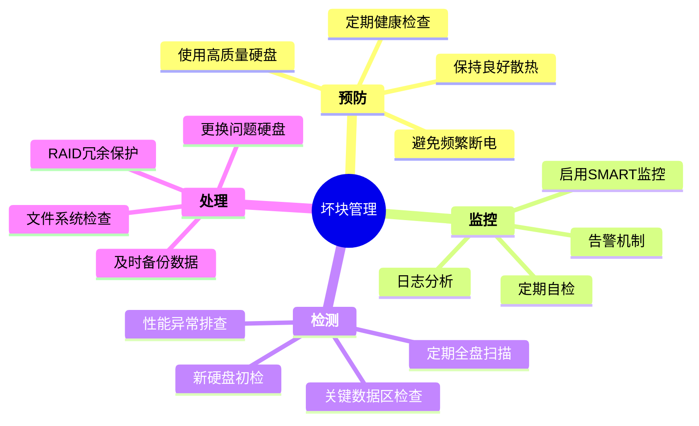

### 10.4 决策树

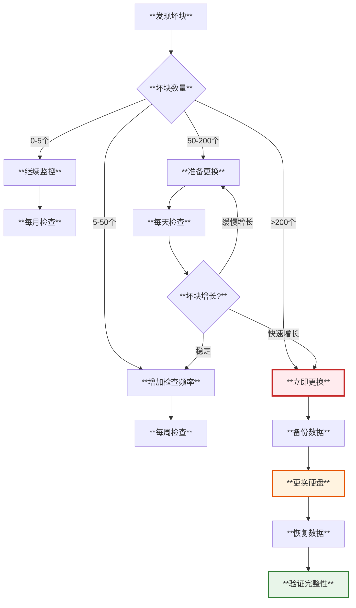

---

**文档基于Linux内核源码分析**
- 内核版本：基于最新主线
- 主要源码路径：
  - `block/badblocks.c` - 坏块管理核心
  - `include/linux/badblocks.h` - 坏块接口
  - `drivers/md/md.c` - RAID坏块处理
  - `drivers/nvdimm/` - NVDIMM坏块管理

**参考工具**
- badblocks - 坏块扫描工具
- smartmontools (smartctl) - SMART监控
- e2fsck - EXT文件系统检查
- hdparm - 硬盘参数工具

