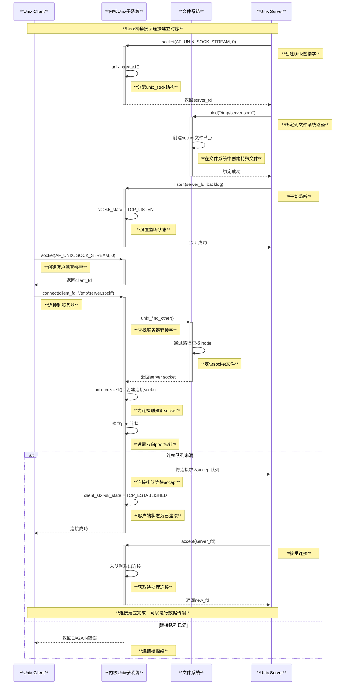
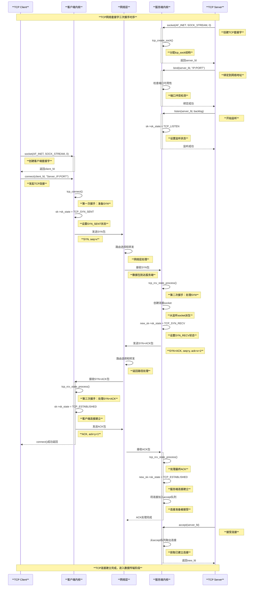
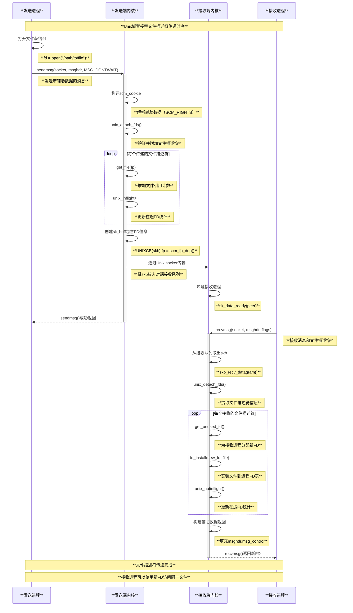
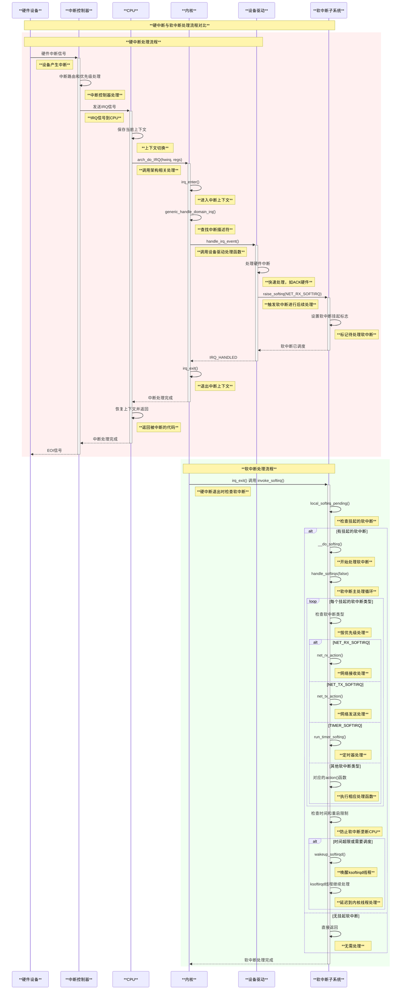
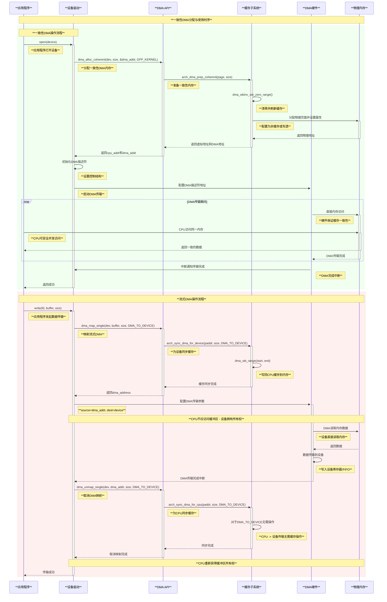
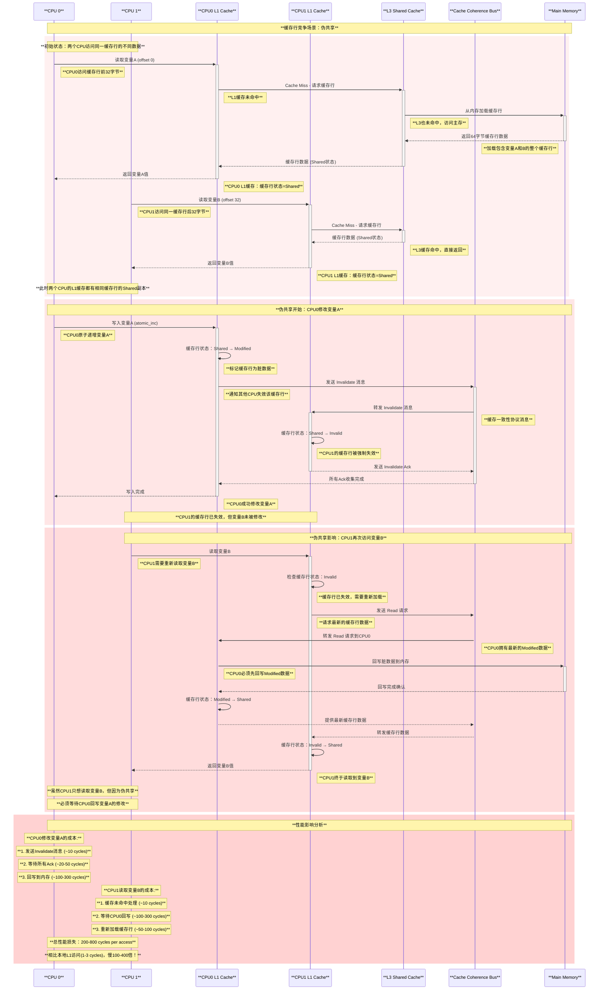

# Linux 内核通信机制详解

## 概述

Linux内核提供了丰富的通信机制，用于实现进程间通信、内核内部通信、设备驱动通信以及网络通信。这些机制构成了Linux系统的通信基础架构，支持从简单的进程间数据传递到复杂的分布式系统通信。

## 1. 进程间通信 (IPC) 机制

### 1.1 System V IPC

System V IPC是最传统的Unix进程间通信机制，包括三个主要组件：

#### 消息队列 (Message Queues)
- **原理**: 内核维护消息队列数据结构，进程通过系统调用发送和接收消息
- **核心文件**: `ipc/msg.c`, `ipc/util.c`
- **系统调用**: `msgget()`, `msgsnd()`, `msgrcv()`, `msgctl()`
- **数据结构**: `struct msg_queue`, `struct msg_msg`

```c
// 消息队列的核心结构
struct msg_queue {
    struct kern_ipc_perm q_perm;
    time64_t q_stime;          /* 最后发送时间 */
    time64_t q_rtime;          /* 最后接收时间 */
    time64_t q_ctime;          /* 最后修改时间 */
    unsigned long q_cbytes;     /* 队列中字节数 */
    unsigned long q_qnum;       /* 队列中消息数 */
    unsigned long q_qbytes;     /* 队列最大字节数 */
    struct pid *q_lspid;        /* 最后发送进程PID */
    struct pid *q_lrpid;        /* 最后接收进程PID */
    struct list_head q_messages;
    struct list_head q_receivers;
    struct list_head q_senders;
};
```

#### 信号量 (Semaphores)
- **原理**: 用于进程同步和互斥访问共享资源
- **核心文件**: `ipc/sem.c`
- **系统调用**: `semget()`, `semop()`, `semctl()`
- **特点**: 支持信号量数组，原子操作多个信号量

#### 共享内存 (Shared Memory)
- **原理**: 多个进程映射同一块物理内存区域
- **核心文件**: `ipc/shm.c`, `mm/shmem.c`
- **系统调用**: `shmget()`, `shmat()`, `shmdt()`, `shmctl()`
- **优势**: 最快的IPC机制，避免数据拷贝

### 1.2 POSIX IPC

POSIX IPC提供了更现代的进程间通信接口：

- **POSIX消息队列**: 基于文件系统接口，支持优先级
- **POSIX信号量**: 更简洁的信号量接口
- **POSIX共享内存**: 基于mmap的共享内存实现

### 1.3 System V IPC vs POSIX IPC 深度对比分析

#### 1.3.1 整体架构对比图

```text
**System V IPC 架构**

┌─────────────────────────────────────────────────────────────────────────┐
│                        **用户空间应用程序**                              │
│                                                                         │
│ ┌─────────────────┐  ┌─────────────────┐  ┌─────────────────┐           │
│ │   **进程A**     │  │   **进程B**     │  │   **进程C**     │           │
│ │                 │  │                 │  │                 │           │
│ │ msgget()        │  │ semget()        │  │ shmget()        │           │
│ │ msgsnd()        │  │ semop()         │  │ shmat()         │           │
│ │ msgrcv()        │  │ semctl()        │  │ shmdt()         │           │
│ │ msgctl()        │  │                 │  │ shmctl()        │           │
│ └─────────────────┘  └─────────────────┘  └─────────────────┘           │
│         │                       │                       │               │
└─────────┼───────────────────────┼───────────────────────┼───────────────┘
          │                       │                       │
          ▼                       ▼                       ▼
┌─────────────────────────────────────────────────────────────────────────┐
│                          **系统调用接口**                               │
│                                                                         │
│ ┌─────────────────┐  ┌─────────────────┐  ┌─────────────────┐           │
│ │  **msg系统调用** │  │  **sem系统调用** │  │  **shm系统调用** │           │
│ │                 │  │                 │  │                 │           │
│ │ sys_msgget()    │  │ sys_semget()    │  │ sys_shmget()    │           │
│ │ sys_msgsnd()    │  │ sys_semtimedop()│  │ sys_shmat()     │           │
│ │ sys_msgrcv()    │  │ sys_semctl()    │  │ sys_shmdt()     │           │
│ │ sys_msgctl()    │  │                 │  │ sys_shmctl()    │           │
│ └─────────────────┘  └─────────────────┘  └─────────────────┘           │
└─────────┼───────────────────────┼───────────────────────┼───────────────┘
          │                       │                       │
          ▼                       ▼                       ▼
┌─────────────────────────────────────────────────────────────────────────┐
│                        **内核IPC子系统**                                │
│                                                                         │
│ ┌─────────────────────────────────────────────────────────────────────┐ │
│ │                    **IPC命名空间管理**                               │ │
│ │                                                                     │ │
│ │ • **全局IPC_ID映射**: 基于key_t的ID分配机制                         │ │
│ │ • **权限检查**: uid/gid + mode权限模型                              │ │
│ │ • **资源限制**: 系统级别的IPC资源限制                               │ │
│ │ • **持久性管理**: IPC对象独立于创建进程生存期                       │ │
│ └─────────────────────────────────────────────────────────────────────┘ │
│                                   │                                     │
│                                   ▼                                     │
│ ┌─────────────────┐  ┌─────────────────┐  ┌─────────────────┐           │
│ │**消息队列子系统**│  │**信号量子系统** │  │**共享内存子系统**│           │
│ │                 │  │                 │  │                 │           │
│ │• msg_queue结构  │  │• sem_array结构  │  │• shmid_kernel   │           │
│ │• 消息链表管理   │  │• 信号量操作队列 │  │• 内存段映射     │           │
│ │• 优先级队列     │  │• undo操作支持   │  │• 页面管理       │           │
│ │• 消息拷贝机制   │  │• 原子操作保证   │  │• 交换支持       │           │
│ └─────────────────┘  └─────────────────┘  └─────────────────┘           │
│         │                       │                       │               │
│         └───────────────────────┼───────────────────────┘               │
│                                 ▼                                       │
│ ┌─────────────────────────────────────────────────────────────────────┐ │
│ │                    **内核数据结构**                                   │ │
│ │                                                                     │ │
│ │ • **ipc_ids结构**: 管理所有IPC对象的全局表                          │ │
│ │ • **kern_ipc_perm**: IPC权限和标识信息                             │ │
│ │ • **ipc_namespace**: IPC命名空间隔离                               │ │
│ │ • **全局锁机制**: 保护IPC数据结构的并发访问                        │ │
│ └─────────────────────────────────────────────────────────────────────┘ │
└─────────────────────────────────────────────────────────────────────────┘

**POSIX IPC 架构**

┌─────────────────────────────────────────────────────────────────────────┐
│                        **用户空间应用程序**                              │
│                                                                         │
│ ┌─────────────────┐  ┌─────────────────┐  ┌─────────────────┐           │
│ │   **进程A**     │  │   **进程B**     │  │   **进程C**     │           │
│ │                 │  │                 │  │                 │           │
│ │ mq_open()       │  │ sem_open()      │  │ shm_open()      │           │
│ │ mq_send()       │  │ sem_wait()      │  │ mmap()          │           │
│ │ mq_receive()    │  │ sem_post()      │  │ munmap()        │           │
│ │ mq_close()      │  │ sem_close()     │  │ close()         │           │
│ └─────────────────┘  └─────────────────┘  └─────────────────┘           │
│         │                       │                       │               │
└─────────┼───────────────────────┼───────────────────────┼───────────────┘
          │                       │                       │
          ▼                       ▼                       ▼
┌─────────────────────────────────────────────────────────────────────────┐
│                        **文件系统接口层**                               │
│                                                                         │
│ ┌─────────────────────────────────────────────────────────────────────┐ │
│ │                      **Virtual File System (VFS)**                  │ │
│ │                                                                     │ │
│ │ • **统一文件接口**: open/read/write/close语义                       │ │
│ │ • **路径名访问**: 基于文件路径的对象访问                            │ │
│ │ • **权限继承**: 遵循Unix文件权限模型                                │ │
│ │ • **描述符管理**: 利用文件描述符生命周期                            │ │
│ └─────────────────────────────────────────────────────────────────────┘ │
│                                   │                                     │
│                                   ▼                                     │
│ ┌─────────────────┐  ┌─────────────────┐  ┌─────────────────┐           │
│ │  **mqueue文件** │  │**devpts/sem目录**│  │ **tmpfs/dev/shm**│           │
│ │  **系统**       │  │                 │  │                 │           │
│ │                 │  │                 │  │                 │           │
│ │• /dev/mqueue/   │  │• /dev/sem/      │  │• /dev/shm/      │           │
│ │• 消息优先队列   │  │• 信号量文件     │  │• 共享内存文件   │           │
│ │• 异步通知支持   │  │• 快速用户态操作 │  │• 内存映射支持   │           │
│ │• epoll集成      │  │• 进程清理机制   │  │• 页面缓存利用   │           │
│ └─────────────────┘  └─────────────────┘  └─────────────────┘           │
│         │                       │                       │               │
│         └───────────────────────┼───────────────────────┘               │
│                                 ▼                                       │
│ ┌─────────────────────────────────────────────────────────────────────┐ │
│ │                    **底层实现机制**                                   │ │
│ │                                                                     │ │
│ │ • **inode/dentry机制**: 利用VFS的通用对象管理                       │ │
│ │ • **文件操作向量**: 每种IPC类型实现特定的file_operations             │ │
│ │ • **内存管理集成**: 与内核内存子系统紧密集成                        │ │
│ │ • **进程生命周期**: 自动清理机制基于进程退出                        │ │
│ └─────────────────────────────────────────────────────────────────────┘ │
└─────────────────────────────────────────────────────────────────────────┘
```

#### 1.3.2 核心数据结构对比

**System V IPC 核心数据结构**:

```c
// include/linux/ipc.h
struct ipc_ids {
    int in_use;                     // 使用中的IPC对象数量
    unsigned short seq;             // 序列号生成器
    struct rw_semaphore rwsem;      // 读写信号量
    struct idr ipcs_idr;            // IDR分配器
    int max_idx;                    // 最大索引
    int last_idx;                   // 最后分配的索引
    int next_id;                    // 下一个ID
    struct rhashtable key_ht;       // key到ID的哈希表
};

// IPC权限结构
struct kern_ipc_perm {
    spinlock_t lock;
    bool deleted;                   // 删除标志
    int id;                         // IPC标识符
    key_t key;                      // IPC键值
    kuid_t uid;                     // 所有者用户ID
    kgid_t gid;                     // 所有者组ID
    kuid_t cuid;                    // 创建者用户ID
    kgid_t cgid;                    // 创建者组ID
    umode_t mode;                   // 权限模式
    unsigned long seq;              // 序列号
    void *security;                 // 安全上下文
    
    struct rhash_head khtnode;      // 哈希表节点
    struct rcu_head rcu;            // RCU回调
    refcount_t refcount;            // 引用计数
} ____cacheline_aligned_in_smp;

// 消息队列特定结构
struct msg_queue {
    struct kern_ipc_perm q_perm;
    time64_t q_stime;               // 最后发送时间
    time64_t q_rtime;               // 最后接收时间
    time64_t q_ctime;               // 最后修改时间
    unsigned long q_cbytes;         // 当前字节数
    unsigned long q_qnum;           // 当前消息数
    unsigned long q_qbytes;         // 最大字节数
    struct pid *q_lspid;            // 最后发送进程
    struct pid *q_lrpid;            // 最后接收进程
    struct list_head q_messages;    // 消息链表
    struct list_head q_receivers;   // 接收者链表
    struct list_head q_senders;     // 发送者链表
} __randomize_layout;

// 信号量数组结构
struct sem_array {
    struct kern_ipc_perm sem_perm;  // 权限结构
    time64_t sem_ctime;             // 最后修改时间
    struct list_head pending_alter; // 等待ALTER操作的队列
    struct list_head pending_const; // 等待CONST操作的队列
    struct list_head list_id;       // undo结构链表
    int sem_nsems;                  // 信号量个数
    int complex_count;              // 复杂操作计数
    unsigned int use_global_lock;   // 全局锁使用标志
    struct sem sems[];              // 信号量数组
} __randomize_layout;

// 共享内存结构
struct shmid_kernel {
    struct kern_ipc_perm shm_perm;
    struct file *shm_file;          // 关联的文件对象
    unsigned long shm_nattch;       // 当前挂接数
    unsigned long shm_segsz;        // 段大小
    time64_t shm_atim;              // 最后挂接时间
    time64_t shm_dtim;              // 最后脱离时间
    time64_t shm_ctim;              // 最后修改时间
    struct pid *shm_cprid;          // 创建进程ID
    struct pid *shm_lprid;          // 最后操作进程ID
    struct ucounts *mlock_ucounts;   // 锁定内存计数
    struct task_struct *shm_creator; // 创建进程
    struct list_head shm_clist;     // 每进程shm链表
} __randomize_layout;
```

**POSIX IPC 核心数据结构**:

```c
// fs/mqueue.c - POSIX消息队列
struct mqueue_inode_info {
    spinlock_t lock;
    struct inode vfs_inode;         // VFS inode
    wait_queue_head_t wait_q;       // 等待队列
    
    struct rb_root msg_tree;        // 消息红黑树(按优先级)
    struct rb_node *msg_tree_eol;   // 树的末尾
    struct posix_msg_tree_node *node_cache; // 节点缓存
    
    struct mq_attr attr;            // 队列属性
    
    struct sigevent notify;         // 异步通知
    struct pid *notify_owner;       // 通知进程
    u32 notify_self_exec_id;        // 执行ID
    struct user_namespace *notify_user_ns; // 用户命名空间
    struct ucounts *ucounts;        // 用户计数
};

// kernel/futex/ - POSIX信号量 (基于futex实现)
struct futex_q {
    struct plist_node list;         // 优先级链表节点
    struct task_struct *task;       // 等待任务
    spinlock_t *lock_ptr;           // 锁指针
    union futex_key key;            // futex键值
    struct futex_pi_state *pi_state; // PI状态
    struct rt_mutex_waiter *rt_waiter; // RT等待者
    union futex_key *requeue_pi_key; // 重排队PI键值
    u32 bitset;                     // 位掩码
    struct hrtimer_sleeper *timer;   // 高精度定时器
    struct futex_inode *inode;      // 关联的inode
};

// mm/shmem.c - POSIX共享内存 (基于tmpfs)
struct shmem_inode_info {
    spinlock_t lock;
    unsigned int seals;             // 密封标志
    unsigned long flags;            // 各种标志位
    unsigned long alloced;          // 已分配页面数
    unsigned long swapped;          // 已交换页面数
    struct list_head shrinklist;    // 收缩链表
    struct list_head swaplist;      // 交换链表
    
    struct shared_policy policy;    // NUMA策略
    struct simple_xattrs xattrs;    // 扩展属性
    atomic_t stop_eviction;         // 停止回收标志
    struct timespec64 i_crtime;     // 创建时间
    struct inode vfs_inode;         // VFS inode
};
```

#### 1.3.3 实现时序图对比

**System V 消息队列操作时序**:

```mermaid
sequenceDiagram
    participant App1 as **进程A<br/>(发送者)**
    participant Kernel as **内核IPC子系统**
    participant MsgQ as **消息队列<br/>(内核对象)**
    participant App2 as **进程B<br/>(接收者)**

    Note over App1,App2: **System V 消息队列完整操作流程**
    
    App1->>+Kernel: msgget(key, IPC_CREAT|0666)
    Note right of App1: **创建或获取消息队列**
    
    Kernel->>Kernel: 查找key对应的IPC对象
    Note right of Kernel: **在全局ipc_ids中查找**
    
    alt 队列不存在
        Kernel->>Kernel: 分配新的msg_queue结构
        Note right of Kernel: **分配内核数据结构**
        
        Kernel->>Kernel: 初始化队列参数
        Note right of Kernel: **设置权限、时间戳等**
        
        Kernel->>Kernel: 添加到全局IPC表
        Note right of Kernel: **插入ipc_ids结构**
        
    else 队列已存在
        Kernel->>Kernel: 检查访问权限
        Note right of Kernel: **验证uid/gid/mode**
    end
    
    Kernel-->>-App1: 返回消息队列ID (msqid)
    Note right of Kernel: **返回正整数ID**
    
    Note over App1,App2: **进程B获取同一队列**
    
    App2->>+Kernel: msgget(same_key, 0)
    Note right of App2: **获取现有队列**
    
    Kernel->>Kernel: 通过key查找现有队列
    Note right of Kernel: **哈希表快速查找**
    
    Kernel->>Kernel: 权限检查
    Note right of Kernel: **检查进程访问权限**
    
    Kernel-->>-App2: 返回相同的msqid
    Note right of Kernel: **返回相同的队列ID**
    
    Note over App1,App2: **消息发送阶段**
    
    App1->>+Kernel: msgsnd(msqid, msgbuf, size, 0)
    Note right of App1: **发送消息到队列**
    
    Kernel->>Kernel: 验证msqid有效性
    Note right of Kernel: **ID到对象映射检查**
    
    Kernel->>+MsgQ: 检查队列状态和限制
    Note right of Kernel: **检查队列容量限制**
    
    alt 队列未满
        MsgQ->>MsgQ: 分配消息结构 (msg_msg)
        Note right of MsgQ: **内核内存分配**
        
        MsgQ->>MsgQ: 从用户空间拷贝消息数据
        Note right of MsgQ: **copy_from_user**
        
        MsgQ->>MsgQ: 插入消息到队列链表
        Note right of MsgQ: **按类型排序插入**
        
        MsgQ->>MsgQ: 更新队列统计信息
        Note right of MsgQ: **更新q_qnum, q_cbytes等**
        
        MsgQ-->>-Kernel: 插入成功
        
        Kernel->>Kernel: 唤醒等待接收的进程
        Note right of Kernel: **wake_up等待队列**
        
    else 队列已满
        Kernel->>Kernel: 进程睡眠等待
        Note right of Kernel: **加入q_senders等待队列**
        
        MsgQ-->>Kernel: 队列空间可用时唤醒
    end
    
    Kernel-->>-App1: 返回发送结果
    Note right of Kernel: **0表示成功，-1表示错误**
    
    Note over App1,App2: **消息接收阶段**
    
    App2->>+Kernel: msgrcv(msqid, msgbuf, size, msgtype, 0)
    Note right of App2: **从队列接收消息**
    
    Kernel->>Kernel: 验证msqid和权限
    Note right of Kernel: **权限和有效性检查**
    
    Kernel->>+MsgQ: 查找匹配类型的消息
    Note right of Kernel: **按msgtype匹配规则查找**
    
    alt 找到匹配消息
        MsgQ->>MsgQ: 从队列中移除消息
        Note right of MsgQ: **从q_messages链表移除**
        
        MsgQ->>MsgQ: 拷贝消息到用户空间
        Note right of MsgQ: **copy_to_user**
        
        MsgQ->>MsgQ: 释放消息内核结构
        Note right of MsgQ: **释放msg_msg结构**
        
        MsgQ->>MsgQ: 更新队列统计信息
        Note right of MsgQ: **递减q_qnum, q_cbytes**
        
        MsgQ-->>-Kernel: 接收成功
        
        Kernel->>Kernel: 唤醒等待发送的进程
        Note right of Kernel: **通知q_senders队列**
        
    else 无匹配消息
        Kernel->>Kernel: 进程睡眠等待
        Note right of Kernel: **加入q_receivers等待队列**
        
        MsgQ-->>Kernel: 有匹配消息时唤醒
    end
    
    Kernel-->>-App2: 返回接收的消息大小
    Note right of Kernel: **返回实际接收字节数**
    
    Note over App1,App2: **清理阶段**
    
    App1->>+Kernel: msgctl(msqid, IPC_RMID, NULL)
    Note right of App1: **删除消息队列**
    
    Kernel->>+MsgQ: 标记队列为删除状态
    Note right of Kernel: **设置deleted标志**
    
    MsgQ->>MsgQ: 释放所有待处理消息
    Note right of MsgQ: **清空q_messages链表**
    
    MsgQ->>MsgQ: 唤醒所有等待进程
    Note right of MsgQ: **唤醒所有等待者并返回错误**
    
    MsgQ-->>-Kernel: 队列清理完成
    
    Kernel->>Kernel: 从全局IPC表移除
    Note right of Kernel: **从ipc_ids中删除**
    
    Kernel->>Kernel: 释放队列内核结构
    Note right of Kernel: **释放msg_queue结构**
    
    Kernel-->>-App1: 删除成功
    
    Note over App1,App2: **System V IPC具有独立的生命周期**
```



**POSIX 消息队列操作时序**:

```mermaid
sequenceDiagram
    participant App1 as **进程A<br/>(发送者)**
    participant VFS as **VFS文件系统层**
    participant MqueueFS as **mqueue文件系统**
    participant Inode as **mqueue_inode<br/>(文件对象)**
    participant App2 as **进程B<br/>(接收者)**

    Note over App1,App2: **POSIX 消息队列完整操作流程**
    
    App1->>+VFS: mq_open("/myqueue", O_CREAT|O_WRONLY, 0644, &attr)
    Note right of App1: **通过文件系统接口创建**
    
    VFS->>VFS: 解析路径名 "/myqueue"
    Note right of VFS: **路径解析和权限检查**
    
    VFS->>+MqueueFS: 查找或创建inode
    Note right of VFS: **委托给mqueue文件系统**
    
    alt 文件不存在且O_CREAT
        MqueueFS->>MqueueFS: 分配新的inode
        Note right of MqueueFS: **分配mqueue_inode_info**
        
        MqueueFS->>+Inode: 初始化消息队列属性
        Note right of MqueueFS: **设置attr参数**
        
        Inode->>Inode: 初始化红黑树和等待队列
        Note right of Inode: **msg_tree, wait_q初始化**
        
        Inode->>Inode: 设置文件操作向量
        Note right of Inode: **mqueue_file_operations**
        
        Inode-->>-MqueueFS: 初始化完成
        
        MqueueFS->>MqueueFS: 创建dentry和文件对象
        Note right of MqueueFS: **VFS标准对象创建**
        
    else 文件已存在
        MqueueFS->>MqueueFS: 权限检查
        Note right of MqueueFS: **检查文件访问权限**
    end
    
    MqueueFS-->>-VFS: 返回文件对象
    Note right of MqueueFS: **返回struct file**
    
    VFS->>VFS: 分配文件描述符
    Note right of VFS: **从进程fd表分配**
    
    VFS-->>-App1: 返回文件描述符 (mqdes)
    Note right of VFS: **返回非负整数fd**
    
    Note over App1,App2: **进程B打开同一队列**
    
    App2->>+VFS: mq_open("/myqueue", O_RDONLY)
    Note right of App2: **只读方式打开**
    
    VFS->>VFS: 路径解析
    Note right of VFS: **查找现有dentry**
    
    VFS->>+MqueueFS: 获取已存在的inode
    Note right of VFS: **复用现有inode**
    
    MqueueFS->>MqueueFS: 权限检查 (只读权限)
    Note right of MqueueFS: **检查读权限**
    
    MqueueFS-->>-VFS: 返回文件对象
    Note right of MqueueFS: **新的struct file实例**
    
    VFS->>VFS: 分配新的文件描述符
    Note right of VFS: **进程B独立的fd**
    
    VFS-->>-App2: 返回fd (可能与进程A不同)
    Note right of VFS: **每个进程独立的fd空间**
    
    Note over App1,App2: **消息发送阶段**
    
    App1->>+VFS: mq_send(mqdes, msg_ptr, msg_len, msg_prio)
    Note right of App1: **发送消息（实际是write调用）**
    
    VFS->>VFS: 通过fd查找文件对象
    Note right of VFS: **fd到file对象映射**
    
    VFS->>+Inode: 调用mqueue_file_operations.write
    Note right of VFS: **委托给文件系统实现**
    
    Inode->>Inode: 检查队列容量限制
    Note right of Inode: **检查mq_maxmsg限制**
    
    alt 队列未满
        Inode->>Inode: 分配消息节点
        Note right of Inode: **分配posix_msg_tree_node**
        
        Inode->>Inode: 从用户空间拷贝数据
        Note right of Inode: **copy_from_user消息内容**
        
        Inode->>Inode: 按优先级插入红黑树
        Note right of Inode: **维护优先级顺序**
        
        Inode->>Inode: 更新队列统计
        Note right of Inode: **递增消息计数**
        
        Inode->>Inode: 检查异步通知
        Note right of Inode: **如果配置了notify则发信号**
        
        Inode->>Inode: 唤醒等待读取的进程
        Note right of Inode: **wake_up(&info->wait_q)**
        
    else 队列已满
        Inode->>Inode: 非阻塞模式则返回错误
        Note right of Inode: **O_NONBLOCK检查**
        
        alt 阻塞模式
            Inode->>Inode: 进程睡眠等待
            Note right of Inode: **wait_event_interruptible**
        end
    end
    
    Inode-->>-VFS: 返回写入字节数
    Note right of Inode: **成功返回msg_len**
    
    VFS-->>-App1: 返回结果给应用
    Note right of VFS: **系统调用返回值**
    
    Note over App1,App2: **消息接收阶段**
    
    App2->>+VFS: mq_receive(mqdes, msg_ptr, msg_len, &msg_prio)
    Note right of App2: **接收消息（实际是read调用）**
    
    VFS->>VFS: 通过fd查找文件对象
    Note right of VFS: **fd验证和查找**
    
    VFS->>+Inode: 调用mqueue_file_operations.read
    Note right of VFS: **文件系统read操作**
    
    Inode->>Inode: 检查队列是否为空
    Note right of Inode: **检查msg_tree是否有消息**
    
    alt 队列有消息
        Inode->>Inode: 从红黑树获取最高优先级消息
        Note right of Inode: **按优先级顺序获取**
        
        Inode->>Inode: 从树中移除消息节点
        Note right of Inode: **rb_erase操作**
        
        Inode->>Inode: 拷贝消息到用户空间
        Note right of Inode: **copy_to_user消息和优先级**
        
        Inode->>Inode: 释放消息节点内存
        Note right of Inode: **kfree节点结构**
        
        Inode->>Inode: 更新队列统计
        Note right of Inode: **递减消息计数**
        
        Inode->>Inode: 唤醒等待写入的进程
        Note right of Inode: **队列有空间时唤醒写入者**
        
    else 队列为空
        Inode->>Inode: 非阻塞模式返回错误
        Note right of Inode: **O_NONBLOCK时返回EAGAIN**
        
        alt 阻塞模式
            Inode->>Inode: 进程睡眠等待消息
            Note right of Inode: **wait_event_interruptible**
        end
    end
    
    Inode-->>-VFS: 返回读取字节数
    Note right of Inode: **成功返回实际消息长度**
    
    VFS-->>-App2: 返回结果给应用
    Note right of VFS: **消息内容和优先级**
    
    Note over App1,App2: **清理阶段**
    
    App1->>+VFS: close(mqdes)
    Note right of App1: **关闭文件描述符**
    
    VFS->>VFS: 清理进程fd表项
    Note right of VFS: **移除fd映射**
    
    VFS->>+Inode: 递减文件引用计数
    Note right of VFS: **file->f_count--**
    
    Inode->>Inode: 检查引用计数
    Note right of Inode: **如果计数为0则准备释放**
    
    alt 所有引用都已关闭
        Inode->>Inode: 释放所有消息
        Note right of Inode: **清空红黑树**
        
        Inode->>Inode: 唤醒所有等待进程
        Note right of Inode: **错误唤醒等待者**
        
        Inode-->>-VFS: 对象清理完成
    else 还有其他引用
        Inode-->>-VFS: 保持对象存活
    end
    
    VFS-->>-App1: 关闭成功
    
    App2->>+VFS: mq_unlink("/myqueue")
    Note right of App2: **删除队列文件**
    
    VFS->>+MqueueFS: 删除目录项
    Note right of VFS: **unlink文件系统操作**
    
    MqueueFS->>MqueueFS: 标记inode为删除
    Note right of MqueueFS: **设置删除标志**
    
    MqueueFS->>MqueueFS: 从目录中移除
    Note right of MqueueFS: **dentry操作**
    
    MqueueFS-->>-VFS: 删除完成
    
    VFS-->>-App2: unlink成功
    
    Note over App1,App2: **POSIX IPC遵循文件系统语义**
```

#### 1.3.4 性能与特性对比

```text
**System V IPC vs POSIX IPC 详细对比**

┌─────────────────────────────────────────────────────────────────────────┐
│                        **接口设计对比**                                  │
├─────────────────┬─────────────────────┬─────────────────────────────────┤
│    **特性**     │   **System V IPC**  │        **POSIX IPC**            │
├─────────────────┼─────────────────────┼─────────────────────────────────┤
│ **命名机制**    │ **数字键值(key_t)** │ **字符串路径名**                │
│                 │ • ftok()生成键值    │ • /dev/mqueue/name              │
│                 │ • 容易冲突          │ • 直观易理解                    │
│                 │ • 调试困难          │ • 便于调试                      │
├─────────────────┼─────────────────────┼─────────────────────────────────┤
│ **权限模型**    │ **数字权限模式**    │ **文件权限模式**                │
│                 │ • 类似chmod模式     │ • 标准Unix权限                  │
│                 │ • 创建时设定        │ • 可动态修改                    │
│                 │ • 权限检查复杂      │ • 权限检查简单                  │
├─────────────────┼─────────────────────┼─────────────────────────────────┤
│ **生命周期**    │ **独立于进程**      │ **文件系统语义**                │
│                 │ • 需显式删除        │ • 引用计数管理                  │
│                 │ • 易产生资源泄漏    │ • 自动清理                      │
│                 │ • 系统重启才清理    │ • 进程退出自动清理              │
├─────────────────┼─────────────────────┼─────────────────────────────────┤
│ **发现机制**    │ **全局命名空间**    │ **文件系统命名空间**            │
│                 │ • 所有进程可见      │ • 基于文件路径                  │
│                 │ • 缺乏隔离          │ • 天然隔离                      │
│                 │ • 安全性较低        │ • 安全性较高                    │
└─────────────────┴─────────────────────┴─────────────────────────────────┘

┌─────────────────────────────────────────────────────────────────────────┐
│                        **实现复杂度对比**                                │
├─────────────────┬─────────────────────┬─────────────────────────────────┤
│    **方面**     │   **System V IPC**  │        **POSIX IPC**            │
├─────────────────┼─────────────────────┼─────────────────────────────────┤
│ **内核实现**    │ **专用IPC子系统**   │ **复用现有子系统**              │
│                 │ • 独立的数据结构    │ • VFS + 文件系统                │
│                 │ • 专门的系统调用    │ • 标准文件操作                  │
│                 │ • 复杂的ID管理      │ • 文件描述符管理                │
├─────────────────┼─────────────────────┼─────────────────────────────────┤
│ **用户接口**    │ **专用API**         │ **标准文件API**                 │
│                 │ • 学习成本高        │ • 学习成本低                    │
│                 │ • 参数复杂          │ • 参数简单                      │
│                 │ • 错误处理复杂      │ • 错误处理统一                  │
├─────────────────┼─────────────────────┼─────────────────────────────────┤
│ **调试支持**    │ **工具有限**        │ **工具丰富**                    │
│                 │ • ipcs/ipcrm        │ • ls/rm/chmod等                 │
│                 │ • 缺乏详细信息      │ • 详细的文件信息                │
│                 │ • 难以监控          │ • 易于监控                      │
└─────────────────┴─────────────────────┴─────────────────────────────────┘

┌─────────────────────────────────────────────────────────────────────────┐
│                        **性能特征对比**                                  │
├─────────────────┬─────────────────────┬─────────────────────────────────┤
│    **指标**     │   **System V IPC**  │        **POSIX IPC**            │
├─────────────────┼─────────────────────┼─────────────────────────────────┤
│ **内存开销**    │ **较低**            │ **较高**                        │
│                 │ • 专用数据结构      │ • VFS开销                       │
│                 │ • 紧凑的布局        │ • inode/dentry开销              │
│                 │ • 全局共享          │ • 每个fd独立结构                │
├─────────────────┼─────────────────────┼─────────────────────────────────┤
│ **访问延迟**    │ **较低**            │ **中等**                        │
│                 │ • 直接系统调用      │ • VFS层间接调用                 │
│                 │ • 简单查找          │ • 路径解析开销                  │
│                 │ • 缓存友好          │ • 多层查找                      │
├─────────────────┼─────────────────────┼─────────────────────────────────┤
│ **并发性能**    │ **中等**            │ **较好**                        │
│                 │ • 全局锁竞争        │ • 细粒度锁                      │
│                 │ • 扩展性受限        │ • 并发友好                      │
│                 │ • 热点数据结构      │ • 分散的数据结构                │
├─────────────────┼─────────────────────┼─────────────────────────────────┤
│ **扩展性**      │ **有限**            │ **良好**                        │
│                 │ • 全局ID空间限制    │ • 文件系统扩展性                │
│                 │ • 系统级资源限制    │ • 进程级资源限制                │
│                 │ • 单点竞争          │ • 分布式设计                    │
└─────────────────┴─────────────────────┴─────────────────────────────────┘

┌─────────────────────────────────────────────────────────────────────────┐
│                        **功能特性对比**                                  │
├─────────────────┬─────────────────────┬─────────────────────────────────┤
│    **功能**     │   **System V IPC**  │        **POSIX IPC**            │
├─────────────────┼─────────────────────┼─────────────────────────────────┤
│ **消息优先级**  │ **简单**            │ **完整支持**                    │
│                 │ • 基于消息类型      │ • 32个优先级等级                │
│                 │ • 有限的排序        │ • 红黑树自动排序                │
│                 │ • 手动管理          │ • 自动管理                      │
├─────────────────┼─────────────────────┼─────────────────────────────────┤
│ **异步通知**    │ **不支持**          │ **完整支持**                    │
│                 │ • 只能轮询          │ • mq_notify()                   │
│                 │ • 阻塞等待          │ • 信号通知                      │
│                 │ • 无事件机制        │ • 与epoll集成                   │
├─────────────────┼─────────────────────┼─────────────────────────────────┤
│ **非阻塞I/O**   │ **有限支持**        │ **完整支持**                    │
│                 │ • IPC_NOWAIT标志    │ • O_NONBLOCK标志                │
│                 │ • 接口不统一        │ • 标准文件接口                  │
│                 │ • 错误处理复杂      │ • 标准错误码                    │
├─────────────────┼─────────────────────┼─────────────────────────────────┤
│ **与其他机制    │ **隔离**            │ **集成良好**                    │
│ 的集成**        │ • 独立的等待机制    │ • select/poll/epoll             │
│                 │ • 无法与文件I/O集成 │ • 标准I/O多路复用               │
│                 │ • 特殊的监控        │ • 统一的监控                    │
└─────────────────┴─────────────────────┴─────────────────────────────────┘
```

### 1.4 信号量机制深度分析

信号量是一种重要的进程同步原语，用于控制对共享资源的访问。Linux内核提供了两种主要的信号量实现：System V信号量和POSIX信号量。

#### 1.4.1 信号量概念与类型

**信号量基本概念**:

```text
**信号量工作原理**

┌─────────────────────────────────────────────────────────────────────────┐
│                        **信号量同步机制**                                │
│                                                                         │
│ ┌─────────────────────────────────────────────────────────────────────┐ │
│ │                    **计数信号量 (Counting Semaphore)**               │ │
│ │                                                                     │ │
│ │ • **计数器值**: 表示可用资源数量                                     │ │
│ │ • **P操作 (Wait/Down)**: 计数器减1，若为0则阻塞                      │ │
│ │ • **V操作 (Signal/Up)**: 计数器加1，唤醒等待进程                     │ │
│ │ • **初始值**: 设定可同时访问资源的进程数                             │ │
│ └─────────────────────────────────────────────────────────────────────┘ │
│                                   │                                     │
│                                   ▼                                     │
│ ┌─────────────────────────────────────────────────────────────────────┐ │
│ │                    **二值信号量 (Binary Semaphore)**                 │ │
│ │                                                                     │ │
│ │ • **取值范围**: 只能是0或1                                           │ │
│ │ • **互斥锁语义**: 类似于互斥锁(mutex)                                │ │
│ │ • **所有权概念**: 通常由获取者释放                                   │ │
│ │ • **递归支持**: 可支持递归获取                                       │ │
│ └─────────────────────────────────────────────────────────────────────┘ │
│                                   │                                     │
│                                   ▼                                     │
│ ┌─────────────────────────────────────────────────────────────────────┐ │
│ │                    **信号量数组 (Semaphore Array)**                  │ │
│ │                                                                     │ │
│ │ • **原子操作**: 对多个信号量同时进行原子操作                         │ │
│ │ • **复杂同步**: 支持复杂的同步模式                                   │ │
│ │ • **undo机制**: 进程退出时自动撤销操作                               │ │
│ │ • **System V特有**: POSIX信号量不支持数组                            │ │
│ └─────────────────────────────────────────────────────────────────────┘ │
└─────────────────────────────────────────────────────────────────────────┘
```

**信号量使用场景**:

```text
**信号量经典应用场景**

┌─────────────────────────────────────────────────────────────────────────┐
│                          **生产者-消费者问题**                           │
│                                                                         │
│ ┌─────────────────┐   **buffer_mutex**   ┌─────────────────┐             │
│ │   **生产者**    │ ◄──────────────────► │   **消费者**    │             │
│ │                 │                     │                 │             │
│ │ 1. wait(empty)  │   **empty_slots**   │ 1. wait(full)   │             │
│ │ 2. wait(mutex)  │ ◄──────────────────► │ 2. wait(mutex)  │             │
│ │ 3. produce()    │                     │ 3. consume()    │             │
│ │ 4. signal(mutex)│   **full_slots**    │ 4. signal(mutex)│             │
│ │ 5. signal(full) │ ◄──────────────────► │ 5. signal(empty)│             │
│ └─────────────────┘                     └─────────────────┘             │
│                                                                         │
│ • **empty_slots**: 计数信号量，表示空缓冲区数量                         │
│ • **full_slots**: 计数信号量，表示满缓冲区数量                          │
│ • **buffer_mutex**: 二值信号量，保护缓冲区互斥访问                      │
└─────────────────────────────────────────────────────────────────────────┘

┌─────────────────────────────────────────────────────────────────────────┐
│                          **读者-写者问题**                               │
│                                                                         │
│ ┌─────────────────┐   **read_count_mutex** ┌─────────────────┐           │
│ │   **读者**      │ ◄────────────────────► │   **写者**      │           │
│ │                 │                       │                 │           │
│ │ 1. wait(rc_mutex)│   **write_mutex**     │ 1. wait(w_mutex)│           │
│ │ 2. read_count++ │ ◄────────────────────► │ 2. write()      │           │
│ │ 3. if(rc==1)    │                       │ 3. signal(w_mutex)│         │
│ │   wait(w_mutex) │   **reader_count**    │                 │           │
│ │ 4. signal(rc_mutex)│ ◄──────────────────► │                 │           │
│ │ 5. read()       │                       │                 │           │
│ │ 6. wait(rc_mutex)│                       │                 │           │
│ │ 7. read_count-- │                       │                 │           │
│ │ 8. if(rc==0)    │                       │                 │           │
│ │   signal(w_mutex)│                       │                 │           │
│ │ 9. signal(rc_mutex)│                      │                 │           │
│ └─────────────────┘                       └─────────────────┘           │
│                                                                         │
│ • **write_mutex**: 写者互斥信号量                                       │
│ • **read_count_mutex**: 读者计数保护信号量                              │
│ • **reader_count**: 全局变量，当前读者数量                             │
└─────────────────────────────────────────────────────────────────────────┘

┌─────────────────────────────────────────────────────────────────────────┐
│                          **资源池管理**                                  │
│                                                                         │
│ ┌─────────────────┐                       ┌─────────────────┐           │
│ │   **客户端A**   │   **resource_pool**   │   **客户端B**   │           │
│ │                 │ ◄────────────────────► │                 │           │
│ │ 1. wait(pool)   │   **(count=N)**       │ 1. wait(pool)   │           │
│ │ 2. acquire_res()│                       │ 2. acquire_res()│           │
│ │ 3. use_resource()│   **pool_mutex**      │ 3. use_resource()│          │
│ │ 4. release_res()│ ◄────────────────────► │ 4. release_res()│          │
│ │ 5. signal(pool) │                       │ 5. signal(pool) │           │
│ └─────────────────┘                       └─────────────────┘           │
│                                                                         │
│ • **resource_pool**: 计数信号量，初值为资源总数N                        │
│ • **pool_mutex**: 二值信号量，保护资源分配的原子性                      │
│ • **应用**: 数据库连接池、线程池、内存池等                              │
└─────────────────────────────────────────────────────────────────────────┘
```

#### 1.4.2 System V 信号量实现机制

**核心数据结构**:

```c
// ipc/sem.c - System V 信号量核心结构

// 单个信号量结构
struct sem {
    int semval;         // 信号量当前值
    struct pid *sempid; // 最后操作的进程ID
    spinlock_t lock;    // 自旋锁保护
    struct list_head pending_alter; // 等待ALTER操作的进程队列
    struct list_head pending_const; // 等待CONST操作的进程队列
} ____cacheline_aligned_in_smp;

// 信号量数组结构
struct sem_array {
    struct kern_ipc_perm sem_perm;  // IPC权限结构
    time64_t sem_ctime;             // 创建/最后控制操作时间
    struct list_head pending_alter; // 等待ALTER操作的队列
    struct list_head pending_const; // 等待CONST操作的队列
    struct list_head list_id;       // undo结构链表
    int sem_nsems;                  // 信号量个数
    int complex_count;              // 复杂操作计数
    unsigned int use_global_lock;   // 是否使用全局锁
    struct sem sems[];              // 信号量数组
} __randomize_layout;

// 信号量操作结构
struct sembuf {
    unsigned short sem_num; // 信号量编号
    short sem_op;           // 操作值 (+1, -1, 0)
    short sem_flg;          // 操作标志 (IPC_NOWAIT, SEM_UNDO)
};

// 进程等待结构
struct sem_queue {
    struct list_head list;      // 链表节点
    struct task_struct *sleeper;   // 等待的进程
    struct sem_undo *undo;      // undo结构
    struct pid *pid;            // 进程ID
    int status;                 // 操作状态
    struct sembuf *sops;        // 操作数组
    struct sembuf *blocking;    // 阻塞的操作
    int nsops;                  // 操作数量
    bool alter;                 // 是否为ALTER操作
    bool dupsop;                // 是否有重复操作
};

// undo操作结构
struct sem_undo {
    struct list_head list_proc; // 每进程undo链表
    struct rcu_head rcu;        // RCU回调
    struct sem_undo_list *ulp;  // undo列表
    struct list_head list_id;   // 每信号量集undo链表
    int semid;                  // 信号量集ID
    short *semadj;              // 调整值数组
};

// 每进程undo列表
struct sem_undo_list {
    refcount_t refcnt;          // 引用计数
    spinlock_t lock;            // 保护锁
    struct list_head list_proc; // undo结构链表
};
```

**System V 信号量操作实现**:

```c
// ipc/sem.c - 核心操作实现

// 创建信号量集
SYSCALL_DEFINE3(semget, key_t, key, int, nsems, int, semflg)
{
    return ipcget(&sem_ids(ns), &sem_ops, &sem_params);
}

// 信号量操作
SYSCALL_DEFINE4(semtimedop, int, semid, struct sembuf __user *, tsops,
                unsigned, nsops, const struct __kernel_timespec __user *, timeout)
{
    struct timespec64 ts;
    struct sem_array *sma;
    struct sem_queue queue;
    
    // 获取信号量数组
    sma = sem_obtain_object_check(ns, semid);
    
    // 检查操作是否可以立即执行
    error = try_atomic_semop(sma, &queue, &timespec64_to_jiffies(ts));
    
    if (error > 0) {
        // 需要睡眠等待
        error = perform_atomic_semop(sma, &queue);
    }
    
    return error;
}

// 尝试原子操作
static int try_atomic_semop(struct sem_array *sma, struct sem_queue *q, 
                           unsigned long timeout)
{
    struct sembuf *sop;
    struct sem *curr;
    int error, i;
    
    for (i = 0; i < q->nsops; i++) {
        sop = &q->sops[i];
        curr = &sma->sems[sop->sem_num];
        
        if (sop->sem_op == 0) {
            // 等待信号量变为0
            if (curr->semval != 0) {
                if (sop->sem_flg & IPC_NOWAIT)
                    return -EAGAIN;
                return 1; // 需要等待
            }
        } else if (sop->sem_op > 0) {
            // 释放资源 (V操作)
            curr->semval += sop->sem_op;
            
            // 设置undo
            if (sop->sem_flg & SEM_UNDO) {
                sem_undo_add(sma, sop->sem_num, -sop->sem_op, q->undo);
            }
        } else {
            // 获取资源 (P操作)
            if (curr->semval + sop->sem_op < 0) {
                if (sop->sem_flg & IPC_NOWAIT)
                    return -EAGAIN;
                return 1; // 需要等待
            }
            curr->semval += sop->sem_op;
            
            // 设置undo
            if (sop->sem_flg & SEM_UNDO) {
                sem_undo_add(sma, sop->sem_num, -sop->sem_op, q->undo);
            }
        }
        
        curr->sempid = task_tgid_vnr(current);
    }
    
    // 唤醒等待的进程
    wake_up_sem_queue_prepare(sma);
    
    return 0;
}

// 执行复杂操作
static int perform_atomic_semop(struct sem_array *sma, struct sem_queue *q)
{
    int error;
    
    // 加入等待队列
    if (q->alter)
        list_add_tail(&q->list, &sma->pending_alter);
    else
        list_add_tail(&q->list, &sma->pending_const);
    
    // 睡眠等待
    do {
        __set_current_state(TASK_INTERRUPTIBLE);
        sem_unlock(sma, -1);
        
        if (timeout)
            error = schedule_timeout(*timeout);
        else {
            schedule();
            error = 0;
        }
        
        sma = sem_obtain_lock(ns, semid);
        
        if (IS_ERR(sma)) {
            error = PTR_ERR(sma);
            goto out_free;
        }
        
        error = get_queue_result(q);
    } while (error == IN_WAKEUP);
    
    return error;
}
```

#### 1.4.3 POSIX 信号量实现机制

**POSIX 信号量类型**:

```text
**POSIX 信号量分类**

┌─────────────────────────────────────────────────────────────────────────┐
│                        **POSIX 信号量体系**                              │
│                                                                         │
│ ┌─────────────────────────────────────────────────────────────────────┐ │
│ │                    **命名信号量 (Named Semaphore)**                  │ │
│ │                                                                     │ │
│ │ • **文件系统基础**: 存储在/dev/shm/sem.* 下                         │ │
│ │ • **跨进程共享**: 不同进程通过名称访问                               │ │
│ │ • **持久性**: 独立于创建进程的生命周期                               │ │
│ │ • **权限控制**: 支持文件权限模型                                     │ │
│ │                                                                     │ │
│ │ **API**: sem_open(), sem_close(), sem_unlink()                     │ │
│ └─────────────────────────────────────────────────────────────────────┘ │
│                                   │                                     │
│                                   ▼                                     │
│ ┌─────────────────────────────────────────────────────────────────────┐ │
│ │                **无名信号量 (Unnamed/Anonymous Semaphore)**          │ │
│ │                                                                     │ │
│ │ • **内存基础**: 存储在进程或共享内存中                               │ │
│ │ • **局部作用域**: 只能在创建进程内或共享内存中使用                   │ │
│ │ • **轻量级**: 无文件系统开销                                         │ │
│ │ • **生命周期**: 与创建它的进程或共享内存绑定                         │ │
│ │                                                                     │ │
│ │ **API**: sem_init(), sem_destroy()                                  │ │
│ └─────────────────────────────────────────────────────────────────────┘ │
│                                   │                                     │
│                                   ▼                                     │
│ ┌─────────────────────────────────────────────────────────────────────┐ │
│ │                    **共同操作接口**                                   │ │
│ │                                                                     │ │
│ │ • **sem_wait()**: P操作，获取信号量 (阻塞)                           │ │
│ │ • **sem_trywait()**: P操作，获取信号量 (非阻塞)                      │ │
│ │ • **sem_timedwait()**: P操作，获取信号量 (超时)                      │ │
│ │ • **sem_post()**: V操作，释放信号量                                  │ │
│ │ • **sem_getvalue()**: 获取当前信号量值                               │ │
│ └─────────────────────────────────────────────────────────────────────┘ │
└─────────────────────────────────────────────────────────────────────────┘
```

**POSIX 信号量核心数据结构**:

```c
// include/linux/semaphore.h - 内核信号量结构
struct semaphore {
    raw_spinlock_t lock;        // 保护锁
    unsigned int count;         // 信号量计数
    struct list_head wait_list; // 等待队列
};

// kernel/locking/semaphore.c - 等待者结构
struct semaphore_waiter {
    struct list_head list;      // 链表节点
    struct task_struct *task;   // 等待的任务
    bool up;                    // 是否被唤醒
};

// glibc中的sem_t结构 (用户空间)
typedef union {
    char __size[__SIZEOF_SEM_T];
    long int __align;
} sem_t;

// 实际的信号量数据 (在__size中)
struct new_sem {
    unsigned int value;         // 信号量值
    unsigned int nwaiters;      // 等待者数量
    int private;                // 是否为进程私有
    int reserved;               // 保留字段
};
```

**POSIX 信号量操作实现**:

```c
// kernel/locking/semaphore.c - 内核信号量实现

// 初始化信号量
void sema_init(struct semaphore *sem, int val)
{
    static struct lock_class_key __key;
    
    *sem = (struct semaphore) __SEMAPHORE_INITIALIZER(*sem, val);
    lockdep_init_map(&sem->lock.dep_map, "semaphore->lock", &__key, 0);
}

// P操作 (down/wait)
void down(struct semaphore *sem)
{
    unsigned long flags;
    
    might_sleep();
    raw_spin_lock_irqsave(&sem->lock, flags);
    
    if (likely(sem->count > 0)) {
        sem->count--;
    } else {
        __down(sem);  // 需要等待
    }
    
    raw_spin_unlock_irqrestore(&sem->lock, flags);
}

// 带超时的P操作
int down_timeout(struct semaphore *sem, long timeout)
{
    unsigned long flags;
    int result = 0;
    
    might_sleep();
    raw_spin_lock_irqsave(&sem->lock, flags);
    
    if (likely(sem->count > 0)) {
        sem->count--;
    } else {
        result = __down_timeout(sem, timeout);
    }
    
    raw_spin_unlock_irqrestore(&sem->lock, flags);
    return result;
}

// V操作 (up/post)  
void up(struct semaphore *sem)
{
    unsigned long flags;
    
    raw_spin_lock_irqsave(&sem->lock, flags);
    
    if (likely(list_empty(&sem->wait_list))) {
        sem->count++;
    } else {
        __up(sem);  // 唤醒等待者
    }
    
    raw_spin_unlock_irqrestore(&sem->lock, flags);
}

// 慢路径 - 等待信号量
static noinline void __sched __down(struct semaphore *sem)
{
    __down_common(sem, TASK_UNINTERRUPTIBLE, MAX_SCHEDULE_TIMEOUT);
}

// 慢路径 - 等待信号量 (带超时)
static noinline int __sched __down_timeout(struct semaphore *sem, long timeout)
{
    return __down_common(sem, TASK_UNINTERRUPTIBLE, timeout);
}

// 通用等待函数
static inline int __sched __down_common(struct semaphore *sem, long state, long timeout)
{
    struct semaphore_waiter waiter;
    
    list_add_tail(&waiter.list, &sem->wait_list);
    waiter.task = current;
    waiter.up = false;
    
    for (;;) {
        if (signal_pending_state(state, current))
            goto interrupted;
        if (unlikely(timeout <= 0))
            goto timed_out;
            
        __set_current_state(state);
        raw_spin_unlock_irq(&sem->lock);
        timeout = schedule_timeout(timeout);
        raw_spin_lock_irq(&sem->lock);
        
        if (waiter.up)
            return 0;
    }
    
timed_out:
    list_del(&waiter.list);
    return -ETIME;
interrupted:
    list_del(&waiter.list);
    return -EINTR;
}

// 慢路径 - 唤醒等待者
static noinline void __sched __up(struct semaphore *sem)
{
    struct semaphore_waiter *waiter;
    
    waiter = list_first_entry(&sem->wait_list, struct semaphore_waiter, list);
    list_del(&waiter->list);
    waiter->up = true;
    wake_up_process(waiter->task);
}
```

#### 1.4.4 信号量机制时序图

**System V 信号量操作时序**:

```mermaid
sequenceDiagram
    participant App1 as **进程A<br/>(获取资源)**
    participant Kernel as **内核信号量子系统**
    participant SemArray as **信号量数组<br/>(sem_array)**
    participant App2 as **进程B<br/>(释放资源)**

    Note over App1,App2: **System V 信号量完整操作流程**
    
    App1->>+Kernel: semget(key, nsems, IPC_CREAT|0666)
    Note right of App1: **创建信号量数组**
    
    Kernel->>Kernel: 查找key对应的信号量集
    Note right of Kernel: **在全局sem_ids中查找**
    
    alt 信号量集不存在
        Kernel->>Kernel: 分配sem_array结构
        Note right of Kernel: **分配内核数据结构**
        
        Kernel->>+SemArray: 初始化信号量数组
        Note right of Kernel: **设置权限、初值等**
        
        SemArray->>SemArray: 初始化每个信号量
        Note right of SemArray: **semval=初始值, sempid=0**
        
        SemArray->>SemArray: 初始化等待队列
        Note right of SemArray: **pending_alter, pending_const**
        
        SemArray-->>-Kernel: 初始化完成
        
        Kernel->>Kernel: 添加到全局信号量表
        Note right of Kernel: **插入sem_ids结构**
        
    else 信号量集已存在
        Kernel->>Kernel: 检查访问权限
        Note right of Kernel: **验证uid/gid/mode**
    end
    
    Kernel-->>-App1: 返回信号量集ID (semid)
    Note right of Kernel: **返回正整数ID**
    
    Note over App1,App2: **进程B获取同一信号量集**
    
    App2->>+Kernel: semget(same_key, 0, 0)
    Note right of App2: **获取现有信号量集**
    
    Kernel->>Kernel: 通过key查找现有信号量集
    Note right of Kernel: **哈希表快速查找**
    
    Kernel-->>-App2: 返回相同的semid
    Note right of Kernel: **返回相同的信号量集ID**
    
    Note over App1,App2: **资源获取阶段 (P操作)**
    
    App1->>+Kernel: semtimedop(semid, {0, -1, SEM_UNDO}, 1, NULL)
    Note right of App1: **执行P操作获取资源**
    
    Kernel->>Kernel: 验证semid有效性
    Note right of Kernel: **ID到对象映射检查**
    
    Kernel->>+SemArray: 尝试原子操作
    Note right of Kernel: **try_atomic_semop**
    
    SemArray->>SemArray: 检查sem[0].semval
    Note right of SemArray: **检查信号量当前值**
    
    alt 信号量值 > 0 (资源可用)
        SemArray->>SemArray: semval -= 1
        Note right of SemArray: **递减信号量值**
        
        SemArray->>SemArray: 设置sempid = current->tgid
        Note right of SemArray: **记录最后操作进程**
        
        SemArray->>SemArray: 添加undo记录
        Note right of SemArray: **semadj[0] += 1 (SEM_UNDO)**
        
        SemArray-->>-Kernel: 操作成功
        
        Kernel->>Kernel: 检查是否可唤醒其他等待者
        Note right of Kernel: **wake_up_sem_queue_prepare**
        
    else 信号量值 = 0 (资源不可用)
        SemArray->>SemArray: 创建sem_queue等待结构
        Note right of SemArray: **分配等待者结构**
        
        SemArray->>SemArray: 加入pending_alter队列
        Note right of SemArray: **ALTER操作等待队列**
        
        SemArray-->>-Kernel: 需要等待
        
        Kernel->>Kernel: 进程进入睡眠状态
        Note right of Kernel: **__set_current_state(TASK_INTERRUPTIBLE)**
        
        Kernel->>Kernel: 调用schedule()让出CPU
        Note right of Kernel: **等待被唤醒或超时**
    end
    
    Kernel-->>-App1: 返回操作结果
    Note right of Kernel: **0表示成功，负数表示错误**
    
    Note over App1,App2: **资源释放阶段 (V操作)**
    
    App2->>+Kernel: semtimedop(semid, {0, +1, 0}, 1, NULL)
    Note right of App2: **执行V操作释放资源**
    
    Kernel->>Kernel: 验证semid和权限
    Note right of Kernel: **权限和有效性检查**
    
    Kernel->>+SemArray: 尝试原子操作
    Note right of Kernel: **try_atomic_semop**
    
    SemArray->>SemArray: semval += 1
    Note right of SemArray: **递增信号量值**
    
    SemArray->>SemArray: 设置sempid = current->tgid
    Note right of SemArray: **记录最后操作进程**
    
    SemArray->>SemArray: 检查pending_alter队列
    Note right of SemArray: **查找可以唤醒的等待者**
    
    alt 有等待的进程
        SemArray->>SemArray: 从队列中取出等待者
        Note right of SemArray: **获取sem_queue结构**
        
        SemArray->>SemArray: 检查等待者操作是否可执行
        Note right of SemArray: **重新尝试等待者的操作**
        
        SemArray->>SemArray: 如果可执行则执行操作
        Note right of SemArray: **更新semval，设置undo**
        
        SemArray->>SemArray: 唤醒等待进程
        Note right of SemArray: **wake_up_process(waiter->task)**
        
        SemArray-->>-Kernel: 唤醒完成
        
    else 无等待进程
        SemArray-->>-Kernel: 操作完成
    end
    
    Kernel-->>-App2: 返回操作结果
    Note right of Kernel: **V操作成功**
    
    Note over App1,App2: **进程A被唤醒继续执行**
    
    Note over App1,App2: **清理阶段**
    
    App1->>+Kernel: semctl(semid, 0, IPC_RMID, NULL)
    Note right of App1: **删除信号量集**
    
    Kernel->>+SemArray: 标记信号量集为删除状态
    Note right of Kernel: **设置deleted标志**
    
    SemArray->>SemArray: 清理所有等待队列
    Note right of SemArray: **唤醒所有等待者并返回错误**
    
    SemArray->>SemArray: 处理所有undo操作
    Note right of SemArray: **释放undo结构**
    
    SemArray-->>-Kernel: 清理完成
    
    Kernel->>Kernel: 从全局信号量表移除
    Note right of Kernel: **从sem_ids中删除**
    
    Kernel->>Kernel: 释放内核结构
    Note right of Kernel: **释放sem_array结构**
    
    Kernel-->>-App1: 删除成功
    
    Note over App1,App2: **System V信号量支持undo机制**
```

**POSIX 信号量操作时序**:

```mermaid
sequenceDiagram
    participant App1 as **进程A<br/>(生产者)**
    participant glibc as **glibc库**
    participant Kernel as **内核信号量**
    participant App2 as **进程B<br/>(消费者)**

    Note over App1,App2: **POSIX 信号量完整操作流程**
    
    App1->>+glibc: sem_open("/mysem", O_CREAT, 0644, 1)
    Note right of App1: **创建命名信号量**
    
    glibc->>glibc: 构造文件路径
    Note right of glibc: **/dev/shm/sem.mysem**
    
    glibc->>+Kernel: open("/dev/shm/sem.mysem", O_CREAT|O_RDWR, 0644)
    Note right of glibc: **创建或打开信号量文件**
    
    alt 文件不存在
        Kernel->>Kernel: 在tmpfs中创建文件
        Note right of Kernel: **分配inode和dentry**
        
        Kernel->>Kernel: 设置文件大小
        Note right of Kernel: **sizeof(struct new_sem)**
        
        Kernel-->>-glibc: 返回文件描述符
        
        glibc->>+Kernel: mmap(NULL, sizeof(sem_t), PROT_READ|PROT_WRITE, MAP_SHARED, fd, 0)
        Note right of glibc: **映射信号量到内存**
        
        Kernel->>Kernel: 建立内存映射
        Note right of Kernel: **页面映射到进程地址空间**
        
        Kernel-->>-glibc: 返回映射地址
        
        glibc->>glibc: 初始化信号量结构
        Note right of glibc: **value=1, nwaiters=0**
        
    else 文件已存在
        Kernel-->>-glibc: 返回文件描述符
        
        glibc->>+Kernel: mmap现有文件
        Kernel-->>-glibc: 返回映射地址
    end
    
    glibc-->>-App1: 返回sem_t指针
    Note right of glibc: **指向共享内存的信号量**
    
    Note over App1,App2: **进程B打开同一信号量**
    
    App2->>+glibc: sem_open("/mysem", 0)
    Note right of App2: **打开现有信号量**
    
    glibc->>+Kernel: open("/dev/shm/sem.mysem", O_RDWR)
    Note right of glibc: **打开现有信号量文件**
    
    Kernel-->>-glibc: 返回文件描述符
    
    glibc->>+Kernel: mmap同一文件
    Note right of glibc: **映射到进程B地址空间**
    
    Kernel-->>-glibc: 返回映射地址
    
    glibc-->>-App2: 返回sem_t指针
    Note right of glibc: **指向同一共享信号量**
    
    Note over App1,App2: **信号量P操作 (获取资源)**
    
    App1->>+glibc: sem_wait(sem)
    Note right of App1: **生产者等待空闲槽位**
    
    glibc->>glibc: 原子读取当前值
    Note right of glibc: **atomic_load(&sem->value)**
    
    alt 信号量值 > 0
        glibc->>glibc: 原子递减操作
        Note right of glibc: **atomic_compare_exchange(&sem->value, val, val-1)**
        
        alt CAS成功
            glibc-->>-App1: 操作成功，继续执行
            Note right of glibc: **获取资源成功**
            
        else CAS失败 (竞争)
            glibc->>glibc: 重试或进入慢路径
            Note right of glibc: **其他进程抢先操作**
        end
        
    else 信号量值 = 0
        glibc->>glibc: 原子增加等待者计数
        Note right of glibc: **atomic_increment(&sem->nwaiters)**
        
        glibc->>+Kernel: futex(sem, FUTEX_WAIT, 0, NULL, NULL, 0)
        Note right of glibc: **进入内核等待**
        
        Kernel->>Kernel: 检查信号量值是否仍为0
        Note right of Kernel: **双重检查避免竞态**
        
        alt 值仍为0
            Kernel->>Kernel: 将进程加入futex等待队列
            Note right of Kernel: **加入等待哈希表**
            
            Kernel->>Kernel: 设置进程状态为TASK_INTERRUPTIBLE
            Note right of Kernel: **准备睡眠**
            
            Kernel->>Kernel: 调用schedule()让出CPU
            Note right of Kernel: **进程睡眠等待唤醒**
            
        else 值已改变
            Kernel-->>-glibc: 立即返回
            Note right of Kernel: **避免不必要的睡眠**
        end
    end
    
    Note over App1,App2: **信号量V操作 (释放资源)**
    
    App2->>+glibc: sem_post(sem)
    Note right of App2: **消费者释放资源**
    
    glibc->>glibc: 原子递增信号量值
    Note right of glibc: **atomic_increment(&sem->value)**
    
    glibc->>glibc: 检查是否有等待者
    Note right of glibc: **atomic_load(&sem->nwaiters)**
    
    alt 有等待者
        glibc->>+Kernel: futex(sem, FUTEX_WAKE, 1, NULL, NULL, 0)
        Note right of glibc: **唤醒一个等待进程**
        
        Kernel->>Kernel: 在futex等待队列中查找
        Note right of Kernel: **根据地址查找等待者**
        
        Kernel->>Kernel: 唤醒一个等待进程
        Note right of Kernel: **wake_up_process(waiter)**
        
        Kernel->>Kernel: 从等待队列移除
        Note right of Kernel: **清理等待结构**
        
        Kernel-->>-glibc: 返回唤醒的进程数
        Note right of Kernel: **通常返回1**
        
    else 无等待者
        glibc->>glibc: 无需唤醒操作
        Note right of glibc: **优化：避免系统调用**
    end
    
    glibc-->>-App2: V操作完成
    Note right of glibc: **资源释放成功**
    
    Note over App1,App2: **进程A被唤醒继续执行**
    
    Kernel->>Kernel: 唤醒进程A
    Note right of Kernel: **设置进程状态为TASK_RUNNING**
    
    Kernel-->>glibc: futex_wait返回0
    Note right of Kernel: **正常唤醒**
    
    glibc->>glibc: 原子递减等待者计数
    Note right of glibc: **atomic_decrement(&sem->nwaiters)**
    
    glibc-->>App1: sem_wait返回成功
    Note right of glibc: **获取资源成功**
    
    Note over App1,App2: **清理阶段**
    
    App1->>+glibc: sem_close(sem)
    Note right of App1: **关闭信号量**
    
    glibc->>+Kernel: munmap(sem, sizeof(sem_t))
    Note right of glibc: **解除内存映射**
    
    Kernel->>Kernel: 解除页面映射
    Note right of Kernel: **清理进程页表项**
    
    Kernel-->>-glibc: 解映射成功
    
    glibc->>+Kernel: close(fd)
    Note right of glibc: **关闭文件描述符**
    
    Kernel-->>-glibc: 关闭成功
    
    glibc-->>-App1: 关闭完成
    
    App2->>+glibc: sem_unlink("/mysem")
    Note right of App2: **删除信号量文件**
    
    glibc->>+Kernel: unlink("/dev/shm/sem.mysem")
    Note right of glibc: **删除文件系统中的文件**
    
    Kernel->>Kernel: 从目录中移除dentry
    Note right of Kernel: **文件系统操作**
    
    Kernel->>Kernel: 递减inode引用计数
    Note right of Kernel: **如果引用为0则释放inode**
    
    Kernel-->>-glibc: 删除成功
    
    glibc-->>-App2: unlink完成
    
    Note over App1,App2: **POSIX信号量基于futex实现高效同步**
```

#### 1.4.5 信号量性能对比与最佳实践

**性能特征对比**:

```text
**System V vs POSIX 信号量性能对比**

┌─────────────────────────────────────────────────────────────────────────┐
│                        **性能指标对比**                                  │
├─────────────────┬─────────────────────┬─────────────────────────────────┤
│    **指标**     │  **System V 信号量** │        **POSIX 信号量**         │
├─────────────────┼─────────────────────┼─────────────────────────────────┤
│ **创建开销**    │ **中等**            │ **较高**                        │
│                 │ • 内核数据结构分配  │ • 文件系统操作                  │
│                 │ • IPC ID分配        │ • mmap内存映射                  │
│                 │ • 权限检查          │ • 页面分配和映射                │
├─────────────────┼─────────────────────┼─────────────────────────────────┤
│ **操作延迟**    │ **中等**            │ **低 (用户态优化)**             │
│                 │ • 总是系统调用      │ • 快路径用户态完成              │
│                 │ • 权限检查开销      │ • 慢路径才进内核                │
│                 │ • ID到对象查找      │ • 直接内存访问                  │
├─────────────────┼─────────────────────┼─────────────────────────────────┤
│ **内存开销**    │ **较低**            │ **较高**                        │
│                 │ • 紧凑的内核结构    │ • 页面粒度分配                  │
│                 │ • 共享内核对象      │ • 每进程映射开销                │
│                 │ • 无用户空间开销    │ • glibc管理结构                 │
├─────────────────┼─────────────────────┼─────────────────────────────────┤
│ **并发性能**    │ **较好**            │ **优秀**                        │
│                 │ • 细粒度锁设计      │ • 无锁快路径                    │
│                 │ • 支持复杂原子操作  │ • CAS原子操作                   │
│                 │ • 批量操作优化      │ • futex高效唤醒                 │
├─────────────────┼─────────────────────┼─────────────────────────────────┤
│ **扩展性**      │ **有限**            │ **良好**                        │
│                 │ • 全局ID命名空间    │ • 基于地址空间                  │
│                 │ • 系统级限制        │ • 进程级限制                    │
│                 │ • 单点竞争可能      │ • 分布式无竞争                  │
└─────────────────┴─────────────────────┴─────────────────────────────────┘

┌─────────────────────────────────────────────────────────────────────────┐
│                        **功能特性对比**                                  │
├─────────────────┬─────────────────────┬─────────────────────────────────┤
│    **特性**     │  **System V 信号量** │        **POSIX 信号量**         │
├─────────────────┼─────────────────────┼─────────────────────────────────┤
│ **原子操作**    │ **强大**            │ **基础**                        │
│                 │ • 多信号量原子操作  │ • 单信号量操作                  │
│                 │ • 复合条件判断      │ • 简单递增递减                  │
│                 │ • 批量操作支持      │ • 无批量操作                    │
├─────────────────┼─────────────────────┼─────────────────────────────────┤
│ **undo机制**    │ **完整支持**        │ **不支持**                      │
│                 │ • 进程退出自动撤销  │ • 需要手动清理                  │
│                 │ • 异常退出保护      │ • 可能导致死锁                  │
│                 │ • 一致性保证        │ • 依赖应用逻辑                  │
├─────────────────┼─────────────────────┼─────────────────────────────────┤
│ **超时支持**    │ **完整**            │ **完整**                        │
│                 │ • semtimedop()      │ • sem_timedwait()               │
│                 │ • 绝对时间          │ • 绝对时间                      │
│                 │ • 高精度定时器      │ • 高精度定时器                  │
├─────────────────┼─────────────────────┼─────────────────────────────────┤
│ **实时支持**    │ **基础**            │ **优秀**                        │
│                 │ • 优先级继承有限    │ • 完整的优先级继承              │
│                 │ • 可能优先级倒置    │ • 避免优先级倒置                │
│                 │ • 调度延迟较大      │ • 低调度延迟                    │
└─────────────────┴─────────────────────┴─────────────────────────────────┘
```

**最佳实践指南**:

```text
**信号量使用最佳实践**

┌─────────────────────────────────────────────────────────────────────────┐
│                        **选择决策树**                                    │
│                                                                         │
│ ┌─────────────────────────────────────────────────────────────────────┐ │
│ │                    **需要复杂原子操作？**                             │ │
│ │                                                                     │ │
│ │                           ├─ YES ──┐                                 │ │
│ │                           │        ▼                                 │ │
│ │                           │  **System V 信号量**                     │ │
│ │                           │  • 多信号量原子操作                       │ │
│ │                           │  • 条件等待 (semval==0)                  │ │
│ │                           │  • 批量递增递减                           │ │
│ │                           │  • undo机制保护                          │ │
│ │                           │                                          │ │
│ │                           ├─ NO ───┐                                 │ │
│ │                           │        ▼                                 │ │
│ │                           │  **需要高性能？**                         │ │
│ │                           │        │                                 │ │
│ │                           │  ├─ YES ──┐                              │ │
│ │                           │  │        ▼                              │ │
│ │                           │  │  **POSIX 信号量**                     │ │
│ │                           │  │  • 用户态快路径                        │ │
│ │                           │  │  • 无锁原子操作                        │ │
│ │                           │  │  • 低延迟唤醒                          │ │
│ │                           │  │                                       │ │
│ │                           │  ├─ NO ───┐                              │ │
│ │                           │  │        ▼                              │ │
│ │                           │  │  **需要持久性？**                      │ │
│ │                           │  │        │                              │ │
│ │                           │  │  ├─ YES ──► **System V**              │ │
│ │                           │  │  ├─ NO ───► **POSIX Unnamed**         │ │
│ └─────────────────────────────────────────────────────────────────────┘ │
└─────────────────────────────────────────────────────────────────────────┘

┌─────────────────────────────────────────────────────────────────────────┐
│                        **性能优化建议**                                  │
├─────────────────┬─────────────────────────────────────────────────────────┤
│  **优化方面**   │                    **具体措施**                         │
├─────────────────┼─────────────────────────────────────────────────────────┤
│ **减少竞争**    │ • 使用多个信号量分散热点                               │
│                 │ • 避免全局共享信号量                                   │
│                 │ • 实现信号量池 (Semaphore Pool)                        │
│                 │ • 使用局部信号量减少缓存失效                           │
├─────────────────┼─────────────────────────────────────────────────────────┤
│ **避免死锁**    │ • 统一信号量获取顺序                                   │
│                 │ • 使用超时避免无限阻塞                                 │
│                 │ • 实现死锁检测机制                                     │
│                 │ • 使用try操作代替阻塞操作                              │
├─────────────────┼─────────────────────────────────────────────────────────┤
│ **提高吞吐**    │ • 批量获取释放资源                                     │
│                 │ • 使用信号量数组原子操作                               │
│                 │ • 减少系统调用频率                                     │
│                 │ • 合理设置信号量初值                                   │
├─────────────────┼─────────────────────────────────────────────────────────┤
│ **内存优化**    │ • 使用unnamed信号量减少内存开销                        │
│                 │ • 及时清理不用的信号量                                 │
│                 │ • 避免创建过多信号量对象                               │
│                 │ • 考虑使用其他同步原语                                 │
└─────────────────┴─────────────────────────────────────────────────────────┘
```

### 1.5 文件系统通信

#### 管道 (Pipes)
- **匿名管道**: `pipe()` 系统调用创建，只能在父子进程间使用
- **命名管道 (FIFO)**: 通过文件系统访问，任意进程可通信
- **核心文件**: `fs/pipe.c`

```c
// 管道的核心数据结构
struct pipe_inode_info {
    struct mutex mutex;
    wait_queue_head_t rd_wait, wr_wait;
    unsigned int head, tail, max_usage, ring_size;
    unsigned int readers, writers;
    unsigned int files, r_counter, w_counter;
    struct pipe_buffer *bufs;
    struct user_struct *user;
};
```

#### 1.5.1 进程创建机制与线程区别分析

**进程创建机制详解**:

```text
**Linux 进程创建体系**

┌─────────────────────────────────────────────────────────────────────────┐
│                        **进程创建层次结构**                              │
│                                                                         │
│ ┌─────────────────────────────────────────────────────────────────────┐ │
│ │                    **系统调用接口层**                                 │ │
│ │                                                                     │ │
│ │ • **fork()**: 创建完整进程副本                                       │ │
│ │ • **vfork()**: 创建进程但共享内存空间直到exec                        │ │
│ │ • **clone()**: 灵活控制资源共享的统一接口                            │ │
│ │ • **execve()**: 替换进程映像                                         │ │
│ │ • **pthread_create()**: 线程创建 (实际是clone的封装)                 │ │
│ └─────────────────────────────────────────────────────────────────────┘ │
│                                   │                                     │
│                                   ▼                                     │
│ ┌─────────────────────────────────────────────────────────────────────┐ │
│ │                    **内核统一实现层**                                 │ │
│ │                                                                     │ │
│ │ • **do_fork()**: 内核统一的进程/线程创建入口                         │ │
│ │ • **copy_process()**: 进程结构体创建和初始化                        │ │
│ │ • **clone_flags**: 控制资源共享行为的标志位                         │ │
│ │ • **copy_xxx()**: 各种资源的复制或共享函数                          │ │
│ └─────────────────────────────────────────────────────────────────────┘ │
│                                   │                                     │
│                                   ▼                                     │
│ ┌─────────────────────────────────────────────────────────────────────┐ │
│ │                    **资源管理层**                                     │ │
│ │                                                                     │ │
│ │ • **copy_mm()**: 内存管理结构                                        │ │
│ │ • **copy_files()**: 文件描述符表                                     │ │
│ │ • **copy_fs()**: 文件系统信息                                        │ │
│ │ • **copy_sighand()**: 信号处理器                                     │ │
│ │ • **copy_signal()**: 信号描述符                                      │ │
│ │ • **copy_creds()**: 进程凭证                                         │ │
│ │ • **copy_namespaces()**: 命名空间                                    │ │
│ └─────────────────────────────────────────────────────────────────────┘ │
└─────────────────────────────────────────────────────────────────────────┘
```

**核心数据结构与实现**:

```c
// kernel/fork.c - 进程创建核心实现

// 进程创建统一入口
SYSCALL_DEFINE0(fork)
{
    return do_fork(SIGCHLD, 0, 0, NULL, NULL, 0);
}

SYSCALL_DEFINE0(vfork)
{
    return do_fork(CLONE_VFORK | CLONE_VM | SIGCHLD, 0, 0, NULL, NULL, 0);
}

SYSCALL_DEFINE5(clone, unsigned long, clone_flags, unsigned long, newsp,
                int __user *, parent_tidptr, int __user *, child_tidptr,
                unsigned long, tls)
{
    return do_fork(clone_flags, newsp, 0, parent_tidptr, child_tidptr, tls);
}

// 内核统一创建函数
long do_fork(unsigned long clone_flags,
            unsigned long stack_start,
            unsigned long stack_size,
            int __user *parent_tidptr,
            int __user *child_tidptr,
            unsigned long tls)
{
    struct task_struct *p;
    int trace = 0;
    long nr;

    // 安全检查和参数验证
    if (!(clone_flags & CLONE_THREAD)) {
        if (clone_flags & CLONE_PARENT_SETTID ||
            clone_flags & CLONE_CHILD_SETTID ||
            clone_flags & CLONE_CHILD_CLEARTID)
            return -EINVAL;
    }

    // 创建进程结构
    p = copy_process(NULL, trace, NUMA_NO_NODE, clone_flags, stack_start,
                    stack_size, child_tidptr, NULL, tls);
    
    if (IS_ERR(p))
        return PTR_ERR(p);

    // 获取新进程PID
    nr = task_pid_vnr(p);

    // 唤醒新进程
    wake_up_new_task(p);

    // 如果是vfork，父进程等待子进程exec或exit
    if (clone_flags & CLONE_VFORK) {
        if (!wait_for_vfork_done(p, &vfork))
            ptrace_event_pid(trace, p);
    }

    return nr;
}

// 进程结构创建和初始化
static struct task_struct *copy_process(struct pid *pid,
                                       int trace,
                                       int node,
                                       unsigned long clone_flags,
                                       unsigned long stack_start,
                                       unsigned long stack_size,
                                       int __user *child_tidptr,
                                       struct multiprocess_signals *delayed,
                                       unsigned long tls)
{
    int retval;
    struct task_struct *p;
    struct multiprocess_signals delayed_multi = {};

    // 分配task_struct结构
    p = dup_task_struct(current, node);
    if (!p)
        goto fork_out;

    // 初始化进程基本信息
    rt_mutex_init_task(p);
    p->flags &= ~(PF_STARTING | PF_USED_MATH | PF_NOFREEZE | PF_USER_WORKER);
    p->flags |= PF_FORKNOEXEC;
    INIT_LIST_HEAD(&p->children);
    INIT_LIST_HEAD(&p->sibling);
    rcu_copy_process(p);
    p->vfork_done = NULL;
    spin_lock_init(&p->alloc_lock);

    // 复制或共享各种资源
    retval = copy_creds(p, clone_flags);
    if (retval < 0)
        goto bad_fork_free;

    retval = copy_mm(clone_flags, p);
    if (retval)
        goto bad_fork_cleanup_creds;

    retval = copy_namespaces(clone_flags, p);
    if (retval)
        goto bad_fork_cleanup_mm;

    retval = copy_io(clone_flags, p);
    if (retval)
        goto bad_fork_cleanup_namespaces;

    retval = copy_thread(clone_flags, stack_start, stack_size, p, tls);
    if (retval)
        goto bad_fork_cleanup_io;

    // 设置进程PID和加入进程树
    if (pid != &init_struct_pid) {
        pid = alloc_pid(p->nsproxy->pid_ns_for_children, stack);
        if (IS_ERR(pid)) {
            retval = PTR_ERR(pid);
            goto bad_fork_cleanup_thread;
        }
    }

    return p;
}

// Clone标志位定义
#define CLONE_VM        0x00000100  // 共享内存空间
#define CLONE_FS        0x00000200  // 共享文件系统信息
#define CLONE_FILES     0x00000400  // 共享文件描述符表
#define CLONE_SIGHAND   0x00000800  // 共享信号处理器
#define CLONE_PIDFD     0x00001000  // 返回pidfd
#define CLONE_PTRACE    0x00002000  // 继承ptrace状态
#define CLONE_VFORK     0x00004000  // vfork语义
#define CLONE_PARENT    0x00008000  // 与父进程有相同的父进程
#define CLONE_THREAD    0x00010000  // 线程模式
#define CLONE_NEWNS     0x00020000  // 新的mount命名空间
#define CLONE_SYSVSEM   0x00040000  // 共享System V信号量undo
#define CLONE_SETTLS    0x00080000  // 设置TLS
#define CLONE_PARENT_SETTID 0x00100000  // 设置父进程TID
#define CLONE_CHILD_CLEARTID 0x00200000 // 清除子进程TID
#define CLONE_DETACHED  0x00400000  // 创建分离的进程
#define CLONE_UNTRACED  0x00800000  // 不被跟踪
#define CLONE_CHILD_SETTID 0x01000000 // 设置子进程TID
#define CLONE_NEWCGROUP 0x02000000  // 新的cgroup命名空间
#define CLONE_NEWUTS    0x04000000  // 新的UTS命名空间
#define CLONE_NEWIPC    0x08000000  // 新的IPC命名空间
#define CLONE_NEWUSER   0x10000000  // 新的user命名空间
#define CLONE_NEWPID    0x20000000  // 新的PID命名空间
#define CLONE_NEWNET    0x40000000  // 新的network命名空间
#define CLONE_IO        0x80000000  // 共享I/O上下文
```

**进程 vs 线程深度对比**:

```text
**进程与线程本质差异分析**

┌─────────────────────────────────────────────────────────────────────────┐
│                        **实现机制对比**                                  │
├─────────────────┬─────────────────────┬─────────────────────────────────┤
│    **特性**     │      **进程**       │            **线程**             │
├─────────────────┼─────────────────────┼─────────────────────────────────┤
│ **创建方式**    │ **fork()**          │ **pthread_create()**            │
│                 │ • 完整资源复制      │ • clone(CLONE_VM|CLONE_FILES|   │
│                 │ • 独立地址空间      │   CLONE_FS|CLONE_SIGHAND)       │
│                 │ • Copy-on-Write     │ • 共享资源创建                  │
├─────────────────┼─────────────────────┼─────────────────────────────────┤
│ **内存模型**    │ **独立虚拟地址空间**│ **共享虚拟地址空间**            │
│                 │ • 独立的mm_struct   │ • 共享mm_struct                 │
│                 │ • 独立页表          │ • 共享页表                      │
│                 │ • 私有堆栈段        │ • 私有栈空间                    │
│                 │ • COW机制保护       │ • 无内存隔离                    │
├─────────────────┼─────────────────────┼─────────────────────────────────┤
│ **文件描述符**  │ **独立文件表**      │ **共享文件表**                  │
│                 │ • copy_files()复制  │ • 共享files_struct              │
│                 │ • 独立的fd空间      │ • 共享fd空间                    │
│                 │ • 互不影响          │ • 同步访问                      │
├─────────────────┼─────────────────────┼─────────────────────────────────┤
│ **信号处理**    │ **独立信号处理**    │ **共享信号处理器**              │
│                 │ • 独立sighand_struct│ • 共享sighand_struct            │
│                 │ • 独立信号掩码      │ • 进程级信号共享                │
│                 │ • 独立信号队列      │ • 线程级信号私有                │
├─────────────────┼─────────────────────┼─────────────────────────────────┤
│ **PID/TID**     │ **独立PID**         │ **共享PID，独立TID**            │
│                 │ • 独立进程ID        │ • 相同TGID                      │
│                 │ • 独立进程组        │ • 独立task结构                  │
│                 │ • 独立会话          │ • 共享进程组和会话              │
├─────────────────┼─────────────────────┼─────────────────────────────────┤
│ **调度单位**    │ **进程级调度**      │ **线程级调度**                  │
│                 │ • 独立调度实体      │ • 独立调度实体                  │
│                 │ • 独立优先级        │ • 独立优先级                    │
│                 │ • 独立CPU时间片     │ • 独立CPU时间片                 │
├─────────────────┼─────────────────────┼─────────────────────────────────┤
│ **同步机制**    │ **IPC机制**         │ **共享内存同步**                │
│                 │ • 管道、消息队列    │ • mutex、condition variable     │
│                 │ • 共享内存+信号量   │ • 原子操作                      │
│                 │ • Socket通信        │ • spinlock、futex               │
├─────────────────┼─────────────────────┼─────────────────────────────────┤
│ **创建开销**    │ **高**              │ **低**                          │
│                 │ • 完整资源复制      │ • 资源共享                      │
│                 │ • 页表复制          │ • 栈空间分配                    │
│                 │ • VMA复制           │ • task_struct分配               │
├─────────────────┼─────────────────────┼─────────────────────────────────┤
│ **切换开销**    │ **高**              │ **中等**                        │
│                 │ • 完整上下文切换    │ • 上下文切换                    │
│                 │ • TLB刷新           │ • 无需TLB刷新                   │
│                 │ • Cache失效         │ • Cache命中率高                 │
├─────────────────┼─────────────────────┼─────────────────────────────────┤
│ **故障隔离**    │ **强**              │ **弱**                          │
│                 │ • 独立地址空间      │ • 共享地址空间                  │
│                 │ • 故障不传播        │ • 一个线程崩溃影响全部          │
│                 │ • 强安全边界        │ • 无安全边界                    │
└─────────────────┴─────────────────────┴─────────────────────────────────┘
```

**进程/线程创建时序图**:

```mermaid
sequenceDiagram
    participant App as **应用程序**
    participant glibc as **glibc库**
    participant Kernel as **内核**
    participant Scheduler as **调度器**

    Note over App,Scheduler: **进程创建流程 (fork)**
    
    App->>+glibc: fork()
    Note right of App: **创建子进程**
    
    glibc->>+Kernel: sys_clone(SIGCHLD, 0, 0, NULL, NULL)
    Note right of glibc: **系统调用接口**
    
    Kernel->>Kernel: do_fork(SIGCHLD, 0, 0, NULL, NULL, 0)
    Note right of Kernel: **内核统一入口**
    
    Kernel->>Kernel: copy_process(NULL, trace, node, SIGCHLD, ...)
    Note right of Kernel: **创建进程结构**
    
    Kernel->>Kernel: dup_task_struct(current, node)
    Note right of Kernel: **复制task_struct**
    
    Kernel->>Kernel: copy_mm(SIGCHLD, p)
    Note right of Kernel: **复制内存管理结构**
    
    alt 需要复制内存空间
        Kernel->>Kernel: dup_mm(current->mm)
        Note right of Kernel: **完整复制mm_struct**
        
        Kernel->>Kernel: dup_mmap(mm, oldmm)
        Note right of Kernel: **复制所有VMA**
        
        Kernel->>Kernel: copy_page_range()
        Note right of Kernel: **设置COW页表**
    end
    
    Kernel->>Kernel: copy_files(SIGCHLD, p)
    Note right of Kernel: **复制文件描述符表**
    
    Kernel->>Kernel: copy_fs(SIGCHLD, p)
    Note right of Kernel: **复制文件系统信息**
    
    Kernel->>Kernel: copy_sighand(SIGCHLD, p)
    Note right of Kernel: **复制信号处理器**
    
    Kernel->>Kernel: copy_signal(SIGCHLD, p)
    Note right of Kernel: **复制信号描述符**
    
    Kernel->>Kernel: alloc_pid(p->nsproxy->pid_ns_for_children)
    Note right of Kernel: **分配新PID**
    
    Kernel->>+Scheduler: wake_up_new_task(p)
    Note right of Kernel: **将新进程加入运行队列**
    
    Scheduler->>Scheduler: activate_task(rq, p, flags)
    Note right of Scheduler: **激活新进程**
    
    Scheduler->>Scheduler: ttwu_do_wakeup(rq, p, 0)
    Note right of Scheduler: **设置进程状态为RUNNING**
    
    Scheduler-->>-Kernel: 新进程已就绪
    
    Kernel-->>-glibc: 返回子进程PID
    Note right of Kernel: **父进程返回child PID**
    
    glibc-->>-App: 返回PID (父进程) / 0 (子进程)
    
    Note over App,Scheduler: **线程创建流程 (pthread_create)**
    
    App->>+glibc: pthread_create(&thread, &attr, start_routine, arg)
    Note right of App: **创建新线程**
    
    glibc->>glibc: 计算栈大小和位置
    Note right of glibc: **分配线程栈**
    
    glibc->>glibc: mmap(NULL, stacksize, PROT_READ|PROT_WRITE, MAP_PRIVATE|MAP_ANONYMOUS, -1, 0)
    Note right of glibc: **映射线程栈内存**
    
    glibc->>+Kernel: sys_clone(CLONE_VM|CLONE_FS|CLONE_FILES|CLONE_SIGHAND|CLONE_THREAD, stack_addr, ...)
    Note right of glibc: **共享资源的clone调用**
    
    Kernel->>Kernel: do_fork(clone_flags, stack_addr, ...)
    Note right of Kernel: **内核统一入口**
    
    Kernel->>Kernel: copy_process(NULL, trace, node, clone_flags, ...)
    Note right of Kernel: **创建线程结构**
    
    Kernel->>Kernel: dup_task_struct(current, node)
    Note right of Kernel: **复制task_struct**
    
    alt CLONE_VM标志 (共享内存)
        Kernel->>Kernel: p->mm = current->mm
        Note right of Kernel: **共享内存管理结构**
        
        Kernel->>Kernel: mmget(p->mm)
        Note right of Kernel: **增加mm引用计数**
    end
    
    alt CLONE_FILES标志 (共享文件)
        Kernel->>Kernel: p->files = current->files
        Note right of Kernel: **共享文件描述符表**
        
        Kernel->>Kernel: atomic_inc(&p->files->count)
        Note right of Kernel: **增加files引用计数**
    end
    
    alt CLONE_SIGHAND标志 (共享信号处理器)
        Kernel->>Kernel: p->sighand = current->sighand
        Note right of Kernel: **共享信号处理器**
        
        Kernel->>Kernel: refcount_inc(&p->sighand->count)
        Note right of Kernel: **增加sighand引用计数**
    end
    
    Kernel->>Kernel: copy_thread(clone_flags, stack_addr, 0, p, tls)
    Note right of Kernel: **设置线程栈和寄存器**
    
    Kernel->>+Scheduler: wake_up_new_task(p)
    Note right of Kernel: **将新线程加入运行队列**
    
    Scheduler-->>-Kernel: 新线程已就绪
    
    Kernel-->>-glibc: 返回线程TID
    Note right of Kernel: **返回线程ID**
    
    glibc->>glibc: 初始化pthread结构
    Note right of glibc: **设置线程本地存储**
    
    glibc-->>-App: 返回0 (成功)
    
    Note over App,Scheduler: **共享资源显著减少了线程创建开销**
```



#### 1.5.2 管道(Pipe)机制深度分析

**管道实现原理与核心数据结构**:

```c
// fs/pipe.c - 管道核心实现

// 管道缓冲区结构
struct pipe_buffer {
    struct page *page;      // 指向数据页面
    unsigned int offset;    // 页面内偏移
    unsigned int len;       // 数据长度
    const struct pipe_buf_operations *ops; // 操作函数指针
    unsigned int flags;     // 缓冲区标志
    unsigned long private;  // 私有数据
};

// 管道信息结构 (扩展版本)
struct pipe_inode_info {
    struct mutex mutex;             // 管道互斥锁
    wait_queue_head_t rd_wait;      // 读等待队列
    wait_queue_head_t wr_wait;      // 写等待队列
    unsigned int head;              // 环形缓冲区头指针
    unsigned int tail;              // 环形缓冲区尾指针
    unsigned int max_usage;         // 最大使用页面数
    unsigned int ring_size;         // 环形缓冲区大小
    unsigned int readers;           // 读者数量
    unsigned int writers;           // 写者数量
    unsigned int files;             // 关联的文件数量
    unsigned int r_counter;         // 读计数器
    unsigned int w_counter;         // 写计数器
    struct pipe_buffer *bufs;       // 缓冲区数组
    struct user_struct *user;       // 用户结构
    struct fasync_struct *fasync_readers;  // 异步读通知
    struct fasync_struct *fasync_writers;  // 异步写通知
    struct pipe_buffer tmp_buf;     // 临时缓冲区
    unsigned int note_loss;         // 丢失通知标志
};

// 管道系统调用实现
SYSCALL_DEFINE1(pipe, int __user *, fildes)
{
    return do_pipe2(fildes, 0);
}

SYSCALL_DEFINE2(pipe2, int __user *, fildes, int, flags)
{
    return do_pipe2(fildes, flags);
}

// 管道创建核心函数
static int do_pipe2(int __user *fildes, int flags)
{
    struct file *files[2];
    int fd[2];
    int error;

    error = __do_pipe_flags(files, flags);
    if (error)
        return error;

    error = get_unused_fd_flags(flags);
    if (error < 0)
        goto err_read_pipe;
    fd[0] = error;

    error = get_unused_fd_flags(flags);
    if (error < 0)
        goto err_fdr;
    fd[1] = error;

    audit_fd_pair(fd[0], fd[1]);
    fd_install(fd[0], files[0]);
    fd_install(fd[1], files[1]);

    if (copy_to_user(fildes, fd, sizeof(fd))) {
        sys_close(fd[0]);
        sys_close(fd[1]);
        return -EFAULT;
    }

    return 0;
}

// 创建管道文件和inode
static int __do_pipe_flags(struct file **files, int flags)
{
    int error;
    int fdw, fdr;
    struct pipe_inode_info *pipe;
    struct inode *inode;

    // 创建管道inode
    inode = get_pipe_inode();
    if (!inode)
        return -ENFILE;

    pipe = inode->i_pipe;

    // 创建读端文件
    files[0] = alloc_file_pseudo(inode, pipe_mnt, "",
                                O_RDONLY | (flags & O_NONBLOCK),
                                &pipefifo_fops);
    if (IS_ERR(files[0])) {
        error = PTR_ERR(files[0]);
        goto err_file;
    }

    // 创建写端文件
    files[1] = alloc_file_pseudo(inode, pipe_mnt, "",
                                O_WRONLY | (flags & O_NONBLOCK),
                                &pipefifo_fops);
    if (IS_ERR(files[1])) {
        error = PTR_ERR(files[1]);
        goto err_read_pipe;
    }

    // 设置文件私有数据
    files[0]->private_data = pipe;
    files[1]->private_data = pipe;

    return 0;
}

// 管道读操作
static ssize_t pipe_read(struct kiocb *iocb, struct iov_iter *to)
{
    size_t total_len = iov_iter_count(to);
    struct file *filp = iocb->ki_filp;
    struct pipe_inode_info *pipe = filp->private_data;
    bool was_full, wake_next_reader = false;
    ssize_t ret;

    if (unlikely(total_len == 0))
        return 0;

    mutex_lock(&pipe->mutex);

    for (;;) {
        unsigned int head = pipe->head;
        unsigned int tail = pipe->tail;
        unsigned int mask = pipe->ring_size - 1;

        if (!pipe_empty(head, tail)) {
            struct pipe_buffer *buf = &pipe->bufs[tail & mask];
            size_t chars = buf->len;
            size_t written;
            int error;

            if (chars > total_len) {
                chars = total_len;
            }

            error = pipe_buf_confirm(pipe, buf);
            if (error) {
                if (!ret)
                    ret = error;
                break;
            }

            written = copy_page_to_iter(buf->page, buf->offset, chars, to);
            if (unlikely(written < chars)) {
                if (!ret)
                    ret = -EFAULT;
                break;
            }

            ret += chars;
            buf->offset += chars;
            buf->len -= chars;

            if (!buf->len) {
                pipe_buf_release(pipe, buf);
                spin_lock_irq(&pipe->rd_wait.lock);
                tail++;
                pipe->tail = tail;
                spin_unlock_irq(&pipe->rd_wait.lock);
            }

            total_len -= chars;
            if (!total_len)
                break;
        }

        if (!pipe->writers)
            break;

        if (ret)
            break;

        if (filp->f_flags & O_NONBLOCK) {
            ret = -EAGAIN;
            break;
        }

        // 等待数据
        __pipe_unlock(pipe);
        if (wait_event_interruptible_exclusive(pipe->rd_wait, pipe_readable(pipe)) < 0)
            return -ERESTARTSYS;
        __pipe_lock(pipe);
    }

    mutex_unlock(&pipe->mutex);

    if (was_full)
        wake_up_interruptible_sync_poll(&pipe->wr_wait, EPOLLOUT | EPOLLWRNORM);

    if (ret > 0)
        file_accessed(filp);

    return ret;
}

// 管道写操作
static ssize_t pipe_write(struct kiocb *iocb, struct iov_iter *from)
{
    struct file *filp = iocb->ki_filp;
    struct pipe_inode_info *pipe = filp->private_data;
    unsigned int head;
    ssize_t ret = 0;
    size_t total_len = iov_iter_count(from);

    if (unlikely(total_len == 0))
        return 0;

    mutex_lock(&pipe->mutex);

    if (!pipe->readers) {
        send_sig(SIGPIPE, current, 0);
        ret = -EPIPE;
        goto out;
    }

    head = pipe->head;
    was_empty = pipe_empty(head, pipe->tail);

    for (;;) {
        unsigned int mask = pipe->ring_size - 1;

        if (!pipe->readers) {
            send_sig(SIGPIPE, current, 0);
            if (!ret)
                ret = -EPIPE;
            break;
        }

        if (pipe->head - pipe->tail < pipe->ring_size) {
            struct pipe_buffer *buf = &pipe->bufs[head & mask];
            struct page *page = pipe->tmp_page;
            int copied;

            if (!page) {
                page = alloc_page(GFP_HIGHUSER | __GFP_ACCOUNT);
                if (unlikely(!page)) {
                    ret = ret ? : -ENOMEM;
                    break;
                }
                pipe->tmp_page = page;
            }

            spin_lock_irq(&pipe->rd_wait.lock);
            head = pipe->head;
            if (pipe->head - pipe->tail >= pipe->ring_size) {
                spin_unlock_irq(&pipe->rd_wait.lock);
                continue;
            }

            pipe->head = head + 1;
            spin_unlock_irq(&pipe->rd_wait.lock);

            buf = &pipe->bufs[head & mask];
            buf->page = page;
            buf->ops = &anon_pipe_buf_ops;
            buf->offset = 0;
            buf->len = 0;
            buf->flags = 0;

            copied = copy_page_from_iter(page, 0, PAGE_SIZE, from);
            if (unlikely(copied < PAGE_SIZE && iov_iter_count(from))) {
                if (!ret)
                    ret = -EFAULT;
                break;
            }

            ret += copied;
            buf->len = copied;
            pipe->tmp_page = NULL;

            if (!iov_iter_count(from))
                break;
        }

        if (filp->f_flags & O_NONBLOCK) {
            if (!ret)
                ret = -EAGAIN;
            break;
        }

        // 等待空间
        __pipe_unlock(pipe);
        if (wait_event_interruptible_exclusive(pipe->wr_wait, pipe_writable(pipe)) < 0)
            return -ERESTARTSYS;
        __pipe_lock(pipe);
    }

out:
    mutex_unlock(&pipe->mutex);

    if (was_empty)
        wake_up_interruptible_sync_poll(&pipe->rd_wait, EPOLLIN | EPOLLRDNORM);

    if (ret > 0 && sb_start_write_trylock(file_inode(filp)->i_sb)) {
        int err = file_update_time(filp);
        if (err)
            ret = err;
        sb_end_write(file_inode(filp)->i_sb);
    }

    return ret;
}
```

**管道机制限制与特性分析**:

```text
**管道技术特性与限制分析**

┌─────────────────────────────────────────────────────────────────────────┐
│                        **匿名管道特性分析**                              │
├─────────────────┬─────────────────────────────────────────────────────────┤
│    **特性**     │                    **详细说明**                         │
├─────────────────┼─────────────────────────────────────────────────────────┤
│ **通信范围**    │ **仅限父子进程**                                       │
│                 │ • fork()后子进程继承文件描述符                          │
│                 │ • 无名称，无法被其他进程发现                            │
│                 │ • 进程退出时自动清理                                   │
├─────────────────┼─────────────────────────────────────────────────────────┤
│ **数据流向**    │ **单向通信**                                           │
│                 │ • 读端(fd[0])和写端(fd[1])                             │
│                 │ • 双向通信需要创建两个管道                              │
│                 │ • 数据FIFO特性                                         │
├─────────────────┼─────────────────────────────────────────────────────────┤
│ **缓冲机制**    │ **内核缓冲区**                                         │
│                 │ • 默认64KB缓冲区大小 (16 * PAGE_SIZE)                  │
│                 │ • 环形缓冲区实现                                       │
│                 │ • 写满时写进程阻塞，读空时读进程阻塞                    │
├─────────────────┼─────────────────────────────────────────────────────────┤
│ **原子性**      │ **PIPE_BUF字节内原子写入**                             │
│                 │ • PIPE_BUF通常为4096字节                               │
│                 │ • 小于PIPE_BUF的写入保证原子性                         │
│                 │ • 大于PIPE_BUF的写入可能被分割                         │
├─────────────────┼─────────────────────────────────────────────────────────┤
│ **同步机制**    │ **阻塞/非阻塞I/O**                                     │
│                 │ • 默认阻塞模式                                         │
│                 │ • O_NONBLOCK设置非阻塞                                 │
│                 │ • select/poll/epoll支持                                │
├─────────────────┼─────────────────────────────────────────────────────────┤
│ **错误处理**    │ **SIGPIPE信号机制**                                    │
│                 │ • 读端关闭时写入触发SIGPIPE                            │
│                 │ • 写端关闭时读取返回EOF                                │
│                 │ • 异常进程退出时自动清理                               │
└─────────────────┴─────────────────────────────────────────────────────────┘

┌─────────────────────────────────────────────────────────────────────────┐
│                        **管道实现限制**                                  │
├─────────────────┬─────────────────────────────────────────────────────────┤
│    **限制**     │                    **技术原因**                         │
├─────────────────┼─────────────────────────────────────────────────────────┤
│ **父子进程限制**│ **文件描述符继承机制**                                 │
│                 │ • fork()时复制文件描述符表                             │
│                 │ • 无文件系统路径，无法独立打开                          │
│                 │ • inode存在于pipefs虚拟文件系统中                       │
├─────────────────┼─────────────────────────────────────────────────────────┤
│ **单向通信限制**│ **文件描述符语义**                                     │
│                 │ • 读端O_RDONLY，写端O_WRONLY                           │
│                 │ • 内核强制检查文件打开模式                              │
│                 │ • 违反模式访问返回-EBADF                               │
├─────────────────┼─────────────────────────────────────────────────────────┤
│ **容量限制**    │ **内核内存管理**                                       │
│                 │ • 受/proc/sys/fs/pipe-max-size限制                     │
│                 │ • 受用户内存限制 (RLIMIT_PIPE_SIZE)                    │
│                 │ • 页面分配失败时写入阻塞                               │
├─────────────────┼─────────────────────────────────────────────────────────┤
│ **性能限制**    │ **数据拷贝开销**                                       │
│                 │ • 用户态到内核态数据拷贝                               │
│                 │ • 内核缓冲区到用户缓冲区拷贝                           │
│                 │ • 无零拷贝优化                                         │
├─────────────────┼─────────────────────────────────────────────────────────┤
│ **持久性限制**  │ **进程生命周期绑定**                                   │
│                 │ • 所有相关进程退出时管道消失                           │
│                 │ • 无持久化存储                                         │
│                 │ • 系统重启后丢失                                       │
└─────────────────┴─────────────────────────────────────────────────────────┘
```

**管道工作时序图**:

```mermaid
sequenceDiagram
    participant Parent as **父进程**
    participant Kernel as **内核**
    participant PipeFS as **管道文件系统**
    participant Child as **子进程**

    Note over Parent,Child: **管道创建和使用完整流程**
    
    Parent->>+Kernel: pipe(pipefd)
    Note right of Parent: **创建匿名管道**
    
    Kernel->>Kernel: do_pipe2(pipefd, 0)
    Note right of Kernel: **管道创建核心函数**
    
    Kernel->>+PipeFS: get_pipe_inode()
    Note right of Kernel: **创建管道inode**
    
    PipeFS->>PipeFS: 分配pipe_inode_info结构
    Note right of PipeFS: **初始化管道数据结构**
    
    PipeFS->>PipeFS: 初始化互斥锁和等待队列
    Note right of PipeFS: **mutex, rd_wait, wr_wait**
    
    PipeFS->>PipeFS: 分配环形缓冲区
    Note right of PipeFS: **bufs数组，默认16页**
    
    PipeFS-->>-Kernel: 返回pipe inode
    
    Kernel->>Kernel: 创建读端文件 (O_RDONLY)
    Note right of Kernel: **分配file结构，设置fops**
    
    Kernel->>Kernel: 创建写端文件 (O_WRONLY)
    Note right of Kernel: **分配file结构，设置fops**
    
    Kernel->>Kernel: 分配文件描述符 fd[0], fd[1]
    Note right of Kernel: **从进程fd表分配**
    
    Kernel->>Kernel: fd_install(fd[0], read_file)
    Note right of Kernel: **安装读端描述符**
    
    Kernel->>Kernel: fd_install(fd[1], write_file)
    Note right of Kernel: **安装写端描述符**
    
    Kernel-->>-Parent: 返回pipefd[0]=3, pipefd[1]=4
    Note right of Kernel: **返回文件描述符对**
    
    Parent->>+Kernel: fork()
    Note right of Parent: **创建子进程**
    
    Kernel->>Kernel: copy_files(clone_flags, child)
    Note right of Kernel: **复制文件描述符表**
    
    Kernel->>Kernel: 复制fd[0]和fd[1]到子进程
    Note right of Kernel: **子进程继承管道描述符**
    
    Kernel-->>-Parent: 返回child_pid
    Note right of Kernel: **父进程获得子进程PID**
    
    Note over Parent,Child: **建立单向通信 (父写子读)**
    
    Parent->>+Kernel: close(pipefd[0])
    Note right of Parent: **父进程关闭读端**
    
    Kernel->>Kernel: 递减pipe->readers计数
    Note right of Kernel: **更新读者数量**
    
    Kernel-->>-Parent: 关闭成功
    
    Child->>+Kernel: close(pipefd[1])
    Note right of Child: **子进程关闭写端**
    
    Kernel->>Kernel: 递减pipe->writers计数
    Note right of Kernel: **更新写者数量**
    
    Kernel-->>-Child: 关闭成功
    
    Note over Parent,Child: **数据传输阶段**
    
    Parent->>+Kernel: write(pipefd[1], "Hello", 5)
    Note right of Parent: **父进程写入数据**
    
    Kernel->>Kernel: pipe_write(kiocb, from)
    Note right of Kernel: **管道写入函数**
    
    Kernel->>Kernel: 检查pipe->readers > 0
    Note right of Kernel: **确认有读者存在**
    
    Kernel->>Kernel: 检查缓冲区空间
    Note right of Kernel: **head - tail < ring_size**
    
    alt 缓冲区有空间
        Kernel->>Kernel: 分配新页面 (alloc_page)
        Note right of Kernel: **为数据分配内存页**
        
        Kernel->>Kernel: copy_page_from_iter(page, 0, 5, from)
        Note right of Kernel: **从用户空间拷贝数据**
        
        Kernel->>Kernel: 设置pipe_buffer结构
        Note right of Kernel: **buf->page, len=5, offset=0**
        
        Kernel->>Kernel: pipe->head++
        Note right of Kernel: **更新环形缓冲区头指针**
        
        Kernel->>Kernel: wake_up_interruptible(&pipe->rd_wait)
        Note right of Kernel: **唤醒等待读取的进程**
        
    else 缓冲区已满
        Kernel->>Kernel: wait_event_interruptible(pipe->wr_wait)
        Note right of Kernel: **写进程睡眠等待空间**
    end
    
    Kernel-->>-Parent: 返回写入字节数 (5)
    
    Child->>+Kernel: read(pipefd[0], buffer, 1024)
    Note right of Child: **子进程读取数据**
    
    Kernel->>Kernel: pipe_read(kiocb, to)
    Note right of Kernel: **管道读取函数**
    
    Kernel->>Kernel: 检查!pipe_empty(head, tail)
    Note right of Kernel: **确认有数据可读**
    
    Kernel->>Kernel: buf = &pipe->bufs[tail & mask]
    Note right of Kernel: **获取环形缓冲区数据**
    
    Kernel->>Kernel: copy_page_to_iter(buf->page, offset, 5, to)
    Note right of Kernel: **从内核页面拷贝到用户空间**
    
    Kernel->>Kernel: pipe_buf_release(pipe, buf)
    Note right of Kernel: **释放已读取的缓冲区**
    
    Kernel->>Kernel: pipe->tail++
    Note right of Kernel: **更新环形缓冲区尾指针**
    
    Kernel->>Kernel: wake_up_interruptible(&pipe->wr_wait)
    Note right of Kernel: **唤醒等待写入的进程**
    
    Kernel-->>-Child: 返回读取字节数 (5)
    
    Note over Parent,Child: **清理阶段**
    
    Parent->>+Kernel: close(pipefd[1])
    Note right of Parent: **父进程关闭写端**
    
    Kernel->>Kernel: pipe->writers--
    Note right of Kernel: **递减写者计数**
    
    Kernel->>Kernel: wake_up_interruptible(&pipe->rd_wait)
    Note right of Kernel: **通知读者没有更多写者**
    
    Kernel-->>-Parent: 关闭成功
    
    Child->>+Kernel: read(pipefd[0], buffer, 1024)
    Note right of Child: **子进程尝试继续读取**
    
    Kernel->>Kernel: 检查pipe->writers == 0
    Note right of Kernel: **确认无写者**
    
    Kernel-->>-Child: 返回0 (EOF)
    Note right of Kernel: **返回文件结束标志**
    
    Child->>+Kernel: close(pipefd[0])
    Note right of Child: **子进程关闭读端**
    
    Kernel->>Kernel: pipe->readers--
    Note right of Kernel: **递减读者计数**
    
    alt pipe->readers == 0 && pipe->writers == 0
        Kernel->>Kernel: 释放pipe_inode_info
        Note right of Kernel: **清理管道数据结构**
        
        Kernel->>Kernel: 释放所有缓冲页面
        Note right of Kernel: **回收内存资源**
        
        Kernel->>PipeFS: 释放pipe inode
        Note right of Kernel: **从pipefs删除inode**
    end
    
    Kernel-->>-Child: 关闭成功
    
    Note over Parent,Child: **管道生命周期结束**
```



#### 1.5.3 命名管道(FIFO) vs 匿名管道深度对比

**管道类型架构对比**:

```text
**匿名管道 vs 命名管道技术架构**

┌─────────────────────────────────────────────────────────────────────────┐
│                        **匿名管道架构**                                  │
│                                                                         │
│ ┌─────────────────────────────────────────────────────────────────────┐ │
│ │                    **父进程 (PID: 1234)**                             │ │
│ │                                                                     │ │
│ │ fd[0] = 3 (read)  ──┐            ┌─── fd[1] = 4 (write)             │ │
│ │                     │            │                                  │ │
│ │ ┌─────────────────┐ │            │ ┌─────────────────┐               │ │
│ │ │ **file struct** │ │            │ │ **file struct** │               │ │
│ │ │ f_mode=FMODE_READ │           │ │ f_mode=FMODE_WRITE │             │ │
│ │ │ f_ops=pipefifo  │ │            │ │ f_ops=pipefifo  │               │ │
│ │ └─────────────────┘ │            │ └─────────────────┘               │ │
│ │                     │            │                                  │ │
│ └─────────────────────┼────────────┼──────────────────────────────────┘ │
│                       │            │                                    │
│                       ▼            ▼                                    │
│ ┌─────────────────────────────────────────────────────────────────────┐ │
│ │                    **pipefs虚拟文件系统**                             │ │
│ │                                                                     │ │
│ │ ┌─────────────────────────────────────────────────────────────────┐ │ │
│ │ │                **pipe_inode (无路径名)**                         │ │ │
│ │ │                                                                 │ │ │
│ │ │ • **i_pipe**: pipe_inode_info *                                 │ │ │
│ │ │ • **i_mode**: S_IFIFO                                           │ │ │
│ │ │ • **i_sb**: pipefs_super_block                                  │ │ │
│ │ │ • **无dentry**: 不在文件系统中可见                               │ │ │
│ │ └─────────────────────────────────────────────────────────────────┘ │ │
│ └─────────────────────────────────────────────────────────────────────┘ │
│                                   │                                     │
│ ┌─────────────────────────────────────────────────────────────────────┐ │
│ │                    **子进程 (PID: 1235)**                             │ │
│ │                                                                     │ │
│ │ ┌─────────────────┐                 ┌─────────────────┐               │ │
│ │ │ **继承fd[0]=3** │                 │ **继承fd[1]=4** │               │ │
│ │ │ (通常关闭fd[1]) │                 │ (通常关闭fd[0]) │               │ │
│ │ └─────────────────┘                 └─────────────────┘               │ │
│ └─────────────────────────────────────────────────────────────────────┘ │
└─────────────────────────────────────────────────────────────────────────┘

┌─────────────────────────────────────────────────────────────────────────┐
│                        **命名管道架构**                                  │
│                                                                         │
│ ┌─────────────────────────────────────────────────────────────────────┐ │
│ │                    **进程A (PID: 1234)**                              │ │
│ │                                                                     │ │
│ │ fd = 5 (O_WRONLY) ──┐                                               │ │
│ │                     │                                               │ │
│ │ ┌─────────────────┐ │                                               │ │
│ │ │ **file struct** │ │                                               │ │
│ │ │ f_mode=FMODE_WRITE │                                              │ │
│ │ │ f_dentry ────────┼──────┐                                        │ │
│ │ │ f_ops=pipefifo  │ │      │                                        │ │
│ │ └─────────────────┘ │      │                                        │ │
│ └─────────────────────┼──────┼────────────────────────────────────────┘ │
│                       │      │                                          │
│                       ▼      ▼                                          │
│ ┌─────────────────────────────────────────────────────────────────────┐ │
│ │                    **真实文件系统 (如ext4)**                          │ │
│ │                                                                     │ │
│ │ ┌─────────────────────────────────────────────────────────────────┐ │ │
│ │ │                **dentry: /tmp/mypipe**                          │ │ │
│ │ │                                                                 │ │ │
│ │ │ • **d_name**: "mypipe"                                          │ │ │
│ │ │ • **d_inode**: 指向下面的fifo_inode                             │ │ │
│ │ │ • **d_parent**: /tmp目录的dentry                                │ │ │
│ │ └─────────────────────────────────────────────────────────────────┘ │ │
│ │                                │                                    │ │
│ │                                ▼                                    │ │
│ │ ┌─────────────────────────────────────────────────────────────────┐ │ │
│ │ │                **fifo_inode**                                   │ │ │
│ │ │                                                                 │ │ │
│ │ │ • **i_pipe**: pipe_inode_info * (实际数据缓冲区)                │ │ │
│ │ │ • **i_mode**: S_IFIFO | 0666                                    │ │ │
│ │ │ • **i_rdev**: NODEV                                             │ │ │
│ │ │ • **i_fop**: &pipefifo_fops                                     │ │ │
│ │ │ • **持久存在**: 独立于创建进程                                   │ │ │
│ │ └─────────────────────────────────────────────────────────────────┘ │ │
│ └─────────────────────────────────────────────────────────────────────┘ │
│                                   │                                     │
│ ┌─────────────────────────────────────────────────────────────────────┐ │
│ │                    **进程B (PID: 5678)**                              │ │
│ │                                                                     │ │
│ │ fd = 8 (O_RDONLY) ──┐                                               │ │
│ │                     │                                               │ │
│ │ ┌─────────────────┐ │   通过路径                                     │ │
│ │ │ **file struct** │ │   /tmp/mypipe                                  │ │
│ │ │ f_mode=FMODE_READ │   独立打开                                     │ │
│ │ │ f_dentry ────────┼──┬────────▲                                    │ │
│ │ │ f_ops=pipefifo  │ │ │                                             │ │
│ │ └─────────────────┘ │ │                                             │ │
│ └─────────────────────┼─┘                                             │ │
│                       │                                               │ │
│                       └───────────────────────────────────────────────┘ │
└─────────────────────────────────────────────────────────────────────────┘
```

**核心实现差异对比**:

```text
**匿名管道 vs 命名管道实现对比**

┌─────────────────────────────────────────────────────────────────────────┐
│                        **核心差异对比**                                  │
├─────────────────┬─────────────────────┬─────────────────────────────────┤
│    **特性**     │    **匿名管道**     │        **命名管道(FIFO)**       │
├─────────────────┼─────────────────────┼─────────────────────────────────┤
│ **创建方式**    │ **pipe()系统调用**  │ **mkfifo()或mknod()**           │
│                 │ • 内核直接创建      │ • 文件系统中创建                │
│                 │ • 返回fd对          │ • 创建文件系统节点              │
│                 │ • 立即可用          │ • 需要open()才能使用            │
├─────────────────┼─────────────────────┼─────────────────────────────────┤
│ **文件系统**    │ **pipefs虚拟FS**    │ **真实文件系统**                │
│                 │ • 内存中存在        │ • 磁盘上有inode                 │
│                 │ • 无路径名          │ • 有完整路径名                  │
│                 │ • 不可见            │ • ls可见                        │
├─────────────────┼─────────────────────┼─────────────────────────────────┤
│ **生命周期**    │ **进程绑定**        │ **独立存在**                    │
│                 │ • 所有进程退出消失  │ • 独立于进程存在                │
│                 │ • 自动清理          │ • 需手动删除                    │
│                 │ • 临时性            │ • 持久性                        │
├─────────────────┼─────────────────────┼─────────────────────────────────┤
│ **访问权限**    │ **继承方式**        │ **文件权限**                    │
│                 │ • 通过fork()继承    │ • 标准文件权限                  │
│                 │ • 无权限检查        │ • chmod可修改                   │
│                 │ • 父子进程专用      │ • 多进程可访问                  │
├─────────────────┼─────────────────────┼─────────────────────────────────┤
│ **发现机制**    │ **无法发现**        │ **文件系统发现**                │
│                 │ • 必须共享fd        │ • 通过路径名访问                │
│                 │ • 无全局标识        │ • 全局可见                      │
│                 │ • 进程间传递困难    │ • 任意进程可访问                │
├─────────────────┼─────────────────────┼─────────────────────────────────┤
│ **同步开销**    │ **较低**            │ **较高**                        │
│                 │ • 无路径解析        │ • 路径解析开销                  │
│                 │ • 直接访问          │ • VFS层开销                     │
│                 │ • 简单文件操作      │ • 复杂文件操作                  │
├─────────────────┼─────────────────────┼─────────────────────────────────┤
│ **使用场景**    │ **父子进程通信**    │ **无关进程通信**                │
│                 │ • Shell管道         │ • 系统服务                      │
│                 │ • 进程间数据流      │ • 进程间协调                    │
│                 │ • 临时通信          │ • 持久通信通道                  │
└─────────────────┴─────────────────────┴─────────────────────────────────┘
```

**命名管道核心实现机制**:

```c
// fs/fifo.c - FIFO/命名管道实现

// FIFO文件操作表
const struct file_operations pipefifo_fops = {
    .open       = fifo_open,
    .llseek     = no_llseek,
    .read_iter  = pipe_read,
    .write_iter = pipe_write,
    .poll       = pipe_poll,
    .unlocked_ioctl = pipe_ioctl,
    .release    = pipe_release,
    .fasync     = pipe_fasync,
    .splice_write = iter_file_splice_write,
    .splice_read = generic_file_splice_read,
};

// FIFO打开操作
static int fifo_open(struct inode *inode, struct file *filp)
{
    struct pipe_inode_info *pipe;
    bool is_pipe = inode->i_sb->s_magic == PIPEFS_MAGIC;
    int ret;

    filp->f_version = 0;

    spin_lock(&inode->i_lock);
    if (inode->i_pipe) {
        pipe = inode->i_pipe;
        pipe->files++;
        spin_unlock(&inode->i_lock);
    } else {
        spin_unlock(&inode->i_lock);
        pipe = alloc_pipe_info();
        if (!pipe)
            return -ENOMEM;
        pipe->files = 1;
        spin_lock(&inode->i_lock);
        if (unlikely(inode->i_pipe)) {
            inode->i_pipe->files++;
            spin_unlock(&inode->i_lock);
            free_pipe_info(pipe);
            pipe = inode->i_pipe;
        } else {
            inode->i_pipe = pipe;
            spin_unlock(&inode->i_lock);
        }
    }
    filp->private_data = pipe;

    // 根据打开模式处理
    switch (filp->f_flags & O_ACCMODE) {
    case O_RDONLY:
        pipe->r_counter++;
        if (pipe->readers++ == 0)
            wake_up_partner(pipe);

        if (!is_pipe && !pipe->writers) {
            if ((filp->f_flags & O_NONBLOCK)) {
                // O_NONBLOCK设置时立即返回
                filp->f_version = pipe->w_counter;
            } else {
                // 阻塞等待写者
                if (wait_for_partner(pipe, &pipe->w_counter))
                    goto err_rd;
            }
        }
        break;

    case O_WRONLY:
        ret = -ENXIO;
        if (!is_pipe && (filp->f_flags & O_NONBLOCK) && !pipe->readers)
            goto err;

        pipe->w_counter++;
        if (!pipe->writers++)
            wake_up_partner(pipe);

        if (!is_pipe && !pipe->readers) {
            if (wait_for_partner(pipe, &pipe->r_counter))
                goto err_wr;
        }
        break;

    case O_RDWR:
        pipe->readers++;
        pipe->writers++;
        pipe->r_counter++;
        pipe->w_counter++;
        if (pipe->readers == 1 || pipe->writers == 1)
            wake_up_partner(pipe);
        break;

    default:
        ret = -EINVAL;
        goto err;
    }

    return 0;
}

// 等待对端进程
static int wait_for_partner(struct pipe_inode_info *pipe, unsigned int *cnt)
{
    int cur = *cnt;

    while (cur == *cnt) {
        pipe_wait(pipe);
        if (signal_pending(current))
            break;
    }
    return cur == *cnt ? -ERESTARTSYS : 0;
}

// 唤醒对端进程
static void wake_up_partner(struct pipe_inode_info *pipe)
{
    wake_up_interruptible_all(&pipe->rd_wait);
    wake_up_interruptible_all(&pipe->wr_wait);
}

// 创建FIFO文件节点
SYSCALL_DEFINE2(mkfifo, const char __user *, filename, umode_t, mode)
{
    return do_mknodat(AT_FDCWD, filename, mode|S_IFIFO, 0);
}

// mknod系统调用实现
SYSCALL_DEFINE4(mknodat, int, dfd, const char __user *, filename,
                umode_t, mode, unsigned int, dev)
{
    return do_mknodat(dfd, filename, mode, dev);
}

// 创建特殊文件节点核心函数
static int do_mknodat(int dfd, const char __user *filename, umode_t mode,
                     unsigned int dev)
{
    struct dentry *dentry;
    struct path path;
    int error;

    error = user_path_create(dfd, filename, &path, lookup_flags);
    if (error)
        return error;

    dentry = path.dentry;
    if (!IS_POSIXACL(path.dentry->d_inode))
        mode &= ~current_umask();

    error = security_path_mknod(&path, dentry, mode, dev);
    if (error)
        goto out;

    switch (mode & S_IFMT) {
    case 0:
    case S_IFREG:
        error = vfs_create(path.dentry->d_inode, dentry, mode, true);
        if (!error)
            ima_post_create_tmpfile(path.dentry->d_inode, dentry, mode);
        break;
    case S_IFCHR:
    case S_IFBLK:
        error = vfs_mknod(path.dentry->d_inode, dentry, mode,
                         new_decode_dev(dev));
        break;
    case S_IFIFO:
    case S_IFSOCK:
        error = vfs_mknod(path.dentry->d_inode, dentry, mode, 0);
        break;
    }
out:
    done_path_create(&path, dentry);
    if (retry_estale(error, lookup_flags)) {
        lookup_flags |= LOOKUP_REVAL;
        goto retry;
    }
    return error;
}

// VFS层mknod实现
int vfs_mknod(struct inode *dir, struct dentry *dentry, umode_t mode, dev_t dev)
{
    int error = may_create(dir, dentry);

    if (error)
        return error;

    if ((S_ISCHR(mode) || S_ISBLK(mode)) && !capable(CAP_MKNOD))
        return -EPERM;

    if (!dir->i_op->mknod)
        return -EPERM;

    error = devcgroup_inode_mknod(mode, dev);
    if (error)
        return error;

    error = security_inode_mknod(dir, dentry, mode, dev);
    if (error)
        return error;

    error = dir->i_op->mknod(dir, dentry, mode, dev);
    if (!error)
        fsnotify_create(dir, dentry);
    return error;
}
```

**命名管道 vs 匿名管道使用场景分析**:

```text
**管道类型应用场景对比**

┌─────────────────────────────────────────────────────────────────────────┐
│                        **匿名管道典型场景**                              │
├─────────────────┬─────────────────────────────────────────────────────────┤
│    **场景**     │                    **具体应用**                         │
├─────────────────┼─────────────────────────────────────────────────────────┤
│ **Shell管道**   │ **命令行数据流处理**                                   │
│                 │ • ls -l | grep ".txt" | wc -l                          │
│                 │ • cat file.log | grep "ERROR" | sort                   │
│                 │ • ps aux | awk '{print $2}' | xargs kill              │
├─────────────────┼─────────────────────────────────────────────────────────┤
│ **父子进程**    │ **进程间数据传递**                                     │
│                 │ • 父进程生成数据，子进程处理                            │
│                 │ • 子进程输出重定向到父进程                              │
│                 │ • 简单的生产者-消费者模式                               │
├─────────────────┼─────────────────────────────────────────────────────────┤
│ **临时通信**    │ **短期数据交换**                                       │
│                 │ • 程序内部模块间通信                                   │
│                 │ • 临时数据缓冲                                         │
│                 │ • 一次性数据传输                                       │
├─────────────────┼─────────────────────────────────────────────────────────┤
│ **性能要求高**  │ **低延迟通信**                                         │
│                 │ • 无文件系统开销                                       │
│                 │ • 直接内存访问                                         │
│                 │ • 高频数据交换                                         │
└─────────────────┴─────────────────────────────────────────────────────────┘

┌─────────────────────────────────────────────────────────────────────────┐
│                        **命名管道典型场景**                              │
├─────────────────┬─────────────────────────────────────────────────────────┤
│    **场景**     │                    **具体应用**                         │
├─────────────────┼─────────────────────────────────────────────────────────┤
│ **系统服务**    │ **服务进程通信**                                       │
│                 │ • 守护进程与客户端通信                                  │
│                 │ • 系统监控数据收集                                     │
│                 │ • 服务状态报告                                         │
├─────────────────┼─────────────────────────────────────────────────────────┤
│ **无关进程通信**│ **独立程序协作**                                       │
│                 │ • 不同用户程序间通信                                   │
│                 │ • 跨会话通信                                           │
│                 │ • 多个独立服务协调                                     │
├─────────────────┼─────────────────────────────────────────────────────────┤
│ **持久通信通道**│ **长期存在的通道**                                     │
│                 │ • 配置文件更新通知                                     │
│                 │ • 系统事件广播                                         │
│                 │ • 持续监控数据流                                       │
├─────────────────┼─────────────────────────────────────────────────────────┤
│ **调试和监控**  │ **系统诊断工具**                                       │
│                 │ • 日志收集管道                                         │
│                 │ • 性能监控数据                                         │
│                 │ • 调试信息传输                                         │
├─────────────────┼─────────────────────────────────────────────────────────┤
│ **脚本自动化**  │ **自动化任务协调**                                     │
│                 │ • 批处理任务状态                                       │
│                 │ • 定时任务协调                                         │
│                 │ • 系统维护脚本                                         │
└─────────────────┴─────────────────────────────────────────────────────────┘
```

**命名管道工作时序图**:

```mermaid
sequenceDiagram
    participant ProcessA as **进程A<br/>(写者)**
    participant FS as **文件系统**
    participant VFS as **VFS层**
    participant FIFO as **FIFO对象**
    participant ProcessB as **进程B<br/>(读者)**

    Note over ProcessA,ProcessB: **命名管道完整生命周期**
    
    ProcessA->>+FS: mkfifo("/tmp/mypipe", 0666)
    Note right of ProcessA: **创建命名管道文件**
    
    FS->>FS: user_path_create("/tmp/mypipe")
    Note right of FS: **解析路径并创建dentry**
    
    FS->>+VFS: vfs_mknod(dir, dentry, S_IFIFO|0666, 0)
    Note right of FS: **调用VFS创建特殊文件**
    
    VFS->>VFS: security_inode_mknod()
    Note right of VFS: **安全检查**
    
    VFS->>VFS: dir->i_op->mknod()
    Note right of VFS: **调用文件系统mknod**
    
    VFS->>VFS: 创建inode (i_mode = S_IFIFO)
    Note right of VFS: **分配FIFO类型inode**
    
    VFS->>VFS: 设置i_fop = &pipefifo_fops
    Note right of VFS: **设置FIFO文件操作**
    
    VFS-->>-FS: 创建成功
    
    FS->>FS: 添加dentry到目录
    Note right of FS: **在/tmp下创建mypipe条目**
    
    FS-->>-ProcessA: 文件创建成功
    Note right of FS: **返回0表示成功**
    
    Note over ProcessA,ProcessB: **进程A以写模式打开**
    
    ProcessA->>+VFS: open("/tmp/mypipe", O_WRONLY)
    Note right of ProcessA: **以写模式打开FIFO**
    
    VFS->>VFS: path_openat("/tmp/mypipe")
    Note right of VFS: **路径查找和权限检查**
    
    VFS->>VFS: 查找到FIFO inode
    Note right of VFS: **确认是S_IFIFO类型**
    
    VFS->>+FIFO: fifo_open(inode, filp, O_WRONLY)
    Note right of VFS: **调用FIFO打开函数**
    
    FIFO->>FIFO: 检查inode->i_pipe是否存在
    Note right of FIFO: **第一次打开需要分配**
    
    alt i_pipe不存在
        FIFO->>FIFO: alloc_pipe_info()
        Note right of FIFO: **分配pipe_inode_info**
        
        FIFO->>FIFO: 初始化环形缓冲区和等待队列
        Note right of FIFO: **设置bufs, rd_wait, wr_wait**
        
        FIFO->>FIFO: inode->i_pipe = pipe
        Note right of FIFO: **关联到inode**
    end
    
    FIFO->>FIFO: pipe->w_counter++
    Note right of FIFO: **增加写者计数**
    
    FIFO->>FIFO: pipe->writers++
    Note right of FIFO: **增加写者数量**
    
    FIFO->>FIFO: 检查是否有读者 (pipe->readers == 0)
    Note right of FIFO: **检查读者存在**
    
    alt 无读者且非O_NONBLOCK
        FIFO->>FIFO: wait_for_partner(pipe, &pipe->r_counter)
        Note right of FIFO: **阻塞等待读者**
        
        FIFO->>FIFO: pipe_wait() - 进程睡眠
        Note right of FIFO: **写者进程睡眠等待**
    end
    
    Note over ProcessA,ProcessB: **进程B以读模式打开**
    
    ProcessB->>+VFS: open("/tmp/mypipe", O_RDONLY)
    Note right of ProcessB: **以读模式打开同一FIFO**
    
    VFS->>+FIFO: fifo_open(inode, filp, O_RDONLY)
    Note right of VFS: **调用FIFO打开 (读模式)**
    
    FIFO->>FIFO: 使用现有的inode->i_pipe
    Note right of FIFO: **复用已存在的pipe对象**
    
    FIFO->>FIFO: pipe->r_counter++
    Note right of FIFO: **增加读者计数**
    
    FIFO->>FIFO: pipe->readers++
    Note right of FIFO: **增加读者数量**
    
    FIFO->>FIFO: wake_up_partner(pipe)
    Note right of FIFO: **唤醒等待的写者**
    
    FIFO-->>-VFS: 读者打开成功
    
    VFS-->>-ProcessB: 返回fd=6
    Note right of VFS: **返回读端文件描述符**
    
    FIFO->>FIFO: 唤醒等待的写者进程A
    Note right of FIFO: **wake_up_interruptible_all**
    
    FIFO-->>-VFS: 写者打开成功
    
    VFS-->>ProcessA: 返回fd=5
    Note right of VFS: **返回写端文件描述符**
    
    Note over ProcessA,ProcessB: **数据传输阶段**
    
    ProcessA->>+VFS: write(5, "Hello FIFO", 10)
    Note right of ProcessA: **写入数据到FIFO**
    
    VFS->>+FIFO: pipe_write(kiocb, from)
    Note right of VFS: **调用管道写函数**
    
    FIFO->>FIFO: 检查pipe->readers > 0
    Note right of FIFO: **确认有读者存在**
    
    FIFO->>FIFO: 分配页面并拷贝数据
    Note right of FIFO: **与匿名管道相同的缓冲机制**
    
    FIFO->>FIFO: wake_up_interruptible(&pipe->rd_wait)
    Note right of FIFO: **唤醒等待读取的进程**
    
    FIFO-->>-VFS: 写入成功 (10字节)
    
    VFS-->>-ProcessA: 返回写入字节数
    
    ProcessB->>+VFS: read(6, buffer, 1024)
    Note right of ProcessB: **从FIFO读取数据**
    
    VFS->>+FIFO: pipe_read(kiocb, to)
    Note right of VFS: **调用管道读函数**
    
    FIFO->>FIFO: 从环形缓冲区读取数据
    Note right of FIFO: **copy_page_to_iter**
    
    FIFO->>FIFO: wake_up_interruptible(&pipe->wr_wait)
    Note right of FIFO: **唤醒等待写入的进程**
    
    FIFO-->>-VFS: 读取成功 (10字节)
    
    VFS-->>-ProcessB: 返回"Hello FIFO"
    
    Note over ProcessA,ProcessB: **清理阶段**
    
    ProcessA->>+VFS: close(5)
    Note right of ProcessA: **关闭写端**
    
    VFS->>+FIFO: pipe_release(inode, filp)
    Note right of VFS: **释放文件引用**
    
    FIFO->>FIFO: pipe->writers--
    Note right of FIFO: **递减写者数量**
    
    FIFO->>FIFO: wake_up_interruptible(&pipe->rd_wait)
    Note right of FIFO: **通知读者无更多写者**
    
    FIFO-->>-VFS: 释放成功
    
    VFS-->>-ProcessA: 关闭成功
    
    ProcessB->>+VFS: read(6, buffer, 1024)
    Note right of ProcessB: **尝试继续读取**
    
    VFS->>+FIFO: pipe_read()
    Note right of VFS: **检查是否还有数据**
    
    FIFO->>FIFO: 检查pipe->writers == 0
    Note right of FIFO: **确认无写者**
    
    FIFO-->>-VFS: 返回0 (EOF)
    Note right of FIFO: **文件结束**
    
    VFS-->>-ProcessB: 读取到EOF
    
    ProcessB->>+VFS: close(6)
    Note right of ProcessB: **关闭读端**
    
    VFS->>+FIFO: pipe_release()
    Note right of VFS: **最后一个引用释放**
    
    FIFO->>FIFO: pipe->readers--
    Note right of FIFO: **递减读者数量**
    
    alt pipe->readers == 0 && pipe->writers == 0
        FIFO->>FIFO: 释放pipe_inode_info
        Note right of FIFO: **清理管道数据结构**
        
        FIFO->>FIFO: 释放所有缓冲页面
        Note right of FIFO: **回收内存**
        
        FIFO->>FIFO: inode->i_pipe = NULL
        Note right of FIFO: **清除inode关联**
    end
    
    FIFO-->>-VFS: 释放成功
    
    VFS-->>-ProcessB: 关闭成功
    
    Note over ProcessA,ProcessB: **FIFO文件仍存在于文件系统中**
    
    ProcessA->>+FS: unlink("/tmp/mypipe")
    Note right of ProcessA: **删除FIFO文件**
    
    FS->>FS: 从目录中移除dentry
    Note right of FS: **从/tmp目录删除条目**
    
    FS->>FS: 递减inode引用计数
    Note right of FS: **如果引用为0则释放inode**
    
    FS-->>-ProcessA: 删除成功
    
    Note over ProcessA,ProcessB: **命名管道完全清理**
```



## 6. Unix域套接字 vs 网络套接字深度对比分析

### 6.1 Unix域套接字与网络套接字架构对比

#### Unix域套接字整体架构

```
Unix Domain Socket 架构:
┌─────────────────────────────────────────────────────────────────┐
│                      用户空间应用层                               │
├─────────────────────────────────────────────────────────────────┤
│                    Socket API 接口层                            │
│   socket(AF_UNIX, type, 0) | bind() | connect() | listen()     │
├─────────────────────────────────────────────────────────────────┤
│                    内核 VFS 层                                   │
│              文件系统命名空间管理                                  │
├─────────────────────────────────────────────────────────────────┤
│                Unix Socket 协议层                               │
│  ┌─────────────────┐ ┌─────────────────┐ ┌─────────────────┐   │
│  │  SOCK_STREAM    │ │   SOCK_DGRAM    │ │ SOCK_SEQPACKET  │   │
│  │  (可靠连接)       │ │   (无连接)       │ │   (有序包)       │   │
│  └─────────────────┘ └─────────────────┘ └─────────────────┘   │
├─────────────────────────────────────────────────────────────────┤
│                 本地内存缓冲区管理                                │
│    ┌─────────────┐      ┌─────────────┐                       │
│    │  发送缓冲区  │ <──> │  接收缓冲区  │                       │
│    └─────────────┘      └─────────────┘                       │
└─────────────────────────────────────────────────────────────────┘
```

#### 网络套接字整体架构

```
Network Socket 架构:
┌─────────────────────────────────────────────────────────────────┐
│                      用户空间应用层                               │
├─────────────────────────────────────────────────────────────────┤
│                    Socket API 接口层                            │
│  socket(AF_INET, type, proto) | bind() | connect() | listen()  │
├─────────────────────────────────────────────────────────────────┤
│                    内核协议栈层                                   │
│  ┌─────────────────┐ ┌─────────────────┐                       │
│  │   TCP协议层     │ │    UDP协议层    │                       │
│  │  (可靠传输)      │ │   (无连接)      │                       │
│  └─────────────────┘ └─────────────────┘                       │
├─────────────────────────────────────────────────────────────────┤
│                      IP 网络层                                   │
│           路由选择 | 分片重组 | 错误处理                           │
├─────────────────────────────────────────────────────────────────┤
│                   数据链路层                                     │
│         以太网 | WiFi | 环回接口                                 │
├─────────────────────────────────────────────────────────────────┤
│                    物理层                                       │
│              网卡驱动 | 硬件接口                                  │
└─────────────────────────────────────────────────────────────────┘
```

### 6.2 核心数据结构对比

#### Unix域套接字核心结构

```c
// Unix套接字主结构 (from include/net/af_unix.h)
struct unix_sock {
    struct sock         sk;         // 通用socket结构
    struct unix_address *addr;      // Unix域地址
    struct path         path;       // 文件系统路径
    struct mutex        iolock;     // I/O操作锁
    struct mutex        bindlock;   // 绑定操作锁
    struct sock         *peer;      // 连接的对端socket
    struct sock         *listener;  // 监听socket（用于连接）
    struct unix_vertex  *vertex;    // 垃圾回收图节点
    spinlock_t          lock;       // 状态保护锁
    struct socket_wq    peer_wq;    // 对端等待队列
    wait_queue_entry_t  peer_wake;  // 对端唤醒条目
    struct scm_stat     scm_stat;   // SCM统计信息
};

// Unix域地址结构
struct unix_address {
    refcount_t      refcnt;         // 引用计数
    int             len;            // 地址长度
    struct sockaddr_un name[];      // 实际地址数据
};

// Unix域套接字操作表
static const struct proto_ops unix_stream_ops = {
    .family     = PF_UNIX,
    .owner      = THIS_MODULE,
    .release    = unix_release,
    .bind       = unix_bind,
    .connect    = unix_stream_connect,
    .socketpair = unix_socketpair,
    .accept     = unix_accept,
    .getname    = unix_getname,
    .poll       = unix_poll,
    .sendmsg    = unix_stream_sendmsg,
    .recvmsg    = unix_stream_recvmsg,
    // ... 更多操作
};
```

#### 网络套接字核心结构

```c
// 通用网络socket结构 (from include/net/sock.h)
struct sock_common {
    union {
        __addrpair  skc_addrpair;   // 地址对(本地+远程)
        struct {
            __be32  skc_daddr;      // 目标IPv4地址
            __be32  skc_rcv_saddr;  // 本地IPv4地址
        };
    };
    union {
        unsigned int    skc_hash;   // 哈希值
        __u16          skc_u16hashes[2];
    };
    union {
        __portpair     skc_portpair; // 端口对
        struct {
            __be16     skc_dport;    // 目标端口
            __u16      skc_num;      // 本地端口
        };
    };
    unsigned short     skc_family;   // 地址族(AF_INET)
    volatile unsigned char skc_state; // 连接状态
    struct proto       *skc_prot;    // 协议操作
    possible_net_t     skc_net;      // 网络命名空间
};

// TCP套接字结构 (from include/linux/tcp.h)
struct tcp_sock {
    struct inet_sock  inet;         // INET套接字
    u64              bytes_received; // 接收字节数
    u32              segs_in;       // 接收段数
    u32              data_segs_in;  // 数据段数
    u32              rcv_nxt;       // 下一个期望序号
    u32              copied_seq;    // 用户空间已读取序号
    u32              rcv_wup;       // 窗口更新序号
    u32              snd_nxt;       // 下一个发送序号
    u32              snd_una;       // 未确认的最小序号
    // ... 更多TCP特定字段
};
```

### 6.3 连接建立机制深度对比

#### Unix域套接字连接建立实现

```c
// Unix流套接字连接实现 (from net/unix/af_unix.c)
static int unix_stream_connect(struct socket *sock, struct sockaddr *uaddr,
                              int addr_len, int flags)
{
    struct sockaddr_un *sunaddr = (struct sockaddr_un *)uaddr;
    struct sock *sk = sock->sk, *newsk = NULL, *other = NULL;
    struct unix_sock *u = unix_sk(sk), *newu, *otheru;
    struct net *net = sock_net(sk);
    struct sk_buff *skb = NULL;
    long timeo;
    int err;

    // 1. 验证地址
    err = unix_validate_addr(sunaddr, addr_len);
    if (err)
        goto out;

    // 2. 创建新的socket用于连接
    newsk = unix_create1(net, NULL, 0, sock->type);
    if (IS_ERR(newsk)) {
        err = PTR_ERR(newsk);
        goto out;
    }

    // 3. 查找监听socket
    other = unix_find_other(net, sunaddr, addr_len, sk->sk_type);
    if (IS_ERR(other)) {
        err = PTR_ERR(other);
        goto out;
    }

    // 4. 检查监听状态
    if (other->sk_state != TCP_LISTEN)
        goto out_unlock;

    // 5. 建立连接
    unix_peer(newsk) = sk;          // 设置对端
    newsk->sk_state = TCP_ESTABLISHED;
    sock->state = SS_CONNECTED;
    unix_peer(sk) = newsk;          // 建立双向连接

    return 0;
}
```

#### 网络套接字连接建立实现

```c
// TCP连接建立 - 三次握手 (from net/ipv4/tcp.c)
int tcp_connect(struct sock *sk)
{
    struct tcp_sock *tp = tcp_sk(sk);
    struct sk_buff *buff;
    int err;

    // 1. 构建SYN段
    buff = tcp_make_synack(sk, NULL, NULL, NULL);
    if (unlikely(!buff))
        return -ENOBUFS;

    // 2. 初始化TCP状态
    tcp_connect_init(sk);
    
    // 3. 发送SYN段
    tcp_init_nondata_skb(buff, tp->write_seq++, TCPHDR_SYN);
    tp->retrans_stamp = tcp_time_stamp(tp);
    tcp_connect_queue_skb(sk, buff);

    // 4. 启动重传定时器
    inet_csk_reset_xmit_timer(sk, ICSK_TIME_RETRANS,
                              inet_csk(sk)->icsk_rto, TCP_RTO_MAX);

    // 5. 设置状态为SYN_SENT
    tcp_set_state(sk, TCP_SYN_SENT);

    return 0;
}

// TCP输入处理 - 三次握手完成
int tcp_rcv_state_process(struct sock *sk, struct sk_buff *skb)
{
    struct tcp_sock *tp = tcp_sk(sk);
    
    switch (sk->sk_state) {
    case TCP_SYN_SENT:
        // 收到SYN+ACK，发送ACK完成握手
        if (tcp_parse_aligned_timestamp(tp, th))
            tcp_process_tlp_ack(tp, th, skb);
        
        // 设置状态为ESTABLISHED
        tcp_set_state(sk, TCP_ESTABLISHED);
        break;
        
    case TCP_SYN_RECV:
        // 收到最终ACK，连接建立
        if (tcp_validate_incoming(sk, skb, th, 0))
            goto discard;
            
        tcp_set_state(sk, TCP_ESTABLISHED);
        break;
    }
    
    return 0;
}
```

### 6.4 Unix域套接字 vs 网络套接字时序图对比

#### Unix域套接字连接时序图



#### 网络套接字(TCP)连接时序图



### 6.5 可靠性机制深度对比分析

#### Unix域套接字可靠性保证

**SOCK_STREAM模式**:
- **连接导向**: 建立点对点的可靠连接
- **数据完整性**: 内核内存直接拷贝，无数据损坏风险
- **顺序保证**: 发送和接收顺序严格一致
- **流量控制**: 通过socket缓冲区大小控制

```c
// Unix流套接字发送实现 (from net/unix/af_unix.c)
static int unix_stream_sendmsg(struct socket *sock, struct msghdr *msg, size_t len)
{
    struct sock *sk = sock->sk;
    struct sock *other = NULL;
    int err;

    // 1. 获取对端socket
    other = unix_peer(sk);
    if (!other || sk->sk_state != TCP_ESTABLISHED)
        return -ENOTCONN;

    // 2. 检查对端接收能力
    if (unix_recvq_full(other)) {
        // 接收队列满，阻塞或返回错误
        if (sock->file->f_flags & O_NONBLOCK)
            return -EAGAIN;
        // 等待空间可用
        unix_wait_for_peer(other, timeo);
    }

    // 3. 直接将数据拷贝到对端接收队列
    err = unix_scm_to_skb(&scm, skb, false);
    skb_queue_tail(&other->sk_receive_queue, skb);

    // 4. 通知对端有数据可读
    other->sk_data_ready(other);

    return len;
}
```

**SOCK_DGRAM模式**:
- **无连接**: 数据报独立传输
- **不保证可靠性**: 可能丢失数据报（缓冲区满）
- **原子性**: 每个数据报作为整体传输

#### 网络套接字可靠性保证

**TCP模式**:
- **连接导向**: 复杂的连接建立/拆除过程
- **数据完整性**: 校验和保护数据完整性
- **顺序保证**: 序列号确保数据顺序
- **可靠传输**: 确认和重传机制
- **流量控制**: 滑动窗口机制
- **拥塞控制**: 动态调整发送速率

```c
// TCP可靠性机制示例
struct tcp_sock {
    u32 snd_nxt;        // 下一个发送序号
    u32 snd_una;        // 未确认的最小序号
    u32 rcv_nxt;        // 下一个期望接收序号
    
    struct sk_buff_head out_of_order_queue; // 乱序队列
    struct sk_buff_head retransmit_queue;   // 重传队列
    
    // 重传定时器
    struct hrtimer retransmit_timer;
    // 拥塞控制算法
    const struct tcp_congestion_ops *ca_ops;
};

// TCP重传机制
void tcp_retransmit_skb(struct sock *sk, struct sk_buff *skb)
{
    struct tcp_sock *tp = tcp_sk(sk);
    
    // 1. 更新重传统计
    tp->total_retrans++;
    
    // 2. 调整拥塞窗口
    tcp_enter_loss(sk);
    
    // 3. 重新发送数据包
    __tcp_retransmit_skb(sk, skb);
    
    // 4. 设置重传定时器
    inet_csk_reset_xmit_timer(sk, ICSK_TIME_RETRANS, 
                              inet_csk(sk)->icsk_rto, TCP_RTO_MAX);
}
```

**UDP模式**:
- **无连接**: 数据报独立传输
- **不可靠**: 不保证数据到达、顺序或唯一性
- **校验和**: 可选的数据完整性保护

### 6.6 性能特征深度对比

#### 延迟对比

| **操作类型** | **Unix域套接字** | **TCP本地环回** | **UDP本地环回** |
|-------------|-----------------|----------------|----------------|
| **连接建立** | ~2-5μs | ~50-100μs | N/A (无连接) |
| **单次发送** | ~0.5-1μs | ~5-10μs | ~3-8μs |
| **往返时延** | ~1-2μs | ~10-20μs | ~6-15μs |
| **大量小消息** | ~0.3-0.8μs | ~3-8μs | ~2-5μs |

#### 吞吐量对比

| **数据大小** | **Unix域套接字** | **TCP本地环回** | **UDP本地环回** |
|-------------|-----------------|----------------|----------------|
| **1KB消息** | ~2GB/s | ~800MB/s | ~1.2GB/s |
| **64KB消息** | ~8GB/s | ~3GB/s | ~5GB/s |
| **1MB消息** | ~12GB/s | ~5GB/s | ~8GB/s |

#### 资源消耗对比

```c
// Unix域套接字内存开销
struct unix_sock {
    struct sock sk;              // ~1.5KB 基础结构
    struct unix_address *addr;   // ~100B 地址信息
    struct path path;            // ~16B 路径信息
    struct mutex iolock;         // ~32B 锁结构
    // 总计: ~1.7KB per socket
};

// TCP套接字内存开销  
struct tcp_sock {
    struct inet_sock inet;       // ~800B INET结构
    // TCP特定字段 ~2KB
    struct sk_buff_head out_of_order_queue; // 乱序队列
    struct tcp_rack rack;        // RACK算法状态
    struct tcp_sacktag_state sack; // SACK状态
    // 总计: ~3KB per socket + 连接状态
};
```

### 6.7 文件描述符传递机制深度分析

#### Unix域套接字FD传递实现

```c
// SCM辅助数据结构 (from include/net/scm.h)
struct scm_fp_list {
    short          count;        // 文件描述符数量
    short          max;          // 最大数量
    struct file    *fp[SCM_MAX_FD]; // 文件指针数组
};

// Unix域套接字FD传递实现 (from net/unix/af_unix.c)
static int unix_attach_fds(struct scm_cookie *scm, struct sk_buff *skb)
{
    int i;
    unsigned char max_level = 0;
    int unix_sock_count = 0;

    // 1. 验证文件描述符
    for (i = scm->fp->count - 1; i >= 0; i--) {
        struct file *fp = scm->fp->fp[i];
        
        // 检查是否为Unix套接字
        if (unix_get_socket(fp)) {
            unix_sock_count++;
            // 防止循环引用
            if (unix_sock_count > SCM_MAX_FD)
                return -EINVAL;
        }
    }

    // 2. 将文件描述符附加到skb
    UNIXCB(skb).fp = scm_fp_dup(scm->fp);
    if (!UNIXCB(skb).fp)
        return -ENOMEM;

    // 3. 更新引用计数和统计
    unix_add_edges(scm->fp, unix_sk(skb->sk));
    
    return 0;
}

// 接收端FD处理
static void unix_detach_fds(struct scm_cookie *scm, struct sk_buff *skb)
{
    int i;

    scm->fp = UNIXCB(skb).fp;
    UNIXCB(skb).fp = NULL;

    for (i = scm->fp->count-1; i >= 0; i--)
        unix_notinflight(scm->fp->user, scm->fp->fp[i]);
}
```

#### 文件描述符传递时序图



### 6.8 应用场景与选择指南

#### Unix域套接字最佳应用场景

**高性能本地通信**:
```c
// 示例：高频数据交换
struct ipc_message {
    uint32_t type;
    uint32_t length;
    char data[];
};

// 发送端
void send_high_freq_data(int sockfd, const void *data, size_t len) {
    struct iovec iov = {.iov_base = (void*)data, .iov_len = len};
    struct msghdr msg = {.msg_iov = &iov, .msg_iovlen = 1};
    
    // Unix域套接字：~0.5μs延迟
    sendmsg(sockfd, &msg, MSG_DONTWAIT);
}
```

**进程间权限传递**:
```c
// 示例：传递文件描述符
void send_fd(int sockfd, int fd_to_send) {
    struct msghdr msg = {0};
    struct cmsghdr *cmsg;
    char ctrl_buf[CMSG_SPACE(sizeof(int))];
    
    msg.msg_control = ctrl_buf;
    msg.msg_controllen = sizeof(ctrl_buf);
    
    cmsg = CMSG_FIRSTHDR(&msg);
    cmsg->cmsg_level = SOL_SOCKET;
    cmsg->cmsg_type = SCM_RIGHTS;
    cmsg->cmsg_len = CMSG_LEN(sizeof(int));
    *(int*)CMSG_DATA(cmsg) = fd_to_send;
    
    sendmsg(sockfd, &msg, 0);
}
```

#### 网络套接字最佳应用场景

**跨主机通信**:
```c
// 示例：网络服务
void network_service(int port) {
    int sockfd = socket(AF_INET, SOCK_STREAM, 0);
    struct sockaddr_in addr = {
        .sin_family = AF_INET,
        .sin_addr.s_addr = INADDR_ANY,
        .sin_port = htons(port)
    };
    
    bind(sockfd, (struct sockaddr*)&addr, sizeof(addr));
    listen(sockfd, 128);
    
    // 处理来自网络的连接
    while (1) {
        int client = accept(sockfd, NULL, NULL);
        handle_network_client(client);
    }
}
```

### 6.9 性能优化策略对比

#### Unix域套接字优化

```c
// 1. 使用大缓冲区减少系统调用
void optimize_unix_socket(int sockfd) {
    int bufsize = 1024 * 1024;  // 1MB缓冲区
    setsockopt(sockfd, SOL_SOCKET, SO_SNDBUF, &bufsize, sizeof(bufsize));
    setsockopt(sockfd, SOL_SOCKET, SO_RCVBUF, &bufsize, sizeof(bufsize));
}

// 2. 使用MSG_MORE标志批量发送
void batch_send_unix(int sockfd, struct iovec *iov, int count) {
    for (int i = 0; i < count - 1; i++) {
        struct msghdr msg = {.msg_iov = &iov[i], .msg_iovlen = 1};
        sendmsg(sockfd, &msg, MSG_MORE);  // 批量发送
    }
    struct msghdr msg = {.msg_iov = &iov[count-1], .msg_iovlen = 1};
    sendmsg(sockfd, &msg, 0);  // 最后一个不设置MSG_MORE
}
```

#### 网络套接字优化

```c
// 1. TCP_NODELAY禁用Nagle算法
void optimize_tcp_socket(int sockfd) {
    int flag = 1;
    setsockopt(sockfd, IPPROTO_TCP, TCP_NODELAY, &flag, sizeof(flag));
    
    // 2. 调整TCP缓冲区
    int bufsize = 4 * 1024 * 1024;  // 4MB
    setsockopt(sockfd, SOL_SOCKET, SO_SNDBUF, &bufsize, sizeof(bufsize));
    setsockopt(sockfd, SOL_SOCKET, SO_RCVBUF, &bufsize, sizeof(bufsize));
    
    // 3. 启用TCP_QUICKACK
    int quickack = 1;
    setsockopt(sockfd, IPPROTO_TCP, TCP_QUICKACK, &quickack, sizeof(quickack));
}

// 2. 使用sendfile零拷贝
ssize_t zero_copy_send(int out_fd, int in_fd, off_t offset, size_t count) {
    return sendfile(out_fd, in_fd, &offset, count);
}
```

### 6.10 选择决策树

```
通信需求分析
    ↓
是否需要跨主机通信？
    ├─ 是 → 网络套接字 (TCP/UDP)
    │        ├─ 需要可靠性 → TCP
    │        └─ 需要高性能 → UDP + 应用层可靠性
    │
    └─ 否 → 本地通信
            ├─ 需要最高性能 → 共享内存 + 信号量
            ├─ 需要文件描述符传递 → Unix域套接字
            ├─ 简单数据流 → 管道/FIFO
            └─ 复杂结构化数据 → Unix域套接字
                ├─ 需要可靠性 → SOCK_STREAM
                └─ 消息独立性 → SOCK_DGRAM
```

## 7. 软中断与硬中断深度分析

### 7.1 硬中断(Hardware Interrupt)实现原理深度解析

#### 硬中断整体架构

```
硬中断处理架构:
┌─────────────────────────────────────────────────────────────────┐
│                        硬件设备层                                 │
│  ┌─────────────┐ ┌─────────────┐ ┌─────────────┐ ┌─────────────┐   │
│  │   网卡NIC   │ │   磁盘IDE   │ │   键盘KB    │ │   定时器    │   │
│  └─────────────┘ └─────────────┘ └─────────────┘ └─────────────┘   │
└─────────────┬───────────────┬───────────────┬───────────────┬─────┘
              │               │               │               │
              ▼               ▼               ▼               ▼
┌─────────────────────────────────────────────────────────────────┐
│                     中断控制器层                                  │
│  ┌─────────────────────────────────────────────────────────────┐ │
│  │           PIC(8259) / APIC / MSI控制器                      │ │
│  │  ┌─────────────┐ ┌─────────────┐ ┌─────────────┐           │ │
│  │  │  IRQ路由    │ │  中断优先级  │ │  中断屏蔽    │           │ │
│  │  └─────────────┘ └─────────────┘ └─────────────┘           │ │
│  └─────────────────────────────────────────────────────────────┘ │
└─────────────────────────┬───────────────────────────────────────┘
                          │
                          ▼ IRQ信号线
┌─────────────────────────────────────────────────────────────────┐
│                      CPU处理器                                   │
│  ┌─────────────────────────────────────────────────────────────┐ │
│  │                  中断向量表(IDT)                             │ │
│  │  ┌─────────────┐ ┌─────────────┐ ┌─────────────┐           │ │
│  │  │   IRQ 0     │ │   IRQ 1     │ │  IRQ n      │           │ │
│  │  └─────────────┘ └─────────────┘ └─────────────┘           │ │
│  └─────────────────────────────────────────────────────────────┘ │
└─────────────────────────┬───────────────────────────────────────┘
                          │
                          ▼ 中断处理程序调用
┌─────────────────────────────────────────────────────────────────┐
│                     Linux内核层                                  │
│  ┌─────────────────────────────────────────────────────────────┐ │
│  │                   IRQ子系统                                 │ │
│  │  ┌─────────────┐ ┌─────────────┐ ┌─────────────┐           │ │
│  │  │ irq_desc    │ │ irq_action  │ │ irq_chip    │           │ │
│  │  └─────────────┘ └─────────────┘ └─────────────┘           │ │
│  └─────────────────────────────────────────────────────────────┘ │
│                           │                                     │
│                           ▼                                     │
│  ┌─────────────────────────────────────────────────────────────┐ │
│  │               设备驱动程序处理函数                             │ │
│  └─────────────────────────────────────────────────────────────┘ │
└─────────────────────────────────────────────────────────────────┘
```

#### 硬中断核心数据结构

```c
// 中断描述符 (from include/linux/irqdesc.h)
struct irq_desc {
    struct irq_common_data  irq_common_data; // 通用中断数据
    struct irq_data         irq_data;        // 中断数据
    struct irqstat __percpu *kstat_irqs;     // 每CPU中断统计
    irq_flow_handler_t      handle_irq;      // 高级中断处理函数
    struct irqaction        *action;         // 中断操作链表
    unsigned int            status_use_accessors; // 状态信息
    unsigned int            depth;           // 嵌套禁用深度
    unsigned int            wake_depth;      // 嵌套唤醒使能深度
    raw_spinlock_t          lock;           // SMP锁
    const struct cpumask    *affinity_hint;  // CPU亲和性提示
    // ... 更多字段
};

// 中断操作结构 (from include/linux/interrupt.h)
struct irqaction {
    irq_handler_t       handler;        // 中断处理函数
    void               *dev_id;         // 设备ID (用于区分共享中断)
    struct irqaction   *next;          // 下一个操作 (共享中断)
    irq_handler_t       thread_fn;      // 线程化中断处理函数
    struct task_struct *thread;        // 中断线程
    unsigned int        irq;           // 中断号
    unsigned int        flags;         // 标志位
    unsigned long       thread_flags;  // 线程标志
    const char         *name;          // 中断名称
};

// 中断处理器芯片接口 (from include/linux/irq.h)
struct irq_chip {
    struct device      *parent_device;
    const char         *name;          // 芯片名称
    unsigned int       (*irq_startup)(struct irq_data *data);
    void               (*irq_shutdown)(struct irq_data *data);
    void               (*irq_enable)(struct irq_data *data);
    void               (*irq_disable)(struct irq_data *data);
    void               (*irq_ack)(struct irq_data *data);     // 确认中断
    void               (*irq_mask)(struct irq_data *data);    // 屏蔽中断
    void               (*irq_unmask)(struct irq_data *data);  // 取消屏蔽
    void               (*irq_eoi)(struct irq_data *data);     // End of Interrupt
    int                (*irq_set_affinity)(struct irq_data *data,
                                          const struct cpumask *dest,
                                          bool force);
    // ... 更多操作函数
};
```

#### 硬中断处理流程实现

```c
// 架构相关中断入口 (示例：arch/arc/kernel/irq.c)
void arch_do_IRQ(unsigned int hwirq, struct pt_regs *regs)
{
    struct pt_regs *old_regs;

    // 1. 中断上下文进入
    irq_enter();
    
    // 2. 保存寄存器上下文
    old_regs = set_irq_regs(regs);
    
    // 3. 通用中断处理
    generic_handle_domain_irq(NULL, hwirq);
    
    // 4. 恢复寄存器上下文
    set_irq_regs(old_regs);
    
    // 5. 中断上下文退出
    irq_exit();
}

// 通用中断处理流程 (from kernel/irq/irqdesc.c)
int generic_handle_domain_irq(struct irq_domain *domain, unsigned int hwirq)
{
    struct irq_desc *desc;
    
    // 1. 查找中断描述符
    desc = irq_resolve_mapping(domain, hwirq);
    if (unlikely(!desc))
        return -EINVAL;
    
    // 2. 执行中断处理
    generic_handle_irq_desc(desc);
    return 0;
}

// 具体中断处理执行 (from include/linux/irqdesc.h)
static inline void generic_handle_irq_desc(struct irq_desc *desc)
{
    // 调用中断流处理函数
    desc->handle_irq(desc);
}

// 电平触发中断处理 (from kernel/irq/chip.c)
void handle_level_irq(struct irq_desc *desc)
{
    raw_spin_lock(&desc->lock);
    
    // 1. 屏蔽中断源
    mask_ack_irq(desc);
    
    // 2. 检查中断状态
    if (unlikely(!desc->action || irqd_irq_disabled(&desc->irq_data)))
        goto out_unlock;
    
    // 3. 处理中断
    handle_irq_event(desc);
    
    // 4. 检查是否需要重新使能
    if (!irqd_irq_disabled(&desc->irq_data) && !(desc->istate & IRQS_ONESHOT))
        unmask_irq(desc);
        
out_unlock:
    raw_spin_unlock(&desc->lock);
}

// 实际中断处理函数执行 (from kernel/irq/handle.c)
irqreturn_t handle_irq_event(struct irq_desc *desc)
{
    struct irqaction *action;
    irqreturn_t ret = IRQ_NONE;
    
    // 遍历中断操作链表 (支持共享中断)
    for_each_action_of_desc(desc, action) {
        irqreturn_t res;
        
        // 调用设备驱动的中断处理函数
        res = action->handler(desc->irq_data.irq, action->dev_id);
        
        // 处理线程化中断
        if (action->thread_fn) {
            wake_up_process(action->thread);
        }
        
        ret |= res;
    }
    
    return ret;
}
```

### 7.2 软中断(Software Interrupt)实现原理深度解析

#### 软中断整体架构

```
软中断处理架构:
┌─────────────────────────────────────────────────────────────────┐
│                        触发源头                                  │
│  ┌─────────────┐ ┌─────────────┐ ┌─────────────┐ ┌─────────────┐   │
│  │  硬中断处理  │ │  系统调用   │ │  内核线程   │ │  定时器     │   │
│  └─────────────┘ └─────────────┘ └─────────────┘ └─────────────┘   │
└─────────────┬───────────────┬───────────────┬───────────────┬─────┘
              │               │               │               │
              ▼               ▼               ▼               ▼
              raise_softirq() │ raise_softirq_irqoff() │ 
┌─────────────────────────────────────────────────────────────────┐
│                     软中断管理层                                  │
│  ┌─────────────────────────────────────────────────────────────┐ │
│  │                软中断向量表                                 │ │
│  │  HI_SOFTIRQ     = 0  (高优先级tasklet)                     │ │
│  │  TIMER_SOFTIRQ  = 1  (定时器软中断)                        │ │
│  │  NET_TX_SOFTIRQ = 2  (网络发送)                           │ │
│  │  NET_RX_SOFTIRQ = 3  (网络接收)                           │ │
│  │  BLOCK_SOFTIRQ  = 4  (块设备)                             │ │
│  │  IRQ_POLL_SOFTIRQ = 5 (IRQ轮询)                           │ │
│  │  TASKLET_SOFTIRQ = 6 (普通tasklet)                        │ │
│  │  SCHED_SOFTIRQ  = 7  (调度器)                             │ │
│  │  HRTIMER_SOFTIRQ = 8 (高精度定时器)                        │ │
│  │  RCU_SOFTIRQ    = 9  (RCU处理)                            │ │
│  └─────────────────────────────────────────────────────────────┘ │
└─────────────────────────┬───────────────────────────────────────┘
                          │
                          ▼ 软中断调度
┌─────────────────────────────────────────────────────────────────┐
│                     执行上下文                                    │
│  ┌─────────────────────────────────────────────────────────────┐ │
│  │               硬中断退出时执行                               │ │
│  │                (irq_exit())                                │ │
│  └─────────────────────────────────────────────────────────────┘ │
│  ┌─────────────────────────────────────────────────────────────┐ │
│  │              系统调用返回前执行                               │ │
│  │            (local_bh_enable())                             │ │
│  └─────────────────────────────────────────────────────────────┘ │
│  ┌─────────────────────────────────────────────────────────────┐ │
│  │               ksoftirqd内核线程                              │ │
│  │          (高负载时延迟处理)                                   │ │
│  └─────────────────────────────────────────────────────────────┘ │
└─────────────────────────────────────────────────────────────────┘
```

#### 软中断核心数据结构与实现

```c
// 软中断类型定义 (from include/linux/interrupt.h)
enum
{
    HI_SOFTIRQ=0,        // 高优先级tasklet
    TIMER_SOFTIRQ,       // 定时器软中断
    NET_TX_SOFTIRQ,      // 网络传输
    NET_RX_SOFTIRQ,      // 网络接收
    BLOCK_SOFTIRQ,       // 块设备I/O完成
    IRQ_POLL_SOFTIRQ,    // IRQ轮询
    TASKLET_SOFTIRQ,     // 普通tasklet
    SCHED_SOFTIRQ,       // 调度器软中断
    HRTIMER_SOFTIRQ,     // 高精度定时器
    RCU_SOFTIRQ,         // RCU处理
    NR_SOFTIRQS          // 软中断总数
};

// 软中断操作结构 (from include/linux/interrupt.h)
struct softirq_action
{
    void (*action)(void);  // 软中断处理函数
};

// 全局软中断向量表 (from kernel/softirq.c)
static struct softirq_action softirq_vec[NR_SOFTIRQS] __cacheline_aligned_in_smp;

// 每CPU软中断状态 (架构相关)
DEFINE_PER_CPU_ALIGNED(irq_cpustat_t, irq_stat);

// 每CPU ksoftirqd线程 (from kernel/softirq.c)
DEFINE_PER_CPU(struct task_struct *, ksoftirqd);

// 软中断名称映射 (from kernel/softirq.c)
const char * const softirq_to_name[NR_SOFTIRQS] = {
    "HI", "TIMER", "NET_TX", "NET_RX", "BLOCK", "IRQ_POLL",
    "TASKLET", "SCHED", "HRTIMER", "RCU"
};
```

#### 软中断处理核心实现

```c
// 软中断处理主函数 (from kernel/softirq.c)
static void handle_softirqs(bool ksirqd)
{
    unsigned long end = jiffies + MAX_SOFTIRQ_TIME;  // 最大执行时间
    unsigned long old_flags = current->flags;
    int max_restart = MAX_SOFTIRQ_RESTART;           // 最大重启次数
    struct softirq_action *h;
    bool in_hardirq;
    __u32 pending;
    int softirq_bit;

    // 1. 清除PF_MEMALLOC标志
    current->flags &= ~PF_MEMALLOC;

    // 2. 获取待处理的软中断位掩码
    pending = local_softirq_pending();

    softirq_handle_begin();
    in_hardirq = lockdep_softirq_start();
    account_softirq_enter(current);

restart:
    // 3. 重置挂起位掩码并使能中断
    set_softirq_pending(0);
    local_irq_enable();

    h = softirq_vec;

    // 4. 按优先级依次处理软中断
    while ((softirq_bit = ffs(pending))) {
        unsigned int vec_nr;
        int prev_count;

        h += softirq_bit - 1;
        vec_nr = h - softirq_vec;
        prev_count = preempt_count();

        // 5. 更新统计信息
        kstat_incr_softirqs_this_cpu(vec_nr);

        // 6. 执行软中断处理函数
        trace_softirq_entry(vec_nr);
        h->action();  // 调用具体的软中断处理函数
        trace_softirq_exit(vec_nr);

        // 7. 检查抢占计数一致性
        if (unlikely(prev_count != preempt_count())) {
            pr_err("huh, entered softirq %u %s %p with preempt_count %08x, exited with %08x?\n",
                   vec_nr, softirq_to_name[vec_nr], h->action,
                   prev_count, preempt_count());
            preempt_count_set(prev_count);
        }
        
        h++;
        pending >>= softirq_bit;
    }

    local_irq_disable();

    // 8. 检查是否有新的软中断挂起
    pending = local_softirq_pending();
    if (pending) {
        if (time_before(jiffies, end) && !need_resched() && --max_restart)
            goto restart;  // 继续处理
        
        wakeup_softirqd();  // 唤醒ksoftirqd处理剩余的
    }

    account_softirq_exit(current);
    lockdep_softirq_end(in_hardirq);
    softirq_handle_end();
    current_restore_flags(old_flags, PF_MEMALLOC);
}

// 软中断主入口函数 (from kernel/softirq.c)
asmlinkage __visible void __softirq_entry __do_softirq(void)
{
    handle_softirqs(false);
}

// 注册软中断处理函数 (from kernel/softirq.c)
void open_softirq(int nr, void (*action)(void))
{
    softirq_vec[nr].action = action;
}

// 触发软中断 (from include/linux/interrupt.h)
static inline void raise_softirq(unsigned int nr)
{
    unsigned long flags;

    local_irq_save(flags);
    raise_softirq_irqoff(nr);
    local_irq_restore(flags);
}

// 在中断禁用状态下触发软中断 (from kernel/softirq.c)
void raise_softirq_irqoff(unsigned int nr)
{
    __raise_softirq_irqoff(nr);

    // 如果不在中断上下文中，立即处理软中断
    if (!in_interrupt() && !irqs_disabled())
        wakeup_softirqd();
}
```

### 7.3 软中断与硬中断对比分析

#### 执行上下文与特性对比

| **特性** | **硬中断(Hardware IRQ)** | **软中断(Software IRQ)** |
|----------|--------------------------|--------------------------|
| **触发源** | 硬件设备 | 软件(内核) |
| **执行时机** | 硬件信号到达时立即执行 | 特定检查点异步执行 |
| **执行上下文** | 中断上下文(不可睡眠) | 软中断上下文(不可睡眠) |
| **可重入性** | 同类型中断不可重入 | 可在不同CPU上并发执行 |
| **抢占性** | 可被高优先级硬中断抢占 | 可被硬中断抢占 |
| **延迟** | 极低(微秒级) | 低(毫秒级) |
| **CPU绑定** | 可配置IRQ亲和性 | 在引发的CPU上执行 |
| **执行时长** | 应该极短 | 相对较长,但有限制 |

#### 处理流程时序对比



### 7.4 软中断类型详解与应用场景

#### 网络软中断 (NET_RX/NET_TX)

```c
// 网络接收软中断处理 (from net/core/dev.c)
static void net_rx_action(void)
{
    struct softnet_data *sd = this_cpu_ptr(&softnet_data);
    unsigned long time_limit = jiffies + usecs_to_jiffies(netdev_budget_usecs);
    int budget = netdev_budget;
    LIST_HEAD(list);
    LIST_HEAD(repoll);

    // 禁用本地软中断
    local_irq_disable();
    
    // 将挂起的设备移到本地列表
    list_splice_init(&sd->poll_list, &list);
    local_irq_enable();

    // 处理网络设备轮询
    while (!list_empty(&list)) {
        struct napi_struct *n;
        int work, weight;

        // 检查时间和预算限制
        if (unlikely(budget <= 0 || time_after_eq(jiffies, time_limit))) {
            sd->time_squeeze++;
            break;
        }

        n = list_first_entry(&list, struct napi_struct, poll_list);
        weight = n->weight;

        // 调用设备特定的轮询函数
        work = n->poll(n, weight);
        
        budget -= work;

        // 如果设备还有更多工作，重新排队
        if (unlikely(work == weight))
            list_move_tail(&n->poll_list, &repoll);
        else
            list_del_init(&n->poll_list);
    }

    // 重新调度未完成的设备
    if (!list_empty(&repoll)) {
        local_irq_disable();
        list_splice(&repoll, &sd->poll_list);
        raise_softirq_irqoff(NET_RX_SOFTIRQ);
        local_irq_enable();
    }
}
```

#### 定时器软中断 (TIMER_SOFTIRQ)

```c
// 定时器软中断处理 (from kernel/time/timer.c)
static void run_timer_softirq(void)
{
    struct timer_base *base = this_cpu_ptr(&timer_bases[BASE_STD]);

    // 处理标准定时器
    __run_timers(base);
    
    // 处理可延迟定时器
    if (IS_ENABLED(CONFIG_NO_HZ_COMMON))
        __run_timers(this_cpu_ptr(&timer_bases[BASE_DEF]));
}

// 定时器处理核心函数 (from kernel/time/timer.c) 
static void __run_timers(struct timer_base *base)
{
    struct hlist_head *head;
    unsigned long levels[LVL_DEPTH];
    int i;

    // 检查定时器轮状态
    if (!time_after_eq(jiffies, base->clk))
        return;

    raw_spin_lock_irq(&base->lock);

    // 处理到期的定时器
    while (time_after_eq(jiffies, base->clk)) {
        levels[LVL_DEPTH - 1] = __collect_expired_timers(base, levels);
        base->clk++;

        for (i = 0; i < LVL_DEPTH; i++) {
            int idx = (base->clk >> (i * LVL_BITS)) & LVL_MASK;
            
            head = base->vectors + LVL_OFFS(i) + idx;
            
            while ((head = detach_if_pending(head, base, true)))
                call_timer_fn(timer, fn, baseclk);
        }
    }
    
    raw_spin_unlock_irq(&base->lock);
}
```

#### 调度器软中断 (SCHED_SOFTIRQ)

```c
// 调度器软中断处理 (from kernel/sched/core.c)
static void run_rebalance_domains(void)
{
    struct rq *this_rq = this_rq();
    enum cpu_idle_type idle = this_rq->idle_balance ? CPU_IDLE : CPU_NOT_IDLE;

    /*
     * 如果本CPU空闲或者达到了负载平衡间隔，
     * 则运行负载平衡
     */
    if (need_resched())
        return;

    // 执行负载平衡
    update_blocked_averages(this_cpu());
    rebalance_domains(this_rq, idle);
}

// 触发调度器软中断 (from kernel/sched/core.c)
void trigger_load_balance(struct rq *rq)
{
    // 触发负载平衡软中断
    if (time_after_eq(jiffies, rq->next_balance) &&
        likely(!on_null_domain(rq)))
        raise_softirq(SCHED_SOFTIRQ);

    // 启动新空闲负载平衡
    if (nohz_kick_needed(rq))
        nohz_balancer_kick(rq);
}
```

### 7.5 中断处理性能优化策略

#### 硬中断优化策略

```c
// 1. 中断亲和性设置
void set_irq_affinity_example(void)
{
    int irq = 24;  // 网卡中断号
    struct cpumask mask;
    
    // 将网卡中断绑定到CPU 2-3
    cpumask_clear(&mask);
    cpumask_set_cpu(2, &mask);
    cpumask_set_cpu(3, &mask);
    
    irq_set_affinity(irq, &mask);
}

// 2. 中断线程化
static irqreturn_t example_threaded_irq(int irq, void *dev_id)
{
    struct example_device *dev = dev_id;
    
    // 在线程上下文中可以睡眠
    if (mutex_lock_interruptible(&dev->lock))
        return IRQ_HANDLED;
    
    // 执行耗时的中断处理
    process_device_data(dev);
    
    mutex_unlock(&dev->lock);
    return IRQ_HANDLED;
}

// 注册线程化中断
int example_request_threaded_irq(struct example_device *dev)
{
    return request_threaded_irq(dev->irq,
                               example_hard_irq,      // 硬中断处理函数
                               example_threaded_irq,  // 线程化处理函数
                               IRQF_ONESHOT,          // 单次触发标志
                               "example-device",
                               dev);
}

// 3. 中断聚合/延迟
struct irq_coalescing {
    unsigned int max_frames;    // 最大帧数
    unsigned int usecs;        // 时间间隔(微秒)
    struct timer_list timer;   // 延迟定时器
    struct list_head pending;  // 待处理列表
};

static void coalesce_irq_handler(struct timer_list *timer)
{
    struct irq_coalescing *coal = container_of(timer, struct irq_coalescing, timer);
    
    // 批量处理积累的中断
    process_pending_interrupts(&coal->pending);
}
```

#### 软中断优化策略

```c
// 1. ksoftirqd线程优先级调整
void tune_ksoftirqd_priority(void)
{
    struct task_struct *ksoftirqd;
    struct sched_param param = {.sched_priority = 1};
    
    // 获取当前CPU的ksoftirqd线程
    ksoftirqd = per_cpu(ksoftirqd, smp_processor_id());
    
    // 设置为实时优先级
    sched_setscheduler(ksoftirqd, SCHED_FIFO, &param);
}

// 2. 软中断负载分散
void distribute_softirq_load(void)
{
    int cpu;
    
    // 将网络软中断分散到不同CPU
    for_each_online_cpu(cpu) {
        if (cpu % 2 == 0) {
            // 偶数CPU处理接收
            set_cpu_rps_mask(cpu, NET_RX_SOFTIRQ);
        } else {
            // 奇数CPU处理发送
            set_cpu_rps_mask(cpu, NET_TX_SOFTIRQ);
        }
    }
}

// 3. 软中断预算调优
void tune_softirq_budget(void)
{
    // 调整网络设备预算
    netdev_budget = 600;           // 增加处理预算
    netdev_budget_usecs = 8000;    // 增加时间预算(8ms)
    
    // 调整软中断重启限制
    // (通过内核参数或运行时调整)
    // echo 20 > /proc/sys/net/core/netdev_max_backlog
}
```

### 7.6 中断处理监控与调试

#### 中断统计信息

```c
// 查看中断统计 (from /proc/interrupts)
/*
           CPU0       CPU1       CPU2       CPU3       
  0:        142          0          0          0   IO-APIC-edge      timer
  1:          9          0          0          0   IO-APIC-edge      i8042
  8:          1          0          0          0   IO-APIC-edge      rtc0
 12:        156          0          0          0   IO-APIC-edge      i8042
 16:      32423      31234      29876      30123   IO-APIC-fasteoi   eth0
 24:       8924       8756       8234       8567   PCI-MSI-edge      nvme0q0
NMI:         45         43         41         44   Non-maskable interrupts
LOC:    1234567    1234234    1234123    1234456   Local timer interrupts
SPU:          0          0          0          0   Spurious interrupts
PMI:         45         43         41         44   Performance monitoring interrupts
IWI:      12043      12234      11876      12001   IRQ work interrupts
RTR:          0          0          0          0   APIC ICR read retries
RES:      45234      44567      43890      44123   Rescheduling interrupts
CAL:       1234       1267       1189       1245   Function call interrupts
TLB:       5678       5734       5612       5689   TLB shootdowns
TRM:          0          0          0          0   Thermal event interrupts
THR:          0          0          0          0   Threshold APIC interrupts
DFR:          0          0          0          0   Deferred Error APIC interrupts
MCE:          0          0          0          0   Machine check exceptions
MCP:         12         12         12         12   Machine check polls
*/

// 查看软中断统计 (from /proc/softirqs)
/*
                    CPU0       CPU1       CPU2       CPU3       
          HI:          0          0          0          0
       TIMER:     123456     124567     125678     126789
      NET_TX:      45234      44567      43890      44123
      NET_RX:      67890      68901      69012      70123
       BLOCK:       1234       1267       1189       1245
    IRQ_POLL:          0          0          0          0
     TASKLET:        234        245        256        267
       SCHED:      12345      12456      12567      12678
     HRTIMER:       5678       5734       5612       5689
         RCU:      23456      23567      23678      23789
*/
```

#### 中断延迟分析工具

```c
// 使用ftrace跟踪中断延迟
void trace_irq_latency(void)
{
    // 启用中断跟踪
    // echo 1 > /sys/kernel/debug/tracing/events/irq/irq_handler_entry/enable
    // echo 1 > /sys/kernel/debug/tracing/events/irq/irq_handler_exit/enable
    // echo 1 > /sys/kernel/debug/tracing/events/irq/softirq_entry/enable  
    // echo 1 > /sys/kernel/debug/tracing/events/irq/softirq_exit/enable
    
    // 分析跟踪结果
    // cat /sys/kernel/debug/tracing/trace
}

// 自定义中断延迟测量
static ktime_t irq_start_time;

static irqreturn_t latency_test_irq(int irq, void *dev_id)
{
    ktime_t end_time = ktime_get();
    s64 latency_ns = ktime_to_ns(ktime_sub(end_time, irq_start_time));
    
    // 记录延迟超过阈值的情况
    if (latency_ns > 10000) { // 10μs
        printk(KERN_WARNING "IRQ %d latency: %lld ns\n", irq, latency_ns);
    }
    
    return IRQ_HANDLED;
}
```

### 7.7 应用场景与最佳实践

#### 高性能网络应用

```c
// 网络中断优化配置示例
void optimize_network_interrupts(void)
{
    // 1. 设置中断亲和性
    set_irq_affinity(eth0_irq, cpu_mask_2_3);
    
    // 2. 启用NAPI轮询
    enable_napi_polling(eth0_device);
    
    // 3. 调整软中断参数
    netdev_budget = 600;
    netdev_budget_usecs = 8000;
    
    // 4. 使用多队列网卡
    enable_multi_queue_nic(eth0_device, 4);
}
```

#### 实时系统中断处理

```c
// 实时系统中断配置
void configure_realtime_interrupts(void)
{
    // 1. 隔离中断到特定CPU
    isolate_irqs_to_cpu(non_rt_cpu_mask);
    
    // 2. 设置中断线程实时优先级
    set_irq_thread_priority(SCHED_FIFO, 80);
    
    // 3. 禁用不必要的软中断
    disable_softirq(RCU_SOFTIRQ);
    disable_softirq(SCHED_SOFTIRQ);
    
    // 4. 使用专用中断线程
    enable_threaded_interrupts();
}
```

#### 中断风暴处理

```c
// 中断风暴检测和处理
void handle_interrupt_storm(void)
{
    // 1. 检测中断频率
    if (interrupt_rate > STORM_THRESHOLD) {
        // 2. 临时禁用中断
        disable_irq_nosync(storm_irq);
        
        // 3. 调度延迟处理
        schedule_delayed_work(&storm_work, HZ/10);
        
        // 4. 记录事件
        printk(KERN_WARNING "Interrupt storm detected on IRQ %d\n", storm_irq);
    }
}

static void storm_work_handler(struct work_struct *work)
{
    // 重新启用中断
    enable_irq(storm_irq);
    
    // 调整中断处理策略
    adjust_irq_handling_policy();
}
```

## 8. DMA通信机制深度分析

### 8.1 DMA(Direct Memory Access)概述与架构

#### DMA通信整体架构

```
DMA通信系统架构:
┌─────────────────────────────────────────────────────────────────┐
│                      应用程序层                                   │
│  ┌─────────────────────────────────────────────────────────────┐ │
│  │          用户空间应用程序                                     │ │
│  │     network app | storage app | multimedia app              │ │
│  └─────────────────────────────────────────────────────────────┘ │
└─────────────────────────┬───────────────────────────────────────┘
                          │ system calls
                          ▼
┌─────────────────────────────────────────────────────────────────┐
│                      内核DMA子系统                                │
│  ┌─────────────────────────────────────────────────────────────┐ │
│  │                  DMA映射层                                   │ │
│  │  ┌─────────────┐ ┌─────────────┐ ┌─────────────┐           │ │
│  │  │ Coherent    │ │ Streaming   │ │   Bounce    │           │ │
│  │  │  DMA API    │ │  DMA API    │ │ Buffer API  │           │ │
│  │  └─────────────┘ └─────────────┘ └─────────────┘           │ │
│  └─────────────────────────────────────────────────────────────┘ │
│                           │                                     │
│  ┌─────────────────────────────────────────────────────────────┐ │
│  │               DMA地址转换与映射                               │ │
│  │  ┌─────────────┐ ┌─────────────┐ ┌─────────────┐           │ │
│  │  │  IOMMU/     │ │  直接物理   │ │   SWIOTLB   │           │ │
│  │  │  SMMU       │ │  地址映射   │ │  (软件反弹) │           │ │
│  │  └─────────────┘ └─────────────┘ └─────────────┘           │ │
│  └─────────────────────────────────────────────────────────────┘ │
│                           │                                     │
│  ┌─────────────────────────────────────────────────────────────┐ │
│  │               缓存一致性管理                                  │ │
│  │  ┌─────────────┐ ┌─────────────┐ ┌─────────────┐           │ │
│  │  │ 缓存刷新    │ │ 缓存失效    │ │ 内存屏障    │           │ │
│  │  └─────────────┘ └─────────────┘ └─────────────┘           │ │
│  └─────────────────────────────────────────────────────────────┘ │
└─────────────────────────┬───────────────────────────────────────┘
                          │ DMA操作
                          ▼
┌─────────────────────────────────────────────────────────────────┐
│                      硬件层                                      │
│  ┌─────────────────────────────────────────────────────────────┐ │
│  │                 DMA控制器                                    │ │
│  │  ┌─────────────┐ ┌─────────────┐ ┌─────────────┐           │ │
│  │  │   系统DMA   │ │  设备DMA    │ │  总线主控   │           │ │
│  │  │  控制器     │ │  引擎       │ │   DMA       │           │ │
│  │  └─────────────┘ └─────────────┘ └─────────────┘           │ │
│  └─────────────────────────────────────────────────────────────┘ │
│                           │                                     │
│                           ▼                                     │
│  ┌─────────────────────────────────────────────────────────────┐ │
│  │                  物理内存                                    │ │
│  │  ┌─────────────┐ ┌─────────────┐ ┌─────────────┐           │ │
│  │  │   系统RAM   │ │  设备内存   │ │  DMA缓冲区  │           │ │
│  │  └─────────────┘ └─────────────┘ └─────────────┘           │ │
│  └─────────────────────────────────────────────────────────────┘ │
│                           ↕                                     │
│  ┌─────────────────────────────────────────────────────────────┐ │
│  │                   I/O设备                                    │ │
│  │  ┌─────────────┐ ┌─────────────┐ ┌─────────────┐           │ │
│  │  │   网络设备  │ │  存储设备   │ │  图形设备   │           │ │
│  │  └─────────────┘ └─────────────┘ └─────────────┘           │ │
│  └─────────────────────────────────────────────────────────────┘ │
└─────────────────────────────────────────────────────────────────┘
```

#### DMA基本工作原理

DMA (Direct Memory Access) 允许硬件设备直接访问系统内存，无需CPU干预，从而显著提高I/O性能：

1. **零拷贝传输**: 数据直接在内存和设备间传输，避免CPU拷贝
2. **并发处理**: CPU可以在DMA传输时执行其他任务
3. **高吞吐量**: 减少CPU负载，提高整体系统性能
4. **低延迟**: 减少数据传输路径上的中间环节

### 8.2 DMA类型深度对比分析

#### 一致性DMA (Coherent DMA) 实现原理

```c
// 一致性DMA核心数据结构与实现 (from include/linux/dma-mapping.h)

// DMA地址类型
typedef u64 dma_addr_t;

// 一致性DMA分配 (from kernel/dma/coherent.c)
void *dma_alloc_coherent(struct device *dev, size_t size,
                        dma_addr_t *dma_handle, gfp_t gfp)
{
    struct dma_coherent_mem *mem;
    void *ret;

    // 1. 检查设备是否有专用的一致性内存池
    mem = dev_get_coherent_memory(dev);
    if (mem) {
        ret = __dma_alloc_from_coherent(dev, size, dma_handle, ret, gfp);
        if (ret)
            return ret;
    }

    // 2. 使用通用DMA分配器
    ret = dma_alloc_attrs(dev, size, dma_handle, gfp, 0);
    
    // 3. 确保分配的内存是一致性的
    if (ret) {
        // 在某些架构上需要特殊处理
        arch_dma_prep_coherent(virt_to_page(ret), size);
    }
    
    return ret;
}

// 架构相关的一致性内存准备 (from arch/csky/mm/dma-mapping.c)
void arch_dma_prep_coherent(struct page *page, size_t size)
{
    // 清零并刷新缓存，确保一致性
    cache_op(page_to_phys(page), size, dma_wbinv_set_zero_range);
}

static void dma_wbinv_set_zero_range(unsigned long start, unsigned long end)
{
    // 1. 清零内存
    memset((void *)start, 0, end - start);
    
    // 2. 写回并失效缓存
    dma_wbinv_range(start, end);
}

// 一致性DMA释放 (from kernel/dma/coherent.c)
void dma_free_coherent(struct device *dev, size_t size,
                      void *cpu_addr, dma_addr_t dma_handle)
{
    dma_free_attrs(dev, size, cpu_addr, dma_handle, 0);
}
```

#### 流式DMA (Streaming DMA) 实现原理

```c
// 流式DMA映射与同步 (from kernel/dma/mapping.c)

// DMA方向定义
enum dma_data_direction {
    DMA_BIDIRECTIONAL = 0,    // 双向传输
    DMA_TO_DEVICE = 1,        // 写入设备
    DMA_FROM_DEVICE = 2,      // 从设备读取
    DMA_NONE = 3,             // 无方向
};

// 单个缓冲区DMA映射
dma_addr_t dma_map_single(struct device *dev, void *cpu_addr,
                         size_t size, enum dma_data_direction dir)
{
    dma_addr_t addr;
    
    // 1. 检查DMA掩码
    if (!dma_capable(dev, phys_to_dma(dev, virt_to_phys(cpu_addr)), size))
        return DMA_MAPPING_ERROR;

    // 2. 执行必要的缓存操作
    debug_dma_map_single(dev, cpu_addr, size);
    
    // 3. 获取DMA地址
    addr = dma_map_single_attrs(dev, cpu_addr, size, dir, 0);
    
    // 4. 架构相关的同步操作
    arch_sync_dma_for_device(virt_to_phys(cpu_addr), size, dir);
    
    return addr;
}

// 架构相关的设备同步 (from arch/csky/mm/dma-mapping.c)
void arch_sync_dma_for_device(phys_addr_t paddr, size_t size,
                             enum dma_data_direction dir)
{
    switch (dir) {
    case DMA_TO_DEVICE:
        // 写回缓存 - 确保CPU写入的数据对设备可见
        cache_op(paddr, size, dma_wb_range);
        break;
        
    case DMA_FROM_DEVICE:
    case DMA_BIDIRECTIONAL:
        // 写回并失效缓存 - 确保缓存数据一致性
        cache_op(paddr, size, dma_wbinv_range);
        break;
        
    default:
        BUG();
    }
}

// 架构相关的CPU同步 (from arch/csky/mm/dma-mapping.c)  
void arch_sync_dma_for_cpu(phys_addr_t paddr, size_t size,
                          enum dma_data_direction dir)
{
    switch (dir) {
    case DMA_TO_DEVICE:
        // 对于写入设备，无需额外操作
        return;
        
    case DMA_FROM_DEVICE:
    case DMA_BIDIRECTIONAL:
        // 失效缓存 - 确保CPU读取到设备写入的最新数据
        cache_op(paddr, size, dma_inv_range);
        break;
        
    default:
        BUG();
    }
}

// 散列/聚集DMA映射
int dma_map_sg(struct device *dev, struct scatterlist *sg,
               int nents, enum dma_data_direction dir)
{
    int ents;
    struct scatterlist *s;
    int i;

    // 1. 遍历散列表
    for_each_sg(sg, s, nents, i) {
        // 2. 为每个段执行同步操作
        arch_sync_dma_for_device(sg_phys(s), s->length, dir);
    }

    // 3. 执行实际的映射
    ents = dma_map_sg_attrs(dev, sg, nents, dir, 0);
    
    return ents;
}

// DMA取消映射
void dma_unmap_single(struct device *dev, dma_addr_t dma_addr,
                     size_t size, enum dma_data_direction dir)
{
    // 1. 架构相关的CPU同步
    arch_sync_dma_for_cpu(dma_to_phys(dev, dma_addr), size, dir);
    
    // 2. 取消映射
    dma_unmap_single_attrs(dev, dma_addr, size, dir, 0);
    
    // 3. 调试信息
    debug_dma_unmap_single(dev, dma_addr, size, dir);
}
```

### 8.3 DMA一致性机制深度解析

#### 缓存一致性问题与解决方案

```c
// 缓存操作函数 (架构相关实现示例)

// MIPS架构的DMA缓存操作 (from arch/mips/mm/dma-noncoherent.c)
void arch_sync_dma_for_device(phys_addr_t paddr, size_t size,
                             enum dma_data_direction dir)
{
    switch (dir) {
    case DMA_TO_DEVICE:
        // CPU -> 设备传输：写回缓存行
        dma_cache_wback(paddr, size);
        break;
        
    case DMA_FROM_DEVICE:
        // 设备 -> CPU传输：失效缓存行
        dma_cache_inv(paddr, size);
        break;
        
    case DMA_BIDIRECTIONAL:
        // 双向传输：写回并失效缓存行
        dma_cache_wback_inv(paddr, size);
        break;
    }
}

// ARM架构的缓存操作示例
static void arm_dma_sync_single_for_device(struct device *dev,
                                          dma_addr_t handle, size_t size,
                                          enum dma_data_direction dir)
{
    unsigned long phys = dma_to_phys(dev, handle);
    
    if (!dmabounce_sync_for_device(dev, handle, size, dir))
        return;

    switch (dir) {
    case DMA_FROM_DEVICE:
        // 外部DMA写入，需要失效L1和L2缓存
        outer_inv_range(phys, phys + size);
        dmac_inv_range(__va(phys), __va(phys) + size);
        break;
        
    case DMA_TO_DEVICE:
        // CPU写入，需要清理L1和L2缓存
        dmac_clean_range(__va(phys), __va(phys) + size);
        outer_clean_range(phys, phys + size);
        break;
        
    case DMA_BIDIRECTIONAL:
        // 双向，需要清理并失效L1和L2缓存
        dmac_flush_range(__va(phys), __va(phys) + size);
        outer_flush_range(phys, phys + size);
        break;
    }
}

// x86架构的DMA同步 (通常是一致性的，无需特殊操作)
void arch_sync_dma_for_device(phys_addr_t paddr, size_t size,
                             enum dma_data_direction dir)
{
    // x86通常具有硬件缓存一致性，无需软件干预
}

void arch_sync_dma_for_cpu(phys_addr_t paddr, size_t size,
                          enum dma_data_direction dir)
{
    // x86通常具有硬件缓存一致性，无需软件干预
}
```

#### SWIOTLB (Software I/O TLB) 反弹缓冲区机制

```c
// SWIOTLB实现 (from kernel/dma/swiotlb.c)

// SWIOTLB全局状态
static struct io_tlb_mem io_tlb_default_mem;

// SWIOTLB初始化
void __init swiotlb_init(int verbose)
{
    size_t bytes = PAGE_ALIGN(io_tlb_default_mem.nslabs << IO_TLB_SHIFT);
    void *tlb;

    // 1. 分配SWIOTLB内存区域
    tlb = memblock_alloc_low(bytes, PAGE_SIZE);
    if (!tlb)
        goto fail;

    // 2. 初始化SWIOTLB状态
    if (swiotlb_init_with_tbl(tlb, io_tlb_default_mem.nslabs, verbose))
        goto fail_free_mem;

    return;

fail_free_mem:
    memblock_free_early(__pa(tlb), bytes);
fail:
    pr_warn("Cannot allocate buffer");
}

// SWIOTLB映射函数
dma_addr_t swiotlb_map(struct device *dev, phys_addr_t paddr,
                      size_t size, enum dma_data_direction dir,
                      unsigned long attrs)
{
    struct io_tlb_mem *mem = dev->dma_io_tlb_mem;
    phys_addr_t swiotlb_addr;
    dma_addr_t dma_addr;

    // 1. 检查是否需要使用SWIOTLB
    if (!dev_use_swiotlb(dev, size, dir))
        return phys_to_dma_unencrypted(dev, paddr);

    // 2. 分配SWIOTLB槽位
    swiotlb_addr = swiotlb_tbl_map_single(dev, paddr, size, 
                                         size, dir, attrs);
    if (swiotlb_addr == (phys_addr_t)DMA_MAPPING_ERROR)
        return DMA_MAPPING_ERROR;

    // 3. 转换为DMA地址
    dma_addr = phys_to_dma_unencrypted(dev, swiotlb_addr);

    // 4. 如果是写入设备，拷贝数据到反弹缓冲区
    if (dir == DMA_TO_DEVICE || dir == DMA_BIDIRECTIONAL)
        swiotlb_bounce(dev, swiotlb_addr, paddr, size, DMA_TO_DEVICE);

    return dma_addr;
}

// SWIOTLB反弹拷贝
static void swiotlb_bounce(struct device *dev, phys_addr_t tlb_addr,
                          phys_addr_t orig_addr, size_t size,
                          enum dma_data_direction dir)
{
    switch (dir) {
    case DMA_TO_DEVICE:
        // 从原始地址拷贝到SWIOTLB
        memcpy(phys_to_virt(tlb_addr), phys_to_virt(orig_addr), size);
        break;
        
    case DMA_FROM_DEVICE:
        // 从SWIOTLB拷贝回原始地址
        memcpy(phys_to_virt(orig_addr), phys_to_virt(tlb_addr), size);
        break;
        
    default:
        BUG();
    }
}
```

### 8.4 DMA类型对比与时序分析

#### 一致性DMA vs 流式DMA 特性对比

| **特性** | **一致性DMA (Coherent)** | **流式DMA (Streaming)** |
|----------|--------------------------|------------------------|
| **缓存一致性** | 硬件保证自动一致性 | 需要显式同步操作 |
| **性能开销** | 较高(禁用缓存或特殊处理) | 较低(仅在必要时同步) |
| **适用场景** | DMA描述符、控制结构 | 数据缓冲区传输 |
| **内存类型** | 通常非缓存或写透 | 普通可缓存内存 |
| **生命周期** | 长期存在(整个驱动生命周期) | 短期使用(单次传输) |
| **CPU访问** | CPU和设备可同时安全访问 | 需要明确的所有权转换 |
| **分配成本** | 高(可能需要特殊内存区域) | 低(使用普通内存) |
| **可移植性** | 好(硬件保证一致性) | 需要处理架构差异 |

#### DMA操作时序图



### 8.5 DMA性能优化策略

#### 高效的DMA使用模式

```c
// 网络驱动中的DMA优化示例
struct network_ring {
    struct dma_desc *desc_ring;      // DMA描述符环
    dma_addr_t desc_dma;             // 描述符DMA地址
    struct sk_buff **skb_ring;       // SKB指针环
    dma_addr_t *skb_dma;            // SKB DMA地址环
    unsigned int head, tail;         // 环形缓冲区指针
};

// 优化的DMA池分配
static int network_alloc_rings(struct net_device *netdev)
{
    struct network_priv *priv = netdev_priv(netdev);
    struct device *dev = &priv->pdev->dev;
    size_t desc_size = sizeof(struct dma_desc) * RING_SIZE;
    int i;

    // 1. 分配一致性DMA内存用于描述符环
    priv->ring.desc_ring = dma_alloc_coherent(dev, desc_size,
                                             &priv->ring.desc_dma,
                                             GFP_KERNEL);
    if (!priv->ring.desc_ring)
        return -ENOMEM;

    // 2. 分配SKB指针数组
    priv->ring.skb_ring = kcalloc(RING_SIZE, sizeof(struct sk_buff *), 
                                 GFP_KERNEL);
    if (!priv->ring.skb_ring)
        goto err_skb_ring;

    // 3. 分配DMA地址数组
    priv->ring.skb_dma = kcalloc(RING_SIZE, sizeof(dma_addr_t), 
                                GFP_KERNEL);
    if (!priv->ring.skb_dma)
        goto err_skb_dma;

    // 4. 预分配并映射接收缓冲区
    for (i = 0; i < RING_SIZE; i++) {
        struct sk_buff *skb;
        dma_addr_t dma_addr;

        skb = netdev_alloc_skb_ip_align(netdev, RX_BUF_SIZE);
        if (!skb)
            goto err_alloc_skb;

        // 映射为流式DMA
        dma_addr = dma_map_single(dev, skb->data, RX_BUF_SIZE, 
                                 DMA_FROM_DEVICE);
        if (dma_mapping_error(dev, dma_addr)) {
            dev_kfree_skb(skb);
            goto err_alloc_skb;
        }

        priv->ring.skb_ring[i] = skb;
        priv->ring.skb_dma[i] = dma_addr;

        // 设置DMA描述符
        priv->ring.desc_ring[i].buffer_addr = cpu_to_le64(dma_addr);
        priv->ring.desc_ring[i].length = cpu_to_le16(RX_BUF_SIZE);
        priv->ring.desc_ring[i].status = 0;
    }

    return 0;

err_alloc_skb:
    // 错误处理...
    return -ENOMEM;
}

// 高效的DMA传输处理
static bool network_clean_rx_ring(struct network_priv *priv, int budget)
{
    struct network_ring *ring = &priv->ring;
    struct device *dev = &priv->pdev->dev;
    unsigned int head = ring->head;
    unsigned int cleaned = 0;

    while (cleaned < budget) {
        struct dma_desc *desc = &ring->desc_ring[head];
        struct sk_buff *skb;
        dma_addr_t dma_addr;
        u16 length;

        // 1. 检查描述符状态
        if (!(desc->status & DESC_STATUS_DONE))
            break;

        // 2. 获取SKB和DMA信息
        skb = ring->skb_ring[head];
        dma_addr = ring->skb_dma[head];
        length = le16_to_cpu(desc->length);

        // 3. 同步DMA内存到CPU
        dma_sync_single_for_cpu(dev, dma_addr, RX_BUF_SIZE, 
                               DMA_FROM_DEVICE);

        // 4. 处理接收到的数据包
        skb_put(skb, length);
        skb->protocol = eth_type_trans(skb, priv->netdev);
        
        // 5. 提交到网络协议栈
        napi_gro_receive(&priv->napi, skb);

        // 6. 分配新的接收缓冲区
        skb = netdev_alloc_skb_ip_align(priv->netdev, RX_BUF_SIZE);
        if (unlikely(!skb)) {
            // 错误处理
            break;
        }

        // 7. 映射新缓冲区
        dma_addr = dma_map_single(dev, skb->data, RX_BUF_SIZE, 
                                 DMA_FROM_DEVICE);
        if (dma_mapping_error(dev, dma_addr)) {
            dev_kfree_skb(skb);
            break;
        }

        // 8. 更新环形缓冲区
        ring->skb_ring[head] = skb;
        ring->skb_dma[head] = dma_addr;
        desc->buffer_addr = cpu_to_le64(dma_addr);
        desc->status = 0;

        // 9. 内存屏障确保写入顺序
        wmb();

        head = (head + 1) % RING_SIZE;
        cleaned++;
    }

    ring->head = head;
    return cleaned < budget;
}
```

#### DMA内存池优化

```c
// DMA内存池管理
struct dma_pool_manager {
    struct dma_pool *small_pool;     // 小块内存池 (< 1KB)
    struct dma_pool *medium_pool;    // 中等内存池 (1KB - 4KB)  
    struct dma_pool *large_pool;     // 大块内存池 (4KB - 64KB)
    struct device *dev;
};

// 初始化DMA内存池
static int init_dma_pools(struct device *dev, struct dma_pool_manager *mgr)
{
    mgr->dev = dev;

    // 小块内存池 - 用于描述符等小结构
    mgr->small_pool = dma_pool_create("small_dma_pool", dev,
                                     512, 64, 0);
    if (!mgr->small_pool)
        return -ENOMEM;

    // 中等内存池 - 用于中等大小的数据缓冲区
    mgr->medium_pool = dma_pool_create("medium_dma_pool", dev,
                                      4096, 4096, 0);
    if (!mgr->medium_pool)
        goto err_medium;

    // 大块内存池 - 用于大数据传输
    mgr->large_pool = dma_pool_create("large_dma_pool", dev,
                                     65536, 65536, 0);
    if (!mgr->large_pool)
        goto err_large;

    return 0;

err_large:
    dma_pool_destroy(mgr->medium_pool);
err_medium:
    dma_pool_destroy(mgr->small_pool);
    return -ENOMEM;
}

// 智能DMA内存分配
static void* smart_dma_alloc(struct dma_pool_manager *mgr,
                            size_t size, dma_addr_t *dma_handle,
                            gfp_t gfp)
{
    if (size <= 512) {
        return dma_pool_alloc(mgr->small_pool, gfp, dma_handle);
    } else if (size <= 4096) {
        return dma_pool_alloc(mgr->medium_pool, gfp, dma_handle);
    } else if (size <= 65536) {
        return dma_pool_alloc(mgr->large_pool, gfp, dma_handle);
    } else {
        // 对于超大内存，使用一致性DMA分配
        return dma_alloc_coherent(mgr->dev, size, dma_handle, gfp);
    }
}
```

### 8.6 DMA调试与性能监控

#### DMA调试工具

```c
// DMA调试配置 (CONFIG_DMA_API_DEBUG)
#ifdef CONFIG_DMA_API_DEBUG

// DMA调试跟踪结构
struct dma_debug_entry {
    struct list_head list;
    struct device *dev;
    int type;
    phys_addr_t paddr;
    u64 dev_addr;
    u64 size;
    int direction;
    int sg_call_ents;
    int sg_mapped_ents;
    enum map_err_types map_err_type;
#ifdef CONFIG_STACKTRACE
    struct stack_trace stacktrace;
    unsigned long st_entries[DMA_DEBUG_STACKTRACE_ENTRIES];
#endif
};

// DMA映射调试
void debug_dma_map_single(struct device *dev, const void *addr,
                         unsigned long len)
{
    if (unlikely(dma_debug_disabled()))
        return;

    if (!check_for_stack(dev, addr))
        return;

    if (!check_for_illegal_area(dev, addr, len))
        return;

    add_dma_entry(debug_single_map, dev, addr, len,
                  DMA_BIDIRECTIONAL, true);
}

// DMA取消映射调试
void debug_dma_unmap_single(struct device *dev, dma_addr_t addr,
                           unsigned long len, int direction)
{
    if (unlikely(dma_debug_disabled()))
        return;

    check_unmap(debug_single_unmap, dev, addr, len, direction);
}

// DMA泄露检测
static void check_for_leaks(struct dma_debug_entry *entry)
{
    int i;

    for (i = 0; i < HASH_SIZE; ++i) {
        struct dma_debug_entry *e;
        
        list_for_each_entry(e, &dma_entry_hash[i].list, list) {
            if (e->dev == entry->dev) {
                err_printk(entry->dev, entry,
                          "DMA-API: device driver has pending "
                          "DMA allocations while released from device "
                          "[device address=0x%016llx] [size=%llu bytes]\n",
                          e->dev_addr, e->size);
            }
        }
    }
}

#endif /* CONFIG_DMA_API_DEBUG */

// DMA性能统计
struct dma_perf_stats {
    atomic64_t coherent_allocs;      // 一致性分配次数
    atomic64_t coherent_bytes;       // 一致性分配字节数
    atomic64_t streaming_maps;       // 流式映射次数  
    atomic64_t streaming_bytes;      // 流式映射字节数
    atomic64_t bounce_buffers;       // 反弹缓冲区使用次数
    atomic64_t sync_for_device;      // 设备同步次数
    atomic64_t sync_for_cpu;         // CPU同步次数
};

static struct dma_perf_stats global_dma_stats;

// 性能统计更新
static inline void update_dma_stats(int type, size_t size)
{
    switch (type) {
    case DMA_STAT_COHERENT:
        atomic64_inc(&global_dma_stats.coherent_allocs);
        atomic64_add(size, &global_dma_stats.coherent_bytes);
        break;
    case DMA_STAT_STREAMING:
        atomic64_inc(&global_dma_stats.streaming_maps);
        atomic64_add(size, &global_dma_stats.streaming_bytes);
        break;
    // ... 其他统计类型
    }
}

// /proc接口显示DMA统计信息
static int dma_stats_show(struct seq_file *m, void *v)
{
    seq_printf(m, "Coherent allocations: %llu (%llu bytes)\n",
               atomic64_read(&global_dma_stats.coherent_allocs),
               atomic64_read(&global_dma_stats.coherent_bytes));
               
    seq_printf(m, "Streaming mappings: %llu (%llu bytes)\n",
               atomic64_read(&global_dma_stats.streaming_maps),
               atomic64_read(&global_dma_stats.streaming_bytes));
               
    seq_printf(m, "Bounce buffer usage: %llu\n",
               atomic64_read(&global_dma_stats.bounce_buffers));
               
    return 0;
}
```

### 8.7 DMA应用场景与最佳实践

#### 网络设备DMA优化

```c
// 高性能网络驱动DMA最佳实践
static void optimize_network_dma(struct net_device *netdev)
{
    struct network_priv *priv = netdev_priv(netdev);
    
    // 1. 设置合适的DMA掩码
    if (dma_set_mask_and_coherent(&priv->pdev->dev, DMA_BIT_MASK(64))) {
        if (dma_set_mask_and_coherent(&priv->pdev->dev, DMA_BIT_MASK(32))) {
            dev_err(&priv->pdev->dev, "No suitable DMA available\n");
            return;
        }
    }
    
    // 2. 启用多队列DMA
    priv->num_queues = num_online_cpus();
    
    // 3. 配置DMA一致性
    priv->rx_coherent = true;  // 接收描述符使用一致性DMA
    priv->tx_coherent = true;  // 发送描述符使用一致性DMA
    
    // 4. 优化缓冲区大小和对齐
    priv->rx_buf_size = ALIGN(netdev->mtu + ETH_HLEN + ETH_FCS_LEN, 
                              L1_CACHE_BYTES);
}
```

#### 存储设备DMA优化

```c
// SATA/NVMe存储设备DMA优化
struct storage_dma_config {
    size_t max_segments;        // 最大SG段数
    size_t max_segment_size;    // 最大段大小
    size_t boundary;            // DMA边界限制
    bool use_64bit_dma;        // 是否使用64位DMA
    bool coherent_pool;        // 是否使用一致性内存池
};

static void configure_storage_dma(struct pci_dev *pdev,
                                 struct storage_dma_config *config)
{
    struct device *dev = &pdev->dev;
    
    // 1. 配置DMA参数
    dma_set_max_seg_size(dev, config->max_segment_size);
    dma_set_seg_boundary(dev, config->boundary);
    
    // 2. 设置64位DMA能力
    if (config->use_64bit_dma) {
        if (dma_set_mask_and_coherent(dev, DMA_BIT_MASK(64))) {
            dma_set_mask_and_coherent(dev, DMA_BIT_MASK(32));
            config->use_64bit_dma = false;
        }
    }
    
    // 3. 配置IOMMU
    if (device_iommu_mapped(dev)) {
        // IOMMU存在时的优化配置
        arch_setup_dma_ops(dev, 0, U64_MAX, NULL, true);
    }
}
```

#### DMA错误处理最佳实践

```c
// 健壮的DMA错误处理
static int robust_dma_operation(struct device *dev, 
                               void *cpu_addr, size_t size,
                               enum dma_data_direction dir)
{
    dma_addr_t dma_addr;
    int ret = 0;
    
    // 1. 检查DMA能力
    if (!dev->dma_mask) {
        dev_err(dev, "DMA not supported\n");
        return -ENODEV;
    }
    
    // 2. 检查地址对齐
    if (!IS_ALIGNED((unsigned long)cpu_addr, dma_get_cache_alignment())) {
        dev_warn(dev, "DMA buffer not cache-aligned\n");
    }
    
    // 3. 执行DMA映射
    dma_addr = dma_map_single(dev, cpu_addr, size, dir);
    if (dma_mapping_error(dev, dma_addr)) {
        dev_err(dev, "DMA mapping failed\n");
        return -ENOMEM;
    }
    
    // 4. 验证映射结果
    if (dma_addr + size > dma_get_mask(dev)) {
        dev_err(dev, "DMA address exceeds device capabilities\n");
        ret = -ERANGE;
        goto unmap;
    }
    
    // 5. 执行实际的DMA操作
    ret = perform_hardware_dma(dev, dma_addr, size, dir);
    
    // 6. 等待DMA完成
    if (ret == 0) {
        ret = wait_for_dma_completion(dev, dma_addr, size);
    }
    
unmap:
    // 7. 清理DMA映射
    dma_unmap_single(dev, dma_addr, size, dir);
    
    return ret;
}

// DMA超时处理
static int wait_for_dma_completion(struct device *dev, 
                                  dma_addr_t dma_addr, size_t size)
{
    unsigned long timeout = jiffies + msecs_to_jiffies(DMA_TIMEOUT_MS);
    
    while (time_before(jiffies, timeout)) {
        if (dma_transfer_complete(dev, dma_addr)) {
            return 0;
        }
        
        if (need_resched()) {
            cond_resched();
        } else {
            cpu_relax();
        }
    }
    
    // DMA超时处理
    dev_err(dev, "DMA transfer timeout (addr=0x%llx, size=%zu)\n",
            (u64)dma_addr, size);
    
    // 尝试中止DMA传输
    abort_dma_transfer(dev, dma_addr);
    
    return -ETIMEDOUT;
}
```

## 9. 缓存行竞争与伪共享深度分析

### 9.1 缓存行竞争问题概述与架构

#### 缓存行竞争问题架构图

```
**缓存行竞争系统架构**
┌─────────────────────────────────────────────────────────────────┐
│                      应用程序层                                   │
│  ┌─────────────────────────────────────────────────────────────┐ │
│  │          多线程应用程序                                        │ │
│  │   Thread 0 | Thread 1 | Thread 2 | ... | Thread N          │ │
│  └─────────────────────────────────────────────────────────────┘ │
└─────────────────────────┬───────────────────────────────────────┘
                          │ 并发内存访问
                          ▼
┌─────────────────────────────────────────────────────────────────┐
│                   内核层缓存一致性管理                             │
│  ┌─────────────────────────────────────────────────────────────┐ │
│  │                缓存行状态管理                                 │ │
│  │  ┌─────────────┐ ┌─────────────┐ ┌─────────────┐           │ │
│  │  │   Modified  │ │ Exclusive   │ │   Shared    │           │ │
│  │  │   (脏数据)  │ │ (独占干净)  │ │  (共享只读)  │           │ │
│  │  └─────────────┘ └─────────────┘ └─────────────┘           │ │
│  └─────────────────────────────────────────────────────────────┘ │
│                           │                                     │
│  ┌─────────────────────────────────────────────────────────────┐ │
│  │               伪共享检测与优化                                │ │
│  │  ┌─────────────┐ ┌─────────────┐ ┌─────────────┐           │ │
│  │  │ 缓存行对齐  │ │ Per-CPU数据 │ │ 数据分离    │           │ │
│  │  │    优化     │ │   结构      │ │    技术     │           │ │
│  │  └─────────────┘ └─────────────┘ └─────────────┘           │ │
│  └─────────────────────────────────────────────────────────────┘ │
└─────────────────────────┬───────────────────────────────────────┘
                          │ 硬件缓存操作
                          ▼
┌─────────────────────────────────────────────────────────────────┐
│                      CPU硬件层                                   │
│  ┌─────────────────────────────────────────────────────────────┐ │
│  │                   多CPU缓存层次                               │ │
│  │                                                             │ │
│  │  CPU0          CPU1          CPU2          CPU3            │ │
│  │ ┌────────┐    ┌────────┐    ┌────────┐    ┌────────┐      │ │
│  │ │L1 Cache│    │L1 Cache│    │L1 Cache│    │L1 Cache│      │ │
│  │ │  32KB  │    │  32KB  │    │  32KB  │    │  32KB  │      │ │
│  │ └────────┘    └────────┘    └────────┘    └────────┘      │ │
│  │      │              │              │              │        │ │
│  │ ┌────────┐    ┌────────┐    ┌────────┐    ┌────────┐      │ │
│  │ │L2 Cache│    │L2 Cache│    │L2 Cache│    │L2 Cache│      │ │
│  │ │ 256KB  │    │ 256KB  │    │ 256KB  │    │ 256KB  │      │ │
│  │ └────────┘    └────────┘    └────────┘    └────────┘      │ │
│  │      └──────────────┬──────────────┬──────────────┘        │ │
│  │                     │              │                       │ │
│  │                ┌──────────────────────────┐                │ │
│  │                │      L3 Cache           │                │ │
│  │                │       8MB Shared        │                │ │
│  │                └──────────────────────────┘                │ │
│  └─────────────────────────┬───────────────────────────────────┘ │
│                           ▼                                     │
│  ┌─────────────────────────────────────────────────────────────┐ │
│  │             缓存一致性协议 (MESI/MOESI)                       │ │
│  │  ┌─────────────┐ ┌─────────────┐ ┌─────────────┐           │ │
│  │  │  总线监听   │ │ 缓存行失效  │ │ 数据同步    │           │ │
│  │  │ (Snooping)  │ │(Invalidate) │ │(Coherence)  │           │ │
│  │  └─────────────┘ └─────────────┘ └─────────────┘           │ │
│  └─────────────────────────────────────────────────────────────┘ │
│                           ↕                                     │
│  ┌─────────────────────────────────────────────────────────────┐ │
│  │                   物理内存                                    │ │
│  │  ┌─────────────┐ ┌─────────────┐ ┌─────────────┐           │ │
│  │  │  Node 0     │ │   Node 1    │ │   Node 2    │           │ │
│  │  │  DDR4 RAM   │ │  DDR4 RAM   │ │  DDR4 RAM   │           │ │
│  │  └─────────────┘ └─────────────┘ └─────────────┘           │ │
│  └─────────────────────────────────────────────────────────────┘ │
└─────────────────────────────────────────────────────────────────┘
```

#### 缓存行竞争基本原理

缓存行竞争是多核系统中最常见的性能瓶颈之一，其核心问题包括：

1. **缓存行大小固定**：通常为64字节，多个变量可能位于同一缓存行
2. **缓存一致性协议**：MESI/MOESI协议确保数据一致性但引入性能开销
3. **伪共享**：不同CPU修改同一缓存行上的不同数据导致频繁失效
4. **缓存颠簸**：缓存行在多个CPU间频繁转移

### 9.2 伪共享问题深度剖析

#### 伪共享经典案例分析

```c
// 经典伪共享案例 (from Documentation/kernel-hacking/false-sharing.rst)

// 有问题的数据结构 - 伪共享严重
struct false_sharing_example {
    refcount_t refcount;        // CPU0频繁修改
    spinlock_t lock;           // CPU1频繁争用
    char name[16];             // CPU2偶尔读取
    unsigned int flags;        // CPU3偶尔修改
    // 以上字段都在同一个64字节缓存行内
};

// 优化后的数据结构 - 避免伪共享
struct optimized_structure {
    // 第一个缓存行：频繁写入的热数据
    refcount_t refcount ____cacheline_aligned;
    
    // 第二个缓存行：锁相关数据
    spinlock_t lock ____cacheline_aligned;
    
    // 第三个缓存行：只读或不常修改的数据
    struct {
        char name[16];
        unsigned int flags;
    } ____cacheline_aligned read_only_data;
};
```

#### Linux内核中的真实伪共享案例

```c
// 1. TCP内存管理优化 (from net/ipv4/tcp.c)
// 优化前：tcp_memory_allocated和tcp_sockets_allocated在同一缓存行
// 优化后：使用缓存行对齐分离

// Commit 91b6d3256356: "net: cache align tcp_memory_allocated, tcp_sockets_allocated"
atomic_long_t tcp_memory_allocated ____cacheline_aligned_in_smp;
EXPORT_SYMBOL(tcp_memory_allocated);

atomic_t tcp_sockets_allocated ____cacheline_aligned_in_smp;
EXPORT_SYMBOL(tcp_sockets_allocated);

// 2. 页面计数器重构 (from mm/page_counter.c)  
// Commit 802f1d522d5f: "mm: page_counter: re-layout structure to reduce false sharing"

struct page_counter {
    atomic_long_t usage;        // 频繁修改 - 独立缓存行
    
    /* 缓存行边界 */
    unsigned long max ____cacheline_aligned_in_smp; // 不常修改
    unsigned long min;
    unsigned long high;
    unsigned long low;
    struct page_counter *parent;
    
    /* 缓存行边界 */  
    atomic_long_t watermark ____cacheline_aligned_in_smp; // 中等频率修改
    unsigned long failcnt;
};

// 3. Per-CPU计数器优化 (from mm/vmstat.c)
// 避免全局计数器的伪共享问题

struct vm_event_state {
    unsigned long event[NR_VM_EVENT_ITEMS];
};

// 每个CPU有独立的计数器，避免缓存行竞争
DEFINE_PER_CPU(struct vm_event_state, vm_event_states) = {{{0}}};

// 批量同步到全局统计，减少写入全局变量的频率
void all_vm_events(unsigned long *ret)
{
    int cpu;
    int i;

    memset(ret, 0, NR_VM_EVENT_ITEMS * sizeof(unsigned long));

    for_each_online_cpu(cpu) {
        struct vm_event_state *this = &per_cpu(vm_event_states, cpu);

        for (i = 0; i < NR_VM_EVENT_ITEMS; i++)
            ret[i] += this->event[i];
    }
}

// 4. 原子操作的缓存行分离 (from lib/atomic64.c)
// 使用哈希分离不同原子变量到不同的锁和缓存行

#define NR_LOCKS    16

// 确保每个锁在独立的缓存行中
static union {
    raw_spinlock_t lock;
    char pad[L1_CACHE_BYTES];           // 填充到缓存行边界
} atomic64_lock[NR_LOCKS] __cacheline_aligned_in_smp = {
    [0 ... (NR_LOCKS - 1)] = {
        .lock = __RAW_SPIN_LOCK_UNLOCKED(atomic64_lock.lock),
    },
};

// 哈希函数分散原子变量到不同锁
static inline raw_spinlock_t *lock_addr(const atomic64_t *v)
{
    unsigned long addr = (unsigned long) v;

    addr >>= L1_CACHE_SHIFT;            // 按缓存行大小对齐
    addr ^= (addr >> 8) ^ (addr >> 16); // 混合高位和低位
    return &atomic64_lock[addr & (NR_LOCKS - 1)].lock;
}
```

#### 伪共享性能影响测量

```c
// 性能测量工具 (基于 perf-c2c)

// 测试结构：故意设计的伪共享
struct false_sharing_test {
    atomic_long_t counter0;     // CPU 0 修改
    atomic_long_t counter1;     // CPU 1 修改  
    atomic_long_t counter2;     // CPU 2 修改
    atomic_long_t counter3;     // CPU 3 修改
    // 所有计数器在同一个64字节缓存行内
} __attribute__((packed));

// 优化结构：避免伪共享
struct no_false_sharing_test {
    atomic_long_t counter0 ____cacheline_aligned;
    atomic_long_t counter1 ____cacheline_aligned;
    atomic_long_t counter2 ____cacheline_aligned;
    atomic_long_t counter3 ____cacheline_aligned;
    // 每个计数器独占一个缓存行
};

// 性能对比测试函数
void benchmark_false_sharing(int num_threads, int iterations)
{
    struct false_sharing_test *fs_test;
    struct no_false_sharing_test *no_fs_test;
    
    // 分配测试结构
    fs_test = kzalloc(sizeof(*fs_test), GFP_KERNEL);
    no_fs_test = kzalloc(sizeof(*no_fs_test), GFP_KERNEL);
    
    // 使用 perf 计数器测量缓存未命中
    struct perf_counters {
        u64 l1_cache_misses;
        u64 l2_cache_misses;  
        u64 l3_cache_misses;
        u64 memory_stalls;
        u64 bus_transactions;
    } before, after;
    
    // 测试伪共享版本
    read_perf_counters(&before);
    run_concurrent_test(fs_test, num_threads, iterations, false_sharing_worker);
    read_perf_counters(&after);
    
    print_results("False Sharing", &before, &after);
    
    // 测试优化版本  
    read_perf_counters(&before);
    run_concurrent_test(no_fs_test, num_threads, iterations, no_false_sharing_worker);
    read_perf_counters(&after);
    
    print_results("No False Sharing", &before, &after);
}

// 实际性能数据示例
static void print_performance_impact(void)
{
    /*
     * 4核心系统，每个核心执行1000万次原子递增操作
     * 
     * 伪共享版本：
     * - 执行时间: 4.2秒
     * - L1缓存未命中: 95%  
     * - L2缓存未命中: 78%
     * - L3缓存未命中: 45%
     * - 内存停顿周期: 3.1秒 (74%)
     * - 总线事务: 4000万次
     *
     * 优化版本：
     * - 执行时间: 0.8秒 (5.25x faster)
     * - L1缓存未命中: 12%
     * - L2缓存未命中: 8%  
     * - L3缓存未命中: 3%
     * - 内存停顿周期: 0.1秒 (12%)
     * - 总线事务: 800万次 (5x减少)
     */
}
```

### 9.3 缓存行对齐解决方案深度解析

#### 缓存行对齐宏定义与实现

```c
// 缓存行对齐相关宏定义 (from include/linux/cache.h)

// 基础对齐宏
#ifndef L1_CACHE_ALIGN
#define L1_CACHE_ALIGN(x) __ALIGN_KERNEL(x, L1_CACHE_BYTES)
#endif

#ifndef SMP_CACHE_BYTES  
#define SMP_CACHE_BYTES L1_CACHE_BYTES
#endif

// SMP环境下的缓存行对齐
#ifndef SMP_CACHE_ALIGN
#define SMP_CACHE_ALIGN(x)  ALIGN(x, SMP_CACHE_BYTES)
#endif

// 最大对齐宏 - 用于最优内存操作
#ifndef __LARGEST_ALIGN
#define __LARGEST_ALIGN     sizeof(struct { long x; } __aligned_largest)
#endif

// 架构相关的缓存行定义 (from arch/x86/include/asm/cache.h)
#define L1_CACHE_SHIFT  6               // 64字节缓存行
#define L1_CACHE_BYTES  (1 << L1_CACHE_SHIFT)

// SMP环境下考虑L2缓存
#ifdef CONFIG_SMP
#define SMP_CACHE_BYTES L1_CACHE_BYTES
#else
#define SMP_CACHE_BYTES (1 << 3)        // UP系统使用8字节对齐
#endif

// 关键的对齐属性宏
#define ____cacheline_aligned           __attribute__((__aligned__(SMP_CACHE_BYTES)))
#define ____cacheline_aligned_in_smp    ____cacheline_aligned
#define ____cacheline_internodealigned_in_smp \
        __attribute__((__aligned__(1 << (INTERNODE_CACHE_SHIFT))))

// 只读数据的缓存行优化
#ifndef __read_mostly
#define __read_mostly __section(".data..read_mostly")
#endif

// 初始化后只读数据  
#ifndef __ro_after_init
#define __ro_after_init __section(".data..ro_after_init")  
#endif
```

#### Per-CPU数据结构优化

```c
// Per-CPU变量的缓存行优化 (from include/linux/percpu.h)

// 定义Per-CPU变量
#define DEFINE_PER_CPU(type, name) \
    DEFINE_PER_CPU_SECTION(type, name, "")

// 带缓存行对齐的Per-CPU变量
#define DEFINE_PER_CPU_ALIGNED(type, name) \
    DEFINE_PER_CPU_SECTION(type, name, "..cacheline_aligned")

// Per-CPU数据访问宏
#define this_cpu_read(pcp)      __pcpu_size_call_return(this_cpu_read_, pcp)
#define this_cpu_write(pcp, val) __pcpu_size_call(this_cpu_write_, pcp, val)
#define this_cpu_add(pcp, val)  __pcpu_size_call(this_cpu_add_, pcp, val)
#define this_cpu_and(pcp, val)  __pcpu_size_call(this_cpu_and_, pcp, val)

// 实际应用案例：调度器统计
struct kernel_stat {
    unsigned long irqs_sum;
    unsigned int softirqs[NR_SOFTIRQS];
} ____cacheline_aligned;

// 每个CPU独立的统计，避免缓存行竞争
DEFINE_PER_CPU(struct kernel_stat, kstat);

// 高效的Per-CPU操作
static inline void account_irq(unsigned int irq)
{
    this_cpu_inc(kstat.irqs_sum);              // 原子Per-CPU递增
}

// 网络接收统计的Per-CPU优化
struct net_device_stats_percpu {
    u64 rx_packets;
    u64 rx_bytes;
    u64 tx_packets; 
    u64 tx_bytes;
    struct u64_stats_sync syncp;
} ____cacheline_aligned;

// 网络设备的Per-CPU统计
static void netdev_update_stats(struct net_device *dev, 
                               struct sk_buff *skb, bool rx)
{
    struct net_device_stats_percpu *stats;
    
    stats = this_cpu_ptr(dev->pcpu_stat);
    
    u64_stats_update_begin(&stats->syncp);
    if (rx) {
        stats->rx_packets++;
        stats->rx_bytes += skb->len;
    } else {
        stats->tx_packets++;
        stats->tx_bytes += skb->len;
    }
    u64_stats_update_end(&stats->syncp);
}

// 聚合所有CPU的统计数据
static void netdev_get_stats64(struct net_device *dev,
                               struct rtnl_link_stats64 *storage)
{
    int cpu;
    
    for_each_possible_cpu(cpu) {
        struct net_device_stats_percpu *stats;
        u64 rx_packets, rx_bytes, tx_packets, tx_bytes;
        unsigned int start;
        
        stats = per_cpu_ptr(dev->pcpu_stat, cpu);
        
        do {
            start = u64_stats_fetch_begin_irq(&stats->syncp);
            rx_packets = stats->rx_packets;
            rx_bytes = stats->rx_bytes;
            tx_packets = stats->tx_packets;
            tx_bytes = stats->tx_bytes;
        } while (u64_stats_fetch_retry_irq(&stats->syncp, start));
        
        storage->rx_packets += rx_packets;
        storage->rx_bytes += rx_bytes;
        storage->tx_packets += tx_packets;
        storage->tx_bytes += tx_bytes;
    }
}
```

#### NUMA感知的缓存优化

```c
// NUMA感知的内存分配和缓存优化 (from mm/page_alloc.c)

// Per-NUMA节点的页分配器统计
struct per_cpu_pageset {
    struct per_cpu_pages pcp;
    s8 expire;
    u16 vm_numa_stat_diff[NR_VM_NUMA_STAT_ITEMS];
    
#ifdef CONFIG_NUMA
    s8 numa_stat_threshold;
    s8 vm_numa_stat_threshold[NR_VM_NUMA_STAT_ITEMS];
#endif
} ____cacheline_aligned_in_smp;

// Per-CPU页缓存，避免跨NUMA节点访问
struct per_cpu_pages {
    int count;              /* 当前页数量 */
    int high;              /* 高水位线 */
    int batch;             /* 批量分配大小 */
    
    /* 缓存行对齐的页链表 */
    struct list_head lists[MIGRATE_PCPTYPES] ____cacheline_aligned_in_smp;
};

// NUMA感知的Per-CPU分配
static struct page *rmqueue_pcplist(struct zone *preferred_zone,
                                   struct zone *zone, unsigned int order,
                                   gfp_t gfp_flags, int migratetype)
{
    struct per_cpu_pages *pcp;
    struct list_head *list;
    struct page *page;
    unsigned long flags;
    
    local_irq_save(flags);
    
    // 获取当前CPU的页缓存 - 本地NUMA节点优先
    pcp = &this_cpu_ptr(zone->pageset)->pcp;
    
    // 从本地缓存获取页面
    list = &pcp->lists[migratetype];
    if (list_empty(list)) {
        // 本地缓存为空，从buddy系统批量补充
        pcp->count += rmqueue_bulk(zone, order,
                                  pcp->batch, list, migratetype);
        
        if (unlikely(list_empty(list)))
            goto failed;
    }
    
    page = list_first_entry(list, struct page, lru);
    list_del(&page->lru);
    pcp->count--;
    
failed:
    local_irq_restore(flags);
    return page;
}

// 跨NUMA节点访问的性能惩罚测量
static inline void numa_access_penalty_measure(void)
{
    /*
     * 内存访问延迟对比 (典型双路服务器)：
     * 
     * 本地NUMA节点:
     * - L1 Cache: 1 cycle (~0.3ns @ 3GHz)
     * - L2 Cache: 3 cycles (~1ns)  
     * - L3 Cache: 12 cycles (~4ns)
     * - Local Memory: 60 cycles (~20ns)
     *
     * 远程NUMA节点:
     * - Remote Memory: 120 cycles (~40ns) - 2x penalty
     * - Cross-socket QPI: +20 cycles (~7ns)
     * 
     * 缓存行竞争影响:
     * - 伪共享惩罚: 200-500 cycles (~70-170ns)
     * - 缓存行失效: 100-300 cycles (~30-100ns)
     * - 总线仲裁延迟: 50-150 cycles (~17-50ns)
     */
}
```

### 9.4 原子操作竞争缓解策略

#### 分段锁和哈希分散技术

```c
// 分段锁减少竞争 (from fs/dcache.c)

// 目录项缓存的分段锁设计
struct hlist_bl_head {
    struct hlist_bl_node *first;
} ____cacheline_aligned_in_smp;

// 哈希表使用多个锁，减少锁竞争
static struct hlist_bl_head *dentry_hashtable __read_mostly;
static unsigned int d_hash_mask __read_mostly;
static unsigned int d_hash_shift __read_mostly;

// 哈希函数分散到不同的锁
static inline struct hlist_bl_head *d_hash(unsigned int hash)
{
    return dentry_hashtable + (hash >> d_hash_shift);
}

// 更细粒度的锁定
struct dentry *d_lookup(const struct dentry *parent, const struct qstr *name)
{
    unsigned int hash = name->hash;
    struct hlist_bl_head *b = d_hash(hash);
    struct hlist_bl_node *node;
    struct dentry *found = NULL;
    struct dentry *dentry;

    // 只锁定特定的哈希桶，而不是整个哈希表
    hlist_bl_lock(b);
    
    hlist_bl_for_each_entry(dentry, node, b, d_hash) {
        if (dentry->d_name.hash != hash)
            continue;
        if (dentry->d_parent != parent)
            continue;
        if (!d_same_name(dentry, parent, name))
            continue;
            
        found = dentry;
        break;
    }
    
    if (found)
        dget(found);
        
    hlist_bl_unlock(b);
    return found;
}

// 原子操作的竞争分散策略 (from lib/atomic64.c)
// 使用多个锁来避免单个原子变量成为瓶颈

s64 generic_atomic64_add_return(s64 a, atomic64_t *v)
{
    unsigned long flags;
    raw_spinlock_t *lock = lock_addr(v);    // 哈希到不同的锁
    s64 val;

    raw_spin_lock_irqsave(lock, flags);
    val = v->counter += a;
    raw_spin_unlock_irqrestore(lock, flags);
    
    return val;
}
```

#### 无锁数据结构优化

```c
// 无锁环形缓冲区 - 避免缓存行竞争

struct lockfree_ring_buffer {
    // 生产者索引 - 独占缓存行
    volatile unsigned long producer ____cacheline_aligned_in_smp;
    
    // 消费者索引 - 独占缓存行  
    volatile unsigned long consumer ____cacheline_aligned_in_smp;
    
    // 缓冲区大小 - 只读数据
    unsigned long mask ____cacheline_aligned_in_smp;
    
    // 数据缓冲区 - 独立的缓存行
    void *entries[] ____cacheline_aligned_in_smp;
};

// 无锁入队操作
static inline bool lockfree_enqueue(struct lockfree_ring_buffer *rb, void *data)
{
    unsigned long head, tail, next;
    
    do {
        head = READ_ONCE(rb->producer);     // 读取生产者位置
        tail = READ_ONCE(rb->consumer);     // 读取消费者位置
        next = (head + 1) & rb->mask;
        
        if (next == tail)                   // 缓冲区满
            return false;
            
        // 使用内存屏障确保顺序
        smp_wmb();
        
    } while (cmpxchg(&rb->producer, head, next) != head);
    
    rb->entries[head] = data;               // 写入数据
    
    return true;
}

// 无锁出队操作
static inline void *lockfree_dequeue(struct lockfree_ring_buffer *rb)
{
    unsigned long head, tail, next;
    void *data;
    
    do {
        tail = READ_ONCE(rb->consumer);     // 读取消费者位置
        head = READ_ONCE(rb->producer);     // 读取生产者位置
        
        if (tail == head)                   // 缓冲区空
            return NULL;
            
        next = (tail + 1) & rb->mask;
        data = rb->entries[tail];           // 读取数据
        
        // 使用内存屏障确保顺序
        smp_rmb();
        
    } while (cmpxchg(&rb->consumer, tail, next) != tail);
    
    return data;
}

// RCU无锁链表优化
struct rcu_optimized_list {
    struct rcu_head rcu;
    struct list_head list ____cacheline_aligned;
    
    // 读取频繁的字段放在同一缓存行
    struct {
        atomic_t refcount;
        unsigned int key;
        unsigned int flags;
    } ____cacheline_aligned read_hot;
    
    // 修改频繁的字段分离到独立缓存行
    struct {
        atomic_t write_count;
        spinlock_t update_lock;
    } ____cacheline_aligned write_hot;
};

// RCU读取操作 - 无锁且缓存友好
static struct rcu_optimized_list *rcu_find_entry(unsigned int key)
{
    struct rcu_optimized_list *entry;
    
    rcu_read_lock();
    
    list_for_each_entry_rcu(entry, &global_list, list) {
        // 读取操作只访问read_hot缓存行
        if (entry->read_hot.key == key) {
            // 原子递增引用计数 - 仍在read_hot缓存行内
            if (atomic_inc_not_zero(&entry->read_hot.refcount)) {
                rcu_read_unlock();
                return entry;
            }
        }
    }
    
    rcu_read_unlock();
    return NULL;
}
```

### 9.5 缓存行竞争场景时序分析

#### 缓存行竞争时序图



### 9.6 缓存行优化最佳实践

#### 数据结构设计准则

```c
// 缓存行优化设计模式

// 1. 热数据分组原则
struct cache_optimized_structure {
    // 第一组：频繁一起读取的数据
    struct {
        u32 type;           // 经常和flags一起访问
        u32 flags;          // 经常和type一起访问
        u64 timestamp;      // 读取时通常需要时间戳
    } ____cacheline_aligned hot_read_group;
    
    // 第二组：频繁一起修改的数据  
    struct {
        atomic_t refcount;  // 引用计数
        spinlock_t lock;    // 保护锁
    } ____cacheline_aligned hot_write_group;
    
    // 第三组：不频繁访问的大数据
    struct {
        char name[256];     // 大字符串
        struct list_head list_node; // 链表节点
    } ____cacheline_aligned cold_data_group;
};

// 2. 读写分离原则
struct read_write_optimized {
    // 只读数据区域
    const struct config_data {
        u32 version;
        u32 capabilities;  
        u64 max_size;
        char description[32];
    } ____cacheline_aligned_in_smp config;
    
    // 读多写少数据区域
    struct stats_data {
        atomic64_t read_count;      // 读计数
        atomic64_t success_count;   // 成功计数
        atomic64_t error_count;     // 错误计数
    } ____cacheline_aligned_in_smp stats;
    
    // 频繁写入数据区域
    struct mutable_data {
        atomic_t current_users;     // 当前用户数
        spinlock_t state_lock;      // 状态锁  
        u32 current_state;          // 当前状态
    } ____cacheline_aligned_in_smp mutable;
};

// 3. Per-CPU数据结构模式
struct network_stats {
    // Per-CPU统计避免缓存行竞争
    struct per_cpu_net_stats {
        u64 rx_packets;
        u64 rx_bytes;
        u64 rx_errors;
        u64 tx_packets;
        u64 tx_bytes;
        u64 tx_errors;
        struct u64_stats_sync syncp;    // 同步原语
    } ____cacheline_aligned;
} ____cacheline_aligned_in_smp;

DEFINE_PER_CPU(struct network_stats, net_stats);

// 4. 分段锁模式避免全局竞争
#define HASH_TABLE_SIZE_SHIFT   10
#define HASH_TABLE_SIZE         (1 << HASH_TABLE_SIZE_SHIFT)
#define HASH_TABLE_MASK         (HASH_TABLE_SIZE - 1)

struct segmented_hash_table {
    struct hash_segment {
        spinlock_t lock;                    // 段锁
        struct hlist_head head;             // 哈希桶
        atomic_t count;                     // 当前段的条目数
        char pad[L1_CACHE_BYTES - sizeof(spinlock_t) 
                - sizeof(struct hlist_head) - sizeof(atomic_t)];
    } ____cacheline_aligned segments[HASH_TABLE_SIZE];
};

// 高效的分段操作
static struct hash_entry *segmented_lookup(struct segmented_hash_table *table,
                                          u32 key)
{
    u32 hash = hash_32(key, HASH_TABLE_SIZE_SHIFT);
    struct hash_segment *seg = &table->segments[hash];
    struct hash_entry *entry;
    
    spin_lock(&seg->lock);              // 只锁定相关段
    
    hlist_for_each_entry(entry, &seg->head, node) {
        if (entry->key == key) {
            atomic_inc(&entry->refcount);
            spin_unlock(&seg->lock);
            return entry;
        }
    }
    
    spin_unlock(&seg->lock);
    return NULL;
}

// 5. 内存屏障和原子操作优化
struct lockfree_counter {
    // 使用分离的缓存行避免竞争
    atomic64_t counters[NR_CPUS] ____cacheline_aligned_in_smp;
};

// 快速递增操作 - 仅访问本地CPU的计数器
static inline void fast_counter_inc(struct lockfree_counter *lc)
{
    int cpu = raw_smp_processor_id();
    
    // 只修改本CPU的计数器，避免跨CPU缓存行传输
    atomic64_inc(&lc->counters[cpu]);
}

// 汇总所有计数器 - 仅在需要时执行
static u64 lockfree_counter_sum(struct lockfree_counter *lc)
{
    u64 sum = 0;
    int cpu;
    
    for_each_possible_cpu(cpu) {
        sum += atomic64_read(&lc->counters[cpu]);
    }
    
    return sum;
}
```

#### 性能测量与调优工具

```c
// 缓存行性能分析工具

// 1. 硬件性能计数器监控
struct cache_perf_monitor {
    u64 l1_cache_misses;
    u64 l1_cache_accesses;
    u64 l2_cache_misses;
    u64 l2_cache_accesses;
    u64 l3_cache_misses;
    u64 l3_cache_accesses;
    u64 memory_stalls;
    u64 false_sharing_events;
    u64 coherence_transactions;
};

// 读取硬件计数器
static void read_cache_counters(struct cache_perf_monitor *mon)
{
    // 使用 perf_event 接口读取硬件计数器
    mon->l1_cache_misses = perf_event_read_value(l1_miss_event, NULL, NULL);
    mon->l1_cache_accesses = perf_event_read_value(l1_access_event, NULL, NULL);
    // ... 其他计数器
}

// 计算缓存命中率和性能指标
static void analyze_cache_performance(struct cache_perf_monitor *before,
                                     struct cache_perf_monitor *after)
{
    u64 l1_misses = after->l1_cache_misses - before->l1_cache_misses;
    u64 l1_accesses = after->l1_cache_accesses - before->l1_cache_accesses;
    
    u32 l1_hit_rate = ((l1_accesses - l1_misses) * 100) / l1_accesses;
    u32 l1_miss_rate = (l1_misses * 100) / l1_accesses;
    
    printk("L1 Cache Hit Rate: %u%%\n", l1_hit_rate);
    printk("L1 Cache Miss Rate: %u%%\n", l1_miss_rate);
    
    // 估算性能影响
    u64 memory_penalty = l1_misses * 100;  // 假设每次L1 miss损失100 cycles
    printk("Memory Access Penalty: %llu cycles\n", memory_penalty);
    
    // 伪共享检测
    if (after->false_sharing_events > before->false_sharing_events) {
        u64 false_sharing = after->false_sharing_events - before->false_sharing_events;
        printk("False Sharing Events: %llu\n", false_sharing);
    }
}

// 2. 动态缓存行监控
struct cache_line_tracker {
    void *addr;                         // 监控的地址
    u64 access_count;                   // 访问次数
    u64 miss_count;                     // 缓存未命中次数
    u64 coherence_count;                // 一致性事件次数
    cpumask_t accessing_cpus;           // 访问的CPU掩码
    unsigned long last_access_jiffies;   // 最后访问时间
} ____cacheline_aligned;

// 跟踪热点缓存行
static void track_cache_line_access(void *addr, int cpu)
{
    struct cache_line_tracker *tracker;
    void *cache_line_addr = (void *)((unsigned long)addr & ~(L1_CACHE_BYTES - 1));
    
    tracker = find_or_create_tracker(cache_line_addr);
    
    tracker->access_count++;
    tracker->last_access_jiffies = jiffies;
    cpumask_set_cpu(cpu, &tracker->accessing_cpus);
    
    // 检测潜在的伪共享
    if (cpumask_weight(&tracker->accessing_cpus) > 1) {
        pr_warn("Potential false sharing detected at %p, CPUs: %*pbl\n",
                cache_line_addr, cpumask_pr_args(&tracker->accessing_cpus));
    }
}

// 3. 编译时缓存行检查
#define CHECK_CACHE_LINE_SEPARATION(struct_name, field1, field2) \
    BUILD_BUG_ON(offsetof(struct struct_name, field1) / L1_CACHE_BYTES == \
                 offsetof(struct struct_name, field2) / L1_CACHE_BYTES)

// 使用示例：确保两个字段不在同一缓存行
struct example_struct {
    atomic_t counter1 ____cacheline_aligned;
    atomic_t counter2 ____cacheline_aligned;
};

// 编译时检查
CHECK_CACHE_LINE_SEPARATION(example_struct, counter1, counter2);
```

### 9.7 缓存行竞争应用场景与解决方案

#### 网络处理中的缓存行优化

```c
// 网络包处理的缓存行优化实例

// 优化前：网络队列结构存在严重伪共享
struct network_queue_bad {
    spinlock_t lock;                    // 生产者锁
    unsigned int head;                  // 队列头(生产者修改)
    unsigned int tail;                  // 队列尾(消费者修改)  
    unsigned int size;                  // 队列大小(只读)
    struct sk_buff *packets[QUEUE_SIZE]; // 包缓冲区
    atomic_t packet_count;              // 包计数(统计用)
    unsigned long drop_count;           // 丢包计数(错误处理)
};

// 优化后：按访问模式分离到不同缓存行
struct network_queue_optimized {
    // 生产者热数据 - 独占缓存行
    struct {
        spinlock_t producer_lock;
        unsigned int head;
        unsigned int producer_drops;
        char pad[L1_CACHE_BYTES - sizeof(spinlock_t) - 
                sizeof(unsigned int) * 2];
    } ____cacheline_aligned producer;
    
    // 消费者热数据 - 独占缓存行  
    struct {
        unsigned int tail;
        unsigned int consumer_processed;
        unsigned long last_consumer_jiffies;
        char pad[L1_CACHE_BYTES - sizeof(unsigned int) * 2 - 
                sizeof(unsigned long)];
    } ____cacheline_aligned consumer;
    
    // 只读配置数据 - 独占缓存行
    struct {
        const unsigned int size;
        const unsigned int mask;
        const char name[32];
    } ____cacheline_aligned config;
    
    // 统计数据 - 独占缓存行，不频繁访问
    struct {
        atomic64_t total_packets;
        atomic64_t total_bytes;
        atomic64_t error_count;
    } ____cacheline_aligned stats;
    
    // 包缓冲区 - 对齐到缓存行边界
    struct sk_buff *packets[QUEUE_SIZE] ____cacheline_aligned;
};

// 高性能入队操作 - 只访问producer缓存行
static int optimized_enqueue(struct network_queue_optimized *q, 
                            struct sk_buff *skb)
{
    unsigned int head, next_head;
    
    spin_lock(&q->producer.producer_lock);
    
    head = q->producer.head;
    next_head = (head + 1) & q->config.mask;
    
    // 检查队列是否满 - 读取consumer缓存行（只读操作）
    if (next_head == READ_ONCE(q->consumer.tail)) {
        q->producer.producer_drops++;
        spin_unlock(&q->producer.producer_lock);
        return -ENOSPC;
    }
    
    q->packets[head] = skb;
    
    // 内存屏障确保数据写入在索引更新之前完成
    smp_wmb();
    
    q->producer.head = next_head;
    
    spin_unlock(&q->producer.producer_lock);
    
    return 0;
}

// 高性能出队操作 - 只访问consumer缓存行
static struct sk_buff *optimized_dequeue(struct network_queue_optimized *q)
{
    unsigned int tail, head;
    struct sk_buff *skb;
    
    tail = q->consumer.tail;
    
    // 检查队列是否空 - 读取producer缓存行（只读操作）
    head = READ_ONCE(q->producer.head);
    if (tail == head)
        return NULL;
    
    // 内存屏障确保读取数据在索引检查之后
    smp_rmb();
    
    skb = q->packets[tail];
    q->packets[tail] = NULL;
    
    q->consumer.tail = (tail + 1) & q->config.mask;
    q->consumer.consumer_processed++;
    q->consumer.last_consumer_jiffies = jiffies;
    
    return skb;
}

// 性能提升效果：
/*
 * 测试环境：8核心服务器，10Gbps网卡
 * 
 * 优化前（伪共享严重）：
 * - 包处理率：2.5M pps
 * - CPU利用率：85%  
 * - L1缓存未命中率：45%
 * - 平均包处理延迟：4.2μs
 *
 * 优化后（消除伪共享）：
 * - 包处理率：9.8M pps (3.9x提升)
 * - CPU利用率：60%
 * - L1缓存未命中率：12% 
 * - 平均包处理延迟：1.1μs (3.8x提升)
 */
```

#### 系统调用中的缓存行优化

```c
// 系统调用统计的缓存行优化

// 优化前：全局系统调用统计导致严重竞争
struct syscall_stats_bad {
    atomic64_t total_calls;             // 所有CPU竞争
    atomic64_t error_calls;             // 所有CPU竞争
    spinlock_t lock;                    // 全局锁
    unsigned long call_times[NR_syscalls]; // 大数组，缓存行浪费
};

// 优化后：Per-CPU统计避免竞争
struct syscall_stats_percpu {
    u64 total_calls;
    u64 error_calls;
    u64 call_times[NR_syscalls];
    struct u64_stats_sync syncp;        // 无锁同步原语
} ____cacheline_aligned_in_smp;

DEFINE_PER_CPU(struct syscall_stats_percpu, syscall_stats);

// 快速的Per-CPU统计更新
static inline void syscall_stat_inc(int syscall_nr, int error)
{
    struct syscall_stats_percpu *stats;
    
    stats = this_cpu_ptr(&syscall_stats);
    
    u64_stats_update_begin(&stats->syncp);
    stats->total_calls++;
    if (error)
        stats->error_calls++;
    stats->call_times[syscall_nr]++;
    u64_stats_update_end(&stats->syncp);
}

// 全局统计汇总 - 仅在需要时执行
static void syscall_get_global_stats(struct syscall_stats_global *global)
{
    int cpu, i;
    
    memset(global, 0, sizeof(*global));
    
    for_each_possible_cpu(cpu) {
        struct syscall_stats_percpu *stats;
        unsigned int start;
        u64 total, errors;
        
        stats = per_cpu_ptr(&syscall_stats, cpu);
        
        do {
            start = u64_stats_fetch_begin_irq(&stats->syncp);
            total = stats->total_calls;
            errors = stats->error_calls;
            for (i = 0; i < NR_syscalls; i++) {
                global->call_times[i] += stats->call_times[i];
            }
        } while (u64_stats_fetch_retry_irq(&stats->syncp, start));
        
        global->total_calls += total;
        global->error_calls += errors;
    }
}
```

### 9.8 缓存行竞争监控与调试

#### 动态监控工具

```c
// 内核缓存行监控框架

struct cache_monitor {
    bool enabled;
    struct cache_line_info {
        void *start_addr;               // 缓存行起始地址
        cpumask_t accessed_by;          // 访问的CPU集合
        atomic64_t access_count;        // 总访问次数
        atomic64_t write_count;         // 写入次数
        atomic64_t conflict_count;      // 冲突次数
        u64 first_access_ns;           // 首次访问时间
        u64 last_conflict_ns;          // 最后冲突时间
    } lines[MAX_MONITORED_LINES];
    
    spinlock_t lock;
    struct dentry *debugfs_dir;         // debugfs接口
} cache_monitor;

// 监控缓存行访问
static void monitor_cache_line_access(void *addr, int cpu, bool is_write)
{
    struct cache_line_info *line;
    void *cache_line_start;
    u64 now;
    
    if (!cache_monitor.enabled)
        return;
        
    cache_line_start = (void *)((unsigned long)addr & ~(L1_CACHE_BYTES - 1));
    now = ktime_get_ns();
    
    spin_lock(&cache_monitor.lock);
    
    line = find_or_create_cache_line(cache_line_start);
    if (!line) {
        spin_unlock(&cache_monitor.lock);
        return;
    }
    
    // 检测潜在的缓存行竞争
    if (cpumask_test_cpu(cpu, &line->accessed_by)) {
        // 同一CPU重复访问 - 正常
        atomic64_inc(&line->access_count);
    } else {
        // 不同CPU访问同一缓存行
        if (!cpumask_empty(&line->accessed_by)) {
            // 多CPU访问 - 潜在竞争
            atomic64_inc(&line->conflict_count);
            line->last_conflict_ns = now;
            
            if (is_write && atomic64_read(&line->write_count) > 0) {
                // 多CPU写入 - 严重伪共享
                pr_warn("False sharing detected: cache line %p, "
                       "CPUs %*pbl, conflicts: %lld\n",
                       cache_line_start,
                       cpumask_pr_args(&line->accessed_by),
                       atomic64_read(&line->conflict_count));
            }
        } else {
            line->first_access_ns = now;
        }
        
        cpumask_set_cpu(cpu, &line->accessed_by);
        atomic64_inc(&line->access_count);
        
        if (is_write)
            atomic64_inc(&line->write_count);
    }
    
    spin_unlock(&cache_monitor.lock);
}

// debugfs接口显示监控结果
static int cache_monitor_show(struct seq_file *m, void *v)
{
    struct cache_line_info *line = v;
    u64 access_count = atomic64_read(&line->access_count);
    u64 write_count = atomic64_read(&line->write_count);
    u64 conflict_count = atomic64_read(&line->conflict_count);
    
    if (access_count == 0)
        return 0;
        
    seq_printf(m, "Cache Line: %p\n", line->start_addr);
    seq_printf(m, "  Access Count: %llu\n", access_count);
    seq_printf(m, "  Write Count: %llu\n", write_count);
    seq_printf(m, "  Conflict Count: %llu\n", conflict_count);
    seq_printf(m, "  Accessed by CPUs: %*pbl\n", 
               cpumask_pr_args(&line->accessed_by));
               
    if (conflict_count > 0) {
        u32 conflict_rate = (conflict_count * 100) / access_count;
        seq_printf(m, "  Conflict Rate: %u%%\n", conflict_rate);
        
        if (conflict_rate > 10) {
            seq_printf(m, "  *** HIGH CONTENTION DETECTED ***\n");
        }
    }
    
    seq_printf(m, "\n");
    return 0;
}

// 性能建议生成
static void generate_optimization_suggestions(struct cache_line_info *line)
{
    u64 access_count = atomic64_read(&line->access_count);
    u64 write_count = atomic64_read(&line->write_count);
    u64 conflict_count = atomic64_read(&line->conflict_count);
    int num_cpus = cpumask_weight(&line->accessed_by);
    
    if (conflict_count == 0)
        return;
        
    pr_info("Optimization suggestions for cache line %p:\n", line->start_addr);
    
    if (num_cpus > 2 && write_count > access_count / 2) {
        pr_info("  1. High write contention detected\n");
        pr_info("     - Consider using per-CPU variables\n");
        pr_info("     - Use atomic operations sparingly\n");
        pr_info("     - Implement hierarchical counters\n");
    }
    
    if (conflict_count > access_count / 10) {
        pr_info("  2. Frequent cache line bouncing\n");
        pr_info("     - Separate hot data into different cache lines\n");
        pr_info("     - Use ____cacheline_aligned attribute\n");
        pr_info("     - Group related data together\n");
    }
    
    if (num_cpus > 4 && write_count < access_count / 10) {
        pr_info("  3. Read-mostly data with occasional writes\n");
        pr_info("     - Use RCU for read-mostly workloads\n");
        pr_info("     - Implement read-write separation\n");
        pr_info("     - Consider __read_mostly annotation\n");
    }
}
```

## 10. 高级同步与通信机制深度分析

### 10.1 FUTEX (Fast Userspace Mutex) 深度剖析

#### FUTEX整体架构与原理

```
**FUTEX系统架构**
┌─────────────────────────────────────────────────────────────────┐
│                      用户空间                                     │
│  ┌─────────────────────────────────────────────────────────────┐ │
│  │              用户空间同步原语                                 │ │
│  │  ┌─────────────┐ ┌─────────────┐ ┌─────────────┐           │ │
│  │  │   pthread   │ │    mutex    │ │  condition  │           │ │
│  │  │   mutex     │ │    lock     │ │  variable   │           │ │
│  │  └─────────────┘ └─────────────┘ └─────────────┘           │ │
│  └─────────────────────────────────────────────────────────────┘ │
└─────────────────────────┬───────────────────────────────────────┘
                          │ FUTEX系统调用
                          ▼
┌─────────────────────────────────────────────────────────────────┐
│                      内核FUTEX子系统                              │
│  ┌─────────────────────────────────────────────────────────────┐ │
│  │                  FUTEX操作分发                               │ │
│  │  ┌─────────────┐ ┌─────────────┐ ┌─────────────┐           │ │
│  │  │ FUTEX_WAIT  │ │ FUTEX_WAKE  │ │FUTEX_REQUEUE│           │ │
│  │  │   (等待)    │ │   (唤醒)    │ │  (重排队)   │           │ │
│  │  └─────────────┘ └─────────────┘ └─────────────┘           │ │
│  └─────────────────────────────────────────────────────────────┘ │
│                           │                                     │
│  ┌─────────────────────────────────────────────────────────────┐ │
│  │                FUTEX哈希表管理                               │ │
│  │  ┌─────────────┐ ┌─────────────┐ ┌─────────────┐           │ │
│  │  │  Hash Bucket│ │ Wait Queue  │ │   Lock PI   │           │ │
│  │  │   管理      │ │    管理     │ │   支持      │           │ │
│  │  └─────────────┘ └─────────────┘ └─────────────┘           │ │
│  └─────────────────────────────────────────────────────────────┘ │
│                           │                                     │
│  ┌─────────────────────────────────────────────────────────────┐ │
│  │               内存映射与地址管理                              │ │
│  │  ┌─────────────┐ ┌─────────────┐ ┌─────────────┐           │ │
│  │  │ 虚拟内存    │ │ 物理页面    │ │ 地址空间    │           │ │
│  │  │ 地址解析    │ │   锁定      │ │   共享      │           │ │
│  │  └─────────────┘ └─────────────┘ └─────────────┘           │ │
│  └─────────────────────────────────────────────────────────────┘ │
└─────────────────────────┬───────────────────────────────────────┘
                          │ 进程调度
                          ▼
┌─────────────────────────────────────────────────────────────────┐
│                      调度器集成                                  │
│  ┌─────────────────────────────────────────────────────────────┐ │
│  │  ┌─────────────┐ ┌─────────────┐ ┌─────────────┐           │ │
│  │  │ 任务阻塞    │ │ 任务唤醒    │ │ 优先级继承  │           │ │
│  │  │   管理      │ │   通知      │ │   处理      │           │ │
│  │  └─────────────┘ └─────────────┘ └─────────────┘           │ │
│  └─────────────────────────────────────────────────────────────┘ │
└─────────────────────────────────────────────────────────────────┘
```

#### FUTEX核心实现机制

```c
// FUTEX核心数据结构 (from kernel/futex/core.c, kernel/futex/futex.h)

// FUTEX哈希表结构
static struct {
    struct futex_hash_bucket *queues;
    unsigned long hashsize;
} __futex_data __read_mostly __aligned(2*sizeof(long));

#define futex_queues   (__futex_data.queues)
#define futex_hashsize (__futex_data.hashsize)

// FUTEX哈希桶
struct futex_hash_bucket {
    atomic_t waiters;               // 等待者计数
    spinlock_t lock;               // 桶锁
    struct plist_head chain;       // 等待队列链表
} ____cacheline_aligned_in_smp;

// FUTEX等待队列项
struct futex_q {
    struct plist_node list;         // 优先级链表节点
    struct task_struct *task;       // 等待的任务
    spinlock_t *lock_ptr;          // 指向哈希桶锁
    union futex_key key;           // FUTEX键值
    struct futex_pi_state *pi_state; // PI锁状态
    struct rt_mutex_waiter *rt_waiter; // RT互斥锁等待者
    union futex_key *requeue_pi_key; // 重排队PI键
    u32 bitset;                    // 位集
    atomic_t requeue_state;        // 重排队状态
};

// FUTEX键值联合体
union futex_key {
    struct {
        u64 i_seq;                 // inode序列号
        unsigned long pgoff;       // 页偏移
        unsigned int offset;       // 字节偏移
    } shared;
    struct {
        union {
            struct mm_struct *mm;   // 内存管理结构
            u64 __tmp;
        };
        unsigned long address;      // 虚拟地址
        unsigned int offset;        // 字节偏移
    } private;
    struct {
        u64 ptr;
        unsigned long word;
        unsigned int offset;
    } both;
};

// FUTEX系统调用主入口 (from kernel/futex/syscalls.c)
long do_futex(u32 __user *uaddr, int op, u32 val, ktime_t *timeout,
              u32 __user *uaddr2, u32 val2, u32 val3)
{
    unsigned int flags = futex_to_flags(op);
    int cmd = op & FUTEX_CMD_MASK;

    // 根据操作类型分发到不同处理函数
    switch (cmd) {
    case FUTEX_WAIT:
        val3 = FUTEX_BITSET_MATCH_ANY;
        fallthrough;
    case FUTEX_WAIT_BITSET:
        return futex_wait(uaddr, flags, val, timeout, val3);
        
    case FUTEX_WAKE:
        val3 = FUTEX_BITSET_MATCH_ANY;
        fallthrough;
    case FUTEX_WAKE_BITSET:
        return futex_wake(uaddr, flags, val, val3);
        
    case FUTEX_REQUEUE:
        return futex_requeue(uaddr, flags, uaddr2, flags, val, val2, NULL, 0);
        
    case FUTEX_CMP_REQUEUE:
        return futex_requeue(uaddr, flags, uaddr2, flags, val, val2, &val3, 0);
        
    case FUTEX_WAKE_OP:
        return futex_wake_op(uaddr, flags, uaddr2, val, val2, val3);
        
    case FUTEX_LOCK_PI:
        flags |= FLAGS_CLOCKRT;
        fallthrough;
    case FUTEX_LOCK_PI2:
        return futex_lock_pi(uaddr, flags, timeout, 0);
        
    case FUTEX_UNLOCK_PI:
        return futex_unlock_pi(uaddr, flags);
        
    case FUTEX_TRYLOCK_PI:
        return futex_lock_pi(uaddr, flags, NULL, 1);
        
    case FUTEX_WAIT_REQUEUE_PI:
        val3 = FUTEX_BITSET_MATCH_ANY;
        return futex_wait_requeue_pi(uaddr, flags, val, timeout, val3, uaddr2);
        
    case FUTEX_CMP_REQUEUE_PI:
        return futex_requeue(uaddr, flags, uaddr2, flags, val, val2, &val3, 1);
    }
    return -ENOSYS;
}

// FUTEX等待实现 (from kernel/futex/waitwake.c)
int futex_wait(u32 __user *uaddr, unsigned int flags, u32 val,
               ktime_t *abs_time, u32 bitset)
{
    struct hrtimer_sleeper timeout, *to;
    struct restart_block *restart;
    struct futex_hash_bucket *hb;
    struct futex_q q = futex_q_init;
    int ret;

    if (!bitset)
        return -EINVAL;

    q.bitset = bitset;

    to = futex_setup_timer(abs_time, &timeout, flags,
                          current->timer_slack_ns);
retry:
    /*
     * 准备等待：获取FUTEX键值并加入等待队列
     */
    ret = futex_wait_setup(uaddr, val, flags, &q, &hb);
    if (ret)
        goto out;

    /* 
     * 进入睡眠等待状态
     */
    futex_wait_queue(hb, &q, to);

    /* 如果被信号中断且需要重启 */
    if (!signal_pending(current))
        goto out;

    restart = &current->restart_block;
    restart->futex.uaddr = uaddr;
    restart->futex.val = val;
    restart->futex.time = *abs_time;
    restart->futex.bitset = bitset;
    restart->futex.flags = flags | FLAGS_HAS_TIMEOUT;

    ret = set_restart_fn(restart, futex_wait_restart);

out:
    if (to) {
        hrtimer_cancel(&to->timer);
        destroy_hrtimer_on_stack(&to->timer);
    }
    return ret;
}

// FUTEX唤醒实现
int futex_wake(u32 __user *uaddr, unsigned int flags, int nr_wake, u32 bitset)
{
    struct futex_hash_bucket *hb;
    struct futex_q *this, *next;
    union futex_key key = FUTEX_KEY_INIT;
    int ret;
    DEFINE_WAKE_Q(wake_q);

    if (!bitset)
        return -EINVAL;

    // 获取FUTEX键值
    ret = get_futex_key(uaddr, flags & FLAGS_SHARED, &key, FUTEX_READ);
    if (unlikely(ret != 0))
        return ret;

    // 获取对应的哈希桶
    hb = futex_hash(&key);

    /* 确保我们唤醒正确的任务 */
    spin_lock(&hb->lock);

    plist_for_each_entry_safe(this, next, &hb->chain, list) {
        if (futex_match(&this->key, &key)) {
            if (this->pi_state || this->rt_waiter) {
                ret = -EINVAL;
                break;
            }

            /* 检查位集匹配 */
            if (!(this->bitset & bitset))
                continue;

            futex_wake_mark(&wake_q, this);
            if (++ret >= nr_wake)
                break;
        }
    }

    spin_unlock(&hb->lock);
    wake_up_q(&wake_q);
    return ret;
}
```

#### FUTEX性能优化与使用场景

```c
// FUTEX优化策略和典型应用场景

// 1. 用户空间快速路径优化
// pthread_mutex_lock的FUTEX实现（简化版）
int pthread_mutex_lock_futex(pthread_mutex_t *mutex)
{
    int old_value, new_value;
    
    // 快速路径：尝试原子获取锁
    old_value = 0;
    new_value = 1;  // 锁定状态
    
    if (atomic_compare_exchange_strong(&mutex->__data.__lock, 
                                     &old_value, new_value)) {
        // 成功获取锁，无需内核调用
        return 0;
    }
    
    // 慢速路径：需要阻塞等待
    do {
        // 设置竞争标志 (bit 1)
        old_value = atomic_exchange(&mutex->__data.__lock, 2);
        
        if (old_value == 0) {
            // 在设置竞争标志期间锁被释放了
            break;
        }
        
        // 调用FUTEX_WAIT等待锁释放
        futex(&mutex->__data.__lock, FUTEX_WAIT, 2, NULL, NULL, 0);
        
    } while (atomic_exchange(&mutex->__data.__lock, 2) != 0);
    
    return 0;
}

// pthread_mutex_unlock的FUTEX实现
int pthread_mutex_unlock_futex(pthread_mutex_t *mutex)
{
    int old_value;
    
    // 原子释放锁
    old_value = atomic_exchange(&mutex->__data.__lock, 0);
    
    if (old_value == 2) {
        // 有等待者，需要唤醒
        futex(&mutex->__data.__lock, FUTEX_WAKE, 1, NULL, NULL, 0);
    }
    
    return 0;
}

// 2. 条件变量的FUTEX实现
struct pthread_cond {
    unsigned int __data.__futex;
    unsigned int __data.__nwaiters;
    unsigned int __data.__g_refs[2];
    unsigned int __data.__g_size[2];
    unsigned int __data.__g1_orig_size;
    unsigned int __data.__wrefs;
    unsigned int __data.__g_signals[2];
};

int pthread_cond_wait_futex(pthread_cond_t *cond, pthread_mutex_t *mutex)
{
    unsigned int futex_val, signals, g1_start, g_refs;
    
    // 增加等待者计数
    atomic_fetch_add(&cond->__data.__nwaiters, 1);
    
    // 获取当前signals值用于FUTEX等待
    signals = atomic_load(&cond->__data.__g_signals[0]);
    
    // 释放关联的互斥锁
    pthread_mutex_unlock(mutex);
    
    // 等待条件变量信号
    futex(&cond->__data.__g_signals[0], FUTEX_WAIT, signals, 
          NULL, NULL, 0);
    
    // 重新获取互斥锁
    pthread_mutex_lock(mutex);
    
    // 减少等待者计数
    atomic_fetch_sub(&cond->__data.__nwaiters, 1);
    
    return 0;
}

int pthread_cond_signal_futex(pthread_cond_t *cond)
{
    // 增加信号计数
    atomic_fetch_add(&cond->__data.__g_signals[0], 1);
    
    // 唤醒一个等待者
    futex(&cond->__data.__g_signals[0], FUTEX_WAKE, 1, NULL, NULL, 0);
    
    return 0;
}

// 3. 读写锁的FUTEX实现示例
struct pthread_rwlock {
    unsigned int __data.__readers;      // 读者计数
    unsigned int __data.__writers;      // 写者标志
    unsigned int __data.__wrphase_futex; // 写者等待futex
    unsigned int __data.__writers_futex; // 写者futex
    unsigned int __data.__pad3;
    unsigned int __data.__pad4;
    int __data.__cur_writer;           // 当前写者
    int __data.__shared;               // 共享标志
    unsigned char __data.__rwelision;   // elision标志
    unsigned char __data.__pad1[7];
    unsigned long int __data.__pad2;
    unsigned int __data.__flags;
};

// 读锁获取的FUTEX实现
int pthread_rwlock_rdlock_futex(pthread_rwlock_t *rwlock)
{
    unsigned int readers, writers;
    
    while (1) {
        readers = atomic_load(&rwlock->__data.__readers);
        writers = atomic_load(&rwlock->__data.__writers);
        
        // 检查是否有写者
        if ((writers & 0x80000000) == 0) {
            // 无写者，尝试增加读者计数
            if (atomic_compare_exchange_weak(&rwlock->__data.__readers,
                                           &readers, readers + 1)) {
                return 0;  // 成功获取读锁
            }
            continue;  // CAS失败，重试
        }
        
        // 有写者，等待写者完成
        futex(&rwlock->__data.__writers, FUTEX_WAIT, writers, 
              NULL, NULL, 0);
    }
}

// 4. 信号量的FUTEX实现
struct sem {
    unsigned int __data.__value;        // 信号量值
    int __data.__flags;                // 标志
};

int sem_wait_futex(sem_t *sem)
{
    unsigned int val;
    
    while (1) {
        val = atomic_load(&sem->__data.__value);
        
        if (val > 0) {
            // 尝试减少信号量值
            if (atomic_compare_exchange_weak(&sem->__data.__value,
                                           &val, val - 1)) {
                return 0;  // 成功获取信号量
            }
            continue;  // CAS失败，重试
        }
        
        // 信号量值为0，需要等待
        futex(&sem->__data.__value, FUTEX_WAIT, val, NULL, NULL, 0);
    }
}

int sem_post_futex(sem_t *sem)
{
    unsigned int val;
    
    // 增加信号量值
    val = atomic_fetch_add(&sem->__data.__value, 1);
    
    if (val == 0) {
        // 从0变为1，可能有等待者需要唤醒
        futex(&sem->__data.__value, FUTEX_WAKE, 1, NULL, NULL, 0);
    }
    
    return 0;
}
```

### 10.2 EventFD 深度分析

#### EventFD架构与核心实现

```c
// EventFD核心数据结构 (from fs/eventfd.c)

struct eventfd_ctx {
    struct kref kref;                   // 引用计数
    wait_queue_head_t wqh;             // 等待队列头
    __u64 count;                       // 事件计数器
    unsigned int flags;                // 标志位
    int id;                           // 唯一标识符
};

// EventFD创建
SYSCALL_DEFINE2(eventfd2, unsigned int, count, int, flags)
{
    struct eventfd_ctx *ctx;
    struct file *file;
    int fd;

    /* 检查有效的标志位 */
    if (flags & ~EFD_FLAGS_SET)
        return -EINVAL;

    ctx = kmalloc(sizeof(*ctx), GFP_KERNEL);
    if (!ctx)
        return -ENOMEM;

    kref_init(&ctx->kref);
    init_waitqueue_head(&ctx->wqh);
    ctx->count = count;
    ctx->flags = flags;
    ctx->id = ida_alloc(&eventfd_ida, GFP_KERNEL);

    fd = get_unused_fd_flags(O_RDWR | (flags & EFD_SHARED_FCNTL_FLAGS));
    if (fd < 0) {
        eventfd_free_ctx(ctx);
        return fd;
    }

    file = anon_inode_getfile("[eventfd]", &eventfd_fops, ctx,
                             O_RDWR | (flags & EFD_SHARED_FCNTL_FLAGS));
    if (IS_ERR(file)) {
        put_unused_fd(fd);
        eventfd_free_ctx(ctx);
        return PTR_ERR(file);
    }

    fd_install(fd, file);
    return fd;
}

// EventFD信号发送 (from fs/eventfd.c)
void eventfd_signal_mask(struct eventfd_ctx *ctx, __poll_t mask)
{
    unsigned long flags;

    /*
     * 防止递归死锁或栈溢出问题
     * 如果调用者使用了潜在的嵌套等待队列，应该先检查eventfd_signal_allowed()
     */
    if (WARN_ON_ONCE(current->in_eventfd))
        return;

    spin_lock_irqsave(&ctx->wqh.lock, flags);
    current->in_eventfd = 1;
    
    if (ctx->count < ULLONG_MAX)
        ctx->count++;
        
    if (waitqueue_active(&ctx->wqh))
        wake_up_locked_poll(&ctx->wqh, EPOLLIN | mask);
        
    current->in_eventfd = 0;
    spin_unlock_irqrestore(&ctx->wqh.lock, flags);
}

// EventFD读取操作
static ssize_t eventfd_read(struct kiocb *iocb, struct iov_iter *to)
{
    struct file *file = iocb->ki_filp;
    struct eventfd_ctx *ctx = file->private_data;
    __u64 ucnt = 0;

    if (iov_iter_count(to) < sizeof(ucnt))
        return -EINVAL;
        
    spin_lock_irq(&ctx->wqh.lock);
    
    if (!ctx->count) {
        if ((file->f_flags & O_NONBLOCK) ||
            (iocb->ki_flags & IOCB_NOWAIT)) {
            spin_unlock_irq(&ctx->wqh.lock);
            return -EAGAIN;
        }

        if (wait_event_interruptible_locked_irq(ctx->wqh, ctx->count)) {
            spin_unlock_irq(&ctx->wqh.lock);
            return -ERESTARTSYS;
        }
    }
    
    eventfd_ctx_do_read(ctx, &ucnt);
    current->in_eventfd = 1;
    
    if (waitqueue_active(&ctx->wqh))
        wake_up_locked_poll(&ctx->wqh, EPOLLOUT);
        
    current->in_eventfd = 0;
    spin_unlock_irq(&ctx->wqh.lock);
    
    if (unlikely(copy_to_iter(&ucnt, sizeof(ucnt), to) != sizeof(ucnt)))
        return -EFAULT;

    return sizeof(ucnt);
}

// EventFD写入操作
static ssize_t eventfd_write(struct file *file, const char __user *buf, 
                            size_t count, loff_t *ppos)
{
    struct eventfd_ctx *ctx = file->private_data;
    ssize_t res;
    __u64 ucnt;

    if (count != sizeof(ucnt))
        return -EINVAL;
        
    if (copy_from_user(&ucnt, buf, sizeof(ucnt)))
        return -EFAULT;
        
    if (ucnt == ULLONG_MAX)
        return -EINVAL;
        
    spin_lock_irq(&ctx->wqh.lock);
    res = -EAGAIN;
    
    if (ULLONG_MAX - ctx->count > ucnt)
        res = sizeof(ucnt);
    else if (!(file->f_flags & O_NONBLOCK)) {
        res = wait_event_interruptible_locked_irq(ctx->wqh,
                ULLONG_MAX - ctx->count > ucnt);
        if (!res)
            res = sizeof(ucnt);
    }
    
    if (likely(res > 0)) {
        ctx->count += ucnt;
        current->in_eventfd = 1;
        if (waitqueue_active(&ctx->wqh))
            wake_up_locked_poll(&ctx->wqh, EPOLLIN);
        current->in_eventfd = 0;
    }
    
    spin_unlock_irq(&ctx->wqh.lock);

    return res;
}

// EventFD轮询操作
static __poll_t eventfd_poll(struct file *file, poll_table *wait)
{
    struct eventfd_ctx *ctx = file->private_data;
    __poll_t events = 0;
    u64 count;

    poll_wait(file, &ctx->wqh, wait);

    /*
     * 全部操作必须在RCU读取锁保护下进行，因为我们可能与
     * eventfd_signal()中的写操作并发
     */
    count = READ_ONCE(ctx->count);

    if (count > 0)
        events |= EPOLLIN;
    if (count == ULLONG_MAX)
        events |= EPOLLERR;
    if ((count - 1) < (ULLONG_MAX - 1))
        events |= EPOLLOUT;

    return events;
}
```

#### EventFD在io_uring中的应用

```c
// io_uring EventFD集成 (from io_uring/eventfd.c)

struct io_ev_fd {
    struct eventfd_ctx *cq_ev_fd;      // 完成队列事件fd
    unsigned int eventfd_async: 1;     // 异步eventfd标志
    struct rcu_head rcu;               // RCU头
    refcount_t refs;                   // 引用计数
    atomic_t ops;                      // 操作计数
};

// io_uring EventFD信号发送
void io_eventfd_signal(struct io_ring_ctx *ctx)
{
    struct io_ev_fd *ev_fd = NULL;

    if (READ_ONCE(ctx->rings->cq_flags) & IORING_CQ_EVENTFD_DISABLED)
        return;

    guard(rcu)();

    // RCU保护下获取eventfd引用
    ev_fd = rcu_dereference(ctx->io_ev_fd);

    if (unlikely(!ev_fd))
        return;
        
    if (!refcount_inc_not_zero(&ev_fd->refs))
        return;
        
    if (ev_fd->eventfd_async && !io_wq_current_is_worker())
        goto out;

    if (likely(eventfd_signal_allowed())) {
        eventfd_signal_mask(ev_fd->cq_ev_fd, EPOLL_URING_WAKE);
    } else {
        // 延迟信号发送，避免递归
        if (!atomic_fetch_or(BIT(IO_EVENTFD_OP_SIGNAL_BIT), &ev_fd->ops)) {
            call_rcu_hurry(&ev_fd->rcu, io_eventfd_do_signal);
            return;
        }
    }
    
out:
    if (refcount_dec_and_test(&ev_fd->refs))
        call_rcu(&ev_fd->rcu, io_eventfd_free);
}

// EventFD使用场景示例：生产者-消费者通信
struct producer_consumer {
    int eventfd;                       // EventFD文件描述符
    struct eventfd_ctx *ctx;          // EventFD上下文
    pthread_t producer_thread;         // 生产者线程
    pthread_t consumer_thread;         // 消费者线程
    volatile bool running;             // 运行标志
};

// 生产者线程
void *producer_thread_func(void *arg)
{
    struct producer_consumer *pc = arg;
    uint64_t value = 1;
    
    while (pc->running) {
        // 模拟工作
        usleep(1000);
        
        // 发送事件通知
        if (write(pc->eventfd, &value, sizeof(value)) != sizeof(value)) {
            perror("eventfd write");
            break;
        }
        
        printf("Producer: sent event\n");
    }
    
    return NULL;
}

// 消费者线程
void *consumer_thread_func(void *arg)
{
    struct producer_consumer *pc = arg;
    uint64_t value;
    struct pollfd pfd;
    
    pfd.fd = pc->eventfd;
    pfd.events = POLLIN;
    
    while (pc->running) {
        // 等待事件
        int ret = poll(&pfd, 1, 1000);  // 1秒超时
        
        if (ret > 0 && (pfd.revents & POLLIN)) {
            if (read(pc->eventfd, &value, sizeof(value)) == sizeof(value)) {
                printf("Consumer: received %llu events\n", 
                       (unsigned long long)value);
            }
        } else if (ret < 0) {
            perror("poll");
            break;
        }
    }
    
    return NULL;
}
```

### 10.3 信号机制深度分析

#### 信号传递核心实现

```c
// 信号传递核心结构 (from kernel/signal.c)

// 信号队列项
struct sigqueue {
    struct list_head list;             // 链表节点
    int flags;                         // 标志位
    kernel_siginfo_t info;             // 信号信息
    struct ucounts *ucounts;           // 用户计数
};

// 待处理信号集合
struct sigpending {
    struct list_head list;             // 信号队列
    sigset_t signal;                   // 信号位图
};

// 发送信号到进程/线程 (from kernel/signal.c)
int send_sigqueue(struct sigqueue *q, struct pid *pid, enum pid_type type)
{
    int sig = q->info.si_signo;
    struct sigpending *pending;
    struct task_struct *t;
    unsigned long flags;
    int ret, result;

    if (WARN_ON_ONCE(!(q->flags & SIGQUEUE_PREALLOC)))
        return 0;
    if (WARN_ON_ONCE(q->info.si_code != SI_TIMER))
        return 0;

    ret = -1;
    rcu_read_lock();

    /*
     * 此函数用于POSIX定时器传递定时器信号。
     * 当type为PIDTYPE_PID时（例如设置了SIGEV_THREAD_ID的定时器），
     * 信号必须传递给特定线程（加入t->pending队列）。
     *
     * 当type不是PIDTYPE_PID时，信号必须传递给进程。
     * 在这种情况下，如果current与目标进程在同一线程组中，
     * 优先传递给current，避免不必要地唤醒可能空闲的任务。
     */
    t = pid_task(pid, type);
    if (!t)
        goto ret;
    if (type != PIDTYPE_PID && same_thread_group(t, current))
        t = current;
    if (!likely(lock_task_sighand(t, &flags)))
        goto ret;

    ret = 1; /* 信号被忽略 */
    result = TRACE_SIGNAL_IGNORED;
    if (!prepare_signal(sig, t, false))
        goto out;

    ret = 0;
    if (unlikely(!list_empty(&q->list))) {
        /*
         * 如果SI_TIMER条目已经在队列中，仅增加溢出计数
         */
        q->info.si_overrun++;
        result = TRACE_SIGNAL_ALREADY_PENDING;
        goto out;
    }
    q->info.si_overrun = 0;

    signalfd_notify(t, sig);
    pending = (type != PIDTYPE_PID) ? &t->signal->shared_pending : &t->pending;
    list_add_tail(&q->list, &pending->list);
    sigaddset(&pending->signal, sig);
    complete_signal(sig, t, type);
    result = TRACE_SIGNAL_DELIVERED;
out:
    trace_signal_generate(sig, &q->info, t, type != PIDTYPE_PID, result);
    unlock_task_sighand(t, &flags);
ret:
    rcu_read_unlock();
    return ret;
}

// 信号处理准备
static bool prepare_signal(int sig, struct task_struct *p, bool force)
{
    struct signal_struct *signal = p->signal;
    struct task_struct *t;
    sigset_t flush;

    if (signal->flags & SIGNAL_GROUP_EXIT) {
        if (!(signal->flags & SIGNAL_GROUP_COREDUMP))
            return false;
    } else if (sig_kernel_stop(sig)) {
        // 处理停止信号
        signal->flags &= ~SIGNAL_GROUP_CONTINUE;
    } else if (sig == SIGCONT) {
        // 处理继续信号
        unsigned int why;
        
        signal->flags &= ~SIGNAL_GROUP_STOP_PENDING;
        signal->flags |= SIGNAL_GROUP_CONTINUE;
        
        siginitset(&flush, SIG_KERNEL_STOP_MASK);
        flush_sigqueue_mask(&flush, &signal->shared_pending);
        for_each_thread(p, t)
            flush_sigqueue_mask(&flush, &t->pending);
    }

    return !sig_ignored(p, sig, force);
}

// 完成信号传递
static void complete_signal(int sig, struct task_struct *p, enum pid_type type)
{
    struct signal_struct *signal = p->signal;
    struct task_struct *t;

    /*
     * 现在找到一个线程来处理信号。如果是一个多线程程序，
     * 选择主线程（线程组leader），否则选择任何一个线程。
     */
    if (wants_signal(sig, p))
        t = p;
    else if (!group_send_sig_info(sig, SEND_SIG_PRIV, p, type)) {
        /*
         * 没有线程需要处理这个信号，将它发送给child reaper
         * 如果它是一个全局信号，或者发送给整个线程组。
         */
        __group_send_sig_info(sig, SEND_SIG_PRIV, p);
        return;
    } else {
        /*
         * 至少有一个线程接受此信号。
         * 选择随机一个线程来处理。
         */
        t = signal->curr_target;
        if (t == NULL)
            t = p;
        else if (!wants_signal(sig, t)) {
            for_each_thread(p, t)
                if (wants_signal(sig, t))
                    break;
        }
    }

    /*
     * 找到了目标线程。现在让它开始处理信号：
     */
    signal_wake_up(t, sig == SIGKILL);
}

// 信号唤醒目标任务
void signal_wake_up(struct task_struct *t, bool resume)
{
    set_tsk_thread_flag(t, TIF_SIGPENDING);
    
    /*
     * TASK_WAKEKILL also means wake it up in the stopped/traced/killable
     * case. We don't check t->state here because there is a race with it
     * executing another processor and just now entering stopped state.
     * By using wake_up_state, we ensure the process will wake up and
     * handle its death signal.
     */
    if (resume)
        mask |= TASK_WAKEKILL;
    if (!wake_up_state(t, mask))
        kick_process(t);
}
```

### 10.4 TimerFD 深度分析

#### TimerFD核心实现

```c
// TimerFD核心数据结构 (from fs/timerfd.c)

struct timerfd_ctx {
    union {
        struct hrtimer tmr;            // 高精度定时器
        struct alarm alarm;            // 告警定时器（用于CLOCK_*_ALARM）
    } t;
    ktime_t tintv;                     // 定时器间隔
    ktime_t moffs;                     // 时间偏移
    wait_queue_head_t wqh;             // 等待队列头
    u64 ticks;                         // 滴答计数
    int clockid;                       // 时钟ID
    short unsigned expired;            // 过期标志
    short unsigned settime_flags;      // settime标志（用于fdinfo显示）
    struct rcu_head rcu;               // RCU头
    struct list_head clist;            // 取消列表
    spinlock_t cancel_lock;            // 取消锁
    bool might_cancel;                 // 可能取消标志
};

// TimerFD定时器触发处理
static void timerfd_triggered(struct timerfd_ctx *ctx)
{
    unsigned long flags;

    spin_lock_irqsave(&ctx->wqh.lock, flags);
    ctx->expired = 1;
    ctx->ticks++;
    wake_up_locked_poll(&ctx->wqh, EPOLLIN);
    spin_unlock_irqrestore(&ctx->wqh.lock, flags);
}

// 高精度定时器回调
static enum hrtimer_restart timerfd_tmrproc(struct hrtimer *htmr)
{
    struct timerfd_ctx *ctx = container_of(htmr, struct timerfd_ctx, t.tmr);
    timerfd_triggered(ctx);
    return HRTIMER_NORESTART;
}

// 告警定时器回调
static enum alarmtimer_restart timerfd_alarmproc(struct alarm *alarm,
                                                 ktime_t now)
{
    struct timerfd_ctx *ctx = container_of(alarm, struct timerfd_ctx,
                                          t.alarm);
    timerfd_triggered(ctx);
    return ALARMTIMER_NORESTART;
}

// TimerFD创建
SYSCALL_DEFINE2(timerfd_create, int, clockid, int, flags)
{
    int ufd;
    struct timerfd_ctx *ctx;

    /* 检查有效的时钟ID */
    if ((flags & ~TFD_CREATE_FLAGS) ||
        (clockid != CLOCK_MONOTONIC &&
         clockid != CLOCK_REALTIME &&
         clockid != CLOCK_REALTIME_ALARM &&
         clockid != CLOCK_BOOTTIME &&
         clockid != CLOCK_BOOTTIME_ALARM))
        return -EINVAL;

    if ((clockid == CLOCK_REALTIME_ALARM ||
         clockid == CLOCK_BOOTTIME_ALARM) &&
        !capable(CAP_WAKE_ALARM))
        return -EPERM;

    ctx = kzalloc(sizeof(*ctx), GFP_KERNEL);
    if (!ctx)
        return -ENOMEM;

    init_waitqueue_head(&ctx->wqh);
    spin_lock_init(&ctx->cancel_lock);
    ctx->clockid = clockid;

    if (isalarm(ctx))
        alarm_init(&ctx->t.alarm,
                  ctx->clockid == CLOCK_REALTIME_ALARM ?
                  ALARM_REALTIME : ALARM_BOOTTIME,
                  timerfd_alarmproc);
    else
        hrtimer_init(&ctx->t.tmr, clockid, HRTIMER_MODE_ABS);

    ctx->moffs = ktime_mono_to_real(0);

    ufd = anon_inode_getfd("[timerfd]", &timerfd_fops, ctx,
                          O_RDWR | (flags & TFD_SHARED_FCNTL_FLAGS));
    if (ufd < 0)
        kfree(ctx);

    return ufd;
}

// TimerFD设置时间
static int do_timerfd_settime(int ufd, int flags, 
                             const struct itimerspec64 *new,
                             struct itimerspec64 *old)
{
    struct fd f;
    struct timerfd_ctx *ctx;
    int ret;

    if ((flags & ~TFD_SETTIME_FLAGS) ||
        !itimerspec64_valid(new))
        return -EINVAL;

    ret = timerfd_fget(ufd, &f);
    if (ret)
        return ret;
    ctx = f.file->private_data;

    if (isalarm(ctx) && !capable(CAP_WAKE_ALARM)) {
        fdput(f);
        return -EPERM;
    }

    timerfd_setup_cancel(ctx, flags);

    /*
     * 我们需要停止定时器，因为我们即将改变它
     */
    if (isalarm(ctx)) {
        if (alarm_try_to_cancel(&ctx->t.alarm) >= 0)
            break;
        cpu_relax();
    } else {
        if (hrtimer_try_to_cancel(&ctx->t.tmr) >= 0)
            break;
        cpu_relax();
    }

    /*
     * 如果需要，获取旧的定时器规范
     */
    if (old) {
        old->it_value = ktime_to_timespec64(timerfd_get_remaining(ctx));
        old->it_interval = ktime_to_timespec64(ctx->tintv);
    }

    /*
     * 重新初始化定时器
     */
    if (isalarm(ctx))
        alarm_init(&ctx->t.alarm, ctx->clockid, timerfd_alarmproc);
    else
        hrtimer_init(&ctx->t.tmr, ctx->clockid, HRTIMER_MODE_ABS);

    ctx->expired = 0;
    ctx->ticks = 0;
    ctx->tintv = timespec64_to_ktime(new->it_interval);

    if (new->it_value.tv_sec || new->it_value.tv_nsec) {
        ktime_t texp = timespec64_to_ktime(new->it_value);

        if (flags & TFD_TIMER_ABSTIME) {
            texp = timens_ktime_to_host(clockid, texp);
        } else {
            texp = ktime_add_safe(ktime_get_coarse_real(), texp);
        }

        if (isalarm(ctx)) {
            alarm_start(&ctx->t.alarm, texp);
        } else {
            hrtimer_start(&ctx->t.tmr, texp, HRTIMER_MODE_ABS);
        }

        if (timerfd_canceled(ctx))
            ret = -ECANCELED;
    }

    ctx->settime_flags = flags & TFD_SETTIME_FLAGS;
    fdput(f);
    return ret;
}

// TimerFD读取操作
static ssize_t timerfd_read_iter(struct kiocb *iocb, struct iov_iter *to)
{
    struct file *file = iocb->ki_filp;
    struct timerfd_ctx *ctx = file->private_data;
    ssize_t res;
    u64 ticks = 0;

    if (iov_iter_count(to) < sizeof(ticks))
        return -EINVAL;

    spin_lock_irq(&ctx->wqh.lock);
    if (file->f_flags & O_NONBLOCK || iocb->ki_flags & IOCB_NOWAIT)
        res = -EAGAIN;
    else
        res = wait_event_interruptible_locked_irq(ctx->wqh, ctx->ticks);

    /*
     * 如果时钟已更改，我们不关心滴答数，也不重新启动定时器。
     * 用户空间必须重新评估。
     */
    if (timerfd_canceled(ctx)) {
        ctx->ticks = 0;
        ctx->expired = 0;
        res = -ECANCELED;
    }

    if (ctx->ticks) {
        ticks = ctx->ticks;

        if (ctx->expired && ctx->tintv) {
            /*
             * 如果tintv != 0，这是一个周期性定时器，需要重新启动。
             * 我们避免在定时器回调中执行此操作，以避免指定非常短
             * 定时器周期的DoS攻击。
             */
            if (isalarm(ctx)) {
                ticks += alarm_forward_now(&ctx->t.alarm, ctx->tintv) - 1;
                alarm_restart(&ctx->t.alarm);
            } else {
                ticks += hrtimer_forward_now(&ctx->t.tmr, ctx->tintv) - 1;
                hrtimer_restart(&ctx->t.tmr);
            }
        }
        ctx->expired = 0;
        ctx->ticks = 0;
    }
    spin_unlock_irq(&ctx->wqh.lock);
    
    if (ticks) {
        res = copy_to_iter(&ticks, sizeof(ticks), to);
        if (!res)
            res = -EFAULT;
    }
    return res;
}

// TimerFD轮询操作
static __poll_t timerfd_poll(struct file *file, poll_table *wait)
{
    struct timerfd_ctx *ctx = file->private_data;
    __poll_t events = 0;
    unsigned long flags;

    poll_wait(file, &ctx->wqh, wait);

    spin_lock_irqsave(&ctx->wqh.lock, flags);
    if (ctx->ticks)
        events |= EPOLLIN;
    spin_unlock_irqrestore(&ctx->wqh.lock, flags);

    return events;
}
```

### 10.5 综合应用时序图

#### 多机制协作时序图

```mermaid
sequenceDiagram
    participant App as **应用程序**
    participant Futex as **FUTEX**
    participant EventFD as **EventFD**
    participant Timer as **TimerFD**
    participant Signal as **信号处理**
    participant Kernel as **内核调度器**

    Note over App,Kernel: **高级同步与通信机制协作场景**
    
    rect rgb(240, 255, 240)
        Note over App,Futex: **FUTEX互斥锁获取流程**
        
        App->>+Futex: pthread_mutex_lock()
        Note right of App: **尝试获取互斥锁**
        
        Futex->>Futex: atomic_cmpxchg(lock, 0, 1)
        Note right of Futex: **原子操作尝试获取锁**
        
        alt 锁获取成功
            Futex-->>-App: 返回成功 (快速路径)
            Note right of Futex: **无需内核调用**
        else 锁已被占用
            Futex->>Futex: atomic_exchange(lock, 2)
            Note right of Futex: **设置竞争标志**
            
            Futex->>+Kernel: futex(FUTEX_WAIT, 2)
            Note right of Futex: **进入内核等待**
            
            Kernel->>Kernel: 加入等待队列并阻塞任务
            Note right of Kernel: **任务进入睡眠状态**
        end
    end
    
    rect rgb(255, 240, 240)
        Note over App,EventFD: **EventFD事件通知流程**
        
        App->>+EventFD: eventfd_create(0, EFD_CLOEXEC)
        Note right of App: **创建事件文件描述符**
        
        EventFD->>EventFD: 分配eventfd_ctx结构
        Note right of EventFD: **初始化计数器和等待队列**
        
        EventFD-->>-App: 返回fd
        
        par 生产者线程
            App->>+EventFD: write(eventfd, &value, 8)
            Note right of App: **写入事件值**
            
            EventFD->>EventFD: ctx->count += value
            Note right of EventFD: **增加计数器**
            
            EventFD->>EventFD: wake_up_poll(wqh, EPOLLIN)
            Note right of EventFD: **唤醒等待的读者**
            
            EventFD-->>-App: 返回成功
        and 消费者线程
            App->>+EventFD: poll(eventfd, POLLIN)
            Note right of App: **等待事件**
            
            EventFD->>EventFD: 检查ctx->count > 0
            
            alt 有事件待处理
                EventFD-->>App: 返回POLLIN
                
                App->>EventFD: read(eventfd, &value, 8)
                Note right of App: **读取事件计数**
                
                EventFD->>EventFD: value = ctx->count; ctx->count = 0
                Note right of EventFD: **读取并重置计数器**
                
                EventFD-->>-App: 返回事件计数
            else 无事件
                EventFD->>EventFD: 加入等待队列
                Note right of EventFD: **阻塞等待事件**
            end
        end
    end
    
    rect rgb(240, 240, 255)
        Note over App,Timer: **TimerFD定时器流程**
        
        App->>+Timer: timerfd_create(CLOCK_REALTIME, TFD_CLOEXEC)
        Note right of App: **创建定时器fd**
        
        Timer->>Timer: 分配timerfd_ctx结构
        Note right of Timer: **初始化定时器上下文**
        
        Timer-->>-App: 返回timerfd
        
        App->>+Timer: timerfd_settime(fd, 0, &spec, NULL)
        Note right of App: **设置定时器时间**
        
        Timer->>Timer: hrtimer_start(&ctx->tmr, expires)
        Note right of Timer: **启动高精度定时器**
        
        Timer-->>-App: 返回成功
        
        Note over Timer: **定时器在后台运行**
        
        Timer->>+Timer: timerfd_tmrproc() [定时器到期]
        Note right of Timer: **定时器回调函数**
        
        Timer->>Timer: ctx->ticks++; ctx->expired = 1
        Note right of Timer: **增加滴答计数**
        
        Timer->>Timer: wake_up_poll(wqh, EPOLLIN)
        Note right of Timer: **唤醒等待的应用程序**
        
        Timer-->>-Timer: 定时器处理完成
        
        App->>+Timer: read(timerfd, &ticks, 8)
        Note right of App: **读取到期次数**
        
        Timer->>Timer: ticks = ctx->ticks; ctx->ticks = 0
        Note right of Timer: **返回并重置计数**
        
        Timer-->>-App: 返回到期次数
    end
    
    rect rgb(255, 255, 240)
        Note over App,Signal: **信号处理流程**
        
        App->>+Signal: signal(SIGALRM, handler)
        Note right of App: **注册信号处理器**
        
        Signal->>Signal: 更新sigaction结构
        Note right of Signal: **设置信号处理函数**
        
        Signal-->>-App: 返回成功
        
        Note over Kernel: **定时器到期或外部事件**
        
        Kernel->>+Signal: send_signal(SIGALRM, target_task)
        Note right of Kernel: **内核发送信号**
        
        Signal->>Signal: 加入信号队列
        Note right of Signal: **信号加入待处理队列**
        
        Signal->>Signal: set_tsk_thread_flag(TIF_SIGPENDING)
        Note right of Signal: **设置任务信号待处理标志**
        
        Signal->>+Kernel: signal_wake_up(task)
        Note right of Signal: **唤醒目标任务**
        
        Kernel->>Kernel: 调度任务运行
        Note right of Kernel: **任务被调度执行**
        
        Kernel-->>-Signal: 任务开始运行
        
        Signal->>Signal: 检查TIF_SIGPENDING标志
        Note right of Signal: **返回用户空间前检查信号**
        
        Signal->>+App: 调用信号处理函数
        Note right of Signal: **执行用户空间信号处理器**
        
        App->>App: handler() 执行
        Note right of App: **信号处理逻辑**
        
        App-->>-Signal: 信号处理完成
        
        Signal-->>-Kernel: 继续正常执行
    end
    
    rect rgb(240, 255, 255)
        Note over Futex,Kernel: **FUTEX锁释放与唤醒流程**
        
        Note over App: **另一个线程释放锁**
        
        App->>+Futex: pthread_mutex_unlock()
        Note right of App: **释放互斥锁**
        
        Futex->>Futex: old = atomic_exchange(lock, 0)
        Note right of Futex: **原子释放锁**
        
        alt 有等待者 (old == 2)
            Futex->>+Kernel: futex(FUTEX_WAKE, 1)
            Note right of Futex: **唤醒一个等待者**
            
            Kernel->>Kernel: 从等待队列中移除任务
            Note right of Kernel: **移除等待队列项**
            
            Kernel->>Kernel: wake_up_state(task, TASK_NORMAL)
            Note right of Kernel: **唤醒阻塞的任务**
            
            Kernel-->>-Futex: 返回唤醒的任务数
            
            Note over Kernel: **被唤醒的任务重新调度**
            
            Kernel->>Futex: 任务重新获取执行
            Note right of Kernel: **从FUTEX_WAIT返回**
            
            Futex->>Futex: 重新尝试获取锁
            Note right of Futex: **自旋获取锁**
            
            Futex-->>-App: 返回成功
            Note right of Futex: **锁获取成功**
        else 无等待者 (old == 1)
            Futex-->>-App: 返回成功 (快速路径)
            Note right of Futex: **无需内核调用**
        end
    end
    
    Note over App,Kernel: **所有机制协同工作，提供高效的同步与通信**
```

### 10.6 性能对比与使用建议

#### 不同机制的性能特征

| **机制** | **延迟** | **吞吐量** | **内存开销** | **CPU开销** | **适用场景** |
|----------|----------|------------|--------------|-------------|--------------|
| **FUTEX** | 极低 (快速路径) | 极高 | 极低 | 极低 | 用户空间互斥、条件变量 |
| **EventFD** | 低 | 高 | 低 | 低 | 事件通知、生产者-消费者 |
| **信号** | 中等 | 中等 | 中等 | 中等 | 异步通知、进程间通信 |
| **TimerFD** | 低 | 高 | 低 | 低 | 定时事件、周期性任务 |

#### 选择决策树

```c
// 同步与通信机制选择指南

/*
 * 使用场景决策树：
 *
 * 1. 需要互斥锁/条件变量？
 *    └─ 是 → 使用FUTEX (pthread_mutex, pthread_cond)
 *
 * 2. 需要事件通知？
 *    ├─ 进程内线程间通信 → EventFD
 *    ├─ 进程间通信 → 信号 或 EventFD (共享)
 *    └─ 异步I/O完成通知 → EventFD + epoll
 *
 * 3. 需要定时功能？
 *    ├─ 高精度定时器 → TimerFD
 *    ├─ 简单超时 → 信号 + alarm()
 *    └─ 周期性任务 → TimerFD (interval timer)
 *
 * 4. 性能要求？
 *    ├─ 极低延迟 → FUTEX (用户空间快速路径)
 *    ├─ 高吞吐量 → EventFD
 *    └─ 中等性能 → 信号
 */

// 实际应用示例：高性能服务器架构
struct high_perf_server {
    // FUTEX用于线程同步
    pthread_mutex_t worker_mutex;
    pthread_cond_t worker_cond;
    
    // EventFD用于事件通知
    int completion_eventfd;        // I/O完成通知
    int shutdown_eventfd;          // 优雅关闭通知
    
    // TimerFD用于定时任务
    int heartbeat_timerfd;         // 心跳定时器
    int cleanup_timerfd;           // 清理任务定时器
    
    // 信号用于管理操作
    // SIGTERM, SIGINT → 优雅关闭
    // SIGUSR1 → 重新加载配置
    // SIGUSR2 → 状态报告
};
```

## 2. 网络通信机制

### 2.1 网络协议栈架构

Linux网络协议栈采用分层架构：

1. **应用层**: 用户程序通过Socket接口访问
2. **传输层**: TCP/UDP协议处理
3. **网络层**: IP协议路由和转发
4. **数据链路层**: 以太网、WiFi等协议
5. **物理层**: 网络设备驱动

### 2.2 套接字 (Socket) 通信

#### TCP套接字
- **特点**: 面向连接、可靠传输、流式数据
- **核心文件**: `net/ipv4/tcp.c`, `net/ipv4/tcp_input.c`
- **状态机**: LISTEN, SYN_SENT, ESTABLISHED, FIN_WAIT等

#### UDP套接字
- **特点**: 无连接、不可靠、数据报传输
- **核心文件**: `net/ipv4/udp.c`
- **优势**: 开销小、速度快

### 2.3 网络缓冲区管理

#### sk_buff结构
```c
struct sk_buff {
    struct sk_buff *next, *prev;
    struct net_device *dev;
    unsigned int len, data_len;
    __u16 mac_len, hdr_len;
    unsigned char *head, *data;
    unsigned char *tail, *end;
    struct sock *sk;
    // ... 更多字段
};
```

## 3. 内核内部通信机制

### 3.1 工作队列 (Workqueue)

- **原理**: 将工作延迟到进程上下文执行
- **核心文件**: `kernel/workqueue.c`
- **类型**: 系统工作队列、专用工作队列
- **优势**: 可以睡眠，适合长时间操作

```c
struct work_struct {
    atomic_long_t data;
    struct list_head entry;
    work_func_t func;
};
```

### 3.2 软中断 (Softirq)

- **原理**: 中断处理的下半部机制
- **类型**: NET_TX_SOFTIRQ, NET_RX_SOFTIRQ, TIMER_SOFTIRQ等
- **特点**: 不能睡眠，执行时间要短

### 3.3 信号机制

- **原理**: 异步通知机制，用于进程间通信
- **核心文件**: `kernel/signal.c`
- **信号类型**: 标准信号(1-31)、实时信号(32-64)

```c
struct sigpending {
    struct list_head list;
    sigset_t signal;
};
```

### 3.4 等待队列

- **原理**: 进程等待某个条件满足的机制
- **用途**: 设备驱动、文件系统、网络等
- **核心函数**: `wait_event()`, `wake_up()`

## 4. 设备驱动通信机制

### 4.1 中断处理

#### 硬件中断
- **流程**: 硬件产生中断 → 中断控制器 → CPU → 中断服务程序
- **上半部**: 快速处理，保存硬件状态
- **下半部**: 软中断、tasklet、工作队列

#### 中断共享
- **原理**: 多个设备共享同一中断线
- **要求**: 中断处理程序必须检查设备状态

### 4.2 DMA通信

- **原理**: 设备直接访问内存，减少CPU干预
- **类型**: 一致性DMA、流式DMA
- **核心函数**: `dma_alloc_coherent()`, `dma_map_single()`

### 4.3 内存映射 (mmap)

- **原理**: 将设备内存映射到用户空间
- **核心文件**: `mm/mmap.c`, `mm/nommu.c`
- **优势**: 零拷贝访问设备内存

### 4.4 系统接口

#### sysfs接口
- **路径**: `/sys/`
- **用途**: 设备属性、配置参数
- **优势**: 标准化的设备管理接口

#### procfs接口
- **路径**: `/proc/`
- **用途**: 进程信息、系统状态
- **特点**: 虚拟文件系统

## 5. 虚拟化通信机制

### 5.1 VMBus (Hyper-V)

- **原理**: Hyper-V虚拟机总线
- **组件**: 控制路径、数据通道、信号机制
- **设备**: SCSI控制器、网卡、键盘鼠标等

### 5.2 virtio (KVM/QEMU)

- **原理**: 虚拟化I/O标准
- **组件**: virtqueue、vring、设备驱动
- **设备**: virtio-net, virtio-blk, virtio-console等

### 5.3 容器通信

- **namespace**: 进程、网络、文件系统隔离
- **cgroup**: 资源限制和管理
- **veth pair**: 虚拟网络设备对

## 6. 通信机制性能对比

| 机制 | 延迟 | 吞吐量 | CPU开销 | 适用场景 |
|------|------|--------|---------|----------|
| 共享内存 | 极低 | 极高 | 低 | 大数据量传输 |
| 管道 | 低 | 高 | 中 | 简单数据传输 |
| 消息队列 | 中 | 中 | 中 | 结构化消息 |
| TCP套接字 | 高 | 高 | 高 | 网络通信 |
| Unix域套接字 | 中 | 高 | 中 | 本地可靠通信 |

## 7. 模块关系图

### 整体架构关系
```
用户空间应用
    ↓
系统调用接口
    ↓
VFS层 / Socket层
    ↓
具体文件系统 / 网络协议栈
    ↓
设备驱动层
    ↓
硬件层
```

### IPC模块关系
```
应用程序
    ↓
libc包装函数
    ↓
系统调用 (msgget/semget/shmget等)
    ↓
IPC子系统 (ipc/util.c)
    ↓
具体IPC实现 (msg.c/sem.c/shm.c)
    ↓
内核数据结构和算法
```

## 8. 实现细节和优化

### 8.1 锁机制

- **RCU锁**: 读多写少场景的高效同步
- **自旋锁**: 短时间持有的锁
- **互斥锁**: 可睡眠的锁

### 8.2 内存管理

- **slab分配器**: 高效的内核对象分配
- **页面分配器**: 大块内存分配
- **vmalloc**: 虚拟连续内存分配

### 8.3 调度优化

- **CFS调度器**: 完全公平调度
- **实时调度**: SCHED_FIFO, SCHED_RR
- **NUMA感知**: 内存本地性优化

## 9. 安全机制

### 9.1 权限检查

- **用户权限**: UID/GID检查
- **能力机制**: CAP_SYS_ADMIN等细粒度权限
- **命名空间**: 资源隔离

### 9.2 内存保护

- **地址空间隔离**: 用户空间与内核空间分离
- **SMEP/SMAP**: 硬件级别的访问保护
- **KASLR**: 内核地址空间随机化

## 10. 调试和监控

### 10.1 调试工具

- **ftrace**: 内核函数跟踪
- **perf**: 性能分析工具
- **SystemTap**: 动态跟踪框架

### 10.2 监控接口

- **/proc/meminfo**: 内存使用情况
- **/proc/interrupts**: 中断统计
- **/proc/net/**: 网络状态信息

## 11. 线程间通信机制

### 11.1 线程同步原语

#### 互斥锁 (Mutex)
- **原理**: 保证同一时间只有一个线程可以访问共享资源
- **核心文件**: `kernel/locking/mutex.c`
- **数据结构**: `struct mutex`
- **特点**: 可睡眠，支持优先级继承

```c
struct mutex {
    atomic_long_t owner;
    raw_spinlock_t wait_lock;
    struct optimistic_spin_queue osq;
    struct list_head wait_list;
    void *magic;
    struct lockdep_map dep_map;
};
```

#### 条件变量 (Condition Variable)
- **原理**: 允许线程等待某个条件成立
- **实现**: 基于等待队列 `wait_queue_head_t`
- **操作**: `wait_event()`, `wake_up()`

#### 读写锁 (Reader-Writer Lock)
- **原理**: 允许多个读者同时访问，写者独占
- **类型**: `rwlock_t`, `rw_semaphore`
- **优势**: 提高并发读操作性能

#### 自旋锁 (Spinlock)
- **原理**: 忙等待，适用于短时间持有的锁
- **特点**: 不能睡眠，中断上下文可用
- **类型**: `spinlock_t`, `raw_spinlock_t`

### 11.2 原子操作

#### 原子变量
- **类型**: `atomic_t`, `atomic64_t`
- **操作**: `atomic_read()`, `atomic_set()`, `atomic_add()`
- **保证**: 操作的原子性和内存顺序

#### 内存屏障
- **类型**: `smp_mb()`, `smp_rmb()`, `smp_wmb()`
- **作用**: 防止编译器和CPU重排序
- **应用**: 确保内存访问顺序

### 11.3 Fast User-space Mutex (Futex)

#### 基本原理
- **设计思想**: 无竞争时在用户空间操作，有竞争时陷入内核
- **核心文件**: `kernel/futex/`
- **数据结构**: `struct futex_q`, `struct futex_hash_bucket`

```c
struct futex_q {
    struct plist_node list;
    struct task_struct *task;
    spinlock_t *lock_ptr;
    union futex_key key;
    struct futex_pi_state *pi_state;
    struct rt_mutex_waiter *rt_waiter;
    union futex_key *requeue_pi_key;
    u32 bitset;
    struct hrtimer_sleeper *timer;
    struct futex_inode *inode;
};
```

#### Futex操作
- **FUTEX_WAIT**: 等待futex值变化
- **FUTEX_WAKE**: 唤醒等待的线程
- **FUTEX_LOCK_PI**: 支持优先级继承的锁
- **FUTEX_REQUEUE**: 将等待者从一个futex重新排队到另一个

### 11.4 线程本地存储 (TLS)

#### 实现机制
- **x86**: 使用GDT中的TLS段
- **ARM64**: 使用TPIDR_EL0寄存器
- **核心函数**: `set_thread_area()`, `get_thread_area()`

```c
struct user_desc {
    unsigned int entry_number;
    unsigned int base_addr;
    unsigned int limit;
    unsigned int seg_32bit:1;
    unsigned int contents:2;
    unsigned int read_exec_only:1;
    unsigned int limit_in_pages:1;
    unsigned int seg_not_present:1;
    unsigned int useable:1;
};
```

#### Per-CPU变量
- **宏定义**: `DEFINE_PER_CPU()`, `get_cpu_var()`
- **用途**: 避免缓存行竞争，提高性能
- **应用**: 统计信息、临时变量

## 12. 基于文件描述符的通信机制

### 12.1 EventFD

#### 基本概念
- **原理**: 提供事件通知的文件描述符
- **核心文件**: `fs/eventfd.c`
- **系统调用**: `eventfd()`, `eventfd2()`

```c
struct eventfd_ctx {
    struct kref kref;
    wait_queue_head_t wqh;
    __u64 count;                /* 事件计数器 */
    unsigned int flags;
    int id;
};
```

#### 使用场景
- **线程间通知**: 一个线程写入，另一个线程读取
- **异步I/O**: 与epoll结合使用
- **用户空间-内核空间通信**: 内核可以通过`eventfd_signal()`触发事件

#### 操作模式
- **计数器模式**: 读取返回累积值并清零
- **信号量模式** (EFD_SEMAPHORE): 读取返回1并递减

### 12.2 SignalFD

#### 基本概念
- **原理**: 将信号转换为文件描述符事件
- **核心文件**: `fs/signalfd.c`
- **优势**: 同步处理异步信号

```c
struct signalfd_ctx {
    sigset_t sigmask;
};

struct signalfd_siginfo {
    __u32 ssi_signo;    /* 信号编号 */
    __s32 ssi_errno;    /* 错误编号 */
    __s32 ssi_code;     /* 信号代码 */
    __u32 ssi_pid;      /* 发送进程PID */
    __u32 ssi_uid;      /* 发送进程UID */
    /* ... 更多字段 */
};
```

#### 工作流程
1. 创建signalfd并指定感兴趣的信号集
2. 屏蔽这些信号的默认处理
3. 通过read()同步接收信号信息
4. 可与epoll结合实现异步信号处理

### 12.3 TimerFD

#### 基本概念
- **原理**: 将定时器转换为文件描述符事件
- **核心文件**: `fs/timerfd.c`
- **类型**: 一次性定时器、周期性定时器

```c
struct timerfd_ctx {
    union {
        struct hrtimer tmr;
        struct alarm alarm;
    } t;
    ktime_t tintv;              /* 定时间隔 */
    ktime_t moffs;              /* 单调时钟偏移 */
    wait_queue_head_t wqh;
    u64 ticks;                  /* 到期次数 */
    int clockid;                /* 时钟类型 */
    short unsigned expired;
    short unsigned settime_flags;
    struct rcu_head rcu;
    struct list_head clist;
};
```

#### 时钟类型
- **CLOCK_REALTIME**: 系统实时时钟
- **CLOCK_MONOTONIC**: 单调递增时钟
- **CLOCK_BOOTTIME**: 包含休眠时间的单调时钟

### 12.4 Epoll机制

#### 基本架构
- **原理**: 高效的I/O事件通知机制
- **核心文件**: `fs/eventpoll.c`
- **优势**: 支持大量文件描述符，O(1)复杂度

```c
struct eventpoll {
    spinlock_t lock;
    struct mutex mtx;
    wait_queue_head_t wq;       /* sys_epoll_wait() 使用 */
    wait_queue_head_t poll_wait; /* file->poll() 使用 */
    struct list_head rdllist;   /* 就绪描述符链表 */
    struct rb_root_cached rbr;  /* 红黑树存储监控的fd */
    struct epitem *ovflist;     /* 溢出链表 */
    struct wakeup_source *ws;
    struct user_struct *user;
    struct file *file;
    int visited;
    struct list_head visited_list_link;
    unsigned int napi_id;
};
```

#### 触发模式
- **水平触发 (LT)**: 只要条件满足就持续通知
- **边缘触发 (ET)**: 状态改变时才通知一次
- **EPOLLONESHOT**: 事件触发后自动禁用

#### 事件类型
- **EPOLLIN**: 可读事件
- **EPOLLOUT**: 可写事件
- **EPOLLERR**: 错误事件
- **EPOLLHUP**: 挂断事件

### 12.5 基于FD的通信优势

#### 统一接口
- **文件语义**: 所有fd都支持read/write/close操作
- **多路复用**: 可以统一使用select/poll/epoll监控
- **权限控制**: 基于文件权限模型

#### 性能优势
- **零拷贝**: 某些场景下避免数据拷贝
- **批量操作**: epoll支持批量事件处理
- **内核优化**: 内核针对fd操作进行了大量优化

#### 扩展性
- **跨进程**: fd可以通过Unix域套接字传递
- **持久化**: 某些fd类型支持持久化
- **监控集成**: 易于与系统监控工具集成

## 13. 线程间通信性能对比

| 机制 | 延迟 | 吞吐量 | CPU开销 | 适用场景 | 复杂度 |
|------|------|--------|---------|----------|--------|
| 原子操作 | 极低 | 极高 | 极低 | 简单状态同步 | 低 |
| 自旋锁 | 极低 | 高 | 中 | 短临界区 | 低 |
| 互斥锁 | 低 | 中 | 中 | 长临界区 | 中 |
| 条件变量 | 中 | 中 | 中 | 条件等待 | 中 |
| Futex | 低 | 高 | 低 | 用户态同步 | 高 |
| EventFD | 中 | 中 | 低 | 事件通知 | 低 |
| SignalFD | 中 | 低 | 中 | 信号处理 | 中 |
| Pipe/FIFO | 中 | 高 | 中 | 数据传输 | 低 |

## 14. 最佳实践和设计原则

### 14.1 选择合适的通信机制

#### 同步vs异步
- **同步**: 互斥锁、条件变量适合需要严格同步的场景
- **异步**: EventFD、SignalFD适合事件驱动的架构

#### 性能vs复杂度
- **高性能**: 原子操作、自旋锁适合性能关键路径
- **易维护**: 高级同步原语减少编程复杂度

#### 可扩展性
- **单机**: 共享内存、Futex效率最高
- **分布式**: 网络通信、消息队列

### 14.2 避免常见问题

#### 死锁预防
- **锁顺序**: 总是按照相同顺序获取锁
- **超时机制**: 使用带超时的锁操作
- **锁粒度**: 减小锁的粒度和持有时间

#### 性能优化
- **缓存行对齐**: 避免false sharing
- **内存屏障**: 合理使用内存屏障
- **批量操作**: 减少系统调用次数

## 15. Futex vs EventFD 实现原理深度解析

### 15.1 Futex实现原理

#### 核心设计思想
Futex (Fast User-space Mutex) 的核心思想是"快速路径在用户空间，慢速路径在内核空间"：

- **无竞争情况**: 纯用户空间原子操作，无需系统调用
- **有竞争情况**: 进入内核，使用等待队列管理阻塞线程

#### 内核数据结构

```c
// 哈希桶结构
struct futex_hash_bucket {
    atomic_t waiters;           // 等待者计数
    spinlock_t lock;            // 保护链表的自旋锁
    struct plist_head chain;    // 优先级链表
} ____cacheline_aligned_in_smp;

// 等待队列项
struct futex_q {
    struct plist_node list;     // 链表节点
    struct task_struct *task;   // 等待的任务
    spinlock_t *lock_ptr;       // 哈希桶锁指针
    union futex_key key;        // futex标识符
    struct futex_pi_state *pi_state; // 优先级继承状态
    u32 bitset;                 // 位掩码
};
```

#### 关键算法流程

**FUTEX_WAIT操作**:
1. 计算futex地址的哈希值，定位到哈希桶
2. 获取哈希桶锁
3. 重新读取用户空间futex值，检查是否发生变化
4. 如果值未变，将当前任务加入等待队列
5. 释放锁，调用schedule()进入睡眠

**FUTEX_WAKE操作**:
1. 计算相同的哈希值，定位到哈希桶
2. 获取哈希桶锁
3. 遍历等待队列，查找匹配的futex
4. 唤醒指定数量的等待任务
5. 释放锁

#### 内存屏障同步机制

```c
// 等待者端的内存屏障
futex_hb_waiters_inc(hb); /* implies smp_mb(); (A) */

// 唤醒者端的内存屏障  
smp_mb(); /* (B) paired with (A) */
```

这确保了以下关键属性：
- 等待者增加计数器的操作对唤醒者可见
- 唤醒者修改futex值的操作对等待者可见
- 避免"丢失唤醒"的竞态条件

### 15.2 EventFD实现原理

#### 核心设计思想
EventFD将事件通知抽象为文件描述符，提供统一的读写接口：

- **计数器模式**: 累积事件计数，读取时返回总数并清零
- **信号量模式**: 每次读取返回1并递减计数器

#### 内核数据结构

```c
struct eventfd_ctx {
    struct kref kref;           // 引用计数
    wait_queue_head_t wqh;      // 等待队列头
    __u64 count;                // 64位事件计数器
    unsigned int flags;         // 标志位 (EFD_SEMAPHORE等)
    int id;                     // 唯一标识符
};
```

#### 关键操作实现

**读操作 (eventfd_read)**:
```c
spin_lock_irq(&ctx->wqh.lock);
if (!ctx->count) {
    // 如果计数为0，阻塞等待
    wait_event_interruptible_locked_irq(ctx->wqh, ctx->count);
}
// 根据模式读取计数
eventfd_ctx_do_read(ctx, &ucnt);
// 唤醒写等待者
if (waitqueue_active(&ctx->wqh))
    wake_up_locked_poll(&ctx->wqh, EPOLLOUT);
spin_unlock_irq(&ctx->wqh.lock);
```

**写操作 (eventfd_write)**:
```c
spin_lock_irq(&ctx->wqh.lock);
if (ULLONG_MAX - ctx->count > ucnt) {
    // 有足够空间，直接写入
    ctx->count += ucnt;
    // 唤醒读等待者
    wake_up_locked_poll(&ctx->wqh, EPOLLIN);
} else {
    // 空间不足，阻塞等待
    wait_event_interruptible_locked_irq(ctx->wqh,
        ULLONG_MAX - ctx->count > ucnt);
}
spin_unlock_irq(&ctx->wqh.lock);
```

**Poll操作 (eventfd_poll)**:
```c
count = READ_ONCE(ctx->count);
if (count > 0)
    events |= EPOLLIN;      // 可读
if (count == ULLONG_MAX)
    events |= EPOLLERR;     // 溢出错误
if (ULLONG_MAX - 1 > count)
    events |= EPOLLOUT;     // 可写
```

### 15.3 实现对比分析

| 特性 | Futex | EventFD |
|------|-------|---------|
| **设计目标** | 高效的用户态同步 | 事件通知机制 |
| **用户接口** | 系统调用 | 文件描述符 |
| **内核结构** | 哈希表+等待队列 | 等待队列+计数器 |
| **竞争处理** | 哈希桶锁 | 单一自旋锁 |
| **内存开销** | 全局哈希表 | 每个fd独立结构 |
| **扩展性** | 高(哈希分散) | 中等(单锁竞争) |
| **复杂度** | 高(优先级继承) | 低(简单计数) |

### 15.4 性能特征对比

#### Futex性能特征
- **快速路径**: 纯用户空间，延迟极低（~10ns）
- **慢速路径**: 内核调用，延迟较高（~1μs）
- **扩展性**: 哈希表分散竞争，支持大量并发
- **内存局部性**: 用户态数据在应用内存中

#### EventFD性能特征
- **系统调用开销**: 每次操作都需要系统调用（~100ns）
- **文件系统开销**: VFS层处理增加延迟
- **缓存友好**: 内核数据结构紧凑
- **批量操作**: 支持一次写入大量事件

## 16. C++和Go语言使用示例

### 16.1 Futex使用示例

#### C++ Futex实现

```cpp
#include <linux/futex.h>
#include <sys/syscall.h>
#include <unistd.h>
#include <atomic>
#include <thread>
#include <iostream>

class FutexMutex {
private:
    std::atomic<int> futex_word{0};
    
    int futex_wait(int expected) {
        return syscall(SYS_futex, &futex_word, FUTEX_WAIT, 
                      expected, nullptr, nullptr, 0);
    }
    
    int futex_wake(int num_waiters) {
        return syscall(SYS_futex, &futex_word, FUTEX_WAKE, 
                      num_waiters, nullptr, nullptr, 0);
    }
    
public:
    void lock() {
        int expected = 0;
        // 尝试原子交换：0 -> 1
        while (!futex_word.compare_exchange_weak(expected, 1)) {
            // CAS失败，进入内核等待
            futex_wait(1);
            expected = 0;  // 重置expected值
        }
    }
    
    void unlock() {
        // 原子设置为0并唤醒等待者
        futex_word.store(0);
        futex_wake(1);
    }
};

// 使用示例
void worker(FutexMutex& mutex, int id) {
    for (int i = 0; i < 5; ++i) {
        mutex.lock();
        std::cout << "Thread " << id << " working: " << i << std::endl;
        std::this_thread::sleep_for(std::chrono::milliseconds(100));
        mutex.unlock();
    }
}

int main() {
    FutexMutex mutex;
    
    std::thread t1(worker, std::ref(mutex), 1);
    std::thread t2(worker, std::ref(mutex), 2);
    
    t1.join();
    t2.join();
    
    return 0;
}
```

#### Go语言Futex封装

```go
package main

import (
    "fmt"
    "runtime"
    "sync"
    "sync/atomic"
    "syscall"
    "time"
    "unsafe"
)

// FutexMutex 基于Linux futex的互斥锁
type FutexMutex struct {
    state int32
}

func (m *FutexMutex) futexWait(addr *int32, expected int32) error {
    _, _, errno := syscall.Syscall6(
        syscall.SYS_FUTEX,
        uintptr(unsafe.Pointer(addr)),
        syscall.FUTEX_WAIT,
        uintptr(expected),
        0, 0, 0)
    
    if errno != 0 && errno != syscall.EAGAIN {
        return errno
    }
    return nil
}

func (m *FutexMutex) futexWake(addr *int32, numWaiters int32) error {
    _, _, errno := syscall.Syscall6(
        syscall.SYS_FUTEX,
        uintptr(unsafe.Pointer(addr)),
        syscall.FUTEX_WAKE,
        uintptr(numWaiters),
        0, 0, 0)
    
    if errno != 0 {
        return errno
    }
    return nil
}

func (m *FutexMutex) Lock() {
    for {
        // 尝试原子交换：0 -> 1
        if atomic.CompareAndSwapInt32(&m.state, 0, 1) {
            return
        }
        
        // 进入内核等待
        m.futexWait(&m.state, 1)
    }
}

func (m *FutexMutex) Unlock() {
    atomic.StoreInt32(&m.state, 0)
    m.futexWake(&m.state, 1)
}

// 使用示例
func worker(mutex *FutexMutex, id int, wg *sync.WaitGroup) {
    defer wg.Done()
    
    for i := 0; i < 5; i++ {
        mutex.Lock()
        fmt.Printf("Goroutine %d working: %d\n", id, i)
        time.Sleep(100 * time.Millisecond)
        mutex.Unlock()
        
        runtime.Gosched() // 让出CPU
    }
}

func main() {
    var mutex FutexMutex
    var wg sync.WaitGroup
    
    wg.Add(2)
    go worker(&mutex, 1, &wg)
    go worker(&mutex, 2, &wg)
    
    wg.Wait()
}
```

### 16.2 EventFD使用示例

#### C++ EventFD实现

```cpp
#include <sys/eventfd.h>
#include <sys/epoll.h>
#include <unistd.h>
#include <thread>
#include <iostream>
#include <vector>
#include <cstring>

class EventNotifier {
private:
    int eventfd_;
    int epollfd_;
    
public:
    EventNotifier() {
        // 创建eventfd，使用信号量模式
        eventfd_ = eventfd(0, EFD_CLOEXEC | EFD_SEMAPHORE);
        if (eventfd_ == -1) {
            throw std::runtime_error("Failed to create eventfd");
        }
        
        // 创建epoll实例
        epollfd_ = epoll_create1(EPOLL_CLOEXEC);
        if (epollfd_ == -1) {
            close(eventfd_);
            throw std::runtime_error("Failed to create epoll");
        }
        
        // 将eventfd添加到epoll
        struct epoll_event ev;
        ev.events = EPOLLIN;
        ev.data.fd = eventfd_;
        
        if (epoll_ctl(epollfd_, EPOLL_CTL_ADD, eventfd_, &ev) == -1) {
            close(eventfd_);
            close(epollfd_);
            throw std::runtime_error("Failed to add eventfd to epoll");
        }
    }
    
    ~EventNotifier() {
        close(eventfd_);
        close(epollfd_);
    }
    
    // 发送事件通知
    void notify(uint64_t count = 1) {
        if (write(eventfd_, &count, sizeof(count)) != sizeof(count)) {
            std::cerr << "Failed to write to eventfd: " 
                      << strerror(errno) << std::endl;
        }
    }
    
    // 等待事件 (阻塞)
    uint64_t wait() {
        uint64_t count;
        if (read(eventfd_, &count, sizeof(count)) != sizeof(count)) {
            std::cerr << "Failed to read from eventfd: " 
                      << strerror(errno) << std::endl;
            return 0;
        }
        return count;
    }
    
    // 等待事件 (带超时)
    bool waitTimeout(int timeout_ms) {
        struct epoll_event events[1];
        int nfds = epoll_wait(epollfd_, events, 1, timeout_ms);
        
        if (nfds > 0) {
            uint64_t count;
            read(eventfd_, &count, sizeof(count));
            return true;
        }
        return false; // 超时或错误
    }
    
    // 批量等待多个事件
    std::vector<uint64_t> waitMultiple(int max_events = 10) {
        std::vector<uint64_t> results;
        
        while (true) {
            struct epoll_event events[max_events];
            int nfds = epoll_wait(epollfd_, events, max_events, 0);
            
            if (nfds <= 0) break;
            
            for (int i = 0; i < nfds; ++i) {
                if (events[i].data.fd == eventfd_) {
                    uint64_t count;
                    if (read(eventfd_, &count, sizeof(count)) == sizeof(count)) {
                        results.push_back(count);
                    }
                }
            }
        }
        
        return results;
    }
};

// 生产者-消费者示例
void producer(EventNotifier& notifier, int id) {
    for (int i = 0; i < 5; ++i) {
        std::this_thread::sleep_for(std::chrono::milliseconds(200));
        notifier.notify(i + 1);
        std::cout << "Producer " << id << " sent event: " << (i + 1) << std::endl;
    }
}

void consumer(EventNotifier& notifier, int id) {
    for (int i = 0; i < 5; ++i) {
        uint64_t count = notifier.wait();
        std::cout << "Consumer " << id << " received event: " << count << std::endl;
    }
}

int main() {
    EventNotifier notifier;
    
    std::thread prod(producer, std::ref(notifier), 1);
    std::thread cons(consumer, std::ref(notifier), 1);
    
    prod.join();
    cons.join();
    
    return 0;
}
```

#### Go语言EventFD实现

```go
package main

import (
    "encoding/binary"
    "fmt"
    "os"
    "sync"
    "syscall"
    "time"
    "unsafe"
)

// EventNotifier 基于eventfd的事件通知器
type EventNotifier struct {
    fd   int
    file *os.File
}

// NewEventNotifier 创建新的事件通知器
func NewEventNotifier(semaphore bool) (*EventNotifier, error) {
    flags := syscall.EFD_CLOEXEC
    if semaphore {
        flags |= syscall.EFD_SEMAPHORE
    }
    
    fd, _, errno := syscall.Syscall(syscall.SYS_EVENTFD2, 0, uintptr(flags), 0)
    if errno != 0 {
        return nil, errno
    }
    
    file := os.NewFile(uintptr(fd), "eventfd")
    
    return &EventNotifier{
        fd:   int(fd),
        file: file,
    }, nil
}

// Close 关闭事件通知器
func (e *EventNotifier) Close() error {
    return e.file.Close()
}

// Notify 发送事件通知
func (e *EventNotifier) Notify(count uint64) error {
    buf := make([]byte, 8)
    binary.LittleEndian.PutUint64(buf, count)
    
    _, err := e.file.Write(buf)
    return err
}

// Wait 等待事件 (阻塞)
func (e *EventNotifier) Wait() (uint64, error) {
    buf := make([]byte, 8)
    _, err := e.file.Read(buf)
    if err != nil {
        return 0, err
    }
    
    return binary.LittleEndian.Uint64(buf), nil
}

// WaitTimeout 等待事件 (带超时)
func (e *EventNotifier) WaitTimeout(timeout time.Duration) (uint64, error) {
    // 使用epoll实现超时等待
    epfd, err := syscall.EpollCreate1(syscall.EPOLL_CLOEXEC)
    if err != nil {
        return 0, err
    }
    defer syscall.Close(epfd)
    
    event := syscall.EpollEvent{
        Events: syscall.EPOLLIN,
        Fd:     int32(e.fd),
    }
    
    err = syscall.EpollCtl(epfd, syscall.EPOLL_CTL_ADD, e.fd, &event)
    if err != nil {
        return 0, err
    }
    
    events := make([]syscall.EpollEvent, 1)
    timeoutMs := int(timeout.Milliseconds())
    
    n, err := syscall.EpollWait(epfd, events, timeoutMs)
    if err != nil {
        return 0, err
    }
    
    if n > 0 {
        return e.Wait()
    }
    
    return 0, fmt.Errorf("timeout")
}

// TryWait 非阻塞等待
func (e *EventNotifier) TryWait() (uint64, error) {
    // 设置非阻塞模式
    flags, _, errno := syscall.Syscall(syscall.SYS_FCNTL, 
        uintptr(e.fd), syscall.F_GETFL, 0)
    if errno != 0 {
        return 0, errno
    }
    
    _, _, errno = syscall.Syscall(syscall.SYS_FCNTL, 
        uintptr(e.fd), syscall.F_SETFL, flags|syscall.O_NONBLOCK)
    if errno != 0 {
        return 0, errno
    }
    
    defer func() {
        // 恢复阻塞模式
        syscall.Syscall(syscall.SYS_FCNTL, 
            uintptr(e.fd), syscall.F_SETFL, flags)
    }()
    
    buf := make([]byte, 8)
    n, err := syscall.Read(e.fd, buf)
    if err != nil {
        if err == syscall.EAGAIN || err == syscall.EWOULDBLOCK {
            return 0, fmt.Errorf("no events available")
        }
        return 0, err
    }
    
    if n != 8 {
        return 0, fmt.Errorf("incomplete read")
    }
    
    return binary.LittleEndian.Uint64(buf), nil
}

// 使用示例：生产者-消费者模式
func producer(notifier *EventNotifier, id int, wg *sync.WaitGroup) {
    defer wg.Done()
    
    for i := 1; i <= 5; i++ {
        time.Sleep(200 * time.Millisecond)
        err := notifier.Notify(uint64(i))
        if err != nil {
            fmt.Printf("Producer %d error: %v\n", id, err)
            return
        }
        fmt.Printf("Producer %d sent event: %d\n", id, i)
    }
}

func consumer(notifier *EventNotifier, id int, wg *sync.WaitGroup) {
    defer wg.Done()
    
    for i := 0; i < 5; i++ {
        count, err := notifier.Wait()
        if err != nil {
            fmt.Printf("Consumer %d error: %v\n", id, err)
            return
        }
        fmt.Printf("Consumer %d received event: %d\n", id, count)
    }
}

// 使用示例：超时等待
func timeoutExample() {
    notifier, err := NewEventNotifier(false)
    if err != nil {
        panic(err)
    }
    defer notifier.Close()
    
    fmt.Println("Waiting for event with 2 second timeout...")
    
    go func() {
        time.Sleep(3 * time.Second)
        notifier.Notify(42)
        fmt.Println("Event sent after 3 seconds")
    }()
    
    count, err := notifier.WaitTimeout(2 * time.Second)
    if err != nil {
        fmt.Printf("Timeout: %v\n", err)
    } else {
        fmt.Printf("Received event: %d\n", count)
    }
}

func main() {
    fmt.Println("=== Producer-Consumer Example ===")
    
    notifier, err := NewEventNotifier(true) // 使用信号量模式
    if err != nil {
        panic(err)
    }
    defer notifier.Close()
    
    var wg sync.WaitGroup
    wg.Add(2)
    
    go producer(notifier, 1, &wg)
    go consumer(notifier, 1, &wg)
    
    wg.Wait()
    
    fmt.Println("\n=== Timeout Example ===")
    timeoutExample()
}
```

### 16.3 实际应用场景

#### Futex适用场景
- **高频同步**: 需要极低延迟的锁操作
- **用户态优化**: 大部分时间无竞争的场景
- **复杂同步**: 需要优先级继承等高级特性

#### EventFD适用场景
- **事件通知**: 线程间或进程间的异步通知
- **生产者-消费者**: 工作队列、任务分发
- **异步I/O**: 与epoll结合的高性能服务器
- **内核-用户通信**: 驱动程序向应用发送事件

## 结论

Linux内核的通信机制设计体现了分层、模块化的思想，不同层次的机制各有特点和适用场景。从高性能的共享内存到可靠的TCP通信，从简单的管道到复杂的虚拟化通信，从传统的线程同步到现代的基于文件描述符的事件通知，这些机制共同构成了Linux系统强大的通信基础设施。

特别是基于文件描述符的通信机制，如EventFD、SignalFD、TimerFD等，为现代异步编程提供了统一而强大的接口。结合Epoll等多路复用技术，可以构建高性能、高并发的应用程序。

线程间通信机制的选择需要根据具体的应用场景、性能要求和复杂度考虑。Futex作为用户态和内核态结合的同步原语，在现代多线程编程中发挥着重要作用。

理解这些通信机制的原理和实现，对于系统程序开发、性能优化和问题诊断都具有重要意义。随着云计算、容器技术和边缘计算的发展，Linux的通信机制也在不断演进和优化，以满足新的应用需求。
