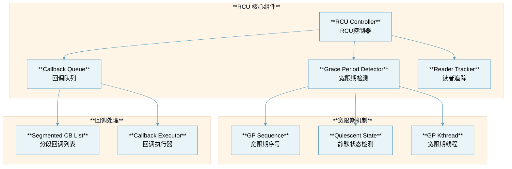
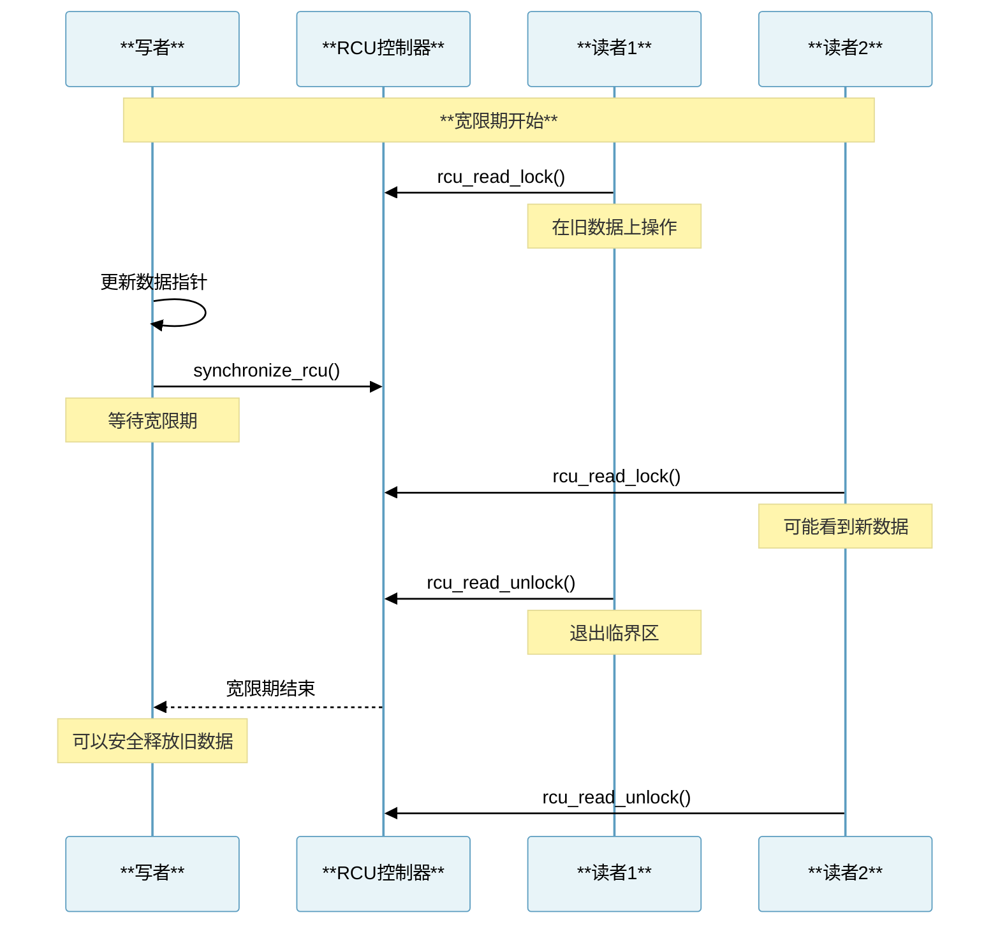
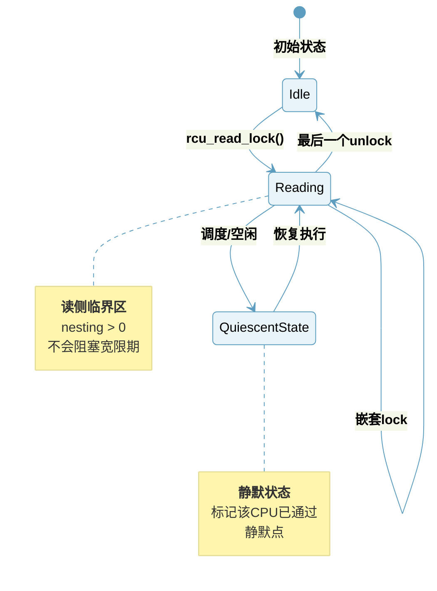
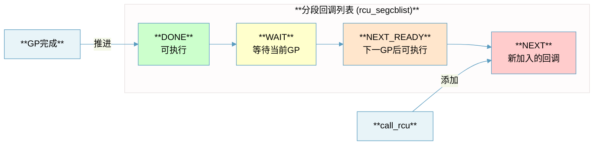
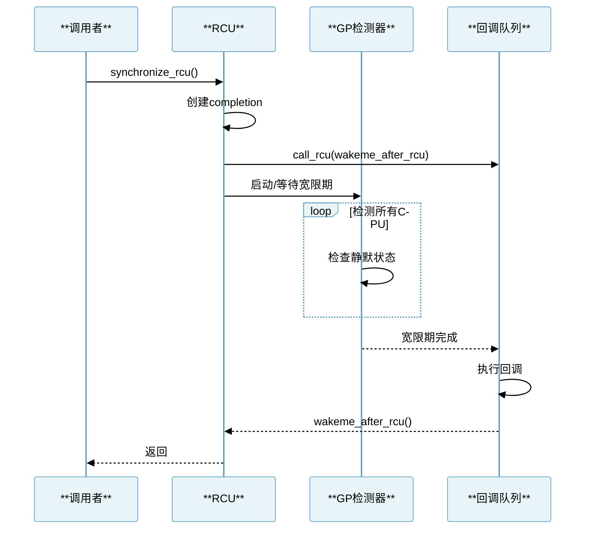
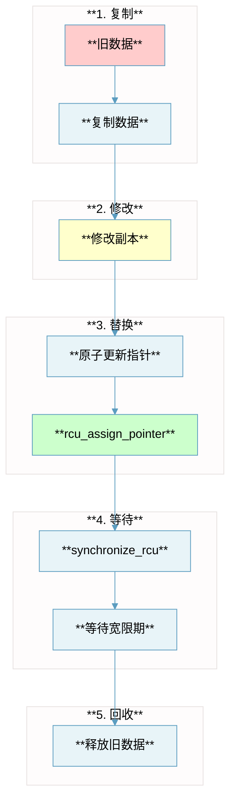

# RCU (Read-Copy-Update) 设计文档

## 概述

本项目参考 Linux 内核的 RCU (Read-Copy-Update) 机制，实现了一个 Golang 版本的 RCU 同步原语。RCU 是一种高效的读多写少场景下的同步机制，允许读操作无锁进行，写操作通过延迟回收实现安全更新。

## RCU 核心概念

### 什么是 RCU？

RCU 是一种同步机制，其核心思想是：
1. **读操作无锁**：读者可以无锁访问共享数据
2. **写时复制**：更新者先复制数据，修改副本，然后原子替换指针
3. **延迟回收**：旧数据在所有读者完成访问后才释放

### Linux RCU 核心 API

| **API** | **功能** | **本框架对应** |
|:---|:---|:---|
| `rcu_read_lock()` | 进入读侧临界区 | `RCU.ReadLock()` |
| `rcu_read_unlock()` | 退出读侧临界区 | `RCU.ReadUnlock()` |
| `synchronize_rcu()` | 等待宽限期结束 | `RCU.Synchronize()` |
| `call_rcu()` | 注册延迟回调 | `RCU.CallRCU()` |
| `rcu_dereference()` | 安全读取指针 | `RCU.Dereference()` |
| `rcu_assign_pointer()` | 安全更新指针 | `RCU.AssignPointer()` |

## 架构设计



## 宽限期 (Grace Period) 机制

### 核心原理

宽限期是 RCU 的核心概念。一个宽限期结束意味着所有在该宽限期开始之前进入读侧临界区的读者都已退出。



### 宽限期序号 (GP Sequence)

参考 Linux 内核 `kernel/rcu/tree.c`：

```go
// 宽限期序号结构
// 参考: rcu_state.gp_seq
type GPSequence struct {
    seq uint64  // 序号，每完成一个宽限期 +2
}

const (
    RCU_SEQ_CTR_SHIFT = 2  // 低2位用于状态标记
    RCU_SEQ_STATE_MASK = 0x3
)

// 获取宽限期序号
func (gp *GPSequence) Get() uint64 {
    return atomic.LoadUint64(&gp.seq)
}

// 推进宽限期
func (gp *GPSequence) Advance() {
    atomic.AddUint64(&gp.seq, 1 << RCU_SEQ_CTR_SHIFT)
}
```

## 读侧临界区



### 读者计数实现

参考 `kernel/rcu/tree_plugin.h`:

```go
// 参考: current->rcu_read_lock_nesting
type ReaderState struct {
    nesting int32  // 嵌套计数
    special uint32 // 特殊标记
}

// rcu_read_lock 实现
func (r *ReaderState) ReadLock() {
    atomic.AddInt32(&r.nesting, 1)
    // 内存屏障确保临界区代码在lock之后
    runtime.Gosched() // 类似于 barrier()
}

// rcu_read_unlock 实现
func (r *ReaderState) ReadUnlock() {
    if atomic.AddInt32(&r.nesting, -1) == 0 {
        // 最外层unlock，检查是否需要特殊处理
        if atomic.LoadUint32(&r.special) != 0 {
            r.handleSpecial()
        }
    }
}
```

## 回调机制

### 分段回调列表

Linux RCU 使用分段回调列表来管理不同宽限期的回调：



### call_rcu 实现

参考 `kernel/rcu/tree.c`:

```go
// RCU回调头
type RCUHead struct {
    next *RCUHead
    fn   func(head *RCUHead)
}

// call_rcu 实现
func (rcu *RCU) CallRCU(head *RCUHead, fn func(*RCUHead)) {
    head.fn = fn
    head.next = nil
    
    rcu.mu.Lock()
    // 添加到回调列表尾部
    rcu.cbList.Enqueue(head)
    rcu.mu.Unlock()
    
    // 如果需要，启动宽限期
    rcu.maybeStartGP()
}
```

## synchronize_rcu 实现



## 核心接口设计

### RCU 接口

```go
// RCU provides Read-Copy-Update synchronization
type RCU interface {
    // ReadLock enters RCU read-side critical section
    ReadLock()
    
    // ReadUnlock exits RCU read-side critical section
    ReadUnlock()
    
    // Synchronize waits for a grace period to elapse
    Synchronize()
    
    // CallRCU queues a callback for invocation after a grace period
    CallRCU(head *RCUHead, fn func(*RCUHead))
    
    // Start starts the RCU subsystem
    Start()
    
    // Stop stops the RCU subsystem
    Stop()
}
```

### 安全指针操作

```go
// RCU protected pointer operations
// 这些操作确保正确的内存顺序

// Dereference safely reads an RCU-protected pointer
// 必须在 rcu_read_lock/unlock 之间调用
func Dereference[T any](pp **T) *T {
    // 在Go中，atomic.LoadPointer 提供必要的内存屏障
    return (*T)(atomic.LoadPointer((*unsafe.Pointer)(unsafe.Pointer(pp))))
}

// AssignPointer safely updates an RCU-protected pointer
func AssignPointer[T any](pp **T, p *T) {
    // 确保新数据的所有写入在指针更新前完成
    atomic.StorePointer((*unsafe.Pointer)(unsafe.Pointer(pp)), unsafe.Pointer(p))
}
```

## 数据结构更新模式

### 典型的 RCU 更新流程



## 文件结构

```
rcu/
├── README.md              # 本设计文档
├── rcu.go                 # RCU核心实现
├── grace_period.go        # 宽限期检测
├── callback.go            # 回调队列管理
├── reader.go              # 读者状态追踪
├── pointer.go             # 安全指针操作
├── rcu_test.go            # 测试代码
└── example/
    └── main.go            # 使用示例
```

## 与传统锁的对比

| **特性** | **RCU** | **读写锁 (RWMutex)** |
|:---|:---|:---|
| **读操作开销** | 极低（无锁） | 需要获取锁 |
| **写操作开销** | 需要复制+等待 | 需要获取锁 |
| **读者可扩展性** | 极佳 | 受锁竞争限制 |
| **内存开销** | 延迟释放 | 无额外开销 |
| **适用场景** | 读多写少 | 通用 |
| **实时性** | 读操作可确定性 | 可能阻塞 |

## 使用示例

```go
package main

import (
    "fmt"
    "sync"
    
    "rcu"
)

type Data struct {
    Value int
}

func main() {
    r := rcu.New()
    r.Start()
    defer r.Stop()
    
    var dataPtr *Data
    rcu.AssignPointer(&dataPtr, &Data{Value: 1})
    
    var wg sync.WaitGroup
    
    // 读者
    for i := 0; i < 10; i++ {
        wg.Add(1)
        go func() {
            defer wg.Done()
            r.ReadLock()
            defer r.ReadUnlock()
            
            p := rcu.Dereference(&dataPtr)
            if p != nil {
                fmt.Println("Read:", p.Value)
            }
        }()
    }
    
    // 写者
    wg.Add(1)
    go func() {
        defer wg.Done()
        
        // 复制-修改-替换
        oldPtr := rcu.Dereference(&dataPtr)
        newData := &Data{Value: oldPtr.Value + 1}
        rcu.AssignPointer(&dataPtr, newData)
        
        // 等待宽限期后释放旧数据
        r.Synchronize()
        // oldPtr 现在可以安全释放
    }()
    
    wg.Wait()
}
```

## 性能特点

| **操作** | **时间复杂度** | **说明** |
|:---|:---|:---|
| `ReadLock` | O(1) | 仅增加计数器 |
| `ReadUnlock` | O(1) | 仅减少计数器 |
| `Synchronize` | O(宽限期时间) | 需要等待所有读者 |
| `CallRCU` | O(1) | 仅入队回调 |

## 参考资料

1. Linux Kernel Source Code - `kernel/rcu/`
2. Paul E. McKenney - "What is RCU, Fundamentally?"
3. Linux Kernel Documentation - `Documentation/RCU/`
4. "Is Parallel Programming Hard?" - Paul McKenney

