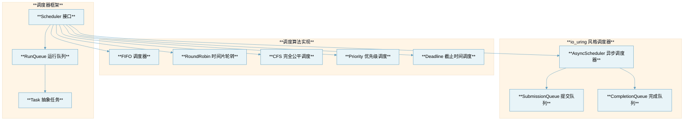
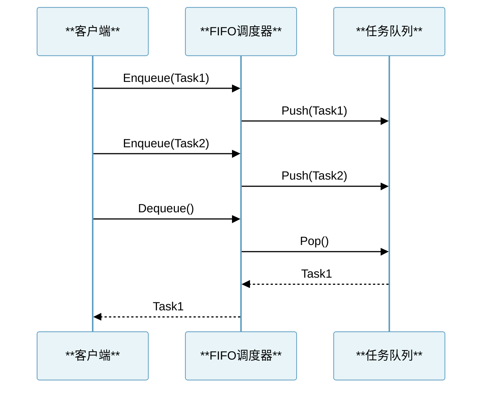
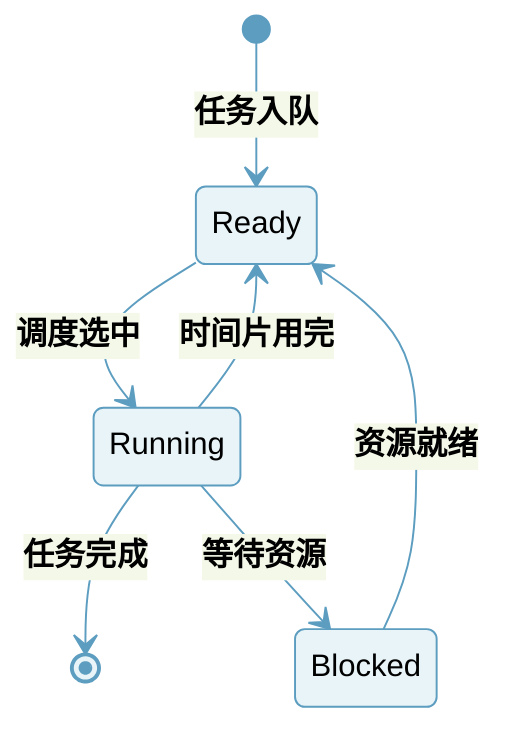
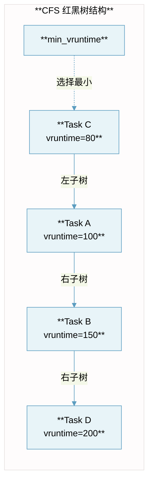
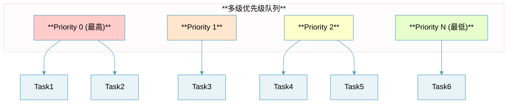
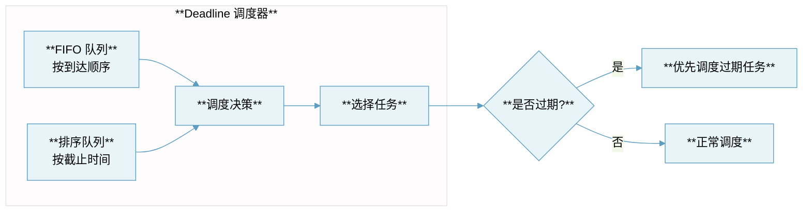
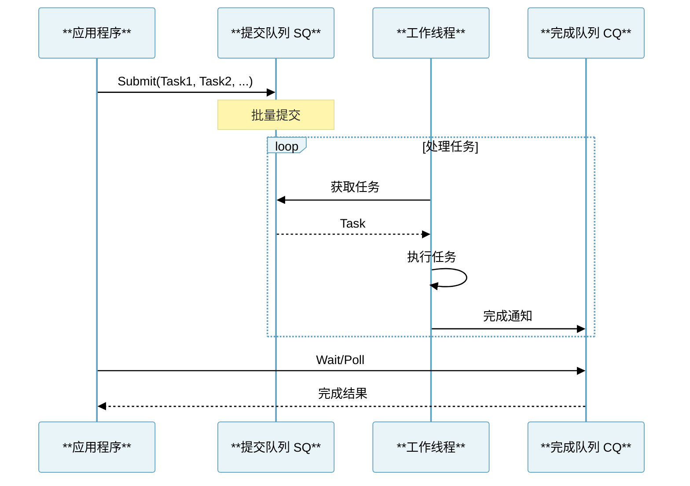

# 抽象资源调度器设计文档

## 概述

本项目参考 Linux 内核中的 CPU、IO 调度算法以及 io_uring 机制，实现了一套通用的抽象资源调度框架。该框架可以用于任何需要资源调度的场景，如任务调度、连接池管理、请求处理等。

## 设计思想来源

### 1. Linux CPU 调度算法

Linux 内核提供了多种 CPU 调度策略：

| **调度策略** | **特点** | **适用场景** |
|:---|:---|:---|
| **SCHED_FIFO** | 先进先出，无时间片限制 | 实时任务 |
| **SCHED_RR** | 时间片轮转 | 实时任务，需要公平性 |
| **CFS** | 完全公平调度，基于虚拟运行时间 | 普通任务 |
| **SCHED_DEADLINE** | 基于截止时间的调度 | 硬实时任务 |

### 2. Linux IO 调度算法

| **调度算法** | **特点** | **适用场景** |
|:---|:---|:---|
| **mq-deadline** | 基于截止时间，读写分离 | 通用 HDD/SSD |
| **Kyber** | 低延迟，自适应队列深度 | 高速 NVMe 设备 |
| **BFQ** | 带宽公平，低延迟 | 桌面交互场景 |

### 3. io_uring 异步机制

io_uring 使用提交队列(SQ)和完成队列(CQ)的环形缓冲区设计，支持批量提交和轮询模式。

## 架构设计



## 核心接口设计

### Task 接口

```go
type Task interface {
    ID() string                    // 任务唯一标识
    Priority() int                 // 优先级 (数值越小优先级越高)
    Deadline() time.Time           // 截止时间
    Weight() uint64                // 权重 (用于公平调度)
    Execute(ctx context.Context) error  // 执行任务
}
```

### Scheduler 接口

```go
type Scheduler interface {
    Name() string                     // 调度器名称
    Enqueue(task Task) error          // 入队任务
    Dequeue() (Task, error)           // 出队任务
    Pick() (Task, error)              // 选择下一个任务
    Len() int                         // 队列长度
    Start(ctx context.Context) error  // 启动调度器
    Stop() error                      // 停止调度器
}
```

## 调度算法详解

### 1. FIFO 调度器

**原理**: 先进先出队列，最先入队的任务最先被调度。



**特点**:
- 简单高效
- 无饥饿问题（按入队顺序）
- 不支持优先级

### 2. 时间片轮转调度器 (Round Robin)

**原理**: 参考 Linux `SCHED_RR` 策略，每个任务分配固定时间片，时间片用完后放到队列尾部。



**核心代码逻辑** (参考 Linux `kernel/sched/rt.c`):
```go
func (s *RoundRobinScheduler) tick() {
    s.mu.Lock()
    defer s.mu.Unlock()
    
    if s.current != nil {
        s.current.timeSlice--
        if s.current.timeSlice <= 0 {
            // 时间片用完，重新入队
            s.current.timeSlice = s.timeSlice
            s.queue.PushBack(s.current)
            s.current = nil
            s.reschedule()
        }
    }
}
```

### 3. 完全公平调度器 (CFS)

**原理**: 参考 Linux CFS，使用虚拟运行时间(vruntime)实现公平调度。权重越高的任务，vruntime增长越慢。



**vruntime 计算公式** (参考 `kernel/sched/fair.c`):
```
vruntime += delta_exec * NICE_0_LOAD / weight
```

### 4. 优先级调度器

**原理**: 参考 Linux 实时调度器，维护多个优先级队列，优先调度高优先级任务。



### 5. Deadline 调度器

**原理**: 参考 Linux `mq-deadline` IO 调度器，按截止时间排序，优先调度即将到期的任务。



### 6. io_uring 风格异步调度器

**原理**: 参考 io_uring 的提交队列(SQ)和完成队列(CQ)设计，实现高效的异步任务调度。



**环形缓冲区设计**:


## 文件结构

```
scheduler/
├── README.md              # 本设计文档
├── task.go                # Task 接口定义
├── scheduler.go           # Scheduler 接口定义
├── fifo.go                # FIFO 调度器实现
├── roundrobin.go          # 时间片轮转调度器
├── cfs.go                 # CFS 完全公平调度器
├── priority.go            # 优先级调度器
├── deadline.go            # Deadline 调度器
├── async.go               # io_uring 风格异步调度器
├── scheduler_test.go      # 测试代码
└── example/
    └── main.go            # 使用示例
```

## 性能对比

| **调度器** | **时间复杂度 (入队)** | **时间复杂度 (出队)** | **适用场景** |
|:---|:---|:---|:---|
| **FIFO** | O(1) | O(1) | 简单任务队列 |
| **RoundRobin** | O(1) | O(1) | 需要公平性的任务 |
| **CFS** | O(log n) | O(log n) | 需要权重公平的任务 |
| **Priority** | O(1) | O(1) | 有优先级区分的任务 |
| **Deadline** | O(log n) | O(log n) | 有时间约束的任务 |
| **Async** | O(1) | O(1) | 高并发异步任务 |

## 使用示例

```go
package main

import (
    "context"
    "fmt"
    "time"
    
    "scheduler"
)

func main() {
    // 创建时间片轮转调度器
    sched := scheduler.NewRoundRobinScheduler(
        scheduler.WithTimeSlice(100 * time.Millisecond),
        scheduler.WithWorkers(4),
    )
    
    // 添加任务
    for i := 0; i < 10; i++ {
        task := scheduler.NewSimpleTask(
            fmt.Sprintf("task-%d", i),
            func(ctx context.Context) error {
                // 任务逻辑
                return nil
            },
        )
        sched.Enqueue(task)
    }
    
    // 启动调度器
    ctx, cancel := context.WithTimeout(context.Background(), 10*time.Second)
    defer cancel()
    
    sched.Start(ctx)
}
```

## 参考资料

1. Linux Kernel Source Code - `kernel/sched/`
2. Linux Kernel Source Code - `block/mq-deadline.c`
3. Linux Kernel Source Code - `io_uring/`
4. Understanding the Linux Kernel - Chapter 7: Process Scheduling
5. Linux Kernel Development - Robert Love

