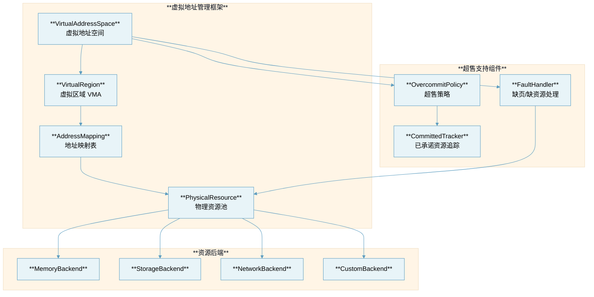
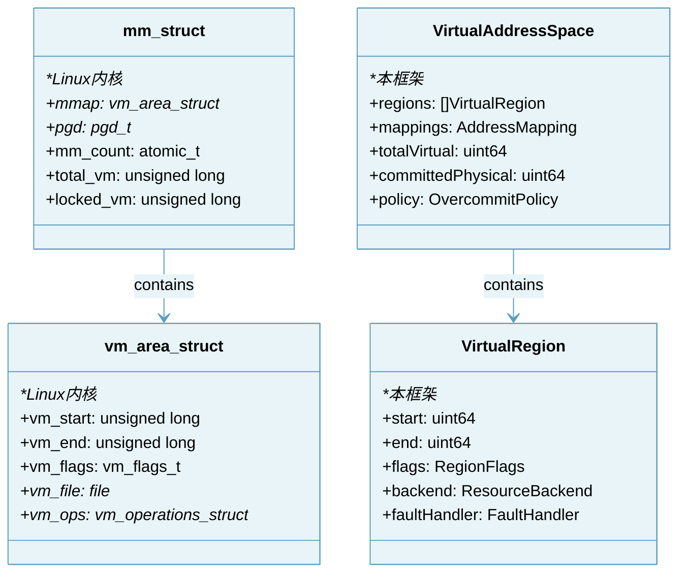
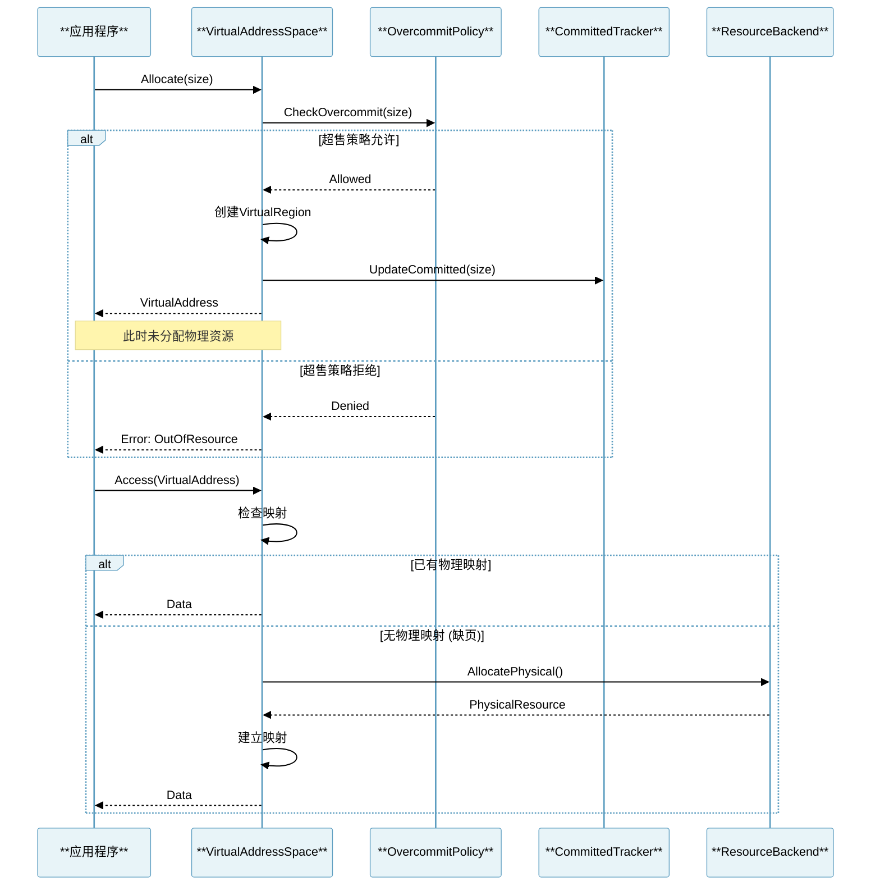
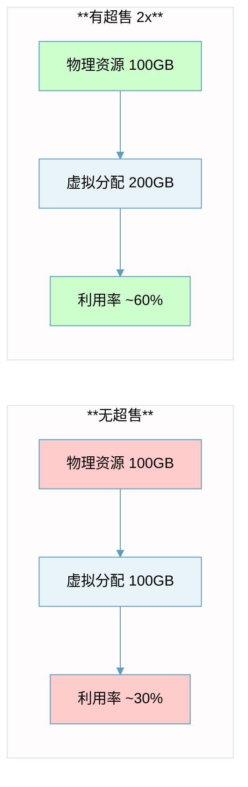
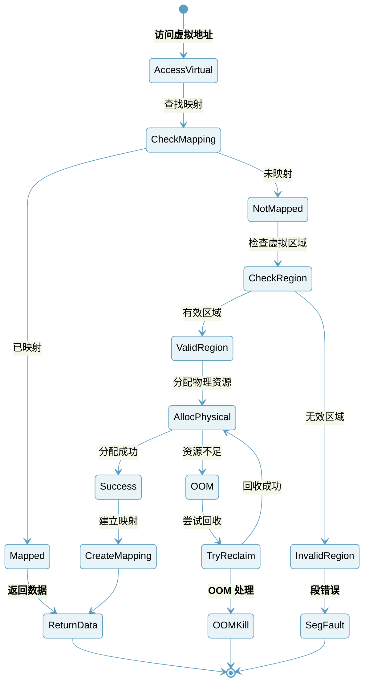
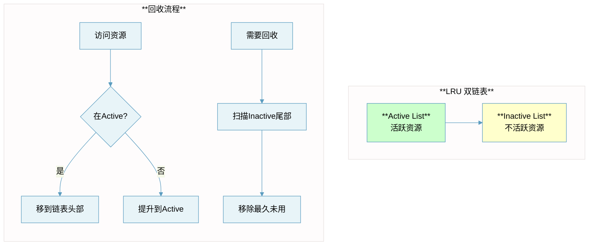

# 抽象资源虚拟地址管理设计文档

## 概述

本项目参考 Linux 内核的虚拟内存管理机制，实现了一套抽象资源的虚拟地址管理框架。该框架支持资源超售（Overcommit），通过延迟分配（Lazy Allocation）和按需分配（Demand Allocation）机制，实现资源的高效利用。

## 设计思想来源

### Linux 虚拟内存管理核心概念

| **概念** | **说明** | **本框架对应** |
|:---|:---|:---|
| **虚拟地址空间** | 进程看到的连续地址空间 | VirtualAddressSpace |
| **VMA** | 虚拟内存区域 | VirtualRegion |
| **物理页面** | 实际分配的内存 | PhysicalResource |
| **页表** | 虚拟到物理的映射 | AddressMapping |
| **缺页中断** | 访问未映射页面时触发 | PageFault/ResourceFault |
| **Overcommit** | 允许申请超过物理内存的虚拟内存 | OvercommitPolicy |

### Overcommit 策略

Linux 支持三种内存超售策略（参考 `mm/util.c`）：

| **策略** | **值** | **说明** |
|:---|:---|:---|
| **OVERCOMMIT_GUESS** | 0 | 启发式超售，根据可用资源判断 |
| **OVERCOMMIT_ALWAYS** | 1 | 总是允许超售 |
| **OVERCOMMIT_NEVER** | 2 | 不允许超售，严格按物理资源分配 |

## 架构设计



## 核心数据结构

### 参考 Linux 内核结构



## 虚拟地址分配流程



## 超售机制详解

### 超售原理

超售允许系统承诺分配超过实际物理资源的虚拟资源。这是基于以下观察：
1. 大多数应用不会同时使用所有分配的资源
2. 延迟分配可以提高资源利用率
3. 部分资源可以被交换或压缩



### 超售策略实现

```go
type OvercommitPolicy int

const (
    // OVERCOMMIT_GUESS: 启发式超售
    // 参考 Linux sysctl_overcommit_memory = 0
    OvercommitGuess OvercommitPolicy = iota
    
    // OVERCOMMIT_ALWAYS: 总是允许超售
    // 参考 Linux sysctl_overcommit_memory = 1
    OvercommitAlways
    
    // OVERCOMMIT_NEVER: 不允许超售
    // 参考 Linux sysctl_overcommit_memory = 2
    OvercommitNever
)
```

### 资源提交限制计算

参考 Linux `vm_commit_limit()` 函数：

```go
func (vas *VirtualAddressSpace) CommitLimit() uint64 {
    if vas.overcommitKBytes > 0 {
        return vas.overcommitKBytes
    }
    // 物理资源 * 超售比例 + 可交换资源
    return vas.physicalTotal * vas.overcommitRatio / 100 + vas.swapTotal
}
```

## 缺页/缺资源处理

当访问未映射的虚拟地址时，触发类似于 Linux 缺页中断的处理流程：



## 核心接口设计

### VirtualAddressSpace 接口

```go
type VirtualAddressSpace interface {
    // Allocate 分配虚拟地址空间（不分配物理资源）
    Allocate(size uint64, opts ...AllocOption) (VirtualAddress, error)
    
    // Free 释放虚拟地址空间
    Free(addr VirtualAddress) error
    
    // Map 建立虚拟到物理的映射
    Map(vaddr VirtualAddress, paddr PhysicalAddress) error
    
    // Unmap 解除映射
    Unmap(vaddr VirtualAddress) error
    
    // Access 访问虚拟地址（可能触发缺页）
    Access(vaddr VirtualAddress) ([]byte, error)
    
    // Write 写入虚拟地址
    Write(vaddr VirtualAddress, data []byte) error
    
    // Stats 获取统计信息
    Stats() VASStats
}
```

### ResourceBackend 接口

```go
type ResourceBackend interface {
    // Name 后端名称
    Name() string
    
    // TotalCapacity 总容量
    TotalCapacity() uint64
    
    // AvailableCapacity 可用容量
    AvailableCapacity() uint64
    
    // Allocate 分配物理资源
    Allocate(size uint64) (PhysicalAddress, error)
    
    // Free 释放物理资源
    Free(paddr PhysicalAddress) error
    
    // Read 读取数据
    Read(paddr PhysicalAddress, offset, size uint64) ([]byte, error)
    
    // Write 写入数据
    Write(paddr PhysicalAddress, offset uint64, data []byte) error
}
```

## 文件结构

```
vam/
├── README.md              # 本设计文档
├── types.go               # 基础类型定义
├── vas.go                 # VirtualAddressSpace 实现
├── region.go              # VirtualRegion 实现
├── mapping.go             # 地址映射表实现
├── overcommit.go          # 超售策略实现
├── fault.go               # 缺页/缺资源处理
├── backend.go             # 资源后端接口
├── memory_backend.go      # 内存后端实现
├── vam_test.go            # 测试代码
└── example/
    └── main.go            # 使用示例
```

## 页面替换策略（资源回收）

当物理资源不足时，需要选择资源进行回收。参考 Linux 的 LRU 算法：



## 性能优化

| **优化技术** | **Linux 实现** | **本框架实现** |
|:---|:---|:---|
| **延迟分配** | Demand paging | LazyAllocation |
| **写时复制** | Copy-on-Write | COW support |
| **零页共享** | Zero page | SharedZeroResource |
| **大页支持** | Huge pages | LargeResourceUnit |
| **NUMA感知** | NUMA balancing | TopologyAware |

## 使用示例

```go
package main

import (
    "fmt"
    "vam"
)

func main() {
    // 创建虚拟地址空间，允许2倍超售
    vas := vam.NewVirtualAddressSpace(
        vam.WithOvercommitRatio(200),          // 200% 超售
        vam.WithOvercommitPolicy(vam.OvercommitGuess),
        vam.WithBackend(vam.NewMemoryBackend(1 * vam.GB)),
    )
    
    // 分配1GB虚拟空间（物理资源可能只有512MB）
    vaddr, err := vas.Allocate(1 * vam.GB)
    if err != nil {
        panic(err)
    }
    
    // 访问时才真正分配物理资源
    data, err := vas.Access(vaddr)
    if err != nil {
        // 可能是OOM
        panic(err)
    }
    
    // 写入数据
    err = vas.Write(vaddr, []byte("Hello, Virtual Memory!"))
    if err != nil {
        panic(err)
    }
    
    // 获取统计信息
    stats := vas.Stats()
    fmt.Printf("Virtual: %d, Physical: %d, Ratio: %.2f%%\n",
        stats.TotalVirtual, stats.TotalPhysical,
        float64(stats.TotalPhysical)/float64(stats.TotalVirtual)*100)
    
    // 释放
    vas.Free(vaddr)
}
```

## 参考资料

1. Linux Kernel Source Code - `mm/memory.c` - 缺页处理
2. Linux Kernel Source Code - `mm/mmap.c` - VMA 管理
3. Linux Kernel Source Code - `mm/util.c` - Overcommit 策略
4. Linux Kernel Source Code - `include/linux/mm_types.h` - 核心数据结构
5. Understanding the Linux Virtual Memory Manager - Mel Gorman
6. Linux Kernel Development - Robert Love

