# DPDK数据平面开发工具包深度解析

## 目录

1. [概述](#概述)
2. [DPDK架构](#DPDK架构)
3. [核心原理](#核心原理)
4. [主要模块](#主要模块)
5. [性能优化技术](#性能优化技术)
6. [使用场景](#使用场景)
7. [总结](#总结)

## 概述

DPDK（Data Plane Development Kit）是Intel开发的一套数据平面开发工具包和库，专为高性能网络应用而设计。它通过绕过内核网络栈，直接在用户空间进行数据包处理，能够实现线速（Wire Speed）的数据包转发和处理。

### 核心设计目标

1. **极高性能**：实现线速数据包处理，最大化吞吐量
2. **低延迟**：绕过内核，减少上下文切换和中断开销
3. **扩展性**：支持多核并行处理和NUMA架构
4. **灵活性**：提供丰富的API和抽象层
5. **可移植性**：支持多种硬件平台和操作系统

## DPDK架构

### **整体架构图**

```c
// DPDK整体架构设计 - lib/eal/
/*
 * DPDK架构层次结构：
 * 
 * ┌─────────────────────────────────────────────────────────┐
 * │                    应用程序层                            │
 * │   (L2/L3转发、负载均衡、防火墙、VPN网关等)              │
 * └─────────────────┬───────────────────────────────────────┘
 *                   │
 * ┌─────────────────▼───────────────────────────────────────┐
 * │                DPDK库和框架层                            │
 * │ ┌─────────────┐ ┌─────────────┐ ┌─────────────────────┐ │
 * │ │    PMD      │ │    Rings    │ │      Pipeline       │ │
 * │ │ (轮询模式驱动) │ │  (环形缓冲) │ │     (数据流水线)    │ │
 * │ └─────────────┘ └─────────────┘ └─────────────────────┘ │
 * │ ┌─────────────┐ ┌─────────────┐ ┌─────────────────────┐ │
 * │ │    Mbuf     │ │  Hash/LPM   │ │       Timer         │ │
 * │ │  (数据包缓冲) │ │ (查找算法)  │ │     (定时器)        │ │
 * │ └─────────────┘ └─────────────┘ └─────────────────────┘ │
 * └─────────────────┬───────────────────────────────────────┘
 *                   │
 * ┌─────────────────▼───────────────────────────────────────┐
 * │               EAL层 (Environment Abstraction Layer)      │
 * │ ┌─────────────┐ ┌─────────────┐ ┌─────────────────────┐ │
 * │ │  CPU核心    │ │   内存池    │ │       PCI           │ │
 * │ │   绑定      │ │   管理      │ │      扫描           │ │
 * │ └─────────────┘ └─────────────┘ └─────────────────────┘ │
 * │ ┌─────────────┐ ┌─────────────┐ ┌─────────────────────┐ │
 * │ │   中断      │ │   NUMA      │ │      日志           │ │
 * │ │   处理      │ │   拓扑      │ │      系统           │ │
 * │ └─────────────┘ └─────────────┘ └─────────────────────┘ │
 * └─────────────────┬───────────────────────────────────────┘
 *                   │
 * ┌─────────────────▼───────────────────────────────────────┐
 * │                硬件抽象层                                 │
 * │        网卡、CPU、内存、加密卡等硬件资源                 │
 * └─────────────────────────────────────────────────────────┘
 */

// EAL核心结构 - lib/eal/include/rte_eal.h
struct rte_config {
    uint32_t master_lcore;           // 主逻辑核心
    uint32_t lcore_count;            // 逻辑核心数量
    uint32_t numa_node_count;        // NUMA节点数量
    uint32_t service_lcore_count;    // 服务核心数量
    
    rte_usage_hook_t rte_usage_hook; // 使用统计钩子
    rte_eal_cleanup_hook cleanup_fn; // 清理函数钩子
    
    struct rte_mem_config *mem_config; // 内存配置
    
    /* 每核配置 */
    struct lcore_config lcore_config[RTE_MAX_LCORE];
    
    /* DPDK版本 */
    union {
        uint64_t subbrand;
        struct {
            uint32_t subrel;
            uint16_t majrel;
            uint16_t minrel;
        };
    } version;
};

// 逻辑核心配置结构 - lib/eal/include/rte_lcore.h  
struct lcore_config {
    unsigned int detected;         // 核心是否检测到
    pthread_t thread_id;          // 线程ID
    int pipe_master2slave[2];     // 主从通信管道
    int pipe_slave2master[2];     // 从主通信管道
    lcore_function_t *f;          // 核心执行函数
    void *arg;                    // 函数参数
    volatile int ret;             // 返回值
    volatile enum rte_lcore_state_t state; // 核心状态
    unsigned int socket_id;       // NUMA套接字ID
    unsigned int core_id;         // 物理核心ID
    int core_index;               // 核心索引
    rte_cpuset_t cpuset;          // CPU集合
    uint8_t core_role;            // 核心角色
};
```

### **核心组件架构**

```c
// DPDK核心组件交互图 - 各核心库头文件
/*
 * 组件交互关系：
 * 
 * ┌─────────────────────────────────────────────────┐
 * │                 DPDK应用程序                     │
 * └─────────────┬──────────────┬────────────────────┘
 *               │              │
 * ┌─────────────▼──────────────▼────────────────────┐
 * │                   DPDK API                      │
 * └─┬─────────┬─────────┬─────────┬─────────────────┘
 *   │         │         │         │
 *   ▼         ▼         ▼         ▼
 * ┌────┐   ┌────┐   ┌────────┐  ┌────────┐
 * │PMD │   │Ring│   │ Hash/  │  │ Mbuf   │
 * │轮询│   │环形│   │ LPM    │  │数据包  │
 * │驱动│   │缓冲│   │ 查找   │  │管理    │
 * └─┬──┘   └─┬──┘   └───┬────┘  └───┬────┘
 *   │        │          │           │
 *   └────────┼──────────┼───────────┘
 *            │          │
 * ┌──────────▼──────────▼───────────────────────────┐
 * │                    EAL                          │
 * │  (Environment Abstraction Layer)                │
 * └─────────────────────┬───────────────────────────┘
 *                       │
 * ┌─────────────────────▼───────────────────────────┐
 * │              硬件资源层                          │
 * │   CPU、内存、网卡、加密卡、存储设备             │
 * └─────────────────────────────────────────────────┘
 */

// PMD驱动接口结构 - lib/ethdev/rte_ethdev.h
struct rte_eth_dev_ops {
    eth_dev_configure_t        dev_configure;   // 设备配置
    eth_dev_start_t            dev_start;       // 设备启动
    eth_dev_stop_t             dev_stop;        // 设备停止
    eth_dev_set_link_up_t      dev_set_link_up; // 链路设置
    eth_dev_set_link_down_t    dev_set_link_down; // 链路关闭
    eth_dev_close_t            dev_close;       // 设备关闭
    eth_dev_reset_t            dev_reset;       // 设备重置
    
    eth_promiscuous_enable_t   promiscuous_enable;  // 混杂模式启用
    eth_promiscuous_disable_t  promiscuous_disable; // 混杂模式禁用
    eth_allmulticast_enable_t  allmulticast_enable; // 组播启用
    eth_allmulticast_disable_t allmulticast_disable;// 组播禁用
    
    eth_link_update_t          link_update;     // 链路状态更新
    eth_stats_get_t            stats_get;       // 统计获取
    eth_stats_reset_t          stats_reset;     // 统计重置
    eth_xstats_get_t           xstats_get;      // 扩展统计获取
    eth_xstats_reset_t         xstats_reset;    // 扩展统计重置
    
    eth_queue_stats_mapping_set_t queue_stats_mapping_set; // 队列统计映射
    
    eth_dev_infos_get_t        dev_infos_get;   // 设备信息获取
    eth_rxq_info_get_t         rxq_info_get;    // 接收队列信息
    eth_txq_info_get_t         txq_info_get;    // 发送队列信息
    
    eth_rx_queue_setup_t       rx_queue_setup;     // 接收队列设置
    eth_rx_queue_release_t     rx_queue_release;   // 接收队列释放
    eth_rx_queue_start_t       rx_queue_start;     // 接收队列启动
    eth_rx_queue_stop_t        rx_queue_stop;      // 接收队列停止
    
    eth_tx_queue_setup_t       tx_queue_setup;     // 发送队列设置
    eth_tx_queue_release_t     tx_queue_release;   // 发送队列释放
    eth_tx_queue_start_t       tx_queue_start;     // 发送队列启动
    eth_tx_queue_stop_t        tx_queue_stop;      // 发送队列停止
    
    eth_rx_enable_intr_t       rx_queue_intr_enable;  // 接收中断启用
    eth_rx_disable_intr_t      rx_queue_intr_disable; // 接收中断禁用
    
    eth_mac_addr_remove_t      mac_addr_remove;  // MAC地址移除
    eth_mac_addr_add_t         mac_addr_add;     // MAC地址添加
    eth_mac_addr_set_t         mac_addr_set;     // MAC地址设置
    eth_set_mc_addr_list_t     set_mc_addr_list; // 组播地址列表设置
    
    eth_reta_update_t          reta_update;      // RSS重定向表更新
    eth_reta_query_t           reta_query;       // RSS重定向表查询
    eth_rss_hash_update_t      rss_hash_update;  // RSS哈希更新
    eth_rss_hash_conf_get_t    rss_hash_conf_get;// RSS哈希配置获取
    
    eth_filter_ctrl_t          filter_ctrl;     // 过滤器控制
    
    eth_get_reg_t              get_reg;         // 寄存器获取
    eth_get_eeprom_length_t    get_eeprom_length; // EEPROM长度获取
    eth_get_eeprom_t           get_eeprom;      // EEPROM获取
    eth_set_eeprom_t           set_eeprom;      // EEPROM设置
    
    eth_get_module_info_t      get_module_info; // 模块信息获取
    eth_get_module_eeprom_t    get_module_eeprom; // 模块EEPROM获取
};

// 以太网设备结构 - lib/ethdev/rte_ethdev_core.h  
struct rte_eth_dev {
    eth_rx_burst_t rx_pkt_burst;  // 接收突发函数指针
    eth_tx_burst_t tx_pkt_burst;  // 发送突发函数指针
    eth_tx_prep_t tx_pkt_prepare; // 发送准备函数指针
    
    struct rte_eth_dev_data *data;  // 设备数据
    void *process_private;          // 进程私有数据
    const struct rte_eth_dev_ops *dev_ops; // 设备操作函数
    struct rte_device *device;      // 设备结构
    struct rte_intr_handle *intr_handle; // 中断处理句柄
    
    /* 用户应用回调函数 */
    struct rte_eth_dev_cb_list link_intr_cbs; // 链路中断回调
    struct rte_eth_dev_cb_list queue_state_cbs; // 队列状态回调
    
    /* 设备状态 */
    enum rte_eth_dev_state state;   // 设备状态
    void *security_ctx;             // 安全上下文
    
    uint64_t reserved_64s[4];       // 预留字段
    void *reserved_ptrs[4];         // 预留指针
} __rte_cache_aligned;
```

## 核心原理

### **用户空间I/O模式**

DPDK的核心创新在于将网络数据包处理从内核空间移到用户空间，避免内核开销。

```c
// 用户空间I/O原理 - lib/ethdev/rte_ethdev.c
/*
 * 传统内核I/O vs DPDK用户空间I/O：
 * 
 * 传统模式：
 * ┌─────────────────┐    系统调用     ┌─────────────────┐
 * │   应用程序       │ ───────────→   │     内核        │
 * │   (用户空间)     │ ←─────────────   │   网络栈        │
 * └─────────────────┘    数据拷贝     └─────────────────┘
 *                                             │
 *                                             ▼
 *                                     ┌─────────────────┐
 *                                     │   网卡驱动      │
 *                                     │   (中断处理)    │
 *                                     └─────────────────┘
 * 
 * DPDK模式：
 * ┌─────────────────┐    直接访问     ┌─────────────────┐
 * │  DPDK应用       │ ───────────→   │     PMD         │
 * │  (用户空间)     │ ←─────────────   │  (轮询驱动)     │
 * └─────────────────┘    零拷贝       └─────────────────┘
 *                                             │
 *                                             ▼
 *                                     ┌─────────────────┐
 *                                     │     网卡        │
 *                                     │  (硬件队列)     │
 *                                     └─────────────────┘
 */

// PMD轮询模式驱动核心循环 - drivers/net/*/rte_*_ethdev.c
static inline uint16_t
rte_eth_rx_burst(uint16_t port_id, uint16_t queue_id,
                struct rte_mbuf **rx_pkts, const uint16_t nb_pkts)
{
    struct rte_eth_dev *dev = &rte_eth_devices[port_id];
    
    // 直接调用设备的接收函数，绕过内核
    return (*dev->rx_pkt_burst)(dev->data->rx_queues[queue_id],
                               rx_pkts, nb_pkts);
}

static inline uint16_t  
rte_eth_tx_burst(uint16_t port_id, uint16_t queue_id,
                struct rte_mbuf **tx_pkts, uint16_t nb_pkts)
{
    struct rte_eth_dev *dev = &rte_eth_devices[port_id];
    
    // 直接调用设备的发送函数，绕过内核
    return (*dev->tx_pkt_burst)(dev->data->tx_queues[queue_id],
                               tx_pkts, nb_pkts);
}

// 典型DPDK应用主循环
static int
main_loop(__attribute__((unused)) void *dummy)
{
    uint16_t nb_rx, nb_tx;
    uint16_t i, j, portid, queueid;
    struct rte_mbuf *pkts_burst[MAX_PKT_BURST];
    
    while (!force_quit) {
        // 轮询所有端口和队列
        for (portid = 0; portid < nb_ports; portid++) {
            for (queueid = 0; queueid < nb_rx_queue; queueid++) {
                
                // 接收数据包 (无阻塞轮询)
                nb_rx = rte_eth_rx_burst(portid, queueid,
                                        pkts_burst, MAX_PKT_BURST);
                
                if (nb_rx == 0)
                    continue;
                    
                // 处理数据包
                for (j = 0; j < nb_rx; j++) {
                    process_packet(pkts_burst[j]);
                }
                
                // 发送数据包
                nb_tx = rte_eth_tx_burst(portid, queueid,
                                        pkts_burst, nb_rx);
                
                // 释放未发送的数据包
                if (unlikely(nb_tx < nb_rx)) {
                    for (i = nb_tx; i < nb_rx; i++)
                        rte_pktmbuf_free(pkts_burst[i]);
                }
            }
        }
    }
    
    return 0;
}
```

### **内存管理架构**

DPDK使用hugepage和内存池技术实现高效内存管理。

```c
// DPDK内存管理 - lib/eal/common/eal_common_memory.c
/*
 * DPDK内存架构：
 * 
 * ┌─────────────────────────────────────────────────────────────┐
 * │                    DPDK内存空间                              │
 * │  ┌─────────────┐  ┌─────────────┐  ┌─────────────────────┐  │
 * │  │   内存池1   │  │   内存池2   │  │       ...           │  │
 * │  │ (mbuf pool) │  │(mempool)    │  │   (其他内存池)      │  │
 * │  └─────────────┘  └─────────────┘  └─────────────────────┘  │
 * └─────────────┬───────────────────────────────────────────────┘
 *               │
 * ┌─────────────▼───────────────────────────────────────────────┐
 * │                  Hugepage内存段                              │
 * │  ┌─────────────┐  ┌─────────────┐  ┌─────────────────────┐  │
 * │  │ 2MB Hugepage│  │ 1GB Hugepage│  │       ...           │  │
 * │  └─────────────┘  └─────────────┘  └─────────────────────┘  │
 * └─────────────────────────────────────────────────────────────┘
 */

// 内存段结构 - lib/eal/include/rte_memory.h
struct rte_memseg {
    rte_iova_t iova;            // I/O虚拟地址
    union {
        void *addr;             // 虚拟地址
        uint64_t addr_64;       // 64位地址
    };
    size_t len;                 // 段长度
    uint32_t hugepage_sz;       // hugepage大小
    int32_t socket_id;          // NUMA套接字ID
    uint32_t nchannel;          // 内存通道数
    uint32_t nrank;             // 内存rank数
    uint32_t flags;             // 标志位
} __rte_packed;

// 内存池结构 - lib/mempool/rte_mempool.h  
struct rte_mempool {
    char name[RTE_MEMPOOL_NAMESIZE]; // 内存池名称
    union {
        void *pool_data;             // 内存池数据指针
        uint64_t pool_id;            // 内存池ID
    };
    rte_iova_t pool_iova;           // 内存池I/O虚拟地址
    uint32_t elt_size;              // 元素大小
    uint32_t header_size;           // 头部大小
    uint32_t trailer_size;          // 尾部大小
    unsigned private_data_size;     // 私有数据大小
    
    int32_t ops_index;              // 操作索引
    
    struct rte_mempool_cache *local_cache; // 本地缓存
    
    uint32_t size;                  // 内存池大小
    uint32_t cache_size;            // 缓存大小
    uint32_t elt_size_aligned;      // 对齐元素大小
    uint32_t flags;                 // 标志位
    
    unsigned int socket_id;         // NUMA套接字ID
    
    uint32_t populated_size;        // 已填充大小
    struct rte_mempool_objhdr_list elt_list; // 元素列表
    uint32_t nb_mem_chunks;         // 内存块数量
    struct rte_mempool_memhdr_list mem_list; // 内存头列表
    
    /* 内存池操作 */
    struct rte_mempool_ops_table ops[RTE_MEMPOOL_MAX_OPS_IDX]; // 操作表
    
    /* 内存池统计 */
    struct rte_mempool_debug_stats stats[RTE_MAX_LCORE]; // 统计信息
} __rte_cache_aligned;

// Mbuf数据包缓冲区结构 - lib/mbuf/rte_mbuf.h
struct rte_mbuf {
    // 第一个64字节缓存行
    void *buf_addr;           // 缓冲区虚拟地址  
    rte_iova_t buf_iova;      // 缓冲区I/O虚拟地址
    
    uint16_t buf_len;         // 缓冲区长度
    uint16_t data_off;        // 数据偏移
    uint16_t refcnt;          // 引用计数
    uint8_t nb_segs;          // 段数量
    uint8_t port;             // 端口ID
    
    uint64_t ol_flags;        // 卸载标志
    
    // 第二个64字节缓存行  
    struct rte_mempool *pool; // 所属内存池
    struct rte_mbuf *next;    // 下一个mbuf
    
    union {
        struct {
            uint16_t data_len; // 数据长度
            uint16_t pkt_len;  // 数据包长度
        };
        uint32_t pkt_len_data_len; // 打包的长度字段
    };
    
    uint16_t vlan_tci;        // VLAN标签
    uint16_t vlan_tci_outer;  // 外层VLAN标签
    
    union {
        uint32_t rss;         // RSS哈希值
        struct {
            union {
                struct {
                    uint16_t hash;
                    uint16_t id;
                };
                uint32_t lo;  // 低32位
            };
            uint32_t hi;      // 高32位
        } fdir;               // Flow Director
        struct {
            uint32_t lo;
            uint32_t hi;
        } sched;              // 调度器
        uint32_t usr;         // 用户数据
    } hash;                   // 哈希联合体
    
    uint32_t seqn;            // 序列号
    uint16_t vport;           // 虚拟端口
    
    struct {
        uint32_t rsvd0;
        uint16_t rsvd1;
        uint16_t txq;         // 发送队列
    };
} __rte_cache_aligned;

// 内存池创建和管理
static struct rte_mempool *
create_pktmbuf_pool(const char *name, unsigned nb_mbuf,
                   unsigned cache_size, uint16_t priv_size,
                   uint16_t data_room_size, int socket_id)
{
    struct rte_mempool *mp;
    struct rte_pktmbuf_pool_private mbp_priv;
    const char *mp_ops_name = "ring_mp_mc";
    
    // 计算mbuf大小
    unsigned elt_size = sizeof(struct rte_mbuf) + priv_size + data_room_size;
    
    // 创建内存池
    mp = rte_mempool_create_empty(name, nb_mbuf, elt_size, cache_size,
                                 sizeof(struct rte_pktmbuf_pool_private),
                                 socket_id, 0);
    if (mp == NULL)
        return NULL;
        
    // 设置内存池操作
    if (rte_mempool_set_ops_byname(mp, mp_ops_name, NULL) != 0) {
        rte_mempool_free(mp);
        return NULL;
    }
    
    // 初始化私有数据
    mbp_priv.mbuf_data_room_size = data_room_size;
    mbp_priv.mbuf_priv_size = priv_size;
    rte_pktmbuf_pool_init(mp, &mbp_priv);
    
    // 填充内存池
    if (rte_mempool_populate_default(mp) < 0) {
        rte_mempool_free(mp);
        return NULL;
    }
    
    // 初始化每个mbuf对象
    rte_mempool_obj_iter(mp, rte_pktmbuf_init, NULL);
    
    return mp;
}
```

### **环形缓冲区机制**

DPDK使用无锁环形缓冲区实现高效的生产者-消费者模式。

```c
// 环形缓冲区实现 - lib/ring/rte_ring.h
/*
 * DPDK Ring环形缓冲区原理：
 * 
 *     head                    tail
 *      ↓                       ↓
 * ┌────┼───┬───┬───┬───┬───┬───┼───┬───┐
 * │    │ 1 │ 2 │ 3 │ 4 │ 5 │ 6 │   │   │
 * └────┴───┴───┴───┴───┴───┴───┴───┴───┘
 *      ↑                       ↑
 *   prod_head              cons_tail
 * 
 * 生产者操作：
 * 1. 更新prod_head指针
 * 2. 拷贝数据到环形缓冲区
 * 3. 更新prod_tail指针
 * 
 * 消费者操作：
 * 1. 更新cons_head指针  
 * 2. 从环形缓冲区读取数据
 * 3. 更新cons_tail指针
 */

// 环形缓冲区结构 - lib/ring/rte_ring_core.h
struct rte_ring {
    char name[RTE_RING_NAMESIZE];    // 环形缓冲区名称
    int flags;                       // 标志位
    const struct rte_memzone *memzone; // 内存区域
    
    uint32_t size;           // 环形缓冲区大小(必须是2的幂)
    uint32_t mask;           // 大小掩码 (size-1)
    uint32_t capacity;       // 容量 (size-1)
    
    /** Ring producer status. */
    RTE_CACHE_GUARD;
    struct rte_ring_headtail prod __rte_cache_aligned;
    
    /** Ring consumer status. */
    RTE_CACHE_GUARD;  
    struct rte_ring_headtail cons __rte_cache_aligned;
    
    RTE_CACHE_GUARD;
};

// 头尾指针结构
struct rte_ring_headtail {
    volatile uint32_t head;  // 头指针
    volatile uint32_t tail;  // 尾指针
    uint32_t single;         // 单生产者/消费者标志
};

// 入队操作(生产者)
static __rte_always_inline unsigned int
__rte_ring_do_enqueue(struct rte_ring *r, void * const *obj_table,
                     unsigned int n, enum rte_ring_queue_behavior behavior,
                     unsigned int is_sp, unsigned int *free_space)
{
    uint32_t prod_head, prod_next;
    uint32_t free_entries;
    
    // 移动生产者头指针
    do {
        prod_head = r->prod.head;
        prod_next = prod_head + n;
        
        // 计算空闲条目数
        free_entries = (r->capacity + r->cons.tail - prod_head);
        
        // 检查是否有足够空间
        if (unlikely(n > free_entries))
            return 0;
            
    } while (unlikely(rte_atomic32_cmpset(&r->prod.head,
                                         prod_head, prod_next) == 0));
    
    // 拷贝对象到环形缓冲区
    rte_ring_enqueue_bulk_objs(r, prod_head, obj_table, n);
    
    // 等待其他生产者完成
    while (unlikely(r->prod.tail != prod_head))
        rte_pause();
        
    // 更新生产者尾指针
    r->prod.tail = prod_next;
    
    if (free_space != NULL)
        *free_space = free_entries - n;
        
    return n;
}

// 出队操作(消费者)  
static __rte_always_inline unsigned int
__rte_ring_do_dequeue(struct rte_ring *r, void **obj_table,
                     unsigned int n, enum rte_ring_queue_behavior behavior,
                     unsigned int is_sc, unsigned int *available)
{
    uint32_t cons_head, cons_next;
    uint32_t entries;
    
    // 移动消费者头指针
    do {
        cons_head = r->cons.head;
        cons_next = cons_head + n;
        
        // 计算可用条目数
        entries = (r->prod.tail - cons_head);
        
        // 检查是否有足够数据
        if (unlikely(n > entries))
            return 0;
            
    } while (unlikely(rte_atomic32_cmpset(&r->cons.head,
                                         cons_head, cons_next) == 0));
    
    // 从环形缓冲区拷贝对象
    rte_ring_dequeue_bulk_objs(r, cons_head, obj_table, n);
    
    // 等待其他消费者完成
    while (unlikely(r->cons.tail != cons_head))
        rte_pause();
        
    // 更新消费者尾指针
    r->cons.tail = cons_next;
    
    if (available != NULL)
        *available = entries - n;
        
    return n;
}
```

## 主要模块

### **EAL环境抽象层**

EAL是DPDK的基础层，提供了跨平台的环境抽象。

```c
// EAL初始化流程 - lib/eal/common/eal_common.c
/*
 * EAL初始化顺序：
 * 1. 解析命令行参数
 * 2. 初始化日志系统
 * 3. 扫描PCI设备
 * 4. 初始化内存管理
 * 5. 绑定CPU核心
 * 6. 启动从属核心
 * 7. 初始化定时器
 * 8. 初始化中断系统
 */

// EAL初始化主函数
int
rte_eal_init(int argc, char **argv)
{
    int i, fctret, ret;
    pthread_t thread_id;
    static uint32_t run_once;
    uint32_t has_run = 0;
    const char *p;
    static char logid[PATH_MAX];
    char cpuset[RTE_CPU_AFFINITY_STR_LEN];
    char thread_name[RTE_MAX_THREAD_NAME_LEN];
    bool phys_addrs;
    const struct rte_config *config = rte_eal_get_configuration();
    
    /* 检查是否已经初始化 */
    if (!rte_atomic32_cmpset(&run_once, 0, 1))
        return (already_init == 1) ? -1 : 0;
        
    /* 解析EAL参数 */
    fctret = eal_parse_args(argc, argv);
    if (fctret < 0) {
        rte_eal_init_alert("Invalid 'command line' arguments.");
        rte_errno = EINVAL;
        rte_atomic32_clear(&run_once);
        return -1;
    }
    
    /* 设置线程名称 */
    snprintf(thread_name, sizeof(thread_name), "rte-main-%d", getpid());
    eal_thread_init_main(config->main_lcore);
    
    /* 初始化日志 */
    if (rte_eal_log_init(logid, internal_conf.syslog_facility) < 0) {
        rte_eal_init_alert("Cannot init logging.");
        rte_errno = ENOMEM;
        rte_atomic32_clear(&run_once);
        return -1;
    }
    
    /* 初始化内存管理 */
    if (rte_eal_memory_init() < 0) {
        rte_eal_init_alert("Cannot init memory");
        rte_errno = ENOMEM;
        return -1;
    }
    
    /* 初始化内存池 */
    if (rte_eal_mempool_init() < 0) {
        rte_eal_init_alert("Cannot init mempool");
        rte_errno = ENOMEM;
        return -1;
    }
    
    /* 初始化定时器 */
    if (rte_eal_timer_init() < 0) {
        rte_eal_init_alert("Cannot init HPET or TSC timers");
        rte_errno = ENOMEM;
        return -1;
    }
    
    /* 扫描和初始化PCI设备 */
    if (rte_bus_scan() < 0) {
        rte_eal_init_alert("Cannot scan the buses");
        rte_errno = ENODEV;
        return -1;
    }
    
    /* 探测所有设备 */
    if (rte_bus_probe() < 0) {
        rte_eal_init_alert("Cannot probe devices");
        rte_errno = ENOTSUP;
        return -1;
    }
    
    /* 启动从属核心 */
    if (rte_eal_mp_remote_launch(sync_func, NULL, SKIP_MAIN) < 0)
        return -1;
        
    /* 等待从属核心启动 */
    rte_eal_mp_wait_lcore();
    
    /* 设置主核心状态 */
    eal_thread_init_main(config->main_lcore);
    
    RTE_LOG(DEBUG, EAL, "Master lcore %u is ready (tid=%zx;cpuset=[%s])\n",
            config->main_lcore, (uintptr_t)thread_id, cpuset);
            
    return fctret;
}

// CPU核心绑定 - lib/eal/common/eal_common_thread.c
int
rte_thread_set_affinity(rte_cpuset_t *cpusetp)
{
    int s;
    pthread_t thread;
    
    thread = pthread_self();
    s = pthread_setaffinity_np(thread, sizeof(rte_cpuset_t), cpusetp);
    if (s != 0) {
        RTE_LOG(ERR, EAL, "pthread_setaffinity_np failed\n");
        return -1;
    }
    
    return 0;
}

// NUMA拓扑检测 - lib/eal/common/eal_common_options.c  
static int
eal_parse_socket_arg(char *strval, volatile uint64_t *socket_arg)
{
    char *end = NULL;
    int socket_id;
    
    socket_id = strtol(strval, &end, 10);
    if (!strval[0] || end == NULL || *end != '\0' || socket_id < 0) {
        return -1;
    }
    *socket_arg = socket_id;
    return 0;
}
```

### **PMD轮询模式驱动**

PMD是DPDK高性能的核心，直接与网卡硬件交互。

```c
// PMD驱动架构 - drivers/net/*/rte_*_ethdev.c
/*
 * PMD驱动层次：
 * 
 * ┌─────────────────────────────────────────────────┐
 * │            DPDK应用                             │
 * └─────────────┬───────────────────────────────────┘
 *               │ rte_eth_*() API
 * ┌─────────────▼───────────────────────────────────┐
 * │          通用以太网层                            │
 * │      (lib/ethdev/rte_ethdev.c)                  │
 * └─────────────┬───────────────────────────────────┘
 *               │ 函数指针调用
 * ┌─────────────▼───────────────────────────────────┐
 * │         具体PMD驱动                             │
 * │ (drivers/net/ixgbe/, i40e/, mlx5/, etc.)       │  
 * └─────────────┬───────────────────────────────────┘
 *               │ MMIO/DMA
 * ┌─────────────▼───────────────────────────────────┐
 * │            网卡硬件                             │
 * └─────────────────────────────────────────────────┘
 */

// Intel ixgbe驱动示例 - drivers/net/ixgbe/ixgbe_rxtx.c
uint16_t
ixgbe_recv_pkts(void *rx_queue, struct rte_mbuf **rx_pkts,
               uint16_t nb_pkts)
{
    struct ixgbe_rx_queue *rxq;
    volatile union ixgbe_adv_rx_desc *rx_ring;
    volatile union ixgbe_adv_rx_desc *rxdp;
    struct ixgbe_rx_entry *sw_ring;
    struct ixgbe_rx_entry *rxe;
    struct rte_mbuf *rxm;
    struct rte_mbuf *nmb;
    union ixgbe_adv_rx_desc rxd;
    uint64_t dma_addr;
    uint32_t staterr;
    uint32_t pkt_info;
    uint16_t pkt_len;
    uint16_t rx_id;
    uint16_t nb_rx;
    uint16_t nb_hold;
    uint64_t pkt_flags;
    uint64_t vlan_flags;
    
    nb_rx = 0;
    nb_hold = 0;
    rxq = rx_queue;
    rx_id = rxq->rx_tail;
    rx_ring = rxq->rx_ring;
    sw_ring = rxq->sw_ring;
    struct rte_eth_dev *dev = &rte_eth_devices[rxq->port_id];
    
    while (nb_rx < nb_pkts) {
        // 获取接收描述符
        rxdp = &rx_ring[rx_id];
        staterr = rte_le_to_cpu_32(rxdp->wb.upper.status_error);
        
        // 检查描述符是否完成
        if (!(staterr & IXGBE_RXDADV_STAT_DD))
            break;
            
        rxd = *rxdp;
        
        // 预取下一个描述符
        rte_prefetch0(&rx_ring[rx_id + 1]);
        
        // 获取mbuf
        nmb = rte_mbuf_raw_alloc(rxq->mb_pool);
        if (nmb == NULL) {
            PMD_RX_LOG(DEBUG, "RX mbuf alloc failed port_id=%u "
                      "queue_id=%u", (unsigned) rxq->port_id,
                      (unsigned) rxq->queue_id);
            dev->data->rx_mbuf_alloc_failed++;
            break;
        }
        
        nb_hold++;
        rxe = &sw_ring[rx_id];
        rx_id++;
        if (rx_id == rxq->nb_rx_desc)
            rx_id = 0;
            
        /* 预取mbuf数据 */
        rte_packet_prefetch((char *)rxe->mbuf->buf_addr +
                           rxe->mbuf->data_off);
        rxm = rxe->mbuf;
        rxe->mbuf = nmb;
        dma_addr =
            rte_cpu_to_le_64(rte_mbuf_data_iova_default(nmb));
        rxdp->read.hdr_addr = 0;
        rxdp->read.pkt_addr = dma_addr;
        
        // 解析数据包长度和状态
        pkt_len = (uint16_t) (rte_le_to_cpu_16(rxd.wb.upper.length) -
                             rxq->crc_len);
        rxm->data_off = RTE_PKTMBUF_HEADROOM;
        
        rte_packet_prefetch((char *)rxm->buf_addr + rxm->data_off);
        rxm->nb_segs = 1;
        rxm->next = NULL;
        rxm->pkt_len = pkt_len;
        rxm->data_len = pkt_len;
        rxm->port = rxq->port_id;
        
        pkt_info = rte_le_to_cpu_32(rxd.wb.lower.lo_dword.data);
        /* 只有在状态错误字节中设置了PKT_RX_VLAN时，才提取VLAN信息 */
        if ((staterr & rte_cpu_to_le_32(IXGBE_RXDADV_STAT_VP))) {
            pkt_flags = PKT_RX_VLAN | PKT_RX_VLAN_STRIPPED;
            vlan_flags = rte_le_to_cpu_16(rxd.wb.upper.vlan);
        } else {
            pkt_flags = 0;
            vlan_flags = 0;
        }
        
        /* 设置mbuf字段 */
        rxm->ol_flags = pkt_flags;
        rxm->vlan_tci = vlan_flags;
        
        rx_pkts[nb_rx++] = rxm;
    }
    
    rxq->rx_tail = rx_id;
    
    /* 更新描述符 */
    if (nb_hold > rxq->rx_free_thresh) {
        PMD_RX_LOG(DEBUG, "port_id=%u queue_id=%u rx_tail=%u "
                  "nb_hold=%u nb_rx=%u",
                  (unsigned) rxq->port_id, (unsigned) rxq->queue_id,
                  (unsigned) rx_id, (unsigned) nb_hold,
                  (unsigned) nb_rx);
        rte_wmb();
        IXGBE_PCI_REG_WRITE_RELAXED(rxq->rdt_reg_addr, rx_id);
        nb_hold = 0;
    }
    rxq->nb_rx_hold = nb_hold;
    
    return nb_rx;
}

// PMD发送函数
uint16_t
ixgbe_xmit_pkts(void *tx_queue, struct rte_mbuf **tx_pkts,
               uint16_t nb_pkts)
{
    struct ixgbe_tx_queue *txq;
    struct ixgbe_tx_entry *sw_ring;
    struct ixgbe_tx_entry *txe, *txn;
    volatile union ixgbe_adv_tx_desc *txr;
    volatile union ixgbe_adv_tx_desc *txd, *txp;
    struct rte_mbuf     *tx_pkt;
    struct rte_mbuf     *m_seg;
    uint64_t buf_dma_addr;
    uint32_t olinfo_status, cmd_type_len;
    uint32_t paylen, hdrlen;
    uint16_t tx_id, tx_last;
    uint16_t nb_tx, nb_used, new_ctx = 0;
    uint64_t ol_flags;
    uint64_t tx_ol_req;
    uint32_t ctx = 0;
    uint32_t new_ctx;
    union ixgbe_tx_offload tx_offload;
    
    txq = tx_queue;
    sw_ring = txq->sw_ring;
    txr     = txq->tx_ring;
    tx_id   = txq->tx_tail;
    txe     = &sw_ring[tx_id];
    txp     = NULL;
    
    for (nb_tx = 0; nb_tx < nb_pkts; nb_tx++) {
        new_ctx = 0;
        tx_pkt = *tx_pkts++;
        
        RTE_MBUF_PREFETCH_TO_FREE(txe->mbuf);
        
        // 计算所需描述符数量
        nb_used = (uint16_t)(tx_pkt->nb_segs + new_ctx);
        
        if (nb_used > txq->tx_rs_thresh)
            ixgbe_xmit_cleanup(txq);
            
        // 检查描述符是否足够
        if (nb_used > txq->nb_tx_free) {
            if (ixgbe_xmit_cleanup(txq) != 0) {
                if (nb_tx == 0)
                    return 0;
                goto end_of_tx;
            }
            if (unlikely(nb_used > txq->tx_rs_thresh)) {
                while (nb_used > txq->nb_tx_free) {
                    if (ixgbe_xmit_cleanup(txq) != 0) {
                        if (nb_tx == 0)
                            return 0;
                        goto end_of_tx;
                    }
                }
            }
        }
        
        // 设置传输描述符
        ol_flags = tx_pkt->ol_flags;
        tx_ol_req = ol_flags & IXGBE_TX_OFFLOAD_MASK;
        
        /* 如果我们需要上下文描述符，则设置它 */
        if (new_ctx) {
            ctx = what_ctx_update(txq, tx_ol_req, tx_offload);
            /* 只有在不是新上下文时才分配上下文描述符 */
            ctx_curr = (ctx == IXGBE_CTX_NUM) ? 0 : ctx;
            if (tx_ol_req & IXGBE_TX_OFFLOAD_NOTSUP_MASK) {
                rte_errno = ENOTSUP;
                return nb_tx;
            }
        }
        
        // 填充数据描述符
        cmd_type_len = ixgbe_txd_cmd_type_len(ol_flags);
        olinfo_status = 0;
        if (tx_ol_req) {
            olinfo_status = ixgbe_calc_olinfo(ol_flags, tx_offload);
        }
        
        m_seg = tx_pkt;
        do {
            txd = &txr[tx_id];
            txn = &sw_ring[txe->next_id];
            
            if (txe->mbuf != NULL)
                rte_pktmbuf_free_seg(txe->mbuf);
            txe->mbuf = m_seg;
            
            // 设置描述符地址和长度
            buf_dma_addr = rte_mbuf_data_iova(m_seg);
            txd->read.buffer_addr = rte_cpu_to_le_64(buf_dma_addr);
            
            cmd_type_len |= IXGBE_TXD_CMD_DEXT | IXGBE_ADVTXD_DTYP_DATA |
                           IXGBE_ADVTXD_DCMD_IFCS | IXGBE_ADVTXD_DCMD_DEXT;
            if (m_seg == tx_pkt)
                cmd_type_len |= IXGBE_ADVTXD_DCMD_TSE;
            txd->read.cmd_type_len =
                rte_cpu_to_le_32(cmd_type_len | m_seg->data_len);
            txd->read.olinfo_status =
                rte_cpu_to_le_32(olinfo_status);
                
            txe->last_id = tx_last;
            tx_id = txe->next_id;
            txe = txn;
            m_seg = m_seg->next;
        } while (m_seg != NULL);
        
        // 设置最后一个描述符的EOP标志
        cmd_type_len |= IXGBE_TXD_CMD_EOP;
        txq->nb_tx_used = (uint16_t)(txq->nb_tx_used + nb_used);
        txq->nb_tx_free = (uint16_t)(txq->nb_tx_free - nb_used);
        
        txd->read.cmd_type_len |= rte_cpu_to_le_32(IXGBE_TXD_CMD_RS);
        
        // 预取下一个mbuf
        rte_prefetch0(&txe->mbuf->pool);
    }
    
end_of_tx:
    
    rte_wmb();
    
    // 更新发送尾指针
    IXGBE_PCI_REG_WRITE_RELAXED(txq->tdt_reg_addr, tx_id);
    txq->tx_tail = tx_id;
    
    return nb_tx;
}
```

### **Hash和LPM查找算法**

DPDK提供了高性能的查找算法库。

```c
// Hash表实现 - lib/hash/rte_hash.h
/*
 * DPDK Hash表原理：
 * 
 * ┌─────────────────────────────────────────────────────┐
 * │                Hash表结构                           │
 * │  ┌─────────┐  ┌─────────┐  ┌─────────┐  ┌──────────┐│
 * │  │ bucket0 │  │ bucket1 │  │ bucket2 │  │   ...    ││
 * │  └─────────┘  └─────────┘  └─────────┘  └──────────┘│
 * └─────────┬───────────┬───────────┬────────────────────┘
 *           │           │           │
 * ┌─────────▼─┐ ┌───────▼─┐ ┌───────▼─┐
 * │  key1     │ │  key5   │ │  key9   │
 * │  data1    │ │  data5  │ │  data9  │
 * │  next ────┼─│  next   │ │  next   │
 * └───────────┘ └─────────┘ └─────────┘
 *           │
 * ┌─────────▼─┐
 * │  key2     │
 * │  data2    │
 * │  next     │
 * └───────────┘
 */

// Hash表结构 - lib/hash/rte_cuckoo_hash.h
struct rte_hash {
    char name[RTE_HASH_NAMESIZE];   // Hash表名称
    
    uint32_t entries;               // 条目数量
    uint32_t num_buckets;           // 桶数量  
    uint32_t key_len;               // 键长度
    uint8_t hw_trans_mem_support;   // 硬件事务内存支持
    uint8_t use_local_cache;        // 使用本地缓存
    uint8_t add_key;                // 添加键模式
    rte_hash_function hash_func;    // Hash函数
    uint32_t hash_func_init_val;    // Hash函数初值
    rte_hash_cmp_eq_t rte_hash_custom_cmp_eq;  // 自定义比较函数
    enum add_key_case add_key_case; // 添加键情况
    
    struct rte_ring *free_slots;    // 空闲槽位环
    struct rte_hash_key *key_store; // 键存储
    struct rte_hash_bucket *buckets; // 桶数组
    
    /*
     * 以下变量用于保存辅助Hash函数，这些函数
     * 仅在cuckoo eviction过程中使用。
     */
    rte_hash_function hash_secondary_func;     // 辅助Hash函数
    uint32_t hash_secondary_func_init_val;     // 辅助Hash函数初值
    
    uint32_t bucket_bitmask;        // 桶位掩码
    uint32_t key_entry_size;        // 键条目大小
    
    struct lcore_cache *local_free_slots; // 本地空闲槽位
    unsigned int *ext_table;        // 扩展表
    
    /* Fields used in lookup */
    uint32_t key_len_aligned;       // 对齐键长度
    uint32_t data_len;              // 数据长度
    
    /**< 位置数组存储键的位置 */
    __extension__ struct {
        union {
            uintptr_t next;
            uintptr_t data;
        };
    } positions[];
} __rte_cache_aligned;

// Hash桶结构
struct rte_hash_bucket {
    uint16_t sig_current[RTE_HASH_BUCKET_ENTRIES]; // 当前签名
    uint32_t key_idx[RTE_HASH_BUCKET_ENTRIES];     // 键索引
    uint8_t flag[RTE_HASH_BUCKET_ENTRIES];         // 标志位
} __rte_cache_aligned;

// Hash查找操作
static inline int32_t
__rte_hash_lookup_with_hash(const struct rte_hash *h, const void *key,
                           hash_sig_t sig, void **data)
{
    uint32_t bucket_idx, alt_bucket_idx;
    struct rte_hash_bucket *bkt, *alt_bkt;
    unsigned i;
    struct rte_hash_key *k, *keys = h->key_store;
    int32_t ret;
    
    bucket_idx = sig & h->bucket_bitmask;
    bkt = &h->buckets[bucket_idx];
    
    /* 检查第一个桶中的缓存 */
    for (i = 0; i < RTE_HASH_BUCKET_ENTRIES; i++) {
        if (bkt->sig_current[i] == sig &&
            bkt->key_idx[i] != EMPTY_SLOT) {
            k = (struct rte_hash_key *) ((char *)keys +
                                        bkt->key_idx[i] * h->key_entry_size);
            if (rte_hash_cmp_eq(key, k->key, h) == 0) {
                if (data != NULL)
                    *data = k->pdata;
                return bkt->key_idx[i] - 1;
            }
        }
    }
    
    /* 计算替代位置Hash */
    alt_bucket_idx = rte_hash_secondary_hash(sig) & h->bucket_bitmask;
    alt_bkt = &h->buckets[alt_bucket_idx];
    
    /* 检查替代桶 */
    for (i = 0; i < RTE_HASH_BUCKET_ENTRIES; i++) {
        if (alt_bkt->sig_current[i] == sig &&
            alt_bkt->key_idx[i] != EMPTY_SLOT) {
            k = (struct rte_hash_key *) ((char *)keys +
                                        alt_bkt->key_idx[i] * h->key_entry_size);
            if (rte_hash_cmp_eq(key, k->key, h) == 0) {
                if (data != NULL)
                    *data = k->pdata;
                return alt_bkt->key_idx[i] - 1;
            }
        }
    }
    
    return -ENOENT;
}

// LPM (Longest Prefix Match)实现 - lib/lpm/rte_lmp.h
/*
 * LPM原理：
 * 
 * ┌─────────────────────────────────────────┐
 * │              LPM表结构                  │
 * │                                         │
 * │  ┌─────────────┐    ┌─────────────────┐ │
 * │  │   tbl24     │───▶│     tbl8        │ │
 * │  │  (2^24项)   │    │   (多个2^8表)   │ │
 * │  └─────────────┘    └─────────────────┘ │
 * └─────────────────────────────────────────┘
 * 
 * IPv4地址32位分割：
 * ┌──────24位──────┐┌─8位─┐
 * │      tbl24     ││tbl8 │
 * └────────────────┘└─────┘
 */

// LPM结构 - lib/lpm/rte_lpm.h
struct rte_lmp {
    /* LMP metadata. */
    char name[RTE_LMP_NAMESIZE];        // LMP表名称
    uint32_t max_rules;                 // 最大规则数
    uint32_t number_tbl8s;              // tbl8表数量
    struct rte_lmp_rule *rules_tbl;     // 规则表
    struct rte_lmp_tbl_entry *tbl24;    // tbl24表
    struct rte_lmp_tbl_entry *tbl8;     // tbl8表
    
    /* LMP Tables. */
    struct rte_lmp_rule_info rule_info[RTE_LMP_MAX_DEPTH]; // 规则信息
};

// LPM表项结构
struct rte_lpm_tbl_entry {
    uint32_t next_hop    :24;  // 下一跳 (24位)
    uint32_t valid       :1;   // 有效位 (1位)
    uint32_t valid_group :1;   // 有效组位 (1位)
    uint32_t depth       :6;   // 深度 (6位)
};

// LPM查找操作
static inline int
rte_lpm_lookup(struct rte_lpm *lmp, uint32_t ip, uint32_t *next_hop)
{
    unsigned tbl24_index = (ip >> 8);
    uint32_t tbl_entry;
    const uint32_t *ptbl;
    
    /* 查找tbl24 */
    ptbl = (const uint32_t *)(&lmp->tbl24[tbl24_index]);
    tbl_entry = *ptbl;
    
    /* 检查tbl24条目 */
    if (unlikely(RTE_LMP_TBL24_VALID_EXT_ENTRY & tbl_entry)) {
        
        /* tbl24条目指向tbl8 */
        unsigned tbl8_index = (uint8_t)ip +
                             (((uint32_t)tbl_entry & 0x00FFFFFF) *
                              RTE_LMP_TBL8_GROUP_NUM_ENTRIES);
        
        ptbl = (const uint32_t *)&lmp->tbl8[tbl8_index];
        tbl_entry = *ptbl;
    }
    
    *next_hop = ((uint32_t)tbl_entry & 0x00FFFFFF);
    return (tbl_entry & RTE_LMP_LOOKUP_SUCCESS) ? 0 : -ENOENT;
}
```

## 性能优化技术

### **NUMA感知优化**

DPDK充分利用NUMA架构实现最优性能。

```c
// NUMA感知内存分配 - lib/eal/common/eal_common_memory.c
/*
 * NUMA优化策略：
 * 1. 内存本地化：数据结构分配在处理核心的本地NUMA节点
 * 2. 核心绑定：工作线程绑定到特定NUMA节点的核心
 * 3. 设备亲和性：网卡中断和处理核心在同一NUMA节点
 */

// NUMA节点内存分配
static void *
rte_zmalloc_socket(const char *type, size_t size, unsigned align, int socket)
{
    void *ptr;
    struct rte_mem_config *mcfg;
    
    if (socket == SOCKET_ID_ANY)
        socket = rte_socket_id();
        
    mcfg = rte_eal_get_configuration()->mem_config;
    
    /* 在指定NUMA节点上分配内存 */
    ptr = malloc_heap_alloc(&mcfg->malloc_heaps[socket], type, size, 0, align, 0);
    
    if (ptr != NULL)
        memset(ptr, 0, size);
        
    return ptr;
}

// CPU亲和性设置
static int
set_thread_numa_affinity(unsigned int socket_id)
{
    unsigned int lcore_id;
    rte_cpuset_t cpuset;
    int ret;
    
    /* 获取指定NUMA节点上的CPU核心 */
    CPU_ZERO(&cpuset);
    RTE_LCORE_FOREACH(lcore_id) {
        if (rte_lcore_to_socket_id(lcore_id) == socket_id) {
            CPU_SET(lcore_id, &cpuset);
        }
    }
    
    /* 设置线程CPU亲和性 */
    ret = rte_thread_set_affinity(&cpuset);
    if (ret != 0) {
        RTE_LOG(ERR, EAL, "Failed to set NUMA affinity\n");
        return -1;
    }
    
    return 0;
}
```

### **缓存优化技术**

DPDK采用多种缓存优化技术提升性能。

```c
// 缓存优化策略 - lib/mbuf/rte_mbuf.h
/*
 * 缓存优化技术：
 * 1. 缓存行对齐：关键数据结构按缓存行对齐
 * 2. 预取指令：提前加载数据到CPU缓存
 * 3. 缓存友好的数据布局：减少缓存未命中
 * 4. 批量操作：减少缓存行切换开销
 */

// 缓存行对齐的数据结构
struct rte_mbuf_pool_ops {
    char name[RTE_MEMPOOL_OPS_NAMESIZE]; // 操作名称
    rte_mempool_alloc_t alloc;           // 分配函数
    rte_mempool_free_t free;             // 释放函数
    rte_mempool_enqueue_t enqueue;       // 入队函数
    rte_mempool_dequeue_t dequeue;       // 出队函数
    rte_mempool_get_count get_count;     // 计数函数
} __rte_cache_aligned;

// 预取优化的数据包处理
static inline void
optimized_packet_processing(struct rte_mbuf **pkts, uint16_t nb_pkts)
{
    uint16_t i;
    struct rte_mbuf *m;
    
    /* 批量预取数据包 */
    for (i = 0; i < nb_pkts && i < PREFETCH_OFFSET; i++) {
        rte_prefetch0(rte_pktmbuf_mtod(pkts[i], char *));
    }
    
    /* 处理数据包，同时预取后续数据包 */
    for (i = 0; i < nb_pkts; i++) {
        m = pkts[i];
        
        /* 预取下一个数据包 */
        if (i + PREFETCH_OFFSET < nb_pkts) {
            rte_prefetch0(rte_pktmbuf_mtod(pkts[i + PREFETCH_OFFSET], char *));
        }
        
        /* 处理当前数据包 */
        process_packet(m);
    }
}

// 内存池的per-lcore缓存
struct rte_mempool_cache {
    uint32_t size;      // 缓存大小
    uint32_t flushthresh; // 刷新阈值
    uint32_t len;       // 当前长度
    void *objs[RTE_MEMPOOL_CACHE_MAX_SIZE]; // 对象数组
} __rte_cache_aligned;

// 批量内存操作
static inline int
rte_mempool_get_bulk(struct rte_mempool *mp, void **obj_table, unsigned int n)
{
    struct rte_mempool_cache *cache;
    uint32_t req, cache_size;
    void **cache_objs;
    
    /* 获取per-lcore缓存 */
    cache = rte_mempool_default_cache(mp, rte_lcore_id());
    cache_size = cache->len;
    cache_objs = cache->objs;
    
    /* 从本地缓存获取对象 */
    if (cache_size >= n) {
        cache->len = cache_size - n;
        
        /* 批量复制对象指针 */
        rte_memcpy(obj_table, &cache_objs[cache_size - n], 
                   sizeof(void *) * n);
        return 0;
    }
    
    /* 本地缓存不足，从全局池获取 */
    req = n + (cache->size - cache_size);
    ret = rte_mempool_ops_dequeue_bulk(mp, &cache_objs[cache_size], req);
    if (ret == 0) {
        cache->len = cache_size + req - n;
        rte_memcpy(obj_table, &cache_objs[cache_size + req - n],
                   sizeof(void *) * n);
    }
    
    return ret;
}
```

### **向量化处理优化**

DPDK利用SIMD指令实现并行数据处理。

```c
// 向量化数据包处理 - lib/acl/acl_run_sse.h
/*
 * SIMD优化技术：
 * 1. SSE/AVX指令：并行处理多个数据
 * 2. 批量内存拷贝：优化内存操作
 * 3. 并行比较：同时比较多个键值
 */

#ifdef RTE_MACHINE_CPUFLAG_SSE4_1
#include <smmintrin.h>

// AVX2向量化Hash查找
static inline void
hash_lookup_bulk_avx2(const struct rte_hash *h, const void **keys,
                      int32_t num_keys, int32_t *positions)
{
    uint32_t i;
    __m256i key_vec, hash_vec, bucket_vec;
    __m256i compare_vec, result_vec;
    uint32_t bucket_idx[8] __rte_cache_aligned;
    
    for (i = 0; i < num_keys; i += 8) {
        /* 加载8个键到AVX2寄存器 */
        key_vec = _mm256_loadu_si256((__m256i*)&keys[i]);
        
        /* 并行计算8个Hash值 */
        hash_vec = _mm256_crc32_epi32(key_vec, _mm256_set1_epi32(h->hash_func_init_val));
        
        /* 计算桶索引 */
        bucket_vec = _mm256_and_si256(hash_vec, _mm256_set1_epi32(h->bucket_bitmask));
        _mm256_storeu_si256((__m256i*)bucket_idx, bucket_vec);
        
        /* 并行查找8个桶 */
        for (int j = 0; j < 8; j++) {
            positions[i + j] = lookup_single_bucket(h, keys[i + j], bucket_idx[j]);
        }
    }
}

// SIMD内存拷贝优化  
static inline void
rte_memcpy_avx2(void *dst, const void *src, size_t n)
{
    const __m256i *src_vec = (const __m256i *)src;
    __m256i *dst_vec = (__m256i *)dst;
    size_t vec_count = n / 32;
    size_t remainder = n % 32;
    
    /* 32字节对齐的批量拷贝 */
    for (size_t i = 0; i < vec_count; i++) {
        _mm256_storeu_si256(dst_vec + i, _mm256_loadu_si256(src_vec + i));
    }
    
    /* 处理剩余字节 */
    if (remainder > 0) {
        memcpy((char *)dst + vec_count * 32, 
               (const char *)src + vec_count * 32, remainder);
    }
}
#endif // RTE_MACHINE_CPUFLAG_SSE4_1
```

### **DPDK完整工作时序图**

```mermaid
sequenceDiagram
    participant **App** as **DPDK应用程序**
    participant **EAL** as **EAL环境抽象层**
    participant **PMD** as **PMD轮询驱动**
    participant **Mbuf** as **Mbuf内存管理**
    participant **Ring** as **Ring环形缓冲区**
    participant **Hash** as **Hash/LPM查找**
    participant **NIC** as **网卡硬件**
    participant **Memory** as **DPDK内存池**
    
    Note over **App**,**Memory**: **DPDK数据包处理完整时序图**
    
    rect rgb(255, 248, 220)
        Note over **App**,**Memory**: **初始化阶段**
    end
    
    **App**->>**EAL**: **rte_eal_init(argc, argv)**
    activate **EAL**
    
    **EAL**->>**EAL**: **解析命令行参数**
    Note right of **EAL**: **-c 0x3 -n 4<br/>--huge-dir /mnt/huge**
    
    **EAL**->>**Memory**: **rte_eal_memory_init()**
    activate **Memory**
    **Memory**->>**Memory**: **初始化Hugepage内存**
    Note right of **Memory**: **分配2MB/1GB页面<br/>建立IOVA映射**
    **Memory**-->>**EAL**: **内存初始化完成**
    
    **EAL**->>**PMD**: **rte_bus_scan() & rte_bus_probe()**
    activate **PMD**
    **PMD**->>**NIC**: **扫描和探测网卡设备**
    **NIC**-->>**PMD**: **返回设备信息**
    **PMD**-->>**EAL**: **设备初始化完成**
    
    **EAL**->>**EAL**: **绑定CPU核心到NUMA节点**
    **EAL**->>**EAL**: **启动worker核心线程**
    **EAL**-->>**App**: **EAL初始化完成**
    deactivate **EAL**
    
    **App**->>**Mbuf**: **rte_pktmbuf_pool_create()**
    **Mbuf**->>**Memory**: **创建mbuf内存池**
    **Memory**->>**Memory**: **分配并初始化mbuf对象**
    **Memory**-->>**Mbuf**: **内存池创建成功**
    **Mbuf**-->>**App**: **mbuf池就绪**
    
    **App**->>**PMD**: **rte_eth_dev_configure()**
    **PMD**->>**NIC**: **配置网卡设备**
    **App**->>**PMD**: **rte_eth_rx_queue_setup()**
    **App**->>**PMD**: **rte_eth_tx_queue_setup()**
    **PMD**->>**NIC**: **设置接收/发送队列**
    **App**->>**PMD**: **rte_eth_dev_start()**
    **PMD**->>**NIC**: **启动网卡设备**
    
    rect rgb(240, 255, 240)
        Note over **App**,**Memory**: **数据包处理阶段**
    end
    
    loop **主循环处理**
        **App**->>**PMD**: **rte_eth_rx_burst(port, queue, pkts, nb)**
        **PMD**->>**NIC**: **轮询硬件接收描述符**
        Note right of **NIC**: **检查DMA完成状态<br/>DD(Descriptor Done)位**
        
        alt **有数据包到达**
            **NIC**-->>**PMD**: **返回接收到的数据包**
            **PMD**->>**Mbuf**: **rte_mbuf_raw_alloc()**
            **Mbuf**->>**Memory**: **从内存池分配新mbuf**
            **Memory**-->>**Mbuf**: **返回mbuf指针**
            **Mbuf**-->>**PMD**: **mbuf分配成功**
            
            **PMD**->>**PMD**: **解析数据包头部信息**
            Note right of **PMD**: **提取VLAN、RSS哈希<br/>设置ol_flags标志**
            
            **PMD**->>**PMD**: **更新硬件描述符**
            **PMD**-->>**App**: **返回接收到的数据包数组**
        else **没有数据包**
            **PMD**-->>**App**: **返回0**
        end
        
        alt **需要转发数据包**
            **App**->>**Hash**: **rte_hash_lookup()**
            activate **Hash**
            **Hash**->>**Hash**: **计算Hash值并查找桶**
            Note right of **Hash**: **使用Cuckoo Hash算法<br/>查找主桶和备用桶**
            **Hash**-->>**App**: **返回查找结果**
            deactivate **Hash**
            
            **App**->>**App**: **修改数据包内容**
            Note right of **App**: **更新MAC地址<br/>递减TTL值**
            
            **App**->>**PMD**: **rte_eth_tx_burst(port, queue, pkts, nb)**
            **PMD**->>**PMD**: **准备发送描述符**
            Note right of **PMD**: **设置数据包DMA地址<br/>长度和标志位**
            
            **PMD**->>**NIC**: **更新发送描述符环**
            **NIC**->>**NIC**: **DMA传输数据包**
            **NIC**-->>**PMD**: **发送完成通知**
            **PMD**->>**Mbuf**: **rte_pktmbuf_free()**
            **Mbuf**->>**Memory**: **释放mbuf到内存池**
            **PMD**-->>**App**: **返回发送的数据包数量**
        end
        
        **App**->>**Ring**: **rte_ring_enqueue/dequeue()**
        activate **Ring**
        **Ring**->>**Ring**: **无锁环形缓冲区操作**
        Note right of **Ring**: **CAS原子操作<br/>更新head/tail指针**
        **Ring**-->>**App**: **操作完成**
        deactivate **Ring**
    end
    
    rect rgb(248, 248, 255)
        Note over **App**,**Memory**: **性能优化特性**
    end
    
    Note over **PMD**: **轮询模式优化：<br/>• 绕过内核网络栈<br/>• 零拷贝数据传输<br/>• 批量数据包处理**
    
    Note over **Memory**: **内存管理优化：<br/>• Hugepage减少TLB未命中<br/>• NUMA感知内存分配<br/>• Per-core内存池缓存**
    
    Note over **Ring**: **无锁数据结构：<br/>• CAS原子操作<br/>• 缓存行对齐<br/>• 避免锁竞争**
    
    Note over **Hash**: **高性能查找：<br/>• Cuckoo Hash算法<br/>• SIMD向量化指令<br/>• 批量查找操作**
    
    deactivate **Memory**
    deactivate **PMD**
    
    Note over **App**,**Memory**: **DPDK性能特点总结**
    
    rect rgb(240, 248, 255)
        Note over **App**: **应用层：<br/>• 线速数据包处理<br/>• 用户空间完全控制<br/>• 灵活的数据平面编程**
        Note over **PMD**: **PMD层：<br/>• 硬件抽象和优化<br/>• 批量I/O操作<br/>• 中断绕过机制**
        Note over **Memory**: **内存层：<br/>• 高效内存管理<br/>• NUMA拓扑感知<br/>• 零拷贝技术**
    end
```



## 使用场景

### **典型应用场景**

1. **高性能网络功能虚拟化(NFV)**
   - 虚拟路由器、防火墙、负载均衡器
   - 深度数据包检测(DPI)
   - 网络地址转换(NAT)

2. **软件定义网络(SDN)**
   - OpenFlow交换机
   - 网络控制器数据平面
   - 流表匹配和处理

3. **云计算和边缘计算**
   - 容器网络接口(CNI)
   - 服务网格数据平面
   - 边缘网关和代理

4. **高频交易系统**
   - 低延迟数据传输
   - 金融数据分发
   - 市场数据处理

5. **内容分发网络(CDN)**
   - 高性能Web缓存
   - 流媒体分发
   - 边缘计算节点

### **DPDK vs 传统网络栈对比**

| 特性 | **传统Linux网络栈** | **DPDK** |
|------|-------------------|----------|
| **处理位置** | 内核空间 | 用户空间 |
| **数据拷贝** | 多次拷贝 | 零拷贝 |
| **中断处理** | 中断驱动 | 轮询驱动 |
| **吞吐量** | ~1Gbps | **10-100Gbps** |
| **延迟** | 100-1000μs | **1-10μs** |
| **CPU利用率** | 高系统调用开销 | **高效用户空间处理** |
| **灵活性** | 固定网络栈 | **完全可编程** |
| **开发复杂度** | 相对简单 | 需要专业知识 |

## 总结

DPDK作为高性能数据平面开发工具包，通过以下关键技术实现了突破性的网络性能：

### **核心优势**

1. **极致性能**：通过用户空间轮询、零拷贝、批量处理等技术实现线速处理
2. **低延迟**：绕过内核减少上下文切换，实现微秒级延迟
3. **高扩展性**：支持多核并行、NUMA感知、无锁数据结构
4. **硬件加速**：充分利用现代CPU和网卡的硬件特性
5. **灵活可编程**：提供完整的用户空间网络栈控制能力

### **技术特点**

- **环境抽象层(EAL)**：提供跨平台的硬件抽象和资源管理
- **轮询模式驱动(PMD)**：高效的用户空间网卡驱动
- **内存管理**：基于hugepage的高性能内存分配和管理
- **无锁数据结构**：环形缓冲区、Hash表等高并发数据结构
- **SIMD优化**：利用向量化指令提升数据处理效率

DPDK已成为构建高性能网络应用的事实标准，在NFV、SDN、云计算、边缘计算等领域得到广泛应用，为现代网络基础设施提供了强有力的技术支撑。
