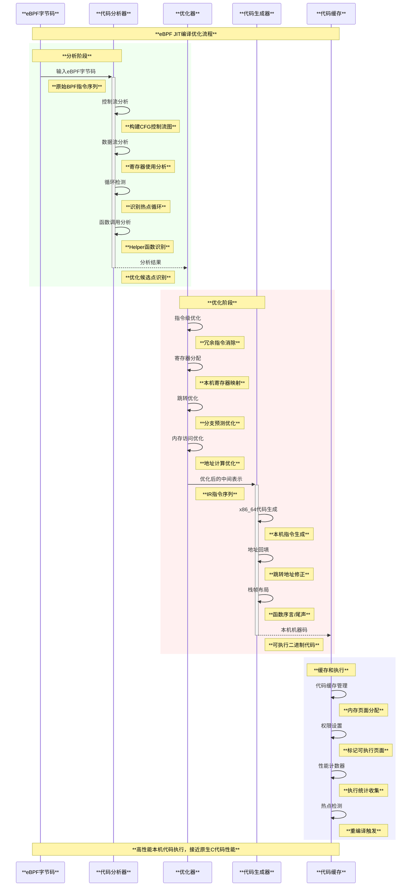

# Linux eBPF 深度技术分析

## 目录

- [概述](#概述)
- [eBPF架构](#ebpf架构)
- [eBPF虚拟机](#ebpf虚拟机)
- [eBPF Helper函数系统](#ebpf-helper函数系统)
- [eBPF使用场景分析](#ebpf使用场景分析)
- [eBPF自定义开发指南](#ebpf自定义开发指南)

---

## 概述

### **eBPF定义与核心特性**

**eBPF** (extended Berkeley Packet Filter) 是Linux内核中的一个强大子系统，它允许用户空间程序在内核空间中运行沙盒化的程序，而无需修改内核源代码或加载内核模块。

#### **eBPF核心特性架构图**

```text
**eBPF核心特性与价值**
┌─────────────────────────────────────────────────────────────────────────────┐
│                             **用户空间**                                      │
│  ┌─────────────────────────────────────────────────────────────────────────┐ │
│  │  **应用程序开发**        │  **运维监控**        │  **安全防护**          │ │
│  │  ┌─────────────────┐   │  ┌─────────────────┐  │  ┌─────────────────┐   │ │
│  │  │ **自定义追踪**  │   │  │ **性能监控**    │  │  │ **访问控制**    │   │ │
│  │  │ **网络过滤**    │   │  │ **系统观测**    │  │  │ **恶意检测**    │   │ │
│  │  │ **负载均衡**    │   │  │ **故障诊断**    │  │  │ **合规审计**    │   │ │
│  │  └─────────────────┘   │  └─────────────────┘  │  └─────────────────┘   │ │
│  └─────────────────────────────────────────────────────────────────────────┘ │
└─────────────────────────┬───────────────────────────────────────────────────┘
                          │ **系统调用接口**
                          ▼
┌─────────────────────────────────────────────────────────────────────────────┐
│                           **eBPF核心框架**                                    │
│  ┌─────────────────────────────────────────────────────────────────────────┐ │
│  │                      **安全性保障**                                       │ │
│  │  ┌───────────────┐ ┌───────────────┐ ┌───────────────┐               │ │
│  │  │ **静态验证**  │ │ **沙盒隔离**  │ │ **权限控制**  │               │ │
│  │  │ 代码安全检查   │ │ 资源访问限制   │ │ 系统调用过滤   │               │ │
│  │  └───────────────┘ └───────────────┘ └───────────────┘               │ │
│  └─────────────────────────────────────────────────────────────────────────┘ │
│  ┌─────────────────────────────────────────────────────────────────────────┐ │
│  │                      **高性能执行**                                       │ │
│  │  ┌───────────────┐ ┌───────────────┐ ┌───────────────┐               │ │
│  │  │ **JIT编译**   │ │ **零拷贝**    │ │ **事件驱动**  │               │ │
│  │  │ 本机代码生成   │ │ 高效数据传输   │ │ 低延迟响应     │               │ │
│  │  └───────────────┘ └───────────────┘ └───────────────┘               │ │
│  └─────────────────────────────────────────────────────────────────────────┘ │
│  ┌─────────────────────────────────────────────────────────────────────────┐ │
│  │                      **灵活扩展**                                         │ │
│  │  ┌───────────────┐ ┌───────────────┐ ┌───────────────┐               │ │
│  │  │ **多挂载点**  │ │ **动态加载**  │ │ **热更新**    │               │ │
│  │  │ 丰富事件接入   │ │ 运行时部署     │ │ 无需重启系统   │               │ │
│  │  └───────────────┘ └───────────────┘ └───────────────┘               │ │
│  └─────────────────────────────────────────────────────────────────────────┘ │
└─────────────────────────┬───────────────────────────────────────────────────┘
                          │ **内核集成接口**
                          ▼
┌─────────────────────────────────────────────────────────────────────────────┐
│                           **Linux内核**                                       │
│  ┌─────────────────────────────────────────────────────────────────────────┐ │
│  │                      **内核子系统**                                       │ │
│  │  ┌───────────────┐ ┌───────────────┐ ┌───────────────┐               │ │
│  │  │ **网络栈**    │ │ **文件系统**  │ │ **进程调度**  │               │ │
│  │  │ **设备驱动**  │ │ **内存管理**  │ │ **安全模块**  │               │ │
│  │  └───────────────┘ └───────────────┘ └───────────────┘               │ │
│  └─────────────────────────────────────────────────────────────────────────┘ │
└─────────────────────────────────────────────────────────────────────────────┘
```

### **eBPF发展历史与演进**

#### **发展时间轴**

```text
**eBPF技术演进历程**
┌─────────────────────────────────────────────────────────────────────────────┐
│                               **发展时间轴**                                  │
│                                                                             │
│ **1992年**     **2011年**     **2014年**     **2016年**     **2019年**      │
│    │             │             │             │             │               │
│    ▼             ▼             ▼             ▼             ▼               │
│ **经典BPF**   **内核BPF**   **eBPF诞生**   **JIT优化**   **CO-RE技术**      │
│ Berkeley     Linux内核集成   Alexei重写    多架构支持    一次编译到处运行     │
│ 数据包过滤    网络数据包     扩展虚拟机    性能提升      开发体验优化        │
│                              多领域应用    生态完善      大规模部署         │
│                                                                             │
│ **关键特性演进**                                                             │
│                                                                             │
│ ┌─────────────┐  ┌─────────────┐  ┌─────────────┐  ┌─────────────┐         │
│ │ **传统BPF** │  │ **内核BPF** │  │ **扩展BPF** │  │ **现代eBPF**│         │
│ │ ────────── │  │ ────────── │  │ ────────── │  │ ────────── │         │
│ │ • 数据包过滤│  │ • 内核集成  │  │ • 通用虚拟机│  │ • CO-RE支持 │         │
│ │ • 简单指令集│  │ • 套接字过滤│  │ • 多程序类型│  │ • BTF信息   │         │
│ │ • 用户空间  │  │ • 基本JIT   │  │ • Maps抽象  │  │ • libbpf库  │         │
│ │ • 有限功能  │  │ • 性能提升  │  │ • 验证器    │  │ • 生态完善  │         │
│ │             │  │             │  │ • 安全沙盒  │  │ • 企业采用  │         │
│ └─────────────┘  └─────────────┘  └─────────────┘  └─────────────┘         │
└─────────────────────────────────────────────────────────────────────────────┘
```

### **eBPF vs 传统内核模块对比**

| **特性** | **eBPF** | **传统内核模块** |
|----------|----------|------------------|
| **安全性** | 静态验证，沙盒隔离，无法crash内核 | 直接内核访问，可能导致系统崩溃 |
| **开发复杂度** | 相对简单，高级语言支持，丰富工具链 | 复杂，需要深入内核知识 |
| **部署方式** | 动态加载，热更新，无需重启 | 需要编译，模块加载，可能需重启 |
| **性能** | JIT编译，接近原生性能 | 原生内核性能 |
| **可移植性** | CO-RE技术，一次编译多处运行 | 内核版本绑定，移植性差 |
| **调试难度** | 丰富调试工具，用户空间调试 | 内核调试，复杂困难 |
| **权限控制** | 细粒度权限，CAP_BPF能力 | 需要root权限，风险较高 |
| **适用场景** | 监控、网络、安全、追踪 | 设备驱动，核心内核功能 |

### **核心价值与优势**

#### **1. 安全性保障**

```c
// eBPF验证器安全检查 - kernel/bpf/verifier.c
struct bpf_verifier_env {
    struct bpf_prog *prog;                    // 待验证程序
    struct bpf_verifier_stack_elem *head;    // 验证栈
    int stack_size;                          // 栈大小
    bool strict_alignment;                   // 严格对齐
    bool allow_ptr_leaks;                    // 是否允许指针泄露
    struct bpf_verifier_state *cur_state;   // 当前状态
    struct bpf_verifier_state_list **explored_states; // 已探索状态
    u32 id_gen;                             // ID生成器
    bool allow_uninit_stack;                // 允许未初始化栈
    
    // 安全策略配置
    struct {
        bool bounds_check_enabled;          // 边界检查
        bool pointer_arithmetic_restricted; // 指针运算限制
        bool helper_access_controlled;      // 辅助函数访问控制
        u32 max_insn_processed;             // 最大指令处理数
    } security_policy;
};

// 指令安全验证
static int check_mem_access(struct bpf_verifier_env *env, int insn_idx,
                          u32 regno, int off, int size,
                          enum bpf_access_type t,
                          int value_regno, bool strict_alignment_once)
{
    struct bpf_reg_state *regs = cur_regs(env);
    struct bpf_reg_state *reg = regs + regno;
    int err;

    /* 检查寄存器类型是否有效 */
    if (reg->type == NOT_INIT) {
        verbose(env, "R%d !read_ok\n", regno);
        return -EACCES;
    }

    /* 检查访问边界 */
    if (off < 0 || size < 0 || (size > 0 && off + size > reg->range)) {
        verbose(env, "invalid access to memory, off=%d size=%d\n", off, size);
        return -EACCES;
    }

    /* 检查内存类型权限 */
    err = check_mem_region_access(env, regno, off, size, reg->mem_size,
                                  reg->zero_size_allowed);
    if (err) {
        verbose(env, "R%d invalid mem access '%s'\n", regno,
                reg_type_str[reg->type]);
        return err;
    }

    return 0;
}
```

#### **2. 高性能执行**

```c
// eBPF JIT编译器优化 - arch/x86/net/bpf_jit_comp.c
struct x64_jit_data {
    struct bpf_binary_header *header;        // 二进制头
    int *addrs;                             // 地址映射
    u8 *image;                              // 机器码镜像
    int proglen;                            // 程序长度
    struct jit_context ctx;                 // JIT上下文
    
    // 性能优化配置
    struct {
        bool constant_blinding;             // 常量盲化
        bool tail_call_reachable;          // 尾调用可达
        u32 stack_depth;                   // 栈深度
        bool aux_stack_in_use;             // 辅助栈使用
    } optimization;
};

// 高效指令生成
static void emit_mov_imm32(u8 **pprog, bool sign_propagate,
                          u32 dst_reg, const u32 imm32)
{
    u8 *prog = *pprog;
    u8 b1, b2, b3;

    /* 优化：零值直接使用XOR指令 */
    if (imm32 == 0) {
        /* xor dst_reg, dst_reg */
        if (is_ereg(dst_reg))
            EMIT1(add_2mod(0x40, dst_reg, dst_reg));
        EMIT2(0x31, add_2reg(0xC0, dst_reg, dst_reg));
        goto done;
    }

    /* 通用MOV指令 */
    if (is_ereg(dst_reg))
        EMIT1(add_1mod(0x40, dst_reg));
    EMIT1_off32(add_1reg(0xB8, dst_reg), imm32);

done:
    *pprog = prog;
}

// 性能统计
struct bpf_prog_stats {
    u64 cnt;                               // 执行次数
    u64 nsecs;                            // 执行时间（纳秒）
    struct u64_stats_sync syncp;          // 统计同步
    
    // 性能指标
    struct {
        u64 cache_misses;                 // 缓存未命中
        u64 branch_misses;                // 分支预测错误
        u64 instruction_count;            // 指令数量
        u64 avg_execution_time;           // 平均执行时间
    } perf_metrics;
} __aligned(2 * sizeof(u64));
```

#### **3. 灵活扩展能力**

```c
// eBPF程序类型定义 - include/uapi/linux/bpf.h
enum bpf_prog_type {
    BPF_PROG_TYPE_UNSPEC,                 // 未指定
    BPF_PROG_TYPE_SOCKET_FILTER,          // 套接字过滤
    BPF_PROG_TYPE_KPROBE,                 // 内核探针
    BPF_PROG_TYPE_SCHED_CLS,              // 分类器
    BPF_PROG_TYPE_SCHED_ACT,              // 动作
    BPF_PROG_TYPE_TRACEPOINT,             // 跟踪点
    BPF_PROG_TYPE_XDP,                    // XDP数据平面
    BPF_PROG_TYPE_PERF_EVENT,             // 性能事件
    BPF_PROG_TYPE_CGROUP_SKB,             // Cgroup套接字缓冲区
    BPF_PROG_TYPE_CGROUP_SOCK,            // Cgroup套接字
    BPF_PROG_TYPE_LWT_IN,                 // 轻量级隧道入口
    BPF_PROG_TYPE_LWT_OUT,                // 轻量级隧道出口
    BPF_PROG_TYPE_LWT_XMIT,               // 轻量级隧道传输
    BPF_PROG_TYPE_SOCK_OPS,               // 套接字操作
    BPF_PROG_TYPE_SK_SKB,                 // 套接字SKB
    BPF_PROG_TYPE_CGROUP_DEVICE,          // Cgroup设备
    BPF_PROG_TYPE_SK_MSG,                 // 套接字消息
    BPF_PROG_TYPE_RAW_TRACEPOINT,         // 原始跟踪点
    BPF_PROG_TYPE_CGROUP_SOCK_ADDR,       // Cgroup套接字地址
    BPF_PROG_TYPE_LWT_SEG6LOCAL,          // LWT SEG6本地
    BPF_PROG_TYPE_LIRC_MODE2,             // LIRC模式2
    BPF_PROG_TYPE_SK_REUSEPORT,           // 套接字端口复用
    BPF_PROG_TYPE_FLOW_DISSECTOR,         // 流解析器
    BPF_PROG_TYPE_CGROUP_SYSCTL,          // Cgroup系统控制
    BPF_PROG_TYPE_RAW_TRACEPOINT_WRITABLE, // 可写原始跟踪点
    BPF_PROG_TYPE_CGROUP_SOCKOPT,         // Cgroup套接字选项
    BPF_PROG_TYPE_TRACING,                // 跟踪
    BPF_PROG_TYPE_STRUCT_OPS,             // 结构操作
    BPF_PROG_TYPE_EXT,                    // 扩展
    BPF_PROG_TYPE_LSM,                    // Linux安全模块
    BPF_PROG_TYPE_SK_LOOKUP,              // 套接字查找
    BPF_PROG_TYPE_SYSCALL,                // 系统调用
    __MAX_BPF_PROG_TYPE
};

// 程序上下文定义
struct bpf_prog_aux {
    atomic64_t refcnt;                    // 引用计数
    u32 used_map_cnt;                     // 使用的Map数量
    u32 max_ctx_offset;                   // 最大上下文偏移
    u32 max_pkt_offset;                   // 最大数据包偏移
    u32 max_tp_access;                    // 最大跟踪点访问
    u32 stack_depth;                      // 栈深度
    u32 id;                               // 程序ID
    u32 func_cnt;                         // 函数数量
    u32 func_idx;                         // 函数索引
    struct btf *btf;                      // BTF信息
    struct bpf_prog_stats __percpu *stats; // 每CPU统计
    
    // 扩展能力配置
    struct {
        bool gpl_compatible;              // GPL兼容
        bool kern_version_checked;        // 内核版本检查
        enum bpf_prog_type prog_type;     // 程序类型
        enum bpf_attach_type attach_type; // 附加类型
        u32 attach_btf_id;               // 附加BTF ID
    } capabilities;
};
```

### **应用领域概览**

```text
**eBPF应用领域生态图**
┌─────────────────────────────────────────────────────────────────────────────┐
│                               **应用生态**                                    │
│                                                                             │
│  ┌─────────────────┐  ┌─────────────────┐  ┌─────────────────┐             │
│  │   **网络领域**   │  │   **观测领域**   │  │   **安全领域**   │             │
│  │ ─────────────── │  │ ─────────────── │  │ ─────────────── │             │
│  │ • XDP数据平面   │  │ • 分布式追踪    │  │ • 访问控制      │             │
│  │ • 负载均衡      │  │ • 性能监控      │  │ • 恶意检测      │             │
│  │ • 服务网格      │  │ • 故障诊断      │  │ • 合规审计      │             │
│  │ • 流量控制      │  │ • 系统调用跟踪  │  │ • 数据保护      │             │
│  │ • 数据包过滤    │  │ • 内核事件监控  │  │ • 权限管理      │             │
│  └─────────────────┘  └─────────────────┘  └─────────────────┘             │
│           │                     │                     │                   │
│           └─────────────────────┼─────────────────────┘                   │
│                                 │                                         │
│  ┌─────────────────┐  ┌─────────────────┐  ┌─────────────────┐             │
│  │   **存储领域**   │  │   **AI/ML领域** │  │   **容器领域**   │             │
│  │ ─────────────── │  │ ─────────────── │  │ ─────────────── │             │
│  │ • 文件系统监控  │  │ • 模型推理加速  │  │ • 容器网络      │             │
│  │ • I/O性能优化   │  │ • 数据处理管道  │  │ • 资源隔离      │             │
│  │ • 缓存管理      │  │ • 特征提取      │  │ • 安全策略      │             │
│  │ • 数据完整性    │  │ • 实时分析      │  │ • 服务发现      │             │
│  │ • 备份策略      │  │ • 边缘计算      │  │ • 日志收集      │             │
│  └─────────────────┘  └─────────────────┘  └─────────────────┘             │
│                                                                             │
│                         **核心技术支撑**                                     │
│  ┌───────────────────────────────────────────────────────────────────────┐ │
│  │ **Maps数据交换** │ **Helper函数调用** │ **JIT高性能编译** │ **CO-RE兼容** │ │
│  └───────────────────────────────────────────────────────────────────────┘ │
└─────────────────────────────────────────────────────────────────────────────┘
```

通过以上概述，我们可以看到eBPF作为Linux内核的重要创新，在保证安全性的前提下，为用户提供了强大的内核可编程能力，成为现代系统编程、网络处理、安全监控和性能优化的重要工具。

---

## eBPF架构

### **eBPF整体架构设计**

eBPF系统采用分层架构设计，从用户空间到内核空间形成完整的执行环境。

#### **eBPF系统整体架构图**

```text
**eBPF系统架构全景**
┌─────────────────────────────────────────────────────────────────────────────┐
│                               **用户空间**                                    │
│  ┌─────────────────────────────────────────────────────────────────────────┐ │
│  │                          **应用程序层**                                   │ │
│  │  ┌───────────────┐ ┌───────────────┐ ┌───────────────┐               │ │
│  │  │ **Cilium**    │ │ **Falco**     │ │ **Pixie**     │               │ │
│  │  │ 容器网络      │ │ 运行时安全     │ │ 可观测性平台   │               │ │
│  │  └───────────────┘ └───────────────┘ └───────────────┘               │ │
│  │  ┌───────────────┐ ┌───────────────┐ ┌───────────────┐               │ │
│  │  │ **Katran**    │ │ **bcc/bpftrace** │ **Calico**   │               │ │
│  │  │ 负载均衡      │ │ 动态追踪工具   │ │ 网络策略      │               │ │
│  │  └───────────────┘ └───────────────┘ └───────────────┘               │ │
│  └─────────────────────────────────────────────────────────────────────────┘ │
│  ┌─────────────────────────────────────────────────────────────────────────┐ │
│  │                          **开发工具链**                                   │ │
│  │  ┌───────────────┐ ┌───────────────┐ ┌───────────────┐               │ │
│  │  │ **libbpf**    │ │ **LLVM/Clang**│ │ **bpftool**   │               │ │
│  │  │ 用户空间库     │ │ 编译器工具链   │ │ 调试检查工具   │               │ │
│  │  └───────────────┘ └───────────────┘ └───────────────┘               │ │
│  │  ┌───────────────┐ ┌───────────────┐ ┌───────────────┐               │ │
│  │  │ **BTF**       │ │ **CO-RE**     │ │ **BPF Skeleton** │               │ │
│  │  │ 调试信息格式   │ │ 一次编译处处运行│ │ 代码生成框架   │               │ │
│  │  └───────────────┘ └───────────────┘ └───────────────┘               │ │
│  └─────────────────────────────────────────────────────────────────────────┘ │
└─────────────────────────┬───────────────────────────────────────────────────┘
                          │ **系统调用接口**
                          │ bpf(), perf_event_open()
                          ▼
┌─────────────────────────────────────────────────────────────────────────────┐
│                               **内核空间**                                    │
│  ┌─────────────────────────────────────────────────────────────────────────┐ │
│  │                          **BPF子系统**                                    │ │
│  │  ┌───────────────┐ ┌───────────────┐ ┌───────────────┐               │ │
│  │  │ **Syscall**   │ │ **Program**   │ │ **Map**       │               │ │
│  │  │ 系统调用处理   │ │ 程序管理      │ │ 数据结构      │               │ │
│  │  └───────────────┘ └───────────────┘ └───────────────┘               │ │
│  │  ┌───────────────┐ ┌───────────────┐ ┌───────────────┐               │ │
│  │  │ **Verifier**  │ │ **JIT**       │ │ **Helper**    │               │ │
│  │  │ 静态验证器     │ │ 即时编译器     │ │ 辅助函数      │               │ │
│  │  └───────────────┘ └───────────────┘ └───────────────┘               │ │
│  └─────────────────────────────────────────────────────────────────────────┘ │
│  ┌─────────────────────────────────────────────────────────────────────────┐ │
│  │                          **挂载点系统**                                   │ │
│  │  ┌───────────────┐ ┌───────────────┐ ┌───────────────┐               │ │
│  │  │ **网络栈**    │ │ **追踪系统**  │ │ **安全框架**  │               │ │
│  │  │ XDP, TC, Socket│ │ kprobe, tracepoint│ │ LSM, cgroup│               │ │
│  │  └───────────────┘ └───────────────┘ └───────────────┘               │ │
│  │  ┌───────────────┐ ┌───────────────┐ ┌───────────────┐               │ │
│  │  │ **文件系统**  │ │ **设备驱动**  │ │ **调度器**    │               │ │
│  │  │ VFS, inode ops │ │ driver hooks  │ │ sched class   │               │ │
│  │  └───────────────┘ └───────────────┘ └───────────────┘               │ │
│  └─────────────────────────────────────────────────────────────────────────┘ │
│  ┌─────────────────────────────────────────────────────────────────────────┐ │
│  │                          **执行环境**                                     │ │
│  │  ┌───────────────┐ ┌───────────────┐ ┌───────────────┐               │ │
│  │  │ **BPF VM**    │ │ **Native Code**│ │ **Context**   │               │ │
│  │  │ 虚拟机环境     │ │ 本机代码执行   │ │ 执行上下文     │               │ │
│  │  └───────────────┘ └───────────────┘ └───────────────┘               │ │
│  └─────────────────────────────────────────────────────────────────────────┘ │
└─────────────────────────────────────────────────────────────────────────────┘
```

### **核心组件详解**

#### **1. BPF虚拟机 (BPF VM)**

```c
// BPF虚拟机核心结构 - include/linux/bpf.h
struct bpf_prog {
    u16                pages;              // 页面数量
    u16                jited:1,           // 是否JIT编译
                      jit_requested:1,    // 是否请求JIT
                      gpl_compatible:1,   // GPL兼容性
                      cb_access:1,        // 控制块访问
                      dst_needed:1,       // 需要dst
                      blinded:1,          // 是否盲化
                      is_func:1,          // 是否为函数
                      kprobe_override:1;  // kprobe覆盖
    
    enum bpf_prog_type  type;             // 程序类型
    enum bpf_attach_type expected_attach_type; // 期望附加类型
    u32                 len;              // 指令长度
    u32                 jited_len;        // JIT编译后长度
    u8                  tag[BPF_TAG_SIZE]; // 程序标签
    struct bpf_prog_stats __percpu *stats; // 统计信息
    int __percpu        *active;          // 活跃计数
    unsigned int        (*bpf_func)(const void *ctx,
                                  const struct bpf_insn *insn); // BPF函数
    struct bpf_prog_aux *aux;             // 辅助信息
    struct sock_fprog_kern *orig_prog;    // 原始程序
    struct bpf_insn     insns[];          // BPF指令数组
};

// BPF指令结构
struct bpf_insn {
    __u8    code;                         // 操作码
    __u8    dst_reg:4;                    // 目标寄存器
    __u8    src_reg:4;                    // 源寄存器
    __s16   off;                          // 偏移量
    __s32   imm;                          // 立即数
};

// 虚拟机执行上下文
struct bpf_prog_run_ctx {
    struct bpf_run_ctx run_ctx;           // 运行上下文
    struct bpf_prog *prog;                // 当前程序
    
    // 执行状态
    struct {
        u64 instruction_count;            // 指令计数
        u64 start_time;                   // 开始时间
        u32 stack_depth;                  // 栈深度
        bool in_atomic;                   // 原子上下文
    } exec_state;
};
```

#### **2. 验证器系统 (Verifier)**

```c
// 验证器状态管理 - kernel/bpf/verifier.c
struct bpf_verifier_state {
    struct bpf_func_state *frame[BPF_MAX_CALL_FRAMES]; // 调用帧
    struct bpf_verifier_state *parent;    // 父状态
    u32 branches;                         // 分支数量
    u32 insn_idx;                         // 指令索引
    u32 curframe;                         // 当前帧
    u32 active_spin_lock;                 // 活跃自旋锁
    bool speculative;                     // 推测执行
    
    // 验证统计
    struct {
        u32 total_states;                 // 总状态数
        u32 peak_states;                  // 峰值状态数
        u32 longest_mark_read_walk;       // 最长标记读取遍历
    } stats;
};

// 寄存器状态跟踪
struct bpf_reg_state {
    enum bpf_reg_type type;               // 寄存器类型
    s32 off;                              // 偏移量
    union {
        int range;                        // 范围
        struct bpf_map *map_ptr;          // Map指针
        struct {
            struct btf *btf;              // BTF信息
            u32 btf_id;                   // BTF ID
        };
        u32 mem_size;                     // 内存大小
        struct {
            enum bpf_dynptr_type type;    // 动态指针类型
            u32 id;                       // ID
        } dynptr;
    };
    
    struct tnum var_off;                  // 变量偏移
    s64 smin_value;                      // 有符号最小值
    s64 smax_value;                      // 有符号最大值
    u64 umin_value;                      // 无符号最小值
    u64 umax_value;                      // 无符号最大值
    s32 s32_min_value;                   // 32位符号最小值
    s32 s32_max_value;                   // 32位符号最大值
    u32 u32_min_value;                   // 32位无符号最小值
    u32 u32_max_value;                   // 32位无符号最大值
    u32 id;                              // 寄存器ID
    u32 ref_obj_id;                      // 引用对象ID
    struct bpf_map *map_ptr;             // Map指针
    bool zero_size_allowed;              // 允许零大小
    bool value_from_signed;              // 来自有符号值
    bool off_is_neg;                     // 偏移为负
};

// 验证器核心检查函数
static int check_func_call(struct bpf_verifier_env *env, struct bpf_insn *insn,
                          int *insn_idx)
{
    int i, err, subprog, target_insn;
    struct bpf_verifier_state *state = env->cur_state;
    struct bpf_func_state *caller, *callee;
    
    /* 验证函数调用参数 */
    caller = state->frame[state->curframe];
    if (state->curframe + 1 >= BPF_MAX_CALL_FRAMES) {
        verbose(env, "the call stack of %d frames is too deep\n",
                state->curframe + 2);
        return -E2BIG;
    }
    
    /* 检查目标函数合法性 */
    target_insn = *insn_idx + insn->imm + 1;
    subprog = find_subprog(env, target_insn);
    if (subprog < 0) {
        verbose(env, "verifier bug. No program starts at insn %d\n",
                target_insn);
        return -EFAULT;
    }
    
    /* 分配新的调用帧 */
    callee = kzalloc(sizeof(*callee), GFP_KERNEL);
    if (!callee)
        return -ENOMEM;
    state->frame[state->curframe + 1] = callee;
    
    /* 初始化被调用函数状态 */
    init_func_state(env, callee, BPF_MAIN_FUNC,
                   state->curframe + 1, subprog);
    
    /* 验证参数传递 */
    for (i = 0; i < caller->allocated_stack / BPF_REG_SIZE; i++) {
        err = copy_stack_state(callee, caller, i);
        if (err)
            goto err_out;
    }
    
    state->curframe++;
    
    /* 推入验证队列 */
    err = push_insn(target_insn, target_insn, BRANCH, env, false);
    if (err)
        goto err_out;
    
    return 0;
    
err_out:
    free_func_state(callee);
    state->frame[state->curframe + 1] = NULL;
    return err;
}
```

#### **3. JIT编译器**

```c
// JIT编译器架构 - kernel/bpf/core.c
struct bpf_binary_header {
    u32 pages;                           // 页面数量
    u8 image[] __aligned(4);             // 机器码镜像
};

// JIT编译上下文
struct bpf_prog *bpf_int_jit_compile(struct bpf_prog *prog)
{
    struct bpf_binary_header *header = NULL;
    struct bpf_prog *new_prog;
    struct x64_jit_data *jit_data;
    int proglen, oldproglen = 0;
    struct jit_context ctx = {};
    bool tmp_blinded = false, extra_pass = false;
    u8 *image = NULL;
    int *addrs;
    int pass;
    int i;

    if (!prog->jit_requested)
        return prog;

    /* 分配JIT数据结构 */
    jit_data = prog->aux->jit_data;
    if (!jit_data) {
        jit_data = kzalloc(sizeof(*jit_data), GFP_KERNEL);
        if (!jit_data)
            return prog;
        prog->aux->jit_data = jit_data;
    }
    
    /* 地址映射表 */
    addrs = jit_data->addrs;
    if (addrs) {
        ctx.addrs = addrs;
        oldproglen = jit_data->proglen;
        image = jit_data->image;
        header = jit_data->header;
        extra_pass = true;
        goto skip_init_addrs;
    }
    
    addrs = kcalloc(prog->len + 1, sizeof(*addrs), GFP_KERNEL);
    if (!addrs) {
        prog = orig_prog;
        goto out_addrs;
    }
    
    /* 多趟编译优化 */
    for (pass = 0; pass < 20 || image; pass++) {
        proglen = do_jit(prog, addrs, image, oldproglen, &ctx);
        if (proglen <= 0) {
            image = NULL;
            if (header)
                bpf_jit_binary_free(header);
            prog = orig_prog;
            goto out_addrs;
        }
        
        if (image) {
            if (proglen != oldproglen) {
                pr_err("bpf_jit: proglen=%d != oldproglen=%d\n",
                       proglen, oldproglen);
                prog = orig_prog;
                goto out_addrs;
            }
            break;
        }
        
        if (proglen == oldproglen) {
            header = bpf_jit_binary_alloc(proglen, &image,
                                        1, jit_fill_hole);
            if (!header) {
                prog = orig_prog;
                goto out_addrs;
            }
        }
        oldproglen = proglen;
        cond_resched();
    }

    /* 更新程序信息 */
    if (image) {
        bpf_prog_fill_jited_linfo(prog, addrs + 1);
        prog->bpf_func = (void *)image;
        prog->jited = 1;
        prog->jited_len = proglen;
    }
    
out_addrs:
    kfree(addrs);
    return prog;
}

skip_init_addrs:
    ctx.addrs = addrs;
    ctx.proglen = oldproglen;
    goto skip_init_addrs;
}
```

#### **4. Maps数据结构**

```c
// BPF Maps基础结构 - include/linux/bpf.h
struct bpf_map {
    const struct bpf_map_ops *ops;        // 操作函数表
    struct bpf_map *inner_map_meta;       // 内部Map元数据
    void *security;                       // 安全上下文
    enum bpf_map_type map_type;          // Map类型
    u32 key_size;                        // 键大小
    u32 value_size;                      // 值大小
    u32 max_entries;                     // 最大条目数
    u32 map_flags;                       // Map标志
    int spin_lock_off;                   // 自旋锁偏移
    u32 id;                             // Map ID
    int numa_node;                      // NUMA节点
    u32 btf_key_type_id;               // BTF键类型ID
    u32 btf_value_type_id;             // BTF值类型ID
    struct btf *btf;                    // BTF信息
    struct bpf_map_memory memory;       // 内存管理
    char name[BPF_OBJ_NAME_LEN];       // Map名称
    bool bypass_spec_v1;               // 绕过推测v1
    bool frozen;                       // 是否冻结
    
    /* 统计信息 */
    atomic64_t refcnt;                 // 引用计数
    atomic64_t usercnt;                // 用户计数
    struct work_struct work;           // 工作队列
    struct mutex freeze_mutex;         // 冻结互斥锁
    u64 writecnt;                      // 写入计数
};

// Map操作函数表
struct bpf_map_ops {
    int (*map_alloc_check)(union bpf_attr *attr);
    struct bpf_map *(*map_alloc)(union bpf_attr *attr);
    void (*map_release)(struct bpf_map *map, struct file *map_file);
    void (*map_free)(struct bpf_map *map);
    int (*map_get_next_key)(struct bpf_map *map, void *key, void *next_key);
    void (*map_release_uref)(struct bpf_map *map);
    void *(*map_lookup_elem)(struct bpf_map *map, void *key);
    int (*map_update_elem)(struct bpf_map *map, void *key, void *value, u64 flags);
    int (*map_delete_elem)(struct bpf_map *map, void *key);
    int (*map_push_elem)(struct bpf_map *map, void *value, u64 flags);
    int (*map_pop_elem)(struct bpf_map *map, void *value);
    int (*map_peek_elem)(struct bpf_map *map, void *value);
    
    /* 高级操作 */
    void *(*map_lookup_percpu_elem)(struct bpf_map *map, void *key, u32 cpu);
    int (*map_lookup_batch)(struct bpf_map *map, const union bpf_attr *attr,
                          union bpf_attr __user *uattr);
    int (*map_lookup_and_delete_batch)(struct bpf_map *map,
                                      const union bpf_attr *attr,
                                      union bpf_attr __user *uattr);
    int (*map_update_batch)(struct bpf_map *map, const union bpf_attr *attr,
                          union bpf_attr __user *uattr);
    int (*map_delete_batch)(struct bpf_map *map, const union bpf_attr *attr,
                          union bpf_attr __user *uattr);
};
```

### **组件交互时序图**

```mermaid
sequenceDiagram
    participant User as **用户程序**
    participant LibBPF as **libbpf库**
    participant Kernel as **内核BPF子系统**
    participant Verifier as **验证器**
    participant JIT as **JIT编译器**
    participant Maps as **BPF Maps**
    participant Hook as **内核挂载点**

    Note over User,Hook: **eBPF程序完整生命周期**
    
    rect rgb(240, 255, 240)
        Note over User,LibBPF: **程序加载阶段**
        
        User->>+LibBPF: bpf_object__open()
        Note right of User: **打开BPF对象文件**
        
        LibBPF->>LibBPF: 解析ELF文件
        Note right of LibBPF: **提取程序和Maps定义**
        
        LibBPF->>+Kernel: bpf(BPF_PROG_LOAD)
        Note right of LibBPF: **加载BPF程序**
        
        Kernel->>+Verifier: bpf_check()
        Note right of Kernel: **启动静态验证**
        
        Verifier->>Verifier: 控制流分析
        Note right of Verifier: **检查程序安全性**
        
        Verifier->>Verifier: 内存访问验证
        Note right of Verifier: **验证内存边界**
        
        Verifier->>Verifier: 寄存器状态追踪
        Note right of Verifier: **跟踪寄存器类型**
        
        Verifier-->>-Kernel: 验证通过
        
        Kernel->>+JIT: bpf_int_jit_compile()
        Note right of Kernel: **JIT编译优化**
        
        JIT->>JIT: 生成本机代码
        Note right of JIT: **x86/ARM64指令生成**
        
        JIT->>JIT: 代码优化
        Note right of JIT: **寄存器分配优化**
        
        JIT-->>-Kernel: 返回可执行代码
        
        Kernel-->>-LibBPF: 返回程序FD
        LibBPF-->>-User: 程序加载完成
    end
    
    rect rgb(255, 240, 240)
        Note over User,Maps: **Maps创建阶段**
        
        User->>+LibBPF: bpf_object__load()
        Note right of User: **加载所有BPF对象**
        
        LibBPF->>+Kernel: bpf(BPF_MAP_CREATE)
        Note right of LibBPF: **创建BPF Maps**
        
        Kernel->>+Maps: map_alloc()
        Note right of Kernel: **分配Map结构**
        
        Maps->>Maps: 初始化存储结构
        Note right of Maps: **根据类型初始化**
        
        Maps->>Maps: 设置内存布局
        Note right of Maps: **配置键值存储**
        
        Maps-->>-Kernel: Map创建完成
        Kernel-->>-LibBPF: 返回Map FD
        LibBPF-->>-User: Maps准备就绪
    end
    
    rect rgb(240, 240, 255)
        Note over User,Hook: **程序附加阶段**
        
        User->>+LibBPF: bpf_program__attach()
        Note right of User: **附加到内核挂载点**
        
        LibBPF->>+Kernel: bpf(BPF_PROG_ATTACH)
        Note right of LibBPF: **执行程序附加**
        
        Kernel->>+Hook: 注册回调函数
        Note right of Kernel: **在挂载点注册**
        
        Hook->>Hook: 设置触发条件
        Note right of Hook: **配置事件过滤器**
        
        Hook-->>-Kernel: 附加成功
        Kernel-->>-LibBPF: 返回附加信息
        LibBPF-->>-User: 程序激活
    end
    
    rect rgb(255, 255, 240)
        Note over Hook,Maps: **运行时执行阶段**
        
        Hook->>Hook: 内核事件触发
        Note right of Hook: **网络包到达/系统调用等**
        
        Hook->>+Kernel: 调用BPF程序
        Note right of Hook: **执行eBPF代码**
        
        Kernel->>Kernel: 执行JIT编译的代码
        Note right of Kernel: **本机代码执行**
        
        Kernel->>+Maps: map_lookup_elem()
        Note right of Kernel: **访问BPF Maps**
        
        Maps->>Maps: 查找/更新数据
        Note right of Maps: **高效数据操作**
        
        Maps-->>-Kernel: 返回结果
        
        Kernel->>Kernel: helper函数调用
        Note right of Kernel: **调用内核辅助函数**
        
        Kernel-->>-Hook: 返回执行结果
        
        Hook->>Hook: 根据结果执行动作
        Note right of Hook: **PASS/DROP/REDIRECT等**
    end
    
    rect rgb(240, 255, 255)
        Note over User,Maps: **数据交互阶段**
        
        User->>+LibBPF: bpf_map_lookup_elem()
        Note right of User: **用户空间读取Maps**
        
        LibBPF->>+Kernel: bpf(BPF_MAP_LOOKUP_ELEM)
        Note right of LibBPF: **系统调用访问**
        
        Kernel->>+Maps: map_lookup_elem()
        Note right of Kernel: **查找Map条目**
        
        Maps->>Maps: 执行查找操作
        Note right of Maps: **基于Map类型的查找**
        
        Maps-->>-Kernel: 返回数据
        Kernel-->>-LibBPF: 复制到用户空间
        LibBPF-->>-User: 返回查询结果
        
        User->>+LibBPF: bpf_map_update_elem()
        Note right of User: **用户空间更新Maps**
        
        LibBPF->>+Kernel: bpf(BPF_MAP_UPDATE_ELEM)
        Note right of LibBPF: **系统调用更新**
        
        Kernel->>+Maps: map_update_elem()
        Note right of Kernel: **更新Map条目**
        
        Maps->>Maps: 执行更新操作
        Note right of Maps: **原子更新保证**
        
        Maps-->>-Kernel: 更新完成
        Kernel-->>-LibBPF: 返回状态
        LibBPF-->>-User: 更新成功确认
    end
    
    Note over User,Hook: **eBPF程序持续运行，提供高性能内核可编程能力**
```



### **层次结构分析**

eBPF系统采用清晰的分层架构，每层都有明确的职责和接口：

#### **分层职责图**

```text
**eBPF系统分层职责**
┌─────────────────────────────────────────────────────────────────────────────┐
│ **应用层 (Application Layer)**                                               │
│ ├─ **职责**: 业务逻辑实现，eBPF程序编写                                        │
│ ├─ **组件**: Cilium, Falco, bcc/bpftrace, 自定义应用                        │
│ └─ **接口**: libbpf API, 高级封装库                                          │
├─────────────────────────────────────────────────────────────────────────────┤
│ **工具层 (Toolchain Layer)**                                               │
│ ├─ **职责**: 开发工具支持，编译调试优化                                        │
│ ├─ **组件**: LLVM/Clang, libbpf, bpftool, BTF, CO-RE                      │
│ └─ **接口**: 编译器接口，调试接口，部署接口                                     │
├─────────────────────────────────────────────────────────────────────────────┤
│ **系统调用层 (Syscall Layer)**                                              │
│ ├─ **职责**: 用户态与内核态交互桥梁                                            │
│ ├─ **组件**: bpf()系统调用, perf_event_open()                              │
│ └─ **接口**: 标准系统调用接口，权限验证                                        │
├─────────────────────────────────────────────────────────────────────────────┤
│ **BPF子系统层 (BPF Subsystem Layer)**                                       │
│ ├─ **职责**: eBPF核心功能实现，安全保障                                        │
│ ├─ **组件**: Verifier, JIT, Program Manager, Map Manager                  │
│ └─ **接口**: 内核内部API，子系统间通信接口                                     │
├─────────────────────────────────────────────────────────────────────────────┤
│ **挂载点层 (Hook Layer)**                                                   │
│ ├─ **职责**: 提供事件触发点，程序执行环境                                      │
│ ├─ **组件**: 网络栈挂载点, 追踪挂载点, 安全挂载点                             │
│ └─ **接口**: 注册/注销接口，事件传递接口                                       │
├─────────────────────────────────────────────────────────────────────────────┤
│ **执行层 (Execution Layer)**                                               │
│ ├─ **职责**: eBPF程序实际执行，性能优化                                        │
│ ├─ **组件**: BPF VM, JIT编译器, Helper函数                                  │
│ └─ **接口**: 指令执行接口，函数调用接口                                        │
└─────────────────────────────────────────────────────────────────────────────┘
```

通过这样的架构设计，eBPF实现了安全性、性能和灵活性的完美平衡，为Linux内核带来了革命性的可编程能力。

---

## eBPF虚拟机

### **eBPF虚拟机架构设计**

eBPF虚拟机是一个基于寄存器的64位虚拟机，设计目标是在保证安全性的前提下提供接近原生代码的执行性能。

#### **eBPF虚拟机整体架构图**

```text
**eBPF虚拟机架构全景**
┌─────────────────────────────────────────────────────────────────────────────┐
│                           **eBPF虚拟机系统**                                  │
│                                                                             │
│  ┌─────────────────────────────────────────────────────────────────────────┐ │
│  │                          **指令处理层**                                   │ │
│  │  ┌───────────────┐ ┌───────────────┐ ┌───────────────┐               │ │
│  │  │ **指令解析**  │ │ **指令调度**  │ │ **指令执行**  │               │ │
│  │  │ OpCode解码    │ │ 分支预测      │ │ 算术逻辑运算   │               │ │
│  │  │ 操作数提取    │ │ 流水线控制    │ │ 内存访问      │               │ │
│  │  └───────────────┘ └───────────────┘ └───────────────┘               │ │
│  └─────────────────────────────────────────────────────────────────────────┘ │
│                                  │                                           │
│  ┌─────────────────────────────────────────────────────────────────────────┐ │
│  │                          **寄存器模型**                                   │ │
│  │  ┌───────────────┐ ┌───────────────┐ ┌───────────────┐               │ │
│  │  │ **R0-R10**    │ │ **程序计数器**│ │ **状态寄存器**│               │ │
│  │  │ 通用寄存器     │ │ PC指针        │ │ 标志位        │               │ │
│  │  │ 64位宽度      │ │ 跳转控制      │ │ 异常状态      │               │ │
│  │  └───────────────┘ └───────────────┘ └───────────────┘               │ │
│  └─────────────────────────────────────────────────────────────────────────┘ │
│                                  │                                           │
│  ┌─────────────────────────────────────────────────────────────────────────┐ │
│  │                          **内存系统**                                     │ │
│  │  ┌───────────────┐ ┌───────────────┐ ┌───────────────┐               │ │
│  │  │ **BPF栈**     │ │ **BPF Maps**  │ │ **上下文内存**│               │ │
│  │  │ 512字节限制   │ │ 键值存储      │ │ 只读访问      │               │ │
│  │  │ 自动管理      │ │ 原子操作      │ │ 类型化访问    │               │ │
│  │  └───────────────┘ └───────────────┘ └───────────────┘               │ │
│  └─────────────────────────────────────────────────────────────────────────┘ │
│                                  │                                           │
│  ┌─────────────────────────────────────────────────────────────────────────┐ │
│  │                          **执行控制**                                     │ │
│  │  ┌───────────────┐ ┌───────────────┐ ┌───────────────┐               │ │
│  │  │ **函数调用**  │ │ **异常处理**  │ │ **资源管理**  │               │ │
│  │  │ 栈帧管理      │ │ 边界检查      │ │ 指令计数      │               │ │
│  │  │ 参数传递      │ │ 权限验证      │ │ 时间限制      │               │ │
│  │  └───────────────┘ └───────────────┘ └───────────────┘               │ │
│  └─────────────────────────────────────────────────────────────────────────┘ │
└─────────────────────────┬───────────────────────────────────────────────────┘
                          │ **JIT编译接口**
                          ▼
┌─────────────────────────────────────────────────────────────────────────────┐
│                           **本机代码执行**                                    │
│  ┌─────────────────────────────────────────────────────────────────────────┐ │
│  │  ┌───────────────┐ ┌───────────────┐ ┌───────────────┐               │ │
│  │  │ **x86_64**    │ │ **ARM64**     │ │ **RISC-V**    │               │ │
│  │  │ JIT编译器     │ │ JIT编译器     │ │ JIT编译器     │               │ │
│  │  └───────────────┘ └───────────────┘ └───────────────┘               │ │
│  └─────────────────────────────────────────────────────────────────────────┘ │
└─────────────────────────────────────────────────────────────────────────────┘
```

### **寄存器模型详解**

#### **eBPF寄存器架构**

```c
// eBPF寄存器定义 - include/uapi/linux/bpf_common.h
#define MAX_BPF_REG             11      // 寄存器总数

/* eBPF寄存器布局 */
enum {
    BPF_REG_0 = 0,                     // 返回值寄存器
    BPF_REG_1,                         // 第1个参数寄存器
    BPF_REG_2,                         // 第2个参数寄存器
    BPF_REG_3,                         // 第3个参数寄存器
    BPF_REG_4,                         // 第4个参数寄存器
    BPF_REG_5,                         // 第5个参数寄存器
    BPF_REG_6,                         // 被调用者保存寄存器
    BPF_REG_7,                         // 被调用者保存寄存器
    BPF_REG_8,                         // 被调用者保存寄存器
    BPF_REG_9,                         // 被调用者保存寄存器
    BPF_REG_10,                        // 只读帧指针
    __MAX_BPF_REG,
};

// 寄存器状态结构
struct bpf_reg_state {
    enum bpf_reg_type type;            // 寄存器类型
    union {
        u16 range;                     // 数值范围
        struct bpf_map *map_ptr;       // Map指针
        struct {
            struct btf *btf;           // BTF类型信息
            u32 btf_id;               // BTF类型ID
        };
        u32 mem_size;                 // 内存大小
        struct {
            enum bpf_dynptr_type type; // 动态指针类型
            u32 id;                   // 动态指针ID
        } dynptr;
    };
    
    /* 数值跟踪信息 */
    struct tnum var_off;              // 变量偏移
    s64 smin_value;                   // 有符号最小值
    s64 smax_value;                   // 有符号最大值
    u64 umin_value;                   // 无符号最小值
    u64 umax_value;                   // 无符号最大值
    s32 s32_min_value;                // 32位有符号最小值
    s32 s32_max_value;                // 32位有符号最大值
    u32 u32_min_value;                // 32位无符号最小值
    u32 u32_max_value;                // 32位无符号最大值
    
    /* 类型跟踪信息 */
    u32 id;                           // 唯一ID
    u32 ref_obj_id;                   // 引用对象ID
    s32 off;                          // 偏移量
    bool zero_size_allowed;           // 允许零大小
    bool value_from_signed;           // 来自有符号值
    bool off_is_neg;                  // 偏移为负
};

// 寄存器类型定义
enum bpf_reg_type {
    NOT_INIT = 0,                     // 未初始化
    SCALAR_VALUE,                     // 标量值
    PTR_TO_CTX,                       // 上下文指针
    CONST_PTR_TO_MAP,                 // Map常量指针
    PTR_TO_MAP_VALUE,                 // Map值指针
    PTR_TO_MAP_KEY,                   // Map键指针
    PTR_TO_STACK,                     // 栈指针
    PTR_TO_PACKET_META,               // 包元数据指针
    PTR_TO_PACKET,                    // 包数据指针
    PTR_TO_PACKET_END,                // 包结束指针
    PTR_TO_FLOW_KEYS,                 // 流键指针
    PTR_TO_SOCKET,                    // 套接字指针
    PTR_TO_SOCK_COMMON,               // 通用套接字指针
    PTR_TO_TCP_SOCK,                  // TCP套接字指针
    PTR_TO_TP_BUFFER,                 // 跟踪点缓冲区指针
    PTR_TO_XDP_SOCK,                  // XDP套接字指针
    PTR_TO_BTF_ID,                    // BTF ID指针
    PTR_TO_MEM,                       // 内存指针
    PTR_TO_BUF,                       // 缓冲区指针
    PTR_TO_FUNC,                      // 函数指针
    CONST_PTR_TO_DYNPTR,              // 动态指针常量
    __BPF_REG_TYPE_MAX,
};
```

#### **寄存器使用约定图**

```text
**eBPF寄存器使用约定**
┌─────────────────────────────────────────────────────────────────────────────┐
│                           **寄存器分配策略**                                  │
│                                                                             │
│  ┌─────────────────┐  ┌─────────────────┐  ┌─────────────────┐             │
│  │   **R0寄存器**   │  │ **R1-R5寄存器** │  │ **R6-R9寄存器** │             │
│  │ ─────────────── │  │ ─────────────── │  │ ─────────────── │             │
│  │ • 函数返回值    │  │ • 函数参数传递  │  │ • 被调用者保存  │             │
│  │ • Helper返回    │  │ • R1: 第1参数   │  │ • 临时变量存储  │             │
│  │ • 程序退出码    │  │ • R2: 第2参数   │  │ • 跨函数调用保持│             │
│  │ • 必须清零退出  │  │ • R3: 第3参数   │  │ • 本地变量存储  │             │
│  │                 │  │ • R4: 第4参数   │  │                 │             │
│  │                 │  │ • R5: 第5参数   │  │                 │             │
│  └─────────────────┘  └─────────────────┘  └─────────────────┘             │
│           │                     │                     │                   │
│           └─────────────────────┼─────────────────────┘                   │
│                                 │                                         │
│  ┌─────────────────┐  ┌─────────────────┐                                 │
│  │  **R10寄存器**   │  │   **程序计数器** │                                 │
│  │ ─────────────── │  │ ─────────────── │                                 │
│  │ • 只读帧指针    │  │ • 指令索引跟踪  │                                 │
│  │ • 栈基址       │  │ • 跳转目标计算  │                                 │
│  │ • 不可修改     │  │ • 分支控制     │                                 │
│  │ • 栈访问基准   │  │ • 循环检测     │                                 │
│  └─────────────────┘  └─────────────────┘                                 │
│                                                                             │
│                         **寄存器状态跟踪**                                   │
│  ┌───────────────────────────────────────────────────────────────────────┐ │
│  │ **类型跟踪** │ **数值范围** │ **内存安全** │ **引用计数** │ **生命周期** │ │
│  └───────────────────────────────────────────────────────────────────────┘ │
└─────────────────────────────────────────────────────────────────────────────┘
```

### **指令集架构**

#### **eBPF指令格式**

```c
// eBPF指令结构 - include/uapi/linux/bpf.h
struct bpf_insn {
    __u8    code;                      // 操作码 (8位)
    __u8    dst_reg:4;                 // 目标寄存器 (4位)
    __u8    src_reg:4;                 // 源寄存器 (4位)
    __s16   off;                       // 偏移量 (16位)
    __s32   imm;                       // 立即数 (32位)
};

// 指令类型分类
#define BPF_CLASS(code) ((code) & 0x07)

// 指令类别
enum {
    BPF_LD    = 0x00,                  // 加载指令
    BPF_LDX   = 0x01,                  // 间接加载指令
    BPF_ST    = 0x02,                  // 存储指令
    BPF_STX   = 0x03,                  // 间接存储指令
    BPF_ALU   = 0x04,                  // 32位算术逻辑指令
    BPF_JMP   = 0x05,                  // 跳转指令
    BPF_JMP32 = 0x06,                  // 32位跳转指令
    BPF_ALU64 = 0x07,                  // 64位算术逻辑指令
};

// 算术逻辑操作码
#define BPF_OP(code) ((code) & 0xf0)
enum {
    BPF_ADD   = 0x00,                  // 加法
    BPF_SUB   = 0x10,                  // 减法
    BPF_MUL   = 0x20,                  // 乘法
    BPF_DIV   = 0x30,                  // 除法
    BPF_OR    = 0x40,                  // 或运算
    BPF_AND   = 0x50,                  // 与运算
    BPF_LSH   = 0x60,                  // 左移
    BPF_RSH   = 0x70,                  // 右移
    BPF_NEG   = 0x80,                  // 取反
    BPF_MOD   = 0x90,                  // 取模
    BPF_XOR   = 0xa0,                  // 异或
    BPF_MOV   = 0xb0,                  // 移动
    BPF_ARSH  = 0xc0,                  // 算术右移
    BPF_END   = 0xd0,                  // 字节序转换
};

// 跳转操作码
enum {
    BPF_JA    = 0x00,                  // 无条件跳转
    BPF_JEQ   = 0x10,                  // 等于跳转
    BPF_JGT   = 0x20,                  // 大于跳转
    BPF_JGE   = 0x30,                  // 大于等于跳转
    BPF_JSET  = 0x40,                  // 位测试跳转
    BPF_JNE   = 0x50,                  // 不等于跳转
    BPF_JSGT  = 0x60,                  // 有符号大于跳转
    BPF_JSGE  = 0x70,                  // 有符号大于等于跳转
    BPF_CALL  = 0x80,                  // 函数调用
    BPF_EXIT  = 0x90,                  // 程序退出
    BPF_JLT   = 0xa0,                  // 小于跳转
    BPF_JLE   = 0xb0,                  // 小于等于跳转
    BPF_JSLT  = 0xc0,                  // 有符号小于跳转
    BPF_JSLE  = 0xd0,                  // 有符号小于等于跳转
};
```

#### **指令集分类架构图**

```text
**eBPF指令集分类体系**
┌─────────────────────────────────────────────────────────────────────────────┐
│                           **eBPF指令集架构**                                  │
│                                                                             │
│  ┌─────────────────┐  ┌─────────────────┐  ┌─────────────────┐             │
│  │  **数据传输**   │  │  **算术逻辑**   │  │   **控制流**    │             │
│  │ ─────────────── │  │ ─────────────── │  │ ─────────────── │             │
│  │ • LD/LDX 加载   │  │ • ADD/SUB 运算  │  │ • JMP 无条件跳转│             │
│  │ • ST/STX 存储   │  │ • MUL/DIV 运算  │  │ • JEQ/JNE 比较  │             │
│  │ • MOV 寄存器传输│  │ • OR/AND 位运算 │  │ • JGT/JLT 大小  │             │
│  │ • IMM 立即数加载│  │ • XOR/NEG 运算  │  │ • CALL 函数调用 │             │
│  │                 │  │ • LSH/RSH 移位  │  │ • EXIT 程序退出 │             │
│  └─────────────────┘  └─────────────────┘  └─────────────────┘             │
│           │                     │                     │                   │
│           └─────────────────────┼─────────────────────┘                   │
│                                 │                                         │
│  ┌─────────────────┐  ┌─────────────────┐  ┌─────────────────┐             │
│  │   **内存访问**   │  │   **类型转换**   │  │   **原子操作**   │             │
│  │ ─────────────── │  │ ─────────────── │  │ ─────────────── │             │
│  │ • 栈内存访问    │  │ • 字节序转换    │  │ • XADD 原子加法 │             │
│  │ • Map数据访问   │  │ • 位宽转换      │  │ • CAS 比较交换  │             │
│  │ • 上下文访问    │  │ • 符号扩展      │  │ • LOCK 前缀支持 │             │
│  │ • 包数据访问    │  │ • 零扩展        │  │ • 内存屏障      │             │
│  └─────────────────┘  └─────────────────┘  └─────────────────┘             │
│                                                                             │
│                         **指令编码格式**                                     │
│  ┌───────────────────────────────────────────────────────────────────────┐ │
│  │ [8bit code] [4bit dst] [4bit src] [16bit off] [32bit imm]             │ │
│  │    操作码      目标寄存器  源寄存器     偏移量        立即数            │ │
│  └───────────────────────────────────────────────────────────────────────┘ │
└─────────────────────────────────────────────────────────────────────────────┘
```

### **内存模型设计**

#### **eBPF内存布局**

```c
// BPF栈管理 - kernel/bpf/core.c
#define MAX_BPF_STACK        512        // 最大栈大小

// 内存访问类型
enum bpf_access_type {
    BPF_READ = 1,                      // 读访问
    BPF_WRITE = 2,                     // 写访问
};

// 内存区域定义
struct bpf_mem_region {
    void *base;                        // 基地址
    u32 size;                          // 区域大小
    u32 off;                           // 当前偏移
    enum bpf_access_type access;       // 访问权限
    
    // 安全检查
    struct {
        bool bounds_checked;           // 边界检查完成
        bool type_checked;             // 类型检查完成
        bool alignment_verified;       // 对齐验证完成
    } safety;
};

// 栈帧结构
struct bpf_func_state {
    struct bpf_reg_state regs[MAX_BPF_REG]; // 寄存器状态
    int callsite;                      // 调用点
    u32 frameno;                       // 帧号
    u32 subprogno;                     // 子程序号
    s32 min_stack_off;                 // 最小栈偏移
    s32 max_stack_off;                 // 最大栈偏移
    
    /* 栈管理 */
    struct bpf_stack_state *stack;     // 栈状态
    int allocated_stack;               // 已分配栈大小
    bool validated;                    // 是否已验证
    
    /* 引用跟踪 */
    struct bpf_reference_state refs[BPF_REF_CNT_MAX]; // 引用状态
    int acquired_refs;                 // 获得的引用数
    int released_refs;                 // 释放的引用数
};
```

#### **内存系统架构图**

```text
**eBPF内存系统架构**
┌─────────────────────────────────────────────────────────────────────────────┐
│                           **eBPF内存空间布局**                                │
│                                                                             │
│  ┌─────────────────┐  ┌─────────────────┐  ┌─────────────────┐             │
│  │   **BPF栈**     │  │   **BPF Maps**  │  │   **上下文区**   │             │
│  │ ─────────────── │  │ ─────────────── │  │ ─────────────── │             │
│  │ • 512字节限制   │  │ • 键值存储      │  │ • 只读访问      │             │
│  │ • 自动管理      │  │ • 多种类型      │  │ • 内核数据结构  │             │
│  │ • 栈指针R10     │  │ • 用户内核共享  │  │ • 类型化访问    │             │
│  │ • 向下增长      │  │ • 原子操作支持  │  │ • 边界保护      │             │
│  │                 │  │ • 生命周期管理  │  │                 │             │
│  └─────────────────┘  └─────────────────┘  └─────────────────┘             │
│           │                     │                     │                   │
│           └─────────────────────┼─────────────────────┘                   │
│                                 │                                         │
│  ┌─────────────────┐  ┌─────────────────┐  ┌─────────────────┐             │
│  │   **包数据区**   │  │   **Helper内存** │  │   **常量区**    │             │
│  │ ─────────────── │  │ ─────────────── │  │ ─────────────── │             │
│  │ • 网络包访问    │  │ • 临时分配      │  │ • 只读数据      │             │
│  │ • 元数据访问    │  │ • 函数调用      │  │ • 字符串常量    │             │
│  │ • 边界检查      │  │ • 内核资源      │  │ • 配置参数      │             │
│  │ • 动态大小      │  │ • 生命周期限制  │  │ • 编译时确定    │             │
│  └─────────────────┘  └─────────────────┘  └─────────────────┘             │
│                                                                             │
│                         **内存安全机制**                                     │
│  ┌───────────────────────────────────────────────────────────────────────┐ │
│  │ **边界检查** │ **类型检查** │ **对齐检查** │ **生命周期** │ **访问权限** │ │
│  └───────────────────────────────────────────────────────────────────────┘ │
└─────────────────────────────────────────────────────────────────────────────┘
```

### **指令执行引擎**

#### **虚拟机执行核心**

```c
// BPF虚拟机执行引擎 - kernel/bpf/core.c
static u64 ___bpf_prog_run(u64 *regs, const struct bpf_insn *insn, u64 *stack)
{
    #define BPF_INSN_2_LBL(x, y)    [BPF_##x | BPF_##y] = &&x##_##y
    #define BPF_INSN_3_LBL(x, y, z) [BPF_##x | BPF_##y | BPF_##z] = &&x##_##y##_##z
    
    /* 跳转表优化 */
    static const void * const jumptable[256] = {
        [0 ... 255] = &&default_label,
        /* 算术指令 */
        BPF_INSN_3_LBL(ALU64, ADD, X),
        BPF_INSN_3_LBL(ALU64, ADD, K),
        BPF_INSN_3_LBL(ALU64, SUB, X),
        BPF_INSN_3_LBL(ALU64, SUB, K),
        BPF_INSN_3_LBL(ALU64, MUL, X),
        BPF_INSN_3_LBL(ALU64, MUL, K),
        BPF_INSN_3_LBL(ALU64, DIV, X),
        BPF_INSN_3_LBL(ALU64, DIV, K),
        /* 内存指令 */
        BPF_INSN_3_LBL(LDX, MEM, B),
        BPF_INSN_3_LBL(LDX, MEM, H),
        BPF_INSN_3_LBL(LDX, MEM, W),
        BPF_INSN_3_LBL(LDX, MEM, DW),
        BPF_INSN_3_LBL(STX, MEM, B),
        BPF_INSN_3_LBL(STX, MEM, H),
        BPF_INSN_3_LBL(STX, MEM, W),
        BPF_INSN_3_LBL(STX, MEM, DW),
        /* 跳转指令 */
        BPF_INSN_2_LBL(JMP, JA),
        BPF_INSN_3_LBL(JMP, JEQ, X),
        BPF_INSN_3_LBL(JMP, JEQ, K),
        BPF_INSN_3_LBL(JMP, JNE, X),
        BPF_INSN_3_LBL(JMP, JNE, K),
        BPF_INSN_2_LBL(JMP, CALL),
        BPF_INSN_2_LBL(JMP, EXIT),
    };
    
    #undef BPF_INSN_2_LBL
    #undef BPF_INSN_3_LBL
    
    u32 tail_call_cnt = 0;
    void *ptr;
    int off;

#define CONT     ({ insn++; goto select_insn; })
#define CONT_JMP ({ insn++; goto select_insn; })

select_insn:
    goto *jumptable[insn->code];
    
    /* 算术逻辑指令实现 */
ALU64_ADD_X:
    DST = DST + SRC;
    CONT;
ALU64_ADD_K:
    DST = DST + IMM;
    CONT;
ALU64_SUB_X:
    DST = DST - SRC;
    CONT;
ALU64_SUB_K:
    DST = DST - IMM;
    CONT;
ALU64_MUL_X:
    DST = DST * SRC;
    CONT;
ALU64_MUL_K:
    DST = DST * IMM;
    CONT;
    
    /* 除法指令特殊处理 */
ALU64_DIV_X:
    div64_u64_rem(DST, SRC, &tmp);
    DST = tmp;
    CONT;
ALU64_DIV_K:
    DST = div64_u64(DST, IMM);
    CONT;
    
    /* 内存访问指令 */
LDX_MEM_B:
    DST = *(u8 *) (unsigned long) (SRC + insn->off);
    CONT;
LDX_MEM_H:
    DST = *(u16 *) (unsigned long) (SRC + insn->off);
    CONT;
LDX_MEM_W:
    DST = *(u32 *) (unsigned long) (SRC + insn->off);
    CONT;
LDX_MEM_DW:
    DST = *(u64 *) (unsigned long) (SRC + insn->off);
    CONT;
    
STX_MEM_B:
    *(u8 *) (unsigned long) (DST + insn->off) = SRC;
    CONT;
STX_MEM_H:
    *(u16 *) (unsigned long) (DST + insn->off) = SRC;
    CONT;
STX_MEM_W:
    *(u32 *) (unsigned long) (DST + insn->off) = SRC;
    CONT;
STX_MEM_DW:
    *(u64 *) (unsigned long) (DST + insn->off) = SRC;
    CONT;
    
    /* 跳转指令实现 */
JMP_JA:
    insn += insn->off;
    CONT;
JMP_JEQ_X:
    if (DST == SRC) {
        insn += insn->off;
    }
    CONT;
JMP_JEQ_K:
    if (DST == IMM) {
        insn += insn->off;
    }
    CONT;
    
    /* 函数调用 */
JMP_CALL:
    BPF_R0 = (__bpf_call_base + insn->imm)(BPF_R1, BPF_R2, BPF_R3,
                                          BPF_R4, BPF_R5);
    CONT;
    
    /* 程序退出 */
JMP_EXIT:
    return BPF_R0;
    
default_label:
    /* 非法指令处理 */
    pr_warn("BPF interpreter: unknown opcode %02x\n", insn->code);
    return 0;
}

#define DST    regs[insn->dst_reg]
#define SRC    regs[insn->src_reg]  
#define IMM    insn->imm
```

#### **指令执行流水线图**

```mermaid
sequenceDiagram
    participant PC as **程序计数器**
    participant Fetch as **指令获取**
    participant Decode as **指令解码**
    participant Execute as **指令执行**
    participant Memory as **内存系统**
    participant Registers as **寄存器组**

    Note over PC,Registers: **eBPF指令执行流水线**
    
    rect rgb(240, 255, 240)
        Note over PC,Decode: **指令获取和解码阶段**
        
        PC->>+Fetch: 获取当前指令
        Note right of PC: **从指令数组读取**
        
        Fetch->>Fetch: 边界检查
        Note right of Fetch: **防止指令越界**
        
        Fetch->>+Decode: 传递指令字节码
        Note right of Fetch: **8字节指令格式**
        
        Decode->>Decode: 解析操作码
        Note right of Decode: **提取code字段**
        
        Decode->>Decode: 解析寄存器字段
        Note right of Decode: **dst_reg/src_reg**
        
        Decode->>Decode: 解析立即数和偏移
        Note right of Decode: **imm/off字段**
        
        Decode-->>-Execute: 指令解码完成
        Fetch-->>-PC: 更新程序计数器
    end
    
    rect rgb(255, 240, 240)
        Note over Execute,Registers: **指令执行阶段**
        
        Execute->>Execute: 跳转表查找
        Note right of Execute: **高效指令分发**
        
        alt 算术逻辑指令
            Execute->>+Registers: 读取源操作数
            Note right of Execute: **从寄存器读取**
            
            Registers-->>-Execute: 返回操作数值
            
            Execute->>Execute: 执行算术运算
            Note right of Execute: **ADD/SUB/MUL/DIV等**
            
            Execute->>+Registers: 写入计算结果
            Note right of Execute: **更新目标寄存器**
            
            Registers-->>-Execute: 写入完成
            
        else 内存访问指令
            Execute->>+Registers: 计算内存地址
            Note right of Execute: **基址+偏移计算**
            
            Registers-->>-Execute: 返回地址
            
            Execute->>Execute: 地址安全检查
            Note right of Execute: **边界和权限验证**
            
            Execute->>+Memory: 执行内存操作
            Note right of Execute: **读取或写入**
            
            Memory->>Memory: 访问目标区域
            Note right of Memory: **栈/Maps/上下文**
            
            Memory-->>-Execute: 返回操作结果
            
            Execute->>+Registers: 更新寄存器
            Note right of Execute: **LD指令写入结果**
            
            Registers-->>-Execute: 更新完成
            
        else 跳转指令
            Execute->>+Registers: 读取比较操作数
            Note right of Execute: **条件跳转判断**
            
            Registers-->>-Execute: 返回比较值
            
            Execute->>Execute: 条件判断
            Note right of Execute: **JEQ/JGT/JLT等**
            
            alt 跳转条件满足
                Execute->>+PC: 更新程序计数器
                Note right of Execute: **PC += offset**
                
                PC-->>-Execute: 跳转完成
            else 跳转条件不满足
                Execute->>Execute: 继续顺序执行
                Note right of Execute: **PC += 1**
            end
            
        else 函数调用
            Execute->>+Registers: 保存调用现场
            Note right of Execute: **寄存器状态保存**
            
            Registers-->>-Execute: 现场保存完成
            
            Execute->>Execute: 调用Helper函数
            Note right of Execute: **内核辅助函数**
            
            Execute->>+Registers: 恢复现场
            Note right of Execute: **R0存储返回值**
            
            Registers-->>-Execute: 现场恢复完成
        end
    end
    
    rect rgb(240, 240, 255)
        Note over PC,Registers: **流水线控制**
        
        Execute->>Execute: 检查程序状态
        Note right of Execute: **异常/退出检查**
        
        alt 程序正常继续
            Execute->>+PC: 递增程序计数器
            Note right of Execute: **PC = PC + 1**
            
            PC-->>-Execute: 准备下一指令
        else 程序退出
            Execute->>Execute: 返回结果
            Note right of Execute: **返回R0寄存器值**
        else 异常发生
            Execute->>Execute: 异常处理
            Note right of Execute: **安全违规/错误处理**
        end
    end
    
    Note over PC,Registers: **高效的基于跳转表的指令分发机制**
```



### **性能优化设计**

#### **虚拟机优化策略**

```c
// 性能优化配置 - kernel/bpf/core.c
struct bpf_prog_stats {
    u64 cnt;                          // 执行次数
    u64 nsecs;                        // 执行时间
    struct u64_stats_sync syncp;      // 同步控制
    
    // 性能指标
    struct {
        u64 cache_hits;               // 缓存命中
        u64 cache_misses;             // 缓存未命中
        u64 branch_predictions;       // 分支预测成功
        u64 branch_mispredictions;    // 分支预测失败
        u64 memory_accesses;          // 内存访问次数
        u64 register_spills;          // 寄存器溢出
    } perf_counters;
};

// 指令级优化
static inline u64 bpf_prog_run_fast_path(const struct bpf_prog *prog,
                                         const void *ctx)
{
    const struct bpf_insn *insn = prog->insnsi;
    u64 regs[MAX_BPF_REG] = {};
    u64 stack[MAX_BPF_STACK / sizeof(u64)] = {};
    
    /* 初始化上下文指针 */
    regs[1] = (u64)(unsigned long)ctx;
    
    /* 针对热点指令的特殊优化 */
    if (likely(prog->jited)) {
        /* JIT编译后的本机代码执行 */
        return prog->bpf_func(ctx, insn);
    } else {
        /* 解释执行模式 */
        return ___bpf_prog_run(regs, insn, stack);
    }
}

// 分支预测优化
#define likely_branch(x)   __builtin_expect(!!(x), 1)
#define unlikely_branch(x) __builtin_expect(!!(x), 0)

// 缓存友好的数据结构布局
struct bpf_prog_aux {
    /* 热路径数据 - 第一缓存行 */
    atomic64_t refcnt;                // 引用计数
    enum bpf_prog_type prog_type;     // 程序类型
    u32 id;                           // 程序ID
    
    /* 冷路径数据 - 其他缓存行 */
    struct bpf_prog_stats __percpu *stats; // 统计数据
    struct btf *btf;                  // BTF信息
    char name[BPF_OBJ_NAME_LEN];     // 程序名称
} ____cacheline_aligned;
```

通过这样的虚拟机设计，eBPF能够在保证安全性的前提下，提供接近原生代码的执行性能，为内核可编程提供了强大的基础架构。

---

## eBPF验证器

### **验证器架构设计**

eBPF验证器是eBPF安全性的核心保障，它通过静态分析确保eBPF程序的安全性，防止内核崩溃和安全漏洞。

#### **验证器整体架构图**

```text
**eBPF验证器系统架构**
┌─────────────────────────────────────────────────────────────────────────────┐
│                           **eBPF验证器系统**                                  │
│                                                                             │
│  ┌─────────────────────────────────────────────────────────────────────────┐ │
│  │                          **程序分析阶段**                                 │ │
│  │  ┌───────────────┐ ┌───────────────┐ ┌───────────────┐               │ │
│  │  │ **CFG构建**   │ │ **循环检测**  │ │ **死代码检测**│               │ │
│  │  │ 控制流图      │ │ 回边分析      │ │ 不可达代码    │               │ │
│  │  │ DAG验证       │ │ 深度优先遍历  │ │ 无效跳转      │               │ │
│  │  └───────────────┘ └───────────────┘ └───────────────┘               │ │
│  └─────────────────────────────────────────────────────────────────────────┘ │
│                                  │                                           │
│  ┌─────────────────────────────────────────────────────────────────────────┐ │
│  │                          **状态跟踪阶段**                                 │ │
│  │  ┌───────────────┐ ┌───────────────┐ ┌───────────────┐               │ │
│  │  │ **寄存器追踪**│ │ **栈状态追踪**│ │ **引用跟踪**  │               │ │
│  │  │ 类型推导      │ │ 边界检查      │ │ 生命周期管理  │               │ │
│  │  │ 数值范围      │ │ 初始化检查    │ │ 泄漏检测      │               │ │
│  │  └───────────────┘ └───────────────┘ └───────────────┘               │ │
│  └─────────────────────────────────────────────────────────────────────────┘ │
│                                  │                                           │
│  ┌─────────────────────────────────────────────────────────────────────────┐ │
│  │                          **安全检查阶段**                                 │ │
│  │  ┌───────────────┐ ┌───────────────┐ ┌───────────────┐               │ │
│  │  │ **内存安全**  │ │ **指针安全**  │ │ **函数调用**  │               │ │
│  │  │ 边界验证      │ │ 算术限制      │ │ 参数验证      │               │ │
│  │  │ 对齐检查      │ │ 泄漏防护      │ │ 返回值检查    │               │ │
│  │  └───────────────┘ └───────────────┘ └───────────────┘               │ │
│  └─────────────────────────────────────────────────────────────────────────┘ │
│                                  │                                           │
│  ┌─────────────────────────────────────────────────────────────────────────┐ │
│  │                          **优化验证**                                     │ │
│  │  ┌───────────────┐ ┌───────────────┐ ┌───────────────┐               │ │
│  │  │ **状态剪枝**  │ │ **死代码优化**│ │ **指令优化**  │               │ │
│  │  │ 等价状态合并  │ │ 无用代码消除  │ │ 常量折叠      │               │ │
│  │  │ 路径压缩      │ │ NOP指令移除   │ │ 跳转优化      │               │ │
│  │  └───────────────┘ └───────────────┘ └───────────────┘               │ │
│  └─────────────────────────────────────────────────────────────────────────┘ │
└─────────────────────────────────────────────────────────────────────────────┘
```

### **验证器核心实现**

#### **验证器主流程**

```c
// 验证器主函数 - kernel/bpf/verifier.c
int bpf_check(struct bpf_prog **prog, union bpf_attr *attr, 
              bpfptr_t uattr, __u32 uattr_size)
{
    u64 start_time = ktime_get_ns();
    struct bpf_verifier_env *env;
    int i, len, ret = -EINVAL, err;
    u32 log_true_size;
    bool is_priv;

    /* 验证程序存在 */
    if (ARRAY_SIZE(bpf_verifier_ops) == 0)
        return -EINVAL;

    /* 分配验证器环境 */
    env = kvzalloc(sizeof(struct bpf_verifier_env), GFP_KERNEL);
    if (!env)
        return -ENOMEM;

    env->bt.env = env;

    len = (*prog)->len;
    env->insn_aux_data =
        vzalloc(array_size(sizeof(struct bpf_insn_aux_data), len));
    ret = -ENOMEM;
    if (!env->insn_aux_data)
        goto err_free_env;
    
    /* 初始化辅助数据 */
    for (i = 0; i < len; i++)
        env->insn_aux_data[i].orig_idx = i;
    
    env->prog = *prog;
    env->ops = bpf_verifier_ops[env->prog->type];
    env->fd_array = make_bpfptr(attr->fd_array, uattr.is_kernel);

    /* 权限检查 */
    env->allow_ptr_leaks = bpf_allow_ptr_leaks(env->prog->aux->token);
    env->allow_uninit_stack = bpf_allow_uninit_stack(env->prog->aux->token);
    env->bypass_spec_v1 = bpf_bypass_spec_v1(env->prog->aux->token);
    env->bypass_spec_v4 = bpf_bypass_spec_v4(env->prog->aux->token);
    env->bpf_capable = is_priv = bpf_token_capable(env->prog->aux->token, CAP_BPF);

    bpf_get_btf_vmlinux();

    /* 非特权用户需要加锁 */
    if (!is_priv)
        mutex_lock(&bpf_verifier_lock);

    /* 初始化日志系统 */
    ret = bpf_vlog_init(&env->log, attr->log_level,
                       (char __user *) (unsigned long) attr->log_buf,
                       attr->log_size);
    if (ret)
        goto err_unlock;

    mark_verifier_state_clean(env);

    /* BTF信息验证 */
    if (IS_ERR(btf_vmlinux)) {
        verbose(env, "in-kernel BTF is malformed\n");
        ret = PTR_ERR(btf_vmlinux);
        goto skip_full_check;
    }

    /* 对齐要求 */
    env->strict_alignment = !!(attr->prog_flags & BPF_F_STRICT_ALIGNMENT);
    if (!IS_ENABLED(CONFIG_HAVE_EFFICIENT_UNALIGNED_ACCESS))
        env->strict_alignment = true;
    if (attr->prog_flags & BPF_F_ANY_ALIGNMENT)
        env->strict_alignment = false;

    /* 状态探索哈希表 */
    env->explored_states = kvcalloc(state_htab_size(env),
                                   sizeof(struct bpf_verifier_state_list *),
                                   GFP_USER);
    ret = -ENOMEM;
    if (!env->explored_states)
        goto skip_full_check;

    /* BTF信息早期检查 */
    ret = check_btf_info_early(env, attr, uattr);
    if (ret < 0)
        goto skip_full_check;

    /* 添加子程序和kfunc */
    ret = add_subprog_and_kfunc(env);
    if (ret < 0)
        goto skip_full_check;

    /* 检查子程序 */
    ret = check_subprogs(env);
    if (ret < 0)
        goto skip_full_check;

    /* BTF信息完整检查 */
    ret = check_btf_info(env, attr, uattr);
    if (ret < 0)
        goto skip_full_check;

    /* 附加点BTF ID检查 */
    ret = check_attach_btf_id(env);
    if (ret)
        goto skip_full_check;

    /* 解析伪ldimm64指令 */
    ret = resolve_pseudo_ldimm64(env);
    if (ret < 0)
        goto skip_full_check;

    /* 控制流图检查 - 核心步骤 */
    ret = check_cfg(env);
    if (ret < 0)
        goto skip_full_check;

    /* 标记快速调用模式 */
    ret = mark_fastcall_patterns(env);
    if (ret < 0)
        goto skip_full_check;

    /* 执行主程序检查 - 核心验证逻辑 */
    ret = do_check_main(env);
    ret = ret ?: do_check_subprogs(env);

    if (ret == 0 && bpf_prog_is_offloaded(env->prog->aux))
        ret = bpf_prog_offload_finalize(env);

skip_full_check:
    kvfree(env->explored_states);

    /* 栈深度检查和优化 */
    if (ret == 0)
        ret = remove_fastcall_spills_fills(env);

    if (ret == 0)
        ret = check_max_stack_depth(env);

    /* 指令重写和优化 */
    if (ret == 0)
        ret = optimize_bpf_loop(env);

    /* 特权用户的额外优化 */
    if (is_priv) {
        if (ret == 0)
            opt_hard_wire_dead_code_branches(env);
        if (ret == 0)
            ret = opt_remove_dead_code(env);
        if (ret == 0)
            ret = opt_remove_nops(env);
    } else {
        if (ret == 0)
            sanitize_dead_code(env);
    }

    if (ret == 0)
        ret = convert_ctx_accesses(env);

    if (ret == 0)
        ret = do_misc_fixups(env);

    /* 验证完成，记录统计 */
    env->verification_time = ktime_get_ns() - start_time;
    print_verification_stats(env);

    if (!is_priv)
        mutex_unlock(&bpf_verifier_lock);

    vfree(env->insn_aux_data);
err_free_env:
    kvfree(env);
    return ret;

err_unlock:
    if (!is_priv)
        mutex_unlock(&bpf_verifier_lock);
    vfree(env->insn_aux_data);
    kvfree(env);
    return ret;
}
```

#### **控制流图检查**

```c
// CFG检查 - 检测循环和不可达代码 - kernel/bpf/verifier.c
static int check_cfg(struct bpf_verifier_env *env)
{
    int insn_cnt = env->prog->len;
    int *insn_stack, *insn_state;
    int ex_insn_beg, i, ret = 0;
    bool ex_done = false;

    /* 分配状态数组 */
    insn_state = env->cfg.insn_state = kvcalloc(insn_cnt, sizeof(int), GFP_KERNEL);
    if (!insn_state)
        return -ENOMEM;

    insn_stack = env->cfg.insn_stack = kvcalloc(insn_cnt, sizeof(int), GFP_KERNEL);
    if (!insn_stack) {
        kvfree(insn_state);
        return -ENOMEM;
    }

    /* 标记第一条指令为已发现 */
    insn_state[0] = DISCOVERED;
    insn_stack[0] = 0;
    env->cfg.cur_stack = 1;

walk_cfg:
    /* 深度优先搜索遍历 */
    while (env->cfg.cur_stack > 0) {
        int t = insn_stack[env->cfg.cur_stack - 1];

        ret = visit_insn(t, env);
        switch (ret) {
        case DONE_EXPLORING:
            insn_state[t] = EXPLORED;
            env->cfg.cur_stack--;
            break;
        case KEEP_EXPLORING:
            break;
        default:
            if (ret > 0) {
                verbose(env, "visit_insn internal bug\n");
                ret = -EFAULT;
            }
            goto err_free;
        }
    }

    if (env->cfg.cur_stack < 0) {
        verbose(env, "pop stack internal bug\n");
        ret = -EFAULT;
        goto err_free;
    }

    /* 处理异常回调子程序 */
    if (env->exception_callback_subprog && !ex_done) {
        ex_insn_beg = env->subprog_info[env->exception_callback_subprog].start;

        insn_state[ex_insn_beg] = DISCOVERED;
        insn_stack[0] = ex_insn_beg;
        env->cfg.cur_stack = 1;
        ex_done = true;
        goto walk_cfg;
    }

    /* 检查所有指令是否都被探索 */
    for (i = 0; i < insn_cnt; i++) {
        struct bpf_insn *insn = &env->prog->insnsi[i];

        if (insn_state[i] != EXPLORED) {
            verbose(env, "unreachable insn %d\n", i);
            ret = -EINVAL;
            goto err_free;
        }
        
        /* 检查ldimm64指令的完整性 */
        if (bpf_is_ldimm64(insn)) {
            if (insn_state[i + 1] != 0) {
                verbose(env, "jump into the middle of ldimm64 insn %d\n", i);
                ret = -EINVAL;
                goto err_free;
            }
            i++; /* 跳过ldimm64的第二半 */
        }
    }
    
    ret = 0; /* CFG检查通过 */

err_free:
    kvfree(insn_state);
    kvfree(insn_stack);
    env->cfg.insn_state = env->cfg.insn_stack = NULL;
    return ret;
}
```

#### **状态跟踪和验证**

```c
// 核心验证循环 - kernel/bpf/verifier.c
static int do_check(struct bpf_verifier_env *env)
{
    bool pop_log = !(env->log.level & BPF_LOG_LEVEL2);
    struct bpf_verifier_state *state = env->cur_state;
    struct bpf_insn *insns = env->prog->insnsi;
    struct bpf_reg_state *regs;
    int insn_cnt = env->prog->len;
    bool do_print_state = false;
    int prev_insn_idx = -1;

    for (;;) {
        bool exception_exit = false;
        struct bpf_insn *insn;
        u8 class;
        int err;

        /* 重置当前历史条目 */
        env->cur_hist_ent = NULL;

        env->prev_insn_idx = prev_insn_idx;
        if (env->insn_idx >= insn_cnt) {
            verbose(env, "invalid insn idx %d insn_cnt %d\n",
                   env->insn_idx, insn_cnt);
            return -EFAULT;
        }

        insn = &insns[env->insn_idx];
        class = BPF_CLASS(insn->code);

        /* 复杂度限制检查 */
        if (++env->insn_processed > BPF_COMPLEXITY_LIMIT_INSNS) {
            verbose(env,
                   "BPF program is too large. Processed %d insn\n",
                   env->insn_processed);
            return -E2BIG;
        }

        state->last_insn_idx = env->prev_insn_idx;

        /* 状态剪枝点检查 */
        if (is_prune_point(env, env->insn_idx)) {
            err = is_state_visited(env, env->insn_idx);
            if (err < 0)
                return err;
            if (err == 1) {
                /* 找到等价状态，可以剪枝 */
                if (env->log.level & BPF_LOG_LEVEL) {
                    if (do_print_state)
                        verbose(env, "\nfrom %d to %d%s: safe\n",
                               env->prev_insn_idx, env->insn_idx,
                               env->cur_state->speculative ?
                               " (speculative execution)" : "");
                    else
                        verbose(env, "%d: safe\n", env->insn_idx);
                }
                goto process_bpf_exit;
            }
        }

        /* 跳转历史记录 */
        if (is_jmp_point(env, env->insn_idx)) {
            err = push_jmp_history(env, state, 0, 0);
            if (err)
                return err;
        }

        /* 抢占点检查 */
        if (signal_pending(current))
            return -EAGAIN;

        if (need_resched())
            cond_resched();

        /* 日志输出 */
        if (env->log.level & BPF_LOG_LEVEL2 && do_print_state) {
            verbose(env, "\nfrom %d to %d%s:",
                   env->prev_insn_idx, env->insn_idx,
                   env->cur_state->speculative ?
                   " (speculative execution)" : "");
            print_verifier_state(env, state->frame[state->curframe], false);
            do_print_state = false;
        }

        /* 根据指令类型执行验证 */
        switch (class) {
        case BPF_ALU:
        case BPF_ALU64:
            err = check_alu_op(env, insn);
            if (err)
                return err;
            break;

        case BPF_LDX:
        case BPF_STX:
        case BPF_ST:
            err = check_mem_access(env, env->insn_idx, insn->dst_reg,
                                  insn->off, BPF_SIZE(insn->code),
                                  BPF_READ, -1, false, false);
            if (err)
                return err;
            break;

        case BPF_JMP:
        case BPF_JMP32:
            err = check_cond_jmp_op(env, insn, &env->insn_idx);
            if (err)
                return err;
            break;

        case BPF_LD:
            err = check_ld_abs(env, insn);
            if (err)
                return err;
            break;

        default:
            verbose(env, "unknown insn class %d\n", class);
            return -EINVAL;
        }

        /* 移动到下一条指令 */
        prev_insn_idx = env->insn_idx;
        env->insn_idx++;
    }

process_bpf_exit:
    /* 处理程序退出 */
    return 0;
}
```

### **安全检查机制**

#### **内存访问验证**

```c
// 内存访问安全检查 - kernel/bpf/verifier.c
static int check_mem_access(struct bpf_verifier_env *env, int insn_idx,
                          u32 regno, int off, int bpf_size,
                          enum bpf_access_type t,
                          int value_regno, bool strict_alignment_once,
                          bool zero_size_allowed)
{
    struct bpf_reg_state *regs = cur_regs(env);
    struct bpf_reg_state *reg = regs + regno;
    int size, err;

    size = bpf_size_to_bytes(bpf_size);
    if (size < 0)
        return size;

    /* 对齐检查 */
    if (strict_alignment_once && env->strict_alignment) {
        const char *e = " ";

        switch (regno) {
        case BPF_REG_0:
        case BPF_REG_1:
        case BPF_REG_2:
        case BPF_REG_3:
        case BPF_REG_4:
        case BPF_REG_5:
        case BPF_REG_6:
        case BPF_REG_7:
        case BPF_REG_8:
        case BPF_REG_9:
            /* 检查寄存器对齐 */
            if (off % size != 0) {
                verbose(env, "misaligned %saccess off %d reg %s size %d\n",
                       e, off, reg_name[regno], size);
                return -EACCES;
            }
        }
    }

    /* 检查寄存器类型 */
    if (reg->type == NOT_INIT) {
        verbose(env, "R%d !read_ok\n", regno);
        return -EACCES;
    }

    /* 检查访问边界 */
    if (off < 0 || size < 0 || (size > 0 && off + size > reg->range)) {
        verbose(env, "invalid access to memory, off=%d size=%d\n", off, size);
        return -EACCES;
    }

    /* 根据内存类型执行相应检查 */
    switch (reg->type) {
    case PTR_TO_MAP_VALUE:
        err = check_map_access(env, regno, off, size, zero_size_allowed,
                             ACCESS_HELPER);
        if (!err && t == BPF_READ && value_regno >= 0)
            mark_reg_unknown(env, regs, value_regno);
        break;

    case PTR_TO_CTX:
        err = check_ctx_access(env, insn_idx, off, size, t, reg);
        if (!err && t == BPF_READ && value_regno >= 0) {
            /* 记录上下文访问用于后续转换 */
            mark_reg_unknown(env, regs, value_regno);
        }
        break;

    case CONST_PTR_TO_MAP:
        err = check_map_access(env, regno, off, size, zero_size_allowed,
                             ACCESS_DIRECT);
        break;

    case PTR_TO_STACK:
        err = check_stack_access(env, reg, off, size);
        if (!err && t == BPF_READ && value_regno >= 0)
            mark_reg_read_stack(env, reg, regno, off, size);
        break;

    case PTR_TO_PACKET:
        err = check_packet_access(env, regno, off, size, false);
        if (!err && t == BPF_READ && value_regno >= 0)
            mark_reg_unknown(env, regs, value_regno);
        break;

    default:
        verbose(env, "R%d invalid mem access '%s'\n", regno,
               reg_type_str(env, reg->type));
        return -EACCES;
    }

    return err;
}
```

### **验证器优化策略**

#### **状态剪枝优化**

```c
// 状态剪枝 - 减少验证复杂度 - kernel/bpf/verifier.c
static int is_state_visited(struct bpf_verifier_env *env, int insn_idx)
{
    struct bpf_verifier_state_list *new_sl;
    struct bpf_verifier_state_list *sl, **pprev;
    struct bpf_verifier_state *cur = env->cur_state, *new, *loop_entry;
    int i, j, n, err, states_cnt = 0;
    bool force_new_state = env->test_state_freq || env->test_reg_invariants;
    bool add_new_state = force_new_state;
    bool force_exact;

    /* 获取状态链表 */
    pprev = explored_state(env, insn_idx);
    sl = *pprev;

    /* 清理过期状态 */
    clean_live_states(env, insn_idx, cur);

    while (sl) {
        states_cnt++;
        
        /* 检查状态是否等价 */
        if (sl->state.branches) {
            /* 分支状态比较 */
            if (sl->state.insn_idx != insn_idx)
                goto skip;

            err = propagate_liveness(env, &sl->state, cur);
            if (err)
                return err;

            /* 检查寄存器和栈状态是否等价 */
            for (i = 0; i <= cur->curframe; i++) {
                if (cur->frame[i]->callsite != sl->state.frame[i]->callsite)
                    goto skip;

                /* 比较寄存器状态 */
                for (j = 0; j < BPF_REG_FP; j++) {
                    if (!regsafe(env, &cur->frame[i]->regs[j],
                               &sl->state.frame[i]->regs[j],
                               struct_ops)) {
                        goto skip;
                    }
                }

                /* 比较栈状态 */
                if (!stacksafe(env, cur->frame[i],
                             sl->state.frame[i],
                             func(env, cur->frame[i]->subprogno))) {
                    goto skip;
                }
            }

            /* 找到等价状态，可以剪枝 */
            if (env->test_state_freq || force_exact)
                add_new_state = true;
            
            return 1;
        }

skip:
        sl = sl->next;
        states_cnt++;
    }

    /* 如果需要，添加新状态 */
    if (!add_new_state)
        return 0;

    /* 检查状态数量限制 */
    if (states_cnt >= BPF_COMPLEXITY_LIMIT_STATES) {
        verbose(env, "BPF program is too complex\n");
        return -E2BIG;
    }

    /* 分配新状态 */
    new_sl = kzalloc(sizeof(struct bpf_verifier_state_list), GFP_KERNEL);
    if (!new_sl)
        return -ENOMEM;

    /* 复制当前状态 */
    err = copy_verifier_state(&new_sl->state, cur);
    if (err) {
        free_verifier_state(&new_sl->state, false);
        kfree(new_sl);
        return err;
    }

    new_sl->next = *pprev;
    *pprev = new_sl;
    env->total_states++;
    env->peak_states = max(env->peak_states, env->total_states);
    env->prev_jmps++;
    env->prev_insn_idx = insn_idx;

    return 0;
}
```

通过eBPF验证器，Linux内核能够在运行时之前静态地保证eBPF程序的安全性，防止内存越界、无限循环、非法指针访问等问题，为eBPF系统提供了坚实的安全基础。

---

## eBPF Maps

### **Maps架构设计**

eBPF Maps是eBPF程序与内核以及用户空间进行数据交换的核心机制，提供了丰富的数据结构类型。

#### **Maps系统架构图**

```text
**eBPF Maps系统架构**
┌─────────────────────────────────────────────────────────────────────────────┐
│                           **eBPF Maps生态系统**                               │
│                                                                             │
│  ┌─────────────────────────────────────────────────────────────────────────┐ │
│  │                          **基础Maps类型**                                 │ │
│  │  ┌───────────────┐ ┌───────────────┐ ┌───────────────┐               │ │
│  │  │ **HASH**      │ │ **ARRAY**     │ │ **PROG_ARRAY**│               │ │
│  │  │ 哈希表        │ │ 数组          │ │ 程序数组      │               │ │
│  │  │ 动态键值      │ │ 固定索引      │ │ 尾调用支持    │               │ │
│  │  └───────────────┘ └───────────────┘ └───────────────┘               │ │
│  └─────────────────────────────────────────────────────────────────────────┘ │
│                                  │                                           │
│  ┌─────────────────────────────────────────────────────────────────────────┐ │
│  │                          **高级Maps类型**                                 │ │
│  │  ┌───────────────┐ ┌───────────────┐ ┌───────────────┐               │ │
│  │  │ **LRU_HASH**  │ │ **LPM_TRIE**  │ │ **STACK_TRACE**│               │ │
│  │  │ LRU缓存       │ │ 最长前缀匹配  │ │ 栈追踪        │               │ │
│  │  │ 自动淘汰      │ │ 路由表        │ │ 调用栈记录    │               │ │
│  │  └───────────────┘ └───────────────┘ └───────────────┘               │ │
│  └─────────────────────────────────────────────────────────────────────────┘ │
│                                  │                                           │
│  ┌─────────────────────────────────────────────────────────────────────────┐ │
│  │                          **通信Maps类型**                                 │ │
│  │  ┌───────────────┐ ┌───────────────┐ ┌───────────────┐               │ │
│  │  │ **RINGBUF**   │ │ **QUEUE**     │ │ **STACK**     │               │ │
│  │  │ 环形缓冲区    │ │ FIFO队列      │ │ LIFO栈        │               │ │
│  │  │ 零拷贝        │ │ 顺序处理      │ │ 逆序处理      │               │ │
│  │  └───────────────┘ └───────────────┘ └───────────────┘               │ │
│  └─────────────────────────────────────────────────────────────────────────┘ │
│                                  │                                           │
│  ┌─────────────────────────────────────────────────────────────────────────┐ │
│  │                          **Per-CPU Maps**                                │ │
│  │  ┌───────────────┐ ┌───────────────┐ ┌───────────────┐               │ │
│  │  │ **PERCPU_HASH**│ │**PERCPU_ARRAY**│ │ **CGROUP**   │               │ │
│  │  │ 无锁操作      │ │ 高性能计数    │ │ Cgroup关联   │               │ │
│  │  │ CPU隔离       │ │ 统计聚合      │ │ 容器隔离      │               │ │
│  │  └───────────────┘ └───────────────┘ └───────────────┘               │ │
│  └─────────────────────────────────────────────────────────────────────────┘ │
└─────────────────────────────────────────────────────────────────────────────┘
```

### **Maps核心实现**

#### **Map创建和管理**

```c
// Map创建入口 - kernel/bpf/syscall.c
static int map_create(union bpf_attr *attr)
{
    const struct bpf_map_ops *ops;
    struct bpf_token *token = NULL;
    int numa_node = bpf_map_attr_numa_node(attr);
    u32 map_type = attr->map_type;
    struct bpf_map *map;
    bool token_flag;
    int f_flags;
    int err;

    err = CHECK_ATTR(BPF_MAP_CREATE);
    if (err)
        return -EINVAL;

    /* 检查BPF_F_TOKEN_FD标志 */
    token_flag = attr->map_flags & BPF_F_TOKEN_FD;
    attr->map_flags &= ~BPF_F_TOKEN_FD;

    /* BTF类型验证 */
    if (attr->btf_vmlinux_value_type_id) {
        if (attr->map_type != BPF_MAP_TYPE_STRUCT_OPS ||
            attr->btf_key_type_id || attr->btf_value_type_id)
            return -EINVAL;
    } else if (attr->btf_key_type_id && !attr->btf_value_type_id) {
        return -EINVAL;
    }

    /* Map类型特定检查 */
    if (attr->map_type != BPF_MAP_TYPE_BLOOM_FILTER &&
        attr->map_type != BPF_MAP_TYPE_ARENA &&
        attr->map_extra != 0)
        return -EINVAL;

    f_flags = bpf_get_file_flag(attr->map_flags);
    if (f_flags < 0)
        return f_flags;

    /* NUMA节点验证 */
    if (numa_node != NUMA_NO_NODE &&
        ((unsigned int)numa_node >= nr_node_ids ||
         !node_online(numa_node)))
        return -EINVAL;

    /* 查找Map类型操作函数 */
    map_type = attr->map_type;
    if (map_type >= ARRAY_SIZE(bpf_map_types))
        return -EINVAL;
    
    map_type = array_index_nospec(map_type, ARRAY_SIZE(bpf_map_types));
    ops = bpf_map_types[map_type];
    if (!ops)
        return -EINVAL;

    /* Map类型特定检查 */
    if (ops->map_alloc_check) {
        err = ops->map_alloc_check(attr);
        if (err)
            return err;
    }
    
    if (attr->map_ifindex)
        ops = &bpf_map_offload_ops;
    if (!ops->map_mem_usage)
        return -EINVAL;

    /* 权限检查 */
    if (token_flag) {
        token = bpf_token_get_from_fd(attr->map_token_fd);
        if (IS_ERR(token))
            return PTR_ERR(token);
    }

    err = bpf_token_capable(token, CAP_BPF);
    if (err)
        goto put_token;

    /* 针对特定Map类型的权限检查 */
    switch (map_type) {
    case BPF_MAP_TYPE_ARRAY:
    case BPF_MAP_TYPE_PERCPU_ARRAY:
    case BPF_MAP_TYPE_PROG_ARRAY:
    case BPF_MAP_TYPE_PERF_EVENT_ARRAY:
    case BPF_MAP_TYPE_CGROUP_ARRAY:
    case BPF_MAP_TYPE_ARRAY_OF_MAPS:
    case BPF_MAP_TYPE_HASH:
    case BPF_MAP_TYPE_PERCPU_HASH:
    case BPF_MAP_TYPE_HASH_OF_MAPS:
    case BPF_MAP_TYPE_RINGBUF:
    case BPF_MAP_TYPE_USER_RINGBUF:
    case BPF_MAP_TYPE_CGROUP_STORAGE:
    case BPF_MAP_TYPE_PERCPU_CGROUP_STORAGE:
        /* 非特权类型 */
        break;
    case BPF_MAP_TYPE_SK_STORAGE:
    case BPF_MAP_TYPE_INODE_STORAGE:
    case BPF_MAP_TYPE_TASK_STORAGE:
    case BPF_MAP_TYPE_CGRP_STORAGE:
    case BPF_MAP_TYPE_BLOOM_FILTER:
    case BPF_MAP_TYPE_LPM_TRIE:
    case BPF_MAP_TYPE_REUSEPORT_SOCKARRAY:
    case BPF_MAP_TYPE_STACK_TRACE:
    case BPF_MAP_TYPE_QUEUE:
    case BPF_MAP_TYPE_STACK:
    case BPF_MAP_TYPE_LRU_HASH:
    case BPF_MAP_TYPE_LRU_PERCPU_HASH:
    case BPF_MAP_TYPE_STRUCT_OPS:
    case BPF_MAP_TYPE_CPUMAP:
    case BPF_MAP_TYPE_ARENA:
        if (!bpf_token_capable(token, CAP_BPF))
            goto put_token;
        break;
    case BPF_MAP_TYPE_SOCKMAP:
    case BPF_MAP_TYPE_SOCKHASH:
    case BPF_MAP_TYPE_DEVMAP:
    case BPF_MAP_TYPE_DEVMAP_HASH:
    case BPF_MAP_TYPE_XSKMAP:
        if (!bpf_token_capable(token, CAP_NET_ADMIN))
            goto put_token;
        break;
    default:
        WARN(1, "unsupported map type %d", map_type);
        goto put_token;
    }

    /* 分配Map结构 */
    map = ops->map_alloc(attr);
    if (IS_ERR(map)) {
        err = PTR_ERR(map);
        goto put_token;
    }
    
    map->ops = ops;
    map->map_type = map_type;

    /* 初始化Map名称 */
    err = bpf_obj_name_cpy(map->name, attr->map_name,
                          sizeof(attr->map_name));
    if (err < 0)
        goto free_map;

    /* 初始化Map引用计数 */
    atomic64_set(&map->refcnt, 1);
    atomic64_set(&map->usercnt, 1);
    mutex_init(&map->freeze_mutex);
    spin_lock_init(&map->owner.lock);

    /* 分配Map ID */
    err = bpf_map_alloc_id(map);
    if (err)
        goto free_map;

    /* 创建文件描述符 */
    err = bpf_map_new_fd(map, f_flags);
    if (err < 0) {
        bpf_map_put_with_uref(map);
        return err;
    }

    return err;

free_map:
    btf_put(map->btf);
    map->ops->map_free(map);
put_token:
    bpf_token_put(token);
    return err;
}
```

#### **Map操作接口**

```c
// Map操作函数表 - kernel/bpf/syscall.c
struct bpf_map_ops {
    /* Map生命周期管理 */
    int (*map_alloc_check)(union bpf_attr *attr);
    struct bpf_map *(*map_alloc)(union bpf_attr *attr);
    void (*map_release)(struct bpf_map *map, struct file *map_file);
    void (*map_free)(struct bpf_map *map);
    
    /* 基本操作 */
    int (*map_get_next_key)(struct bpf_map *map, void *key, void *next_key);
    void (*map_release_uref)(struct bpf_map *map);
    void *(*map_lookup_elem)(struct bpf_map *map, void *key);
    int (*map_update_elem)(struct bpf_map *map, void *key, void *value, u64 flags);
    int (*map_delete_elem)(struct bpf_map *map, void *key);
    
    /* 队列/栈操作 */
    int (*map_push_elem)(struct bpf_map *map, void *value, u64 flags);
    int (*map_pop_elem)(struct bpf_map *map, void *value);
    int (*map_peek_elem)(struct bpf_map *map, void *value);
    
    /* Per-CPU操作 */
    void *(*map_lookup_percpu_elem)(struct bpf_map *map, void *key, u32 cpu);
    
    /* 批量操作 */
    int (*map_lookup_batch)(struct bpf_map *map, const union bpf_attr *attr,
                          union bpf_attr __user *uattr);
    int (*map_lookup_and_delete_batch)(struct bpf_map *map,
                                      const union bpf_attr *attr,
                                      union bpf_attr __user *uattr);
    int (*map_update_batch)(struct bpf_map *map, const union bpf_attr *attr,
                          union bpf_attr __user *uattr);
    int (*map_delete_batch)(struct bpf_map *map, const union bpf_attr *attr,
                          union bpf_attr __user *uattr);
    
    /* Map内部迭代 */
    int (*map_for_each_callback)(struct bpf_map *map,
                               bpf_callback_t callback_fn,
                               void *callback_ctx, u64 flags);
    
    /* 文件描述符操作 */
    int (*map_direct_value_addr)(const struct bpf_map *map,
                               u64 *imm, u32 off);
    int (*map_direct_value_meta)(const struct bpf_map *map,
                               u64 imm, u32 *off);
    
    /* 内存使用统计 */
    u64 (*map_mem_usage)(const struct bpf_map *map);
    
    /* 特殊操作 */
    int (*map_mmap)(struct bpf_map *map, struct vm_area_struct *vma);
    __poll_t (*map_poll)(struct bpf_map *map, struct file *filp,
                       struct poll_table_struct *pts);
    
    /* 本地存储 */
    void *(*map_lookup_elem_sys_only)(struct bpf_map *map, void *key);
    
    /* BTF相关 */
    int (*map_btf_id);
    const struct btf_type *(*map_btf_value_type)(const struct bpf_map *map);
};
```

### **主要Maps类型详解**

#### **1. HASH Map**

```c
// Hash Map实现 - kernel/bpf/hashtab.c
struct bpf_htab {
    struct bpf_map map;
    struct bucket *buckets;
    void *elems;
    union {
        struct pcpu_freelist freelist;
        struct bpf_lru lru;
    };
    struct htab_elem *__percpu *extra_elems;
    atomic_t count;  // 当前元素数量
    u32 n_buckets;   // 桶数量
    u32 elem_size;   // 元素大小
    u32 hashrnd;
    struct lock_class_key lockdep_key;
    int __percpu *map_locked[HASHTAB_MAP_LOCK_COUNT];
};

/* Hash Map查找 */
static void *htab_map_lookup_elem(struct bpf_map *map, void *key)
{
    struct bpf_htab *htab = container_of(map, struct bpf_htab, map);
    struct htab_elem *l;
    u32 hash, key_size;
    
    /* 必须在RCU读锁保护下 */
    WARN_ON_ONCE(!rcu_read_lock_held() && !rcu_read_lock_trace_held() &&
                !rcu_read_lock_bh_held());
    
    key_size = map->key_size;
    hash = htab_map_hash(key, key_size, htab->hashrnd);
    
    l = lookup_elem_raw(htab, hash, key, key_size);
    
    return l ? l->key + round_up(map->key_size, 8) : NULL;
}

/* Hash Map更新 */
static int htab_map_update_elem(struct bpf_map *map, void *key, void *value,
                               u64 map_flags)
{
    struct bpf_htab *htab = container_of(map, struct bpf_htab, map);
    struct htab_elem *l_new = NULL, *l_old;
    struct hlist_nulls_head *head;
    unsigned long flags;
    struct bucket *b;
    u32 key_size, hash;
    int ret;
    
    /* 标志检查 */
    if (unlikely((map_flags & ~BPF_F_LOCK) > BPF_EXIST))
        return -EINVAL;
    
    WARN_ON_ONCE(!rcu_read_lock_held() && !rcu_read_lock_trace_held() &&
                !rcu_read_lock_bh_held());
    
    key_size = map->key_size;
    hash = htab_map_hash(key, key_size, htab->hashrnd);
    
    b = __select_bucket(htab, hash);
    head = &b->head;
    
    /* 查找已存在的元素 */
    if (map_flags == BPF_NOEXIST) {
        l_old = lookup_elem_raw(head, hash, key, key_size);
        if (l_old)
            return -EEXIST;
    }
    
    /* 分配新元素 */
    if (map_flags != BPF_EXIST) {
        l_new = alloc_htab_elem(htab, key, value, key_size, hash,
                              false, false, l_old);
        if (IS_ERR(l_new))
            return PTR_ERR(l_new);
    }
    
    /* 获取桶锁 */
    ret = htab_lock_bucket(htab, b, hash, &flags);
    if (ret)
        return ret;
    
    /* 再次查找（双重检查） */
    l_old = lookup_elem_raw(head, hash, key, key_size);
    
    if (!l_old && map_flags == BPF_EXIST) {
        ret = -ENOENT;
        goto err;
    }
    
    if (l_old && map_flags == BPF_NOEXIST) {
        ret = -EEXIST;
        goto err;
    }
    
    /* 插入新元素 */
    hlist_nulls_add_head_rcu(&l_new->hash_node, head);
    if (l_old) {
        hlist_nulls_del_rcu(&l_old->hash_node);
        free_htab_elem(htab, l_old);
    } else {
        atomic_inc(&htab->count);
    }
    
    htab_unlock_bucket(htab, b, hash, flags);
    return 0;
    
err:
    htab_unlock_bucket(htab, b, hash, flags);
    if (l_new)
        free_htab_elem(htab, l_new);
    return ret;
}
```

#### **2. ARRAY Map**

```c
// Array Map实现 - kernel/bpf/arraymap.c
struct bpf_array {
    struct bpf_map map;
    u32 elem_size;
    u32 index_mask;
    struct bpf_array_aux *aux;
    union {
        char value[0] __aligned(8);
        void *ptrs[0] __aligned(8);
        void __percpu *pptrs[0] __aligned(8);
    };
};

/* Array Map查找 */
static void *array_map_lookup_elem(struct bpf_map *map, void *key)
{
    struct bpf_array *array = container_of(map, struct bpf_array, map);
    u32 index = *(u32 *)key;
    
    if (unlikely(index >= array->map.max_entries))
        return NULL;
    
    return array->value + array->elem_size * (index & array->index_mask);
}

/* Array Map更新 */
static int array_map_update_elem(struct bpf_map *map, void *key, void *value,
                                u64 map_flags)
{
    struct bpf_array *array = container_of(map, struct bpf_array, map);
    u32 index = *(u32 *)key;
    char *val;
    
    if (unlikely((map_flags & ~BPF_F_LOCK) > BPF_EXIST))
        return -EINVAL;
    
    if (unlikely(index >= array->map.max_entries))
        return -E2BIG;
    
    if (unlikely(map_flags == BPF_NOEXIST))
        return -EEXIST;
    
    if (array->map.map_type == BPF_MAP_TYPE_PERCPU_ARRAY) {
        memcpy(this_cpu_ptr(array->pptrs[index & array->index_mask]),
              value, map->value_size);
    } else {
        val = array->value +
              array->elem_size * (index & array->index_mask);
        if (map_flags & BPF_F_LOCK)
            copy_map_value_locked(map, val, value, false);
        else
            copy_map_value(map, val, value);
    }
    return 0;
}
```

#### **3. RINGBUF Map**

```c
// Ring Buffer Map实现 - kernel/bpf/ringbuf.c
struct bpf_ringbuf {
    wait_queue_head_t waitq;
    struct irq_work work;
    u64 mask;
    struct page **pages;
    int nr_pages;
    spinlock_t spinlock ____cacheline_aligned_in_smp;
    /* Consumer和Producer位于不同缓存行以减少false sharing */
    unsigned long consumer_pos __aligned(PAGE_SIZE);
    unsigned long producer_pos __aligned(PAGE_SIZE);
    char data[] __aligned(PAGE_SIZE);
};

/* 预留Ring Buffer空间 */
BPF_CALL_3(bpf_ringbuf_reserve, struct bpf_map *, map, u64, size, u64, flags)
{
    struct bpf_ringbuf_map *rb_map;
    struct bpf_ringbuf *rb;
    struct bpf_ringbuf_hdr *hdr;
    unsigned long cons_pos, prod_pos, new_prod_pos, flags;
    u32 len, pg_off;
    void *sample;
    
    if (unlikely(flags))
        return 0;
    
    len = round_up(size + BPF_RINGBUF_HDR_SZ, 8);
    if (len > RINGBUF_MAX_RECORD_SZ)
        return 0;
    
    rb_map = container_of(map, struct bpf_ringbuf_map, map);
    rb = rb_map->rb;
    
    cons_pos = smp_load_acquire(&rb->consumer_pos);
    prod_pos = rb->producer_pos;
    new_prod_pos = prod_pos + len;
    
    /* 检查是否有足够空间 */
    if (new_prod_pos - cons_pos > rb->mask) {
        return 0;
    }
    
    hdr = (void *)&rb->data[prod_pos & rb->mask];
    pg_off = prod_pos & (PAGE_SIZE - 1);
    
    /* 跨页边界处理 */
    if (unlikely(pg_off + len > PAGE_SIZE)) {
        int full_size = PAGE_SIZE - pg_off;
        
        hdr->len = full_size | BPF_RINGBUF_DISCARD_BIT;
        hdr->pg_off = pg_off;
        prod_pos += full_size;
        hdr = (void *)&rb->data[prod_pos & rb->mask];
    }
    
    hdr->len = size | BPF_RINGBUF_BUSY_BIT;
    hdr->pg_off = prod_pos & (PAGE_SIZE - 1);
    
    /* 更新producer位置 */
    smp_store_release(&rb->producer_pos, new_prod_pos);
    
    return (unsigned long)hdr + BPF_RINGBUF_HDR_SZ;
}

/* 提交Ring Buffer数据 */
BPF_CALL_2(bpf_ringbuf_submit, void *, sample, u64, flags)
{
    struct bpf_ringbuf_hdr *hdr;
    
    if (!sample)
        return;
    
    hdr = sample - BPF_RINGBUF_HDR_SZ;
    hdr->len &= ~BPF_RINGBUF_BUSY_BIT;
    
    if (flags & BPF_RB_FORCE_WAKEUP)
        irq_work_queue(&hdr->rb->work);
}
```

### **Maps使用场景对比**

| **Map类型** | **数据结构** | **查找复杂度** | **适用场景** | **特点** |
|-------------|-------------|---------------|-------------|---------|
| **HASH** | 哈希表 | O(1)平均 | 动态键值存储 | 通用型，支持动态键 |
| **LRU_HASH** | LRU哈希表 | O(1)平均 | 缓存场景 | 自动淘汰最少使用 |
| **ARRAY** | 数组 | O(1) | 固定索引存储 | 高性能，预分配 |
| **PROG_ARRAY** | 程序数组 | O(1) | 尾调用跳转 | 程序链式执行 |
| **PERF_EVENT_ARRAY** | 事件数组 | O(1) | 性能事件输出 | 与perf集成 |
| **RINGBUF** | 环形缓冲区 | - | 高性能数据传输 | 零拷贝，单生产者多消费者 |
| **QUEUE** | FIFO队列 | O(1) | 顺序处理 | 先进先出 |
| **STACK** | LIFO栈 | O(1) | 逆序处理 | 后进先出 |
| **LPM_TRIE** | 前缀树 | O(log n) | IP路由匹配 | 最长前缀匹配 |
| **SOCKHASH** | 套接字哈希 | O(1) | 套接字重定向 | 网络数据转发 |
| **DEVMAP** | 设备映射 | O(1) | XDP设备转发 | 网卡重定向 |
| **CPUMAP** | CPU映射 | O(1) | CPU间负载均衡 | 跨CPU处理 |

通过丰富的Maps类型，eBPF提供了灵活高效的数据存储和交换机制，支撑了各种复杂的应用场景。

---

## eBPF Helper函数系统

### **Helper函数架构设计**

eBPF Helper函数是内核提供给eBPF程序的API接口，允许eBPF程序安全地访问内核功能和数据结构。

#### **Helper函数调用机制**

```c
// Helper函数注册 - kernel/bpf/helpers.c
const struct bpf_func_proto bpf_map_lookup_elem_proto = {
    .func        = bpf_map_lookup_elem,
    .gpl_only    = false,
    .ret_type    = RET_PTR_TO_MAP_VALUE_OR_NULL,
    .arg1_type   = ARG_CONST_MAP_PTR,
    .arg2_type   = ARG_PTR_TO_MAP_KEY,
};

// Helper函数实现
BPF_CALL_2(bpf_map_lookup_elem, struct bpf_map *, map, void *, key)
{
    WARN_ON_ONCE(!rcu_read_lock_held() && !rcu_read_lock_bh_held());
    return (unsigned long) map->ops->map_lookup_elem(map, key);
}

// Helper函数表
static const struct bpf_func_proto *
bpf_base_func_proto(enum bpf_func_id func_id)
{
    switch (func_id) {
    case BPF_FUNC_map_lookup_elem:
        return &bpf_map_lookup_elem_proto;
    case BPF_FUNC_map_update_elem:
        return &bpf_map_update_elem_proto;
    case BPF_FUNC_map_delete_elem:
        return &bpf_map_delete_elem_proto;
    case BPF_FUNC_get_prandom_u32:
        return &bpf_get_prandom_u32_proto;
    case BPF_FUNC_get_smp_processor_id:
        return &bpf_get_smp_processor_id_proto;
    case BPF_FUNC_get_numa_node_id:
        return &bpf_get_numa_node_id_proto;
    case BPF_FUNC_tail_call:
        return &bpf_tail_call_proto;
    case BPF_FUNC_ktime_get_ns:
        return &bpf_ktime_get_ns_proto;
    case BPF_FUNC_ktime_get_boot_ns:
        return &bpf_ktime_get_boot_ns_proto;
    case BPF_FUNC_ktime_get_coarse_ns:
        return &bpf_ktime_get_coarse_ns_proto;
    case BPF_FUNC_ringbuf_output:
        return &bpf_ringbuf_output_proto;
    case BPF_FUNC_ringbuf_reserve:
        return &bpf_ringbuf_reserve_proto;
    case BPF_FUNC_ringbuf_submit:
        return &bpf_ringbuf_submit_proto;
    case BPF_FUNC_ringbuf_discard:
        return &bpf_ringbuf_discard_proto;
    case BPF_FUNC_ringbuf_query:
        return &bpf_ringbuf_query_proto;
    case BPF_FUNC_for_each_map_elem:
        return &bpf_for_each_map_elem_proto;
    case BPF_FUNC_loop:
        return &bpf_loop_proto;
    case BPF_FUNC_strncmp:
        return &bpf_strncmp_proto;
    case BPF_FUNC_strtol:
        return &bpf_strtol_proto;
    case BPF_FUNC_strtoul:
        return &bpf_strtoul_proto;
    default:
        break;
    }
    
    return NULL;
}

// 网络相关Helper函数
static const struct bpf_func_proto *
sk_filter_func_proto(enum bpf_func_id func_id, const struct bpf_prog *prog)
{
    switch (func_id) {
    case BPF_FUNC_skb_load_bytes:
        return &bpf_skb_load_bytes_proto;
    case BPF_FUNC_skb_load_bytes_relative:
        return &bpf_skb_load_bytes_relative_proto;
    case BPF_FUNC_get_socket_cookie:
        return &bpf_get_socket_cookie_proto;
    case BPF_FUNC_get_socket_uid:
        return &bpf_get_socket_uid_proto;
    case BPF_FUNC_perf_event_output:
        return &bpf_skb_event_output_proto;
    default:
        return bpf_sk_base_func_proto(func_id);
    }
}

// 追踪相关Helper函数
static const struct bpf_func_proto *
tracing_func_proto(enum bpf_func_id func_id, const struct bpf_prog *prog)
{
    switch (func_id) {
    case BPF_FUNC_probe_read:
        return &bpf_probe_read_compat_proto;
    case BPF_FUNC_probe_read_user:
        return &bpf_probe_read_user_proto;
    case BPF_FUNC_probe_read_kernel:
        return &bpf_probe_read_kernel_proto;
    case BPF_FUNC_probe_read_user_str:
        return &bpf_probe_read_user_str_proto;
    case BPF_FUNC_probe_read_kernel_str:
        return &bpf_probe_read_kernel_str_proto;
    case BPF_FUNC_probe_write_user:
        return security_locked_down(LOCKDOWN_BPF_WRITE_USER) < 0 ?
               NULL : &bpf_probe_write_user_proto;
    case BPF_FUNC_current_task_under_cgroup:
        return &bpf_current_task_under_cgroup_proto;
    case BPF_FUNC_get_prandom_u32:
        return &bpf_get_prandom_u32_proto;
    case BPF_FUNC_probe_read_str:
        return &bpf_probe_read_compat_str_proto;
    case BPF_FUNC_get_current_cgroup_id:
        return &bpf_get_current_cgroup_id_proto;
    case BPF_FUNC_send_signal:
        return &bpf_send_signal_proto;
    case BPF_FUNC_send_signal_thread:
        return &bpf_send_signal_thread_proto;
    case BPF_FUNC_perf_event_read_value:
        return &bpf_perf_event_read_value_proto;
    case BPF_FUNC_get_ns_current_pid_tgid:
        return &bpf_get_ns_current_pid_tgid_proto;
    case BPF_FUNC_ringbuf_output:
        return &bpf_ringbuf_output_proto;
    case BPF_FUNC_ringbuf_reserve:
        return &bpf_ringbuf_reserve_proto;
    case BPF_FUNC_ringbuf_submit:
        return &bpf_ringbuf_submit_proto;
    case BPF_FUNC_ringbuf_discard:
        return &bpf_ringbuf_discard_proto;
    case BPF_FUNC_ringbuf_query:
        return &bpf_ringbuf_query_proto;
    case BPF_FUNC_jiffies64:
        return &bpf_jiffies64_proto;
    case BPF_FUNC_get_task_stack:
        return &bpf_get_task_stack_proto;
    case BPF_FUNC_copy_from_user:
        return &bpf_copy_from_user_proto;
    case BPF_FUNC_copy_from_user_task:
        return &bpf_copy_from_user_task_proto;
    case BPF_FUNC_snprintf_btf:
        return &bpf_snprintf_btf_proto;
    case BPF_FUNC_per_cpu_ptr:
        return &bpf_per_cpu_ptr_proto;
    case BPF_FUNC_this_cpu_ptr:
        return &bpf_this_cpu_ptr_proto;
    case BPF_FUNC_task_storage_get:
        return &bpf_task_storage_get_proto;
    case BPF_FUNC_task_storage_delete:
        return &bpf_task_storage_delete_proto;
    case BPF_FUNC_for_each_map_elem:
        return &bpf_for_each_map_elem_proto;
    case BPF_FUNC_snprintf:
        return &bpf_snprintf_proto;
    case BPF_FUNC_get_func_ip:
        return &bpf_get_func_ip_proto_tracing;
    case BPF_FUNC_get_branch_snapshot:
        return &bpf_get_branch_snapshot_proto;
    case BPF_FUNC_find_vma:
        return &bpf_find_vma_proto;
    case BPF_FUNC_trace_vprintk:
        return bpf_get_trace_vprintk_proto();
    default:
        return bpf_tracing_func_proto(func_id, prog);
    }
}
```

#### **Helper函数分类架构图**

```text
**eBPF Helper函数分类体系**
┌─────────────────────────────────────────────────────────────────────────────┐
│                           **eBPF Helper函数架构**                             │
│                                                                             │
│  ┌─────────────────┐  ┌─────────────────┐  ┌─────────────────┐             │
│  │  **Map操作类**  │  │  **网络数据类**  │  │   **系统信息类** │             │
│  │ ─────────────── │  │ ─────────────── │  │ ─────────────── │             │
│  │ • map_lookup    │  │ • skb_load_bytes│  │ • get_current_pid│             │
│  │ • map_update    │  │ • skb_store_bytes│ │ • get_current_uid│             │
│  │ • map_delete    │  │ • csum_diff     │  │ • get_current_gid│             │
│  │ • map_push_elem │  │ • l3_csum_replace│ │ • get_current_comm│            │
│  │ • map_pop_elem  │  │ • l4_csum_replace│ │ • get_numa_node_id│            │
│  └─────────────────┘  └─────────────────┘  └─────────────────┘             │
│           │                     │                     │                   │
│           └─────────────────────┼─────────────────────┘                   │
│                                 │                                         │
│  ┌─────────────────┐  ┌─────────────────┐  ┌─────────────────┐             │
│  │   **追踪类**    │  │   **时间类**    │  │   **内存类**    │             │
│  │ ─────────────── │  │ ─────────────── │  │ ─────────────── │             │
│  │ • probe_read    │  │ • ktime_get_ns  │  │ • ringbuf_output│             │
│  │ • probe_write   │  │ • ktime_get_boot│  │ • ringbuf_reserve│            │
│  │ • get_stackid   │  │ • get_prandom_u32│ │ • perf_event_output│          │
│  │ • perf_event_read│ │ • jiffies64     │  │ • trace_printk  │             │
│  │ • send_signal   │  │                 │  │ • override_return│            │
│  └─────────────────┘  └─────────────────┘  └─────────────────┘             │
│                                                                             │
│                         **Helper调用机制**                                   │
│  ┌───────────────────────────────────────────────────────────────────────┐ │
│  │ **参数验证** │ **权限检查** │ **返回值处理** │ **异常处理** │ **性能优化** │ │
│  └───────────────────────────────────────────────────────────────────────┘ │
└─────────────────────────────────────────────────────────────────────────────┘
```

### **JIT编译优化**

#### **JIT编译架构**

```c
// x86_64 JIT编译器 - arch/x86/net/bpf_jit_comp.c
struct x64_jit_data {
    struct bpf_binary_header *header;    // 代码头部
    int *addrs;                          // 地址映射表
    u8 *image;                           // 机器码镜像
    int proglen;                         // 程序长度
    struct jit_context ctx;              // 编译上下文
};

struct jit_context {
    int cleanup_addr;                    // 清理代码地址
    bool seen_exit;                      // 是否见过退出指令
    bool seen_ax_reg;                    // 是否使用AX寄存器
    bool seen_call;                      // 是否有函数调用
    int stack_size;                      // 栈大小
};

// JIT编译优化函数
static int do_jit(struct bpf_prog *bpf_prog, int *addrs, u8 *image,
                 int oldproglen, struct jit_context *ctx, bool jmp_padding)
{
    bool tail_call_reachable = bpf_prog->aux->tail_call_reachable;
    struct bpf_insn *insn = bpf_prog->insnsi;
    bool callee_regs_used[4] = {};
    int insn_cnt = bpf_prog->len;
    bool tail_call_seen = false;
    bool seen_exit = false;
    u8 temp[BPF_MAX_INSN_SIZE + BPF_INSN_SAFETY];
    int i, cnt = 0, excnt = 0;
    int proglen = 0;
    u8 *prog = temp;
    int err;

    detect_reg_usage(insn, insn_cnt, callee_regs_used);

    /* 前导代码生成 */
    emit_prologue(&prog, bpf_prog->aux->stack_depth,
                 bpf_prog_was_classic(bpf_prog), tail_call_reachable,
                 bpf_prog->aux->func_idx != 0);

    addrs[0] = prog - temp;
    
    for (i = 1; i <= insn_cnt; i++, insn++) {
        const s32 imm32 = insn->imm;
        u32 dst_reg = insn->dst_reg;
        u32 src_reg = insn->src_reg;
        u8 b1 = 0, b2 = 0, b3 = 0;
        u8 *start_of_ldx;
        s64 jmp_offset;
        u8 jmp_cond;
        u8 *func;
        int nops;

        switch (insn->code) {
            /* ALU操作 */
        case BPF_ALU64 | BPF_ADD | BPF_X:
        case BPF_ALU64 | BPF_SUB | BPF_X:
        case BPF_ALU64 | BPF_AND | BPF_X:
        case BPF_ALU64 | BPF_OR | BPF_X:
        case BPF_ALU64 | BPF_XOR | BPF_X:
            maybe_emit_mod(&prog, dst_reg, src_reg, true);
            b2 = simple_alu_opcodes[BPF_OP(insn->code)];
            emit_modrm(&prog, b2, dst_reg, src_reg);
            break;
            
        case BPF_ALU64 | BPF_MUL | BPF_X:
            maybe_emit_mod(&prog, dst_reg, src_reg, true);
            EMIT2_off32(0x0F, 0xAF);
            emit_modrm(&prog, 0xC0, dst_reg, src_reg);
            break;
            
            /* 内存操作 */
        case BPF_LDX | BPF_MEM | BPF_B:
        case BPF_LDX | BPF_MEM | BPF_H:
        case BPF_LDX | BPF_MEM | BPF_W:
        case BPF_LDX | BPF_MEM | BPF_DW:
            /* 地址计算优化 */
            if (BPF_MODE(insn->code) == BPF_MEM) {
                start_of_ldx = prog;
                
                if (insn->off) {
                    /* 带偏移的内存访问 */
                    maybe_emit_1mod(&prog, dst_reg, src_reg, true);
                    if (BPF_SIZE(insn->code) == BPF_B)
                        EMIT2(add_2mod(0x0F, dst_reg, src_reg), 0xB6);
                    else if (BPF_SIZE(insn->code) == BPF_H)
                        EMIT2(add_2mod(0x0F, dst_reg, src_reg), 0xB7);
                    else if (BPF_SIZE(insn->code) == BPF_W)
                        EMIT2(add_2mod(0x8B, dst_reg, src_reg));
                    emit_insn_suffix_SIB(&prog, dst_reg, src_reg, 0, insn->off);
                } else {
                    /* 无偏移的内存访问 */
                    maybe_emit_mod(&prog, dst_reg, src_reg, is_64);
                    EMIT2(add_2mod(b2, dst_reg, src_reg), 0x00);
                }
            }
            break;
            
            /* 跳转指令优化 */
        case BPF_JMP | BPF_JA:
            if (insn->off == -1)
                /* 向后跳转优化 */
                jmp_offset = addrs[i] - addrs[i + insn->off];
            else
                jmp_offset = addrs[i + insn->off + 1] - addrs[i];
                
            if (!jmp_offset) {
                /* 空跳转消除 */
                break;
            } else if (is_imm8(jmp_offset)) {
                EMIT2(0xEB, jmp_offset);
            } else {
                EMIT1_off32(0xE9, jmp_offset);
            }
            break;
            
        case BPF_JMP | BPF_JEQ | BPF_X:
        case BPF_JMP | BPF_JNE | BPF_X:
        case BPF_JMP | BPF_JGT | BPF_X:
        case BPF_JMP | BPF_JLT | BPF_X:
        case BPF_JMP | BPF_JGE | BPF_X:
        case BPF_JMP | BPF_JLE | BPF_X:
            /* 条件跳转优化 */
            maybe_emit_mod(&prog, dst_reg, src_reg, true);
            EMIT2(0x39, add_2reg(0xC0, dst_reg, src_reg));
            goto emit_cond_jmp;
            
            /* 函数调用 */
        case BPF_JMP | BPF_CALL:
            func = (u8 *) __bpf_call_base + imm32;
            if (!imm32 || emit_call(&prog, func, image + addrs[i - 1] + cnt)) {
                pr_err("unsupported BPF func %d addr %p image %p\n",
                      imm32, func, image);
                return -EINVAL;
            }
            break;
            
        case BPF_JMP | BPF_EXIT:
            seen_exit = true;
            /* 尾调用优化检查 */
            if (tail_call_reachable) {
                EMIT1(0x5B); /* pop rbx */
                EMIT1_off32(0xE9, jmp_offset);
            } else {
                emit_epilogue(&prog, bpf_prog->aux->stack_depth,
                             bpf_prog_was_classic(bpf_prog), ctx);
            }
            break;

        default:
            pr_err("bpf_jit: unknown opcode %02x\n", insn->code);
            return -EINVAL;
        }
        
        addrs[i] = prog - temp;
        
        if (image && unlikely(proglen + (prog - temp) > oldproglen)) {
            pr_err("bpf_jit: fatal error\n");
            return -EFAULT;
        }
        
        memcpy(image + proglen, temp, prog - temp);
        proglen += prog - temp;
        prog = temp;
    }
    
    ctx->seen_exit = seen_exit;
    ctx->seen_call = seen_call;
    
    return proglen;

emit_cond_jmp:
    jmp_offset = addrs[i + insn->off + 1] - addrs[i];
    jmp_cond = add_2mod(jmp_cond, dst_reg, src_reg);
    
    if (is_imm8(jmp_offset)) {
        EMIT2(jmp_cond, jmp_offset);
    } else {
        EMIT2_off32(0x0F, jmp_cond + 0x10, jmp_offset);
    }
    goto next_insn;
    
next_insn:
    continue;
}
```

#### **JIT优化策略图**



---

## eBPF程序类型与挂载机制

### **程序类型概览**

eBPF支持丰富的程序类型，每种类型对应不同的内核挂载点和使用场景。

#### **eBPF程序类型分类体系**

```text
**eBPF程序类型全景**
┌─────────────────────────────────────────────────────────────────────────────┐
│                           **eBPF程序类型生态系统**                             │
│                                                                             │
│  ┌──────────────────────────────────────────────────────────────────────┐   │
│  │                          **网络处理类**                                │   │
│  │  ┌──────────────┐ ┌──────────────┐ ┌──────────────┐               │   │
│  │  │ **XDP**      │ │ **TC**       │ │ **SOCKET**   │               │   │
│  │  │ 数据包早期  │ │ 流量控制    │ │ 套接字过滤  │               │   │
│  │  │ 处理        │ │ 入口/出口   │ │ 包过滤      │               │   │
│  │  └──────────────┘ └──────────────┘ └──────────────┘               │   │
│  │  ┌──────────────┐ ┌──────────────┐ ┌──────────────┐               │   │
│  │  │ **SK_SKB**   │ │ **SK_MSG**   │ │ **SOCK_OPS** │               │   │
│  │  │ 套接字重定向│ │ 消息重定向  │ │ 套接字操作  │               │   │
│  │  └──────────────┘ └──────────────┘ └──────────────┘               │   │
│  └──────────────────────────────────────────────────────────────────────┘   │
│                                  │                                          │
│  ┌──────────────────────────────────────────────────────────────────────┐   │
│  │                          **追踪观测类**                                │   │
│  │  ┌──────────────┐ ┌──────────────┐ ┌──────────────┐               │   │
│  │  │ **KPROBE**   │ │ **UPROBE**   │ │**TRACEPOINT**│               │   │
│  │  │ 内核探针    │ │ 用户探针    │ │ 静态追踪点  │               │   │
│  │  │ 动态插桩    │ │ 动态插桩    │ │ 预定义点    │               │   │
│  │  └──────────────┘ └──────────────┘ └──────────────┘               │   │
│  │  ┌──────────────┐ ┌──────────────┐ ┌──────────────┐               │   │
│  │  │**PERF_EVENT**│ │ **TRACING**  │ │**RAW_TP**    │               │   │
│  │  │ 性能事件    │ │ 追踪程序    │ │ 原始追踪点  │               │   │
│  │  └──────────────┘ └──────────────┘ └──────────────┘               │   │
│  └──────────────────────────────────────────────────────────────────────┘   │
│                                  │                                          │
│  ┌──────────────────────────────────────────────────────────────────────┐   │
│  │                          **安全控制类**                                │   │
│  │  ┌──────────────┐ ┌──────────────┐ ┌──────────────┐               │   │
│  │  │ **LSM**      │ │ **CGROUP**   │ │ **SECCOMP**  │               │   │
│  │  │ 安全模块    │ │ 资源控制    │ │ 系统调用过滤│               │   │
│  │  │ MAC集成     │ │ 网络/设备   │ │ 沙箱隔离    │               │   │
│  │  └──────────────┘ └──────────────┘ └──────────────┘               │   │
│  └──────────────────────────────────────────────────────────────────────┘   │
│                                  │                                          │
│  ┌──────────────────────────────────────────────────────────────────────┐   │
│  │                          **专用功能类**                                │   │
│  │  ┌──────────────┐ ┌──────────────┐ ┌──────────────┐               │   │
│  │  │**STRUCT_OPS**│ │ **NETFILTER**│ │ **SYSCALL**  │               │   │
│  │  │ 结构体操作  │ │ Netfilter集成│ │ 系统调用    │               │   │
│  │  │ TCP拥塞控制 │ │ 防火墙      │ │ 特权操作    │               │   │
│  │  └──────────────┘ └──────────────┘ └──────────────┘               │   │
│  └──────────────────────────────────────────────────────────────────────┘   │
└─────────────────────────────────────────────────────────────────────────────┘
```

### **程序类型定义**

```c
// eBPF程序类型枚举 - include/uapi/linux/bpf.h
enum bpf_prog_type {
    BPF_PROG_TYPE_UNSPEC,               // 未指定类型
    BPF_PROG_TYPE_SOCKET_FILTER,        // 套接字过滤器
    BPF_PROG_TYPE_KPROBE,                // 内核探针
    BPF_PROG_TYPE_SCHED_CLS,             // 流量分类器
    BPF_PROG_TYPE_SCHED_ACT,             // 流量动作
    BPF_PROG_TYPE_TRACEPOINT,            // 追踪点
    BPF_PROG_TYPE_XDP,                   // 快速数据路径
    BPF_PROG_TYPE_PERF_EVENT,            // 性能事件
    BPF_PROG_TYPE_CGROUP_SKB,            // Cgroup SKB
    BPF_PROG_TYPE_CGROUP_SOCK,           // Cgroup套接字
    BPF_PROG_TYPE_LWT_IN,                // 轻量级隧道入口
    BPF_PROG_TYPE_LWT_OUT,               // 轻量级隧道出口
    BPF_PROG_TYPE_LWT_XMIT,              // 轻量级隧道传输
    BPF_PROG_TYPE_SOCK_OPS,              // 套接字操作
    BPF_PROG_TYPE_SK_SKB,                // 套接字SKB
    BPF_PROG_TYPE_CGROUP_DEVICE,         // Cgroup设备
    BPF_PROG_TYPE_SK_MSG,                // 套接字消息
    BPF_PROG_TYPE_RAW_TRACEPOINT,        // 原始追踪点
    BPF_PROG_TYPE_CGROUP_SOCK_ADDR,      // Cgroup套接字地址
    BPF_PROG_TYPE_LWT_SEG6LOCAL,         // LWT SEG6本地
    BPF_PROG_TYPE_LIRC_MODE2,            // LIRC模式2
    BPF_PROG_TYPE_SK_REUSEPORT,          // 端口复用
    BPF_PROG_TYPE_FLOW_DISSECTOR,        // 流解析器
    BPF_PROG_TYPE_CGROUP_SYSCTL,         // Cgroup sysctl
    BPF_PROG_TYPE_RAW_TRACEPOINT_WRITABLE,// 可写原始追踪点
    BPF_PROG_TYPE_CGROUP_SOCKOPT,        // Cgroup套接字选项
    BPF_PROG_TYPE_TRACING,               // 追踪程序
    BPF_PROG_TYPE_STRUCT_OPS,            // 结构体操作
    BPF_PROG_TYPE_EXT,                   // 扩展程序
    BPF_PROG_TYPE_LSM,                   // Linux安全模块
    BPF_PROG_TYPE_SK_LOOKUP,             // 套接字查找
    BPF_PROG_TYPE_SYSCALL,               // 系统调用
    BPF_PROG_TYPE_NETFILTER,             // Netfilter
    __MAX_BPF_PROG_TYPE
};

// eBPF挂载类型枚举 - include/uapi/linux/bpf.h
enum bpf_attach_type {
    BPF_CGROUP_INET_INGRESS,             // Cgroup网络入口
    BPF_CGROUP_INET_EGRESS,              // Cgroup网络出口
    BPF_CGROUP_INET_SOCK_CREATE,         // Cgroup套接字创建
    BPF_CGROUP_SOCK_OPS,                 // Cgroup套接字操作
    BPF_SK_SKB_STREAM_PARSER,            // 流解析器
    BPF_SK_SKB_STREAM_VERDICT,           // 流裁决
    BPF_CGROUP_DEVICE,                   // Cgroup设备
    BPF_SK_MSG_VERDICT,                  // 消息裁决
    BPF_CGROUP_INET4_BIND,               // IPv4 bind
    BPF_CGROUP_INET6_BIND,               // IPv6 bind
    BPF_CGROUP_INET4_CONNECT,            // IPv4 connect
    BPF_CGROUP_INET6_CONNECT,            // IPv6 connect
    BPF_CGROUP_INET4_POST_BIND,          // IPv4 post-bind
    BPF_CGROUP_INET6_POST_BIND,          // IPv6 post-bind
    BPF_CGROUP_UDP4_SENDMSG,             // UDP4 sendmsg
    BPF_CGROUP_UDP6_SENDMSG,             // UDP6 sendmsg
    BPF_LIRC_MODE2,                      // LIRC模式2
    BPF_FLOW_DISSECTOR,                  // 流解析器
    BPF_CGROUP_SYSCTL,                   // Cgroup sysctl
    BPF_CGROUP_UDP4_RECVMSG,             // UDP4 recvmsg
    BPF_CGROUP_UDP6_RECVMSG,             // UDP6 recvmsg
    BPF_CGROUP_GETSOCKOPT,               // Cgroup getsockopt
    BPF_CGROUP_SETSOCKOPT,               // Cgroup setsockopt
    BPF_TRACE_RAW_TP,                    // 原始追踪点
    BPF_TRACE_FENTRY,                    // 函数入口
    BPF_TRACE_FEXIT,                     // 函数出口
    BPF_MODIFY_RETURN,                   // 修改返回值
    BPF_LSM_MAC,                         // LSM MAC
    BPF_TRACE_ITER,                      // 追踪迭代器
    BPF_CGROUP_INET4_GETPEERNAME,        // IPv4 getpeername
    BPF_CGROUP_INET6_GETPEERNAME,        // IPv6 getpeername
    BPF_CGROUP_INET4_GETSOCKNAME,        // IPv4 getsockname
    BPF_CGROUP_INET6_GETSOCKNAME,        // IPv6 getsockname
    BPF_XDP_DEVMAP,                      // XDP设备映射
    BPF_CGROUP_INET_SOCK_RELEASE,        // Cgroup套接字释放
    BPF_XDP_CPUMAP,                      // XDP CPU映射
    BPF_SK_LOOKUP,                       // 套接字查找
    BPF_XDP,                             // XDP主挂载点
    BPF_SK_SKB_VERDICT,                  // SKB裁决
    BPF_SK_REUSEPORT_SELECT,             // 端口复用选择
    BPF_SK_REUSEPORT_SELECT_OR_MIGRATE,  // 端口复用选择或迁移
    BPF_PERF_EVENT,                      // 性能事件
    BPF_TRACE_KPROBE_MULTI,              // 多kprobe
    BPF_LSM_CGROUP,                      // LSM Cgroup
    BPF_STRUCT_OPS,                      // 结构体操作
    BPF_NETFILTER,                       // Netfilter
    BPF_TCX_INGRESS,                     // TCX入口
    BPF_TCX_EGRESS,                      // TCX出口
    BPF_TRACE_UPROBE_MULTI,              // 多uprobe
    BPF_CGROUP_UNIX_CONNECT,             // Unix域连接
    BPF_CGROUP_UNIX_SENDMSG,             // Unix域sendmsg
    BPF_CGROUP_UNIX_RECVMSG,             // Unix域recvmsg
    BPF_CGROUP_UNIX_GETPEERNAME,         // Unix域getpeername
    BPF_CGROUP_UNIX_GETSOCKNAME,         // Unix域getsockname
    BPF_NETKIT_PRIMARY,                  // Netkit主设备
    BPF_NETKIT_PEER,                     // Netkit对端
    BPF_TRACE_KPROBE_SESSION,            // Kprobe会话
    __MAX_BPF_ATTACH_TYPE
};
```

### **程序挂载机制**

#### **1. 程序挂载流程**

```c
// 程序挂载入口 - kernel/bpf/syscall.c
static int bpf_prog_attach(const union bpf_attr *attr)
{
    enum bpf_prog_type ptype;
    struct bpf_prog *prog;
    int ret;

    if (CHECK_ATTR(BPF_PROG_ATTACH))
        return -EINVAL;

    /* 通过挂载类型确定程序类型 */
    ptype = attach_type_to_prog_type(attr->attach_type);
    if (ptype == BPF_PROG_TYPE_UNSPEC)
        return -EINVAL;

    /* 检查挂载标志 */
    if (bpf_mprog_supported(ptype)) {
        if (attr->attach_flags & ~BPF_F_ATTACH_MASK_MPROG)
            return -EINVAL;
    } else {
        if (attr->attach_flags & ~BPF_F_ATTACH_MASK_BASE)
            return -EINVAL;
    }

    /* 获取程序对象 */
    prog = bpf_prog_get_type(attr->attach_bpf_fd, ptype);
    if (IS_ERR(prog))
        return PTR_ERR(prog);

    /* 检查挂载类型是否匹配 */
    if (bpf_prog_attach_check_attach_type(prog, attr->attach_type)) {
        bpf_prog_put(prog);
        return -EINVAL;
    }

    /* 根据程序类型执行具体挂载逻辑 */
    switch (ptype) {
    case BPF_PROG_TYPE_SK_SKB:
    case BPF_PROG_TYPE_SK_MSG:
        ret = sock_map_get_from_fd(attr, prog);
        break;
    case BPF_PROG_TYPE_LIRC_MODE2:
        ret = lirc_prog_attach(attr, prog);
        break;
    case BPF_PROG_TYPE_FLOW_DISSECTOR:
        ret = netns_bpf_prog_attach(attr, prog);
        break;
    case BPF_PROG_TYPE_CGROUP_DEVICE:
    case BPF_PROG_TYPE_CGROUP_SKB:
    case BPF_PROG_TYPE_CGROUP_SOCK:
    case BPF_PROG_TYPE_CGROUP_SOCK_ADDR:
    case BPF_PROG_TYPE_CGROUP_SOCKOPT:
    case BPF_PROG_TYPE_CGROUP_SYSCTL:
    case BPF_PROG_TYPE_SOCK_OPS:
    case BPF_PROG_TYPE_LSM:
        if (ptype == BPF_PROG_TYPE_LSM &&
            prog->expected_attach_type != BPF_LSM_CGROUP)
            ret = -EINVAL;
        else
            ret = cgroup_bpf_prog_attach(attr, ptype, prog);
        break;
    case BPF_PROG_TYPE_SCHED_CLS:
        if (attr->attach_type == BPF_TCX_INGRESS ||
            attr->attach_type == BPF_TCX_EGRESS)
            ret = tcx_prog_attach(attr, prog);
        else
            ret = netkit_prog_attach(attr, prog);
        break;
    default:
        ret = -EINVAL;
    }

    if (ret)
        bpf_prog_put(prog);
    return ret;
}
```

#### **2. XDP程序挂载**

```c
// XDP程序挂载 - net/core/dev.c
static int dev_xdp_attach(struct net_device *dev, struct netlink_ext_ack *extack,
                         struct bpf_xdp_link *link, struct bpf_prog *new_prog,
                         struct bpf_prog *old_prog, u32 flags)
{
    unsigned int num_modes = hweight32(flags & XDP_FLAGS_MODES);
    struct bpf_prog *cur_prog;
    struct net_device *upper;
    struct list_head *iter;
    enum bpf_xdp_mode mode;
    bpf_op_t bpf_op;
    int err;

    ASSERT_RTNL();

    /* link或prog挂载，二选一 */
    if (link && (new_prog || old_prog))
        return -EINVAL;

    /* XDP模式标志检查：只能设置一个模式位 */
    if (num_modes > 1) {
        NL_SET_ERR_MSG(extack, "Only one XDP mode flag can be set");
        return -EINVAL;
    }

    /* 避免offload和drv/skb模式程序同时加载的歧义 */
    if (!num_modes && dev_xdp_prog_count(dev) > 1) {
        NL_SET_ERR_MSG(extack,
                      "More than one program loaded, unset mode is ambiguous");
        return -EINVAL;
    }

    /* 确定XDP模式 */
    mode = dev_xdp_mode(dev, flags);
    
    /* 不能替换已挂载的link */
    if (dev_xdp_link(dev, mode)) {
        NL_SET_ERR_MSG(extack, "Can't replace active BPF XDP link");
        return -EBUSY;
    }

    /* 检查上层设备是否已有程序 */
    netdev_for_each_upper_dev_rcu(dev, upper, iter) {
        if (dev_xdp_prog_count(upper) > 0) {
            NL_SET_ERR_MSG(extack, 
                          "Cannot attach when an upper device already has a program");
            return -EEXIST;
        }
    }

    cur_prog = dev_xdp_prog(dev, mode);
    
    /* link不能替换已存在的程序 */
    if (link && cur_prog) {
        NL_SET_ERR_MSG(extack, "Can't replace active XDP program with BPF link");
        return -EBUSY;
    }

    /* 替换模式检查 */
    if ((flags & XDP_FLAGS_REPLACE) && cur_prog != old_prog) {
        NL_SET_ERR_MSG(extack, "Active program does not match expected");
        return -EEXIST;
    }

    /* 获取有效的新程序 */
    if (link)
        new_prog = link->link.prog;

    if (new_prog) {
        bool offload = mode == XDP_MODE_HW;
        enum bpf_xdp_mode other_mode = mode == XDP_MODE_SKB
                                       ? XDP_MODE_DRV : XDP_MODE_SKB;

        /* 存在性检查 */
        if ((flags & XDP_FLAGS_UPDATE_IF_NOEXIST) && cur_prog) {
            NL_SET_ERR_MSG(extack, "XDP program already attached");
            return -EBUSY;
        }

        /* 不允许Native和Generic XDP同时激活 */
        if (!offload && dev_xdp_prog(dev, other_mode)) {
            NL_SET_ERR_MSG(extack, 
                          "Native and generic XDP can't be active at the same time");
            return -EEXIST;
        }

        /* Offload程序检查 */
        if (!offload && bpf_prog_is_offloaded(new_prog->aux)) {
            NL_SET_ERR_MSG(extack, 
                          "Using offloaded program without HW_MODE flag is not supported");
            return -EINVAL;
        }

        /* 设备绑定检查 */
        if (bpf_prog_is_dev_bound(new_prog->aux) && 
            !bpf_offload_dev_match(new_prog, dev)) {
            NL_SET_ERR_MSG(extack, "Program bound to different device");
            return -EINVAL;
        }

        /* DEVMAP程序不能直接挂载到设备 */
        if (new_prog->expected_attach_type == BPF_XDP_DEVMAP) {
            NL_SET_ERR_MSG(extack, 
                          "BPF_XDP_DEVMAP programs can not be attached to a device");
            return -EINVAL;
        }
    }

    /* 如果有效程序发生变化，调用驱动程序 */
    if (new_prog != cur_prog) {
        bpf_op = dev_xdp_bpf_op(dev, mode);
        if (!bpf_op) {
            NL_SET_ERR_MSG(extack, 
                          "Underlying driver does not support XDP in native mode");
            return -EOPNOTSUPP;
        }

        err = dev_xdp_install(dev, mode, bpf_op, extack, flags, new_prog);
        if (err)
            return err;
    }

    /* 更新设备状态 */
    if (link)
        dev_xdp_set_link(dev, mode, link);
    else
        dev_xdp_set_prog(dev, mode, new_prog);
    
    if (cur_prog)
        bpf_prog_put(cur_prog);

    return 0;
}
```

#### **3. Cgroup程序挂载**

```c
// Cgroup程序挂载 - kernel/bpf/cgroup.c
static int cgroup_bpf_attach(struct cgroup *cgrp,
                            struct bpf_prog *prog, struct bpf_prog *replace_prog,
                            struct bpf_cgroup_link *link,
                            enum bpf_attach_type type,
                            u32 flags)
{
    int ret;

    cgroup_lock();
    ret = __cgroup_bpf_attach(cgrp, prog, replace_prog, link, type, flags);
    cgroup_unlock();
    return ret;
}

// Cgroup程序实际挂载逻辑
static int __cgroup_bpf_attach(struct cgroup *cgrp, struct bpf_prog *prog,
                              struct bpf_prog *replace_prog,
                              struct bpf_cgroup_link *link,
                              enum bpf_attach_type type, u32 flags)
{
    u32 saved_flags = (flags & (BPF_F_ALLOW_OVERRIDE | BPF_F_ALLOW_MULTI));
    struct bpf_prog *old_prog = NULL;
    struct bpf_cgroup_storage *storage[MAX_BPF_CGROUP_STORAGE_TYPE] = {};
    struct bpf_cgroup_storage *new_storage[MAX_BPF_CGROUP_STORAGE_TYPE] = {};
    struct bpf_prog *new_prog = prog ? : link->link.prog;
    enum cgroup_bpf_attach_type atype;
    struct bpf_prog_list *pl;
    struct hlist_head *progs;
    int err;

    /* 转换为内部挂载类型 */
    atype = bpf_cgroup_atype_find(type, new_prog->aux->attach_btf_id);
    if (atype < 0)
        return -EINVAL;

    progs = &cgrp->bpf.progs[atype];

    /* 标志冲突检查 */
    if ((flags & BPF_F_ALLOW_OVERRIDE) && (flags & BPF_F_ALLOW_MULTI))
        return -EINVAL;

    /* 检查是否可以覆盖 */
    if (replace_prog && !(flags & BPF_F_REPLACE))
        return -EINVAL;

    /* 查找已存在的程序 */
    if (replace_prog || (flags & BPF_F_REPLACE)) {
        pl = find_prog_by_prog(progs, replace_prog);
        if (!pl)
            return -ENOENT;
    } else {
        pl = find_prog_by_prog(progs, NULL);
    }

    /* 分配Cgroup存储 */
    if (bpf_cgroup_storages_alloc(new_storage, new_prog, cgrp))
        return -ENOMEM;

    /* 分配或更新程序列表节点 */
    if (pl) {
        old_prog = pl->prog;
    } else {
        struct hlist_node *last = NULL;

        pl = kmalloc(sizeof(*pl), GFP_KERNEL);
        if (!pl) {
            bpf_cgroup_storages_free(new_storage);
            return -ENOMEM;
        }
        
        /* 添加到列表末尾 */
        if (hlist_empty(progs))
            hlist_add_head(&pl->node, progs);
        else
            hlist_for_each(last, progs) {
                if (last->next)
                    continue;
                hlist_add_behind(&pl->node, last);
                break;
            }
    }

    pl->prog = prog;
    pl->link = link;
    bpf_cgroup_storages_assign(pl->storage, storage);
    cgrp->bpf.flags[atype] = saved_flags;

    /* LSM Cgroup特殊处理 */
    if (type == BPF_LSM_CGROUP) {
        err = bpf_trampoline_link_cgroup_shim(new_prog, atype);
        if (err)
            goto cleanup;
    }

    /* 更新有效程序 */
    err = update_effective_progs(cgrp, atype);
    if (err)
        goto cleanup_trampoline;

    /* 清理旧程序 */
    if (old_prog) {
        if (type == BPF_LSM_CGROUP)
            bpf_trampoline_unlink_cgroup_shim(old_prog);
        bpf_prog_put(old_prog);
    } else {
        static_branch_inc(&cgroup_bpf_enabled_key[atype]);
    }
    
    bpf_cgroup_storages_link(new_storage, cgrp, type);
    return 0;

cleanup_trampoline:
    if (type == BPF_LSM_CGROUP)
        bpf_trampoline_unlink_cgroup_shim(new_prog);

cleanup:
    if (old_prog) {
        pl->prog = old_prog;
        pl->link = NULL;
    }
    bpf_cgroup_storages_free(new_storage);
    if (!old_prog) {
        hlist_del(&pl->node);
        kfree(pl);
    }
    return err;
}
```

### **程序类型特性对比**

| **程序类型** | **挂载点** | **上下文类型** | **返回值** | **典型用途** |
|-------------|-----------|--------------|-----------|-------------|
| **XDP** | 网卡驱动 | `xdp_md` | XDP_PASS/DROP/ABORTED/TX/REDIRECT | 高性能包过滤、DDoS防护 |
| **TC** | 流量控制 | `__sk_buff` | TC_ACT_OK/SHOT/STOLEN/REDIRECT | 流量整形、负载均衡 |
| **SOCKET_FILTER** | 套接字 | `__sk_buff` | 0(drop)/非0(pass) | 包过滤、抓包 |
| **KPROBE** | 内核函数 | `pt_regs` | 0 | 内核追踪、性能分析 |
| **UPROBE** | 用户函数 | `pt_regs` | 0 | 用户程序追踪 |
| **TRACEPOINT** | 静态追踪点 | 追踪点参数 | 0 | 稳定的内核追踪 |
| **PERF_EVENT** | 性能事件 | `bpf_perf_event_data` | 0 | CPU profiling |
| **CGROUP_SKB** | Cgroup ingress/egress | `__sk_buff` | 0(drop)/1(pass) | 容器网络控制 |
| **CGROUP_SOCK** | Cgroup套接字操作 | `bpf_sock` | 0(allow)/1(deny) | 套接字权限控制 |
| **SOCK_OPS** | 套接字操作 | `bpf_sock_ops` | 0 | TCP连接监控 |
| **SK_SKB** | Sockmap | `__sk_buff` | SK_PASS/DROP | 套接字重定向 |
| **SK_MSG** | Sockmap消息 | `sk_msg_md` | SK_PASS/DROP | 消息重定向 |
| **RAW_TRACEPOINT** | 原始追踪点 | 内核参数 | 0 | 低开销追踪 |
| **LSM** | 安全钩子 | LSM钩子参数 | 0(allow)/负数(deny) | MAC安全策略 |
| **STRUCT_OPS** | 内核结构体操作 | 结构体指针 | 按操作定义 | TCP拥塞控制 |
| **NETFILTER** | Netfilter钩子 | `bpf_nf_ctx` | NF_ACCEPT/DROP/STOLEN/QUEUE/REPEAT | 包过滤、NAT |

### **事件触发机制**

#### **触发流程图**

```text
**eBPF程序事件触发全流程**
┌─────────────────────────────────────────────────────────────────────────────┐
│                           **事件源层**                                        │
│  ┌──────────────┐ ┌──────────────┐ ┌──────────────┐ ┌──────────────┐       │
│  │ 网络数据包   │ │ 系统调用    │ │ 内核函数    │ │ 硬件事件    │       │
│  └──────┬───────┘ └──────┬───────┘ └──────┬───────┘ └──────┬───────┘       │
│         │                │                │                │               │
└─────────┼────────────────┼────────────────┼────────────────┼───────────────┘
          │                │                │                │
          ▼                ▼                ▼                ▼
┌─────────────────────────────────────────────────────────────────────────────┐
│                           **挂载点层**                                        │
│  ┌──────────────┐ ┌──────────────┐ ┌──────────────┐ ┌──────────────┐       │
│  │ **XDP钩子**  │ │ **Syscall**  │ │ **Kprobe**   │ │ **Perf**     │       │
│  │ 驱动rx路径  │ │ 入口/出口   │ │ 函数入口    │ │ 采样中断    │       │
│  └──────┬───────┘ └──────┬───────┘ └──────┬───────┘ └──────┬───────┘       │
│         │                │                │                │               │
└─────────┼────────────────┼────────────────┼────────────────┼───────────────┘
          │                │                │                │
          │        ┌───────┴────────────────┴────────┐       │
          │        │      **程序选择器**              │       │
          │        │  • 检查程序类型                 │       │
          │        │  • 匹配挂载类型                 │       │
          │        │  • 权限验证                     │       │
          │        └───────┬────────────────┬────────┘       │
          │                │                │                │
          ▼                ▼                ▼                ▼
┌─────────────────────────────────────────────────────────────────────────────┐
│                           **执行环境层**                                      │
│  ┌──────────────────────────────────────────────────────────────────────┐   │
│  │                      **上下文准备**                                   │   │
│  │  • 保存寄存器状态    • 设置R1=ctx    • 加载辅助函数表               │   │
│  └──────────────────────────────────────────────────────────────────────┘   │
│  ┌──────────────────────────────────────────────────────────────────────┐   │
│  │                      **程序执行**                                     │   │
│  │  JIT代码 ─────────► 本机指令执行 ─────────► 返回值检查              │   │
│  │    或                                                                │   │
│  │  字节码 ──────────► 解释器执行 ───────────► 返回值检查              │   │
│  └──────────────────────────────────────────────────────────────────────┘   │
│  ┌──────────────────────────────────────────────────────────────────────┐   │
│  │                      **状态恢复**                                     │   │
│  │  • 恢复寄存器    • 处理返回值    • 更新统计计数器                   │   │
│  └──────────────────────────────────────────────────────────────────────┘   │
└─────────────────────────────────────────────────────────────────────────────┘
          │                │                │                │
          ▼                ▼                ▼                ▼
┌─────────────────────────────────────────────────────────────────────────────┐
│                           **结果处理层**                                      │
│  ┌──────────────┐ ┌──────────────┐ ┌──────────────┐ ┌──────────────┐       │
│  │ 数据包动作   │ │ 系统调用过滤│ │ 日志输出    │ │ Map更新     │       │
│  │ PASS/DROP/TX │ │ ALLOW/DENY  │ │ Trace输出   │ │ 状态记录    │       │
│  └──────────────┘ └──────────────┘ └──────────────┘ └──────────────┘       │
└─────────────────────────────────────────────────────────────────────────────┘
```

通过灵活的程序类型和挂载机制，eBPF为内核的各个子系统提供了安全、高效的可编程扩展能力。

---

## eBPF使用场景分析

### **主要应用领域**

#### **网络处理优化**

```c
// XDP网络处理示例
#include <linux/bpf.h>
#include <linux/if_ether.h>
#include <linux/ip.h>
#include <linux/tcp.h>
#include <bpf/bpf_helpers.h>

struct {
    __uint(type, BPF_MAP_TYPE_HASH);
    __uint(max_entries, 1000000);
    __type(key, __u32);
    __type(value, __u64);
} blocked_ips SEC(".maps");

SEC("xdp")
int xdp_firewall(struct xdp_md *ctx)
{
    void *data_end = (void *)(long)ctx->data_end;
    void *data = (void *)(long)ctx->data;
    struct ethhdr *eth = data;
    struct iphdr *ip;
    __u32 src_ip;
    __u64 *blocked_count;
    
    /* 边界检查 */
    if (data + sizeof(*eth) > data_end)
        return XDP_PASS;
    
    /* 只处理IP包 */
    if (eth->h_proto != __builtin_bswap16(ETH_P_IP))
        return XDP_PASS;
    
    ip = data + sizeof(*eth);
    if (data + sizeof(*eth) + sizeof(*ip) > data_end)
        return XDP_PASS;
    
    src_ip = ip->saddr;
    
    /* 查询黑名单 */
    blocked_count = bpf_map_lookup_elem(&blocked_ips, &src_ip);
    if (blocked_count) {
        /* 更新统计计数 */
        __sync_fetch_and_add(blocked_count, 1);
        return XDP_DROP;  // 丢弃恶意流量
    }
    
    return XDP_PASS;  // 允许正常流量通过
}

char _license[] SEC("license") = "GPL";
```

#### **系统性能监控**

```c
// 系统调用跟踪示例
#include <linux/bpf.h>
#include <linux/sched.h>
#include <bpf/bpf_helpers.h>
#include <bpf/bpf_tracing.h>

struct syscall_info {
    __u64 count;
    __u64 total_time;
    __u64 min_time;
    __u64 max_time;
};

struct {
    __uint(type, BPF_MAP_TYPE_HASH);
    __uint(max_entries, 1024);
    __type(key, __u32);
    __type(value, struct syscall_info);
} syscall_stats SEC(".maps");

struct {
    __uint(type, BPF_MAP_TYPE_HASH);
    __uint(max_entries, 10240);
    __type(key, __u32);
    __type(value, __u64);
} start_times SEC(".maps");

SEC("tracepoint/raw_syscalls/sys_enter")
int trace_sys_enter(struct trace_event_raw_sys_enter *ctx)
{
    __u32 pid = bpf_get_current_pid_tgid() >> 32;
    __u64 ts = bpf_ktime_get_ns();
    
    /* 记录系统调用开始时间 */
    bpf_map_update_elem(&start_times, &pid, &ts, BPF_ANY);
    
    return 0;
}

SEC("tracepoint/raw_syscalls/sys_exit")
int trace_sys_exit(struct trace_event_raw_sys_exit *ctx)
{
    __u32 pid = bpf_get_current_pid_tgid() >> 32;
    __u32 syscall_nr = ctx->id;
    __u64 *start_ts, end_ts, duration;
    struct syscall_info *info, new_info = {};
    
    start_ts = bpf_map_lookup_elem(&start_times, &pid);
    if (!start_ts)
        return 0;
    
    end_ts = bpf_ktime_get_ns();
    duration = end_ts - *start_ts;
    
    /* 更新系统调用统计信息 */
    info = bpf_map_lookup_elem(&syscall_stats, &syscall_nr);
    if (info) {
        info->count++;
        info->total_time += duration;
        if (duration < info->min_time || info->min_time == 0)
            info->min_time = duration;
        if (duration > info->max_time)
            info->max_time = duration;
    } else {
        new_info.count = 1;
        new_info.total_time = duration;
        new_info.min_time = duration;
        new_info.max_time = duration;
        bpf_map_update_elem(&syscall_stats, &syscall_nr, &new_info, BPF_ANY);
    }
    
    /* 清理开始时间记录 */
    bpf_map_delete_elem(&start_times, &pid);
    
    return 0;
}

char _license[] SEC("license") = "GPL";
```

#### **容器安全监控**

```c
// 容器行为监控示例
#include <linux/bpf.h>
#include <linux/sched.h>
#include <linux/fs.h>
#include <bpf/bpf_helpers.h>
#include <bpf/bpf_tracing.h>

#define MAX_FILENAME_LEN 256

struct file_event {
    __u32 pid;
    __u32 uid;
    __u32 container_id;
    __u64 timestamp;
    __u32 operation;  // 0: open, 1: write, 2: delete
    char filename[MAX_FILENAME_LEN];
};

struct {
    __uint(type, BPF_MAP_TYPE_RINGBUF);
    __uint(max_entries, 1 << 24);
} events SEC(".maps");

struct {
    __uint(type, BPF_MAP_TYPE_HASH);
    __uint(max_entries, 1024);
    __type(key, __u32);
    __type(value, __u32);
} container_map SEC(".maps");

static inline __u32 get_container_id(__u32 pid)
{
    __u32 *container_id = bpf_map_lookup_elem(&container_map, &pid);
    return container_id ? *container_id : 0;
}

SEC("kprobe/security_file_open")
int BPF_KPROBE(trace_file_open, struct file *file)
{
    struct file_event *event;
    __u32 pid = bpf_get_current_pid_tgid() >> 32;
    __u32 uid = bpf_get_current_uid_gid() & 0xFFFFFFFF;
    __u32 container_id = get_container_id(pid);
    
    /* 只监控容器内的文件操作 */
    if (!container_id)
        return 0;
    
    event = bpf_ringbuf_reserve(&events, sizeof(*event), 0);
    if (!event)
        return 0;
    
    event->pid = pid;
    event->uid = uid;
    event->container_id = container_id;
    event->timestamp = bpf_ktime_get_ns();
    event->operation = 0;  // open operation
    
    /* 获取文件路径 */
    bpf_probe_read_kernel_str(event->filename, MAX_FILENAME_LEN, 
                             file->f_path.dentry->d_name.name);
    
    bpf_ringbuf_submit(event, 0);
    return 0;
}

SEC("kprobe/vfs_write")
int BPF_KPROBE(trace_file_write, struct file *file)
{
    struct file_event *event;
    __u32 pid = bpf_get_current_pid_tgid() >> 32;
    __u32 uid = bpf_get_current_uid_gid() & 0xFFFFFFFF;
    __u32 container_id = get_container_id(pid);
    
    if (!container_id)
        return 0;
    
    /* 检查是否为敏感文件 */
    char comm[16];
    bpf_get_current_comm(&comm, sizeof(comm));
    
    event = bpf_ringbuf_reserve(&events, sizeof(*event), 0);
    if (!event)
        return 0;
    
    event->pid = pid;
    event->uid = uid;
    event->container_id = container_id;
    event->timestamp = bpf_ktime_get_ns();
    event->operation = 1;  // write operation
    
    bpf_probe_read_kernel_str(event->filename, MAX_FILENAME_LEN,
                             file->f_path.dentry->d_name.name);
    
    bpf_ringbuf_submit(event, 0);
    return 0;
}

char _license[] SEC("license") = "GPL";
```

### **eBPF应用场景架构图**

```text
**eBPF应用场景全景**
┌─────────────────────────────────────────────────────────────────────────────┐
│                           **eBPF应用生态系统**                                │
│                                                                             │
│  ┌─────────────────┐  ┌─────────────────┐  ┌─────────────────┐             │
│  │  **网络优化**   │  │  **可观测性**   │  │   **安全防护**   │             │
│  │ ─────────────── │  │ ─────────────── │  │ ─────────────── │             │
│  │ • XDP高速包处理 │  │ • 分布式追踪    │  │ • 容器安全监控  │             │
│  │ • 负载均衡加速  │  │ • 应用性能监控  │  │ • 网络入侵检测  │             │
│  │ • 流量控制整形  │  │ • 系统调用监控  │  │ • 文件系统审计  │             │
│  │ • 网络策略执行  │  │ • 内存泄漏检测  │  │ • 恶意行为检测  │             │
│  │ • DDoS攻击防护 │  │ • 延迟分析优化  │  │ • 零信任网络    │             │
│  └─────────────────┘  └─────────────────┘  └─────────────────┘             │
│           │                     │                     │                   │
│  ┌─────────────────────────────────────────────────────────────────────────┐ │
│  │                          **核心优势**                                     │ │
│  │ ┌───────────────┐ ┌───────────────┐ ┌───────────────┐ ┌─────────────┐ │ │
│  │ │ **高性能**    │ │ **安全性**    │ │ **灵活性**    │ │ **实时性**  │ │ │
│  │ │ 内核态执行    │ │ 静态验证      │ │ 动态加载      │ │ 零拷贝      │ │ │
│  │ │ JIT编译优化   │ │ 沙箱隔离      │ │ 热更新        │ │ 事件驱动    │ │ │
│  │ └───────────────┘ └───────────────┘ └───────────────┘ └─────────────┘ │ │
│  └─────────────────────────────────────────────────────────────────────────┘ │
│                                   │                                         │
│  ┌─────────────────┐  ┌─────────────────┐  ┌─────────────────┐             │
│  │ **云原生集成**  │  │ **边缘计算**    │  │ **物联网应用**  │             │
│  │ ─────────────── │  │ ─────────────── │  │ ─────────────── │             │
│  │ • Kubernetes    │  │ • 5G网络切片    │  │ • 设备行为分析  │             │
│  │ • 服务网格      │  │ • 边缘数据处理  │  │ • 协议解析加速  │             │
│  │ • Cilium网络    │  │ • 实时决策      │  │ • 固件安全检测  │             │
│  │ • Falco安全     │  │ • 低延迟优化    │  │ • 智能流量管理  │             │
│  │ • Pixie观测     │  │ • 资源受限优化  │  │ • 异常检测预警  │             │
│  └─────────────────┘  └─────────────────┘  └─────────────────┘             │
└─────────────────────────────────────────────────────────────────────────────┘
```

---

## eBPF网络应用详解

### **XDP高性能数据包处理**

XDP (eXpress Data Path) 是eBPF在网络栈中最早的挂载点，直接在网卡驱动层处理数据包。

#### **XDP架构与工作模式**

```text
**XDP工作模式与数据流**
┌─────────────────────────────────────────────────────────────────────────────┐
│                           **XDP数据包处理路径**                               │
│                                                                             │
│  ┌──────────────────────────────────────────────────────────────────────┐   │
│  │                       **硬件层**                                      │   │
│  │  ┌──────────┐      ┌──────────┐      ┌──────────┐                   │   │
│  │  │  网卡DMA │ ───► │ 驱动RX   │ ───► │XDP挂载点 │                   │   │
│  │  └──────────┘      └──────────┘      └──────┬───┘                   │   │
│  └────────────────────────────────────────────┼────────────────────────┘   │
│                                                │                            │
│  ┌────────────────────────────────────────────┼────────────────────────┐   │
│  │                       **XDP程序处理**        ▼                        │   │
│  │  ┌────────────────────────────────────────────────────────────────┐ │   │
│  │  │  • 访问原始数据包（data、data_end、data_meta）               │ │   │
│  │  │  • 修改包头、负载                                            │ │   │
│  │  │  • Map查询、统计计数                                         │ │   │
│  │  └────────────────────────────────────────────────────────────────┘ │   │
│  └────────────────────────────────────────────┬────────────────────────┘   │
│                                                ▼                            │
│  ┌─────────────────────────────────────────────────────────────────────┐   │
│  │                       **XDP返回值处理**                              │   │
│  │  ┌──────────────┐ ┌──────────────┐ ┌──────────────┐ ┌───────────┐ │   │
│  │  │ **XDP_PASS** │ │ **XDP_DROP** │ │ **XDP_TX**   │ │**XDP_     │ │   │
│  │  │              │ │              │ │              │ │REDIRECT** │ │   │
│  │  │ 继续到内核   │ │ 丢弃数据包   │ │ 发回网卡    │ │转发到设备 │ │   │
│  │  │ 网络栈       │ │              │ │              │ │或CPU      │ │   │
│  │  └──────┬───────┘ └──────┬───────┘ └──────┬───────┘ └─────┬─────┘ │   │
│  └─────────┼─────────────────┼─────────────────┼───────────────┼───────┘   │
│            ▼                 ▼                 ▼               ▼           │
│  ┌──────────────┐   ┌──────────────┐  ┌──────────────┐ ┌──────────────┐  │
│  │ 上送协议栈   │   │ 释放SKB     │  │ TX队列       │ │ BPF_DEVMAP/  │  │
│  │ (IP/TCP/UDP) │   │              │  │              │ │  CPUMAP      │  │
│  └──────────────┘   └──────────────┘  └──────────────┘ └──────────────┘  │
└─────────────────────────────────────────────────────────────────────────────┘
```

#### **XDP工作模式对比**

| **模式** | **位置** | **性能** | **兼容性** | **特点** |
|---------|---------|---------|-----------|---------|
| **Native XDP** | 驱动内 | 最高(~24Mpps) | 需驱动支持 | 最早处理点，零拷贝 |
| **Offloaded XDP** | 网卡硬件 | 极高(>40Mpps) | 需硬件支持 | 硬件加速，不占CPU |
| **Generic XDP** | 网络栈早期 | 较低(~5Mpps) | 所有网卡 | 兼容模式，有SKB开销 |

### **TC (Traffic Control) 流量控制**

TC eBPF程序在Linux流量控制子系统中处理数据包，支持入口(ingress)和出口(egress)两个方向。

#### **TC挂载架构**

```text
**TC eBPF程序处理流程**
┌─────────────────────────────────────────────────────────────────────────────┐
│                           **TC处理流程**                                      │
│                                                                             │
│  ┌──────────────────────────────────────────────────────────────────────┐   │
│  │                       **Ingress方向**                                 │   │
│  │  网卡 → XDP → 驱动 → **TC Ingress** → IP层 → 传输层 → 应用           │   │
│  │                         ▲                                             │   │
│  │                         │ clsact qdisc挂载点                          │   │
│  └────────────────────────┼────────────────────────────────────────────┘   │
│                            │                                                │
│  ┌────────────────────────┼────────────────────────────────────────────┐   │
│  │  **TC eBPF程序能力**    │                                            │   │
│  │  ┌───────────────────────────────────────────────────────────────┐  │   │
│  │  │  • 访问完整SKB（__sk_buff）                                   │  │   │
│  │  │  • 修改包头、重定向、丢弃                                     │  │   │
│  │  │  • QoS策略、流量整形                                          │  │   │
│  │  │  • 负载均衡、NAT转换                                          │  │   │
│  │  └───────────────────────────────────────────────────────────────┘  │   │
│  └────────────────────────┬────────────────────────────────────────────┘   │
│                            ▼                                                │
│  ┌──────────────────────────────────────────────────────────────────────┐   │
│  │                       **Egress方向**                                  │   │
│  │  应用 → 传输层 → IP层 → **TC Egress** → 驱动 → 网卡                 │   │
│  │                            ▲                                          │   │
│  │                            │ clsact qdisc挂载点                       │   │
│  └────────────────────────────────────────────────────────────────────────┘   │
└─────────────────────────────────────────────────────────────────────────────┘
```

#### **TC与XDP对比**

| **特性** | **XDP** | **TC** |
|---------|--------|--------|
| **处理时机** | 驱动RX最早阶段 | 网络栈early stage |
| **数据结构** | `xdp_md` (原始包数据) | `__sk_buff` (SKB抽象) |
| **方向** | 仅Ingress | Ingress + Egress |
| **性能** | 极高 | 高 |
| **功能** | 基础包处理 | 丰富的网络功能 |
| **典型应用** | DDoS防护、包过滤 | 负载均衡、QoS |

### **套接字级eBPF程序**

#### **1. Socket Filter - 套接字过滤**

传统的BPF程序类型，用于套接字层的包过滤。

```c
// Socket Filter示例 - 过滤特定端口的TCP包
SEC("socket")
int socket_filter_tcp_port(struct __sk_buff *skb)
{
    struct ethhdr eth;
    struct iphdr ip;
    struct tcphdr tcp;
    
    /* 读取以太网头 */
    if (bpf_skb_load_bytes(skb, 0, &eth, sizeof(eth)) < 0)
        return 0;
    
    /* 检查是否为IP包 */
    if (eth.h_proto != bpf_htons(ETH_P_IP))
        return 0;
    
    /* 读取IP头 */
    if (bpf_skb_load_bytes(skb, sizeof(eth), &ip, sizeof(ip)) < 0)
        return 0;
    
    /* 检查是否为TCP */
    if (ip.protocol != IPPROTO_TCP)
        return 0;
    
    /* 读取TCP头 */
    if (bpf_skb_load_bytes(skb, sizeof(eth) + sizeof(ip), &tcp, sizeof(tcp)) < 0)
        return 0;
    
    /* 过滤端口80和443 */
    if (bpf_ntohs(tcp.dest) == 80 || bpf_ntohs(tcp.dest) == 443)
        return -1;  // 返回负数表示丢弃
    
    return 0;  // 保留包
}
```

#### **2. Sockops - TCP连接监控**

SOCK_OPS程序在TCP连接的关键事件点触发，可用于连接监控和策略调整。

```c
// Sockops示例 - 监控TCP连接状态
SEC("sockops")
int bpf_sockops_handler(struct bpf_sock_ops *skops)
{
    __u32 op = skops->op;
    
    switch (op) {
    case BPF_SOCK_OPS_PASSIVE_ESTABLISHED_CB:
    case BPF_SOCK_OPS_ACTIVE_ESTABLISHED_CB:
        /* TCP连接建立 */
        bpf_printk("TCP connection established: %pI4:%d -> %pI4:%d\\n",
                  &skops->local_ip4, skops->local_port,
                  &skops->remote_ip4, skops->remote_port);
        
        /* 设置TCP参数 */
        bpf_sock_ops_cb_flags_set(skops, BPF_SOCK_OPS_RTT_CB_FLAG |
                                         BPF_SOCK_OPS_STATE_CB_FLAG);
        break;
        
    case BPF_SOCK_OPS_STATE_CB:
        /* TCP状态变化 */
        if (skops->args[1] == BPF_TCP_CLOSE) {
            bpf_printk("TCP connection closed\\n");
        }
        break;
        
    case BPF_SOCK_OPS_RTT_CB:
        /* RTT测量更新 */
        __u32 srtt_us = skops->srtt_us;
        __u32 rtt = srtt_us >> 3;  // srtt_us以1/8微秒为单位
        bpf_printk("TCP RTT: %u us\\n", rtt);
        break;
    }
    
    return 1;
}
```

#### **3. Sockmap - 套接字重定向**

Sockmap允许eBPF程序在socket层直接重定向数据，绕过内核网络栈，实现极高性能的代理。

```c
// Sockmap定义
struct {
    __uint(type, BPF_MAP_TYPE_SOCKHASH);
    __uint(max_entries, 65535);
    __type(key, struct sock_key);
    __type(value, __u64);
} sock_hash SEC(".maps");

struct sock_key {
    __u32 sip4;
    __u32 dip4;
    __u16 sport;
    __u16 dport;
    __u8 family;
};

// SK_SKB程序 - 流解析和重定向
SEC("sk_skb/stream_parser")
int bpf_stream_parser(struct __sk_buff *skb)
{
    return skb->len;  // 返回消息长度
}

SEC("sk_skb/stream_verdict")
int bpf_stream_verdict(struct __sk_buff *skb)
{
    struct sock_key key = {};
    
    /* 提取五元组 */
    key.sip4 = skb->remote_ip4;
    key.dip4 = skb->local_ip4;
    key.sport = skb->remote_port;
    key.dport = bpf_ntohl(skb->local_port) >> 16;
    key.family = skb->family;
    
    /* 查找目标socket并重定向 */
    return bpf_sk_redirect_hash(skb, &sock_hash, &key, BPF_F_INGRESS);
}

// SK_MSG程序 - 消息级重定向
SEC("sk_msg")
int bpf_msg_verdict(struct sk_msg_md *msg)
{
    struct sock_key key = {};
    
    key.sip4 = msg->remote_ip4;
    key.dip4 = msg->local_ip4;
    key.sport = msg->remote_port;
    key.dport = msg->local_port;
    key.family = msg->family;
    
    /* 重定向到sockmap中的其他socket */
    return bpf_msg_redirect_hash(msg, &sock_hash, &key, BPF_F_INGRESS);
}
```

### **网络应用性能优化**

#### **优化技巧**

```text
**网络eBPF性能优化策略**
┌─────────────────────────────────────────────────────────────────────────────┐
│                           **性能优化层级**                                    │
│                                                                             │
│  ┌──────────────────────────────────────────────────────────────────────┐   │
│  │ **算法层** - 最高优先级                                               │   │
│  │  • 早期丢弃：在XDP层尽早过滤恶意流量                                │   │
│  │  • 无锁设计：使用Per-CPU Maps避免锁竞争                             │   │
│  │  • 预聚合：在eBPF程序中完成统计聚合                                 │   │
│  └──────────────────────────────────────────────────────────────────────┘   │
│  ┌──────────────────────────────────────────────────────────────────────┐   │
│  │ **数据结构层**                                                        │   │
│  │  • Map选择：Hash vs Array vs LRU                                    │   │
│  │  • 批量操作：减少Map访问次数                                        │   │
│  │  • 预分配：使用BPF_MAP_TYPE_ARRAY预分配内存                        │   │
│  └──────────────────────────────────────────────────────────────────────┘   │
│  ┌──────────────────────────────────────────────────────────────────────┐   │
│  │ **代码层**                                                            │   │
│  │  • 循环展开：#pragma unroll避免循环开销                             │   │
│  │  • 内联函数：__always_inline减少调用开销                           │   │
│  │  • 边界检查合并：一次检查多个字段                                   │   │
│  └──────────────────────────────────────────────────────────────────────┘   │
│  ┌──────────────────────────────────────────────────────────────────────┐   │
│  │ **硬件层**                                                            │   │
│  │  • XDP Offload：将eBPF程序卸载到网卡                               │   │
│  │  • RSS配置：合理配置接收队列                                        │   │
│  │  • CPU亲和性：绑定中断和处理线程到特定CPU                          │   │
│  └──────────────────────────────────────────────────────────────────────┘   │
└─────────────────────────────────────────────────────────────────────────────┘
```

eBPF网络应用通过在数据包处理的不同阶段提供可编程能力，实现了高性能、灵活的网络功能，是现代云原生网络的核心技术。

---

## eBPF追踪与监控详解

### **追踪技术概览**

eBPF提供了多种追踪机制，从动态探针到静态追踪点，覆盖内核和用户空间的全方位观测能力。

#### **追踪技术分类**

```text
**eBPF追踪技术全景**
┌─────────────────────────────────────────────────────────────────────────────┐
│                           **eBPF追踪技术栈**                                  │
│                                                                             │
│  ┌──────────────────────────────────────────────────────────────────────┐   │
│  │                       **动态追踪**                                    │   │
│  │  ┌──────────────────┐               ┌──────────────────┐            │   │
│  │  │ **Kprobe**       │               │ **Uprobe**       │            │   │
│  │  │ ──────────────── │               │ ──────────────── │            │   │
│  │  │ • 内核任意函数   │               │ • 用户态任意函数 │            │   │
│  │  │ • 动态插入       │               │ • 动态插入       │            │   │
│  │  │ • 入口/出口      │               │ • 入口/出口      │            │   │
│  │  │ • 参数/返回值    │               │ • 参数/返回值    │            │   │
│  │  └──────────────────┘               └──────────────────┘            │   │
│  └──────────────────────────────────────────────────────────────────────┘   │
│  ┌──────────────────────────────────────────────────────────────────────┐   │
│  │                       **静态追踪**                                    │   │
│  │  ┌──────────────────┐               ┌──────────────────┐            │   │
│  │  │ **Tracepoint**   │               │ **USDT**         │            │   │
│  │  │ ──────────────── │               │ ──────────────── │            │   │
│  │  │ • 预定义追踪点   │               │ • 用户静态探针   │            │   │
│  │  │ • 稳定ABI        │               │ • 应用定义       │            │   │
│  │  │ • 低开销         │               │ • 语义明确       │            │   │
│  │  │ • 内核子系统     │               │ • 条件编译       │            │   │
│  │  └──────────────────┘               └──────────────────┘            │   │
│  └──────────────────────────────────────────────────────────────────────┘   │
│  ┌──────────────────────────────────────────────────────────────────────┐   │
│  │                       **函数追踪增强**                                │   │
│  │  ┌──────────────────┐  ┌──────────────────┐  ┌─────────────────┐   │   │
│  │  │ **Fentry/Fexit** │  │ **Modify Return**│  │ **Trampoline**  │   │   │
│  │  │ ──────────────── │  │ ──────────────── │  │ ───────────────  │   │   │
│  │  │ • 函数入口/出口  │  │ • 修改返回值     │  │ • 直接调用      │   │   │
│  │  │ • 访问参数       │  │ • 错误注入       │  │ • 零开销        │   │   │
│  │  │ • BTF类型信息    │  │ • 安全审计       │  │ • 链式调用      │   │   │
│  │  └──────────────────┘  └──────────────────┘  └─────────────────┘   │   │
│  └──────────────────────────────────────────────────────────────────────┘   │
│  ┌──────────────────────────────────────────────────────────────────────┐   │
│  │                       **性能事件追踪**                                │   │
│  │  ┌──────────────────┐  ┌──────────────────┐  ┌─────────────────┐   │   │
│  │  │ **Perf Event**   │  │ **Hardware PMU** │  │ **Software**    │   │   │
│  │  │ ──────────────── │  │ ──────────────── │  │ ───────────────  │   │   │
│  │  │ • CPU采样        │  │ • Cache miss     │  │ • Page fault    │   │   │
│  │  │ • 调用栈         │  │ • Branch miss    │  │ • Context switch│   │   │
│  │  │ • 火焰图         │  │ • CPU cycles     │  │ • CPU migration │   │   │
│  │  └──────────────────┘  └──────────────────┘  └─────────────────┘   │   │
│  └──────────────────────────────────────────────────────────────────────┘   │
└─────────────────────────────────────────────────────────────────────────────┘
```

### **Kprobe/Kretprobe - 内核动态追踪**

Kprobe允许在几乎任何内核函数插入探针，Kretprobe用于函数返回点。

```c
// Kprobe示例 - 追踪sys_execve系统调用
SEC("kprobe/sys_execve")
int BPF_KPROBE(trace_execve, const char *filename)
{
    pid_t pid = bpf_get_current_pid_tgid() >> 32;
    char comm[TASK_COMM_LEN];
    char fname[256];
    
    bpf_get_current_comm(&comm, sizeof(comm));
    bpf_probe_read_user_str(fname, sizeof(fname), filename);
    
    bpf_printk("PID %d (%s) executing: %s\\n", pid, comm, fname);
    return 0;
}

// Kretprobe示例 - 追踪函数返回值
SEC("kretprobe/do_sys_open")
int BPF_KRETPROBE(trace_open_return, int ret)
{
    pid_t pid = bpf_get_current_pid_tgid() >> 32;
    
    if (ret < 0) {
        bpf_printk("PID %d: open failed with error %d\\n", pid, -ret);
    }
    
    return 0;
}

// Kprobe Multi - 同时追踪多个函数
SEC("kprobe.multi/vfs_*")
int BPF_KPROBE(trace_vfs_ops)
{
    char comm[TASK_COMM_LEN];
    __u64 func_ip = ctx->ip;  // 被调用函数的地址
    
    bpf_get_current_comm(&comm, sizeof(comm));
    bpf_printk("%s called VFS function at 0x%llx\\n", comm, func_ip);
    
    return 0;
}
```

### **Tracepoint - 静态追踪点**

Tracepoint是内核预定义的稳定追踪点，提供稳定的ABI接口。

```c
// Tracepoint示例 - 追踪调度事件
SEC("tracepoint/sched/sched_switch")
int trace_sched_switch(struct trace_event_raw_sched_switch *ctx)
{
    pid_t prev_pid = ctx->prev_pid;
    pid_t next_pid = ctx->next_pid;
    
    bpf_printk("Context switch: %d -> %d\\n", prev_pid, next_pid);
    
    return 0;
}

// Tracepoint示例 - 追踪系统调用
SEC("tracepoint/syscalls/sys_enter_openat")
int trace_openat_enter(struct trace_event_raw_sys_enter *ctx)
{
    pid_t pid = bpf_get_current_pid_tgid() >> 32;
    const char *filename;
    char fname[256];
    
    /* 系统调用参数在ctx->args数组中 */
    int dfd = (int)ctx->args[0];
    filename = (const char *)ctx->args[1];
    int flags = (int)ctx->args[2];
    
    bpf_probe_read_user_str(fname, sizeof(fname), filename);
    bpf_printk("PID %d openat: %s (flags=0x%x)\\n", pid, fname, flags);
    
    return 0;
}
```

### **Uprobe/Uretprobe - 用户态追踪**

Uprobe用于追踪用户空间应用程序的函数调用。

```c
// Uprobe示例 - 追踪libc的malloc
SEC("uprobe//lib/x86_64-linux-gnu/libc.so.6:malloc")
int BPF_UPROBE(trace_malloc, size_t size)
{
    pid_t pid = bpf_get_current_pid_tgid() >> 32;
    
    if (size > 1024 * 1024) {  // 追踪大于1MB的分配
        bpf_printk("PID %d malloc large: %lu bytes\\n", pid, size);
    }
    
    return 0;
}

// Uretprobe示例 - 追踪malloc返回的指针
SEC("uretprobe//lib/x86_64-linux-gnu/libc.so.6:malloc")
int BPF_URETPROBE(trace_malloc_return, void *ptr)
{
    pid_t pid = bpf_get_current_pid_tgid() >> 32;
    
    bpf_printk("PID %d malloc returned: %p\\n", pid, ptr);
    
    return 0;
}
```

### **Fentry/Fexit - 新一代函数追踪**

Fentry/Fexit是基于BTF的现代追踪机制，性能更优，使用更便捷。

```c
// Fentry示例 - 追踪内核函数入口
SEC("fentry/tcp_sendmsg")
int BPF_PROG(trace_tcp_sendmsg, struct sock *sk, struct msghdr *msg, size_t size)
{
    __u32 pid = bpf_get_current_pid_tgid() >> 32;
    
    /* 直接访问参数，类型安全 */
    bpf_printk("PID %d tcp_sendmsg: %lu bytes\\n", pid, size);
    
    return 0;
}

// Fexit示例 - 追踪函数出口和返回值
SEC("fexit/tcp_sendmsg")
int BPF_PROG(trace_tcp_sendmsg_exit, struct sock *sk, struct msghdr *msg, 
            size_t size, int ret)
{
    __u32 pid = bpf_get_current_pid_tgid() >> 32;
    
    if (ret < 0) {
        bpf_printk("PID %d tcp_sendmsg failed: %d\\n", pid, ret);
    }
    
    return 0;
}

// Modify Return示例 - 修改函数返回值（错误注入）
SEC("fmod_ret/tcp_sendmsg")
int BPF_PROG(modify_tcp_sendmsg, struct sock *sk, struct msghdr *msg, 
            size_t size, int ret)
{
    __u32 pid = bpf_get_current_pid_tgid() >> 32;
    
    /* 针对特定进程注入错误 */
    if (pid == 1234) {
        return -EAGAIN;  // 返回"资源暂时不可用"
    }
    
    return ret;  // 不修改返回值
}
```

### **性能事件监控**

```c
// Perf Event示例 - CPU采样
SEC("perf_event")
int on_cpu_sample(struct bpf_perf_event_data *ctx)
{
    __u64 ip = PT_REGS_IP(&ctx->regs);
    __u32 pid = bpf_get_current_pid_tgid() >> 32;
    __u32 cpu = bpf_get_smp_processor_id();
    
    /* 记录指令指针，用于构建火焰图 */
    bpf_printk("CPU %d PID %d IP: 0x%llx\\n", cpu, pid, ip);
    
    /* 获取调用栈 */
    struct {
        __u64 ips[127];
    } stack;
    int stack_id = bpf_get_stackid(ctx, &stack_map, BPF_F_USER_STACK);
    
    return 0;
}
```

### **追踪最佳实践**

| **追踪类型** | **性能开销** | **稳定性** | **适用场景** |
|-------------|------------|-----------|-------------|
| **Tracepoint** | 低 | 高(稳定ABI) | 生产环境长期监控 |
| **Fentry/Fexit** | 低 | 中(需BTF) | 现代内核函数追踪 |
| **Kprobe** | 中 | 低(不稳定ABI) | 开发调试、问题排查 |
| **Uprobe** | 高 | 中 | 应用程序追踪 |
| **Perf Event** | 采样可控 | 高 | CPU profiling |

eBPF追踪技术为系统观测性提供了前所未有的能力，从内核到用户空间，从性能分析到故障诊断，是现代可观测性的基石。

---

## eBPF安全应用详解

### **LSM (Linux Security Modules) 集成**

eBPF可以通过LSM钩子实现强制访问控制(MAC)策略，无需修改内核代码。

#### **LSM架构与eBPF集成**

```text
**eBPF LSM安全架构**
┌─────────────────────────────────────────────────────────────────────────────┐
│                           **LSM eBPF集成架构**                                │
│                                                                             │
│  ┌──────────────────────────────────────────────────────────────────────┐   │
│  │                       **安全策略层**                                  │   │
│  │  ┌──────────────┐  ┌──────────────┐  ┌──────────────┐              │   │
│  │  │ 文件访问控制 │  │ 网络策略     │  │ 进程权限     │              │   │
│  │  └──────┬───────┘  └──────┬───────┘  └──────┬───────┘              │   │
│  └─────────┼──────────────────┼──────────────────┼──────────────────────┘   │
│            │                  │                  │                          │
│            ▼                  ▼                  ▼                          │
│  ┌──────────────────────────────────────────────────────────────────────┐   │
│  │                       **LSM钩子点**                                   │   │
│  │  ┌────────────────────────────────────────────────────────────────┐  │   │
│  │  │ • file_open          • socket_connect    • task_alloc         │  │   │
│  │  │ • file_permission    • socket_sendmsg    • bprm_check_security│  │   │
│  │  │ • inode_create       • socket_bind       • ptrace_access_check│  │   │
│  │  │ • inode_permission   • socket_listen     • task_kill          │  │   │
│  │  └────────────────────────────────────────────────────────────────┘  │   │
│  └─────────┬────────────────────────────────────────────────────────────┘   │
│            │                                                                │
│            ▼                                                                │
│  ┌──────────────────────────────────────────────────────────────────────┐   │
│  │                       **eBPF LSM程序**                                │   │
│  │  ┌────────────────────────────────────────────────────────────────┐  │   │
│  │  │  int lsm_hook(struct args *args) {                             │  │   │
│  │  │      // 访问控制逻辑                                           │  │   │
│  │  │      if (policy_check(args))                                   │  │   │
│  │  │          return 0;  // 允许                                    │  │   │
│  │  │      return -EPERM;  // 拒绝                                   │  │   │
│  │  │  }                                                             │  │   │
│  │  └────────────────────────────────────────────────────────────────┘  │   │
│  └──────────────────────────────────────────────────────────────────────┘   │
│  ┌──────────────────────────────────────────────────────────────────────┐   │
│  │                       **审计与日志**                                  │   │
│  │  • Ringbuf输出违规事件    • Perf事件通知    • Map统计信息          │   │
│  └──────────────────────────────────────────────────────────────────────┘   │
└─────────────────────────────────────────────────────────────────────────────┘
```

#### **LSM eBPF程序示例**

```c
// LSM程序示例 - 限制特定进程的文件访问
SEC("lsm/file_open")
int BPF_PROG(restrict_file_open, struct file *file)
{
    pid_t pid = bpf_get_current_pid_tgid() >> 32;
    char comm[TASK_COMM_LEN];
    char filename[256];
    struct dentry *dentry = file->f_path.dentry;
    
    bpf_get_current_comm(&comm, sizeof(comm));
    bpf_probe_read_kernel_str(filename, sizeof(filename), dentry->d_name.name);
    
    /* 禁止非特权进程访问敏感文件 */
    if (__builtin_strcmp(filename, "shadow") == 0 && 
        bpf_get_current_uid_gid() != 0) {
        bpf_printk("DENIED: %s (PID %d) attempted to open /etc/shadow\\n", 
                  comm, pid);
        return -EPERM;
    }
    
    return 0;  // 允许
}

// LSM程序示例 - 网络连接控制
SEC("lsm/socket_connect")
int BPF_PROG(restrict_connect, struct socket *sock, 
            struct sockaddr *address, int addrlen)
{
    struct sockaddr_in *addr_in;
    __u32 dst_ip;
    __u16 dst_port;
    pid_t pid = bpf_get_current_pid_tgid() >> 32;
    
    /* 只处理IPv4 */
    if (address->sa_family != AF_INET)
        return 0;
    
    addr_in = (struct sockaddr_in *)address;
    dst_ip = addr_in->sin_addr.s_addr;
    dst_port = bpf_ntohs(addr_in->sin_port);
    
    /* 检查黑名单IP */
    if (bpf_map_lookup_elem(&blocked_ips, &dst_ip)) {
        bpf_printk("DENIED: PID %d connect to blocked IP\\n", pid);
        return -ECONNREFUSED;
    }
    
    /* 限制非特权进程使用特权端口 */
    if (dst_port < 1024 && bpf_get_current_uid_gid() != 0) {
        bpf_printk("DENIED: Non-root PID %d connect to privileged port %d\\n",
                  pid, dst_port);
        return -EACCES;
    }
    
    return 0;
}

// LSM程序示例 - 进程执行控制
SEC("lsm/bprm_check_security")
int BPF_PROG(restrict_exec, struct linux_binprm *bprm)
{
    char filename[256];
    const char *name = bprm->filename;
    uid_t uid = bpf_get_current_uid_gid() & 0xFFFFFFFF;
    
    bpf_probe_read_kernel_str(filename, sizeof(filename), name);
    
    /* 禁止特定用户执行某些程序 */
    if (uid == 1000 && __builtin_strstr(filename, "/usr/bin/sudo")) {
        bpf_printk("DENIED: UID %d attempted to execute sudo\\n", uid);
        return -EACCES;
    }
    
    return 0;
}
```

### **Seccomp-BPF - 系统调用过滤**

虽然Seccomp-BPF使用经典BPF而非eBPF，但它是容器安全的重要组成部分。

```c
// Seccomp-BPF示例 - 系统调用白名单
struct sock_filter filter[] = {
    /* 加载系统调用号到累加器 */
    BPF_STMT(BPF_LD | BPF_W | BPF_ABS, offsetof(struct seccomp_data, nr)),
    
    /* 允许的系统调用 */
    BPF_JUMP(BPF_JMP | BPF_JEQ | BPF_K, __NR_read, 0, 1),
    BPF_STMT(BPF_RET | BPF_K, SECCOMP_RET_ALLOW),
    
    BPF_JUMP(BPF_JMP | BPF_JEQ | BPF_K, __NR_write, 0, 1),
    BPF_STMT(BPF_RET | BPF_K, SECCOMP_RET_ALLOW),
    
    BPF_JUMP(BPF_JMP | BPF_JEQ | BPF_K, __NR_exit, 0, 1),
    BPF_STMT(BPF_RET | BPF_K, SECCOMP_RET_ALLOW),
    
    BPF_JUMP(BPF_JMP | BPF_JEQ | BPF_K, __NR_exit_group, 0, 1),
    BPF_STMT(BPF_RET | BPF_K, SECCOMP_RET_ALLOW),
    
    /* 默认杀死进程 */
    BPF_STMT(BPF_RET | BPF_K, SECCOMP_RET_KILL),
};
```

### **Cgroup eBPF - 容器网络安全**

Cgroup eBPF程序可以在容器级别实施网络策略。

```c
// Cgroup程序示例 - 容器网络出口过滤
SEC("cgroup/skb")
int cgroup_egress_filter(struct __sk_buff *skb)
{
    struct ethhdr eth;
    struct iphdr ip;
    __u32 dst_ip;
    
    /* 读取以太网头 */
    if (bpf_skb_load_bytes(skb, 0, &eth, sizeof(eth)) < 0)
        return 1;  // 允许
    
    /* 检查IP包 */
    if (eth.h_proto != bpf_htons(ETH_P_IP))
        return 1;
    
    /* 读取IP头 */
    if (bpf_skb_load_bytes(skb, sizeof(eth), &ip, sizeof(ip)) < 0)
        return 1;
    
    dst_ip = ip.daddr;
    
    /* 检查目标IP是否在白名单 */
    if (!bpf_map_lookup_elem(&allowed_ips, &dst_ip)) {
        bpf_printk("Cgroup egress: blocked packet to %pI4\\n", &dst_ip);
        return 0;  // 丢弃
    }
    
    return 1;  // 允许
}

// Cgroup程序示例 - 设备访问控制
SEC("cgroup/dev")
int cgroup_device_control(struct bpf_cgroup_dev_ctx *ctx)
{
    __u32 major = ctx->major;
    __u32 minor = ctx->minor;
    __u32 access_type = ctx->access_type;
    
    /* 拒绝访问原始块设备 */
    if (major == 8 && access_type & BPF_DEVCG_ACC_WRITE) {
        bpf_printk("DENIED: Write access to block device %d:%d\\n", 
                  major, minor);
        return 0;  // 拒绝
    }
    
    return 1;  // 允许
}
```

### **安全审计与入侵检测**

```c
// 安全审计示例 - 检测可疑行为
struct {
    __uint(type, BPF_MAP_TYPE_RINGBUF);
    __uint(max_entries, 256 * 1024);
} events SEC(".maps");

struct security_event {
    __u32 pid;
    __u32 uid;
    __u64 timestamp;
    __u8 event_type;
    char comm[TASK_COMM_LEN];
    char data[256];
};

SEC("lsm/file_open")
int detect_suspicious_access(struct file *file)
{
    struct security_event *event;
    char filename[256];
    struct dentry *dentry = file->f_path.dentry;
    
    bpf_probe_read_kernel_str(filename, sizeof(filename), dentry->d_name.name);
    
    /* 检测访问敏感文件 */
    if (__builtin_strstr(filename, "passwd") ||
        __builtin_strstr(filename, "shadow") ||
        __builtin_strstr(filename, ".ssh")) {
        
        event = bpf_ringbuf_reserve(&events, sizeof(*event), 0);
        if (!event)
            return 0;
        
        event->pid = bpf_get_current_pid_tgid() >> 32;
        event->uid = bpf_get_current_uid_gid() & 0xFFFFFFFF;
        event->timestamp = bpf_ktime_get_ns();
        event->event_type = 1;  // SUSPICIOUS_FILE_ACCESS
        bpf_get_current_comm(&event->comm, sizeof(event->comm));
        __builtin_memcpy(event->data, filename, sizeof(filename));
        
        bpf_ringbuf_submit(event, 0);
        
        bpf_printk("ALERT: %s (PID %d) accessing sensitive file: %s\\n",
                  event->comm, event->pid, filename);
    }
    
    return 0;
}
```

### **安全应用场景对比**

| **安全机制** | **作用域** | **灵活性** | **性能** | **典型应用** |
|-------------|-----------|-----------|---------|-------------|
| **LSM eBPF** | 系统全局 | 高 | 高 | MAC策略、细粒度权限控制 |
| **Seccomp-BPF** | 进程/线程 | 中 | 极高 | 容器沙箱、系统调用过滤 |
| **Cgroup eBPF** | 容器组 | 高 | 高 | 容器网络策略、资源隔离 |
| **Network LSM** | 网络栈 | 高 | 高 | 网络访问控制、流量审计 |

eBPF安全应用为云原生环境提供了灵活、高性能的安全防护能力，是零信任架构和容器安全的关键技术。

---

## eBPF自定义开发指南

### **开发环境搭建**

#### **工具链安装配置**

```bash
# Ubuntu/Debian环境
sudo apt update
sudo apt install -y \
    clang llvm \
    libbpf-dev \
    linux-headers-$(uname -r) \
    bpftool \
    build-essential \
    git

# 验证环境
clang --version          # 应该 >= 10.0
llvm-config --version    # 应该 >= 10.0
bpftool version         # 验证bpftool可用

# 安装libbpf开发库
git clone https://github.com/libbpf/libbpf.git
cd libbpf/src
make && sudo make install

# 配置pkg-config路径
export PKG_CONFIG_PATH=/usr/local/lib64/pkgconfig:$PKG_CONFIG_PATH
```

#### **开发框架选择**

```c
// 方式1: 使用libbpf框架 (推荐)
#include <bpf/libbpf.h>
#include <bpf/bpf.h>

int main()
{
    struct bpf_object *obj;
    struct bpf_program *prog;
    struct bpf_link *link;
    int prog_fd, err;
    
    /* 加载BPF对象 */
    obj = bpf_object__open("program.o");
    if (libbpf_get_error(obj)) {
        fprintf(stderr, "Failed to open BPF object\n");
        return 1;
    }
    
    /* 加载到内核 */
    err = bpf_object__load(obj);
    if (err) {
        fprintf(stderr, "Failed to load BPF object: %d\n", err);
        goto cleanup;
    }
    
    /* 查找程序 */
    prog = bpf_object__find_program_by_name(obj, "trace_sys_enter");
    if (!prog) {
        fprintf(stderr, "Failed to find program\n");
        goto cleanup;
    }
    
    /* 附加到内核 */
    link = bpf_program__attach(prog);
    if (libbpf_get_error(link)) {
        fprintf(stderr, "Failed to attach program\n");
        goto cleanup;
    }
    
    printf("eBPF program loaded and attached successfully\n");
    
    /* 保持运行状态 */
    while (1) {
        sleep(1);
        /* 读取并处理数据 */
    }
    
    bpf_link__destroy(link);
cleanup:
    bpf_object__close(obj);
    return 0;
}
```

### **程序开发模板**

#### **网络处理程序模板**

```c
// network_prog.bpf.c
#include "vmlinux.h"
#include <bpf/bpf_helpers.h>
#include <bpf/bpf_core_read.h>
#include <bpf/bpf_tracing.h>

/* 程序配置 */
#define MAX_ENTRIES 10000

/* 数据结构定义 */
struct packet_info {
    __u32 src_ip;
    __u32 dst_ip;
    __u16 src_port;
    __u16 dst_port;
    __u8 protocol;
    __u64 timestamp;
    __u32 packet_size;
};

/* BPF Maps定义 */
struct {
    __uint(type, BPF_MAP_TYPE_RINGBUF);
    __uint(max_entries, 1 << 24);
} packet_events SEC(".maps");

struct {
    __uint(type, BPF_MAP_TYPE_LRU_HASH);
    __uint(max_entries, MAX_ENTRIES);
    __type(key, struct flow_key);
    __type(value, struct flow_stats);
} flow_table SEC(".maps");

/* 辅助函数 */
static __always_inline int parse_packet(struct __sk_buff *skb, 
                                       struct packet_info *info)
{
    void *data_end = (void *)(long)skb->data_end;
    void *data = (void *)(long)skb->data;
    struct ethhdr *eth = data;
    struct iphdr *ip;
    
    /* 边界检查 */
    if (data + sizeof(*eth) > data_end)
        return -1;
    
    if (eth->h_proto != bpf_htons(ETH_P_IP))
        return -1;
    
    ip = data + sizeof(*eth);
    if (data + sizeof(*eth) + sizeof(*ip) > data_end)
        return -1;
    
    /* 填充包信息 */
    info->src_ip = ip->saddr;
    info->dst_ip = ip->daddr;
    info->protocol = ip->protocol;
    info->timestamp = bpf_ktime_get_ns();
    info->packet_size = skb->len;
    
    /* 解析传输层协议 */
    if (ip->protocol == IPPROTO_TCP) {
        struct tcphdr *tcp = (void *)ip + (ip->ihl * 4);
        if ((void *)tcp + sizeof(*tcp) > data_end)
            return -1;
        info->src_port = bpf_ntohs(tcp->source);
        info->dst_port = bpf_ntohs(tcp->dest);
    } else if (ip->protocol == IPPROTO_UDP) {
        struct udphdr *udp = (void *)ip + (ip->ihl * 4);
        if ((void *)udp + sizeof(*udp) > data_end)
            return -1;
        info->src_port = bpf_ntohs(udp->source);
        info->dst_port = bpf_ntohs(udp->dest);
    }
    
    return 0;
}

/* 主程序入口 */
SEC("tc")
int network_monitor(struct __sk_buff *skb)
{
    struct packet_info *event;
    struct packet_info info = {};
    
    /* 解析网络包 */
    if (parse_packet(skb, &info) < 0)
        return TC_ACT_OK;
    
    /* 过滤条件 */
    if (info.dst_port == 22 || info.src_port == 22) {
        /* SSH流量特殊处理 */
        event = bpf_ringbuf_reserve(&packet_events, sizeof(*event), 0);
        if (event) {
            *event = info;
            bpf_ringbuf_submit(event, 0);
        }
    }
    
    return TC_ACT_OK;
}

char _license[] SEC("license") = "GPL";
```

#### **系统监控程序模板**

```c
// monitor_prog.bpf.c  
#include "vmlinux.h"
#include <bpf/bpf_helpers.h>
#include <bpf/bpf_tracing.h>
#include <bpf/bpf_core_read.h>

/* 监控事件类型 */
enum event_type {
    EVENT_PROCESS_START = 1,
    EVENT_PROCESS_EXIT  = 2,
    EVENT_FILE_OPEN     = 3,
    EVENT_NETWORK_CONN  = 4,
};

/* 事件数据结构 */
struct monitor_event {
    enum event_type type;
    __u32 pid;
    __u32 ppid;
    __u32 uid;
    __u64 timestamp;
    char comm[16];
    union {
        struct {
            char filename[256];
            __u32 flags;
        } file;
        struct {
            __u32 src_ip;
            __u32 dst_ip; 
            __u16 src_port;
            __u16 dst_port;
        } network;
    } data;
};

/* Maps定义 */
struct {
    __uint(type, BPF_MAP_TYPE_PERF_EVENT_ARRAY);
    __uint(key_size, sizeof(__u32));
    __uint(value_size, sizeof(__u32));
} events SEC(".maps");

struct {
    __uint(type, BPF_MAP_TYPE_HASH);
    __uint(max_entries, 1024);
    __type(key, __u32);
    __type(value, __u64);
} process_start_time SEC(".maps");

/* 进程启动监控 */
SEC("tp/sched/sched_process_exec")
int trace_process_exec(struct trace_event_raw_sched_process_exec *ctx)
{
    struct monitor_event event = {};
    struct task_struct *task;
    __u64 ts = bpf_ktime_get_ns();
    __u32 pid = bpf_get_current_pid_tgid() >> 32;
    
    /* 获取当前任务信息 */
    task = (struct task_struct *)bpf_get_current_task();
    
    event.type = EVENT_PROCESS_START;
    event.pid = pid;
    event.ppid = BPF_CORE_READ(task, real_parent, pid);
    event.uid = bpf_get_current_uid_gid() & 0xFFFFFFFF;
    event.timestamp = ts;
    
    bpf_get_current_comm(&event.comm, sizeof(event.comm));
    bpf_probe_read_kernel_str(event.data.file.filename, 
                             sizeof(event.data.file.filename),
                             ctx->filename);
    
    /* 记录进程启动时间 */
    bpf_map_update_elem(&process_start_time, &pid, &ts, BPF_ANY);
    
    /* 发送事件 */
    bpf_perf_event_output(ctx, &events, BPF_F_CURRENT_CPU, 
                         &event, sizeof(event));
    
    return 0;
}

/* 进程退出监控 */
SEC("tp/sched/sched_process_exit")
int trace_process_exit(struct trace_event_raw_sched_process_template *ctx)
{
    struct monitor_event event = {};
    __u32 pid = ctx->pid;
    __u64 *start_time, duration;
    
    start_time = bpf_map_lookup_elem(&process_start_time, &pid);
    if (start_time) {
        duration = bpf_ktime_get_ns() - *start_time;
        bpf_map_delete_elem(&process_start_time, &pid);
    }
    
    event.type = EVENT_PROCESS_EXIT;
    event.pid = pid;
    event.timestamp = bpf_ktime_get_ns();
    
    bpf_perf_event_output(ctx, &events, BPF_F_CURRENT_CPU,
                         &event, sizeof(event));
    
    return 0;
}

/* 文件操作监控 */
SEC("kprobe/security_file_open") 
int BPF_KPROBE(trace_file_open, struct file *file)
{
    struct monitor_event event = {};
    struct dentry *dentry;
    
    event.type = EVENT_FILE_OPEN;
    event.pid = bpf_get_current_pid_tgid() >> 32;
    event.uid = bpf_get_current_uid_gid() & 0xFFFFFFFF;
    event.timestamp = bpf_ktime_get_ns();
    
    bpf_get_current_comm(&event.comm, sizeof(event.comm));
    
    /* 获取文件路径 */
    dentry = BPF_CORE_READ(file, f_path.dentry);
    bpf_probe_read_kernel_str(event.data.file.filename,
                             sizeof(event.data.file.filename),
                             BPF_CORE_READ(dentry, d_name.name));
    
    bpf_perf_event_output(ctx, &events, BPF_F_CURRENT_CPU,
                         &event, sizeof(event));
    
    return 0;
}

char _license[] SEC("license") = "GPL";
```

### **开发最佳实践**

#### **性能优化建议**

1. **Map类型选择**
   - 频繁查找：`BPF_MAP_TYPE_HASH`
   - 缓存淘汰：`BPF_MAP_TYPE_LRU_HASH`  
   - 高性能队列：`BPF_MAP_TYPE_RINGBUF`
   - Per-CPU数据：`BPF_MAP_TYPE_PERCPU_HASH`

2. **内存访问优化**

   ```c
   // 避免重复边界检查
   if (data + sizeof(struct ethhdr) + sizeof(struct iphdr) > data_end)
       return XDP_DROP;
   
   // 使用内联函数减少函数调用开销
   static __always_inline int parse_header(void *data, void *data_end)
   {
       // 解析逻辑
   }
   ```

3. **循环展开优化**

   ```c
   // 使用bpf_loop替代展开的循环
   static long loop_callback(__u32 index, void *ctx)
   {
       // 循环体逻辑
       return 0;
   }
   
   bpf_loop(MAX_ENTRIES, loop_callback, &ctx, 0);
   ```

通过eBPF，开发者可以安全高效地扩展Linux内核功能，在网络、安全、监控等领域实现突破性的性能提升和功能创新。

---

## eBPF性能分析与优化

### **性能分析框架**

eBPF程序的性能取决于多个层面，从算法设计到代码实现，每个环节都影响最终性能。

#### **性能分析维度**

```text
**eBPF性能分析全景**
┌─────────────────────────────────────────────────────────────────────────────┐
│                           **eBPF性能分析框架**                                │
│                                                                             │
│  ┌──────────────────────────────────────────────────────────────────────┐   │
│  │                       **第一层：算法设计**                            │   │
│  │  ┌───────────────┐  ┌───────────────┐  ┌───────────────┐           │   │
│  │  │ **早期过滤**  │  │ **数据预聚合**│  │ **无锁设计**  │           │   │
│  │  │ 尽早丢弃流量 │  │ eBPF侧统计   │  │ Per-CPU Maps │           │   │
│  │  │ 减少处理开销 │  │ 减少用户态   │  │ 避免竞争     │           │   │
│  │  │              │  │ 交互         │  │              │           │   │
│  │  └───────────────┘  └───────────────┘  └───────────────┘           │   │
│  └──────────────────────────────────────────────────────────────────────┘   │
│  ┌──────────────────────────────────────────────────────────────────────┐   │
│  │                       **第二层：数据结构**                            │   │
│  │  ┌───────────────┐  ┌───────────────┐  ┌───────────────┐           │   │
│  │  │ **Map选择**   │  │ **预分配**    │  │ **批量操作**  │           │   │
│  │  │ Hash/Array   │  │ 避免动态分配 │  │ 减少系统调用 │           │   │
│  │  │ LRU/Ringbuf  │  │ 固定大小     │  │ 批量更新     │           │   │
│  │  └───────────────┘  └───────────────┘  └───────────────┘           │   │
│  └──────────────────────────────────────────────────────────────────────┘   │
│  ┌──────────────────────────────────────────────────────────────────────┐   │
│  │                       **第三层：代码优化**                            │   │
│  │  ┌───────────────┐  ┌───────────────┐  ┌───────────────┐           │   │
│  │  │ **内联函数**  │  │ **循环展开**  │  │ **边界检查**  │           │   │
│  │  │ __always_inline│ #pragma unroll │ 一次性检查   │           │   │
│  │  │ 减少调用开销 │  │ 避免循环     │  │ 合并验证     │           │   │
│  │  └───────────────┘  └───────────────┘  └───────────────┘           │   │
│  └──────────────────────────────────────────────────────────────────────┘   │
│  ┌──────────────────────────────────────────────────────────────────────┐   │
│  │                       **第四层：执行环境**                            │   │
│  │  ┌───────────────┐  ┌───────────────┐  ┌───────────────┐           │   │
│  │  │ **JIT编译**   │  │ **硬件卸载**  │  │ **CPU亲和性** │           │   │
│  │  │ 本机代码     │  │ XDP Offload  │  │ 绑定核心     │           │   │
│  │  │ 消除解释开销 │  │ 网卡加速     │  │ 减少迁移     │           │   │
│  │  └───────────────┘  └───────────────┘  └───────────────┘           │   │
│  └──────────────────────────────────────────────────────────────────────┘   │
│  ┌──────────────────────────────────────────────────────────────────────┐   │
│  │                       **第五层：监控调优**                            │   │
│  │  ┌───────────────┐  ┌───────────────┐  ┌───────────────┐           │   │
│  │  │ **性能计数**  │  │ **热点分析**  │  │ **负载测试**  │           │   │
│  │  │ bpf_ktime    │  │ 指令统计     │  │ 压力测试     │           │   │
│  │  │ 延迟测量     │  │ 瓶颈识别     │  │ 容量规划     │           │   │
│  │  └───────────────┘  └───────────────┘  └───────────────┘           │   │
│  └──────────────────────────────────────────────────────────────────────┘   │
└─────────────────────────────────────────────────────────────────────────────┘
```

### **性能测量与监控**

#### **延迟测量**

```c
// 延迟测量示例 - 追踪系统调用延迟
struct {
    __uint(type, BPF_MAP_TYPE_HASH);
    __uint(max_entries, 10240);
    __type(key, __u32);
    __type(value, __u64);
} start_times SEC(".maps");

struct {
    __uint(type, BPF_MAP_TYPE_HASH);
    __uint(max_entries, 1024);
    __type(key, __u32);
    __type(value, struct latency_stats);
} latency_map SEC(".maps");

struct latency_stats {
    __u64 count;
    __u64 total_ns;
    __u64 min_ns;
    __u64 max_ns;
};

SEC("tracepoint/raw_syscalls/sys_enter")
int trace_enter(struct trace_event_raw_sys_enter *ctx)
{
    __u32 pid = bpf_get_current_pid_tgid() >> 32;
    __u64 ts = bpf_ktime_get_ns();
    
    bpf_map_update_elem(&start_times, &pid, &ts, BPF_ANY);
    return 0;
}

SEC("tracepoint/raw_syscalls/sys_exit")
int trace_exit(struct trace_event_raw_sys_exit *ctx)
{
    __u32 pid = bpf_get_current_pid_tgid() >> 32;
    __u64 *start_ts = bpf_map_lookup_elem(&start_times, &pid);
    
    if (!start_ts)
        return 0;
    
    __u64 delta = bpf_ktime_get_ns() - *start_ts;
    __u32 syscall_nr = ctx->id;
    
    struct latency_stats *stats = bpf_map_lookup_elem(&latency_map, &syscall_nr);
    if (!stats) {
        struct latency_stats new_stats = {
            .count = 1,
            .total_ns = delta,
            .min_ns = delta,
            .max_ns = delta,
        };
        bpf_map_update_elem(&latency_map, &syscall_nr, &new_stats, BPF_NOEXIST);
    } else {
        stats->count++;
        stats->total_ns += delta;
        if (delta < stats->min_ns)
            stats->min_ns = delta;
        if (delta > stats->max_ns)
            stats->max_ns = delta;
    }
    
    bpf_map_delete_elem(&start_times, &pid);
    return 0;
}
```

#### **吞吐量测量**

```c
// 吞吐量测量示例 - XDP包处理速率
struct {
    __uint(type, BPF_MAP_TYPE_PERCPU_ARRAY);
    __uint(max_entries, 1);
    __type(key, __u32);
    __type(value, struct stats);
} xdp_stats SEC(".maps");

struct stats {
    __u64 packets;
    __u64 bytes;
    __u64 dropped;
    __u64 last_time;
};

SEC("xdp")
int xdp_stats_prog(struct xdp_md *ctx)
{
    __u32 key = 0;
    struct stats *s = bpf_map_lookup_elem(&xdp_stats, &key);
    
    if (!s)
        return XDP_PASS;
    
    __u64 bytes = ctx->data_end - ctx->data;
    __u64 now = bpf_ktime_get_ns();
    
    /* 每秒统计一次 */
    if (now - s->last_time > 1000000000ULL) {
        bpf_printk("XDP: %llu pps, %llu Mbps\\n",
                  s->packets,
                  (s->bytes * 8) / 1000000);
        
        s->packets = 0;
        s->bytes = 0;
        s->last_time = now;
    }
    
    s->packets++;
    s->bytes += bytes;
    
    /* 包处理逻辑... */
    
    return XDP_PASS;
}
```

#### **热点分析**

```c
// 热点分析 - 识别高开销代码路径
struct {
    __uint(type, BPF_MAP_TYPE_HASH);
    __uint(max_entries, 1024);
    __type(key, __u64);  // 函数地址或代码段标识
    __type(value, __u64);  // 执行次数
} hotspot_map SEC(".maps");

SEC("kprobe/my_hot_function")
int trace_hot_function(struct pt_regs *ctx)
{
    __u64 func_addr = PT_REGS_IP(ctx);
    __u64 *count = bpf_map_lookup_elem(&hotspot_map, &func_addr);
    
    if (!count) {
        __u64 init_count = 1;
        bpf_map_update_elem(&hotspot_map, &func_addr, &init_count, BPF_NOEXIST);
    } else {
        __sync_fetch_and_add(count, 1);
    }
    
    return 0;
}
```

### **性能优化策略**

#### **1. Map选择优化**

| **使用场景** | **推荐Map类型** | **原因** |
|-------------|---------------|---------|
| 固定键范围(0-N) | `BPF_MAP_TYPE_ARRAY` | O(1)访问，无哈希开销 |
| 动态键值对 | `BPF_MAP_TYPE_HASH` | 灵活，支持任意键类型 |
| 需要LRU淘汰 | `BPF_MAP_TYPE_LRU_HASH` | 自动淘汰，无需手动管理 |
| 高性能队列 | `BPF_MAP_TYPE_RINGBUF` | 零拷贝，单生产者多消费者 |
| 无锁计数器 | `BPF_MAP_TYPE_PERCPU_ARRAY` | Per-CPU，无竞争 |
| 程序间通信 | `BPF_MAP_TYPE_PROG_ARRAY` | 尾调用，链式执行 |
| 套接字映射 | `BPF_MAP_TYPE_SOCKHASH` | 快速重定向 |

#### **2. 代码级优化**

```c
/* 优化前：多次边界检查 */
SEC("xdp_bad")
int xdp_bad_bounds_check(struct xdp_md *ctx)
{
    void *data = (void *)(long)ctx->data;
    void *data_end = (void *)(long)ctx->data_end;
    
    struct ethhdr *eth = data;
    if ((void *)(eth + 1) > data_end)  // 检查1
        return XDP_DROP;
    
    struct iphdr *ip = (void *)(eth + 1);
    if ((void *)(ip + 1) > data_end)   // 检查2
        return XDP_DROP;
    
    struct tcphdr *tcp = (void *)(ip + 1);
    if ((void *)(tcp + 1) > data_end)  // 检查3
        return XDP_DROP;
    
    return XDP_PASS;
}

/* 优化后：一次边界检查 */
SEC("xdp_good")
int xdp_good_bounds_check(struct xdp_md *ctx)
{
    void *data = (void *)(long)ctx->data;
    void *data_end = (void *)(long)ctx->data_end;
    
    /* 一次性检查所有头部 */
    if (data + sizeof(struct ethhdr) + 
               sizeof(struct iphdr) + 
               sizeof(struct tcphdr) > data_end)
        return XDP_DROP;
    
    struct ethhdr *eth = data;
    struct iphdr *ip = (void *)(eth + 1);
    struct tcphdr *tcp = (void *)(ip + 1);
    
    /* 现在可以安全访问所有字段 */
    
    return XDP_PASS;
}

/* 使用内联函数减少调用开销 */
static __always_inline int parse_packet(void *data, void *data_end)
{
    // 解析逻辑
    return 0;
}

/* 循环展开优化 */
SEC("xdp_unroll")
int xdp_with_unroll(struct xdp_md *ctx)
{
    #pragma unroll
    for (int i = 0; i < 8; i++) {
        /* 循环体 - 编译器会完全展开 */
    }
    
    return XDP_PASS;
}

/* 使用bpf_loop替代大循环 */
struct loop_ctx {
    void *data;
    void *data_end;
    __u32 result;
};

static long loop_callback(__u32 index, void *data)
{
    struct loop_ctx *ctx = data;
    // 循环体逻辑
    return 0;
}

SEC("xdp_loop")
int xdp_with_bpf_loop(struct xdp_md *ctx)
{
    struct loop_ctx lctx = {
        .data = (void *)(long)ctx->data,
        .data_end = (void *)(long)ctx->data_end,
    };
    
    bpf_loop(MAX_ITERATIONS, loop_callback, &lctx, 0);
    
    return XDP_PASS;
}
```

#### **3. 无锁并发设计**

```c
// 使用Per-CPU Maps避免锁竞争
struct {
    __uint(type, BPF_MAP_TYPE_PERCPU_HASH);
    __uint(max_entries, 10000);
    __type(key, __u32);
    __type(value, __u64);
} percpu_counters SEC(".maps");

SEC("xdp")
int xdp_lockfree(struct xdp_md *ctx)
{
    __u32 key = /* 提取键 */;
    __u64 *counter = bpf_map_lookup_elem(&percpu_counters, &key);
    
    if (!counter) {
        __u64 init = 1;
        bpf_map_update_elem(&percpu_counters, &key, &init, BPF_NOEXIST);
    } else {
        /* Per-CPU，无需原子操作 */
        (*counter)++;
    }
    
    return XDP_PASS;
}

// 用户态聚合Per-CPU数据
void aggregate_percpu_stats(int map_fd)
{
    unsigned int nr_cpus = libbpf_num_possible_cpus();
    __u64 values[nr_cpus];
    __u32 key;
    __u64 total = 0;
    
    if (bpf_map_lookup_elem(map_fd, &key, values) == 0) {
        for (unsigned int i = 0; i < nr_cpus; i++)
            total += values[i];
    }
    
    printf("Total: %llu\\n", total);
}
```

#### **4. 批量操作优化**

```c
// 批量Map更新
void batch_update_maps(int map_fd)
{
    #define BATCH_SIZE 100
    __u32 keys[BATCH_SIZE];
    __u64 values[BATCH_SIZE];
    
    /* 准备批量数据 */
    for (int i = 0; i < BATCH_SIZE; i++) {
        keys[i] = i;
        values[i] = i * 100;
    }
    
    /* 批量更新 */
    DECLARE_LIBBPF_OPTS(bpf_map_batch_opts, opts,
        .elem_flags = BPF_ANY,
        .flags = 0,
    );
    
    int count = BATCH_SIZE;
    bpf_map_update_batch(map_fd, keys, values, &count, &opts);
}
```

### **性能基准测试**

#### **XDP性能基准**

```text
**XDP性能对比（单核）**
┌─────────────────────────────────────────────────────────────────┐
│  **操作类型**              │ **Native XDP** │ **Generic XDP** │
│───────────────────────────│───────────────│────────────────│
│  直接DROP                  │  ~24 Mpps     │  ~5 Mpps       │
│  Hash表查找后DROP          │  ~20 Mpps     │  ~3 Mpps       │
│  修改包头后PASS            │  ~18 Mpps     │  ~2.5 Mpps     │
│  Ringbuf输出后DROP         │  ~15 Mpps     │  ~2 Mpps       │
│  复杂包解析+重定向         │  ~10 Mpps     │  ~1 Mpps       │
└─────────────────────────────────────────────────────────────────┘
```

#### **Map操作延迟**

```text
**Map类型性能对比（纳秒）**
┌──────────────────────────────────────────────────────────────────┐
│  **Map类型**         │ **查找** │ **插入** │ **删除** │ **内存** │
│─────────────────────│─────────│─────────│─────────│─────────│
│  ARRAY               │   20    │   20    │   N/A   │  低      │
│  PERCPU_ARRAY        │   25    │   25    │   N/A   │  中      │
│  HASH                │   50    │   70    │   60    │  中      │
│  PERCPU_HASH         │   60    │   80    │   70    │  高      │
│  LRU_HASH            │   70    │   100   │   自动   │  中      │
│  LPM_TRIE            │   100   │   150   │   120   │  低      │
│  RINGBUF (预留)      │   N/A   │   150   │   N/A   │  可配置  │
└──────────────────────────────────────────────────────────────────┘
```

### **性能调优检查清单**

```text
**eBPF性能调优检查清单**
┌─────────────────────────────────────────────────────────────────────────────┐
│                           **性能调优步骤**                                    │
│                                                                             │
│  ☐ **算法设计**                                                              │
│     ☐ 尽早过滤不需要的数据                                                   │
│     ☐ 在eBPF侧完成数据聚合                                                   │
│     ☐ 避免不必要的Map查找                                                    │
│     ☐ 使用无锁数据结构                                                       │
│                                                                             │
│  ☐ **Map优化**                                                               │
│     ☐ 选择合适的Map类型                                                      │
│     ☐ 使用Per-CPU Maps避免竞争                                               │
│     ☐ 预分配固定大小Map                                                      │
│     ☐ 批量操作减少系统调用                                                   │
│                                                                             │
│  ☐ **代码优化**                                                              │
│     ☐ 合并边界检查                                                           │
│     ☐ 使用__always_inline内联函数                                           │
│     ☐ 展开小循环 (#pragma unroll)                                           │
│     ☐ 避免复杂的分支逻辑                                                     │
│                                                                             │
│  ☐ **执行环境**                                                              │
│     ☐ 确保JIT编译已启用                                                      │
│     ☐ 考虑XDP硬件卸载                                                        │
│     ☐ 配置CPU亲和性                                                          │
│     ☐ 调整中断合并参数                                                       │
│                                                                             │
│  ☐ **测试验证**                                                              │
│     ☐ 压力测试验证吞吐量                                                     │
│     ☐ 延迟测试确认响应时间                                                   │
│     ☐ 监控CPU使用率                                                          │
│     ☐ 分析热点代码路径                                                       │
└─────────────────────────────────────────────────────────────────────────────┘
```

### **常见性能陷阱**

| **陷阱** | **问题** | **解决方案** |
|---------|---------|-------------|
| **过度使用全局Hash Map** | 锁竞争严重 | 改用Per-CPU Maps |
| **频繁的Map查找** | 延迟累积 | 缓存查找结果，批量处理 |
| **复杂的包解析** | CPU开销高 | 只解析必要的字段 |
| **未展开的循环** | 验证器限制 | 使用#pragma unroll或bpf_loop |
| **过大的eBPF程序** | 指令缓存失效 | 拆分为多个小程序 |
| **频繁的Ringbuf输出** | 带宽受限 | 聚合后批量输出 |
| **未对齐的内存访问** | 性能下降 | 确保数据结构对齐 |

通过系统的性能分析和优化，eBPF程序可以达到接近原生代码的性能水平，在生产环境中稳定高效地运行。

---
