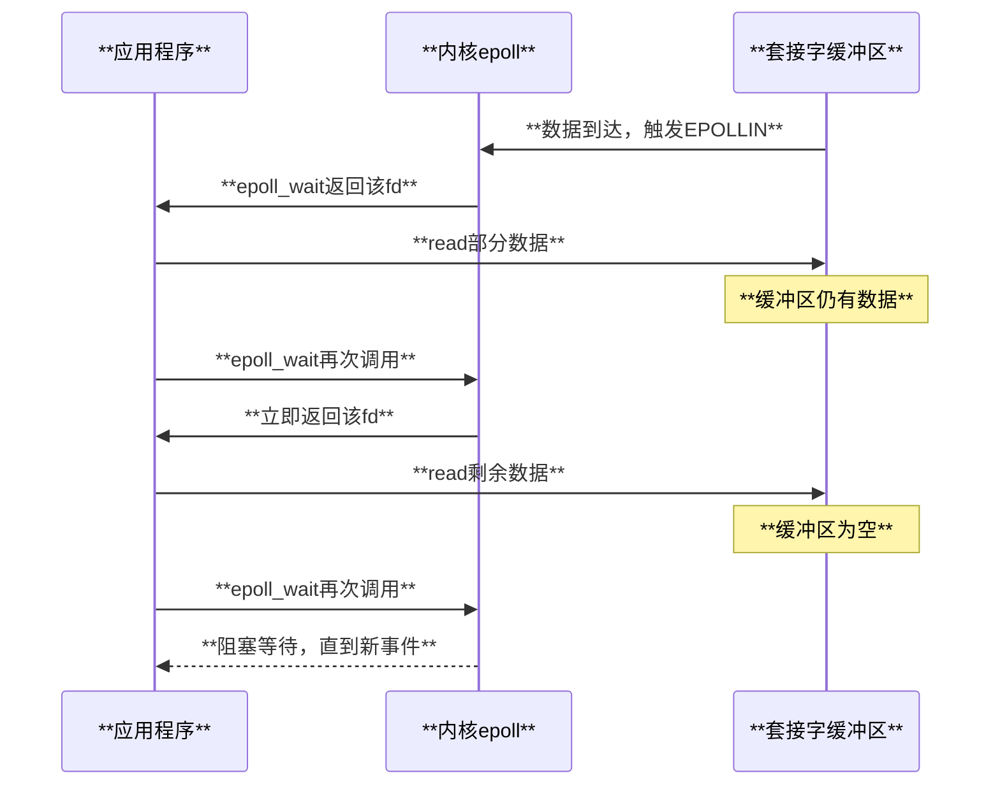
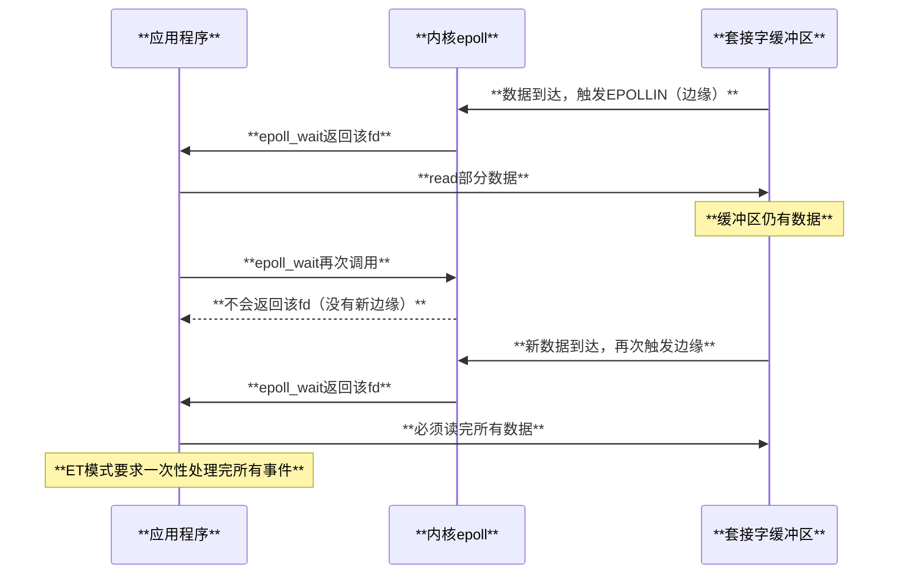

# Linux epoll机制深度解析

## 目录

1. [概述](#概述)
2. [epoll设计原理](#epoll设计原理)
3. [核心数据结构](#核心数据结构)
4. [系统调用接口](#系统调用接口)
5. [内核实现机制](#内核实现机制)
6. [事件通知模式](#事件通知模式)
7. [性能分析与优化](#性能分析与优化)
8. [使用场景分析](#使用场景分析)
9. [优缺点对比](#优缺点对比)
10. [最佳实践](#最佳实践)
11. [限制与注意事项](#限制与注意事项)
12. [总结](#总结)

## 概述

epoll（event poll）是Linux内核提供的一种高性能I/O事件通知机制，设计用于处理大量并发连接的场景。相比传统的select和poll机制，epoll具有更好的可扩展性和性能特征，是现代高性能网络服务器的核心技术之一。

### 核心特点

- **O(1)复杂度**：事件检查和通知的时间复杂度为O(1)
- **边缘触发支持**：支持水平触发(LT)和边缘触发(ET)两种模式
- **内存高效**：使用红黑树管理监控的文件描述符
- **零拷贝优化**：直接在内核空间管理事件，减少用户态拷贝
- **可扩展性强**：能够高效处理百万级并发连接

### 应用场景

epoll广泛应用于高性能网络服务器、数据库系统、消息队列等需要处理大量并发I/O的场景：

- **Web服务器**：Nginx、Apache等
- **数据库**：Redis、MySQL等
- **消息中间件**：Kafka、RocketMQ等
- **代理服务**：HAProxy、Envoy等

## epoll设计原理

### 传统I/O多路复用的问题

在epoll出现之前，Linux主要使用select和poll进行I/O多路复用：

```c
// select的问题
int select(int nfds, fd_set *readfds, fd_set *writefds,
          fd_set *exceptfds, struct timeval *timeout);

// 问题：
// 1. O(n)时间复杂度：每次调用需要遍历所有文件描述符
// 2. 文件描述符数量限制：FD_SETSIZE通常为1024
// 3. 用户态和内核态数据拷贝开销大
// 4. 无法区分哪个文件描述符就绪，需要重新遍历

// poll的问题  
int poll(struct pollfd *fds, nfds_t nfds, int timeout);

// 改进：
// 1. 无文件描述符数量限制
// 问题：
// 1. 仍然是O(n)时间复杂度
// 2. 大量文件描述符时性能下降严重
```

### epoll的革新设计

epoll通过以下创新设计解决了传统方法的问题：

```mermaid
graph **LR**
    A[**应用程序**] --> B[**epoll_create<br/>创建epoll实例**]
    B --> C[**内核epoll对象**]
    
    A --> D[**epoll_ctl<br/>管理监控FD**]
    D --> E[**红黑树<br/>存储监控FD**]
    
    F[**事件触发**] --> G[**内核事件处理**]
    G --> H[**就绪队列<br/>rdllist**]
    
    A --> I[**epoll_wait<br/>等待事件**]
    I --> H
    H --> J[**返回就绪事件**]
    
    style C fill:**#e3f2fd**
    style E fill:**#e8f5e8**
    style H fill:**#fff3e0**
    style J fill:**#f3e5f5**
```

## 核心数据结构

### epoll实例结构

```c
// epoll实例的核心数据结构 - fs/eventpoll.c
struct eventpoll {
    // 保护文件操作的互斥锁
    struct mutex mtx;

    // epoll_wait()使用的等待队列
    wait_queue_head_t wq;

    // 文件poll()使用的等待队列
    wait_queue_head_t poll_wait;

    // 就绪文件描述符列表
    struct list_head rdllist;

    // 保护rdllist和ovflist的读写锁
    rwlock_t lock;

    // 存储监控fd的红黑树根节点
    struct rb_root_cached rbr;

    // 溢出列表：转移就绪事件到用户空间时的单链表
    struct epitem *ovflist;

    // 唤醒源（用于电源管理）
    struct wakeup_source *ws;

    // 创建该eventpoll的用户
    struct user_struct *user;

    // 关联的文件对象
    struct file *file;

    // 循环检测优化
    u64 gen;
    struct hlist_head refs;

    // 引用计数
    refcount_t refcount;

#ifdef CONFIG_NET_RX_BUSY_POLL
    // 忙轮询优化
    unsigned int napi_id;
    u32 busy_poll_usecs;
    u16 busy_poll_budget;
    bool prefer_busy_poll;
#endif

#ifdef CONFIG_DEBUG_LOCK_ALLOC
    u8 nests;  // lockdep验证用的嵌套层次
#endif
};
```

### 监控项数据结构

```c
// 每个被监控的文件描述符对应一个epitem - fs/eventpoll.c
struct epitem {
    union {
        // 红黑树节点，将此结构链接到eventpoll的RB树
        struct rb_node rbn;
        // 用于释放struct epitem的RCU头
        struct rcu_head rcu;
    };

    // 链接到eventpoll就绪列表的链表头
    struct list_head rdllink;

    // 与eventpoll->ovflist配合的单链表节点
    struct epitem *next;

    // 此项引用的文件描述符信息
    struct epoll_filefd ffd;

    // 正在被释放的标志（与refcount配合管理生命周期）
    bool dying;

    // 包含poll等待队列的列表
    struct eppoll_entry *pwqlist;

    // 此项的容器eventpoll
    struct eventpoll *ep;

    // 链接到"struct file"项列表的链表头
    struct hlist_node fllink;

    // EPOLLWAKEUP设置时使用的唤醒源
    struct wakeup_source __rcu *ws;

    // 描述感兴趣事件和源fd的结构
    struct epoll_event event;
};

// 文件描述符信息
struct epoll_filefd {
    struct file *file;  // 文件对象指针
    int fd;             // 文件描述符编号
} __packed;
```

### 等待队列条目

```c
// poll钩子使用的等待结构 - fs/eventpoll.c
struct eppoll_entry {
    // 链接到"struct epitem"的链表头
    struct eppoll_entry *next;

    // 基础指针指向容器"struct epitem"
    struct epitem *base;

    // 将被链接到目标文件等待队列头的等待队列项
    wait_queue_entry_t wait;

    // 链接了"wait"等待队列项的等待队列头
    wait_queue_head_t *whead;
};

// poll队列包装器
struct ep_pqueue {
    poll_table pt;      // 标准poll表
    struct epitem *epi; // 关联的epitem
};
```

### 内存管理和限制

```c
// epoll配置限制 - fs/eventpoll.c

// 每用户最大监控描述符数量
static long max_user_watches __read_mostly;

// epoll嵌套防循环检测
static DEFINE_MUTEX(epnested_mutex);
#define EP_MAX_NESTS 4  // 最大嵌套层数

// 单次返回的最大事件数
#define EP_MAX_EVENTS (INT_MAX / sizeof(struct epoll_event))

// 每个epitem的内存开销
#define EP_ITEM_COST (sizeof(struct epitem) + sizeof(struct eppoll_entry))

// 私有事件位掩码
#define EP_PRIVATE_BITS (EPOLLWAKEUP | EPOLLONESHOT | EPOLLET | EPOLLEXCLUSIVE)
```

## 系统调用接口

### epoll_create - 创建epoll实例

```c
// 创建epoll文件描述符 - fs/eventpoll.c
SYSCALL_DEFINE1(epoll_create1, int, flags)
{
    return do_epoll_create(flags);
}

SYSCALL_DEFINE1(epoll_create, int, size)
{
    if (size <= 0)
        return -EINVAL;
    return do_epoll_create(0);
}

static int do_epoll_create(int flags)
{
    int error, fd;
    struct eventpoll *ep = NULL;
    struct file *file;

    // 检查标志的一致性
    BUILD_BUG_ON(EPOLL_CLOEXEC != O_CLOEXEC);
    
    if (flags & ~EPOLL_CLOEXEC)
        return -EINVAL;

    // 创建内部数据结构("struct eventpoll")
    error = ep_alloc(&ep);
    if (error < 0)
        return error;

    // 创建文件结构和空闲文件描述符
    fd = get_unused_fd_flags(O_RDWR | (flags & O_CLOEXEC));
    if (fd < 0) {
        error = fd;
        goto out_free_ep;
    }

    // 创建匿名inode文件
    file = anon_inode_getfile("[eventpoll]", &eventpoll_fops, ep,
                 O_RDWR | (flags & O_CLOEXEC));
    if (IS_ERR(file)) {
        error = PTR_ERR(file);
        goto out_free_fd;
    }

    ep->file = file;
    fd_install(fd, file);
    return fd;

out_free_fd:
    put_unused_fd(fd);
out_free_ep:
    ep_clear_and_put(ep);
    return error;
}
```

### epoll_ctl - 控制监控的文件描述符

```c
// 控制接口，用于插入/删除/修改文件描述符 - fs/eventpoll.c
SYSCALL_DEFINE4(epoll_ctl, int, epfd, int, op, int, fd,
        struct epoll_event __user *, event)
{
    struct epoll_event epds;

    if (ep_op_has_event(op) &&
        copy_from_user(&epds, event, sizeof(struct epoll_event)))
        return -EFAULT;

    return do_epoll_ctl(epfd, op, fd, &epds, false);
}

int do_epoll_ctl(int epfd, int op, int fd, struct epoll_event *epds, bool nonblock)
{
    int error;
    int full_check = 0;
    struct fd f, tf;
    struct eventpoll *ep;
    struct epitem *epi;
    struct eventpoll *tep = NULL;

    // 获取epoll文件描述符
    error = -EBADF;
    f = fdget(epfd);
    if (!fd_file(f))
        goto error_return;

    // 获取目标文件描述符
    tf = fdget(fd);
    if (!fd_file(tf))
        goto error_fput;

    // 目标文件描述符必须支持poll
    error = -EPERM;
    if (!file_can_poll(fd_file(tf)))
        goto error_tgt_fput;

    // 处理EPOLLWAKEUP权限检查
    if (ep_op_has_event(op))
        ep_take_care_of_epollwakeup(epds);

    // 验证文件描述符不是自身且是epoll文件
    error = -EINVAL;
    if (fd_file(f) == fd_file(tf) || !is_file_epoll(fd_file(f)))
        goto error_tgt_fput;

    // EPOLLEXCLUSIVE限制检查
    if (ep_op_has_event(op) && (epds->events & EPOLLEXCLUSIVE)) {
        if (op == EPOLL_CTL_MOD)
            goto error_tgt_fput;
        if (op == EPOLL_CTL_ADD && (is_file_epoll(fd_file(tf)) ||
                (epds->events & ~EPOLLEXCLUSIVE_OK_BITS)))
            goto error_tgt_fput;
    }

    ep = fd_file(f)->private_data;

    // 循环检测：防止epoll文件描述符嵌套形成环路
    if (op == EPOLL_CTL_ADD && (is_file_epoll(fd_file(tf)) ||
                  ep_loop_check(ep, fd_file(tf)) != 0)) {
        mutex_lock(&epnested_mutex);
        full_check = 1;
        if (is_file_epoll(fd_file(tf))) {
            tep = fd_file(tf)->private_data;
            error = -ELOOP;
            if (ep_loop_check_proc(ep, tep, EP_MAX_NESTS + 1) != 0)
                goto error_tgt_fput;
        } else {
            get_file(fd_file(tf));
            list_add(&fd_file(tf)->f_tfile_llink, &tfile_check_list);
        }
    }

    error = epoll_mutex_lock(&ep->mtx, 0, nonblock);
    if (error)
        goto error_tgt_fput;

    // 在红黑树中查找epitem
    epi = ep_find(ep, fd_file(tf), fd);

    error = -EINVAL;
    switch (op) {
    case EPOLL_CTL_ADD:
        if (!epi) {
            epds->events |= EPOLLERR | EPOLLHUP;
            error = ep_insert(ep, epds, fd_file(tf), fd, full_check);
        } else
            error = -EEXIST;
        break;
    case EPOLL_CTL_DEL:
        if (epi) {
            ep_remove_safe(ep, epi);
            error = 0;
        } else {
            error = -ENOENT;
        }
        break;
    case EPOLL_CTL_MOD:
        if (epi) {
            if (!(epi->event.events & EPOLLEXCLUSIVE)) {
                epds->events |= EPOLLERR | EPOLLHUP;
                error = ep_modify(ep, epi, epds);
            }
        } else
            error = -ENOENT;
        break;
    }
    mutex_unlock(&ep->mtx);

error_tgt_fput:
    if (full_check) {
        clear_tfile_check_list();
        loop_check_gen++;
        mutex_unlock(&epnested_mutex);
    }

    fdput(tf);
error_fput:
    fdput(f);
error_return:
    return error;
}
```

### epoll_wait - 等待事件发生

```c
// 等待事件的内核部分 - fs/eventpoll.c
static int do_epoll_wait(int epfd, struct epoll_event __user *events,
             int maxevents, struct timespec64 *to)
{
    int error;
    struct fd f;
    struct eventpoll *ep;

    // 验证参数
    if (maxevents <= 0 || maxevents > EP_MAX_EVENTS)
        return -EINVAL;

    if (!access_ok(events, maxevents * sizeof(struct epoll_event)))
        return -EFAULT;

    // 获取epoll文件
    f = fdget(epfd);
    if (!fd_file(f))
        return -EBADF;

    error = -EINVAL;
    if (!is_file_epoll(fd_file(f)))
        goto error_fput;

    ep = fd_file(f)->private_data;

    // 核心等待逻辑
    error = ep_poll(ep, events, maxevents, to);

error_fput:
    fdput(f);
    return error;
}

SYSCALL_DEFINE4(epoll_wait, int, epfd, struct epoll_event __user *, events,
        int, maxevents, int, timeout)
{
    struct timespec64 to;

    return do_epoll_wait(epfd, events, maxevents,
                 ep_timeout_to_timespec(&to, timeout));
}
```

## 内核实现机制

### 红黑树管理监控描述符

```c
// 红黑树操作 - fs/eventpoll.c

// 在红黑树中插入epitem
static void ep_rbtree_insert(struct eventpoll *ep, struct epitem *epi)
{
    int kcmp;
    struct rb_node **p = &ep->rbr.rb_root.rb_node, *parent = NULL;
    struct epitem *epic;
    bool leftmost = true;

    while (*p) {
        parent = *p;
        epic = rb_entry(parent, struct epitem, rbn);
        kcmp = ep_cmp_ffd(&epi->ffd, &epic->ffd);
        if (kcmp > 0) {
            p = &parent->rb_right;
            leftmost = false;
        } else
            p = &parent->rb_left;
    }
    rb_link_node(&epi->rbn, parent, p);
    rb_insert_color_cached(&epi->rbn, &ep->rbr, leftmost);
}

// 在红黑树中查找epitem
static struct epitem *ep_find(struct eventpoll *ep, struct file *file, int fd)
{
    int kcmp;
    struct rb_node *rbp;
    struct epitem *epi, *epir = NULL;
    struct epoll_filefd ffd;

    ep_set_ffd(&ffd, file, fd);
    
    // 在缓存的红黑树中搜索
    for (rbp = ep->rbr.rb_root.rb_node; rbp; ) {
        epi = rb_entry(rbp, struct epitem, rbn);
        kcmp = ep_cmp_ffd(&ffd, &epi->ffd);
        if (kcmp > 0)
            rbp = rbp->rb_right;
        else if (kcmp < 0)
            rbp = rbp->rb_left;
        else {
            epir = epi;
            break;
        }
    }

    return epir;
}

// 文件描述符比较函数
static inline int ep_cmp_ffd(struct epoll_filefd *p1, struct epoll_filefd *p2)
{
    return (p1->file > p2->file ? +1:
            (p1->file < p2->file ? -1 : p1->fd - p2->fd));
}
```

### 事件通知机制

```c
// 事件通知的核心回调函数 - fs/eventpoll.c
static int ep_poll_callback(wait_queue_entry_t *wait, unsigned mode, int sync, void *key)
{
    int pwake = 0;
    struct epitem *epi = ep_item_from_wait(wait);
    struct eventpoll *ep = epi->ep;
    __poll_t pollflags = key_to_poll(key);
    unsigned long flags;
    int ewake = 0;

    read_lock_irqsave(&ep->lock, flags);

    ep_set_busy_poll_napi_id(epi);

    /*
     * 如果事件掩码不匹配我们感兴趣的事件，则直接返回。
     * 边缘触发模式下，我们总是进入此处，因为我们想要重新武装polling。
     */
    if (!(epi->event.events & ~EP_PRIVATE_BITS))
        goto out_unlock;

    /*
     * 检查我们感兴趣的事件掩码，并检查是否发生了某些事件。
     * 注意：一个事件可能同时被多个epoll实例监控。
     */
    if (pollflags && !(pollflags & epi->event.events))
        goto out_unlock;

    /*
     * 如果我们处于边缘触发模式内部，我们需要确保
     * 我们不会重复发送此项的事件直到文件再次poll出新的事件。
     */
    if (epi->event.events & EPOLLET) {
        /*
         * 边缘触发：清除EPOLLONESHOT以避免在重新武装后丢失事件。
         * 对于EPOLLONESHOT | EPOLLET组合，用户程序必须使用EPOLL_CTL_MOD重新武装。
         */
        if (!(epi->event.events & EPOLLONESHOT))
            goto is_linked;
    }

    /* 如果此文件已经在就绪列表中，我们完成了 */
    if (!list_empty_careful(&epi->rdllink)) {
        ep_pm_stay_awake(epi);
        goto out_unlock;
    }

    /* 通知我们有数据了 */
    list_add_tail(&epi->rdllink, &ep->rdllist);

is_linked:
    /*
     * 唤醒那些在此eventpoll上等待的任务。
     */
    if (waitqueue_active(&ep->wq)) {
        if ((epi->event.events & EPOLLEXCLUSIVE) &&
                !(pollflags & POLLFREE)) {
            switch (pollflags & EPOLLINOUT_BITS) {
            case EPOLLIN:
                if (epi->event.events & EPOLLIN)
                    ewake = 1;
                break;
            case EPOLLOUT:
                if (epi->event.events & EPOLLOUT)
                    ewake = 1;
                break;
            case 0:
                ewake = 1;
                break;
            }
        }
        wake_up(&ep->wq);
    }
    if (waitqueue_active(&ep->poll_wait))
        pwake++;

out_unlock:
    read_unlock_irqrestore(&ep->lock, flags);

    /* 我们必须从spinlock内部检查我们的ep状态 */
    if (pwake)
        ep_poll_safewake(ep, NULL, 0);

    if (!(epi->event.events & EPOLLEXCLUSIVE))
        ewake = 1;

    if (pollflags & POLLFREE) {
        /*
         * 我们不再关心关于这个事项的事件，因此我们必须删除它
         * 从等待队列。之后我们避免了进一步的wakeup回调。
         */
        list_del_init(&wait->entry);
        /*
         * The above is needed for cases where we are called from
         * __cleanup_sighand(). We can't race with ep_remove_wait_queue().
         */
    }

    return ewake;
}
```

### 事件收集和传输

```c
// 将就绪事件发送到用户空间 - fs/eventpoll.c
static int ep_send_events(struct eventpoll *ep,
              struct epoll_event __user *events, int maxevents)
{
    struct epitem *epi, *tmp;
    LIST_HEAD(txlist);
    poll_table pt;
    int res = 0;

    /*
     * 我们需要在没有锁的情况下遍历就绪列表和转移事件到用户空间，
     * 为了避免拷贝到用户空间时睡眠可能导致的死锁。
     */
    init_poll_funcptr(&pt, NULL);

    mutex_lock(&ep->mtx);
    ep_start_scan(ep, &txlist);

    /*
     * 遍历txlist并处理每个就绪的epitem。
     * 我们处理事项的方式使得txlist不会增长，除非op在EPOLL_CTL_ADD期间失败。
     */
    list_for_each_entry_safe(epi, tmp, &txlist, rdllink) {
        struct wakeup_source *ws;
        __poll_t revents;

        if (res >= maxevents)
            break;

        /*
         * 激活ep->ws，因为epi->ws可能在我们释放->mtx时被ep_remove()给释放。
         */
        ws = ep_wakeup_source(epi);
        if (ws) {
            if (ws->active)
                __pm_stay_awake(ep->ws);
            __pm_relax(ws);
        }

        list_del_init(&epi->rdllink);

        /*
         * 如果项目不处于我们正在发送事件的一般链表中，
         * 在此时，项目无法在就绪列表和溢出列表之间竞争。
         * 读取获取与ep_scan_ready_list()中的写入释放配对。
         */
        revents = ep_item_poll(epi, &pt, 1);
        if (!revents)
            continue;

        events = epoll_put_uevent(revents, epi->event.data, events);
        if (!events) {
            list_add(&epi->rdllink, &txlist);
            ep_pm_stay_awake(epi);
            if (!res)
                res = -EFAULT;
            break;
        }
        res++;
        if (epi->event.events & EPOLLONESHOT)
            epi->event.events &= EP_PRIVATE_BITS;
        else if (!(epi->event.events & EPOLLET)) {
            /*
             * 如果这个文件已经处于"就绪"状态，我们可以重新插入
             * 它进入就绪列表（如果它不是EPOLLET或EPOLLONESHOT的话）
             */
            list_add_tail(&epi->rdllink, &ep->rdllist);
            ep_pm_stay_awake(epi);
        }
    }

    ep_done_scan(ep, &txlist);
    mutex_unlock(&ep->mtx);

    return res;
}
```

## 事件通知模式

### 水平触发 (Level-Triggered, LT)

水平触发是epoll的默认模式，与传统的select和poll行为兼容：

```c
// 水平触发模式示例
int epfd = epoll_create1(0);
struct epoll_event ev;

// 添加文件描述符，默认为LT模式
ev.events = EPOLLIN;
ev.data.fd = sockfd;
epoll_ctl(epfd, EPOLL_CTL_ADD, sockfd, &ev);

// 特点：
// 1. 只要缓冲区有数据，就会持续通知
// 2. 即使没有完全读取完数据，下次epoll_wait仍会返回该fd
// 3. 应用程序可以部分处理事件
```

**水平触发的工作流程：**



### 边缘触发 (Edge-Triggered, ET)

边缘触发模式只在状态发生变化时通知，提供更高的性能但需要更小心的处理：

```c
// 边缘触发模式示例
int epfd = epoll_create1(0);
struct epoll_event ev;

// 添加文件描述符，使用ET模式
ev.events = EPOLLIN | EPOLLET;  // 关键：EPOLLET标志
ev.data.fd = sockfd;
epoll_ctl(epfd, EPOLL_CTL_ADD, sockfd, &ev);

// 必须设置为非阻塞模式
int flags = fcntl(sockfd, F_GETFL, 0);
fcntl(sockfd, F_SETFL, flags | O_NONBLOCK);

// ET模式的正确处理方式
while (1) {
    struct epoll_event events[MAX_EVENTS];
    int nfds = epoll_wait(epfd, events, MAX_EVENTS, -1);
    
    for (int i = 0; i < nfds; i++) {
        if (events[i].events & EPOLLIN) {
            // ET模式必须一次性读完所有数据
            while (1) {
                char buf[1024];
                ssize_t n = read(events[i].data.fd, buf, sizeof(buf));
                if (n == -1) {
                    if (errno == EAGAIN || errno == EWOULDBLOCK) {
                        break;  // 数据读完了
                    } else {
                        // 真正的错误
                        perror("read");
                        break;
                    }
                } else if (n == 0) {
                    // 连接关闭
                    break;
                } else {
                    // 处理读取的数据
                    process_data(buf, n);
                }
            }
        }
    }
}
```

**边缘触发的工作流程：**



### EPOLLONESHOT模式

```c
// EPOLLONESHOT：事件触发后自动移除
ev.events = EPOLLIN | EPOLLONESHOT;
epoll_ctl(epfd, EPOLL_CTL_ADD, sockfd, &ev);

// 处理完事件后需要重新添加
if (epoll_wait返回该fd) {
    // 处理事件...
    
    // 重新添加监控
    ev.events = EPOLLIN | EPOLLONESHOT;
    epoll_ctl(epfd, EPOLL_CTL_MOD, sockfd, &ev);
}
```

### 事件类型对比

| **触发模式** | **通知特点** | **性能** | **编程复杂度** | **适用场景** |
|-------------|-------------|---------|----------------|-------------|
| **水平触发<br/>(LT)** | **状态保持时持续通知**<br/>• 兼容select/poll<br/>• 允许部分处理 | **中等**<br/>• 可能产生多次通知<br/>• 相对较多的系统调用 | **简单**<br/>• 容错性强<br/>• 易于调试 | **一般应用**<br/>• 事件处理简单<br/>• 对性能要求不极致 |
| **边缘触发<br/>(ET)** | **状态变化时单次通知**<br/>• 需要一次性处理完<br/>• 必须非阻塞I/O | **高**<br/>• 减少系统调用<br/>• 更少的内核用户态切换 | **复杂**<br/>• 必须处理EAGAIN<br/>• 错误处理复杂 | **高性能服务器**<br/>• 大量并发连接<br/>• 对延迟敏感 |
| **ONESHOT** | **触发后自动移除监控**<br/>• 防止多线程竞争<br/>• 需要手动重新添加 | **中等**<br/>• 减少竞争条件<br/>• 需要额外的ctl调用 | **中等**<br/>• 需要管理状态<br/>• 适合多线程 | **多线程服务器**<br/>• 避免惊群效应<br/>• 线程池模式 |

## 性能分析与优化

### epoll性能优势

```c
// 性能对比：时间复杂度分析

// select/poll: O(n)
// 每次调用都需要：
// 1. 从用户态拷贝fd_set到内核态
// 2. 遍历所有文件描述符检查状态
// 3. 将结果拷贝回用户态
for (int i = 0; i < nfds; i++) {
    if (FD_ISSET(i, &readfds)) {
        // 找到就绪的fd，但不知道是哪个事件类型
    }
}

// epoll: O(1)
// 只处理就绪的文件描述符：
int nfds = epoll_wait(epfd, events, MAX_EVENTS, timeout);
for (int i = 0; i < nfds; i++) {
    // events[i]直接包含就绪的fd和事件类型
    handle_event(&events[i]);
}
```

### 内存使用优化

```c
// epoll内存效率分析 - fs/eventpoll.c

// 每个监控的fd的内存开销
#define EP_ITEM_COST (sizeof(struct epitem) + sizeof(struct eppoll_entry))

// struct epitem大约 120-150 字节
// struct eppoll_entry大约 40-60 字节
// 总开销约 160-210 字节每个监控的fd

// 对比select的内存使用：
// fd_set: 固定大小，通常1024位 = 128字节
// 但select只能监控有限数量的fd (FD_SETSIZE)

// 对比poll的内存使用：
// struct pollfd: 8字节每个fd
// 需要在每次调用时从用户态复制到内核态
```

### 系统调用优化

```c
// epoll系统调用优化策略

// 1. 批量事件处理
#define MAX_EVENTS 1000
struct epoll_event events[MAX_EVENTS];

while (1) {
    int nfds = epoll_wait(epfd, events, MAX_EVENTS, -1);
    
    // 批量处理事件，减少系统调用次数
    for (int i = 0; i < nfds; i++) {
        handle_event(&events[i]);
    }
}

// 2. 事件聚合：使用EPOLLEXCLUSIVE避免惊群
ev.events = EPOLLIN | EPOLLEXCLUSIVE;
epoll_ctl(epfd, EPOLL_CTL_ADD, listen_fd, &ev);

// 3. 使用ET模式减少通知次数
ev.events = EPOLLIN | EPOLLET;

// 4. 合理设置超时
// 对于服务器：使用较小的超时处理定时任务
int timeout = 100;  // 100ms
epoll_wait(epfd, events, MAX_EVENTS, timeout);

// 对于客户端：可以使用更长的超时或-1
epoll_wait(epfd, events, MAX_EVENTS, -1);
```

### 忙轮询优化

```c
// 网络忙轮询优化 - CONFIG_NET_RX_BUSY_POLL
struct eventpoll {
    // ...
#ifdef CONFIG_NET_RX_BUSY_POLL
    unsigned int napi_id;      // 网络适配器队列ID
    u32 busy_poll_usecs;       // 忙轮询超时微秒
    u16 busy_poll_budget;      // 忙轮询包预算
    bool prefer_busy_poll;     // 是否首选忙轮询
#endif
};

// 应用层配置忙轮询
int busy_poll = 50;  // 50微秒
setsockopt(sockfd, SOL_SOCKET, SO_BUSY_POLL, 
           &busy_poll, sizeof(busy_poll));

// 系统级配置
// echo 50 > /proc/sys/net/core/busy_poll
// echo 1 > /proc/sys/net/core/busy_read
```

## 使用场景分析

### 高性能Web服务器

```c
// Nginx-style epoll使用模式
int create_server_epoll() {
    int epfd = epoll_create1(EPOLL_CLOEXEC);
    int listen_fd = create_listen_socket(8080);
    
    // 监听套接字使用LT模式
    struct epoll_event ev;
    ev.events = EPOLLIN;
    ev.data.fd = listen_fd;
    epoll_ctl(epfd, EPOLL_CTL_ADD, listen_fd, &ev);
    
    return epfd;
}

void server_event_loop(int epfd, int listen_fd) {
    struct epoll_event events[1024];
    
    while (1) {
        int nfds = epoll_wait(epfd, events, 1024, -1);
        
        for (int i = 0; i < nfds; i++) {
            if (events[i].data.fd == listen_fd) {
                // 接受新连接
                accept_new_connections(epfd, listen_fd);
            } else {
                // 处理客户端数据
                if (events[i].events & EPOLLIN) {
                    handle_read(events[i].data.fd);
                }
                if (events[i].events & EPOLLOUT) {
                    handle_write(events[i].data.fd);
                }
            }
        }
    }
}

void accept_new_connections(int epfd, int listen_fd) {
    while (1) {
        int client_fd = accept(listen_fd, NULL, NULL);
        if (client_fd == -1) {
            if (errno == EAGAIN || errno == EWOULDBLOCK) {
                break;  // 没有更多连接
            }
            perror("accept");
            break;
        }
        
        // 设置非阻塞
        set_nonblocking(client_fd);
        
        // 添加到epoll，使用ET模式
        struct epoll_event ev;
        ev.events = EPOLLIN | EPOLLET;
        ev.data.fd = client_fd;
        epoll_ctl(epfd, EPOLL_CTL_ADD, client_fd, &ev);
    }
}
```

### 数据库连接池

```c
// Redis-style 事件驱动架构
typedef struct {
    int epfd;
    struct epoll_event *events;
    int max_events;
    int timeout;
} event_loop_t;

typedef struct {
    int fd;
    int events;
    void (*read_handler)(int fd);
    void (*write_handler)(int fd);
    void *data;
} file_event_t;

event_loop_t *create_event_loop(int max_events) {
    event_loop_t *loop = malloc(sizeof(event_loop_t));
    
    loop->epfd = epoll_create1(EPOLL_CLOEXEC);
    loop->events = malloc(sizeof(struct epoll_event) * max_events);
    loop->max_events = max_events;
    loop->timeout = -1;
    
    return loop;
}

int add_file_event(event_loop_t *loop, int fd, int events,
                  void (*read_handler)(int), void (*write_handler)(int)) {
    
    file_event_t *fe = get_file_event(fd);
    struct epoll_event ee;
    
    ee.events = 0;
    ee.data.fd = fd;
    
    if (events & READABLE) ee.events |= EPOLLIN;
    if (events & WRITABLE) ee.events |= EPOLLOUT;
    
    fe->read_handler = read_handler;
    fe->write_handler = write_handler;
    
    return epoll_ctl(loop->epfd, EPOLL_CTL_ADD, fd, &ee);
}

void process_events(event_loop_t *loop) {
    while (1) {
        int nfds = epoll_wait(loop->epfd, loop->events, 
                             loop->max_events, loop->timeout);
        
        for (int i = 0; i < nfds; i++) {
            int fd = loop->events[i].data.fd;
            int events = loop->events[i].events;
            file_event_t *fe = get_file_event(fd);
            
            if (events & EPOLLIN && fe->read_handler) {
                fe->read_handler(fd);
            }
            if (events & EPOLLOUT && fe->write_handler) {
                fe->write_handler(fd);
            }
            if (events & (EPOLLERR | EPOLLHUP)) {
                handle_error(fd);
            }
        }
    }
}
```

### 多线程网络服务器

```c
// 线程池 + epoll 模式
typedef struct {
    int epfd;
    pthread_t *threads;
    int thread_count;
    int listen_fd;
} server_t;

// 主线程：负责accept新连接
void *accept_thread(void *arg) {
    server_t *server = (server_t *)arg;
    
    while (1) {
        int client_fd = accept(server->listen_fd, NULL, NULL);
        if (client_fd > 0) {
            set_nonblocking(client_fd);
            
            // 使用EPOLLONESHOT避免多线程竞争
            struct epoll_event ev;
            ev.events = EPOLLIN | EPOLLONESHOT;
            ev.data.fd = client_fd;
            epoll_ctl(server->epfd, EPOLL_CTL_ADD, client_fd, &ev);
        }
    }
    return NULL;
}

// 工作线程：处理I/O事件
void *worker_thread(void *arg) {
    server_t *server = (server_t *)arg;
    struct epoll_event events[100];
    
    while (1) {
        int nfds = epoll_wait(server->epfd, events, 100, 1000);
        
        for (int i = 0; i < nfds; i++) {
            int fd = events[i].data.fd;
            
            if (events[i].events & EPOLLIN) {
                handle_client_request(fd);
                
                // EPOLLONESHOT模式下需要重新添加
                struct epoll_event ev;
                ev.events = EPOLLIN | EPOLLONESHOT;
                ev.data.fd = fd;
                epoll_ctl(server->epfd, EPOLL_CTL_MOD, fd, &ev);
            }
        }
    }
    return NULL;
}
```

## 优缺点对比

### epoll vs select

| **特性** | **epoll** | **select** |
|---------|-----------|-----------|
| **时间复杂度** | **O(1)** | **O(n)** |
| **文件描述符限制** | **系统内存限制**<br/>（通常可达百万级） | **FD_SETSIZE限制**<br/>（通常1024） |
| **数据拷贝** | **事件驱动，仅拷贝就绪事件** | **每次调用都需要拷贝fd_set** |
| **跨平台性** | **Linux专用** | **POSIX标准，跨平台** |
| **内存使用** | **按需分配，效率高** | **固定大小，可能浪费** |
| **编程复杂度** | **相对复杂，但功能强大** | **简单，但功能有限** |

### epoll vs poll

| **特性** | **epoll** | **poll** |
|---------|-----------|---------|
| **性能** | **O(1)复杂度，高性能** | **O(n)复杂度，性能递减** |
| **事件返回** | **直接返回就绪事件** | **需要遍历查找就绪fd** |
| **文件描述符限制** | **无限制** | **无硬编码限制** |
| **内存效率** | **事件驱动，内存效率高** | **每次调用需要拷贝pollfd数组** |
| **边缘触发** | **支持ET和LT模式** | **仅支持LT模式** |

### epoll优点

1. **性能优异**：
   - O(1)时间复杂度
   - 仅处理就绪的文件描述符
   - 减少用户态和内核态的数据拷贝

2. **可扩展性强**：
   - 支持数十万甚至百万级并发连接
   - 内存使用与活跃连接数成正比

3. **功能丰富**：
   - 支持边缘触发和水平触发
   - 支持ONESHOT、EXCLUSIVE等高级特性
   - 集成忙轮询优化

4. **事件精确**：
   - 直接返回具体的事件类型
   - 避免遍历所有文件描述符

### epoll缺点

1. **平台限制**：
   - 仅支持Linux平台
   - 不具备跨平台能力

2. **编程复杂**：
   - 边缘触发模式需要小心处理
   - 错误处理相对复杂
   - 需要理解各种事件语义

3. **内存开销**：
   - 每个监控的fd都有内存开销
   - 大量监控fd时内存使用较高

4. **调试困难**：
   - 异步事件调试相对困难
   - 竞争条件问题不容易发现

## 最佳实践

### 服务器架构设计

```c
// 推荐的高性能服务器架构
typedef struct {
    int epfd;                    // epoll文件描述符
    int listen_fd;               // 监听套接字
    struct epoll_event *events;  // 事件数组
    int max_events;              // 最大事件数
    
    // 连接管理
    connection_t *connections;   // 连接池
    int max_connections;         // 最大连接数
    int active_connections;      // 活跃连接数
    
    // 线程模型
    pthread_t *worker_threads;   // 工作线程
    int thread_count;            // 线程数量
    
    // 统计信息
    atomic_t total_connections;  // 总连接数
    atomic_t total_requests;     // 总请求数
} server_context_t;

// 1. 合理设置参数
server_context_t *init_server(int port) {
    server_context_t *ctx = calloc(1, sizeof(server_context_t));
    
    // 创建epoll实例
    ctx->epfd = epoll_create1(EPOLL_CLOEXEC);
    
    // 设置合理的事件缓冲区大小
    ctx->max_events = min(1024, ctx->max_connections / 10);
    ctx->events = malloc(sizeof(struct epoll_event) * ctx->max_events);
    
    // 创建监听套接字
    ctx->listen_fd = create_listen_socket(port);
    set_socket_options(ctx->listen_fd);
    
    // 添加监听套接字到epoll
    struct epoll_event ev;
    ev.events = EPOLLIN;
    ev.data.ptr = &ctx->listen_fd;  // 使用ptr而非fd
    epoll_ctl(ctx->epfd, EPOLL_CTL_ADD, ctx->listen_fd, &ev);
    
    return ctx;
}

// 2. 优化套接字设置
void set_socket_options(int sockfd) {
    // 设置非阻塞
    int flags = fcntl(sockfd, F_GETFL, 0);
    fcntl(sockfd, F_SETFL, flags | O_NONBLOCK);
    
    // 设置SO_REUSEADDR
    int reuse = 1;
    setsockopt(sockfd, SOL_SOCKET, SO_REUSEADDR, &reuse, sizeof(reuse));
    
    // 设置SO_REUSEPORT（如果支持）
#ifdef SO_REUSEPORT
    setsockopt(sockfd, SOL_SOCKET, SO_REUSEPORT, &reuse, sizeof(reuse));
#endif
    
    // 设置TCP_NODELAY
    setsockopt(sockfd, IPPROTO_TCP, TCP_NODELAY, &reuse, sizeof(reuse));
    
    // 设置发送和接收缓冲区大小
    int bufsize = 64 * 1024;  // 64KB
    setsockopt(sockfd, SOL_SOCKET, SO_SNDBUF, &bufsize, sizeof(bufsize));
    setsockopt(sockfd, SOL_SOCKET, SO_RCVBUF, &bufsize, sizeof(bufsize));
}
```

### 连接管理策略

```c
// 连接对象设计
typedef struct connection {
    int fd;                      // 文件描述符
    struct sockaddr_in addr;     // 客户端地址
    time_t last_activity;        // 最后活动时间
    
    // 缓冲区管理
    buffer_t read_buffer;        // 读缓冲区
    buffer_t write_buffer;       // 写缓冲区
    
    // 状态管理
    enum {
        CONN_READING,
        CONN_WRITING,
        CONN_CLOSING,
        CONN_CLOSED
    } state;
    
    // 协议相关
    int keep_alive;              // 是否保持连接
    int request_count;           // 请求计数
    
    // 性能统计
    size_t bytes_read;           // 读取字节数
    size_t bytes_written;        // 写入字节数
} connection_t;

// 连接池管理
connection_t *connection_pool = NULL;
int pool_size = 0;
int pool_used = 0;

connection_t *get_connection() {
    if (pool_used < pool_size) {
        return &connection_pool[pool_used++];
    }
    return NULL;  // 连接池耗尽
}

void return_connection(connection_t *conn) {
    // 清理连接状态
    close(conn->fd);
    memset(conn, 0, sizeof(connection_t));
    pool_used--;
}
```

### 错误处理和监控

```c
// 完善的错误处理
void handle_epoll_events(server_context_t *ctx) {
    while (1) {
        int nfds = epoll_wait(ctx->epfd, ctx->events, ctx->max_events, 1000);
        
        if (nfds == -1) {
            if (errno == EINTR) {
                continue;  // 被信号中断，重试
            }
            log_error("epoll_wait failed: %s", strerror(errno));
            break;
        }
        
        if (nfds == 0) {
            // 超时，处理定时任务
            handle_timeout_tasks(ctx);
            continue;
        }
        
        for (int i = 0; i < nfds; i++) {
            struct epoll_event *ev = &ctx->events[i];
            
            if (ev->events & EPOLLERR) {
                log_error("Socket error on fd %d", ev->data.fd);
                handle_socket_error(ev->data.fd);
                continue;
            }
            
            if (ev->events & EPOLLHUP) {
                log_info("Socket hangup on fd %d", ev->data.fd);
                close_connection(ev->data.fd);
                continue;
            }
            
            if (ev->data.fd == ctx->listen_fd) {
                accept_new_connections(ctx);
            } else {
                if (ev->events & EPOLLIN) {
                    handle_read_event(ctx, ev->data.fd);
                }
                if (ev->events & EPOLLOUT) {
                    handle_write_event(ctx, ev->data.fd);
                }
            }
        }
    }
}

// 性能监控
void print_server_stats(server_context_t *ctx) {
    static time_t last_print = 0;
    time_t now = time(NULL);
    
    if (now - last_print >= 60) {  // 每分钟打印一次
        log_info("Server Stats:");
        log_info("  Active connections: %d", ctx->active_connections);
        log_info("  Total connections: %ld", atomic_load(&ctx->total_connections));
        log_info("  Total requests: %ld", atomic_load(&ctx->total_requests));
        log_info("  Memory usage: %ld KB", get_memory_usage() / 1024);
        
        last_print = now;
    }
}
```

### 配置参数优化

```bash
# 系统级优化配置

# 1. 增加文件描述符限制
echo "* soft nofile 1048576" >> /etc/security/limits.conf
echo "* hard nofile 1048576" >> /etc/security/limits.conf

# 2. 网络参数优化
echo "net.core.somaxconn = 65535" >> /etc/sysctl.conf
echo "net.core.netdev_max_backlog = 5000" >> /etc/sysctl.conf
echo "net.ipv4.tcp_max_syn_backlog = 65535" >> /etc/sysctl.conf

# 3. epoll相关优化
echo "fs.epoll.max_user_watches = 1048576" >> /etc/sysctl.conf

# 4. 内存管理优化
echo "vm.swappiness = 10" >> /etc/sysctl.conf
echo "vm.overcommit_memory = 1" >> /etc/sysctl.conf

# 应用配置
sysctl -p
```

## 限制与注意事项

### 技术限制

1. **平台依赖**：
   - 只能在Linux系统上使用
   - 不同内核版本功能有差异
   - 无法移植到其他操作系统

2. **内存使用**：
   - 每个监控的fd约占用200字节内存
   - 大量fd监控时内存开销显著
   - 需要合理管理连接池大小

3. **文件描述符限制**：
   ```bash
   # 检查当前限制
   ulimit -n
   
   # 检查系统最大值
   cat /proc/sys/fs/file-max
   
   # 检查当前使用情况
   cat /proc/sys/fs/file-nr
   ```

### 编程陷阱

1. **边缘触发模式陷阱**：
   ```c
   // ❌ 错误：ET模式下可能丢失数据
   if (events[i].events & EPOLLIN) {
       char buf[1024];
       ssize_t n = read(fd, buf, sizeof(buf));  // 只读一次
       if (n > 0) {
           process_data(buf, n);
       }
   }
   
   // ✅ 正确：ET模式下必须读完所有数据
   if (events[i].events & EPOLLIN) {
       while (1) {
           char buf[1024];
           ssize_t n = read(fd, buf, sizeof(buf));
           if (n == -1) {
               if (errno == EAGAIN) break;  // 数据读完
               handle_error();
           } else if (n == 0) {
               handle_close();
               break;
           } else {
               process_data(buf, n);
           }
       }
   }
   ```

2. **EPOLLONESHOT使用陷阱**：
   ```c
   // ❌ 错误：忘记重新添加监控
   if (events[i].events & EPOLLIN) {
       handle_read(events[i].data.fd);
       // 忘记重新添加，fd将不再被监控
   }
   
   // ✅ 正确：处理完事件后重新添加
   if (events[i].events & EPOLLIN) {
       handle_read(events[i].data.fd);
       
       struct epoll_event ev;
       ev.events = EPOLLIN | EPOLLONESHOT;
       ev.data.fd = events[i].data.fd;
       epoll_ctl(epfd, EPOLL_CTL_MOD, events[i].data.fd, &ev);
   }
   ```

3. **文件描述符关闭顺序**：
   ```c
   // ❌ 错误：先关闭fd再从epoll删除
   close(fd);
   epoll_ctl(epfd, EPOLL_CTL_DEL, fd, NULL);  // fd已无效
   
   // ✅ 正确：先从epoll删除再关闭fd
   epoll_ctl(epfd, EPOLL_CTL_DEL, fd, NULL);
   close(fd);
   ```

### 性能注意事项

1. **避免频繁的epoll_ctl调用**：
   ```c
   // ❌ 低效：频繁修改事件
   for (int i = 0; i < 1000; i++) {
       ev.events = EPOLLIN;
       epoll_ctl(epfd, EPOLL_CTL_MOD, fds[i], &ev);
   }
   
   // ✅ 高效：批量处理或使用状态机
   typedef struct {
       int fd;
       int wanted_events;
       int current_events;
   } fd_state_t;
   
   void update_events_batch(fd_state_t *states, int count) {
       for (int i = 0; i < count; i++) {
           if (states[i].wanted_events != states[i].current_events) {
               ev.events = states[i].wanted_events;
               epoll_ctl(epfd, EPOLL_CTL_MOD, states[i].fd, &ev);
               states[i].current_events = states[i].wanted_events;
           }
       }
   }
   ```

2. **合理设置maxevents参数**：
   ```c
   // 根据实际情况设置maxevents
   int max_events = min(1024, active_connections / 10);
   
   // 过小：增加系统调用次数
   // 过大：内存浪费，单次处理时间过长
   ```

### 调试和监控

```c
// 调试辅助函数
void dump_epoll_stats(int epfd) {
    char buf[256];
    snprintf(buf, sizeof(buf), "/proc/%d/fdinfo/%d", getpid(), epfd);
    
    FILE *f = fopen(buf, "r");
    if (f) {
        char line[256];
        while (fgets(line, sizeof(line), f)) {
            printf("epoll stat: %s", line);
        }
        fclose(f);
    }
}

// 性能监控
typedef struct {
    unsigned long epoll_wait_calls;
    unsigned long events_processed;
    unsigned long avg_events_per_call;
    struct timeval last_update;
} epoll_stats_t;

void update_epoll_stats(epoll_stats_t *stats, int events_count) {
    stats->epoll_wait_calls++;
    stats->events_processed += events_count;
    stats->avg_events_per_call = stats->events_processed / stats->epoll_wait_calls;
    
    gettimeofday(&stats->last_update, NULL);
}
```

## 总结

epoll是Linux平台上最高效的I/O多路复用机制，通过创新的事件驱动设计解决了传统select和poll机制的性能瓶颈。其核心优势包括：

### 技术突破

1. **O(1)时间复杂度**：只处理就绪的文件描述符，性能不随监控数量降低
2. **事件驱动架构**：基于红黑树和就绪链表的高效数据结构
3. **零拷贝优化**：减少用户态和内核态之间的数据传输
4. **丰富的事件模式**：支持水平触发、边缘触发等多种通知方式

### 应用价值

epoll已成为现代高性能服务器的核心技术，广泛应用于：
- **Web服务器**：Nginx、Apache等
- **数据库系统**：Redis、MongoDB等
- **消息队列**：Kafka、RabbitMQ等
- **网络代理**：HAProxy、Envoy等

### 发展前景

随着云计算和微服务架构的发展，epoll在构建高并发、低延迟的网络服务中将继续发挥重要作用。结合新的优化技术如io_uring，Linux I/O系统将提供更加强大的性能保障。

理解epoll的设计原理和实现细节，对于开发高性能网络应用具有重要意义。通过合理使用epoll的各种特性，可以构建出能够处理数百万并发连接的高性能服务器系统。
