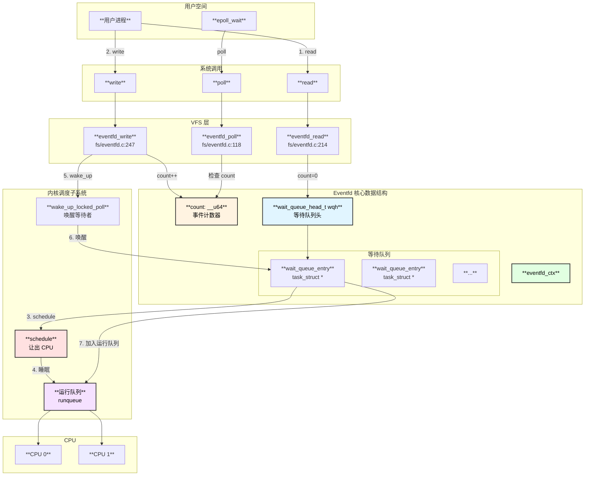
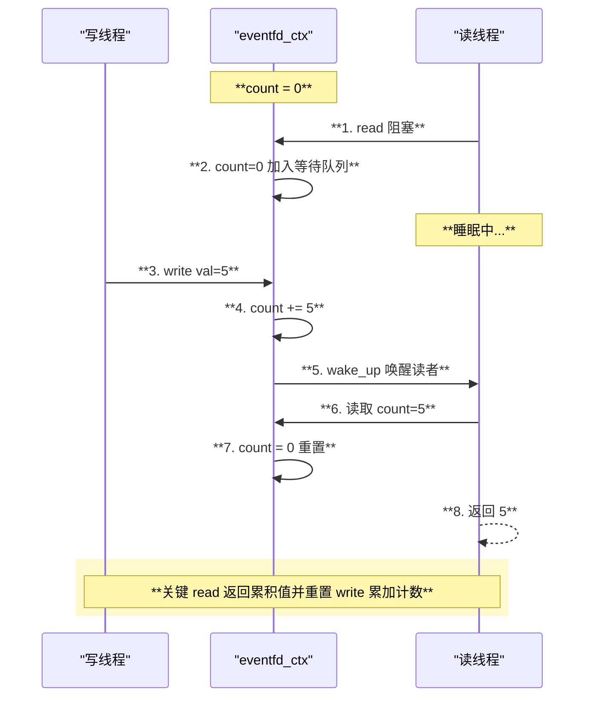
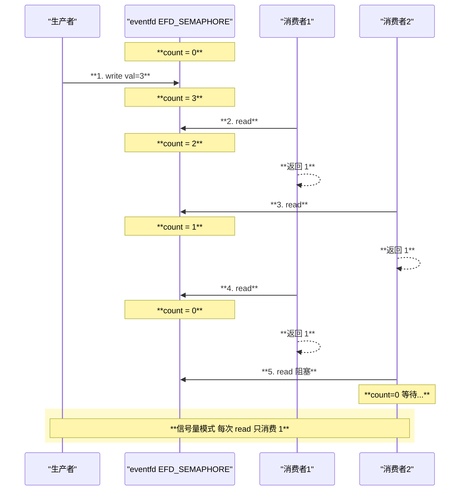
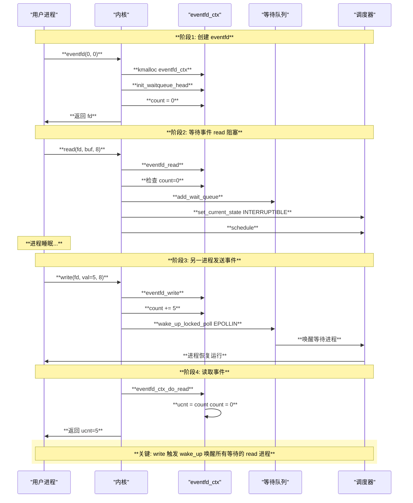
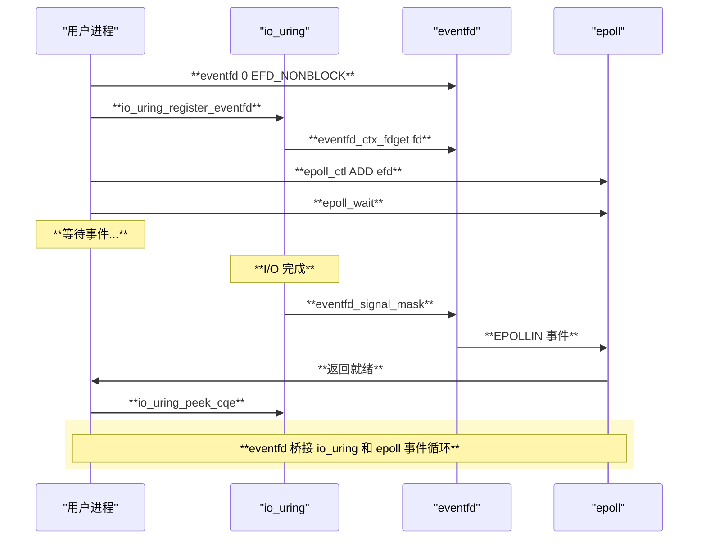
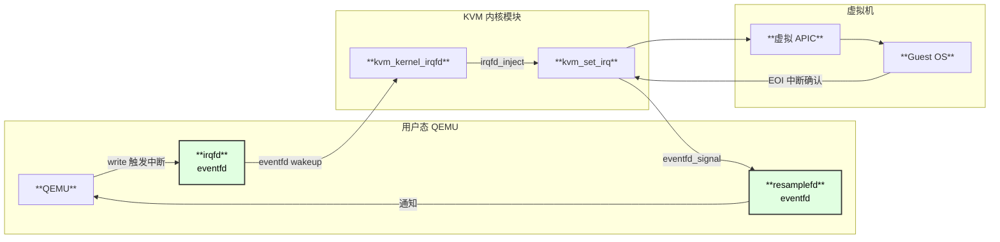
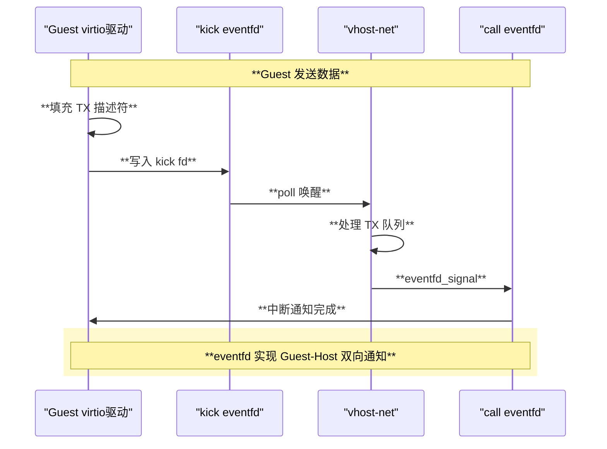
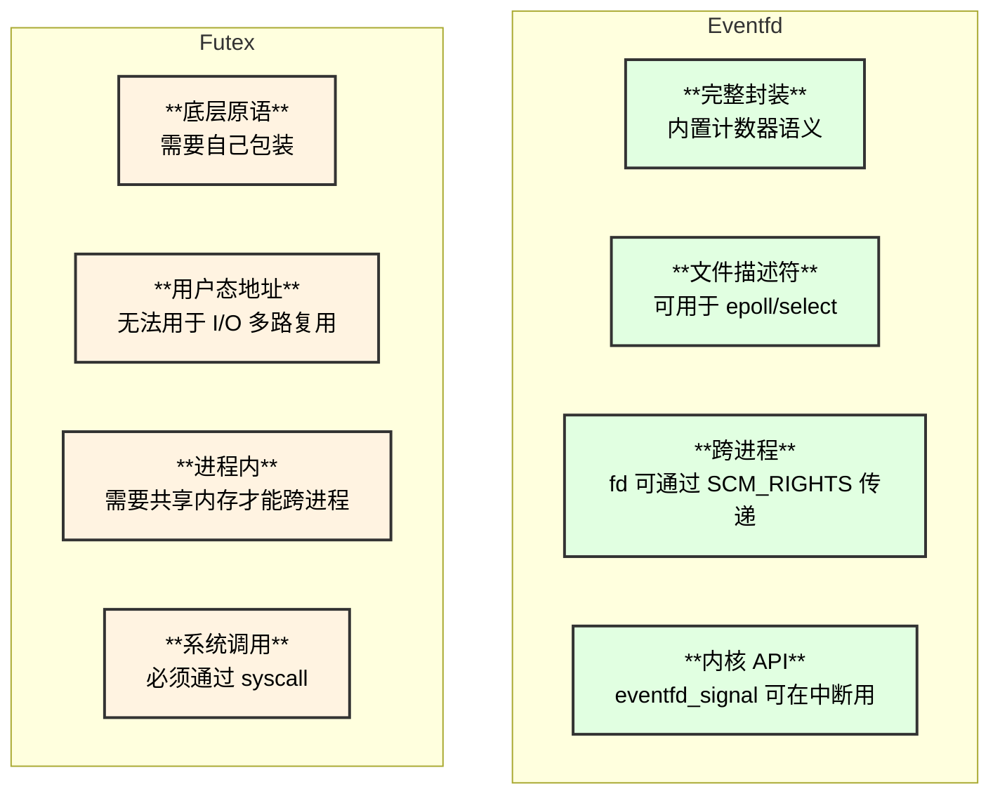
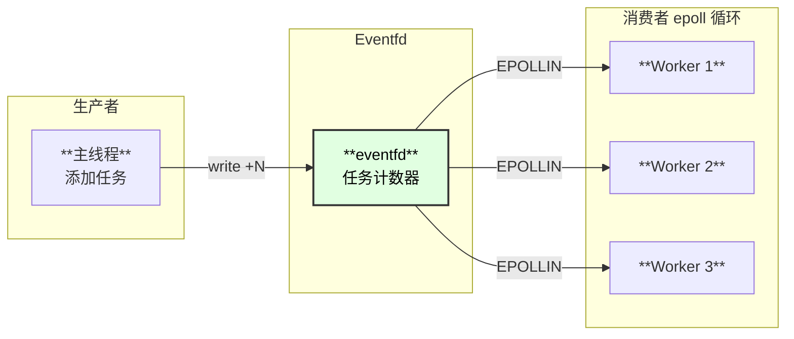

# Linux Eventfd 深度解析

## 概述

`eventfd` 是 Linux 2.6.22 引入的一种轻量级事件通知机制。它创建一个文件描述符，用于用户态/内核态之间或进程/线程之间的事件通知，是 Linux 内核提供的**封装好的事件计数器**。

与 `futex` 不同，`eventfd` 已经封装了完整的事件语义，不需要用户自己实现条件检查逻辑。

## 完整架构图（含队列和 CPU 调度）



### 运作原理说明

| **步骤** | **组件** | **操作** |
|:---|:---|:---|
| 1 | read 系统调用 | 用户调用 read(efd, &val, 8) |
| 2 | eventfd_read | 检查 count，若为 0 则加入等待队列 |
| 3 | schedule() | 让出 CPU，进入睡眠 |
| 4 | 另一线程 write | 调用 write(efd, &val, 8) |
| 5 | eventfd_write | count += val，调用 wake_up |
| 6 | wake_up | 从等待队列取出 task，设置为 RUNNABLE |
| 7 | 调度器 | 将 task 加入运行队列，等待 CPU 调度 |

## 核心数据结构

### eventfd_ctx 结构

```c
// fs/eventfd.c:30-44
struct eventfd_ctx {
    struct kref kref;           // 引用计数
    wait_queue_head_t wqh;      // 等待队列头
    __u64 count;                // 事件计数器 (核心!)
    unsigned int flags;         // 标志 (EFD_SEMAPHORE 等)
    int id;                     // 唯一标识符
};
```

**字段说明**：

| **字段** | **类型** | **说明** |
|:---|:---|:---|
| kref | struct kref | 引用计数，用于生命周期管理 |
| wqh | wait_queue_head_t | 等待队列，存储阻塞的读取者 |
| count | __u64 | 64位事件计数器，核心数据 |
| flags | unsigned int | 标志位，控制语义 |
| id | int | IDA 分配的唯一 ID |

### 标志位定义

```c
// include/linux/eventfd.h
#define EFD_SEMAPHORE   (1 << 0)   // 信号量模式：每次 read 只减 1
#define EFD_CLOEXEC     O_CLOEXEC  // exec 时自动关闭
#define EFD_NONBLOCK    O_NONBLOCK // 非阻塞模式
```

## 系统调用

### eventfd/eventfd2 创建

```c
// 头文件
#include <sys/eventfd.h>

// 系统调用
int eventfd(unsigned int initval, int flags);
int eventfd2(unsigned int initval, int flags);

// 参数：
//   initval - 计数器初始值
//   flags   - EFD_CLOEXEC | EFD_NONBLOCK | EFD_SEMAPHORE

// 返回值：
//   成功返回文件描述符，失败返回 -1
```

### 读取事件

```c
ssize_t read(int fd, void *buf, size_t count);

// buf 必须是 8 字节 (uint64_t)
// 行为：
//   - 普通模式：返回 count 值并重置为 0
//   - 信号量模式 (EFD_SEMAPHORE)：返回 1 并 count--
//   - 阻塞模式：count=0 时阻塞
//   - 非阻塞模式：count=0 时返回 EAGAIN
```

### 发送事件

```c
ssize_t write(int fd, const void *buf, size_t count);

// buf 必须是 8 字节 (uint64_t) 的值 n
// 行为：
//   - count += n
//   - 如果 count 会溢出，阻塞等待 read 消费
//   - 非阻塞模式下溢出返回 EAGAIN
```

## 函数调用链

### eventfd 创建调用链

```
eventfd(initval, flags) - 用户空间
└── syscall(SYS_eventfd2, initval, flags) - 系统调用入口
    └── SYSCALL_DEFINE2(eventfd2, ...) - fs/eventfd.c:427
        └── do_eventfd(count, flags) - fs/eventfd.c:382
            ├── kmalloc(sizeof(*ctx), GFP_KERNEL) - 分配 eventfd_ctx
            ├── kref_init(&ctx->kref) - 初始化引用计数
            ├── init_waitqueue_head(&ctx->wqh) - 初始化等待队列
            ├── ctx->count = count - 设置初始计数
            ├── ctx->flags = flags - 设置标志
            ├── ida_alloc(&eventfd_ida, GFP_KERNEL) - 分配唯一 ID
            ├── get_unused_fd_flags(flags) - 分配文件描述符
            ├── anon_inode_getfile("[eventfd]", &eventfd_fops, ctx, flags)
            │   └── 创建匿名 inode 文件
            │       └── ┌─────────────────┬─────────────────────────────────────┐
            │           │  字段            │  值                                  │
            │           ├─────────────────┼─────────────────────────────────────┤
            │           │  文件名          │  "[eventfd]"                         │
            │           ├─────────────────┼─────────────────────────────────────┤
            │           │  f_op            │  &eventfd_fops                       │
            │           ├─────────────────┼─────────────────────────────────────┤
            │           │  private_data    │  ctx                                 │
            │           └─────────────────┴─────────────────────────────────────┘
            └── fd_install(fd, file) - 安装文件描述符
```

### read 调用链

```
read(fd, buf, 8) - 用户空间
└── SYSCALL_DEFINE3(read, ...) - fs/read_write.c
    └── ksys_read() - fs/read_write.c
        └── vfs_read() - fs/read_write.c
            └── file->f_op->read_iter()
                └── eventfd_read() - fs/eventfd.c:214
                    ├── iov_iter_count(to) < sizeof(ucnt) 检查
                    │   └── 返回 -EINVAL (缓冲区太小)
                    ├── spin_lock_irq(&ctx->wqh.lock) - 获取锁
                    ├── if (!ctx->count)
                    │   ├── O_NONBLOCK: 返回 -EAGAIN
                    │   └── 阻塞模式:
                    │       └── wait_event_interruptible_locked_irq(ctx->wqh, ctx->count)
                    │           └── ┌─────────────────┬─────────────────────────────────────┐
                    │               │  操作            │  说明                                │
                    │               ├─────────────────┼─────────────────────────────────────┤
                    │               │  __add_wait_queue│  加入等待队列                        │
                    │               ├─────────────────┼─────────────────────────────────────┤
                    │               │  set_current_state│  设置 TASK_INTERRUPTIBLE           │
                    │               ├─────────────────┼─────────────────────────────────────┤
                    │               │  spin_unlock_irq │  释放锁并睡眠                        │
                    │               ├─────────────────┼─────────────────────────────────────┤
                    │               │  schedule()      │  调度出去                            │
                    │               ├─────────────────┼─────────────────────────────────────┤
                    │               │  被唤醒后        │  重新获取锁检查条件                  │
                    │               └─────────────────┴─────────────────────────────────────┘
                    ├── eventfd_ctx_do_read(ctx, &ucnt) - fs/eventfd.c:176
                    │   └── 普通模式: ucnt = ctx->count; ctx->count = 0
                    │   └── 信号量: ucnt = 1; ctx->count--
                    ├── wake_up_locked_poll(&ctx->wqh, EPOLLOUT) - 唤醒写等待者
                    ├── spin_unlock_irq(&ctx->wqh.lock) - 释放锁
                    └── copy_to_iter(&ucnt, sizeof(ucnt), to) - 拷贝到用户空间
```

### write 调用链

```
write(fd, &val, 8) - 用户空间
└── SYSCALL_DEFINE3(write, ...) - fs/read_write.c
    └── ksys_write() - fs/read_write.c
        └── vfs_write() - fs/read_write.c
            └── file->f_op->write()
                └── eventfd_write() - fs/eventfd.c:247
                    ├── count != sizeof(ucnt) 检查
                    │   └── 返回 -EINVAL
                    ├── copy_from_user(&ucnt, buf, sizeof(ucnt)) - 读取用户数据
                    ├── ucnt == ULLONG_MAX 检查
                    │   └── 返回 -EINVAL (防止特殊值)
                    ├── spin_lock_irq(&ctx->wqh.lock) - 获取锁
                    ├── if (ULLONG_MAX - ctx->count > ucnt)
                    │   └── 不会溢出，直接增加
                    │   else
                    │   ├── O_NONBLOCK: 返回 -EAGAIN
                    │   └── 阻塞模式:
                    │       └── wait_event_interruptible_locked_irq(...)
                    │           └── 等待 count 被消费
                    ├── ctx->count += ucnt - 增加计数
                    ├── wake_up_locked_poll(&ctx->wqh, EPOLLIN) - 唤醒读等待者
                    └── spin_unlock_irq(&ctx->wqh.lock) - 释放锁
```

### 内核信号调用链

```
eventfd_signal(ctx) - 内核 API
└── eventfd_signal_mask(ctx, 0) - fs/eventfd.c:56
    ├── WARN_ON_ONCE(current->in_eventfd) - 防止递归
    ├── spin_lock_irqsave(&ctx->wqh.lock, flags) - 获取锁
    ├── if (ctx->count < ULLONG_MAX)
    │   └── ctx->count++ - 增加计数
    ├── if (waitqueue_active(&ctx->wqh))
    │   └── wake_up_locked_poll(&ctx->wqh, EPOLLIN | mask) - 唤醒读者
    └── spin_unlock_irqrestore(&ctx->wqh.lock, flags) - 释放锁
```

## 时序图

### 基本读写时序



### 信号量模式时序



## 使用方法

### 基本用法

```c
#include <sys/eventfd.h>
#include <unistd.h>
#include <stdint.h>
#include <stdio.h>

int main() {
    // 创建 eventfd，初始计数为 0
    int efd = eventfd(0, 0);
    if (efd == -1) {
        perror("eventfd");
        return 1;
    }
    
    // 发送事件
    uint64_t val = 1;
    write(efd, &val, sizeof(val));  // count += 1
    
    // 读取事件
    uint64_t count;
    read(efd, &count, sizeof(count));  // 阻塞直到 count > 0
    printf("收到事件，计数: %llu\n", count);
    
    close(efd);
    return 0;
}
```

### 配合 epoll 使用

```c
#include <sys/eventfd.h>
#include <sys/epoll.h>
#include <unistd.h>
#include <stdint.h>
#include <stdio.h>

int main() {
    int efd = eventfd(0, EFD_NONBLOCK);
    int epfd = epoll_create1(0);
    
    struct epoll_event ev = {
        .events = EPOLLIN,
        .data.fd = efd
    };
    epoll_ctl(epfd, EPOLL_CTL_ADD, efd, &ev);
    
    // 在另一个线程/进程中 write(efd, ...)
    
    // 等待事件
    struct epoll_event events[10];
    int n = epoll_wait(epfd, events, 10, -1);
    
    for (int i = 0; i < n; i++) {
        if (events[i].data.fd == efd) {
            uint64_t count;
            read(efd, &count, sizeof(count));
            printf("收到 %llu 个事件\n", count);
        }
    }
    
    return 0;
}
```

### 信号量模式

```c
#include <sys/eventfd.h>
#include <pthread.h>
#include <unistd.h>
#include <stdint.h>
#include <stdio.h>

int efd;

void* consumer(void* arg) {
    int id = *(int*)arg;
    while (1) {
        uint64_t count;
        read(efd, &count, sizeof(count));  // 每次只获取 1
        printf("消费者 %d: 处理任务\n", id);
    }
    return NULL;
}

int main() {
    // 信号量模式
    efd = eventfd(0, EFD_SEMAPHORE);
    
    // 启动 3 个消费者
    pthread_t threads[3];
    int ids[] = {1, 2, 3};
    for (int i = 0; i < 3; i++) {
        pthread_create(&threads[i], NULL, consumer, &ids[i]);
    }
    
    // 生产者：发送 5 个任务
    uint64_t val = 5;
    write(efd, &val, sizeof(val));
    
    sleep(1);
    return 0;
}
```

### 内核模块使用

```c
#include <linux/eventfd.h>
#include <linux/file.h>

// 获取 eventfd 上下文
struct eventfd_ctx *ctx = eventfd_ctx_fdget(fd);
if (IS_ERR(ctx)) {
    return PTR_ERR(ctx);
}

// 发送事件（原子操作，可在中断上下文调用）
eventfd_signal(ctx);

// 读取并重置计数
__u64 count;
eventfd_ctx_do_read(ctx, &count);

// 释放引用
eventfd_ctx_put(ctx);
```

## 用户使用 Eventfd 完整时序图



## 内核组件使用 Eventfd 源码分析

### 1. io_uring 完成通知

io_uring 使用 eventfd 通知用户态有 I/O 操作完成。

**源码位置**: `io_uring/eventfd.c`

```c
// io_uring/eventfd.c:14-20
struct io_ev_fd {
    struct eventfd_ctx  *cq_ev_fd;    // eventfd 上下文
    unsigned int        eventfd_async: 1;  // 异步标志
    struct rcu_head     rcu;
    refcount_t          refs;
    atomic_t            ops;
};

// io_uring/eventfd.c:44 - I/O 完成时发送信号
void io_eventfd_signal(struct io_ring_ctx *ctx)
{
    struct io_ev_fd *ev_fd = NULL;

    // 检查是否禁用了 eventfd
    if (READ_ONCE(ctx->rings->cq_flags) & IORING_CQ_EVENTFD_DISABLED)
        return;

    guard(rcu)();
    ev_fd = rcu_dereference(ctx->io_ev_fd);
    if (unlikely(!ev_fd))
        return;
        
    // 关键: 发送事件通知用户态
    if (likely(eventfd_signal_allowed())) {
        eventfd_signal_mask(ev_fd->cq_ev_fd, EPOLL_URING_WAKE);
    } else {
        // 在不允许直接调用的上下文，延迟到 RCU 回调
        call_rcu_hurry(&ev_fd->rcu, io_eventfd_do_signal);
    }
}
```

**使用流程**:



### 2. KVM irqfd 中断注入

KVM 使用 eventfd 从用户态 QEMU 向虚拟机注入中断。

**源码位置**: `virt/kvm/eventfd.c`

```c
// virt/kvm/eventfd.c:42-56 - 中断注入工作函数
static void irqfd_inject(struct work_struct *work)
{
    struct kvm_kernel_irqfd *irqfd =
        container_of(work, struct kvm_kernel_irqfd, inject);
    struct kvm *kvm = irqfd->kvm;

    // 向虚拟机注入中断
    if (!irqfd->resampler) {
        kvm_set_irq(kvm, KVM_USERSPACE_IRQ_SOURCE_ID, irqfd->gsi, 1, false);
        kvm_set_irq(kvm, KVM_USERSPACE_IRQ_SOURCE_ID, irqfd->gsi, 0, false);
    } else
        kvm_set_irq(kvm, KVM_IRQFD_RESAMPLE_IRQ_SOURCE_ID,
                    irqfd->gsi, 1, false);
}

// virt/kvm/eventfd.c:58-65 - 中断重采样通知
static void irqfd_resampler_notify(struct kvm_kernel_irqfd_resampler *resampler)
{
    struct kvm_kernel_irqfd *irqfd;

    list_for_each_entry_srcu(irqfd, &resampler->list, resampler_link,
                             srcu_read_lock_held(&resampler->kvm->irq_srcu))
        eventfd_signal(irqfd->resamplefd);  // 通知 QEMU 可以重新采样
}
```

**架构图**:



### 3. vhost 虚拟队列通知

vhost 使用 eventfd 在 host 和 guest 之间传递 virtio 队列通知。

**源码位置**: `drivers/vhost/vhost.c`

```c
// drivers/vhost/vhost.h:93-95 - 每个 virtqueue 有三个 eventfd
struct vhost_virtqueue {
    struct file *kick;              // guest -> host: 有数据可处理
    struct vhost_vring_call call_ctx;  // host -> guest: 处理完成
    struct eventfd_ctx *error_ctx;  // 错误通知
    // ...
};

// drivers/vhost/vhost.h:251-254 - 错误通知宏
#define vq_err(vq, fmt, ...) do {                      \
        pr_debug(pr_fmt(fmt), ##__VA_ARGS__);          \
        if ((vq)->error_ctx)                           \
            eventfd_signal((vq)->error_ctx);           \
    } while (0)

// drivers/vhost/vhost.c:2019-2041 - 设置 kick/call eventfd
case VHOST_SET_VRING_KICK:
    eventfp = f.fd == VHOST_FILE_UNBIND ? NULL : eventfd_fget(f.fd);
    // guest 写 eventfd 通知 host 有数据
    break;
    
case VHOST_SET_VRING_CALL:
    ctx = f.fd == VHOST_FILE_UNBIND ? NULL : eventfd_ctx_fdget(f.fd);
    // host 调用 eventfd_signal 通知 guest 完成
    swap(ctx, vq->call_ctx.ctx);
    break;
```

**数据流**:



### 内核组件使用汇总

| **组件** | **用途** | **eventfd 数量** | **关键函数** |
|:---|:---|:---|:---|
| **io_uring** | CQ 完成通知 | 1 | `eventfd_signal_mask` |
| **KVM irqfd** | 中断注入/重采样 | 2 | `eventfd_signal` |
| **vhost** | virtio 队列通知 | 3/队列 | `eventfd_signal`, `eventfd_fget` |
| **VFIO** | 设备中断通知 | N | `eventfd_signal` |
| **AIO** | 异步 I/O 完成 | 1 | `eventfd_signal` |

## Eventfd vs Futex 对比



### 详细对比表

| **特性** | **Eventfd** | **Futex** |
|:---|:---|:---|
| **抽象层级** | 高层，封装好的事件计数器 | 底层原语，需自己封装 |
| **表示形式** | 文件描述符 (int fd) | 用户态地址 (int *uaddr) |
| **I/O 多路复用** | ✅ 支持 epoll/select/poll | ❌ 不支持 |
| **跨进程通信** | ✅ fd 可传递 | 需要共享内存 |
| **内核直接调用** | ✅ eventfd_signal() | ❌ 必须 syscall |
| **中断上下文** | ✅ eventfd_signal_mask() | ❌ 不支持 |
| **性能（无竞争）** | 需要系统调用 | **用户态完成** |
| **条件检查** | 内置计数器语义 | 自定义任意条件 |
| **典型用途** | 事件通知、异步完成 | 互斥锁、条件变量 |

### 性能对比

```
场景：线程间通知

Eventfd:
  write(efd, &val, 8)  → 系统调用 → count++ → wake_up
  read(efd, &val, 8)   → 系统调用 → 获取 count
  
  优点：简单，封装好
  缺点：每次操作都是系统调用

Futex:
  atomic_inc(&futex_word)  → 用户态
  futex(uaddr, FUTEX_WAKE) → 系统调用（有等待者时）
  
  futex(uaddr, FUTEX_WAIT) → 系统调用
  
  优点：无竞争时纯用户态
  缺点：需要自己实现条件逻辑
```

### 使用场景建议

| **场景** | **推荐** | **原因** |
|:---|:---|:---|
| 与 epoll 集成的事件循环 | **Eventfd** | 天然支持 I/O 多路复用 |
| 线程池任务通知 | **Eventfd** | 计数器语义天然匹配 |
| 互斥锁/条件变量 | **Futex** | 性能更好，glibc 已封装 |
| 高频线程同步 | **Futex** | 无竞争时无系统调用 |
| 内核→用户态通知 | **Eventfd** | eventfd_signal() 可在中断用 |
| 信号量实现 | **都可以** | Eventfd 有 EFD_SEMAPHORE |

## 典型应用场景

### 1. 线程池任务队列



### 2. 异步 I/O 完成通知

```c
// io_uring 使用 eventfd 通知完成
struct io_uring_params params = { .flags = IORING_SETUP_CQPOLL };
io_uring_queue_init_params(32, &ring, &params);

int efd = eventfd(0, EFD_NONBLOCK);
io_uring_register_eventfd(&ring, efd);

// epoll 监听 eventfd
epoll_ctl(epfd, EPOLL_CTL_ADD, efd, &ev);

// 等待完成
while (epoll_wait(epfd, events, 10, -1) > 0) {
    if (events[0].data.fd == efd) {
        // 有 I/O 完成
        struct io_uring_cqe *cqe;
        io_uring_peek_cqe(&ring, &cqe);
        // 处理完成...
    }
}
```

### 3. 进程间通知

```c
// 父进程
int efd = eventfd(0, 0);
pid_t pid = fork();

if (pid == 0) {
    // 子进程：等待通知
    uint64_t val;
    read(efd, &val, sizeof(val));
    printf("子进程收到通知\n");
    exit(0);
} else {
    // 父进程：发送通知
    sleep(1);
    uint64_t val = 1;
    write(efd, &val, sizeof(val));
    wait(NULL);
}
```

## 参考资料

1. Linux Kernel Source - `fs/eventfd.c`
2. man eventfd(2)
3. LWN.net - "Scalable event notification"
4. io_uring 与 eventfd 集成


