# Linux文件系统碎片检测详解

## 1. 文件系统碎片概述

### 1.1 什么是文件碎片

文件碎片是指文件在磁盘上的存储不连续，被分散在不同的物理位置。这会导致磁头频繁移动，降低读写性能。

### 1.2 碎片的两种理解

碎片有两种不同但相关的概念：

#### 1.2.1 文件碎片 vs 空闲空间碎片


| **类型** | **定义** | **影响对象** | **检测方法** |
|---------|---------|-------------|------------|
| **文件碎片** | 单个文件的数据块不连续 | 该文件的I/O性能 | `filefrag <file>` |
| **空闲空间碎片** | 文件系统空闲块分散 | 新文件分配、整体性能 | `e2freefrag <device>` |

#### 1.2.2 详细对比

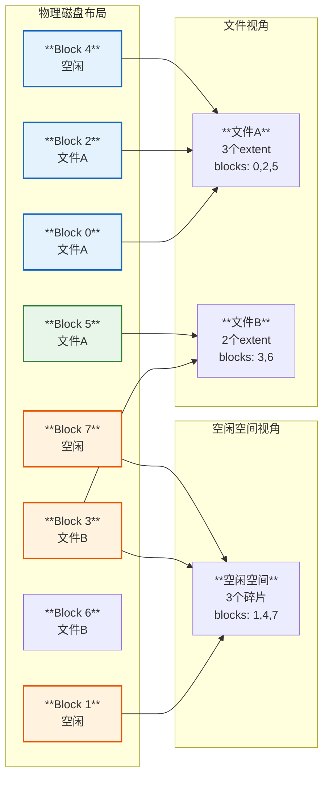

**关键区别：**
- **文件碎片**：关注单个文件的物理块分布
- **空闲空间碎片**：关注整个文件系统的空闲块分布
- **两者关系**：空闲空间碎片化会导致新文件更容易产生碎片

### 1.3 打孔技术（File Hole）

打孔（Hole Punching）是一种特殊的文件稀疏（Sparse File）机制，允许文件在逻辑上连续，但物理上有"洞"。

#### 1.3.1 打孔概念

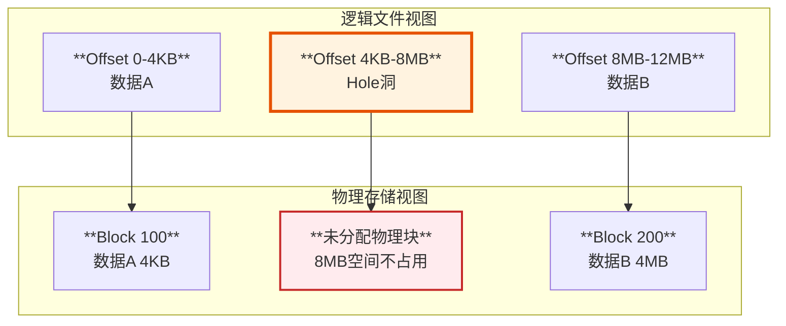

**特点：**
- **逻辑连续**：文件offset连续，lseek可以正常工作
- **物理不连续**：Hole部分不占用磁盘块
- **读取返回零**：读Hole区域返回0字节
- **节省空间**：大文件可以非常节省空间

#### 1.3.2 打孔实现

```c
// 创建稀疏文件示例
#include <fcntl.h>
#include <unistd.h>

int create_sparse_file() {
    int fd = open("sparse.dat", O_CREAT | O_RDWR, 0644);
    
    // 写入开头4KB数据
    char data[4096] = {1};
    write(fd, data, 4096);
    
    // 跳过8MB创建hole
    lseek(fd, 8 * 1024 * 1024, SEEK_CUR);
    
    // 写入结尾4MB数据
    write(fd, data, 4 * 1024 * 1024);
    
    close(fd);
    
    // 文件逻辑大小: ~12MB
    // 实际磁盘占用: ~4MB
}

// fallocate创建/删除hole
#include <linux/falloc.h>

// 打洞 - 释放中间的数据块
fallocate(fd, FALLOC_FL_PUNCH_HOLE | FALLOC_FL_KEEP_SIZE, 
          offset, length);
```

源码实现 `fs/ext4/inode.c`:

```c
// EXT4 打孔实现
long ext4_fallocate(struct file *file, int mode, loff_t offset, loff_t len)
{
    // PUNCH_HOLE: 在文件中打洞
    if (mode & FALLOC_FL_PUNCH_HOLE) {
        ret = ext4_punch_hole(inode, offset, len);
        // 释放extent对应的物理块
        // 但保持文件逻辑大小不变
    }
}
```

#### 1.3.3 打孔 vs 碎片

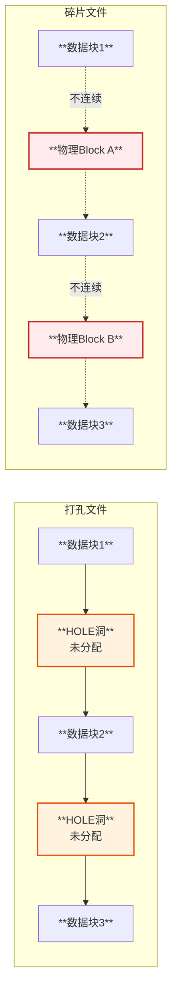

| **特性** | **打孔文件** | **碎片文件** |
|---------|-------------|-------------|
| **物理分配** | 洞未分配物理块 | 所有数据都有物理块 |
| **逻辑连续性** | 逻辑连续 | 逻辑连续 |
| **物理连续性** | 有洞，不连续 | 分散在不同位置 |
| **空间占用** | 少（洞不占空间） | 全部占用 |
| **性能影响** | 跳过洞，性能好 | 寻道多，性能差 |
| **extent数量** | 数据块数量 | extent数量多 |

### 1.4 不同文件的物理交叉

不同文件在物理层面确实会交叉存在，这是文件系统分配策略的结果。

#### 1.4.1 物理交叉示例

```mermaid
gantt
    title **磁盘物理块分布**
    dateFormat X
    axisFormat %s
    
    section 物理Block
    文件A-Part1 :a1, 0, 10
    文件B-Part1 :b1, 10, 20
    文件C-Part1 :c1, 20, 30
    文件A-Part2 :a2, 30, 40
    文件B-Part2 :b2, 40, 50
    文件A-Part3 :a3, 50, 60
    空闲空间   :free1, 60, 70
    文件C-Part2 :c2, 70, 80
```

**物理交叉的原因：**

1. **并发写入**：多个进程同时写不同文件
2. **动态分配**：文件系统动态选择最优块
3. **碎片产生**：文件删除后留下空隙
4. **文件增长**：文件扩展时找不到连续空间

#### 1.4.2 交叉对性能的影响

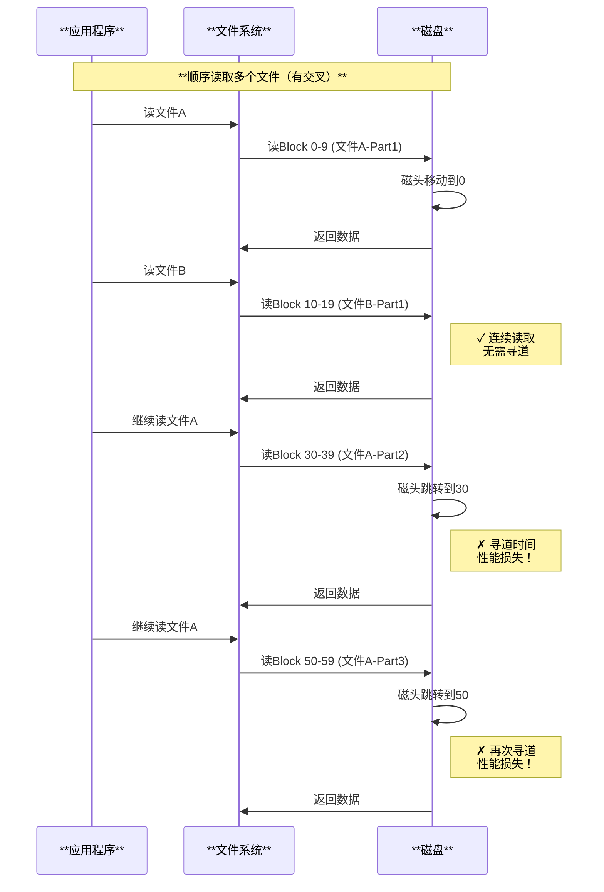

### 1.5 物理交叉导致随机I/O增加

#### 1.5.1 I/O模式分析


#### 1.5.2 随机I/O性能影响

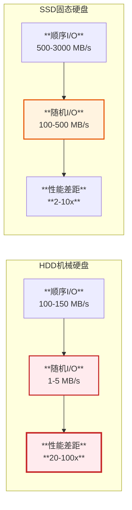

| **场景** | **I/O类型** | **HDD性能** | **SSD性能** |
|---------|-----------|------------|------------|
| **文件连续存储** | 顺序I/O | 150 MB/s | 3000 MB/s |
| **文件轻度碎片** | 半随机I/O | 50 MB/s | 800 MB/s |
| **文件严重碎片** | 随机I/O | 2 MB/s | 300 MB/s |
| **多文件交叉读** | 随机I/O | 1-3 MB/s | 200 MB/s |

#### 1.5.3 交叉场景分析

```c
// 示例：交叉访问模式
void read_interleaved_files() {
    // 场景：读取3个碎片化且物理交叉的大文件
    
    // 文件A: blocks [0-9], [30-39], [60-69], [90-99]
    // 文件B: blocks [10-19], [40-49], [70-79]  
    // 文件C: blocks [20-29], [50-59], [80-89]
    
    // 如果依次读取这3个文件：
    for each file in [A, B, C] {
        read(file);  // 导致大量磁盘寻道
    }
    
    // 磁盘访问序列：
    // A: 0→30→60→90 (3次跳转)
    // B: 10→40→70    (2次跳转) 
    // C: 20→50→80    (2次跳转)
    // 
    // 总计7次大跨度寻道，严重影响性能！
}
```

#### 1.5.4 优化策略


### 1.6 碎片概念总结

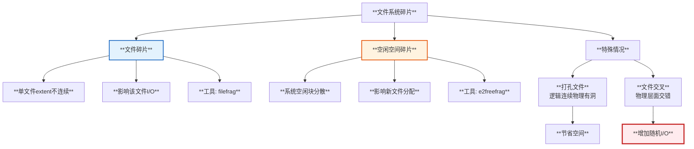

**关键要点：**

1. ✅ **文件碎片** = 单个文件的物理块不连续
2. ✅ **空闲碎片** = 整个文件系统的空闲空间分散  
3. ✅ **打孔技术** = 逻辑连续，物理有洞，节省空间
4. ⚠️ **文件交叉** = 不同文件在物理上交错存在
5. ❌ **随机I/O** = 交叉和碎片导致大量磁盘寻道，性能严重下降

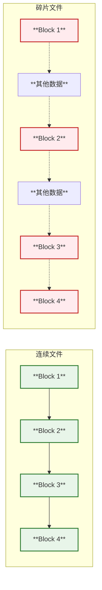

### 1.2 碎片产生原因

- **频繁的文件创建和删除**：留下不连续的空闲空间
- **文件扩展**：文件增长时找不到连续空间
- **小文件多**：大量小文件导致碎片化
- **磁盘接近满**：可用连续空间减少

### 1.3 碎片的影响

| **影响** | **说明** | **性能损失** |
|---------|---------|-------------|
| **顺序读性能** | 磁头频繁移动 | 30-70% |
| **随机读性能** | 额外的寻道时间 | 10-30% |
| **写入性能** | 查找连续空间 | 20-50% |
| **SSD寿命** | 额外的写入放大 | 影响寿命 |

## 2. EXT4 文件系统碎片检测

### 2.1 EXT4 架构

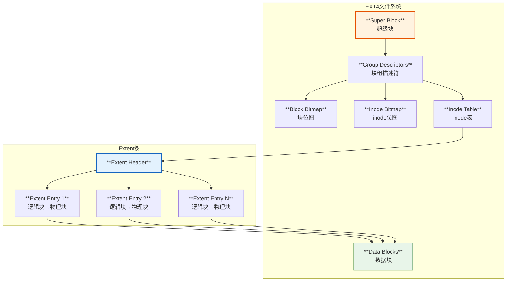

### 2.2 Extent 状态树

源码分析 `fs/ext4/extents_status.c`:

```c
/*
 * Extent状态树实现
 * 
 * 用途：
 * 1. 跟踪所有extent状态（delayed, unwritten, hole等）
 * 2. 支持FIEMAP, SEEK_DATA/SEEK_HOLE
 * 3. 管理延迟分配
 * 4. 碎片分析
 */

struct extent_status {
    struct rb_node rb_node;    // 红黑树节点
    ext4_lblk_t es_lblk;       // 逻辑块号
    ext4_lblk_t es_len;        // extent长度
    ext4_fsblk_t es_pblk;      // 物理块号
};

// Extent状态标志
#define EXTENT_DIRTY         (1 << 0)  // 脏数据
#define EXTENT_UPTODATE      (1 << 1)  // 已更新
#define EXTENT_DELALLOC      (1 << 2)  // 延迟分配
#define EXTENT_DEFRAG        (1 << 3)  // 需要整理
```

### 2.3 EXT4 碎片检测工具

#### 2.3.1 filefrag - 文件碎片查看

```bash
# 查看单个文件的碎片情况
filefrag /path/to/file

# 详细输出（显示extent信息）
filefrag -v /path/to/file

# 输出示例：
# /path/to/file: 5 extents found
#  ext:   logical_offset:       physical_offset: length:   expected: flags:
#    0:        0..    8191:     123456..   131647:   8192:             
#    1:     8192..   16383:     145678..   153869:   8192:    131648: 
#    2:    16384..   24575:     167890..   176081:   8192:    153870: 
#    3:    24576..   32767:     189012..   197203:   8192:    176082: 
#    4:    32768..   40959:     201234..   209425:   8192:    197204: last,eof

# 查看目录下所有文件
find /data -type f -exec filefrag {} \;
```

#### 2.3.2 e2freefrag - 空闲空间碎片

```bash
# 查看文件系统空闲空间碎片
e2freefrag /dev/sda1

# 输出示例：
# Device: /dev/sda1
# Blocksize: 4096 bytes
# Total blocks: 26214400
# Free blocks: 15728640 (60.0%)
# 
# Min. free extent: 4 KB 
# Max. free extent: 1024 MB
# Avg. free extent: 256 KB
# Num. free extent: 61440
# 
# EXTENT SIZE RANGE : FREE BLOCKS : FREE EXTENTS : PERCENTAGE
#     4K...    8K-  :      102400 :        25600 :   0.7%
#     8K...   16K-  :      204800 :        25600 :   1.3%
#    16K...   32K-  :      409600 :        25600 :   2.6%
#    32K...   64K-  :      819200 :        25600 :   5.2%
```

#### 2.3.3 e4defrag - EXT4 整理工具

```bash
# 查看文件碎片得分（不整理）
e4defrag -c /path/to/file

# 整理单个文件
e4defrag /path/to/file

# 整理整个目录
e4defrag /data

# 整理整个文件系统
e4defrag /dev/sda1

# 输出示例：
# <File>                                          <current/best>       <fragmentation rate>
# /data/large_file.dat                            1024/1               99%
# /data/small_file.txt                            5/1                  80%
```

### 2.4 EXT4碎片检测原理

#### 2.4.1 FIEMAP机制

```c
// fs/ext4/ioctl.c - FIEMAP ioctl实现
static long ext4_ioctl(struct file *filp, unsigned int cmd, unsigned long arg)
{
    switch (cmd) {
    case FS_IOC_FIEMAP: {
        struct fiemap fiemap;
        struct fiemap_extent_info fieinfo = {0, };
        
        // 从用户空间拷贝参数
        if (copy_from_user(&fiemap, (struct fiemap __user *)arg, 
                          sizeof(struct fiemap)))
            return -EFAULT;
        
        // 检查extent映射
        error = ext4_fiemap(inode, &fieinfo, fiemap.fm_start, 
                           fiemap.fm_length);
        
        return error;
    }
    // ...
    }
}

// fs/ext4/extents.c - 获取extent信息
int ext4_fiemap(struct inode *inode, struct fiemap_extent_info *fieinfo,
                __u64 start, __u64 len)
{
    ext4_lblk_t start_blk;
    int error = 0;
    
    // 遍历extent树
    while (len_blks) {
        // 查找extent
        path = ext4_find_extent(inode, start_blk, NULL, 0);
        
        // 报告extent信息
        error = fiemap_fill_next_extent(fieinfo, 
                                        logical, physical, length, flags);
    }
    
    return error;
}
```

#### 2.4.2 碎片检测流程

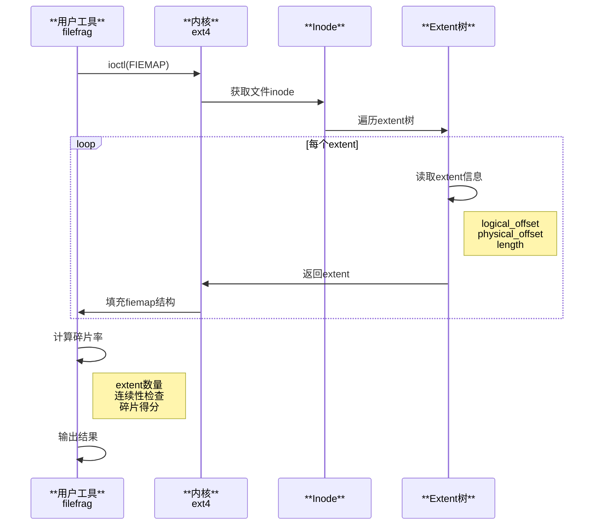

### 2.5 EXT4碎片统计算法

```c
// 伪代码：碎片率计算
struct frag_stats {
    int total_extents;      // 总extent数
    int expected_extents;   // 理想extent数
    off_t total_size;       // 文件总大小
    off_t extent_min;       // 最小extent
    off_t extent_max;       // 最大extent
};

float calculate_fragmentation(struct frag_stats *stats) {
    // 碎片率 = (实际extent数 - 理想数) / 实际数
    float frag_rate = (stats->total_extents - stats->expected_extents) 
                      / (float)stats->total_extents * 100.0;
    
    // 理想情况下，大文件应该只有1个extent
    // 实际中可能有多个不连续的extent
    return frag_rate;
}
```

## 3. Btrfs 文件系统碎片检测

### 3.1 Btrfs 架构

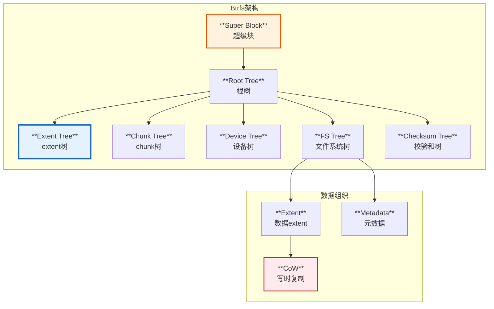

### 3.2 Btrfs Extent机制

源码分析 `fs/btrfs/extent-io-tree.h`:

```c
// Btrfs extent状态标志
enum {
    EXTENT_DIRTY,           // 脏数据
    EXTENT_UPTODATE,        // 已更新
    EXTENT_LOCKED,          // 已锁定
    EXTENT_DELALLOC,        // 延迟分配
    EXTENT_DEFRAG,          // 需要整理
    EXTENT_BOUNDARY,        // 边界
    EXTENT_CLEAR_META_RESV, // 清除元数据预留
};

// Btrfs extent映射
struct extent_map {
    struct rb_node rb_node;        // 红黑树节点
    u64 start;                     // 逻辑起始地址
    u64 len;                       // 长度
    u64 disk_bytenr;              // 磁盘物理地址
    u64 disk_num_bytes;           // 磁盘字节数
    u64 offset;                    // 偏移
    unsigned long flags;           // 标志位
    struct btrfs_ordered_extent *ordered; // 有序extent
};
```

源码 `fs/btrfs/defrag.c`:

```c
// Btrfs碎片整理核心函数
static struct extent_map *defrag_lookup_extent(struct inode *inode, 
                                               u64 start, u64 newer_than)
{
    struct extent_map_tree *em_tree = &BTRFS_I(inode)->extent_tree;
    struct extent_map *em;
    
    // 查找extent映射
    read_lock(&em_tree->lock);
    em = lookup_extent_mapping(em_tree, start, sectorsize);
    read_unlock(&em_tree->lock);
    
    // 检查是否为合并的extent
    if (em && (em->flags & EXTENT_FLAG_MERGED)) {
        // 需要重新从B树读取原始extent
        free_extent_map(em);
        em = NULL;
    }
    
    return em;
}
```

### 3.3 Btrfs 碎片检测工具

#### 3.3.1 btrfs filesystem defragment

```bash
# 查看碎片情况（需要配合其他工具）
btrfs filesystem show /dev/sda1

# 整理单个文件
btrfs filesystem defragment /path/to/file

# 递归整理目录
btrfs filesystem defragment -r /data

# 使用压缩整理
btrfs filesystem defragment -czstd /path/to/file

# 详细输出
btrfs filesystem defragment -v /path/to/file

# 整理并显示进度
btrfs filesystem defragment -r -v -c /data
```

#### 3.3.2 filefrag on Btrfs

```bash
# Btrfs上也可以使用filefrag
filefrag -v /btrfs/path/to/file

# 输出示例（Btrfs特有的extent信息）：
# Filesystem type is: 9123683e
# File size of /btrfs/large.file is 1073741824 (262144 blocks of 4096 bytes)
#  ext:   logical_offset:       physical_offset: length:   expected: flags:
#    0:        0..   65535:     524288..    589823:  65536:             
#    1:    65536..  131071:    1048576..   1114111:  65536:     589824: 
#    2:   131072..  196607:    2097152..   2162687:  65536:    1114112: 
#    3:   196608..  262143:    3145728..   3211263:  65536:    2162688: last,eof
```

#### 3.3.3 compsize - Btrfs压缩统计

```bash
# 安装compsize工具
# apt-get install compsize

# 查看文件/目录的压缩和碎片情况
compsize /btrfs/data

# 输出示例：
# Processed 1024 files, 8192 regular extents (8192 refs), 0 inline.
# Type       Perc     Disk Usage   Uncompressed Referenced  
# TOTAL       67%      8.0G         12.0G        12.0G       
# none       100%      6.0G          6.0G         6.0G       
# zstd        40%      2.0G          6.0G         6.0G
```

### 3.4 Btrfs碎片检测原理

#### 3.4.1 Extent查找流程

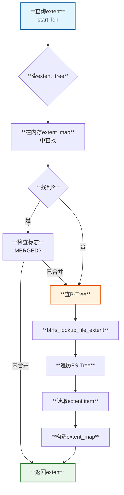

#### 3.4.2 CoW导致的碎片

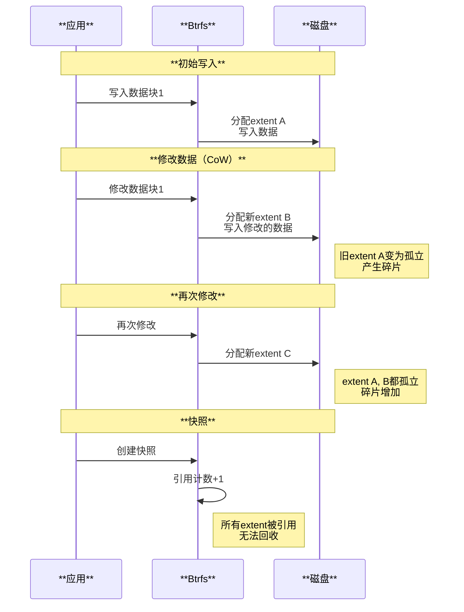

### 3.5 Btrfs碎片特点

| **特点** | **说明** | **影响** |
|---------|---------|---------|
| **CoW机制** | 写时复制导致旧数据孤立 | 产生大量碎片 |
| **快照** | 多版本共存 | 碎片难以整理 |
| **压缩** | 在线压缩 | 可能增加碎片 |
| **元数据** | 独立管理 | 元数据碎片 |

## 4. XFS 文件系统碎片检测

### 4.1 XFS 架构

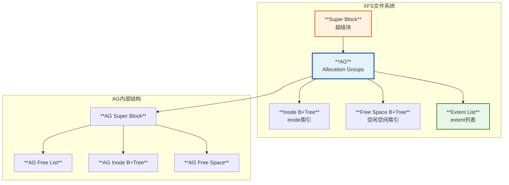

### 4.2 XFS Extent机制

XFS使用extent-based分配，每个文件的数据块信息存储为extent列表。

```c
// XFS extent结构（简化）
struct xfs_bmbt_rec {
    __be64  l0;     // 逻辑文件偏移 + 标志
    __be64  l1;     // 起始块号 + 块数
};

// extent标志
#define XFS_EXTENT_FLAG_UNWRITTEN  0x1  // 预分配但未写入
```

源码 `fs/xfs/xfs_ioctl.c`:

```c
// XFS GETBMAP ioctl - 获取extent映射
case XFS_IOC_GETBMAP:
case XFS_IOC_GETBMAPA:
case XFS_IOC_GETBMAPX:
    return xfs_ioc_getbmap(filp, cmd, arg);

// fs/xfs/xfs_bmap_util.c
int xfs_ioc_getbmap(struct file *file, unsigned int cmd, void __user *arg)
{
    struct getbmapx bmx;
    int error;
    
    // 获取extent映射信息
    error = xfs_getbmap(XFS_I(file_inode(file)), &bmx, 
                        xfs_getbmap_format, arg);
    
    return error;
}
```

### 4.3 XFS 碎片检测工具

#### 4.3.1 xfs_db - 调试工具

```bash
# 查看文件系统信息
xfs_db -r /dev/sda1

# 在xfs_db中执行命令
xfs_db> sb 0
xfs_db> print
# 显示超级块信息

# 查看AG信息
xfs_db> agf 0
xfs_db> print

# 查看inode信息
xfs_db> inode <inode_number>
xfs_db> bmap
# 显示extent映射
```

#### 4.3.2 xfs_bmap - extent映射工具

```bash
# 查看文件的extent映射
xfs_bmap /xfs/path/to/file

# 详细输出
xfs_bmap -v /xfs/path/to/file

# 输出示例：
# /xfs/large.file:
#  EXT: FILE-OFFSET      BLOCK-RANGE        TOTAL  FLAGS
#    0: [0..16383]:      98304..114687      16384  0x0
#    1: [16384..32767]:  131072..147455     16384  0x0
#    2: [32768..49151]:  163840..180223     16384  0x0
#    3: [49152..65535]:  196608..212991     16384  0x0

# 列出所有extent
xfs_bmap -l /xfs/path/to/file
```

#### 4.3.3 xfs_fsr - XFS整理工具

```bash
# 整理整个文件系统
xfs_fsr /xfs/mountpoint

# 整理单个文件
xfs_fsr -v /xfs/path/to/file

# 限制整理时间（秒）
xfs_fsr -t 3600 /xfs/mountpoint

# 指定临时目录
xfs_fsr -T /tmp /xfs/mountpoint

# 查看当前碎片状态
xfs_fsr -d /xfs/mountpoint
```

#### 4.3.4 filefrag on XFS

```bash
# XFS上使用filefrag
filefrag -v /xfs/path/to/file

# 输出示例：
# Filesystem type is: 58465342 (XFS)
# File size of /xfs/large.file is 536870912 (131072 blocks of 4096 bytes)
#  ext:   logical_offset:       physical_offset: length:   expected: flags:
#    0:        0..   32767:    2048000..   2080767:  32768:             
#    1:    32768..   65535:    3145728..   3178495:  32768:    2080768: 
#    2:    65536..   98303:    4194304..   4227071:  32768:    3178496: 
#    3:    98304..  131071:    5242880..   5275647:  32768:    4227072: last,eof
```

### 4.4 XFS碎片检测原理

#### 4.4.1 XFS Extent查找

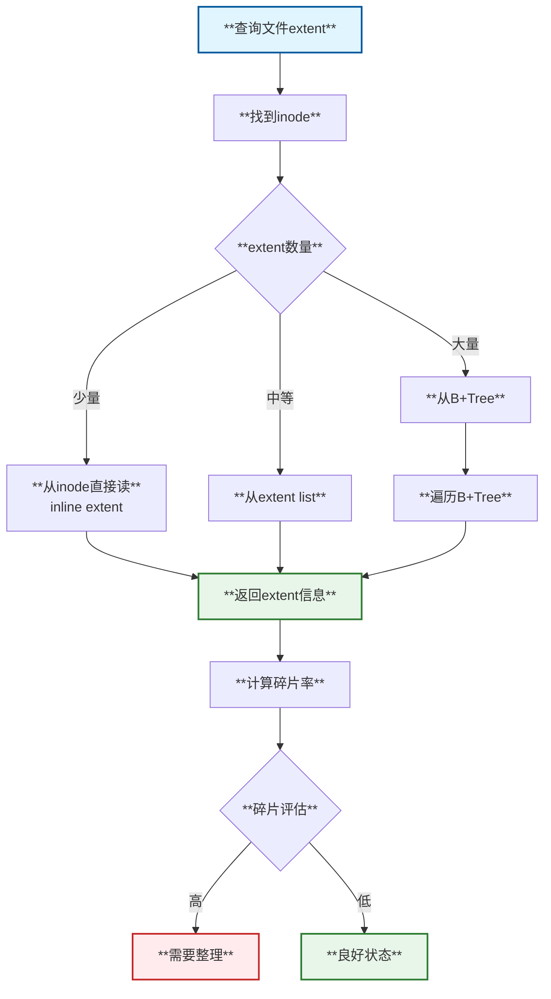

#### 4.4.2 XFS AG并发分配

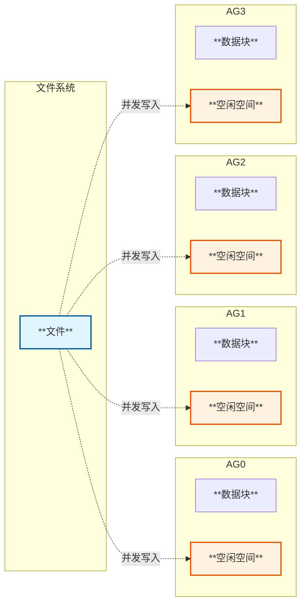

### 4.5 XFS碎片特点

| **特性** | **说明** | **碎片影响** |
|---------|---------|-------------|
| **AG分配** | 多个分配组并发 | 可能跨AG碎片 |
| **延迟分配** | 延迟到刷盘时分配 | 减少碎片 |
| **预分配** | 预先分配空间 | 减少碎片 |
| **extent size hint** | 指定分配大小 | 优化大文件 |

## 5. 通用碎片检测方法

### 5.1 FIEMAP系统调用

FIEMAP是Linux提供的通用extent查询接口，所有现代文件系统都支持。

```c
#include <linux/fs.h>
#include <linux/fiemap.h>

struct fiemap {
    __u64 fm_start;         // 查询起始偏移
    __u64 fm_length;        // 查询长度
    __u32 fm_flags;         // 标志
    __u32 fm_mapped_extents;// 返回的extent数
    __u32 fm_extent_count;  // extent数组大小
    __u32 fm_reserved;
    struct fiemap_extent fm_extents[0]; // extent数组
};

struct fiemap_extent {
    __u64 fe_logical;       // 逻辑偏移
    __u64 fe_physical;      // 物理偏移
    __u64 fe_length;        // extent长度
    __u64 fe_reserved64[2];
    __u32 fe_flags;         // extent标志
    __u32 fe_reserved[3];
};
```

### 5.2 FIEMAP使用示例

```c
#include <stdio.h>
#include <stdlib.h>
#include <fcntl.h>
#include <sys/ioctl.h>
#include <linux/fs.h>
#include <linux/fiemap.h>

int get_file_extents(const char *filename) {
    int fd = open(filename, O_RDONLY);
    struct fiemap *fiemap;
    int extent_count = 0;
    
    // 先查询需要多少extent
    fiemap = malloc(sizeof(struct fiemap));
    fiemap->fm_start = 0;
    fiemap->fm_length = FIEMAP_MAX_OFFSET;
    fiemap->fm_flags = 0;
    fiemap->fm_extent_count = 0;
    
    if (ioctl(fd, FS_IOC_FIEMAP, fiemap) < 0) {
        perror("ioctl");
        return -1;
    }
    
    extent_count = fiemap->fm_mapped_extents;
    printf("File has %d extents\n", extent_count);
    
    // 重新分配空间获取所有extent
    fiemap = realloc(fiemap, sizeof(struct fiemap) + 
                     extent_count * sizeof(struct fiemap_extent));
    fiemap->fm_extent_count = extent_count;
    fiemap->fm_start = 0;
    fiemap->fm_length = FIEMAP_MAX_OFFSET;
    
    if (ioctl(fd, FS_IOC_FIEMAP, fiemap) < 0) {
        perror("ioctl");
        return -1;
    }
    
    // 打印extent信息
    for (int i = 0; i < extent_count; i++) {
        struct fiemap_extent *ext = &fiemap->fm_extents[i];
        printf("Extent %d: logical=%llu, physical=%llu, length=%llu\n",
               i, ext->fe_logical, ext->fe_physical, ext->fe_length);
    }
    
    // 计算碎片率
    float frag_rate = (extent_count > 1) ? 
                      ((float)(extent_count - 1) / extent_count * 100) : 0;
    printf("Fragmentation rate: %.2f%%\n", frag_rate);
    
    free(fiemap);
    close(fd);
    return extent_count;
}
```

### 5.3 碎片检测时序图

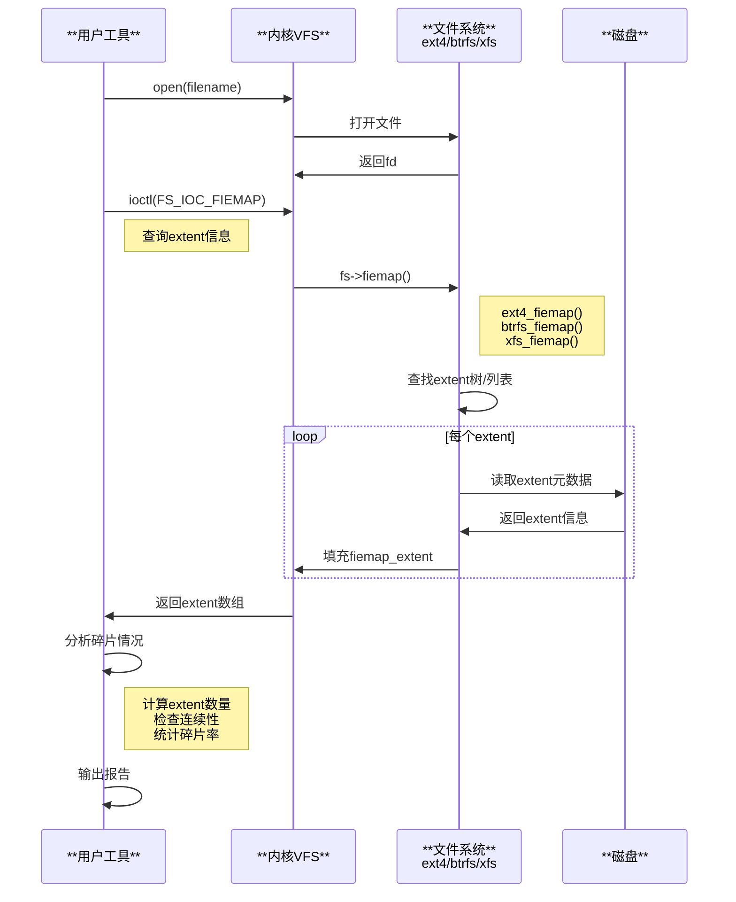

## 6. 磁盘碎片与文件碎片

### 6.1 区别

```mermaid
graph TB
    subgraph 文件碎片
        A1[**单个文件**<br/>extent不连续]
        A2[**影响该文件**<br/>读写性能]
    end
    
    subgraph 磁盘碎片
        B1[**整个文件系统**<br/>空闲空间碎片]
        B2[**影响新文件**<br/>分配效率]
    end
    
    subgraph 解决方法
        C1[**文件整理**<br/>defrag工具]
        C2[**文件系统整理**<br/>fsck/rebalance]
    end
    
    A1 --> A2
    B1 --> B2
    A2 --> C1
    B2 --> C2
    
    style A1 fill:#ffebee,stroke:#c62828,stroke-width:2px
    style B1 fill:#fff3e0,stroke:#e65100,stroke-width:2px
    style C1 fill:#e8f5e9,stroke:#2e7d32,stroke-width:2px
    style C2 fill:#e3f2fd,stroke:#1565c0,stroke-width:2px
```

### 6.2 磁盘空闲空间碎片

```bash
# EXT4查看空闲空间碎片
e2freefrag /dev/sda1

# XFS查看空闲空间
xfs_db -r /dev/sda1 -c "freesp -s"

# Btrfs查看空闲空间
btrfs filesystem df /mnt/btrfs
btrfs device stats /mnt/btrfs
```

## 7. 碎片整理策略

### 7.1 整理策略对比

```mermaid
graph TD
    A{**整理策略选择**}
    
    A -->|在线整理| B[**在线defrag**]
    A -->|离线整理| C[**离线整理**]
    A -->|预防| D[**预防策略**]
    
    B --> B1[**ext4: e4defrag**]
    B --> B2[**xfs: xfs_fsr**]
    B --> B3[**btrfs: defrag**]
    
    C --> C1[**备份恢复**]
    C --> C2[**重建文件系统**]
    
    D --> D1[**预分配**]
    D --> D2[**延迟分配**]
    D --> D3[**extent size hint**]
    
    style A fill:#e1f5ff,stroke:#01579b,stroke-width:3px
    style B fill:#e8f5e9,stroke:#2e7d32,stroke-width:2px
    style C fill:#ffebee,stroke:#c62828,stroke-width:2px
    style D fill:#fff3e0,stroke:#e65100,stroke-width:2px
```

### 7.2 整理工具对比

| **文件系统** | **工具** | **在线整理** | **特点** |
|------------|---------|------------|---------|
| **EXT4** | e4defrag | 是 | 快速，最小化停机 |
| **XFS** | xfs_fsr | 是 | 后台运行，可限速 |
| **Btrfs** | btrfs defrag | 是 | CoW友好，支持压缩 |
| **通用** | filefrag | 仅查看 | 跨文件系统支持 |

### 7.3 整理最佳实践

```bash
#!/bin/bash
# 文件系统碎片整理脚本

# 1. 检查碎片情况
check_fragmentation() {
    local path=$1
    local fs_type=$(stat -f -c %T "$path")
    
    case $fs_type in
        ext4)
            echo "EXT4: Checking fragmentation..."
            e2freefrag "$(df "$path" | tail -1 | awk '{print $1}')"
            ;;
        xfs)
            echo "XFS: Checking fragmentation..."
            xfs_db -r "$(df "$path" | tail -1 | awk '{print $1}')" \
                -c "freesp -s"
            ;;
        btrfs)
            echo "Btrfs: Checking fragmentation..."
            btrfs filesystem df "$path"
            ;;
    esac
}

# 2. 执行整理
defrag_filesystem() {
    local path=$1
    local fs_type=$(stat -f -c %T "$path")
    
    case $fs_type in
        ext4)
            echo "Running e4defrag..."
            e4defrag -c "$path" # 先检查
            read -p "Continue defrag? (y/n): " answer
            [ "$answer" = "y" ] && e4defrag "$path"
            ;;
        xfs)
            echo "Running xfs_fsr..."
            xfs_fsr -v -t 3600 "$path" # 限制1小时
            ;;
        btrfs)
            echo "Running btrfs defrag..."
            btrfs filesystem defragment -r -v "$path"
            ;;
    esac
}

# 3. 主函数
main() {
    if [ $# -lt 1 ]; then
        echo "Usage: $0 <path>"
        exit 1
    fi
    
    check_fragmentation "$1"
    defrag_filesystem "$1"
}

main "$@"
```

## 8. 性能影响分析

### 8.1 碎片对性能的影响

```mermaid
graph LR
    subgraph 碎片率0-20%
        A[**影响较小**<br/>可接受]
    end
    
    subgraph 碎片率20-50%
        B[**性能下降10-30%**<br/>建议整理]
    end
    
    subgraph 碎片率50-80%
        C[**性能下降30-60%**<br/>急需整理]
    end
    
    subgraph 碎片率80-100%
        D[**性能严重下降**<br/>立即整理]
    end
    
    style A fill:#e8f5e9,stroke:#2e7d32,stroke-width:2px
    style B fill:#fff3e0,stroke:#e65100,stroke-width:2px
    style C fill:#ffcc80,stroke:#e65100,stroke-width:2px
    style D fill:#ffebee,stroke:#c62828,stroke-width:2px
```

### 8.2 测试方法

```bash
# 顺序读测试
fio --name=seq-read --rw=read --bs=1M --size=10G \
    --filename=/data/testfile --direct=1

# 随机读测试
fio --name=rand-read --rw=randread --bs=4K --size=10G \
    --filename=/data/testfile --direct=1 --numjobs=4

# 对比整理前后性能
# 整理前
filefrag /data/testfile
fio --name=test1 --rw=read --bs=1M --filename=/data/testfile \
    --direct=1 --runtime=60

# 整理
e4defrag /data/testfile  # for ext4

# 整理后
filefrag /data/testfile
fio --name=test2 --rw=read --bs=1M --filename=/data/testfile \
    --direct=1 --runtime=60
```

## 9. 监控和告警

### 9.1 碎片监控脚本

```bash
#!/bin/bash
# 文件碎片监控脚本

THRESHOLD=50  # 碎片率阈值

monitor_file_fragmentation() {
    local file=$1
    
    # 获取extent数量
    extents=$(filefrag "$file" | awk '{print $2}' | head -1)
    
    if [ -z "$extents" ]; then
        return
    fi
    
    # 简单碎片率计算（extent数量-1）
    if [ "$extents" -gt 1 ]; then
        frag_rate=$((($extents - 1) * 100 / $extents))
        
        if [ $frag_rate -gt $THRESHOLD ]; then
            echo "WARNING: $file is $frag_rate% fragmented ($extents extents)"
            # 发送告警
            # send_alert "$file" "$frag_rate"
        fi
    fi
}

# 扫描目录
scan_directory() {
    local dir=$1
    find "$dir" -type f -size +100M | while read file; do
        monitor_file_fragmentation "$file"
    done
}

scan_directory "/data"
```

### 9.2 系统级监控

```bash
# 添加到cron定时任务
# 每天检查碎片情况
0 2 * * * /usr/local/bin/check_fragmentation.sh > /var/log/frag_check.log 2>&1

# 使用collectd/telegraf监控
# 收集碎片统计信息
cat > /etc/collectd/collectd.conf.d/fragmentation.conf <<EOF
LoadPlugin exec
<Plugin exec>
    Exec "nobody" "/usr/local/bin/frag_stats.sh"
</Plugin>
EOF
```

## 10. 总结

### 10.1 文件系统碎片检测工具总结

| **文件系统** | **检测工具** | **整理工具** | **特点** |
|------------|------------|------------|---------|
| **EXT4** | filefrag, e2freefrag | e4defrag | 成熟稳定，在线整理 |
| **XFS** | xfs_bmap, filefrag | xfs_fsr | 高性能，延迟分配 |
| **Btrfs** | filefrag, compsize | btrfs defrag | CoW机制，支持压缩 |
| **通用** | FIEMAP ioctl | - | 内核统一接口 |

### 10.2 关键源码路径

- **EXT4碎片**: `fs/ext4/extents_status.c`, `fs/ext4/ioctl.c`
- **Btrfs碎片**: `fs/btrfs/defrag.c`, `fs/btrfs/extent_io.c`
- **XFS碎片**: `fs/xfs/xfs_bmap_util.c`, `fs/xfs/xfs_ioctl.c`
- **通用接口**: `include/uapi/linux/fiemap.h`

### 10.3 最佳实践建议

```mermaid
mindmap
  root((碎片管理))
    **预防**
      合理规划分区大小
      使用合适的块大小
      避免频繁小文件操作
      预分配大文件空间
    **监控**
      定期检查碎片率
      监控性能指标
      记录历史数据
      设置告警阈值
    **整理**
      选择合适时机
      离线/在线整理
      备份重要数据
      测试性能提升
    **优化**
      文件系统选择
      挂载选项优化
      应用层优化
      定期维护计划
```

---

**文档基于Linux内核源码分析**
- 内核版本：基于最新主线
- 主要源码路径：
  - `fs/ext4/` - EXT4文件系统
  - `fs/btrfs/` - Btrfs文件系统
  - `fs/xfs/` - XFS文件系统
  - `include/uapi/linux/fiemap.h` - FIEMAP接口

**参考工具**
- filefrag - 通用extent查看工具
- e4defrag - EXT4整理工具
- xfs_fsr - XFS整理工具
- btrfs - Btrfs管理工具

