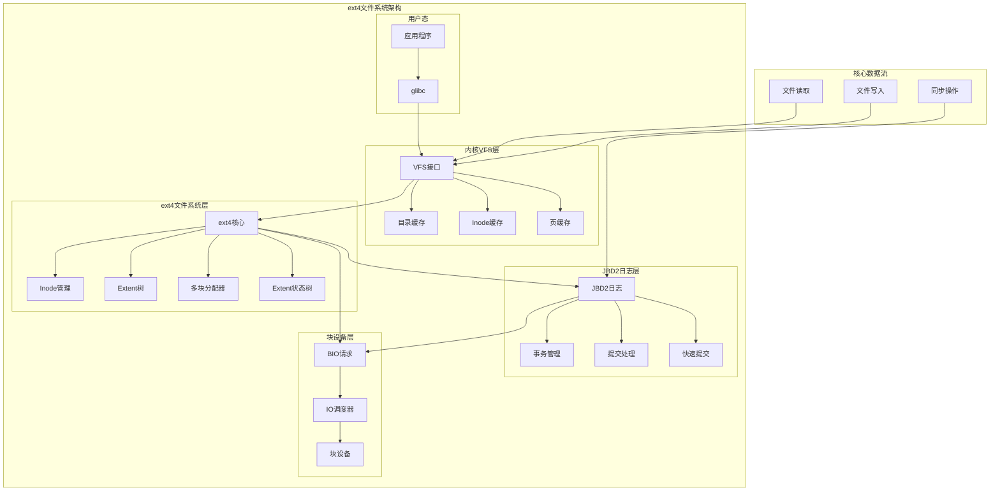

# Linux ext4文件系统架构与实现

## 概述

ext4（第四代扩展文件系统）是Linux内核中使用最广泛的文件系统之一。它在ext3基础上引入了诸多重要改进：extent树取代间接块映射、日志校验和、nanosecond时间戳、大文件支持（最大16TB）、目录索引等。ext4通过向后兼容性、高性能和可靠性，成为现代Linux发行版的默认文件系统。

**核心特性**：
- **Extent树**：高效的块映射，减少元数据开销
- **JBD2日志系统**：保证文件系统一致性和崩溃恢复
- **延迟分配（Delayed Allocation）**：优化写入性能和空间分配
- **多块分配器（Multiblock Allocator）**：减少碎片化
- **快速提交（Fast Commit）**：降低事务提交延迟
- **大文件支持**：最大文件大小16TB，最大分区大小1EB

## 核心数据结构

### 磁盘上的Inode结构

```c
// 磁盘上inode结构 - fs/ext4/ext4.h
struct ext4_inode {
    __le16  i_mode;         // 文件模式
    __le16  i_uid;          // 用户ID低16位
    __le32  i_size_lo;      // 文件大小低32位
    __le32  i_atime;        // 访问时间
    __le32  i_ctime;        // 变更时间
    __le32  i_mtime;        // 修改时间
    __le32  i_dtime;        // 删除时间
    __le16  i_gid;          // 组ID低16位
    __le16  i_links_count;  // 硬链接计数
    __le32  i_blocks_lo;    // 块计数低32位
    __le32  i_flags;        // 文件标志
    
    union {
        struct {
            __le32  l_i_version;
        } linux1;
        struct {
            __u32  h_i_translator;
        } hurd1;
        struct {
            __u32  m_i_reserved1;
        } masix1;
    } osd1;                 // OS特定字段1
    
    __le32  i_block[EXT4_N_BLOCKS];  // 块指针数组（60字节）
    __le32  i_generation;   // 文件版本（NFS用）
    __le32  i_file_acl_lo;  // 文件ACL低32位
    __le32  i_size_high;    // 文件大小高32位
    __le32  i_obso_faddr;   // 废弃的片段地址
    
    union {
        struct {
            __le16  l_i_blocks_high; // 块计数高16位
            __le16  l_i_file_acl_high; // 文件ACL高16位
            __le16  l_i_uid_high;   // 用户ID高16位
            __le16  l_i_gid_high;   // 组ID高16位
            __le16  l_i_checksum_lo; // CRC32C校验和低16位
            __le16  l_i_reserved;
        } linux2;
        struct {
            __le16  h_i_reserved1;
            __u16   h_i_mode_high;
            __u16   h_i_uid_high;
            __u16   h_i_gid_high;
            __u32   h_i_author;
        } hurd2;
        struct {
            __le16  h_i_reserved1;
            __le16  m_i_file_acl_high;
            __u32   m_i_reserved2[2];
        } masix2;
    } osd2;                 // OS特定字段2
    
    __le16  i_extra_isize;  // 额外inode大小
    __le16  i_checksum_hi;  // CRC32C校验和高16位
    __le32  i_ctime_extra;  // 额外变更时间（纳秒级）
    __le32  i_mtime_extra;  // 额外修改时间（纳秒级）
    __le32  i_atime_extra;  // 额外访问时间（纳秒级）
    __le32  i_crtime;       // 创建时间
    __le32  i_crtime_extra; // 额外创建时间（纳秒级）
    __le32  i_version_hi;   // 版本号高32位
    __le32  i_projid;       // 项目ID
};
```

### 内存中的Inode信息

```c
// 内存中inode扩展信息 - fs/ext4/ext4.h  
struct ext4_inode_info {
    __le32  i_data[15];     // 块指针数据（未转换）
    __u32   i_dtime;        // 删除时间
    ext4_fsblk_t i_file_acl; // 文件ACL块
    
    // 块组编号，用于分配决策
    ext4_group_t i_block_group;
    ext4_lblk_t  i_dir_start_lookup; // 目录查找起始偏移
    
    unsigned long i_flags;   // 动态状态标志
    
    // 扩展属性同步信号量
    struct rw_semaphore xattr_sem;
    
    // 孤儿inode链表或索引
    union {
        struct list_head i_orphan;     // 孤儿链表
        unsigned int i_orphan_idx;     // 孤儿文件索引
    };
    
    // 快速提交相关
    struct list_head i_fc_dilist;     // 目录项更新列表
    struct list_head i_fc_list;       // 快速提交列表
    ext4_lblk_t i_fc_lblk_start;       // 快速提交起始逻辑块
    ext4_lblk_t i_fc_lblk_len;         // 快速提交逻辑块长度
    atomic_t i_fc_updates;             // 进行中更新数
    wait_queue_head_t i_fc_wait;       // 快速提交等待队列
    struct mutex i_fc_lock;            // 快速提交锁
    
    // 磁盘大小跟踪（用于崩溃恢复）
    loff_t i_disksize;
    
    // 数据信号量（序列化截断与get_block）
    struct rw_semaphore i_data_sem;
    struct inode vfs_inode;            // VFS inode
    struct jbd2_inode *jinode;         // JBD2 inode
    
    spinlock_t i_raw_lock;             // 保护原始inode更新
    struct timespec64 i_crtime;        // 文件创建时间
    
    // 多块分配器相关
    atomic_t i_prealloc_active;        // 活跃预分配计数
    unsigned int i_reserved_data_blocks; // 预留数据块
    struct rb_root i_prealloc_node;    // 预分配红黑树
    rwlock_t i_prealloc_lock;          // 预分配锁
    
    // extent状态树
    struct ext4_es_tree i_es_tree;     // extent状态树
    rwlock_t i_es_lock;                // extent状态锁
    struct list_head i_es_list;        // extent状态列表
    unsigned int i_es_all_nr;          // 所有extent数量
    unsigned int i_es_shk_nr;          // 收缩extent数量
    ext4_lblk_t i_es_shrink_lblk;      // 收缩搜索起始位置
    
    ext4_group_t i_last_alloc_group;   // 最后分配组
    
    // 挂起的cluster预留（bigalloc文件系统）
    struct ext4_pending_tree i_pending_tree;
    
    __u16 i_extra_isize;               // 磁盘上的额外长度
    
    // 内联数据信息
    u16 i_inline_off;                  // 内联数据偏移
    u16 i_inline_size;                 // 内联数据大小
    
    // 配额空间预留
#ifdef CONFIG_QUOTA
    qsize_t i_reserved_quota;
#endif
    
    // 完成的IO处理
    spinlock_t i_completed_io_lock;
    struct list_head i_rsv_conversion_list; // 预留转换列表
    struct work_struct i_rsv_conversion_work; // 转换工作队列
    
    spinlock_t i_block_reservation_lock; // 块预留锁
    
    // 同步事务ID
    tid_t i_sync_tid;                  // fsync事务ID
    tid_t i_datasync_tid;              // fdatasync事务ID
    
    // 预计算的校验和种子
    __u32 i_csum_seed;
    kprojid_t i_projid;                // 项目ID
};
```

## Extent树机制

ext4最重要的创新之一是用extent树替代传统的间接块映射。这极大提高了大文件的访问效率。

### Extent结构

```c
// extent树头部结构 - fs/ext4/ext4_extents.h
struct ext4_extent_header {
    __le16  eh_magic;       // 魔数 0xF30A
    __le16  eh_entries;     // 有效条目数
    __le16  eh_max;         // 最大条目数
    __le16  eh_depth;       // 树深度（0=叶子节点）
    __le32  eh_generation;  // 树生成号（Lustre使用）
};

// 叶子extent条目 - 指向实际数据块
struct ext4_extent {
    __le32  ee_block;       // 起始逻辑块号
    __le16  ee_len;         // 长度（块数）
    __le16  ee_start_hi;    // 物理块号高16位
    __le32  ee_start_lo;    // 物理块号低32位
};

// 内部节点索引条目 - 指向下层extent节点
struct ext4_extent_idx {
    __le32  ei_block;       // 索引覆盖的起始逻辑块号
    __le32  ei_leaf_lo;     // 指向的物理块号低32位
    __le16  ei_leaf_hi;     // 指向的物理块号高16位  
    __u16   ei_unused;      // 未使用
};

// extent尾部结构（用于校验和）
struct ext4_extent_tail {
    __le32  et_checksum;    // CRC32C校验和
};
```

### Extent查找算法

```c
// extent查找函数 - fs/ext4/extents.c
struct ext4_ext_path *ext4_find_extent(struct inode *inode, 
                                       ext4_lblk_t block,
                                       struct ext4_ext_path *path, 
                                       int flags)
{
    struct ext4_extent_header *eh;
    struct buffer_head *bh;
    short int depth, i, ppos = 0;
    int ret;
    gfp_t gfp_flags = GFP_NOFS;

    if (flags & EXT4_EX_NOFAIL)
        gfp_flags |= __GFP_NOFAIL;

    eh = ext_inode_hdr(inode);
    depth = ext_depth(inode);
    
    // 验证extent树深度
    if (depth < 0 || depth > EXT4_MAX_EXTENT_DEPTH) {
        EXT4_ERROR_INODE(inode, "inode has invalid extent depth: %d", depth);
        ret = -EFSCORRUPTED;
        goto err;
    }

    // 分配path数组
    if (!path) {
        path = kcalloc(depth + 2, sizeof(struct ext4_ext_path), gfp_flags);
        if (unlikely(!path))
            return ERR_PTR(-ENOMEM);
        path[0].p_maxdepth = depth + 1;
    }
    
    path[0].p_hdr = eh;
    path[0].p_bh = NULL;

    i = depth;
    // 如果深度为0，缓存extent到inode中
    if (!(flags & EXT4_EX_NOCACHE) && depth == 0)
        ext4_cache_extents(inode, eh);
        
    // 自上而下遍历extent树
    while (i) {
        // 在当前层级二分查找索引
        ext4_ext_binsearch_idx(inode, path + ppos, block);
        path[ppos].p_block = ext4_idx_pblock(path[ppos].p_idx);
        path[ppos].p_depth = i;
        path[ppos].p_ext = NULL;

        // 读取下层extent块
        bh = read_extent_tree_block(inode, path[ppos].p_idx, --i, flags);
        if (IS_ERR(bh)) {
            ret = PTR_ERR(bh);
            goto err;
        }

        eh = ext_block_hdr(bh);
        ppos++;
        path[ppos].p_bh = bh;
        path[ppos].p_hdr = eh;
    }

    path[ppos].p_depth = i;
    path[ppos].p_ext = NULL;
    path[ppos].p_idx = NULL;

    // 在叶子节点查找extent
    ext4_ext_binsearch(inode, path + ppos, block);
    if (path[ppos].p_ext)
        path[ppos].p_block = ext4_ext_pblock(path[ppos].p_ext);

    ext4_ext_show_path(inode, path);
    return path;

err:
    ext4_free_ext_path(path);
    return ERR_PTR(ret);
}
```

### 块映射接口

```c
// 主要的块映射函数 - fs/ext4/inode.c
int ext4_map_blocks(handle_t *handle, struct inode *inode,
                   struct ext4_map_blocks *map, int flags)
{
    struct extent_status es;
    int retval;
    int ret = 0;

    map->m_flags = 0;
    ext_debug(inode, "flag 0x%x, max_blocks %u, logical block %lu\n",
              flags, map->m_len, (unsigned long) map->m_lblk);

    // 首先查找extent状态树缓存
    if (!(EXT4_SB(inode->i_sb)->s_mount_state & EXT4_FC_REPLAY) &&
        ext4_es_lookup_extent(inode, map->m_lblk, NULL, &es)) {
        
        if (ext4_es_is_written(&es) || ext4_es_is_unwritten(&es)) {
            map->m_pblk = ext4_es_pblock(&es) + map->m_lblk - es.es_lblk;
            map->m_flags |= ext4_es_is_written(&es) ?
                           EXT4_MAP_MAPPED : EXT4_MAP_UNWRITTEN;
            retval = es.es_len - (map->m_lblk - es.es_lblk);
            if (retval > map->m_len)
                retval = map->m_len;
            map->m_len = retval;
        } else if (ext4_es_is_delayed(&es) || ext4_es_is_hole(&es)) {
            map->m_pblk = 0;
            map->m_flags |= ext4_es_is_delayed(&es) ?
                           EXT4_MAP_DELAYED : 0;
            retval = es.es_len - (map->m_lblk - es.es_lblk);
            if (retval > map->m_len)
                retval = map->m_len;
            map->m_len = retval;
            retval = 0;
        } else {
            BUG();
        }

        if (flags & EXT4_GET_BLOCKS_CACHED_NOWAIT)
            return retval;
        goto found;
    }

    // 缓存中无结果，继续文件系统块查找
    if (flags & EXT4_GET_BLOCKS_CACHED_NOWAIT)
        return 0;

    // 尝试不请求新文件系统块的情况下获取块
    if (ext4_test_inode_flag(inode, EXT4_INODE_EXTENTS))
        retval = ext4_ext_map_blocks(handle, inode, map, flags &
                                    EXT4_GET_BLOCKS_KEEP_SIZE);
    else
        retval = ext4_ind_map_blocks(handle, inode, map, flags &
                                    EXT4_GET_BLOCKS_KEEP_SIZE);

    if (retval > 0) {
        unsigned int status;

        if (unlikely(retval != map->m_len)) {
            ext4_warning(inode->i_sb,
                        "ES len assertion failed for inode#%lu: retval %d != map->m_len %d",
                        inode->i_ino, retval, map->m_len);
            WARN_ON(1);
        }

        status = map->m_flags & EXT4_MAP_UNWRITTEN ?
                EXTENT_STATUS_UNWRITTEN : EXTENT_STATUS_WRITTEN;
        if (!(flags & EXT4_GET_BLOCKS_DELALLOC_RESERVE) &&
            !(status & EXTENT_STATUS_WRITTEN) &&
            ext4_es_scan_range(inode, &ext4_es_is_delayed, map->m_lblk,
                              map->m_lblk + map->m_len - 1))
            status |= EXTENT_STATUS_DELAYED;
            
        // 将结果插入extent状态树
        ret = ext4_es_insert_extent(inode, map->m_lblk,
                                   map->m_len, map->m_pblk, status);
        if (ret < 0)
            retval = ret;
    }

found:
    if (retval > 0 && map->m_flags & EXT4_MAP_MAPPED) {
        ret = check_block_validity(inode, map);
        if (ret != 0)
            return ret;
    }

    return retval;
}
```

## JBD2日志系统

ext4通过JBD2（Journaling Block Device v2）日志系统保证文件系统一致性，防止崩溃时数据损坏。

### 日志架构

JBD2采用write-ahead logging机制：
1. **元数据先写入日志**：所有重要的文件系统更改先记录到日志
2. **提交到日志**：事务完整写入日志并刷新到磁盘
3. **检查点**：将日志中的更改写入最终位置
4. **清理日志**：删除已检查点的日志条目

### 事务管理

```c
// 日志事务结构 - fs/jbd2/journal.c
struct transaction_s {
    journal_t               *t_journal;         // 所属日志
    tid_t                   t_tid;              // 事务ID
    enum {
        T_RUNNING = 0,      // 事务运行中
        T_LOCKED,           // 事务已锁定
        T_FLUSH,            // 事务刷新中
        T_COMMIT,           // 事务提交中
        T_COMMIT_DFLUSH,    // 提交数据刷新
        T_COMMIT_JFLUSH,    // 提交日志刷新
        T_FINISHED          // 事务完成
    } t_state;
    
    unsigned long           t_log_start;        // 日志起始偏移
    int                     t_nr_buffers;       // 缓冲区数量
    struct journal_head     *t_reserved_list;   // 预留缓冲区列表
    struct journal_head     *t_buffers;         // 元数据缓冲区列表
    struct journal_head     *t_forget;          // 遗忘列表
    struct journal_head     *t_checkpoint_list; // 检查点列表
    struct journal_head     *t_shadow_list;     // 影子列表
    struct journal_head     *t_log_list;        // 日志列表
    struct list_head        t_inode_list;       // inode列表
    spinlock_t              t_handle_lock;      // 句柄锁
    unsigned long           t_max_wait;         // 最大等待时间
    unsigned long           t_start;            // 事务开始时间
    unsigned long           t_requested;        // 请求时间
    struct transaction_chp_stats_s t_chp_stats; // 检查点统计
    atomic_t                t_updates;          // 更新计数
    atomic_t                t_outstanding_credits; // 未完成的学分
    atomic_t                t_handle_count;     // 句柄计数
    struct list_head        t_jcb;              // 日志回调链
    struct lockdep_map      t_lockdep_map;      // 锁依赖映射
};
```

### 事务提交流程

```c
// 事务提交主函数 - fs/jbd2/commit.c
void jbd2_journal_commit_transaction(journal_t *journal)
{
    struct transaction_stats_s stats;
    transaction_t *commit_transaction;
    struct journal_head *jh;
    struct buffer_head *descriptor;
    struct buffer_head **wbuf = journal->j_wbuf;
    int bufs;
    int escape;
    int err;
    unsigned long long blocknr;
    ktime_t start_time;
    u64 commit_time;
    char *tagp = NULL;
    journal_block_tag_t *tag = NULL;
    int space_left = 0;
    int first_tag = 0;
    int tag_flag;
    int i;
    int tag_bytes = journal_tag_bytes(journal);
    struct buffer_head *cbh = NULL;
    __u32 crc32_sum = ~0;
    struct blk_plug plug;
    unsigned long first_block;
    tid_t first_tid;
    int update_tail;
    int csum_size = 0;
    LIST_HEAD(io_bufs);
    LIST_HEAD(log_bufs);

    if (jbd2_journal_has_csum_v2or3(journal))
        csum_size = sizeof(struct jbd2_journal_block_tail);

    // 第一步：锁定当前事务，等待所有未完成更新完成
    
    // 检查是否需要清除先前的jbd2_journal_flush()影响
    if (journal->j_flags & JBD2_FLUSHED) {
        jbd2_debug(3, "super block updated\n");
        mutex_lock_io(&journal->j_checkpoint_mutex);
        jbd2_journal_update_sb_log_tail(journal,
                                        journal->j_tail_sequence,
                                        journal->j_tail, 0);
        mutex_unlock(&journal->j_checkpoint_mutex);
    } else {
        jbd2_debug(3, "superblock not updated\n");
    }

    J_ASSERT(journal->j_running_transaction != NULL);
    J_ASSERT(journal->j_committing_transaction == NULL);

    write_lock(&journal->j_state_lock);
    journal->j_flags |= JBD2_FULL_COMMIT_ONGOING;
    
    commit_transaction = journal->j_running_transaction;
    
    // 设置事务状态为提交中
    commit_transaction->t_state = T_LOCKED;
    
    trace_jbd2_start_commit(journal, commit_transaction);
    jbd2_debug(1, "JBD2: starting commit of transaction %d\n",
              commit_transaction->t_tid);

    write_unlock(&journal->j_state_lock);

    // 第二步：开始数据刷新
    jbd2_debug(3, "JBD2: commit phase 2a\n");
    
    // 切换撤销表
    jbd2_journal_switch_revoke_table(journal);

    write_lock(&journal->j_state_lock);
    commit_transaction->t_state = T_FLUSH;
    journal->j_committing_transaction = commit_transaction;
    journal->j_running_transaction = NULL;
    start_time = ktime_get();
    commit_transaction->t_log_start = journal->j_head;
    wake_up_all(&journal->j_wait_transaction_locked);
    write_unlock(&journal->j_state_lock);

    // 提交数据缓冲区
    err = journal_submit_data_buffers(journal, commit_transaction);
    if (err)
        jbd2_journal_abort(journal, err);

    blk_start_plug(&plug);
    jbd2_journal_write_revoke_records(commit_transaction, &log_bufs);

    // 第三步：写入元数据
    jbd2_debug(3, "JBD2: commit phase 2b\n");
    
    write_lock(&journal->j_state_lock);
    commit_transaction->t_state = T_COMMIT;
    write_unlock(&journal->j_state_lock);

    trace_jbd2_commit_logging(journal, commit_transaction);
    stats.run.rs_logging = jiffies;
    stats.run.rs_flushing = jbd2_time_diff(stats.run.rs_flushing,
                                          stats.run.rs_logging);
    stats.run.rs_blocks = commit_transaction->t_nr_buffers;
    stats.run.rs_blocks_logged = 0;

    // 遍历并写入所有元数据缓冲区
    J_ASSERT(commit_transaction->t_nr_buffers <=
             atomic_read(&commit_transaction->t_outstanding_credits));

    err = 0;
    bufs = 0;
    descriptor = NULL;
    
    // 处理所有缓冲区
    while (commit_transaction->t_buffers) {
        jh = commit_transaction->t_buffers;

        // 如果这是第一个缓冲区或需要新的描述符块
        if (bufs == 0) {
            jbd2_debug(4, "JBD2: get descriptor\n");

            descriptor = jbd2_journal_get_descriptor_buffer(commit_transaction,
                                                           JBD2_DESCRIPTOR_BLOCK);
            if (!descriptor) {
                jbd2_journal_abort(journal, -EIO);
                continue;
            }

            jbd2_debug(4, "JBD2: got buffer %llu (%p)\n",
                      (unsigned long long)descriptor->b_blocknr,
                      descriptor->b_data);
                      
            tagp = &descriptor->b_data[sizeof(jbd2_journal_header_t)];
            space_left = descriptor->b_size -
                        sizeof(jbd2_journal_header_t);
            first_tag = 1;
        }

        // 处理每个缓冲区的日志标签
        record_buffer(commit_transaction, jh, &tagp, &space_left,
                     &first_tag, &tag_flag, bufs, descriptor);

        commit_transaction->t_buffers = jh->b_tnext;
        wbuf[bufs++] = jh2bh(jh);

        // 批量提交IO或空间不足时提交
        if (bufs == journal->j_wbufsize ||
            commit_transaction->t_buffers == NULL ||
            space_left < tag_bytes + 16 + csum_size) {

            jbd2_debug(4, "JBD2: Submit %d IOs\n", bufs);

            // 设置最后标签标志
            if (tag)
                tag->t_flags |= cpu_to_be16(JBD2_FLAG_LAST_TAG);

start_journal_io:
            if (descriptor)
                jbd2_descriptor_block_csum_set(journal, descriptor);

            for (i = 0; i < bufs; i++) {
                struct buffer_head *bh = wbuf[i];

                // 计算校验和
                if (jbd2_has_feature_checksum(journal)) {
                    crc32_sum = jbd2_checksum_data(crc32_sum, bh);
                }

                lock_buffer(bh);
                clear_buffer_dirty(bh);
                set_buffer_uptodate(bh);
                bh->b_end_io = journal_end_buffer_io_sync;
                submit_bh(REQ_OP_WRITE | JBD2_JOURNAL_REQ_FLAGS, bh);
            }
            cond_resched();

            // 强制生成新描述符
            descriptor = NULL;
            bufs = 0;
        }
    }

    // 完成inode数据缓冲区
    err = journal_finish_inode_data_buffers(journal, commit_transaction);
    if (err) {
        printk(KERN_WARNING
               "JBD2: Detected IO errors while flushing file data "
               "on %s\n", journal->j_devname);
        if (journal->j_flags & JBD2_ABORT_ON_SYNCDATA_ERR)
            jbd2_journal_abort(journal, err);
        err = 0;
    }

    // 获取当前最老事务信息
    update_tail = jbd2_journal_get_log_tail(journal, &first_tid, &first_block);

    write_lock(&journal->j_state_lock);
    if (update_tail) {
        long freed = first_block - journal->j_tail;
        if (first_block < journal->j_tail)
            freed += journal->j_last - journal->j_first;
        // 只有释放了足够空间才更新尾部
        if (freed < journal->j_max_transaction_buffers)
            update_tail = 0;
    }
    J_ASSERT(commit_transaction->t_state == T_COMMIT);
    commit_transaction->t_state = T_COMMIT_DFLUSH;
    write_unlock(&journal->j_state_lock);

    // 如果日志设备不同于文件系统设备，发出flush
    if (commit_transaction->t_need_data_flush &&
        (journal->j_fs_dev != journal->j_dev) &&
        (journal->j_flags & JBD2_BARRIER))
        blkdev_issue_flush(journal->j_fs_dev);

    // 写入提交记录
    if (jbd2_has_feature_async_commit(journal)) {
        err = journal_submit_commit_record(journal, commit_transaction,
                                         &cbh, crc32_sum);
        if (err)
            jbd2_journal_abort(journal, err);
    }

    blk_finish_plug(&plug);

    // 第四步：等待所有IO完成
    jbd2_debug(3, "JBD2: commit phase 3\n");

    // 按相反顺序等待缓冲区完成
    while (commit_transaction->t_log_list != NULL) {
        struct buffer_head *bh = jh2bh(commit_transaction->t_log_list);

        wait_on_buffer(bh);
        cond_resched();

        if (unlikely(!buffer_uptodate(bh)))
            err = -EIO;
        release_buffer_page(bh);

        commit_transaction->t_log_list = commit_transaction->t_log_list->b_tprev;
    }

    if (err)
        jbd2_journal_abort(journal, err);

    write_lock(&journal->j_state_lock);
    commit_transaction->t_state = T_COMMIT_JFLUSH;
    write_unlock(&journal->j_state_lock);

    if (!jbd2_has_feature_async_commit(journal)) {
        err = journal_submit_commit_record(journal, commit_transaction,
                                          &cbh, crc32_sum);
        if (err)
            jbd2_journal_abort(journal, err);
    }
    
    if (cbh)
        err = journal_wait_on_commit_record(journal, cbh);
    
    stats.run.rs_blocks_logged++;
    
    if (jbd2_has_feature_async_commit(journal) &&
        journal->j_flags & JBD2_BARRIER) {
        blkdev_issue_flush(journal->j_dev);
    }

    if (err)
        jbd2_journal_abort(journal, err);

    // 更新日志尾部
    if (update_tail)
        jbd2_update_log_tail(journal, first_tid, first_block);

    // 第五步：检查点处理
    jbd2_debug(3, "JBD2: commit phase 6\n");

    J_ASSERT(list_empty(&commit_transaction->t_inode_list));
    J_ASSERT(commit_transaction->t_buffers == NULL);
    J_ASSERT(commit_transaction->t_checkpoint_list == NULL);
    J_ASSERT(commit_transaction->t_shadow_list == NULL);

restart_loop:
    // 处理检查点列表
    spin_lock(&journal->j_list_lock);
    
    while (commit_transaction->t_checkpoint_list) {
        jh = commit_transaction->t_checkpoint_list;
        
        if (buffer_locked(jh2bh(jh))) {
            spin_unlock(&journal->j_list_lock);
            wait_on_buffer(jh2bh(jh));
            spin_lock(&journal->j_list_lock);
            goto restart_loop;
        }
        
        if (jh->b_transaction != NULL) {
            commit_transaction->t_checkpoint_list = jh->b_cpnext;
            jh->b_cpnext = NULL;
            jh->b_cpprev = NULL;
        }
    }
    
    spin_unlock(&journal->j_list_lock);

    // 事务完成，清理并唤醒等待者
    jbd2_debug(1, "JBD2: commit %d complete, head %d\n",
              journal->j_commit_sequence, journal->j_tail_sequence);
    if (to_free)
        kfree(commit_transaction);

    wake_up(&journal->j_wait_done_commit);
}
```

### 快速提交机制

ext4引入快速提交（Fast Commit）机制以降低小写入的延迟：

```c
// 快速提交执行函数 - fs/ext4/fast_commit.c
static int ext4_fc_perform_commit(journal_t *journal)
{
    struct super_block *sb = journal->j_private;
    struct ext4_sb_info *sbi = EXT4_SB(sb);
    struct ext4_inode_info *iter;
    struct ext4_fc_head head;
    struct inode *inode;
    struct blk_plug plug;
    int ret = 0;
    u32 crc = 0;

    ret = ext4_fc_submit_inode_data_all(journal);
    if (ret)
        return ret;

    ret = ext4_fc_wait_inode_data_all(journal);
    if (ret)
        return ret;

    // 如果日志设备不同，发出缓存flush
    if (journal->j_fs_dev != journal->j_dev)
        blkdev_issue_flush(journal->j_fs_dev);

    blk_start_plug(&plug);
    
    if (sbi->s_fc_bytes == 0) {
        // 添加头标签（如果这是本TID中第一个快速提交）
        head.fc_features = cpu_to_le32(EXT4_FC_SUPPORTED_FEATURES);
        head.fc_tid = cpu_to_le32(sbi->s_journal->j_running_transaction->t_tid);
        
        if (!ext4_fc_add_tlv(sb, EXT4_FC_TAG_HEAD, sizeof(head),
                           (u8 *)&head, &crc)) {
            ret = -ENOSPC;
            goto out;
        }
    }

    spin_lock(&sbi->s_fc_lock);
    
    // 提交目录项更新
    ret = ext4_fc_commit_dentry_updates(journal, &crc);
    if (ret) {
        spin_unlock(&sbi->s_fc_lock);
        goto out;
    }

    // 处理主队列中的inode
    list_for_each_entry(iter, &sbi->s_fc_q[FC_Q_MAIN], i_fc_list) {
        inode = &iter->vfs_inode;
        if (!ext4_test_inode_state(inode, EXT4_STATE_FC_COMMITTING))
            continue;

        spin_unlock(&sbi->s_fc_lock);
        
        // 写入inode数据和元数据
        ret = ext4_fc_write_inode_data(inode, &crc);
        if (ret)
            goto out;
        
        ret = ext4_fc_write_inode(inode, &crc);
        if (ret)
            goto out;
            
        spin_lock(&sbi->s_fc_lock);
    }
    
    spin_unlock(&sbi->s_fc_lock);

    // 写入尾部记录
    ret = ext4_fc_write_tail(sb, crc);

out:
    blk_finish_plug(&plug);
    return ret;
}
```

## 延迟分配机制

ext4采用延迟分配（Delayed Allocation）策略，推迟实际块分配直到真正写入磁盘，以优化性能和减少碎片：

### 延迟分配流程

```c
// 延迟分配映射函数 - fs/ext4/inode.c
static int ext4_da_map_blocks(struct inode *inode, struct ext4_map_blocks *map)
{
    struct extent_status es;
    int retval;

    map->m_flags = 0;
    ext_debug(inode, "max_blocks %u, logical block %lu\n", map->m_len,
              (unsigned long) map->m_lblk);

    // 首先查找extent状态树
    if (ext4_es_lookup_extent(inode, map->m_lblk, NULL, &es)) {
        map->m_len = min_t(unsigned int, map->m_len,
                          es.es_len - (map->m_lblk - es.es_lblk));

        if (ext4_es_is_hole(&es))
            goto add_delayed;

found:
        // 延迟extent可能被fallocate分配了
        if (ext4_es_is_delayed(&es)) {
            map->m_flags |= EXT4_MAP_DELAYED;
            return 0;
        }

        map->m_pblk = ext4_es_pblock(&es) + map->m_lblk - es.es_lblk;
        
        if (ext4_es_is_written(&es))
            map->m_flags |= EXT4_MAP_MAPPED;
        else if (ext4_es_is_unwritten(&es))
            map->m_flags |= EXT4_MAP_UNWRITTEN;
        else
            BUG();

        return 0;
    }

    // 尝试查看是否可以不请求新文件系统块就获取块
    down_read(&EXT4_I(inode)->i_data_sem);
    if (ext4_has_inline_data(inode))
        retval = 0;
    else
        retval = ext4_map_query_blocks(NULL, inode, map);
    up_read(&EXT4_I(inode)->i_data_sem);
    
    if (retval)
        return retval < 0 ? retval : 0;

add_delayed:
    down_write(&EXT4_I(inode)->i_data_sem);
    
    // 再次查找以避免竞争条件
    if (ext4_es_lookup_extent(inode, map->m_lblk, NULL, &es)) {
        if (ext4_es_is_delayed(&es)) {
            map->m_flags |= EXT4_MAP_DELAYED;
            retval = 0;
            up_write(&EXT4_I(inode)->i_data_sem);
            goto found;
        }
    }

    // 添加延迟extent到状态树
    retval = ext4_es_insert_extent(inode, map->m_lblk, map->m_len,
                                  ~0, EXTENT_STATUS_DELAYED);
    if (retval) {
        up_write(&EXT4_I(inode)->i_data_sem);
        return retval;
    }

    map->m_flags |= EXT4_MAP_DELAYED;
    up_write(&EXT4_I(inode)->i_data_sem);
    
    // 更新预留统计
    if (retval == 0) {
        int ret;
        ret = ext4_da_reserve_space(inode, map->m_lblk);
        if (ret) {
            // 预留失败，删除延迟extent
            ext4_es_remove_extent(inode, map->m_lblk, map->m_len);
            return ret;
        }
    }
    
    return retval;
}
```

## 多块分配器

ext4使用多块分配器（mballoc）来减少碎片并提高大文件的分配效率：

### 分配请求结构

```c
// 分配请求结构 - fs/ext4/ext4.h
struct ext4_allocation_request {
    struct inode *inode;        // 目标inode
    unsigned int len;           // 想要分配的块数
    ext4_lblk_t logical;        // 目标inode中的逻辑块
    ext4_lblk_t lleft;          // 最近左边已分配逻辑块
    ext4_lblk_t lright;         // 最近右边已分配逻辑块
    ext4_fsblk_t goal;          // 物理目标（提示）
    ext4_fsblk_t pleft;         // 最近左边已分配物理块
    ext4_fsblk_t pright;        // 最近右边已分配物理块
    unsigned int flags;         // 分配标志
};

// 块映射结构
#define EXT4_MAP_NEW        BIT(BH_New)
#define EXT4_MAP_MAPPED     BIT(BH_Mapped)
#define EXT4_MAP_UNWRITTEN  BIT(BH_Unwritten)
#define EXT4_MAP_BOUNDARY   BIT(BH_Boundary)
#define EXT4_MAP_DELAYED    BIT(BH_Delay)

struct ext4_map_blocks {
    ext4_fsblk_t m_pblk;        // 物理块号
    ext4_lblk_t m_lblk;         // 逻辑块号  
    unsigned int m_len;         // 长度
    unsigned int m_flags;       // 标志
};
```

### extent状态树

为了高效管理延迟分配和缓存extent信息，ext4实现了extent状态树：

```c
// extent状态树结构 - fs/ext4/extents_status.c
struct ext4_es_tree {
    struct rb_root root;        // 红黑树根
    struct ext4_extent_status *cache_es; // 缓存的extent
};

// extent状态条目
struct ext4_extent_status {
    struct rb_node rb_node;     // 红黑树节点
    ext4_lblk_t es_lblk;        // 起始逻辑块号
    ext4_lblk_t es_len;         // 长度
    ext4_fsblk_t es_pblk;       // 物理块号
};

// extent状态类型
#define EXTENT_STATUS_WRITTEN   (1 << 3)  // 已写入
#define EXTENT_STATUS_UNWRITTEN (1 << 2)  // 未写入（预分配）
#define EXTENT_STATUS_DELAYED   (1 << 1)  // 延迟分配
#define EXTENT_STATUS_HOLE      (1 << 0)  // 洞

// extent查找函数
static struct ext4_extent_status *
__es_tree_search(struct rb_root *root, ext4_lblk_t lblk)
{
    struct rb_node *node = root->rb_node;
    struct ext4_extent_status *es = NULL;

    while (node) {
        es = rb_entry(node, struct ext4_extent_status, rb_node);
        
        if (lblk < es->es_lblk)
            node = node->rb_left;
        else if (lblk > ext4_es_end(es))
            node = node->rb_right;
        else
            return es;
    }

    if (es && lblk < es->es_lblk)
        return es;

    if (es && lblk > ext4_es_end(es)) {
        node = rb_next(&es->rb_node);
        return node ? rb_entry(node, struct ext4_extent_status,
                              rb_node) : NULL;
    }

    return NULL;
}
```

## 性能优化特性

### 1. 预分配机制

```c
// 预分配管理结构 - fs/ext4/ext4.h
struct ext4_prealloc_space {
    struct list_head    pa_inode_list;      // inode预分配列表
    struct list_head    pa_group_list;      // 组预分配列表
    union {
        struct list_head pa_tmp_list;
        struct rcu_head pa_rcu;
    } u;
    spinlock_t          pa_lock;            // 预分配锁
    atomic_t            pa_count;           // 引用计数
    unsigned            pa_deleted;         // 删除标志
    ext4_fsblk_t        pa_pstart;          // 物理起始块
    ext4_lblk_t         pa_lstart;          // 逻辑起始块
    ext4_grpblk_t       pa_len;             // 长度
    ext4_grpblk_t       pa_free;            // 空闲块数
    unsigned short      pa_type;            // 类型（MB_INODE_PA/MB_GROUP_PA）
    spinlock_t          *pa_obj_lock;       // 对象锁
    struct inode        *pa_inode;          // 关联inode
};

// 预分配类型
#define MB_INODE_PA    0    // inode预分配
#define MB_GROUP_PA    1    // 组预分配
```

### 2. 磁盘布局优化

```c
// flex_bg组合多个块组以减少元数据碎片
// 大文件尽量分配连续extent以提高顺序读写性能
// 小文件尽量放在同一块组以提高元数据访问效率

// Flex_bg特性启用时的分配策略
static ext4_group_t ext4_mb_choose_next_group(struct ext4_allocation_context *ac,
                                             int *new_cr, ext4_group_t *group,
                                             ext4_group_t ngroups)
{
    *new_cr = 0;
    
    // 对于大分配，优先选择有大连续空间的组
    if (ac->ac_2order >= 3) {
        // 查找连续空闲块最多的组
        return find_group_flex_bg(ac, group);
    }
    
    // 对于小分配，优先选择目标组
    if (*group < ngroups) {
        struct ext4_group_info *grp_info = ext4_get_group_info(ac->ac_sb, *group);
        if (grp_info && grp_info->bb_free >= ac->ac_g_ex.fe_len)
            return *group;
    }
    
    // 查找下一个合适的组
    return ext4_mb_find_next_group(ac, group, ngroups);
}
```

### 3. 在线碎片整理

```c
// e4defrag在线碎片整理
// 使用move extent ioctl移动文件extent以减少碎片

// extent移动系统调用处理
long ext4_ioctl_move_extents(struct file *orig_filp, struct file *donor_filp,
                             __u64 orig_start, __u64 donor_start,
                             __u64 len, __u64 *moved_len)
{
    struct inode *orig_inode = file_inode(orig_filp);
    struct inode *donor_inode = file_inode(donor_filp);
    struct ext4_ext_path *orig_path = NULL, *donor_path = NULL;
    int ret;

    // 验证参数
    if (orig_inode->i_sb != donor_inode->i_sb)
        return -EINVAL;
        
    if (orig_start >= EXT_MAX_BLOCKS ||
        donor_start >= EXT_MAX_BLOCKS ||
        *moved_len > EXT_MAX_BLOCKS)
        return -EINVAL;

    // 锁定两个inode（按地址顺序避免死锁）
    if (orig_inode < donor_inode) {
        inode_lock(orig_inode);
        inode_lock_nested(donor_inode, I_MUTEX_NONDIR2);
    } else {
        inode_lock(donor_inode);
        inode_lock_nested(orig_inode, I_MUTEX_NONDIR2);
    }

    // 执行extent移动
    ret = mext_check_arguments(orig_inode, donor_inode, orig_start,
                              donor_start, moved_len);
    if (ret)
        goto out;

    ret = ext4_move_extents(orig_filp, donor_filp, orig_start,
                           donor_start, len, moved_len);

out:
    inode_unlock(orig_inode);
    inode_unlock(donor_inode);
    return ret;
}
```

## 系统配置与调优

### 挂载选项

```bash
# 重要的ext4挂载选项：
# data=ordered    # 默认：确保数据在元数据前写入（平衡性能和安全）
# data=journal    # 数据和元数据都通过日志（最安全但最慢）
# data=writeback  # 数据不通过日志（最快但崩溃时可能数据不一致）

# 性能相关选项：
# noatime         # 不更新访问时间，提高性能
# delalloc        # 启用延迟分配（默认开启）
# nodelalloc      # 禁用延迟分配
# mballoc         # 启用多块分配器（默认开启）

# 日志相关选项：
# journal_dev=/dev/sdX  # 指定外部日志设备
# journal_checksum      # 启用日志校验和
# journal_async_commit  # 异步提交优化

# 挂载示例
mount -t ext4 -o noatime,data=ordered,errors=remount-ro /dev/sda1 /mnt
```

### 运行时参数

```bash
# 重要的/proc/sys/fs/ext4参数：

# delayed_allocation_blocks - 延迟分配块数
echo 1024 > /proc/sys/fs/ext4/delayed_allocation_blocks

# max_batch_time - 最大批处理时间（ms）
echo 15000 > /proc/sys/fs/ext4/max_batch_time

# min_batch_time - 最小批处理时间（us）
echo 0 > /proc/sys/fs/ext4/min_batch_time

# 查看文件系统统计
cat /proc/fs/ext4/sda1/mb_stats
cat /proc/fs/ext4/sda1/mb_groups
```

## 架构图



## 总结

ext4通过以下核心技术实现了高性能和可靠性：

### 技术创新

**Extent树机制**：
- 取代传统间接块映射，减少元数据开销
- 支持大文件高效访问，单个extent最大128MB
- 二分查找算法优化extent定位性能

**JBD2日志系统**：
- Write-ahead logging保证文件系统一致性
- 快速提交机制降低小写入延迟
- 异步提交和批处理优化吞吐量
- 校验和机制检测日志损坏

**延迟分配策略**：
- 延迟实际块分配直到真正写入
- 减少文件碎片，提高写入性能
- Extent状态树高效管理延迟空间

**多块分配器**：  
- 智能块分配算法减少碎片
- 预分配机制提高大文件性能
- 局部性优化提高缓存命中率

### 性能特征

**读性能**：
- Extent树提供O(log n)查找复杂度
- 目录索引机制优化大目录访问
- 预读算法提高顺序读性能

**写性能**：
- 延迟分配优化空间分配
- 批量事务减少日志开销
- 多块分配减少系统调用

**可靠性**：
- 日志机制保证崩溃恢复
- 校验和检测数据损坏
- 在线文件系统检查工具

**可扩展性**：
- 支持最大16TB文件，1EB分区
- Flex_bg优化大文件系统元数据布局
- 64位块地址支持超大存储

ext4作为现代Linux系统的主流文件系统，通过这些技术革新在保持向后兼容的同时，为各种工作负载提供了出色的性能和可靠性保证。
