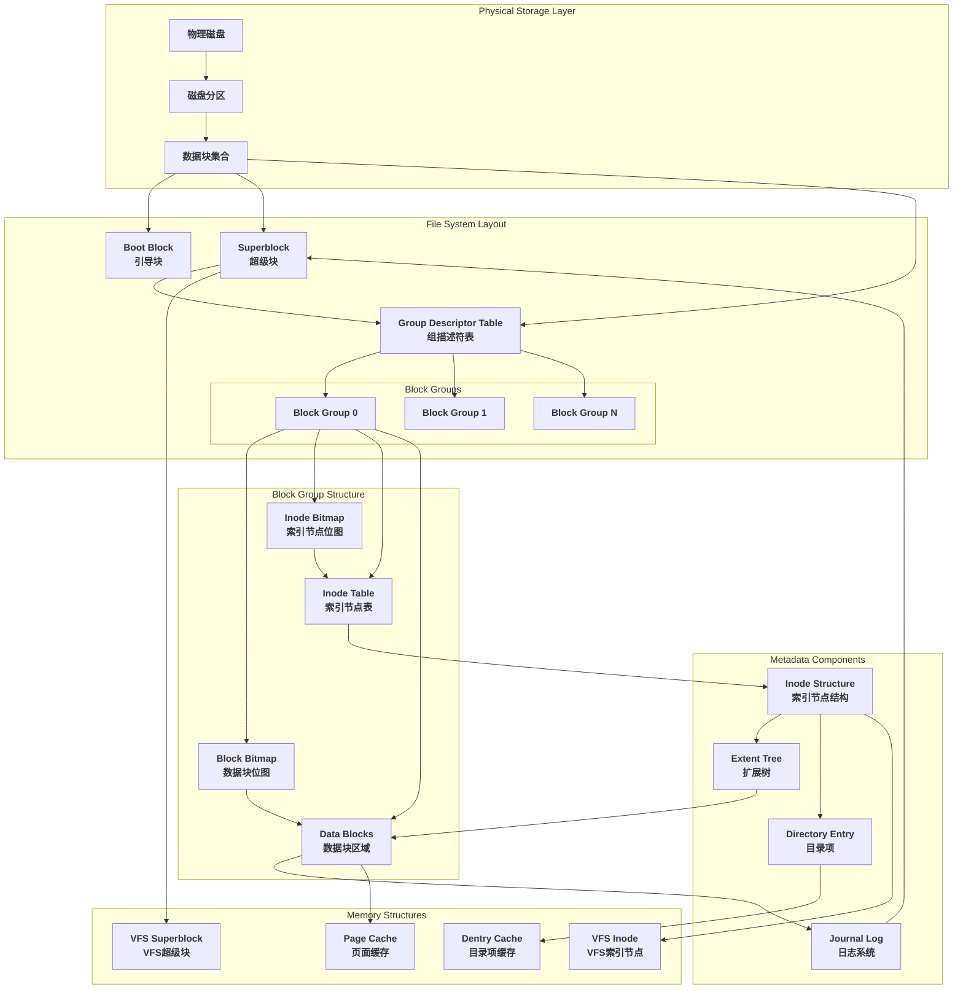
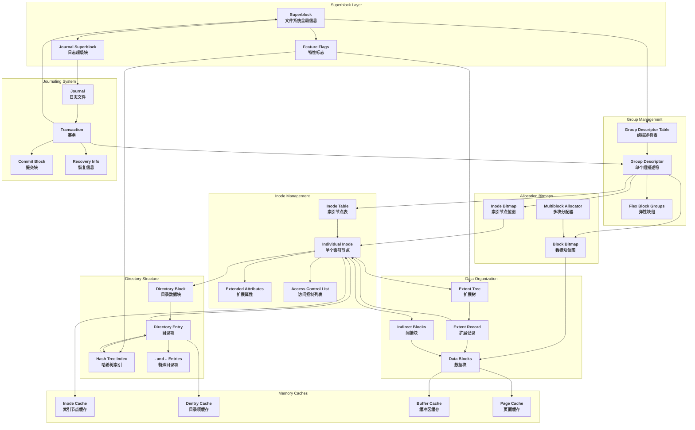
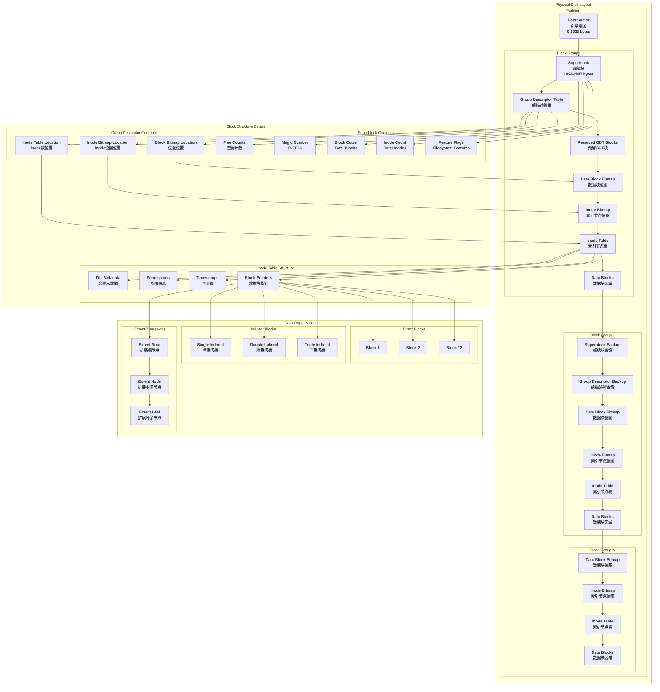
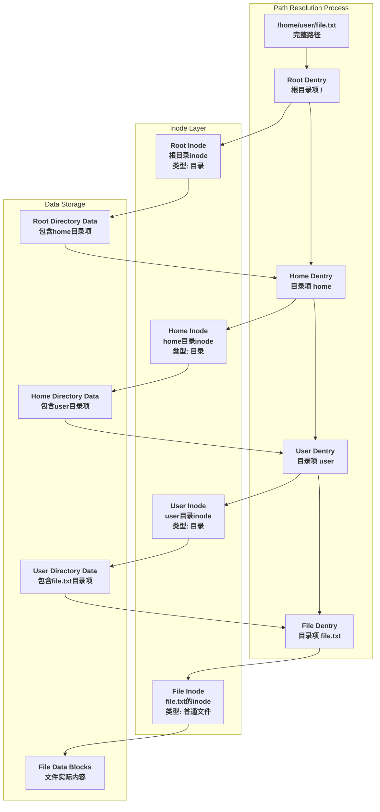
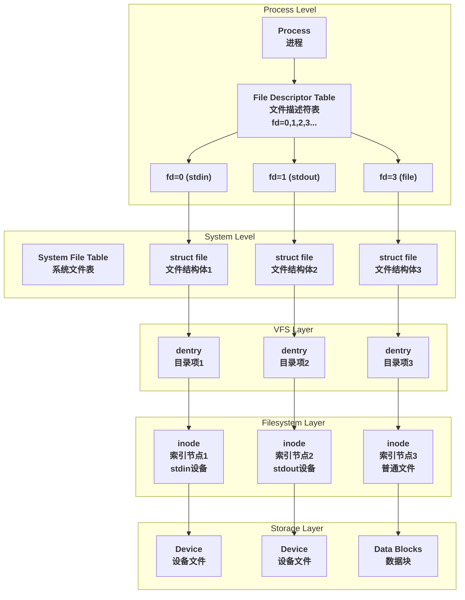

# Linux文件系统元数据详解

## 概述

文件系统元数据（Metadata）是描述和管理文件系统结构、文件属性和数据组织方式的关键信息。基于Linux内核源码分析，文件系统元数据构成了一个复杂而精密的管理体系，确保数据的完整性、一致性和高效访问。

## 文件系统元数据架构图

下图展示了Linux文件系统中各种元数据的完整架构和相互关系：



**架构层次说明：**

1. **物理存储层**：硬件磁盘、分区和物理块
2. **文件系统布局层**：固定的磁盘布局结构
3. **块组结构层**：文件系统的基本管理单元
4. **元数据组件层**：核心的元数据结构
5. **内存结构层**：内核中的缓存和管理结构

## 1. 核心元数据类型

### 1.1 Superblock（超级块）

超级块是文件系统的"身份证"，包含文件系统的全局信息。

#### 1.1.1 ext4_super_block结构

基于内核源码 `fs/ext4/ext4.h`：

```c
struct ext4_super_block {
    __le32  s_inodes_count;         // 文件系统中inode总数
    __le32  s_blocks_count_lo;      // 文件系统中块总数（低32位）
    __le32  s_r_blocks_count_lo;    // 预留块数（低32位）
    __le32  s_free_blocks_count_lo; // 空闲块数（低32位）
    __le32  s_free_inodes_count;    // 空闲inode数
    __le32  s_first_data_block;     // 第一个数据块
    __le32  s_log_block_size;       // 块大小（log2(block_size/1024)）
    __le32  s_log_cluster_size;     // 簇大小（log2(cluster_size/1024)）
    __le32  s_blocks_per_group;     // 每个块组的块数
    __le32  s_clusters_per_group;   // 每个块组的簇数
    __le32  s_inodes_per_group;     // 每个块组的inode数
    __le32  s_mtime;               // 挂载时间
    __le32  s_wtime;               // 写入时间
    __le16  s_mnt_count;           // 挂载计数
    __le16  s_max_mnt_count;       // 最大挂载计数
    __le16  s_magic;               // 魔数（0xEF53 for ext2/3/4）
    __le16  s_state;               // 文件系统状态
    __le16  s_errors;              // 错误处理方式
    __le16  s_minor_rev_level;     // 次版本号
    __le32  s_lastcheck;           // 最后检查时间
    __le32  s_checkinterval;       // 检查间隔
    __le32  s_creator_os;          // 创建操作系统
    __le32  s_rev_level;           // 版本级别
    __le16  s_def_resuid;          // 预留块的默认用户ID
    __le16  s_def_resgid;          // 预留块的默认组ID
    
    // EXT4_DYNAMIC_REV specific fields
    __le32  s_first_ino;           // 第一个非预留inode
    __le16  s_inode_size;          // inode结构大小
    __le16  s_block_group_nr;      // 此超级块所在的块组号
    __le32  s_feature_compat;      // 兼容特性集
    __le32  s_feature_incompat;    // 不兼容特性集
    __le32  s_feature_ro_compat;   // 只读兼容特性集
    __u8    s_uuid[16];            // 128位文件系统标识符
    char    s_volume_name[16];     // 卷名
    char    s_last_mounted[64];    // 最后挂载路径
    __le32  s_algorithm_usage_bitmap; // 压缩算法使用位图
    
    // Performance hints
    __u8    s_prealloc_blocks;     // 预分配块数
    __u8    s_prealloc_dir_blocks; // 目录预分配块数
    __le16  s_reserved_gdt_blocks; // 预留的组描述符表块数
    
    // Journaling support
    __u8    s_journal_uuid[16];    // 日志UUID
    __le32  s_journal_inum;        // 日志文件inode号
    __le32  s_journal_dev;         // 日志设备号
    __le32  s_last_orphan;         // 孤儿inode链表起始
    __le32  s_hash_seed[4];        // 目录哈希种子
    __u8    s_def_hash_version;    // 默认哈希算法版本
    __u8    s_jnl_backup_type;     // 日志备份类型
    __le16  s_desc_size;           // 组描述符大小
    
    // 更多字段...
};
```

#### 1.1.2 超级块的作用

1. **文件系统识别**：通过魔数识别文件系统类型
2. **全局配置**：记录块大小、inode数量等基本参数
3. **状态管理**：跟踪文件系统的挂载状态和健康状况
4. **特性控制**：定义支持的特性和兼容性级别

#### 1.1.3 超级块存储位置

```c
// 超级块在不同块组中的备份机制
// 源码：fs/ext4/super.c

#define EXT4_SB_OFFSET          1024    // 超级块在分区中的偏移量
#define EXT4_MIN_BLOCK_SIZE     1024    // 最小块大小
#define EXT4_MAX_BLOCK_SIZE     65536   // 最大块大小

// 超级块备份策略
static int ext4_bg_has_super(struct super_block *sb, ext4_group_t group)
{
    struct ext4_sb_info *sbi = EXT4_SB(sb);
    
    if (group == 0)
        return 1;  // 块组0总是有超级块
    
    if (ext4_has_feature_sparse_super(sb)) {
        // 稀疏超级块：只在特定组中备份
        if (group <= 1)
            return 1;
        if (!(group & 1))
            return 0;
        if (test_root(group, 3) || test_root(group, 5) ||
            test_root(group, 7))
            return 1;
    }
    
    return 0;
}
```

### 1.2 Inode（索引节点）

Inode是文件系统中最重要的元数据，存储文件的属性和数据块位置信息。

#### 1.2.1 ext4_inode结构

```c
// 源码：fs/ext4/ext4.h
struct ext4_inode {
    __le16  i_mode;        // 文件模式和权限
    __le16  i_uid;         // 用户ID（低16位）
    __le32  i_size_lo;     // 文件大小（低32位）
    __le32  i_atime;       // 访问时间
    __le32  i_ctime;       // 创建时间
    __le32  i_mtime;       // 修改时间
    __le32  i_dtime;       // 删除时间
    __le16  i_gid;         // 组ID（低16位）
    __le16  i_links_count; // 硬链接计数
    __le32  i_blocks_lo;   // 文件使用的512字节块数（低32位）
    __le32  i_flags;       // 文件标志
    
    union {
        struct {
            __le32  l_i_version;
        } linux1;
        struct {
            __u32  h_i_translator;
        } hurd1;
        struct {
            __u32  m_i_reserved1;
        } masix1;
    } osd1;                // OS相关字段1
    
    __le32  i_block[EXT4_N_BLOCKS];  // 数据块指针数组
    __le32  i_generation;            // 文件版本号
    __le32  i_file_acl_lo;          // 文件ACL（低32位）
    __le32  i_size_high;            // 文件大小（高32位）
    __le32  i_obso_faddr;           // 废弃字段
    
    union {
        struct {
            __le16  l_i_blocks_high;    // 高16位块计数
            __le16  l_i_file_acl_high;  // 文件ACL（高16位）
            __le16  l_i_uid_high;       // 用户ID（高16位）
            __le16  l_i_gid_high;       // 组ID（高16位）
            __le16  l_i_checksum_lo;    // 校验和（低16位）
            __le16  l_i_reserved;       // 预留字段
        } linux2;
        // 其他OS的字段定义...
    } osd2;                // OS相关字段2
    
    __le16  i_extra_isize;          // 扩展inode大小
    __le16  i_checksum_hi;          // 校验和（高16位）
    __le32  i_ctime_extra;          // 创建时间（纳秒）
    __le32  i_mtime_extra;          // 修改时间（纳秒）
    __le32  i_atime_extra;          // 访问时间（纳秒）
    __le32  i_crtime;               // 文件创建时间
    __le32  i_crtime_extra;         // 创建时间（纳秒）
    __le32  i_version_hi;           // 高32位版本号
    __le32  i_projid;               // 项目ID
};
```

#### 1.2.2 Inode数据块映射机制

```c
// ext4的数据块映射：间接块和扩展树
#define EXT4_NDIR_BLOCKS        12    // 直接块数量
#define EXT4_IND_BLOCK          EXT4_NDIR_BLOCKS           // 间接块索引
#define EXT4_DIND_BLOCK         (EXT4_IND_BLOCK + 1)       // 双重间接块
#define EXT4_TIND_BLOCK         (EXT4_DIND_BLOCK + 1)      // 三重间接块
#define EXT4_N_BLOCKS           (EXT4_TIND_BLOCK + 1)      // 总块指针数

// 传统间接块方式（ext2/3）
struct ext4_inode_info {
    __le32  i_data[15];    // 数据块指针
    /*
     * i_data[0-11]: 直接指向数据块
     * i_data[12]:   指向间接块（包含数据块指针）
     * i_data[13]:   指向双重间接块
     * i_data[14]:   指向三重间接块
     */
};

// ext4扩展树方式
struct ext4_extent_header {
    __le16  eh_magic;       // 魔数（0xf30a）
    __le16  eh_entries;     // 有效条目数
    __le16  eh_max;         // 最大条目数
    __le16  eh_depth;       // 树的深度
    __le32  eh_generation;  // 生成号
};

struct ext4_extent {
    __le32  ee_block;       // 逻辑块号
    __le16  ee_len;         // 扩展长度
    __le16  ee_start_hi;    // 物理块号（高16位）
    __le32  ee_start_lo;    // 物理块号（低32位）
};

struct ext4_extent_idx {
    __le32  ei_block;       // 逻辑块号
    __le32  ei_leaf_lo;     // 指向下一级的物理块号（低32位）
    __le16  ei_leaf_hi;     // 指向下一级的物理块号（高16位）
    __u16   ei_unused;      // 未使用
};
```

### 1.3 Directory Entry（目录项）

目录项描述目录中文件和子目录的信息。

#### 1.3.1 ext4目录项结构

```c
// 传统线性目录项格式
struct ext4_dir_entry {
    __le32  inode;          // inode号
    __le16  rec_len;        // 记录长度
    __le16  name_len;       // 文件名长度
    char    name[];         // 文件名（变长）
};

// ext4改进的目录项格式
struct ext4_dir_entry_2 {
    __le32  inode;          // inode号
    __le16  rec_len;        // 记录长度
    __u8    name_len;       // 文件名长度
    __u8    file_type;      // 文件类型
    char    name[];         // 文件名（变长）
};

// 文件类型定义
#define EXT4_FT_UNKNOWN         0    // 未知
#define EXT4_FT_REG_FILE        1    // 普通文件
#define EXT4_FT_DIR             2    // 目录
#define EXT4_FT_CHRDEV          3    // 字符设备
#define EXT4_FT_BLKDEV          4    // 块设备
#define EXT4_FT_FIFO            5    // 命名管道
#define EXT4_FT_SOCK            6    // 套接字
#define EXT4_FT_SYMLINK         7    // 符号链接

// Hash Tree目录（HTree）支持大目录
struct dx_root {
    struct fake_dirent dot;           // "."条目
    char dot_name[4];                 // "."
    struct fake_dirent dotdot;        // ".."条目
    char dotdot_name[4];              // ".."
    struct dx_root_info {
        __le32 reserved_zero;         // 预留字段
        __u8 hash_version;            // 哈希版本
        __u8 info_length;             // 信息长度
        __u8 indirect_levels;         // 间接层数
        __u8 unused_flags;            // 未使用标志
    } info;
    struct dx_entry entries[];        // 哈希索引条目
};
```

### 1.4 Block Bitmap（块位图）

块位图管理数据块的分配状态。

#### 1.4.1 位图结构和操作

```c
// 源码：fs/ext4/balloc.c

// 块位图操作函数
static int ext4_set_bit(int nr, void *addr)
{
    return test_and_set_bit_le(nr, addr);
}

static int ext4_clear_bit(int nr, void *addr)
{
    return test_and_clear_bit_le(nr, addr);
}

static int ext4_test_bit(int nr, void *addr)
{
    return test_bit_le(nr, addr);
}

// 块分配算法
static ext4_grpblk_t ext4_balloc_find_goal(struct inode *inode,
                                           ext4_lblk_t block,
                                           ext4_fsblk_t *partial_goal)
{
    struct ext4_inode_info *ei = EXT4_I(inode);
    ext4_fsblk_t goal;
    ext4_grpblk_t colour;
    
    // 尝试分配在上一个分配块附近
    if (ei->i_last_alloc_logical_block != ~0 &&
        (logical = ei->i_last_alloc_logical_block + 1) < block) {
        goal = ei->i_last_alloc_physical_block + 1;
    }
    
    // 如果没有历史信息，使用inode所在组的第一个块
    if (!goal) {
        colour = (current->pid % 16) *
                (EXT4_BLOCKS_PER_GROUP(inode->i_sb) / 16);
        goal = colour + (block % EXT4_BLOCKS_PER_GROUP(inode->i_sb));
    }
    
    return goal;
}
```

### 1.5 Inode Bitmap（inode位图）

inode位图管理inode的分配状态。

#### 1.5.1 inode分配策略

```c
// 源码：fs/ext4/ialloc.c

struct inode *__ext4_new_inode(handle_t *handle, struct inode *dir,
                               umode_t mode, const struct qstr *qstr,
                               __u32 goal, uid_t *owner, __u32 i_flags,
                               int handle_type, unsigned int line_no,
                               int nblocks)
{
    struct super_block *sb = dir->i_sb;
    struct buffer_head *inode_bitmap_bh = NULL;
    struct buffer_head *group_desc_bh;
    ext4_group_t ngroups, group = 0;
    unsigned long ino = 0;
    struct inode *inode;
    struct ext4_group_desc *gdp = NULL;
    struct ext4_inode_info *ei;
    struct ext4_sb_info *sbi;
    
    // inode分配策略：
    // 1. 对于目录，尝试分散到不同的块组
    // 2. 对于文件，尝试分配到父目录所在的块组
    
    if (S_ISDIR(mode)) {
        // 目录分配策略：选择空闲inode最多的组
        ret2 = find_group_orlov(sb, dir, &group, mode, qstr);
    } else {
        // 文件分配策略：在父目录组中查找
        group = EXT4_I(dir)->i_block_group;
        ret2 = find_group_other(sb, dir, &group, mode);
    }
    
    // 在选定的组中查找空闲inode
    for (i = 0; i < ngroups; i++, ino = 0, group++) {
        if (group >= ngroups)
            group = 0;
            
        gdp = ext4_get_group_desc(sb, group, &group_desc_bh);
        if (!gdp)
            continue;
            
        if (ext4_free_inodes_count(sb, gdp) == 0)
            continue;
            
        ino = ext4_find_next_zero_bit(inode_bitmap_bh->b_data,
                                     EXT4_INODES_PER_GROUP(sb), ino);
        if (ino >= EXT4_INODES_PER_GROUP(sb))
            continue;
            
        // 找到空闲位，设置为已分配
        if (ext4_set_bit(ino, inode_bitmap_bh->b_data) == 0)
            break;
    }
    
    return inode;
}
```

## 2. 元数据关系详细图

下图展示了各种元数据之间的详细关系和依赖：



## 3. 组描述符（Group Descriptor）

### 3.1 ext4_group_desc结构

组描述符管理每个块组的元数据分布和状态信息：

```c
// 源码：fs/ext4/ext4.h
struct ext4_group_desc {
    __le32  bg_block_bitmap_lo;      // 块位图位置（低32位）
    __le32  bg_inode_bitmap_lo;      // inode位图位置（低32位）
    __le32  bg_inode_table_lo;       // inode表位置（低32位）
    __le16  bg_free_blocks_count_lo; // 空闲块数（低16位）
    __le16  bg_free_inodes_count_lo; // 空闲inode数（低16位）
    __le16  bg_used_dirs_count_lo;   // 目录数（低16位）
    __le16  bg_flags;                // 标志位
    __le32  bg_exclude_bitmap_lo;    // 排除位图位置（低32位）
    __le16  bg_block_bitmap_csum_lo; // 块位图校验和（低16位）
    __le16  bg_inode_bitmap_csum_lo; // inode位图校验和（低16位）
    __le16  bg_itable_unused_lo;     // 未使用的inode数（低16位）
    __le16  bg_checksum;             // 组描述符校验和
    
    // 64位模式下的高位字段
    __le32  bg_block_bitmap_hi;      // 块位图位置（高32位）
    __le32  bg_inode_bitmap_hi;      // inode位图位置（高32位）
    __le32  bg_inode_table_hi;       // inode表位置（高32位）
    __le16  bg_free_blocks_count_hi; // 空闲块数（高16位）
    __le16  bg_free_inodes_count_hi; // 空闲inode数（高16位）
    __le16  bg_used_dirs_count_hi;   // 目录数（高16位）
    __le16  bg_itable_unused_hi;     // 未使用的inode数（高16位）
    __le32  bg_exclude_bitmap_hi;    // 排除位图位置（高32位）
    __le16  bg_block_bitmap_csum_hi; // 块位图校验和（高16位）
    __le16  bg_inode_bitmap_csum_hi; // inode位图校验和（高16位）
    __u32   bg_reserved;             // 预留字段
};

// 组描述符标志
#define EXT4_BG_INODE_UNINIT    0x0001  // inode位图和表未初始化
#define EXT4_BG_BLOCK_UNINIT    0x0002  // 块位图未初始化
#define EXT4_BG_INODE_ZEROED    0x0004  // inode表已清零
```

### 3.2 弹性块组（Flex Block Groups）

ext4引入弹性块组概念，将多个连续的块组组合管理：

```c
// 源码：fs/ext4/ext4.h
struct flex_groups {
    atomic64_t  free_clusters;       // 空闲簇数
    atomic_t    free_inodes;         // 空闲inode数
    atomic_t    used_dirs;           // 使用的目录数
};

// 弹性组大小计算
static inline ext4_group_t ext4_flex_group(struct ext4_sb_info *sbi,
                                           ext4_group_t block_group)
{
    return block_group >> sbi->s_log_groups_per_flex;
}

static inline unsigned int ext4_flex_bg_size(struct ext4_sb_info *sbi)
{
    return 1 << sbi->s_log_groups_per_flex;
}
```

## 4. 日志系统（Journal）

### 4.1 日志超级块

```c
// 源码：fs/jbd2/journal.c
typedef struct journal_superblock_s {
    journal_header_t s_header;          // 通用日志头部
    
    __be32  s_blocksize;               // 日志块大小
    __be32  s_maxlen;                  // 日志最大长度
    __be32  s_first;                   // 第一个有效块
    __be32  s_sequence;                // 第一个事务的序列号
    __be32  s_start;                   // 第一个有效事务的位置
    
    __be32  s_errno;                   // 文件系统错误值
    
    // 特性兼容性字段
    __be32  s_feature_compat;          // 兼容特性集
    __be32  s_feature_incompat;        // 不兼容特性集
    __be32  s_feature_ro_compat;       // 只读兼容特性集
    
    __u8    s_uuid[16];                // 128位文件系统标识符
    
    __be32  s_nr_users;                // 使用此日志的文件系统数
    __be32  s_dynsuper;                // 动态日志超级块位置
    
    __be32  s_max_transaction;         // 最大事务大小
    __be32  s_max_trans_data;          // 最大事务数据大小
    
    __u8    s_checksum_type;           // 校验和类型
    __u8    s_padding2[3];             // 填充
    __u32   s_padding[42];             // 预留空间
    __be32  s_checksum;                // 超级块校验和
    
    __u8    s_users[16*48];            // 使用此日志的文件系统ID
} journal_superblock_t;
```

### 4.2 事务管理

```c
// 源码：fs/jbd2/transaction.c
struct transaction_s {
    journal_t               *t_journal;        // 所属日志
    tid_t                   t_tid;             // 事务ID
    enum {
        T_RUNNING,                             // 运行中
        T_LOCKED,                              // 已锁定
        T_SWITCH,                              // 切换中
        T_FLUSH,                               // 刷新中
        T_COMMIT,                              // 提交中
        T_COMMIT_DFLUSH,                       // 提交数据刷新中
        T_COMMIT_JFLUSH,                       // 提交日志刷新中
        T_COMMIT_CALLBACK,                     // 提交回调中
        T_FINISHED                             // 已完成
    }                       t_state;           // 事务状态
    
    unsigned long           t_log_start;       // 日志起始位置
    int                     t_nr_buffers;      // 缓冲区数
    struct list_head        t_buffers;         // 缓冲区链表
    struct list_head        t_sync_datalist;   // 同步数据链表
    struct list_head        t_locked_list;     // 锁定链表
    
    spinlock_t              t_handle_lock;     // 句柄锁
    atomic_t                t_updates;         // 更新计数
    atomic_t                t_outstanding_credits; // 未完成的信用
    atomic_t                t_handle_count;    // 句柄计数
    
    ktime_t                 t_start_time;      // 开始时间
    unsigned int            t_requested;       // 请求的块数
};

// 事务句柄
typedef struct handle_s {
    transaction_t           *h_transaction;    // 关联的事务
    int                     h_ref;             // 引用计数
    int                     h_err;             // 错误状态
    
    unsigned int            h_sync:1;          // 同步标志
    unsigned int            h_jdata:1;         // 日志数据标志
    unsigned int            h_reserved:1;      // 预留标志
    unsigned int            h_aborted:1;       // 中止标志
    unsigned int            h_type:8;          // 句柄类型
    unsigned int            h_line_no:16;      // 行号（调试用）
    
    long                    h_start_jiffies;   // 开始时间戳
    unsigned int            h_requested;       // 请求的块数
    unsigned int            h_reserved;        // 预留的块数
} handle_t;
```

## 5. 扩展属性（Extended Attributes）

### 5.1 扩展属性结构

```c
// 源码：fs/ext4/xattr.h
struct ext4_xattr_header {
    __le32  h_magic;        // 魔数（0xEA020000）
    __le32  h_refcount;     // 引用计数
    __le32  h_blocks;       // 使用的块数
    __le32  h_hash;         // 所有条目名称的哈希值
    __le32  h_checksum;     // 校验和
    __u32   h_reserved[3];  // 预留字段（必须为零）
};

struct ext4_xattr_entry {
    __u8    e_name_len;     // 名称长度
    __u8    e_name_index;   // 名称索引
    __le16  e_value_offs;   // 值的偏移量
    __le32  e_value_inum;   // 值的inode号（如果存储在外部）
    __le32  e_value_size;   // 值的大小
    __le32  e_hash;         // 名称的哈希值
    char    e_name[];       // 属性名称
};

// 扩展属性名称索引
#define EXT4_XATTR_INDEX_USER              1    // 用户属性
#define EXT4_XATTR_INDEX_POSIX_ACL_ACCESS  2    // POSIX ACL访问
#define EXT4_XATTR_INDEX_POSIX_ACL_DEFAULT 3    // POSIX ACL默认
#define EXT4_XATTR_INDEX_TRUSTED           4    // 受信任属性
#define EXT4_XATTR_INDEX_LUSTRE            5    // Lustre文件系统
#define EXT4_XATTR_INDEX_SECURITY          6    // 安全属性
#define EXT4_XATTR_INDEX_SYSTEM            7    // 系统属性
#define EXT4_XATTR_INDEX_RICHACL           8    // RichACL
#define EXT4_XATTR_INDEX_ENCRYPTION        9    // 加密属性
```

### 5.2 扩展属性存储策略

```c
// 源码：fs/ext4/xattr.c

// 扩展属性可以存储在三个位置：
// 1. inode内部的额外空间
// 2. 专门的扩展属性块
// 3. 外部文件（大属性值）

static int ext4_xattr_set_entry(struct ext4_xattr_info *i,
                                struct ext4_xattr_search *s,
                                handle_t *handle, struct inode *inode,
                                bool is_block)
{
    struct ext4_xattr_entry *here = s->here;
    size_t min_offs = s->end - s->base;
    size_t size = EXT4_XATTR_LEN(strlen(i->name));
    
    if (i->value) {
        size_t value_size = EXT4_XATTR_SIZE(i->value_len);
        
        // 检查是否需要外部存储
        if (i->value_len > sb->s_blocksize) {
            // 使用外部inode存储大值
            ret = ext4_xattr_inode_create(handle, inode, i->value,
                                         i->value_len, &value_inum);
        }
    }
    
    // 在inode内或块中分配空间
    if (EXT4_I(inode)->i_extra_isize < EXT4_SB(inode->i_sb)->s_want_extra_isize) {
        // 优先使用inode内空间
        ret = ext4_expand_extra_isize_ea(inode, 
                    EXT4_SB(inode->i_sb)->s_want_extra_isize,
                    i, s);
    }
    
    return ret;
}
```

## 6. 元数据存储布局

### 6.1 磁盘布局图

下图展示了ext4文件系统在物理磁盘上的完整布局结构：



### 6.2 块组结构分析

每个块组包含以下固定结构（基于源码分析）：

```c
// 源码：fs/ext4/ext4.h

// 块组大小计算
#define EXT4_BLOCKS_PER_GROUP(s)  (EXT4_SB(s)->s_blocks_per_group)
#define EXT4_INODES_PER_GROUP(s)  (EXT4_SB(s)->s_inodes_per_group)

// 块组中各部分的偏移量计算
static ext4_fsblk_t ext4_group_first_block_no(struct super_block *sb,
                                              ext4_group_t group_no)
{
    return group_no * (ext4_fsblk_t)EXT4_BLOCKS_PER_GROUP(sb) +
           le32_to_cpu(EXT4_SB(sb)->s_es->s_first_data_block);
}

// 计算块位图位置
static ext4_fsblk_t ext4_block_bitmap(struct super_block *sb,
                                      struct ext4_group_desc *bg)
{
    return le32_to_cpu(bg->bg_block_bitmap_lo) |
           (EXT4_DESC_SIZE(sb) >= EXT4_MIN_DESC_SIZE_64BIT ?
            (ext4_fsblk_t)le32_to_cpu(bg->bg_block_bitmap_hi) << 32 : 0);
}

// 计算inode位图位置
static ext4_fsblk_t ext4_inode_bitmap(struct super_block *sb,
                                      struct ext4_group_desc *bg)
{
    return le32_to_cpu(bg->bg_inode_bitmap_lo) |
           (EXT4_DESC_SIZE(sb) >= EXT4_MIN_DESC_SIZE_64BIT ?
            (ext4_fsblk_t)le32_to_cpu(bg->bg_inode_bitmap_hi) << 32 : 0);
}

// 计算inode表位置
static ext4_fsblk_t ext4_inode_table(struct super_block *sb,
                                     struct ext4_group_desc *bg)
{
    return le32_to_cpu(bg->bg_inode_table_lo) |
           (EXT4_DESC_SIZE(sb) >= EXT4_MIN_DESC_SIZE_64BIT ?
            (ext4_fsblk_t)le32_to_cpu(bg->bg_inode_table_hi) << 32 : 0);
}
```

### 6.3 元数据分布策略

#### 6.3.1 超级块备份策略

```c
// 源码：fs/ext4/super.c

// 稀疏超级块特性：减少超级块备份数量
static int ext4_bg_has_super(struct super_block *sb, ext4_group_t group)
{
    if (group == 0)
        return 1;  // 块组0总是有超级块

    if (ext4_has_feature_sparse_super(sb)) {
        if (group <= 1)
            return 1;  // 块组1也有备份
        if (!(group & 1))
            return 0;  // 偶数组（除0,1外）无备份
        if (test_root(group, 3) || test_root(group, 5) ||
            test_root(group, 7))
            return 1;  // 3、5、7的幂次方组有备份
        return 0;
    } else {
        // 传统模式：每个组都有超级块备份
        return 1;
    }
}

// 检查是否为3、5、7的幂次方
static int test_root(ext4_group_t a, int b)
{
    while (1) {
        if (a < b)
            return 0;
        if (a == b)
            return 1;
        if ((a % b) != 0)
            return 0;
        a = a / b;
    }
}
```

#### 6.3.2 inode分配策略

```c
// 源码：fs/ext4/ialloc.c

// Orlov算法：优化目录分布
static int find_group_orlov(struct super_block *sb, struct inode *parent,
                           ext4_group_t *group, umode_t mode,
                           const struct qstr *qstr)
{
    ext4_group_t parent_group = EXT4_I(parent)->i_block_group;
    struct ext4_sb_info *sbi = EXT4_SB(sb);
    ext4_group_t real_ngroups = ext4_get_groups_count(sb);
    int inodes_per_group = EXT4_INODES_PER_GROUP(sb);
    unsigned int freei, avefreei, grp_free;
    ext4_group_t min_group, max_group;
    ext4_group_t group2;
    struct ext4_group_desc *desc;
    
    // 计算平均空闲inode数
    freei = percpu_counter_read_positive(&sbi->s_freeinodes_counter);
    avefreei = freei / real_ngroups;
    
    // 对于目录，寻找空闲inode较多且目录较少的组
    max_group = real_ngroups;
    min_group = 0;
    
    for (group2 = 0; group2 < real_ngroups; group2++) {
        desc = ext4_get_group_desc(sb, group2, NULL);
        if (desc && ext4_free_inodes_count(sb, desc) &&
            ext4_free_group_clusters(sb, desc)) {
            grp_free = ext4_free_inodes_count(sb, desc);
            if (grp_free > avefreei) {
                *group = group2;
                return 0;
            }
        }
    }
    
    // 如果找不到最优组，回退到简单策略
    *group = parent_group;
    return 0;
}

// 文件分配策略：尽量与父目录在同一组
static int find_group_other(struct super_block *sb, struct inode *parent,
                           ext4_group_t *group, umode_t mode)
{
    ext4_group_t parent_group = EXT4_I(parent)->i_block_group;
    ext4_group_t i, last, ngroups;
    struct ext4_group_desc *desc;
    
    ngroups = ext4_get_groups_count(sb);
    
    // 首先尝试父目录所在的组
    *group = parent_group;
    desc = ext4_get_group_desc(sb, *group, NULL);
    if (desc && ext4_free_inodes_count(sb, desc) &&
        ext4_free_group_clusters(sb, desc))
        return 0;
        
    // 在附近的组中寻找
    for (i = 1; i < ngroups; i <<= 1) {
        *group += i;
        if (*group >= ngroups)
            *group -= ngroups;
        desc = ext4_get_group_desc(sb, *group, NULL);
        if (desc && ext4_free_inodes_count(sb, desc) &&
            ext4_free_group_clusters(sb, desc))
            return 0;
    }
    
    // 线性搜索所有组
    *group = parent_group;
    for (i = 0; i < ngroups; i++) {
        if (++*group >= ngroups)
            *group = 0;
        desc = ext4_get_group_desc(sb, *group, NULL);
        if (desc && ext4_free_inodes_count(sb, desc))
            return 0;
    }
    
    return -1;
}
```

## 7. 元数据缓存机制

### 7.1 内存中的元数据缓存

Linux内核通过多层缓存机制优化元数据访问性能：

```c
// 源码：fs/ext4/ext4.h

// ext4超级块信息（内存中）
struct ext4_sb_info {
    unsigned long s_desc_size;           // 组描述符大小
    unsigned long s_inodes_per_block;    // 每块的inode数
    unsigned long s_blocks_per_group;    // 每组的块数
    unsigned long s_clusters_per_group;  // 每组的簇数
    unsigned long s_inodes_per_group;    // 每组的inode数
    unsigned long s_itb_per_group;       // 每组的inode表块数
    unsigned long s_gdb_count;           // 组描述符块数
    unsigned long s_desc_per_block;      // 每块的组描述符数
    
    struct buffer_head **s_group_desc;   // 组描述符缓存
    unsigned int s_mount_opt;            // 挂载选项
    unsigned int s_mount_opt2;           // 扩展挂载选项
    unsigned int s_mount_flags;          // 挂载标志
    
    struct percpu_counter s_freeclusters_counter;  // 空闲簇计数器
    struct percpu_counter s_freeinodes_counter;    // 空闲inode计数器
    struct percpu_counter s_dirs_counter;          // 目录计数器
    struct percpu_counter s_dirtyclusters_counter; // 脏簇计数器
    
    struct blockgroup_lock *s_blockgroup_lock;     // 块组锁数组
    struct proc_dir_entry *s_proc;                 // proc文件系统条目
    struct kobject s_kobj;                         // sysfs kobject
    struct completion s_kobj_unregister;          // kobject注销完成
    struct super_block *s_sb;                      // VFS超级块
    
    // 日志相关
    struct journal_s *s_journal;                   // JBD2日志
    unsigned long s_commit_interval;               // 提交间隔
    u32 s_max_batch_time;                         // 最大批处理时间
    u32 s_min_batch_time;                         // 最小批处理时间
    
    // Flex组支持
    struct flex_groups **s_flex_groups;            // 弹性组数组
    ext4_group_t s_flex_groups_allocated;          // 已分配的弹性组数
};

// ext4 inode信息（内存中）
struct ext4_inode_info {
    __le32  i_data[15];                 // 块指针数组
    __u32   i_dtime;                    // 删除时间
    ext4_fsblk_t i_file_acl;            // 文件ACL块
    
    // 扩展树相关
    struct ext4_ext_cache i_cached_extent;  // 缓存的扩展
    struct inode vfs_inode;                 // VFS inode
    struct jbd2_inode *jinode;              // JBD2 inode
    
    spinlock_t i_raw_lock;              // 原始数据锁
    struct timespec64 i_crtime;         // 创建时间
    
    // 预分配支持
    struct ext4_prealloc_space *i_prealloc_node; // 预分配节点
    
    // 缓存和统计
    unsigned long i_state_flags;        // 状态标志
    unsigned long i_reserved_data_blocks; // 预留数据块
    unsigned long i_reserved_meta_blocks;  // 预留元数据块
    unsigned short i_extra_isize;        // 额外inode大小
    
    // 块映射缓存
    rwlock_t i_es_lock;                 // 扩展状态锁
    struct list_head i_es_list;         // 扩展状态链表
    unsigned int i_es_all_nr;           // 所有扩展状态数
    unsigned int i_es_shk_nr;           // 收缩扩展状态数
    ext4_lblk_t i_es_shrink_lblk;       // 收缩逻辑块号
};
```

### 7.2 缓冲区缓存管理

```c
// 源码：fs/buffer.c

// 缓冲区头部结构
struct buffer_head {
    unsigned long b_state;          // 缓冲区状态
    struct buffer_head *b_this_page; // 页面中的下一个缓冲区
    struct page *b_page;            // 所属页面
    
    sector_t b_blocknr;             // 逻辑块号
    size_t b_size;                  // 缓冲区大小
    char *b_data;                   // 数据指针
    
    struct block_device *b_bdev;    // 块设备
    bh_end_io_t *b_end_io;         // I/O完成回调
    void *b_private;               // 私有数据
    struct list_head b_assoc_buffers; // 相关缓冲区链表
    struct address_space *b_assoc_map; // 相关地址空间
    atomic_t b_count;              // 引用计数
    spinlock_t b_uptodate_lock;    // 更新锁
};

// 缓冲区状态位
#define BH_Uptodate     0    // 数据有效
#define BH_Dirty        1    // 数据已修改
#define BH_Lock         2    // 缓冲区已锁定
#define BH_Req          3    // I/O请求挂起
#define BH_Mapped       4    // 已映射到磁盘
#define BH_New          5    // 新分配的缓冲区
#define BH_Async_Read   6    // 异步读取中
#define BH_Async_Write  7    // 异步写入中
#define BH_Delay        8    // 延迟分配
#define BH_Boundary     9    // 扩展边界
#define BH_Write_EIO    10   // 写入I/O错误
#define BH_Unwritten    11   // 未写入的扩展
#define BH_Quiet        12   // 静默错误
#define BH_Meta         13   // 元数据缓冲区
#define BH_Prio         14   // 高优先级I/O
#define BH_Defer_Completion 15 // 延迟完成
```

### 7.3 目录项缓存（Dentry Cache）

```c
// 源码：include/linux/dcache.h

struct dentry {
    unsigned int d_flags;           // 目录项标志
    seqcount_spinlock_t d_seq;      // 序列锁
    struct hlist_bl_node d_hash;    // 哈希链表节点
    struct dentry *d_parent;        // 父目录项
    struct qstr d_name;             // 名称
    struct inode *d_inode;          // 关联的inode
    unsigned char d_iname[DNAME_INLINE_LEN]; // 内联名称
    
    struct lockref d_lockref;       // 锁和引用计数
    const struct dentry_operations *d_op; // 目录项操作
    struct super_block *d_sb;       // 超级块
    unsigned long d_time;           // 重验证时间
    void *d_fsdata;                // 文件系统特定数据
    
    union {
        struct list_head d_lru;     // LRU链表
        wait_queue_head_t *d_wait;  // 等待队列
    };
    struct list_head d_child;       // 子目录项链表
    struct list_head d_subdirs;     // 子目录链表
    
    union {
        struct hlist_node d_alias;  // inode别名链表
        struct hlist_bl_node d_in_lookup_hash; // 查找哈希
        struct rcu_head d_rcu;      // RCU回收
    } d_u;
};

// 目录项状态标志
#define DCACHE_OP_HASH          0x0001    // 有自定义哈希函数
#define DCACHE_OP_COMPARE       0x0002    // 有自定义比较函数
#define DCACHE_OP_REVALIDATE    0x0004    // 需要重验证
#define DCACHE_OP_DELETE        0x0008    // 有自定义删除函数
#define DCACHE_OP_PRUNE         0x0010    // 有自定义修剪函数
#define DCACHE_DISCONNECTED     0x0020    // 未连接到树
#define DCACHE_REFERENCED       0x0040    // 最近被引用
#define DCACHE_RCUACCESS        0x0080    // 通过RCU访问
#define DCACHE_CANT_MOUNT       0x0100    // 不能作为挂载点
#define DCACHE_GENOCIDE         0x0200    // 被标记删除
#define DCACHE_SHRINK_LIST      0x0400    // 在收缩链表中
#define DCACHE_OP_WEAK_REVALIDATE 0x0800  // 弱重验证
#define DCACHE_NFSFS_RENAMED    0x1000    // NFS重命名
#define DCACHE_COOKIE           0x2000    // 有缓存cookie
#define DCACHE_FSNOTIFY_PARENT_WATCHED 0x4000 // 父目录被监视
#define DCACHE_DENTRY_KILLED    0x8000    // 目录项被删除
```

## 8. Inode与Dentry关系及文件描述符管理

### 8.1 Inode与Dentry的关系

#### 8.1.1 基本概念

**Inode（索引节点）**和**Dentry（目录项）**是Linux文件系统中两个不同层次的概念：

- **Inode**：存储文件的**元数据**和**数据块指针**，是文件的"实体"
- **Dentry**：存储文件**名称到inode的映射**，是路径解析的"桥梁"

```c
// 源码：include/linux/dcache.h
struct dentry {
    struct qstr d_name;           // 文件名
    struct inode *d_inode;        // 指向对应的inode
    struct dentry *d_parent;      // 父目录的dentry
    struct list_head d_subdirs;   // 子目录/文件的dentry链表
    // ... 其他字段
};

// 源码：include/linux/fs.h  
struct inode {
    umode_t         i_mode;       // 文件类型和权限
    uid_t           i_uid;        // 用户ID
    gid_t           i_gid;        // 组ID
    loff_t          i_size;       // 文件大小
    struct timespec64 i_atime;    // 访问时间
    struct timespec64 i_mtime;    // 修改时间
    struct timespec64 i_ctime;    // 状态改变时间
    
    // 重要：inode可以被多个dentry引用（硬链接）
    unsigned int    i_nlink;      // 硬链接计数
    struct hlist_head i_dentry;   // 指向此inode的dentry链表
    
    const struct inode_operations *i_op;  // inode操作函数
    struct super_block *i_sb;             // 所属超级块
    struct address_space *i_mapping;      // 页面缓存地址空间
    // ... 其他字段
};
```

#### 8.1.2 关系图解



### 8.2 文件描述符(fd)与inode的关系

#### 8.2.1 文件描述符不在inode中

**重要概念**：文件描述符(fd)是**进程级别**的概念，**不存储在inode中**！

文件描述符的完整路径是：`fd → 进程文件表 → 系统文件表 → inode`

```c
// 源码：include/linux/fdtable.h
// 进程的文件描述符表
struct files_struct {
    atomic_t count;              // 引用计数
    bool resize_in_progress;     // 调整大小标志
    wait_queue_head_t resize_wait; // 调整大小等待队列
    
    struct fdtable __rcu *fdt;   // 文件描述符表
    struct fdtable fdtab;        // 嵌入的文件描述符表
    
    spinlock_t file_lock;        // 文件锁
    unsigned int next_fd;        // 下一个可用fd
    unsigned long close_on_exec_init[1]; // exec时关闭的fd位图
    unsigned long open_fds_init[1];      // 打开的fd位图
    unsigned long full_fds_bits_init[1]; // 完整的fd位图
    struct file __rcu * fd_array[NR_OPEN_DEFAULT]; // 文件指针数组
};

// 源码：include/linux/fs.h
// 系统级文件表项
struct file {
    struct path             f_path;      // 文件路径（包含dentry）
    struct inode           *f_inode;     // 指向inode
    const struct file_operations *f_op; // 文件操作函数表
    
    atomic_long_t           f_count;     // 引用计数
    unsigned int            f_flags;     // 文件标志
    fmode_t                 f_mode;      // 文件模式
    loff_t                  f_pos;       // 文件位置
    struct address_space   *f_mapping;   // 地址空间（页面缓存）
    // ... 其他字段
};
```

#### 8.2.2 文件描述符管理架构图



### 8.3 关键概念总结

#### 8.3.1 层次关系

1. **fd（文件描述符）**：进程级别的小整数标识符
2. **file结构**：系统级别的打开文件表项
3. **dentry（目录项）**：VFS层的路径缓存节点  
4. **inode（索引节点）**：文件系统层的文件元数据

#### 8.3.2 多对一关系

- 多个**fd**可以指向同一个**file**（dup/fork）
- 多个**file**可以指向同一个**dentry**（多次打开同一文件）
- 多个**dentry**可以指向同一个**inode**（硬链接）
- 一个**inode**可以有多个**file**引用它

#### 8.3.3 存储位置

| 数据结构 | 存储位置 | 生命周期 |
|---------|---------|----------|
| **fd** | 进程文件描述符表 | 进程打开文件期间 |
| **file** | 系统文件表 | 文件打开期间 |
| **dentry** | 内存缓存（dcache） | 最近访问期间 |
| **inode** | 磁盘+内存缓存（icache） | 文件存在期间 |

这种设计使得Linux能够高效地管理文件访问，同时支持多进程、硬链接等复杂场景。

## 9. 元数据一致性保证

### 9.1 日志事务机制

ext4使用JBD2（Journaling Block Device 2）提供事务性保证：

```c
// 源码：fs/jbd2/commit.c

// 事务提交过程
void jbd2_journal_commit_transaction(journal_t *journal)
{
    transaction_t *commit_transaction;
    struct journal_head *jh;
    struct buffer_head *bh;
    int err;
    unsigned long long blocknr;
    ktime_t start_time;
    u64 commit_time;
    char *tagp = NULL;
    journal_block_tag_t *tag = NULL;
    int space_left = 0;
    int first_tag = 0;
    int tag_flag;
    int i;
    struct blk_plug plug;
    
    // Phase 1: 准备提交
    // 锁定事务，不允许新的操作加入
    write_lock(&journal->j_state_lock);
    commit_transaction = journal->j_running_transaction;
    commit_transaction->t_state = T_LOCKED;
    write_unlock(&journal->j_state_lock);
    
    // Phase 2: 写入描述符块
    // 记录事务包含的所有块
    jbd2_journal_write_metadata_buffer(commit_transaction, journal);
    
    // Phase 3: 写入数据块
    // 将脏数据写入日志
    blk_start_plug(&plug);
    for (jh = commit_transaction->t_buffers; jh; jh = jh->b_tnext) {
        bh = jh2bh(jh);
        if (buffer_dirty(bh)) {
            // 写入数据到日志区域
            err = jbd2_journal_write_metadata_buffer(commit_transaction, 
                                                    journal, jh, &new_bh, 
                                                    blocknr);
            if (err) {
                jbd2_journal_abort(journal, err);
                break;
            }
        }
    }
    blk_finish_plug(&plug);
    
    // Phase 4: 等待所有I/O完成
    blk_finish_plug(&plug);
    
    // Phase 5: 写入提交记录
    // 表示事务完全写入日志
    commit_record = journal_get_descriptor_buffer(commit_transaction,
                                                 JBD2_COMMIT_BLOCK);
    if (!commit_record) {
        jbd2_journal_abort(journal, -EIO);
        return;
    }
    
    tmp = (struct commit_header *)commit_record->b_data;
    tmp->h_magic = cpu_to_be32(JBD2_MAGIC_NUMBER);
    tmp->h_blocktype = cpu_to_be32(JBD2_COMMIT_BLOCK);
    tmp->h_sequence = cpu_to_be32(commit_transaction->t_tid);
    
    // 计算并设置校验和
    if (jbd2_journal_has_csum_v2or3(journal)) {
        tmp->h_chksum_type = JBD2_CRC32_CHKSUM;
        tmp->h_chksum_size = JBD2_CRC32_CHKSUM_SIZE;
        tmp->h_chksum[0] = cpu_to_be32(crc32_chksum);
    }
    
    // 提交写入
    write_dirty_buffer(commit_record, REQ_SYNC);
    
    // Phase 6: 更新日志超级块
    // 推进日志头部指针
    journal->j_head = commit_transaction->t_log_start;
    journal->j_free = space_left;
    
    // 释放事务资源
    __jbd2_journal_drop_transaction(journal, commit_transaction);
}

// 事务恢复过程
int jbd2_journal_recover(journal_t *journal)
{
    int err, err2;
    journal_superblock_t *sb;
    
    // 读取日志超级块
    err = jbd2_journal_get_superblock(journal);
    if (err)
        return err;
        
    sb = journal->j_superblock;
    
    // 检查是否需要恢复
    if (!sb->s_start) {
        // 日志为空，无需恢复
        return 0;
    }
    
    // 扫描日志，查找未提交的事务
    err = do_one_pass(journal, &info, PASS_SCAN);
    if (!err)
        err = do_one_pass(journal, &info, PASS_REVOKE);
    if (!err)
        err = do_one_pass(journal, &info, PASS_REPLAY);
        
    // 清空日志
    jbd2_journal_clear_journal(journal);
    
    return err;
}
```

### 9.2 元数据校验和机制

ext4通过多层校验和确保元数据完整性：

```c
// 源码：fs/ext4/ext4.h

// 元数据校验和类型
#define EXT4_CRC32C_CHKSUM      1

// 超级块校验和
static __le32 ext4_superblock_csum(struct ext4_sb_info *sbi,
                                  struct ext4_super_block *es)
{
    struct ext4_super_block *tmp_es;
    __u32 csum;
    __le32 save_csum;
    
    tmp_es = kmemdup(es, sizeof(*tmp_es), GFP_NOFS);
    if (!tmp_es)
        return 0;
        
    save_csum = tmp_es->s_checksum;
    tmp_es->s_checksum = 0;
    csum = ext4_chksum(sbi, ~0, (char *)tmp_es, sizeof(*tmp_es));
    kfree(tmp_es);
    
    return cpu_to_le32(csum);
}

// 组描述符校验和
static __le16 ext4_group_desc_csum(struct ext4_sb_info *sbi, __u32 block_group,
                                  struct ext4_group_desc *gdp)
{
    int offset = offsetof(struct ext4_group_desc, bg_checksum);
    __u16 crc = 0;
    __le32 le_group = cpu_to_le32(block_group);
    
    if (ext4_has_metadata_csum(sbi->s_sb)) {
        crc = crc16(~0, sbi->s_es->s_uuid, sizeof(sbi->s_es->s_uuid));
        crc = crc16(crc, (__u8 *)&le_group, sizeof(le_group));
        crc = crc16(crc, (__u8 *)gdp, offset);
        offset += sizeof(gdp->bg_checksum);
        if (offset < sbi->s_desc_size)
            crc = crc16(crc, (__u8 *)gdp + offset,
                       sbi->s_desc_size - offset);
    }
    
    return cpu_to_le16(crc);
}

// inode校验和
static __le32 ext4_inode_csum(struct inode *inode, struct ext4_inode *raw,
                              struct ext4_inode_info *ei)
{
    struct ext4_sb_info *sbi = EXT4_SB(inode->i_sb);
    __u32 csum;
    __u16 dummy_csum = 0;
    int offset = offsetof(struct ext4_inode, i_checksum_lo);
    int csum_size = sizeof(dummy_csum);
    
    csum = ext4_chksum(sbi, ei->i_csum_seed, (__u8 *)raw, offset);
    csum = ext4_chksum(sbi, csum, (__u8 *)&dummy_csum, csum_size);
    offset += csum_size;
    csum = ext4_chksum(sbi, csum, (__u8 *)raw + offset,
                      EXT4_GOOD_OLD_INODE_SIZE - offset);
    
    if (EXT4_INODE_SIZE(inode->i_sb) > EXT4_GOOD_OLD_INODE_SIZE) {
        offset = offsetof(struct ext4_inode, i_checksum_hi);
        csum = ext4_chksum(sbi, csum, (__u8 *)raw +
                          EXT4_GOOD_OLD_INODE_SIZE,
                          offset - EXT4_GOOD_OLD_INODE_SIZE);
        if (EXT4_FITS_IN_INODE(raw, ei, i_checksum_hi)) {
            csum = ext4_chksum(sbi, csum, (__u8 *)&dummy_csum,
                              csum_size);
            offset += csum_size;
        }
        csum = ext4_chksum(sbi, csum, (__u8 *)raw + offset,
                          EXT4_INODE_SIZE(inode->i_sb) - offset);
    }
    
    return cpu_to_le32(csum);
}

// 目录块校验和
static int ext4_dx_csum_verify(struct inode *inode,
                              struct ext4_dir_entry *dirent)
{
    struct dx_countlimit *c;
    struct dx_tail *t;
    int count_offset, limit, count;
    
    if (!ext4_has_metadata_csum(inode->i_sb))
        return 1;
        
    c = get_dx_countlimit(inode, dirent, &count_offset);
    if (!c) {
        EXT4_ERROR_INODE(inode, "dir seems corrupt");
        return 0;
    }
    limit = le16_to_cpu(c->limit);
    count = le16_to_cpu(c->count);
    
    if (count_offset + (limit * sizeof(struct dx_entry)) >
        EXT4_BLOCK_SIZE(inode->i_sb) - sizeof(struct dx_tail)) {
        return 1;  // 没有足够空间放置tail
    }
    
    t = (struct dx_tail *)(((struct dx_entry *)c) + limit);
    
    return ext4_dx_csum(inode, dirent, count_offset, count, t) ==
           t->dt_checksum;
}
```

### 9.3 元数据同步策略

```c
// 源码：fs/ext4/super.c

// 同步选项定义
#define EXT4_MOUNT_DATA_FLAGS    (EXT4_MOUNT_DATA_WRITEBACK | \
                                 EXT4_MOUNT_DATA_ORDERED | \
                                 EXT4_MOUNT_DATA_JOURNAL)

// 数据模式：
// - writeback: 数据可能在元数据之后写入
// - ordered: 数据在相关元数据之前写入（默认）
// - journal: 数据和元数据都通过日志写入

static int ext4_sync_fs(struct super_block *sb, int wait)
{
    int ret = 0;
    tid_t target;
    bool needs_barrier = false;
    struct ext4_sb_info *sbi = EXT4_SB(sb);
    
    if (unlikely(ext4_forced_shutdown(sbi)))
        return 0;
        
    trace_ext4_sync_fs(sb, wait);
    flush_workqueue(sbi->rsv_conversion_wq);
    
    // 如果需要等待，强制提交当前事务
    if (wait) {
        if (jbd2_journal_start_commit(sbi->s_journal, &target)) {
            if (sbi->s_journal->j_flags & JBD2_BARRIER &&
                !jbd2_journal_has_csum_v2or3(sbi->s_journal))
                needs_barrier = true;
            ret = jbd2_journal_wait_commit(sbi->s_journal, target);
        }
    } else {
        // 异步提交
        jbd2_journal_start_commit(sbi->s_journal, NULL);
    }
    
    // 如果需要屏障，执行屏障同步
    if (needs_barrier) {
        int err;
        err = blkdev_issue_flush(sb->s_bdev);
        if (!ret)
            ret = err;
    }
    
    return ret;
}
```

## 10. 性能优化技术

### 10.1 多块分配器（Multiblock Allocator）

```c
// 源码：fs/ext4/mballoc.c

// mballoc核心结构
struct ext4_allocation_context {
    struct inode *ac_inode;         // 关联的inode
    struct super_block *ac_sb;      // 超级块
    struct ext4_allocation_request *ac_o_ex; // 原始请求
    struct ext4_free_extent ac_g_ex; // 目标扩展
    struct ext4_free_extent ac_b_ex; // 最佳扩展
    struct ext4_free_extent ac_f_ex; // 找到的扩展
    
    __u16 ac_groups_scanned;        // 已扫描的组数
    __u16 ac_found;                 // 找到的块数
    __u16 ac_tail;                  // 尾部块数
    __u16 ac_buddy;                 // buddy块数
    __u16 ac_flags;                 // 分配标志
    __u8 ac_status;                 // 分配状态
    __u8 ac_criteria;               // 分配标准
    __u8 ac_2order;                 // 两倍order
    __u8 ac_op;                     // 操作类型
    
    struct page *ac_buddy_page;     // buddy页面
    struct page *ac_bitmap_page;    // 位图页面
    struct ext4_prealloc_space *ac_pa; // 预分配空间
    struct ext4_locality_group *ac_lg; // 局部组
};

// buddy系统块分配
static int ext4_mb_init_group(struct super_block *sb, ext4_group_t group,
                              gfp_t gfp)
{
    struct ext4_group_info *grp;
    int ret = 0;
    
    // 为组分配buddy信息结构
    ret = ext4_mb_alloc_groupinfo(sb, group);
    if (ret)
        return ret;
        
    grp = ext4_get_group_info(sb, group);
    if (!grp)
        return -ENOMEM;
        
    // 初始化buddy位图
    ret = ext4_mb_generate_buddy(sb, group, grp, gfp);
    if (ret) {
        ext4_mb_unload_buddy(&e4b);
        return ret;
    }
    
    return 0;
}

// 预分配空间管理
struct ext4_prealloc_space {
    struct list_head pa_inode_list; // inode预分配链表
    struct list_head pa_group_list; // 组预分配链表
    union {
        struct list_head pa_tmp_list;  // 临时链表
        struct rcu_head pa_rcu;        // RCU回收
    } u;
    spinlock_t pa_lock;             // 自旋锁
    atomic_t pa_count;              // 引用计数
    unsigned pa_deleted;            // 删除标志
    ext4_fsblk_t pa_pstart;         // 物理起始块
    ext4_lblk_t pa_lstart;          // 逻辑起始块
    ext4_grpblk_t pa_len;          // 长度
    ext4_grpblk_t pa_free;         // 空闲块数
    unsigned short pa_type;         // 预分配类型
    spinlock_t *pa_obj_lock;       // 对象锁
    struct inode *pa_inode;        // 关联的inode
};
```

### 10.2 延迟分配（Delayed Allocation）

```c
// 源码：fs/ext4/inode.c

// 延迟分配写入
static int ext4_da_write_begin(struct file *file, struct address_space *mapping,
                              loff_t pos, unsigned len,
                              struct page **pagep, void **fsdata)
{
    int ret, retries = 0;
    struct page *page;
    pgoff_t index;
    struct inode *inode = mapping->host;
    handle_t *handle;
    
    if (unlikely(ext4_forced_shutdown(EXT4_SB(inode->i_sb))))
        return -EIO;
        
    index = pos >> PAGE_SHIFT;
    
retry:
    // 开始延迟分配事务
    handle = ext4_journal_start(inode, EXT4_HT_WRITE_PAGE,
                               ext4_da_write_credits(inode, pos, len));
    if (IS_ERR(handle)) {
        ret = PTR_ERR(handle);
        goto out;
    }
    
    // 分配页面但不分配块
    page = grab_cache_page_write_begin(mapping, index, flags);
    if (!page) {
        ext4_journal_stop(handle);
        ret = -ENOMEM;
        goto out;
    }
    *pagep = page;
    
    // 设置延迟分配标记
    ret = __block_write_begin(page, pos, len, ext4_da_get_block_prep);
    if (ret < 0) {
        unlock_page(page);
        put_page(page);
        ext4_journal_stop(handle);
        if (ret == -ENOSPC && ext4_should_retry_alloc(inode->i_sb, &retries))
            goto retry;
        goto out;
    }
    
out:
    return ret;
}

// 延迟分配实际块分配
static int ext4_da_map_blocks(struct inode *inode, sector_t iblock,
                             struct ext4_map_blocks *map,
                             struct buffer_head *bh)
{
    struct ext4_allocation_request ar;
    int retval;
    sector_t invalid_block = ~((sector_t) 0xffff);
    
    // 设置分配请求
    memset(&ar, 0, sizeof(ar));
    ar.inode = inode;
    ar.logical = iblock;
    ar.len = map->m_len;
    ar.flags = EXT4_MB_DELALLOC_RESERVED;
    
    // 实际分配块
    retval = ext4_ext_map_blocks(NULL, inode, map, 0);
    if (retval == 0) {
        // 没有找到已分配的块，需要新分配
        retval = ext4_ext_map_blocks(NULL, inode, map,
                                   EXT4_GET_BLOCKS_CREATE);
        if (retval > 0) {
            map->m_flags |= EXT4_MAP_NEW;
            // 更新延迟分配统计
            ext4_update_inode_fsync_trans(NULL, inode, 1);
        }
    }
    
    return retval;
}
```

## 11. 总结

### 11.1 元数据类型总结

Linux文件系统的元数据构成了一个完整的层次化管理体系：

| 元数据类型 | 主要作用 | 存储位置 | 关键特性 |
|-----------|---------|----------|----------|
| **Superblock** | 文件系统全局信息 | 固定位置+备份 | 魔数识别、特性控制 |
| **Group Descriptor** | 块组管理信息 | 紧跟超级块 | 位图位置、空闲统计 |
| **Inode** | 文件属性和块映射 | inode表 | 权限、时间戳、数据指针 |
| **Directory Entry** | 目录结构 | 数据块 | 名称到inode映射 |
| **Block Bitmap** | 数据块分配状态 | 每组一个 | 位级分配跟踪 |
| **Inode Bitmap** | inode分配状态 | 每组一个 | inode可用性标记 |
| **Extent Tree** | 连续块映射 | inode内/外部块 | 高效大文件支持 |
| **Journal** | 事务日志 | 专用区域/文件 | 一致性保证 |
| **Extended Attributes** | 扩展属性 | inode内/专用块 | 安全、用户属性 |

### 11.2 关键设计原则

1. **分层管理**：从物理存储到逻辑结构的清晰分层
2. **冗余备份**：关键元数据的多重备份保证可靠性
3. **局部性优化**：相关数据就近存储提高性能
4. **缓存策略**：多层缓存减少磁盘访问
5. **一致性保证**：事务机制确保数据完整性
6. **扩展性设计**：支持大容量和新特性的扩展

### 11.3 性能优化要点

1. **预分配机制**：减少碎片，提高连续性
2. **延迟分配**：优化写入性能和空间利用率
3. **多块分配器**：高效的空间分配算法
4. **扩展树结构**：优化大文件的块映射效率
5. **目录哈希树**：提升大目录的访问性能
6. **元数据缓存**：内存缓存加速频繁访问

### 11.4 未来发展趋势

1. **更强的一致性**：原子操作和更精细的事务控制
2. **更好的并发性**：细粒度锁和无锁数据结构
3. **智能优化**：基于访问模式的动态优化
4. **新存储技术适配**：SSD、NVMe等新硬件的优化支持
5. **容器化优化**：针对容器工作负载的特殊优化

通过深入理解Linux文件系统元数据的设计原理和实现细节，我们能够更好地：

- 诊断和解决文件系统性能问题
- 进行合理的文件系统配置和优化
- 开发高效的文件系统应用程序
- 参与文件系统的改进和发展

文件系统元数据管理是操作系统内核中最复杂的子系统之一，其设计体现了计算机系统设计的精髓：**在性能、可靠性、可扩展性之间找到最佳平衡点**。
