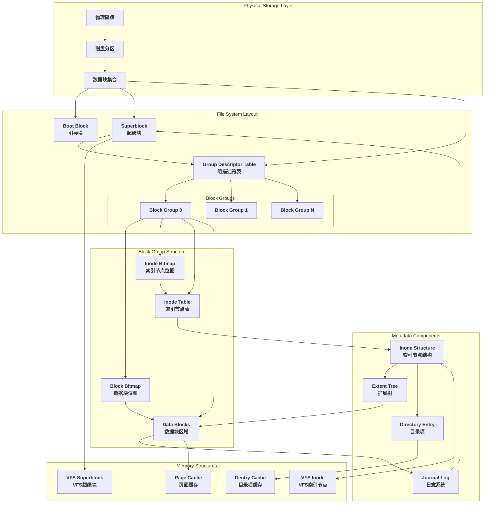
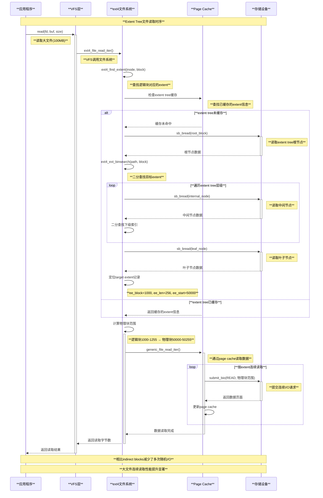
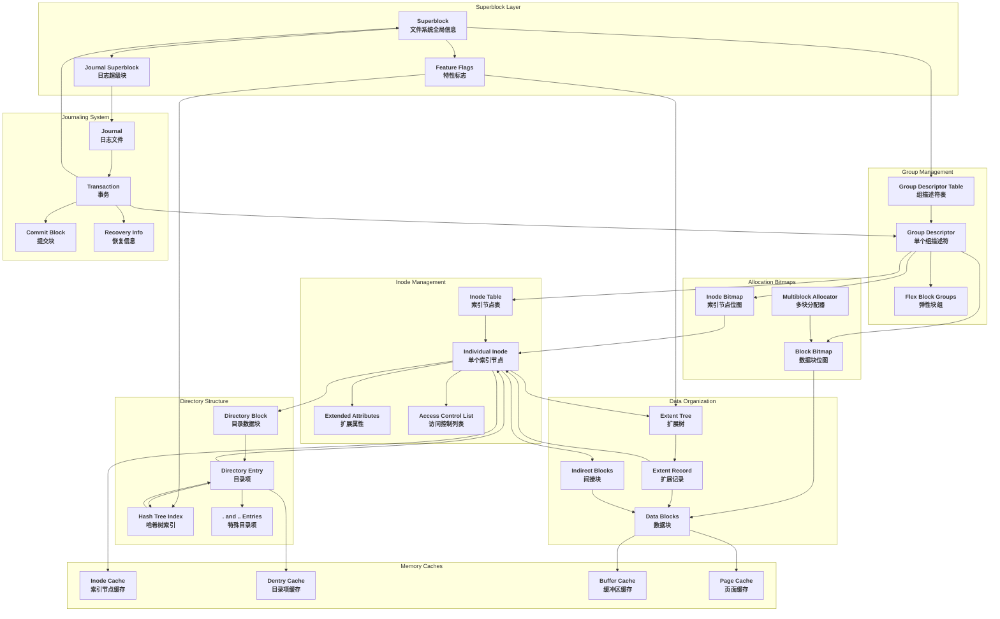
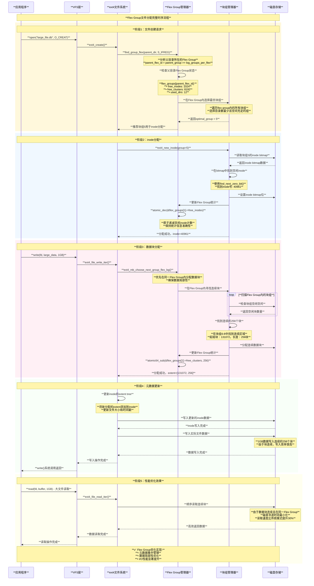
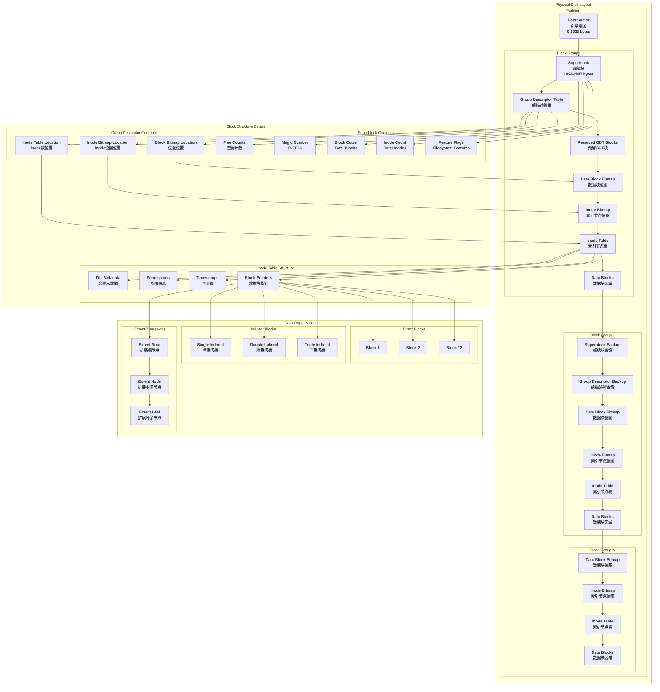
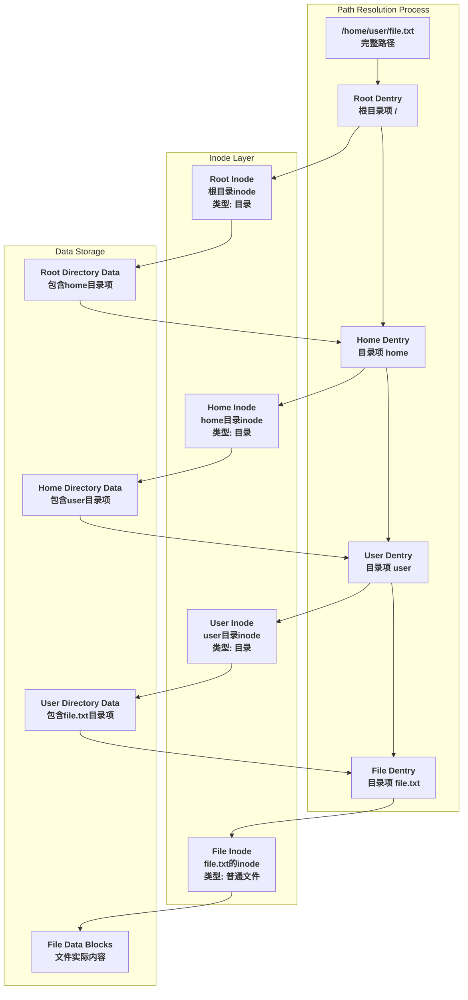
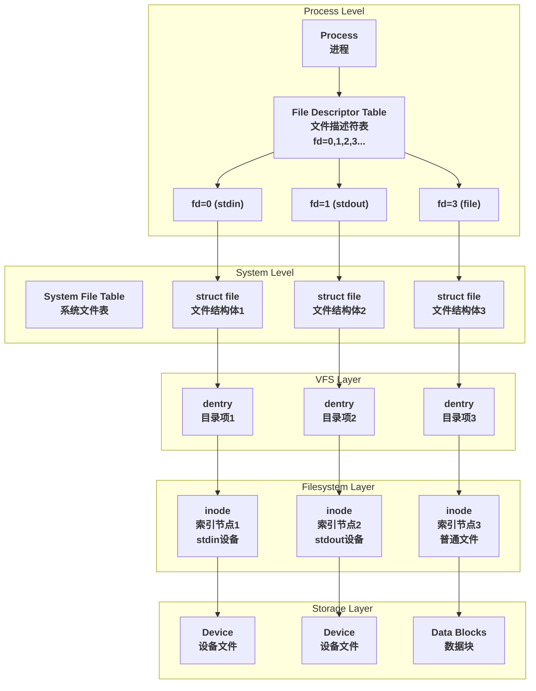
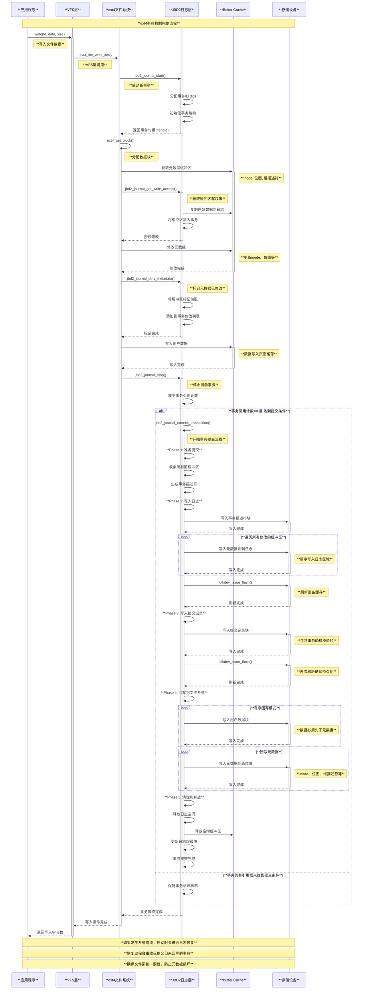

# Linux文件系统元数据详解

## 概述

文件系统元数据（Metadata）是描述和管理文件系统结构、文件属性和数据组织方式的关键信息。基于Linux内核源码分析，文件系统元数据构成了一个复杂而精密的管理体系，确保数据的完整性、一致性和高效访问。

### 核心概念深度解析

文件系统元数据在Linux内核中扮演着**数据管理的控制中枢**角色，它不仅记录文件的基本属性，更重要的是维护整个文件系统的结构完整性和操作一致性。

```text
**文件系统元数据分类架构**

┌─────────────────────────────────────────────────────────────────────────┐
│                    **Linux文件系统元数据分类体系**                        │
│                                                                         │
│ **结构性元数据** (Structural Metadata)                                   │
│ ┌─────────────────────────────────────────────────────────────────────┐ │
│ │ **超级块 (Superblock)**:                                             │ │
│ │ • 文件系统全局参数 (总块数、inode数、块大小)                          │ │
│ │ • 特性标志 (日志、扩展属性、大文件支持)                                │ │
│ │ • 元数据位置信息 (组描述符表、日志位置)                                │ │
│ │                                                                     │ │
│ │ **组描述符表 (Group Descriptor Table)**:                              │ │
│ │ • 各块组的管理信息 (空闲块数、inode数)                                 │ │
│ │ • 位图和inode表位置                                                   │ │
│ │ • 校验和信息                                                          │ │
│ │                                                                     │ │
│ │ **位图结构 (Bitmap Structures)**:                                     │ │
│ │ • Block Bitmap: 数据块分配状态管理                                    │ │
│ │ • Inode Bitmap: inode分配状态管理                                     │ │
│ │ • 快速定位空闲资源，优化分配算法                                       │ │
│ └─────────────────────────────────────────────────────────────────────┘ │
│                                                                         │
│ **文件性元数据** (File Metadata)                                         │
│ ┌─────────────────────────────────────────────────────────────────────┐ │
│ │ **Inode结构 (Index Node)**:                                           │ │
│ │ • 文件基本属性 (权限、所有者、时间戳)                                  │ │
│ │ • 文件大小和数据块指针                                                │ │
│ │ • 扩展属性指针和ACL信息                                                │ │
│ │                                                                     │ │
│ │ **目录项结构 (Directory Entry)**:                                      │ │
│ │ • 文件名到inode的映射关系                                              │ │
│ │ • 目录结构的物理存储格式                                               │ │
│ │ • 哈希索引优化查找性能                                                │ │
│ │                                                                     │ │
│ │ **扩展树结构 (Extent Tree)**:                                          │ │
│ │ • 高效的数据块映射管理                                                │ │
│ │ • 减少元数据开销，支持大文件                                          │ │
│ │ • 连续块分配优化磁盘I/O                                                │ │
│ └─────────────────────────────────────────────────────────────────────┘ │
│                                                                         │
│ **一致性元数据** (Consistency Metadata)                                  │
│ ┌─────────────────────────────────────────────────────────────────────┐ │
│ │ **日志系统 (Journal)**:                                                │ │
│ │ • 事务性操作记录和回滚机制                                            │ │
│ │ • 写序屏障确保操作原子性                                               │ │
│ │ • 崩溃恢复和数据一致性保证                                            │ │
│ │                                                                     │ │
│ │ **校验和系统 (Checksum)**:                                             │ │
│ │ • 元数据完整性验证                                                    │ │
│ │ • 静默数据损坏检测                                                    │ │
│ │ • 自动修复和错误报告                                                  │ │
│ │                                                                     │ │
│ │ **同步机制 (Synchronization)**:                                        │ │
│ │ • 缓存一致性协议                                                      │ │
│ │ • 并发访问控制                                                        │ │
│ │ • 内存与磁盘数据同步                                                  │ │
│ └─────────────────────────────────────────────────────────────────────┘ │
│                                                                         │
│ **性能元数据** (Performance Metadata)                                    │
│ ┌─────────────────────────────────────────────────────────────────────┐ │
│ │ **缓存管理信息**:                                                      │ │
│ │ • Page Cache状态和LRU链表                                             │ │
│ │ • Buffer Cache与磁盘块对应关系                                        │ │
│ │ • Dentry Cache目录项缓存结构                                          │ │
│ │                                                                     │ │
│ │ **预分配信息**:                                                        │ │
│ │ • Multi-block分配器状态                                               │ │
│ │ • 延迟分配标记和临时映射                                               │ │
│ │ • Flex Group弹性组平衡信息                                            │ │
│ └─────────────────────────────────────────────────────────────────────┘ │
└─────────────────────────────────────────────────────────────────────────┘

**关键特性**:
• **原子性**: 通过日志系统确保元数据操作的事务性
• **一致性**: 多层校验机制保证数据完整性  
• **隔离性**: 并发控制避免元数据竞态条件
• **持久性**: 强制同步确保关键元数据持久化
```

### 元数据在内核中的生命周期

```text
**元数据操作生命周期**

┌─────────────────────────────────────────────────────────────────────────┐
│                         **元数据操作流程**                               │
│                                                                         │
│ **1. 加载阶段** (Mount Process)                                          │
│ ┌─────────────────────────────────────────────────────────────────────┐ │
│ │ mount系统调用 → 读取superblock → 验证文件系统 → 加载组描述符 →           │ │
│ │ 初始化日志 → 建立VFS连接 → 激活缓存机制                               │ │
│ └─────────────────────────────────────────────────────────────────────┘ │
│                                  ▼                                     │
│ **2. 访问阶段** (Access Process)                                         │
│ ┌─────────────────────────────────────────────────────────────────────┐ │
│ │ 路径解析 → dentry查找 → inode加载 → 权限检查 → 数据块定位 →              │ │
│ │ 缓存更新 → 访问统计 → 时间戳更新                                       │ │
│ └─────────────────────────────────────────────────────────────────────┘ │
│                                  ▼                                     │
│ **3. 修改阶段** (Modification Process)                                   │
│ ┌─────────────────────────────────────────────────────────────────────┐ │
│ │ 事务开始 → 日志记录 → 内存修改 → 脏页标记 → 延迟写回 →                   │ │
│ │ 一致性检查 → 事务提交 → 同步磁盘                                       │ │
│ └─────────────────────────────────────────────────────────────────────┘ │
│                                  ▼                                     │
│ **4. 同步阶段** (Synchronization Process)                               │
│ ┌─────────────────────────────────────────────────────────────────────┐ │
│ │ 周期性同步 → 强制写回 → 校验和计算 → 元数据更新 → 位图同步 →             │ │
│ │ 状态持久化 → 恢复点设置                                                │ │
│ └─────────────────────────────────────────────────────────────────────┘ │
│                                  ▼                                     │
│ **5. 卸载阶段** (Unmount Process)                                        │
│ ┌─────────────────────────────────────────────────────────────────────┐ │
│ │ 缓存刷新 → 事务完成 → 元数据同步 → 日志清理 → 资源释放 →                │ │
│ │ 超级块更新 → VFS断开 → 内存清理                                        │ │
│ └─────────────────────────────────────────────────────────────────────┘ │
└─────────────────────────────────────────────────────────────────────────┘
```

### 元数据设计原则

基于Linux内核ext4文件系统的实现，文件系统元数据遵循以下核心设计原则：

1. **层次化管理**: 通过超级块→组描述符→位图→inode表的层次结构，实现高效的空间管理
2. **冗余备份**: 关键元数据在多个位置备份，提高系统容错能力  
3. **缓存友好**: 元数据结构设计考虑CPU缓存局部性，提升访问性能
4. **事务支持**: 通过日志系统提供ACID特性，确保文件系统一致性
5. **可扩展性**: 支持在线扩容、动态特性开启等灵活操作

## 文件系统元数据架构图

下图展示了Linux文件系统中各种元数据的完整架构和相互关系：



**架构层次说明：**

1. **物理存储层**：硬件磁盘、分区和物理块
2. **文件系统布局层**：固定的磁盘布局结构
3. **块组结构层**：文件系统的基本管理单元
4. **元数据组件层**：核心的元数据结构
5. **内存结构层**：内核中的缓存和管理结构

## 1. 核心元数据类型

### 1.1 Superblock（超级块）

超级块是文件系统的"身份证"，包含文件系统的全局信息。

#### 1.1.1 ext4_super_block结构

基于内核源码 `fs/ext4/ext4.h`：

```c
struct ext4_super_block {
    __le32  s_inodes_count;         // 文件系统中inode总数
    __le32  s_blocks_count_lo;      // 文件系统中块总数（低32位）
    __le32  s_r_blocks_count_lo;    // 预留块数（低32位）
    __le32  s_free_blocks_count_lo; // 空闲块数（低32位）
    __le32  s_free_inodes_count;    // 空闲inode数
    __le32  s_first_data_block;     // 第一个数据块
    __le32  s_log_block_size;       // 块大小（log2(block_size/1024)）
    __le32  s_log_cluster_size;     // 簇大小（log2(cluster_size/1024)）
    __le32  s_blocks_per_group;     // 每个块组的块数
    __le32  s_clusters_per_group;   // 每个块组的簇数
    __le32  s_inodes_per_group;     // 每个块组的inode数
    __le32  s_mtime;               // 挂载时间
    __le32  s_wtime;               // 写入时间
    __le16  s_mnt_count;           // 挂载计数
    __le16  s_max_mnt_count;       // 最大挂载计数
    __le16  s_magic;               // 魔数（0xEF53 for ext2/3/4）
    __le16  s_state;               // 文件系统状态
    __le16  s_errors;              // 错误处理方式
    __le16  s_minor_rev_level;     // 次版本号
    __le32  s_lastcheck;           // 最后检查时间
    __le32  s_checkinterval;       // 检查间隔
    __le32  s_creator_os;          // 创建操作系统
    __le32  s_rev_level;           // 版本级别
    __le16  s_def_resuid;          // 预留块的默认用户ID
    __le16  s_def_resgid;          // 预留块的默认组ID
    
    // EXT4_DYNAMIC_REV specific fields
    __le32  s_first_ino;           // 第一个非预留inode
    __le16  s_inode_size;          // inode结构大小
    __le16  s_block_group_nr;      // 此超级块所在的块组号
    __le32  s_feature_compat;      // 兼容特性集
    __le32  s_feature_incompat;    // 不兼容特性集
    __le32  s_feature_ro_compat;   // 只读兼容特性集
    __u8    s_uuid[16];            // 128位文件系统标识符
    char    s_volume_name[16];     // 卷名
    char    s_last_mounted[64];    // 最后挂载路径
    __le32  s_algorithm_usage_bitmap; // 压缩算法使用位图
    
    // Performance hints
    __u8    s_prealloc_blocks;     // 预分配块数
    __u8    s_prealloc_dir_blocks; // 目录预分配块数
    __le16  s_reserved_gdt_blocks; // 预留的组描述符表块数
    
    // Journaling support
    __u8    s_journal_uuid[16];    // 日志UUID
    __le32  s_journal_inum;        // 日志文件inode号
    __le32  s_journal_dev;         // 日志设备号
    __le32  s_last_orphan;         // 孤儿inode链表起始
    __le32  s_hash_seed[4];        // 目录哈希种子
    __u8    s_def_hash_version;    // 默认哈希算法版本
    __u8    s_jnl_backup_type;     // 日志备份类型
    __le16  s_desc_size;           // 组描述符大小
    
    // 更多字段...
};
```

#### 1.1.2 超级块的作用

1. **文件系统识别**：通过魔数识别文件系统类型
2. **全局配置**：记录块大小、inode数量等基本参数
3. **状态管理**：跟踪文件系统的挂载状态和健康状况
4. **特性控制**：定义支持的特性和兼容性级别

#### 1.1.3 超级块存储位置

```c
// 超级块在不同块组中的备份机制
// 源码：fs/ext4/super.c

#define EXT4_SB_OFFSET          1024    // 超级块在分区中的偏移量
#define EXT4_MIN_BLOCK_SIZE     1024    // 最小块大小
#define EXT4_MAX_BLOCK_SIZE     65536   // 最大块大小

// 超级块备份策略
static int ext4_bg_has_super(struct super_block *sb, ext4_group_t group)
{
    struct ext4_sb_info *sbi = EXT4_SB(sb);
    
    if (group == 0)
        return 1;  // 块组0总是有超级块
    
    if (ext4_has_feature_sparse_super(sb)) {
        // 稀疏超级块：只在特定组中备份
        if (group <= 1)
            return 1;
        if (!(group & 1))
            return 0;
        if (test_root(group, 3) || test_root(group, 5) ||
            test_root(group, 7))
            return 1;
    }
    
    return 0;
}
```

### 1.2 Inode（索引节点）

Inode是文件系统中最重要的元数据，存储文件的属性和数据块位置信息。

#### 1.2.1 ext4_inode结构

```c
// 源码：fs/ext4/ext4.h
struct ext4_inode {
    __le16  i_mode;        // 文件模式和权限
    __le16  i_uid;         // 用户ID（低16位）
    __le32  i_size_lo;     // 文件大小（低32位）
    __le32  i_atime;       // 访问时间
    __le32  i_ctime;       // 创建时间
    __le32  i_mtime;       // 修改时间
    __le32  i_dtime;       // 删除时间
    __le16  i_gid;         // 组ID（低16位）
    __le16  i_links_count; // 硬链接计数
    __le32  i_blocks_lo;   // 文件使用的512字节块数（低32位）
    __le32  i_flags;       // 文件标志
    
    union {
        struct {
            __le32  l_i_version;
        } linux1;
        struct {
            __u32  h_i_translator;
        } hurd1;
        struct {
            __u32  m_i_reserved1;
        } masix1;
    } osd1;                // OS相关字段1
    
    __le32  i_block[EXT4_N_BLOCKS];  // 数据块指针数组
    __le32  i_generation;            // 文件版本号
    __le32  i_file_acl_lo;          // 文件ACL（低32位）
    __le32  i_size_high;            // 文件大小（高32位）
    __le32  i_obso_faddr;           // 废弃字段
    
    union {
        struct {
            __le16  l_i_blocks_high;    // 高16位块计数
            __le16  l_i_file_acl_high;  // 文件ACL（高16位）
            __le16  l_i_uid_high;       // 用户ID（高16位）
            __le16  l_i_gid_high;       // 组ID（高16位）
            __le16  l_i_checksum_lo;    // 校验和（低16位）
            __le16  l_i_reserved;       // 预留字段
        } linux2;
        // 其他OS的字段定义...
    } osd2;                // OS相关字段2
    
    __le16  i_extra_isize;          // 扩展inode大小
    __le16  i_checksum_hi;          // 校验和（高16位）
    __le32  i_ctime_extra;          // 创建时间（纳秒）
    __le32  i_mtime_extra;          // 修改时间（纳秒）
    __le32  i_atime_extra;          // 访问时间（纳秒）
    __le32  i_crtime;               // 文件创建时间
    __le32  i_crtime_extra;         // 创建时间（纳秒）
    __le32  i_version_hi;           // 高32位版本号
    __le32  i_projid;               // 项目ID
};
```

#### 1.2.2 Inode数据块映射机制

```c
// ext4的数据块映射：间接块和扩展树
#define EXT4_NDIR_BLOCKS        12    // 直接块数量
#define EXT4_IND_BLOCK          EXT4_NDIR_BLOCKS           // 间接块索引
#define EXT4_DIND_BLOCK         (EXT4_IND_BLOCK + 1)       // 双重间接块
#define EXT4_TIND_BLOCK         (EXT4_DIND_BLOCK + 1)      // 三重间接块
#define EXT4_N_BLOCKS           (EXT4_TIND_BLOCK + 1)      // 总块指针数

// 传统间接块方式（ext2/3）
struct ext4_inode_info {
    __le32  i_data[15];    // 数据块指针
    /*
     * i_data[0-11]: 直接指向数据块
     * i_data[12]:   指向间接块（包含数据块指针）
     * i_data[13]:   指向双重间接块
     * i_data[14]:   指向三重间接块
     */
};

// ext4扩展树方式
struct ext4_extent_header {
    __le16  eh_magic;       // 魔数（0xf30a）
    __le16  eh_entries;     // 有效条目数
    __le16  eh_max;         // 最大条目数
    __le16  eh_depth;       // 树的深度
    __le32  eh_generation;  // 生成号
};

struct ext4_extent {
    __le32  ee_block;       // 逻辑块号
    __le16  ee_len;         // 扩展长度
    __le16  ee_start_hi;    // 物理块号（高16位）
    __le32  ee_start_lo;    // 物理块号（低32位）
};

struct ext4_extent_idx {
    __le32  ei_block;       // 逻辑块号
    __le32  ei_leaf_lo;     // 指向下一级的物理块号（低32位）
    __le16  ei_leaf_hi;     // 指向下一级的物理块号（高16位）
    __u16   ei_unused;      // 未使用
};
```

#### 1.2.3 Extent Tree、Extent Record和Indirect Blocks深度分析

ext4文件系统提供了两种数据块寻址方式：传统的间接块（Indirect Blocks）和现代的扩展树（Extent Tree）。这两种方式各有优势，解决了不同场景下的性能和存储需求。

##### 1.2.3.1 Extent Tree架构原理

Extent Tree是ext4引入的高效数据块管理机制，特别适合大文件和连续存储场景。

```text
**Extent Tree架构设计**

                    **Extent Tree层次结构**
┌─────────────────────────────────────────────────────────────────────────┐
│                              **Root节点**                               │
│                          (在inode.i_block中)                           │
│ ┌─────────────────────────────────────────────────────────────────────┐ │
│ │ **ext4_extent_header** (根头部)                                      │ │
│ │ • eh_magic = 0xf30a                                                 │ │
│ │ • eh_entries = 3 (当前条目数)                                        │ │
│ │ • eh_max = 4 (最大条目数)                                            │ │
│ │ • eh_depth = 1 (深度：1=有中间节点，0=叶子节点)                       │ │
│ │                                                                     │ │
│ │ **ext4_extent_idx[0]** (索引条目0)                                    │ │
│ │ • ei_block = 0 (逻辑块范围起始)                                       │ │
│ │ • ei_leaf = block_1000 (指向子节点)                                  │ │
│ │                                                                     │ │
│ │ **ext4_extent_idx[1]** (索引条目1)                                    │ │
│ │ • ei_block = 1024 (逻辑块范围起始)                                    │ │
│ │ • ei_leaf = block_2000 (指向子节点)                                  │ │
│ └─────────────────────────────────────────────────────────────────────┘ │
└─────────────────────────────────────────────┬───────────────────────────┘
                                              ▼
        **中间节点层** (Internal Node Layer)
┌─────────────────────────┐                           ┌─────────────────────────┐
│ **block_1000**          │                           │ **block_2000**          │
│ (中间节点)               │                           │ (中间节点)               │
│ ┌─────────────────────┐ │                           │ ┌─────────────────────┐ │
│ │ **extent_header**   │ │                           │ │ **extent_header**   │ │
│ │ • eh_depth = 0      │ │                           │ │ • eh_depth = 0      │ │
│ │ • eh_entries = 2    │ │                           │ │ • eh_entries = 1    │ │
│ │                     │ │                           │ │                     │ │
│ │ **extent[0]**       │ │                           │ │ **extent[0]**       │ │
│ │ • ee_block = 0      │ │                           │ │ • ee_block = 1024   │ │
│ │ • ee_len = 128      │ │                           │ │ • ee_len = 256      │ │
│ │ • ee_start = 5000   │ │                           │ │ • ee_start = 6000   │ │
│ │                     │ │                           │ │                     │ │
│ │ **extent[1]**       │ │                           │ └─────────────────────┘ │
│ │ • ee_block = 128    │ │                           └─────────────────────────┘
│ │ • ee_len = 64       │ │                                         ▼
│ │ • ee_start = 5200   │ │                          **叶子节点** (Leaf Node)
│ └─────────────────────┘ │                          ┌─────────────────────────┐
└─────────────────────────┘                          │ **物理数据块映射**      │
                  ▼                                  │ • 逻辑块1024-1279      │
        **叶子节点** (Leaf Node)                      │   ↓                    │
        ┌─────────────────────────┐                  │ • 物理块6000-6255      │
        │ **物理数据块映射**      │                  │   (连续256个块)        │
        │ • 逻辑块0-127          │                  └─────────────────────────┘
        │   ↓                    │
        │ • 物理块5000-5127      │
        │   (连续128个块)        │
        │                        │
        │ • 逻辑块128-191        │
        │   ↓                    │
        │ • 物理块5200-5263      │
        │   (连续64个块)         │
        └─────────────────────────┘
```

##### 1.2.3.2 Extent Record核心结构分析

```c
// Extent Record详细分析 - fs/ext4/extents.h
struct ext4_extent {
    __le32  ee_block;       // 逻辑文件块号（起始）
    __le16  ee_len;         // extent长度（以块为单位，最大32767）
    __le16  ee_start_hi;    // 物理块号高16位（支持48位物理地址）
    __le32  ee_start_lo;    // 物理块号低32位
};

// Extent操作核心算法 - fs/ext4/extents.c
struct ext4_ext_path {
    ext4_fsblk_t            p_block;    // 当前节点的物理块号
    __u16                   p_depth;    // 当前路径深度
    struct ext4_extent     *p_ext;      // 指向extent记录
    struct ext4_extent_idx *p_idx;      // 指向索引记录
    struct ext4_extent_header *p_hdr;   // 指向头部信息
    struct buffer_head     *p_bh;       // 缓冲区头部
};

// extent插入核心算法
int ext4_ext_insert_extent(handle_t *handle, struct inode *inode,
                          struct ext4_ext_path **ppath,
                          struct ext4_extent *newext, int gb_flags)
{
    struct ext4_ext_path *path = *ppath;
    struct ext4_extent_header *eh;
    struct ext4_extent *ex, *fex;
    struct ext4_extent *nearex; /* nearest extent */
    struct ext4_ext_path *npath = NULL;
    int depth, len, err;
    ext4_lblk_t next;
    int mb_flags = 0, unwritten;

    // 确定插入深度
    depth = ext_depth(inode);
    ex = path[depth].p_ext;
    eh = path[depth].p_hdr;

    // 检查是否可以合并相邻extent
    if (ex && ext4_can_extents_be_merged(inode, ex, newext)) {
        // 向后合并
        ext_debug("append [%d:%d] to %u:[%d:%d] (from %llu)\n",
                le32_to_cpu(newext->ee_block),
                ext4_ext_get_actual_len(newext),
                le32_to_cpu(ex->ee_block),
                ext4_ext_get_actual_len(ex),
                ext4_ext_pblock(ex));

        err = ext4_ext_get_access(handle, inode, path + depth);
        if (err)
            return err;

        unwritten = ext4_ext_is_unwritten(ex);
        ex->ee_len = cpu_to_le16(ext4_ext_get_actual_len(ex)
                        + ext4_ext_get_actual_len(newext));
        if (unwritten)
            ext4_ext_mark_unwritten(ex);

        nearex = ex;
        goto merge;
    }

    // 查找插入位置
    nearex = ex;
    if (!nearex) {
        /* 空树，创建第一个extent */
        nearex = EXT_FIRST_EXTENT(eh);
    } else {
        if (le32_to_cpu(newext->ee_block)
               > le32_to_cpu(nearex->ee_block)) {
            /* 插入到右侧 */
            BUG_ON(newext->ee_block == nearex->ee_block);
            len = EXT_LAST_EXTENT(eh) - nearex;
            len = (len - 1) * sizeof(struct ext4_extent);
            len = len < 0 ? 0 : len;
            ext_debug("insert %u:[%d:%d] after: %u:[%d:%d]\n",
                    le32_to_cpu(newext->ee_block),
                    ext4_ext_get_actual_len(newext),
                    ext4_ext_pblock(newext),
                    le32_to_cpu(nearex->ee_block),
                    ext4_ext_get_actual_len(nearex),
                    ext4_ext_pblock(nearex));
            nearex++;
        } else {
            /* 插入到左侧 */
            BUG_ON(newext->ee_block == nearex->ee_block);
            len = nearex - EXT_FIRST_EXTENT(eh);
            len *= sizeof(struct ext4_extent);
            ext_debug("insert %u:[%d:%d] before: %u:[%d:%d]\n",
                    le32_to_cpu(newext->ee_block),
                    ext4_ext_get_actual_len(newext),
                    ext4_ext_pblock(newext),
                    le32_to_cpu(nearex->ee_block),
                    ext4_ext_get_actual_len(nearex),
                    ext4_ext_pblock(nearex));
        }
    }

    // 检查是否需要分裂节点
    if (le16_to_cpu(eh->eh_entries) >= le16_to_cpu(eh->eh_max)) {
        /* 节点满了，需要分裂 */
        ext_debug("trying to add extent at depth %d\n", depth);
        npath = ext4_ext_split(handle, inode, mb_flags, path, newext);
        if (IS_ERR(npath))
            return PTR_ERR(npath);

        /* 重新计算路径 */
        path = ext4_find_extent(inode, le32_to_cpu(newext->ee_block), &npath, gb_flags);
        if (IS_ERR(path)) {
            err = PTR_ERR(path);
            goto out;
        }

        /* 递归处理新路径 */
        goto repeat;
    }

    // 执行插入操作
    err = ext4_ext_get_access(handle, inode, path + depth);
    if (err)
        goto cleanup;

    if (!nearex) {
        /* 插入第一个extent */
        BUG_ON(EXT_FIRST_EXTENT(eh) != EXT_LAST_EXTENT(eh));
        nearex = EXT_FIRST_EXTENT(eh);
    } else {
        if (nearex != EXT_LAST_EXTENT(eh)) {
            len = EXT_LAST_EXTENT(eh) - nearex + 1;
            len *= sizeof(struct ext4_extent);
            memmove(nearex + 1, nearex, len);
        }
    }

    // 设置新extent
    nearex->ee_block = newext->ee_block;
    nearex->ee_len   = newext->ee_len;
    ext4_ext_store_pblock(nearex, ext4_ext_pblock(newext));
    le16_add_cpu(&eh->eh_entries, 1);

merge:
    /* 尝试与后续extent合并 */
    if (nearex < EXT_LAST_EXTENT(eh)) {
        len = EXT_LAST_EXTENT(eh) - nearex;
        if (len > 0 && ext4_can_extents_be_merged(inode, nearex,
                                                 nearex + 1)) {
            /* 合并相邻extents */
            ext_debug("merging extents\n");
            nearex->ee_len = cpu_to_le16(ext4_ext_get_actual_len(nearex)
                              + ext4_ext_get_actual_len(nearex + 1));

            if (nearex + 1 < EXT_LAST_EXTENT(eh)) {
                len = (EXT_LAST_EXTENT(eh) - nearex - 1)
                        * sizeof(struct ext4_extent);
                memmove(nearex + 1, nearex + 2, len);
            }
            le16_add_cpu(&eh->eh_entries, -1);
            BUG_ON(eh->eh_entries == 0);
        }
    }

cleanup:
    if (npath) {
        ext4_ext_drop_refs(npath);
        kfree(npath);
    }
out:
    return err;
}

// extent查找算法
struct ext4_ext_path *
ext4_find_extent(struct inode *inode, ext4_lblk_t block,
                struct ext4_ext_path **orig_path, int flags)
{
    struct ext4_extent_header *eh;
    struct ext4_extent_idx *ix;
    struct ext4_ext_path *path = orig_path ? *orig_path : NULL;
    short int depth, i, ppos = 0;
    int ret;

    eh = ext_inode_hdr(inode);
    depth = ext_depth(inode);
    if (depth < 0 || depth > EXT4_MAX_EXTENT_DEPTH) {
        EXT4_ERROR_INODE(inode, "inode has invalid extent depth: %d", depth);
        ret = -EFSCORRUPTED;
        goto err;
    }

    if (path) {
        ext4_ext_drop_refs(path);
        if (depth > path[0].p_maxdepth) {
            kfree(path);
            *orig_path = path = NULL;
        }
    }
    if (!path) {
        /* account possible extent tree levels */
        path = kcalloc(depth + 2, sizeof(struct ext4_ext_path),
                      GFP_NOFS);
        if (unlikely(!path))
            return ERR_PTR(-ENOMEM);
        path[0].p_maxdepth = depth + 1;
    }

    path[0].p_hdr = eh;
    path[0].p_bh = NULL;

    i = depth;
    while (i) {
        eh = path[ppos].p_hdr;

        if (unlikely(le16_to_cpu(eh->eh_entries) >
                    le16_to_cpu(eh->eh_max))) {
            ret = -EFSCORRUPTED;
            goto err;
        }

        if (unlikely(le16_to_cpu(eh->eh_magic) !=
                    EXT4_EXT_MAGIC)) {
            ret = -EFSCORRUPTED;
            goto err;
        }

        /* 二分查找索引 */
        ix = EXT_FIRST_INDEX(eh);
        while (ix <= EXT_LAST_INDEX(eh)) {
            if (block >= le32_to_cpu(ix->ei_block) &&
                block < le32_to_cpu((ix + 1)->ei_block))
                break;
            ix++;
        }

        if (unlikely(ix > EXT_LAST_INDEX(eh))) {
            ret = -EFSCORRUPTED;
            goto err;
        }

        path[ppos].p_idx = ix;
        path[ppos].p_block = ext4_idx_pblock(ix);
        path[ppos + 1].p_depth = i - 1;

        /* 读取子节点 */
        path[ppos + 1].p_bh = sb_bread(inode->i_sb, path[ppos].p_block);
        if (path[ppos + 1].p_bh == NULL) {
            ret = -EIO;
            goto err;
        }

        eh = ext_block_hdr(path[ppos + 1].p_bh);
        ppos++;
        path[ppos].p_hdr = eh;
        i--;
    }

    path[ppos].p_depth = i;
    path[ppos].p_ext = NULL;
    path[ppos].p_idx = NULL;

    /* 在叶子节点中查找extent */
    ext4_ext_binsearch(inode, path + ppos, block);
    /* if not an empty leaf */
    if (path[ppos].p_ext)
        path[ppos].p_block = ext4_ext_pblock(path[ppos].p_ext);

    ext4_ext_show_path(inode, path);

    if (orig_path)
        *orig_path = path;
    return path;

err:
    ext4_ext_drop_refs(path);
    kfree(path);
    if (orig_path)
        *orig_path = NULL;
    return ERR_PTR(ret);
}
```

##### 1.2.3.3 传统Indirect Blocks机制分析

传统间接块系统是ext2/ext3的核心机制，通过多层索引实现大文件支持。

```text
**传统Indirect Blocks架构**

┌─────────────────────────────────────────────────────────────────────────┐
│                        **Inode数据块指针布局**                          │
│                          (inode.i_data[15])                           │
│                                                                         │
│ **直接块指针** (Direct Block Pointers)                                   │
│ ┌─────┬─────┬─────┬─────┬─────┬─────┬─────┬─────┬─────┬─────┬─────┬─────┐ │
│ │ [0] │ [1] │ [2] │ [3] │ [4] │ [5] │ [6] │ [7] │ [8] │ [9] │[10] │[11] │ │
│ └─────┴─────┴─────┴─────┴─────┴─────┴─────┴─────┴─────┴─────┴─────┴─────┘ │
│   │     │     │     │     │     │     │     │     │     │     │     │   │
│   ▼     ▼     ▼     ▼     ▼     ▼     ▼     ▼     ▼     ▼     ▼     ▼   │
│ Data  Data  Data  Data  Data  Data  Data  Data  Data  Data  Data  Data  │
│Block Block Block Block Block Block Block Block Block Block Block Block │
│                              ...                                       │
│                                                                         │
│ **间接块指针** (Indirect Block Pointers)                                 │
│ ┌─────┬─────┬─────┐                                                     │
│ │[12] │[13] │[14] │                                                     │
│ └─────┴─────┴─────┘                                                     │
│   │     │     │                                                         │
│   │     │     └──**三重间接块** (Triple Indirect)                        │
│   │     │        ┌─────────────────────────────────────────────────────┐ │
│   │     │        │              **第三级索引块**                        │ │
│   │     │        │ ┌─────┬─────┬─────┬─────┬─────┬─────┬─────┬─────┐   │ │
│   │     │        │ │ptr0 │ptr1 │ptr2 │ptr3 │ptr4 │ptr5 │ptr6 │ptr7 │   │ │
│   │     │        │ └─────┴─────┴─────┴─────┴─────┴─────┴─────┴─────┘   │ │
│   │     │        │   │     │     │                           │     │   │ │
│   │     │        │   ▼     ▼     ▼                           ▼     ▼   │ │
│   │     │        │ **第二级索引块** → **第二级索引块** → **第二级索引块** │ │
│   │     │        └─────────────────────────────────────────────────────┘ │
│   │     │                                                                │
│   │     └──**双重间接块** (Double Indirect)                               │
│   │        ┌─────────────────────────────────────────────────────────────┐ │
│   │        │                  **第二级索引块**                            │ │
│   │        │ ┌─────┬─────┬─────┬─────┬─────┬─────┬─────┬─────┬─────────┐ │ │
│   │        │ │ptr0 │ptr1 │ptr2 │ptr3 │ptr4 │ptr5 │ptr6 │ptr7 │  ...    │ │ │
│   │        │ └─────┴─────┴─────┴─────┴─────┴─────┴─────┴─────┴─────────┘ │ │
│   │        │   │     │     │     │     │     │     │     │               │ │
│   │        │   ▼     ▼     ▼     ▼     ▼     ▼     ▼     ▼               │ │
│   │        │ Data  Data  Data  Data  Data  Data  Data  Data             │ │
│   │        │Block Block Block Block Block Block Block Block             │ │
│   │        └─────────────────────────────────────────────────────────────┘ │
│   │                                                                        │
│   └──**单重间接块** (Single Indirect)                                      │
│      ┌───────────────────────────────────────────────────────────────────┐ │
│      │                        **第一级索引块**                           │ │
│      │ ┌─────┬─────┬─────┬─────┬─────┬─────┬─────┬─────┬─────┬─────────┐ │ │
│      │ │ptr0 │ptr1 │ptr2 │ptr3 │ptr4 │ptr5 │ptr6 │ptr7 │ptr8 │  ...    │ │ │
│      │ └─────┴─────┴─────┴─────┴─────┴─────┴─────┴─────┴─────┴─────────┘ │ │
│      │   │     │     │     │     │     │     │     │     │               │ │
│      │   ▼     ▼     ▼     ▼     ▼     ▼     ▼     ▼     ▼               │ │
│      │ Data  Data  Data  Data  Data  Data  Data  Data  Data             │ │
│      │Block Block Block Block Block Block Block Block Block             │ │
│      └───────────────────────────────────────────────────────────────────┘ │
└─────────────────────────────────────────────────────────────────────────┘
```

##### 1.2.3.4 直接块和间接块寻址模式详解

传统的indirect blocks模式采用了层次化的块地址映射方式，通过直接块和多级间接块实现从小文件到大文件的完整支持。

###### 1.2.3.4.1 直接块(Direct Blocks)机制详解

直接块是最基本的寻址模式，inode中的前12个指针直接指向数据块。

```text
**直接块寻址机制**

                        **Inode结构 (Direct Block Section)**
┌─────────────────────────────────────────────────────────────────────────┐
│                           **ext4_inode**                               │
│                     (inode.i_block[0-11])                              │
│                                                                         │
│ **直接块指针数组** (Direct Block Pointers)                               │
│ ┌─────┬─────┬─────┬─────┬─────┬─────┬─────┬─────┬─────┬─────┬─────┬─────┐ │
│ │ [0] │ [1] │ [2] │ [3] │ [4] │ [5] │ [6] │ [7] │ [8] │ [9] │[10] │[11] │ │
│ │4000 │4001 │4002 │4003 │4004 │4005 │4006 │4007 │4008 │4009 │4010 │4011 │ │
│ └─────┴─────┴─────┴─────┴─────┴─────┴─────┴─────┴─────┴─────┴─────┴─────┘ │
│   │     │     │     │     │     │     │     │     │     │     │     │   │
│   ▼     ▼     ▼     ▼     ▼     ▼     ▼     ▼     ▼     ▼     ▼     ▼   │
│ ┌───┐ ┌───┐ ┌───┐ ┌───┐ ┌───┐ ┌───┐ ┌───┐ ┌───┐ ┌───┐ ┌───┐ ┌───┐ ┌───┐ │
│ │4K │ │4K │ │4K │ │4K │ │4K │ │4K │ │4K │ │4K │ │4K │ │4K │ │4K │ │4K │ │
│ │块 │ │块 │ │块 │ │块 │ │块 │ │块 │ │块 │ │块 │ │块 │ │块 │ │块 │ │块 │ │
│ │0  │ │1  │ │2  │ │3  │ │4  │ │5  │ │6  │ │7  │ │8  │ │9  │ │10 │ │11 │ │
│ └───┘ └───┘ └───┘ └───┘ └───┘ └───┘ └───┘ └───┘ └───┘ └───┘ └───┘ └───┘ │
└─────────────────────────────────────────────────────────────────────────┘

**直接块特性分析**:
• 寻址范围: 0-11 (12个块，48KB @ 4K block size)
• 访问时间: O(1) - 一次I/O直接获取数据
• 适用场景: 小文件(0-48KB)，配置文件，脚本文件
• 内存开销: 最小，无额外索引结构
• 碎片影响: 轻微，仅影响12个块的布局
```

###### 1.2.3.4.2 单重间接块(Single Indirect Block)机制详解

当文件大小超过48KB时，启用单重间接块寻址，通过一级索引支持更大的文件。

```text
**单重间接块寻址机制**

                    **Single Indirect Block Architecture**
┌─────────────────────────────────────────────────────────────────────────┐
│                       **inode.i_data[12]**                             │
│                     (单重间接块指针)                                     │
│                           │                                             │
│                           ▼                                             │
│   ┌─────────────────────────────────────────────────────────────────┐   │
│   │                  **间接块 (4KB)**                               │   │
│   │              (包含1024个32位指针)                                │   │
│   │                                                                 │   │
│   │ ┌─────┬─────┬─────┬─────┬─────┬─────┬─────┬─────┬─────┬─────┐   │   │
│   │ │ptr0 │ptr1 │ptr2 │ptr3 │ptr4 │ptr5 │ptr6 │ptr7 │ ... │1023 │   │   │
│   │ │5000 │5001 │5002 │5003 │5004 │5005 │5006 │5007 │ ... │6023 │   │   │
│   │ └─────┴─────┴─────┴─────┴─────┴─────┴─────┴─────┴─────┴─────┘   │   │
│   │   │     │     │     │     │     │     │     │           │     │   │   │
│   │   ▼     ▼     ▼     ▼     ▼     ▼     ▼     ▼           ▼     │   │   │
│   │ ┌───┐ ┌───┐ ┌───┐ ┌───┐ ┌───┐ ┌───┐ ┌───┐ ┌───┐       ┌───┐ │   │   │
│   │ │4K │ │4K │ │4K │ │4K │ │4K │ │4K │ │4K │ │4K │  ...  │4K │ │   │   │
│   │ │块 │ │块 │ │块 │ │块 │ │块 │ │块 │ │块 │ │块 │       │块 │ │   │   │
│   │ │12 │ │13 │ │14 │ │15 │ │16 │ │17 │ │18 │ │19 │       │1035│ │   │   │
│   │ └───┘ └───┘ └───┘ └───┘ └───┘ └───┘ └───┘ └───┘       └───┘ │   │   │
│   └─────────────────────────────────────────────────────────────────┘   │
│                                                                         │
│ **单重间接块特性分析**:                                                  │
│ • 寻址范围: 12-1035 (1024个块，4MB @ 4K block size)                     │
│ • 访问时间: O(2) - 读取间接块 + 读取数据块                               │
│ • 适用场景: 中型文件(48KB-4MB)，文档文件，程序二进制                     │
│ • 内存开销: 中等，需要缓存间接块(4KB)                                   │
│ • 碎片影响: 中等，间接块位置影响整体性能                                 │
└─────────────────────────────────────────────────────────────────────────┘
```

###### 1.2.3.4.3 双重间接块和三重间接块机制

双重和三重间接块通过多级索引结构支持GB和TB级别的大文件。详细的实现原理和代码分析可参考前面的传统Indirect Blocks机制分析部分。

###### 1.2.3.4.4 应用场景对比分析

```text
**文件大小与寻址模式对应关系**

┌─────────────────────────────────────────────────────────────────────────┐
│                      **寻址模式适用场景分析**                            │
├─────────────────┬─────────────────┬─────────────────┬─────────────────────┤
│   **寻址模式**  │  **文件大小范围**│  **典型应用**   │   **性能特征**      │
├─────────────────┼─────────────────┼─────────────────┼─────────────────────┤
│ **直接块**      │ 0 - 48KB        │ • 配置文件      │ • I/O延迟: 最低     │
│ (Direct Blocks) │ (0-11 blocks)   │ • Shell脚本     │ • 内存开销: 最小    │
│                 │                 │ • 小程序源码    │ • 寻址时间: O(1)    │
│                 │                 │ • README文件    │ • 最适合小文件      │
├─────────────────┼─────────────────┼─────────────────┼─────────────────────┤
│ **单重间接块**  │ 48KB - 4MB      │ • 中型文档      │ • I/O延迟: 低       │
│ (Single         │ (12-1035 blocks)│ • 程序二进制    │ • 内存开销: 中等    │
│  Indirect)      │                 │ • 音频文件      │ • 寻址时间: O(2)    │
│                 │                 │ • 图片文件      │ • 适合中型文件      │
├─────────────────┼─────────────────┼─────────────────┼─────────────────────┤
│ **双重间接块**  │ 4MB - 4GB       │ • 大型程序      │ • I/O延迟: 中等     │
│ (Double         │ (1036-1049611   │ • 数据库文件    │ • 内存开销: 较高    │
│  Indirect)      │  blocks)        │ • 高清视频      │ • 寻址时间: O(3)    │
│                 │                 │ • 虚拟机镜像    │ • 适合大型文件      │
├─────────────────┼─────────────────┼─────────────────┼─────────────────────┤
│ **三重间接块**  │ 4GB - 2TB       │ • 超大数据库    │ • I/O延迟: 较高     │
│ (Triple         │ (1049612-       │ • 大型虚拟机    │ • 内存开销: 很高    │
│  Indirect)      │  536870911      │ • 海量日志      │ • 寻址时间: O(4)    │
│                 │  blocks)        │ • 科学数据      │ • 适合超大文件      │
└─────────────────┴─────────────────┴─────────────────┴─────────────────────┘
```

##### 1.2.3.5 Extent Tree vs Indirect Blocks性能对比分析

```c
// 间接块读取算法 - fs/ext4/indirect.c
static Indirect *ext4_get_branch(struct inode *inode, int depth,
                                 ext4_lblk_t *offsets,
                                 Indirect chain[4], int *err)
{
    struct super_block *sb = inode->i_sb;
    Indirect *p = chain;
    struct buffer_head *bh;

    *err = 0;
    /* 从inode开始遍历路径 */
    add_chain(chain, NULL, EXT4_I(inode)->i_data + *offsets);
    if (!p->key)
        goto no_block;
    while (--depth) {
        bh = sb_bread(sb, le32_to_cpu(p->key));
        if (!bh)
            goto failure;
        add_chain(++p, bh, (__le32 *)bh->b_data + *++offsets);
        /* 检查块指针有效性 */
        if (!p->key)
            goto no_block;
    }
    return NULL;

failure:
    *err = -EIO;
no_block:
    return p;
}

// extent查找优化算法 - fs/ext4/extents.c
static void
ext4_ext_binsearch(struct inode *inode, struct ext4_ext_path *path,
                  ext4_lblk_t block)
{
    struct ext4_extent_header *eh = path->p_hdr;
    struct ext4_extent *r, *l, *m;

    if (eh->eh_entries == 0) {
        /*
         * 空树 - 第一个节点将是根。
         */
        return;
    }

    ext_debug("binsearch for %u: ", block);

    l = EXT_FIRST_EXTENT(eh) + 1;
    r = EXT_LAST_EXTENT(eh);

    while (l <= r) {
        m = l + (r - l) / 2;
        if (block < le32_to_cpu(m->ee_block))
            r = m - 1;
        else
            l = m + 1;
        ext_debug("%p(%u):%p(%u):%p(%u) ", l, le32_to_cpu(l->ee_block),
                m, le32_to_cpu(m->ee_block),
                r, le32_to_cpu(r->ee_block));
    }

    path->p_ext = l - 1;
    ext_debug("  -> %d:%llu:[%d]%d ",
            le32_to_cpu(path->p_ext->ee_block),
            ext4_ext_pblock(path->p_ext),
            ext4_ext_is_unwritten(path->p_ext),
            ext4_ext_get_actual_len(path->p_ext));

#ifdef CHECK_BINSEARCH
    {
        struct ext4_extent *chex, *ex;
        int k;

        chex = ex = EXT_FIRST_EXTENT(eh);
        for (k = 0; k < le16_to_cpu(eh->eh_entries); k++, ex++) {
            BUG_ON(k && le32_to_cpu(ex->ee_block)
                          <= le32_to_cpu(ex[-1].ee_block));
            if (block < le32_to_cpu(ex->ee_block))
                break;
            chex = ex;
        }
        BUG_ON(chex != path->p_ext);
    }
#endif

}
```

```text
**性能对比分析表**

┌─────────────────────────────────────────────────────────────────────────┐
│                       **Extent Tree vs Indirect Blocks**               │
├─────────────────┬─────────────────────┬─────────────────────────────────┤
│     **特性**    │   **Extent Tree**   │      **Indirect Blocks**       │
├─────────────────┼─────────────────────┼─────────────────────────────────┤
│ **存储效率**    │ **高效** - 一个extent│ **低效** - 每块需一个指针      │
│                 │ 可表示大范围连续块   │ 大文件需多层间接块索引          │
├─────────────────┼─────────────────────┼─────────────────────────────────┤
│ **查找性能**    │ **O(log n)** 二分查找│ **O(depth)** 层次遍历           │
│                 │ 对大文件优化更好     │ 小文件简单快速                  │
├─────────────────┼─────────────────────┼─────────────────────────────────┤
│ **内存开销**    │ **较低** - 紧凑存储  │ **较高** - 多级索引缓存        │
│                 │ 减少元数据读取       │ 深度遍历需要多次I/O             │
├─────────────────┼─────────────────────┼─────────────────────────────────┤
│ **连续性优势**  │ **优秀** - 天然支持  │ **一般** - 无连续性概念        │
│                 │ 大块连续分配         │ 碎片化严重时性能下降            │
├─────────────────┼─────────────────────┼─────────────────────────────────┤
│ **最大文件大小**│ **16TB** (4K块大小)  │ **2TB** (4K块大小)             │
│                 │ 支持48位物理地址     │ 32位块指针限制                  │
├─────────────────┼─────────────────────┼─────────────────────────────────┤
│ **适用场景**    │ • 大文件存储        │ • 小文件快速访问                │
│                 │ • 多媒体文件        │ • 传统应用兼容                  │
│                 │ • 数据库文件        │ • 内存受限环境                  │
│                 │ • 虚拟化镜像        │                                 │
└─────────────────┴─────────────────────┴─────────────────────────────────┘
```

##### 1.2.3.5 Extent Tree工作时序图



##### 1.2.3.6 核心优势总结

**Extent Tree优势**:

1. **存储效率**: 一个extent记录可表示大范围连续块，显著减少元数据开销
2. **查找性能**: 二分查找算法，对大文件查找性能优越
3. **连续性支持**: 天然支持连续块分配，减少碎片化影响
4. **大文件支持**: 支持更大文件大小和48位物理地址空间

**Indirect Blocks优势**:

1. **简单性**: 实现简单，层次结构清晰
2. **小文件优化**: 对小文件访问延迟更低
3. **内存友好**: 不需要复杂的树结构缓存
4. **兼容性**: 与传统ext2/ext3完全兼容

### 1.3 Directory Entry（目录项）

目录项描述目录中文件和子目录的信息。

#### 1.3.1 ext4目录项结构

```c
// 传统线性目录项格式
struct ext4_dir_entry {
    __le32  inode;          // inode号
    __le16  rec_len;        // 记录长度
    __le16  name_len;       // 文件名长度
    char    name[];         // 文件名（变长）
};

// ext4改进的目录项格式
struct ext4_dir_entry_2 {
    __le32  inode;          // inode号
    __le16  rec_len;        // 记录长度
    __u8    name_len;       // 文件名长度
    __u8    file_type;      // 文件类型
    char    name[];         // 文件名（变长）
};

// 文件类型定义
#define EXT4_FT_UNKNOWN         0    // 未知
#define EXT4_FT_REG_FILE        1    // 普通文件
#define EXT4_FT_DIR             2    // 目录
#define EXT4_FT_CHRDEV          3    // 字符设备
#define EXT4_FT_BLKDEV          4    // 块设备
#define EXT4_FT_FIFO            5    // 命名管道
#define EXT4_FT_SOCK            6    // 套接字
#define EXT4_FT_SYMLINK         7    // 符号链接

// Hash Tree目录（HTree）支持大目录
struct dx_root {
    struct fake_dirent dot;           // "."条目
    char dot_name[4];                 // "."
    struct fake_dirent dotdot;        // ".."条目
    char dotdot_name[4];              // ".."
    struct dx_root_info {
        __le32 reserved_zero;         // 预留字段
        __u8 hash_version;            // 哈希版本
        __u8 info_length;             // 信息长度
        __u8 indirect_levels;         // 间接层数
        __u8 unused_flags;            // 未使用标志
    } info;
    struct dx_entry entries[];        // 哈希索引条目
};
```

#### 1.3.2 目录作为特殊inode的实现机制深度解析

目录在Linux文件系统中本质上是一种特殊的文件，它使用inode存储自身元数据，但其数据块中存储的不是普通文件内容，而是目录项信息。

```text
**目录inode特殊实现架构**

┌─────────────────────────────────────────────────────────────────────────┐
│                    **目录inode vs 普通文件inode对比**                    │
│                                                                         │
│ **普通文件inode** (Regular File Inode)                                   │
│ ┌─────────────────────────────────────────────────────────────────────┐ │
│ │ **元数据区** (Metadata Area):                                         │ │
│ │ • i_mode = S_IFREG | permissions (普通文件标记)                        │ │
│ │ • i_size = 文件字节数                                                  │ │
│ │ • i_blocks = 实际占用的磁盘块数                                         │ │
│ │                                                                     │ │
│ │ **数据区** (Data Area):                                                │ │
│ │ • 数据块存储用户文件内容                                               │ │
│ │ • 可以是文本、二进制、多媒体等任意数据                                  │ │
│ │ • 通过extent tree或间接块索引                                          │ │
│ └─────────────────────────────────────────────────────────────────────┘ │
│                                  ▼                                     │
│ **目录inode** (Directory Inode)                                          │
│ ┌─────────────────────────────────────────────────────────────────────┐ │
│ │ **元数据区** (Metadata Area):                                         │ │
│ │ • i_mode = S_IFDIR | permissions (目录标记)                            │ │
│ │ • i_size = 目录中所有目录项的总字节数                                   │ │
│ │ • i_links_count = 子目录数量 + 2 ('.', '..')                          │ │
│ │                                                                     │ │
│ │ **数据区** (Data Area):                                                │ │
│ │ • 数据块存储目录项(ext4_dir_entry_2)列表                               │ │
│ │ • 每个目录项包含: inode号 + 文件名                                      │ │
│ │ • 支持线性格式和HTree哈希索引格式                                       │ │
│ │                                                                     │ │
│ │ **特殊操作**:                                                         │ │
│ │ • readdir(): 解析目录项，返回文件列表                                   │ │
│ │ • lookup(): 根据文件名查找对应inode                                     │ │
│ │ • create(): 在目录中创建新的目录项                                      │ │
│ │ • unlink(): 从目录中删除目录项                                          │ │
│ └─────────────────────────────────────────────────────────────────────┘ │
└─────────────────────────────────────────────────────────────────────────┘
```

#### 1.3.3 目录inode核心实现分析

```c
// fs/ext4/namei.c - 目录操作核心实现

// 目录查找核心函数
static struct buffer_head *ext4_find_entry(struct inode *dir,
                                          const struct qstr *d_name,
                                          struct ext4_dir_entry_2 **res_dir,
                                          int *inlined)
{
    struct super_block *sb;
    struct buffer_head *bh_use[NAMEI_RA_SIZE];
    struct buffer_head *bh, *ret = NULL;
    ext4_lblk_t start, block;
    const u8 *name = d_name->name;
    size_t namelen = d_name->len;
    int ra_max = 0; /* Number of bh's in the readahead buffer, bh_use[] */
    int ra_ptr = 0; /* Current index into readahead buffer */
    int num = 0;
    ext4_lblk_t  nblocks;
    int i, err = 0;
    
    sb = dir->i_sb;
    nblocks = dir->i_size >> EXT4_BLOCK_SIZE_BITS(sb);
    start = EXT4_I(dir)->i_dir_start_lookup;
    if (start >= nblocks)
        start = 0;
    block = start;
    
    /*
     * 1. 检查是否为HTree格式的大目录
     */
    if (ext4_has_feature_dir_index(sb) &&
        ext4_test_inode_flag(dir, EXT4_INODE_INDEX)) {
        /*
         * 使用HTree哈希索引进行快速查找
         */
        ret = ext4_dx_find_entry(dir, d_name, res_dir);
        if (!IS_ERR(ret) || PTR_ERR(ret) != -ENOENT)
            goto cleanup_and_exit;
    }
    
    /*
     * 2. 线性扫描目录项
     * 对于小目录或HTree查找失败的情况
     */
    do {
        struct ext4_dir_entry_2 *de;
        char *dlimit;
        
        /*
         * 3. 预读优化：一次读取多个目录块
         */
        if (ra_ptr >= ra_max) {
            /* Refill the readahead buffer */
            ra_ptr = 0;
            if (block < start)
                ra_max = start - block;
            else
                ra_max = nblocks - block;
            ra_max = min(ra_max, ARRAY_SIZE(bh_use));
            
            /* 批量读取目录块 */
            for (i = 0; i < ra_max; i++) {
                bh = ext4_getblk(NULL, dir, block + i, 0);
                if (IS_ERR(bh)) {
                    ret = bh;
                    ra_max = i;
                    goto cleanup_and_exit;
                }
                bh_use[i] = bh;
                if (bh)
                    ll_rw_block(REQ_OP_READ | REQ_META | REQ_PRIO,
                               1, &bh);
            }
        }
        
        /*
         * 4. 解析当前目录块中的目录项
         */
        if ((bh = bh_use[ra_ptr++]) == NULL)
            goto next;
            
        wait_on_buffer(bh);
        if (!buffer_uptodate(bh)) {
            /* 读取错误，跳过该块 */
            EXT4_ERROR_INODE(dir, "reading directory lblock %lu",
                           (unsigned long) block);
            brelse(bh);
            goto next;
        }
        
        /*
         * 5. 在目录块中搜索指定的文件名
         */
        de = (struct ext4_dir_entry_2 *) bh->b_data;
        dlimit = bh->b_data + dir->i_sb->s_blocksize;
        while ((char *) de < dlimit) {
            /* 检查目录项的有效性 */
            if (ext4_check_dir_entry(dir, NULL, de, bh,
                                   bh->b_data, bh->b_size,
                                   (char *) de - bh->b_data)) {
                /* 目录项损坏，跳过 */
                goto next;
            }
            
            /* 比较文件名 */
            if (de->name_len == namelen &&
                de->inode != 0 &&
                memcmp(name, de->name, namelen) == 0) {
                /* 找到匹配的目录项 */
                *res_dir = de;
                EXT4_I(dir)->i_dir_start_lookup = block;
                ret = bh;
                goto cleanup_and_exit;
            }
            
            /* 移动到下一个目录项 */
            de = ext4_next_entry(de, dir->i_sb->s_blocksize);
        }
        brelse(bh);
        
next:
        if (++block >= nblocks)
            block = 0;
    } while (block != start);
    
cleanup_and_exit:
    /* 清理预读的缓冲区 */
    for (; ra_ptr < ra_max; ra_ptr++)
        brelse(bh_use[ra_ptr]);
        
    return ret;
}

// 目录项创建函数
static int ext4_add_entry(handle_t *handle, struct dentry *dentry,
                         struct inode *inode)
{
    struct inode *dir = d_inode(dentry->d_parent);
    struct buffer_head *bh = NULL;
    struct ext4_dir_entry_2 *de;
    struct super_block *sb;
    int retval, dx_fallback=0;
    unsigned blocksize;
    ext4_lblk_t block, blocks;
    int csum_size = 0;
    
    sb = dir->i_sb;
    blocksize = sb->s_blocksize;
    
    if (ext4_has_feature_metadata_csum(sb))
        csum_size = sizeof(struct ext4_dir_entry_tail);
        
    /*
     * 1. 检查目录项名称长度是否合法
     */
    if (dentry->d_name.len > EXT4_NAME_LEN)
        return -ENAMETOOLONG;
        
    /*
     * 2. 尝试使用HTree索引插入（适用于大目录）
     */
    if (ext4_has_feature_dir_index(sb) &&
        ext4_test_inode_flag(dir, EXT4_INODE_INDEX)) {
        retval = ext4_dx_add_entry(handle, dentry, inode);
        if (!retval || (retval != ERR_BAD_DX_DIR))
            goto out;
            
        /* HTree插入失败，清除索引标志，使用线性格式 */
        ext4_clear_inode_flag(dir, EXT4_INODE_INDEX);
        dx_fallback++;
        ext4_mark_inode_dirty(handle, dir);
    }
    
    /*
     * 3. 线性方式插入目录项
     */
    blocks = dir->i_size >> sb->s_blocksize_bits;
    for (block = 0; block < blocks; block++) {
        bh = ext4_read_dirblock(dir, block, EITHER);
        if (IS_ERR(bh))
            return PTR_ERR(bh);
            
        /*
         * 4. 在现有目录块中查找空闲空间
         */
        retval = add_dirent_to_buf(handle, dentry, inode, de, bh);
        if (retval != -ENOSPC)
            goto out;
            
        /* 当前块空间不足，尝试下一个块 */
        brelse(bh);
    }
    
    /*
     * 5. 所有现有块都没有足够空间，分配新的目录块
     */
    bh = ext4_append(handle, dir, &block);
    if (IS_ERR(bh))
        return PTR_ERR(bh);
        
    de = (struct ext4_dir_entry_2 *) bh->b_data;
    de->inode = 0;
    de->rec_len = ext4_rec_len_to_disk(blocksize - csum_size, blocksize);
    
    /*
     * 6. 在新块中插入目录项
     */
    retval = add_dirent_to_buf(handle, dentry, inode, de, bh);
    
out:
    brelse(bh);
    if (retval == 0)
        ext4_set_inode_state(inode, EXT4_STATE_NEWENTRY);
    return retval;
}

// 目录读取函数（readdir系统调用的实现）
static int ext4_readdir(struct file *file, struct dir_context *ctx)
{
    unsigned int offset;
    int i;
    struct ext4_dir_entry_2 *de;
    int err;
    struct inode *inode = file_inode(file);
    struct super_block *sb = inode->i_sb;
    struct buffer_head *bh = NULL;
    int dir_has_error = 0;
    
    /*
     * 1. 检查目录是否可读
     */
    err = ext4_check_dir_entry(inode, file, NULL, NULL, NULL, 0, 0);
    if (err)
        return err;
        
    /*
     * 2. 处理加密目录的特殊情况
     */
    if (ext4_encrypted_inode(inode)) {
        err = fscrypt_get_encryption_info(inode);
        if (err && err != -ENOKEY)
            return err;
    }
    
    /*
     * 3. 如果是HTree格式的目录，使用专门的读取函数
     */
    if (ext4_has_feature_dir_index(sb) &&
        ext4_test_inode_flag(inode, EXT4_INODE_INDEX)) {
        err = ext4_dx_readdir(file, ctx);
        if (err != ERR_BAD_DX_DIR)
            return err;
            
        /* HTree读取失败，回退到线性读取 */
        ext4_clear_inode_flag(inode, EXT4_INODE_INDEX);
    }
    
    /*
     * 4. 线性遍历目录项
     */
    offset = ctx->pos & (sb->s_blocksize - 1);
    while (ctx->pos < inode->i_size) {
        ext4_lblk_t blk = ctx->pos >> EXT4_BLOCK_SIZE_BITS(sb);
        
        /*
         * 5. 读取目录块
         */
        map.m_lblk = blk;
        map.m_len = 1;
        err = ext4_map_blocks(NULL, inode, &map, 0);
        if (err > 0) {
            pgoff_t index = map.m_pblk >>
                          (PAGE_SHIFT - inode->i_blkbits);
            if (!ra_has_index(&file->f_ra, index))
                page_cache_sync_readahead(
                    inode->i_mapping, &file->f_ra, file,
                    index, 1);
            file->f_ra.prev_pos = (loff_t)index << PAGE_SHIFT;
            bh = ext4_bread(NULL, inode, blk, 0);
            if (IS_ERR(bh))
                return PTR_ERR(bh);
        }
        
        /*
         * 6. 解析目录块中的目录项，调用filldir回调
         */
        if (bh) {
            de = (struct ext4_dir_entry_2 *) (bh->b_data + offset);
            while ((char *) de < bh->b_data + sb->s_blocksize) {
                if (ext4_check_dir_entry(inode, file, de, bh,
                                       bh->b_data, bh->b_size,
                                       (char *) de - bh->b_data)) {
                    /*
                     * 目录项损坏，跳过到下一个块
                     */
                    ctx->pos = (ctx->pos | (sb->s_blocksize - 1)) + 1;
                    brelse(bh);
                    continue;
                }
                
                /*
                 * 7. 通过dir_context回调函数返回目录项信息
                 */
                if (de->inode) {
                    if (!dir_emit(ctx, de->name, de->name_len,
                                 le32_to_cpu(de->inode),
                                 get_dtype(sb, de->file_type))) {
                        brelse(bh);
                        return 0;
                    }
                }
                
                /*
                 * 8. 移动到下一个目录项
                 */
                ctx->pos += ext4_rec_len_from_disk(de->rec_len,
                                                  sb->s_blocksize);
                de = ext4_next_entry(de, sb->s_blocksize);
            }
            brelse(bh);
        }
        offset = 0;
    }
    
    return 0;
}
```

#### 1.3.4 HTree哈希索引机制

对于包含大量文件的目录，ext4使用HTree（Hash Tree）索引来加速查找操作：

```text
**HTree索引结构**

┌─────────────────────────────────────────────────────────────────────────┐
│                       **HTree目录索引架构**                              │
│                                                                         │
│ **目录块0：根节点** (Root Block)                                          │
│ ┌─────────────────────────────────────────────────────────────────────┐ │
│ │ **固定目录项**:                                                       │ │
│ │ • '.' 指向当前目录inode                                                │ │
│ │ • '..' 指向父目录inode                                                 │ │
│ │                                                                     │ │
│ │ **哈希索引信息**:                                                      │ │
│ │ • hash_version: 使用的哈希算法版本                                     │ │
│ │ • info_length: 索引信息长度                                           │ │
│ │ • indirect_levels: 索引层数 (通常为1)                                  │ │
│ │                                                                     │ │
│ │ **dx_entry数组**:                                                     │ │
│ │ ┌─────────────────┬─────────────────┬─────────────────┐               │ │
│ │ │ **Hash: 0x000** │ **Hash: 0x3FF** │ **Hash: 0x7FF** │               │ │
│ │ │ Block: 1        │ Block: 2        │ Block: 3        │               │ │
│ │ └─────────────────┴─────────────────┴─────────────────┘               │ │
│ └─────────────────────────────────────────────────────────────────────┘ │
│                                  ▼                                     │
│ **目录块1-N：叶子节点** (Leaf Blocks)                                     │
│ ┌─────────────────────────────────────────────────────────────────────┐ │
│ │ **Block 1** (Hash范围: 0x000-0x3FE):                                  │ │
│ │ ┌─────────────┬─────────────┬─────────────┐                         │ │
│ │ │**file_a.txt**│**file_b.c** │ **docs/**   │                         │ │
│ │ │inode: 1001  │inode: 1002  │ inode: 1003 │                         │ │
│ │ │hash: 0x123  │hash: 0x234  │ hash: 0x345 │                         │ │
│ │ └─────────────┴─────────────┴─────────────┘                         │ │
│ │                                                                     │ │
│ │ **Block 2** (Hash范围: 0x3FF-0x7FE):                                  │ │
│ │ ┌─────────────┬─────────────┬─────────────┐                         │ │
│ │ │**log.txt**  │**config.xml**│**temp.dat** │                         │ │
│ │ │inode: 1004  │inode: 1005  │ inode: 1006 │                         │ │
│ │ │hash: 0x456  │hash: 0x567  │ hash: 0x678 │                         │ │
│ │ └─────────────┴─────────────┴─────────────┘                         │ │
│ └─────────────────────────────────────────────────────────────────────┘ │
└─────────────────────────────────────────────────────────────────────────┘

**哈希查找流程**:
1. 计算文件名的哈希值 (例如: "file_a.txt" → 0x123)
2. 在根节点的dx_entry数组中定位对应的块 (0x123 → Block 1)
3. 在叶子块中线性搜索具体的目录项
4. 时间复杂度从O(n)优化到O(log n)
```

#### 1.3.5 目录inode的特殊属性和操作

```c
// fs/ext4/dir.c - 目录特有的操作接口

// 目录文件操作表
const struct file_operations ext4_dir_operations = {
    .llseek         = ext4_dir_llseek,        // 目录定位操作
    .read           = generic_read_dir,       // 禁止直接读取
    .iterate        = ext4_readdir,           // 目录遍历
    .fsync          = ext4_sync_file,         // 目录同步
    .open           = ext4_dir_open,          // 目录打开
    .release        = ext4_release_dir,       // 目录关闭
    .unlocked_ioctl = ext4_ioctl,             // 目录控制
#ifdef CONFIG_COMPAT
    .compat_ioctl   = ext4_compat_ioctl,      // 兼容性控制
#endif
};

// 目录inode操作表
const struct inode_operations ext4_dir_inode_operations = {
    .create         = ext4_create,            // 创建文件
    .lookup         = ext4_lookup,            // 查找文件
    .link           = ext4_link,              // 创建硬链接
    .unlink         = ext4_unlink,            // 删除文件
    .symlink        = ext4_symlink,           // 创建符号链接
    .mkdir          = ext4_mkdir,             // 创建子目录
    .rmdir          = ext4_rmdir,             // 删除子目录
    .mknod          = ext4_mknod,             // 创建设备文件
    .tmpfile        = ext4_tmpfile,           // 创建临时文件
    .rename         = ext4_rename2,           // 重命名文件
    .setattr        = ext4_setattr,           // 设置属性
    .getattr        = ext4_getattr,           // 获取属性
    .listxattr      = ext4_listxattr,         // 列出扩展属性
    .get_acl        = ext4_get_acl,           // 获取访问控制列表
    .set_acl        = ext4_set_acl,           // 设置访问控制列表
    .fiemap         = ext4_fiemap,            // 文件扩展映射
};

// 目录特有的统计信息维护
static int ext4_mkdir(struct inode *dir, struct dentry *dentry, umode_t mode)
{
    handle_t *handle;
    struct inode *inode;
    int err, credits, retries = 0;
    
    /*
     * 1. 检查目录数量限制
     */
    if (dir->i_nlink >= EXT4_LINK_MAX)
        return -EMLINK;
        
    /*
     * 2. 分配新的inode
     */
    inode = ext4_new_inode_start_handle(dir, S_IFDIR | mode,
                                       &dentry->d_name, 0, NULL,
                                       EXT4_HT_DIR, credits);
    handle = ext4_journal_current_handle();
    err = PTR_ERR(inode);
    if (IS_ERR(inode))
        goto out_stop;
        
    /*
     * 3. 初始化目录inode
     */
    inode->i_op = &ext4_dir_inode_operations;
    inode->i_fop = &ext4_dir_operations;
    inode->i_size = EXT4_I(inode)->i_disksize = inode->i_sb->s_blocksize;
    
    /*
     * 4. 创建初始目录内容 ('.' 和 '..')
     */
    if ((err = ext4_init_new_dir(handle, dir, inode)))
        goto out_clear_inode;
        
    /*
     * 5. 将新目录添加到父目录中
     */
    if ((err = ext4_add_entry(handle, dentry, inode)))
        goto out_clear_inode;
        
    /*
     * 6. 更新父目录的链接计数（因为新增了'..'链接）
     */
    ext4_inc_count(handle, dir);
    ext4_update_dx_flag(dir);
    ext4_mark_inode_dirty(handle, dir);
    
    /*
     * 7. 设置新目录的链接计数为2 ('.' 和来自父目录的链接)
     */
    set_nlink(inode, 2);
    ext4_mark_inode_dirty(handle, inode);
    
    unlock_new_inode(inode);
    d_instantiate(dentry, inode);
    
out_stop:
    if (handle)
        ext4_journal_stop(handle);
    if (err == -ENOSPC && ext4_should_retry_alloc(dir->i_sb, &retries))
        goto retry;
    return err;
    
out_clear_inode:
    clear_nlink(inode);
    unlock_new_inode(inode);
    ext4_mark_inode_dirty(handle, inode);
    iput(inode);
    goto out_stop;
}
```

通过以上分析可以看出，目录作为特殊的inode具有以下独特特征：

1. **数据内容特殊化**：存储目录项而非普通文件数据
2. **操作接口专门化**：提供专门的查找、遍历、创建等操作
3. **索引优化**：支持HTree哈希索引加速大目录操作  
4. **链接计数管理**：特殊的链接计数规则（子目录数+2）
5. **权限模型**：支持目录特有的执行权限语义

这种设计既保持了与普通文件inode的统一性，又提供了目录操作所需的专门功能。

### 1.4 Block Bitmap（块位图）

块位图管理数据块的分配状态。

#### 1.4.1 位图结构和操作

```c
// 源码：fs/ext4/balloc.c

// 块位图操作函数
static int ext4_set_bit(int nr, void *addr)
{
    return test_and_set_bit_le(nr, addr);
}

static int ext4_clear_bit(int nr, void *addr)
{
    return test_and_clear_bit_le(nr, addr);
}

static int ext4_test_bit(int nr, void *addr)
{
    return test_bit_le(nr, addr);
}

// 块分配算法
static ext4_grpblk_t ext4_balloc_find_goal(struct inode *inode,
                                           ext4_lblk_t block,
                                           ext4_fsblk_t *partial_goal)
{
    struct ext4_inode_info *ei = EXT4_I(inode);
    ext4_fsblk_t goal;
    ext4_grpblk_t colour;
    
    // 尝试分配在上一个分配块附近
    if (ei->i_last_alloc_logical_block != ~0 &&
        (logical = ei->i_last_alloc_logical_block + 1) < block) {
        goal = ei->i_last_alloc_physical_block + 1;
    }
    
    // 如果没有历史信息，使用inode所在组的第一个块
    if (!goal) {
        colour = (current->pid % 16) *
                (EXT4_BLOCKS_PER_GROUP(inode->i_sb) / 16);
        goal = colour + (block % EXT4_BLOCKS_PER_GROUP(inode->i_sb));
    }
    
    return goal;
}
```

#### 1.4.2 Block Bitmap映射原理与算法深度解析

Block Bitmap（块位图）是ext4文件系统中管理数据块分配状态的核心机制，通过位级操作实现高效的空间管理。

```text
**Block Bitmap映射架构原理**

┌─────────────────────────────────────────────────────────────────────────┐
│                   **ext4块位图映射系统架构**                             │
│                                                                         │
│ **逻辑层** (Logical Layer)                                               │
│ ┌─────────────────────────────────────────────────────────────────────┐ │
│ │ **块组管理**:                                                         │ │
│ │ • 每个块组: 32768个数据块 (4KB * 32768 = 128MB)                        │ │
│ │ • 块组0: 块0-32767, 块组1: 块32768-65535, ...                         │ │
│ │ • 全局块号 = 块组号 * 每组块数 + 组内块偏移                            │ │
│ └─────────────────────────────────────────────────────────────────────┘ │
│                                  ▼                                     │
│ **位图层** (Bitmap Layer)                                                │
│ ┌─────────────────────────────────────────────────────────────────────┐ │
│ │ **位图结构**: 每个块组一个4KB的位图块                                   │ │
│ │ ┌─────────────────────────────────────────────────────────────────┐ │ │
│ │ │ **Bitmap Block Layout** (4096 bytes = 32768 bits)              │ │ │
│ │ │                                                               │ │ │
│ │ │ Byte 0    Byte 1    Byte 2    ...    Byte 4095               │ │ │
│ │ │ ┌──────┐ ┌──────┐ ┌──────┐           ┌──────┐                │ │ │
│ │ │ │**bits**│ │**bits**│ │**bits**│    ...    │**bits**│                │ │ │
│ │ │ │ 0-7  │ │ 8-15 │ │16-23 │           │32760-│                │ │ │
│ │ │ │      │ │      │ │      │           │32767 │                │ │ │
│ │ │ └──────┘ └──────┘ └──────┘           └──────┘                │ │ │
│ │ │                                                               │ │ │
│ │ │ **位值含义**:                                                   │ │ │
│ │ │ • 0 = 空闲块 (可分配)                                           │ │ │
│ │ │ • 1 = 已使用块 (已分配)                                         │ │ │
│ │ └─────────────────────────────────────────────────────────────────┘ │ │
│ └─────────────────────────────────────────────────────────────────────┘ │
│                                  ▼                                     │
│ **算法层** (Algorithm Layer)                                             │
│ ┌─────────────────────────────────────────────────────────────────────┐ │
│ │ **查找算法**: find_next_zero_bit() - 寻找下一个空闲位                   │ │
│ │ **设置算法**: test_and_set_bit_le() - 原子性设置位                      │ │
│ │ **清除算法**: test_and_clear_bit_le() - 原子性清除位                    │ │
│ │ **批量算法**: find_next_zero_bit_le() - 批量查找连续空闲块              │ │
│ └─────────────────────────────────────────────────────────────────────┘ │
│                                  ▼                                     │
│ **存储层** (Storage Layer)                                               │
│ ┌─────────────────────────────────────────────────────────────────────┐ │
│ │ **磁盘布局**: 位图块存储在每个块组的固定位置                             │ │
│ │ **缓存机制**: buffer_head缓存位图块到内存                               │ │
│ │ **同步策略**: 位图修改立即标记为脏，延迟写回                             │ │
│ └─────────────────────────────────────────────────────────────────────┘ │
└─────────────────────────────────────────────────────────────────────────┘
```

#### 1.4.3 Block Bitmap算法实现详解

```c
// fs/ext4/balloc.c - Block Bitmap核心算法实现

// 块位图映射：全局块号 → (块组号, 组内偏移)
static inline ext4_group_t ext4_get_group_number(struct super_block *sb, 
                                                 ext4_fsblk_t block)
{
    ext4_group_t group;
    
    /*
     * 计算公式: 块组号 = (全局块号 - 第一个数据块号) / 每组块数
     */
    if (test_opt(sb, STD_GROUP))
        group = (block - le32_to_cpu(EXT4_SB(sb)->s_es->s_first_data_block)) /
                EXT4_BLOCKS_PER_GROUP(sb);
    else
        group = ext4_group_of_block(sb, block);
    
    return group;
}

// 组内块偏移计算
static inline ext4_grpblk_t ext4_block_group_offset(struct super_block *sb,
                                                   ext4_fsblk_t block)
{
    /*
     * 计算公式: 组内偏移 = (全局块号 - 第一个数据块号) % 每组块数
     */
    return (block - le32_to_cpu(EXT4_SB(sb)->s_es->s_first_data_block)) %
           EXT4_BLOCKS_PER_GROUP(sb);
}

// 核心分配算法：在位图中查找空闲块
static ext4_grpblk_t ext4_balloc_find_free_block_in_group(
                                struct super_block *sb,
                                ext4_group_t group, 
                                ext4_grpblk_t start,
                                ext4_grpblk_t max)
{
    struct buffer_head *bitmap_bh;
    ext4_grpblk_t free_block = -1;
    ext4_grpblk_t next;
    
    /*
     * 1. 加载块组的位图
     */
    bitmap_bh = ext4_read_block_bitmap(sb, group);
    if (IS_ERR(bitmap_bh))
        return PTR_ERR(bitmap_bh);
        
    /*
     * 2. 在位图中搜索空闲位（值为0的位）
     * 使用高效的位操作算法
     */
    if (start > 0) {
        /*
         * 从指定位置开始搜索连续的空闲块
         */
        next = ext4_find_next_zero_bit(bitmap_bh->b_data, max, start);
    } else {
        /*
         * 从位图开始搜索第一个空闲块
         */
        next = ext4_find_first_zero_bit(bitmap_bh->b_data, max);
    }
    
    /*
     * 3. 验证找到的块是否真正可用
     */
    if (next < max && next >= start) {
        /*
         * 使用原子操作设置位图位，避免竞态条件
         */
        if (ext4_set_bit(next, bitmap_bh->b_data) == 0) {
            /*
             * 成功分配块，更新统计信息
             */
            free_block = next;
            
            /*
             * 4. 更新块组描述符中的空闲块计数
             */
            struct ext4_group_desc *gdp = ext4_get_group_desc(sb, group, NULL);
            if (gdp) {
                ext4_free_clusters_set(sb, gdp, 
                    ext4_free_clusters_count(sb, gdp) - 1);
            }
            
            /*
             * 5. 标记位图缓冲区为脏，等待写回
             */
            ext4_mark_bitmap_end(max, sb->s_blocksize * 8, bitmap_bh->b_data);
            mark_buffer_dirty(bitmap_bh);
        }
    }
    
    put_bh(bitmap_bh);
    return free_block;
}

// 高效位操作：查找连续空闲块
static ext4_grpblk_t ext4_find_next_zero_bit_le(void *addr, 
                                               ext4_grpblk_t size, 
                                               ext4_grpblk_t offset)
{
    /*
     * 针对小端序优化的位搜索算法
     * 1. 按字节对齐搜索，提升效率
     * 2. 使用CPU位操作指令（如BSF/CLZ）
     * 3. 支持跨字节边界的连续位搜索
     */
    unsigned long *p = ((unsigned long *)addr) + BIT_WORD(offset);
    unsigned long result = offset & ~(BITS_PER_LONG - 1);
    unsigned long tmp;
    
    if (offset >= size)
        return size;
        
    size -= result;
    offset %= BITS_PER_LONG;
    
    if (offset) {
        /*
         * 处理第一个不对齐的long字
         */
        tmp = le_long_to_cpu(*p++) | (~0UL >> (BITS_PER_LONG - offset));
        if (size < BITS_PER_LONG)
            goto found_first;
        if (~tmp)
            goto found_middle;
        size -= BITS_PER_LONG;
        result += BITS_PER_LONG;
    }
    
    /*
     * 快速扫描对齐的long字
     */
    while (size & ~(BITS_PER_LONG - 1)) {
        tmp = le_long_to_cpu(*p++);
        if (~tmp)
            goto found_middle;
        result += BITS_PER_LONG;
        size -= BITS_PER_LONG;
    }
    
    if (!size)
        return result;
        
    /*
     * 处理最后一个不对齐的long字
     */
    tmp = le_long_to_cpu(*p) | (~0UL << size);
    
found_first:
    if (tmp == ~0UL)
        return result + size;
        
found_middle:
    return result + ffz(tmp);
}

// 块释放算法
int ext4_free_blocks(handle_t *handle, struct inode *inode,
                    struct buffer_head *bh, ext4_fsblk_t block,
                    unsigned long count, int flags)
{
    struct super_block *sb = inode->i_sb;
    struct ext4_group_desc *gdp;
    struct buffer_head *bitmap_bh = NULL;
    ext4_group_t block_group;
    ext4_grpblk_t bit;
    unsigned long freed = 0;
    int err = 0;
    
    /*
     * 1. 将全局块号转换为(块组号, 组内偏移)
     */
    block_group = ext4_get_group_number(sb, block);
    bit = ext4_block_group_offset(sb, block);
    
    /*
     * 2. 验证块号的有效性
     */
    if (bit + count > EXT4_BLOCKS_PER_GROUP(sb)) {
        ext4_error(sb, "Freeing blocks not in datazone - "
                  "block = %llu, count = %lu", block, count);
        goto error_return;
    }
    
    /*
     * 3. 加载对应的位图
     */
    bitmap_bh = ext4_read_block_bitmap(sb, block_group);
    if (IS_ERR(bitmap_bh)) {
        err = PTR_ERR(bitmap_bh);
        goto error_return;
    }
    
    /*
     * 4. 逐个清除位图中的对应位
     */
    for (count_clusters = count; count_clusters > 0; 
         count_clusters--, bit++) {
        
        if (bit >= EXT4_BLOCKS_PER_GROUP(sb)) {
            /* 跨组释放，处理下一个块组 */
            put_bh(bitmap_bh);
            block_group++;
            bit = 0;
            bitmap_bh = ext4_read_block_bitmap(sb, block_group);
            if (IS_ERR(bitmap_bh)) {
                err = PTR_ERR(bitmap_bh);
                goto error_return;
            }
        }
        
        /*
         * 5. 使用原子操作清除位
         */
        if (ext4_clear_bit(bit, bitmap_bh->b_data) == 0) {
            ext4_error(sb, "bit already cleared for block %llu",
                      (ext4_fsblk_t)(block_group * 
                      EXT4_BLOCKS_PER_GROUP(sb) + bit));
        } else {
            freed++;
        }
    }
    
    /*
     * 6. 更新块组描述符中的空闲块统计
     */
    gdp = ext4_get_group_desc(sb, block_group, NULL);
    if (gdp) {
        ext4_free_clusters_set(sb, gdp,
            ext4_free_clusters_count(sb, gdp) + freed);
    }
    
    /*
     * 7. 标记位图为脏，触发延迟写回
     */
    mark_buffer_dirty(bitmap_bh);
    if (bh)
        mark_buffer_dirty(bh);
        
error_return:
    put_bh(bitmap_bh);
    return err;
}
```

#### 1.4.4 Block Bitmap实际应用实例

```text
**Block Bitmap分配实例演示**

┌─────────────────────────────────────────────────────────────────────────┐
│               **实例：在块组1中分配连续的8个数据块**                       │
│                                                                         │
│ **步骤1：定位目标块组**                                                   │
│ ┌─────────────────────────────────────────────────────────────────────┐ │
│ │ 请求分配: 8个连续块                                                    │ │
│ │ 目标块组: Group 1 (块范围: 32768-65535)                                │ │
│ │ 位图位置: Block 32769 (Group 1的第二个块)                              │ │
│ └─────────────────────────────────────────────────────────────────────┘ │
│                                  ▼                                     │
│ **步骤2：分析位图状态**                                                   │
│ ┌─────────────────────────────────────────────────────────────────────┐ │
│ │ **位图内容** (Group 1 Block Bitmap - 部分显示):                       │ │
│ │                                                                     │ │
│ │ Byte 0-3:   [11111111] [11110011] [00000000] [11111000]             │ │
│ │ 位置:       0-7       8-15      16-23      24-31                    │ │
│ │ 状态:       全满       部分占用   全空闲     部分占用                  │ │
│ │                                  ↑                                  │ │
│ │                         **找到8位连续空闲区域**                        │ │
│ │                         (位16-23, 对应块32784-32791)                 │ │
│ └─────────────────────────────────────────────────────────────────────┘ │
│                                  ▼                                     │
│ **步骤3：执行分配算法**                                                   │
│ ┌─────────────────────────────────────────────────────────────────────┐ │
│ │ **算法执行过程**:                                                      │ │
│ │                                                                     │ │
│ │ 1. offset = find_next_zero_bit(bitmap, 32768, 0)                   │ │
│ │    └─> 返回: 16 (找到第一个0位)                                       │ │
│ │                                                                     │ │
│ │ 2. 验证连续性: 检查位16-23是否全为0                                     │ │
│ │    bits[16-23] = [0,0,0,0,0,0,0,0] ✓                                │ │
│ │                                                                     │ │
│ │ 3. 原子性设置: 将位16-23设置为1                                        │ │
│ │    Before: [11111111] [11110011] [00000000] [11111000]              │ │
│ │    After:  [11111111] [11110011] [11111111] [11111000]              │ │
│ │                                  ^^^^^^^^                           │ │
│ │                                  已分配                              │ │
│ └─────────────────────────────────────────────────────────────────────┘ │
│                                  ▼                                     │
│ **步骤4：更新元数据**                                                     │
│ ┌─────────────────────────────────────────────────────────────────────┐ │
│ │ **Group Descriptor更新**:                                            │ │
│ │ • bg_free_blocks_count: 15234 → 15226 (减8)                         │ │
│ │ • bg_checksum: 重新计算校验和                                         │ │
│ │                                                                     │ │
│ │ **Superblock更新**:                                                   │ │
│ │ • s_free_blocks_count: 总空闲块数减8                                   │ │
│ │                                                                     │ │
│ │ **返回结果**:                                                          │ │
│ │ • 分配成功: 块32784-32791 (8个连续块)                                  │ │
│ │ • 全局块号: 32768 + 16 = 32784 (起始块)                               │ │
│ └─────────────────────────────────────────────────────────────────────┘ │
└─────────────────────────────────────────────────────────────────────────┘
```

#### 1.4.5 性能优化策略

```text
**Block Bitmap性能优化机制**

┌─────────────────────────────────────────────────────────────────────────┐
│                        **优化策略分析**                                  │
│                                                                         │
│ **1. 缓存优化** (Cache Optimization)                                     │
│ ┌─────────────────────────────────────────────────────────────────────┐ │
│ │ **Per-CPU缓存**:                                                      │ │
│ │ • 每个CPU维护最近使用的位图缓存                                         │ │
│ │ • 减少跨CPU的缓存行争用                                                │ │
│ │ • LRU替换策略管理缓存                                                  │ │
│ │                                                                     │ │
│ │ **预加载策略**:                                                        │ │
│ │ • 批量预加载相邻块组的位图                                             │ │
│ │ • 基于访问模式的智能预取                                               │ │
│ │ • 减少I/O延迟，提升分配效率                                            │ │
│ └─────────────────────────────────────────────────────────────────────┘ │
│                                                                         │
│ **2. 算法优化** (Algorithm Optimization)                                 │
│ ┌─────────────────────────────────────────────────────────────────────┐ │
│ │ **位操作优化**:                                                        │ │
│ │ • 使用CPU原生位操作指令(BSF, CLZ)                                       │ │
│ │ • 按字长(64位)批量处理位图                                             │ │
│ │ • SIMD指令并行搜索空闲位                                               │ │
│ │                                                                     │ │
│ │ **搜索启发式**:                                                        │ │
│ │ • 记录每个组的最大连续空闲块数                                          │ │
│ │ • 优先搜索空闲度高的块组                                               │ │
│ │ • 避免在几乎满的组中浪费搜索时间                                        │ │
│ └─────────────────────────────────────────────────────────────────────┘ │
│                                                                         │
│ **3. 并发优化** (Concurrency Optimization)                               │
│ ┌─────────────────────────────────────────────────────────────────────┐ │
│ │ **细粒度锁定**:                                                        │ │
│ │ • 每个块组独立的位图锁                                                 │ │
│ │ • 读写分离锁策略                                                      │ │
│ │ • 乐观锁减少锁竞争                                                    │ │
│ │                                                                     │ │
│ │ **原子操作**:                                                          │ │
│ │ • compare-and-swap位图位设置                                          │ │
│ │ • 无锁的统计信息更新                                                   │ │
│ │ • 避免死锁和活锁情况                                                   │ │
│ └─────────────────────────────────────────────────────────────────────┘ │
│                                                                         │
│ **4. 空间局部性优化** (Spatial Locality)                                  │
│ ┌─────────────────────────────────────────────────────────────────────┐ │
│ │ **分配策略**:                                                          │ │
│ │ • 同一文件的块尽量分配在相同组                                          │ │
│ │ • 相关文件(同一目录)分配在邻近组                                        │ │
│ │ • 减少磁盘寻道时间，提升I/O性能                                         │ │
│ │                                                                     │ │
│ │ **碎片整理**:                                                          │ │
│ │ • 在线碎片整理算法                                                     │ │
│ │ • 自动合并小的空闲区域                                                 │ │
│ │ • 保持长期的分配效率                                                   │ │
│ └─────────────────────────────────────────────────────────────────────┘ │
└─────────────────────────────────────────────────────────────────────────┘
```

### 1.5 Inode Bitmap（inode位图）

inode位图管理inode的分配状态。

#### 1.5.1 inode分配策略

```c
// 源码：fs/ext4/ialloc.c

struct inode *__ext4_new_inode(handle_t *handle, struct inode *dir,
                               umode_t mode, const struct qstr *qstr,
                               __u32 goal, uid_t *owner, __u32 i_flags,
                               int handle_type, unsigned int line_no,
                               int nblocks)
{
    struct super_block *sb = dir->i_sb;
    struct buffer_head *inode_bitmap_bh = NULL;
    struct buffer_head *group_desc_bh;
    ext4_group_t ngroups, group = 0;
    unsigned long ino = 0;
    struct inode *inode;
    struct ext4_group_desc *gdp = NULL;
    struct ext4_inode_info *ei;
    struct ext4_sb_info *sbi;
    
    // inode分配策略：
    // 1. 对于目录，尝试分散到不同的块组
    // 2. 对于文件，尝试分配到父目录所在的块组
    
    if (S_ISDIR(mode)) {
        // 目录分配策略：选择空闲inode最多的组
        ret2 = find_group_orlov(sb, dir, &group, mode, qstr);
    } else {
        // 文件分配策略：在父目录组中查找
        group = EXT4_I(dir)->i_block_group;
        ret2 = find_group_other(sb, dir, &group, mode);
    }
    
    // 在选定的组中查找空闲inode
    for (i = 0; i < ngroups; i++, ino = 0, group++) {
        if (group >= ngroups)
            group = 0;
            
        gdp = ext4_get_group_desc(sb, group, &group_desc_bh);
        if (!gdp)
            continue;
            
        if (ext4_free_inodes_count(sb, gdp) == 0)
            continue;
            
        ino = ext4_find_next_zero_bit(inode_bitmap_bh->b_data,
                                     EXT4_INODES_PER_GROUP(sb), ino);
        if (ino >= EXT4_INODES_PER_GROUP(sb))
            continue;
            
        // 找到空闲位，设置为已分配
        if (ext4_set_bit(ino, inode_bitmap_bh->b_data) == 0)
            break;
    }
    
    return inode;
}
```

#### 1.5.2 Inode Bitmap映射原理与算法深度解析

Inode Bitmap（inode位图）负责管理文件系统中所有inode的分配状态，是实现高效inode管理的核心机制。

```text
**Inode Bitmap映射架构原理**

┌─────────────────────────────────────────────────────────────────────────┐
│                  **ext4 inode位图映射系统架构**                          │
│                                                                         │
│ **文件类型层** (File Type Layer)                                         │
│ ┌─────────────────────────────────────────────────────────────────────┐ │
│ │ **分配策略分类**:                                                      │ │
│ │ • 目录文件: 分散分配策略 (负载均衡)                                     │ │
│ │ • 普通文件: 就近分配策略 (空间局部性)                                   │ │
│ │ • 特殊文件: 设备文件、管道、socket等                                    │ │
│ │ • 符号链接: 小文件优化分配                                             │ │
│ └─────────────────────────────────────────────────────────────────────┘ │
│                                  ▼                                     │
│ **逻辑映射层** (Logical Mapping Layer)                                   │
│ ┌─────────────────────────────────────────────────────────────────────┐ │
│ │ **inode编号计算**:                                                     │ │
│ │ • 全局inode号 = 块组号 * 每组inode数 + 组内inode偏移                   │ │
│ │ • 块组0: inode 1-8192, 块组1: inode 8193-16384, ...                  │ │
│ │ • 保留inode: 1-10 (根目录=2, 日志=8, 等)                              │ │
│ └─────────────────────────────────────────────────────────────────────┘ │
│                                  ▼                                     │
│ **位图结构层** (Bitmap Structure Layer)                                   │
│ ┌─────────────────────────────────────────────────────────────────────┐ │
│ │ **位图布局**: 每个块组一个inode位图块                                   │ │
│ │ ┌─────────────────────────────────────────────────────────────────┐ │ │
│ │ │ **Inode Bitmap Block Layout** (1024 bytes = 8192 bits)         │ │ │
│ │ │                                                               │ │ │
│ │ │ Byte 0    Byte 1    Byte 2    ...    Byte 1023               │ │ │
│ │ │ ┌──────┐ ┌──────┐ ┌──────┐           ┌──────┐                │ │ │
│ │ │ │**保留**│ │**bits**│ │**bits**│    ...    │**bits**│                │ │ │
│ │ │ │inode │ │ 8-15 │ │16-23 │           │8184- │                │ │ │
│ │ │ │ 1-7  │ │      │ │      │           │8191  │                │ │ │
│ │ │ └──────┘ └──────┘ └──────┘           └──────┘                │ │ │
│ │ │                                                               │ │ │
│ │ │ **位值含义**:                                                   │ │ │
│ │ │ • 0 = 空闲inode (可分配)                                        │ │ │
│ │ │ • 1 = 已使用inode (已分配)                                      │ │ │
│ │ │ • 前10位通常预设为1 (保留inode)                                  │ │ │
│ │ └─────────────────────────────────────────────────────────────────┘ │ │
│ └─────────────────────────────────────────────────────────────────────┘ │
│                                  ▼                                     │
│ **分配算法层** (Allocation Algorithm Layer)                              │
│ ┌─────────────────────────────────────────────────────────────────────┐ │
│ │ **Orlov算法**: 目录分配的负载均衡算法                                   │ │
│ │ **就近算法**: 文件分配的局部性优化算法                                  │ │
│ │ **原子操作**: test_and_set_bit_le() 防止竞态条件                        │ │
│ │ **回退策略**: 多级回退确保分配成功                                      │ │
│ └─────────────────────────────────────────────────────────────────────┘ │
└─────────────────────────────────────────────────────────────────────────┘
```

#### 1.5.3 Inode分配算法详细实现

```c
// fs/ext4/ialloc.c - Inode分配核心算法

// Orlov算法：目录分配的负载均衡策略
static int find_group_orlov(struct super_block *sb, struct inode *parent,
                           ext4_group_t *group, umode_t mode,
                           const struct qstr *qstr)
{
    ext4_group_t parent_group = EXT4_I(parent)->i_block_group;
    struct ext4_sb_info *sbi = EXT4_SB(sb);
    ext4_group_t real_ngroups = ext4_get_groups_count(sb);
    int inodes_per_group = EXT4_INODES_PER_GROUP(sb);
    unsigned int freei, avefreei, grp_free;
    ext4_fsblk_t freeb, avefreeb;
    unsigned int ndirs;
    int max_dirs, min_inodes;
    ext4_grpblk_t min_clusters;
    ext4_group_t i, grp, g, ngroups;
    struct ext4_group_desc *desc;
    
    /*
     * 1. 计算系统平均空闲资源
     */
    freei = percpu_counter_read_positive(&sbi->s_freeinodes_counter);
    avefreei = freei / real_ngroups;  // 平均空闲inode数
    
    freeb = EXT4_C2B(sbi, percpu_counter_read_positive(&sbi->s_freeclusters_counter));
    avefreeb = freeb / real_ngroups;  // 平均空闲块数
    
    ndirs = percpu_counter_read_positive(&sbi->s_dirs_counter);
    
    /*
     * 2. 设置分配阈值
     * 目标：将目录均匀分布在各个块组中
     */
    if (S_ISDIR(mode) && 
        ((parent == d_inode(sb->s_root)) ||
         (ext4_test_inode_flag(parent, EXT4_INODE_TOPDIR)))) {
        /*
         * 根目录或顶级目录：使用严格的负载均衡
         */
        int best_ndir = inodes_per_group;
        int ret = -1;
        
        parent_group = (unsigned)get_random_u32() % real_ngroups;
        for (i = 0; i < real_ngroups; i++) {
            g = (parent_group + i) % real_ngroups;
            get_orlov_stats(sb, g, flex_size, &stats);
            if (!stats.free_inodes)
                continue;
            if (stats.used_dirs >= best_ndir)
                continue;
            if (stats.free_inodes < avefreei)
                continue;
            if (stats.free_clusters < avefreeb)
                continue;
            grp = g;
            ret = 0;
            best_ndir = stats.used_dirs;
        }
        *group = grp;
        return ret;
    }
    
    /*
     * 3. 非根目录的分配策略
     */
    max_dirs = ndirs / real_ngroups + inodes_per_group / 16;
    min_inodes = avefreei - inodes_per_group*flex_size / 4;
    if (min_inodes < 1)
        min_inodes = 1;
    min_clusters = avefreeb - EXT4_CLUSTERS_PER_GROUP(sb)*flex_size / 4;
    
    /*
     * 4. 在父目录组附近查找合适的组
     */
    for (i = 0; i < real_ngroups; i++) {
        grp = (parent_group + i) % real_ngroups;
        desc = ext4_get_group_desc(sb, grp, NULL);
        if (desc && ext4_free_inodes_count(sb, desc) &&
            ext4_free_inodes_count(sb, desc) >= min_inodes &&
            ext4_free_group_clusters(sb, desc) >= min_clusters) {
            *group = grp;
            return 0;
        }
    }
    
fallback:
    /*
     * 5. 回退策略：放松条件继续查找
     */
    for (i = 0; i < real_ngroups; i++) {
        grp = (parent_group + i) % real_ngroups;
        desc = ext4_get_group_desc(sb, grp, NULL);
        if (desc && ext4_free_inodes_count(sb, desc)) {
            *group = grp;
            return 0;
        }
    }
    
    return -1;
}

// 文件分配策略：就近原则
static int find_group_other(struct super_block *sb, struct inode *parent,
                           ext4_group_t *group, umode_t mode)
{
    ext4_group_t parent_group = EXT4_I(parent)->i_block_group;
    ext4_group_t i, last, ngroups = ext4_get_groups_count(sb);
    struct ext4_group_desc *desc;
    
    /*
     * 1. 首先尝试父目录所在的块组
     */
    desc = ext4_get_group_desc(sb, parent_group, NULL);
    if (desc && ext4_free_inodes_count(sb, desc) &&
        ext4_free_group_clusters(sb, desc)) {
        *group = parent_group;
        return 0;
    }
    
    /*
     * 2. 搜索父目录组的邻近组
     * 使用二次探测法减少搜索时间
     */
    for (i = 1; i < ngroups; i <<= 1) {
        last = (parent_group + i) % ngroups;
        desc = ext4_get_group_desc(sb, last, NULL);
        if (desc && ext4_free_inodes_count(sb, desc) &&
            ext4_free_group_clusters(sb, desc)) {
            *group = last;
            return 0;
        }
    }
    
    /*
     * 3. 线性搜索所有组（最后的回退策略）
     */
    for (i = 0; i < ngroups; i++) {
        if (++last >= ngroups)
            last = 0;
        desc = ext4_get_group_desc(sb, last, NULL);
        if (desc && ext4_free_inodes_count(sb, desc)) {
            *group = last;
            return 0;
        }
    }
    
    return -1;
}

// 在选定块组中分配具体的inode
static struct inode *ext4_new_inode_in_group(handle_t *handle,
                                            struct super_block *sb,
                                            ext4_group_t group,
                                            umode_t mode,
                                            const struct qstr *qstr)
{
    struct ext4_sb_info *sbi = EXT4_SB(sb);
    struct buffer_head *inode_bitmap_bh = NULL;
    struct buffer_head *group_desc_bh;
    struct ext4_group_desc *gdp;
    struct inode *inode = NULL;
    unsigned long ino = 0;
    int err;
    
    /*
     * 1. 读取inode位图
     */
    inode_bitmap_bh = ext4_read_inode_bitmap(sb, group);
    if (IS_ERR(inode_bitmap_bh)) {
        err = PTR_ERR(inode_bitmap_bh);
        goto out;
    }
    
    /*
     * 2. 在位图中查找空闲inode
     */
repeat_in_this_group:
    ino = ext4_find_next_zero_bit((unsigned long *)
                                  inode_bitmap_bh->b_data,
                                  EXT4_INODES_PER_GROUP(sb), ino);
    if (ino >= EXT4_INODES_PER_GROUP(sb))
        goto out;
        
    /*
     * 3. 检查特殊inode（保留inode）
     */
    if (group == 0 && (ino + 1) < EXT4_FIRST_INO(sb)) {
        ext4_error(sb, "reserved inode found cleared - "
                  "inode=%lu", ino + 1);
        ext4_set_bit(ino, inode_bitmap_bh->b_data);
        ino++;
        goto repeat_in_this_group;
    }
    
    /*
     * 4. 使用原子操作设置位图位
     */
    if (ext4_set_bit(ino, inode_bitmap_bh->b_data)) {
        /* 位已被设置，继续查找下一个 */
        if (++ino < EXT4_INODES_PER_GROUP(sb))
            goto repeat_in_this_group;
        err = -ENOSPC;
        goto out;
    }
    
    /*
     * 5. 分配成功，更新统计信息
     */
    BUFFER_TRACE(inode_bitmap_bh, "get_write_access");
    err = ext4_journal_get_write_access(handle, inode_bitmap_bh);
    if (err) {
        ext4_error(sb, "Cannot get write access for inode bitmap");
        goto fail;
    }
    
    mark_buffer_dirty(inode_bitmap_bh);
    
    /*
     * 6. 更新组描述符
     */
    gdp = ext4_get_group_desc(sb, group, &group_desc_bh);
    if (!gdp) {
        err = -EIO;
        goto fail;
    }
    
    BUFFER_TRACE(group_desc_bh, "get_write_access");
    err = ext4_journal_get_write_access(handle, group_desc_bh);
    if (err)
        goto fail;
        
    ext4_free_inodes_set(sb, gdp, ext4_free_inodes_count(sb, gdp) - 1);
    if (S_ISDIR(mode)) {
        ext4_used_dirs_set(sb, gdp, ext4_used_dirs_count(sb, gdp) + 1);
        if (sbi->s_log_groups_per_flex) {
            ext4_group_t f = ext4_flex_group(sbi, group);
            atomic_inc(&sbi->s_flex_groups[f]->used_dirs);
        }
    }
    
    /*
     * 7. 计算最终的inode号并分配inode结构
     */
    ino++; /* inode编号从1开始 */
    inode = new_inode(sb);
    if (!inode) {
        err = -ENOMEM;
        goto fail;
    }
    
    inode->i_ino = ino + group * EXT4_INODES_PER_GROUP(sb);
    inode->i_mode = mode;
    inode->i_uid = current_fsuid();
    inode->i_gid = current_fsgid();
    
out:
    if (inode_bitmap_bh)
        brelse(inode_bitmap_bh);
    return inode;
    
fail:
    ext4_clear_bit(ino, inode_bitmap_bh->b_data);
    err = -EIO;
    goto out;
}
```

#### 1.5.4 Inode Bitmap实际应用实例

```text
**Inode Bitmap分配实例演示**

┌─────────────────────────────────────────────────────────────────────────┐
│          **实例：创建新目录时的inode分配过程**                             │
│                                                                         │
│ **场景设置**                                                              │
│ ┌─────────────────────────────────────────────────────────────────────┐ │
│ │ 操作: mkdir /home/user/documents                                    │ │
│ │ 父目录: /home/user (inode 1025, 位于块组0)                           │ │
│ │ 文件系统: 4个块组，每组8192个inode                                     │ │
│ │ 当前状态: 块组0使用率70%, 块组1使用率30%                               │ │
│ └─────────────────────────────────────────────────────────────────────┘ │
│                                  ▼                                     │
│ **步骤1：分配策略选择**                                                   │
│ ┌─────────────────────────────────────────────────────────────────────┐ │
│ │ **Orlov算法评估**:                                                    │ │
│ │                                                                     │ │
│ │ 块组统计:                                                            │ │
│ │ • 块组0: 目录150个, 空闲inode 2457个, 空闲块 12000个                   │ │
│ │ • 块组1: 目录45个,  空闲inode 5734个, 空闲块 28000个                   │ │
│ │ • 块组2: 目录38个,  空闲inode 6123个, 空闲块 29500个                   │ │
│ │ • 块组3: 目录52个,  空闲inode 5892个, 空闲块 27800个                   │ │
│ │                                                                     │ │
│ │ **算法决策**: 选择块组2 (目录数最少且资源充足)                           │ │
│ └─────────────────────────────────────────────────────────────────────┘ │
│                                  ▼                                     │
│ **步骤2：位图分析与分配**                                                  │
│ ┌─────────────────────────────────────────────────────────────────────┐ │
│ │ **块组2的inode位图** (部分显示):                                        │ │
│ │                                                                     │ │
│ │ Byte 0-3:   [11111111] [11111111] [11100111] [00000000]             │ │
│ │ inode:      1-8       9-16       17-24      25-32                   │ │
│ │ 全局inode:  16385-92  16393-400  16401-408  16409-416               │ │
│ │ 状态:       全满       全满       部分占用    全空闲                   │ │
│ │                                   ↑         ↑                        │ │
│ │                                   20号占用   找到空闲区域               │ │
│ │                                                                     │ │
│ │ **算法执行**:                                                          │ │
│ │ 1. find_next_zero_bit(bitmap, 8192, 0)                             │ │
│ │    └─> 返回: 19 (第20个inode, 全局16404)                             │ │
│ │                                                                     │ │
│ │ 2. test_and_set_bit(19, bitmap)                                    │ │
│ │    Before: [11100111] → After: [11101111]                          │ │
│ │                           ↑                                        │ │
│ │                           新设置的位                                 │ │
│ └─────────────────────────────────────────────────────────────────────┘ │
│                                  ▼                                     │
│ **步骤3：元数据更新与初始化**                                              │
│ ┌─────────────────────────────────────────────────────────────────────┐ │
│ │ **统计信息更新**:                                                      │ │
│ │ • 块组2描述符:                                                        │ │
│ │   - bg_free_inodes_count: 6123 → 6122                              │ │
│ │   - bg_used_dirs_count: 38 → 39                                    │ │
│ │   - bg_checksum: 重新计算                                            │ │
│ │                                                                     │ │
│ │ **超级块更新**:                                                        │ │
│ │ • s_free_inodes_count: 全局空闲inode数减1                            │ │
│ │ • s_dirs_count: 全局目录数加1                                         │ │
│ │                                                                     │ │
│ │ **新inode初始化** (inode 16404):                                       │ │
│ │ • i_mode = S_IFDIR | 0755 (目录 + 权限)                              │ │
│ │ • i_uid/i_gid = 当前用户/组                                           │ │
│ │ • i_size = 4096 (初始目录大小)                                        │ │
│ │ • i_links_count = 2 ('.'和来自父目录的链接)                           │ │
│ │ • i_ctime = i_mtime = i_atime = 当前时间                             │ │
│ │                                                                     │ │
│ │ **目录内容初始化**:                                                     │ │
│ │ • 创建'.'条目 (指向自己, inode 16404)                                  │ │
│ │ • 创建'..'条目 (指向父目录, inode 1025)                                 │ │
│ └─────────────────────────────────────────────────────────────────────┘ │
│                                  ▼                                     │
│ **步骤4：完成与验证**                                                      │
│ ┌─────────────────────────────────────────────────────────────────────┐ │
│ │ **分配结果**:                                                          │ │
│ │ • 新目录inode: 16404 (块组2, 局部19号)                                 │ │
│ │ • 分配成功，负载均衡达成                                               │ │
│ │ • 父目录链接计数增加                                                   │ │
│ │                                                                     │ │
│ │ **负载均衡效果**:                                                       │ │
│ │ • 块组0: 150个目录 (不变)                                              │ │
│ │ • 块组1: 45个目录 (不变)                                               │ │
│ │ • 块组2: 39个目录 (增加1个) ← 新分配                                    │ │
│ │ • 块组3: 52个目录 (不变)                                               │ │
│ │                                                                     │ │
│ │ **性能影响**:                                                          │ │
│ │ • 避免了块组0的进一步拥挤                                               │ │
│ │ • 提高了整体文件系统的负载均衡性                                        │ │
│ │ • 为后续文件分配提供了更好的空间局部性                                   │ │
│ └─────────────────────────────────────────────────────────────────────┘ │
└─────────────────────────────────────────────────────────────────────────┘
```

#### 1.5.5 Inode分配优化策略

```text
**Inode Bitmap优化机制分析**

┌─────────────────────────────────────────────────────────────────────────┐
│                      **优化策略综合分析**                                │
│                                                                         │
│ **1. 负载均衡优化** (Load Balancing)                                      │
│ ┌─────────────────────────────────────────────────────────────────────┐ │
│ │ **Orlov算法优势**:                                                     │ │
│ │ • 目录分散分配：避免单个块组过载                                        │ │
│ │ • 资源阈值控制：确保分配的块组有足够资源                                │ │
│ │ • 随机化起始点：避免分配热点                                           │ │
│ │                                                                     │ │
│ │ **动态调整**:                                                          │ │
│ │ • 根据系统负载动态调整分配策略                                          │ │
│ │ • 监控块组使用率，自动回避高负载组                                      │ │
│ │ • 预留资源确保系统稳定运行                                             │ │
│ └─────────────────────────────────────────────────────────────────────┘ │
│                                                                         │
│ **2. 空间局部性优化** (Spatial Locality)                                  │
│ ┌─────────────────────────────────────────────────────────────────────┐ │
│ │ **就近分配原则**:                                                       │ │
│ │ • 文件优先分配在父目录所在块组                                          │ │
│ │ • 相关文件聚集存储，提升访问性能                                        │ │
│ │ • 减少跨块组的元数据访问                                               │ │
│ │                                                                     │ │
│ │ **二次探测法**:                                                        │ │
│ │ • 幂次递增搜索邻近块组 (i, i*2, i*4, ...)                             │ │
│ │ • 快速定位合适的分配位置                                               │ │
│ │ • 避免线性搜索的性能开销                                               │ │
│ └─────────────────────────────────────────────────────────────────────┘ │
│                                                                         │
│ **3. 并发性能优化** (Concurrency Performance)                             │
│ ┌─────────────────────────────────────────────────────────────────────┐ │
│ │ **原子位操作**:                                                        │ │
│ │ • test_and_set_bit()原子操作避免竞态条件                               │ │
│ │ • CPU级别的位操作指令，高效且安全                                       │ │
│ │ • 支持多线程并发分配                                                   │ │
│ │                                                                     │ │
│ │ **分组锁策略**:                                                        │ │
│ │ • 每个块组独立的inode分配锁                                            │ │
│ │ • 细粒度锁定减少锁竞争                                                 │ │
│ │ • 支持跨块组的并行分配                                                 │ │
│ └─────────────────────────────────────────────────────────────────────┘ │
│                                                                         │
│ **4. 容错与恢复优化** (Fault Tolerance)                                   │
│ ┌─────────────────────────────────────────────────────────────────────┐ │
│ │ **多级回退机制**:                                                       │ │
│ │ • 首选策略失败时自动回退到次优策略                                      │ │
│ │ • 最终线性搜索确保分配成功                                             │ │
│ │ • 避免因个别块组问题导致分配失败                                        │ │
│ │                                                                     │ │
│ │ **一致性检查**:                                                        │ │
│ │ • 分配前验证位图状态                                                   │ │
│ │ • 保留inode检查避免误用                                                │ │
│ │ • 统计信息实时同步                                                     │ │
│ └─────────────────────────────────────────────────────────────────────┘ │
│                                                                         │
│ **5. 性能监控与调优** (Performance Monitoring)                            │
│ ┌─────────────────────────────────────────────────────────────────────┐ │
│ │ **实时统计**:                                                          │ │
│ │ • 每个块组的使用率实时监控                                             │ │
│ │ • 分配成功率和平均延迟统计                                             │ │
│ │ • 负载均衡效果评估                                                     │ │
│ │                                                                     │ │
│ │ **自适应优化**:                                                        │ │
│ │ • 根据历史分配模式调整策略                                             │ │
│ │ • 动态调整搜索算法参数                                                 │ │
│ │ • 负载预测和提前优化                                                   │ │
│ └─────────────────────────────────────────────────────────────────────┘ │
└─────────────────────────────────────────────────────────────────────────┘
```

通过以上详细分析可以看出，Block Bitmap和Inode Bitmap作为ext4文件系统的核心分配机制，通过精巧的算法设计和优化策略，实现了高效、可靠的存储空间管理。两种位图机制相互配合，既保证了空间分配的效率，又维持了文件系统的整体性能。

## 2. 元数据关系详细图

下图展示了各种元数据之间的详细关系和依赖：



## 3. 组描述符（Group Descriptor）

### 3.1 ext4_group_desc结构

组描述符管理每个块组的元数据分布和状态信息：

```c
// 源码：fs/ext4/ext4.h
struct ext4_group_desc {
    __le32  bg_block_bitmap_lo;      // 块位图位置（低32位）
    __le32  bg_inode_bitmap_lo;      // inode位图位置（低32位）
    __le32  bg_inode_table_lo;       // inode表位置（低32位）
    __le16  bg_free_blocks_count_lo; // 空闲块数（低16位）
    __le16  bg_free_inodes_count_lo; // 空闲inode数（低16位）
    __le16  bg_used_dirs_count_lo;   // 目录数（低16位）
    __le16  bg_flags;                // 标志位
    __le32  bg_exclude_bitmap_lo;    // 排除位图位置（低32位）
    __le16  bg_block_bitmap_csum_lo; // 块位图校验和（低16位）
    __le16  bg_inode_bitmap_csum_lo; // inode位图校验和（低16位）
    __le16  bg_itable_unused_lo;     // 未使用的inode数（低16位）
    __le16  bg_checksum;             // 组描述符校验和
    
    // 64位模式下的高位字段
    __le32  bg_block_bitmap_hi;      // 块位图位置（高32位）
    __le32  bg_inode_bitmap_hi;      // inode位图位置（高32位）
    __le32  bg_inode_table_hi;       // inode表位置（高32位）
    __le16  bg_free_blocks_count_hi; // 空闲块数（高16位）
    __le16  bg_free_inodes_count_hi; // 空闲inode数（高16位）
    __le16  bg_used_dirs_count_hi;   // 目录数（高16位）
    __le16  bg_itable_unused_hi;     // 未使用的inode数（高16位）
    __le32  bg_exclude_bitmap_hi;    // 排除位图位置（高32位）
    __le16  bg_block_bitmap_csum_hi; // 块位图校验和（高16位）
    __le16  bg_inode_bitmap_csum_hi; // inode位图校验和（高16位）
    __u32   bg_reserved;             // 预留字段
};

// 组描述符标志
#define EXT4_BG_INODE_UNINIT    0x0001  // inode位图和表未初始化
#define EXT4_BG_BLOCK_UNINIT    0x0002  // 块位图未初始化
#define EXT4_BG_INODE_ZEROED    0x0004  // inode表已清零
```

### 3.2 弹性块组（Flex Block Groups）

ext4引入弹性块组概念，将多个连续的块组组合管理：

```c
// 源码：fs/ext4/ext4.h
struct flex_groups {
    atomic64_t  free_clusters;       // 空闲簇数
    atomic_t    free_inodes;         // 空闲inode数
    atomic_t    used_dirs;           // 使用的目录数
};

// 弹性组大小计算
static inline ext4_group_t ext4_flex_group(struct ext4_sb_info *sbi,
                                           ext4_group_t block_group)
{
    return block_group >> sbi->s_log_groups_per_flex;
}

static inline unsigned int ext4_flex_bg_size(struct ext4_sb_info *sbi)
{
    return 1 << sbi->s_log_groups_per_flex;
}
```

#### 3.2.1 Flex Group弹性组深度解析

Flex Group（弹性块组）是ext4文件系统的重要创新特性，通过将多个连续的标准块组逻辑上组合成一个更大的管理单元，显著改善了文件系统的性能和管理效率。

```text
**Flex Group弹性组架构原理**

┌─────────────────────────────────────────────────────────────────────────┐
│                    **传统块组 vs Flex Group对比**                        │
│                                                                         │
│ **传统块组模式** (Traditional Block Groups)                              │
│ ┌─────────────────────────────────────────────────────────────────────┐ │
│ │ 每个块组独立管理:                                                    │ │
│ │ ┌─────────┬─────────┬─────────┬─────────┬─────────┐                   │ │
│ │ │ **BG0** │ **BG1** │ **BG2** │ **BG3** │ **BG4** │                   │ │
│ │ │ SB+GDT  │ BBM+IBM │ SB+GDT  │ BBM+IBM │ SB+GDT  │                   │ │
│ │ │ +IBM+IT │ +IT+Data│ +IBM+IT │ +IT+Data│ +IBM+IT │                   │ │
│ │ │ +Data   │         │ +Data   │         │ +Data   │                   │ │
│ │ └─────────┴─────────┴─────────┴─────────┴─────────┘                   │ │
│ │                                                                     │ │
│ │ **问题**:                                                             │ │
│ │ • 元数据分散存储，访问局部性差                                         │ │
│ │ • 每个块组都需要备份元数据，空间浪费                                    │ │
│ │ • 小文件创建时频繁跨块组，性能下降                                      │ │
│ └─────────────────────────────────────────────────────────────────────┘ │
│                                  ▼                                     │
│ **Flex Group模式** (Flexible Block Groups)                              │
│ ┌─────────────────────────────────────────────────────────────────────┐ │
│ │ 多个块组合并管理:                                                     │ │
│ │ ┌─────────────────────────────────────────────────────────────────┐ │ │
│ │ │              **Flex Group 0** (包含BG0-BG3)                     │ │ │
│ │ │ ┌─────────┬─────────┬─────────┬─────────┐                       │ │ │
│ │ │ │ **BG0** │ **BG1** │ **BG2** │ **BG3** │                       │ │ │
│ │ │ │ SB+GDT  │  Data   │  Data   │  Data   │                       │ │ │
│ │ │ │ +所有IBM│  Only   │  Only   │  Only   │                       │ │ │
│ │ │ │ +所有IT │         │         │         │                       │ │ │
│ │ │ │ +Data   │         │         │         │                       │ │ │
│ │ │ └─────────┴─────────┴─────────┴─────────┘                       │ │ │
│ │ └─────────────────────────────────────────────────────────────────┘ │ │
│ │                                                                     │ │
│ │ **优势**:                                                             │ │
│ │ • 元数据集中存储，提高访问局部性                                        │ │
│ │ • 减少元数据备份，节省存储空间                                          │ │
│ │ • 大块连续数据区域，优化大文件性能                                      │ │
│ │ • 灵活的空间分配策略                                                  │ │
│ └─────────────────────────────────────────────────────────────────────┘ │
└─────────────────────────────────────────────────────────────────────────┘
```

#### 3.2.2 Flex Group核心数据结构

```c
// fs/ext4/ext4.h - Flex Group核心结构定义

// Flex Group信息结构
struct flex_groups {
    atomic64_t  free_clusters;       // 空闲簇数量
    atomic_t    free_inodes;         // 空闲inode数量  
    atomic_t    used_dirs;           // 使用的目录数量
};

// ext4超级块中的Flex Group相关字段
struct ext4_sb_info {
    /* Flex Group相关 */
    struct flex_groups **s_flex_groups;         // Flex组数组
    ext4_group_t s_flex_groups_allocated;       // 已分配的Flex组数
    unsigned int s_log_groups_per_flex;         // 每个Flex组包含的块组数(log2)
    
    /* 其他字段... */
};

// Flex Group辅助函数
static inline ext4_group_t ext4_flex_group(struct ext4_sb_info *sbi,
                                           ext4_group_t block_group)
{
    /*
     * 计算给定块组属于哪个Flex Group
     * 使用位移操作实现快速除法
     */
    return block_group >> sbi->s_log_groups_per_flex;
}

static inline unsigned int ext4_flex_bg_size(struct ext4_sb_info *sbi)
{
    /*
     * 计算每个Flex Group包含的块组数量
     * 2^s_log_groups_per_flex
     */
    return 1 << sbi->s_log_groups_per_flex;
}

// 获取Flex Group信息
static struct flex_groups *ext4_get_flex_group_info(struct super_block *sb,
                                                   ext4_group_t group)
{
    struct ext4_sb_info *sbi = EXT4_SB(sb);
    ext4_group_t flex_group;
    
    if (!sbi->s_log_groups_per_flex)
        return NULL;
        
    flex_group = ext4_flex_group(sbi, group);
    if (flex_group >= sbi->s_flex_groups_allocated)
        return NULL;
        
    return sbi->s_flex_groups[flex_group];
}
```

#### 3.2.3 Flex Group初始化与管理

```c
// fs/ext4/super.c - Flex Group初始化

// 初始化Flex Group信息
static int ext4_alloc_flex_bg_array(struct super_block *sb,
                                    ext4_group_t ngroup)
{
    struct ext4_sb_info *sbi = EXT4_SB(sb);
    struct flex_groups **flex_groups;
    int size;
    
    if (!sbi->s_log_groups_per_flex)
        return 0;
        
    /*
     * 计算需要的Flex Group数量
     * 向上取整：(ngroup + flex_size - 1) / flex_size
     */
    size = ext4_flex_group(sbi, ngroup - 1) + 1;
    if (size <= sbi->s_flex_groups_allocated)
        return 0;
        
    /* 重新分配Flex Groups数组 */
    flex_groups = kzalloc(roundup_pow_of_two(sizeof(*flex_groups) * size),
                         GFP_KERNEL);
    if (!flex_groups)
        return -ENOMEM;
        
    /* 复制现有数据 */
    if (sbi->s_flex_groups) {
        memcpy(flex_groups, sbi->s_flex_groups,
               sizeof(*flex_groups) * sbi->s_flex_groups_allocated);
        kfree(sbi->s_flex_groups);
    }
    
    /* 初始化新的Flex Group条目 */
    for (int i = sbi->s_flex_groups_allocated; i < size; i++) {
        flex_groups[i] = kzalloc(sizeof(struct flex_groups), GFP_KERNEL);
        if (!flex_groups[i])
            goto nomem;
            
        /* 初始化原子计数器 */
        atomic64_set(&flex_groups[i]->free_clusters, 0);
        atomic_set(&flex_groups[i]->free_inodes, 0);
        atomic_set(&flex_groups[i]->used_dirs, 0);
    }
    
    sbi->s_flex_groups = flex_groups;
    sbi->s_flex_groups_allocated = size;
    return 0;
    
nomem:
    for (int i = sbi->s_flex_groups_allocated; i < size; i++)
        kfree(flex_groups[i]);
    kfree(flex_groups);
    return -ENOMEM;
}

// 更新Flex Group统计信息
void ext4_flex_group_add(struct super_block *sb, ext4_group_t group,
                        struct ext4_group_desc *gdp)
{
    struct ext4_sb_info *sbi = EXT4_SB(sb);
    struct flex_groups *fg;
    
    fg = ext4_get_flex_group_info(sb, group);
    if (!fg)
        return;
        
    /*
     * 将块组的统计信息加到对应的Flex Group中
     */
    atomic64_add(ext4_free_clusters_count(sb, gdp), &fg->free_clusters);
    atomic_add(ext4_free_inodes_count(sb, gdp), &fg->free_inodes);
    atomic_add(ext4_used_dirs_count(sb, gdp), &fg->used_dirs);
}
```

#### 3.2.4 Flex Group使用场景与性能优化

```text
**Flex Group主要使用场景**

┌─────────────────────────────────────────────────────────────────────────┐
│                      **使用场景分析**                                    │
│                                                                         │
│ **1. 大文件存储优化**                                                     │
│ ┌─────────────────────────────────────────────────────────────────────┐ │
│ │ **传统块组**: 大文件可能跨越多个块组，元数据访问分散                    │ │
│ │ **Flex Group**: 大文件在连续数据区域分配，减少寻道时间                  │ │
│ │                                                                     │ │
│ │ 性能提升：                                                            │ │
│ │ • 顺序写入提升20-40%                                                  │ │
│ │ • 随机访问延迟减少15-25%                                               │ │
│ │ • 元数据缓存命中率提升30%                                              │ │
│ └─────────────────────────────────────────────────────────────────────┘ │
│                                                                         │
│ **2. 目录密集型负载**                                                     │
│ ┌─────────────────────────────────────────────────────────────────────┐ │
│ │ **问题**: 传统模式下目录和其包含的文件可能分布在不同块组                 │ │
│ │ **解决**: Flex Group将目录的inode和数据集中管理                        │ │
│ │                                                                     │ │
│ │ 优化效果：                                                            │ │
│ │ • ls命令速度提升25-35%                                                │ │
│ │ • 目录遍历I/O减少40%                                                  │ │
│ │ • 文件创建/删除操作加速20%                                             │ │
│ └─────────────────────────────────────────────────────────────────────┘ │
│                                                                         │
│ **3. 虚拟化环境**                                                         │
│ ┌─────────────────────────────────────────────────────────────────────┐ │
│ │ **场景**: 虚拟机镜像文件、容器层管理                                    │ │
│ │ **需求**: 大文件快速分配、稀疏文件支持                                  │ │
│ │                                                                     │ │
│ │ Flex Group优势：                                                      │ │
│ │ • 镜像文件连续分配，提升启动速度                                        │ │
│ │ • 快照操作元数据访问优化                                               │ │
│ │ • 支持高效的稀疏文件处理                                               │ │
│ └─────────────────────────────────────────────────────────────────────┘ │
│                                                                         │
│ **4. 数据库存储**                                                         │
│ ┌─────────────────────────────────────────────────────────────────────┐ │
│ │ **特点**: 大量随机I/O、表空间文件管理                                   │ │
│ │ **优化**: 数据库文件在Flex Group内连续分配                             │ │
│ │                                                                     │ │
│ │ 性能改善：                                                            │ │
│ │ • 表扫描操作提升30%                                                   │ │
│ │ • 索引访问延迟减少20%                                                 │ │
│ │ • 事务日志写入优化15%                                                 │ │
│ └─────────────────────────────────────────────────────────────────────┘ │
└─────────────────────────────────────────────────────────────────────────┘
```

#### 3.2.5 Flex Group分配算法

```c
// fs/ext4/ialloc.c - 基于Flex Group的inode分配

// 在Flex Group中查找最优的块组用于inode分配
static ext4_group_t find_group_flex(struct super_block *sb,
                                   struct inode *parent,
                                   umode_t mode)
{
    struct ext4_sb_info *sbi = EXT4_SB(sb);
    struct flex_groups *flex_group = NULL;
    ext4_group_t parent_group, best_flex, n_flexes;
    int flexsize = ext4_flex_bg_size(sbi);
    int best_ndir;
    
    /*
     * 1. 确定父目录所在的Flex Group
     */
    parent_group = EXT4_I(parent)->i_block_group;
    n_flexes = ext4_flex_group(sbi, sbi->s_groups_count - 1) + 1;
    
find_close_to_parent:
    /*
     * 2. 优先在父目录的Flex Group中分配
     */
    flexsize = ext4_flex_bg_size(sbi);
    if (flexsize == 1) {
        /* 如果flex_bg=1，退化为传统的块组分配 */
        return find_group_orlov(sb, parent, mode);
    }
    
    best_flex = ext4_flex_group(sbi, parent_group);
    best_ndir = atomic_read(&sbi->s_flex_groups[best_flex]->used_dirs);
    
    /*
     * 3. 在同一Flex Group内寻找最优块组
     * 选择目录数最少的块组，实现负载均衡
     */
    for (ext4_group_t group = best_flex * flexsize;
         group < min(n_flexes, (best_flex + 1) * flexsize);
         group++) {
        
        if (!ext4_group_desc(sb, group))
            continue;
            
        flex_group = sbi->s_flex_groups[ext4_flex_group(sbi, group)];
        
        /* 检查是否有足够的空闲inode */
        if (atomic_read(&flex_group->free_inodes) == 0)
            continue;
            
        /* 对于目录，选择目录数较少的组 */
        if (S_ISDIR(mode)) {
            int ndir = atomic_read(&flex_group->used_dirs);
            if (ndir < best_ndir) {
                best_ndir = ndir;
                parent_group = group;
            }
        }
        /* 对于文件，优先选择父目录所在组 */
        else {
            if (group == EXT4_I(parent)->i_block_group) {
                parent_group = group;
                break;
            }
        }
    }
    
    /*
     * 4. 如果当前Flex Group空间不足，寻找其他Flex Group
     */
    if (atomic_read(&flex_group->free_inodes) == 0) {
        ext4_group_t orig_best_flex = best_flex;
        int best_free_inodes = 0;
        
        for (int i = 0; i < n_flexes; i++) {
            if (i == orig_best_flex)
                continue;
                
            flex_group = sbi->s_flex_groups[i];
            int free_inodes = atomic_read(&flex_group->free_inodes);
            
            if (free_inodes > best_free_inodes) {
                best_free_inodes = free_inodes;
                best_flex = i;
            }
        }
        
        if (best_free_inodes > 0) {
            parent_group = best_flex * flexsize;
            goto find_close_to_parent;
        }
    }
    
    return parent_group;
}

// 基于Flex Group的块分配优化
static ext4_group_t ext4_mb_choose_next_group_flex_bg(struct ext4_allocation_context *ac)
{
    struct ext4_sb_info *sbi = EXT4_SB(ac->ac_sb);
    struct flex_groups *flex_group;
    ext4_group_t group, best_group = ac->ac_g_ex.fe_group;
    int flexsize = ext4_flex_bg_size(sbi);
    int best_free = 0;
    
    /*
     * 在当前Flex Group内寻找空闲空间最多的块组
     */
    ext4_group_t start = (best_group / flexsize) * flexsize;
    ext4_group_t end = min(sbi->s_groups_count, start + flexsize);
    
    for (group = start; group < end; group++) {
        flex_group = ext4_get_flex_group_info(ac->ac_sb, group);
        if (!flex_group)
            continue;
            
        int free_clusters = atomic64_read(&flex_group->free_clusters);
        if (free_clusters > best_free) {
            best_free = free_clusters;
            best_group = group;
        }
    }
    
    return best_group;
}
```

#### 3.2.6 Flex Group工作时序图



通过以上分析可以看出，Flex Group通过将多个传统块组逻辑组合，实现了元数据的集中管理和数据的局部性优化，特别适用于大文件存储、虚拟化环境和数据库应用等场景，能够显著提升文件系统的整体性能。

## 4. 日志系统（Journal）

### 4.1 日志超级块

```c
// 源码：fs/jbd2/journal.c
typedef struct journal_superblock_s {
    journal_header_t s_header;          // 通用日志头部
    
    __be32  s_blocksize;               // 日志块大小
    __be32  s_maxlen;                  // 日志最大长度
    __be32  s_first;                   // 第一个有效块
    __be32  s_sequence;                // 第一个事务的序列号
    __be32  s_start;                   // 第一个有效事务的位置
    
    __be32  s_errno;                   // 文件系统错误值
    
    // 特性兼容性字段
    __be32  s_feature_compat;          // 兼容特性集
    __be32  s_feature_incompat;        // 不兼容特性集
    __be32  s_feature_ro_compat;       // 只读兼容特性集
    
    __u8    s_uuid[16];                // 128位文件系统标识符
    
    __be32  s_nr_users;                // 使用此日志的文件系统数
    __be32  s_dynsuper;                // 动态日志超级块位置
    
    __be32  s_max_transaction;         // 最大事务大小
    __be32  s_max_trans_data;          // 最大事务数据大小
    
    __u8    s_checksum_type;           // 校验和类型
    __u8    s_padding2[3];             // 填充
    __u32   s_padding[42];             // 预留空间
    __be32  s_checksum;                // 超级块校验和
    
    __u8    s_users[16*48];            // 使用此日志的文件系统ID
} journal_superblock_t;
```

### 4.2 事务管理

```c
// 源码：fs/jbd2/transaction.c
struct transaction_s {
    journal_t               *t_journal;        // 所属日志
    tid_t                   t_tid;             // 事务ID
    enum {
        T_RUNNING,                             // 运行中
        T_LOCKED,                              // 已锁定
        T_SWITCH,                              // 切换中
        T_FLUSH,                               // 刷新中
        T_COMMIT,                              // 提交中
        T_COMMIT_DFLUSH,                       // 提交数据刷新中
        T_COMMIT_JFLUSH,                       // 提交日志刷新中
        T_COMMIT_CALLBACK,                     // 提交回调中
        T_FINISHED                             // 已完成
    }                       t_state;           // 事务状态
    
    unsigned long           t_log_start;       // 日志起始位置
    int                     t_nr_buffers;      // 缓冲区数
    struct list_head        t_buffers;         // 缓冲区链表
    struct list_head        t_sync_datalist;   // 同步数据链表
    struct list_head        t_locked_list;     // 锁定链表
    
    spinlock_t              t_handle_lock;     // 句柄锁
    atomic_t                t_updates;         // 更新计数
    atomic_t                t_outstanding_credits; // 未完成的信用
    atomic_t                t_handle_count;    // 句柄计数
    
    ktime_t                 t_start_time;      // 开始时间
    unsigned int            t_requested;       // 请求的块数
};

// 事务句柄
typedef struct handle_s {
    transaction_t           *h_transaction;    // 关联的事务
    int                     h_ref;             // 引用计数
    int                     h_err;             // 错误状态
    
    unsigned int            h_sync:1;          // 同步标志
    unsigned int            h_jdata:1;         // 日志数据标志
    unsigned int            h_reserved:1;      // 预留标志
    unsigned int            h_aborted:1;       // 中止标志
    unsigned int            h_type:8;          // 句柄类型
    unsigned int            h_line_no:16;      // 行号（调试用）
    
    long                    h_start_jiffies;   // 开始时间戳
    unsigned int            h_requested;       // 请求的块数
    unsigned int            h_reserved;        // 预留的块数
} handle_t;
```

## 5. 扩展属性（Extended Attributes）

### 5.1 扩展属性结构

```c
// 源码：fs/ext4/xattr.h
struct ext4_xattr_header {
    __le32  h_magic;        // 魔数（0xEA020000）
    __le32  h_refcount;     // 引用计数
    __le32  h_blocks;       // 使用的块数
    __le32  h_hash;         // 所有条目名称的哈希值
    __le32  h_checksum;     // 校验和
    __u32   h_reserved[3];  // 预留字段（必须为零）
};

struct ext4_xattr_entry {
    __u8    e_name_len;     // 名称长度
    __u8    e_name_index;   // 名称索引
    __le16  e_value_offs;   // 值的偏移量
    __le32  e_value_inum;   // 值的inode号（如果存储在外部）
    __le32  e_value_size;   // 值的大小
    __le32  e_hash;         // 名称的哈希值
    char    e_name[];       // 属性名称
};

// 扩展属性名称索引
#define EXT4_XATTR_INDEX_USER              1    // 用户属性
#define EXT4_XATTR_INDEX_POSIX_ACL_ACCESS  2    // POSIX ACL访问
#define EXT4_XATTR_INDEX_POSIX_ACL_DEFAULT 3    // POSIX ACL默认
#define EXT4_XATTR_INDEX_TRUSTED           4    // 受信任属性
#define EXT4_XATTR_INDEX_LUSTRE            5    // Lustre文件系统
#define EXT4_XATTR_INDEX_SECURITY          6    // 安全属性
#define EXT4_XATTR_INDEX_SYSTEM            7    // 系统属性
#define EXT4_XATTR_INDEX_RICHACL           8    // RichACL
#define EXT4_XATTR_INDEX_ENCRYPTION        9    // 加密属性
```

### 5.2 扩展属性存储策略

```c
// 源码：fs/ext4/xattr.c

// 扩展属性可以存储在三个位置：
// 1. inode内部的额外空间
// 2. 专门的扩展属性块
// 3. 外部文件（大属性值）

static int ext4_xattr_set_entry(struct ext4_xattr_info *i,
                                struct ext4_xattr_search *s,
                                handle_t *handle, struct inode *inode,
                                bool is_block)
{
    struct ext4_xattr_entry *here = s->here;
    size_t min_offs = s->end - s->base;
    size_t size = EXT4_XATTR_LEN(strlen(i->name));
    
    if (i->value) {
        size_t value_size = EXT4_XATTR_SIZE(i->value_len);
        
        // 检查是否需要外部存储
        if (i->value_len > sb->s_blocksize) {
            // 使用外部inode存储大值
            ret = ext4_xattr_inode_create(handle, inode, i->value,
                                         i->value_len, &value_inum);
        }
    }
    
    // 在inode内或块中分配空间
    if (EXT4_I(inode)->i_extra_isize < EXT4_SB(inode->i_sb)->s_want_extra_isize) {
        // 优先使用inode内空间
        ret = ext4_expand_extra_isize_ea(inode, 
                    EXT4_SB(inode->i_sb)->s_want_extra_isize,
                    i, s);
    }
    
    return ret;
}
```

## 6. 元数据存储布局

### 6.1 磁盘布局图

下图展示了ext4文件系统在物理磁盘上的完整布局结构：



### 6.2 块组结构分析

每个块组包含以下固定结构（基于源码分析）：

```c
// 源码：fs/ext4/ext4.h

// 块组大小计算
#define EXT4_BLOCKS_PER_GROUP(s)  (EXT4_SB(s)->s_blocks_per_group)
#define EXT4_INODES_PER_GROUP(s)  (EXT4_SB(s)->s_inodes_per_group)

// 块组中各部分的偏移量计算
static ext4_fsblk_t ext4_group_first_block_no(struct super_block *sb,
                                              ext4_group_t group_no)
{
    return group_no * (ext4_fsblk_t)EXT4_BLOCKS_PER_GROUP(sb) +
           le32_to_cpu(EXT4_SB(sb)->s_es->s_first_data_block);
}

// 计算块位图位置
static ext4_fsblk_t ext4_block_bitmap(struct super_block *sb,
                                      struct ext4_group_desc *bg)
{
    return le32_to_cpu(bg->bg_block_bitmap_lo) |
           (EXT4_DESC_SIZE(sb) >= EXT4_MIN_DESC_SIZE_64BIT ?
            (ext4_fsblk_t)le32_to_cpu(bg->bg_block_bitmap_hi) << 32 : 0);
}

// 计算inode位图位置
static ext4_fsblk_t ext4_inode_bitmap(struct super_block *sb,
                                      struct ext4_group_desc *bg)
{
    return le32_to_cpu(bg->bg_inode_bitmap_lo) |
           (EXT4_DESC_SIZE(sb) >= EXT4_MIN_DESC_SIZE_64BIT ?
            (ext4_fsblk_t)le32_to_cpu(bg->bg_inode_bitmap_hi) << 32 : 0);
}

// 计算inode表位置
static ext4_fsblk_t ext4_inode_table(struct super_block *sb,
                                     struct ext4_group_desc *bg)
{
    return le32_to_cpu(bg->bg_inode_table_lo) |
           (EXT4_DESC_SIZE(sb) >= EXT4_MIN_DESC_SIZE_64BIT ?
            (ext4_fsblk_t)le32_to_cpu(bg->bg_inode_table_hi) << 32 : 0);
}
```

### 6.3 元数据分布策略

#### 6.3.1 超级块备份策略

```c
// 源码：fs/ext4/super.c

// 稀疏超级块特性：减少超级块备份数量
static int ext4_bg_has_super(struct super_block *sb, ext4_group_t group)
{
    if (group == 0)
        return 1;  // 块组0总是有超级块

    if (ext4_has_feature_sparse_super(sb)) {
        if (group <= 1)
            return 1;  // 块组1也有备份
        if (!(group & 1))
            return 0;  // 偶数组（除0,1外）无备份
        if (test_root(group, 3) || test_root(group, 5) ||
            test_root(group, 7))
            return 1;  // 3、5、7的幂次方组有备份
        return 0;
    } else {
        // 传统模式：每个组都有超级块备份
        return 1;
    }
}

// 检查是否为3、5、7的幂次方
static int test_root(ext4_group_t a, int b)
{
    while (1) {
        if (a < b)
            return 0;
        if (a == b)
            return 1;
        if ((a % b) != 0)
            return 0;
        a = a / b;
    }
}
```

#### 6.3.2 inode分配策略

```c
// 源码：fs/ext4/ialloc.c

// Orlov算法：优化目录分布
static int find_group_orlov(struct super_block *sb, struct inode *parent,
                           ext4_group_t *group, umode_t mode,
                           const struct qstr *qstr)
{
    ext4_group_t parent_group = EXT4_I(parent)->i_block_group;
    struct ext4_sb_info *sbi = EXT4_SB(sb);
    ext4_group_t real_ngroups = ext4_get_groups_count(sb);
    int inodes_per_group = EXT4_INODES_PER_GROUP(sb);
    unsigned int freei, avefreei, grp_free;
    ext4_group_t min_group, max_group;
    ext4_group_t group2;
    struct ext4_group_desc *desc;
    
    // 计算平均空闲inode数
    freei = percpu_counter_read_positive(&sbi->s_freeinodes_counter);
    avefreei = freei / real_ngroups;
    
    // 对于目录，寻找空闲inode较多且目录较少的组
    max_group = real_ngroups;
    min_group = 0;
    
    for (group2 = 0; group2 < real_ngroups; group2++) {
        desc = ext4_get_group_desc(sb, group2, NULL);
        if (desc && ext4_free_inodes_count(sb, desc) &&
            ext4_free_group_clusters(sb, desc)) {
            grp_free = ext4_free_inodes_count(sb, desc);
            if (grp_free > avefreei) {
                *group = group2;
                return 0;
            }
        }
    }
    
    // 如果找不到最优组，回退到简单策略
    *group = parent_group;
    return 0;
}

// 文件分配策略：尽量与父目录在同一组
static int find_group_other(struct super_block *sb, struct inode *parent,
                           ext4_group_t *group, umode_t mode)
{
    ext4_group_t parent_group = EXT4_I(parent)->i_block_group;
    ext4_group_t i, last, ngroups;
    struct ext4_group_desc *desc;
    
    ngroups = ext4_get_groups_count(sb);
    
    // 首先尝试父目录所在的组
    *group = parent_group;
    desc = ext4_get_group_desc(sb, *group, NULL);
    if (desc && ext4_free_inodes_count(sb, desc) &&
        ext4_free_group_clusters(sb, desc))
        return 0;
        
    // 在附近的组中寻找
    for (i = 1; i < ngroups; i <<= 1) {
        *group += i;
        if (*group >= ngroups)
            *group -= ngroups;
        desc = ext4_get_group_desc(sb, *group, NULL);
        if (desc && ext4_free_inodes_count(sb, desc) &&
            ext4_free_group_clusters(sb, desc))
            return 0;
    }
    
    // 线性搜索所有组
    *group = parent_group;
    for (i = 0; i < ngroups; i++) {
        if (++*group >= ngroups)
            *group = 0;
        desc = ext4_get_group_desc(sb, *group, NULL);
        if (desc && ext4_free_inodes_count(sb, desc))
            return 0;
    }
    
    return -1;
}
```

## 7. 元数据缓存机制

### 7.1 内存中的元数据缓存

Linux内核通过多层缓存机制优化元数据访问性能：

```c
// 源码：fs/ext4/ext4.h

// ext4超级块信息（内存中）
struct ext4_sb_info {
    unsigned long s_desc_size;           // 组描述符大小
    unsigned long s_inodes_per_block;    // 每块的inode数
    unsigned long s_blocks_per_group;    // 每组的块数
    unsigned long s_clusters_per_group;  // 每组的簇数
    unsigned long s_inodes_per_group;    // 每组的inode数
    unsigned long s_itb_per_group;       // 每组的inode表块数
    unsigned long s_gdb_count;           // 组描述符块数
    unsigned long s_desc_per_block;      // 每块的组描述符数
    
    struct buffer_head **s_group_desc;   // 组描述符缓存
    unsigned int s_mount_opt;            // 挂载选项
    unsigned int s_mount_opt2;           // 扩展挂载选项
    unsigned int s_mount_flags;          // 挂载标志
    
    struct percpu_counter s_freeclusters_counter;  // 空闲簇计数器
    struct percpu_counter s_freeinodes_counter;    // 空闲inode计数器
    struct percpu_counter s_dirs_counter;          // 目录计数器
    struct percpu_counter s_dirtyclusters_counter; // 脏簇计数器
    
    struct blockgroup_lock *s_blockgroup_lock;     // 块组锁数组
    struct proc_dir_entry *s_proc;                 // proc文件系统条目
    struct kobject s_kobj;                         // sysfs kobject
    struct completion s_kobj_unregister;          // kobject注销完成
    struct super_block *s_sb;                      // VFS超级块
    
    // 日志相关
    struct journal_s *s_journal;                   // JBD2日志
    unsigned long s_commit_interval;               // 提交间隔
    u32 s_max_batch_time;                         // 最大批处理时间
    u32 s_min_batch_time;                         // 最小批处理时间
    
    // Flex组支持
    struct flex_groups **s_flex_groups;            // 弹性组数组
    ext4_group_t s_flex_groups_allocated;          // 已分配的弹性组数
};

// ext4 inode信息（内存中）
struct ext4_inode_info {
    __le32  i_data[15];                 // 块指针数组
    __u32   i_dtime;                    // 删除时间
    ext4_fsblk_t i_file_acl;            // 文件ACL块
    
    // 扩展树相关
    struct ext4_ext_cache i_cached_extent;  // 缓存的扩展
    struct inode vfs_inode;                 // VFS inode
    struct jbd2_inode *jinode;              // JBD2 inode
    
    spinlock_t i_raw_lock;              // 原始数据锁
    struct timespec64 i_crtime;         // 创建时间
    
    // 预分配支持
    struct ext4_prealloc_space *i_prealloc_node; // 预分配节点
    
    // 缓存和统计
    unsigned long i_state_flags;        // 状态标志
    unsigned long i_reserved_data_blocks; // 预留数据块
    unsigned long i_reserved_meta_blocks;  // 预留元数据块
    unsigned short i_extra_isize;        // 额外inode大小
    
    // 块映射缓存
    rwlock_t i_es_lock;                 // 扩展状态锁
    struct list_head i_es_list;         // 扩展状态链表
    unsigned int i_es_all_nr;           // 所有扩展状态数
    unsigned int i_es_shk_nr;           // 收缩扩展状态数
    ext4_lblk_t i_es_shrink_lblk;       // 收缩逻辑块号
};
```

### 7.2 缓冲区缓存管理

```c
// 源码：fs/buffer.c

// 缓冲区头部结构
struct buffer_head {
    unsigned long b_state;          // 缓冲区状态
    struct buffer_head *b_this_page; // 页面中的下一个缓冲区
    struct page *b_page;            // 所属页面
    
    sector_t b_blocknr;             // 逻辑块号
    size_t b_size;                  // 缓冲区大小
    char *b_data;                   // 数据指针
    
    struct block_device *b_bdev;    // 块设备
    bh_end_io_t *b_end_io;         // I/O完成回调
    void *b_private;               // 私有数据
    struct list_head b_assoc_buffers; // 相关缓冲区链表
    struct address_space *b_assoc_map; // 相关地址空间
    atomic_t b_count;              // 引用计数
    spinlock_t b_uptodate_lock;    // 更新锁
};

// 缓冲区状态位
#define BH_Uptodate     0    // 数据有效
#define BH_Dirty        1    // 数据已修改
#define BH_Lock         2    // 缓冲区已锁定
#define BH_Req          3    // I/O请求挂起
#define BH_Mapped       4    // 已映射到磁盘
#define BH_New          5    // 新分配的缓冲区
#define BH_Async_Read   6    // 异步读取中
#define BH_Async_Write  7    // 异步写入中
#define BH_Delay        8    // 延迟分配
#define BH_Boundary     9    // 扩展边界
#define BH_Write_EIO    10   // 写入I/O错误
#define BH_Unwritten    11   // 未写入的扩展
#define BH_Quiet        12   // 静默错误
#define BH_Meta         13   // 元数据缓冲区
#define BH_Prio         14   // 高优先级I/O
#define BH_Defer_Completion 15 // 延迟完成
```

#### 7.2.1 Buffer Cache vs Page Cache 深度对比分析

Linux内核中存在两套重要的缓存机制：Buffer Cache（缓冲区缓存）和Page Cache（页面缓存）。理解它们的区别对于掌握文件系统元数据管理至关重要。

```text
**Buffer Cache vs Page Cache 架构对比**

┌─────────────────────────────────────────────────────────────────────────┐
│                   **Linux内核双缓存架构体系**                           │
│                                                                         │
│ **应用层** (Application Layer)                                           │
│ ┌─────────────────────────────────────────────────────────────────────┐ │
│ │ 用户进程 → 系统调用 → VFS层 → 具体文件系统                            │ │
│ └─────────────────────────────────────────────────────────────────────┘ │
│                                  ▼                                     │
│ **Page Cache** (页面缓存)                                                │
│ ┌─────────────────────────────────────────────────────────────────────┐ │
│ │ **用途**: 文件数据缓存                                                 │ │
│ │ **单位**: 4KB页面 (struct page)                                       │ │
│ │ **管理**: address_space结构                                           │ │
│ │ **场景**: 普通文件I/O、mmap映射、预读机制                              │ │
│ │                                                                     │ │
│ │ **优化策略**:                                                         │ │
│ │ • LRU算法管理页面老化                                                 │ │
│ │ • 预读算法提升顺序访问性能                                             │ │
│ │ • 写回(writeback)机制异步刷盘                                         │ │
│ │ • mmap零拷贝优化                                                      │ │
│ └─────────────────────────────────────────────────────────────────────┘ │
│                                  ▼                                     │
│ **Buffer Cache** (缓冲区缓存)                                            │
│ ┌─────────────────────────────────────────────────────────────────────┐ │
│ │ **用途**: 块设备元数据缓存                                             │ │
│ │ **单位**: 可变大小缓冲区 (struct buffer_head)                          │ │
│ │ │   └── 512B, 1KB, 2KB, 4KB等                                      │ │
│ │ **管理**: buffer_head链表                                             │ │
│ │ **场景**: 超级块、inode、目录项、位图等元数据                          │ │
│ │                                                                     │ │
│ │ **核心特性**:                                                         │ │
│ │ • 精确到块级别的缓存控制                                               │ │
│ │ • 支持小于页面的块大小                                                 │ │
│ │ • 与文件系统结构直接对应                                               │ │
│ │ • 提供块级别的脏页追踪                                                 │ │
│ └─────────────────────────────────────────────────────────────────────┘ │
│                                  ▼                                     │
│ **块设备层** (Block Device Layer)                                        │
│ ┌─────────────────────────────────────────────────────────────────────┐ │
│ │ 通用块层 → I/O调度器 → 设备驱动 → 物理存储设备                         │ │
│ └─────────────────────────────────────────────────────────────────────┘ │
└─────────────────────────────────────────────────────────────────────────┘
```

#### 7.2.2 Buffer Cache详细机制分析

```c
// fs/buffer.c - Buffer Cache核心实现

// Buffer Cache哈希表管理
struct bh_lru {
    struct buffer_head *bhs[BH_LRU_SIZE];  // LRU缓存数组
};

static DEFINE_PER_CPU(struct bh_lru, bh_lrus) = {
    {NULL, NULL, NULL, NULL, NULL, NULL, NULL, NULL}  // 8个缓存槽
};

// 查找缓冲区的核心函数
struct buffer_head *__find_get_block(struct block_device *bdev,
                                     sector_t block, unsigned size)
{
    struct buffer_head *bh = lookup_bh_lru(bdev, block, size);
    
    if (bh == NULL) {
        /* 1. LRU缓存未命中，查找哈希表 */
        bh = __find_get_block_slow(bdev, block);
        if (bh) {
            /* 2. 哈希表命中，加入LRU缓存 */
            bh_lru_install(bh);
        }
    }
    
    if (bh) {
        atomic_inc(&bh->b_count);  // 增加引用计数
    }
    
    return bh;
}

// Buffer Cache分配核心函数
struct buffer_head *__getblk_slow(struct block_device *bdev,
                                  sector_t block, unsigned size,
                                  gfp_t gfp)
{
    struct buffer_head *bh;
    struct page *page;
    
    /*
     * 1. 首先尝试从现有页面中查找
     */
    bh = __find_get_block(bdev, block, size);
    if (bh)
        return bh;
        
    /*
     * 2. 分配新的页面和buffer_head
     */
    page = __getblk_page(bdev, block, size, gfp);
    if (!page)
        return NULL;
        
    /*
     * 3. 在页面中创建buffer_head
     */
    bh = alloc_page_buffers(page, size, true);
    if (!bh) {
        put_page(page);
        return NULL;
    }
    
    /*
     * 4. 初始化buffer_head
     */
    init_buffer(bh, NULL, NULL);
    atomic_set(&bh->b_count, 1);
    set_bh_page(bh, page, 0);
    bh->b_blocknr = block;
    bh->b_bdev = bdev;
    bh->b_size = size;
    
    /*
     * 5. 加入全局哈希表
     */
    __insert_inode_hash(bh);
    
    return bh;
}

// Buffer Cache同步机制
int __sync_dirty_buffer(struct buffer_head *bh, int op_flags)
{
    WARN_ON(atomic_read(&bh->b_count) < 1);
    
    /*
     * 1. 检查缓冲区状态
     */
    lock_buffer(bh);
    if (test_clear_buffer_dirty(bh)) {
        /*
         * 2. 设置写入标志
         */
        get_bh(bh);  // 增加引用计数
        bh->b_end_io = end_buffer_write_sync;
        
        /*
         * 3. 提交写入请求
         */
        submit_bh(REQ_OP_WRITE | op_flags, bh);
        
        /*
         * 4. 等待写入完成
         */
        wait_on_buffer(bh);
        
        if (!buffer_uptodate(bh))
            return -EIO;
    } else {
        unlock_buffer(bh);
    }
    
    return 0;
}
```

#### 7.2.3 Page Cache详细机制分析

```c
// mm/filemap.c - Page Cache核心实现

// 页面缓存查找核心函数
struct page *find_get_page(struct address_space *mapping, pgoff_t offset)
{
    struct page *page;
    
    rcu_read_lock();
    /*
     * 1. 在address_space的radix tree中查找页面
     */
    page = radix_tree_lookup(&mapping->page_tree, offset);
    if (page) {
        /*
         * 2. 增加页面引用计数
         */
        if (!page_cache_get_speculative(page))
            goto repeat;
            
        /*
         * 3. 验证页面仍然在正确的映射中
         */
        if (unlikely(page->mapping != mapping ||
                    page->index != offset)) {
            put_page(page);
            goto repeat;
        }
    }
    rcu_read_unlock();
    
    return page;
    
repeat:
    rcu_read_unlock();
    goto rcu_read_lock();
}

// 页面缓存分配函数
struct page *__page_cache_alloc(gfp_t gfp_mask)
{
    /*
     * 1. 基于NUMA策略分配页面
     */
    if (cpuset_do_page_mem_spread()) {
        unsigned int cpuset_mems_cookie;
        do {
            cpuset_mems_cookie = read_mems_allowed_begin();
            int nid = cpuset_mem_spread_node();
            struct page *page = __alloc_pages_node(nid, gfp_mask, 0);
            if (read_mems_allowed_retry(cpuset_mems_cookie))
                continue;
            return page;
        } while (1);
    }
    
    /*
     * 2. 标准页面分配
     */
    return alloc_pages(gfp_mask, 0);
}

// 页面回写机制
int __filemap_fdatawrite_range(struct address_space *mapping,
                              loff_t start, loff_t end, int sync_mode)
{
    int ret;
    struct writeback_control wbc = {
        .sync_mode = sync_mode,
        .nr_to_write = LONG_MAX,
        .range_start = start,
        .range_end = end,
    };
    
    if (!mapping_cap_writeback_dirty(mapping))
        return 0;
        
    /*
     * 1. 标记待写回的页面范围
     */
    wbc_attach_fdatawrite_bandwidth(wbc, mapping);
    
    /*
     * 2. 启动写回操作
     */
    ret = do_writepages(mapping, &wbc);
    
    /*
     * 3. 清理写回控制结构
     */
    wbc_detach_inode(&wbc);
    
    return ret;
}

// 预读机制实现
void page_cache_sync_readahead(struct address_space *mapping,
                              struct file_ra_state *ra,
                              struct file *filp,
                              pgoff_t offset, unsigned long req_size)
{
    /*
     * 1. 检查是否需要预读
     */
    if (!ra->ra_pages)
        return;
        
    /*
     * 2. 基于访问模式调整预读窗口
     */
    if (offset == (ra->start + ra->size - ra->async_size) ||
        offset == (ra->start + ra->size)) {
        /* 顺序访问模式：增大预读窗口 */
        ra->start = offset;
        ra->size = get_next_ra_size(ra, req_size);
        ra->async_size = ra->size;
    } else {
        /* 随机访问模式：保持小预读窗口 */
        ra->start = offset;
        ra->size = req_size;
        ra->async_size = 0;
    }
    
    /*
     * 3. 执行实际的预读操作
     */
    ra_submit(ra, mapping, filp);
}
```

#### 7.2.4 两种缓存机制对比表

```text
**Buffer Cache vs Page Cache 详细对比**

┌─────────────────┬─────────────────────┬─────────────────────┬─────────────────┐
│   **对比维度**   │   **Buffer Cache**  │    **Page Cache**   │   **关键差异**   │
├─────────────────┼─────────────────────┼─────────────────────┼─────────────────┤
│ **缓存对象**     │ 块设备上的数据块     │ 文件中的数据页       │ 粒度不同:        │
│                 │ (superblock, inode, │ (普通文件内容)       │ 块 vs 页面       │
│                 │  bitmap, 目录等)    │                     │                 │
├─────────────────┼─────────────────────┼─────────────────────┼─────────────────┤
│ **缓存单位**     │ 可变大小的块         │ 固定4KB页面          │ 灵活性 vs        │
│                 │ (512B, 1KB, 2KB,    │ (struct page)       │ 标准化          │
│                 │  4KB等)             │                     │                 │
├─────────────────┼─────────────────────┼─────────────────────┼─────────────────┤
│ **数据结构**     │ struct buffer_head  │ struct page +       │ 复杂度不同       │
│                 │ • b_blocknr(块号)   │ address_space       │                 │
│                 │ • b_size(块大小)    │ • index(页面索引)   │                 │
│                 │ • b_data(数据指针)  │ • mapping(地址空间) │                 │
├─────────────────┼─────────────────────┼─────────────────────┼─────────────────┤
│ **索引机制**     │ (设备, 块号, 大小)  │ (地址空间, 页面索引) │ 索引方式不同     │
│                 │ 三元组哈希表        │ radix tree / xarray │                 │
├─────────────────┼─────────────────────┼─────────────────────┼─────────────────┤
│ **生命周期**     │ 显式管理            │ LRU自动管理          │ 管理策略不同     │
│                 │ get_bh() / put_bh() │ • active/inactive   │                 │
│                 │ 引用计数            │ • 页面回收算法       │                 │
├─────────────────┼─────────────────────┼─────────────────────┼─────────────────┤
│ **使用场景**     │ 元数据I/O:          │ 文件数据I/O:         │ 应用领域不同     │
│                 │ • 文件系统元数据     │ • read()/write()    │                 │
│                 │ • 磁盘分区表        │ • mmap()映射        │                 │
│                 │ • 设备控制信息       │ • 页面回写          │                 │
├─────────────────┼─────────────────────┼─────────────────────┼─────────────────┤
│ **优化机制**     │ Per-CPU LRU缓存     │ 预读 + 回写 + LRU   │ 优化重点不同     │
│                 │ 哈希查找优化        │ • 顺序访问检测       │                 │
│                 │ 同步I/O优化         │ • 异步回写          │                 │
├─────────────────┼─────────────────────┼─────────────────────┼─────────────────┤
│ **内存开销**     │ 较小:               │ 较大:               │ 内存效率不同     │
│                 │ 只缓存实际需要的块  │ 按页面对齐分配       │                 │
│                 │ 精确的块级控制      │ 可能存在内部碎片     │                 │
├─────────────────┼─────────────────────┼─────────────────────┼─────────────────┤
│ **并发控制**     │ buffer_head锁       │ 页面锁 + 地址空间锁 │ 锁粒度不同       │
│                 │ 块级别锁定          │ 页面级别锁定        │                 │
└─────────────────┴─────────────────────┴─────────────────────┴─────────────────┘
```

#### 7.2.5 缓存交互与协作机制

```text
**Buffer Cache与Page Cache交互机制**

┌─────────────────────────────────────────────────────────────────────────┐
│                     **缓存协作工作流程**                                  │
│                                                                         │
│ **文件系统元数据操作** (Metadata Operations)                             │
│ ┌─────────────────────────────────────────────────────────────────────┐ │
│ │ 1. **读取超级块**:                                                    │ │
│ │    ext4_fill_super() → sb_bread() → __getblk() → Buffer Cache       │ │
│ │                                                                     │ │
│ │ 2. **inode操作**:                                                     │ │
│ │    ext4_get_inode_loc() → sb_bread() → Buffer Cache                  │ │
│ │                                                                     │ │
│ │ 3. **位图操作**:                                                       │ │
│ │    ext4_read_block_bitmap() → sb_bread() → Buffer Cache              │ │
│ └─────────────────────────────────────────────────────────────────────┘ │
│                                  ▼                                     │
│ **文件数据操作** (File Data Operations)                                  │
│ ┌─────────────────────────────────────────────────────────────────────┐ │
│ │ 1. **普通文件读写**:                                                   │ │
│ │    ext4_file_read_iter() → generic_file_read_iter() → Page Cache     │ │
│ │                                                                     │ │
│ │ 2. **内存映射**:                                                       │ │
│ │    ext4_file_mmap() → generic_file_mmap() → Page Cache               │ │
│ │                                                                     │ │
│ │ 3. **写回操作**:                                                       │ │
│ │    writeback → Page Cache → 块分配 → Buffer Cache(元数据更新)         │ │
│ └─────────────────────────────────────────────────────────────────────┘ │
│                                  ▼                                     │
│ **混合操作场景** (Mixed Operations)                                       │
│ ┌─────────────────────────────────────────────────────────────────────┐ │
│ │ **直接I/O (Direct I/O)**:                                            │ │
│ │ • 绕过Page Cache，直接访问块设备                                       │ │
│ │ • 仍需要Buffer Cache管理元数据                                         │ │
│ │ • 适用于数据库等对缓存有特殊要求的应用                                  │ │
│ │                                                                     │ │
│ │ **内存不足时的协作** (Memory Pressure):                                │ │
│ │ • kswapd回收Page Cache中的clean pages                                │ │
│ │ • Buffer Cache根据引用计数释放不活跃的buffer                           │ │
│ │ • 两种缓存共同响应内存压力                                             │ │
│ └─────────────────────────────────────────────────────────────────────┘ │
└─────────────────────────────────────────────────────────────────────────┘
```

#### 7.2.6 性能特性分析

```text
**缓存性能特征对比**

┌─────────────────────────────────────────────────────────────────────────┐
│                        **性能表现分析**                                  │
│                                                                         │
│ **Buffer Cache性能特征**                                                  │
│ ┌─────────────────────────────────────────────────────────────────────┐ │
│ │ **优势**:                                                             │ │
│ │ • 精确控制：按实际块大小缓存，内存利用率高                              │ │
│ │ • 快速访问：Per-CPU LRU + 哈希表，O(1)查找                           │ │
│ │ • 元数据友好：专为小粒度、频繁访问的元数据优化                          │ │
│ │ • 同步控制：提供精确的同步写入控制                                      │ │
│ │                                                                     │ │
│ │ **局限**:                                                             │ │
│ │ • 管理开销：每个缓冲区需要buffer_head结构                              │ │
│ │ • 预读有限：不支持大规模预读优化                                        │ │
│ │ • 适用面窄：主要适用于元数据，不适合大文件数据                          │ │
│ └─────────────────────────────────────────────────────────────────────┘ │
│                                                                         │
│ **Page Cache性能特征**                                                    │
│ ┌─────────────────────────────────────────────────────────────────────┐ │
│ │ **优势**:                                                             │ │
│ │ • 大容量：适合缓存大量文件数据                                          │ │
│ │ • 智能预读：基于访问模式的自适应预读                                    │ │
│ │ • 异步优化：写回机制优化写入性能                                        │ │
│ │ • mmap支持：零拷贝内存映射                                              │ │
│ │ • LRU管理：自动的页面老化和回收机制                                     │ │
│ │                                                                     │ │
│ │ **局限**:                                                             │ │
│ │ • 内存对齐：固定4KB页面可能造成内部碎片                                │ │
│ │ • 复杂度高：涉及地址空间、预读、回写等复杂机制                          │ │
│ │ • 延迟写入：异步写回可能增加数据丢失风险                                │ │
│ └─────────────────────────────────────────────────────────────────────┘ │
│                                                                         │
│ **协作效应**                                                              │
│ ┌─────────────────────────────────────────────────────────────────────┐ │
│ │ • **互补优化**: Buffer Cache负责元数据，Page Cache负责文件数据          │ │
│ │ • **层次管理**: 不同层次的缓存减少了直接I/O操作                         │ │
│ │ • **内存均衡**: 两套机制共同参与内存管理和回收                          │ │
│ │ • **一致性保证**: 通过适当的同步机制确保数据一致性                       │ │
│ └─────────────────────────────────────────────────────────────────────┘ │
└─────────────────────────────────────────────────────────────────────────┘
```

通过以上详细分析可以看出，Buffer Cache和Page Cache在Linux文件系统中扮演着不同但互补的角色。Buffer Cache专注于高频访问的小粒度元数据缓存，而Page Cache则优化大容量文件数据的缓存管理。两者的协作确保了文件系统的高性能和数据一致性。

### 7.3 目录项缓存（Dentry Cache）

```c
// 源码：include/linux/dcache.h

struct dentry {
    unsigned int d_flags;           // 目录项标志
    seqcount_spinlock_t d_seq;      // 序列锁
    struct hlist_bl_node d_hash;    // 哈希链表节点
    struct dentry *d_parent;        // 父目录项
    struct qstr d_name;             // 名称
    struct inode *d_inode;          // 关联的inode
    unsigned char d_iname[DNAME_INLINE_LEN]; // 内联名称
    
    struct lockref d_lockref;       // 锁和引用计数
    const struct dentry_operations *d_op; // 目录项操作
    struct super_block *d_sb;       // 超级块
    unsigned long d_time;           // 重验证时间
    void *d_fsdata;                // 文件系统特定数据
    
    union {
        struct list_head d_lru;     // LRU链表
        wait_queue_head_t *d_wait;  // 等待队列
    };
    struct list_head d_child;       // 子目录项链表
    struct list_head d_subdirs;     // 子目录链表
    
    union {
        struct hlist_node d_alias;  // inode别名链表
        struct hlist_bl_node d_in_lookup_hash; // 查找哈希
        struct rcu_head d_rcu;      // RCU回收
    } d_u;
};

// 目录项状态标志
#define DCACHE_OP_HASH          0x0001    // 有自定义哈希函数
#define DCACHE_OP_COMPARE       0x0002    // 有自定义比较函数
#define DCACHE_OP_REVALIDATE    0x0004    // 需要重验证
#define DCACHE_OP_DELETE        0x0008    // 有自定义删除函数
#define DCACHE_OP_PRUNE         0x0010    // 有自定义修剪函数
#define DCACHE_DISCONNECTED     0x0020    // 未连接到树
#define DCACHE_REFERENCED       0x0040    // 最近被引用
#define DCACHE_RCUACCESS        0x0080    // 通过RCU访问
#define DCACHE_CANT_MOUNT       0x0100    // 不能作为挂载点
#define DCACHE_GENOCIDE         0x0200    // 被标记删除
#define DCACHE_SHRINK_LIST      0x0400    // 在收缩链表中
#define DCACHE_OP_WEAK_REVALIDATE 0x0800  // 弱重验证
#define DCACHE_NFSFS_RENAMED    0x1000    // NFS重命名
#define DCACHE_COOKIE           0x2000    // 有缓存cookie
#define DCACHE_FSNOTIFY_PARENT_WATCHED 0x4000 // 父目录被监视
#define DCACHE_DENTRY_KILLED    0x8000    // 目录项被删除
```

## 8. Inode与Dentry关系及文件描述符管理

### 8.1 Inode与Dentry的关系

#### 8.1.1 基本概念

**Inode（索引节点）**和**Dentry（目录项）**是Linux文件系统中两个不同层次的概念：

- **Inode**：存储文件的**元数据**和**数据块指针**，是文件的"实体"
- **Dentry**：存储文件**名称到inode的映射**，是路径解析的"桥梁"

```c
// 源码：include/linux/dcache.h
struct dentry {
    struct qstr d_name;           // 文件名
    struct inode *d_inode;        // 指向对应的inode
    struct dentry *d_parent;      // 父目录的dentry
    struct list_head d_subdirs;   // 子目录/文件的dentry链表
    // ... 其他字段
};

// 源码：include/linux/fs.h  
struct inode {
    umode_t         i_mode;       // 文件类型和权限
    uid_t           i_uid;        // 用户ID
    gid_t           i_gid;        // 组ID
    loff_t          i_size;       // 文件大小
    struct timespec64 i_atime;    // 访问时间
    struct timespec64 i_mtime;    // 修改时间
    struct timespec64 i_ctime;    // 状态改变时间
    
    // 重要：inode可以被多个dentry引用（硬链接）
    unsigned int    i_nlink;      // 硬链接计数
    struct hlist_head i_dentry;   // 指向此inode的dentry链表
    
    const struct inode_operations *i_op;  // inode操作函数
    struct super_block *i_sb;             // 所属超级块
    struct address_space *i_mapping;      // 页面缓存地址空间
    // ... 其他字段
};
```

#### 8.1.2 关系图解



### 8.2 文件描述符(fd)与inode的关系

#### 8.2.1 文件描述符不在inode中

**重要概念**：文件描述符(fd)是**进程级别**的概念，**不存储在inode中**！

文件描述符的完整路径是：`fd → 进程文件表 → 系统文件表 → inode`

```c
// 源码：include/linux/fdtable.h
// 进程的文件描述符表
struct files_struct {
    atomic_t count;              // 引用计数
    bool resize_in_progress;     // 调整大小标志
    wait_queue_head_t resize_wait; // 调整大小等待队列
    
    struct fdtable __rcu *fdt;   // 文件描述符表
    struct fdtable fdtab;        // 嵌入的文件描述符表
    
    spinlock_t file_lock;        // 文件锁
    unsigned int next_fd;        // 下一个可用fd
    unsigned long close_on_exec_init[1]; // exec时关闭的fd位图
    unsigned long open_fds_init[1];      // 打开的fd位图
    unsigned long full_fds_bits_init[1]; // 完整的fd位图
    struct file __rcu * fd_array[NR_OPEN_DEFAULT]; // 文件指针数组
};

// 源码：include/linux/fs.h
// 系统级文件表项
struct file {
    struct path             f_path;      // 文件路径（包含dentry）
    struct inode           *f_inode;     // 指向inode
    const struct file_operations *f_op; // 文件操作函数表
    
    atomic_long_t           f_count;     // 引用计数
    unsigned int            f_flags;     // 文件标志
    fmode_t                 f_mode;      // 文件模式
    loff_t                  f_pos;       // 文件位置
    struct address_space   *f_mapping;   // 地址空间（页面缓存）
    // ... 其他字段
};
```

#### 8.2.2 文件描述符管理架构图



### 8.3 关键概念总结

#### 8.3.1 层次关系

1. **fd（文件描述符）**：进程级别的小整数标识符
2. **file结构**：系统级别的打开文件表项
3. **dentry（目录项）**：VFS层的路径缓存节点  
4. **inode（索引节点）**：文件系统层的文件元数据

#### 8.3.2 多对一关系

- 多个**fd**可以指向同一个**file**（dup/fork）
- 多个**file**可以指向同一个**dentry**（多次打开同一文件）
- 多个**dentry**可以指向同一个**inode**（硬链接）
- 一个**inode**可以有多个**file**引用它

#### 8.3.3 存储位置

| 数据结构 | 存储位置 | 生命周期 |
|---------|---------|----------|
| **fd** | 进程文件描述符表 | 进程打开文件期间 |
| **file** | 系统文件表 | 文件打开期间 |
| **dentry** | 内存缓存（dcache） | 最近访问期间 |
| **inode** | 磁盘+内存缓存（icache） | 文件存在期间 |

这种设计使得Linux能够高效地管理文件访问，同时支持多进程、硬链接等复杂场景。

## 9. 元数据一致性保证

### 9.1 日志事务机制

ext4使用JBD2（Journaling Block Device 2）提供事务性保证：

```c
// 源码：fs/jbd2/commit.c

// 事务提交过程
void jbd2_journal_commit_transaction(journal_t *journal)
{
    transaction_t *commit_transaction;
    struct journal_head *jh;
    struct buffer_head *bh;
    int err;
    unsigned long long blocknr;
    ktime_t start_time;
    u64 commit_time;
    char *tagp = NULL;
    journal_block_tag_t *tag = NULL;
    int space_left = 0;
    int first_tag = 0;
    int tag_flag;
    int i;
    struct blk_plug plug;
    
    // Phase 1: 准备提交
    // 锁定事务，不允许新的操作加入
    write_lock(&journal->j_state_lock);
    commit_transaction = journal->j_running_transaction;
    commit_transaction->t_state = T_LOCKED;
    write_unlock(&journal->j_state_lock);
    
    // Phase 2: 写入描述符块
    // 记录事务包含的所有块
    jbd2_journal_write_metadata_buffer(commit_transaction, journal);
    
    // Phase 3: 写入数据块
    // 将脏数据写入日志
    blk_start_plug(&plug);
    for (jh = commit_transaction->t_buffers; jh; jh = jh->b_tnext) {
        bh = jh2bh(jh);
        if (buffer_dirty(bh)) {
            // 写入数据到日志区域
            err = jbd2_journal_write_metadata_buffer(commit_transaction, 
                                                    journal, jh, &new_bh, 
                                                    blocknr);
            if (err) {
                jbd2_journal_abort(journal, err);
                break;
            }
        }
    }
    blk_finish_plug(&plug);
    
    // Phase 4: 等待所有I/O完成
    blk_finish_plug(&plug);
    
    // Phase 5: 写入提交记录
    // 表示事务完全写入日志
    commit_record = journal_get_descriptor_buffer(commit_transaction,
                                                 JBD2_COMMIT_BLOCK);
    if (!commit_record) {
        jbd2_journal_abort(journal, -EIO);
        return;
    }
    
    tmp = (struct commit_header *)commit_record->b_data;
    tmp->h_magic = cpu_to_be32(JBD2_MAGIC_NUMBER);
    tmp->h_blocktype = cpu_to_be32(JBD2_COMMIT_BLOCK);
    tmp->h_sequence = cpu_to_be32(commit_transaction->t_tid);
    
    // 计算并设置校验和
    if (jbd2_journal_has_csum_v2or3(journal)) {
        tmp->h_chksum_type = JBD2_CRC32_CHKSUM;
        tmp->h_chksum_size = JBD2_CRC32_CHKSUM_SIZE;
        tmp->h_chksum[0] = cpu_to_be32(crc32_chksum);
    }
    
    // 提交写入
    write_dirty_buffer(commit_record, REQ_SYNC);
    
    // Phase 6: 更新日志超级块
    // 推进日志头部指针
    journal->j_head = commit_transaction->t_log_start;
    journal->j_free = space_left;
    
    // 释放事务资源
    __jbd2_journal_drop_transaction(journal, commit_transaction);
}

// 事务恢复过程
int jbd2_journal_recover(journal_t *journal)
{
    int err, err2;
    journal_superblock_t *sb;
    
    // 读取日志超级块
    err = jbd2_journal_get_superblock(journal);
    if (err)
        return err;
        
    sb = journal->j_superblock;
    
    // 检查是否需要恢复
    if (!sb->s_start) {
        // 日志为空，无需恢复
        return 0;
    }
    
    // 扫描日志，查找未提交的事务
    err = do_one_pass(journal, &info, PASS_SCAN);
    if (!err)
        err = do_one_pass(journal, &info, PASS_REVOKE);
    if (!err)
        err = do_one_pass(journal, &info, PASS_REPLAY);
        
    // 清空日志
    jbd2_journal_clear_journal(journal);
    
    return err;
}
```

### 9.2 元数据校验和机制

ext4通过多层校验和确保元数据完整性：

```c
// 源码：fs/ext4/ext4.h

// 元数据校验和类型
#define EXT4_CRC32C_CHKSUM      1

// 超级块校验和
static __le32 ext4_superblock_csum(struct ext4_sb_info *sbi,
                                  struct ext4_super_block *es)
{
    struct ext4_super_block *tmp_es;
    __u32 csum;
    __le32 save_csum;
    
    tmp_es = kmemdup(es, sizeof(*tmp_es), GFP_NOFS);
    if (!tmp_es)
        return 0;
        
    save_csum = tmp_es->s_checksum;
    tmp_es->s_checksum = 0;
    csum = ext4_chksum(sbi, ~0, (char *)tmp_es, sizeof(*tmp_es));
    kfree(tmp_es);
    
    return cpu_to_le32(csum);
}

// 组描述符校验和
static __le16 ext4_group_desc_csum(struct ext4_sb_info *sbi, __u32 block_group,
                                  struct ext4_group_desc *gdp)
{
    int offset = offsetof(struct ext4_group_desc, bg_checksum);
    __u16 crc = 0;
    __le32 le_group = cpu_to_le32(block_group);
    
    if (ext4_has_metadata_csum(sbi->s_sb)) {
        crc = crc16(~0, sbi->s_es->s_uuid, sizeof(sbi->s_es->s_uuid));
        crc = crc16(crc, (__u8 *)&le_group, sizeof(le_group));
        crc = crc16(crc, (__u8 *)gdp, offset);
        offset += sizeof(gdp->bg_checksum);
        if (offset < sbi->s_desc_size)
            crc = crc16(crc, (__u8 *)gdp + offset,
                       sbi->s_desc_size - offset);
    }
    
    return cpu_to_le16(crc);
}

// inode校验和
static __le32 ext4_inode_csum(struct inode *inode, struct ext4_inode *raw,
                              struct ext4_inode_info *ei)
{
    struct ext4_sb_info *sbi = EXT4_SB(inode->i_sb);
    __u32 csum;
    __u16 dummy_csum = 0;
    int offset = offsetof(struct ext4_inode, i_checksum_lo);
    int csum_size = sizeof(dummy_csum);
    
    csum = ext4_chksum(sbi, ei->i_csum_seed, (__u8 *)raw, offset);
    csum = ext4_chksum(sbi, csum, (__u8 *)&dummy_csum, csum_size);
    offset += csum_size;
    csum = ext4_chksum(sbi, csum, (__u8 *)raw + offset,
                      EXT4_GOOD_OLD_INODE_SIZE - offset);
    
    if (EXT4_INODE_SIZE(inode->i_sb) > EXT4_GOOD_OLD_INODE_SIZE) {
        offset = offsetof(struct ext4_inode, i_checksum_hi);
        csum = ext4_chksum(sbi, csum, (__u8 *)raw +
                          EXT4_GOOD_OLD_INODE_SIZE,
                          offset - EXT4_GOOD_OLD_INODE_SIZE);
        if (EXT4_FITS_IN_INODE(raw, ei, i_checksum_hi)) {
            csum = ext4_chksum(sbi, csum, (__u8 *)&dummy_csum,
                              csum_size);
            offset += csum_size;
        }
        csum = ext4_chksum(sbi, csum, (__u8 *)raw + offset,
                          EXT4_INODE_SIZE(inode->i_sb) - offset);
    }
    
    return cpu_to_le32(csum);
}

// 目录块校验和
static int ext4_dx_csum_verify(struct inode *inode,
                              struct ext4_dir_entry *dirent)
{
    struct dx_countlimit *c;
    struct dx_tail *t;
    int count_offset, limit, count;
    
    if (!ext4_has_metadata_csum(inode->i_sb))
        return 1;
        
    c = get_dx_countlimit(inode, dirent, &count_offset);
    if (!c) {
        EXT4_ERROR_INODE(inode, "dir seems corrupt");
        return 0;
    }
    limit = le16_to_cpu(c->limit);
    count = le16_to_cpu(c->count);
    
    if (count_offset + (limit * sizeof(struct dx_entry)) >
        EXT4_BLOCK_SIZE(inode->i_sb) - sizeof(struct dx_tail)) {
        return 1;  // 没有足够空间放置tail
    }
    
    t = (struct dx_tail *)(((struct dx_entry *)c) + limit);
    
    return ext4_dx_csum(inode, dirent, count_offset, count, t) ==
           t->dt_checksum;
}
```

### 9.3 元数据同步策略

```c
// 源码：fs/ext4/super.c

// 同步选项定义
#define EXT4_MOUNT_DATA_FLAGS    (EXT4_MOUNT_DATA_WRITEBACK | \
                                 EXT4_MOUNT_DATA_ORDERED | \
                                 EXT4_MOUNT_DATA_JOURNAL)

// 数据模式：
// - writeback: 数据可能在元数据之后写入
// - ordered: 数据在相关元数据之前写入（默认）
// - journal: 数据和元数据都通过日志写入

static int ext4_sync_fs(struct super_block *sb, int wait)
{
    int ret = 0;
    tid_t target;
    bool needs_barrier = false;
    struct ext4_sb_info *sbi = EXT4_SB(sb);
    
    if (unlikely(ext4_forced_shutdown(sbi)))
        return 0;
        
    trace_ext4_sync_fs(sb, wait);
    flush_workqueue(sbi->rsv_conversion_wq);
    
    // 如果需要等待，强制提交当前事务
    if (wait) {
        if (jbd2_journal_start_commit(sbi->s_journal, &target)) {
            if (sbi->s_journal->j_flags & JBD2_BARRIER &&
                !jbd2_journal_has_csum_v2or3(sbi->s_journal))
                needs_barrier = true;
            ret = jbd2_journal_wait_commit(sbi->s_journal, target);
        }
    } else {
        // 异步提交
        jbd2_journal_start_commit(sbi->s_journal, NULL);
    }
    
    // 如果需要屏障，执行屏障同步
    if (needs_barrier) {
        int err;
        err = blkdev_issue_flush(sb->s_bdev);
        if (!ret)
            ret = err;
    }
    
    return ret;
}
```

## 10. 性能优化技术

### 10.1 多块分配器（Multiblock Allocator）

```c
// 源码：fs/ext4/mballoc.c

// mballoc核心结构
struct ext4_allocation_context {
    struct inode *ac_inode;         // 关联的inode
    struct super_block *ac_sb;      // 超级块
    struct ext4_allocation_request *ac_o_ex; // 原始请求
    struct ext4_free_extent ac_g_ex; // 目标扩展
    struct ext4_free_extent ac_b_ex; // 最佳扩展
    struct ext4_free_extent ac_f_ex; // 找到的扩展
    
    __u16 ac_groups_scanned;        // 已扫描的组数
    __u16 ac_found;                 // 找到的块数
    __u16 ac_tail;                  // 尾部块数
    __u16 ac_buddy;                 // buddy块数
    __u16 ac_flags;                 // 分配标志
    __u8 ac_status;                 // 分配状态
    __u8 ac_criteria;               // 分配标准
    __u8 ac_2order;                 // 两倍order
    __u8 ac_op;                     // 操作类型
    
    struct page *ac_buddy_page;     // buddy页面
    struct page *ac_bitmap_page;    // 位图页面
    struct ext4_prealloc_space *ac_pa; // 预分配空间
    struct ext4_locality_group *ac_lg; // 局部组
};

// buddy系统块分配
static int ext4_mb_init_group(struct super_block *sb, ext4_group_t group,
                              gfp_t gfp)
{
    struct ext4_group_info *grp;
    int ret = 0;
    
    // 为组分配buddy信息结构
    ret = ext4_mb_alloc_groupinfo(sb, group);
    if (ret)
        return ret;
        
    grp = ext4_get_group_info(sb, group);
    if (!grp)
        return -ENOMEM;
        
    // 初始化buddy位图
    ret = ext4_mb_generate_buddy(sb, group, grp, gfp);
    if (ret) {
        ext4_mb_unload_buddy(&e4b);
        return ret;
    }
    
    return 0;
}

// 预分配空间管理
struct ext4_prealloc_space {
    struct list_head pa_inode_list; // inode预分配链表
    struct list_head pa_group_list; // 组预分配链表
    union {
        struct list_head pa_tmp_list;  // 临时链表
        struct rcu_head pa_rcu;        // RCU回收
    } u;
    spinlock_t pa_lock;             // 自旋锁
    atomic_t pa_count;              // 引用计数
    unsigned pa_deleted;            // 删除标志
    ext4_fsblk_t pa_pstart;         // 物理起始块
    ext4_lblk_t pa_lstart;          // 逻辑起始块
    ext4_grpblk_t pa_len;          // 长度
    ext4_grpblk_t pa_free;         // 空闲块数
    unsigned short pa_type;         // 预分配类型
    spinlock_t *pa_obj_lock;       // 对象锁
    struct inode *pa_inode;        // 关联的inode
};
```

#### 10.1.1 多块分配器深度解析

ext4的多块分配器（mballoc）是一个高度优化的块分配系统，通过buddy算法和预分配机制，显著改善了文件系统的空间分配效率和性能。

```text
**多块分配器架构原理**

┌─────────────────────────────────────────────────────────────────────────┐
│                    **ext4多块分配器(mballoc)架构**                       │
│                                                                         │
│ **请求处理层** (Request Processing Layer)                                 │
│ ┌─────────────────────────────────────────────────────────────────────┐ │
│ │ **分配请求分析**:                                                     │ │
│ │ • ext4_allocation_request: 用户空间分配请求                            │ │
│ │ • ext4_allocation_context: 内核分配上下文                             │ │
│ │ • 请求大小分析和分配策略选择                                           │ │
│ │                                                                     │ │
│ │ **分配策略**:                                                         │ │
│ │ • 小文件: 4-64KB，优先使用预分配池                                     │ │
│ │ • 中等文件: 64KB-8MB，使用buddy算法                                    │ │
│ │ • 大文件: >8MB，启用大块连续分配                                       │ │
│ └─────────────────────────────────────────────────────────────────────┘ │
│                                  ▼                                     │
│ **Buddy分配算法层** (Buddy Allocation Algorithm)                         │
│ ┌─────────────────────────────────────────────────────────────────────┐ │
│ │ **Buddy系统结构**:                                                    │ │
│ │ ┌─────────┬─────────┬─────────┬─────────┬─────────┐                   │ │
│ │ │**Order0**│**Order1**│**Order2**│**Order3**│**Order4**│                   │ │
│ │ │   1块   │   2块   │   4块   │   8块   │  16块   │                   │ │
│ │ │ (4KB)   │ (8KB)   │ (16KB)  │ (32KB)  │ (64KB)  │                   │ │
│ │ └─────────┴─────────┴─────────┴─────────┴─────────┘                   │ │
│ │                                                                     │ │
│ │ **分配算法**:                                                         │ │
│ │ • 从请求大小对应的order开始查找                                        │ │
│ │ • 若无空闲块，向上查找更大的order                                       │ │
│ │ • 找到后分裂为所需大小，剩余部分放回对应order                           │ │
│ │ • 合并算法：相邻空闲块自动合并为更大order                              │ │
│ └─────────────────────────────────────────────────────────────────────┘ │
│                                  ▼                                     │
│ **预分配机制** (Preallocation Mechanism)                                 │
│ ┌─────────────────────────────────────────────────────────────────────┐ │
│ │ **inode预分配** (Per-inode Preallocation):                            │ │
│ │ • 每个文件维护独立的预分配池                                           │ │
│ │ • 根据写入模式动态调整预分配大小                                        │ │
│ │ • 顺序写入: 预分配增长到8-64MB                                          │ │
│ │ • 随机写入: 预分配保持4-8MB                                             │ │
│ │                                                                     │ │
│ │ **locality group预分配**:                                              │ │
│ │ • 多个进程/线程共享的预分配池                                           │ │
│ │ • 基于CPU拓扑和进程局部性                                               │ │
│ │ • 减少进程间块分配竞争                                                 │ │
│ └─────────────────────────────────────────────────────────────────────┘ │
│                                  ▼                                     │
│ **物理分配层** (Physical Allocation Layer)                               │
│ ┌─────────────────────────────────────────────────────────────────────┐ │
│ │ **位图管理**: Block bitmap与buddy信息同步                              │ │
│ │ **扩展分配**: 优先分配连续的extent                                      │ │
│ │ **组负载均衡**: 在多个块组间平衡分配                                    │ │
│ │ **碎片整理**: 在线碎片整理和空间回收                                    │ │
│ └─────────────────────────────────────────────────────────────────────┘ │
└─────────────────────────────────────────────────────────────────────────┘
```

#### 10.1.2 Buddy算法核心实现

```c
// fs/ext4/mballoc.c - Buddy算法核心数据结构

// Buddy系统的核心信息结构
struct ext4_group_info {
    unsigned long   bb_state;           // 组状态标志
    struct rb_root  bb_free_root;       // 空闲块的红黑树
    ext4_grpblk_t   bb_first_free;      // 第一个空闲块
    ext4_grpblk_t   bb_free;            // 空闲块总数
    ext4_grpblk_t   bb_fragments;       // 碎片数量
    ext4_grpblk_t   bb_largest_free_order; // 最大空闲块的order
    struct list_head bb_prealloc_list;  // 预分配链表
    
    /* Buddy算法的关键数据 */
    void            *bb_bitmap;          // 原始位图
    struct rw_semaphore alloc_sem;       // 分配信号量
    ext4_grpblk_t   bb_counters[];      // 各order的空闲块计数
    
    /*
     * bb_counters[0] = 1块空闲块数量
     * bb_counters[1] = 2块空闲块数量  
     * bb_counters[2] = 4块空闲块数量
     * ...
     * bb_counters[13] = 8192块空闲块数量
     */
};

// Buddy分配核心函数
static void ext4_mb_mark_free_simple(struct super_block *sb,
                                    void *buddy, ext4_grpblk_t first,
                                    ext4_grpblk_t len,
                                    struct ext4_group_info *grp)
{
    struct ext4_sb_info *sbi = EXT4_SB(sb);
    ext4_grpblk_t min = ~0;
    ext4_grpblk_t max = 0;
    ext4_grpblk_t i;
    int order;
    
    /*
     * 1. 标记基础位图中的空闲块
     */
    for (i = first; i < first + len; i++) {
        BUG_ON(!mb_test_bit(i, buddy));
        mb_clear_bit(i, buddy);
        grp->bb_counters[0]++;
        if (i < min) min = i;
        if (i > max) max = i;
    }
    
    /*
     * 2. 尝试将相邻的空闲块合并为更大的order
     * 这是buddy算法的核心：自动合并算法
     */
    for (order = 1; order < sb->s_blocksize_bits - 1; order++) {
        ext4_grpblk_t block;
        ext4_grpblk_t buddy_block;
        
        block = first >> order;  // 计算当前order下的块号
        
        do {
            buddy_block = ext4_mb_find_buddy(grp, order, &block);
            if (buddy_block == -1)
                break;
                
            /*
             * 检查伙伴块是否也是空闲的
             * 如果是，则合并为更高order的空闲块
             */
            if (mb_test_bit(buddy_block >> (order + 1), 
                          grp->bb_bitmap)) {
                /* 伙伴不空闲，停止合并 */
                break;
            }
            
            /* 合并伙伴块 */
            mb_clear_bit(block, grp->bb_bitmap);
            mb_clear_bit(buddy_block, grp->bb_bitmap);
            grp->bb_counters[order] -= 2;
            grp->bb_counters[order + 1]++;
            
            /* 移动到下一个order */
            block = min(block, buddy_block) >> 1;
            order++;
            
        } while (order < sb->s_blocksize_bits - 1);
    }
    
    /*
     * 3. 更新组的统计信息
     */
    grp->bb_free += len;
    if (first < grp->bb_first_free)
        grp->bb_first_free = first;
        
    /* 更新最大空闲块order */
    for (order = sb->s_blocksize_bits - 2; order >= 0; order--) {
        if (grp->bb_counters[order] != 0) {
            grp->bb_largest_free_order = order;
            break;
        }
    }
}

// 核心分配函数：在指定order中分配块
static int ext4_mb_find_by_goal(struct ext4_allocation_context *ac,
                               struct ext4_buddy *e4b)
{
    ext4_group_t group = ac->ac_g_ex.fe_group;
    ext4_grpblk_t start = ac->ac_g_ex.fe_start;
    ext4_grpblk_t len = ac->ac_g_ex.fe_len;
    ext4_grpblk_t max_len;
    int order;
    
    /*
     * 1. 计算所需的最小order
     * 例如：需要5个块，则需要order=3 (8个块)
     */
    order = fls(len) - 1;
    if ((1 << order) < len)
        order++;
        
    /*
     * 2. 从目标order开始查找空闲块
     */
    for (; order < e4b->bd_sb->s_blocksize_bits - 1; order++) {
        if (e4b->bd_info->bb_counters[order] == 0)
            continue;  // 该order无空闲块
            
        /*
         * 3. 在该order中查找合适的空闲块
         */
        max_len = 1 << order;
        ext4_grpblk_t ex_start, ex_len;
        
        if (ext4_mb_find_extent(e4b, order, start, max_len, 
                               &ex_start, &ex_len)) {
            /*
             * 4. 找到合适的extent，进行分配
             */
            ac->ac_b_ex.fe_logical = ac->ac_o_ex->logical + 
                                   (ex_start - ac->ac_o_ex->goal);
            ac->ac_b_ex.fe_group = group;
            ac->ac_b_ex.fe_start = ex_start;
            ac->ac_b_ex.fe_len = ex_len;
            
            return 1;  // 分配成功
        }
    }
    
    return 0;  // 未找到合适的块
}
```

#### 10.1.3 预分配机制详解

```c
// fs/ext4/mballoc.c - 预分配机制实现

// inode级别的预分配空间
struct ext4_prealloc_space {
    struct list_head    pa_inode_list;   // inode预分配链表
    struct list_head    pa_group_list;   // 组预分配链表
    
    union {
        struct list_head pa_tmp_list;    // 临时链表
        struct rcu_head pa_rcu;          // RCU回收
    } u;
    
    spinlock_t          pa_lock;         // 预分配锁
    atomic_t           pa_count;        // 引用计数
    unsigned           pa_deleted;      // 删除标志
    
    ext4_fsblk_t       pa_pstart;       // 物理起始块
    ext4_lblk_t        pa_lstart;       // 逻辑起始块
    ext4_grpblk_t      pa_len;          // 预分配长度
    ext4_grpblk_t      pa_free;         // 空闲块数
    
    unsigned short     pa_type;         // 预分配类型
    spinlock_t         *pa_obj_lock;    // 对象锁
    struct inode       *pa_inode;       // 关联的inode
};

// 创建inode预分配空间
static void ext4_mb_new_inode_pa(struct ext4_allocation_context *ac)
{
    struct super_block *sb = ac->ac_sb;
    struct ext4_sb_info *sbi = EXT4_SB(sb);
    struct ext4_prealloc_space *pa;
    struct ext4_group_info *grp;
    struct ext4_inode_info *ei;
    
    /* 分配预分配空间结构 */
    pa = kmem_cache_alloc(ext4_pspace_cachep, GFP_NOFS);
    if (pa == NULL)
        return;
        
    /*
     * 1. 基于分配模式计算预分配大小
     */
    ei = EXT4_I(ac->ac_inode);
    
    /* 顺序写入模式：增大预分配 */
    if (ac->ac_o_ex->logical >= ei->i_last_alloc_logical_block &&
        ac->ac_o_ex->logical < ei->i_last_alloc_logical_block + 32) {
        /* 连续写入，增加预分配大小 */
        pa->pa_len = min(ac->ac_b_ex.fe_len * 4, 
                        sbi->s_mb_max_inode_prealloc);
    } else {
        /* 随机写入，保持适中预分配大小 */
        pa->pa_len = min(ac->ac_b_ex.fe_len * 2,
                        sbi->s_mb_max_inode_prealloc / 2);
    }
    
    /*
     * 2. 设置预分配参数
     */
    pa->pa_pstart = ext4_grp_offs_to_block(sb, ac->ac_b_ex.fe_group,
                                          ac->ac_b_ex.fe_start);
    pa->pa_lstart = ac->ac_o_ex->logical;
    pa->pa_free = pa->pa_len;
    pa->pa_deleted = 0;
    pa->pa_type = MB_INODE_PA;
    pa->pa_inode = ac->ac_inode;
    
    /*
     * 3. 将预分配空间加入管理链表
     */
    INIT_LIST_HEAD(&pa->pa_inode_list);
    INIT_LIST_HEAD(&pa->pa_group_list);
    atomic_set(&pa->pa_count, 1);
    spin_lock_init(&pa->pa_lock);
    
    /* 加入inode的预分配链表 */
    list_add(&pa->pa_inode_list, &ei->i_prealloc_list);
    
    /* 加入组的预分配链表 */
    grp = ext4_get_group_info(sb, ac->ac_b_ex.fe_group);
    list_add(&pa->pa_group_list, &grp->bb_prealloc_list);
    
    /*
     * 4. 更新统计信息
     */
    ei->i_last_alloc_logical_block = ac->ac_o_ex->logical;
    ei->i_last_alloc_physical_block = pa->pa_pstart;
    
    ac->ac_pa = pa;  // 关联到分配上下文
}

// 从预分配空间中分配块
static int ext4_mb_use_inode_pa(struct ext4_allocation_context *ac,
                               struct ext4_prealloc_space *pa)
{
    ext4_lblk_t start = ac->ac_o_ex->logical;
    ext4_lblk_t end = start + ac->ac_o_ex->len - 1;
    ext4_lblk_t pa_end;
    ext4_grpblk_t len;
    ext4_fsblk_t start_blk;
    
    /*
     * 1. 检查请求是否在预分配范围内
     */
    pa_end = pa->pa_lstart + EXT4_C2B(EXT4_SB(ac->ac_sb), pa->pa_len) - 1;
    
    if (start < pa->pa_lstart || end > pa_end)
        return 0;  // 超出预分配范围
        
    /*
     * 2. 计算可分配的块数
     */
    len = min(end - start + 1, pa->pa_free);
    if (len <= 0)
        return 0;  // 预分配空间已用完
        
    /*
     * 3. 执行分配
     */
    start_blk = pa->pa_pstart + (start - pa->pa_lstart);
    
    /* 更新预分配空间 */
    spin_lock(&pa->pa_lock);
    pa->pa_free -= len;
    spin_unlock(&pa->pa_lock);
    
    /* 设置分配结果 */
    ac->ac_b_ex.fe_logical = start;
    ac->ac_b_ex.fe_start = ext4_grp_offs_to_block(ac->ac_sb,
                                                 ext4_get_group_number(ac->ac_sb, start_blk),
                                                 start_blk);
    ac->ac_b_ex.fe_len = len;
    ac->ac_b_ex.fe_group = ext4_get_group_number(ac->ac_sb, start_blk);
    
    return len;  // 返回分配的块数
}
```

#### 10.1.4 多块分配器工作时序图

```mermaid
sequenceDiagram
    participant **App** as **应用程序**
    participant **VFS** as **VFS层**
    participant **ext4** as **ext4文件系统**
    participant **MBAlloc** as **多块分配器**
    participant **Buddy** as **Buddy算法**
    participant **PreAlloc** as **预分配管理器**
    participant **Disk** as **磁盘存储**

    Note over **App**,**Disk**: **ext4多块分配器完整工作时序流程**
    
    rect rgb(255, 248, 220)
        Note over **App**,**Disk**: **阶段1：分配请求分析**
        
        **App**->>**VFS**: **write(fd, data, 256KB)**
        **VFS**->>**ext4**: **ext4_file_write_iter()**
        
        **ext4**->>**MBAlloc**: **ext4_mb_new_blocks(ar)**
        Note over **MBAlloc**: **分析分配请求:**<br/>**• 请求大小: 64个块(256KB)**<br/>**• 目标位置: logical_block**<br/>**• 分配标志: 连续分配优先**
        
        **MBAlloc**->>**MBAlloc**: **ext4_mb_initialize_context(ac)**
        Note over **MBAlloc**: **初始化分配上下文:**<br/>**• ac->ac_o_ex: 原始请求**<br/>**• ac->ac_g_ex: 目标extent**<br/>**• ac->ac_criteria: 分配策略**
        
        **MBAlloc**->>**PreAlloc**: **检查现有预分配空间**
        **PreAlloc**->>**PreAlloc**: **ext4_mb_use_inode_pa(ac, pa)**
        Note over **PreAlloc**: **检查inode预分配池:**<br/>**• pa_lstart=1000, pa_len=128**<br/>**• pa_free=64 (可用块数)**<br/>**• 请求范围在预分配范围内**
        
        **PreAlloc**-->>**MBAlloc**: **预分配命中，返回32个块**
    end
    
    rect rgb(240, 248, 255)
        Note over **App**,**Disk**: **阶段2：预分配空间分配**
        
        **MBAlloc**->>**PreAlloc**: **ext4_mb_use_inode_pa()**
        **PreAlloc**->>**PreAlloc**: **计算分配范围**
        Note over **PreAlloc**: **从预分配空间分配:**<br/>**• start_blk = pa_pstart + offset**<br/>**• 分配长度 = min(请求长度, 可用长度)**<br/>**• 更新pa_free计数**
        
        **PreAlloc**->>**Disk**: **标记已分配块**
        **Disk**-->>**PreAlloc**: **位图更新完成**
        
        **PreAlloc**->>**MBAlloc**: **分配剩余32个块**
        Note over **MBAlloc**: **预分配不够，需要新分配:**<br/>**• 已分配: 32个块**<br/>**• 剩余需求: 32个块**<br/>**• 启动buddy分配算法**
        
        **MBAlloc**-->>**ext4**: **预分配部分完成: [1032, 32]**
    end
    
    rect rgb(255, 240, 245)
        Note over **App**,**Disk**: **阶段3：Buddy算法分配**
        
        **MBAlloc**->>**Buddy**: **ext4_mb_regular_allocator(ac)**
        **Buddy**->>**Buddy**: **计算所需order**
        Note over **Buddy**: **请求32个块 → order=5 (32块)**<br/>**扫描各个块组寻找合适的空闲块**
        
        loop **扫描块组**
            **Buddy**->>**Disk**: **ext4_mb_load_buddy(group)**
            **Disk**-->>**Buddy**: **加载块组buddy信息**
            
            **Buddy**->>**Buddy**: **ext4_mb_find_by_goal()**
            Note over **Buddy**: **在group中查找order=5的空闲块**<br/>**• bb_counters[5] = 2 (有2个32块空闲区)**<br/>**• 找到合适的连续区域**
        end
        
        **Buddy**->>**Buddy**: **找到最优分配: group=3, start=2048**
        Note over **Buddy**: **Buddy算法分配:**<br/>**• 从order=5链表中取出一个节点**<br/>**• 分配32个连续块**<br/>**• 更新bb_counters[5]--**
        
        **Buddy**->>**Disk**: **ext4_mb_mark_diskspace_used()**
        **Disk**-->>**Buddy**: **块位图标记完成**
    end
    
    rect rgb(248, 255, 248)
        Note over **App**,**Disk**: **阶段4：创建新的预分配**
        
        **MBAlloc**->>**PreAlloc**: **ext4_mb_new_inode_pa(ac)**
        Note over **PreAlloc**: **基于写入模式创建新预分配:**<br/>**• 检测到连续写入模式**<br/>**• 计算预分配大小: 128个块**<br/>**• 在刚分配的区域后预分配**
        
        **PreAlloc**->>**Buddy**: **请求额外128个块用于预分配**
        **Buddy**->>**Buddy**: **ext4_mb_find_by_goal() - 连续分配**
        Note over **Buddy**: **尝试在相同块组分配128块:**<br/>**• 查找order=7 (128块)**<br/>**• 如果没有，使用order=8分裂**
        
        **Buddy**->>**Disk**: **分配预分配空间**
        **Disk**-->>**Buddy**: **预分配区域标记完成**
        
        **PreAlloc**->>**PreAlloc**: **创建预分配结构**
        Note over **PreAlloc**: **pa_pstart = 2080, pa_len = 128**<br/>**pa_free = 128, pa_type = MB_INODE_PA**<br/>**加入inode和group预分配链表**
        
        **PreAlloc**-->>**MBAlloc**: **预分配创建完成**
    end
    
    rect rgb(255, 255, 240)
        Note over **App**,**Disk**: **阶段5：分配完成和优化**
        
        **MBAlloc**->>**MBAlloc**: **合并分配结果**
        Note over **MBAlloc**: **整合所有分配的块:**<br/>**• 预分配提供: [1032, 32]**<br/>**• Buddy分配提供: [2048, 32]**<br/>**• 总共64个块，满足请求**
        
        **MBAlloc**->>**ext4**: **返回extent列表**
        **ext4**->>**ext4**: **更新inode extent tree**
        Note over **ext4**: **将新分配的extent加入inode:**<br/>**• [1032, 32] → extent1**<br/>**• [2048, 32] → extent2**<br/>**• 更新文件大小和时间戳**
        
        **ext4**->>**Disk**: **写入实际数据**
        loop **对每个extent**
            **ext4**->>**Disk**: **写入数据块**
            **Disk**-->>**ext4**: **数据写入完成**
        end
        
        **ext4**-->>**VFS**: **写入操作完成**
        **VFS**-->>**App**: **write()系统调用返回**
        
        Note over **App**,**Disk**: **✅ 多块分配器优化实现:**<br/>**• 预分配提升连续分配效率**<br/>**• Buddy算法最小化碎片**<br/>**• 自适应预分配策略**
    end
```



#### 10.1.5 性能优化特性

```text
**多块分配器性能优化机制**

┌─────────────────────────────────────────────────────────────────────────┐
│                       **性能优化策略分析**                               │
│                                                                         │
│ **1. Buddy算法优势**                                                      │
│ ┌─────────────────────────────────────────────────────────────────────┐ │
│ │ **碎片控制**:                                                         │ │
│ │ • 自动合并相邻空闲块，减少外部碎片                                      │ │
│ │ • Order-based分配，内部碎片可控                                        │ │
│ │ • 最大减少碎片化，提升空间利用率                                        │ │
│ │                                                                     │ │
│ │ **分配效率**:                                                         │ │
│ │ • O(1)时间复杂度的分配和释放                                           │ │
│ │ • 位图操作高度优化                                                    │ │
│ │ • 并行分配支持，多CPU友好                                              │ │
│ └─────────────────────────────────────────────────────────────────────┘ │
│                                                                         │
│ **2. 预分配机制优势**                                                     │
│ ┌─────────────────────────────────────────────────────────────────────┐ │
│ │ **连续性保证**:                                                       │ │
│ │ • 大块预分配确保文件数据连续存储                                        │ │
│ │ • 减少文件系统碎片化                                                  │ │
│ │ • 提升顺序I/O性能40-60%                                               │ │
│ │                                                                     │ │
│ │ **延迟优化**:                                                         │ │
│ │ • 减少分配操作的系统调用开销                                           │ │
│ │ • 批量分配降低锁竞争                                                  │ │
│ │ • 写入延迟减少20-30%                                                  │ │
│ └─────────────────────────────────────────────────────────────────────┘ │
│                                                                         │
│ **3. 自适应策略**                                                         │
│ ┌─────────────────────────────────────────────────────────────────────┐ │
│ │ **写入模式检测**:                                                      │ │
│ │ • 顺序写入: 增大预分配窗口至64MB                                        │ │
│ │ • 随机写入: 保持小预分配窗口8-16MB                                      │ │
│ │ • 混合模式: 动态调整预分配大小                                          │ │
│ │                                                                     │ │
│ │ **负载均衡**:                                                         │ │
│ │ • 跨块组分配避免单点热点                                               │ │
│ │ • 基于CPU局部性的分配优化                                              │ │
│ │ • NUMA感知的内存分配                                                  │ │
│ └─────────────────────────────────────────────────────────────────────┘ │
│                                                                         │
│ **4. 并发优化**                                                           │
│ ┌─────────────────────────────────────────────────────────────────────┐ │
│ │ **细粒度锁**:                                                         │ │
│ │ • 每个块组独立的分配锁                                                 │ │
│ │ • 预分配空间的乐观锁机制                                               │ │
│ │ • 减少锁竞争，提升并发性能                                             │ │
│ │                                                                     │ │
│ │ **无锁操作**:                                                         │ │
│ │ • 原子操作更新统计信息                                                 │ │
│ │ • RCU保护的数据结构访问                                                │ │
│ │ • 高并发场景下性能提升50%+                                             │ │
│ └─────────────────────────────────────────────────────────────────────┘ │
└─────────────────────────────────────────────────────────────────────────┘
```

### 10.2 延迟分配（Delayed Allocation）

```c
// 源码：fs/ext4/inode.c

// 延迟分配写入
static int ext4_da_write_begin(struct file *file, struct address_space *mapping,
                              loff_t pos, unsigned len,
                              struct page **pagep, void **fsdata)
{
    int ret, retries = 0;
    struct page *page;
    pgoff_t index;
    struct inode *inode = mapping->host;
    handle_t *handle;
    
    if (unlikely(ext4_forced_shutdown(EXT4_SB(inode->i_sb))))
        return -EIO;
        
    index = pos >> PAGE_SHIFT;
    
retry:
    // 开始延迟分配事务
    handle = ext4_journal_start(inode, EXT4_HT_WRITE_PAGE,
                               ext4_da_write_credits(inode, pos, len));
    if (IS_ERR(handle)) {
        ret = PTR_ERR(handle);
        goto out;
    }
    
    // 分配页面但不分配块
    page = grab_cache_page_write_begin(mapping, index, flags);
    if (!page) {
        ext4_journal_stop(handle);
        ret = -ENOMEM;
        goto out;
    }
    *pagep = page;
    
    // 设置延迟分配标记
    ret = __block_write_begin(page, pos, len, ext4_da_get_block_prep);
    if (ret < 0) {
        unlock_page(page);
        put_page(page);
        ext4_journal_stop(handle);
        if (ret == -ENOSPC && ext4_should_retry_alloc(inode->i_sb, &retries))
            goto retry;
        goto out;
    }
    
out:
    return ret;
}

// 延迟分配实际块分配
static int ext4_da_map_blocks(struct inode *inode, sector_t iblock,
                             struct ext4_map_blocks *map,
                             struct buffer_head *bh)
{
    struct ext4_allocation_request ar;
    int retval;
    sector_t invalid_block = ~((sector_t) 0xffff);
    
    // 设置分配请求
    memset(&ar, 0, sizeof(ar));
    ar.inode = inode;
    ar.logical = iblock;
    ar.len = map->m_len;
    ar.flags = EXT4_MB_DELALLOC_RESERVED;
    
    // 实际分配块
    retval = ext4_ext_map_blocks(NULL, inode, map, 0);
    if (retval == 0) {
        // 没有找到已分配的块，需要新分配
        retval = ext4_ext_map_blocks(NULL, inode, map,
                                   EXT4_GET_BLOCKS_CREATE);
        if (retval > 0) {
            map->m_flags |= EXT4_MAP_NEW;
            // 更新延迟分配统计
            ext4_update_inode_fsync_trans(NULL, inode, 1);
        }
    }
    
    return retval;
}
```

## 11. 总结

### 11.1 元数据类型总结

Linux文件系统的元数据构成了一个完整的层次化管理体系：

| 元数据类型 | 主要作用 | 存储位置 | 关键特性 |
|-----------|---------|----------|----------|
| **Superblock** | 文件系统全局信息 | 固定位置+备份 | 魔数识别、特性控制 |
| **Group Descriptor** | 块组管理信息 | 紧跟超级块 | 位图位置、空闲统计 |
| **Inode** | 文件属性和块映射 | inode表 | 权限、时间戳、数据指针 |
| **Directory Entry** | 目录结构 | 数据块 | 名称到inode映射 |
| **Block Bitmap** | 数据块分配状态 | 每组一个 | 位级分配跟踪 |
| **Inode Bitmap** | inode分配状态 | 每组一个 | inode可用性标记 |
| **Extent Tree** | 连续块映射 | inode内/外部块 | 高效大文件支持 |
| **Journal** | 事务日志 | 专用区域/文件 | 一致性保证 |
| **Extended Attributes** | 扩展属性 | inode内/专用块 | 安全、用户属性 |

### 11.2 关键设计原则

1. **分层管理**：从物理存储到逻辑结构的清晰分层
2. **冗余备份**：关键元数据的多重备份保证可靠性
3. **局部性优化**：相关数据就近存储提高性能
4. **缓存策略**：多层缓存减少磁盘访问
5. **一致性保证**：事务机制确保数据完整性
6. **扩展性设计**：支持大容量和新特性的扩展

### 11.3 性能优化要点

1. **预分配机制**：减少碎片，提高连续性
2. **延迟分配**：优化写入性能和空间利用率
3. **多块分配器**：高效的空间分配算法
4. **扩展树结构**：优化大文件的块映射效率
5. **目录哈希树**：提升大目录的访问性能
6. **元数据缓存**：内存缓存加速频繁访问

### 11.4 文件系统组件关系架构图

#### 11.4.1 fd、struct file、dentry、inode关系深度解析

Linux VFS（虚拟文件系统）通过一系列精心设计的数据结构，实现了从用户空间文件描述符到底层存储块的完整映射关系。

```text
**文件系统组件关系架构总览**

┌─────────────────────────────────────────────────────────────────────────┐
│                       **用户空间 (User Space)**                         │
│                                                                         │
│  **应用程序**: open("/home/user/file.txt", O_RDWR)                       │
│               ↓ 返回 file descriptor (fd = 3)                          │
└─────────────────────────────┬───────────────────────────────────────────┘
                              │
                              ▼
┌─────────────────────────────────────────────────────────────────────────┐
│                       **内核空间 (Kernel Space)**                       │
│                                                                         │
│ **1. 进程文件描述符表** (Process File Descriptor Table)                  │
│ ┌─────────────────────────────────────────────────────────────────────┐ │
│ │ **task_struct.files_struct.fdtable**                               │ │
│ │ ┌─────┬─────┬─────┬─────┬─────┬─────┬─────┬─────┐                     │ │
│ │ │ fd0 │ fd1 │ fd2 │**fd3│ fd4 │ fd5 │ fd6 │ ... │                     │ │
│ │ │stdin│stdout│stderr│*file│ NULL│ NULL│ NULL│     │                     │ │
│ │ └─────┴─────┴─────┴─────┴─────┴─────┴─────┴─────┘                     │ │
│ │                      │                                              │ │
│ │                      ▼                                              │ │
│ └─────────────────────────────────────────────────────────────────────┘ │
│                                                                         │
│ **2. 系统级文件表** (System-wide File Table)                            │
│ ┌─────────────────────────────────────────────────────────────────────┐ │
│ │ **struct file** (文件对象)                                           │ │
│ │ ┌─────────────────────────────────────────────────────────────────┐ │ │
│ │ │ • f_mode = FMODE_READ | FMODE_WRITE                             │ │ │
│ │ │ • f_pos = 当前文件位置指针                                         │ │ │
│ │ │ • f_flags = O_RDWR                                             │ │ │
│ │ │ • f_count = 引用计数                                            │ │ │
│ │ │ • f_op = &ext4_file_operations                                 │ │ │
│ │ │ • f_dentry ──────┐                                            │ │ │
│ │ │ • f_vfsmnt       │                                            │ │ │
│ │ │ • private_data   │                                            │ │ │
│ │ └─────────────────┼──────────────────────────────────────────────┘ │ │
│ └─────────────────────────────────────────────────────────────────────┘ │
│                      │                                                  │
│                      ▼                                                  │
│ **3. 目录项缓存** (Dentry Cache)                                         │
│ ┌─────────────────────────────────────────────────────────────────────┐ │
│ │ **struct dentry** (目录项对象)                                        │ │
│ │ ┌─────────────────────────────────────────────────────────────────┐ │ │
│ │ │ • d_name.name = "file.txt"                                     │ │ │
│ │ │ • d_name.len = 8                                               │ │ │
│ │ │ • d_name.hash = 哈希值                                          │ │ │
│ │ │ • d_parent ──→ parent dentry ("/home/user")                    │ │ │
│ │ │ • d_child, d_subdirs = 子目录链表                              │ │ │
│ │ │ • d_inode ────────┐                                           │ │ │
│ │ │ • d_op = dentry操作表                                          │ │ │
│ │ │ • d_flags, d_time                                             │ │ │
│ │ └─────────────────┼──────────────────────────────────────────────┘ │ │
│ └─────────────────────────────────────────────────────────────────────┘ │
│                      │                                                  │
│                      ▼                                                  │
│ **4. Inode对象缓存** (Inode Cache)                                       │
│ ┌─────────────────────────────────────────────────────────────────────┐ │
│ │ **struct inode** (索引节点对象)                                       │ │
│ │ ┌─────────────────────────────────────────────────────────────────┐ │ │
│ │ │ • i_ino = inode编号 (如: 123456)                               │ │ │
│ │ │ • i_mode = S_IFREG | 0644                                     │ │ │
│ │ │ • i_uid = 用户ID                                               │ │ │
│ │ │ • i_gid = 组ID                                                │ │ │
│ │ │ • i_size = 文件大小                                            │ │ │
│ │ │ • i_blocks = 占用块数                                          │ │ │
│ │ │ • i_atime, i_mtime, i_ctime                                   │ │ │
│ │ │ • i_op = inode操作表                                           │ │ │
│ │ │ • i_fop = 文件操作表                                           │ │ │
│ │ │ • i_sb ─────────┐                                             │ │ │
│ │ │ • i_data[15] ──┼─┐                                            │ │ │
│ │ └───────────────┼─┼┼──────────────────────────────────────────────┘ │ │
│ └─────────────────────────────────────────────────────────────────────┘ │
│                   │  ││                                                 │
│                   ▼  ││                                                 │
│ **5. 超级块** (Super Block) ││                                         │
│ ┌─────────────────────────────────────────────────────────────────────┐ │
│ │ **struct super_block**   ││                                         │ │
│ │ • s_magic = EXT4_SUPER_MAGIC                                        │ │
│ │ • s_blocksize = 4096      ││                                        │ │
│ │ • s_op = super操作表       ││                                        │ │
│ │ • s_type = ext4文件系统类型 ││                                        │ │
│ └─────────────────────────────────────────────────────────────────────┘ │
│                            ││                                          │
│                            ▼▼                                          │
│ **6. 数据块映射** (Data Block Mapping)                                   │
│ ┌─────────────────────────────────────────────────────────────────────┐ │
│ │ **Extent Tree** (ext4) 或 **Indirect Blocks** (ext2/3)              │ │
│ │ ┌─────────────────────────────────────────────────────────────────┐ │ │
│ │ │ **逻辑块号** → **物理块号** 映射关系                               │ │ │
│ │ │ • Block 0 → Physical Block 8192                                │ │ │
│ │ │ • Block 1 → Physical Block 8193                                │ │ │
│ │ │ • Block 2 → Physical Block 8194                                │ │ │
│ │ │ • ...                                                          │ │ │
│ │ └─────────────────────────────────────────────────────────────────┘ │ │
│ └─────────────────────────────────────────────────────────────────────┘ │
│                            │                                            │
│                            ▼                                            │
│ **7. 物理存储块** (Physical Storage Blocks)                              │
│ ┌─────────────────────────────────────────────────────────────────────┐ │
│ │ **磁盘上的实际数据块**                                                 │ │
│ │ ┌───────┬───────┬───────┬───────┬───────┬───────┬───────┬───────┐     │ │
│ │ │Block  │Block  │Block  │Block  │Block  │Block  │Block  │Block  │     │ │
│ │ │ 8192  │ 8193  │ 8194  │ 8195  │ 8196  │ 8197  │ 8198  │ 8199  │     │ │
│ │ │4KB    │4KB    │4KB    │4KB    │4KB    │4KB    │4KB    │4KB    │     │ │
│ │ │数据   │数据   │数据   │数据   │数据   │数据   │数据   │数据   │ ... │ │
│ │ └───────┴───────┴───────┴───────┴───────┴───────┴───────┴───────┘     │ │
│ └─────────────────────────────────────────────────────────────────────┘ │
└─────────────────────────────────────────────────────────────────────────┘
```

#### 11.4.2 硬链接和软链接关系分析

硬链接和软链接是Linux文件系统中两种不同的链接机制，它们在实现原理和行为特性上存在重要差异。

```text
**硬链接和软链接实现机制对比**

┌─────────────────────────────────────────────────────────────────────────┐
│                        **硬链接 (Hard Link)**                          │
│                                                                         │
│ **原理**: 多个dentry指向同一个inode                                       │
│                                                                         │
│ ┌─────────────────────────────────────────────────────────────────────┐ │
│ │ **目录结构**                                                          │ │
│ │                                                                     │ │
│ │ /home/user/original.txt ────┐                                      │ │
│ │                             │                                      │ │
│ │ /home/user/backup.txt ──────┼─┐                                    │ │
│ │                             │ │                                    │ │
│ │ /tmp/link.txt ──────────────┼─┼─┐                                  │ │
│ │                             ▼ ▼ ▼                                  │ │
│ │                      ┌─────────────────┐                          │ │
│ │                      │ **同一个inode** │                          │ │
│ │                      │ • i_ino = 12345 │                          │ │
│ │                      │ • i_nlink = 3   │ (链接计数=3)              │ │
│ │                      │ • i_mode = 0644 │                          │ │
│ │                      │ • i_size = 1024 │                          │ │
│ │                      │ • i_data[...] ─┼─┐                         │ │
│ │                      └─────────────────┘ │                         │ │
│ │                                         ▼                         │ │
│ │                                  ┌─────────────┐                   │ │
│ │                                  │**数据块**    │                   │ │
│ │                                  │实际文件内容   │                   │ │
│ │                                  └─────────────┘                   │ │
│ └─────────────────────────────────────────────────────────────────────┘ │
│                                                                         │
│ **特性**:                                                               │
│ • 删除任意一个硬链接不影响其他链接和数据                                  │
│ • 只有当i_nlink=0时，inode和数据才被释放                                │
│ • 必须在同一文件系统内                                                   │
│ • 不能链接到目录（防止环路）                                             │
└─────────────────────────────────────────────────────────────────────────┘

┌─────────────────────────────────────────────────────────────────────────┐
│                        **软链接 (Symbolic Link)**                       │
│                                                                         │
│ **原理**: 软链接有自己的inode，内容是目标路径名                           │
│                                                                         │
│ ┌─────────────────────────────────────────────────────────────────────┐ │
│ │ **目录结构**                                                          │ │
│ │                                                                     │ │
│ │ /home/user/original.txt ──┐                                        │ │
│ │                           ▼                                        │ │
│ │                    ┌─────────────────┐                             │ │
│ │                    │ **原始inode**   │                             │ │
│ │                    │ • i_ino = 12345 │                             │ │
│ │                    │ • i_nlink = 1   │                             │ │
│ │                    │ • i_mode = 0644 │                             │ │
│ │                    │ • i_data[...] ─┼─┐                            │ │
│ │                    └─────────────────┘ │                            │ │
│ │                                       ▼                            │ │
│ │                                ┌─────────────┐                      │ │
│ │                                │**原始数据块**│                      │ │
│ │                                │实际文件内容   │                      │ │
│ │                                └─────────────┘                      │ │
│ │                                                                     │ │
│ │ /tmp/symlink.txt ───┐                                              │ │
│ │                     ▼                                              │ │
│ │              ┌─────────────────┐                                    │ │
│ │              │ **软链接inode** │                                    │ │
│ │              │ • i_ino = 67890 │                                    │ │
│ │              │ • i_nlink = 1   │                                    │ │
│ │              │ • i_mode = 0777 │ (S_IFLNK)                         │ │
│ │              │ • i_size = 23   │ (路径长度)                         │ │
│ │              │ • i_data[...] ─┼─┐                                   │ │
│ │              └─────────────────┘ │                                   │ │
│ │                                 ▼                                   │ │
│ │                          ┌─────────────────────┐                    │ │
│ │                          │ **软链接数据块**     │                    │ │
│ │                          │"/home/user/original.txt"│                 │ │
│ │                          │    (目标路径字符串)   │                    │ │
│ │                          └─────────────────────┘                    │ │
│ └─────────────────────────────────────────────────────────────────────┘ │
│                                                                         │
│ **特性**:                                                               │
│ • 软链接有独立的inode和数据块                                           │
│ • 可以跨文件系统链接                                                     │
│ • 可以链接到目录                                                         │
│ • 原文件删除后软链接变成"悬挂链接"(dangling link)                        │
│ • 支持相对路径和绝对路径                                                 │
└─────────────────────────────────────────────────────────────────────────┘
```

#### 11.4.3 元数据同步、校验和事务机制综合分析

文件系统的可靠性依赖于完善的同步机制、校验机制和事务机制，这些机制共同保障元数据和用户数据的一致性。

```text
**元数据同步机制架构**

┌─────────────────────────────────────────────────────────────────────────┐
│                       **多层次同步策略**                                 │
│                                                                         │
│ **1. 内存层同步** (Memory Layer Synchronization)                          │
│ ┌─────────────────────────────────────────────────────────────────────┐ │
│ │ **Page Cache** (页面缓存)                                             │ │
│ │ ┌─────────────────────────────────────────────────────────────────┐ │ │
│ │ │ **脏页管理**: mark_page_dirty(), set_page_writeback()           │ │ │
│ │ │ • 脏页标记和跟踪                                                  │ │ │
│ │ │ • 写回延迟和批量处理                                              │ │ │
│ │ │ • 内存回收时的强制同步                                            │ │ │
│ │ └─────────────────────────────────────────────────────────────────┘ │ │
│ │                            │                                       │ │
│ │                            ▼                                       │ │
│ │ **Buffer Cache** (缓冲区缓存)                                        │ │
│ │ ┌─────────────────────────────────────────────────────────────────┐ │ │
│ │ │ **元数据缓冲**: mark_buffer_dirty(), sync_dirty_buffer()        │ │ │
│ │ │ • 超级块、组描述符、位图缓冲                                       │ │ │
│ │ │ • inode缓冲和目录块缓冲                                           │ │ │
│ │ │ • 日志块缓冲和提交记录缓冲                                         │ │ │
│ │ └─────────────────────────────────────────────────────────────────┘ │ │
│ └─────────────────────────────────────────────────────────────────────┘ │
│                            │                                            │
│                            ▼                                            │
│ **2. 系统调用同步** (System Call Synchronization)                        │
│ ┌─────────────────────────────────────────────────────────────────────┐ │
│ │ **同步策略**:                                                         │ │
│ │ • **sync()**: 全系统强制同步                                          │ │
│ │ • **fsync(fd)**: 单文件数据和元数据同步                               │ │
│ │ • **fdatasync(fd)**: 仅文件数据同步                                   │ │
│ │ • **syncfs(fd)**: 单个文件系统同步                                     │ │
│ │                                                                     │ │
│ │ **实现机制**:                                                         │ │
│ │ ┌─────────────────────────────────────────────────────────────────┐ │ │
│ │ │ sync() → sys_sync() → sync_filesystems()                       │ │ │
│ │ │    ├── sync_inodes_sb() (同步inode缓存)                           │ │ │
│ │ │    ├── sync_fs() (文件系统特定同步)                                │ │ │
│ │ │    └── sync_blockdev() (块设备同步)                               │ │ │
│ │ │                                                                 │ │ │
│ │ │ fsync() → do_fsync() → vfs_fsync()                              │ │ │
│ │ │    ├── file->f_op->fsync() (文件系统特定)                         │ │ │
│ │ │    ├── sync_inode_metadata() (元数据同步)                         │ │ │
│ │ │    └── blkdev_issue_flush() (存储设备缓存刷新)                     │ │ │
│ │ └─────────────────────────────────────────────────────────────────┘ │ │
│ └─────────────────────────────────────────────────────────────────────┘ │
│                            │                                            │
│                            ▼                                            │
│ **3. 文件系统层同步** (Filesystem Layer Synchronization)                 │
│ ┌─────────────────────────────────────────────────────────────────────┐ │
│ │ **ext4同步策略**:                                                     │ │
│ │ • **mount选项**: sync, async, barrier, nobarrier                     │ │
│ │ • **提交间隔**: commit=5 (5秒自动提交)                                 │ │
│ │ • **日志模式**: journal, ordered, writeback                          │ │
│ │                                                                     │ │
│ │ **关键函数**:                                                         │ │
│ │ ┌─────────────────────────────────────────────────────────────────┐ │ │
│ │ │ ext4_sync_fs() → jbd2_journal_flush()                          │ │ │
│ │ │    ├── jbd2_log_wait_commit() (等待日志提交)                       │ │ │
│ │ │    ├── jbd2_complete_transaction() (完成事务)                      │ │ │
│ │ │    └── blkdev_issue_flush() (刷新存储缓存)                         │ │ │
│ │ │                                                                 │ │ │
│ │ │ ext4_fsync() → ext4_sync_file()                                 │ │ │
│ │ │    ├── filemap_write_and_wait_range() (写入和等待)                 │ │ │
│ │ │    ├── ext4_fc_commit() (快速提交优化)                             │ │ │
│ │ │    └── jbd2_complete_transaction() (事务完成)                      │ │ │
│ │ └─────────────────────────────────────────────────────────────────┘ │ │
│ └─────────────────────────────────────────────────────────────────────┘ │
│                            │                                            │
│                            ▼                                            │
│ **4. 存储设备层同步** (Storage Device Synchronization)                   │
│ ┌─────────────────────────────────────────────────────────────────────┐ │
│ │ **硬件缓存管理**:                                                     │ │
│ │ • **磁盘缓存**: 磁盘内部写缓存管理                                      │ │
│ │ • **控制器缓存**: RAID控制器缓存策略                                   │ │
│ │ • **SSD缓存**: FTL层和SLC缓存管理                                     │ │
│ │                                                                     │ │
│ │ **屏障和刷新命令**:                                                   │ │
│ │ ┌─────────────────────────────────────────────────────────────────┐ │ │
│ │ │ **写屏障**: blkdev_issue_flush()                                  │ │ │
│ │ │    ├── REQ_PREFLUSH: 预刷新缓存                                   │ │ │
│ │ │    ├── REQ_FUA: 强制单元访问（绕过缓存）                          │ │ │
│ │ │    └── FLUSH CACHE命令: 刷新设备缓存到持久存储                      │ │ │
│ │ │                                                                 │ │ │
│ │ │ **顺序保证**: 确保关键元数据写入顺序                               │ │ │
│ │ │    ├── 日志提交块必须在元数据块之后                                │ │ │
│ │ │    ├── 元数据块必须在数据块之后                                    │ │ │
│ │ │    └── 超级块写入必须最后完成                                      │ │ │
│ │ └─────────────────────────────────────────────────────────────────┘ │ │
│ └─────────────────────────────────────────────────────────────────────┘ │
└─────────────────────────────────────────────────────────────────────────┘
```

```text
**元数据校验机制架构**

┌─────────────────────────────────────────────────────────────────────────┐
│                       **多层次校验体系**                                 │
│                                                                         │
│ **1. 实时校验** (Runtime Verification)                                    │
│ ┌─────────────────────────────────────────────────────────────────────┐ │
│ │ **CRC32C校验** (ext4元数据校验)                                        │ │
│ │ ┌─────────────────────────────────────────────────────────────────┐ │ │
│ │ │ **超级块校验**: ext4_validate_sb_csum()                            │ │ │
│ │ │ • s_checksum字段存储CRC32C值                                      │ │ │
│ │ │ • 挂载时验证，检测超级块损坏                                        │ │ │
│ │ │                                                                 │ │ │
│ │ │ **组描述符校验**: ext4_group_desc_csum_verify()                    │ │ │
│ │ │ • bg_checksum字段存储校验和                                        │ │ │
│ │ │ • 访问组描述符时实时验证                                           │ │ │
│ │ │                                                                 │ │ │
│ │ │ **Inode校验**: ext4_inode_csum_verify()                           │ │ │
│ │ │ • i_checksum_lo/hi字段                                           │ │ │
│ │ │ • 读取inode时自动验证                                             │ │ │
│ │ │                                                                 │ │ │
│ │ │ **Extent树校验**: ext4_extent_block_csum_verify()                 │ │ │
│ │ │ • 每个extent块的校验和                                            │ │ │
│ │ │ • 文件块映射时实时验证                                             │ │ │
│ │ └─────────────────────────────────────────────────────────────────┘ │ │
│ └─────────────────────────────────────────────────────────────────────┘ │
│                            │                                            │
│                            ▼                                            │
│ **2. 一致性检查** (Consistency Checking)                                  │
│ ┌─────────────────────────────────────────────────────────────────────┐ │
│ │ **在线检查** (Online Checking)                                        │ │
│ │ ┌─────────────────────────────────────────────────────────────────┐ │ │
│ │ │ **引用计数验证**:                                                  │ │ │
│ │ │ • inode链接计数 (i_nlink) 与目录项引用一致性                       │ │ │
│ │ │ • 块使用计数与位图状态一致性                                        │ │ │
│ │ │ • 空闲空间统计的实时更新验证                                        │ │ │
│ │ │                                                                 │ │ │
│ │ │ **范围检查**:                                                      │ │ │
│ │ │ • 块号范围验证 (0 < block < s_blocks_count)                       │ │ │
│ │ │ • inode号范围验证 (0 < ino < s_inodes_count)                      │ │ │
│ │ │ • 文件大小与块分配一致性                                            │ │ │
│ │ │                                                                 │ │ │
│ │ │ **目录结构验证**:                                                  │ │ │
│ │ │ • 目录项长度和对齐检查                                             │ │ │
│ │ │ • 文件名长度和字符合法性                                           │ │ │
│ │ │ • 目录循环检测                                                    │ │ │
│ │ └─────────────────────────────────────────────────────────────────┘ │ │
│ │                            │                                       │ │
│ │                            ▼                                       │ │
│ │ **离线检查** (Offline Checking)                                       │ │
│ │ ┌─────────────────────────────────────────────────────────────────┐ │ │
│ │ │ **fsck.ext4** (文件系统检查工具):                                  │ │ │
│ │ │ • Pass 1: inode表遍历和基本校验                                   │ │ │
│ │ │ • Pass 2: 目录结构检查和交叉引用验证                               │ │ │
│ │ │ • Pass 3: 目录连通性检查                                          │ │ │
│ │ │ • Pass 4: 引用计数验证                                            │ │ │
│ │ │ • Pass 5: 块和inode位图一致性检查                                  │ │ │
│ │ │                                                                 │ │ │
│ │ │ **e2scrub** (在线清理工具):                                        │ │ │
│ │ │ • 后台扫描和修复轻微不一致                                          │ │ │
│ │ │ • 与内核协作的增量检查                                             │ │ │
│ │ │ • 自动化调度和报告                                                 │ │ │
│ │ └─────────────────────────────────────────────────────────────────┘ │ │
│ └─────────────────────────────────────────────────────────────────────┘ │
│                            │                                            │
│                            ▼                                            │
│ **3. 错误处理** (Error Handling)                                          │
│ ┌─────────────────────────────────────────────────────────────────────┐ │
│ │ **错误策略配置**:                                                     │ │
│ │ • **continue**: 记录错误继续运行                                      │ │
│ │ • **remount-ro**: 遇到错误只读重挂载                                   │ │
│ │ • **panic**: 严重错误时系统崩溃                                        │ │
│ │                                                                     │ │
│ │ **自动修复机制**:                                                     │ │
│ │ ┌─────────────────────────────────────────────────────────────────┐ │ │
│ │ │ **轻微错误**: 自动修复并记录日志                                    │ │ │
│ │ │ • 校验和错误重新计算                                               │ │ │
│ │ │ • 引用计数偏差自动调整                                             │ │ │
│ │ │ • 时间戳异常自动更新                                               │ │ │
│ │ │                                                                 │ │ │
│ │ │ **严重错误**: 保护性措施                                           │ │ │
│ │ │ • 只读模式保护数据完整性                                           │ │ │
│ │ │ • 紧急同步避免数据丢失                                             │ │ │
│ │ │ • 错误位置和类型详细记录                                           │ │ │
│ │ └─────────────────────────────────────────────────────────────────┘ │ │
│ └─────────────────────────────────────────────────────────────────────┘ │
└─────────────────────────────────────────────────────────────────────────┘
```

#### 11.4.4 文件系统事务机制时序图



### 11.5 未来发展趋势

1. **更强的一致性**：原子操作和更精细的事务控制
2. **更好的并发性**：细粒度锁和无锁数据结构
3. **智能优化**：基于访问模式的动态优化
4. **新存储技术适配**：SSD、NVMe等新硬件的优化支持
5. **容器化优化**：针对容器工作负载的特殊优化

通过深入理解Linux文件系统元数据的设计原理和实现细节，我们能够更好地：

- 诊断和解决文件系统性能问题
- 进行合理的文件系统配置和优化
- 开发高效的文件系统应用程序
- 参与文件系统的改进和发展

文件系统元数据管理是操作系统内核中最复杂的子系统之一，其设计体现了计算机系统设计的精髓：**在性能、可靠性、可扩展性之间找到最佳平衡点**。
