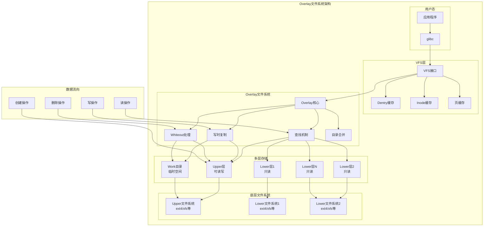

# Linux Overlay文件系统架构与实现

## 概述

Overlay文件系统（overlayfs）是Linux内核中的联合文件系统实现，它允许将一个或多个目录"叠加"在一起，形成一个统一的文件系统视图。这种机制广泛应用于容器技术（如Docker）、LiveCD、包管理等场景。

**核心特性**：
- **联合挂载**：将多个目录合并为一个统一视图
- **写时复制（Copy-on-Write）**：修改下层文件时自动复制到上层
- **分层存储**：支持多个只读下层和一个可写上层
- **透明访问**：用户看到的是统一的文件系统视图
- **空间效率**：只在修改时才复制文件，节省存储空间

## 基本架构

### 层级结构

Overlay文件系统采用分层架构，包含以下组件：

```bash
# 基本挂载语法
mount -t overlay overlay \
  -o lowerdir=/lower1:/lower2:/lower3,upperdir=/upper,workdir=/work \
  /merged
```

**层级组件**：

1. **Lower层（下层）**：
   - 一个或多个只读目录
   - 按优先级从右到左排列（左边优先级更高）
   - 不会被直接修改

2. **Upper层（上层）**：
   - 可写目录，存储所有修改操作
   - 包含新创建、修改、删除的文件信息
   - 可选组件（只读模式下可省略）

3. **Work目录（工作目录）**：
   - 临时工作空间，必须与upper在同一文件系统
   - 用于原子操作和临时文件存储
   - 必须为空目录

4. **Merged视图（合并视图）**：
   - 最终呈现给用户的统一文件系统视图
   - 透明地合并所有层的内容

### 文件系统配置结构

```c
// overlay文件系统配置 - fs/overlayfs/ovl_entry.h
struct ovl_config {
    char *upperdir;             // 上层目录路径
    char *workdir;              // 工作目录路径
    char **lowerdirs;           // 下层目录路径数组
    bool default_permissions;   // 默认权限检查
    int redirect_mode;          // 重定向模式
    int verity_mode;           // 完整性验证模式
    bool index;                // 索引功能
    int uuid;                  // UUID处理模式
    bool nfs_export;           // NFS导出支持
    int xino;                  // 扩展inode号支持
    bool metacopy;             // 元数据复制模式
    bool userxattr;            // 用户扩展属性
    bool ovl_volatile;         // 易失性模式
};

// 层信息结构
struct ovl_layer {
    struct vfsmount *mnt;       // 挂载点
    struct inode *trap;         // 陷阱inode（防止循环）
    struct ovl_sb *fs;          // 文件系统信息
    int idx;                    // 层索引（upper为0）
    int fsid;                   // 文件系统ID（upper为0）
    bool has_xwhiteouts;        // 是否有扩展whiteout
};

// overlay文件系统超级块信息
struct ovl_fs {
    unsigned int numlayer;      // 总层数
    unsigned int numfs;         // 唯一文件系统数
    unsigned int numdatalayer;  // 纯数据层数
    struct ovl_layer *layers;   // 层数组
    struct ovl_sb *fs;          // 文件系统数组
    
    // 工作目录信息
    struct dentry *workbasedir; // 工作基础目录
    struct dentry *workdir;     // 实际工作目录
    
    long namelen;               // 文件名长度限制
    struct ovl_config config;   // 配置信息
    const struct cred *creator_cred; // 创建者凭据
    
    // 功能支持标志
    bool tmpfile;               // O_TMPFILE支持
    bool noxattr;               // 不支持扩展属性
    bool nofh;                  // 不支持文件句柄
    bool upperdir_locked;       // 上层目录已锁定
    bool workdir_locked;        // 工作目录已锁定
    
    // 陷阱inode（防止层级循环）
    struct inode *workbasedir_trap;
    struct inode *workdir_trap;
    
    // inode编号管理
    int xino_mode;              // 扩展inode模式
    atomic_long_t last_ino;     // 最后分配的inode号
    
    // 共享whiteout缓存
    struct dentry *whiteout;
    bool no_shared_whiteout;
    
    // 易失性挂载的错误序列号快照
    errseq_t errseq;
};
```

## 核心数据结构

### Dentry和Inode管理

```c
// overlay路径结构
struct ovl_path {
    const struct ovl_layer *layer; // 所属层
    struct dentry *dentry;          // 目录项
};

// overlay目录项信息
struct ovl_entry {
    unsigned int __numlower;        // 下层数量
    struct ovl_path __lowerstack[]; // 下层路径栈
};

// overlay inode信息
struct ovl_inode {
    union {
        struct ovl_dir_cache *cache;        // 目录缓存
        const char *lowerdata_redirect;     // 下层数据重定向
    };
    const char *redirect;           // 重定向路径
    u64 version;                    // 版本号
    unsigned long flags;            // 标志位
    struct inode vfs_inode;         // VFS inode
    struct dentry *__upperdentry;   // 上层dentry
    struct ovl_entry *oe;           // overlay entry
    struct mutex lock;              // 同步锁
};

// 获取overlay信息的辅助宏
static inline struct ovl_inode *OVL_I(struct inode *inode)
{
    return container_of(inode, struct ovl_inode, vfs_inode);
}

static inline struct ovl_entry *OVL_E(struct dentry *dentry)
{
    return OVL_I_E(d_inode(dentry));
}

static inline struct ovl_entry *OVL_I_E(struct inode *inode)
{
    return inode ? OVL_I(inode)->oe : NULL;
}
```

### inode操作结构

```c
// overlay文件inode操作 - fs/overlayfs/inode.c
static void ovl_fill_inode(struct inode *inode, umode_t mode, dev_t rdev)
{
    inode->i_mode = mode;
    inode->i_flags |= S_NOCMTIME;  // 禁用ctime自动更新
#ifdef CONFIG_FS_POSIX_ACL
    inode->i_acl = inode->i_default_acl = ACL_DONT_CACHE;
#endif

    ovl_lockdep_annotate_inode_mutex_key(inode);

    switch (mode & S_IFMT) {
    case S_IFREG:
        inode->i_op = &ovl_file_inode_operations;
        inode->i_fop = &ovl_file_operations;
        inode->i_mapping->a_ops = &ovl_aops;
        break;

    case S_IFDIR:
        inode->i_op = &ovl_dir_inode_operations;
        inode->i_fop = &ovl_dir_operations;
        break;

    case S_IFLNK:
        inode->i_op = &ovl_symlink_inode_operations;
        break;

    default:
        inode->i_op = &ovl_special_inode_operations;
        init_special_inode(inode, mode, rdev);
        break;
    }
}
```

## 联合挂载机制

### 目录查找（Lookup）

overlay文件系统的查找过程是其核心功能，需要在多个层中搜索并合并结果：

```c
// 主要查找函数 - fs/overlayfs/namei.c
struct dentry *ovl_lookup(struct inode *dir, struct dentry *dentry,
                         unsigned int flags)
{
    struct ovl_entry *oe = NULL;
    const struct cred *old_cred;
    struct ovl_fs *ofs = OVL_FS(dentry->d_sb);
    struct ovl_entry *poe = OVL_E(dentry->d_parent);
    struct ovl_entry *roe = OVL_E(dentry->d_sb->s_root);
    struct ovl_path *stack = NULL, *origin_path = NULL;
    struct dentry *upperdir, *upperdentry = NULL;
    struct dentry *origin = NULL;
    struct dentry *index = NULL;
    unsigned int ctr = 0;
    struct inode *inode = NULL;
    bool upperopaque = false;
    char *upperredirect = NULL;
    struct dentry *this;
    unsigned int i;
    int err;
    bool uppermetacopy = false;
    int metacopy_size = 0;
    
    // 查找数据结构
    struct ovl_lookup_data d = {
        .sb = dentry->d_sb,
        .name = dentry->d_name,
        .is_dir = false,
        .opaque = false,
        .stop = false,
        .last = ovl_redirect_follow(ofs) ? false : !ovl_numlower(poe),
        .redirect = NULL,
        .metacopy = 0,
    };

    if (dentry->d_name.len > ofs->namelen)
        return ERR_PTR(-ENAMETOOLONG);

    old_cred = ovl_override_creds(dentry->d_sb);
    upperdir = ovl_dentry_upper(dentry->d_parent);
    
    // 在upper层查找
    if (upperdir) {
        d.layer = &ofs->layers[0];
        this = ovl_lookup_single(upperdir, &d, dentry->d_name.name,
                               dentry->d_name.len, 0, "", &upperdentry, false);
        err = PTR_ERR(this);
        if (IS_ERR(this))
            goto out;
        
        if (upperdentry) {
            // 检查是否为whiteout
            if (ovl_is_whiteout(upperdentry)) {
                d.stop = d.opaque = true;
                goto out;
            }
            
            // 检查opaque标志
            if (d_is_dir(upperdentry)) {
                upperopaque = ovl_is_opaquedir(ofs, upperdentry);
                if (upperopaque)
                    d.stop = true;
            }
            
            // 检查重定向
            upperredirect = ovl_get_redirect_xattr(ofs, upperdentry, 0);
            if (IS_ERR(upperredirect)) {
                err = PTR_ERR(upperredirect);
                goto out;
            }
            
            // 检查metacopy
            err = ovl_check_metacopy_xattr(ofs, upperdentry, NULL);
            if (err < 0)
                goto out;
            uppermetacopy = err;
            metacopy_size = err;
        }
    }

    if (!d.stop && poe->numlower) {
        // 在lower层查找
        err = -ENOMEM;
        stack = kcalloc(ofs->numlower, sizeof(struct ovl_path), GFP_KERNEL);
        if (!stack)
            goto out;

        for (i = 0; !d.stop && i < poe->numlower; i++) {
            struct ovl_path *lowerpath = &poe->lowerstack[i];
            
            if (!ovl_redirect_follow(ofs))
                d.last = i == poe->numlower - 1;
            else
                d.last = lower.layer->idx == roe->numlower;

            d.layer = lowerpath->layer;
            this = ovl_lookup_single(lowerpath->dentry, &d,
                                   dentry->d_name.name, dentry->d_name.len,
                                   0, "", &stack[ctr].dentry, false);
            err = PTR_ERR(this);
            if (IS_ERR(this))
                goto out_put;

            if (stack[ctr].dentry) {
                stack[ctr].layer = d.layer;
                ctr++;
            }
            
            if (d.stop)
                break;
        }
    }

    // 创建overlay inode
    if (upperdentry || ctr) {
        struct ovl_inode_params oip = {
            .upperdentry = upperdentry,
            .oe = oe,
            .index = index,
            .redirect = upperredirect,
        };

        inode = ovl_get_inode(dentry->d_sb, &oip);
        err = PTR_ERR(inode);
        if (IS_ERR(inode))
            goto out_free_oe;
            
        if (upperdentry && !uppermetacopy)
            ovl_set_flag(OVL_UPPERDATA, inode);

        if (metacopy_size > OVL_METACOPY_MIN_SIZE)
            ovl_set_flag(OVL_HAS_DIGEST, inode);
    }

    ovl_dentry_init_reval(dentry, upperdentry, OVL_I_E(inode));
    revert_creds(old_cred);
    
    // 清理资源并返回结果
    if (origin_path) {
        dput(origin_path->dentry);
        kfree(origin_path);
    }
    dput(index);
    ovl_stack_free(stack, ctr);
    kfree(d.redirect);
    return d_splice_alias(inode, dentry);

out_free_oe:
    ovl_free_entry(oe);
out_put:
    dput(index);
    ovl_stack_free(stack, ctr);
out_put_upper:
    if (origin_path) {
        dput(origin_path->dentry);
        kfree(origin_path);
    }
    dput(upperdentry);
    kfree(upperredirect);
out:
    kfree(d.redirect);
    revert_creds(old_cred);
    return ERR_PTR(err);
}

// 单层查找函数
static int ovl_lookup_single(struct dentry *base, struct ovl_lookup_data *d,
                           const char *name, unsigned int namelen,
                           size_t prelen, const char *post,
                           struct dentry **ret, bool drop_negative)
{
    struct ovl_fs *ofs = OVL_FS(d->sb);
    struct dentry *this;
    struct path path;
    int err;
    bool last_element = !post[0];
    bool is_upper = d->layer->idx == 0;
    char val;

    this = ovl_lookup_positive_unlocked(d, name, base, namelen, drop_negative);
    if (IS_ERR(this)) {
        err = PTR_ERR(this);
        this = NULL;
        if (err == -ENOENT || err == -ENAMETOOLONG)
            goto out;
        goto out_err;
    }

    if (ovl_dentry_weird(this)) {
        /* 不支持自动挂载等特殊情况 */
        err = -EREMOTE;
        goto out_err;
    }

    path.dentry = this;
    path.mnt = d->layer->mnt;
    
    // 检查是否为whiteout
    if (ovl_path_is_whiteout(ofs, &path)) {
        d->stop = d->opaque = true;
        goto put_and_out;
    }
    
    // 检查metacopy
    if (last_element && d->metacopy && !d_is_reg(this)) {
        d->stop = true;
        goto put_and_out;
    }

    if (!d_can_lookup(this)) {
        if (d->is_dir || !last_element) {
            d->stop = true;
            goto put_and_out;
        }
        
        // 检查metacopy扩展属性
        err = ovl_check_metacopy_xattr(ofs, &path, NULL);
        if (err < 0)
            goto out_err;

        d->metacopy = err;
        d->stop = !d->metacopy;
        if (!d->metacopy || d->last)
            goto out;
    } else {
        if (ovl_lookup_trap_inode(d->sb, this)) {
            /* 检测到层级重叠陷阱 */
            err = -ELOOP;
            goto out_err;
        }

        if (last_element)
            d->is_dir = true;
        if (d->last)
            goto out;

        /* overlay.opaque=x 表示xwhiteouts目录 */
        val = ovl_get_opaquedir_val(ofs, &path);
        if (last_element && !is_upper && val == 'x') {
            d->xwhiteouts = true;
            ovl_layer_set_xwhiteouts(ofs, d->layer);
        } else if (val == 'y') {
            d->stop = true;
            if (last_element)
                d->opaque = true;
            goto out;
        }
    }
    
    // 检查重定向
    err = ovl_check_redirect(&path, d, prelen, post);
    if (err)
        goto out_err;
        
out:
    *ret = this;
    return 0;

put_and_out:
    dput(this);
    *ret = NULL;
    return 0;

out_err:
    dput(this);
    return err;
}
```

### 目录读取和合并

```c
// 目录读取操作 - fs/overlayfs/readdir.c
static int ovl_iterate(struct file *file, struct dir_context *ctx)
{
    struct ovl_dir_file *od = file->private_data;
    struct dentry *dentry = file->f_path.dentry;
    struct ovl_fs *ofs = OVL_FS(dentry->d_sb);
    struct ovl_cache_entry *p;
    const struct cred *old_cred;
    int err;

    old_cred = ovl_override_creds(dentry->d_sb);
    if (!ctx->pos)
        ovl_dir_reset(file);

    if (od->is_real) {
        // 如果是真实目录，可能需要调整d_ino
        if (ovl_xino_bits(ofs) ||
            (ovl_same_fs(ofs) &&
             (ovl_is_impure_dir(file) ||
              OVL_TYPE_MERGE(ovl_path_type(dentry->d_parent))))) {
            err = ovl_iterate_real(file, ctx);
        } else {
            err = iterate_dir(od->realfile, ctx);
        }
        goto out;
    }

    if (!od->cache) {
        struct ovl_dir_cache *cache;

        // 获取合并的目录缓存
        cache = ovl_cache_get(dentry);
        err = PTR_ERR(cache);
        if (IS_ERR(cache))
            goto out;

        od->cache = cache;
        ovl_seek_cursor(od, ctx->pos);
    }

    // 遍历缓存的目录条目
    while (od->cursor != &od->cache->entries) {
        p = list_entry(od->cursor, struct ovl_cache_entry, l_node);
        
        if (!p->is_whiteout) {
            if (!p->ino || p->check_xwhiteout) {
                err = ovl_cache_update(&file->f_path, p, !p->ino);
                if (err)
                    goto out;
            }
        }
        
        /* ovl_cache_update() 在过期条目上设置is_whiteout */
        if (!p->is_whiteout) {
            if (!dir_emit(ctx, p->name, p->len, p->ino, p->type))
                break;
        }
        od->cursor = p->l_node.next;
        ctx->pos++;
    }
    err = 0;
    
out:
    revert_creds(old_cred);
    return err;
}

// 合并目录填充函数
static bool ovl_fill_merge(struct dir_context *ctx, const char *name,
                          int namelen, loff_t offset, u64 ino,
                          unsigned int d_type)
{
    struct ovl_readdir_data *rdd =
        container_of(ctx, struct ovl_readdir_data, ctx);

    rdd->count++;
    if (!rdd->is_lowest)
        return ovl_cache_entry_add_rb(rdd, name, namelen, ino, d_type);
    else
        return ovl_fill_lowest(rdd, name, namelen, offset, ino, d_type);
}
```

## 写时复制机制

### Copy-up触发条件

Overlay文件系统的写时复制（copy-up）机制在以下情况下触发：
- 修改lower层中的文件内容
- 更改文件权限或属性
- 创建硬链接
- 文件截断操作
- 写入操作（即使是追加）

### Copy-up实现

```c
// 主要的copy-up函数 - fs/overlayfs/copy_up.c
static int ovl_do_copy_up(struct ovl_copy_up_ctx *c)
{
    int err;
    struct ovl_fs *ofs = OVL_FS(c->dentry->d_sb);
    struct dentry *origin = c->lowerpath.dentry;
    struct ovl_fh *fh = NULL;
    bool to_index = false;

    /*
     * 索引非目录直接复制到索引条目然后硬链接到upper目录
     * 索引目录复制到indexdir，然后创建索引条目，然后安装复制的目录
     * 复制目录到indexdir而不是workdir简化锁定
     */
    if (ovl_need_index(c->dentry)) {
        c->indexed = true;
        if (S_ISDIR(c->stat.mode))
            c->workdir = ovl_indexdir(c->dentry->d_sb);
        else
            to_index = true;
    }

    if (S_ISDIR(c->stat.mode) || c->stat.nlink == 1 || to_index) {
        fh = ovl_get_origin_fh(ofs, origin);
        if (IS_ERR(fh))
            return PTR_ERR(fh);

        /* origin_fh 可能为NULL */
        c->origin_fh = fh;
        c->origin = true;
    }

    if (to_index) {
        c->destdir = ovl_indexdir(c->dentry->d_sb);
        err = ovl_get_index_name(ofs, origin, &c->destname);
        if (err)
            goto out_free_fh;
    } else if (WARN_ON(!c->parent)) {
        /* 断开连接的dentry必须复制到索引目录 */
        err = -EIO;
        goto out_free_fh;
    } else {
        /*
         * c->dentry->d_name 通过ovl_copy_up_start()稳定，
         * 因为如果我们到达这里，意味着c->dentry没有upper别名，
         * 改变->d_name意味着经过ovl_rename()，它会在源和目标dentry上调用ovl_copy_up()
         */
        c->destname = c->dentry->d_name;
        /*
         * 标记父目录为"impure"，因为它现在可能包含非纯upper
         */
        ovl_start_write(c->dentry);
        err = ovl_set_impure(c->parent, c->destdir);
        ovl_end_write(c->dentry);
        if (err)
            goto out_free_fh;
    }

    /* 应该使用O_TMPFILE还是workdir进行copyup? */
    if (S_ISREG(c->stat.mode) && ofs->tmpfile)
        err = ovl_copy_up_tmpfile(c);
    else
        err = ovl_copy_up_workdir(c);
    if (err)
        goto out;

    if (c->indexed)
        ovl_set_flag(OVL_INDEX, d_inode(c->dentry));

    if (to_index) {
        /* 连接索引条目到upper目录 */
        err = ovl_link_up(c);
        if (!err) {
            /* 将索引标记为链接到upper目录 */
            ovl_set_flag(OVL_HAS_UPPER, d_inode(c->dentry));
        }
    }

out:
    if (to_index)
        kfree(c->destname.name);
out_free_fh:
    kfree(fh);
    return err;
}

// 使用workdir的copy-up实现
static int ovl_copy_up_workdir(struct ovl_copy_up_ctx *c)
{
    struct ovl_fs *ofs = OVL_FS(c->dentry->d_sb);
    struct inode *inode;
    struct inode *udir = d_inode(c->destdir), *wdir = d_inode(c->workdir);
    struct path path = { .mnt = ovl_upper_mnt(ofs) };
    struct dentry *temp, *upper, *trap;
    struct ovl_cu_creds cc;
    int err;
    struct ovl_cattr cattr = {
        /* 由于umask的原因无法在创建时正确设置模式 */
        .mode = c->stat.mode & S_IFMT,
        .rdev = c->stat.rdev,
        .link = c->link
    };

    err = ovl_prep_cu_creds(c->dentry, &cc);
    if (err)
        return err;

    ovl_start_write(c->dentry);
    inode_lock(wdir);
    temp = ovl_create_temp(ofs, c->workdir, &cattr);
    inode_unlock(wdir);
    ovl_end_write(c->dentry);
    ovl_revert_cu_creds(&cc);

    if (IS_ERR(temp))
        return PTR_ERR(temp);

    /*
     * 首先复制数据，然后复制xattr。在xattr之后写入数据
     * 将自动删除security.capability xattr
     */
    path.dentry = temp;
    err = ovl_copy_up_data(c, &path);
    /*
     * 我们不能在整个助手期间持有lock_rename()，因为与sb_writers的锁顺序问题，
     * 当调用ovl_copy_up_data()时不应该持有，所以锁定workdir和destdir，
     * 确保temp在copy up完成或清理之前没有移动
     */
    ovl_start_write(c->dentry);
    trap = lock_rename(c->workdir, c->destdir);
    if (trap || temp->d_parent != c->workdir) {
        /* temp或workdir在我们下面移动？不清理就中止 */
        dput(temp);
        err = -EIO;
        if (IS_ERR(trap))
            goto out;
        goto unlock;
    } else if (err) {
        goto cleanup;
    }

    err = ovl_copy_up_metadata(c, temp);
    if (err)
        goto cleanup;

    if (S_ISDIR(c->stat.mode) && c->indexed) {
        err = ovl_create_index(c->dentry, c->origin_fh, temp);
        if (err)
            goto cleanup;
    }

    upper = ovl_lookup_upper(ofs, c->destname.name, c->destdir,
                           c->destname.len);
    err = PTR_ERR(upper);
    if (IS_ERR(upper))
        goto cleanup;

    err = ovl_do_rename(ofs, wdir, temp, udir, upper, 0);
    dput(upper);
    if (err)
        goto cleanup;

    inode = d_inode(c->dentry);
    if (c->metacopy_digest)
        ovl_set_flag(OVL_HAS_DIGEST, inode);
    else
        ovl_clear_flag(OVL_HAS_DIGEST, inode);
    ovl_clear_flag(OVL_VERIFIED_DIGEST, inode);

    if (!c->metacopy)
        ovl_set_upperdata(inode);
    ovl_inode_update(inode, temp);
    if (S_ISDIR(inode->i_mode))
        ovl_set_flag(OVL_WHITEOUTS, inode);
unlock:
    unlock_rename(c->workdir, c->destdir);
out:
    ovl_end_write(c->dentry);

    return err;

cleanup:
    ovl_cleanup(ofs, wdir, temp);
    dput(temp);
    goto unlock;
}

// 文件数据复制
static int ovl_copy_up_file(struct ovl_fs *ofs, struct dentry *dentry,
                          struct file *new_file, loff_t len,
                          bool datasync)
{
    struct path datapath;
    struct file *old_file;
    loff_t old_pos = 0;
    loff_t new_pos = 0;
    loff_t cloned;
    loff_t data_pos = -1;
    loff_t hole_len;
    bool skip_hole = false;
    int error = 0;

    ovl_path_lowerdata(dentry, &datapath);
    if (WARN_ON_ONCE(datapath.dentry == NULL) ||
        WARN_ON_ONCE(len < 0))
        return -EIO;

    old_file = ovl_path_open(&datapath, O_LARGEFILE | O_RDONLY);
    if (IS_ERR(old_file))
        return PTR_ERR(old_file);

    /* 尝试使用clone_file_range在同一文件系统内克隆 */
    cloned = vfs_clone_file_range(old_file, 0, new_file, 0, len, 0);
    if (cloned == len)
        goto out_fput;

    /* 无法克隆，所以现在尝试复制数据 */
    error = rw_verify_area(READ, old_file, &old_pos, len);
    if (!error)
        error = rw_verify_area(WRITE, new_file, &new_pos, len);
    if (error)
        goto out_fput;

    /* 检查lower文件系统是否支持seek操作 */
    if (old_file->f_mode & FMODE_LSEEK)
        skip_hole = true;

    while (len) {
        size_t this_len = OVL_COPY_UP_CHUNK_SIZE;
        long bytes;

        if (len < this_len)
            this_len = len;

        if (signal_pending_state(TASK_KILLABLE, current)) {
            error = -EINTR;
            break;
        }

        /*
         * 填入sparse文件的hole，避免复制不必要的数据
         */
        if (skip_hole && data_pos < old_pos) {
            data_pos = vfs_llseek(old_file, old_pos, SEEK_DATA);
            if (data_pos > old_pos) {
                hole_len = data_pos - old_pos;
                len -= hole_len;
                old_pos = data_pos;
                new_pos = data_pos;
                continue;
            } else if (data_pos == -ENXIO) {
                break;
            } else if (data_pos < 0) {
                skip_hole = false;
            }
        }

        bytes = do_splice_direct(old_file, &old_pos,
                               new_file, &new_pos,
                               this_len, SPLICE_F_MOVE);
        if (bytes <= 0) {
            error = bytes;
            break;
        }
        WARN_ON(old_pos != new_pos);

        len -= bytes;
    }
    if (!error && datasync)
        error = vfs_fsync(new_file, 0);
out_fput:
    fput(old_file);
    return error;
}
```

### 元数据复制（Metacopy）

Overlay支持延迟数据复制模式，只复制元数据而延迟数据复制：

```c
// metacopy检查和处理
static bool ovl_need_meta_copy_up(struct dentry *dentry, umode_t mode, int flags)
{
    struct ovl_fs *ofs = OVL_FS(dentry->d_sb);

    if (!ofs->config.metacopy)
        return false;

    if (!S_ISREG(mode))
        return false;

    if (flags && ((OPEN_FMODE(flags) & FMODE_WRITE) || (flags & O_TRUNC)))
        return false;

    return true;
}

// metacopy文件的数据复制延迟到实际写入时
static int ovl_copy_up_meta_inode_data(struct ovl_copy_up_ctx *c)
{
    struct ovl_fs *ofs = OVL_FS(c->dentry->d_sb);
    struct path upperpath, datapath;
    int err;
    char *capability = NULL;
    ssize_t uninitialized_var(cap_size);

    ovl_path_upper(c->dentry, &upperpath);
    if (WARN_ON(upperpath.dentry == NULL))
        return -EIO;
    ovl_path_lowerdata(c->dentry, &datapath);
    if (WARN_ON(datapath.dentry == NULL))
        return -EIO;

    if (c->stat.size) {
        err = cap_size = ovl_getxattr_upper(ofs, upperpath.dentry,
                                          XATTR_NAME_CAPS, &capability, 0);
        if (err < 0 && err != -ENODATA)
            goto out;
    }

    err = ovl_copy_up_data(c, &upperpath);
    if (err)
        goto out_free;

    /*
     * 写入数据后设置capability xattr会移除capability xattr，
     * 所以我们首先设置xattr然后写入数据
     */
    if (capability) {
        err = ovl_do_setxattr(ofs, upperpath.dentry, XATTR_NAME_CAPS,
                            capability, cap_size, 0);
        if (err)
            goto out_free;
    }

    err = ovl_removexattr(ofs, upperpath.dentry, OVL_XATTR_METACOPY);
    if (err)
        goto out_free;

    ovl_set_upperdata(d_inode(c->dentry));

out_free:
    kfree(capability);
out:
    return err;
}
```

## Whiteout和删除处理

### Whiteout机制

Overlay文件系统使用whiteout来标记已删除的文件，而不直接修改下层文件系统：

```c
// whiteout创建函数 - fs/overlayfs/dir.c
static struct dentry *ovl_whiteout(struct ovl_fs *ofs)
{
    int err;
    struct dentry *whiteout;
    struct dentry *workdir = ofs->workdir;
    struct inode *wdir = workdir->d_inode;

    if (!ofs->whiteout) {
        whiteout = ovl_lookup_temp(ofs, workdir);
        if (IS_ERR(whiteout))
            goto out;

        err = ovl_do_whiteout(ofs, wdir, whiteout);
        if (err) {
            dput(whiteout);
            whiteout = ERR_PTR(err);
            goto out;
        }
        ofs->whiteout = whiteout;
    }

    if (!ofs->no_shared_whiteout) {
        whiteout = ovl_lookup_temp(ofs, workdir);
        if (IS_ERR(whiteout))
            goto out;

        err = ovl_do_link(ofs, ofs->whiteout, wdir, whiteout);
        if (!err)
            goto out;

        if (err != -EMLINK) {
            pr_warn("Failed to link whiteout - disabling whiteout inode sharing(nlink=%u, err=%i)\n",
                   ofs->whiteout->d_inode->i_nlink, err);
            ofs->no_shared_whiteout = true;
        }
        dput(whiteout);
    }
    whiteout = ofs->whiteout;
    ofs->whiteout = NULL;
out:
    return whiteout;
}

// whiteout检查函数
bool ovl_is_whiteout(struct dentry *dentry)
{
    struct inode *inode = dentry->d_inode;

    return inode && IS_WHITEOUT(inode);
}

bool ovl_path_is_whiteout(struct ovl_fs *ofs, const struct path *path)
{
    return ovl_is_whiteout(path->dentry) ||
           ovl_path_check_xwhiteout_xattr(ofs, path);
}
```

### 文件删除实现

```c
// 文件删除操作 - fs/overlayfs/dir.c  
static int ovl_unlink(struct inode *dir, struct dentry *dentry)
{
    int err;
    enum ovl_path_type type;
    struct inode *inode = d_inode(dentry);
    struct dentry *upperdir;
    struct dentry *upper;
    struct dentry *opaquedir = NULL;
    const struct cred *old_cred;
    struct ovl_fs *ofs = OVL_FS(dentry->d_sb);
    bool lower_positive = ovl_lower_positive(dentry);

    type = ovl_path_type(dentry);
    if (OVL_TYPE_PURE_UPPER(type)) {
        // 纯upper文件，直接删除
        err = ovl_copy_up(dentry->d_parent);
        if (err)
            return err;

        err = ovl_want_write(dentry);
        if (err)
            goto out;

        err = ovl_nlink_start(dentry);
        if (err)
            goto out_drop_write;

        old_cred = ovl_override_creds(dentry->d_sb);
        upperdir = ovl_dentry_upper(dentry->d_parent);
        upper = ovl_dentry_upper(dentry);
        inode_lock_nested(upperdir->d_inode, I_MUTEX_PARENT);
        err = ovl_do_unlink(ofs, upperdir->d_inode, upper);
        inode_unlock(upperdir->d_inode);
        ovl_dir_modified(dentry->d_parent, false);
        revert_creds(old_cred);
        ovl_nlink_end(dentry);
    } else {
        // 有下层文件，需要创建whiteout
        err = ovl_copy_up(dentry->d_parent);
        if (err)
            return err;

        err = ovl_want_write(dentry);
        if (err)
            goto out;

        if (inode && WARN_ON(!ovl_nlink_start(dentry))) {
            err = -EBUSY;
            goto out_drop_write;
        }

        old_cred = ovl_override_creds(dentry->d_sb);
        upperdir = ovl_dentry_upper(dentry->d_parent);
        inode_lock_nested(upperdir->d_inode, I_MUTEX_PARENT);
        upper = ovl_dentry_upper(dentry);
        if (upper) {
            /* 有upper文件，删除并创建whiteout */
            err = ovl_cleanup_and_whiteout(ofs, upperdir->d_inode, upper);
        } else {
            /* 只有lower文件，创建whiteout */
            upper = ovl_lookup_upper(ofs, dentry->d_name.name,
                                   upperdir, dentry->d_name.len);
            err = PTR_ERR(upper);
            if (IS_ERR(upper))
                goto unlock;

            err = ovl_create_or_link(upper, true, NULL, false);
            dput(upper);
        }
        inode_unlock(upperdir->d_inode);
        ovl_dir_modified(dentry->d_parent, ovl_type_origin(dentry));
        revert_creds(old_cred);
        if (inode)
            ovl_nlink_end(dentry);
    }

out_drop_write:
    ovl_drop_write(dentry);
out:
    return err;

unlock:
    inode_unlock(upperdir->d_inode);
    revert_creds(old_cred);
    if (inode)
        ovl_nlink_end(dentry);
    goto out_drop_write;
}

// 清理和whiteout函数
int ovl_cleanup_and_whiteout(struct ovl_fs *ofs, struct inode *dir,
                           struct dentry *dentry)
{
    struct inode *wdir = ofs->workdir->d_inode;
    struct dentry *whiteout;
    int err;
    int flags = 0;

    whiteout = ovl_whiteout(ofs);
    err = PTR_ERR(whiteout);
    if (IS_ERR(whiteout))
        return err;

    if (d_is_dir(dentry))
        flags = RENAME_EXCHANGE;

    err = ovl_do_rename(ofs, wdir, whiteout, dir, dentry, flags);
    if (err)
        goto kill_whiteout;
    if (flags)
        ovl_cleanup(ofs, wdir, dentry);

out:
    dput(whiteout);
    return err;

kill_whiteout:
    ovl_cleanup(ofs, wdir, whiteout);
    goto out;
}
```

### Opaque目录处理

```c
// 不透明目录设置
static int ovl_set_opaque(struct dentry *dentry, struct dentry *upperdentry)
{
    /*
     * 当试图创建opaque目录而upper不支持xattr时失败并返回-EIO
     * ovl_rename()调用ovl_set_opaque_xerr(-EXDEV)为noxattr情况返回特定错误
     */
    return ovl_set_opaque_xerr(dentry, upperdentry, -EIO);
}

static int ovl_set_opaque_xerr(struct dentry *dentry, struct dentry *upper,
                              int xerr)
{
    struct ovl_fs *ofs = OVL_FS(dentry->d_sb);
    int err;

    err = ovl_check_setxattr(ofs, upper, OVL_XATTR_OPAQUE, "y", 1, xerr);
    if (!err)
        ovl_dentry_set_opaque(dentry);

    return err;
}

// 不透明目录检查
bool ovl_dentry_is_opaque(struct dentry *dentry)
{
    return ovl_dentry_test_flag(OVL_E_OPAQUE, dentry);
}

char ovl_get_dir_xattr_val(struct ovl_fs *ofs, const struct path *path,
                          enum ovl_xattr ox)
{
    int res;
    char val;

    if (!d_is_dir(path->dentry))
        return 0;

    res = ovl_path_getxattr(ofs, path, ox, &val, 1);
    return res == 1 ? val : 0;
}
```

## 文件操作实现

### 文件读写操作

```c
// overlay文件操作结构 - fs/overlayfs/file.c
const struct file_operations ovl_file_operations = {
    .open       = ovl_open,
    .release    = ovl_release,
    .llseek     = ovl_llseek,
    .read_iter  = ovl_read_iter,
    .write_iter = ovl_write_iter,
    .fsync      = ovl_fsync,
    .mmap       = ovl_mmap,
    .fallocate  = ovl_fallocate,
    .fadvise    = ovl_fadvise,
    .flush      = ovl_flush,
    .splice_read    = ovl_splice_read,
    .splice_write   = ovl_splice_write,

    .copy_file_range    = ovl_copy_file_range,
    .remap_file_range   = ovl_remap_file_range,
};

// 文件打开操作
static int ovl_open(struct inode *inode, struct file *file)
{
    struct file *realfile;
    int err;

    err = ovl_maybe_copy_up(file->f_path.dentry, file->f_flags);
    if (err)
        return err;

    /* 不再需要复制，直接打开真实文件 */
    realfile = ovl_open_realfile(file, ovl_inode_realdata(inode));
    if (IS_ERR(realfile))
        return PTR_ERR(realfile);

    file->private_data = realfile;

    return 0;
}

// 写操作触发copy-up
static ssize_t ovl_write_iter(struct kiocb *iocb, struct iov_iter *iter)
{
    struct file *file = iocb->ki_filp;
    struct inode *inode = file_inode(file);
    struct fd real;
    const struct cred *old_cred;
    ssize_t ret;

    if (!iov_iter_count(iter))
        return 0;

    inode_lock(inode);
    /* 检查是否需要copy-up */
    ret = ovl_real_fdget_meta(file, &real, OVL_WANT_WRITE);
    if (ret)
        goto out_unlock;

    if (!ovl_should_sync(OVL_FS(inode->i_sb)))
        iocb->ki_flags |= IOCB_DSYNC;

    old_cred = ovl_override_creds(file_inode(file)->i_sb);
    file_start_write(real.file);
    ret = vfs_iter_write(real.file, iter, &iocb->ki_pos, 0);
    file_end_write(real.file);
    revert_creds(old_cred);

    /* 更新cached mtime/ctime */
    ovl_copyattr(inode);

    fdput(real);

out_unlock:
    inode_unlock(inode);

    return ret;
}

// 获取真实文件描述符（可能触发copy-up）
static int ovl_real_fdget_meta(const struct file *file, struct fd *real,
                              enum ovl_copyop op)
{
    struct dentry *dentry = file->f_path.dentry;
    struct file *realfile = file->private_data;
    struct path realpath;
    int err;

    real->flags = 0;
    real->file = realfile;

    if (op == OVL_WANT_WRITE) {
        if (ovl_dentry_needs_data_copy_up_locked(dentry, 0)) {
            /* 需要copy-up数据 */
            err = ovl_copy_up_with_data(dentry);
            if (err)
                return err;
                
            /* 重新打开文件以获取upper文件 */
            fput(realfile);
            ovl_path_realdata(dentry, &realpath);
            realfile = ovl_path_open(&realpath, file->f_flags);
            if (IS_ERR(realfile))
                return PTR_ERR(realfile);
            ((struct file *) file)->private_data = realfile;
        } else if (ovl_dentry_needs_data_copy_up_locked(dentry, O_WRONLY)) {
            /* metacopy情况下需要复制数据 */
            err = ovl_copy_up_with_data(dentry);
            if (err)
                return err;
        }
    }

    real->file = realfile;
    return 0;
}
```

## 性能优化特性

### 索引功能

索引功能用于优化hardlink处理和NFS导出：

```c
// 索引相关结构和函数
struct dentry *ovl_lookup_index(struct ovl_fs *ofs, struct dentry *upper,
                               struct dentry *origin, bool verify)
{
    struct dentry *index;
    struct inode *inode;
    struct qstr name;
    bool is_dir = d_is_dir(origin);
    int err;

    err = ovl_get_index_name(ofs, origin, &name);
    if (err)
        return ERR_PTR(err);

    index = lookup_one_positive_unlocked(ovl_upper_mnt_idmap(ofs), name.name,
                                       ofs->workdir, name.len);
    if (IS_ERR(index)) {
        err = PTR_ERR(index);
        if (err == -ENOENT) {
            index = NULL;
            goto out;
        }
        pr_warn_ratelimited("failed inode index lookup (ino=%lu, key=%.*s, err=%i);\n"
                          "overlayfs: mount with '-o index=off' to disable inodes index.\n",
                          d_inode(origin)->i_ino, name.len, name.name,
                          err);
        goto out;
    }

    inode = d_inode(index);
    if (ovl_is_whiteout(index) && !verify) {
        /*
         * 当不验证upper时，不要创建已删除文件的索引条目
         * 这可能是在查找期间调用的，当upper目录在lower目录之前被读取时
         * 在这种情况下下层可能仍然存在
         */
        dput(index);
        index = NULL;
        goto out;
    } else if (ovl_dentry_weird(index) || ovl_is_whiteout(index) ||
              ((inode->i_mode ^ d_inode(origin)->i_mode) & S_IFMT)) {
        /*
         * 索引应该总是有一个与origin相同类型的upper别名，
         * 除了目录索引的情况，它没有upper别名
         */
        if (is_dir && ovl_indexdir(ofs) == ofs->workdir) {
            err = ovl_verify_upper(ofs, index, origin, true);
            if (!err)
                goto out;
        }
        
        pr_warn_ratelimited("bad index found (index=%pd2, ftype=%x, origin ftype=%x).\n",
                          index, d_inode(index)->i_mode & S_IFMT,
                          d_inode(origin)->i_mode & S_IFMT);
        goto fail;
    } else if (is_dir && verify) {
        if (!upper) {
            err = ovl_verify_origin(ofs, index, origin, true);
            if (err)
                goto fail;
        } else {
            err = ovl_verify_upper(ofs, index, upper, true);
            if (err)
                goto fail;
        }
    }
out:
    kfree(name.name);
    return index;

fail:
    dput(index);
    index = ERR_PTR(err);
    goto out;
}
```

### 扩展inode号（xino）

为了在多层环境中提供一致的inode号：

```c
// xino相关处理
static inline bool ovl_xino_bits(struct ovl_fs *ofs)
{
    return ofs->xino_mode > 0;
}

// 获取或分配overlay inode
struct inode *ovl_get_inode(struct super_block *sb,
                          struct ovl_inode_params *oip)
{
    struct ovl_fs *ofs = OVL_FS(sb);
    struct dentry *upperdentry = oip->upperdentry;
    struct ovl_path *lowerpath = ovl_lowerpath(oip->oe);
    struct inode *realinode = upperdentry ? d_inode(upperdentry) : NULL;
    struct inode *inode;
    struct dentry *lowerdentry = lowerpath ? lowerpath->dentry : NULL;
    struct path realpath = {
        .dentry = upperdentry ?: lowerdentry,
        .mnt = upperdentry ? ovl_upper_mnt(ofs) : lowerpath->layer->mnt,
    };
    bool bylower = ovl_hash_bylower(sb, upperdentry, lowerdentry,
                                  oip->index);
    int fsid = bylower ? lowerpath->layer->fsid : 0;
    bool is_dir;
    unsigned long ino = 0;
    int err = oip->newinode ? -EEXIST : -ENOMEM;

    if (!realinode)
        realinode = d_inode(lowerdentry);

    /*
     * copy up origin (lower)可能存在于非索引upper，但如果这是破坏的硬链接，
     * 我们不能使用lower作为hash key
     */
    is_dir = S_ISDIR(realinode->i_mode);
    if (upperdentry || bylower) {
        struct inode *key = d_inode(bylower ? lowerdentry : upperdentry);
        unsigned int nlink = is_dir ? 1 : realinode->i_nlink;

        inode = ovl_iget5(sb, oip->newinode, key);
        if (!inode)
            goto out_err;
        if (!(inode->i_state & I_NEW)) {
            /*
             * 验证存储在inode中的底层文件是否与dentry中的匹配
             */
            if (!ovl_verify_inode(inode, lowerdentry, upperdentry, true)) {
                iput(inode);
                err = -ESTALE;
                goto out_err;
            }

            dput(upperdentry);
            ovl_free_entry(oip->oe);
            kfree(oip->redirect);
            kfree(oip->lowerdata_redirect);
            goto out;
        }

        /* 由于索引的原因重新计算非目录的nlink */
        if (!is_dir)
            nlink = ovl_get_nlink(ofs, lowerdentry, upperdentry, nlink);
        set_nlink(inode, nlink);
        ino = key->i_ino;
    } else {
        /* copy up时会破坏的lower硬链接 */
        inode = new_inode(sb);
        if (!inode) {
            err = -ENOMEM;
            goto out_err;
        }
        ino = realinode->i_ino;
        fsid = lowerpath->layer->fsid;
    }
    ovl_fill_inode(inode, realinode->i_mode, realinode->i_rdev);
    ovl_inode_init(inode, oip, ino, fsid);

    if (upperdentry && ovl_is_impuredir(sb, upperdentry))
        ovl_set_flag(OVL_IMPURE, inode);

    if (oip->index)
        ovl_set_flag(OVL_INDEX, inode);

    if (bylower)
        ovl_set_flag(OVL_CONST_INO, inode);

    /* 检查可能有whiteout的非merge目录 */
    if (is_dir) {
        if (((upperdentry && lowerdentry) || ovl_numlower(oip->oe) > 1) ||
            ovl_path_check_origin_xattr(ofs, &realpath)) {
            ovl_set_flag(OVL_WHITEOUTS, inode);
        }
    }

    /* 检查xattr中的immutable/append-only inode标志 */
    if (upperdentry)
        ovl_check_protattr(inode, upperdentry);

    if (inode->i_state & I_NEW)
        unlock_new_inode(inode);
out:
    return inode;

out_err:
    pr_warn_ratelimited("failed to get inode (%i)\n", err);
    inode = ERR_PTR(err);
    goto out;
}
```

## 挂载选项和配置

### 重要挂载参数

```bash
# 基本参数
lowerdir=/path1:/path2:/path3    # 下层目录，多个用冒号分隔
upperdir=/upper                  # 上层目录（可选）  
workdir=/work                    # 工作目录（upperdir存在时必须）

# 功能开关
metacopy=on|off                  # 元数据复制模式
index=on|off                     # 索引功能
nfs_export=on|off               # NFS导出支持
redirect_dir=on|off|follow|nofollow # 目录重定向
xino=auto|on|off                # 扩展inode号

# 安全相关
userxattr=on|off                # 用户扩展属性支持
default_permissions=on|off       # 默认权限检查
volatile                         # 易失性模式（禁用同步）

# 示例挂载命令
mount -t overlay overlay \
  -o lowerdir=/lower1:/lower2,upperdir=/upper,workdir=/work,\
     metacopy=on,index=on,xino=auto \
  /merged
```

### 配置参数处理

```c
// 参数解析 - fs/overlayfs/params.c
static const struct fs_parameter_spec ovl_parameter_spec[] = {
    fsparam_string_empty("lowerdir",    Opt_lowerdir),
    fsparam_string("lowerdir+",         Opt_lowerdir_add),
    fsparam_string("datadir+",          Opt_datadir_add),
    fsparam_string("upperdir",          Opt_upperdir),
    fsparam_string("workdir",           Opt_workdir),
    fsparam_flag("default_permissions", Opt_default_permissions),
    fsparam_enum("redirect_dir",        Opt_redirect_dir, ovl_parameter_redirect_dir),
    fsparam_enum("index",               Opt_index, ovl_parameter_bool),
    fsparam_enum("uuid",                Opt_uuid, ovl_parameter_uuid),
    fsparam_enum("nfs_export",          Opt_nfs_export, ovl_parameter_bool),
    fsparam_enum("xino",                Opt_xino, ovl_parameter_xino),
    fsparam_enum("metacopy",            Opt_metacopy, ovl_parameter_bool),
    fsparam_enum("verity",              Opt_verity, ovl_parameter_verity),
    fsparam_flag("volatile",            Opt_volatile),
    fsparam_flag("userxattr",           Opt_userxattr),
    {}
};

// 参数验证
int ovl_fs_params_verify(const struct ovl_fs_context *ctx,
                        struct ovl_config *config)
{
    struct ovl_opt_set set = ctx->set;

    /* 参数兼容性检查 */
    if (ctx->nr == 0) {
        pr_err("missing 'lowerdir'\n");
        return -EINVAL;
    }

    /* Verity需要metacopy和redirect_dir */
    if (config->verity_mode && !config->metacopy) {
        pr_err("'verity=require' requires 'metacopy=on'\n");
        return -EINVAL;
    }

    /* 某些选项互斥 */
    if (config->metacopy && config->nfs_export && config->redirect_mode) {
        pr_err("conflicting options: metacopy=on, nfs_export=on, redirect_dir!=off\n");
        return -EINVAL;
    }

    /* Index需要upper */
    if (config->index && !config->upperdir) {
        pr_info("option \"index=on\" requires an upper fs.\n");
        config->index = false;
    }

    /* NFS export需要index */
    if (config->nfs_export && !config->index) {
        pr_info("NFS export requires \"index=on\", falling back to nfs_export=off.\n");
        config->nfs_export = false;
    }

    return 0;
}
```

## 架构图



## 应用场景

### 1. 容器技术

**Docker容器镜像**：
```bash
# Docker使用overlay2作为存储驱动
# 每个容器层作为lower层，容器运行时写入upper层

# 查看Docker overlay2挂载
docker info | grep "Storage Driver"
mount | grep overlay

# 典型的Docker overlay挂载
/var/lib/docker/overlay2/merged on /var/lib/docker/overlay2/l/ABC...
    -o lowerdir=/var/lib/docker/overlay2/l/DEF:/var/lib/docker/overlay2/l/GHI,
       upperdir=/var/lib/docker/overlay2/ABC/diff,
       workdir=/var/lib/docker/overlay2/ABC/work
```

**优势**：
- **镜像共享**：多个容器可以共享相同的基础镜像层
- **快速启动**：容器启动不需要复制整个镜像
- **空间效率**：只存储修改的部分，节省存储空间
- **层级管理**：支持镜像的分层构建和管理

### 2. LiveCD/LiveUSB

```bash
# 系统启动时的overlay挂载
# 只读的根文件系统 + 可写的内存临时层

mount -t overlay overlay \
  -o lowerdir=/run/live/rootfs/filesystem.squashfs,\
     upperdir=/run/live/overlay,\
     workdir=/run/live/work \
  /root

# 用户的所有修改都存储在内存中的upper层
```

### 3. 系统更新和回滚

```bash
# 系统版本管理
# 当前系统 + 更新包 = 新系统视图

mount -t overlay overlay \
  -o lowerdir=/system/v1.0:/system/base,\
     upperdir=/system/updates,\
     workdir=/system/work \
  /

# 回滚时只需要清空或替换upper层
```

### 4. 开发和测试环境

```bash
# 基础开发环境 + 项目特定依赖

mount -t overlay overlay \
  -o lowerdir=/opt/base-dev-env,\
     upperdir=/projects/my-project/overlay,\
     workdir=/projects/my-project/work \
  /opt/dev-env

# 每个项目有独立的修改层，但共享基础环境
```

## 优势与限制

### 技术优势

**空间效率**：
- 多个层共享相同的底层数据
- 只在修改时才复制文件（写时复制）
- 延迟分配减少不必要的空间占用

**性能优化**：
- 查找操作在各层间并行进行
- 缓存机制减少重复访问
- 索引功能优化hardlink处理

**灵活性**：
- 支持多达500层的叠加
- 运行时动态修改不影响底层
- 支持只读和读写混合场景

**一致性**：
- VFS语义完全兼容
- 标准POSIX文件系统接口
- 透明的用户体验

### 技术限制

**POSIX兼容性问题**：
```bash
# 某些操作可能不符合POSIX预期：
# 1. st_dev可能不一致
# 2. 文件锁在copy-up时可能丢失
# 3. hardlink在copy-up时可能断开
```

**性能影响**：
- 第一次写入触发copy-up开销
- 多层查找增加延迟
- 扩展属性处理开销

**文件系统限制**：
- Upper和work必须在同一文件系统
- Upper文件系统必须支持扩展属性
- 某些文件系统特性可能不支持

**资源消耗**：
- 内存使用随层数增加
- 大文件copy-up消耗大量I/O
- 复杂目录结构增加CPU开销

## 调优和最佳实践

### 性能调优

**减少层数**：
```bash
# Docker镜像优化 - 合并RUN指令减少层数
# 原来：
RUN apt-get update
RUN apt-get install -y package1
RUN apt-get install -y package2

# 优化后：
RUN apt-get update && apt-get install -y \
    package1 \
    package2 \
    && rm -rf /var/lib/apt/lists/*
```

**选择合适的选项**：
```bash
# 高性能场景
mount -t overlay overlay \
  -o lowerdir=...,upperdir=...,workdir=...,\
     metacopy=off,index=off \
  /merged

# 兼容性优先场景  
mount -t overlay overlay \
  -o lowerdir=...,upperdir=...,workdir=...,\
     metacopy=on,index=on,redirect_dir=on \
  /merged
```

### 存储规划

**文件系统选择**：
- Upper层：选择支持扩展属性的高性能文件系统（ext4/xfs）
- Lower层：可以是只读文件系统（squashfs/iso9660）
- 避免在NFS上放置upper和work目录

**容量规划**：
- Upper层大小 = 预期修改数据量 + 元数据开销
- Work目录预留足够空间用于临时文件
- 考虑copy-up时的峰值存储需求

### 监控和故障排除

**监控指标**：
```bash
# 查看overlay挂载信息
cat /proc/mounts | grep overlay

# 检查扩展属性使用
getfattr -d -m "trusted.overlay.*" /upper/file

# 监控copy-up活动
echo 1 > /sys/kernel/debug/tracing/events/overlay/enable
cat /sys/kernel/debug/tracing/trace
```

**常见问题**：
```bash
# 1. No space left on device
# 检查upper和work目录空间
df -h /upper /work

# 2. Operation not permitted  
# 检查扩展属性支持
touch /tmp/test && setfattr -n user.test -v "value" /tmp/test

# 3. Stale file handle
# 检查底层文件系统一致性
fsck /dev/device
```

## 总结

Overlay文件系统作为Linux内核中的重要联合文件系统实现，在现代容器化和虚拟化技术中发挥着关键作用。通过其精妙的分层架构设计，它成功地解决了以下核心问题：

### 核心技术创新

**分层抽象模型**：
- 将文件系统视图抽象为多个可叠加的层
- Upper层负责所有写操作，Lower层保持不变
- 通过层级优先级实现统一的文件系统视图

**高效的写时复制**：
- 只在真正需要修改时才复制文件
- 支持元数据和数据的分离复制（metacopy）
- 原子性操作确保一致性

**智能查找算法**：
- 并行搜索多个层以构建完整视图
- 缓存机制避免重复查找开销
- Whiteout机制处理删除操作

**空间效率优化**：
- 多个实例共享只读层，极大节省存储空间
- 索引功能优化hardlink处理
- 扩展inode号确保文件系统语义正确性

### 实际价值

**容器生态系统**：
- Docker、Kubernetes等容器平台的基础技术
- 镜像层共享减少存储和网络开销
- 容器启动时间从分钟级优化到秒级

**系统管理**：
- LiveCD/USB系统的核心技术
- 系统更新和回滚机制
- 开发环境的快速部署和隔离

**云计算平台**：
- 虚拟机镜像模板的高效存储
- 多租户环境的资源隔离
- 弹性扩缩容的技术基础

### 设计哲学

Overlay文件系统的成功体现了Linux内核设计的几个重要原则：

1. **简单而强大**：核心概念清晰，但能解决复杂的实际问题
2. **层次化设计**：通过分层抽象降低复杂度
3. **性能与功能平衡**：提供多种配置选项适应不同场景
4. **向后兼容**：保持标准POSIX接口，用户无感知

作为现代Linux系统中使用最广泛的联合文件系统，Overlay文件系统不仅推动了容器技术的普及，也为云原生时代的基础设施奠定了重要的技术基础。它的成功证明了通过巧妙的系统设计，可以在保持简洁性的同时实现强大的功能和优异的性能。
