# Linux fsync 系统调用深度解析

## 概述

`fsync` 是 Linux 中用于将文件数据和元数据同步到持久存储的系统调用。它确保在调用返回时，文件的所有修改都已写入磁盘，对于数据库、日志系统等需要数据持久性保证的应用至关重要。

本文从源码层面深入分析 fsync 的完整调用链，以 ext4 文件系统为例，涵盖数据回写、日志提交和磁盘刷新等关键机制。

## 数据回写 vs Flush 详解

### 存储层次结构

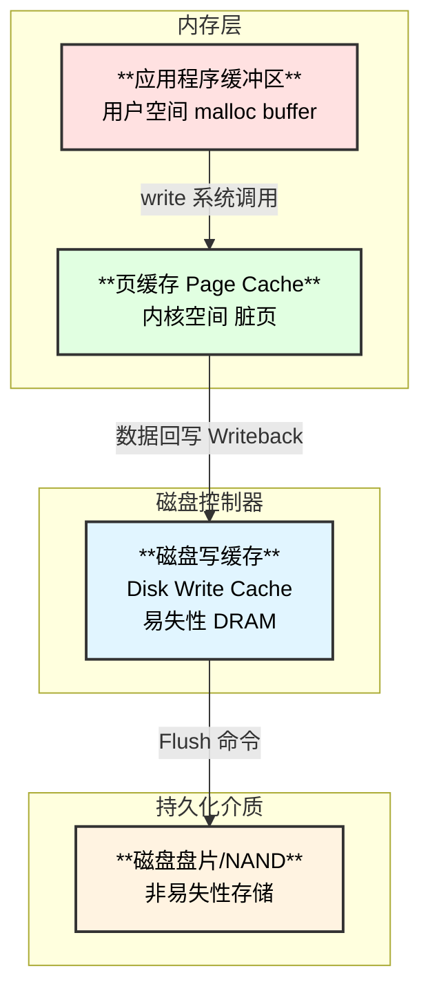

### 数据回写 vs Flush 对比

| **操作** | **数据来源** | **数据去向** | **内核函数** | **磁盘命令** |
|:---|:---|:---|:---|:---|
| **数据回写** | 页缓存（内存） | 磁盘写缓存 | `submit_bio()` | WRITE 命令 |
| **Flush** | 磁盘写缓存 | 磁盘介质 | `blkdev_issue_flush()` | FLUSH CACHE |

### 详细说明

**1. 数据回写 (Writeback)**

数据回写是将**内核页缓存中的脏页**写入到**磁盘控制器的写缓存**中：

```c
// mm/filemap.c:779
int file_write_and_wait_range(struct file *file, loff_t lstart, loff_t lend)
{
    // 1. 启动写入：将脏页提交给块层
    err = __filemap_fdatawrite_range(mapping, lstart, lend, WB_SYNC_ALL);
    
    // 2. 等待完成：等待块层 bio 完成
    err2 = filemap_fdatawait_range(mapping, lstart, lend);
}
```

**关键点**：回写完成只意味着数据到达了**磁盘控制器的易失性缓存**，断电仍可能丢失！

**2. Flush（磁盘缓存刷新）**

Flush 是将**磁盘控制器写缓存**中的数据写入到**非易失性介质**：

```c
// block/blk-flush.c
int blkdev_issue_flush(struct block_device *bdev)
{
    struct bio bio;
    bio_init(&bio, bdev, NULL, 0, REQ_OP_WRITE | REQ_PREFLUSH);
    return submit_bio_wait(&bio);
}
```

**底层命令**：

| **接口** | **命令** |
|:---|:---|
| SCSI/SAS | SYNCHRONIZE CACHE |
| SATA | FLUSH CACHE (EXT) |
| NVMe | Flush Command |

### 为什么两步都需要？

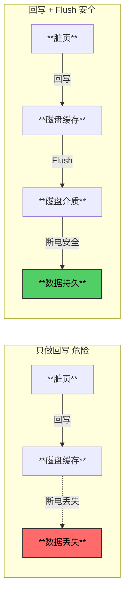

## JBD2 日志详解

### 日志记录什么？

JBD2 日志记录的是**元数据的修改操作**，不是文件数据本身：

| **日志内容** | **说明** | **示例** |
|:---|:---|:---|
| **块位图修改** | 哪些块被分配/释放 | 分配块 1000-1010 |
| **inode 修改** | 文件属性变化 | 大小 100→200，mtime 更新 |
| **目录项修改** | 目录结构变化 | 添加文件 "test.txt" |
| **间接块修改** | 块映射变化 | 添加间接块指针 |

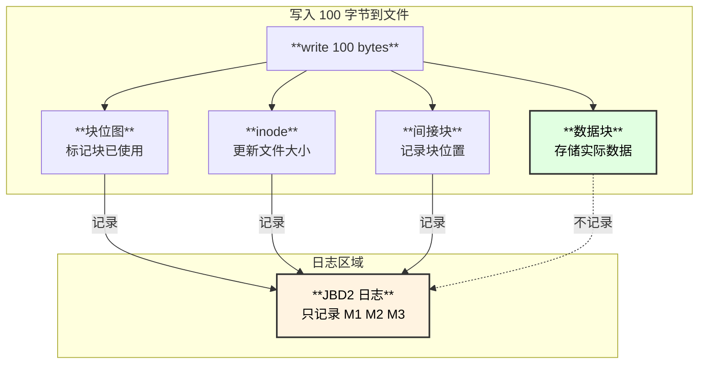

### 日志的作用

**核心目的：保证文件系统元数据的一致性，支持崩溃恢复**

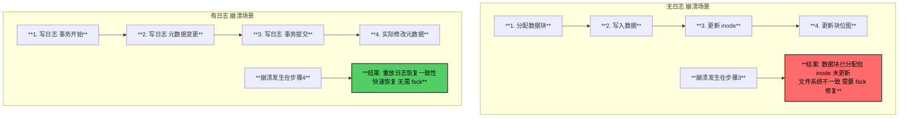

### 什么时候用到日志？

| **场景** | **使用日志** | **说明** |
|:---|:---|:---|
| 创建文件 | ✅ | 修改目录项、分配 inode |
| 删除文件 | ✅ | 修改目录项、释放块 |
| 扩展文件 | ✅ | 修改块位图、更新 inode |
| 覆盖写入 | ❌ | 仅修改数据，不涉及元数据 |
| 修改权限 | ✅ | 修改 inode |
| fsync | ✅ | 确保日志事务提交 |

### 为什么顺序是：数据回写 → 日志 → Flush？

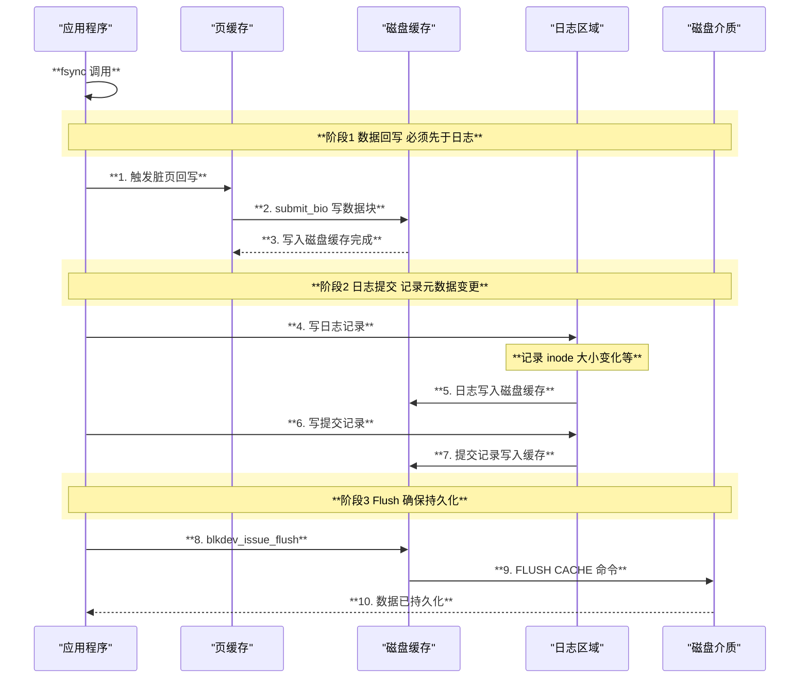

**为什么这个顺序？**

| **顺序规则** | **原因** |
|:---|:---|
| **数据先于日志** | 日志记录"数据在块N"，数据必须已写入块N |
| **日志先于提交** | 提交记录标志事务完整，内容必须已写入 |
| **提交先于Flush** | Flush 保证所有数据持久化 |

**如果顺序错误会怎样？**

```
错误顺序: 先写日志，后写数据

1. 日志记录: "文件大小=200, 数据在块1000"
2. 系统崩溃
3. 数据还未写入块1000

恢复后: 日志说数据在块1000，但块1000是垃圾数据！
```

## 架构图

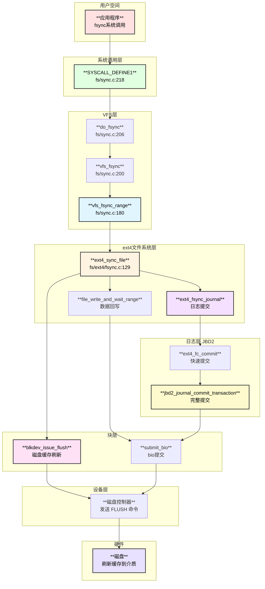

## fsync vs fdatasync

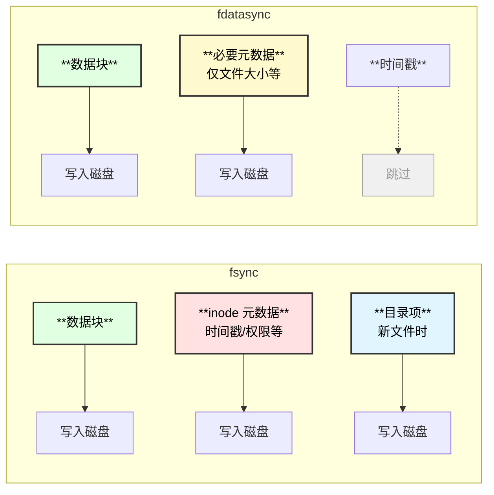

## 核心数据结构

### writeback_control 结构

```c
// include/linux/writeback.h
struct writeback_control {
    long nr_to_write;           // 需要写的页数
    long pages_skipped;         // 跳过的页数
    loff_t range_start;         // 范围起始
    loff_t range_end;           // 范围结束
    enum writeback_sync_modes sync_mode; // 同步模式
    // WB_SYNC_NONE: 非数据完整性回写
    // WB_SYNC_ALL:  数据完整性回写，必须等待
    unsigned for_sync:1;        // sync() 调用
    // ...
};
```

### journal_t 结构 (JBD2)

```c
// include/linux/jbd2.h
struct journal_s {
    unsigned long       j_flags;        // 日志标志
    tid_t               j_commit_sequence; // 已提交事务ID
    tid_t               j_tail_sequence;   // 尾部事务ID
    struct transaction_s *j_running_transaction;   // 运行中的事务
    struct transaction_s *j_committing_transaction; // 正在提交的事务
    struct block_device *j_dev;         // 日志设备
    struct block_device *j_fs_dev;      // 文件系统设备
    // ...
};
```

## 函数调用链

### 完整 fsync 调用链 (ext4 + JBD2 日志模式)

```
fsync(fd) - 用户空间 libc
└── syscall(SYS_fsync, fd) - 系统调用入口
    └── SYSCALL_DEFINE1(fsync, unsigned int, fd) - fs/sync.c:218
        └── do_fsync(fd, 0) - fs/sync.c:206
            ├── fdget(fd) - 获取 struct fd
            └── vfs_fsync(file, datasync) - fs/sync.c:200
                └── vfs_fsync_range(file, 0, LLONG_MAX, datasync) - fs/sync.c:180
                    ├── 检查 I_DIRTY_TIME 标志
                    │   └── if (!datasync && (inode->i_state & I_DIRTY_TIME))
                    │       mark_inode_dirty_sync(inode)  // 标记inode脏
                    └── file->f_op->fsync(file, start, end, datasync)
                        └── ext4_sync_file() - fs/ext4/fsync.c:129
                            ├── ext4_forced_shutdown() 检查
                            ├── sb_rdonly() 只读检查
                            │
                            ├── **阶段1: 数据回写**
                            │   └── file_write_and_wait_range(file, start, end) - mm/filemap.c:779
                            │       ├── __filemap_fdatawrite_range() - 启动数据写入
                            │       │   └── ┌─────────────┬──────────────────────────────────────────┐
                            │       │       │  操作        │  说明                                     │
                            │       │       ├─────────────┼──────────────────────────────────────────┤
                            │       │       │  wbc配置     │  sync_mode = WB_SYNC_ALL                  │
                            │       │       ├─────────────┼──────────────────────────────────────────┤
                            │       │       │  writepages  │  调用 a_ops->writepages()                 │
                            │       │       ├─────────────┼──────────────────────────────────────────┤
                            │       │       │  提交bio     │  submit_bio() 到块层                      │
                            │       │       └─────────────┴──────────────────────────────────────────┘
                            │       └── __filemap_fdatawait_range() - 等待写入完成
                            │           └── folio_wait_writeback(folio) - 等待每个页面
                            │
                            ├── **阶段2: 日志提交** (如果使用日志)
                            │   └── ext4_fsync_journal() - fs/ext4/fsync.c:97
                            │       ├── 获取 commit_tid
                            │       │   └── datasync ? ei->i_datasync_tid : ei->i_sync_tid
                            │       ├── 检查是否需要 barrier
                            │       │   └── jbd2_trans_will_send_data_barrier(journal, commit_tid)
                            │       └── ext4_fc_commit(journal, commit_tid) - fs/ext4/fast_commit.c
                            │           └── [快速提交或完整提交]
                            │               └── jbd2_journal_commit_transaction() - fs/jbd2/commit.c:348
                            │                   ├── **Phase 1: 锁定事务**
                            │                   │   └── 等待所有更新完成
                            │                   ├── **Phase 2a: 数据刷盘**
                            │                   │   └── journal_submit_data_buffers()
                            │                   ├── **Phase 2b: 元数据写入日志**
                            │                   │   └── 遍历 t_buffers 写入日志区
                            │                   ├── **Phase 3: 等待日志IO**
                            │                   │   └── wait_on_buffer() 等待所有 io_bufs
                            │                   ├── **Phase 4: 提交记录**
                            │                   │   └── journal_submit_commit_record()
                            │                   ├── **Phase 5: 文件系统设备刷盘**
                            │                   │   └── blkdev_issue_flush(j_fs_dev)
                            │                   ├── **Phase 6: 等待提交记录**
                            │                   │   └── journal_wait_on_commit_record()
                            │                   └── **Phase 7: 日志设备刷盘**
                            │                       └── blkdev_issue_flush(j_dev)
                            │
                            ├── **阶段3: 磁盘缓存刷新** (如果需要 barrier)
                            │   └── blkdev_issue_flush(sb->s_bdev) - block/blk-flush.c
                            │       └── submit_bio_wait() 
                            │           └── ┌─────────────┬──────────────────────────────────────────┐
                            │               │  操作        │  说明                                     │
                            │               ├─────────────┼──────────────────────────────────────────┤
                            │               │  bio_opf     │  REQ_OP_WRITE | REQ_PREFLUSH             │
                            │               ├─────────────┼──────────────────────────────────────────┤
                            │               │  底层命令    │  SCSI: SYNCHRONIZE CACHE                 │
                            │               │              │  NVMe: Flush                              │
                            │               │              │  SATA: FLUSH CACHE (EXT)                  │
                            │               ├─────────────┼──────────────────────────────────────────┤
                            │               │  效果        │  确保写入缓存数据落盘                     │
                            │               └─────────────┴──────────────────────────────────────────┘
                            │
                            └── **阶段4: 错误检查**
                                └── file_check_and_advance_wb_err(file)
                                    └── 返回并清除任何写回错误
```

## fsync 三阶段详解

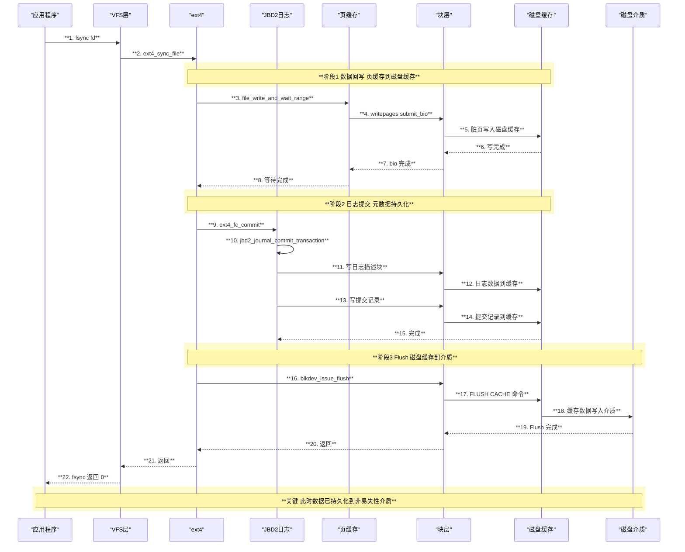

## 日志提交流程

### JBD2 事务状态机

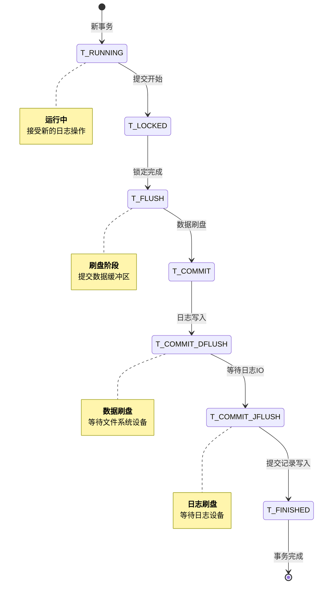

### 事务提交核心代码

```
jbd2_journal_commit_transaction() - fs/jbd2/commit.c:348
├── **Phase 1: 锁定事务**
│   ├── write_lock(&journal->j_state_lock)
│   ├── 设置 j_flags |= JBD2_FULL_COMMIT_ONGOING
│   └── 等待 JBD2_FAST_COMMIT_ONGOING 完成
│
├── **Phase 2a: 数据刷盘**
│   └── journal_submit_data_buffers()
│       └── ┌─────────────┬──────────────────────────────────────────┐
│           │  操作        │  说明                                     │
│           ├─────────────┼──────────────────────────────────────────┤
│           │  遍历 t_inode_list │  获取所有脏 inode                   │
│           ├─────────────┼──────────────────────────────────────────┤
│           │  filemap_fdatawrite_wbc │  启动数据回写               │
│           └─────────────┴──────────────────────────────────────────┘
│
├── **Phase 2b: 元数据写入日志**
│   ├── blk_start_plug(&plug)
│   ├── jbd2_journal_write_revoke_records() - 撤销记录
│   └── 遍历 t_buffers 写入日志区
│       └── 构建 descriptor block + data blocks
│
├── **Phase 3: 等待日志IO**
│   └── while (!list_empty(&io_bufs))
│       └── wait_on_buffer(bh)
│
├── **Phase 4: 提交记录写入**
│   └── journal_submit_commit_record()
│       └── ┌─────────────┬──────────────────────────────────────────┐
│           │  字段        │  值                                       │
│           ├─────────────┼──────────────────────────────────────────┤
│           │  h_magic     │  JBD2_MAGIC_NUMBER                        │
│           ├─────────────┼──────────────────────────────────────────┤
│           │  h_blocktype │  JBD2_COMMIT_BLOCK                        │
│           ├─────────────┼──────────────────────────────────────────┤
│           │  h_sequence  │  事务ID                                   │
│           └─────────────┴──────────────────────────────────────────┘
│
├── **Phase 5: 文件系统设备刷盘**
│   └── if (t_need_data_flush && j_fs_dev != j_dev)
│       blkdev_issue_flush(j_fs_dev)
│
├── **Phase 6: 等待提交记录**
│   └── journal_wait_on_commit_record()
│
└── **Phase 7: 日志设备刷盘**
    └── if (JBD2_BARRIER && async_commit)
        blkdev_issue_flush(j_dev)
```

## 磁盘缓存刷新 (Flush/Barrier)

### 为什么需要 Flush？

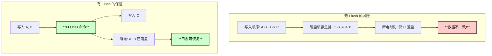

### Flush 命令映射

| **协议** | **命令** | **说明** |
|:---|:---|:---|
| SCSI | SYNCHRONIZE CACHE | 刷新磁盘写缓存 |
| SATA | FLUSH CACHE (EXT) | 刷新缓存，EXT支持48位LBA |
| NVMe | Flush | 刷新所有namespace缓存 |
| MMC/eMMC | CACHE_FLUSH | 刷新缓存 |

### blkdev_issue_flush 实现

```
blkdev_issue_flush() - block/blk-flush.c
├── 分配 bio
│   └── bio->bi_opf = REQ_OP_WRITE | REQ_PREFLUSH
├── 设置目标设备
│   └── bio->bi_bdev = bdev
└── submit_bio_wait()
    ├── submit_bio() - 提交到块层
    │   └── blk_mq_submit_bio() - 多队列处理
    │       └── blk_insert_flush() - 刷新处理
    │           └── ┌─────────────┬──────────────────────────────────────────┐
    │               │  步骤        │  说明                                     │
    │               ├─────────────┼──────────────────────────────────────────┤
    │               │  Pre-flush   │  刷新之前的所有请求                       │
    │               ├─────────────┼──────────────────────────────────────────┤
    │               │  Data        │  当前请求的数据(如有)                     │
    │               ├─────────────┼──────────────────────────────────────────┤
    │               │  Post-flush  │  确保当前数据落盘                         │
    │               └─────────────┴──────────────────────────────────────────┘
    └── wait_for_completion() - 等待完成
```

## ext4 数据模式对 fsync 的影响


### fsync 在不同模式下的行为

| **模式** | **数据写入** | **元数据写入** | **fsync 开销** |
|:---|:---|:---|:---|
| data=journal | 日志 → 最终位置 | 日志 | 高（双写） |
| data=ordered | 直接位置 | 日志 | 中 |
| data=writeback | 直接位置 | 日志 | 低 |

## 时序图：完整 fsync 流程

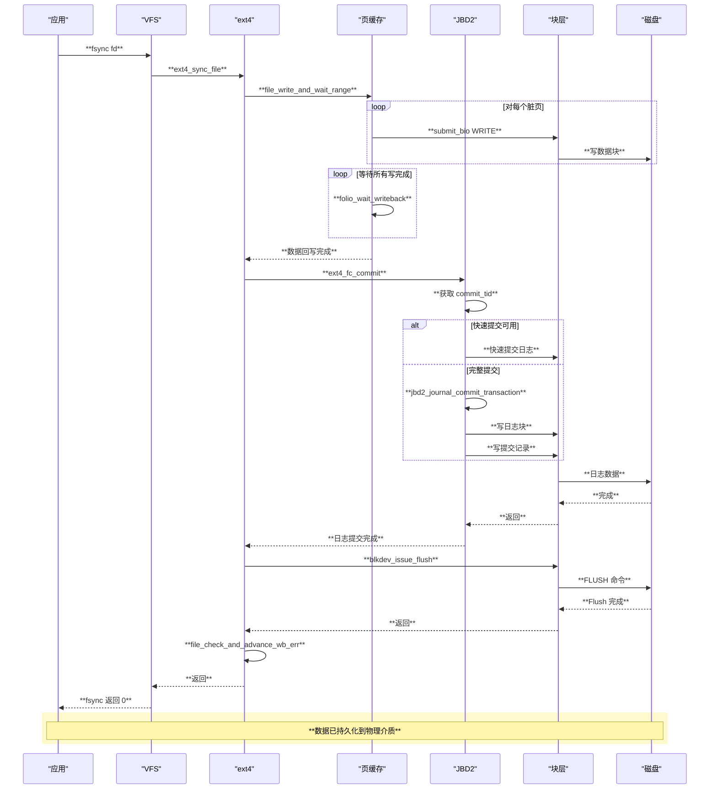

## XFS 文件系统的 fsync 实现

### XFS vs ext4 fsync 差异

| **特性** | **ext4** | **XFS** |
|:---|:---|:---|
| 日志系统 | JBD2 (独立模块) | xlog (内置日志) |
| 日志刷新 | jbd2_journal_commit | xfs_log_force_seq |
| 多设备支持 | 单设备 | 支持 RT/Log 分离设备 |
| 事务追踪 | i_sync_tid/i_datasync_tid | ili_commit_seq |

### XFS fsync 调用链

```
xfs_file_fsync() - fs/xfs/xfs_file.c:125
├── file_write_and_wait_range(file, start, end) - 数据回写
│   └── 与 ext4 相同的通用回写逻辑
├── xfs_is_shutdown(mp) 检查
├── xfs_iflags_clear(ip, XFS_ITRUNCATED)
│
├── **多设备刷新逻辑** (XFS特有)
│   ├── if XFS_IS_REALTIME_INODE(ip)
│   │   └── blkdev_issue_flush(mp->m_rtdev_targp->bt_bdev)
│   │       └── 刷新实时设备缓存
│   └── else if (mp->m_logdev_targp != mp->m_ddev_targp)
│       └── blkdev_issue_flush(mp->m_ddev_targp->bt_bdev)
│           └── 日志设备与数据设备分离时，先刷数据设备
│
├── **日志刷新**
│   └── if xfs_ipincount(ip) > 0  // inode 有脏数据在日志中
│       └── xfs_fsync_flush_log(ip, datasync, &log_flushed)
│           ├── xfs_fsync_seq(ip, datasync) - 获取需要刷新的日志序列号
│           └── xfs_log_force_seq(mp, seq, XFS_LOG_SYNC) - 强制日志到磁盘
│
└── **最终刷新** (如果日志刷新未触发)
    └── if (!log_flushed && !XFS_IS_REALTIME_INODE(ip) && 
            mp->m_logdev_targp == mp->m_ddev_targp)
        └── blkdev_issue_flush(mp->m_ddev_targp->bt_bdev)
```

### XFS 多设备架构

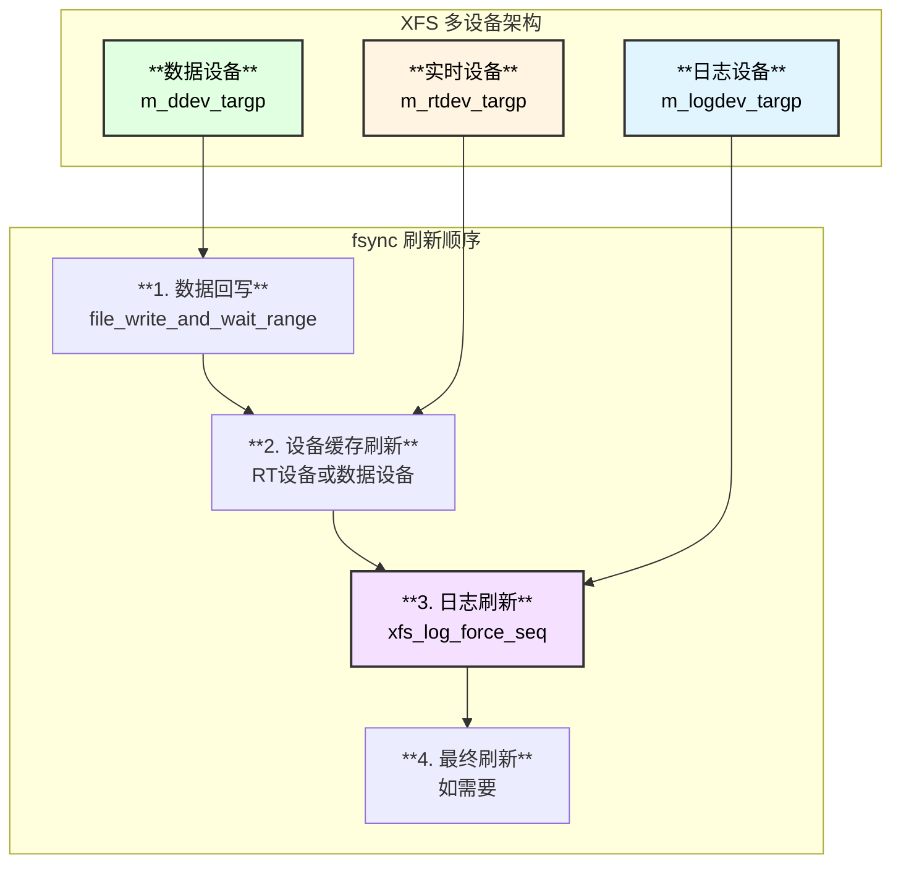

### XFS fsync 时序图

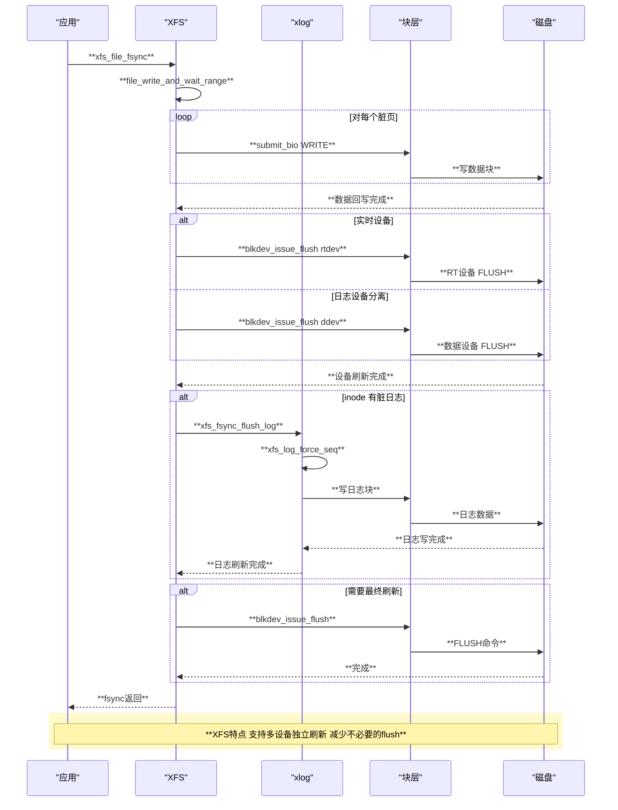

### XFS 日志序列号追踪

```c
// fs/xfs/xfs_file.c:76-86
static xfs_csn_t
xfs_fsync_seq(
    struct xfs_inode    *ip,
    bool                datasync)
{
    // 如果 inode 没有脏数据在日志中，无需刷新
    if (!xfs_ipincount(ip))
        return 0;
    // fdatasync 且只有时间戳变化，跳过刷新
    if (datasync && !(ip->i_itemp->ili_fsync_fields & ~XFS_ILOG_TIMESTAMP))
        return 0;
    // 返回需要刷新到的日志序列号
    return ip->i_itemp->ili_commit_seq;
}
```

**XFS fsync 优化点**：
1. **精确的日志序列号追踪**：只刷新必要的日志范围
2. **fdatasync 优化**：跳过仅时间戳变化的情况
3. **多设备并行**：日志设备和数据设备可以独立刷新
4. **避免冗余 flush**：日志刷新已包含 barrier 时，跳过额外 flush

### XFS 多设备配置

XFS 支持三种设备配置：

```bash
# 1. 基本配置 - 单设备（数据+日志）
mkfs.xfs /dev/sda1

# 2. 分离日志设备 - 提高性能
mkfs.xfs -l logdev=/dev/sdb1 /dev/sda1
mount -o logdev=/dev/sdb1 /dev/sda1 /mnt

# 3. 实时设备配置 - 高性能实时 I/O
mkfs.xfs -r rtdev=/dev/sdc1 /dev/sda1
mount -o rtdev=/dev/sdc1 /dev/sda1 /mnt
```

| **设备类型** | **挂载选项** | **用途** |
|:---|:---|:---|
| 数据设备 (ddev) | 默认 | 存储普通文件数据和元数据 |
| 日志设备 (logdev) | `-o logdev=` | 存储文件系统日志，加速 fsync |
| 实时设备 (rtdev) | `-o rtdev=` | 存储实时文件，独立刷新 |

### 什么是实时设备 (Real-Time Device)?

**实时设备**是 XFS 专有的特性，用于存储对延迟敏感的数据：

```c
// 检查文件是否在实时设备上
// fs/xfs/xfs_file.c:153
if (XFS_IS_REALTIME_INODE(ip))
    error = blkdev_issue_flush(mp->m_rtdev_targp->bt_bdev);
```

**实时设备特点**：
- **独立的 extent 分配**：使用独立的 realtime bitmap 管理
- **固定 extent 大小**：`-r extsize=N` 指定，便于预测延迟
- **独立刷新**：fsync 时单独刷新 rtdev，不影响数据设备
- **适用场景**：媒体流、实时数据库、延迟敏感应用

```bash
# 创建带实时设备的 XFS
mkfs.xfs -r rtdev=/dev/nvme1n1,extsize=64k /dev/sda1

# 挂载
mount -o rtdev=/dev/nvme1n1 /dev/sda1 /mnt

# 将文件放到实时设备（使用 xfs_io）
xfs_io -c "chattr +r" /mnt/realtime_file
```

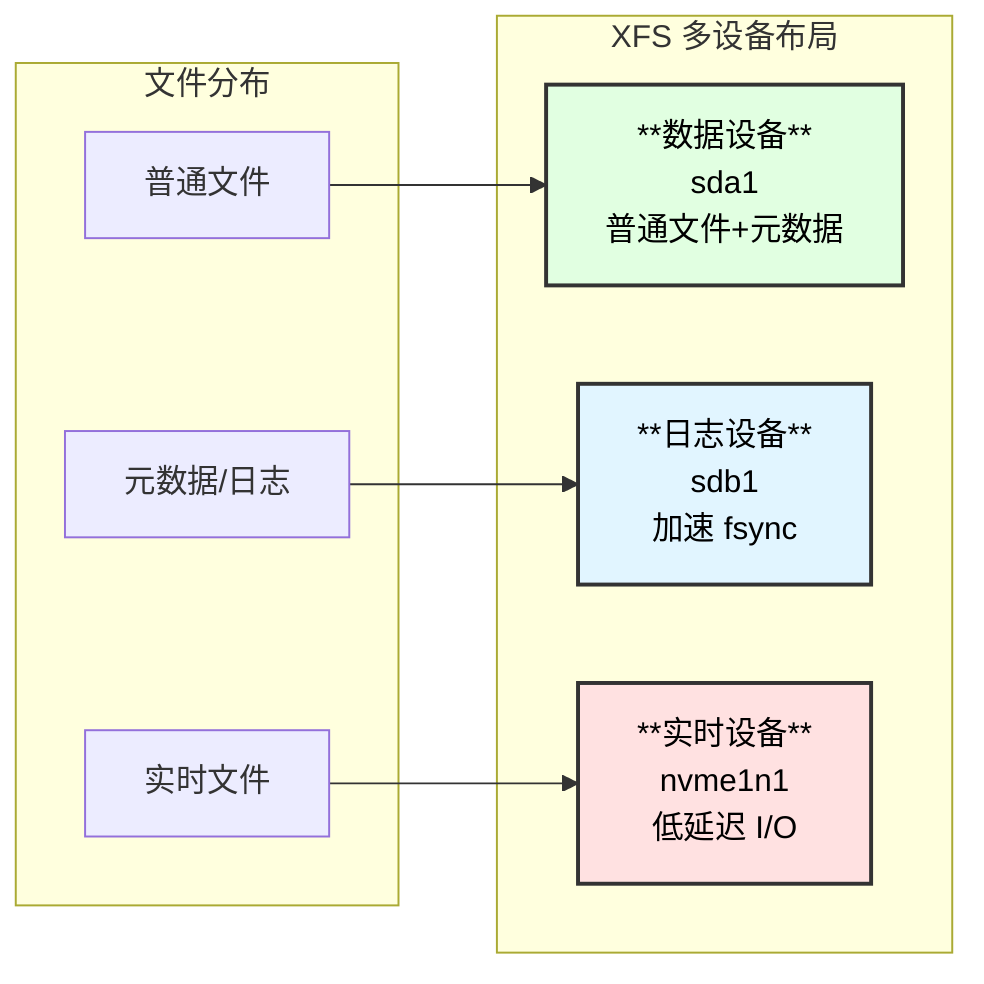

## 性能影响因素

| **因素** | **影响** | **优化建议** |
|:---|:---|:---|
| 脏页数量 | 写回时间增加 | 批量写入后 fsync |
| 日志事务大小 | 提交时间增加 | 合理配置 journal 大小 |
| 磁盘缓存大小 | Flush 时间增加 | 使用支持 FUA 的磁盘 |
| 磁盘类型 | SSD >> HDD | 升级存储硬件 |
| 文件系统数据模式 | journal > ordered > writeback | 根据需求选择 |

## 使用示例

### 基本 fsync 使用

```c
#include <fcntl.h>
#include <unistd.h>
#include <string.h>

int main() {
    int fd = open("/data/important.txt", O_RDWR | O_CREAT, 0644);
    
    // 写入数据
    const char *data = "Critical transaction data";
    write(fd, data, strlen(data));
    
    // 确保数据持久化
    if (fsync(fd) < 0) {
        perror("fsync failed");
        return 1;
    }
    
    // 此时数据已安全落盘
    printf("Data safely persisted to disk\n");
    
    close(fd);
    return 0;
}
```

### 使用 fdatasync 提升性能

```c
#include <fcntl.h>
#include <unistd.h>

int main() {
    int fd = open("/data/log.txt", O_WRONLY | O_APPEND);
    
    // 追加日志数据
    write(fd, "Log entry\n", 10);
    
    // 使用 fdatasync 跳过时间戳更新
    // 对于日志文件，通常不关心 atime/mtime
    if (fdatasync(fd) < 0) {
        perror("fdatasync failed");
        return 1;
    }
    
    close(fd);
    return 0;
}
```

### 数据库事务模式

```c
#include <fcntl.h>
#include <unistd.h>
#include <string.h>

// 模拟数据库事务提交
int commit_transaction(int data_fd, int wal_fd, 
                       const char *data, const char *wal_record) {
    // 1. 先写 WAL (Write-Ahead Log)
    write(wal_fd, wal_record, strlen(wal_record));
    
    // 2. fsync WAL 确保日志先落盘
    if (fsync(wal_fd) < 0)
        return -1;
    
    // 3. 写实际数据
    write(data_fd, data, strlen(data));
    
    // 4. fsync 数据文件
    if (fsync(data_fd) < 0)
        return -1;
    
    // 5. (可选) 标记 WAL 记录已提交
    // ...
    
    return 0;
}
```

### 使用 sync_file_range 细粒度控制

```c
#include <fcntl.h>
#include <unistd.h>

int main() {
    int fd = open("/data/large_file.dat", O_RDWR);
    
    // 写入数据
    char buf[4096];
    for (int i = 0; i < 1000; i++) {
        write(fd, buf, sizeof(buf));
        
        // 每 100 个块启动异步回写
        if (i % 100 == 99) {
            sync_file_range(fd, 
                (i - 99) * sizeof(buf),  // offset
                100 * sizeof(buf),        // nbytes
                SYNC_FILE_RANGE_WRITE);   // 仅启动写入，不等待
        }
    }
    
    // 最终等待所有写完成
    sync_file_range(fd, 0, 0, 
        SYNC_FILE_RANGE_WRITE | SYNC_FILE_RANGE_WAIT_AFTER);
    
    close(fd);
    return 0;
}
```

## 常见问题

### 问题1：fsync 返回成功但数据丢失

**原因**：
- 磁盘写缓存未被禁用
- RAID 控制器缓存未配置电池保护
- 虚拟化层缓存问题

**解决**：
- 确保磁盘写缓存正确配置
- 使用 `hdparm -W0 /dev/sdX` 禁用写缓存
- 检查 RAID 控制器 BBU 状态

### 问题2：fsync 性能差

**原因**：
- 频繁小写入后 fsync
- 日志事务过大
- 磁盘老化或故障

**优化**：
```c
// 不好的做法：每次写入都 fsync
for (int i = 0; i < 1000; i++) {
    write(fd, &data[i], sizeof(data[i]));
    fsync(fd);  // 1000 次 fsync!
}

// 好的做法：批量写入后 fsync
for (int i = 0; i < 1000; i++) {
    write(fd, &data[i], sizeof(data[i]));
}
fsync(fd);  // 仅 1 次 fsync
```

## API 对比

| **系统调用** | **同步范围** | **元数据** | **使用场景** |
|:---|:---|:---|:---|
| `fsync(fd)` | 单个文件 | 完整 | 事务提交 |
| `fdatasync(fd)` | 单个文件 | 仅必要 | 日志追加 |
| `sync()` | 整个系统 | 完整 | 系统关机 |
| `syncfs(fd)` | 整个文件系统 | 完整 | 文件系统级同步 |
| `sync_file_range()` | 文件范围 | 无 | 细粒度控制 |

## 参考资料

1. Linux Kernel Source - `fs/sync.c`, `fs/ext4/fsync.c`
2. Linux Kernel Source - `fs/jbd2/commit.c`
3. LWN.net - "Ensuring data reaches disk"
4. ext4 Documentation - `Documentation/filesystems/ext4/`
5. PostgreSQL Documentation - "Reliability and the Write-Ahead Log"

