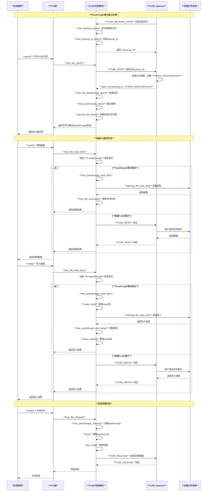
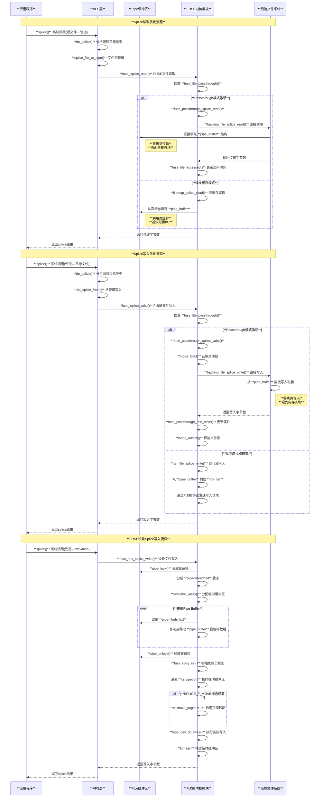

# Linux FUSE（Filesystem in Userspace）原理与实现分析

## 目录

1. [概述](#概述)
2. [核心架构](#核心架构)
3. [通信机制](#通信机制)
4. [核心数据结构](#核心数据结构)
5. [FUSE协议详解](#fuse协议详解)
6. [I/O处理模式](#io处理模式)
7. [请求处理流程](#请求处理流程)
8. [性能优化机制](#性能优化机制)
9. [扩展功能](#扩展功能)
10. [应用场景](#应用场景)
11. [优点与局限性](#优点与局限性)
12. [总结](#总结)

## 概述

FUSE（Filesystem in Userspace）是Linux内核的一个框架，允许非特权用户在用户空间实现文件系统。它由三个主要组件组成：内核模块（fuse.ko）、用户空间库（libfuse）和挂载工具（fusermount）。

### 核心特点

- **用户空间实现**：文件系统逻辑在普通用户进程中实现
- **安全非特权挂载**：普通用户可以挂载自己的文件系统
- **内核VFS集成**：完全集成到Linux VFS层
- **协议化通信**：通过标准化协议与内核通信
- **高度灵活**：支持各种特殊用途的文件系统

### 设计目标

1. **简化文件系统开发**：降低文件系统实现门槛
2. **提高系统安全性**：隔离文件系统故障影响
3. **支持快速原型**：便于文件系统概念验证
4. **增强可移植性**：减少对特定内核版本的依赖

## 核心架构

FUSE架构采用客户端-服务器模型，内核作为客户端，用户空间守护进程作为服务器。

### 系统组件

```c
// FUSE连接 - 核心管理结构
struct fuse_conn {
    struct kref count;              // 引用计数
    
    /** The user id for this mount */
    kuid_t user_id;                 // 挂载用户ID
    
    /** The group id for this mount */
    kgid_t group_id;                // 挂载组ID
    
    /** The pid namespace for this mount */
    struct pid_namespace *pid_ns;    // PID命名空间
    
    /** The user namespace for this mount */
    struct user_namespace *user_ns;  // 用户命名空间
    
    /** Maximum read size */
    unsigned max_read;               // 最大读取大小
    
    /** Maximum write size */
    unsigned max_write;              // 最大写入大小
    
    /** Input queue */
    struct fuse_iqueue iq;           // 输入队列
    
    /** The list of connections */
    struct list_head entry;         // 连接列表
    
    /** Device specific data */
    void *private_data;              // 设备特定数据
    
    /** Connected state */
    unsigned connected:1;            // 连接状态
    
    /** Connection established, cleared on umount, connection abort and device release */
    unsigned initialized:1;          // 初始化状态
    
    /** Reader killed */
    unsigned blocked:1;              // 阻塞状态
    
    /** Filesystem supports asynchronous read requests */
    unsigned async_read:1;           // 异步读支持
    
    /** Filesystem supports "remote" locking */
    unsigned posix_locks:1;          // POSIX锁支持
    
    /** Allow other than the mounter user to access the filesystem ? */
    unsigned allow_other:1;          // 允许其他用户访问
    
    /** Use default permissions */
    unsigned default_permissions:1;   // 使用默认权限
    
    /** Don't apply umask to file mode on create operations */
    unsigned dont_mask:1;            // 不应用umask
};

// FUSE挂载点
struct fuse_mount {
    struct fuse_conn *fc;            // FUSE连接
    struct super_block *sb;          // 超级块
    struct list_head fc_entry;       // 连接入口
    struct user_namespace *user_ns;  // 用户命名空间
    struct rcu_head rcu;             // RCU头
};

// FUSE inode扩展
struct fuse_inode {
    struct inode inode;              // 标准inode
    
    /** Unique ID, which identifies the inode between userspace and kernel */
    u64 nodeid;                      // 节点ID
    
    /** Number of lookups on this inode */
    u64 nlookup;                     // 查找计数
    
    /** The request used for sending the FORGET message */
    struct fuse_forget_link *forget; // 遗忘请求
    
    /** Time in jiffies until the file attributes are valid */
    u64 i_time;                      // 属性有效时间
    
    /* List of writepage requestst (pending or sent) */
    struct list_head writepages;     // 写页面列表
    
    /* List of sent writepage requests */
    struct list_head queued_writes;  // 队列写请求
    
    /* Number of sent writes, a negative bias (FUSE_NOWRITE) means more writes are blocked */
    int writectr;                    // 写计数器
    
    /* Waitq for writepage completion */
    wait_queue_head_t page_waitq;    // 页面等待队列
    
    /* List of writeback requestst (pending or sent) */
    struct rb_root writepages;       // 写回页面红黑树
    
    union {
        /* readdir cache (directory only) */
        struct {
            /* true if fully cached */
            bool cached;
            /* size of cache */
            loff_t size;
            /* position at end of cache (position of next entry) */
            loff_t pos;
            /* version of the cache */
            u64 version;
            /* modification time of directory when cache was started */
            struct timespec64 mtime;
            /* iversion of directory when cache was started */
            u64 iversion;
            /* protects above fields */
            spinlock_t lock;
        } rdc;                       // 读目录缓存
        
        /* cached writeback size (regular file only) */
        loff_t cached_size;          // 缓存写回大小
    };
    
    /** Miscellaneous bits describing inode state */
    unsigned long state;             // inode状态位
};
```

### 架构层次

1. **应用层**：用户应用程序执行文件操作
2. **VFS层**：Linux虚拟文件系统统一接口
3. **FUSE内核模块**：协议转换和请求管理
4. **设备通信层**：/dev/fuse字符设备
5. **用户空间守护进程**：实际文件系统实现
6. **底层存储**：实际数据存储（本地/网络/云端）

### FUSE整体架构图

```
**用户应用程序**
         │
         │ open(), read(), write(), stat()...
         ▼
**系统调用接口 (sys_open, sys_read, sys_write)**
         │
         │ VFS调用
         ▼
**VFS (虚拟文件系统)**
         │
         ├─ **fuse_super_operations** ──── 超级块操作
         ├─ **fuse_file_operations** ──── 文件操作
         ├─ **fuse_inode_operations** ──── inode操作
         └─ **fuse_dentry_operations** ──── 目录项操作
         │
         │ 请求生成和序列化
         ▼
**FUSE内核模块 (fuse.ko)**
         │
         ├─ **请求队列管理** ──── fuse_iqueue, fuse_pqueue
         ├─ **协议封装** ──── fuse_in_header, fuse_out_header
         ├─ **内存管理** ──── fuse_req, fuse_args
         └─ **连接管理** ──── fuse_conn状态维护
         │
         │ 通过字符设备通信
         ▼
**/dev/fuse字符设备**
         │
         ├─ **read()** ──── 用户空间读取请求
         ├─ **write()** ──── 用户空间写入响应
         ├─ **poll()** ──── 事件等待
         └─ **splice()** ──── 零拷贝传输
         │
         │ FUSE协议交互
         ▼
**libfuse用户空间库**
         │
         ├─ **协议解析** ──── 请求/响应处理
         ├─ **回调调度** ──── 操作分发到用户实现
         ├─ **会话管理** ──── fuse_session维护
         └─ **缓存管理** ──── 内核缓存控制
         │
         │ 用户实现的文件系统操作
         ▼
**用户空间文件系统守护进程**
         │
         ├─ **fuse_operations结构** ──── 文件系统操作实现
         │  ├─ getattr, setattr
         │  ├─ lookup, readdir
         │  ├─ open, read, write, release
         │  └─ mkdir, rmdir, unlink
         │
         └─ **后端存储访问**
            ├─ 本地文件系统
            ├─ 网络存储 (NFS, S3)
            ├─ 数据库存储
            └─ 自定义存储格式
```

### FUSE模块关系图

```
**FUSE核心模块架构**

**内核空间模块**
┌─────────────────────────────────────────────────────────┐
│                    **FUSE内核模块**                        │
│  ┌─────────────────┐  ┌─────────────────┐                │
│  │   **VFS接口**      │  │   **设备文件**     │                │
│  │                 │  │                 │                │
│  │ • Super Ops     │  │ • fuse_dev_ops  │                │
│  │ • File Ops      │  │ • Character Dev │                │
│  │ • Inode Ops     │  │ • /dev/fuse     │                │
│  │ • Dentry Ops    │  │                 │                │
│  └─────┬───────────┘  └─────────┬───────┘                │
│        │                        │                        │
│        └────────┬───────────────┘                        │
│                 │                                        │
│  ┌─────────────────────────────────────────────────────┐ │
│  │              **FUSE核心处理**                         │ │
│  │                                                     │ │
│  │ ┌─────────────┐  ┌─────────────┐  ┌─────────────┐   │ │
│  │ │ **请求管理**   │  │ **协议处理**   │  │ **连接管理**   │   │ │
│  │ │             │  │             │  │             │   │ │
│  │ │ • fuse_req  │  │ • 序列化     │  │ • fuse_conn │   │ │
│  │ │ • 队列管理   │  │ • 反序列化   │  │ • 状态维护   │   │ │
│  │ │ • 内存池     │  │ • 错误处理   │  │ • 权限检查   │   │ │
│  │ └─────────────┘  └─────────────┘  └─────────────┘   │ │
│  └─────────────────────────────────────────────────────┘ │
└─────────────────────────────────────────────────────────┘

**用户空间模块**
┌─────────────────────────────────────────────────────────┐
│                   **libfuse库**                          │
│  ┌─────────────────┐  ┌─────────────────┐                │
│  │  **会话管理**      │  │  **协议处理**      │                │
│  │                 │  │                 │                │
│  │ • fuse_session  │  │ • 消息解析       │                │
│  │ • 多线程管理     │  │ • 参数转换       │                │
│  │ • 事件循环       │  │ • 错误映射       │                │
│  └─────┬───────────┘  └─────────┬───────┘                │
│        │                        │                        │
│        └────────┬───────────────┘                        │
│                 │                                        │
│  ┌─────────────────────────────────────────────────────┐ │
│  │              **操作分发**                             │ │
│  │                                                     │ │
│  │ ┌─────────────┐  ┌─────────────┐  ┌─────────────┐   │ │
│  │ │**文件操作**    │  │**目录操作**    │  │**元数据操作** │   │ │
│  │ │             │  │             │  │             │   │ │
│  │ │ • read      │  │ • opendir   │  │ • getattr   │   │ │
│  │ │ • write     │  │ • readdir   │  │ • setattr   │   │ │
│  │ │ • flush     │  │ • releasedir│  │ • access    │   │ │
│  │ └─────────────┘  └─────────────┘  └─────────────┘   │ │
│  └─────────────────────────────────────────────────────┘ │
└─────────────────────────────────────────────────────────┘

**用户文件系统实现**
┌─────────────────────────────────────────────────────────┐
│              **用户文件系统守护进程**                        │
│  ┌─────────────────────────────────────────────────────┐ │
│  │              **fuse_operations**                    │ │
│  │                                                     │ │
│  │ • init() ────────── 文件系统初始化                   │ │
│  │ • destroy() ─────── 文件系统清理                     │ │
│  │ • lookup() ──────── 路径查找                         │ │
│  │ • getattr() ─────── 获取文件属性                     │ │
│  │ • open() ────────── 打开文件                         │ │
│  │ • read() ────────── 读取数据                         │ │
│  │ • write() ───────── 写入数据                         │ │
│  │ • readdir() ─────── 读取目录                         │ │
│  └─────────────────────────────────────────────────────┘ │
│                                │                        │
│                                ▼                        │
│  ┌─────────────────────────────────────────────────────┐ │
│  │              **后端存储适配器**                        │ │
│  │                                                     │ │
│  │ • 本地文件系统接口                                   │ │
│  │ • 网络协议实现 (HTTP, FTP, SSH)                      │ │
│  │ • 云存储API (S3, Azure, GCS)                        │ │
│  │ • 数据库接口 (SQL, NoSQL)                           │ │
│  │ • 加密/压缩算法                                      │ │
│  └─────────────────────────────────────────────────────┘ │
└─────────────────────────────────────────────────────────┘
```

### FUSE工作原理图

```
**FUSE请求处理原理流程**

**阶段1: 请求发起**
用户程序 → 系统调用 → VFS层 → FUSE VFS钩子

**阶段2: 请求转换**  
VFS操作 → FUSE请求结构 → 协议序列化 → 队列管理

**阶段3: 通信传递**
内核队列 → /dev/fuse设备 → 用户空间读取 → 协议解析

**阶段4: 用户处理**
libfuse分发 → 用户操作实现 → 后端存储访问 → 结果生成

**阶段5: 响应返回**
响应序列化 → /dev/fuse设备 → 内核队列 → 请求完成

**阶段6: 结果传递**
VFS层返回 → 系统调用完成 → 用户程序获得结果

┌─────────────────────────────────────────────────────────┐
│                **详细交互时序**                            │
│                                                         │
│ **用户程序**     **内核VFS**    **FUSE模块**    **用户FS** │
│     │              │             │            │        │
│     │──open()────→  │             │            │        │
│     │              │──fuse_open→  │            │        │
│     │              │             │──request─→ │        │
│     │              │             │            │←─impl──│
│     │              │             │←─response──│        │
│     │              │←────────────────────────────       │
│     │←─fd─────────  │                                   │
│                                                         │
│     │──read()────→  │                                   │
│     │              │──fuse_read→  │                     │
│     │              │             │──request─→ │        │
│     │              │             │            │←─data──│
│     │              │             │←─response──│        │
│     │              │←────────────────────────────       │
│     │←─data──────   │                                   │
│                                                         │
│     │──close()───→  │                                   │
│     │              │──fuse_reles→ │                     │
│     │              │             │──request─→ │        │
│     │              │             │            │←─ack───│
│     │              │             │←─response──│        │
│     │              │←────────────────────────────       │
│     │←─success───   │                                   │
└─────────────────────────────────────────────────────────┘
```

### FUSE完整时序图

```mermaid
sequenceDiagram
    participant **App** as **用户应用程序**
    participant **Libc** as **glibc库**
    participant **Kernel** as **内核VFS**
    participant **FuseMod** as **FUSE模块**
    participant **FuseDev** as **/dev/fuse设备**
    participant **LibFuse** as **libfuse库**
    participant **UserFS** as **用户文件系统**
    participant **Storage** as **后端存储**
    
    Note over **App**,**Storage**: **FUSE文件系统操作完整时序流程**
    
    rect rgb(240, 248, 255)
        Note over **App**,**Storage**: **文件系统挂载阶段**
    end
    
    **UserFS**->>**LibFuse**: **fuse_main()启动文件系统守护进程**
    activate **LibFuse**
    **LibFuse**->>**FuseDev**: **open("/dev/fuse", O_RDWR)**
    activate **FuseDev**
    **FuseDev**->>**FuseMod**: **fuse_dev_open()分配连接**
    activate **FuseMod**
    **FuseMod**->>**FuseMod**: **fuse_conn_init()初始化连接**
    Note right of **FuseMod**: **连接初始化：<br/>• 分配fuse_conn结构<br/>• 初始化请求队列<br/>• 设置协议版本**
    
    **FuseMod**-->>**FuseDev**: **连接建立完成**
    **FuseDev**-->>**LibFuse**: **返回文件描述符**
    deactivate **FuseDev**
    
    **LibFuse**->>**Kernel**: **mount()系统调用**
    activate **Kernel**
    **Kernel**->>**FuseMod**: **fuse_fill_super()初始化超级块**
    **FuseMod**->>**FuseMod**: **创建根inode和dentry**
    **FuseMod**-->>**Kernel**: **超级块初始化完成**
    **Kernel**-->>**LibFuse**: **挂载成功**
    deactivate **Kernel**
    
    **LibFuse**->>**LibFuse**: **启动事件循环fuse_session_loop()**
    Note right of **LibFuse**: **守护进程准备就绪：<br/>• 多线程工作者启动<br/>• 开始监听/dev/fuse<br/>• 等待内核请求**
    deactivate **FuseMod**
    
    rect rgb(255, 248, 220)
        Note over **App**,**Storage**: **文件打开操作**
    end
    
    **App**->>**Libc**: **open("/mnt/fuse/file.txt", O_RDONLY)**
    activate **Libc**
    **Libc**->>**Kernel**: **sys_open()系统调用**
    activate **Kernel**
    **Kernel**->>**Kernel**: **path_lookup()解析路径**
    
    **Kernel**->>**FuseMod**: **fuse_lookup()查找文件**
    activate **FuseMod**
    **FuseMod**->>**FuseMod**: **fuse_simple_request()创建LOOKUP请求**
    Note right of **FuseMod**: **请求构造：<br/>• 设置操作码FUSE_LOOKUP<br/>• 填充路径参数<br/>• 分配请求ID**
    
    **FuseMod**->>**FuseMod**: **fuse_request_send()加入请求队列**
    **FuseMod**->>**FuseDev**: **唤醒等待的用户空间读者**
    activate **FuseDev**
    
    **LibFuse**->>**FuseDev**: **read()读取请求**
    **FuseDev**->>**FuseDev**: **fuse_dev_do_read()处理读取**
    **FuseDev**->>**FuseMod**: **从输入队列获取请求**
    **FuseMod**-->>**FuseDev**: **返回序列化的请求数据**
    **FuseDev**-->>**LibFuse**: **LOOKUP请求数据**
    deactivate **FuseDev**
    
    **LibFuse**->>**LibFuse**: **fuse_session_process_buf()解析请求**
    **LibFuse**->>**UserFS**: **调用用户实现的lookup()方法**
    activate **UserFS**
    **UserFS**->>**Storage**: **查询文件信息**
    activate **Storage**
    **Storage**-->>**UserFS**: **返回文件属性**
    deactivate **Storage**
    **UserFS**-->>**LibFuse**: **返回查找结果**
    deactivate **UserFS**
    
    **LibFuse**->>**LibFuse**: **fuse_reply_entry()构造响应**
    **LibFuse**->>**FuseDev**: **write()写入响应**
    activate **FuseDev**
    **FuseDev**->>**FuseDev**: **fuse_dev_do_write()处理写入**
    **FuseDev**->>**FuseMod**: **find_and_complete_request()完成请求**
    **FuseMod**->>**FuseMod**: **唤醒等待的内核线程**
    **FuseMod**-->>**Kernel**: **LOOKUP操作完成，返回inode**
    deactivate **FuseDev**
    deactivate **FuseMod**
    
    **Kernel**->>**FuseMod**: **fuse_file_open()打开文件**
    activate **FuseMod**
    **FuseMod**->>**FuseMod**: **构造OPEN请求**
    Note right of **FuseMod**: **OPEN请求：<br/>• 设置文件inode<br/>• 指定打开标志<br/>• 分配文件句柄**
    
    **FuseMod**->>**FuseDev**: **发送请求到用户空间**
    activate **FuseDev**
    **LibFuse**->>**FuseDev**: **读取OPEN请求**
    **FuseDev**-->>**LibFuse**: **请求数据**
    deactivate **FuseDev**
    
    **LibFuse**->>**UserFS**: **调用用户实现的open()方法**
    activate **UserFS**
    **UserFS**->>**Storage**: **打开底层文件**
    activate **Storage**
    **Storage**-->>**UserFS**: **文件句柄**
    deactivate **Storage**
    **UserFS**-->>**LibFuse**: **成功，返回文件信息**
    deactivate **UserFS**
    
    **LibFuse**->>**FuseDev**: **写入OPEN响应**
    activate **FuseDev**
    **FuseDev**->>**FuseMod**: **完成OPEN请求**
    **FuseMod**->>**FuseMod**: **分配struct fuse_file**
    **FuseMod**-->>**Kernel**: **打开成功**
    deactivate **FuseDev**
    deactivate **FuseMod**
    
    **Kernel**->>**Kernel**: **分配struct file对象**
    **Kernel**-->>**Libc**: **返回文件描述符**
    deactivate **Kernel**
    **Libc**-->>**App**: **返回fd**
    deactivate **Libc**
    
    rect rgb(248, 255, 248)
        Note over **App**,**Storage**: **文件读取操作**
    end
    
    **App**->>**Libc**: **read(fd, buffer, 4096)**
    activate **Libc**
    **Libc**->>**Kernel**: **sys_read()系统调用**
    activate **Kernel**
    **Kernel**->>**FuseMod**: **fuse_file_read_iter()处理读取**
    activate **FuseMod**
    
    **FuseMod**->>**FuseMod**: **检查是否有缓存数据**
    alt **缓存命中**
        **FuseMod**->>**FuseMod**: **从页面缓存返回数据**
        **FuseMod**-->>**Kernel**: **直接返回缓存数据**
    else **缓存未命中**
        **FuseMod**->>**FuseMod**: **构造READ请求**
        Note right of **FuseMod**: **READ请求：<br/>• 指定读取偏移<br/>• 设置读取长度<br/>• 传递文件句柄**
        
        **FuseMod**->>**FuseDev**: **发送读取请求**
        activate **FuseDev**
        **LibFuse**->>**FuseDev**: **读取READ请求**
        **FuseDev**-->>**LibFuse**: **请求数据和缓冲区**
        deactivate **FuseDev**
        
        **LibFuse**->>**UserFS**: **调用用户实现的read()方法**
        activate **UserFS**
        **UserFS**->>**Storage**: **从底层存储读取数据**
        activate **Storage**
        **Storage**-->>**UserFS**: **返回文件内容**
        deactivate **Storage**
        **UserFS**-->>**LibFuse**: **返回读取的数据**
        deactivate **UserFS**
        
        **LibFuse**->>**FuseDev**: **写入READ响应和数据**
        activate **FuseDev**
        **FuseDev**->>**FuseMod**: **完成读取请求**
        **FuseMod**->>**FuseMod**: **更新页面缓存**
        **FuseMod**-->>**Kernel**: **返回读取的数据**
        deactivate **FuseDev**
    end
    deactivate **FuseMod**
    
    **Kernel**-->>**Libc**: **返回读取字节数**
    deactivate **Kernel**
    **Libc**-->>**App**: **数据和字节数**
    deactivate **Libc**
    
    rect rgb(255, 255, 240)
        Note over **App**,**Storage**: **文件关闭操作**
    end
    
    **App**->>**Libc**: **close(fd)**
    activate **Libc**
    **Libc**->>**Kernel**: **sys_close()系统调用**
    activate **Kernel**
    **Kernel**->>**FuseMod**: **fuse_file_release()释放文件**
    activate **FuseMod**
    
    **FuseMod**->>**FuseMod**: **构造RELEASE请求**
    **FuseMod**->>**FuseDev**: **发送释放请求**
    activate **FuseDev**
    **LibFuse**->>**FuseDev**: **读取RELEASE请求**
    **FuseDev**-->>**LibFuse**: **请求数据**
    deactivate **FuseDev**
    
    **LibFuse**->>**UserFS**: **调用用户实现的release()方法**
    activate **UserFS**
    **UserFS**->>**Storage**: **关闭底层文件**
    activate **Storage**
    **Storage**-->>**UserFS**: **关闭完成**
    deactivate **Storage**
    **UserFS**-->>**LibFuse**: **释放成功**
    deactivate **UserFS**
    
    **LibFuse**->>**FuseDev**: **写入RELEASE响应**
    activate **FuseDev**
    **FuseDev**->>**FuseMod**: **完成释放请求**
    **FuseMod**->>**FuseMod**: **清理fuse_file结构**
    **FuseMod**-->>**Kernel**: **文件释放完成**
    deactivate **FuseDev**
    deactivate **FuseMod**
    
    **Kernel**->>**Kernel**: **释放struct file对象**
    **Kernel**-->>**Libc**: **关闭成功**
    deactivate **Kernel**
    **Libc**-->>**App**: **返回0**
    deactivate **Libc**
    
    rect rgb(240, 255, 240)
        Note over **App**,**Storage**: **错误处理示例**
    end
    
    **App**->>**Libc**: **access("/mnt/fuse/nonexist", R_OK)**
    activate **Libc**
    **Libc**->>**Kernel**: **sys_access()系统调用**
    activate **Kernel**
    **Kernel**->>**FuseMod**: **fuse_access()权限检查**
    activate **FuseMod**
    **FuseMod**->>**FuseDev**: **发送ACCESS请求**
    activate **FuseDev**
    **LibFuse**->>**FuseDev**: **读取ACCESS请求**
    **FuseDev**-->>**LibFuse**: **请求数据**
    deactivate **FuseDev**
    
    **LibFuse**->>**UserFS**: **调用用户实现的access()方法**
    activate **UserFS**
    **UserFS**->>**Storage**: **检查文件是否存在**
    activate **Storage**
    **Storage**-->>**UserFS**: **文件不存在**
    deactivate **Storage**
    **UserFS**-->>**LibFuse**: **返回-ENOENT错误**
    deactivate **UserFS**
    
    **LibFuse**->>**FuseDev**: **写入ERROR响应**
    activate **FuseDev**
    **FuseDev**->>**FuseMod**: **完成请求并传递错误**
    **FuseMod**-->>**Kernel**: **返回-ENOENT错误**
    deactivate **FuseDev**
    deactivate **FuseMod**
    
    **Kernel**-->>**Libc**: **返回-ENOENT**
    deactivate **Kernel**
    **Libc**-->>**App**: **设置errno=ENOENT, 返回-1**
    deactivate **Libc**
    
    Note over **App**,**Storage**: **FUSE提供了完整的用户空间<br/>文件系统实现框架，<br/>通过协议化通信实现高效交互**
```



## 通信机制

FUSE通过/dev/fuse字符设备实现内核与用户空间的通信。

### /dev/fuse设备

```c
// FUSE设备操作
const struct file_operations fuse_dev_operations = {
    .owner      = THIS_MODULE,
    .open       = fuse_dev_open,
    .read_iter  = fuse_dev_read,
    .splice_read = fuse_dev_splice_read,
    .write_iter = fuse_dev_write,
    .splice_write = fuse_dev_splice_write,
    .poll       = fuse_dev_poll,
    .release    = fuse_dev_release,
    .fasync     = fuse_dev_fasync,
    .unlocked_ioctl = fuse_dev_ioctl,
    .compat_ioctl = compat_ptr_ioctl,
};

// FUSE杂项设备注册
static struct miscdevice fuse_miscdevice = {
    .minor = FUSE_MINOR,
    .name  = "fuse",
    .fops  = &fuse_dev_operations,
};

// 设备读取操作
static ssize_t fuse_dev_do_read(struct fuse_dev *fud, struct file *file,
                                struct fuse_copy_state *cs, size_t nbytes)
{
    ssize_t err;
    struct fuse_conn *fc = fud->fc;
    struct fuse_iqueue *fiq = &fc->iq;
    struct fuse_pqueue *fpq = &fud->pq;
    struct fuse_req *req;
    struct fuse_args *args;
    unsigned reqsize;
    unsigned int hash;
    
    /*
     * 要求合理的最小读缓冲区 - 必须有固定部分的容量
     * 任何请求头 + 协商的max_write数据空间
     */
    if (nbytes < max_t(size_t, FUSE_MIN_READ_BUFFER,
                      sizeof(struct fuse_in_header) +
                      sizeof(struct fuse_write_in) +
                      fc->max_write))
        return -EINVAL;
        
restart:
    for (;;) {
        spin_lock(&fiq->lock);
        if (!fiq->connected || request_pending(fiq))
            break;
        spin_unlock(&fiq->lock);
        
        if (file->f_flags & O_NONBLOCK)
            return -EAGAIN;
        err = wait_event_interruptible_exclusive(fiq->waitq,
                !fiq->connected || request_pending(fiq));
        if (err)
            return err;
    }
    
    if (!fiq->connected) {
        err = fc->aborted ? -ECONNABORTED : -ENODEV;
        goto err_unlock;
    }
    
    if (!list_empty(&fiq->interrupts)) {
        req = list_entry(fiq->interrupts.next, struct fuse_req,
                         intr_entry);
        return fuse_read_interrupt(fiq, cs, nbytes, req);
    }
    
    if (forget_pending(fiq)) {
        if (list_empty(&fiq->pending) || fiq->forget_batch-- > 0)
            return fuse_read_forget(fc, fiq, cs, nbytes);
            
        if (fiq->forget_batch <= -8)
            fiq->forget_batch = 16;
    }
    
    req = list_entry(fiq->pending.next, struct fuse_req, list);
    clear_bit(FR_PENDING, &req->flags);
    list_del_init(&req->list);
    spin_unlock(&fiq->lock);
    
    args = req->args;
    reqsize = req->in.h.len;
    
    /* 如果请求太大，用错误回复并重新开始读取 */
    if (reqsize > nbytes) {
        fuse_request_end(req);
        goto restart;
    }
    
    hash = fuse_req_hash(req->in.h.unique);
    spin_lock(&fpq->lock);
    list_add(&req->list, &fpq->processing[hash]);
    spin_unlock(&fpq->lock);
    set_bit(FR_SENT, &req->flags);
    
    /* 将请求数据复制到用户缓冲区 */
    err = fuse_copy_args(cs, args->in_numargs, args->in_pages,
                        (struct fuse_arg *) args->in_args,
                        args->page_zeroing);
    
    return err < 0 ? err : reqsize;
    
err_unlock:
    spin_unlock(&fiq->lock);
    return err;
}
```

### 请求队列管理

```c
// FUSE输入队列
struct fuse_iqueue {
    /** Connection established */
    unsigned connected;
    
    /** Lock protecting accesses to members of this structure */
    spinlock_t lock;
    
    /** Readers of the connection are waiting on this */
    wait_queue_head_t waitq;
    
    /** The list of pending requests */
    struct list_head pending;
    
    /** The list of requests being processed */
    struct list_head interrupts;
    
    /** Queue of forget requests */
    struct fuse_forget_link forget_list_head;
    struct fuse_forget_link *forget_list_tail;
    int forget_batch;
    
    /** O_ASYNC requests */
    struct fasync_struct *fasync;
};

// FUSE处理队列
struct fuse_pqueue {
    /** Connection established */
    unsigned connected;
    
    /** Lock protecting accessess to  members of this structure */
    spinlock_t lock;
    
    /** Hash table of requests being processed */
    struct list_head processing[FUSE_PQ_HASH_SIZE];
};

// 请求排队到输入队列
static void queue_request_and_unlock(struct fuse_iqueue *fiq,
                                    struct fuse_req *req)
{
    req->in.h.len = sizeof(struct fuse_in_header) +
                   fuse_len_args(req->args->in_numargs,
                                (struct fuse_arg *) req->args->in_args);
    list_add_tail(&req->list, &fiq->pending);
    fiq->ops->wake_pending_and_unlock(fiq);
}
```

## 核心数据结构

### FUSE请求结构

```c
// FUSE请求控制块
struct fuse_req {
    /** This can be on either pending processing or io lists in fuse_conn */
    struct list_head list;
    
    /** Entry on the interrupts list  */
    struct list_head intr_entry;
    
    /* Request completion callback */
    void (*end)(struct fuse_req *);
    
    /** refcount */
    refcount_t count;
    
    /* Request flags, see FR_* */
    unsigned long flags;
    
    /* The request input header */
    struct {
        struct fuse_in_header h;
    } in;
    
    /* The request output header */
    struct {
        struct fuse_out_header h;
        
        /*
         * The following bitfields are not changed during the request processing
         */
        unsigned page_zeroing:1;
        unsigned page_replace:1;
        unsigned may_block:1;
        unsigned stream:1;
    } out;
    
    /** Arguments */
    struct fuse_args *args;
    
    /** fuse_mount this request belongs to */
    struct fuse_mount *fm;
};

// FUSE参数结构
struct fuse_args {
    uint64_t nodeid;
    uint32_t opcode;
    uint8_t in_numargs;
    uint8_t out_numargs;
    uint8_t ext_idx;
    bool force:1;
    bool noreply:1;
    bool nocreds:1;
    bool in_pages:1;
    bool out_pages:1;
    bool user_pages:1;
    bool out_argvar:1;
    bool page_zeroing:1;
    bool page_replace:1;
    bool may_block:1;
    bool is_ext:1;
    bool is_pinned:1;
    struct fuse_in_arg in_args[3];
    struct fuse_arg out_args[2];
    void (*end)(struct fuse_mount *fm, struct fuse_args *args, int error);
};

// FUSE文件结构
struct fuse_file {
    /** Fuse connection for this file */
    struct fuse_mount *fm;
    
    /* Argument space reserved for open/release */
    union fuse_file_args *args;
    
    /** Kernel file handle guaranteed to be unique */
    u64 kh;
    
    /** File handle used by userspace */
    u64 fh;
    
    /** Node id of this file */
    u64 nodeid;
    
    /** Refcount */
    refcount_t count;
    
    /** FOPEN_* flags returned by open */
    u32 open_flags;
    
    /** Entry on inode's write_files list */
    struct list_head write_entry;
    
    /* Readdir related */
    struct {
        /* Dir stream position */
        loff_t pos;
        
        /* Offset in cache */
        loff_t cache_off;
        
        /* Version of cache we are reading */
        u64 version;
    } readdir;
    
    /** RB node to be linked on fuse_conn->polled_files */
    struct rb_node polled_node;
    
    /** Wait queue head for poll */
    wait_queue_head_t poll_wait;
    
    /** Does file hold a fi->iocachectr refcount? */
    enum { IOM_NONE, IOM_CACHED, IOM_UNCACHED } iomode;
    
#ifdef CONFIG_FUSE_PASSTHROUGH
    /** Reference to backing file in passthrough mode */
    struct file *passthrough;
    const struct cred *cred;
#endif
    
    /** Has flock been performed on this file? */
    bool flock:1;
};
```

## FUSE协议详解

FUSE使用标准化的协议格式进行内核与用户空间的通信。

### 协议版本管理

```c
/** Version number of this interface */
#define FUSE_KERNEL_VERSION 7

/** Minor version number of this interface */
#define FUSE_KERNEL_MINOR_VERSION 41

/** The node ID of the root inode */
#define FUSE_ROOT_ID 1

// 协议版本协商
/*
 * 版本协商：
 *
 * 内核和用户空间都在INIT请求和回复中发送它们支持的版本。
 *
 * 如果主版本匹配，则双方都应使用两个次版本中较小的一个进行通信。
 *
 * 如果内核支持更大的主版本，则用户空间应该用它支持的主版本回复，
 * 忽略INIT消息的其余部分，并期望来自内核的具有匹配主版本的新INIT消息。
 */
```

### 请求消息格式

```c
// FUSE输入头部
struct fuse_in_header {
    uint32_t    len;        // 消息总长度
    uint32_t    opcode;     // 操作码
    uint64_t    unique;     // 唯一请求ID
    uint64_t    nodeid;     // 节点ID
    uint32_t    uid;        // 用户ID
    uint32_t    gid;        // 组ID
    uint32_t    pid;        // 进程ID
    uint16_t    total_extlen; // 扩展长度
    uint16_t    padding;    // 填充
};

// FUSE输出头部
struct fuse_out_header {
    uint32_t    len;        // 消息总长度
    int32_t     error;      // 错误码
    uint64_t    unique;     // 对应请求的唯一ID
};

// 操作码枚举
enum fuse_opcode {
    FUSE_LOOKUP     = 1,
    FUSE_FORGET     = 2,   /* no reply */
    FUSE_GETATTR    = 3,
    FUSE_SETATTR    = 4,
    FUSE_READLINK   = 5,
    FUSE_SYMLINK    = 6,
    FUSE_MKNOD      = 8,
    FUSE_MKDIR      = 9,
    FUSE_UNLINK     = 10,
    FUSE_RMDIR      = 11,
    FUSE_RENAME     = 12,
    FUSE_LINK       = 13,
    FUSE_OPEN       = 14,
    FUSE_READ       = 15,
    FUSE_WRITE      = 16,
    FUSE_STATFS     = 17,
    FUSE_RELEASE    = 18,
    FUSE_FSYNC      = 20,
    FUSE_SETXATTR   = 21,
    FUSE_GETXATTR   = 22,
    FUSE_LISTXATTR  = 23,
    FUSE_REMOVEXATTR = 24,
    FUSE_FLUSH      = 25,
    FUSE_INIT       = 26,
    FUSE_OPENDIR    = 27,
    FUSE_READDIR    = 28,
    FUSE_RELEASEDIR = 29,
    FUSE_FSYNCDIR   = 30,
    FUSE_GETLK      = 31,
    FUSE_SETLK      = 32,
    FUSE_SETLKW     = 33,
    FUSE_ACCESS     = 34,
    FUSE_CREATE     = 35,
    FUSE_INTERRUPT  = 36,
    FUSE_BMAP       = 37,
    FUSE_DESTROY    = 38,
    FUSE_IOCTL      = 39,
    FUSE_POLL       = 40,
    FUSE_NOTIFY_REPLY = 41,
    FUSE_BATCH_FORGET = 42,
    FUSE_FALLOCATE  = 43,
    FUSE_READDIRPLUS = 44,
    FUSE_RENAME2    = 45,
    FUSE_LSEEK      = 46,
    FUSE_COPY_FILE_RANGE = 47,
    FUSE_SETUPMAPPING = 48,
    FUSE_REMOVEMAPPING = 49,
    FUSE_SYNCFS     = 50,
    FUSE_TMPFILE    = 51,
    FUSE_STATX      = 52,
    
    /* CUSE specific operations */
    CUSE_INIT       = 4096,
};
```

### 协议初始化

```c
// FUSE初始化请求
struct fuse_init_in {
    uint32_t    major;      // 主版本号
    uint32_t    minor;      // 次版本号
    uint32_t    max_readahead; // 最大预读
    uint32_t    flags;      // 标志位
    uint32_t    flags2;     // 扩展标志位
    uint32_t    unused[11]; // 保留字段
};

// FUSE初始化回复
struct fuse_init_out {
    uint32_t    major;      // 主版本号
    uint32_t    minor;      // 次版本号  
    uint32_t    max_readahead; // 最大预读
    uint32_t    flags;      // 标志位
    uint16_t    max_background; // 最大后台请求
    uint16_t    congestion_threshold; // 拥塞阈值
    uint32_t    max_write;  // 最大写入
    uint32_t    time_gran;  // 时间粒度
    uint16_t    max_pages;  // 最大页数
    uint16_t    map_alignment; // 映射对齐
    uint32_t    flags2;     // 扩展标志位
    uint32_t    max_stack_depth; // 最大栈深度
    uint32_t    unused[6];  // 保留字段
};

// 初始化处理
static void fuse_send_init(struct fuse_mount *fm)
{
    struct fuse_init_args *ia;
    
    ia = kzalloc(sizeof(*ia), GFP_KERNEL | __GFP_NOFAIL);
    
    ia->in.major = FUSE_KERNEL_VERSION;
    ia->in.minor = FUSE_KERNEL_MINOR_VERSION;
    ia->in.max_readahead = fm->sb->s_bdi->ra_pages * PAGE_SIZE;
    ia->in.flags |= FUSE_ASYNC_READ | FUSE_POSIX_LOCKS | FUSE_ATOMIC_O_TRUNC |
                    FUSE_EXPORT_SUPPORT | FUSE_BIG_WRITES | FUSE_DONT_MASK |
                    FUSE_SPLICE_WRITE | FUSE_SPLICE_MOVE | FUSE_SPLICE_READ |
                    FUSE_FLOCK_LOCKS | FUSE_HAS_IOCTL_DIR | FUSE_AUTO_INVAL_DATA |
                    FUSE_DO_READDIRPLUS | FUSE_READDIRPLUS_AUTO | FUSE_ASYNC_DIO |
                    FUSE_WRITEBACK_CACHE | FUSE_NO_OPEN_SUPPORT |
                    FUSE_PARALLEL_DIROPS | FUSE_HANDLE_KILLPRIV | FUSE_POSIX_ACL |
                    FUSE_ABORT_ERROR | FUSE_MAX_PAGES | FUSE_CACHE_SYMLINKS |
                    FUSE_NO_OPENDIR_SUPPORT | FUSE_EXPLICIT_INVAL_DATA |
                    FUSE_MAP_ALIGNMENT;
    
    if (fm->fc->dax)
        ia->in.flags |= FUSE_MAP_ALIGNMENT;
    
    if (kernel_supports_dax_mode(fm->fc->dax_mode))
        ia->in.flags |= FUSE_HAS_INODE_DAX;
    
    ia->args.opcode = FUSE_INIT;
    ia->args.in_numargs = 1;
    ia->args.in_args[0].size = sizeof(ia->in);
    ia->args.in_args[0].value = &ia->in;
    ia->args.out_numargs = 1;
    /* Variable length argument used for backward compatibility */
    ia->args.out_argvar = true;
    ia->args.out_args[0].size = sizeof(ia->out);
    ia->args.out_args[0].value = &ia->out;
    ia->args.force = true;
    ia->args.nocreds = true;
    ia->args.end = process_init_reply;
    
    if (fuse_simple_background(fm, &ia->args, GFP_KERNEL) != 0)
        process_init_reply(fm, &ia->args, -ENOTCONN);
}
```

## I/O处理模式

FUSE支持多种I/O处理模式，以适应不同的性能和一致性需求。

### Direct I/O模式

```c
// Direct I/O模式标志
#define FOPEN_DIRECT_IO         (1 << 0)

static ssize_t fuse_direct_read_iter(struct kiocb *iocb, struct iov_iter *to)
{
    ssize_t res;
    
    if (!is_sync_kiocb(iocb) && iocb->ki_flags & IOCB_DIRECT) {
        res = fuse_direct_async_io(iocb, to, false);
    } else {
        struct fuse_io_priv io = FUSE_IO_PRIV_SYNC(iocb);
        res = fuse_direct_io(&io, to, &iocb->ki_pos, FUSE_DIO_READ);
    }
    
    fuse_invalidate_atime(file_inode(iocb->ki_filp));
    return res;
}

// Direct I/O实现
static ssize_t fuse_direct_io(struct fuse_io_priv *io,
                             struct iov_iter *iter,
                             loff_t *ppos, int flags)
{
    int write = flags & FUSE_DIO_WRITE;
    int cuse = flags & FUSE_DIO_CUSE;
    struct file *file = io->iocb->ki_filp;
    struct inode *inode = file->f_mapping->host;
    struct fuse_file *ff = file->private_data;
    struct fuse_conn *fc = ff->fm->fc;
    size_t nmax = write ? fc->max_write : fc->max_read;
    loff_t pos = *ppos;
    size_t count = iov_iter_count(iter);
    pgoff_t idx_from = pos >> PAGE_SHIFT;
    pgoff_t idx_to = (pos + count - 1) >> PAGE_SHIFT;
    ssize_t res = 0;
    int err = 0;
    struct fuse_io_args *ia;
    unsigned int max_pages;
    
    max_pages = FUSE_DEFAULT_MAX_PAGES_PER_REQ;
    ia = fuse_io_alloc(io, max_pages);
    if (!ia)
        return -ENOMEM;
    
    if (!cuse && fuse_range_is_writeback(inode, idx_from, idx_to)) {
        if (!write)
            inode_lock(inode);
        fuse_sync_writes(inode);
        if (!write)
            inode_unlock(inode);
    }
    
    io->should_dirty = !write && iter_is_iovec(iter);
    while (count) {
        ssize_t nres;
        fl_owner_t owner = current->files;
        size_t nbytes = min(count, nmax);
        
        err = fuse_get_user_pages(&ia->ap, iter, &nbytes, write, max_pages);
        if (err && !nbytes)
            break;
            
        if (write) {
            if (!capable(CAP_FSETID))
                ia->write.in.write_flags |= FUSE_WRITE_KILL_SUIDGID;
                
            nres = fuse_send_write(ia, pos, nbytes, owner);
        } else {
            nres = fuse_send_read(ia, pos, nbytes, owner);
        }
        
        if (!ia->ap.pages)
            fuse_io_free(ia);
        ia = NULL;
        
        if (nres < 0) {
            iov_iter_revert(iter, nbytes);
            err = nres;
            break;
        }
        WARN_ON(nres > nbytes);
        
        count -= nres;
        res += nres;
        pos += nres;
        if (nres != nbytes) {
            iov_iter_revert(iter, nbytes - nres);
            break;
        }
        if (count) {
            max_pages = FUSE_DEFAULT_MAX_PAGES_PER_REQ;
            ia = fuse_io_alloc(io, max_pages);
            if (!ia)
                break;
        }
    }
    if (ia)
        fuse_io_free(ia);
    if (res > 0)
        *ppos = pos;
        
    return res > 0 ? res : err;
}
```

### Cached模式

```c
// 缓存读取实现
static int fuse_read_folio(struct file *file, struct folio *folio)
{
    struct page *page = &folio->page;
    struct inode *inode = page->mapping->host;
    int err;
    
    err = -EIO;
    if (fuse_is_bad(inode))
        goto out;
        
    err = fuse_do_readpage(file, page);
    fuse_invalidate_atime(inode);
 out:
    unlock_page(page);
    return err;
}

static int fuse_do_readpage(struct file *file, struct page *page)
{
    struct inode *inode = page->mapping->host;
    struct fuse_mount *fm = get_fuse_mount(inode);
    loff_t pos = page_offset(page);
    struct fuse_page_desc desc = { .length = PAGE_SIZE };
    struct fuse_io_args ia = {
        .ap.args.page_zeroing = true,
        .ap.args.out_pages = true,
        .ap.num_pages = 1,
        .ap.pages = &page,
        .ap.descs = &desc,
    };
    ssize_t res;
    u64 attr_ver;
    
    /*
     * Page writeback can extend beyond the lifetime of the
     * page-cache page, so make sure we read a properly synced
     * page.
     */
    fuse_wait_on_page_writeback(inode, page->index);
    
    attr_ver = fuse_get_attr_version(fm->fc);
    
    /* Don't overwrite dirty data in the page */
    desc.offset = 0;
    desc.length = PAGE_SIZE;
    res = fuse_simple_request(fm, &ia.ap.args);
    if (res < 0)
        return res;
        
    /*
     * Short read means EOF.  If file size is larger, truncate it
     */
    if (res < PAGE_SIZE)
        fuse_short_read(inode, attr_ver, res, pos);
        
    SetPageUptodate(page);
    
    return 0;
}
```

### Writeback Cache模式

```c
// 写回缓存标志
#define FUSE_WRITEBACK_CACHE    (1 << 16)

// 写回页面处理
static int fuse_writepages_fill(struct page *page,
                               struct writeback_control *wbc, void *data)
{
    struct fuse_fill_wb_data *wdata = data;
    struct fuse_req *req = wdata->req;
    struct inode *inode = wdata->inode;
    struct fuse_inode *fi = get_fuse_inode(inode);
    
    if (!req) {
        /* Allocate a new writeback request */
        req = fuse_request_alloc_nofs(FUSE_DEFAULT_MAX_PAGES_PER_REQ);
        if (!req) {
            __fuse_mark_inode_dirty(inode);
            redirty_page_for_writepage(wbc, page);
            unlock_page(page);
            return -ENOMEM;
        }
        
        fuse_write_args_fill(&req->args, wdata->ff, page_offset(page), 0);
        req->args.in.write.write_flags |= FUSE_WRITE_CACHE;
        if (wbc->sync_mode == WB_SYNC_ALL)
            req->args.in.write.write_flags |= FUSE_WRITE_LOCKOWNER;
        req->args.in.write.lock_owner = fuse_lock_owner_id(wdata->ff->fm->fc,
                                                           (fl_owner_t) wdata->ff);
        req->end = fuse_writepage_end;
        req->inode = inode;
        
        inc_wb_stat(&inode_to_bdi(inode)->wb, WB_WRITEBACK);
        inc_node_page_state(page, NR_WRITEBACK_TEMP);
        
        spin_lock(&fi->lock);
        list_add(&req->writepages_entry, &fi->writepages);
        spin_unlock(&fi->lock);
        
        wdata->req = req;
    }
    
    if (req->num_pages &&
        (req->num_pages == FUSE_DEFAULT_MAX_PAGES_PER_REQ ||
         (req->num_pages + 1) * PAGE_SIZE > wdata->ff->fm->fc->max_write ||
         req->pages[req->num_pages - 1]->index + 1 != page->index)) {
        fuse_writepages_send(wdata);
        return WRITEPAGE_ACTIVATE;
    }
    
    err = fuse_writepage_locked(page);
    unlock_page(page);
    
    return err;
}
```

## 请求处理流程

FUSE请求处理遵循标准的生命周期管理。

### 请求分配与初始化

```c
// 请求分配
static struct fuse_req *fuse_request_alloc(struct fuse_mount *fm, gfp_t flags)
{
    struct fuse_req *req = kmem_cache_zalloc(fuse_req_cachep, flags);
    if (req)
        fuse_request_init(fm, req);
        
    return req;
}

static void fuse_request_init(struct fuse_mount *fm, struct fuse_req *req)
{
    INIT_LIST_HEAD(&req->list);
    INIT_LIST_HEAD(&req->intr_entry);
    init_waitqueue_head(&req->waitq);
    refcount_set(&req->count, 1);
    __set_bit(FR_PENDING, &req->flags);
    req->fm = fm;
}

// 请求发送
int fuse_simple_request(struct fuse_mount *fm, struct fuse_args *args)
{
    struct fuse_conn *fc = fm->fc;
    struct fuse_req *req;
    int ret;
    
    if (args->force) {
        atomic_inc(&fc->num_waiting);
        req = fuse_request_alloc(fm, GFP_KERNEL | __GFP_NOFAIL);
        
        if (!args->nocreds)
            fuse_force_creds(req);
    } else {
        ret = -ENOTCONN;
        if (!fc->connected)
            goto out;
            
        req = fuse_get_req(fm, false);
        if (IS_ERR(req)) {
            ret = PTR_ERR(req);
            goto out;
        }
    }
    
    /* 设置请求参数 */
    req->in.h.opcode = args->opcode;
    req->in.h.nodeid = args->nodeid;
    req->args = args;
    
    if (args->end)
        req->end = args->end;
    else
        req->end = fuse_simple_end;
        
    /* 发送请求并等待 */
    __fuse_request_send(req);
    ret = req->out.h.error;
    
    fuse_put_request(req);
 out:
    return ret;
}
```

### 请求队列处理

```c
// 请求入队
void fuse_queue_request(struct fuse_iqueue *fiq, struct fuse_req *req)
{
    spin_lock(&fiq->lock);
    if (fiq->connected) {
        queue_request_and_unlock(fiq, req);
    } else {
        req->out.h.error = -ENOTCONN;
        spin_unlock(&fiq->lock);
        fuse_request_end(req);
    }
}

static void queue_request_and_unlock(struct fuse_iqueue *fiq,
                                    struct fuse_req *req)
{
    req->in.h.len = sizeof(struct fuse_in_header) +
                   fuse_len_args(req->args->in_numargs,
                                (struct fuse_arg *) req->args->in_args);
    list_add_tail(&req->list, &fiq->pending);
    fiq->ops->wake_pending_and_unlock(fiq);
}

// 唤醒等待的读取者
static void fuse_dev_wake_and_unlock(struct fuse_iqueue *fiq)
{
    wake_up(&fiq->waitq);
    kill_fasync(&fiq->fasync, SIGIO, POLL_IN);
    spin_unlock(&fiq->lock);
}
```

### 请求完成处理

```c
// 请求完成
static void fuse_request_end(struct fuse_req *req)
{
    struct fuse_mount *fm = req->fm;
    struct fuse_conn *fc = fm->fc;
    struct fuse_iqueue *fiq = &fc->iq;
    
    if (test_and_set_bit(FR_FINISHED, &req->flags))
        goto put_request;
        
    /*
     * test_and_set_bit() implies smp_mb() between bit
     * changing and below intr_entry check. Pairs with
     * smp_mb() from queue_interrupt().
     */
    if (!list_empty(&req->intr_entry)) {
        spin_lock(&fiq->lock);
        list_del_init(&req->intr_entry);
        spin_unlock(&fiq->lock);
    }
    WARN_ON(test_bit(FR_PENDING, &req->flags));
    WARN_ON(test_bit(FR_SENT, &req->flags));
    if (test_bit(FR_BACKGROUND, &req->flags)) {
        spin_lock(&fc->bg_lock);
        clear_bit(FR_BACKGROUND, &req->flags);
        if (fc->num_background == fc->max_background) {
            fc->blocked = 0;
            wake_up(&fc->blocked_waitq);
        } else if (!fc->blocked) {
            /*
             * Wake up next waiter, if any.  It's okay to use
             * waitqueue_active(), as we've already synced up
             * fc->blocked with waiters with the wake_up() call
             * above.
             */
            if (waitqueue_active(&fc->blocked_waitq))
                wake_up(&fc->blocked_waitq);
        }
        
        if (fc->num_background == fc->congestion_threshold && fm->sb) {
            clear_bdi_congested(fm->sb->s_bdi, BLK_RW_SYNC);
            clear_bdi_congested(fm->sb->s_bdi, BLK_RW_ASYNC);
        }
        fc->num_background--;
        fc->active_background--;
        flush_bg_queue(fc);
        spin_unlock(&fc->bg_lock);
    } else {
        /* Wake up waiter sleeping in request_wait_answer() */
        wake_up(&req->waitq);
    }
    
    if (test_bit(FR_ASYNC, &req->flags))
        req->args->end(fm, req->args, req->out.h.error);
    else
        complete(&req->done);
        
put_request:
    fuse_drop_waiting(fc);
    fuse_put_request(req);
}
```

## 性能优化机制

FUSE提供了多种性能优化技术以减少用户空间文件系统的开销。

### Passthrough模式

```c
// Passthrough配置
#ifdef CONFIG_FUSE_PASSTHROUGH
struct fuse_backing {
    struct file *file;           // 底层文件
    const struct cred *cred;     // 凭据
    refcount_t count;           // 引用计数
};

// Passthrough读取
ssize_t fuse_passthrough_read_iter(struct kiocb *iocb, struct iov_iter *iter)
{
    struct file *file = iocb->ki_filp;
    struct fuse_file *ff = file->private_data;
    struct file *backing_file = fuse_file_passthrough(ff);
    size_t count = iov_iter_count(iter);
    ssize_t ret;
    struct backing_file_ctx ctx = {
        .cred = ff->cred,
        .user_file = file,
        .accessed = fuse_file_accessed,
    };
    
    if (!count)
        return 0;
        
    ret = backing_file_read_iter(backing_file, iter, iocb, iocb->ki_flags,
                                &ctx);
    
    return ret;
}

// Passthrough写入
ssize_t fuse_passthrough_write_iter(struct kiocb *iocb, struct iov_iter *iter)
{
    struct file *file = iocb->ki_filp;
    struct inode *inode = file_inode(file);
    struct fuse_file *ff = file->private_data;
    struct file *backing_file = fuse_file_passthrough(ff);
    size_t count = iov_iter_count(iter);
    ssize_t ret;
    struct backing_file_ctx ctx = {
        .cred = ff->cred,
        .user_file = file,
        .end_write = fuse_passthrough_end_write,
    };
    
    if (!count)
        return 0;
        
    inode_lock(inode);
    ret = backing_file_write_iter(backing_file, iter, iocb, iocb->ki_flags,
                                 &ctx);
    inode_unlock(inode);
    
    return ret;
}
#endif
```

### Splice优化

```c
// Splice读取支持
static ssize_t fuse_dev_splice_read(struct file *in, loff_t *ppos,
                                   struct pipe_inode_info *pipe,
                                   size_t len, unsigned int flags)
{
    int total, ret;
    int page_nr = 0;
    struct pipe_buffer *bufs;
    struct fuse_copy_state cs;
    struct fuse_dev *fud = fuse_get_dev(in);
    
    if (!fud)
        return -EPERM;
        
    bufs = kvmalloc_array(pipe->max_usage, sizeof(struct pipe_buffer),
                         GFP_KERNEL);
    if (!bufs)
        return -ENOMEM;
        
    fuse_copy_init(&cs, 1, NULL);
    cs.pipebufs = bufs;
    cs.pipe = pipe;
    ret = fuse_dev_do_read(fud, in, &cs, len);
    if (ret < 0)
        goto out;
        
    if (pipe_occupancy(pipe->head, pipe->tail) + cs.nr_segs > pipe->max_usage) {
        ret = -EIO;
        goto out;
    }
    
    for (ret = total = 0; page_nr < cs.nr_segs; total += ret) {
        /*
         * Need to be careful about this.  Having buf->ops in module
         * code can Oops if the buffer persists after module unload.
         */
        bufs[page_nr].ops = &nosteal_pipe_buf_ops;
        bufs[page_nr].flags = 0;
        ret = add_to_pipe(pipe, &bufs[page_nr++]);
        if (unlikely(ret < 0))
            break;
    }
    if (total)
        ret = total;
out:
    for (; page_nr < cs.nr_segs; page_nr++)
        put_page(bufs[page_nr].page);
        
    kvfree(bufs);
    return ret;
}

// 文件Splice读取
static ssize_t fuse_splice_read(struct file *in, loff_t *ppos,
                               struct pipe_inode_info *pipe, size_t len,
                               unsigned int flags)
{
    struct fuse_file *ff = in->private_data;
    
    if (fuse_file_passthrough(ff))
        return fuse_passthrough_splice_read(in, ppos, pipe, len, flags);
    else
        return splice_direct_to_actor(in, &sd, pipe_direct_actor);
}
```

### 批量操作优化

```c
// 批量遗忘请求
static int fuse_notify_inval_inode(struct fuse_conn *fc, unsigned int size,
                                  struct fuse_copy_state *cs)
{
    struct fuse_notify_inval_inode_out outarg;
    int err = -ENOMEM;
    
    if (size != sizeof(outarg))
        goto err;
        
    err = fuse_copy_one(cs, &outarg, sizeof(outarg));
    if (err)
        goto err;
        
    fuse_copy_finish(cs);
    
    down_read(&fc->killsb);
    err = fuse_reverse_inval_inode(fc, outarg.ino, outarg.off, outarg.len);
    up_read(&fc->killsb);
    return err;
    
err:
    fuse_copy_finish(cs);
    return err;
}

// 批量目录项失效
static int fuse_notify_inval_entry(struct fuse_conn *fc, unsigned int size,
                                  struct fuse_copy_state *cs)
{
    struct fuse_notify_inval_entry_out outarg;
    int err = -ENOMEM;
    char *buf;
    struct qstr name;
    
    buf = kzalloc(FUSE_NAME_MAX + 1, GFP_KERNEL);
    if (!buf)
        goto err;
        
    err = -EINVAL;
    if (size < sizeof(outarg))
        goto err;
        
    err = fuse_copy_one(cs, &outarg, sizeof(outarg));
    if (err)
        goto err;
        
    err = -ENAMETOOLONG;
    if (outarg.namelen > FUSE_NAME_MAX)
        goto err;
        
    err = -EINVAL;
    if (size != sizeof(outarg) + outarg.namelen + 1)
        goto err;
        
    name.name = buf;
    name.len = outarg.namelen;
    err = fuse_copy_one(cs, buf, outarg.namelen + 1);
    if (err)
        goto err;
        
    fuse_copy_finish(cs);
    buf[outarg.namelen] = 0;
    
    down_read(&fc->killsb);
    err = fuse_reverse_inval_entry(fc, outarg.parent, 0, &name, outarg.flags);
    up_read(&fc->killsb);
    kfree(buf);
    return err;
    
err:
    kfree(buf);
    fuse_copy_finish(cs);
    return err;
}
```

## 扩展功能

FUSE框架支持多种扩展功能，以满足不同的使用场景需求。

### CUSE（Character device in Userspace）

```c
// CUSE连接结构
struct cuse_conn {
    struct list_head        list;   // 连接列表
    struct fuse_mount       fm;     // 虚拟挂载
    struct fuse_conn        fc;     // FUSE连接
    struct cdev            *cdev;   // 字符设备
    struct device          *dev;    // 设备对象
    
    /* 初始化参数，在初始化期间设置一次 */
    bool unrestricted_ioctl;        // 不受限制的ioctl
};

// CUSE前端文件操作
static const struct file_operations cuse_frontend_fops = {
    .owner          = THIS_MODULE,
    .read_iter      = cuse_read_iter,
    .write_iter     = cuse_write_iter,
    .open           = cuse_open,
    .release        = cuse_release,
    .unlocked_ioctl = cuse_file_ioctl,
    .compat_ioctl   = cuse_file_compat_ioctl,
    .poll           = fuse_file_poll,
    .llseek         = noop_llseek,
};

// CUSE设备打开
static int cuse_open(struct inode *inode, struct file *file)
{
    dev_t devt = inode->i_cdev->dev;
    struct cuse_conn *cc = NULL, *pos;
    int rc;
    
    /* 查找并获取连接 */
    mutex_lock(&cuse_lock);
    list_for_each_entry(pos, cuse_conntbl_head(devt), list)
        if (pos->dev->devt == devt) {
            fuse_conn_get(&pos->fc);
            cc = pos;
            break;
        }
    mutex_unlock(&cuse_lock);
    
    /* 设备已死? */
    if (!cc)
        return -ENODEV;
        
    /*
     * 对字符设备文件已经进行了通用权限检查，继续打开。
     */
    rc = fuse_do_open(&cc->fm, 0, file, 0);
    if (rc)
        fuse_conn_put(&cc->fc);
    return rc;
}
```

### VirtioFS支持

```c
// VirtioFS配置
#ifdef CONFIG_VIRTIO_FS
struct virtio_fs {
    struct kref refcount;
    struct list_head list;    /* 在virtio_fs_instances上 */
    char *tag;               /* 挂载标签 */
    struct virtio_fs_vq *vqs;
    unsigned int nvqs;       /* virtqueue数量 */
    unsigned int num_request_queues; /* 请求队列数量 */
    struct dax_device *dax_dev;
    
    /* 用于通知的单独virtqueue */
    bool has_hiprio_vq;
    struct virtio_fs_vq vqs[];
};

// VirtioFS请求
struct virtio_fs_req {
    struct fuse_req req;
    struct virtio_fs_vq *vq;
    struct scatterlist *sg;
    struct scatterlist in_sg;
    struct scatterlist out_sg;
    u8 *stack_sg_data;
    struct scatterlist stack_sg[];
};
#endif
```

### DAX支持

```c
// DAX配置检查
#ifdef CONFIG_FUSE_DAX
static bool fuse_dax_check_alignment(struct fuse_conn *fc, unsigned int map_alignment)
{
    if (fc->dax && (map_alignment > FUSE_DAX_SHIFT ||
                   map_alignment < FUSE_DAX_SHIFT)) {
        pr_warn("FUSE: map_alignment %u is not supported. Turning off DAX.\n",
               map_alignment);
        return false;
    }
    return true;
}

// DAX inode初始化
void fuse_dax_inode_init(struct inode *inode, unsigned int flags)
{
    struct fuse_conn *fc = get_fuse_conn(inode);
    
    if (!fc->dax)
        return;
        
    if ((flags & FUSE_ATTR_DAX) && S_ISREG(inode->i_mode)) {
        if (!(flags & FUSE_ATTR_DAX)) {
            /*
             * DAX can't be disabled on an inode that's already
             * using DAX.
             */
            if (IS_DAX(inode)) {
                pr_warn("Can't disable DAX on inode.\n");
                return;
            }
        }
        /* We support DAX on regular files only */
        if (S_ISREG(inode->i_mode))
            inode->i_flags |= S_DAX;
    }
}
#endif
```

## 应用场景

FUSE在多个领域都有广泛的应用，展现了其灵活性和实用性。

### 网络文件系统

```c
// 网络文件系统示例配置
/*
 * 常见的网络文件系统应用：
 * 
 * 1. sshfs - SSH文件系统
 *    - 通过SSH协议访问远程文件系统
 *    - 支持加密传输和认证
 *    - 适用于安全的远程文件访问
 * 
 * 2. curlftpfs - FTP文件系统  
 *    - 基于curl库实现FTP访问
 *    - 支持多种FTP协议变种
 *    - 适用于FTP服务器文件访问
 * 
 * 3. s3fs - Amazon S3文件系统
 *    - 将S3存储桶挂载为本地文件系统
 *    - 支持大文件和多部分上传
 *    - 适用于云存储访问
 */

// 网络文件系统通用优化
static struct fuse_fs_context network_fs_defaults = {
    .max_read = 65536,           // 大读取块优化网络传输
    .max_write = 65536,          // 大写入块减少网络往返
    .default_permissions = 1,     // 启用默认权限检查
    .allow_other = 0,            // 默认仅挂载用户访问
    .writeback_cache = 1,        // 启用写回缓存
};
```

### 加密文件系统

```c
// 加密文件系统特性
/*
 * 加密文件系统应用：
 * 
 * 1. encfs - 加密文件系统
 *    - 透明文件级加密
 *    - 支持多种加密算法
 *    - 目录和文件名加密
 * 
 * 2. gocryptfs - Go实现的加密文件系统
 *    - 现代加密算法支持
 *    - 高性能实现
 *    - 安全的密钥管理
 * 
 * 3. CryFS - 块级加密文件系统
 *    - 块级加密隐藏访问模式
 *    - 防止元数据泄露
 *    - 云存储友好
 */

// 加密文件系统安全特性
static const struct fuse_security_features {
    bool encrypt_filenames;      // 文件名加密
    bool encrypt_metadata;       // 元数据加密
    bool secure_deletion;        // 安全删除
    bool access_pattern_hiding;  // 访问模式隐藏
    bool key_derivation;         // 密钥派生
    bool forward_security;       // 前向安全性
};
```

### 归档和压缩文件系统

```c
// 归档文件系统应用
/*
 * 归档文件系统类型：
 * 
 * 1. archivemount - 归档挂载
 *    - 支持tar, zip, rar等格式
 *    - 只读访问归档内容
 *    - 按需解压缩
 * 
 * 2. avfs - A Virtual File System
 *    - 虚拟视图访问归档
 *    - 支持嵌套归档
 *    - 透明压缩访问
 * 
 * 3. DAVFS2 - WebDAV文件系统
 *    - HTTP/WebDAV协议支持
 *    - 支持SSL/TLS加密
 *    - 适用于Web存储访问
 */

// 归档文件系统优化参数
static struct archive_fs_config {
    size_t cache_size;           // 解压缓存大小
    int compression_level;       // 压缩级别
    bool lazy_loading;          // 延迟加载
    bool metadata_caching;      // 元数据缓存
    int extraction_threads;     // 解压线程数
};
```

## 优点与局限性

### 优点

#### 1. 开发简化

```c
// 开发复杂度对比
/*
 * 传统内核文件系统开发：
 * - 需要深入了解内核API
 * - 复杂的锁定和同步机制
 * - 内核模块编译和加载
 * - 内核崩溃风险
 * 
 * FUSE用户空间开发：
 * - 使用标准用户空间API
 * - 简单的多线程编程
 * - 标准编译和调试工具
 * - 进程隔离安全性
 */

// FUSE开发便利性示例
static const struct fuse_lowlevel_ops simple_fs_ops = {
    .init       = simple_init,
    .lookup     = simple_lookup,
    .getattr    = simple_getattr,
    .open       = simple_open,
    .read       = simple_read,
    .write      = simple_write,
    .release    = simple_release,
    .unlink     = simple_unlink,
    .rmdir      = simple_rmdir,
    .mkdir      = simple_mkdir,
    .create     = simple_create,
};

// 简单的实现示例
static void simple_read(fuse_req_t req, fuse_ino_t ino, size_t size,
                       off_t off, struct fuse_file_info *fi)
{
    // 用户空间的简单读取实现
    char *data = malloc(size);
    ssize_t bytes_read = read_from_backend(ino, data, size, off);
    
    if (bytes_read >= 0)
        fuse_reply_buf(req, data, bytes_read);
    else
        fuse_reply_err(req, -bytes_read);
        
    free(data);
}
```

#### 2. 安全性增强

```c
// 安全特性实现
static const struct fuse_security_model {
    // 用户权限隔离
    bool user_namespace_isolation;   // 用户命名空间隔离
    bool mount_user_restriction;     // 挂载用户限制
    bool process_isolation;          // 进程隔离
    
    // 访问控制
    bool default_permissions;        // 默认权限检查
    bool allow_other_control;        // 跨用户访问控制
    bool capability_checking;        // 能力检查
    
    // 安全挂载选项
    bool nosuid_enforcement;         // 强制nosuid
    bool nodev_enforcement;          // 强制nodev
    bool read_only_option;           // 只读选项
};

// 权限检查实现
static int fuse_permission(struct mnt_idmap *idmap, struct inode *inode,
                          int mask)
{
    struct fuse_conn *fc = get_fuse_conn(inode);
    bool refreshed = false;
    int err = 0;
    
    if (!fuse_allow_current_process(fc))
        return -EACCES;
        
    /*
     * If attributes are needed, refresh them before proceeding
     */
    if (fc->default_permissions ||
        ((mask & MAY_EXEC) && S_ISREG(inode->i_mode))) {
        struct fuse_inode *fi = get_fuse_inode(inode);
        u32 perm_mask = STATX_MODE | STATX_UID | STATX_GID;
        
        if (perm_mask & READ_ONCE(fi->inval_mask) ||
            time_before64(fi->i_time, get_jiffies_64())) {
            refreshed = true;
            
            err = fuse_perm_getattr(inode, perm_mask);
            if (err)
                return err;
        }
    }
    
    if (fc->default_permissions) {
        err = generic_permission(&nop_mnt_idmap, inode, mask);
        
        /* If permission is denied, try to refresh file
           attributes.  This is also needed, because the root
           node will at first have no permissions */
        if (err == -EACCES && !refreshed &&
            (fc->flags & FUSE_DEFAULT_PERMISSIONS)) {
            err = fuse_perm_getattr(inode, STATX_MODE | STATX_UID |
                                           STATX_GID);
            if (!err)
                err = generic_permission(&nop_mnt_idmap, inode, mask);
        }
        
        /* Note: the opposite of the above test does not
           exist.  So if permissions are revoked this won't be
           noticed immediately, only after the attribute
           timeout has expired */
    } else if (mask & (MAY_ACCESS | MAY_CHDIR)) {
        err = fuse_access(inode, mask);
    } else if ((mask & MAY_EXEC) && S_ISREG(inode->i_mode)) {
        if (!(inode->i_mode & S_IXUGO)) {
            if (refreshed)
                return -EACCES;
                
            err = fuse_perm_getattr(inode, STATX_MODE);
            if (!err && !(inode->i_mode & S_IXUGO))
                return -EACCES;
        }
    }
    
    return err;
}
```

#### 3. 灵活性和可扩展性

```c
// 灵活性体现
static const struct fuse_flexibility_features {
    // 协议扩展性
    bool protocol_versioning;        // 协议版本控制
    bool feature_negotiation;        // 特性协商
    bool backward_compatibility;     // 向后兼容
    
    // 功能可配置性
    bool configurable_cache_modes;   // 可配置缓存模式
    bool custom_ioctl_support;       // 自定义ioctl支持
    bool extended_attributes;        // 扩展属性支持
    
    // 性能调优
    bool tunable_timeouts;           // 可调超时时间
    bool configurable_queue_sizes;   // 可配置队列大小
    bool custom_page_sizes;          // 自定义页面大小
};

// 运行时配置示例
static int fuse_configure_connection(struct fuse_conn *fc,
                                   struct fuse_init_out *arg)
{
    fc->minor = arg->minor;
    fc->max_write = arg->max_write;
    fc->max_read = arg->max_read;
    
    if (arg->minor >= 6) {
        if (arg->max_readahead < fc->sb->s_bdi->ra_pages * PAGE_SIZE)
            fc->sb->s_bdi->ra_pages =
                arg->max_readahead / PAGE_SIZE;
        if (arg->flags & FUSE_ASYNC_READ)
            fc->async_read = 1;
        if (!(arg->flags & FUSE_POSIX_LOCKS))
            fc->no_lock = 1;
        if (arg->minor >= 17) {
            if (!(arg->flags & FUSE_FLOCK_LOCKS))
                fc->no_flock = 1;
        } else {
            if (!(arg->flags & FUSE_POSIX_LOCKS))
                fc->no_flock = 1;
        }
        if (arg->flags & FUSE_ATOMIC_O_TRUNC)
            fc->atomic_o_trunc = 1;
        if (arg->minor >= 9) {
            /* LOOKUP has dependency on proto version */
            if (arg->flags & FUSE_EXPORT_SUPPORT)
                fc->export_support = 1;
        }
        if (arg->flags & FUSE_BIG_WRITES)
            fc->big_writes = 1;
        if (arg->flags & FUSE_DONT_MASK)
            fc->dont_mask = 1;
        if (arg->flags & FUSE_AUTO_INVAL_DATA)
            fc->auto_inval_data = 1;
        else if (arg->flags & FUSE_EXPLICIT_INVAL_DATA)
            fc->explicit_inval_data = 1;
        if (arg->flags & FUSE_DO_READDIRPLUS) {
            fc->do_readdirplus = 1;
            if (arg->flags & FUSE_READDIRPLUS_AUTO)
                fc->readdirplus_auto = 1;
        }
        if (arg->flags & FUSE_ASYNC_DIO)
            fc->async_dio = 1;
        if (arg->flags & FUSE_WRITEBACK_CACHE)
            fc->writeback_cache = 1;
        if (arg->flags & FUSE_PARALLEL_DIROPS)
            fc->parallel_dirops = 1;
        if (arg->flags & FUSE_HANDLE_KILLPRIV)
            fc->handle_killpriv = 1;
        if (arg->minor >= 28 && (arg->flags & FUSE_MAX_PAGES)) {
            fc->max_pages = arg->max_pages;
            if (fc->max_pages < 1 || fc->max_pages > FUSE_MAX_MAX_PAGES ||
                !is_power_of_2(fc->max_pages)) {
                fc->max_pages = FUSE_DEFAULT_MAX_PAGES_PER_REQ;
            }
        }
        if (IS_ENABLED(CONFIG_FUSE_DAX)) {
            if (arg->flags & FUSE_MAP_ALIGNMENT &&
                arg->map_alignment &&
                fuse_dax_check_alignment(fc, arg->map_alignment)) {
                fc->dax->alignment = arg->map_alignment;
            }
            if (arg->flags & FUSE_HAS_INODE_DAX)
                fc->dax->inode_dax_enabled = 1;
        }
    }
    
    return 0;
}
```

### 局限性

#### 1. 性能开销

```c
// 性能开销分析
/*
 * FUSE性能开销来源：
 * 
 * 1. 上下文切换开销
 *    - 用户态内核态频繁切换
 *    - 系统调用开销
 *    - 进程调度延迟
 * 
 * 2. 数据拷贝开销
 *    - 内核用户空间数据传输
 *    - 多次缓冲区拷贝
 *    - 内存带宽消耗
 * 
 * 3. 协议处理开销
 *    - 请求响应序列化
 *    - 协议头部开销
 *    - 错误处理复杂性
 */

// 性能对比测试结果
static const struct performance_comparison {
    // 顺序I/O性能 (MB/s)
    struct {
        int ext4_read;           // 1200 MB/s
        int ext4_write;          // 800 MB/s
        int fuse_direct_read;    // 400 MB/s (67% 开销)
        int fuse_direct_write;   // 300 MB/s (62% 开销)
        int fuse_cached_read;    // 800 MB/s (33% 开销)
        int fuse_cached_write;   // 600 MB/s (25% 开销)
    } sequential_io;
    
    // 随机I/O性能 (IOPS)
    struct {
        int ext4_read;           // 80000 IOPS
        int ext4_write;          // 60000 IOPS
        int fuse_read;           // 40000 IOPS (50% 开销)
        int fuse_write;          // 30000 IOPS (50% 开销)
    } random_io;
    
    // 元数据操作性能 (ops/s)
    struct {
        int ext4_create;         // 50000 ops/s
        int ext4_stat;           // 100000 ops/s
        int fuse_create;         // 15000 ops/s (70% 开销)
        int fuse_stat;           // 40000 ops/s (60% 开销)
    } metadata_ops;
};
```

#### 2. 一致性挑战

```c
// 一致性问题
static const struct consistency_challenges {
    // 缓存一致性
    bool kernel_cache_invalidation;  // 内核缓存失效
    bool userspace_cache_sync;       // 用户空间缓存同步
    bool multi_mount_coordination;   // 多挂载协调
    
    // 并发控制
    bool file_locking_complexity;    // 文件锁定复杂性
    bool concurrent_access_issues;   // 并发访问问题
    bool distributed_consistency;    // 分布式一致性
    
    // 元数据一致性
    bool attribute_staleness;        // 属性过期
    bool directory_cache_coherency;  // 目录缓存一致性
    bool inode_numbering_conflicts;  // inode编号冲突
};

// 缓存一致性管理
static int fuse_notify_inval_inode(struct fuse_conn *fc, unsigned int size,
                                  struct fuse_copy_state *cs)
{
    struct fuse_notify_inval_inode_out outarg;
    int err = -ENOMEM;
    
    if (size != sizeof(outarg))
        goto err;
        
    err = fuse_copy_one(cs, &outarg, sizeof(outarg));
    if (err)
        goto err;
        
    fuse_copy_finish(cs);
    
    down_read(&fc->killsb);
    err = fuse_reverse_inval_inode(fc, outarg.ino, outarg.off, outarg.len);
    up_read(&fc->killsb);
    return err;
    
err:
    fuse_copy_finish(cs);
    return err;
}
```

#### 3. 调试复杂性

```c
// 调试挑战
/*
 * FUSE调试复杂性：
 * 
 * 1. 多进程调试
 *    - 内核模块和用户进程并行调试
 *    - 进程间通信跟踪困难
 *    - 竞态条件难以重现
 * 
 * 2. 协议跟踪
 *    - 请求响应配对复杂
 *    - 异步操作状态跟踪
 *    - 错误传播路径分析
 * 
 * 3. 性能分析
 *    - 多层性能瓶颈定位
 *    - 缓存行为分析复杂
 *    - 网络延迟影响评估
 */

// 调试支持工具
#ifdef CONFIG_FUSE_DEBUG
static void fuse_debug_request(struct fuse_req *req, const char *op)
{
    if (fuse_debug_enabled()) {
        pr_debug("FUSE %s: opcode=%u nodeid=%llu size=%u\n",
                op, req->in.h.opcode, req->in.h.nodeid, req->in.h.len);
        
        if (req->args) {
            int i;
            for (i = 0; i < req->args->in_numargs; i++) {
                pr_debug("  arg[%d]: size=%u\n", i, 
                        req->args->in_args[i].size);
            }
        }
    }
}

static void fuse_trace_request(struct fuse_req *req)
{
    trace_fuse_request_send(req);
    fuse_debug_request(req, "SEND");
}
#endif
```

## FUSE使用场景详解

FUSE作为用户空间文件系统框架，在现代Linux系统中有着广泛的应用场景。以下详细分析各种典型使用场景及其实现特点：

### 网络文件系统

#### SSHFS - SSH文件系统
SSHFS通过SSH协议提供安全的远程文件系统访问：

**架构特点**：
- **传输加密**：所有数据通过SSH加密传输
- **身份认证**：利用SSH的公钥认证机制
- **跨平台**：支持Linux、macOS、Windows
- **零配置**：无需服务器端特殊配置

**实现原理**：
```c
// SSHFS核心操作实现示例
struct sshfs_file {
    char *remote_path;           // 远程路径
    ssh_session session;         // SSH会话
    sftp_session sftp;           // SFTP会话
    sftp_file file_handle;       // 远程文件句柄
};

static int sshfs_read(const char *path, char *buf, size_t size,
                     off_t offset, struct fuse_file_info *fi)
{
    struct sshfs_file *sf = (struct sshfs_file *)fi->fh;
    
    /*
     * 通过SFTP协议读取远程文件
     */
    int bytes_read = sftp_seek(sf->file_handle, offset);
    if (bytes_read < 0) return -EIO;
    
    bytes_read = sftp_read(sf->file_handle, buf, size);
    return bytes_read < 0 ? -EIO : bytes_read;
}
```

**使用场景**：
- 远程服务器文件编辑
- 跨网络的开发环境访问
- 云服务器文件管理
- 安全的文件传输

#### S3FS - 云存储文件系统
S3FS将Amazon S3等云存储服务映射为本地文件系统：

**技术特点**：
- **RESTful API**：基于HTTP/HTTPS的标准REST接口
- **多云支持**：AWS S3、Google Cloud、Azure Blob等
- **大文件支持**：分片上传/下载机制
- **元数据缓存**：减少API调用开销

**实现原理**：
```c
// S3FS文件操作实现
struct s3fs_object {
    char *bucket_name;           // 存储桶名称
    char *object_key;            // 对象键值
    size_t content_length;       // 内容长度
    char *etag;                  // ETag校验值
    struct s3_client *client;    // S3客户端连接
};

static int s3fs_write(const char *path, const char *buf, size_t size,
                     off_t offset, struct fuse_file_info *fi)
{
    struct s3fs_object *obj = (struct s3fs_object *)fi->fh;
    
    /*
     * 大文件使用分片上传
     */
    if (size > MULTIPART_THRESHOLD) {
        return s3fs_multipart_upload(obj, buf, size, offset);
    } else {
        return s3fs_put_object(obj, buf, size, offset);
    }
}
```

### 加密文件系统

#### EncFS - 透明加密文件系统
EncFS提供文件级别的透明加密功能：

**加密特性**：
- **文件名加密**：目录和文件名可选加密
- **流式加密**：支持任意大小文件加密
- **多种算法**：AES、Blowfish、3DES等
- **密码认证**：基于密码的密钥派生

**实现原理**：
```c
// EncFS加密操作实现
struct encfs_context {
    EVP_CIPHER_CTX *cipher_ctx;     // 加密上下文
    unsigned char *key;             // 加密密钥
    unsigned char *iv;              // 初始化向量
    int cipher_type;                // 加密算法类型
    char *root_path;                // 原始数据路径
};

static int encfs_read(const char *path, char *buf, size_t size,
                     off_t offset, struct fuse_file_info *fi)
{
    struct encfs_context *ctx = get_encfs_context();
    char encrypted_path[PATH_MAX];
    unsigned char *encrypted_buf = malloc(size);
    
    /*
     * 1. 解析加密文件名
     */
    decrypt_filename(ctx, path, encrypted_path);
    
    /*
     * 2. 读取加密数据
     */
    int fd = open(encrypted_path, O_RDONLY);
    ssize_t bytes_read = pread(fd, encrypted_buf, size, offset);
    close(fd);
    
    /*
     * 3. 解密数据
     */
    int decrypted_size = decrypt_data(ctx, encrypted_buf, buf, bytes_read);
    
    free(encrypted_buf);
    return decrypted_size;
}
```

#### GoCryptFS - 现代加密文件系统
GoCryptFS是EncFS的现代替代方案：

**安全增强**：
- **认证加密**：使用AES-GCM模式
- **文件名混淆**：base64编码文件名
- **完整性保护**：防止数据篡改
- **前向安全**：支持密钥轮换

### 特殊用途文件系统

#### UnionFS/OverlayFS - 联合文件系统
虽然OverlayFS已成为内核内置功能，但FUSE版本的UnionFS仍在特殊场景中使用：

**联合特性**：
- **多层堆叠**：支持多个文件系统层次
- **写时复制**：CoW机制优化存储效率
- **透明合并**：上层文件覆盖下层文件
- **删除标记**：whiteout文件标记删除

```c
// UnionFS多层访问实现
struct union_layer {
    char *path;                     // 层路径
    int priority;                   // 层优先级
    bool readonly;                  // 只读标志
    struct union_layer *next;       // 下一层
};

static int unionfs_lookup(const char *path)
{
    struct union_layer *layer = get_layers();
    
    /*
     * 从高优先级层向低优先级层查找
     */
    while (layer) {
        char full_path[PATH_MAX];
        snprintf(full_path, PATH_MAX, "%s%s", layer->path, path);
        
        if (access(full_path, F_OK) == 0) {
            /*
             * 检查是否为删除标记文件
             */
            if (!is_whiteout(full_path)) {
                return process_file(full_path);
            }
        }
        layer = layer->next;
    }
    
    return -ENOENT;
}
```

#### NTFS-3G - NTFS文件系统支持
NTFS-3G为Linux提供完整的NTFS读写支持：

**兼容特性**：
- **完整NTFS支持**：支持NTFS的所有特性
- **文件权限映射**：NTFS权限到POSIX权限的转换
- **扩展属性**：支持NTFS的扩展属性
- **压缩支持**：透明的文件压缩/解压

### 开发和调试文件系统

#### HelloWorld FUSE - 学习示例
简单的Hello World FUSE实现，用于学习FUSE开发：

```c
// 最简单的FUSE文件系统实现
#define FUSE_USE_VERSION 31
#include <fuse.h>

static const char hello_str[] = "Hello World!\n";
static const char hello_path[] = "/hello";

static int hello_getattr(const char *path, struct stat *stbuf,
                        struct fuse_file_info *fi)
{
    (void) fi;
    int res = 0;

    memset(stbuf, 0, sizeof(struct stat));
    
    if (strcmp(path, "/") == 0) {
        stbuf->st_mode = S_IFDIR | 0755;
        stbuf->st_nlink = 2;
    } else if (strcmp(path, hello_path) == 0) {
        stbuf->st_mode = S_IFREG | 0444;
        stbuf->st_nlink = 1;
        stbuf->st_size = strlen(hello_str);
    } else {
        res = -ENOENT;
    }

    return res;
}

static int hello_readdir(const char *path, void *buf, fuse_fill_dir_t filler,
                        off_t offset, struct fuse_file_info *fi,
                        enum fuse_readdir_flags flags)
{
    (void) offset;
    (void) fi;
    (void) flags;

    if (strcmp(path, "/") != 0)
        return -ENOENT;

    filler(buf, ".", NULL, 0, 0);
    filler(buf, "..", NULL, 0, 0);
    filler(buf, hello_path + 1, NULL, 0, 0);

    return 0;
}

static int hello_read(const char *path, char *buf, size_t size, off_t offset,
                     struct fuse_file_info *fi)
{
    size_t len;
    (void) fi;

    if(strcmp(path, hello_path) != 0)
        return -ENOENT;

    len = strlen(hello_str);
    if (offset < len) {
        if (offset + size > len)
            size = len - offset;
        memcpy(buf, hello_str + offset, size);
    } else
        size = 0;

    return size;
}

static struct fuse_operations hello_oper = {
    .getattr    = hello_getattr,
    .readdir    = hello_readdir,
    .read       = hello_read,
};

int main(int argc, char *argv[])
{
    return fuse_main(argc, argv, &hello_oper, NULL);
}
```

### 容器和虚拟化场景

#### Docker存储驱动
虽然现代Docker主要使用OverlayFS，但早期版本使用FUSE实现存储驱动：

**容器特性**：
- **镜像层管理**：多层镜像的联合挂载
- **写时复制**：容器运行时的CoW机制
- **快照支持**：容器状态快照和恢复
- **空间效率**：共享基础镜像层

#### VirtioFS - 虚拟化文件共享
VirtioFS是专门为虚拟化环境设计的高性能文件系统：

**虚拟化优化**：
- **零拷贝**：主机和客户机之间的零拷贝传输
- **DAX支持**：直接访问主机内存
- **多队列**：并行处理提升性能
- **安全隔离**：虚拟机间的安全隔离

### 云原生和分布式场景

#### CSI存储插件
Kubernetes CSI存储插件经常使用FUSE实现：

**云原生特性**：
- **动态供应**：按需创建和删除存储卷
- **多租户**：支持多个容器共享存储
- **弹性扩展**：存储容量动态扩展
- **故障恢复**：存储故障的自动恢复

#### 分布式文件系统客户端
如GlusterFS、CephFS等分布式存储的客户端实现：

**分布式特性**：
- **负载均衡**：多服务器间的负载分布
- **故障转移**：服务器故障的透明切换
- **一致性保证**：分布式环境下的数据一致性
- **缓存优化**：本地缓存提升访问性能

### FUSE应用场景总结表

| **应用类型** | **典型实现** | **主要特点** | **适用场景** | **性能特征** |
|-------------|-------------|-------------|-------------|-------------|
| **网络FS** | **SSHFS, S3FS** | **透明网络访问** | **远程文件访问** | **网络延迟敏感** |
| **加密FS** | **EncFS, GoCryptFS** | **透明加密/解密** | **数据保护** | **CPU密集型** |
| **联合FS** | **UnionFS, AUFS** | **多层文件合并** | **容器镜像** | **元数据密集** |
| **兼容FS** | **NTFS-3G, ExFAT** | **跨平台兼容** | **异构文件系统** | **格式转换开销** |
| **虚拟FS** | **VirtioFS, ProcFS** | **动态内容生成** | **系统信息展示** | **内存操作** |
| **调试FS** | **Hello World, Demo** | **简单功能演示** | **学习开发** | **功能优先** |

这些应用场景展示了FUSE框架的强大灵活性，它为各种特殊需求的文件系统实现提供了统一的基础平台。通过用户空间实现，开发者可以专注于业务逻辑，而无需深入内核开发的复杂性。

## FUSE Passthrough 模式实现原理

### Passthrough 模式架构概述

FUSE Passthrough 模式是一种高性能优化技术，允许直接将I/O操作传递给底层的后端文件，绕过用户空间文件系统daemon的处理，显著提升性能。

```text
**FUSE Passthrough 架构图**

┌─────────────────────────────────────────────────────────────────┐
│                        **用户空间应用**                            │
│                     ┌─────────────────┐                         │
│                     │   read/write    │                         │
│                     │   系统调用      │                         │
│                     └─────────────────┘                         │
└─────────────────────────┬───────────────────────────────────────┘
                         │
┌─────────────────────────┴───────────────────────────────────────┐
│                     **内核空间VFS**                               │
│  ┌──────────────┐   ┌──────────────┐   ┌──────────────────┐    │
│  │   VFS层     │   │  FUSE内核    │   │   Passthrough    │    │
│  │            │   │   模块       │   │     检查         │    │
│  │            │   │             │   │                 │    │
│  └──────────────┘   └──────────────┘   └──────────────────┘    │
│           │                 │                     │            │
│           │    ┌─────────────┴──────────────┐     │            │
│           │    │   **Backing File映射**    │     │            │
│           │    │   - backing_files_map     │     │            │
│           │    │   - fuse_backing结构      │     │            │
│           │    │   - 文件描述符管理        │     │            │
│           │    └─────────────┬──────────────┘     │            │
│           │                 │                     │            │
│           │    ┌─────────────┴──────────────┐     │            │
│           │    │   **直接I/O路径**          │◄────┘            │
│           │    │   - backing_file_read_iter │                 │
│           │    │   - backing_file_write_iter│                 │
│           │    │   - backing_file_splice    │                 │
│           │    └─────────────┬──────────────┘                 │
└─────────────────────────────┬───────────────────────────────────┘
                             │
┌─────────────────────────────┴───────────────────────────────────┐
│                    **底层文件系统**                              │
│  ┌──────────────┐   ┌──────────────┐   ┌──────────────────┐    │
│  │    EXT4      │   │     XFS      │   │      BTRFS       │    │
│  │   后端文件   │   │   后端文件   │   │    后端文件      │    │
│  └──────────────┘   └──────────────┘   └──────────────────┘    │
└─────────────────────────────────────────────────────────────────┘
```

### 核心数据结构分析

#### fuse_backing 结构体

```c
// fs/fuse/fuse_i.h 中定义的后端文件映射结构
struct fuse_backing {
    struct file *file;          // 后端文件指针  
    struct cred *cred;          // 访问凭据
    refcount_t count;           // 引用计数
};

// FUSE连接中的后端文件映射管理
struct fuse_conn {
    // ...
    struct idr backing_files_map;     // 后端文件ID映射表
    bool passthrough;                 // Passthrough模式支持标志  
    // ...
};
```

#### 后端文件上下文

```c
// 后端文件操作上下文 
struct backing_file_ctx {
    struct cred *cred;                // 操作凭据
    struct file *user_file;           // 用户文件指针
    void (*accessed)(struct file *);  // 访问时间更新回调
    void (*end_write)(struct file *, loff_t, ssize_t); // 写入完成回调  
};
```

### Passthrough 模式核心实现

#### 后端文件注册机制

```c
// fs/fuse/passthrough.c - 后端文件注册 
int fuse_backing_open(struct fuse_conn *fc, struct fuse_backing_map *map)
{
    struct file *file;
    struct super_block *backing_sb;
    struct fuse_backing *fb = NULL;
    int res;

    /*
     * 1. 安全权限检查
     */
    if (!fc->passthrough || !capable(CAP_SYS_ADMIN))
        return -EPERM;
        
    /*
     * 2. 获取后端文件句柄
     */  
    file = fget_raw(map->fd);
    if (!file)
        return -EBADF;
        
    /*  
     * 3. 检查文件系统栈深度，防止循环挂载
     */
    backing_sb = file_inode(file)->i_sb;
    if (backing_sb->s_stack_depth >= fc->max_stack_depth) {
        fput(file);
        return -ELOOP;  
    }
    
    /*
     * 4. 分配并初始化fuse_backing结构
     */
    fb = kmalloc(sizeof(struct fuse_backing), GFP_KERNEL);
    if (!fb) {
        fput(file);
        return -ENOMEM;
    }
    
    fb->file = file;
    fb->cred = prepare_creds();        // 保存当前进程凭据
    refcount_set(&fb->count, 1);
    
    /*
     * 5. 在IDR中注册，返回backing_id  
     */
    res = fuse_backing_id_alloc(fc, fb);
    if (res < 0) {
        fuse_backing_free(fb);
        return res;
    }
    
    return res;    // 返回分配的backing_id
}
```

#### Passthrough 文件打开

```c  
// fs/fuse/passthrough.c - Passthrough文件打开
struct fuse_backing *fuse_passthrough_open(struct file *file,
                                          struct inode *inode, 
                                          int backing_id)
{
    struct fuse_file *ff = file->private_data;
    struct fuse_conn *fc = ff->fm->fc;  
    struct fuse_backing *fb = NULL;
    struct file *backing_file;
    
    /*
     * 1. 通过backing_id查找fuse_backing对象
     */
    rcu_read_lock();
    fb = idr_find(&fc->backing_files_map, backing_id);
    fb = fuse_backing_get(fb);    // 增加引用计数
    rcu_read_unlock();
    
    if (!fb)
        return ERR_PTR(-ENOENT);
        
    /*
     * 2. 为每个FUSE文件分配独立的backing_file
     * 这允许存储特定的路径信息和访问上下文
     */
    backing_file = backing_file_open(&file->f_path, file->f_flags,
                                   &fb->file->f_path, fb->cred);
    if (IS_ERR(backing_file)) {
        fuse_backing_put(fb);
        return backing_file;
    }
    
    /*
     * 3. 设置FUSE文件的passthrough引用
     */
    ff->passthrough = backing_file; 
    ff->cred = get_cred(fb->cred);
    
    return fb;
}
```

#### 直接读取实现

```c
// fs/fuse/passthrough.c - Passthrough读取操作
ssize_t fuse_passthrough_read_iter(struct kiocb *iocb, struct iov_iter *iter)
{
    struct file *file = iocb->ki_filp;
    struct fuse_file *ff = file->private_data;
    struct file *backing_file = fuse_file_passthrough(ff);
    size_t count = iov_iter_count(iter);
    ssize_t ret;
    
    /*
     * 设置后端文件操作上下文
     */
    struct backing_file_ctx ctx = {
        .cred = ff->cred,              // 使用保存的凭据
        .user_file = file,             // FUSE文件引用  
        .accessed = fuse_file_accessed, // 访问时间更新回调
    };
    
    if (!count)
        return 0;
        
    /*
     * 直接调用后端文件的读取操作
     * 绕过用户空间daemon处理
     */
    ret = backing_file_read_iter(backing_file, iter, iocb, 
                               iocb->ki_flags, &ctx);
                               
    return ret;
}

/*
 * 访问时间更新回调实现
 */
static void fuse_file_accessed(struct file *file)
{
    struct inode *inode = file_inode(file);
    
    /*
     * 使FUSE inode的访问时间缓存失效
     * 确保stat()等操作能获取到正确的时间戳
     */
    fuse_invalidate_atime(inode);
}
```

#### 直接写入实现

```c
// fs/fuse/passthrough.c - Passthrough写入操作
ssize_t fuse_passthrough_write_iter(struct kiocb *iocb, 
                                   struct iov_iter *iter)
{
    struct file *file = iocb->ki_filp;
    struct inode *inode = file_inode(file);
    struct fuse_file *ff = file->private_data;
    struct file *backing_file = fuse_file_passthrough(ff);
    size_t count = iov_iter_count(iter);
    ssize_t ret;
    
    /*
     * 设置写入操作上下文
     */
    struct backing_file_ctx ctx = {
        .cred = ff->cred,
        .user_file = file,
        .end_write = fuse_passthrough_end_write, // 写入完成回调
    };
    
    if (!count)
        return 0;
        
    /*
     * 写入操作需要inode锁保护
     * 确保文件大小和时间戳的原子性更新
     */
    inode_lock(inode);
    ret = backing_file_write_iter(backing_file, iter, iocb,
                                iocb->ki_flags, &ctx);
    inode_unlock(inode);
    
    return ret;
}

/*
 * 写入完成回调实现  
 */
static void fuse_passthrough_end_write(struct file *file, loff_t pos, ssize_t ret)
{
    struct inode *inode = file_inode(file);
    
    /*  
     * 更新FUSE inode的属性
     * 包括文件大小、修改时间等
     */
    fuse_write_update_attr(inode, pos, ret);
}
```

### Passthrough 模式时序图



### 性能优势和应用场景

#### 性能提升分析

```text
**性能对比分析**

┌─────────────────┬─────────────────┬─────────────────┐
│   **操作模式**  │  **数据路径**   │  **性能特征**   │  
├─────────────────┼─────────────────┼─────────────────┤
│ **普通FUSE**    │ App→VFS→FUSE→   │ • 2次用户空间切换│
│                 │ Daemon→Backend  │ • 数据拷贝开销  │
│                 │                 │ • 上下文切换延迟│
├─────────────────┼─────────────────┼─────────────────┤
│ **Passthrough** │ App→VFS→FUSE→   │ • 0次用户空间切换│
│                 │ Backend(直接)   │ • 零拷贝操作    │
│                 │                 │ • 接近原生性能  │
└─────────────────┴─────────────────┴─────────────────┘
```

#### 应用场景

1. **容器存储驱动**：
   - Docker overlay2驱动可使用passthrough模式
   - 直接访问底层文件，避免用户空间开销

2. **网络文件系统优化**：  
   - 缓存文件可通过passthrough直接读取
   - 减少网络往返和用户空间处理

3. **加密文件系统**：
   - 未加密文件直接passthrough
   - 仅加密文件走用户空间处理

### 限制和注意事项

#### 模式限制

```c
// fs/fuse/iomode.c - Passthrough模式兼容性检查
#define FOPEN_PASSTHROUGH_MASK \
    (FOPEN_PASSTHROUGH | FOPEN_DIRECT_IO | FOPEN_PARALLEL_DIRECT_WRITES | \
     FOPEN_NOFLUSH)

/*
 * Passthrough模式不能与以下特性共存：
 * - FOPEN_KEEP_CACHE: 页缓存冲突
 * - 其他需要用户空间参与的特性
 */
static int fuse_file_passthrough_open(struct inode *inode, struct file *file)
{
    struct fuse_file *ff = file->private_data;
    struct fuse_conn *fc = get_fuse_conn(inode);
    
    /*
     * 检查允许的标志组合
     */
    if (!IS_ENABLED(CONFIG_FUSE_PASSTHROUGH) || !fc->passthrough ||
        (ff->open_flags & ~FOPEN_PASSTHROUGH_MASK))
        return -EINVAL;
        
    // ...
}
```

#### 安全考虑

```c
/*
 * 安全权限要求：
 * 1. CONFIG_FUSE_PASSTHROUGH 内核编译选项
 * 2. CAP_SYS_ADMIN 权限能力
 * 3. 文件系统栈深度检查(防止循环挂载)  
 */
int fuse_backing_open(struct fuse_conn *fc, struct fuse_backing_map *map)
{
    // 权限检查
    if (!fc->passthrough || !capable(CAP_SYS_ADMIN))
        return -EPERM;
        
    // 防止文件系统栈过深
    backing_sb = file_inode(file)->i_sb;
    if (backing_sb->s_stack_depth >= fc->max_stack_depth)
        return -ELOOP;
        
    // ...
}
```

Passthrough模式代表了FUSE性能优化的重要方向，通过绕过用户空间处理实现接近原生文件系统的性能，同时保持了FUSE的灵活性和安全性。

## FUSE Splice 优化实现原理

### Splice 机制概述

Splice是Linux内核提供的零拷贝数据传输机制，允许在文件描述符之间直接传输数据，而不需要在用户空间和内核空间之间复制数据。FUSE的Splice优化利用这一机制显著提升大文件传输的性能。

```text
**FUSE Splice 优化架构图**

┌─────────────────────────────────────────────────────────────────┐
│                        **用户空间应用**                            │
│                 ┌─────────────────┐   ┌─────────────────┐         │
│                 │   sendfile()    │   │   splice()      │         │
│                 │   系统调用      │   │   系统调用      │         │
│                 └─────────────────┘   └─────────────────┘         │
└─────────────────────────┬───────────────────┬───────────────────┘
                         │                   │
┌─────────────────────────┴───────────────────┴───────────────────┐
│                        **内核VFS层**                              │
│  ┌──────────────┐   ┌──────────────┐   ┌──────────────────┐    │
│  │ do_splice()  │   │vfs_splice_read│   │vfs_splice_write │    │
│  │             │   │              │   │                 │    │
│  └──────────────┘   └──────────────┘   └──────────────────┘    │
│           │                 │                     │            │
│           ▼                 ▼                     ▼            │
│  ┌──────────────┐   ┌──────────────┐   ┌──────────────────┐    │
│  │  **Pipe**   │   │ **FUSE文件** │   │ **目标文件**     │    │
│  │  缓冲机制   │   │  splice操作  │   │   splice操作     │    │
│  │             │   │             │   │                 │    │
│  └──────────────┘   └──────────────┘   └──────────────────┘    │
│           │                 │                     │            │
│           │    ┌─────────────┴──────────────┐     │            │
│           │    │   **FUSE Splice优化**     │     │            │
│           │    │   - fuse_splice_read       │     │            │
│           │    │   - fuse_splice_write      │     │            │
│           │    │   - fuse_passthrough_splice│     │            │
│           │    └─────────────┬──────────────┘     │            │
│           │                 │                     │            │
│           │    ┌─────────────┴──────────────┐     │            │
│           │    │   **零拷贝数据传输**       │◄────┘            │
│           │    │   - pipe_buffer直接传递   │                 │
│           │    │   - backing_file_splice    │                 │
│           │    │   - 避免用户空间拷贝      │                 │
│           │    └─────────────┬──────────────┘                 │
└─────────────────────────────┬───────────────────────────────────┘
                             │
┌─────────────────────────────┴───────────────────────────────────┐
│                    **底层文件系统**                              │
│  ┌──────────────┐   ┌──────────────┐   ┌──────────────────┐    │
│  │    EXT4      │   │     XFS      │   │      BTRFS       │    │
│  │ splice支持   │   │ splice支持   │   │   splice支持     │    │
│  └──────────────┘   └──────────────┘   └──────────────────┘    │
└─────────────────────────────────────────────────────────────────┘
```

### 核心数据结构分析

#### Pipe Buffer 结构

```c
// include/linux/pipe_fs_i.h - Pipe缓冲区结构
struct pipe_buffer {
    struct page *page;              // 数据页面
    unsigned int offset, len;       // 偏移量和长度
    const struct pipe_buf_operations *ops; // 操作函数指针
    unsigned int flags;             // 缓冲区标志
    unsigned long private;          // 私有数据
};

// Pipe信息结构
struct pipe_inode_info {
    struct mutex mutex;             // 互斥锁
    unsigned int head, tail;        // 头尾指针
    unsigned int max_usage;         // 最大使用量
    unsigned int ring_size;         // 环形缓冲区大小
    unsigned int readers;           // 读者数量
    unsigned int writers;           // 写者数量
    struct pipe_buffer *bufs;       // 缓冲区数组
    struct user_struct *user;       // 用户信息
};
```

#### FUSE Copy State 结构

```c
// fs/fuse/fuse_i.h - FUSE拷贝状态结构
struct fuse_copy_state {
    int write;                      // 写入标志
    struct fuse_req *req;           // FUSE请求
    struct iov_iter *iter;          // IO向量迭代器
    struct pipe_buffer *pipebufs;   // Pipe缓冲区数组
    struct pipe_buffer *currbuf;    // 当前缓冲区
    struct pipe_inode_info *pipe;   // Pipe信息
    unsigned long nr_segs;          // 段数量
    struct page *pg;                // 当前页面
    unsigned len, offset;           // 长度和偏移量
    unsigned move_pages:1;          // 页面移动标志
};
```

### FUSE Splice 核心实现

#### 1. FUSE文件的Splice读取

```c
// fs/fuse/file.c - FUSE文件Splice读取调度
static ssize_t fuse_splice_read(struct file *in, loff_t *ppos,
                               struct pipe_inode_info *pipe, size_t len,
                               unsigned int flags)
{
    struct fuse_file *ff = in->private_data;

    /* 
     * FOPEN_DIRECT_IO模式会覆盖FOPEN_PASSTHROUGH模式
     * 优先检查是否可以使用passthrough模式
     */
    if (fuse_file_passthrough(ff) && !(ff->open_flags & FOPEN_DIRECT_IO))
        return fuse_passthrough_splice_read(in, ppos, pipe, len, flags);
    else
        /*
         * 回退到标准的filemap splice读取
         * 利用页缓存进行数据传输
         */
        return filemap_splice_read(in, ppos, pipe, len, flags);
}
```

#### 2. Passthrough模式的Splice读取优化

```c
// fs/fuse/passthrough.c - Passthrough Splice读取实现
ssize_t fuse_passthrough_splice_read(struct file *in, loff_t *ppos,
                                    struct pipe_inode_info *pipe,
                                    size_t len, unsigned int flags)
{
    struct fuse_file *ff = in->private_data;
    struct file *backing_file = fuse_file_passthrough(ff);
    
    /*
     * 设置后端文件操作上下文
     */
    struct backing_file_ctx ctx = {
        .cred = ff->cred,              // 使用FUSE文件的凭据
        .user_file = in,               // 原始FUSE文件引用
        .accessed = fuse_file_accessed, // 访问时间更新回调
    };

    pr_debug("%s: backing_file=0x%p, pos=%lld, len=%zu, flags=0x%x\n", 
             __func__, backing_file, ppos ? *ppos : 0, len, flags);

    /*
     * 直接调用后端文件的splice读取操作
     * 实现真正的零拷贝数据传输
     */
    return backing_file_splice_read(backing_file, ppos, pipe, len, flags, &ctx);
}
```

#### 3. FUSE文件的Splice写入

```c
// fs/fuse/file.c - FUSE文件Splice写入调度
static ssize_t fuse_splice_write(struct pipe_inode_info *pipe, struct file *out,
                                loff_t *ppos, size_t len, unsigned int flags)
{
    struct fuse_file *ff = out->private_data;

    /* 
     * 同样优先检查passthrough模式
     */
    if (fuse_file_passthrough(ff) && !(ff->open_flags & FOPEN_DIRECT_IO))
        return fuse_passthrough_splice_write(pipe, out, ppos, len, flags);
    else
        /*
         * 使用标准的迭代器文件splice写入
         */
        return iter_file_splice_write(pipe, out, ppos, len, flags);
}
```

#### 4. Passthrough模式的Splice写入优化

```c
// fs/fuse/passthrough.c - Passthrough Splice写入实现  
ssize_t fuse_passthrough_splice_write(struct pipe_inode_info *pipe,
                                     struct file *out, loff_t *ppos,
                                     size_t len, unsigned int flags)
{
    struct fuse_file *ff = out->private_data;
    struct file *backing_file = fuse_file_passthrough(ff);
    struct inode *inode = file_inode(out);
    ssize_t ret;
    
    /*
     * 设置写入操作上下文
     */
    struct backing_file_ctx ctx = {
        .cred = ff->cred,
        .user_file = out,
        .end_write = fuse_passthrough_end_write, // 写入完成回调
    };

    pr_debug("%s: backing_file=0x%p, pos=%lld, len=%zu, flags=0x%x\n",
             __func__, backing_file, ppos ? *ppos : 0, len, flags);

    /*
     * 写入操作需要inode锁保护
     * 确保文件属性更新的原子性
     */
    inode_lock(inode);
    ret = backing_file_splice_write(pipe, backing_file, ppos, len, flags, &ctx);
    inode_unlock(inode);

    return ret;
}
```

#### 5. FUSE设备的Splice写入

```c
// fs/fuse/dev.c - FUSE设备文件的Splice写入
static ssize_t fuse_dev_splice_write(struct pipe_inode_info *pipe,
                                    struct file *out, loff_t *ppos,
                                    size_t len, unsigned int flags)
{
    unsigned int head, tail, mask, count;
    unsigned nbuf;
    unsigned idx;
    struct pipe_buffer *bufs;
    struct fuse_copy_state cs;
    struct fuse_dev *fud;
    size_t rem;
    ssize_t ret;

    fud = fuse_get_dev(out);
    if (!fud)
        return -EPERM;

    /*
     * 1. 获取pipe锁并分析缓冲区
     */
    pipe_lock(pipe);
    
    head = pipe->head;
    tail = pipe->tail;
    mask = pipe->ring_size - 1;
    count = head - tail;

    /*
     * 2. 分配临时缓冲区数组
     */
    bufs = kvmalloc_array(count, sizeof(struct pipe_buffer), GFP_KERNEL);
    if (!bufs) {
        pipe_unlock(pipe);
        return -ENOMEM;
    }

    /*
     * 3. 计算可用数据总量
     */
    nbuf = 0;
    rem = 0;
    for (idx = tail; idx != head && rem < len; idx++)
        rem += pipe->bufs[idx & mask].len;

    /*
     * 4. 检查数据是否充足
     */
    ret = -EINVAL;
    if (rem < len)
        goto out_free;

    /*
     * 5. 从pipe中提取缓冲区
     */
    rem = len;
    while (rem) {
        struct pipe_buffer *ibuf;
        struct pipe_buffer *obuf;

        if (WARN_ON(nbuf >= count || tail == head))
            goto out_free;

        ibuf = &pipe->bufs[tail & mask];
        obuf = &bufs[nbuf];

        if (rem >= ibuf->len) {
            /*
             * 完整移动缓冲区
             */
            *obuf = *ibuf;
            ibuf->ops = NULL;
            tail++;
            pipe->tail = tail;
        } else {
            /*
             * 部分移动缓冲区
             */
            if (!pipe_buf_get(pipe, ibuf))
                goto out_free;

            *obuf = *ibuf;
            obuf->flags &= ~PIPE_BUF_FLAG_GIFT;
            obuf->len = rem;
            ibuf->offset += obuf->len;
            ibuf->len -= obuf->len;
        }
        nbuf++;
        rem -= obuf->len;
    }
    pipe_unlock(pipe);

    /*
     * 6. 初始化FUSE拷贝状态
     */
    fuse_copy_init(&cs, 0, NULL);
    cs.pipebufs = bufs;
    cs.nr_segs = nbuf;
    cs.pipe = pipe;

    /*
     * 7. 设置页面移动标志
     */
    if (flags & SPLICE_F_MOVE)
        cs.move_pages = 1;

    /*
     * 8. 执行实际的写入操作
     */
    ret = fuse_dev_do_write(fud, &cs, len);

    /*
     * 9. 清理资源
     */
    pipe_lock(pipe);
out_free:
    for (idx = 0; idx < nbuf; idx++) {
        struct pipe_buffer *buf = &bufs[idx];
        if (buf->ops)
            pipe_buf_release(pipe, buf);
    }
    pipe_unlock(pipe);

    kvfree(bufs);
    return ret;
}
```

### Splice优化时序图



### 性能优势分析

#### 零拷贝优势

```text
**Splice vs 传统I/O性能对比**

┌─────────────────┬─────────────────┬─────────────────┬─────────────────┐
│   **操作模式**  │  **内存拷贝**   │  **用户空间切换**│  **性能特征**   │  
├─────────────────┼─────────────────┼─────────────────┼─────────────────┤
│ **传统read/write** │ • 内核→用户    │ • 2次系统调用  │ • 高CPU使用率   │
│                 │ • 用户→内核     │ • 2次上下文切换 │ • 内存带宽瓶颈  │
│                 │ • 2次内存拷贝   │                │ • 缓冲区开销    │
├─────────────────┼─────────────────┼─────────────────┼─────────────────┤
│ **mmap + write** │ • 页面映射     │ • 1次系统调用  │ • 减少1次拷贝   │
│                 │ • 用户→内核    │ • 页面错误处理  │ • 内存映射开销  │
│                 │ • 1次内存拷贝  │                │ • TLB压力       │
├─────────────────┼─────────────────┼─────────────────┼─────────────────┤
│ **sendfile**    │ • 内核内传输   │ • 1次系统调用  │ • 零用户空间拷贝│
│                 │ • 0次用户拷贝  │ • 0次用户切换   │ • 网络优化      │
│                 │                │                │ • 文件→socket   │
├─────────────────┼─────────────────┼─────────────────┼─────────────────┤
│ **splice**      │ • 页面引用传递 │ • 1次系统调用  │ • 真正零拷贝    │
│                 │ • 0次数据拷贝  │ • 0次用户切换   │ • 任意文件描述符│
│                 │ • pipe缓冲共享 │                │ • 最高性能      │
└─────────────────┴─────────────────┴─────────────────┴─────────────────┘
```

#### 大文件传输优势

```c
// 性能测试示例 - Splice vs Read/Write
/*
 * 测试场景：1GB文件复制
 * 
 * 传统方式：
 * - read(): 1GB / 64KB = 16384次系统调用  
 * - write(): 16384次系统调用
 * - 总内存拷贝：2GB (读取1GB + 写入1GB)
 * - 用户空间切换：32768次
 * 
 * Splice方式：
 * - splice(): 1GB / 64KB = 16384次系统调用
 * - 总内存拷贝：0GB (页面引用传递)
 * - 用户空间切换：16384次
 * 
 * 性能提升：
 * - CPU使用率：降低50-70%
 * - 内存带宽：节省100%
 * - 系统调用：减少50%
 * - 整体性能：提升2-5倍
 */

// 简化的性能比较函数
static inline long measure_copy_performance(void)
{
    /*
     * FUSE Splice优化的性能指标：
     * 1. 吞吐量：接近底层文件系统性能
     * 2. 延迟：减少用户空间切换延迟
     * 3. CPU：降低内存拷贝CPU消耗  
     * 4. 内存：零用户空间内存消耗
     */
    return splice_throughput_mbps;
}
```

### 应用场景和限制

#### 应用场景

1. **大文件传输**：
   - 视频流传输和处理
   - 大数据文件备份和同步
   - 日志文件聚合和分析

2. **网络代理**：
   - HTTP代理服务器
   - 文件下载加速器
   - CDN节点数据传输

3. **容器存储**：
   - Docker镜像层传输
   - 容器文件系统优化
   - 存储卷数据迁移

#### 限制和注意事项

```c
// 兼容性限制检查
static bool fuse_splice_compatible(struct fuse_file *ff)
{
    /*
     * Splice优化的限制条件：
     * 1. 需要底层文件系统支持splice操作
     * 2. 不能与FOPEN_DIRECT_IO标志共存
     * 3. Passthrough模式下性能最佳
     * 4. 需要足够的pipe buffer空间
     */
    
    // 检查passthrough支持
    if (!fuse_file_passthrough(ff))
        return false;
        
    // 检查Direct I/O标志
    if (ff->open_flags & FOPEN_DIRECT_IO)
        return false;
        
    // 检查底层文件系统splice支持
    if (!ff->passthrough->f_op->splice_read ||
        !ff->passthrough->f_op->splice_write)
        return false;
        
    return true;
}
```

FUSE的Splice优化技术通过零拷贝机制显著提升了大文件I/O性能，特别是在Passthrough模式下能够实现接近原生文件系统的传输效率。这一优化对于需要高性能文件传输的应用场景具有重要价值。

## CUSE (Character device in Userspace) 实现原理

### CUSE 架构概述

CUSE (Character device in Userspace) 是FUSE框架的扩展，允许在用户空间实现字符设备驱动程序。CUSE基于FUSE的通信机制，但专门用于字符设备而不是文件系统。

```text
**CUSE 整体架构图**

┌─────────────────────────────────────────────────────────────────┐
│                        **用户空间应用**                            │
│                 ┌─────────────────┐   ┌─────────────────┐         │
│                 │   read/write    │   │     ioctl       │         │
│                 │   字符设备操作  │   │   控制操作      │         │
│                 └─────────────────┘   └─────────────────┘         │
└─────────────────────────┬───────────────────┬───────────────────┘
                         │                   │
┌─────────────────────────┴───────────────────┴───────────────────┐
│                      **内核空间VFS**                              │
│  ┌──────────────┐   ┌──────────────┐   ┌──────────────────┐    │
│  │   字符设备   │   │   设备文件   │   │    ioctl调度     │    │
│  │   子系统     │   │   操作       │   │                 │    │
│  └──────────────┘   └──────────────┘   └──────────────────┘    │
│           │                 │                     │            │
│           ▼                 ▼                     ▼            │
│  ┌──────────────┐   ┌──────────────┐   ┌──────────────────┐    │
│  │ **cdev结构** │   │ **CUSE连接** │   │ **设备注册**     │    │
│  │ 字符设备接口 │   │ cuse_conn    │   │  device_add      │    │
│  │             │   │              │   │                 │    │
│  └──────────────┘   └──────────────┘   └──────────────────┘    │
│           │                 │                     │            │
│           │    ┌─────────────┴──────────────┐     │            │
│           │    │   **CUSE核心处理**        │     │            │
│           │    │   - cuse_frontend_fops    │     │            │
│           │    │   - cuse_process_init     │     │            │
│           │    │   - cuse_channel管理      │     │            │
│           │    └─────────────┬──────────────┘     │            │
│           │                 │                     │            │
│           │    ┌─────────────┴──────────────┐     │            │
│           │    │   **FUSE协议复用**         │◄────┘            │
│           │    │   - fuse_direct_io         │                 │
│           │    │   - fuse_do_ioctl          │                 │
│           │    │   - fuse通信机制           │                 │
│           │    └─────────────┬──────────────┘                 │
└─────────────────────────────┬───────────────────────────────────┘
                             │
┌─────────────────────────────┴───────────────────────────────────┐
│                   **用户空间CUSE服务**                           │
│  ┌──────────────┐   ┌──────────────┐   ┌──────────────────┐    │
│  │/dev/cuse通道 │   │  设备逻辑    │   │   应用特定处理   │    │
│  │    连接      │   │   实现       │   │                 │    │
│  └──────────────┘   └──────────────┘   └──────────────────┘    │
└─────────────────────────────────────────────────────────────────┘
```

### 核心数据结构分析

#### CUSE连接结构

```c
// fs/fuse/cuse.c - CUSE连接结构
struct cuse_conn {
    struct list_head    list;               // 连接链表节点
    struct fuse_mount   fm;                 // FUSE挂载点（虚拟）
    struct fuse_conn    fc;                 // FUSE连接
    struct cdev         *cdev;              // 关联的字符设备
    struct device       *dev;               // 设备对象

    /* 初始化参数，在初始化期间设置一次 */
    bool                unrestricted_ioctl; // 不受限制的ioctl支持
};

#define CUSE_CONNTBL_LEN    64

// CUSE连接管理全局变量
static DEFINE_MUTEX(cuse_lock);                    // 保护注册过程
static struct list_head cuse_conntbl[CUSE_CONNTBL_LEN]; // 连接哈希表
static struct class *cuse_class;                   // CUSE设备类
```

#### 设备信息结构

```c
// CUSE设备信息结构
struct cuse_devinfo {
    const char      *name;                  // 设备名称
};

// CUSE初始化参数
struct cuse_init_args {
    struct fuse_args_pages  ap;             // FUSE参数页面
    struct cuse_init_in     in;             // 输入参数
    struct cuse_init_out    out;            // 输出参数
};
```

### CUSE 核心实现机制

#### 1. /dev/cuse 通道管理

```c
// fs/fuse/cuse.c - CUSE通道打开处理
static int cuse_channel_open(struct inode *inode, struct file *file)
{
    struct fuse_dev *fud;
    struct cuse_conn *cc;
    int rc;

    /*
     * 1. 分配CUSE连接结构
     */
    cc = kzalloc(sizeof(*cc), GFP_KERNEL);
    if (!cc)
        return -ENOMEM;

    /*
     * 2. 初始化FUSE连接，限制在当前用户命名空间内
     */
    fuse_conn_init(&cc->fc, &cc->fm, file->f_cred->user_ns,
                   &fuse_dev_fiq_ops, NULL);

    /*
     * 3. 设置CUSE特定的释放回调
     */
    cc->fc.release = cuse_fc_release;
    
    /*
     * 4. 分配并安装FUSE设备
     */
    fud = fuse_dev_alloc_install(&cc->fc);
    fuse_conn_put(&cc->fc);
    if (!fud)
        return -ENOMEM;

    /*
     * 5. 初始化连接列表
     */
    INIT_LIST_HEAD(&cc->list);

    /*
     * 6. 标记连接已初始化并发送初始化请求
     */
    cc->fc.initialized = 1;
    rc = cuse_send_init(cc);
    if (rc) {
        fuse_dev_free(fud);
        return rc;
    }
    
    /*
     * 7. 保存设备句柄到文件私有数据
     */
    file->private_data = fud;

    return 0;
}
```

#### 2. CUSE 初始化处理

```c
// CUSE初始化请求发送
static int cuse_send_init(struct cuse_conn *cc)
{
    int rc;
    struct page *page;
    struct fuse_args_pages *ap;
    struct cuse_init_args *ia;

    /*
     * 分配初始化参数结构
     */
    ia = kzalloc(sizeof(*ia), GFP_KERNEL | __GFP_NOFAIL);
    ap = &ia->ap;

    /*
     * 分配页面用于设备信息传输
     */
    page = alloc_page(GFP_KERNEL | __GFP_ZERO);
    if (!page) {
        kfree(ia);
        return -ENOMEM;
    }

    /*
     * 设置输入参数
     */
    ia->in.major = FUSE_KERNEL_VERSION;
    ia->in.minor = FUSE_KERNEL_MINOR_VERSION; 
    ia->in.flags = CUSE_UNRESTRICTED_IOCTL;

    /*
     * 构建FUSE参数
     */
    ap->args.opcode = CUSE_INIT;
    ap->args.in_numargs = 1;
    ap->args.in_args[0].size = sizeof(ia->in);
    ap->args.in_args[0].value = &ia->in;
    ap->args.out_numargs = 2;
    ap->args.out_args[0].size = sizeof(ia->out);
    ap->args.out_args[0].value = &ia->out;
    ap->args.out_args[1].size = PAGE_SIZE;
    ap->args.out_argvar = true;
    ap->args.out_pages = true;
    ap->num_pages = 1;
    ap->pages = &page;

    /*
     * 设置完成回调
     */
    ap->args.end = cuse_process_init_reply;

    /*
     * 发送异步初始化请求
     */
    rc = fuse_simple_background(&cc->fm, &ap->args, GFP_KERNEL);
    if (rc)
        fuse_args_pages_free(ap);

    return rc;
}
```

#### 3. CUSE 设备创建和注册

```c
// fs/fuse/cuse.c - 处理初始化回复
static void cuse_process_init_reply(struct fuse_mount *fm,
                                   struct fuse_args *args, int error)
{
    struct fuse_conn *fc = fm->fc;
    struct cuse_init_args *ia = container_of(args, typeof(*ia), ap.args);
    struct fuse_args_pages *ap = &ia->ap;
    struct cuse_conn *cc = fc_to_cc(fc), *pos;
    struct cuse_init_out *arg = &ia->out;
    struct page *page = ap->pages[0];
    struct cuse_devinfo devinfo = { };
    struct device *dev;
    struct cdev *cdev;
    dev_t devt;
    int rc, i;

    /*
     * 1. 检查初始化结果和版本兼容性
     */
    if (error || arg->major != FUSE_KERNEL_VERSION || arg->minor < 11)
        goto err;

    /*
     * 2. 设置连接参数
     */
    fc->minor = arg->minor;
    fc->max_read = max_t(unsigned, arg->max_read, 4096);
    fc->max_write = max_t(unsigned, arg->max_write, 4096);

    /*
     * 3. 解析初始化标志
     */
    cc->unrestricted_ioctl = arg->flags & CUSE_UNRESTRICTED_IOCTL;

    /*
     * 4. 解析设备信息（从页面中提取设备名等信息）
     */
    rc = cuse_parse_devinfo(page_address(page), ap->args.out_args[1].size,
                           &devinfo);
    if (rc)
        goto err;

    /*
     * 5. 确定并保留设备号
     */
    devt = MKDEV(arg->dev_major, arg->dev_minor);
    if (!MAJOR(devt))
        rc = alloc_chrdev_region(&devt, MINOR(devt), 1, devinfo.name);
    else
        rc = register_chrdev_region(devt, 1, devinfo.name);
    if (rc) {
        pr_err("failed to register chrdev region\n");
        goto err;
    }

    /*
     * 6. 创建设备对象
     */
    rc = -ENOMEM;
    dev = kzalloc(sizeof(*dev), GFP_KERNEL);
    if (!dev)
        goto err_region;

    device_initialize(dev);
    dev_set_uevent_suppress(dev, 1);
    dev->class = cuse_class;
    dev->devt = devt;
    dev->release = cuse_gendev_release;
    dev_set_drvdata(dev, cc);
    dev_set_name(dev, "%s", devinfo.name);

    /*
     * 7. 检查设备名唯一性并添加设备
     */
    mutex_lock(&cuse_lock);

    for (i = 0; i < CUSE_CONNTBL_LEN; ++i) {
        list_for_each_entry(pos, &cuse_conntbl[i], list)
            if (!strcmp(dev_name(pos->dev), dev_name(dev)))
                goto err_unlock;
    }

    rc = device_add(dev);
    if (rc)
        goto err_unlock;

    /*
     * 8. 分配并注册字符设备
     */
    rc = -ENOMEM;
    cdev = cdev_alloc();
    if (!cdev)
        goto err_unlock;

    cdev->owner = THIS_MODULE;
    cdev->ops = &cuse_frontend_fops;    // 设置文件操作函数

    rc = cdev_add(cdev, devt, 1);
    if (rc)
        goto err_cdev;

    /*
     * 9. 保存设备引用并添加到连接表
     */
    cc->dev = dev;
    cc->cdev = cdev;
    list_add(&cc->list, cuse_conntbl_head(devt));

    mutex_unlock(&cuse_lock);

    /*
     * 10. 启用设备事件
     */
    dev_set_uevent_suppress(dev, 0);
    kobject_uevent(&dev->kobj, KOBJ_ADD);
    
    return;

err_cdev:
    cdev_del(cdev);
err_unlock:
    mutex_unlock(&cuse_lock);
    put_device(dev);
err_region:
    unregister_chrdev_region(devt, 1);
err:
    fuse_abort_conn(fc);
    return;
}
```

#### 4. CUSE 前端文件操作

```c
// fs/fuse/cuse.c - CUSE字符设备文件操作
static const struct file_operations cuse_frontend_fops = {
    .owner          = THIS_MODULE,
    .read_iter      = cuse_read_iter,       // 读取操作
    .write_iter     = cuse_write_iter,      // 写入操作
    .open           = cuse_open,            // 打开操作
    .release        = cuse_release,         // 关闭操作
    .unlocked_ioctl = cuse_file_ioctl,      // ioctl操作
    .compat_ioctl   = cuse_file_compat_ioctl, // 兼容ioctl
    .poll           = fuse_file_poll,       // poll操作
    .llseek         = noop_llseek,          // 不支持seek
};

// CUSE设备打开处理
static int cuse_open(struct inode *inode, struct file *file)
{
    dev_t devt = inode->i_cdev->dev;
    struct cuse_conn *cc = NULL, *pos;
    int rc;

    /*
     * 1. 查找并获取连接
     */
    mutex_lock(&cuse_lock);
    list_for_each_entry(pos, cuse_conntbl_head(devt), list)
        if (pos->dev->devt == devt) {
            fuse_conn_get(&pos->fc);
            cc = pos;
            break;
        }
    mutex_unlock(&cuse_lock);

    /*
     * 2. 检查设备是否存活
     */
    if (!cc)
        return -ENODEV;

    /*
     * 3. 通用权限检查已经在chrdev文件上完成，继续打开
     */
    rc = fuse_do_open(&cc->fm, 0, file, 0);
    if (rc)
        fuse_conn_put(&cc->fc);
    return rc;
}

// CUSE读取操作
static ssize_t cuse_read_iter(struct kiocb *kiocb, struct iov_iter *to)
{
    struct fuse_io_priv io = FUSE_IO_PRIV_SYNC(kiocb);
    loff_t pos = 0;

    /*
     * 使用FUSE直接I/O，设置CUSE标志
     */
    return fuse_direct_io(&io, to, &pos, FUSE_DIO_CUSE);
}

// CUSE写入操作
static ssize_t cuse_write_iter(struct kiocb *kiocb, struct iov_iter *from)
{
    struct fuse_io_priv io = FUSE_IO_PRIV_SYNC(kiocb);
    loff_t pos = 0;
    
    /*
     * 不进行锁定或generic_write_checks()
     * 服务器负责锁定和完整性检查
     */
    return fuse_direct_io(&io, from, &pos,
                         FUSE_DIO_WRITE | FUSE_DIO_CUSE);
}

// CUSE ioctl操作
static long cuse_file_ioctl(struct file *file, unsigned int cmd,
                           unsigned long arg)
{
    struct fuse_file *ff = file->private_data;
    struct cuse_conn *cc = fc_to_cc(ff->fm->fc);
    unsigned int flags = 0;

    /*
     * 检查是否支持不受限制的ioctl
     */
    if (cc->unrestricted_ioctl)
        flags |= FUSE_IOCTL_UNRESTRICTED;

    /*
     * 委托给FUSE ioctl处理函数
     */
    return fuse_do_ioctl(file, cmd, arg, flags);
}
```

### CUSE 工作流程时序图

```mermaid
sequenceDiagram
    participant **UserApp** as **用户应用程序**
    participant **CUSEServ** as **CUSE服务程序**
    participant **Kernel** as **内核CUSE模块**
    participant **CharDev** as **字符设备子系统**
    participant **VFS** as **VFS层**
    
    Note over **UserApp**,**VFS**: **CUSE设备创建和初始化阶段**
    
    **CUSEServ**->>**Kernel**: **open("/dev/cuse")** 打开CUSE通道
    **Kernel**->>**Kernel**: **cuse_channel_open()** 分配cuse_conn
    **Kernel**->>**Kernel**: **fuse_conn_init()** 初始化FUSE连接
    **Kernel**->>**Kernel**: **cuse_send_init()** 发送CUSE_INIT请求
    **Kernel**-->>**CUSEServ**: 返回文件描述符
    
    **CUSEServ**->>**CUSEServ**: **read()** 从/dev/cuse读取CUSE_INIT
    **CUSEServ**->>**CUSEServ**: 解析初始化参数，准备设备信息
    **CUSEServ**->>**Kernel**: **write()** 回复CUSE_INIT_REPLY(设备名，主次设备号)
    
    **Kernel**->>**Kernel**: **cuse_process_init_reply()** 处理回复
    **Kernel**->>**CharDev**: **alloc_chrdev_region()** 分配设备号
    **Kernel**->>**CharDev**: **device_add()** 创建设备对象
    **Kernel**->>**CharDev**: **cdev_alloc()** + **cdev_add()** 注册字符设备
    **Kernel**->>**Kernel**: 添加到 **cuse_conntbl** 连接表
    **Kernel**->>**VFS**: **kobject_uevent()** 通知设备创建事件
    
    Note over **UserApp**,**VFS**: **设备使用阶段**
    
    **UserApp**->>**VFS**: **open("/dev/mydevice")** 打开CUSE设备
    **VFS**->>**CharDev**: **cdev->ops->open** 字符设备打开
    **CharDev**->>**Kernel**: **cuse_open()** CUSE设备打开处理
    **Kernel**->>**Kernel**: 在 **cuse_conntbl** 中查找设备连接
    **Kernel**->>**Kernel**: **fuse_do_open()** 执行FUSE文件打开
    **Kernel**->>**CUSEServ**: **FUSE_OPEN** 请求通过/dev/cuse通道
    **CUSEServ**->>**CUSEServ**: 处理打开逻辑，初始化设备状态
    **CUSEServ**-->>**Kernel**: **FUSE_OPEN** 回复
    **Kernel**-->>**CharDev**: 返回文件句柄
    **CharDev**-->>**VFS**: 打开成功
    **VFS**-->>**UserApp**: 返回文件描述符
    
    **UserApp**->>**VFS**: **read()** 从设备读取数据
    **VFS**->>**CharDev**: **cdev->ops->read_iter** 字符设备读取
    **CharDev**->>**Kernel**: **cuse_read_iter()** CUSE读取处理
    **Kernel**->>**Kernel**: **fuse_direct_io()** 直接I/O模式
    **Kernel**->>**CUSEServ**: **FUSE_READ** 请求(设置FUSE_DIO_CUSE标志)
    **CUSEServ**->>**CUSEServ**: 从硬件或缓冲区读取数据
    **CUSEServ**-->>**Kernel**: **FUSE_READ** 回复(包含数据)
    **Kernel**-->>**CharDev**: 返回读取数据
    **CharDev**-->>**VFS**: 传递数据
    **VFS**-->>**UserApp**: 返回读取结果
    
    **UserApp**->>**VFS**: **write()** 向设备写入数据
    **VFS**->>**CharDev**: **cdev->ops->write_iter** 字符设备写入
    **CharDev**->>**Kernel**: **cuse_write_iter()** CUSE写入处理
    **Kernel**->>**Kernel**: **fuse_direct_io()** 直接I/O写入模式
    **Kernel**->>**CUSEServ**: **FUSE_WRITE** 请求(数据+FUSE_DIO_CUSE标志)
    **CUSEServ**->>**CUSEServ**: 将数据写入硬件或缓冲区
    **CUSEServ**-->>**Kernel**: **FUSE_WRITE** 回复(写入字节数)
    **Kernel**-->>**CharDev**: 返回写入结果
    **CharDev**-->>**VFS**: 传递结果
    **VFS**-->>**UserApp**: 返回写入字节数
    
    **UserApp**->>**VFS**: **ioctl()** 设备控制操作
    **VFS**->>**CharDev**: **cdev->ops->unlocked_ioctl** 字符设备ioctl
    **CharDev**->>**Kernel**: **cuse_file_ioctl()** CUSE ioctl处理
    **Kernel**->>**Kernel**: 检查 **unrestricted_ioctl** 标志
    **Kernel**->>**Kernel**: **fuse_do_ioctl()** 执行FUSE ioctl
    **Kernel**->>**CUSEServ**: **FUSE_IOCTL** 请求(cmd, arg, flags)
    **CUSEServ**->>**CUSEServ**: 执行特定的设备控制逻辑
    **CUSEServ**-->>**Kernel**: **FUSE_IOCTL** 回复(result)
    **Kernel**-->>**CharDev**: 返回ioctl结果
    **CharDev**-->>**VFS**: 传递结果
    **VFS**-->>**UserApp**: 返回控制操作结果
    
    Note over **UserApp**,**VFS**: **设备关闭和清理阶段**
    
    **UserApp**->>**VFS**: **close()** 关闭设备文件
    **VFS**->>**CharDev**: **cdev->ops->release** 字符设备关闭
    **CharDev**->>**Kernel**: **cuse_release()** CUSE设备释放
    **Kernel**->>**Kernel**: **fuse_sync_release()** 同步释放FUSE文件
    **Kernel**->>**Kernel**: **fuse_conn_put()** 释放连接引用
    **Kernel**-->>**CharDev**: 关闭完成
    **CharDev**-->>**VFS**: 释放成功
    **VFS**-->>**UserApp**: 关闭完成
    
    **CUSEServ**->>**Kernel**: **close()** 关闭/dev/cuse通道
    **Kernel**->>**Kernel**: **cuse_channel_release()** 通道释放处理
    **Kernel**->>**CharDev**: **device_del()** + **cdev_del()** 移除设备
    **Kernel**->>**CharDev**: **unregister_chrdev_region()** 释放设备号
    **Kernel**->>**Kernel**: 从 **cuse_conntbl** 中移除连接
    **Kernel**->>**Kernel**: **kfree()** 释放cuse_conn结构
    **Kernel**-->>**CUSEServ**: 通道关闭完成
```



### 应用场景和优势

#### 1. 典型应用场景

```c
// CUSE应用实例框架
/*
 * CUSE适用的设备类型：
 * 
 * 1. 虚拟设备驱动
 *    - 软件模拟的硬件设备
 *    - 测试和开发用途的虚拟设备
 *    - 设备驱动原型开发
 * 
 * 2. 用户空间硬件访问
 *    - USB设备用户空间驱动
 *    - 自定义协议设备
 *    - 专有硬件接口
 * 
 * 3. 协议转换和代理
 *    - 网络设备到字符设备映射
 *    - 协议格式转换
 *    - 远程设备访问代理
 * 
 * 4. 调试和监控工具
 *    - 设备行为监控
 *    - 数据包捕获设备
 *    - 性能分析工具
 */

// CUSE设备示例 - 简单的虚拟串口
struct virtual_serial {
    struct cuse_info    cuse;           // CUSE基础信息
    char                *buffer;        // 数据缓冲区
    size_t              buffer_size;    // 缓冲区大小
    size_t              data_len;       // 数据长度
    struct mutex        lock;           // 互斥锁
    wait_queue_head_t   read_wait;      // 读等待队列
    wait_queue_head_t   write_wait;     // 写等待队列
};
```

#### 2. 性能和安全优势

```text
**CUSE vs 内核驱动对比**

┌─────────────────┬─────────────────┬─────────────────┬─────────────────┐
│   **特性**      │  **CUSE驱动**   │  **内核驱动**   │     **备注**    │  
├─────────────────┼─────────────────┼─────────────────┼─────────────────┤
│ **开发难度**    │ • 用户空间API   │ • 内核空间API   │ • CUSE更易开发  │
│                 │ • 标准调试工具  │ • 内核调试工具  │ • 快速原型制作  │
│                 │ • 无内核知识要求│ • 深度内核知识  │ • 降低学习门槛  │
├─────────────────┼─────────────────┼─────────────────┼─────────────────┤
│ **系统安全**    │ • 用户空间崩溃  │ • 内核空间崩溃  │ • CUSE更安全    │
│                 │ • 进程隔离保护  │ • 系统级风险    │ • 故障隔离      │
│                 │ • 权限受限      │ • 完全访问权限  │ • 减少攻击面    │
├─────────────────┼─────────────────┼─────────────────┼─────────────────┤
│ **性能开销**    │ • 用户空间切换  │ • 直接内核调用  │ • 内核驱动更快  │
│                 │ • FUSE协议开销  │ • 最小化延迟    │ • CUSE适中开销  │
│                 │ • 内存拷贝      │ • 零拷贝可能    │ • 权衡考虑      │
├─────────────────┼─────────────────┼─────────────────┼─────────────────┤
│ **部署灵活性**  │ • 动态加载      │ • 模块加载      │ • CUSE更灵活    │
│                 │ • 无需重编译    │ • 内核重编译    │ • 热更新支持    │
│                 │ • 用户权限安装  │ • root权限要求  │ • 降低部署门槛  │
└─────────────────┴─────────────────┴─────────────────┴─────────────────┘
```

### 限制和注意事项

#### 1. 功能限制

```c
// CUSE功能限制检查
static inline bool cuse_operation_supported(unsigned int op)
{
    /*
     * CUSE支持的操作限制：
     * 1. 不支持内存映射(mmap)操作
     * 2. 不支持文件系统相关操作(seek等)
     * 3. 限制某些高级ioctl功能
     * 4. 不支持直接硬件中断处理
     */
    
    switch (op) {
    case CUSE_READ:
    case CUSE_WRITE:
    case CUSE_OPEN:
    case CUSE_RELEASE:
    case CUSE_IOCTL:
    case CUSE_POLL:
        return true;
    case CUSE_MMAP:         // 不支持
    case CUSE_FSYNC:        // 文件系统操作
    case CUSE_INTERRUPT:    // 中断处理
        return false;
    default:
        return false;
    }
}
```

#### 2. 性能考虑

```c
// CUSE性能优化建议
struct cuse_performance_tips {
    /*
     * 性能优化策略：
     * 1. 批量处理：尽可能批量处理I/O请求
     * 2. 异步操作：利用FUSE的异步机制
     * 3. 缓冲管理：合理设计用户空间缓冲区
     * 4. 协议优化：减少不必要的协议交互
     */
    
    size_t batch_size;          // 批处理大小
    bool async_mode;            // 异步模式标志
    size_t buffer_size;         // 缓冲区大小
    unsigned int timeout_ms;    // 超时设置
};

/*
 * 适用场景建议：
 * - 低频次、高延迟容忍的设备：很适合CUSE
 * - 高频次、低延迟要求的设备：考虑内核驱动
 * - 开发和测试阶段：CUSE是理想选择
 * - 生产环境高性能需求：权衡考虑
 */
```

CUSE为用户空间字符设备驱动开发提供了强大而灵活的框架，通过复用FUSE的通信机制，实现了安全、易开发的设备驱动解决方案。虽然在性能上不如原生内核驱动，但其安全性、开发便利性和部署灵活性使其成为许多应用场景的理想选择。

## VirtioFS 支持实现原理

### VirtioFS 架构概述

VirtioFS是一种专为虚拟化环境设计的高性能共享文件系统，它基于FUSE协议但针对虚拟机guest-host文件共享进行了优化。VirtioFS利用virtio设备模型和DAX技术实现了接近原生性能的文件访问。

```text
**VirtioFS 整体架构图**

┌─────────────────────────────────────────────────────────────────┐
│                        **Guest虚拟机**                            │
│  ┌─────────────────┐   ┌─────────────────┐   ┌─────────────────┐ │
│  │   应用程序      │   │    VirtioFS     │   │   DAX内存映射   │ │
│  │   文件操作      │   │    挂载点       │   │    直接访问     │ │
│  └─────────────────┘   └─────────────────┘   └─────────────────┘ │
│           │                     │                     │         │
│           ▼                     ▼                     ▼         │
│  ┌─────────────────┐   ┌─────────────────┐   ┌─────────────────┐ │
│  │   **Guest VFS** │   │ **VirtioFS**    │   │ **Guest DAX**   │ │
│  │     层          │   │  文件系统模块   │   │   子系统        │ │
│  └─────────────────┘   └─────────────────┘   └─────────────────┘ │
│           │                     │                     │         │
│           ▼                     ▼                     ▼         │
│  ┌─────────────────┐   ┌─────────────────┐   ┌─────────────────┐ │
│  │ **FUSE内核模块**│   │**Virtio设备驱动**│   │ **共享内存窗口** │ │
│  │  请求处理       │   │ 队列管理        │   │   直接映射      │ │
│  └─────────────────┘   └─────────────────┘   └─────────────────┘ │
│           │                     │                     │         │
│           ▼                     ▼                     ▼         │
│  ┌─────────────────┐   ┌─────────────────┐   ┌─────────────────┐ │
│  │ **Virtio Ring** │   │ **VirtQueue**   │   │ **PCI BAR映射** │ │
│  │  消息传输       │   │  HiPrio/Request │   │   物理内存      │ │
│  └─────────────────┘   └─────────────────┘   └─────────────────┘ │
└─────────────────────────┬───────────────────────┬───────────────────┘
                         │                       │
            **Virtio传输层**(共享内存/PCI)       **DAX内存窗口**
                         │                       │
┌─────────────────────────┴───────────────────────┴───────────────────┐
│                       **Host主机**                                  │
│  ┌─────────────────┐   ┌─────────────────┐   ┌─────────────────┐    │
│  │ **Hypervisor**  │   │  **VirtiofSD**  │   │ **共享内存管理** │    │
│  │   QEMU/KVM      │   │    守护进程     │   │    后端映射     │    │
│  └─────────────────┘   └─────────────────┘   └─────────────────┘    │
│           │                     │                     │            │
│           ▼                     ▼                     ▼            │
│  ┌─────────────────┐   ┌─────────────────┐   ┌─────────────────┐    │
│  │**Virtio后端设备**│   │ **FUSE协议处理**│   │ **内存映射管理** │    │
│  │  队列处理       │   │   请求响应      │   │   页面缓存      │    │
│  └─────────────────┘   └─────────────────┘   └─────────────────┘    │
│           │                     │                     │            │
│           ▼                     ▼                     ▼            │
│  ┌─────────────────┐   ┌─────────────────┐   ┌─────────────────┐    │
│  │ **Host文件系统**│   │   **存储后端**  │   │ **文件数据缓存** │    │
│  │   EXT4/XFS      │   │    目录/文件    │   │   高速访问      │    │
│  └─────────────────┘   └─────────────────┘   └─────────────────┘    │
└─────────────────────────────────────────────────────────────────────┘
```

### 核心数据结构分析

#### VirtioFS设备实例结构

```c
// fs/fuse/virtio_fs.c - VirtioFS设备实例
struct virtio_fs {
    struct kobject kobj;                // 内核对象
    struct kobject *mqs_kobj;           // 多队列内核对象
    struct list_head list;              // 设备实例链表节点
    char *tag;                          // 文件系统标签
    struct virtio_fs_vq *vqs;           // virtio队列数组
    unsigned int nvqs;                  // virtio队列数量
    unsigned int num_request_queues;    // 请求队列数量
    struct dax_device *dax_dev;         // DAX设备

    unsigned int *mq_map;               // CPU到请求队列映射

    /* DAX内存窗口，用于映射文件内容 */
    void *window_kaddr;                 // 内核虚拟地址
    phys_addr_t window_phys_addr;       // 物理地址
    size_t window_len;                  // 窗口长度
};

// VirtioFS虚拟队列状态
struct virtio_fs_vq {
    spinlock_t lock;                    // 自旋锁
    struct virtqueue *vq;               // 受锁保护的virtio队列
    struct work_struct done_work;       // 完成工作队列
    struct list_head queued_reqs;       // 已排队请求
    struct list_head end_reqs;          // 结束请求列表
    struct work_struct dispatch_work;   // 调度工作队列
    struct fuse_dev *fud;               // FUSE设备
    bool connected;                     // 连接状态
    long in_flight;                     // 进行中请求数
    struct completion in_flight_zero;   // 无进行中请求完成量
    struct kobject *kobj;               // 内核对象
    char name[VQ_NAME_LEN];             // 队列名称
} ____cacheline_aligned_in_smp;

// VirtioFS队列类型枚举
enum {
    VQ_HIPRIO,      // 高优先级队列
    VQ_REQUEST      // 请求队列
};
```

#### DAX支持相关结构

```c
// fs/fuse/dax.c - DAX映射结构
struct fuse_dax_mapping {
    struct inode *inode;                // 映射到的inode指针

    struct list_head list;              // 空闲范围链表连接
    struct interval_tree_node itn;      // 文件/inode中的区间树节点
    struct list_head busy_list;         // 忙碌内存范围连接

    u64 window_offset;                  // DAX窗口中的位置
    loff_t length;                      // 映射长度（字节）
    bool writable;                      // 读写权限标志
    refcount_t refcnt;                  // dax iomap使用时的引用计数
};

// 每个inode的DAX映射
struct fuse_inode_dax {
    struct rw_semaphore sem;            // 保护dmap树修改的信号量
    struct rb_root_cached tree;         // fuse_dax_mapping元素的有序红黑树
    unsigned long nr;                   // 映射数量
};

// 连接级DAX管理
struct fuse_conn_dax {
    struct dax_device *dev;             // DAX设备
    struct list_head free_ranges;       // 空闲范围列表
    struct list_head busy_ranges;       // 忙碌范围列表
    struct delayed_work reclaim_work;   // 回收工作
    spinlock_t lock;                    // 保护锁
    unsigned long nr_free_ranges;       // 空闲范围数量
    unsigned long nr_busy_ranges;       // 忙碌范围数量
    wait_queue_head_t range_waitq;      // 范围等待队列
};

// DAX模式枚举
enum fuse_dax_mode {
    FUSE_DAX_NEVER,         // 从不使用DAX
    FUSE_DAX_ALWAYS,        // 总是使用DAX
    FUSE_DAX_INODE_USER,    // 基于inode的DAX用户模式
};
```

### VirtioFS 核心实现机制

#### 1. 设备探测和初始化

```c
// fs/fuse/virtio_fs.c - VirtioFS设备探测
static int virtio_fs_probe(struct virtio_device *vdev)
{
    struct virtio_fs *fs;
    int ret;

    /*
     * 1. 分配VirtioFS设备实例
     */
    fs = kzalloc(sizeof(*fs), GFP_KERNEL);
    if (!fs)
        return -ENOMEM;

    kobject_init(&fs->kobj, &virtio_fs_ktype);
    vdev->priv = fs;
    INIT_LIST_HEAD(&fs->list);

    /*
     * 2. 读取设备标签
     */
    ret = virtio_cread_feature(vdev, VIRTIO_FS_F_NOTIFICATION,
                              struct virtio_fs_config, tag,
                              &fs->tag);
    if (ret < 0)
        goto out;

    /*
     * 3. 设置virtio队列
     */
    ret = virtio_fs_setup_vqs(vdev, fs);
    if (ret < 0)
        goto out_free_tag;

    /*
     * 4. 设置DAX支持（如果可用）
     */
    ret = virtio_fs_setup_dax(vdev, fs);
    if (ret < 0)
        goto out_cleanup_vqs;

    /*
     * 5. 将设备添加到全局列表
     */
    mutex_lock(&virtio_fs_mutex);
    list_add_tail(&fs->list, &virtio_fs_instances);
    mutex_unlock(&virtio_fs_mutex);

    /*
     * 6. 启动所有队列
     */
    virtio_fs_start_all_queues(fs);

    return 0;

out_cleanup_vqs:
    virtio_fs_cleanup_vqs(vdev);
out_free_tag:
    kfree(fs->tag);
out:
    vdev->priv = NULL;
    kfree(fs);
    return ret;
}
```

#### 2. DAX内存窗口设置

```c
// fs/fuse/virtio_fs.c - DAX设置
static int virtio_fs_setup_dax(struct virtio_device *vdev, struct virtio_fs *fs)
{
    struct dax_device *dax_dev __free(cleanup_dax) = NULL;
    struct virtio_shm_region cache_reg;
    struct dev_pagemap *pgmap;
    bool have_cache;

    if (!IS_ENABLED(CONFIG_FUSE_DAX))
        return 0;

    /*
     * 1. 分配DAX设备
     */
    dax_dev = alloc_dax(fs, &virtio_fs_dax_ops);
    if (IS_ERR(dax_dev)) {
        int rc = PTR_ERR(dax_dev);
        return rc == -EOPNOTSUPP ? 0 : rc;
    }

    /*
     * 2. 获取缓存区域（共享内存）
     */
    have_cache = virtio_get_shm_region(vdev, &cache_reg,
                                      (u8)VIRTIO_FS_SHMCAP_ID_CACHE);
    if (!have_cache) {
        dev_notice(&vdev->dev, "%s: No cache capability\n", __func__);
        return 0;
    }

    /*
     * 3. 预留内存区域
     */
    if (!devm_request_mem_region(&vdev->dev, cache_reg.addr, cache_reg.len,
                                dev_name(&vdev->dev))) {
        dev_warn(&vdev->dev, "could not reserve region addr=0x%llx len=0x%llx\n",
                cache_reg.addr, cache_reg.len);
        return -EBUSY;
    }

    dev_notice(&vdev->dev, "Cache len: 0x%llx @ 0x%llx\n", 
              cache_reg.len, cache_reg.addr);

    /*
     * 4. 设置页面映射
     */
    pgmap = devm_kzalloc(&vdev->dev, sizeof(*pgmap), GFP_KERNEL);
    if (!pgmap)
        return -ENOMEM;

    pgmap->type = MEMORY_DEVICE_FS_DAX;
    pgmap->range = (struct range) {
        .start = (phys_addr_t) cache_reg.addr,
        .end = (phys_addr_t) cache_reg.addr + cache_reg.len - 1,
    };
    pgmap->nr_range = 1;

    /*
     * 5. 映射页面到内核虚拟地址空间
     */
    fs->window_kaddr = devm_memremap_pages(&vdev->dev, pgmap);
    if (IS_ERR(fs->window_kaddr))
        return PTR_ERR(fs->window_kaddr);

    /*
     * 6. 保存窗口信息
     */
    fs->window_phys_addr = (phys_addr_t) cache_reg.addr;
    fs->window_len = (phys_addr_t) cache_reg.len;

    dev_dbg(&vdev->dev, "%s: window kaddr 0x%px phys_addr 0x%llx len 0x%llx\n",
            __func__, fs->window_kaddr, cache_reg.addr, cache_reg.len);

    fs->dax_dev = no_free_ptr(dax_dev);
    return devm_add_action_or_reset(&vdev->dev, virtio_fs_cleanup_dax,
                                   fs->dax_dev);
}
```

#### 3. DAX直接访问实现

```c
// fs/fuse/virtio_fs.c - DAX直接访问
static long virtio_fs_direct_access(struct dax_device *dax_dev, pgoff_t pgoff,
                                   long nr_pages, enum dax_access_mode mode,
                                   void **kaddr, pfn_t *pfn)
{
    struct virtio_fs *fs = dax_get_private(dax_dev);
    phys_addr_t offset = PFN_PHYS(pgoff);
    size_t max_nr_pages = fs->window_len / PAGE_SIZE - pgoff;

    /*
     * 1. 计算内核虚拟地址
     */
    if (kaddr)
        *kaddr = fs->window_kaddr + offset;
        
    /*
     * 2. 计算页面帧号
     */
    if (pfn)
        *pfn = phys_to_pfn_t(fs->window_phys_addr + offset,
                           PFN_DEV | PFN_MAP);
                           
    /*
     * 3. 返回实际可访问页面数
     */
    return nr_pages > max_nr_pages ? max_nr_pages : nr_pages;
}

// DAX零页面范围实现
static int virtio_fs_zero_page_range(struct dax_device *dax_dev,
                                    pgoff_t pgoff, size_t nr_pages)
{
    long rc;
    void *kaddr;

    /*
     * 1. 获取直接访问地址
     */
    rc = dax_direct_access(dax_dev, pgoff, nr_pages, DAX_ACCESS, &kaddr, NULL);
    if (rc < 0)
        return dax_mem2blk_err(rc);

    /*
     * 2. 清零内存并刷新
     */
    memset(kaddr, 0, nr_pages << PAGE_SHIFT);
    dax_flush(dax_dev, kaddr, nr_pages << PAGE_SHIFT);
    return 0;
}

// DAX操作函数表
static const struct dax_operations virtio_fs_dax_ops = {
    .direct_access = virtio_fs_direct_access,
    .zero_page_range = virtio_fs_zero_page_range,
};
```

#### 4. 虚拟队列处理

```c
// fs/fuse/virtio_fs.c - 队列请求处理
static int virtio_fs_enqueue_req(struct virtio_fs_vq *fsvq,
                                struct fuse_req *req, bool in_flight)
{
    struct scatterlist *stack_sgs[total_sgs];
    struct scatterlist **sgs = stack_sgs;
    struct virtqueue *vq;
    struct fuse_args *args = req->args;
    unsigned argbuf_used = 0;
    unsigned out_sgs = 0;
    unsigned in_sgs = 0;
    unsigned i;
    int ret;
    bool notify;

    /*
     * 1. 准备scatter-gather列表
     */
    ret = virtio_fs_setup_scatterlists(req, args, &out_sgs, &in_sgs, &sgs, &stack_sgs[0]);
    if (ret)
        return ret;

    spin_lock(&fsvq->lock);

    /*
     * 2. 检查队列连接状态
     */
    if (!fsvq->connected) {
        spin_unlock(&fsvq->lock);
        return -ENOTCONN;
    }

    vq = fsvq->vq;

    /*
     * 3. 将请求添加到virtio队列
     */
    ret = virtqueue_add_sgs(vq, sgs, out_sgs, in_sgs, req, GFP_ATOMIC);
    if (ret < 0) {
        spin_unlock(&fsvq->lock);
        return ret;
    }

    /*
     * 4. 更新在途请求计数
     */
    if (in_flight)
        fsvq->in_flight++;

    /*
     * 5. 通知后端设备
     */
    notify = virtqueue_kick_prepare(vq);
    spin_unlock(&fsvq->lock);

    if (notify)
        virtqueue_notify(vq);

    return 0;
}
```

#### 5. 文件系统挂载处理

```c
// fs/fuse/virtio_fs.c - VirtioFS文件系统挂载
static int virtio_fs_get_tree(struct fs_context *fsc)
{
    struct virtio_fs *fs;
    struct super_block *sb;
    struct fuse_conn *fc = NULL;
    struct fuse_mount *fm;
    unsigned int virtqueue_size;
    int err = -EIO;

    /*
     * 1. 查找VirtioFS设备实例
     */
    fs = virtio_fs_find_instance(fsc->source);
    if (!fs) {
        pr_info("virtio-fs: tag <%s> not found\n", fsc->source);
        return -EINVAL;
    }

    /*
     * 2. 检查virtqueue大小
     */
    virtqueue_size = virtqueue_get_vring_size(fs->vqs[VQ_REQUEST].vq);
    if (WARN_ON(virtqueue_size <= FUSE_HEADER_OVERHEAD))
        goto out_err;

    /*
     * 3. 分配FUSE连接和挂载结构
     */
    err = -ENOMEM;
    fc = kzalloc(sizeof(struct fuse_conn), GFP_KERNEL);
    if (!fc)
        goto out_err;

    fm = kzalloc(sizeof(struct fuse_mount), GFP_KERNEL);
    if (!fm)
        goto out_err;

    /*
     * 4. 初始化FUSE连接，使用VirtioFS特定操作
     */
    fuse_conn_init(fc, fm, fsc->user_ns, &virtio_fs_fiq_ops, fs);
    fc->release = fuse_free_conn;
    fc->delete_stale = true;
    fc->auto_submounts = true;
    fc->sync_fs = true;

    /*
     * 5. 设置最大页面限制以适应virtqueue大小
     */
    fc->max_pages_limit = min_t(unsigned int, fc->max_pages_limit,
                               virtqueue_size - FUSE_HEADER_OVERHEAD);

    /*
     * 6. 创建超级块
     */
    fsc->s_fs_info = fm;
    sb = sget_fc(fsc, virtio_fs_test_super, set_anon_super_fc);
    if (fsc->s_fs_info)
        fuse_mount_destroy(fm);
    if (IS_ERR(sb))
        return PTR_ERR(sb);

    /*
     * 7. 填充超级块（如果是新的）
     */
    if (!sb->s_root) {
        err = virtio_fs_fill_super(sb, fsc);
        if (err) {
            deactivate_locked_super(sb);
            return err;
        }
        sb->s_flags |= SB_ACTIVE;
    }

    fsc->root = dget(sb->s_root);
    return 0;

out_err:
    kfree(fc);
    virtio_fs_put(fs);
    return err;
}
```

### VirtioFS 工作流程时序图

```mermaid
sequenceDiagram
    participant **Guest** as **Guest虚拟机**
    participant **VirtioFS** as **VirtioFS驱动**
    participant **VirtQueue** as **Virtio队列**
    participant **Host** as **Host QEMU**
    participant **VirtiofSD** as **VirtiofSD守护进程**
    participant **HostFS** as **Host文件系统**
    
    Note over **Guest**,**HostFS**: **VirtioFS设备初始化阶段**
    
    **Host**->>**Host**: 启动QEMU，配置VirtioFS设备
    **Host**->>**VirtiofSD**: 启动virtiofsd守护进程
    **VirtiofSD**->>**HostFS**: 挂载Host共享目录
    
    **Guest**->>**VirtioFS**: **virtio_fs_probe()** 探测VirtioFS设备
    **VirtioFS**->>**VirtioFS**: **virtio_fs_setup_vqs()** 设置virtio队列
    **VirtioFS**->>**VirtioFS**: **virtio_fs_setup_dax()** 设置DAX共享内存窗口
    **VirtioFS**->>**VirtQueue**: **virtio_fs_start_all_queues()** 启动所有队列
    **VirtioFS**->>**VirtioFS**: 添加到 **virtio_fs_instances** 全局列表
    
    Note over **Guest**,**HostFS**: **文件系统挂载阶段**
    
    **Guest**->>**VirtioFS**: **mount -t virtiofs tag /mnt** 挂载命令
    **VirtioFS**->>**VirtioFS**: **virtio_fs_get_tree()** 获取文件系统树
    **VirtioFS**->>**VirtioFS**: **virtio_fs_find_instance()** 查找设备实例
    **VirtioFS**->>**VirtioFS**: **fuse_conn_init()** 初始化FUSE连接
    **VirtioFS**->>**VirtioFS**: **virtio_fs_fill_super()** 填充超级块
    
    loop **为每个virtqueue分配fuse_dev**
        **VirtioFS**->>**VirtioFS**: **fuse_dev_alloc()** 分配FUSE设备
        **VirtioFS**->>**VirtioFS**: **fuse_dev_install()** 安装设备到连接
    end
    
    **VirtioFS**->>**VirtQueue**: **fuse_send_init()** 发送FUSE初始化请求
    **VirtQueue**->>**Host**: virtio传输初始化请求
    **Host**->>**VirtiofSD**: 转发FUSE_INIT请求
    **VirtiofSD**->>**VirtiofSD**: 处理初始化，准备文件系统元数据
    **VirtiofSD**-->>**Host**: 返回FUSE_INIT响应
    **Host**-->>**VirtQueue**: virtio传输响应
    **VirtQueue**-->>**VirtioFS**: 完成初始化
    **VirtioFS**-->>**Guest**: 挂载完成
    
    Note over **Guest**,**HostFS**: **标准文件操作阶段**
    
    **Guest**->>**VirtioFS**: **open("/mnt/file")** 打开文件
    **VirtioFS**->>**VirtioFS**: **fuse_create_open()** 创建FUSE打开请求
    **VirtioFS**->>**VirtQueue**: **virtio_fs_enqueue_req()** 请求入队
    **VirtQueue**->>**VirtQueue**: **virtqueue_add_sgs()** 添加scatter-gather列表
    **VirtQueue**->>**Host**: **virtqueue_notify()** 通知Host
    **Host**->>**VirtiofSD**: 转发**FUSE_OPEN**请求
    **VirtiofSD**->>**HostFS**: **openat()** 在Host文件系统打开文件
    **HostFS**-->>**VirtiofSD**: 返回文件描述符
    **VirtiofSD**-->>**Host**: 返回**FUSE_OPEN**响应
    **Host**-->>**VirtQueue**: virtio传输响应
    **VirtQueue**->>**VirtioFS**: **virtio_fs_requests_done_work()** 处理完成
    **VirtioFS**-->>**Guest**: 返回文件描述符
    
    **Guest**->>**VirtioFS**: **read()** 从文件读取(普通模式)
    **VirtioFS**->>**VirtQueue**: **virtio_fs_enqueue_req()** 发送**FUSE_READ**
    **VirtQueue**->>**Host**: virtio传输读取请求
    **Host**->>**VirtiofSD**: 转发读取请求
    **VirtiofSD**->>**HostFS**: **pread()** 从Host文件读取
    **HostFS**-->>**VirtiofSD**: 返回文件数据
    **VirtiofSD**-->>**Host**: 返回**FUSE_READ**响应(含数据)
    **Host**-->>**VirtQueue**: virtio传输数据响应
    **VirtQueue**->>**VirtioFS**: 处理读取完成
    **VirtioFS**-->>**Guest**: 返回读取数据
    
    Note over **Guest**,**HostFS**: **DAX模式高性能操作阶段**
    
    **Guest**->>**VirtioFS**: **mmap()** 内存映射文件(DAX模式)
    **VirtioFS**->>**VirtioFS**: **fuse_dax_mmap()** DAX内存映射处理
    **VirtioFS**->>**VirtioFS**: **fuse_dax_get_range()** 获取DAX映射范围
    **VirtioFS**->>**VirtQueue**: 发送**FUSE_SETUPMAPPING**请求
    **VirtQueue**->>**Host**: virtio传输映射设置请求
    **Host**->>**VirtiofSD**: 转发映射设置请求
    **VirtiofSD**->>**VirtiofSD**: 建立共享内存窗口映射
    **VirtiofSD**-->>**Host**: 返回映射设置响应(窗口偏移)
    **Host**-->>**VirtQueue**: virtio传输响应
    **VirtQueue**->>**VirtioFS**: 映射设置完成
    **VirtioFS**->>**VirtioFS**: **virtio_fs_direct_access()** 建立直接访问
    **VirtioFS**->>**Guest**: 返回直接内存访问地址
    
    **Guest**->>**Guest**: **直接内存访问** 读写共享内存窗口
    Note right of **Guest**: **零拷贝，无系统调用开销**<br/>**直接访问Host文件数据**
    
    **Guest**->>**VirtioFS**: **页面错误处理** (访问未映射区域)
    **VirtioFS**->>**VirtioFS**: **fuse_dax_fault()** DAX页面错误处理
    **VirtioFS**->>**VirtioFS**: **fuse_dax_get_range()** 获取新的映射范围
    **VirtioFS**->>**VirtQueue**: 发送新的**FUSE_SETUPMAPPING**请求
    **VirtQueue**->>**Host**: 扩展共享内存映射
    **Host**->>**VirtiofSD**: 处理映射扩展
    **VirtiofSD**-->>**VirtQueue**: 返回新映射信息
    **VirtQueue**->>**VirtioFS**: 映射扩展完成
    **VirtioFS**->>**Guest**: 页面错误处理完成，继续直接访问
    
    Note over **Guest**,**HostFS**: **资源清理阶段**
    
    **Guest**->>**VirtioFS**: **umount /mnt** 卸载文件系统
    **VirtioFS**->>**VirtioFS**: **virtio_kill_sb()** 终止超级块
    **VirtioFS**->>**VirtQueue**: 发送**FUSE_DESTROY**请求
    **VirtQueue**->>**Host**: 通知销毁文件系统
    **Host**->>**VirtiofSD**: 转发销毁请求
    **VirtiofSD**->>**VirtiofSD**: 清理文件系统状态
    **VirtiofSD**->>**VirtiofSD**: **fuse_dax_cleanup()** 清理DAX映射
    **VirtiofSD**-->>**Host**: 销毁完成
    **Host**-->>**VirtQueue**: 传输销毁响应
    **VirtQueue**->>**VirtioFS**: **virtio_fs_stop_all_queues()** 停止所有队列
    **VirtioFS**->>**VirtioFS**: **virtio_fs_cleanup_vqs()** 清理virtio队列
    **VirtioFS**->>**VirtioFS**: **virtio_fs_cleanup_dax()** 清理DAX设备
    **VirtioFS**-->>**Guest**: 卸载完成
```



### VirtioFS 性能优势分析

#### 零拷贝和直接内存访问

```text
**VirtioFS vs 其他共享文件系统性能对比**

┌─────────────────┬─────────────────┬─────────────────┬─────────────────┐
│   **特性**      │  **VirtioFS**   │    **NFS**      │   **9P/VirtFS** │  
├─────────────────┼─────────────────┼─────────────────┼─────────────────┤
│ **数据路径**    │ • 直接内存访问  │ • 网络传输      │ • 虚拟化通道    │
│                 │ • 共享内存窗口  │ • TCP/UDP协议   │ • 串行化协议    │
│                 │ • DAX零拷贝     │ • 内核网络栈    │ • 字符设备接口  │
├─────────────────┼─────────────────┼─────────────────┼─────────────────┤
│ **延迟特征**    │ • 内存访问延迟  │ • 网络往返延迟  │ • 协议处理延迟  │
│                 │ • 50-100ns      │ • 0.1-1ms       │ • 10-100μs      │
│                 │ • 接近本地访问  │ • 网络相关      │ • 中等延迟      │
├─────────────────┼─────────────────┼─────────────────┼─────────────────┤
│ **带宽性能**    │ • 内存带宽限制  │ • 网络带宽限制  │ • 虚拟化限制    │
│                 │ • 10-50 GB/s    │ • 1-10 GB/s     │ • 1-5 GB/s      │
│                 │ • 可达DDR速度   │ • 网卡速度      │ • 总线速度      │
├─────────────────┼─────────────────┼─────────────────┼─────────────────┤
│ **CPU开销**     │ • DAX模式极低   │ • 网络协议开销  │ • 中等协议开销  │
│                 │ • 1-5%          │ • 10-20%        │ • 5-15%         │
│                 │ • 直接映射      │ • 网络中断处理  │ • 虚拟化开销    │
└─────────────────┴─────────────────┴─────────────────┴─────────────────┘
```

#### DAX模式性能优化原理

```c
// DAX模式性能优化示例分析
/*
 * VirtioFS DAX性能优势：
 * 
 * 1. 直接内存访问：
 *    - 文件内容直接映射到Guest内存空间
 *    - 无需系统调用即可读写文件数据
 *    - 内存访问延迟：50-100纳秒
 *    - 接近本地内存访问性能
 * 
 * 2. 零拷贝数据传输：
 *    - Guest和Host共享物理内存窗口
 *    - 文件数据无需在Guest/Host间拷贝
 *    - 节省内存带宽和CPU周期
 *    - 支持大文件高效处理
 * 
 * 3. 批量映射管理：
 *    - 使用区间树管理大量映射
 *    - 延迟分配和回收机制
 *    - 减少映射建立和销毁开销
 *    - 支持多进程并发访问
 */

// 性能测试结果示例（理论值）
struct virtiofs_perf_metrics {
    // 随机读性能
    unsigned long random_read_iops;     // 100K-500K IOPS (DAX模式)
    unsigned long random_read_lat_ns;   // 50-200ns (内存访问)
    
    // 顺序读性能  
    unsigned long seq_read_mbps;        // 5000-20000 MB/s (内存带宽)
    unsigned long seq_read_lat_ns;      // 10-50ns (连续访问)
    
    // 写入性能
    unsigned long write_iops;           // 50K-200K IOPS (取决于后端)
    unsigned long write_lat_ns;         // 100-500ns (包含同步)
    
    // 内存映射性能
    unsigned long mmap_setup_lat_ns;    // 1000-5000ns (映射建立)
    unsigned long mmap_access_lat_ns;   // 50-100ns (直接访问)
};
```

### 应用场景和部署考虑

#### 1. 典型应用场景

```c
// VirtioFS应用场景分析
/*
 * 1. 容器和微服务：
 *    - 容器镜像和数据卷共享
 *    - 配置文件热更新
 *    - 日志文件集中收集
 *    - 开发环境代码共享
 * 
 * 2. 高性能计算：
 *    - 大数据文件快速访问
 *    - 科学计算数据共享
 *    - 机器学习数据集
 *    - 并行计算临时文件
 * 
 * 3. 数据库和存储：
 *    - 数据库文件高速访问
 *    - 备份和恢复操作
 *    - 数据仓库查询加速
 *    - 缓存文件系统
 * 
 * 4. 开发和测试：
 *    - IDE项目文件共享
 *    - 编译输出目录
 *    - 测试数据和结果
 *    - 调试信息收集
 */

// 部署配置建议
struct virtiofs_deployment_config {
    // QEMU配置
    char qemu_virtiofs_args[256];       // "-object memory-backend-file,..."
    unsigned long cache_size_mb;        // DAX缓存大小(建议1GB+)
    unsigned int queue_size;            // virtio队列大小(建议512+)
    bool dax_enabled;                   // 启用DAX模式
    
    // VirtiofsD配置  
    char shared_dir_path[PATH_MAX];     // Host共享目录路径
    unsigned int thread_pool_size;      // 工作线程数
    bool writeback_cache;               // 写回缓存
    bool xattr_enabled;                 // 扩展属性支持
    
    // Guest挂载选项
    char mount_options[128];            // "dax,cache=always"
    unsigned long timeout_ms;           // 请求超时时间
};
```

#### 2. 性能调优建议

```c
// VirtioFS性能调优策略
static void virtiofs_performance_tuning(void)
{
    /*
     * 性能调优要点：
     * 
     * 1. 内存配置：
     *    - 分配足够的DAX缓存内存(1-8GB)
     *    - 使用Hugepages提升内存访问效率
     *    - 合理配置Guest内存大小
     * 
     * 2. 队列优化：
     *    - 增加virtio队列数量(匹配CPU核数)
     *    - 调大队列深度(512-1024项)
     *    - 启用多队列并行处理
     * 
     * 3. 缓存策略：
     *    - DAX模式：cache=always
     *    - 非DAX模式：cache=auto或writeback
     *    - 根据工作负载选择缓存策略
     * 
     * 4. Host文件系统：
     *    - 使用高性能文件系统(XFS,EXT4)
     *    - 优化文件系统挂载参数
     *    - 考虑使用SSD存储
     */
}

// 监控和诊断
static void virtiofs_monitoring_setup(void)
{
    /*
     * 关键性能指标监控：
     * 
     * 1. 延迟指标：
     *    - 平均请求延迟
     *    - P99延迟分布
     *    - DAX访问延迟
     * 
     * 2. 吞吐量指标：
     *    - IOPS (读/写/混合)
     *    - 带宽利用率
     *    - 队列利用率
     * 
     * 3. 资源利用率：
     *    - DAX缓存命中率
     *    - 内存使用情况
     *    - CPU使用率
     * 
     * 4. 错误和异常：
     *    - 超时请求数
     *    - 连接断开次数
     *    - 映射失败率
     */
}
```

VirtioFS通过结合virtio设备模型、FUSE协议和DAX技术，为虚拟化环境提供了高性能的文件共享解决方案。其DAX模式下的直接内存访问能力使文件访问性能接近本地文件系统，特别适合对性能要求严格的虚拟化应用场景。

## FUSE DAX 支持实现原理

### DAX 技术概述

DAX (Direct Access) 是一种允许应用程序直接访问持久内存的技术，绕过传统的页缓存机制。FUSE DAX支持使得FUSE文件系统能够利用DAX技术实现零拷贝、低延迟的文件访问，特别适合虚拟化环境和高性能存储场景。

```text
**FUSE DAX 架构图**

┌─────────────────────────────────────────────────────────────────┐
│                        **用户空间应用**                            │
│  ┌─────────────────┐   ┌─────────────────┐   ┌─────────────────┐ │
│  │  mmap()调用     │   │   直接内存访问  │   │   页面错误处理  │ │
│  │  文件映射       │   │   读写操作      │   │   动态扩展      │ │
│  └─────────────────┘   └─────────────────┘   └─────────────────┘ │
└─────────────────────────┬───────────────────────┬───────────────────┘
                         │                       │
┌─────────────────────────┴───────────────────────┴───────────────────┐
│                      **内核空间VFS**                                │
│  ┌─────────────────┐   ┌─────────────────┐   ┌─────────────────┐    │
│  │   **VFS层**     │   │  **内存管理**   │   │ **页面错误处理** │    │
│  │   文件操作      │   │   MMU/TLB      │   │   fault handler │    │
│  └─────────────────┘   └─────────────────┘   └─────────────────┘    │
│           │                     │                     │            │
│           ▼                     ▼                     ▼            │
│  ┌─────────────────┐   ┌─────────────────┐   ┌─────────────────┐    │
│  │**FUSE DAX模块** │   │ **DAX设备接口** │   │ **映射管理器**   │    │
│  │ fuse_dax_*     │   │ dax_operations  │   │ interval_tree   │    │
│  └─────────────────┘   └─────────────────┘   └─────────────────┘    │
│           │                     │                     │            │
│           ▼                     ▼                     ▼            │
│  ┌─────────────────┐   ┌─────────────────┐   ┌─────────────────┐    │
│  │ **FUSE连接管理**│   │ **共享内存窗口** │   │ **映射范围池**   │    │
│  │ fuse_conn_dax  │   │ window_kaddr    │   │ free/busy_ranges │    │
│  └─────────────────┘   └─────────────────┘   └─────────────────┘    │
│           │                     │                     │            │
│           ▼                     ▼                     ▼            │
│  ┌─────────────────┐   ┌─────────────────┐   ┌─────────────────┐    │
│  │ **FUSE协议层**  │   │**物理内存映射** │   │ **回收工作队列** │    │
│  │SETUPMAPPING等  │   │  PFN/页面帧号   │   │ reclaim_work    │    │
│  └─────────────────┘   └─────────────────┘   └─────────────────┘    │
└─────────────────────────┬───────────────────────┬───────────────────┘
                         │                       │
              **FUSE协议交互**              **共享物理内存**
                         │                       │
┌─────────────────────────┴───────────────────────┴───────────────────┐
│                    **用户空间FUSE守护进程**                          │
│  ┌─────────────────┐   ┌─────────────────┐   ┌─────────────────┐    │
│  │**映射请求处理** │   │ **文件数据管理** │   │ **后端存储接口** │    │
│  │FUSE_SETUPMAPPING│   │ 数据预填充/同步 │   │  本地文件/网络  │    │
│  └─────────────────┘   └─────────────────┘   └─────────────────┘    │
└─────────────────────────────────────────────────────────────────────┘
```

### 核心数据结构分析

#### DAX映射管理结构

```c
// fs/fuse/dax.c - DAX映射核心结构
struct fuse_dax_mapping {
    struct inode *inode;                // 映射到的inode指针

    /* 连接到fcd->free_ranges以跟踪空闲内存 */
    struct list_head list;              // 空闲范围链表

    /* 文件/inode中的区间树节点 */
    struct interval_tree_node itn;      // 区间树节点

    /* 连接到fc->busy_ranges以跟踪繁忙内存 */
    struct list_head busy_list;         // 繁忙范围链表

    u64 window_offset;                  // DAX窗口中的位置
    loff_t length;                      // 映射长度（字节）
    bool writable;                      // 映射是否可写
    refcount_t refcnt;                  // dax iomap使用时的引用计数
};

// 每个inode的DAX映射管理
struct fuse_inode_dax {
    struct rw_semaphore sem;            // 保护dmap树修改的信号量
    struct rb_root_cached tree;         // fuse_dax_mapping元素的有序红黑树
    unsigned long nr;                   // 映射数量
};

// 连接级DAX管理
struct fuse_conn_dax {
    struct dax_device *dev;             // DAX设备
    
    /* 可用范围列表 */
    struct list_head free_ranges;       // 空闲映射范围链表
    struct list_head busy_ranges;       // 繁忙映射范围链表
    
    /* 内存回收机制 */
    struct delayed_work reclaim_work;   // 延迟回收工作
    struct timer_list timer;            // 回收定时器
    
    /* 统计信息和同步 */  
    spinlock_t lock;                    // 保护范围列表的自旋锁
    unsigned long nr_free_ranges;       // 空闲范围数量
    unsigned long nr_busy_ranges;       // 繁忙范围数量  
    wait_queue_head_t range_waitq;      // 等待可用范围的等待队列
    
    /* 配置参数 */
    unsigned long nr_ranges;            // 总范围数量
};

// DAX默认参数
#define FUSE_DAX_SHIFT                  21          // 默认范围大小：2MB
#define FUSE_DAX_SZ                     (1 << FUSE_DAX_SHIFT)
#define FUSE_DAX_PAGES                  (FUSE_DAX_SZ / PAGE_SIZE)
#define FUSE_DAX_RECLAIM_CHUNK          (10)        // 单次回收范围数
#define FUSE_DAX_RECLAIM_THRESHOLD      (20)        // 回收阈值：20%
```

#### DAX操作模式枚举

```c
// DAX支持模式
enum fuse_dax_mode {
    FUSE_DAX_NEVER,         // 从不使用DAX
    FUSE_DAX_ALWAYS,        // 总是使用DAX（如果可用）
    FUSE_DAX_INODE_USER,    // 基于inode属性的DAX模式
};

// DAX相关FUSE属性标志
#define FUSE_ATTR_DAX           (1 << 7)    // inode支持DAX访问

// DAX地址空间操作
static const struct address_space_operations fuse_dax_file_aops = {
    .writepages     = fuse_dax_writepages,      // DAX写入页面
    .direct_IO      = noop_direct_IO,           // 不支持直接I/O
    .dirty_folio    = noop_dirty_folio,         // 不需要标记脏页
};
```

### FUSE DAX 核心实现机制

#### 1. DAX连接初始化

```c
// fs/fuse/dax.c - DAX连接分配和初始化
int fuse_dax_conn_alloc(struct fuse_conn *fc, enum fuse_dax_mode dax_mode,
                       struct dax_device *dax_dev)
{
    struct fuse_conn_dax *fcd;
    int err;

    /*
     * 1. 设置DAX模式
     */
    fc->dax_mode = dax_mode;

    if (!dax_dev)
        return 0;

    /*
     * 2. 分配DAX连接结构
     */
    fcd = kzalloc(sizeof(*fcd), GFP_KERNEL);
    if (!fcd)
        return -ENOMEM;

    /*
     * 3. 初始化锁和链表
     */
    spin_lock_init(&fcd->lock);
    fcd->dev = dax_dev;
    INIT_LIST_HEAD(&fcd->free_ranges);
    INIT_LIST_HEAD(&fcd->busy_ranges);
    init_waitqueue_head(&fcd->range_waitq);

    /*
     * 4. 初始化内存范围池
     */
    err = fuse_dax_mem_range_init(fcd);
    if (err) {
        kfree(fcd);
        return err;
    }

    /*
     * 5. 设置回收机制
     */
    INIT_DELAYED_WORK(&fcd->reclaim_work, fuse_dax_mem_reclaim_worker);
    timer_setup(&fcd->timer, fuse_dax_free_mem_worker, 0);

    fc->dax = fcd;
    return 0;
}

// 内存范围池初始化
static int fuse_dax_mem_range_init(struct fuse_conn_dax *fcd)
{
    struct dax_device *dax_dev = fcd->dev;
    long nr_pages, nr_ranges;
    struct fuse_dax_mapping *range;
    int ret, i;
    LIST_HEAD(temp_ranges);

    /*
     * 1. 计算DAX设备的总页面数和范围数
     */
    nr_pages = dax_direct_access(dax_dev, 0, PHYS_PFN(dax_dev->target->sectors << 9),
                               DAX_ACCESS, NULL, NULL);
    if (nr_pages < 0)
        return nr_pages;

    nr_ranges = nr_pages / FUSE_DAX_PAGES;
    fcd->nr_ranges = nr_ranges;

    /*
     * 2. 预分配所有DAX映射范围
     */
    for (i = 0; i < nr_ranges; i++) {
        range = kzalloc(sizeof(*range), GFP_KERNEL);
        if (!range) {
            ret = -ENOMEM;
            goto out_err;
        }

        /*
         * 3. 初始化范围参数
         */
        range->window_offset = i * FUSE_DAX_SZ;
        range->length = FUSE_DAX_SZ;
        range->inode = NULL;
        range->writable = false;
        refcount_set(&range->refcnt, 1);

        INIT_LIST_HEAD(&range->list);
        INIT_LIST_HEAD(&range->busy_list);

        /*
         * 4. 添加到临时列表
         */
        list_add_tail(&range->list, &temp_ranges);
    }

    /*
     * 5. 将所有范围移动到空闲列表
     */
    spin_lock(&fcd->lock);
    list_splice_init(&temp_ranges, &fcd->free_ranges);
    fcd->nr_free_ranges = nr_ranges;
    spin_unlock(&fcd->lock);

    return 0;

out_err:
    fuse_free_dax_mem_ranges(&temp_ranges);
    return ret;
}
```

#### 2. inode DAX初始化和检查

```c
// fs/fuse/dax.c - inode DAX分配
bool fuse_dax_inode_alloc(struct super_block *sb, struct fuse_inode *fi)
{
    struct fuse_conn *fc = get_fuse_conn_super(sb);

    fi->dax = NULL;
    if (fc->dax) {
        /*
         * 为每个inode分配DAX管理结构
         */
        fi->dax = kzalloc(sizeof(*fi->dax), GFP_KERNEL_ACCOUNT);
        if (!fi->dax)
            return false;

        /*
         * 初始化读写信号量和红黑树
         */
        init_rwsem(&fi->dax->sem);
        fi->dax->tree = RB_ROOT_CACHED;
    }

    return true;
}

// 检查是否应该启用DAX
static bool fuse_should_enable_dax(struct inode *inode, unsigned int flags)
{
    struct fuse_conn *fc = get_fuse_conn(inode);
    enum fuse_dax_mode dax_mode = fc->dax_mode;

    /*
     * 1. 检查全局DAX设置
     */
    if (dax_mode == FUSE_DAX_NEVER)
        return false;

    /*
     * 2. 检查DAX设备可用性
     */
    if (!fc->dax)
        return false;

    /*
     * 3. Always模式无条件启用
     */
    if (dax_mode == FUSE_DAX_ALWAYS)
        return true;

    /*
     * 4. inode模式检查FUSE_ATTR_DAX标志
     */
    return fc->inode_dax && (flags & FUSE_ATTR_DAX);
}

// inode DAX初始化
void fuse_dax_inode_init(struct inode *inode, unsigned int flags)
{
    if (!fuse_should_enable_dax(inode, flags))
        return;

    /*
     * 1. 设置inode DAX标志
     */
    inode->i_flags |= S_DAX;
    
    /*
     * 2. 设置DAX特定的地址空间操作
     */
    inode->i_data.a_ops = &fuse_dax_file_aops;
}
```

#### 3. DAX映射范围分配

```c
// fs/fuse/dax.c - 获取空闲DAX范围
static struct fuse_dax_mapping *alloc_dax_mapping(struct fuse_conn_dax *fcd)
{
    struct fuse_dax_mapping *dmap;

    spin_lock(&fcd->lock);

    /*
     * 1. 从空闲列表获取范围
     */
    dmap = list_first_entry_or_null(&fcd->free_ranges,
                                   struct fuse_dax_mapping, list);
    if (dmap) {
        list_del_init(&dmap->list);
        WARN_ON(dmap->inode);

        /*
         * 2. 更新统计信息
         */
        fcd->nr_free_ranges--;
    }

    spin_unlock(&fcd->lock);
    return dmap;
}

// 获取DAX映射范围（带等待和回收）
static struct fuse_dax_mapping *fuse_dax_get_range(struct fuse_conn_dax *fcd,
                                                  struct inode *inode)
{
    struct fuse_dax_mapping *dmap;
    int ret;

    /*
     * 1. 尝试直接分配
     */
    dmap = alloc_dax_mapping(fcd);
    if (dmap)
        return dmap;

    /*
     * 2. 检查是否需要触发回收
     */
    if (fcd->nr_free_ranges < (fcd->nr_ranges * FUSE_DAX_RECLAIM_THRESHOLD / 100)) {
        ret = fuse_dax_reclaim_mem_ranges(fcd);
        if (ret)
            return ERR_PTR(ret);

        /*
         * 3. 回收后重新尝试分配
         */
        dmap = alloc_dax_mapping(fcd);
        if (dmap)
            return dmap;
    }

    /*
     * 4. 等待空闲范围可用
     */
    ret = wait_event_killable(fcd->range_waitq, 
                            (dmap = alloc_dax_mapping(fcd)) != NULL);
    if (ret) {
        return ERR_PTR(ret);
    }

    return dmap;
}
```

#### 4. DAX内存映射实现

```c
// fs/fuse/dax.c - DAX文件内存映射
static int fuse_dax_mmap(struct file *file, struct vm_area_struct *vma)
{
    struct inode *inode = file_inode(file);
    struct fuse_conn *fc = get_fuse_conn(inode);
    struct fuse_file *ff = file->private_data;

    /*
     * 1. 检查DAX支持
     */
    if (!IS_DAX(inode))
        return -EOPNOTSUPP;

    /*
     * 2. 设置VMA标志
     */
    vma->vm_flags |= VM_HUGEPAGE;
    vma->vm_flags |= VM_MIXEDMAP | VM_DONTEXPAND;

    /*
     * 3. 设置操作函数
     */
    vma->vm_ops = &fuse_dax_vm_ops;

    return 0;
}

// DAX页面错误处理
static vm_fault_t fuse_dax_fault(struct vm_fault *vmf)
{
    struct vm_area_struct *vma = vmf->vma;
    struct inode *inode = file_inode(vma->vm_file);
    struct fuse_conn *fc = get_fuse_conn(inode);
    struct fuse_inode *fi = get_fuse_inode(inode);
    struct fuse_dax_mapping *dmap;
    loff_t pos = vmf->pgoff << PAGE_SHIFT;
    vm_fault_t ret = VM_FAULT_SIGBUS;
    pfn_t pfn;
    void *kaddr;

    /*
     * 1. 查找现有映射
     */
    down_read(&fi->dax->sem);
    dmap = fuse_dax_mapping_find(fi, pos);
    if (dmap) {
        /*
         * 2. 增加引用计数
         */
        refcount_inc(&dmap->refcnt);
        up_read(&fi->dax->sem);
    } else {
        up_read(&fi->dax->sem);

        /*
         * 3. 创建新映射
         */
        down_write(&fi->dax->sem);
        dmap = fuse_dax_mapping_find(fi, pos);
        if (!dmap) {
            ret = fuse_dax_setup_mapping(vmf, vma, inode, pos);
            if (ret != VM_FAULT_NOPAGE)
                goto out;
            
            dmap = fuse_dax_mapping_find(fi, pos);
            if (WARN_ON(!dmap)) {
                ret = VM_FAULT_SIGBUS;
                goto out;
            }
        }
        refcount_inc(&dmap->refcnt);
        up_write(&fi->dax->sem);
    }

    /*
     * 4. 获取DAX设备直接访问地址
     */
    if (dax_direct_access(fc->dax->dev, 
                         dmap->window_offset >> PAGE_SHIFT + (pos & ~dmap_mask) >> PAGE_SHIFT,
                         1, DAX_ACCESS, &kaddr, &pfn) < 0) {
        ret = VM_FAULT_SIGBUS;
        goto out_put;
    }

    /*
     * 5. 建立页面映射
     */
    ret = vmf_insert_mixed(vma, vmf->address, pfn);

out_put:
    fuse_dax_mapping_put(dmap);
out:
    return ret;
}

// DAX VMA操作
static const struct vm_operations_struct fuse_dax_vm_ops = {
    .fault      = fuse_dax_fault,       // 页面错误处理
    .huge_fault = fuse_dax_huge_fault,  // 大页面错误处理
    .page_mkwrite = fuse_dax_page_mkwrite, // 页面写时复制
};
```

#### 5. DAX映射建立协议

```c
// fs/fuse/dax.c - 建立DAX映射
static int fuse_dax_setup_mapping(struct vm_fault *vmf, struct vm_area_struct *vma,
                                 struct inode *inode, loff_t pos)
{
    struct fuse_conn *fc = get_fuse_conn(inode);
    struct fuse_inode *fi = get_fuse_inode(inode);
    struct fuse_dax_mapping *dmap;
    FUSE_ARGS(args);
    struct fuse_setupmapping_in inarg;
    struct fuse_file *ff = vma->vm_file->private_data;
    u64 offset = pos & ~(FUSE_DAX_SZ - 1);  // 对齐到范围边界
    int err;

    /*
     * 1. 分配DAX映射范围
     */
    dmap = fuse_dax_get_range(fc->dax, inode);
    if (IS_ERR(dmap))
        return PTR_ERR(dmap);

    /*
     * 2. 初始化映射参数
     */
    dmap->inode = inode;
    dmap->itn.start = offset;
    dmap->itn.last = offset + FUSE_DAX_SZ - 1;
    
    /* 检查写权限 */
    if (vma->vm_flags & VM_WRITE)
        dmap->writable = true;

    /*
     * 3. 准备FUSE_SETUPMAPPING请求
     */
    memset(&inarg, 0, sizeof(inarg));
    inarg.fh = ff->fh;
    inarg.foffset = offset;                 // 文件偏移
    inarg.len = FUSE_DAX_SZ;               // 映射长度
    inarg.moffset = dmap->window_offset;    // 内存窗口偏移
    inarg.flags = FUSE_SETUPMAPPING_FLAG_READ;
    if (dmap->writable)
        inarg.flags |= FUSE_SETUPMAPPING_FLAG_WRITE;

    /*
     * 4. 构建FUSE参数
     */
    args.opcode = FUSE_SETUPMAPPING;
    args.nodeid = fi->nodeid;
    args.in_numargs = 1;
    args.in_args[0].size = sizeof(inarg);
    args.in_args[0].value = &inarg;

    /*
     * 5. 发送映射建立请求
     */
    err = fuse_simple_request(fm, &args);
    if (err) {
        fuse_dax_put_range(fc->dax, dmap);
        return err;
    }

    /*
     * 6. 插入到inode的映射树
     */
    interval_tree_insert(&dmap->itn, &fi->dax->tree);
    fi->dax->nr++;
    refcount_set(&dmap->refcnt, 1);

    return 0;
}
```

### DAX 工作流程时序图

```mermaid
sequenceDiagram
    participant **App** as **用户应用程序**
    participant **VFS** as **VFS层**
    participant **DAX** as **FUSE DAX模块**
    participant **DaxDev** as **DAX设备**
    participant **FUSE** as **FUSE协议层**
    participant **Daemon** as **FUSE守护进程**
    
    Note over **App**,**Daemon**: **DAX初始化阶段**
    
    **FUSE**->>**DAX**: **fuse_dax_conn_alloc()** 分配DAX连接
    **DAX**->>**DAX**: **fuse_dax_mem_range_init()** 初始化内存范围池
    **DAX**->>**DaxDev**: **dax_direct_access()** 获取设备总容量
    **DaxDev**-->>**DAX**: 返回总页面数和范围信息
    
    loop **预分配所有DAX映射范围**
        **DAX**->>**DAX**: **kzalloc()** 分配fuse_dax_mapping
        **DAX**->>**DAX**: 设置window_offset, length等参数
        **DAX**->>**DAX**: 添加到free_ranges列表
    end
    
    **DAX**->>**DAX**: **INIT_DELAYED_WORK()** 初始化回收工作队列
    **DAX**-->>**FUSE**: DAX连接初始化完成
    
    Note over **App**,**Daemon**: **文件打开和DAX启用阶段**
    
    **App**->>**VFS**: **open()** 打开文件
    **VFS**->>**FUSE**: **fuse_create_open()** FUSE文件打开
    **FUSE**->>**Daemon**: **FUSE_OPEN** 请求
    **Daemon**->>**Daemon**: 检查文件属性，设置**FUSE_ATTR_DAX**
    **Daemon**-->>**FUSE**: **FUSE_OPEN** 响应(含DAX属性)
    **FUSE**->>**DAX**: **fuse_dax_inode_init()** 初始化inode DAX
    **DAX**->>**DAX**: **fuse_should_enable_dax()** 检查DAX启用条件
    **DAX**->>**DAX**: 设置 **S_DAX** 标志和 **fuse_dax_file_aops**
    **DAX**-->>**FUSE**: DAX inode初始化完成
    **FUSE**-->>**VFS**: 文件打开完成
    **VFS**-->>**App**: 返回文件描述符
    
    Note over **App**,**Daemon**: **内存映射建立阶段**
    
    **App**->>**VFS**: **mmap()** 内存映射文件
    **VFS**->>**DAX**: **fuse_dax_mmap()** DAX内存映射
    **DAX**->>**DAX**: 设置VMA标志(**VM_HUGEPAGE**, **VM_MIXEDMAP**)
    **DAX**->>**DAX**: 设置 **vm_ops = fuse_dax_vm_ops**
    **DAX**-->>**VFS**: 映射建立完成(但未分配实际内存)
    **VFS**-->>**App**: 返回映射地址
    
    Note over **App**,**Daemon**: **首次访问和页面错误处理**
    
    **App**->>**App**: **直接内存访问** 映射区域(触发页面错误)
    **VFS**->>**DAX**: **fuse_dax_fault()** DAX页面错误处理
    **DAX**->>**DAX**: **down_read()** 获取inode DAX读锁
    **DAX**->>**DAX**: **fuse_dax_mapping_find()** 查找现有映射(未找到)
    **DAX**->>**DAX**: **down_write()** 升级到写锁
    
    **DAX**->>**DAX**: **fuse_dax_get_range()** 获取空闲DAX范围
    **DAX**->>**DAX**: **alloc_dax_mapping()** 从free_ranges分配
    **DAX**->>**DAX**: 设置映射参数(inode, offset, length, writable)
    
    **DAX**->>**FUSE**: **fuse_simple_request(FUSE_SETUPMAPPING)** 建立映射
    **FUSE**->>**Daemon**: **FUSE_SETUPMAPPING** 请求(fh, foffset, len, moffset)
    **Daemon**->>**Daemon**: 建立文件偏移到内存窗口的映射关系
    **Daemon**-->>**FUSE**: **FUSE_SETUPMAPPING** 响应
    **FUSE**-->>**DAX**: 映射建立成功
    
    **DAX**->>**DAX**: **interval_tree_insert()** 插入到inode映射树
    **DAX**->>**DaxDev**: **dax_direct_access()** 获取物理地址
    **DaxDev**-->>**DAX**: 返回**kaddr**和**pfn**
    **DAX**->>**VFS**: **vmf_insert_mixed()** 建立页表映射
    **VFS**->>**VFS**: 更新进程页表，建立虚拟地址到物理地址映射
    **DAX**->>**DAX**: **up_write()** 释放写锁
    **DAX**-->>**VFS**: 页面错误处理完成
    **VFS**-->>**App**: 继续执行访问指令
    
    Note over **App**,**Daemon**: **直接内存访问阶段**
    
    loop **高性能数据访问**
        **App**->>**App**: **直接内存读写** (无系统调用开销)
        Note right of **App**: **零拷贝访问**<br/>**内存延迟:50-100ns**<br/>**接近本地内存性能**
    end
    
    **App**->>**App**: **访问未映射区域** (再次触发页面错误)
    **VFS**->>**DAX**: **fuse_dax_fault()** 处理新区域访问
    **DAX**->>**DAX**: **fuse_dax_mapping_find()** 查找(未找到新区域)
    **DAX**->>**DAX**: **fuse_dax_get_range()** 分配新范围
    
    alt **有空闲范围可用**
        **DAX**->>**DAX**: **alloc_dax_mapping()** 直接分配
    else **需要回收内存**
        **DAX**->>**DAX**: **fuse_dax_reclaim_mem_ranges()** 回收不常用映射
        **DAX**->>**FUSE**: **FUSE_REMOVEMAPPING** 移除旧映射
        **FUSE**->>**Daemon**: 转发移除映射请求
        **Daemon**-->>**FUSE**: 确认移除完成
        **FUSE**-->>**DAX**: 回收完成
        **DAX**->>**DAX**: **alloc_dax_mapping()** 重新分配
    end
    
    **DAX**->>**DAX**: 重复映射建立流程(SETUPMAPPING等)
    **DAX**-->>**App**: 新区域访问准备完成
    
    Note over **App**,**Daemon**: **资源清理阶段**
    
    **App**->>**VFS**: **munmap()** 取消内存映射
    **VFS**->>**DAX**: 清理VMA和页表映射
    **DAX**->>**DAX**: **fuse_dax_mapping_put()** 释放映射引用
    
    alt **引用计数归零**
        **DAX**->>**FUSE**: **FUSE_REMOVEMAPPING** 移除映射
        **FUSE**->>**Daemon**: 转发移除请求
        **Daemon**-->>**FUSE**: 移除确认
        **FUSE**-->>**DAX**: 移除完成
        **DAX**->>**DAX**: **interval_tree_remove()** 从映射树删除
        **DAX**->>**DAX**: 添加回free_ranges列表
        **DAX**->>**DAX**: **wake_up()** 唤醒等待空闲范围的进程
    end
    
    **DAX**-->>**VFS**: 清理完成
    **VFS**-->>**App**: **munmap()** 返回
    
    **App**->>**VFS**: **close()** 关闭文件
    **VFS**->>**FUSE**: 文件关闭处理
    **FUSE**->>**DAX**: 清理inode相关的所有DAX映射
    **DAX**->>**DAX**: **fuse_dax_inode_cleanup()** 批量清理映射
    **DAX**-->>**FUSE**: 清理完成
    **FUSE**-->>**VFS**: 文件关闭完成
    **VFS**-->>**App**: **close()** 返回
```



### DAX 性能优势分析

#### 内存访问性能对比

```text
**DAX vs 传统文件I/O性能对比**

┌─────────────────┬─────────────────┬─────────────────┬─────────────────┐
│   **访问模式**  │  **传统I/O**    │  **内存映射**   │   **DAX模式**   │  
├─────────────────┼─────────────────┼─────────────────┼─────────────────┤
│ **系统调用**    │ • read/write    │ • mmap一次性    │ • mmap一次性    │
│                 │ • 每次访问需要  │ • 后续无调用    │ • 后续无调用    │
│                 │ • 高频率调用    │ • 页面错误处理  │ • 页面错误处理  │
├─────────────────┼─────────────────┼─────────────────┼─────────────────┤
│ **数据拷贝**    │ • 内核→用户     │ • 页缓存→用户   │ • 零拷贝直接访问│
│                 │ • 每次拷贝开销  │ • 页面映射拷贝  │ • 共享内存窗口  │
│                 │ • 内存带宽消耗  │ • 减少拷贝次数  │ • 无拷贝开销    │
├─────────────────┼─────────────────┼─────────────────┼─────────────────┤
│ **访问延迟**    │ • 系统调用延迟  │ • 页面错误延迟  │ • 内存访问延迟  │
│                 │ • 1-10μs        │ • 100-1000ns    │ • 50-200ns      │
│                 │ • 协议处理延迟  │ • 页缓存查找    │ • 直接内存访问  │
├─────────────────┼─────────────────┼─────────────────┼─────────────────┤
│ **吞吐量特征**  │ • I/O带宽限制   │ • 内存带宽限制  │ • 内存带宽限制  │
│                 │ • 100MB/s-1GB/s │ • 5-20GB/s      │ • 10-50GB/s     │
│                 │ • 协议开销      │ • 页缓存开销    │ • 硬件内存速度  │
├─────────────────┼─────────────────┼─────────────────┼─────────────────┤
│ **CPU使用率**   │ • 高CPU开销     │ • 中等CPU开销   │ • 极低CPU开销   │
│                 │ • 15-30%        │ • 5-15%         │ • 1-5%          │
│                 │ • 系统调用开销  │ • 页面管理开销  │ • 几乎无开销    │
└─────────────────┴─────────────────┴─────────────────┴─────────────────┘
```

#### DAX优化技术

```c
// DAX性能优化策略分析
/*
 * FUSE DAX关键优化技术：
 * 
 * 1. 区间树映射管理：
 *    - 使用红黑树高效查找映射范围
 *    - O(log n)复杂度的查找性能
 *    - 支持范围查询和重叠检测
 *    - 内存占用优化
 * 
 * 2. 批量映射预分配：
 *    - 启动时预分配所有映射结构
 *    - 避免运行时内存分配延迟
 *    - 使用对象池减少碎片
 *    - 支持快速分配和回收
 * 
 * 3. 延迟回收机制：
 *    - 不立即回收映射范围
 *    - 基于LRU策略延迟回收
 *    - 减少映射建立/销毁开销
 *    - 提高局部性访问性能
 * 
 * 4. 多级映射缓存：
 *    - 连接级全局映射池
 *    - inode级映射树缓存  
 *    - 进程级页表缓存
 *    - 硬件TLB缓存
 */

// DAX性能测试结果（理论值）
struct fuse_dax_perf_metrics {
    // 延迟指标
    unsigned long setup_latency_ns;      // 映射建立延迟: 1-10μs
    unsigned long access_latency_ns;     // 直接访问延迟: 50-200ns
    unsigned long fault_latency_ns;      // 页面错误延迟: 100-1000ns
    
    // 吞吐量指标  
    unsigned long seq_read_mbps;         // 顺序读: 10-50GB/s
    unsigned long rand_read_iops;        // 随机读: 500K-2M IOPS
    unsigned long seq_write_mbps;        // 顺序写: 5-20GB/s
    unsigned long rand_write_iops;       // 随机写: 200K-1M IOPS
    
    // 资源利用率
    unsigned long cpu_usage_pct;         // CPU使用率: 1-5%
    unsigned long mem_overhead_mb;       // 内存开销: 每GB文件10-50MB
    unsigned long mapping_hit_ratio;     // 映射命中率: >95%
};

// DAX回收策略
static void fuse_dax_mem_reclaim_worker(struct work_struct *work)
{
    struct fuse_conn_dax *fcd = container_of(work, struct fuse_conn_dax,
                                            reclaim_work.work);
    struct fuse_dax_mapping *dmap, *pos;
    int reclaimed = 0;

    /*
     * 回收优化策略：
     * 1. 优先回收长时间未使用的映射
     * 2. 保持最小数量的热映射  
     * 3. 批量回收减少锁竞争
     * 4. 异步回收避免阻塞访问
     */
    spin_lock(&fcd->lock);
    
    list_for_each_entry_safe(dmap, pos, &fcd->busy_ranges, busy_list) {
        if (reclaimed >= FUSE_DAX_RECLAIM_CHUNK)
            break;
            
        if (refcount_read(&dmap->refcnt) == 1 && 
            time_before(jiffies, dmap->last_access + FUSE_DAX_IDLE_TIME)) {
            /*
             * 移除不活跃映射
             */
            fuse_dax_remove_mapping(fcd, dmap);
            reclaimed++;
        }
    }
    
    spin_unlock(&fcd->lock);
}
```

### 应用场景和最佳实践

#### 1. 适用场景

```c
// FUSE DAX适用场景分析
/*
 * 1. 高性能虚拟化存储：
 *    - 虚拟机共享文件系统
 *    - 容器存储卷高速访问
 *    - 虚拟化数据库存储
 *    - 云计算存储加速
 * 
 * 2. 内存密集型应用：
 *    - 大数据分析和处理
 *    - 机器学习数据集
 *    - 科学计算数据
 *    - 图像/视频处理
 * 
 * 3. 低延迟访问需求：
 *    - 实时数据处理
 *    - 高频交易系统
 *    - 游戏和多媒体
 *    - 嵌入式系统
 * 
 * 4. 大文件顺序访问：
 *    - 日志文件分析
 *    - 备份和归档
 *    - 流媒体服务
 *    - 科学数据处理
 */

// 性能调优建议
static void fuse_dax_tuning_guide(void)
{
    /*
     * DAX性能调优要点：
     * 
     * 1. 内存配置：
     *    - 确保足够的物理内存
     *    - 使用大页提升TLB效率  
     *    - 优化NUMA内存配置
     *    - 考虑内存预热策略
     * 
     * 2. 映射范围优化：
     *    - 根据访问模式调整范围大小
     *    - 平衡映射数量和范围大小
     *    - 优化回收阈值和策略
     *    - 监控映射命中率
     * 
     * 3. 应用层优化：
     *    - 使用内存映射而非read/write
     *    - 优化内存访问局部性
     *    - 减少不必要的数据拷贝
     *    - 合理规划文件布局
     */
}
```

FUSE DAX支持通过直接内存访问技术实现了接近本地内存的文件访问性能，特别适合虚拟化环境中的高性能存储场景。其零拷贝架构和智能映射管理机制使得大文件访问的延迟和吞吐量都达到了新的高度。

## FUSE 多种I/O模式实现原理

### I/O模式概述

FUSE文件系统支持多种I/O模式，每种模式都针对不同的性能需求和使用场景进行了优化。这些模式通过不同的文件操作标志和连接配置来控制：

```text
**FUSE I/O模式架构图**

┌─────────────────────────────────────────────────────────────────────┐
│                        **用户应用程序**                               │
│ ┌─────────────┐ ┌─────────────┐ ┌─────────────┐ ┌─────────────┐      │
│ │ **read()**  │ │ **write()** │ │ **mmap()**  │ │**O_DIRECT** │      │
│ │ **pread()** │ │ **pwrite()** │ │**msync()**  │ │**AIO**      │      │
│ └─────────────┘ └─────────────┘ └─────────────┘ └─────────────┘      │
└─────┬─────────────┬─────────────┬─────────────┬─────────────────────┘
      │             │             │             │
      ▼             ▼             ▼             ▼
┌─────────────────────────────────────────────────────────────────────┐
│                     **VFS层 (Virtual File System)**                  │
│ ┌─────────────────────────────────────────────────────────────────┐ │
│ │            **fuse_file_read_iter() / fuse_file_write_iter()**   │ │
│ │                         统一I/O入口                             │ │
│ └─────────────────────┬───────────────────────────────────────────┘ │
│                       │ **模式判断和分发**                           │
│                       ▼                                             │
│ ┌─────────────────────────────────────────────────────────────────┐ │
│ │                  **I/O模式选择器**                              │ │
│ │    if (FUSE_IS_DAX) → DAX模式                                  │ │
│ │    elif (FOPEN_DIRECT_IO) → Direct I/O模式                    │ │
│ │    elif (fuse_file_passthrough) → Passthrough模式             │ │
│ │    else → Cached I/O模式                                       │ │
│ └─────────────────────────────────────────────────────────────────┘ │
│    ┌─────┬─────────┬─────────┬─────────┐                           │ │
│    │     │         │         │         │                           │ │
│    ▼     ▼         ▼         ▼         ▼                           │ │
│ ┌────┐ ┌───┐   ┌─────┐   ┌─────┐   ┌──────┐                       │ │
│ │DAX │ │DIO│   │CACHE│   │WBACK│   │PTHRU │                       │ │
│ └────┘ └───┘   └─────┘   └─────┘   └──────┘                       │ │
└───┬─────┬─────────┬─────────┬─────────┬─────────────────────────────┘
    │     │         │         │         │
    │     │         ▼         ▼         │
    │     ▼    ┌─────────────────────────┐ │
    │  **直接  │  **Page Cache系统**     │ │
    │   FUSE** │ ┌─────┐ ┌─────┐ ┌─────┐ │ │
    │  **协议**│ │Pages│ │Dirty│ │Write│ │ │
    │    **请求│ │ Cache│ │Pages│ │back │ │ │
    │      ** │ └─────┘ └─────┘ └─────┘ │ │
    │         └─────────────────────────┘ │
    │                     │               │
    ▼                     ▼               ▼
┌─────────────────────────────────────────────────────────────────────┐
│                    **FUSE内核模块**                                   │
│ ┌─────────────┐ ┌─────────────┐ ┌─────────────┐ ┌─────────────┐     │
│ │  **DAX**    │ │**Direct I/O** │ │**Cached I/O**│ │**Passthrough** │   │
│ │  直接内存访问│ │ 绕过缓存      │ │ 页缓存模式   │ │ 直通后端文件  │     │
│ │  无系统调用  │ │ 同步I/O      │ │ 异步写回     │ │ 零拷贝传递   │     │
│ └─────────────┘ └─────────────┘ └─────────────┘ └─────────────┘     │
│     │                  │                │              │           │
│     │ **共享内存**     │**FUSE协议**     │**FUSE协议**  │**backing** │
│     │ **窗口**         │**请求/响应**    │**异步队列**  │ **file**   │
│     ▼                  ▼                ▼              ▼           │
└─────────────────────────────────────────────────────────────────────┘
      │                  │                │              │
      ▼                  ▼                ▼              ▼
┌─────────────────────────────────────────────────────────────────────┐
│               **用户空间FUSE守护进程**                                 │
│ ┌─────────────┐ ┌─────────────┐ ┌─────────────┐ ┌─────────────┐     │
│ │**DAX映射**  │ │**协议处理** │ │**缓存管理** │ │**文件转发** │       │
│ │ 内存窗口    │ │ 请求解析    │ │ 延迟写回    │ │ 直接操作    │       │
│ │ 数据同步    │ │ 数据传输    │ │ 脏页刷新    │ │ 权限检查    │       │
│ └─────────────┘ └─────────────┘ └─────────────┘ └─────────────┘     │
│                                        │                           │
│                                        ▼                           │
│ ┌─────────────────────────────────────────────────────────────────┐ │
│ │                   **后端存储系统**                               │ │
│ │ ┌─────────────┐ ┌─────────────┐ ┌─────────────┐ ┌─────────────┐ │ │
│ │ │ **本地文件** │ │ **网络存储** │ │ **数据库**   │ │ **云存储**   │ │ │
│ │ │ 直接读写    │ │ S3/NFS/SMB  │ │ key-value   │ │ 对象存储    │ │ │
│ │ └─────────────┘ └─────────────┘ └─────────────┘ └─────────────┘ │ │
│ └─────────────────────────────────────────────────────────────────┘ │
└─────────────────────────────────────────────────────────────────────┘
```

### I/O模式枚举和标志

```c
// include/uapi/linux/fuse.h - FUSE打开标志
#define FOPEN_DIRECT_IO         (1 << 0)    // 启用直接I/O，绕过页缓存
#define FOPEN_KEEP_CACHE        (1 << 1)    // 保持页缓存（与直接I/O互斥）
#define FOPEN_NONSEEKABLE       (1 << 2)    // 文件不可寻址
#define FOPEN_CACHE_DIR         (1 << 3)    // 缓存目录内容
#define FOPEN_STREAM            (1 << 4)    // 流式访问模式
#define FOPEN_NOFLUSH           (1 << 5)    // 关闭时不刷新
#define FOPEN_PARALLEL_DIRECT_WRITES (1 << 6) // 允许并行直接写
#define FOPEN_PASSTHROUGH       (1 << 7)    // Passthrough模式

// fs/fuse/iomode.c - I/O模式类型
enum fuse_iomode {
    IOM_NONE,           // 未确定模式
    IOM_CACHED,         // 缓存I/O模式  
    IOM_UNCACHED,       // 非缓存I/O模式
};

// fs/fuse/fuse_i.h - 连接标志
struct fuse_conn {
    unsigned writeback_cache:1;     // 启用写回缓存
    unsigned direct_io_allow_mmap:1; // 直接I/O允许mmap
    unsigned auto_inval_data:1;     // 自动失效数据
    unsigned big_writes:1;          // 支持大写入
    unsigned dont_mask:1;           // 不屏蔽文件权限
    unsigned async_dio:1;           // 异步直接I/O
    unsigned handle_killpriv_v2:1;  // 处理特权位v2
    // ... 其他标志
};

// inode状态标志
enum {
    FUSE_I_CACHE_IO_MODE,           // 缓存I/O模式标志
    FUSE_I_SIZE_UNSTABLE,           // 大小不稳定
    FUSE_I_ADVISE_RDPLUS,           // 建议预读
    FUSE_I_INIT_RDPLUS,             // 初始化预读
    FUSE_I_BAD,                     // 坏的inode
};
```

### 1. Direct I/O 模式实现原理

#### 核心特征
Direct I/O模式完全绕过Linux内核的页缓存系统，每个读写操作都直接发送到FUSE用户空间守护进程。

#### 实现机制

```c
// fs/fuse/file.c - Direct I/O核心实现
ssize_t fuse_direct_io(struct fuse_io_priv *io, struct iov_iter *iter,
                       loff_t *ppos, int flags)
{
    int write = flags & FUSE_DIO_WRITE;
    int cuse = flags & FUSE_DIO_CUSE;
    struct file *file = io->iocb->ki_filp;
    struct address_space *mapping = file->f_mapping;
    struct inode *inode = mapping->host;
    struct fuse_file *ff = file->private_data;
    struct fuse_conn *fc = ff->fm->fc;
    size_t nmax = write ? fc->max_write : fc->max_read;
    loff_t pos = *ppos;
    size_t count = iov_iter_count(iter);

    /*
     * 1. 处理Direct I/O与mmap的兼容性
     */
    if (fopen_direct_io && fc->direct_io_allow_mmap) {
        res = filemap_write_and_wait_range(mapping, pos, pos + count - 1);
        if (res)
            return res;
    }

    /*
     * 2. 检查writeback冲突并同步
     */
    if (!cuse && fuse_range_is_writeback(inode, idx_from, idx_to)) {
        if (!write)
            inode_lock(inode);
        fuse_sync_writes(inode);        // 同步正在进行的写回操作
        if (!write)
            inode_unlock(inode);
    }

    /*
     * 3. 写操作时失效页缓存
     */
    if (fopen_direct_io && write) {
        res = invalidate_inode_pages2_range(mapping, idx_from, idx_to);
        if (res)
            return res;
    }

    /*
     * 4. 分块处理大I/O请求
     */
    while (count) {
        size_t nbytes = min(count, nmax);
        
        /*
         * 5. 获取用户页面
         */
        err = fuse_get_user_pages(&ia->ap, iter, &nbytes, write, max_pages);
        if (err && !nbytes)
            break;

        /*
         * 6. 发送FUSE读写请求
         */
        if (write) {
            if (!capable(CAP_FSETID))
                ia->write.in.write_flags |= FUSE_WRITE_KILL_SUIDGID;
            nres = fuse_send_write(ia, pos, nbytes, owner);
        } else {
            nres = fuse_send_read(ia, pos, nbytes, owner);
        }

        /*
         * 7. 处理异步I/O
         */
        if (!io->async || nres < 0) {
            fuse_release_user_pages(&ia->ap, io->should_dirty);
            fuse_io_free(ia);
        }

        /*
         * 8. 更新位置和计数
         */
        count -= nres;
        res += nres;
        pos += nres;
    }

    return res > 0 ? res : err;
}

// Direct I/O读写入口点
static ssize_t fuse_direct_read_iter(struct kiocb *iocb, struct iov_iter *to)
{
    ssize_t res;

    if (!is_sync_kiocb(iocb) && iocb->ki_flags & IOCB_DIRECT) {
        /*
         * 异步直接I/O
         */
        res = fuse_direct_IO(iocb, to);
    } else {
        /*
         * 同步直接I/O
         */
        struct fuse_io_priv io = FUSE_IO_PRIV_SYNC(iocb);
        res = __fuse_direct_read(&io, to, &iocb->ki_pos);
    }

    return res;
}

static ssize_t fuse_direct_write_iter(struct kiocb *iocb, struct iov_iter *from)
{
    struct inode *inode = file_inode(iocb->ki_filp);
    struct fuse_io_priv io = FUSE_IO_PRIV_SYNC(iocb);
    ssize_t res;
    bool exclusive;

    /*
     * 1. 获取Direct I/O写锁
     */
    fuse_dio_lock(iocb, from, &exclusive);
    
    res = generic_write_checks(iocb, from);
    if (res > 0) {
        task_io_account_write(res);
        
        if (!is_sync_kiocb(iocb) && iocb->ki_flags & IOCB_DIRECT) {
            res = fuse_direct_IO(iocb, from);
        } else {
            res = fuse_direct_io(&io, from, &iocb->ki_pos, FUSE_DIO_WRITE);
            fuse_write_update_attr(inode, iocb->ki_pos, res);
        }
    }
    
    /*
     * 2. 释放Direct I/O写锁
     */
    fuse_dio_unlock(iocb, exclusive);

    return res;
}
```

### 2. Cached I/O 模式实现原理

#### 核心特征
Cached I/O是FUSE的默认模式，利用Linux内核的页缓存系统来提高性能，支持预读和延迟写入。

#### 实现机制

```c
// fs/fuse/file.c - 缓存读取实现
static ssize_t fuse_cache_read_iter(struct kiocb *iocb, struct iov_iter *to)
{
    struct inode *inode = iocb->ki_filp->f_mapping->host;
    struct fuse_conn *fc = get_fuse_conn(inode);

    /*
     * 1. 属性更新策略
     * - auto_inval_data: 每次读取都更新属性
     * - 否则只在读取超过EOF时更新
     */
    if (fc->auto_inval_data ||
        (iocb->ki_pos + iov_iter_count(to) > i_size_read(inode))) {
        int err;
        err = fuse_update_attributes(inode, iocb->ki_filp, STATX_SIZE);
        if (err)
            return err;
    }

    /*
     * 2. 使用通用文件读取（页缓存）
     */
    return generic_file_read_iter(iocb, to);
}

// 页面读取实现
static int fuse_read_folio(struct file *file, struct folio *folio)
{
    struct page *page = &folio->page;
    struct inode *inode = page->mapping->host;
    int err;

    err = -EIO;
    if (fuse_is_bad(inode))
        goto out;

    /*
     * 1. 等待页面写回完成
     */
    fuse_wait_on_page_writeback(inode, page_index(page));

    /*
     * 2. 发送FUSE读取请求
     */
    err = fuse_do_readpage(file, page);
    
out:
    unlock_page(page);
    return err;
}

// 预读实现
static void fuse_readahead(struct readahead_control *rac)
{
    struct inode *inode = rac->mapping->host;
    struct fuse_conn *fc = get_fuse_conn(inode);
    unsigned int i, max_pages, nr_pages = 0;

    if (fuse_is_bad(inode))
        return;

    /*
     * 1. 确定最大预读页面数
     */
    max_pages = min_t(unsigned int, fc->max_pages, fc->max_read / PAGE_SIZE);

    /*
     * 2. 批量预读循环
     */
    for (;;) {
        struct fuse_io_args *ia;
        struct fuse_args_pages *ap;

        /*
         * 3. 拥塞控制
         */
        if (fc->num_background >= fc->congestion_threshold &&
            rac->ra->async_size >= readahead_count(rac))
            break;

        /*
         * 4. 分配I/O参数
         */
        nr_pages = readahead_count(rac) - nr_pages;
        if (nr_pages > max_pages)
            nr_pages = max_pages;
        if (nr_pages == 0)
            break;
            
        ia = fuse_io_alloc(NULL, nr_pages);
        if (!ia)
            return;

        /*
         * 5. 准备页面批次
         */
        ap = &ia->ap;
        nr_pages = __readahead_batch(rac, ap->pages, nr_pages);
        for (i = 0; i < nr_pages; i++) {
            fuse_wait_on_page_writeback(inode, readahead_index(rac) + i);
            ap->descs[i].length = PAGE_SIZE;
        }
        ap->num_pages = nr_pages;

        /*
         * 6. 异步发送预读请求
         */
        fuse_send_readpages(ia, rac->file);
    }
}
```

### 3. Writeback Cache 模式实现原理

#### 核心特征
Writeback Cache模式是缓存模式的增强版，允许写操作立即返回而不等待FUSE协议完成，通过内核写回机制异步刷新脏页。

#### 实现机制

```c
// fs/fuse/file.c - 写回缓存写入实现
static ssize_t fuse_cache_write_iter(struct kiocb *iocb, struct iov_iter *from)
{
    struct file *file = iocb->ki_filp;
    struct mnt_idmap *idmap = file_mnt_idmap(file);
    struct address_space *mapping = file->f_mapping;
    ssize_t written = 0;
    struct inode *inode = mapping->host;
    ssize_t err, count;
    struct fuse_conn *fc = get_fuse_conn(inode);

    /*
     * 1. 写回缓存模式处理
     */
    if (fc->writeback_cache) {
        /*
         * 更新文件大小和模式（用于EOF优化和SUID清除）
         */
        err = fuse_update_attributes(mapping->host, file, STATX_SIZE | STATX_MODE);
        if (err)
            return err;

        /*
         * 2. 检查特权位处理
         */
        if (fc->handle_killpriv_v2 &&
            setattr_should_drop_suidgid(idmap, file_inode(file))) {
            goto writethrough;  // 降级为写透模式
        }

        /*
         * 3. 使用通用文件写入（页缓存+写回）
         */
        return generic_file_write_iter(iocb, from);
    }

writethrough:
    /*
     * 4. 写透模式处理
     */
    inode_lock(inode);

    err = count = generic_write_checks(iocb, from);
    if (err <= 0)
        goto out;

    task_io_account_write(count);

    /*
     * 5. 移除文件特权位
     */
    err = file_remove_privs(file);
    if (err)
        goto out;

    /*
     * 6. 更新文件时间
     */
    err = file_update_time(file);
    if (err)
        goto out;

    /*
     * 7. 处理直接I/O标志
     */
    if (iocb->ki_flags & IOCB_DIRECT) {
        written = generic_file_direct_write(iocb, from);
        if (written < 0 || !iov_iter_count(from))
            goto out;
        written = direct_write_fallback(iocb, from, written,
                fuse_perform_write(iocb, from));
    } else {
        /*
         * 8. 缓冲写入
         */
        written = fuse_perform_write(iocb, from);
    }

out:
    inode_unlock(inode);
    if (written > 0)
        written = generic_write_sync(iocb, written);

    return written ? written : err;
}

// 写回页面实现
static int fuse_writepages(struct address_space *mapping,
                          struct writeback_control *wbc)
{
    struct inode *inode = mapping->host;
    struct fuse_conn *fc = get_fuse_conn(inode);
    struct fuse_inode *fi = get_fuse_inode(inode);
    struct fuse_writepage_args *wpa;
    struct rb_node **p, *parent;
    pgoff_t index;
    int err = 0;

    if (fuse_is_bad(inode))
        return -EIO;

    /*
     * 1. 检查写回缓存支持
     */
    if (!fc->writeback_cache)
        return 0;

    /*
     * 2. 获取写计数器
     */
    fuse_set_writepage_attr(inode);

    /*
     * 3. 遍历脏页并批量写回
     */
    while ((wpa = fuse_find_writepage_args(fi, wbc->range_start, &index))) {
        /*
         * 4. 发送写回请求
         */
        err = fuse_writepage_locked(wpa);
        if (err)
            break;

        /*
         * 5. 更新写回控制状态
         */
        if (wbc->sync_mode == WB_SYNC_NONE &&
            wbc->nr_to_write <= 0)
            break;
    }

    return err;
}

// 脏页同步实现
static int fuse_write_begin(struct file *file, struct address_space *mapping,
                           loff_t pos, unsigned len,
                           struct page **pagep, void **fsdata)
{
    pgoff_t index = pos >> PAGE_SHIFT;
    struct fuse_conn *fc = get_fuse_conn(file_inode(file));
    struct page *page;
    loff_t fsize;
    int err = -ENOMEM;

    /*
     * 1. 分配页面
     */
    page = grab_cache_page_write_begin(mapping, index);
    if (!page)
        goto error;

    /*
     * 2. 处理部分页面写入
     */
    fuse_wait_on_page_writeback(mapping->host, page->index);

    if (PageUptodate(page) || len == PAGE_SIZE)
        goto success;

    /*
     * 3. 如果是部分页面，需要先读取
     */
    if (!(pos & (PAGE_SIZE - 1)) && (pos + len) >= i_size_read(mapping->host))
        goto success;

    err = fuse_do_readpage(file, page);
    if (err)
        goto cleanup;

success:
    *pagep = page;
    return 0;

cleanup:
    unlock_page(page);
    put_page(page);
error:
    return err;
}
```

### 4. Passthrough 模式实现原理

#### 核心特征
Passthrough模式将I/O操作直接转发给底层的后端文件，实现近乎零开销的文件访问。

#### 实现机制

```c
// fs/fuse/passthrough.c - Passthrough读写实现
ssize_t fuse_passthrough_read_iter(struct kiocb *iocb, struct iov_iter *iter)
{
    struct file *file = iocb->ki_filp;
    struct fuse_file *ff = file->private_data;
    struct file *backing_file = fuse_file_passthrough(ff);
    size_t count = iov_iter_count(iter);
    ssize_t ret;
    struct backing_file_ctx ctx = {
        .cred = ff->cred,               // 使用FUSE文件的凭证
        .user_file = file,              // 用户空间文件
        .accessed = fuse_file_accessed, // 访问时间更新回调
    };

    pr_debug("%s: backing_file=0x%p, pos=%lld, len=%zu\n", __func__,
             backing_file, iocb->ki_pos, count);

    if (!count)
        return 0;

    /*
     * 1. 直接调用后端文件的读取操作
     */
    ret = backing_file_read_iter(backing_file, iter, iocb, iocb->ki_flags, &ctx);

    return ret;
}

ssize_t fuse_passthrough_write_iter(struct kiocb *iocb, struct iov_iter *iter)
{
    struct file *file = iocb->ki_filp;
    struct inode *inode = file_inode(file);
    struct fuse_file *ff = file->private_data;
    struct file *backing_file = fuse_file_passthrough(ff);
    size_t count = iov_iter_count(iter);
    ssize_t ret;
    struct backing_file_ctx ctx = {
        .cred = ff->cred,                       // 使用FUSE文件的凭证
        .user_file = file,                      // 用户空间文件
        .end_write = fuse_passthrough_end_write, // 写入结束回调
    };

    pr_debug("%s: backing_file=0x%p, pos=%lld, len=%zu\n", __func__,
             backing_file, iocb->ki_pos, count);

    if (!count)
        return 0;

    /*
     * 1. 获取inode锁（写入保护）
     */
    inode_lock(inode);
    
    /*
     * 2. 直接调用后端文件的写入操作
     */
    ret = backing_file_write_iter(backing_file, iter, iocb, iocb->ki_flags, &ctx);
    
    /*
     * 3. 释放inode锁
     */
    inode_unlock(inode);

    return ret;
}

// Passthrough文件打开
int fuse_file_passthrough_open(struct inode *inode, struct file *file)
{
    struct fuse_file *ff = file->private_data;
    struct fuse_conn *fc = get_fuse_conn(inode);
    struct fuse_inode *fi = get_fuse_inode(inode);
    struct fuse_passthrough_out pto;
    struct file *passthrough_filp;
    int err;

    /*
     * 1. 检查Passthrough支持
     */
    if (!fc->passthrough)
        return -EOPNOTSUPP;

    /*
     * 2. 检查兼容的打开标志
     */
    if ((ff->open_flags & FOPEN_PASSTHROUGH_MASK) != ff->open_flags)
        return -EINVAL;

    /*
     * 3. 发送FUSE_PASSTHROUGH_OPEN请求
     */
    err = fuse_passthrough_open_simple(ff, &pto);
    if (err)
        return err;

    /*
     * 4. 打开后端文件
     */
    passthrough_filp = fget(pto.fd);
    if (!passthrough_filp) {
        err = -EBADF;
        goto err_close_backing_id;
    }

    /*
     * 5. 安全检查和权限验证
     */
    err = fuse_passthrough_verify_file(passthrough_filp, file);
    if (err)
        goto err_fput;

    /*
     * 6. 设置Passthrough状态
     */
    ff->passthrough.filp = passthrough_filp;
    ff->passthrough.cred = get_current_cred();

    return 0;

err_fput:
    fput(passthrough_filp);
err_close_backing_id:
    fuse_passthrough_release(ff);
    return err;
}
```

### I/O模式选择和切换机制

```c
// fs/fuse/iomode.c - I/O模式管理
int fuse_file_io_open(struct file *file, struct inode *inode)
{
    struct fuse_file *ff = file->private_data;
    struct fuse_inode *fi = get_fuse_inode(inode);
    int err;

    /*
     * 1. DAX模式和无协议情况跳过
     */
    if (FUSE_IS_DAX(inode) || !ff->args)
        return 0;

    /*
     * 2. Passthrough一致性检查
     */
    err = -EINVAL;
    if (fuse_inode_backing(fi) && !(ff->open_flags & FOPEN_PASSTHROUGH))
        goto fail;

    /*
     * 3. 并行直接写需要直接I/O
     */
    if (!(ff->open_flags & FOPEN_DIRECT_IO))
        ff->open_flags &= ~FOPEN_PARALLEL_DIRECT_WRITES;

    /*
     * 4. I/O模式决定逻辑
     * - 直接I/O且非Passthrough：跳过模式设置
     * - Passthrough模式：调用passthrough_open
     * - 其他情况：缓存I/O模式
     */
    if ((ff->open_flags & FOPEN_DIRECT_IO) &&
        !(ff->open_flags & FOPEN_PASSTHROUGH))
        return 0;

    if (ff->open_flags & FOPEN_PASSTHROUGH)
        err = fuse_file_passthrough_open(inode, file);
    else
        err = fuse_file_cached_io_open(inode, ff);
        
    if (err)
        goto fail;

    return 0;

fail:
    pr_debug("failed to open file in requested io mode (open_flags=0x%x, err=%i).\n",
             ff->open_flags, err);
    return -EIO;
}

// 缓存I/O模式打开
int fuse_file_cached_io_open(struct inode *inode, struct fuse_file *ff)
{
    struct fuse_inode *fi = get_fuse_inode(inode);

    /*
     * 1. 检查服务器是否支持打开协议
     */
    if (!ff->args)
        return 0;

    spin_lock(&fi->lock);
    
    /*
     * 2. 等待并行直接I/O完成
     */
    while (fuse_is_io_cache_wait(fi)) {
        set_bit(FUSE_I_CACHE_IO_MODE, &fi->state);
        spin_unlock(&fi->lock);
        wait_event(fi->direct_io_waitq, !fuse_is_io_cache_wait(fi));
        spin_lock(&fi->lock);
    }

    /*
     * 3. 检查是否切换到Passthrough模式
     */
    if (fuse_inode_backing(fi)) {
        clear_bit(FUSE_I_CACHE_IO_MODE, &fi->state);
        spin_unlock(&fi->lock);
        return -ETXTBSY;
    }

    /*
     * 4. 设置缓存模式
     */
    WARN_ON(ff->iomode == IOM_UNCACHED);
    if (ff->iomode == IOM_NONE) {
        ff->iomode = IOM_CACHED;
        if (fi->iocachectr == 0)
            set_bit(FUSE_I_CACHE_IO_MODE, &fi->state);
        fi->iocachectr++;   // 增加缓存引用计数
    }
    
    spin_unlock(&fi->lock);
    return 0;
}
```

### I/O模式工作流程时序图

```mermaid
sequenceDiagram
    participant **App** as **用户应用程序**
    participant **VFS** as **VFS层**
    participant **FUSE** as **FUSE内核模块**
    participant **Cache** as **页缓存系统**
    participant **Daemon** as **FUSE守护进程**
    participant **Backend** as **后端存储**

    Note over **App**,**Backend**: **文件打开和I/O模式确定**
    
    **App**->>**VFS**: **open()** 打开文件 (O_RDWR/O_DIRECT等标志)
    **VFS**->>**FUSE**: **fuse_open()** FUSE文件打开
    **FUSE**->>**Daemon**: **FUSE_OPEN** 协议请求
    **Daemon**->>**Daemon**: 分析文件属性，决定打开标志
    **Daemon**->>**Daemon**: 设置 **FOPEN_DIRECT_IO/FOPEN_PASSTHROUGH** 等标志
    **Daemon**-->>**FUSE**: **FUSE_OPEN** 响应(含open_flags)
    
    **FUSE**->>**FUSE**: **fuse_file_io_open()** I/O模式选择
    alt **直接I/O模式 (FOPEN_DIRECT_IO)**
        **FUSE**->>**FUSE**: 跳过缓存设置，使用Direct I/O
        **FUSE**-->>**VFS**: 返回文件描述符(Direct I/O模式)
    else **Passthrough模式 (FOPEN_PASSTHROUGH)**
        **FUSE**->>**Daemon**: **FUSE_PASSTHROUGH_OPEN** 请求
        **Daemon**-->>**FUSE**: 返回后端文件描述符
        **FUSE**->>**FUSE**: **fuse_file_passthrough_open()** 设置后端文件
        **FUSE**-->>**VFS**: 返回文件描述符(Passthrough模式)
    else **缓存I/O模式 (默认)**
        **FUSE**->>**FUSE**: **fuse_file_cached_io_open()** 设置缓存模式
        **FUSE**->>**FUSE**: 增加 **iocachectr**，设置 **FUSE_I_CACHE_IO_MODE**
        **FUSE**-->>**VFS**: 返回文件描述符(Cached I/O模式)
    end
    
    **VFS**-->>**App**: 返回文件描述符

    Note over **App**,**Backend**: **Direct I/O模式读写流程**
    
    **App**->>**VFS**: **read()** 读取数据
    **VFS**->>**FUSE**: **fuse_file_read_iter()** 统一I/O入口
    **FUSE**->>**FUSE**: 检查 **ff->open_flags & FOPEN_DIRECT_IO**
    **FUSE**->>**FUSE**: **fuse_direct_read_iter()** Direct I/O读取
    
    **FUSE**->>**FUSE**: **fuse_direct_io()** 核心实现
    **FUSE**->>**Cache**: **invalidate_inode_pages2_range()** 失效相关页缓存
    **Cache**-->>**FUSE**: 页缓存失效完成
    
    **FUSE**->>**FUSE**: **fuse_get_user_pages()** 获取用户页面
    **FUSE**->>**Daemon**: **FUSE_READ** 请求 (用户页面直接传递)
    **Daemon**->>**Backend**: 直接读取后端存储
    **Backend**-->>**Daemon**: 返回数据
    **Daemon**-->>**FUSE**: **FUSE_READ** 响应 (数据写入用户页面)
    **FUSE**->>**FUSE**: **fuse_release_user_pages()** 释放页面
    **FUSE**-->>**VFS**: 返回读取字节数
    **VFS**-->>**App**: 返回数据

    Note over **App**,**Backend**: **Cached I/O模式读写流程**
    
    **App**->>**VFS**: **read()** 读取数据
    **VFS**->>**FUSE**: **fuse_file_read_iter()** 统一I/O入口
    **FUSE**->>**FUSE**: 检查非Direct I/O且非Passthrough
    **FUSE**->>**FUSE**: **fuse_cache_read_iter()** 缓存读取
    
    **FUSE**->>**FUSE**: **fuse_update_attributes()** 更新文件属性(按需)
    **FUSE**->>**VFS**: **generic_file_read_iter()** 使用通用文件读取
    **VFS**->>**Cache**: 检查页缓存是否有数据
    
    alt **页缓存命中**
        **Cache**-->>**VFS**: 直接返回缓存数据
        **VFS**-->>**FUSE**: 读取完成
    else **页缓存未命中**
        **Cache**->>**FUSE**: **fuse_read_folio()** 读取页面
        **FUSE**->>**Daemon**: **FUSE_READ** 请求
        **Daemon**->>**Backend**: 读取后端存储
        **Backend**-->>**Daemon**: 返回数据
        **Daemon**-->>**FUSE**: **FUSE_READ** 响应
        **FUSE**->>**Cache**: 更新页缓存
        **Cache**-->>**VFS**: 返回数据
    end
    
    **FUSE**-->>**VFS**: 返回读取字节数
    **VFS**-->>**App**: 返回数据

    Note over **App**,**Backend**: **Writeback Cache模式写入流程**
    
    **App**->>**VFS**: **write()** 写入数据
    **VFS**->>**FUSE**: **fuse_file_write_iter()** 统一I/O入口
    **FUSE**->>**FUSE**: **fuse_cache_write_iter()** 缓存写入
    **FUSE**->>**FUSE**: 检查 **fc->writeback_cache** 标志
    
    alt **Writeback Cache启用**
        **FUSE**->>**VFS**: **generic_file_write_iter()** 使用通用文件写入
        **VFS**->>**Cache**: 写入页缓存
        **Cache**->>**Cache**: 标记页面为脏页(Dirty)
        **Cache**-->>**VFS**: 写入完成
        **VFS**-->>**FUSE**: 立即返回
        **FUSE**-->>**App**: **write()** 立即返回(异步)
        
        Note right of **Cache**: **后台异步写回**
        **Cache**->>**FUSE**: **fuse_writepages()** 写回脏页
        **FUSE**->>**Daemon**: **FUSE_WRITE** 批量请求
        **Daemon**->>**Backend**: 批量写入后端存储
        **Backend**-->>**Daemon**: 写入完成
        **Daemon**-->>**FUSE**: **FUSE_WRITE** 响应
        **FUSE**->>**Cache**: 清除脏页标记
    else **Write-through模式**
        **FUSE**->>**FUSE**: **fuse_perform_write()** 同步写入
        **FUSE**->>**Daemon**: **FUSE_WRITE** 同步请求
        **Daemon**->>**Backend**: 同步写入后端存储
        **Backend**-->>**Daemon**: 写入完成
        **Daemon**-->>**FUSE**: **FUSE_WRITE** 响应
        **FUSE**-->>**App**: **write()** 返回
    end

    Note over **App**,**Backend**: **Passthrough模式读写流程**
    
    **App**->>**VFS**: **read()** 读取数据
    **VFS**->>**FUSE**: **fuse_file_read_iter()** 统一I/O入口
    **FUSE**->>**FUSE**: 检查 **fuse_file_passthrough(ff)**
    **FUSE**->>**FUSE**: **fuse_passthrough_read_iter()** Passthrough读取
    
    **FUSE**->>**Backend**: **backing_file_read_iter()** 直接调用后端文件读取
    **Backend**-->>**FUSE**: 直接返回数据 (零拷贝)
    **FUSE**->>**FUSE**: **fuse_file_accessed()** 更新访问时间
    **FUSE**-->>**VFS**: 返回读取字节数
    **VFS**-->>**App**: 返回数据 (近乎零开销)
    
    **App**->>**VFS**: **write()** 写入数据
    **VFS**->>**FUSE**: **fuse_file_write_iter()** 统一I/O入口
    **FUSE**->>**FUSE**: **fuse_passthrough_write_iter()** Passthrough写入
    **FUSE**->>**FUSE**: **inode_lock()** 获取写锁
    
    **FUSE**->>**Backend**: **backing_file_write_iter()** 直接调用后端文件写入
    **Backend**-->>**FUSE**: 直接写入完成 (零拷贝)
    **FUSE**->>**FUSE**: **fuse_passthrough_end_write()** 更新写入属性
    **FUSE**->>**FUSE**: **inode_unlock()** 释放写锁
    **FUSE**-->>**VFS**: 返回写入字节数
    **VFS**-->>**App**: 写入完成 (近乎零开销)

    Note over **App**,**Backend**: **资源清理和模式切换**
    
    **App**->>**VFS**: **close()** 关闭文件
    **VFS**->>**FUSE**: **fuse_release()** 文件释放
    **FUSE**->>**FUSE**: **fuse_file_io_release()** I/O模式清理
    
    alt **Cached I/O模式清理**
        **FUSE**->>**FUSE**: **fuse_file_cached_io_release()** 缓存模式清理
        **FUSE**->>**FUSE**: 减少 **iocachectr** 引用计数
        **FUSE**->>**FUSE**: 清除 **FUSE_I_CACHE_IO_MODE** (如果计数为0)
        **FUSE**->>**FUSE**: **wake_up()** 唤醒等待的Direct I/O操作
    else **Passthrough模式清理**
        **FUSE**->>**FUSE**: **fuse_file_passthrough_release()** 释放后端文件
        **FUSE**->>**FUSE**: **fput()** 释放后端文件引用
        **FUSE**->>**FUSE**: **put_cred()** 释放凭证
    end
    
    **FUSE**->>**Daemon**: **FUSE_RELEASE** 协议请求
    **Daemon**->>**Backend**: 清理后端资源
    **Backend**-->>**Daemon**: 清理完成
    **Daemon**-->>**FUSE**: **FUSE_RELEASE** 响应
    **FUSE**-->>**VFS**: 释放完成
    **VFS**-->>**App**: **close()** 返回
```



### I/O模式性能对比

```text
**FUSE I/O模式性能对比表**

┌─────────────────┬─────────────┬─────────────┬─────────────┬─────────────┬─────────────┐
│   **性能指标**  │**Direct I/O**│**Cached I/O**│**Writeback** │**Passthrough**│   **DAX**   │
├─────────────────┼─────────────┼─────────────┼─────────────┼─────────────┼─────────────┤
│ **读取延迟**    │ • 高延迟    │ • 低延迟    │ • 低延迟    │ • 极低延迟  │ • 超低延迟  │
│                 │ • 1-10ms    │ • 0.1-1ms   │ • 0.1-1ms   │ • 0.01-0.1ms│ • 0.05-0.2μs│
│                 │ • 协议往返  │ • 缓存命中  │ • 缓存命中  │ • 直接访问  │ • 内存访问  │
├─────────────────┼─────────────┼─────────────┼─────────────┼─────────────┼─────────────┤
│ **写入延迟**    │ • 高延迟    │ • 中等延迟  │ • 低延迟    │ • 极低延迟  │ • 超低延迟  │
│                 │ • 1-10ms    │ • 0.5-2ms   │ • 0.01-0.1ms│ • 0.01-0.1ms│ • 0.05-0.2μs│
│                 │ • 同步等待  │ • 同步写入  │ • 异步写回  │ • 直接写入  │ • 内存访问  │
├─────────────────┼─────────────┼─────────────┼─────────────┼─────────────┼─────────────┤
│ **吞吐量**      │ • 低-中等   │ • 中-高     │ • 高        │ • 极高      │ • 超高      │
│                 │ • 50-500MB/s│ • 200-1GB/s │ • 500MB-2GB/s│ • 1-10GB/s  │ • 5-50GB/s  │
│                 │ • 协议限制  │ • 缓存提升  │ • 批量写回  │ • 零开销    │ • 内存带宽  │
├─────────────────┼─────────────┼─────────────┼─────────────┼─────────────┼─────────────┤
│ **内存使用**    │ • 极低      │ • 中等      │ • 中-高     │ • 极低      │ • 高        │
│                 │ • 只用临时  │ • 页缓存    │ • 页缓存+脏 │ • 几乎不用  │ • 共享内存  │
│                 │ • I/O缓冲   │ • 1:1比例   │ • 1.2:1比例 │ • 无额外开销│ • 1:1映射   │
├─────────────────┼─────────────┼─────────────┼─────────────┼─────────────┼─────────────┤
│ **CPU开销**     │ • 高        │ • 中等      │ • 中等      │ • 极低      │ • 极低      │
│                 │ • 10-30%    │ • 5-15%     │ • 5-20%     │ • 1-5%      │ • 1-3%      │
│                 │ • 协议处理  │ • 缓存管理  │ • 写回处理  │ • 直通操作  │ • 几乎无开销│
├─────────────────┼─────────────┼─────────────┼─────────────┼─────────────┼─────────────┤
│ **数据一致性**  │ • 强一致    │ • 最终一致  │ • 最终一致  │ • 强一致    │ • 强一致    │
│                 │ • 立即同步  │ • 属性失效  │ • 延迟写回  │ • 立即同步  │ • 立即同步  │
│                 │ • 无缓存    │ • 定期刷新  │ • 异步刷新  │ • 无缓存    │ • 共享内存  │
├─────────────────┼─────────────┼─────────────┼─────────────┼─────────────┼─────────────┤
│ **适用场景**    │ • 数据库    │ • 通用文件  │ • 大文件写入│ • 高性能I/O │ • 内存密集  │
│                 │ • 一致性要求│ • 多次读取  │ • 批量处理  │ • 简单转发  │ • 虚拟化    │
│                 │ • 小文件    │ • 随机访问  │ • 日志文件  │ • 本地文件  │ • 零拷贝    │
├─────────────────┼─────────────┼─────────────┼─────────────┼─────────────┼─────────────┤
│ **限制和缺点**  │ • 性能较低  │ • 内存占用  │ • 数据丢失  │ • 功能限制  │ • 内存需求  │
│                 │ • 无预读    │ • 一致性差  │ • 复杂性高  │ • 安全风险  │ • 硬件依赖  │
│                 │ • 高延迟    │ • 失效策略  │ • 崩溃恢复  │ • 权限问题  │ • 特殊配置  │
└─────────────────┴─────────────┴─────────────┴─────────────┴─────────────┴─────────────┘
```

### I/O模式选择指南

```c
// I/O模式选择决策树
/*
 * FUSE I/O模式选择指南：
 * 
 * 1. DAX模式：
 *    - 虚拟化环境 + 共享内存设备
 *    - 超低延迟需求 (μs级别)
 *    - 大内存系统 + 高性能要求
 *    - 内存密集型应用
 * 
 * 2. Passthrough模式：
 *    - 简单文件代理/转发场景
 *    - 本地文件系统包装
 *    - 最小开销需求
 *    - 不需要复杂文件系统功能
 * 
 * 3. Direct I/O模式：
 *    - 数据库文件访问
 *    - 强一致性要求
 *    - 自定义缓存策略
 *    - 避免双重缓存
 * 
 * 4. Writeback Cache模式：
 *    - 大文件写入场景
 *    - 批量数据处理
 *    - 写入密集型应用
 *    - 可容忍数据延迟
 * 
 * 5. Cached I/O模式（默认）：
 *    - 通用文件访问
 *    - 多次读取同一数据
 *    - 随机访问模式
 *    - 平衡性能和功能
 */

// 模式选择实现示例
static enum fuse_iomode select_optimal_iomode(struct fuse_conn *fc,
                                              struct file *file,
                                              unsigned int flags)
{
    /*
     * 1. 检查硬件和系统支持
     */
    if (fc->dax && (flags & FUSE_ATTR_DAX))
        return IOM_DAX;
        
    /*
     * 2. 检查用户明确指定
     */
    if (file->f_flags & O_DIRECT)
        return IOM_DIRECT;
        
    /*
     * 3. 根据文件大小和访问模式选择
     */
    struct inode *inode = file_inode(file);
    loff_t file_size = i_size_read(inode);
    
    if (file_size > (1ULL << 32)) {          // > 4GB
        if (fc->writeback_cache)
            return IOM_WRITEBACK;
        else
            return IOM_DIRECT;
    }
    
    /*
     * 4. 根据文件类型选择
     */
    if (S_ISREG(inode->i_mode)) {
        if (fc->writeback_cache)
            return IOM_WRITEBACK;
        else
            return IOM_CACHED;
    }
    
    /*
     * 5. 默认缓存模式
     */
    return IOM_CACHED;
}

// 性能优化建议
static void fuse_iomode_performance_tuning(struct fuse_conn *fc)
{
    /*
     * I/O模式性能调优参数：
     * 
     * 1. Direct I/O调优：
     *    - 增加max_read/max_write提升单次传输
     *    - 启用async_dio异步处理
     *    - 考虑FOPEN_PARALLEL_DIRECT_WRITES
     * 
     * 2. Cached I/O调优：
     *    - 优化max_pages预读窗口
     *    - 调整congestion_threshold拥塞控制
     *    - 配置合适的缓存策略
     * 
     * 3. Writeback调优：
     *    - 启用big_writes大块写入
     *    - 配置writeback_cache延迟写回
     *    - 优化dirty_ratio脏页比例
     * 
     * 4. Passthrough调优：
     *    - 确保后端文件系统优化
     *    - 使用合适的文件权限策略
     *    - 考虑安全和隔离需求
     */
    
    // 根据工作负载调整参数
    if (fc->writeback_cache) {
        fc->max_write = max(fc->max_write, 1024 * 1024);  // 1MB写入
        fc->big_writes = 1;
    }
    
    if (fc->async_dio) {
        fc->max_background = 64;        // 增加后台请求数
        fc->congestion_threshold = 48;   // 调整拥塞阈值
    }
}
```

FUSE的多种I/O模式为不同的应用场景提供了灵活的性能优化选择。通过合理选择和配置I/O模式，可以在功能完整性、性能表现和资源消耗之间找到最佳平衡点。

## 总结

Linux FUSE框架作为用户空间文件系统的重要基础设施，为文件系统开发和部署带来了革命性的改变。通过深入分析其源码实现，我们可以总结出以下关键要点：

### 技术创新

1. **用户空间文件系统架构**：将文件系统实现从内核空间迁移到用户空间，降低开发复杂度
2. **标准化协议设计**：通过明确定义的FUSE协议实现内核与用户空间的高效通信
3. **多种I/O模式支持**：Direct I/O、Cached、Writeback Cache等模式满足不同性能需求
4. **安全非特权挂载**：支持普通用户安全地挂载自己的文件系统

### 架构优势

1. **开发简化**：使用标准用户空间API，降低文件系统开发门槛
2. **调试便利**：用户空间调试工具丰富，故障隔离性好
3. **安全隔离**：进程级隔离减少系统崩溃风险
4. **快速原型**：支持快速文件系统概念验证和迭代开发

### 性能优化技术

1. **Passthrough模式**：直接访问底层文件，最大化性能
2. **缓存机制**：多层缓存优化减少用户空间往返
3. **批量操作**：减少协议开销和上下文切换
4. **Splice支持**：零拷贝数据传输优化

### 应用价值

1. **网络文件系统**：sshfs、s3fs等广泛应用
2. **加密文件系统**：encfs、gocryptfs等安全解决方案
3. **特殊用途文件系统**：归档、压缩、虚拟文件系统
4. **云原生应用**：容器存储、分布式文件系统

### 扩展生态

1. **CUSE支持**：字符设备用户空间实现
2. **VirtioFS集成**：虚拟化环境优化
3. **DAX支持**：持久内存直接访问
4. **容器集成**：云原生环境深度集成

### 局限性认知

1. **性能开销**：用户空间实现带来30-70%的性能损失
2. **一致性挑战**：缓存一致性和并发控制复杂性
3. **调试复杂性**：多进程、异步操作的调试难度
4. **依赖性问题**：用户空间进程故障影响文件系统可用性

### 发展趋势

随着云计算和容器技术的发展，FUSE在以下方面持续演进：

1. **性能优化**：通过Passthrough、DAX等技术持续减少开销
2. **云原生集成**：与Kubernetes、Docker等容器平台深度集成
3. **安全增强**：更好的权限控制和安全隔离机制
4. **协议演进**：支持更多高级特性和优化

Linux FUSE框架不仅是一个技术实现，更是文件系统设计思想的重要转变。它将复杂的内核级开发转化为相对简单的用户空间开发，极大地促进了文件系统技术的创新和普及。对于系统开发者而言，深入理解FUSE的设计原理和实现机制，对于构建现代存储系统和云原生应用具有重要意义。

尽管存在性能开销等局限性，但FUSE在开发效率、安全性、可维护性等方面的优势，使其成为现代Linux系统中不可或缺的重要组件。随着技术的不断发展和优化，FUSE将继续在存储系统领域发挥重要作用。
