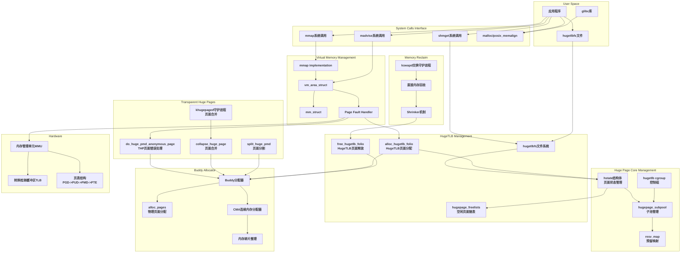

# Linux内核Huge Page详解

## 概述

Huge Page（大页）是Linux内核中一个重要的内存管理优化技术，通过使用比标准页面（通常4KB）更大的页面来提升系统性能。本文档基于Linux内核源码深入分析huge page的实现原理、使用场景和配置方法。

## 模块关系图

下图展示了Linux内核中Huge Page相关模块的完整架构和相互关系：



**图表说明：**

1. **用户空间层**：应用程序通过各种接口申请huge page
2. **系统调用层**：提供mmap、shmget等系统调用接口
3. **虚拟内存管理层**：处理虚拟内存映射和页面故障
4. **Huge Page核心管理层**：维护huge page状态、子池和预留映射
5. **HugeTLB管理层**：专门处理静态huge page的分配和释放
6. **THP管理层**：透明处理动态huge page的生命周期
7. **Buddy分配器层**：提供物理页面分配服务
8. **内存回收层**：负责内存回收和页面释放
9. **硬件层**：MMU、TLB等硬件支持

## 1. Huge Page的基本概念

### 1.1 什么是Huge Page

Huge Page是一种使用更大页面尺寸的内存管理机制，相比标准的4KB页面，huge page可以是2MB、1GB甚至更大。这种技术的核心思想是减少页表条目数量，从而降低TLB（Translation Lookaside Buffer）缺失率，提升内存访问性能。

### 1.2 支持的页面大小

根据内核源码分析，不同架构支持不同的huge page大小：

**x86-64架构：**

- 标准页面：4KB
- 大页：2MB（PMD级别）
- 巨页：1GB（PUD级别）

**ARM64架构：**

- 4KB基础页面：64KB、2MB、32MB、1GB
- 16KB基础页面：2MB、32MB、1GB  
- 64KB基础页面：2MB、512MB、16GB

## 2. 核心数据结构

### 2.1 hstate结构体

```c
struct hstate {
    struct mutex resize_lock;           // 大小调整锁
    int next_nid_to_alloc;             // 下一个分配节点
    int next_nid_to_free;              // 下一个释放节点
    unsigned int order;                 // 页面阶数
    unsigned int demote_order;          // 降级阶数
    unsigned long mask;                 // 页面掩码
    unsigned long max_huge_pages;       // 最大huge page数
    unsigned long nr_huge_pages;        // 当前huge page数
    unsigned long free_huge_pages;      // 空闲huge page数
    unsigned long resv_huge_pages;      // 预留huge page数
    unsigned long surplus_huge_pages;   // 剩余huge page数
    unsigned long nr_overcommit_huge_pages; // 过量分配数
    struct list_head hugepage_activelist;   // 活跃页面链表
    struct list_head hugepage_freelists[MAX_NUMNODES]; // 空闲页面链表
    unsigned int max_huge_pages_node[MAX_NUMNODES];     // 每节点最大数
    unsigned int nr_huge_pages_node[MAX_NUMNODES];      // 每节点当前数
    unsigned int free_huge_pages_node[MAX_NUMNODES];    // 每节点空闲数
    unsigned int surplus_huge_pages_node[MAX_NUMNODES]; // 每节点剩余数
    char name[HSTATE_NAME_LEN];         // 名称
};
```

### 2.2 hugepage_subpool结构体

```c
struct hugepage_subpool {
    spinlock_t lock;        // 自旋锁
    long count;            // 引用计数
    long max_hpages;       // 最大页面数（-1表示无限制）
    long used_hpages;      // 已使用页面数
    struct hstate *hstate; // 关联的hstate
    long min_hpages;       // 最小页面数（-1表示无最小值）
    long rsv_hpages;       // 预留页面数
};
```

### 2.3 resv_map结构体

用于跟踪预留和实例化的页面：

```c
struct resv_map {
    struct kref refs;           // 引用计数
    spinlock_t lock;           // 自旋锁
    struct list_head regions;   // 区域链表
    long adds_in_progress;     // 正在添加的数量
    struct list_head region_cache; // 区域缓存
    long region_cache_count;   // 缓存计数
    struct rw_semaphore rw_sema; // 读写信号量
    // ... cgroup相关字段
};
```

## 3. Huge Page工作原理

### 3.1 TLB优化原理

TLB是CPU中缓存虚拟地址到物理地址映射的硬件缓存。使用huge page可以显著减少TLB条目的使用：

- **4KB页面**：每个TLB条目映射4KB内存
- **2MB huge page**：每个TLB条目映射2MB内存（提升512倍）
- **1GB huge page**：每个TLB条目映射1GB内存（提升262144倍）

### 3.2 页表层级优化

标准页面需要4级页表遍历（PGD→PUD→PMD→PTE），而huge page可以减少层级：

- **2MB huge page**：3级遍历（PGD→PUD→PMD直接映射）
- **1GB huge page**：2级遍历（PGD→PUD直接映射）

### 3.3 内存分配流程

```c
struct folio *alloc_hugetlb_folio(struct vm_area_struct *vma,
                                 unsigned long addr, int avoid_reserve)
{
    // 1. 获取子池和hstate
    struct hugepage_subpool *spool = subpool_vma(vma);
    struct hstate *h = hstate_vma(vma);
    
    // 2. 检查内存控制组限制
    memcg_charge_ret = mem_cgroup_hugetlb_try_charge(memcg, gfp, nr_pages);
    
    // 3. 检查预留映射
    map_chg = vma_needs_reservation(h, vma, addr);
    
    // 4. 从空闲链表获取或从buddy分配器分配
    folio = dequeue_hugetlb_folio_vma(h, vma, addr, avoid_reserve, gbl_chg);
    if (!folio) {
        folio = alloc_buddy_hugetlb_folio_with_mpol(h, vma, addr);
    }
    
    // 5. 更新统计信息和设置子池
    hugetlb_set_folio_subpool(folio, spool);
    
    return folio;
}
```

## 4. Huge Page类型

### 4.1 HugeTLB Pages

静态预分配的huge page，需要在系统启动时或运行时显式配置。

**特点：**

- 页面大小固定（2MB、1GB等）
- 需要预分配内存
- 通过hugetlbfs文件系统访问
- 不会被swap out
- 适合对性能要求极高的应用

### 4.2 Transparent Huge Pages (THP)

内核自动管理的huge page，对应用程序透明。

**特点：**

- 自动分配和释放
- 支持页面分割和合并
- 通过khugepaged后台进程优化
- 可以被swap out
- 适合一般应用程序

根据源码中的配置选项：

```c
config TRANSPARENT_HUGEPAGE
    bool "Transparent Hugepage Support"
    depends on HAVE_ARCH_TRANSPARENT_HUGEPAGE && !PREEMPT_RT
    select COMPACTION
    select XARRAY_MULTI
    help
      Transparent Hugepages allows the kernel to use huge pages and
      huge tlb transparently to the applications whenever possible.
      This feature can improve computing performance to certain
      applications by speeding up page faults during memory
      allocation, by reducing the number of tlb misses and by speeding
      up the pagetable walking.
```

### 4.3 THP详细管理原理

#### 4.3.1 THP核心数据结构

**compound_page结构：**

```c
// THP使用compound page机制
struct page {
    // ... 标准字段 ...
    union {
        struct {
            unsigned long compound_head;  // 复合页头部
            unsigned int compound_dtor;   // 析构函数索引
            unsigned int compound_order;  // 页面阶数
            atomic_t compound_mapcount;   // 映射计数
            unsigned int compound_nr;     // 页面数量
        };
    };
};
```

**mm_slot结构（khugepaged使用）：**

```c
struct mm_slot {
    struct list_head mm_node;    // 链表节点
    struct mm_struct *mm;        // 内存管理结构
    int nr_pte_mapped_thp;       // PTE映射的THP数量
    unsigned long insertion_time; // 插入时间
};
```

#### 4.3.2 THP分配流程

THP的分配主要在页面故障处理中进行：

```c
static vm_fault_t do_huge_pmd_anonymous_page(struct vm_fault *vmf)
{
    struct vm_area_struct *vma = vmf->vma;
    gfp_t gfp;
    struct folio *folio;
    unsigned long haddr = vmf->address & HPAGE_PMD_MASK;
    
    // 1. 检查是否可以使用THP
    if (!transhuge_vma_suitable(vma, haddr))
        return VM_FAULT_FALLBACK;
    
    // 2. 检查内存控制组限制
    if (mem_cgroup_charge(folio, vma->vm_mm, gfp))
        goto release;
    
    // 3. 尝试从buddy分配器分配2MB页面
    gfp = alloc_hugepage_direct_gfpmask(vma);
    folio = vma_alloc_folio(gfp, HPAGE_PMD_ORDER, vma, haddr, true);
    
    if (unlikely(!folio)) {
        // 分配失败，回退到普通页面
        return VM_FAULT_FALLBACK;
    }
    
    // 4. 设置页面属性
    folio_zero_user(folio, haddr);
    __folio_mark_uptodate(folio);
    
    // 5. 设置PMD表项
    vmf->ptl = pmd_lock(vma->vm_mm, vmf->pmd);
    if (unlikely(!pmd_none(*vmf->pmd))) {
        goto unlock_release;
    }
    
    // 6. 建立映射
    entry = mk_huge_pmd(&folio->page, vma->vm_page_prot);
    entry = maybe_pmd_mkwrite(pmd_mkdirty(entry), vma);
    folio_add_new_anon_rmap(folio, vma, haddr);
    set_pmd_at(vma->vm_mm, haddr, vmf->pmd, entry);
    
    return 0;
}
```

#### 4.3.3 khugepaged后台合并机制

khugepaged是专门的内核线程，负责将普通4KB页面合并为2MB的THP：

```c
static void khugepaged_scan_mm_slot(struct mm_slot *mm_slot)
{
    struct mm_struct *mm = mm_slot->mm;
    struct vm_area_struct *vma;
    
    // 遍历VMA寻找合并机会
    for (vma = mm->mmap; vma; vma = vma->vm_next) {
        if (!hugepage_vma_check(vma, vma->vm_flags))
            continue;
            
        // 扫描VMA中的页面
        khugepaged_scan_pmd(mm, vma, khugepaged_scan.address,
                           &mmap_locked, &mm_slot);
    }
}

static int khugepaged_scan_pmd(struct mm_struct *mm,
                               struct vm_area_struct *vma,
                               unsigned long address,
                               bool *mmap_locked,
                               struct mm_slot **mm_slot)
{
    pmd_t *pmd;
    pte_t *pte, *_pte;
    int ret = 0, result = SCAN_FAIL;
    int referenced = 0, writable = 0;
    unsigned long _address;
    spinlock_t *ptl;
    int node = NUMA_NO_NODE, unmapped = 0;
    bool locked = false;
    
    // 检查是否满足合并条件
    for (_address = address, _pte = pte;
         _pte < pte + HPAGE_PMD_NR; _pte++, _address += PAGE_SIZE) {
        
        pte_t pteval = *_pte;
        if (pte_none(pteval) || (pte_present(pteval) &&
                                is_zero_pfn(pte_pfn(pteval)))) {
            if (++unmapped <= khugepaged_max_ptes_none) {
                continue;
            } else {
                result = SCAN_EXCEED_NONE_PTE;
                goto out_unmap;
            }
        }
        
        // ... 更多检查逻辑 ...
    }
    
    // 满足条件则进行合并
    if (result == SCAN_SUCCEED) {
        result = collapse_huge_page(mm, address, referenced, unmapped, mm_slot);
    }
    
    return result;
}
```

#### 4.3.4 THP页面分割机制

当内存压力较大或需要部分页面时，THP可以被分割为普通页面：

```c
void split_huge_pmd(struct vm_area_struct *vma, pmd_t *pmd, unsigned long address)
{
    struct folio *folio;
    struct page *page;
    
    // 获取PMD锁
    spinlock_t *ptl = pmd_lock(vma->vm_mm, pmd);
    
    if (unlikely(!pmd_trans_huge(*pmd) && !pmd_devmap(*pmd)))
        goto out;
        
    // 获取页面
    page = pmd_page(*pmd);
    folio = page_folio(page);
    
    // 执行分割
    if (folio_test_anon(folio)) {
        __split_huge_pmd(vma, pmd, address, false, NULL);
    } else {
        __split_huge_pmd_locked(vma, pmd, address, false);
    }
    
out:
    spin_unlock(ptl);
}

static void __split_huge_pmd_locked(struct vm_area_struct *vma, pmd_t *pmd,
                                   unsigned long haddr, bool freeze)
{
    struct mm_struct *mm = vma->vm_mm;
    struct page *page;
    pgtable_t pgtable;
    pmd_t old_pmd, _pmd;
    bool young, write, soft_dirty, pmd_migration = false;
    unsigned long addr;
    pte_t *pte;
    int i;
    
    // 分配PTE页表
    pgtable = pte_alloc_one(mm);
    if (unlikely(!pgtable))
        return;
    
    page = pmd_page(old_pmd);
    
    // 设置每个4KB页面的PTE表项
    for (i = 0, addr = haddr; i < HPAGE_PMD_NR; i++, addr += PAGE_SIZE) {
        pte_t entry;
        entry = mk_pte(page + i, vma->vm_page_prot);
        
        // 设置页面属性
        entry = maybe_mkwrite(entry, vma);
        if (young)
            entry = pte_mkyoung(entry);
        if (soft_dirty)
            entry = pte_mksoft_dirty(entry);
            
        set_pte_at(mm, addr, pte + i, entry);
    }
    
    // 更新PMD，指向新的PTE页表
    pmd_populate(mm, pmd, pgtable);
}
```

#### 4.3.5 THP内存回收

THP参与标准的内存回收流程，但有特殊处理：

```c
static int shrink_folio_list(struct list_head *folio_list,
                            struct pglist_data *pgdat,
                            struct scan_control *sc,
                            struct reclaim_stat *stat,
                            bool ignore_references)
{
    LIST_HEAD(ret_folios);
    LIST_HEAD(free_folios);
    unsigned int nr_reclaimed = 0;
    
    while (!list_empty(folio_list)) {
        struct folio *folio = lru_to_folio(folio_list);
        
        // 对于THP，可能需要分割
        if (folio_test_large(folio)) {
            if (!can_split_folio(folio, NULL)) {
                // 不能分割，跳过回收
                goto keep_locked;
            }
            
            // 尝试分割THP
            if (split_folio_to_list(folio, folio_list)) {
                // 分割失败
                goto keep_locked;
            }
        }
        
        // ... 正常回收逻辑 ...
    }
    
    return nr_reclaimed;
}
```

#### 4.3.6 THP状态监控

THP提供了丰富的统计信息：

```c
// 主要THP统计计数器
enum thp_stat_item {
    THP_FAULT_ALLOC,        // THP分配成功次数
    THP_FAULT_FALLBACK,     // THP分配失败回退次数
    THP_FAULT_FALLBACK_CHARGE, // 由于charge失败的回退
    THP_COLLAPSE_ALLOC,     // khugepaged合并成功次数
    THP_COLLAPSE_ALLOC_FAILED, // khugepaged合并失败次数
    THP_FILE_ALLOC,         // 文件THP分配次数
    THP_FILE_FALLBACK,      // 文件THP分配失败次数
    THP_FILE_MAPPED,        // 文件THP映射次数
    THP_SPLIT_PAGE,         // THP分割次数
    THP_SPLIT_PAGE_FAILED,  // THP分割失败次数
    THP_DEFERRED_SPLIT_PAGE, // 延迟分割次数
    THP_SPLIT_PMD,          // PMD分割次数
    THP_SCAN_EXCEED_NONE_PTE, // 扫描超过空PTE限制
    THP_SCAN_EXCEED_SWAP_PTE, // 扫描超过交换PTE限制
    THP_SCAN_EXCEED_SHARE_PTE, // 扫描超过共享PTE限制
    NR_THP_STAT
};
```

#### 4.3.7 THP工作模式

THP支持三种工作模式：

1. **always模式**：积极分配THP，适合内存充足的系统
2. **madvise模式**：仅对标记MADV_HUGEPAGE的区域使用THP
3. **never模式**：完全禁用THP

```c
static ssize_t enabled_store(struct kobject *kobj,
                            struct kobj_attribute *attr,
                            const char *buf, size_t count)
{
    if (sysfs_streq(buf, "always")) {
        clear_bit(TRANSPARENT_HUGEPAGE_REQ_MADV_FLAG, &transparent_hugepage_flags);
        set_bit(TRANSPARENT_HUGEPAGE_FLAG, &transparent_hugepage_flags);
    } else if (sysfs_streq(buf, "madvise")) {
        clear_bit(TRANSPARENT_HUGEPAGE_FLAG, &transparent_hugepage_flags);
        set_bit(TRANSPARENT_HUGEPAGE_REQ_MADV_FLAG, &transparent_hugepage_flags);
    } else if (sysfs_streq(buf, "never")) {
        clear_bit(TRANSPARENT_HUGEPAGE_FLAG, &transparent_hugepage_flags);
        clear_bit(TRANSPARENT_HUGEPAGE_REQ_MADV_FLAG, &transparent_hugepage_flags);
    }
    
    return count;
}
```

## 5. 使用场景

### 5.1 数据库系统

**适用原因：**

- 大内存缓冲池（如MySQL的InnoDB buffer pool）
- 频繁的随机内存访问
- 大量的数据页缓存

**性能提升：**

- 减少TLB缺失，提升查询性能
- 降低页表遍历开销
- 提高缓存命中率

### 5.2 虚拟化平台

**适用原因：**

- 客户机需要大量连续内存
- 嵌套页表转换开销大
- 虚拟机内存访问频繁

**性能提升：**

- 减少EPT/NPT页表层级
- 降低虚拟化开销
- 提升客户机性能

### 5.3 高性能计算 (HPC)

**适用原因：**

- 大数据集处理
- 科学计算应用
- 密集的内存访问模式

**性能提升：**

- 减少内存管理开销
- 提高计算效率
- 降低系统调用开销

### 5.4 内存数据库

**适用原因：**

- 全内存数据存储（如Redis、MongoDB）
- 大内存工作集
- 高并发访问

**性能提升：**

- 减少内存碎片
- 提升访问速度
- 降低延迟

### 5.5 容器化环境

**适用原因：**

- 容器密度高
- 内存使用量大
- 需要性能隔离

**性能提升：**

- 提升容器启动速度
- 减少内存管理开销
- 优化资源利用率

## 6. 配置和使用方法

### 6.1 内核配置

编译内核时需要启用相关选项：

```bash
CONFIG_HUGETLBFS=y          # HugeTLB文件系统支持
CONFIG_HUGETLB_PAGE=y       # HugeTLB页面支持
CONFIG_TRANSPARENT_HUGEPAGE=y # 透明大页支持
```

### 6.2 静态配置HugeTLB Pages

#### 6.2.1 系统级配置

```bash
# 设置2MB huge page数量
echo 1024 > /proc/sys/vm/nr_hugepages

# 设置1GB huge page数量
echo 4 > /sys/kernel/mm/hugepages/hugepages-1048576kB/nr_hugepages

# 查看当前配置
cat /proc/meminfo | grep -i huge
```

#### 6.2.2 NUMA节点配置

```bash
# 在特定NUMA节点分配huge page
echo 512 > /sys/devices/system/node/node0/hugepages/hugepages-2048kB/nr_hugepages
echo 512 > /sys/devices/system/node/node1/hugepages/hugepages-2048kB/nr_hugepages
```

#### 6.2.3 启动参数配置

```bash
# 在内核启动参数中配置
hugepagesz=2M hugepages=1024 hugepagesz=1G hugepages=4
```

### 6.3 挂载hugetlbfs

```bash
# 创建挂载点
mkdir /mnt/huge

# 挂载hugetlbfs（2MB页面）
mount -t hugetlbfs -o pagesize=2M none /mnt/huge

# 挂载hugetlbfs（1GB页面）
mount -t hugetlbfs -o pagesize=1G none /mnt/huge1G

# 添加到/etc/fstab实现自动挂载
echo "none /mnt/huge hugetlbfs pagesize=2M 0 0" >> /etc/fstab
```

### 6.4 透明大页配置

```bash
# 启用透明大页
echo always > /sys/kernel/mm/transparent_hugepage/enabled

# 仅在madvise时使用
echo madvise > /sys/kernel/mm/transparent_hugepage/enabled

# 禁用透明大页
echo never > /sys/kernel/mm/transparent_hugepage/enabled

# 配置碎片整理
echo always > /sys/kernel/mm/transparent_hugepage/defrag
```

### 6.5 Huge Page申请分配方式详解

Linux内核为应用程序提供了多种huge page的申请和使用方式，每种方式都有其特定的使用场景和优缺点。

#### 6.5.1 mmap系统调用方式

这是最直接和常用的huge page申请方式。mmap支持两种内存分配机制：**按需分配**和**预分配**。

##### 6.5.1.1 按需分配机制（默认行为）

**默认情况下，mmap是按需分配的：**

- mmap调用成功后只建立虚拟内存映射，不会立即分配物理huge page
- 当程序首次访问这些虚拟地址时，会触发缺页中断（page fault）
- 内核在缺页中断处理函数中才真正分配huge page物理内存
- 这种机制节省内存，只有实际使用的页面才会占用物理内存

```c
#include <sys/mman.h>
#include <stdio.h>
#include <unistd.h>

// 演示按需分配
void demo_demand_allocation() {
    size_t size = 4 * 1024 * 1024;  // 4MB (2个2MB huge page)
    
    printf("调用mmap前，检查huge page使用情况:\n");
    system("cat /proc/meminfo | grep -i hugepages");
    
    // mmap调用，仅建立虚拟映射
void *addr = mmap(NULL, size, PROT_READ | PROT_WRITE,
                      MAP_PRIVATE | MAP_ANONYMOUS | MAP_HUGETLB | MAP_HUGE_2MB,
                  -1, 0);

    if (addr == MAP_FAILED) {
        perror("mmap failed");
        return;
    }
    
    printf("\nmmap调用后（未访问内存），huge page使用情况:\n");
    system("cat /proc/meminfo | grep -i hugepages");
    
    // 访问内存，触发缺页中断和实际分配
    printf("\n开始访问内存，触发huge page分配...\n");
    char *ptr = (char *)addr;
    
    // 访问第一个2MB页面
    ptr[0] = 'A';
    printf("访问第一个huge page后:\n");
    system("cat /proc/meminfo | grep -i hugepages");
    
    // 访问第二个2MB页面  
    ptr[2*1024*1024] = 'B';
    printf("\n访问第二个huge page后:\n");
    system("cat /proc/meminfo | grep -i hugepages");
    
    munmap(addr, size);
}
```

##### 6.5.1.2 预分配机制

**使用MAP_POPULATE标志实现预分配：**

- MAP_POPULATE标志告诉内核立即分配和映射所有页面
- mmap调用时就会分配真实的huge page物理内存
- 所有页表条目立即建立，无需等待缺页中断
- 适用于确定会使用全部内存的场景

```c
#include <sys/mman.h>

// 预分配huge page
void *alloc_hugepage_prefault(size_t size) {
    printf("使用MAP_POPULATE预分配huge page:\n");
    system("cat /proc/meminfo | grep HugePages_Free");
    
    void *addr = mmap(NULL, size, PROT_READ | PROT_WRITE,
                      MAP_PRIVATE | MAP_ANONYMOUS | MAP_HUGETLB | 
                      MAP_HUGE_2MB | MAP_POPULATE,  // 关键：MAP_POPULATE标志
                      -1, 0);
    
    if (addr == MAP_FAILED) {
        perror("mmap with MAP_POPULATE failed");
        return NULL;
    }
    
    printf("mmap调用完成后（已预分配）:\n");
    system("cat /proc/meminfo | grep HugePages_Free");
    
    return addr;
}

// 完整的预分配示例
int hugepage_prefault_example() {
    size_t size = 10 * 1024 * 1024;  // 10MB
    
    void *addr = alloc_hugepage_prefault(size);
    if (!addr) return -1;
    
    // 内存已经分配，可以直接使用，无缺页中断开销
    memset(addr, 0x42, size);
    printf("预分配内存已就绪，可直接使用\n");
    
    munmap(addr, size);
    return 0;
}
```

##### 6.5.1.3 内存锁定预分配

**使用mlock系列函数确保内存常驻：**

```c
#include <sys/mman.h>

// 分配并锁定huge page
void *alloc_and_lock_hugepage(size_t size) {
    // 先分配
void *addr = mmap(NULL, size, PROT_READ | PROT_WRITE,
                  MAP_PRIVATE | MAP_ANONYMOUS | MAP_HUGETLB | MAP_HUGE_2MB,
                  -1, 0);
    
    if (addr == MAP_FAILED) {
        perror("mmap failed");
        return NULL;
    }
    
    // 锁定内存，强制分配并防止swap
    if (mlock(addr, size) == -1) {
        perror("mlock failed");
        munmap(addr, size);
        return NULL;
    }
    
    printf("Huge page已分配并锁定在物理内存中\n");
    return addr;
}

// 释放锁定的内存
void free_locked_hugepage(void *addr, size_t size) {
    munlock(addr, size);  // 解锁
    munmap(addr, size);   // 解映射
}
```

##### 6.5.1.4 预分配的内存特性

**预分配确实会划出真实的内存块：**

1. **物理内存分配**：
   - 从系统的huge page池中立即分配物理内存
   - HugePages_Free计数会立即减少
   - 内存页面状态变为已分配(allocated)

2. **页表建立**：
   - 完整的页表映射立即建立
   - PMD条目指向实际的物理huge page
   - MMU可以直接进行地址转换

3. **内存属性**：
   - 页面被标记为存在(present)和可访问
   - 对于MAP_POPULATE，页面会被"预热"到TLB中
   - 锁定的页面不会被内存回收机制处理

```c
// 检查预分配效果的完整示例
void verify_preallocation() {
    size_t huge_page_size = 2 * 1024 * 1024;  // 2MB
    size_t alloc_size = 5 * huge_page_size;   // 10MB
    
    printf("分配前的系统状态:\n");
    system("cat /proc/meminfo | grep -E 'HugePages_(Total|Free|Rsvd)'");
    
    // 预分配方式1: MAP_POPULATE
    void *addr1 = mmap(NULL, alloc_size, PROT_READ | PROT_WRITE,
                       MAP_PRIVATE | MAP_ANONYMOUS | MAP_HUGETLB | 
                       MAP_HUGE_2MB | MAP_POPULATE, -1, 0);
    
    printf("\nMAP_POPULATE分配后:\n");
    system("cat /proc/meminfo | grep -E 'HugePages_(Total|Free|Rsvd)'");
    
    // 预分配方式2: mlock强制分配
    void *addr2 = mmap(NULL, alloc_size, PROT_READ | PROT_WRITE,
                       MAP_PRIVATE | MAP_ANONYMOUS | MAP_HUGETLB | MAP_HUGE_2MB,
                       -1, 0);
    mlock(addr2, alloc_size);
    
    printf("\nmlock分配后:\n");
    system("cat /proc/meminfo | grep -E 'HugePages_(Total|Free|Rsvd)'");
    
    // 清理
    if (addr1 != MAP_FAILED) munmap(addr1, alloc_size);
    if (addr2 != MAP_FAILED) {
        munlock(addr2, alloc_size);
        munmap(addr2, alloc_size);
    }
    
    printf("\n释放后:\n");
    system("cat /proc/meminfo | grep -E 'HugePages_(Total|Free|Rsvd)'");
}

##### 6.5.1.5 基本mmap使用示例

**通用的huge page分配函数：**

```c
#include <sys/mman.h>
#include <errno.h>
#include <stdio.h>

// 申请2MB的huge page（按需分配）
void *alloc_hugepage_mmap(size_t size) {
    void *addr = mmap(NULL, size, PROT_READ | PROT_WRITE,
                      MAP_PRIVATE | MAP_ANONYMOUS | MAP_HUGETLB,
                      -1, 0);
    
    if (addr == MAP_FAILED) {
        perror("mmap huge page failed");
        return NULL;
    }
    
    return addr;
}

// 指定huge page大小
void *alloc_hugepage_size(size_t size, int huge_size) {
    int flags = MAP_PRIVATE | MAP_ANONYMOUS | MAP_HUGETLB;
    
    switch (huge_size) {
        case 2*1024*1024:   // 2MB
            flags |= MAP_HUGE_2MB;
            break;
        case 1024*1024*1024: // 1GB
            flags |= MAP_HUGE_1GB;
            break;
        default:
            fprintf(stderr, "Unsupported huge page size\n");
            return NULL;
    }
    
    void *addr = mmap(NULL, size, PROT_READ | PROT_WRITE, flags, -1, 0);
    
    if (addr == MAP_FAILED) {
        perror("mmap huge page with specific size failed");
        return NULL;
    }
    
    return addr;
}

// 带错误处理的完整示例
int hugepage_mmap_example() {
    size_t huge_size = 2 * 1024 * 1024;  // 2MB
    size_t alloc_size = 10 * huge_size;  // 20MB
    
    void *huge_mem = mmap(NULL, alloc_size, 
                          PROT_READ | PROT_WRITE,
                          MAP_PRIVATE | MAP_ANONYMOUS | MAP_HUGETLB | MAP_HUGE_2MB,
                          -1, 0);
    
    if (huge_mem == MAP_FAILED) {
        switch (errno) {
            case ENOMEM:
                printf("No sufficient huge pages available\n");
                break;
            case EPERM:
                printf("Permission denied, check ulimit\n");
                break;
            case EINVAL:
                printf("Invalid parameters\n");
                break;
            default:
                perror("mmap failed");
        }
        return -1;
    }
    
    // 使用内存（此时触发按需分配）
    memset(huge_mem, 0x42, alloc_size);
    
    // 释放内存
    munmap(huge_mem, alloc_size);
    return 0;
}
```

##### 6.5.1.6 mmap分配机制总结

| 分配方式 | 标志组合 | 分配时机 | 物理内存占用 | 适用场景 |
|---------|---------|----------|-------------|----------|
| **按需分配** | `MAP_HUGETLB` | 首次访问时 | 延迟占用 | 内存使用不确定 |
| **立即预分配** | `MAP_HUGETLB \| MAP_POPULATE` | mmap调用时 | 立即占用 | 确定使用全部内存 |
| **锁定预分配** | `MAP_HUGETLB` + `mlock()` | mlock调用时 | 立即占用+锁定 | 关键性能路径 |

**关键技术要点：**

1. **按需分配优势**：节省内存，支持overcommit
2. **预分配优势**：无缺页中断开销，确定的内存延迟
3. **内存池管理**：预分配直接从huge page池分配真实物理内存
4. **页表映射**：预分配建立完整的PMD到物理页面映射
5. **TLB预热**：MAP_POPULATE可能将映射预加载到TLB中

#### 6.5.2 System V共享内存方式

适合需要进程间共享huge page的场景：

```c
#include <sys/shm.h>
#include <sys/ipc.h>
#include <errno.h>

// 创建shared memory huge page
int create_shm_hugepage(key_t key, size_t size) {
int shmid = shmget(key, size, IPC_CREAT | SHM_HUGETLB | 0666);
    
    if (shmid == -1) {
        switch (errno) {
            case EINVAL:
                printf("Huge pages not supported or invalid size\n");
                break;
            case ENOMEM:
                printf("No sufficient huge pages available\n");
                break;
            case ENOSPC:
                printf("Shared memory limit exceeded\n");
                break;
            default:
                perror("shmget failed");
        }
        return -1;
    }
    
    return shmid;
}

// 附加共享内存
void *attach_shm_hugepage(int shmid) {
void *addr = shmat(shmid, NULL, 0);
    
    if (addr == (void *)-1) {
        perror("shmat failed");
        return NULL;
    }
    
    return addr;
}

// 完整的System V共享内存示例
int sysv_shm_example() {
    key_t key = ftok("/tmp", 'H');  // 生成key
    size_t size = 4 * 1024 * 1024;  // 4MB
    
    // 创建共享内存段
    int shmid = create_shm_hugepage(key, size);
    if (shmid == -1) return -1;
    
    // 附加到当前进程
    void *addr = attach_shm_hugepage(shmid);
    if (addr == NULL) {
        shmctl(shmid, IPC_RMID, NULL);
        return -1;
    }
    
    // 使用共享内存
    sprintf((char *)addr, "Hello from huge page shared memory!");
    
    // 分离共享内存
    shmdt(addr);
    
    // 删除共享内存段
    shmctl(shmid, IPC_RMID, NULL);
    
    return 0;
}
```

#### 6.5.3 hugetlbfs文件系统方式

通过文件系统接口使用huge page：

```c
#include <fcntl.h>
#include <sys/mman.h>
#include <unistd.h>

// 通过hugetlbfs创建huge page映射
void *create_hugetlbfs_mapping(const char *filename, size_t size) {
    // 创建文件
    int fd = open(filename, O_CREAT | O_RDWR, 0666);
    if (fd == -1) {
        perror("open hugetlbfs file failed");
        return NULL;
    }
    
    // 设置文件大小
    if (ftruncate(fd, size) == -1) {
        perror("ftruncate failed");
        close(fd);
        return NULL;
    }

// 映射文件到内存
    void *addr = mmap(NULL, size, PROT_READ | PROT_WRITE, MAP_SHARED, fd, 0);
    
    if (addr == MAP_FAILED) {
        perror("mmap hugetlbfs file failed");
        close(fd);
        unlink(filename);
        return NULL;
    }
    
    close(fd);  // 可以关闭文件描述符，映射仍然有效
    return addr;
}

// hugetlbfs示例
int hugetlbfs_example() {
    const char *hugefile = "/mnt/huge/myapp_hugepage";
    size_t size = 8 * 1024 * 1024;  // 8MB
    
    void *addr = create_hugetlbfs_mapping(hugefile, size);
    if (addr == NULL) return -1;
    
    // 使用内存
    strcpy((char *)addr, "Data stored in huge page via hugetlbfs");
    printf("Data: %s\n", (char *)addr);
    
    // 解除映射
    munmap(addr, size);
    unlink(hugefile);
    
    return 0;
}
```

#### 6.5.4 madvise建议方式

通过madvise系统调用影响THP行为：

```c
#include <sys/mman.h>

// 建议使用huge page
int advise_hugepage(void *addr, size_t size) {
    if (madvise(addr, size, MADV_HUGEPAGE) == -1) {
        perror("madvise MADV_HUGEPAGE failed");
        return -1;
    }
    return 0;
}

// 建议不使用huge page
int advise_no_hugepage(void *addr, size_t size) {
    if (madvise(addr, size, MADV_NOHUGEPAGE) == -1) {
        perror("madvise MADV_NOHUGEPAGE failed");
        return -1;
    }
    return 0;
}

// 完整的madvise示例
int madvise_example() {
    size_t size = 10 * 1024 * 1024;  // 10MB
    
    // 普通匿名映射
void *addr = mmap(NULL, size, PROT_READ | PROT_WRITE,
                      MAP_PRIVATE | MAP_ANONYMOUS, -1, 0);
    
    if (addr == MAP_FAILED) {
        perror("mmap failed");
        return -1;
    }
    
    // 建议内核为这块内存使用huge page
    if (advise_hugepage(addr, size) == -1) {
        munmap(addr, size);
        return -1;
    }
    
    // 触发页面分配和可能的THP合并
    memset(addr, 0x55, size);
    
    // 检查THP状态（可选）
    printf("Memory allocated and advised for huge page usage\n");
    
    munmap(addr, size);
    return 0;
}
```

#### 6.5.5 POSIX共享内存方式

使用POSIX共享内存接口：

```c
#include <sys/mman.h>
#include <fcntl.h>
#include <unistd.h>

// POSIX共享内存with huge page
void *create_posix_shm_hugepage(const char *name, size_t size) {
    // 创建或打开共享内存对象
    int fd = shm_open(name, O_CREAT | O_RDWR, 0666);
    if (fd == -1) {
        perror("shm_open failed");
        return NULL;
    }
    
    // 设置大小
    if (ftruncate(fd, size) == -1) {
        perror("ftruncate failed");
        close(fd);
        shm_unlink(name);
        return NULL;
    }
    
    // 映射并请求huge page
    void *addr = mmap(NULL, size, PROT_READ | PROT_WRITE,
                      MAP_SHARED, fd, 0);
    
    if (addr == MAP_FAILED) {
        perror("mmap failed");
        close(fd);
        shm_unlink(name);
        return NULL;
    }
    
    // 建议使用huge page
madvise(addr, size, MADV_HUGEPAGE);

    close(fd);
    return addr;
}

// POSIX共享内存示例
int posix_shm_example() {
    const char *shm_name = "/myhugeshm";
    size_t size = 16 * 1024 * 1024;  // 16MB
    
    void *addr = create_posix_shm_hugepage(shm_name, size);
    if (addr == NULL) return -1;
    
    // 使用共享内存
    sprintf((char *)addr, "POSIX shared memory with huge page support");
    
    // 解除映射
    munmap(addr, size);
    shm_unlink(shm_name);
    
    return 0;
}
```

#### 6.5.6 内存分配库集成方式

与常用内存分配库的集成：

**glibc malloc集成：**

```c
#include <stdlib.h>
#include <malloc.h>

// 使用posix_memalign分配对齐内存
void *alloc_aligned_hugepage(size_t size) {
    void *ptr;
    size_t huge_page_size = 2 * 1024 * 1024;  // 2MB对齐
    
    // 分配对齐到huge page边界的内存
    int ret = posix_memalign(&ptr, huge_page_size, size);
    if (ret != 0) {
        errno = ret;
        perror("posix_memalign failed");
        return NULL;
    }
    
    // 建议使用huge page
    madvise(ptr, size, MADV_HUGEPAGE);
    
    return ptr;
}

// 使用aligned_alloc（C11标准）
void *alloc_c11_aligned(size_t size) {
    size_t huge_page_size = 2 * 1024 * 1024;
    size_t aligned_size = (size + huge_page_size - 1) & ~(huge_page_size - 1);
    
    void *ptr = aligned_alloc(huge_page_size, aligned_size);
    if (ptr == NULL) {
        perror("aligned_alloc failed");
        return NULL;
    }
    
    madvise(ptr, aligned_size, MADV_HUGEPAGE);
    return ptr;
}
```

**jemalloc集成：**

```c
#include <jemalloc/jemalloc.h>

// jemalloc with huge page support
void *jemalloc_hugepage(size_t size) {
    // 配置jemalloc使用huge page
    mallctl("opt.metadata_thp", NULL, NULL, "auto", sizeof("auto"));
    
    void *ptr = malloc(size);
    if (ptr && size >= 2*1024*1024) {
        // 对大分配建议使用huge page
        madvise(ptr, size, MADV_HUGEPAGE);
    }
    
    return ptr;
}
```

#### 6.5.7 内核直接分配接口

通过特殊设备或接口直接分配：

```c
// 使用/dev/hugepages设备（如果可用）
void *direct_hugepage_alloc(size_t size) {
    int fd = open("/dev/hugepages", O_RDWR);
    if (fd == -1) {
        perror("open /dev/hugepages failed");
        return NULL;
    }
    
    void *addr = mmap(NULL, size, PROT_READ | PROT_WRITE,
                      MAP_SHARED, fd, 0);
    
    close(fd);
    
    if (addr == MAP_FAILED) {
        perror("mmap /dev/hugepages failed");
        return NULL;
    }
    
    return addr;
}

// 使用memfd_create创建内存文件描述符
#include <sys/memfd.h>

void *memfd_hugepage_alloc(size_t size) {
    // 创建内存文件描述符
    int fd = memfd_create("hugepage_mem", MFD_HUGETLB | MFD_HUGE_2MB);
    if (fd == -1) {
        perror("memfd_create failed");
        return NULL;
    }
    
    // 设置大小
    if (ftruncate(fd, size) == -1) {
        perror("ftruncate failed");
        close(fd);
        return NULL;
    }
    
    // 映射内存
    void *addr = mmap(NULL, size, PROT_READ | PROT_WRITE,
                      MAP_SHARED, fd, 0);
    
    close(fd);
    
    if (addr == MAP_FAILED) {
        perror("mmap memfd failed");
        return NULL;
    }
    
    return addr;
}
```

#### 6.5.8 性能测试和验证

检查huge page是否真的被使用：

```c
#include <stdio.h>
#include <stdlib.h>

// 检查进程的huge page使用情况
void check_hugepage_usage(pid_t pid) {
    char filename[256];
    snprintf(filename, sizeof(filename), "/proc/%d/smaps", pid);
    
    FILE *fp = fopen(filename, "r");
    if (fp == NULL) {
        perror("fopen smaps failed");
        return;
    }
    
    char line[256];
    while (fgets(line, sizeof(line), fp)) {
        if (strstr(line, "AnonHugePages:") || strstr(line, "ShmemHugePages:")) {
            printf("%s", line);
        }
    }
    
    fclose(fp);
}

// 简单的性能测试
void hugepage_performance_test(void *addr, size_t size) {
    struct timespec start, end;
    
    clock_gettime(CLOCK_MONOTONIC, &start);
    
    // 写入测试
    char *ptr = (char *)addr;
    for (size_t i = 0; i < size; i += 4096) {
        ptr[i] = (char)(i & 0xFF);
    }
    
    clock_gettime(CLOCK_MONOTONIC, &end);
    
    double elapsed = (end.tv_sec - start.tv_sec) + 
                    (end.tv_nsec - start.tv_nsec) / 1e9;
    
    printf("Huge page write test: %.6f seconds for %zu bytes\n", 
           elapsed, size);
}
```

#### 6.5.9 错误处理和最佳实践

```c
// 综合示例：带完整错误处理的huge page分配
typedef enum {
    HUGEPAGE_METHOD_MMAP,
    HUGEPAGE_METHOD_SYSV_SHM,
    HUGEPAGE_METHOD_HUGETLBFS,
    HUGEPAGE_METHOD_POSIX_SHM
} hugepage_method_t;

typedef struct {
    void *addr;
    size_t size;
    hugepage_method_t method;
    int fd_or_shmid;
    char *filename;
} hugepage_allocation_t;

hugepage_allocation_t *alloc_hugepage_robust(size_t size, 
                                            hugepage_method_t method) {
    hugepage_allocation_t *alloc = malloc(sizeof(hugepage_allocation_t));
    if (!alloc) return NULL;
    
    memset(alloc, 0, sizeof(hugepage_allocation_t));
    alloc->size = size;
    alloc->method = method;
    alloc->fd_or_shmid = -1;
    
    switch (method) {
        case HUGEPAGE_METHOD_MMAP:
            alloc->addr = mmap(NULL, size, PROT_READ | PROT_WRITE,
                             MAP_PRIVATE | MAP_ANONYMOUS | MAP_HUGETLB,
                             -1, 0);
            break;
            
        case HUGEPAGE_METHOD_SYSV_SHM:
            alloc->fd_or_shmid = shmget(IPC_PRIVATE, size, 
                                       IPC_CREAT | SHM_HUGETLB | 0600);
            if (alloc->fd_or_shmid != -1) {
                alloc->addr = shmat(alloc->fd_or_shmid, NULL, 0);
                if (alloc->addr == (void *)-1) {
                    alloc->addr = NULL;
                }
            }
            break;
            
        case HUGEPAGE_METHOD_HUGETLBFS:
            // 需要预先设置filename
            if (alloc->filename) {
                alloc->fd_or_shmid = open(alloc->filename, O_CREAT | O_RDWR, 0666);
                if (alloc->fd_or_shmid != -1) {
                    ftruncate(alloc->fd_or_shmid, size);
                    alloc->addr = mmap(NULL, size, PROT_READ | PROT_WRITE,
                                     MAP_SHARED, alloc->fd_or_shmid, 0);
                    if (alloc->addr == MAP_FAILED) {
                        alloc->addr = NULL;
                    }
                }
            }
            break;
            
        default:
            free(alloc);
            return NULL;
    }
    
    if (alloc->addr == NULL || alloc->addr == MAP_FAILED) {
        free(alloc);
        return NULL;
    }
    
    return alloc;
}

void free_hugepage_robust(hugepage_allocation_t *alloc) {
    if (!alloc) return;
    
    switch (alloc->method) {
        case HUGEPAGE_METHOD_MMAP:
            munmap(alloc->addr, alloc->size);
            break;
            
        case HUGEPAGE_METHOD_SYSV_SHM:
            shmdt(alloc->addr);
            if (alloc->fd_or_shmid != -1) {
                shmctl(alloc->fd_or_shmid, IPC_RMID, NULL);
            }
            break;
            
        case HUGEPAGE_METHOD_HUGETLBFS:
            munmap(alloc->addr, alloc->size);
            if (alloc->fd_or_shmid != -1) {
                close(alloc->fd_or_shmid);
            }
            if (alloc->filename) {
                unlink(alloc->filename);
                free(alloc->filename);
            }
            break;
    }
    
    free(alloc);
}
```

## 7. 性能分析与监控

### 7.1 监控命令

```bash
# 查看huge page使用情况
cat /proc/meminfo | grep -i huge

# 查看各种大小的huge page
ls -la /sys/kernel/mm/hugepages/

# 查看THP状态
cat /sys/kernel/mm/transparent_hugepage/enabled

# 查看THP统计信息
cat /proc/vmstat | grep thp
```

### 7.2 性能测试

根据内核文档和源码分析，huge page的性能提升主要体现在：

1. **TLB命中率提升**：减少TLB缺失，降低地址转换开销
2. **页表遍历减少**：减少内存访问次数，提升访问速度
3. **内存碎片减少**：大页面减少外部碎片
4. **缓存效率提升**：更好的空间局部性

### 7.3 基准测试结果

典型的性能提升场景：

- **数据库工作负载**：5-15%性能提升
- **虚拟化环境**：10-30%性能提升
- **HPC应用**：15-25%性能提升
- **内存密集型应用**：10-20%性能提升

## 8. 注意事项与最佳实践

### 8.1 内存使用注意事项

1. **内存预分配**：HugeTLB pages需要预分配，可能导致内存浪费
2. **内存碎片**：大页面可能加剧内部碎片
3. **交换限制**：HugeTLB pages不能被swap out
4. **启动时间**：大量huge page预分配会延长系统启动时间

### 8.2 最佳实践

1. **合理规划**：根据应用需求规划huge page大小和数量
2. **动态调整**：运行时根据负载动态调整huge page配置
3. **监控使用率**：定期检查huge page使用率，避免浪费
4. **测试验证**：在生产环境部署前充分测试性能提升效果
5. **渐进式启用**：先使用THP，再考虑静态huge page

### 8.3 故障排查

1. **分配失败**：检查可用内存和碎片情况
2. **性能下降**：可能是内存碎片或配置不当
3. **应用崩溃**：检查huge page权限和限制设置

## 9. 总结

Huge Page是Linux内核中重要的性能优化技术，通过减少TLB缺失和页表遍历开销来提升系统性能。正确配置和使用huge page可以为数据库、虚拟化、HPC等应用带来显著的性能提升。

**关键要点：**

1. **原理**：通过更大的页面减少TLB压力和页表层级
2. **类型**：HugeTLB（静态）和THP（动态透明）两种方式
3. **场景**：适合大内存、高并发、内存密集型应用
4. **配置**：支持系统级、NUMA级别和应用级别配置
5. **监控**：需要持续监控使用效果和系统影响

通过深入理解huge page的实现原理和使用方法，系统管理员和开发者可以更好地优化系统性能，充分发挥硬件潜力。
