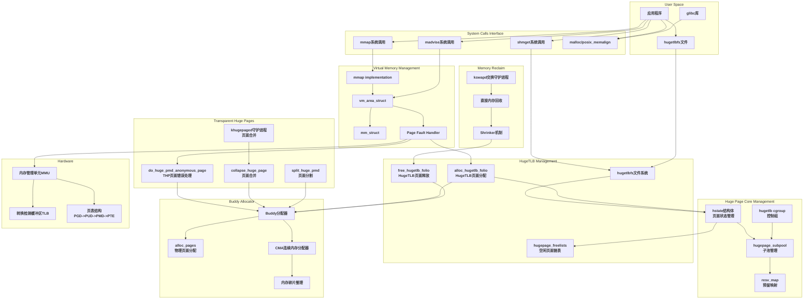

# Linux内核Huge Page详解

## 概述

Huge Page（大页）是Linux内核中一个重要的内存管理优化技术，通过使用比标准页面（通常4KB）更大的页面来提升系统性能。本文档基于Linux内核源码深入分析huge page的实现原理、使用场景和配置方法。

## 模块关系图

下图展示了Linux内核中Huge Page相关模块的完整架构和相互关系：



**图表说明：**

1. **用户空间层**：应用程序通过各种接口申请huge page
2. **系统调用层**：提供mmap、shmget等系统调用接口
3. **虚拟内存管理层**：处理虚拟内存映射和页面故障
4. **Huge Page核心管理层**：维护huge page状态、子池和预留映射
5. **HugeTLB管理层**：专门处理静态huge page的分配和释放
6. **THP管理层**：透明处理动态huge page的生命周期
7. **Buddy分配器层**：提供物理页面分配服务
8. **内存回收层**：负责内存回收和页面释放
9. **硬件层**：MMU、TLB等硬件支持

## 1. Huge Page的基本概念

### 1.1 什么是Huge Page

Huge Page是一种使用更大页面尺寸的内存管理机制，相比标准的4KB页面，huge page可以是2MB、1GB甚至更大。这种技术的核心思想是减少页表条目数量，从而降低TLB（Translation Lookaside Buffer）缺失率，提升内存访问性能。

### 1.2 支持的页面大小

根据内核源码分析，不同架构支持不同的huge page大小：

**x86-64架构：**

- 标准页面：4KB
- 大页：2MB（PMD级别）
- 巨页：1GB（PUD级别）

**ARM64架构：**

- 4KB基础页面：64KB、2MB、32MB、1GB
- 16KB基础页面：2MB、32MB、1GB  
- 64KB基础页面：2MB、512MB、16GB

## 2. 核心数据结构

### 2.1 hstate结构体

```c
struct hstate {
    struct mutex resize_lock;           // 大小调整锁
    int next_nid_to_alloc;             // 下一个分配节点
    int next_nid_to_free;              // 下一个释放节点
    unsigned int order;                 // 页面阶数
    unsigned int demote_order;          // 降级阶数
    unsigned long mask;                 // 页面掩码
    unsigned long max_huge_pages;       // 最大huge page数
    unsigned long nr_huge_pages;        // 当前huge page数
    unsigned long free_huge_pages;      // 空闲huge page数
    unsigned long resv_huge_pages;      // 预留huge page数
    unsigned long surplus_huge_pages;   // 剩余huge page数
    unsigned long nr_overcommit_huge_pages; // 过量分配数
    struct list_head hugepage_activelist;   // 活跃页面链表
    struct list_head hugepage_freelists[MAX_NUMNODES]; // 空闲页面链表
    unsigned int max_huge_pages_node[MAX_NUMNODES];     // 每节点最大数
    unsigned int nr_huge_pages_node[MAX_NUMNODES];      // 每节点当前数
    unsigned int free_huge_pages_node[MAX_NUMNODES];    // 每节点空闲数
    unsigned int surplus_huge_pages_node[MAX_NUMNODES]; // 每节点剩余数
    char name[HSTATE_NAME_LEN];         // 名称
};
```

### 2.2 hugepage_subpool结构体

```c
struct hugepage_subpool {
    spinlock_t lock;        // 自旋锁
    long count;            // 引用计数
    long max_hpages;       // 最大页面数（-1表示无限制）
    long used_hpages;      // 已使用页面数
    struct hstate *hstate; // 关联的hstate
    long min_hpages;       // 最小页面数（-1表示无最小值）
    long rsv_hpages;       // 预留页面数
};
```

### 2.3 resv_map结构体

用于跟踪预留和实例化的页面：

```c
struct resv_map {
    struct kref refs;           // 引用计数
    spinlock_t lock;           // 自旋锁
    struct list_head regions;   // 区域链表
    long adds_in_progress;     // 正在添加的数量
    struct list_head region_cache; // 区域缓存
    long region_cache_count;   // 缓存计数
    struct rw_semaphore rw_sema; // 读写信号量
    // ... cgroup相关字段
};
```

## 3. Huge Page工作原理

### 3.1 TLB优化原理

TLB是CPU中缓存虚拟地址到物理地址映射的硬件缓存。使用huge page可以显著减少TLB条目的使用：

- **4KB页面**：每个TLB条目映射4KB内存
- **2MB huge page**：每个TLB条目映射2MB内存（提升512倍）
- **1GB huge page**：每个TLB条目映射1GB内存（提升262144倍）

### 3.2 页表层级优化

标准页面需要4级页表遍历（PGD→PUD→PMD→PTE），而huge page可以减少层级：

- **2MB huge page**：3级遍历（PGD→PUD→PMD直接映射）
- **1GB huge page**：2级遍历（PGD→PUD直接映射）

### 3.3 内存分配流程

```c
struct folio *alloc_hugetlb_folio(struct vm_area_struct *vma,
                                 unsigned long addr, int avoid_reserve)
{
    // 1. 获取子池和hstate
    struct hugepage_subpool *spool = subpool_vma(vma);
    struct hstate *h = hstate_vma(vma);
    
    // 2. 检查内存控制组限制
    memcg_charge_ret = mem_cgroup_hugetlb_try_charge(memcg, gfp, nr_pages);
    
    // 3. 检查预留映射
    map_chg = vma_needs_reservation(h, vma, addr);
    
    // 4. 从空闲链表获取或从buddy分配器分配
    folio = dequeue_hugetlb_folio_vma(h, vma, addr, avoid_reserve, gbl_chg);
    if (!folio) {
        folio = alloc_buddy_hugetlb_folio_with_mpol(h, vma, addr);
    }
    
    // 5. 更新统计信息和设置子池
    hugetlb_set_folio_subpool(folio, spool);
    
    return folio;
}
```

## 4. Huge Page类型

### 4.1 HugeTLB Pages

静态预分配的huge page，需要在系统启动时或运行时显式配置。

**特点：**

- 页面大小固定（2MB、1GB等）
- 需要预分配内存
- 通过hugetlbfs文件系统访问
- 不会被swap out
- 适合对性能要求极高的应用

### 4.2 Transparent Huge Pages (THP)

内核自动管理的huge page，对应用程序透明。

**特点：**

- 自动分配和释放
- 支持页面分割和合并
- 通过khugepaged后台进程优化
- 可以被swap out
- 适合一般应用程序

根据源码中的配置选项：

```c
config TRANSPARENT_HUGEPAGE
    bool "Transparent Hugepage Support"
    depends on HAVE_ARCH_TRANSPARENT_HUGEPAGE && !PREEMPT_RT
    select COMPACTION
    select XARRAY_MULTI
    help
      Transparent Hugepages allows the kernel to use huge pages and
      huge tlb transparently to the applications whenever possible.
      This feature can improve computing performance to certain
      applications by speeding up page faults during memory
      allocation, by reducing the number of tlb misses and by speeding
      up the pagetable walking.
```

### 4.3 THP详细管理原理

#### 4.3.1 THP核心数据结构

**compound_page结构：**

```c
// THP使用compound page机制
struct page {
    // ... 标准字段 ...
    union {
        struct {
            unsigned long compound_head;  // 复合页头部
            unsigned int compound_dtor;   // 析构函数索引
            unsigned int compound_order;  // 页面阶数
            atomic_t compound_mapcount;   // 映射计数
            unsigned int compound_nr;     // 页面数量
        };
    };
};
```

**mm_slot结构（khugepaged使用）：**

```c
struct mm_slot {
    struct list_head mm_node;    // 链表节点
    struct mm_struct *mm;        // 内存管理结构
    int nr_pte_mapped_thp;       // PTE映射的THP数量
    unsigned long insertion_time; // 插入时间
};
```

#### 4.3.2 THP分配流程

THP的分配主要在页面故障处理中进行：

```c
static vm_fault_t do_huge_pmd_anonymous_page(struct vm_fault *vmf)
{
    struct vm_area_struct *vma = vmf->vma;
    gfp_t gfp;
    struct folio *folio;
    unsigned long haddr = vmf->address & HPAGE_PMD_MASK;
    
    // 1. 检查是否可以使用THP
    if (!transhuge_vma_suitable(vma, haddr))
        return VM_FAULT_FALLBACK;
    
    // 2. 检查内存控制组限制
    if (mem_cgroup_charge(folio, vma->vm_mm, gfp))
        goto release;
    
    // 3. 尝试从buddy分配器分配2MB页面
    gfp = alloc_hugepage_direct_gfpmask(vma);
    folio = vma_alloc_folio(gfp, HPAGE_PMD_ORDER, vma, haddr, true);
    
    if (unlikely(!folio)) {
        // 分配失败，回退到普通页面
        return VM_FAULT_FALLBACK;
    }
    
    // 4. 设置页面属性
    folio_zero_user(folio, haddr);
    __folio_mark_uptodate(folio);
    
    // 5. 设置PMD表项
    vmf->ptl = pmd_lock(vma->vm_mm, vmf->pmd);
    if (unlikely(!pmd_none(*vmf->pmd))) {
        goto unlock_release;
    }
    
    // 6. 建立映射
    entry = mk_huge_pmd(&folio->page, vma->vm_page_prot);
    entry = maybe_pmd_mkwrite(pmd_mkdirty(entry), vma);
    folio_add_new_anon_rmap(folio, vma, haddr);
    set_pmd_at(vma->vm_mm, haddr, vmf->pmd, entry);
    
    return 0;
}
```

#### 4.3.3 khugepaged后台合并机制

khugepaged是专门的内核线程，负责将普通4KB页面合并为2MB的THP：

```c
static void khugepaged_scan_mm_slot(struct mm_slot *mm_slot)
{
    struct mm_struct *mm = mm_slot->mm;
    struct vm_area_struct *vma;
    
    // 遍历VMA寻找合并机会
    for (vma = mm->mmap; vma; vma = vma->vm_next) {
        if (!hugepage_vma_check(vma, vma->vm_flags))
            continue;
            
        // 扫描VMA中的页面
        khugepaged_scan_pmd(mm, vma, khugepaged_scan.address,
                           &mmap_locked, &mm_slot);
    }
}

static int khugepaged_scan_pmd(struct mm_struct *mm,
                               struct vm_area_struct *vma,
                               unsigned long address,
                               bool *mmap_locked,
                               struct mm_slot **mm_slot)
{
    pmd_t *pmd;
    pte_t *pte, *_pte;
    int ret = 0, result = SCAN_FAIL;
    int referenced = 0, writable = 0;
    unsigned long _address;
    spinlock_t *ptl;
    int node = NUMA_NO_NODE, unmapped = 0;
    bool locked = false;
    
    // 检查是否满足合并条件
    for (_address = address, _pte = pte;
         _pte < pte + HPAGE_PMD_NR; _pte++, _address += PAGE_SIZE) {
        
        pte_t pteval = *_pte;
        if (pte_none(pteval) || (pte_present(pteval) &&
                                is_zero_pfn(pte_pfn(pteval)))) {
            if (++unmapped <= khugepaged_max_ptes_none) {
                continue;
            } else {
                result = SCAN_EXCEED_NONE_PTE;
                goto out_unmap;
            }
        }
        
        // ... 更多检查逻辑 ...
    }
    
    // 满足条件则进行合并
    if (result == SCAN_SUCCEED) {
        result = collapse_huge_page(mm, address, referenced, unmapped, mm_slot);
    }
    
    return result;
}
```

#### 4.3.4 THP页面分割机制

当内存压力较大或需要部分页面时，THP可以被分割为普通页面：

```c
void split_huge_pmd(struct vm_area_struct *vma, pmd_t *pmd, unsigned long address)
{
    struct folio *folio;
    struct page *page;
    
    // 获取PMD锁
    spinlock_t *ptl = pmd_lock(vma->vm_mm, pmd);
    
    if (unlikely(!pmd_trans_huge(*pmd) && !pmd_devmap(*pmd)))
        goto out;
        
    // 获取页面
    page = pmd_page(*pmd);
    folio = page_folio(page);
    
    // 执行分割
    if (folio_test_anon(folio)) {
        __split_huge_pmd(vma, pmd, address, false, NULL);
    } else {
        __split_huge_pmd_locked(vma, pmd, address, false);
    }
    
out:
    spin_unlock(ptl);
}

static void __split_huge_pmd_locked(struct vm_area_struct *vma, pmd_t *pmd,
                                   unsigned long haddr, bool freeze)
{
    struct mm_struct *mm = vma->vm_mm;
    struct page *page;
    pgtable_t pgtable;
    pmd_t old_pmd, _pmd;
    bool young, write, soft_dirty, pmd_migration = false;
    unsigned long addr;
    pte_t *pte;
    int i;
    
    // 分配PTE页表
    pgtable = pte_alloc_one(mm);
    if (unlikely(!pgtable))
        return;
    
    page = pmd_page(old_pmd);
    
    // 设置每个4KB页面的PTE表项
    for (i = 0, addr = haddr; i < HPAGE_PMD_NR; i++, addr += PAGE_SIZE) {
        pte_t entry;
        entry = mk_pte(page + i, vma->vm_page_prot);
        
        // 设置页面属性
        entry = maybe_mkwrite(entry, vma);
        if (young)
            entry = pte_mkyoung(entry);
        if (soft_dirty)
            entry = pte_mksoft_dirty(entry);
            
        set_pte_at(mm, addr, pte + i, entry);
    }
    
    // 更新PMD，指向新的PTE页表
    pmd_populate(mm, pmd, pgtable);
}
```

#### 4.3.5 THP内存回收

THP参与标准的内存回收流程，但有特殊处理：

```c
static int shrink_folio_list(struct list_head *folio_list,
                            struct pglist_data *pgdat,
                            struct scan_control *sc,
                            struct reclaim_stat *stat,
                            bool ignore_references)
{
    LIST_HEAD(ret_folios);
    LIST_HEAD(free_folios);
    unsigned int nr_reclaimed = 0;
    
    while (!list_empty(folio_list)) {
        struct folio *folio = lru_to_folio(folio_list);
        
        // 对于THP，可能需要分割
        if (folio_test_large(folio)) {
            if (!can_split_folio(folio, NULL)) {
                // 不能分割，跳过回收
                goto keep_locked;
            }
            
            // 尝试分割THP
            if (split_folio_to_list(folio, folio_list)) {
                // 分割失败
                goto keep_locked;
            }
        }
        
        // ... 正常回收逻辑 ...
    }
    
    return nr_reclaimed;
}
```

#### 4.3.6 THP状态监控

THP提供了丰富的统计信息：

```c
// 主要THP统计计数器
enum thp_stat_item {
    THP_FAULT_ALLOC,        // THP分配成功次数
    THP_FAULT_FALLBACK,     // THP分配失败回退次数
    THP_FAULT_FALLBACK_CHARGE, // 由于charge失败的回退
    THP_COLLAPSE_ALLOC,     // khugepaged合并成功次数
    THP_COLLAPSE_ALLOC_FAILED, // khugepaged合并失败次数
    THP_FILE_ALLOC,         // 文件THP分配次数
    THP_FILE_FALLBACK,      // 文件THP分配失败次数
    THP_FILE_MAPPED,        // 文件THP映射次数
    THP_SPLIT_PAGE,         // THP分割次数
    THP_SPLIT_PAGE_FAILED,  // THP分割失败次数
    THP_DEFERRED_SPLIT_PAGE, // 延迟分割次数
    THP_SPLIT_PMD,          // PMD分割次数
    THP_SCAN_EXCEED_NONE_PTE, // 扫描超过空PTE限制
    THP_SCAN_EXCEED_SWAP_PTE, // 扫描超过交换PTE限制
    THP_SCAN_EXCEED_SHARE_PTE, // 扫描超过共享PTE限制
    NR_THP_STAT
};
```

#### 4.3.7 THP工作模式

THP支持三种工作模式：

1. **always模式**：积极分配THP，适合内存充足的系统
2. **madvise模式**：仅对标记MADV_HUGEPAGE的区域使用THP
3. **never模式**：完全禁用THP

```c
static ssize_t enabled_store(struct kobject *kobj,
                            struct kobj_attribute *attr,
                            const char *buf, size_t count)
{
    if (sysfs_streq(buf, "always")) {
        clear_bit(TRANSPARENT_HUGEPAGE_REQ_MADV_FLAG, &transparent_hugepage_flags);
        set_bit(TRANSPARENT_HUGEPAGE_FLAG, &transparent_hugepage_flags);
    } else if (sysfs_streq(buf, "madvise")) {
        clear_bit(TRANSPARENT_HUGEPAGE_FLAG, &transparent_hugepage_flags);
        set_bit(TRANSPARENT_HUGEPAGE_REQ_MADV_FLAG, &transparent_hugepage_flags);
    } else if (sysfs_streq(buf, "never")) {
        clear_bit(TRANSPARENT_HUGEPAGE_FLAG, &transparent_hugepage_flags);
        clear_bit(TRANSPARENT_HUGEPAGE_REQ_MADV_FLAG, &transparent_hugepage_flags);
    }
    
    return count;
}
```

## 5. 使用场景

### 5.1 数据库系统

**适用原因：**

- 大内存缓冲池（如MySQL的InnoDB buffer pool）
- 频繁的随机内存访问
- 大量的数据页缓存

**性能提升：**

- 减少TLB缺失，提升查询性能
- 降低页表遍历开销
- 提高缓存命中率

### 5.2 虚拟化平台

**适用原因：**

- 客户机需要大量连续内存
- 嵌套页表转换开销大
- 虚拟机内存访问频繁

**性能提升：**

- 减少EPT/NPT页表层级
- 降低虚拟化开销
- 提升客户机性能

### 5.3 高性能计算 (HPC)

**适用原因：**

- 大数据集处理
- 科学计算应用
- 密集的内存访问模式

**性能提升：**

- 减少内存管理开销
- 提高计算效率
- 降低系统调用开销

### 5.4 内存数据库

**适用原因：**

- 全内存数据存储（如Redis、MongoDB）
- 大内存工作集
- 高并发访问

**性能提升：**

- 减少内存碎片
- 提升访问速度
- 降低延迟

### 5.5 容器化环境

**适用原因：**

- 容器密度高
- 内存使用量大
- 需要性能隔离

**性能提升：**

- 提升容器启动速度
- 减少内存管理开销
- 优化资源利用率

## 6. 配置和使用方法

### 6.1 内核配置

编译内核时需要启用相关选项：

```bash
CONFIG_HUGETLBFS=y          # HugeTLB文件系统支持
CONFIG_HUGETLB_PAGE=y       # HugeTLB页面支持
CONFIG_TRANSPARENT_HUGEPAGE=y # 透明大页支持
```

### 6.2 静态配置HugeTLB Pages

#### 6.2.1 系统级配置

```bash
# 设置2MB huge page数量
echo 1024 > /proc/sys/vm/nr_hugepages

# 设置1GB huge page数量
echo 4 > /sys/kernel/mm/hugepages/hugepages-1048576kB/nr_hugepages

# 查看当前配置
cat /proc/meminfo | grep -i huge
```

#### 6.2.2 NUMA节点配置

```bash
# 在特定NUMA节点分配huge page
echo 512 > /sys/devices/system/node/node0/hugepages/hugepages-2048kB/nr_hugepages
echo 512 > /sys/devices/system/node/node1/hugepages/hugepages-2048kB/nr_hugepages
```

#### 6.2.3 启动参数配置

```bash
# 在内核启动参数中配置
hugepagesz=2M hugepages=1024 hugepagesz=1G hugepages=4
```

### 6.3 挂载hugetlbfs

```bash
# 创建挂载点
mkdir /mnt/huge

# 挂载hugetlbfs（2MB页面）
mount -t hugetlbfs -o pagesize=2M none /mnt/huge

# 挂载hugetlbfs（1GB页面）
mount -t hugetlbfs -o pagesize=1G none /mnt/huge1G

# 添加到/etc/fstab实现自动挂载
echo "none /mnt/huge hugetlbfs pagesize=2M 0 0" >> /etc/fstab
```

### 6.4 透明大页配置

```bash
# 启用透明大页
echo always > /sys/kernel/mm/transparent_hugepage/enabled

# 仅在madvise时使用
echo madvise > /sys/kernel/mm/transparent_hugepage/enabled

# 禁用透明大页
echo never > /sys/kernel/mm/transparent_hugepage/enabled

# 配置碎片整理
echo always > /sys/kernel/mm/transparent_hugepage/defrag
```

### 6.5 Huge Page申请分配方式详解

Linux内核为应用程序提供了多种huge page的申请和使用方式，每种方式都有其特定的使用场景和优缺点。

#### 6.5.1 mmap系统调用方式

这是最直接和常用的huge page申请方式。mmap支持两种内存分配机制：**按需分配**和**预分配**。

##### 6.5.1.1 按需分配机制（默认行为）

**默认情况下，mmap是按需分配的：**

- mmap调用成功后只建立虚拟内存映射，不会立即分配物理huge page
- 当程序首次访问这些虚拟地址时，会触发缺页中断（page fault）
- 内核在缺页中断处理函数中才真正分配huge page物理内存
- 这种机制节省内存，只有实际使用的页面才会占用物理内存

```c
#include <sys/mman.h>
#include <stdio.h>
#include <unistd.h>

// 演示按需分配
void demo_demand_allocation() {
    size_t size = 4 * 1024 * 1024;  // 4MB (2个2MB huge page)
    
    printf("调用mmap前，检查huge page使用情况:\n");
    system("cat /proc/meminfo | grep -i hugepages");
    
    // mmap调用，仅建立虚拟映射
void *addr = mmap(NULL, size, PROT_READ | PROT_WRITE,
                      MAP_PRIVATE | MAP_ANONYMOUS | MAP_HUGETLB | MAP_HUGE_2MB,
                  -1, 0);

    if (addr == MAP_FAILED) {
        perror("mmap failed");
        return;
    }
    
    printf("\nmmap调用后（未访问内存），huge page使用情况:\n");
    system("cat /proc/meminfo | grep -i hugepages");
    
    // 访问内存，触发缺页中断和实际分配
    printf("\n开始访问内存，触发huge page分配...\n");
    char *ptr = (char *)addr;
    
    // 访问第一个2MB页面
    ptr[0] = 'A';
    printf("访问第一个huge page后:\n");
    system("cat /proc/meminfo | grep -i hugepages");
    
    // 访问第二个2MB页面  
    ptr[2*1024*1024] = 'B';
    printf("\n访问第二个huge page后:\n");
    system("cat /proc/meminfo | grep -i hugepages");
    
    munmap(addr, size);
}
```

##### 6.5.1.2 预分配机制

**使用MAP_POPULATE标志实现预分配：**

- MAP_POPULATE标志告诉内核立即分配和映射所有页面
- mmap调用时就会分配真实的huge page物理内存
- 所有页表条目立即建立，无需等待缺页中断
- 适用于确定会使用全部内存的场景

```c
#include <sys/mman.h>

// 预分配huge page
void *alloc_hugepage_prefault(size_t size) {
    printf("使用MAP_POPULATE预分配huge page:\n");
    system("cat /proc/meminfo | grep HugePages_Free");
    
    void *addr = mmap(NULL, size, PROT_READ | PROT_WRITE,
                      MAP_PRIVATE | MAP_ANONYMOUS | MAP_HUGETLB | 
                      MAP_HUGE_2MB | MAP_POPULATE,  // 关键：MAP_POPULATE标志
                      -1, 0);
    
    if (addr == MAP_FAILED) {
        perror("mmap with MAP_POPULATE failed");
        return NULL;
    }
    
    printf("mmap调用完成后（已预分配）:\n");
    system("cat /proc/meminfo | grep HugePages_Free");
    
    return addr;
}

// 完整的预分配示例
int hugepage_prefault_example() {
    size_t size = 10 * 1024 * 1024;  // 10MB
    
    void *addr = alloc_hugepage_prefault(size);
    if (!addr) return -1;
    
    // 内存已经分配，可以直接使用，无缺页中断开销
    memset(addr, 0x42, size);
    printf("预分配内存已就绪，可直接使用\n");
    
    munmap(addr, size);
    return 0;
}
```

##### 6.5.1.3 内存锁定预分配

**使用mlock系列函数确保内存常驻：**

```c
#include <sys/mman.h>

// 分配并锁定huge page
void *alloc_and_lock_hugepage(size_t size) {
    // 先分配
void *addr = mmap(NULL, size, PROT_READ | PROT_WRITE,
                  MAP_PRIVATE | MAP_ANONYMOUS | MAP_HUGETLB | MAP_HUGE_2MB,
                  -1, 0);
    
    if (addr == MAP_FAILED) {
        perror("mmap failed");
        return NULL;
    }
    
    // 锁定内存，强制分配并防止swap
    if (mlock(addr, size) == -1) {
        perror("mlock failed");
        munmap(addr, size);
        return NULL;
    }
    
    printf("Huge page已分配并锁定在物理内存中\n");
    return addr;
}

// 释放锁定的内存
void free_locked_hugepage(void *addr, size_t size) {
    munlock(addr, size);  // 解锁
    munmap(addr, size);   // 解映射
}
```

##### 6.5.1.4 预分配的内存特性

**预分配确实会划出真实的内存块：**

1. **物理内存分配**：
   - 从系统的huge page池中立即分配物理内存
   - HugePages_Free计数会立即减少
   - 内存页面状态变为已分配(allocated)

2. **页表建立**：
   - 完整的页表映射立即建立
   - PMD条目指向实际的物理huge page
   - MMU可以直接进行地址转换

3. **内存属性**：
   - 页面被标记为存在(present)和可访问
   - 对于MAP_POPULATE，页面会被"预热"到TLB中
   - 锁定的页面不会被内存回收机制处理

```c
// 检查预分配效果的完整示例
void verify_preallocation() {
    size_t huge_page_size = 2 * 1024 * 1024;  // 2MB
    size_t alloc_size = 5 * huge_page_size;   // 10MB
    
    printf("分配前的系统状态:\n");
    system("cat /proc/meminfo | grep -E 'HugePages_(Total|Free|Rsvd)'");
    
    // 预分配方式1: MAP_POPULATE
    void *addr1 = mmap(NULL, alloc_size, PROT_READ | PROT_WRITE,
                       MAP_PRIVATE | MAP_ANONYMOUS | MAP_HUGETLB | 
                       MAP_HUGE_2MB | MAP_POPULATE, -1, 0);
    
    printf("\nMAP_POPULATE分配后:\n");
    system("cat /proc/meminfo | grep -E 'HugePages_(Total|Free|Rsvd)'");
    
    // 预分配方式2: mlock强制分配
    void *addr2 = mmap(NULL, alloc_size, PROT_READ | PROT_WRITE,
                       MAP_PRIVATE | MAP_ANONYMOUS | MAP_HUGETLB | MAP_HUGE_2MB,
                       -1, 0);
    mlock(addr2, alloc_size);
    
    printf("\nmlock分配后:\n");
    system("cat /proc/meminfo | grep -E 'HugePages_(Total|Free|Rsvd)'");
    
    // 清理
    if (addr1 != MAP_FAILED) munmap(addr1, alloc_size);
    if (addr2 != MAP_FAILED) {
        munlock(addr2, alloc_size);
        munmap(addr2, alloc_size);
    }
    
    printf("\n释放后:\n");
    system("cat /proc/meminfo | grep -E 'HugePages_(Total|Free|Rsvd)'");
}

##### 6.5.1.5 基本mmap使用示例

**通用的huge page分配函数：**

```c
#include <sys/mman.h>
#include <errno.h>
#include <stdio.h>

// 申请2MB的huge page（按需分配）
void *alloc_hugepage_mmap(size_t size) {
    void *addr = mmap(NULL, size, PROT_READ | PROT_WRITE,
                      MAP_PRIVATE | MAP_ANONYMOUS | MAP_HUGETLB,
                      -1, 0);
    
    if (addr == MAP_FAILED) {
        perror("mmap huge page failed");
        return NULL;
    }
    
    return addr;
}

// 指定huge page大小
void *alloc_hugepage_size(size_t size, int huge_size) {
    int flags = MAP_PRIVATE | MAP_ANONYMOUS | MAP_HUGETLB;
    
    switch (huge_size) {
        case 2*1024*1024:   // 2MB
            flags |= MAP_HUGE_2MB;
            break;
        case 1024*1024*1024: // 1GB
            flags |= MAP_HUGE_1GB;
            break;
        default:
            fprintf(stderr, "Unsupported huge page size\n");
            return NULL;
    }
    
    void *addr = mmap(NULL, size, PROT_READ | PROT_WRITE, flags, -1, 0);
    
    if (addr == MAP_FAILED) {
        perror("mmap huge page with specific size failed");
        return NULL;
    }
    
    return addr;
}

// 带错误处理的完整示例
int hugepage_mmap_example() {
    size_t huge_size = 2 * 1024 * 1024;  // 2MB
    size_t alloc_size = 10 * huge_size;  // 20MB
    
    void *huge_mem = mmap(NULL, alloc_size, 
                          PROT_READ | PROT_WRITE,
                          MAP_PRIVATE | MAP_ANONYMOUS | MAP_HUGETLB | MAP_HUGE_2MB,
                          -1, 0);
    
    if (huge_mem == MAP_FAILED) {
        switch (errno) {
            case ENOMEM:
                printf("No sufficient huge pages available\n");
                break;
            case EPERM:
                printf("Permission denied, check ulimit\n");
                break;
            case EINVAL:
                printf("Invalid parameters\n");
                break;
            default:
                perror("mmap failed");
        }
        return -1;
    }
    
    // 使用内存（此时触发按需分配）
    memset(huge_mem, 0x42, alloc_size);
    
    // 释放内存
    munmap(huge_mem, alloc_size);
    return 0;
}
```

##### 6.5.1.6 mmap分配机制总结

| 分配方式 | 标志组合 | 分配时机 | 物理内存占用 | 适用场景 |
|---------|---------|----------|-------------|----------|
| **按需分配** | `MAP_HUGETLB` | 首次访问时 | 延迟占用 | 内存使用不确定 |
| **立即预分配** | `MAP_HUGETLB \| MAP_POPULATE` | mmap调用时 | 立即占用 | 确定使用全部内存 |
| **锁定预分配** | `MAP_HUGETLB` + `mlock()` | mlock调用时 | 立即占用+锁定 | 关键性能路径 |

**关键技术要点：**

1. **按需分配优势**：节省内存，支持overcommit
2. **预分配优势**：无缺页中断开销，确定的内存延迟
3. **内存池管理**：预分配直接从huge page池分配真实物理内存
4. **页表映射**：预分配建立完整的PMD到物理页面映射
5. **TLB预热**：MAP_POPULATE可能将映射预加载到TLB中

#### 6.5.2 System V共享内存方式

适合需要进程间共享huge page的场景：

```c
#include <sys/shm.h>
#include <sys/ipc.h>
#include <errno.h>

// 创建shared memory huge page
int create_shm_hugepage(key_t key, size_t size) {
int shmid = shmget(key, size, IPC_CREAT | SHM_HUGETLB | 0666);
    
    if (shmid == -1) {
        switch (errno) {
            case EINVAL:
                printf("Huge pages not supported or invalid size\n");
                break;
            case ENOMEM:
                printf("No sufficient huge pages available\n");
                break;
            case ENOSPC:
                printf("Shared memory limit exceeded\n");
                break;
            default:
                perror("shmget failed");
        }
        return -1;
    }
    
    return shmid;
}

// 附加共享内存
void *attach_shm_hugepage(int shmid) {
void *addr = shmat(shmid, NULL, 0);
    
    if (addr == (void *)-1) {
        perror("shmat failed");
        return NULL;
    }
    
    return addr;
}

// 完整的System V共享内存示例
int sysv_shm_example() {
    key_t key = ftok("/tmp", 'H');  // 生成key
    size_t size = 4 * 1024 * 1024;  // 4MB
    
    // 创建共享内存段
    int shmid = create_shm_hugepage(key, size);
    if (shmid == -1) return -1;
    
    // 附加到当前进程
    void *addr = attach_shm_hugepage(shmid);
    if (addr == NULL) {
        shmctl(shmid, IPC_RMID, NULL);
        return -1;
    }
    
    // 使用共享内存
    sprintf((char *)addr, "Hello from huge page shared memory!");
    
    // 分离共享内存
    shmdt(addr);
    
    // 删除共享内存段
    shmctl(shmid, IPC_RMID, NULL);
    
    return 0;
}
```

#### 6.5.3 hugetlbfs文件系统方式

通过文件系统接口使用huge page：

```c
#include <fcntl.h>
#include <sys/mman.h>
#include <unistd.h>

// 通过hugetlbfs创建huge page映射
void *create_hugetlbfs_mapping(const char *filename, size_t size) {
    // 创建文件
    int fd = open(filename, O_CREAT | O_RDWR, 0666);
    if (fd == -1) {
        perror("open hugetlbfs file failed");
        return NULL;
    }
    
    // 设置文件大小
    if (ftruncate(fd, size) == -1) {
        perror("ftruncate failed");
        close(fd);
        return NULL;
    }

// 映射文件到内存
    void *addr = mmap(NULL, size, PROT_READ | PROT_WRITE, MAP_SHARED, fd, 0);
    
    if (addr == MAP_FAILED) {
        perror("mmap hugetlbfs file failed");
        close(fd);
        unlink(filename);
        return NULL;
    }
    
    close(fd);  // 可以关闭文件描述符，映射仍然有效
    return addr;
}

// hugetlbfs示例
int hugetlbfs_example() {
    const char *hugefile = "/mnt/huge/myapp_hugepage";
    size_t size = 8 * 1024 * 1024;  // 8MB
    
    void *addr = create_hugetlbfs_mapping(hugefile, size);
    if (addr == NULL) return -1;
    
    // 使用内存
    strcpy((char *)addr, "Data stored in huge page via hugetlbfs");
    printf("Data: %s\n", (char *)addr);
    
    // 解除映射
    munmap(addr, size);
    unlink(hugefile);
    
    return 0;
}
```

#### 6.5.4 madvise建议方式

通过madvise系统调用影响THP行为：

```c
#include <sys/mman.h>

// 建议使用huge page
int advise_hugepage(void *addr, size_t size) {
    if (madvise(addr, size, MADV_HUGEPAGE) == -1) {
        perror("madvise MADV_HUGEPAGE failed");
        return -1;
    }
    return 0;
}

// 建议不使用huge page
int advise_no_hugepage(void *addr, size_t size) {
    if (madvise(addr, size, MADV_NOHUGEPAGE) == -1) {
        perror("madvise MADV_NOHUGEPAGE failed");
        return -1;
    }
    return 0;
}

// 完整的madvise示例
int madvise_example() {
    size_t size = 10 * 1024 * 1024;  // 10MB
    
    // 普通匿名映射
void *addr = mmap(NULL, size, PROT_READ | PROT_WRITE,
                      MAP_PRIVATE | MAP_ANONYMOUS, -1, 0);
    
    if (addr == MAP_FAILED) {
        perror("mmap failed");
        return -1;
    }
    
    // 建议内核为这块内存使用huge page
    if (advise_hugepage(addr, size) == -1) {
        munmap(addr, size);
        return -1;
    }
    
    // 触发页面分配和可能的THP合并
    memset(addr, 0x55, size);
    
    // 检查THP状态（可选）
    printf("Memory allocated and advised for huge page usage\n");
    
    munmap(addr, size);
    return 0;
}
```

#### 6.5.5 POSIX共享内存方式

使用POSIX共享内存接口：

```c
#include <sys/mman.h>
#include <fcntl.h>
#include <unistd.h>

// POSIX共享内存with huge page
void *create_posix_shm_hugepage(const char *name, size_t size) {
    // 创建或打开共享内存对象
    int fd = shm_open(name, O_CREAT | O_RDWR, 0666);
    if (fd == -1) {
        perror("shm_open failed");
        return NULL;
    }
    
    // 设置大小
    if (ftruncate(fd, size) == -1) {
        perror("ftruncate failed");
        close(fd);
        shm_unlink(name);
        return NULL;
    }
    
    // 映射并请求huge page
    void *addr = mmap(NULL, size, PROT_READ | PROT_WRITE,
                      MAP_SHARED, fd, 0);
    
    if (addr == MAP_FAILED) {
        perror("mmap failed");
        close(fd);
        shm_unlink(name);
        return NULL;
    }
    
    // 建议使用huge page
madvise(addr, size, MADV_HUGEPAGE);

    close(fd);
    return addr;
}

// POSIX共享内存示例
int posix_shm_example() {
    const char *shm_name = "/myhugeshm";
    size_t size = 16 * 1024 * 1024;  // 16MB
    
    void *addr = create_posix_shm_hugepage(shm_name, size);
    if (addr == NULL) return -1;
    
    // 使用共享内存
    sprintf((char *)addr, "POSIX shared memory with huge page support");
    
    // 解除映射
    munmap(addr, size);
    shm_unlink(shm_name);
    
    return 0;
}
```

#### 6.5.6 内存分配库集成方式

与常用内存分配库的集成：

**glibc malloc集成：**

```c
#include <stdlib.h>
#include <malloc.h>

// 使用posix_memalign分配对齐内存
void *alloc_aligned_hugepage(size_t size) {
    void *ptr;
    size_t huge_page_size = 2 * 1024 * 1024;  // 2MB对齐
    
    // 分配对齐到huge page边界的内存
    int ret = posix_memalign(&ptr, huge_page_size, size);
    if (ret != 0) {
        errno = ret;
        perror("posix_memalign failed");
        return NULL;
    }
    
    // 建议使用huge page
    madvise(ptr, size, MADV_HUGEPAGE);
    
    return ptr;
}

// 使用aligned_alloc（C11标准）
void *alloc_c11_aligned(size_t size) {
    size_t huge_page_size = 2 * 1024 * 1024;
    size_t aligned_size = (size + huge_page_size - 1) & ~(huge_page_size - 1);
    
    void *ptr = aligned_alloc(huge_page_size, aligned_size);
    if (ptr == NULL) {
        perror("aligned_alloc failed");
        return NULL;
    }
    
    madvise(ptr, aligned_size, MADV_HUGEPAGE);
    return ptr;
}
```

**jemalloc集成：**

```c
#include <jemalloc/jemalloc.h>

// jemalloc with huge page support
void *jemalloc_hugepage(size_t size) {
    // 配置jemalloc使用huge page
    mallctl("opt.metadata_thp", NULL, NULL, "auto", sizeof("auto"));
    
    void *ptr = malloc(size);
    if (ptr && size >= 2*1024*1024) {
        // 对大分配建议使用huge page
        madvise(ptr, size, MADV_HUGEPAGE);
    }
    
    return ptr;
}
```

#### 6.5.7 内核直接分配接口

通过特殊设备或接口直接分配：

```c
// 使用/dev/hugepages设备（如果可用）
void *direct_hugepage_alloc(size_t size) {
    int fd = open("/dev/hugepages", O_RDWR);
    if (fd == -1) {
        perror("open /dev/hugepages failed");
        return NULL;
    }
    
    void *addr = mmap(NULL, size, PROT_READ | PROT_WRITE,
                      MAP_SHARED, fd, 0);
    
    close(fd);
    
    if (addr == MAP_FAILED) {
        perror("mmap /dev/hugepages failed");
        return NULL;
    }
    
    return addr;
}

// 使用memfd_create创建内存文件描述符
#include <sys/memfd.h>

void *memfd_hugepage_alloc(size_t size) {
    // 创建内存文件描述符
    int fd = memfd_create("hugepage_mem", MFD_HUGETLB | MFD_HUGE_2MB);
    if (fd == -1) {
        perror("memfd_create failed");
        return NULL;
    }
    
    // 设置大小
    if (ftruncate(fd, size) == -1) {
        perror("ftruncate failed");
        close(fd);
        return NULL;
    }
    
    // 映射内存
    void *addr = mmap(NULL, size, PROT_READ | PROT_WRITE,
                      MAP_SHARED, fd, 0);
    
    close(fd);
    
    if (addr == MAP_FAILED) {
        perror("mmap memfd failed");
        return NULL;
    }
    
    return addr;
}
```

#### 6.5.8 性能测试和验证

检查huge page是否真的被使用：

```c
#include <stdio.h>
#include <stdlib.h>

// 检查进程的huge page使用情况
void check_hugepage_usage(pid_t pid) {
    char filename[256];
    snprintf(filename, sizeof(filename), "/proc/%d/smaps", pid);
    
    FILE *fp = fopen(filename, "r");
    if (fp == NULL) {
        perror("fopen smaps failed");
        return;
    }
    
    char line[256];
    while (fgets(line, sizeof(line), fp)) {
        if (strstr(line, "AnonHugePages:") || strstr(line, "ShmemHugePages:")) {
            printf("%s", line);
        }
    }
    
    fclose(fp);
}

// 简单的性能测试
void hugepage_performance_test(void *addr, size_t size) {
    struct timespec start, end;
    
    clock_gettime(CLOCK_MONOTONIC, &start);
    
    // 写入测试
    char *ptr = (char *)addr;
    for (size_t i = 0; i < size; i += 4096) {
        ptr[i] = (char)(i & 0xFF);
    }
    
    clock_gettime(CLOCK_MONOTONIC, &end);
    
    double elapsed = (end.tv_sec - start.tv_sec) + 
                    (end.tv_nsec - start.tv_nsec) / 1e9;
    
    printf("Huge page write test: %.6f seconds for %zu bytes\n", 
           elapsed, size);
}
```

#### 6.5.9 错误处理和最佳实践

```c
// 综合示例：带完整错误处理的huge page分配
typedef enum {
    HUGEPAGE_METHOD_MMAP,
    HUGEPAGE_METHOD_SYSV_SHM,
    HUGEPAGE_METHOD_HUGETLBFS,
    HUGEPAGE_METHOD_POSIX_SHM
} hugepage_method_t;

typedef struct {
    void *addr;
    size_t size;
    hugepage_method_t method;
    int fd_or_shmid;
    char *filename;
} hugepage_allocation_t;

hugepage_allocation_t *alloc_hugepage_robust(size_t size, 
                                            hugepage_method_t method) {
    hugepage_allocation_t *alloc = malloc(sizeof(hugepage_allocation_t));
    if (!alloc) return NULL;
    
    memset(alloc, 0, sizeof(hugepage_allocation_t));
    alloc->size = size;
    alloc->method = method;
    alloc->fd_or_shmid = -1;
    
    switch (method) {
        case HUGEPAGE_METHOD_MMAP:
            alloc->addr = mmap(NULL, size, PROT_READ | PROT_WRITE,
                             MAP_PRIVATE | MAP_ANONYMOUS | MAP_HUGETLB,
                             -1, 0);
            break;
            
        case HUGEPAGE_METHOD_SYSV_SHM:
            alloc->fd_or_shmid = shmget(IPC_PRIVATE, size, 
                                       IPC_CREAT | SHM_HUGETLB | 0600);
            if (alloc->fd_or_shmid != -1) {
                alloc->addr = shmat(alloc->fd_or_shmid, NULL, 0);
                if (alloc->addr == (void *)-1) {
                    alloc->addr = NULL;
                }
            }
            break;
            
        case HUGEPAGE_METHOD_HUGETLBFS:
            // 需要预先设置filename
            if (alloc->filename) {
                alloc->fd_or_shmid = open(alloc->filename, O_CREAT | O_RDWR, 0666);
                if (alloc->fd_or_shmid != -1) {
                    ftruncate(alloc->fd_or_shmid, size);
                    alloc->addr = mmap(NULL, size, PROT_READ | PROT_WRITE,
                                     MAP_SHARED, alloc->fd_or_shmid, 0);
                    if (alloc->addr == MAP_FAILED) {
                        alloc->addr = NULL;
                    }
                }
            }
            break;
            
        default:
            free(alloc);
            return NULL;
    }
    
    if (alloc->addr == NULL || alloc->addr == MAP_FAILED) {
        free(alloc);
        return NULL;
    }
    
    return alloc;
}

void free_hugepage_robust(hugepage_allocation_t *alloc) {
    if (!alloc) return;
    
    switch (alloc->method) {
        case HUGEPAGE_METHOD_MMAP:
            munmap(alloc->addr, alloc->size);
            break;
            
        case HUGEPAGE_METHOD_SYSV_SHM:
            shmdt(alloc->addr);
            if (alloc->fd_or_shmid != -1) {
                shmctl(alloc->fd_or_shmid, IPC_RMID, NULL);
            }
            break;
            
        case HUGEPAGE_METHOD_HUGETLBFS:
            munmap(alloc->addr, alloc->size);
            if (alloc->fd_or_shmid != -1) {
                close(alloc->fd_or_shmid);
            }
            if (alloc->filename) {
                unlink(alloc->filename);
                free(alloc->filename);
            }
            break;
    }
    
    free(alloc);
}
```

## 7. 文件系统接口使用Huge Page深度解析

### 7.1 HugeTLBFS文件系统架构与实现原理

HugeTLBFS是Linux内核专门为huge page设计的伪文件系统，提供了通过标准文件操作接口使用huge page的能力。与传统的mmap(MAP_HUGETLB)方式不同，hugetlbfs通过文件系统抽象层提供了更灵活和可管理的huge page访问方式。

#### 7.1.1 HugeTLBFS核心数据结构

```c
// HugeTLBFS超级块信息 - fs/hugetlbfs/inode.c
struct hugetlbfs_sb_info {
    long	max_inodes;      // 最大inode数
    long	free_inodes;     // 空闲inode数
    spinlock_t	stat_lock;   // 统计锁
    struct hstate *hstate;   // 关联的hstate
    kuid_t	uid;             // 用户ID
    kgid_t	gid;             // 组ID
    umode_t mode;            // 权限模式
};

// HugeTLBFS inode信息
struct hugetlbfs_inode_info {
    struct shared_policy policy;    // 内存策略
    struct inode vfs_inode;         // VFS inode
    unsigned int seals;             // 封装标志
};

// HugeTLBFS文件映射区域
struct resv_map {
    struct kref refs;               // 引用计数
    spinlock_t lock;               // 自旋锁
    struct list_head regions;       // 预留区域链表
    long adds_in_progress;         // 正在添加的数量
    struct list_head region_cache; // 区域缓存
    long region_cache_count;       // 缓存数量
#ifdef CONFIG_CGROUP_HUGETLB
    struct cgroup_subsys_state *css; // cgroup控制器状态
    struct hugetlb_cgroup *reservation_counter; // 预留计数器
    struct hugetlb_cgroup *css_put_counter;     // CSS释放计数器
#endif
};

// 预留区域结构
struct file_region {
    struct list_head link;     // 链表链接
    long from;                 // 起始页面
    long to;                   // 结束页面
#ifdef CONFIG_CGROUP_HUGETLB
    struct hugetlb_cgroup *reservation_counter; // cgroup预留计数器
    struct cgroup_subsys_state *css;            // cgroup状态
#endif
};
```

#### 7.1.2 HugeTLBFS文件系统操作

```c
// HugeTLBFS文件操作接口 - fs/hugetlbfs/inode.c
static const struct file_operations hugetlbfs_file_operations = {
    .read_iter      = hugetlbfs_read_iter,      // 读取操作
    .mmap          = hugetlbfs_file_mmap,       // 内存映射
    .fsync         = noop_fsync,                // 同步操作
    .get_unmapped_area = hugetlb_get_unmapped_area, // 获取未映射区域
    .llseek        = default_llseek,            // 定位操作
    .fallocate     = hugetlbfs_fallocate,       // 预分配
    .fop_flags     = FOP_HUGE_PAGES,            // 标志位
};

// HugeTLBFS地址空间操作
static const struct address_space_operations hugetlbfs_aops = {
    .write_begin   = hugetlbfs_write_begin,     // 写入开始
    .write_end     = hugetlbfs_write_end,       // 写入结束
    .dirty_folio   = noop_dirty_folio,          // 页面脏标记
    .migrate_folio = hugetlbfs_migrate_folio,   // 页面迁移
    .error_remove_folio = hugetlbfs_error_remove_folio, // 错误移除
};

// HugeTLBFS inode操作
static const struct inode_operations hugetlbfs_inode_operations = {
    .setattr       = hugetlbfs_setattr,         // 设置属性
    .getattr       = hugetlbfs_getattr,         // 获取属性
};
```

#### 7.1.3 HugeTLBFS文件映射实现

```c
// HugeTLBFS mmap实现 - fs/hugetlbfs/inode.c
static int hugetlbfs_file_mmap(struct file *file, struct vm_area_struct *vma)
{
    struct inode *inode = file_inode(file);
    loff_t len, vma_len;
    int ret;
    struct hstate *h = hstate_file(file);

    /*
     * 验证VMA对齐要求
     * huge page映射必须对齐到huge page边界
     */
    if (vma->vm_start & ~huge_page_mask(h))
        return -EINVAL;

    vma_len = vma->vm_end - vma->vm_start;
    len = vma_len + ((loff_t)vma->vm_pgoff << PAGE_SHIFT);

    /* 检查文件大小限制 */
    if (len > inode->i_size && inode->i_size)
        return -EINVAL;

    /*
     * 设置VMA标志
     * VM_HUGETLB: 标识这是一个huge page VMA
     * VM_DONTEXPAND: 不允许扩展
     * VM_DONTDUMP: 不包含在core dump中
     */
    vma->vm_flags |= VM_HUGETLB | VM_DONTEXPAND;
    vma->vm_ops = &hugetlbfs_vm_ops;

    /*
     * 设置页面大小相关的VMA字段
     * 这些字段在页面故障时会被使用
     */
    vm_flags_set(vma, VM_HUGEPAGE);
    vma->vm_page_prot = pgprot_modify(vma->vm_page_prot, 
                                     vm_get_page_prot(vma->vm_flags));

    /* 为映射预留huge page */
    ret = hugetlb_reserve_pages(inode, vma->vm_pgoff >> huge_page_order(h),
                               vma->vm_pgoff >> huge_page_order(h) + 
                               vma_len >> huge_page_shift(h), vma, vma->vm_flags);
    return ret;
}
```

#### 7.1.4 HugeTLBFS架构图

```mermaid
graph TB
    subgraph **用户空间**
        **App** as **应用程序<br/>• open()<br/>• mmap()<br/>• read()/write()**
        **LibC** as **标准库<br/>• 系统调用封装<br/>• 错误处理**
        **HugeTLBFS_Mount** as **HugeTLBFS挂载点<br/>• /mnt/huge/<br/>• /dev/hugepages/**
    end
    
    subgraph **系统调用层**
        **Open_Syscall** as **open系统调用<br/>• 文件创建<br/>• 权限检查**
        **Mmap_Syscall** as **mmap系统调用<br/>• 内存映射<br/>• VMA创建**
        **Read_Write_Syscalls** as **read/write系统调用<br/>• 数据传输<br/>• 页面故障触发**
    end
    
    subgraph **VFS层**
        **VFS_Open** as **VFS打开操作<br/>• inode分配<br/>• 文件描述符管理**
        **VFS_Mmap** as **VFS映射操作<br/>• address_space管理<br/>• vm_operations设置**
        **VFS_Read_Write** as **VFS读写操作<br/>• page cache交互<br/>• 地址空间操作**
    end
    
    subgraph **HugeTLBFS文件系统层**
        **HTLBFS_Inode** as **HugeTLBFS inode<br/>• hugetlbfs_inode_info<br/>• shared_policy<br/>• seals管理**
        **HTLBFS_Super** as **HugeTLBFS超级块<br/>• hugetlbfs_sb_info<br/>• hstate关联<br/>• 配额管理**
        **HTLBFS_File_Ops** as **文件操作<br/>• hugetlbfs_file_mmap<br/>• hugetlbfs_read_iter<br/>• hugetlbfs_fallocate**
        **HTLBFS_Aspace_Ops** as **地址空间操作<br/>• write_begin/end<br/>• migrate_folio<br/>• error_remove_folio**
    end
    
    subgraph **预留管理层**
        **Resv_Map** as **预留映射<br/>• resv_map结构<br/>• file_region链表<br/>• 引用计数管理**
        **Resv_Operations** as **预留操作<br/>• region_add/chg<br/>• hugetlb_reserve_pages<br/>• hugetlb_unreserve_pages**
        **Subpool** as **子池管理<br/>• hugepage_subpool<br/>• 配额控制<br/>• 引用计数**
    end
    
    subgraph **内存管理层**
        **VMA_Ops** as **VMA操作<br/>• hugetlbfs_vm_ops<br/>• 页面故障处理<br/>• VMA生命周期管理**
        **Page_Fault** as **页面故障处理<br/>• hugetlb_fault<br/>• 页表操作<br/>• 页面分配**
        **Page_Alloc** as **页面分配器<br/>• alloc_hugetlb_folio<br/>• dequeue操作<br/>• buddy系统交互**
    end
    
    subgraph **Huge Page池**
        **HState** as **HState管理<br/>• 全局状态<br/>• 空闲链表<br/>• 统计信息**
        **Free_Lists** as **空闲页面链表<br/>• NUMA节点分布<br/>• 优先级队列<br/>• LRU管理**
        **CGroup** as **CGroup控制<br/>• 资源限制<br/>• 使用统计<br/>• 分层管理**
    end
    
    subgraph **硬件抽象层**
        **Page_Tables** as **页表管理<br/>• PMD级别映射<br/>• TLB管理<br/>• 地址转换**
        **MMU** as **内存管理单元<br/>• 虚拟地址转换<br/>• 权限检查<br/>• 缓存一致性**
    end
    
    %% 用户空间到系统调用
    **App** --> **Open_Syscall**
    **App** --> **Mmap_Syscall**
    **App** --> **Read_Write_Syscalls**
    **LibC** --> **Open_Syscall**
    **HugeTLBFS_Mount** --> **App**
    
    %% 系统调用到VFS
    **Open_Syscall** --> **VFS_Open**
    **Mmap_Syscall** --> **VFS_Mmap**
    **Read_Write_Syscalls** --> **VFS_Read_Write**
    
    %% VFS到文件系统
    **VFS_Open** --> **HTLBFS_Inode**
    **VFS_Mmap** --> **HTLBFS_File_Ops**
    **VFS_Read_Write** --> **HTLBFS_Aspace_Ops**
    
    %% 文件系统内部关联
    **HTLBFS_Inode** --> **HTLBFS_Super**
    **HTLBFS_File_Ops** --> **Resv_Map**
    **HTLBFS_Aspace_Ops** --> **Resv_Operations**
    
    %% 预留管理
    **Resv_Map** --> **Subpool**
    **Resv_Operations** --> **VMA_Ops**
    **Subpool** --> **CGroup**
    
    %% 内存管理
    **VMA_Ops** --> **Page_Fault**
    **Page_Fault** --> **Page_Alloc**
    **Page_Alloc** --> **HState**
    
    %% Huge Page池管理
    **HState** --> **Free_Lists**
    **CGroup** --> **HState**
    **Free_Lists** --> **Page_Tables**
    
    %% 硬件层
    **Page_Tables** --> **MMU**
    **Page_Fault** --> **MMU**
    
    classDef userSpace fill:#e3f2fd,stroke:#1976d2,stroke-width:2px,color:#000
    classDef syscallLayer fill:#f3e5f5,stroke:#7b1fa2,stroke-width:2px,color:#000
    classDef vfsLayer fill:#fff3e0,stroke:#f57c00,stroke-width:2px,color:#000
    classDef fsLayer fill:#e8f5e8,stroke:#388e3c,stroke-width:2px,color:#000
    classDef reserveLayer fill:#fce4ec,stroke:#c2185b,stroke-width:2px,color:#000
    classDef memoryLayer fill:#ffebee,stroke:#d32f2f,stroke-width:2px,color:#000
    classDef poolLayer fill:#f1f8e9,stroke:#689f38,stroke-width:2px,color:#000
    classDef hardwareLayer fill:#fff8e1,stroke:#ff8f00,stroke-width:2px,color:#000
    
    class **App**,**LibC**,**HugeTLBFS_Mount** userSpace
    class **Open_Syscall**,**Mmap_Syscall**,**Read_Write_Syscalls** syscallLayer
    class **VFS_Open**,**VFS_Mmap**,**VFS_Read_Write** vfsLayer
    class **HTLBFS_Inode**,**HTLBFS_Super**,**HTLBFS_File_Ops**,**HTLBFS_Aspace_Ops** fsLayer
    class **Resv_Map**,**Resv_Operations**,**Subpool** reserveLayer
    class **VMA_Ops**,**Page_Fault**,**Page_Alloc** memoryLayer
    class **HState**,**Free_Lists**,**CGroup** poolLayer
    class **Page_Tables**,**MMU** hardwareLayer
```

### 7.2 System V共享内存使用Huge Page实现原理

System V共享内存是Linux中经典的进程间通信机制之一，结合huge page后能够为多进程应用提供高效的大内存共享能力。System V IPC with huge page的实现涉及IPC子系统、huge page管理器和内存映射等多个内核组件的协作。

#### 7.2.1 System V Huge Page核心数据结构

```c
// System V共享内存段结构 - ipc/shm.c
struct shmid_kernel {
    struct kern_ipc_perm    shm_perm;    // IPC权限结构
    struct file             *shm_file;   // 关联的文件对象
    unsigned long           shm_nattch;  // 当前attach数量
    unsigned long           shm_segsz;   // 段大小
    time64_t                shm_atim;    // 最后attach时间
    time64_t                shm_dtim;    // 最后detach时间
    time64_t                shm_ctim;    // 最后change时间
    struct pid              *shm_cprid;  // 创建进程PID
    struct pid              *shm_lprid;  // 最后操作进程PID
    struct ucounts          *mlock_ucounts; // mlock计数
    struct task_struct      *shm_creator; // 创建任务
};

// System V共享内存附加信息 - include/linux/shm.h  
struct shm_file_data {
    int                     id;          // 共享内存ID
    struct ipc_namespace    *ns;         // IPC命名空间
    struct file             *file;       // 底层文件对象
    const struct vm_operations_struct *vm_ops; // VM操作结构
};

// IPC权限结构
struct kern_ipc_perm {
    spinlock_t              lock;        // 自旋锁
    bool                    deleted;     // 删除标志
    int                     id;          // IPC标识符
    key_t                   key;         // IPC键值
    kuid_t                  uid;         // 用户ID
    kgid_t                  gid;         // 组ID
    kuid_t                  cuid;        // 创建者用户ID
    kgid_t                  cgid;        // 创建者组ID
    umode_t                 mode;        // 权限模式
    unsigned long           seq;         // 序列号
    void                    *security;   // 安全上下文
    struct rhash_head       khtnode;     // 哈希表节点
    struct rcu_head         rcu;         // RCU头
    refcount_t              refcount;    // 引用计数
};
```

#### 7.2.2 System V Huge Page创建流程

```c
// System V huge page共享内存创建 - ipc/shm.c
SYSCALL_DEFINE3(shmget, key_t, key, size_t, size, int, shmflg)
{
    struct ipc_namespace *ns;
    static const struct ipc_ops shm_ops = {
        .getnew = newseg,           // 创建新段函数
        .associate = security_shm_associate,
        .more_checks = shm_more_checks,
    };
    struct ipc_params shm_params;

    ns = current->nsproxy->ipc_ns;

    shm_params.key = key;
    shm_params.flg = shmflg;
    shm_params.u.size = size;

    return ipcget(ns, &shm_ids(ns), &shm_ops, &shm_params);
}

// 创建新的共享内存段
static int newseg(struct ipc_namespace *ns, struct ipc_params *params)
{
    key_t key = params->key;
    int shmflg = params->flg;
    size_t size = params->u.size;
    int error;
    struct shmid_kernel *shp;
    size_t numpages = (size + PAGE_SIZE - 1) >> PAGE_SHIFT;
    struct file *file;
    char name[13];
    vm_flags_t acctflag = 0;

    /*
     * 检查huge page标志
     * SHM_HUGETLB标志指示要使用huge page
     */
    if (shmflg & SHM_HUGETLB) {
        struct hstate *hs;
        
        /*
         * 解析huge page大小
         * 支持SHM_HUGE_2MB, SHM_HUGE_1GB等标志
         */
        hs = hstate_sizelog((shmflg >> SHM_HUGE_SHIFT) & SHM_HUGE_MASK);
        if (!hs)
            return -EINVAL;
            
        size = ALIGN(size, huge_page_size(hs));
        numpages = size >> huge_page_shift(hs);
    }

    /*
     * 安全检查和权限验证
     * 检查用户是否有权限创建huge page共享内存
     */
    error = security_shm_alloc(&shp->shm_perm);
    if (error)
        return error;

    /*
     * 分配shmid_kernel结构
     * 这是内核中表示共享内存段的核心数据结构
     */
    shp = kmalloc(sizeof(*shp), GFP_KERNEL);
    if (unlikely(!shp))
        return -ENOMEM;

    /*
     * 初始化共享内存段属性
     */
    shp->shm_perm.key = key;
    shp->shm_perm.mode = (shmflg & S_IRWXUGO);
    shp->shm_perm.mlock_user = NULL;

    shp->shm_perm.security = NULL;
    shp->shm_segsz = size;
    shp->shm_nattch = 0;
    shp->shm_creator = current;

    /*
     * 创建底层文件对象
     * 对于huge page共享内存，使用hugetlbfs
     */
    if (shmflg & SHM_HUGETLB) {
        file = hugetlb_file_setup(name, size, acctflag,
                    &shp->mlock_ucounts, HUGETLB_SHMFS_INODE,
                    (shmflg >> SHM_HUGE_SHIFT) & SHM_HUGE_MASK);
    } else {
        /*
         * 普通共享内存使用tmpfs
         */
        file = shmem_kernel_file_setup(name, size, acctflag);
    }

    if (IS_ERR(file)) {
        error = PTR_ERR(file);
        goto no_file;
    }

    shp->shm_file = file;
    
    /*
     * 将共享内存段添加到IPC命名空间
     * 分配IPC标识符并建立索引
     */
    error = ipc_addid(&shm_ids(ns), &shp->shm_perm, ns->shm_ctlmni);
    if (error < 0)
        goto no_id;

    list_add(&shp->shm_clist, &current->sysvshm.shm_clist);

    /*
     * 更新统计信息
     * 跟踪系统中共享内存的使用情况
     */
    shm_tot += numpages;
    error = shp->shm_perm.id;

    ipc_unlock_object(&shp->shm_perm);
    rcu_read_unlock();
    return error;

no_id:
    fput(file);
no_file:
    ipc_rcu_putref(&shp->shm_perm, shm_rcu_free);
    return error;
}
```

#### 7.2.3 System V Huge Page附加机制

```c
// System V共享内存附加实现 - ipc/shm.c
SYSCALL_DEFINE3(shmat, int, shmid, char __user *, shmaddr, int, shmflg)
{
    unsigned long ret;
    long err;

    err = do_shmat(shmid, shmaddr, shmflg, &ret, SHMLBA);
    if (err)
        return err;
    force_successful_syscall_return();
    return (long)ret;
}

// 核心附加逻辑
long do_shmat(int shmid, char __user *shmaddr, int shmflg,
             ulong *raddr, unsigned long shmlba)
{
    struct shmid_kernel *shp;
    unsigned long addr = (unsigned long)shmaddr;
    unsigned long size;
    struct file *file, *base;
    int    err;
    unsigned long flags = MAP_SHARED;
    unsigned long prot;
    int acc_mode;
    struct ipc_namespace *ns;
    struct shm_file_data *sfd;
    int f_flags;
    unsigned long populate = 0;

    /*
     * 查找共享内存段
     * 通过shmid在IPC命名空间中查找对应的shmid_kernel结构
     */
    rcu_read_lock();
    shp = shm_obtain_object_check(ns, shmid);
    if (IS_ERR(shp)) {
        err = PTR_ERR(shp);
        goto out_unlock;
    }

    /*
     * 权限检查
     * 验证当前进程是否有权限附加到此共享内存段
     */
    err = -EACCES;
    if (ipcperms(ns, &shp->shm_perm, acc_mode))
        goto out_unlock;

    /*
     * 安全子系统检查
     */
    err = security_shm_shmat(&shp->shm_perm, shmaddr, shmflg);
    if (err)
        goto out_unlock;

    /*
     * 获取文件对象和大小信息
     * 对于huge page共享内存，这里的file是hugetlbfs文件
     */
    base = get_file(shp->shm_file);
    shp->shm_nattch++;
    size = i_size_read(file_inode(base));
    ipc_unlock_object(&shp->shm_perm);
    rcu_read_unlock();

    /*
     * 创建shm_file_data包装结构
     * 这个结构包装了底层的hugetlbfs文件，提供SysV语义
     */
    sfd = kzalloc(sizeof(*sfd), GFP_KERNEL);
    if (!sfd) {
        err = -ENOMEM;
        goto out_put_dentry;
    }

    file = alloc_file_pseudo(file_inode(base), mntget(base->f_path.mnt),
                            "SYSV", O_RDWR, &shm_file_operations);
    if (IS_ERR(file)) {
        err = PTR_ERR(file);
        goto out_free;
    }

    sfd->id = shp->shm_perm.id;
    sfd->ns = get_ipc_ns(ns);
    /*
     * 对于huge page共享内存，vm_ops指向hugetlbfs的操作
     * 这确保了页面故障时使用huge page分配逻辑
     */
    sfd->file = base;
    sfd->vm_ops = NULL;
    file->private_data = sfd;

    /*
     * 确定映射地址
     * 对于huge page，需要对齐到huge page边界
     */
    if (addr) {
        /* 用户指定了地址 */
        if (addr & (shmlba - 1)) {
            /*
             * 对于huge page，shmlba是huge page大小
             * 地址必须对齐到huge page边界
             */
            if (shmflg & SHM_RND)
                addr &= ~(shmlba - 1);
            else
                if (addr & (shmlba - 1))
                    err = -EINVAL;
                    goto invalid;
        }
        
        flags |= MAP_FIXED;
    } else if ((shmflg & SHM_REMAP) == SHM_REMAP) {
        err = -EINVAL;
        goto invalid;
    }

    if (shmflg & SHM_RDONLY) {
        prot = PROT_READ;
        acc_mode = S_IRUGO;
        f_flags = O_RDONLY;
    } else {
        prot = PROT_READ | PROT_WRITE;
        acc_mode = S_IRUGO | S_IWUGO;
        f_flags = O_RDWR;
    }
    if (shmflg & SHM_EXEC) {
        prot |= PROT_EXEC;
        acc_mode |= S_IXUGO;
    }

    /*
     * 执行内存映射
     * 这里调用mmap系统调用的内部实现
     * 对于huge page共享内存，最终会调用hugetlbfs的mmap操作
     */
    addr = vm_mmap(file, addr, size, prot, flags, 0);
    *raddr = addr;
    err = 0;
    if (IS_ERR_VALUE(addr))
        err = (long)addr;

invalid:
    fput(file);

out_put_dentry:
    down_write(&shm_ids(ns).rwsem);
    shp = shm_lock(ns, shmid);
    shp->shm_nattch--;
    if (shm_may_destroy(shp))
        shm_destroy(ns, shp);
    else
        shm_unlock(shp);
    up_write(&shm_ids(ns).rwsem);
    return err;

out_unlock:
    rcu_read_unlock();
out:
    return err;
}
```

#### 7.2.4 System V Huge Page时序图

```mermaid
sequenceDiagram
    participant **App1** as **进程1**
    participant **App2** as **进程2**
    participant **SysCall** as **系统调用**
    participant **IPC** as **IPC子系统**
    participant **HugeTLBFS** as **HugeTLBFS**
    participant **HState** as **HState管理**
    participant **Buddy** as **Buddy分配器**
    participant **PageTable** as **页表管理**
    
    Note over **App1**,**PageTable**: **System V共享内存Huge Page完整时序流程**
    
    rect rgb(240, 248, 255)
        Note over **App1**,**PageTable**: **共享内存段创建阶段**
    end
    
    **App1**->>**SysCall**: **shmget(key, size, IPC_CREAT|SHM_HUGETLB|SHM_HUGE_2MB)**
    activate **SysCall**
    **SysCall**->>**IPC**: **ipcget()查找或创建IPC对象**
    activate **IPC**
    
    **IPC**->>**IPC**: **shm_obtain_object_check()查找现有段**
    Note right of **IPC**: **基于key查找：<br/>• 检查IPC命名空间<br/>• 查找现有共享内存段<br/>• 权限验证**
    
    alt **找到现有段**
        **IPC**-->>**SysCall**: **返回现有shmid**
    else **需要创建新段**
        **IPC**->>**IPC**: **newseg()创建新共享内存段**
        
        **IPC**->>**IPC**: **解析huge page参数**
        Note right of **IPC**: **参数解析：<br/>• SHM_HUGE_SHIFT提取大小<br/>• hstate_sizelog()验证<br/>• ALIGN()对齐大小**
        
        **IPC**->>**IPC**: **分配shmid_kernel结构**
        Note right of **IPC**: **内核对象创建：<br/>• 设置权限模式<br/>• 记录创建者信息<br/>• 初始化引用计数**
        
        **IPC**->>**HugeTLBFS**: **hugetlb_file_setup()创建底层文件**
        activate **HugeTLBFS**
        
        **HugeTLBFS**->>**HugeTLBFS**: **hugetlbfs_file_setup()**
        Note right of **HugeTLBFS**: **文件系统操作：<br/>• 创建inode<br/>• 关联hstate<br/>• 设置文件属性**
        
        **HugeTLBFS**->>**HugeTLBFS**: **inode_resv_map_alloc()创建预留映射**
        Note right of **HugeTLBFS**: **预留管理：<br/>• 分配resv_map结构<br/>• 初始化region链表<br/>• 设置cgroup控制**
        
        **HugeTLBFS**-->>**IPC**: **返回hugetlbfs文件对象**
        deactivate **HugeTLBFS**
        
        **IPC**->>**IPC**: **ipc_addid()添加到IPC命名空间**
        Note right of **IPC**: **注册管理：<br/>• 分配唯一ID<br/>• 建立哈希索引<br/>• 更新统计信息**
        
        **IPC**-->>**SysCall**: **返回新shmid**
    end
    deactivate **IPC**
    **SysCall**-->>**App1**: **返回共享内存标识符shmid**
    deactivate **SysCall**
    
    rect rgb(255, 248, 220)
        Note over **App1**,**PageTable**: **进程1附加共享内存**
    end
    
    **App1**->>**SysCall**: **shmat(shmid, NULL, 0)**
    activate **SysCall**
    **SysCall**->>**IPC**: **do_shmat()执行附加操作**
    activate **IPC**
    
    **IPC**->>**IPC**: **shm_obtain_object_check()查找段**
    **IPC**->>**IPC**: **权限检查ipcperms()**
    Note right of **IPC**: **安全验证：<br/>• 检查访问权限<br/>• 安全子系统调用<br/>• 用户ID验证**
    
    **IPC**->>**IPC**: **创建shm_file_data包装**
    Note right of **IPC**: **文件包装：<br/>• 包装hugetlbfs文件<br/>• 设置IPC语义<br/>• 配置vm_ops**
    
    **IPC**->>**IPC**: **确定映射地址和对齐**
    Note right of **IPC**: **地址处理：<br/>• 检查用户指定地址<br/>• huge page边界对齐<br/>• SHM_RND处理**
    
    **IPC**->>**SysCall**: **vm_mmap()执行内存映射**
    **SysCall**->>**HugeTLBFS**: **hugetlbfs_file_mmap()文件映射**
    activate **HugeTLBFS**
    
    **HugeTLBFS**->>**HugeTLBFS**: **验证VMA对齐要求**
    **HugeTLBFS**->>**HugeTLBFS**: **设置VMA标志VM_HUGETLB**
    **HugeTLBFS**->>**HugeTLBFS**: **hugetlb_reserve_pages()预留页面**
    
    **HugeTLBFS**->>**HState**: **检查huge page可用性**
    activate **HState**
    **HState**->>**HState**: **spin_lock(&hugetlb_lock)**
    **HState**->>**HState**: **检查free_huge_pages计数**
    Note right of **HState**: **资源检查：<br/>• 验证可用页面数<br/>• 检查overcommit设置<br/>• NUMA节点分布**
    **HState**->>**HState**: **更新resv_huge_pages**
    **HState**-->>**HugeTLBFS**: **预留成功**
    deactivate **HState**
    
    **HugeTLBFS**-->>**SysCall**: **映射设置完成**
    deactivate **HugeTLBFS**
    
    **IPC**->>**IPC**: **更新shm_nattch附加计数**
    **IPC**-->>**SysCall**: **返回映射地址**
    deactivate **IPC**
    **SysCall**-->>**App1**: **返回共享内存虚拟地址**
    deactivate **SysCall**
    
    rect rgb(248, 255, 248)
        Note over **App1**,**PageTable**: **进程2附加相同共享内存**
    end
    
    **App2**->>**SysCall**: **shmat(shmid, NULL, 0)**
    activate **SysCall**
    **SysCall**->>**IPC**: **do_shmat()重复附加流程**
    activate **IPC**
    Note right of **IPC**: **相同的附加流程：<br/>• 查找现有段<br/>• 权限验证<br/>• 文件包装<br/>• 地址映射**
    **IPC**-->>**SysCall**: **返回映射地址**
    deactivate **IPC**
    **SysCall**-->>**App2**: **返回共享内存虚拟地址**
    deactivate **SysCall**
    
    rect rgb(255, 255, 240)
        Note over **App1**,**PageTable**: **页面故障和分配阶段**
    end
    
    **App1**->>**PageTable**: **访问共享内存(首次)**
    activate **PageTable**
    **PageTable**->>**PageTable**: **huge_pte_none()检查页表**
    Note right of **PageTable**: **页表检查：<br/>• PMD级别查找<br/>• 发现无映射<br/>• 触发页面故障**
    
    **PageTable**->>**HugeTLBFS**: **hugetlb_fault()处理故障**
    activate **HugeTLBFS**
    **HugeTLBFS**->>**HugeTLBFS**: **获取故障互斥锁**
    
    **HugeTLBFS**->>**HState**: **alloc_hugetlb_folio()分配页面**
    activate **HState**
    **HState**->>**HState**: **dequeue_hugetlb_folio()从空闲链表获取**
    
    alt **空闲链表有页面**
        **HState**->>**HState**: **更新free_huge_pages计数**
        **HState**-->>**HugeTLBFS**: **返回可用页面**
    else **需要从buddy系统分配**
        **HState**->>**Buddy**: **alloc_contig_pages()分配连续页面**
        activate **Buddy**
        **Buddy**->>**Buddy**: **寻找连续空闲区域**
        **Buddy**-->>**HState**: **返回连续页面或失败**
        deactivate **Buddy**
        **HState**-->>**HugeTLBFS**: **返回分配结果**
    end
    deactivate **HState**
    
    **HugeTLBFS**->>**HugeTLBFS**: **clear_huge_page()清零页面**
    **HugeTLBFS**->>**PageTable**: **建立页表映射**
    **PageTable**->>**PageTable**: **huge_pte_lock()获取锁**
    **PageTable**->>**PageTable**: **make_huge_pte()创建页表项**
    **PageTable**->>**PageTable**: **hugetlb_add_anon_rmap()反向映射**
    
    **HugeTLBFS**-->>**PageTable**: **故障处理完成**
    deactivate **HugeTLBFS**
    **PageTable**-->>**App1**: **内存访问成功**
    deactivate **PageTable**
    
    rect rgb(240, 255, 240)
        Note over **App1**,**PageTable**: **进程间共享访问**
    end
    
    **App2**->>**PageTable**: **访问相同共享内存**
    activate **PageTable**
    **PageTable**->>**PageTable**: **huge_ptep_get()查找页表**
    Note right of **PageTable**: **共享访问：<br/>• 页表项已存在<br/>• 直接TLB命中<br/>• 无页面故障开销**
    **PageTable**-->>**App2**: **直接访问成功**
    deactivate **PageTable**
    
    **App1**->>**App2**: **通过共享内存通信**
    Note over **App1**,**App2**: **高效进程间通信：<br/>• 零拷贝数据传递<br/>• huge page减少TLB压力<br/>• 共享物理内存**
    
    rect rgb(255, 248, 240)
        Note over **App1**,**PageTable**: **清理和分离阶段**
    end
    
    **App1**->>**SysCall**: **shmdt(addr)分离共享内存**
    activate **SysCall**
    **SysCall**->>**IPC**: **减少附加计数**
    activate **IPC**
    **IPC**->>**IPC**: **shm_nattch--**
    **IPC**->>**PageTable**: **清理进程的VMA映射**
    activate **PageTable**
    **PageTable**->>**PageTable**: **zap_huge_pmd()清理页表**
    **PageTable**-->>**IPC**: **映射清理完成**
    deactivate **PageTable**
    **IPC**-->>**SysCall**: **分离完成**
    deactivate **IPC**
    **SysCall**-->>**App1**: **shmdt完成**
    deactivate **SysCall**
    
    **App2**->>**SysCall**: **shmctl(shmid, IPC_RMID)删除段**
    activate **SysCall**
    **SysCall**->>**IPC**: **标记删除并清理**
    activate **IPC**
    **IPC**->>**IPC**: **shm_destroy()销毁共享内存段**
    **IPC**->>**HugeTLBFS**: **清理文件对象**
    activate **HugeTLBFS**
    **HugeTLBFS**->>**HState**: **free_hugetlb_folio()释放页面**
    activate **HState**
    **HState**->>**HState**: **enqueue_hugetlb_folio()回收到空闲链表**
    **HState**->>**HState**: **更新free_huge_pages计数**
    deactivate **HState**
    **HugeTLBFS**-->>**IPC**: **文件清理完成**
    deactivate **HugeTLBFS**
    **IPC**-->>**SysCall**: **段删除完成**
    deactivate **IPC**
    **SysCall**-->>**App2**: **共享内存完全清理**
    deactivate **SysCall**
    
    Note over **App1**,**App2**: **System V共享内存提供了<br/>稳定的huge page进程间<br/>通信机制**
```



### 7.3 POSIX共享内存使用Huge Page实现原理

POSIX共享内存提供了比System V IPC更现代化的进程间通信机制，通过shm_open/shm_unlink等POSIX标准接口，结合mmap实现高效的huge page共享。POSIX共享内存基于tmpfs实现，但可以通过madvise或专门的配置来使用huge page。

#### 7.3.1 POSIX Huge Page核心数据结构

```c
// POSIX共享内存基础结构 - mm/shmem.c
struct shmem_inode_info {
    spinlock_t              lock;           // 自旋锁
    unsigned int            seals;          // 封装标志
    unsigned long           flags;          // 标志位
    unsigned long           alloced;        // 已分配页面数
    unsigned long           swapped;        // 交换出的页面数
    struct list_head        shrinklist;    // 收缩链表
    struct list_head        swaplist;      // 交换链表
    struct shared_policy    policy;        // 内存策略
    struct simple_xattrs    xattrs;        // 扩展属性
    atomic_t                stop_eviction; // 停止驱逐标志
    struct inode            vfs_inode;     // VFS inode
};

// tmpfs超级块信息
struct shmem_sb_info {
    unsigned long           max_blocks;     // 最大块数
    struct percpu_counter   used_blocks;   // 已使用块数
    unsigned long           max_inodes;     // 最大inode数
    unsigned long           free_inodes;    // 空闲inode数
    spinlock_t              stat_lock;      // 统计锁
    umode_t                 mode;           // 权限模式
    unsigned char           huge;           // huge page设置
    kuid_t                  uid;            // 用户ID
    kgid_t                  gid;            // 组ID
    bool                    full_inums;     // 完整inode编号
    bool                    noswap;         // 禁用交换
    ino_t                   next_ino;       // 下一个inode编号
    ino_t                   __percpu *ino_ida; // inode IDA
    struct mempolicy        *mpol;          // 内存策略
    spinlock_t              shrinklist_lock; // 收缩链表锁
    struct list_head        shrinklist;     // 收缩链表头
    unsigned long           shrinklist_len; // 收缩链表长度
};

// POSIX共享内存对象查找
struct posix_shm_object {
    struct dentry           *dentry;        // 目录项
    struct inode            *inode;         // inode对象
    struct file             *file;          // 文件对象
    struct shmem_inode_info *info;          // shmem信息
    const char              *name;          // 对象名称
    size_t                  size;           // 大小
    int                     flags;          // 标志
    mode_t                  mode;           // 权限模式
};
```

#### 7.3.2 POSIX共享内存创建和配置

```c
// POSIX共享内存打开 - ipc/shm.c
SYSCALL_DEFINE3(shm_open, const char __user *, name, int, oflag, umode_t, mode)
{
    struct filename *fname;
    struct file *file;
    int fd;

    fname = getname(name);
    if (IS_ERR(fname))
        return PTR_ERR(fname);

    /*
     * 将POSIX共享内存名称映射到tmpfs路径
     * /dev/shm/<name> 是标准的POSIX共享内存挂载点
     */
    fd = get_unused_fd_flags(oflag & O_CLOEXEC);
    if (fd < 0) {
        putname(fname);
        return fd;
    }

    /*
     * 在tmpfs文件系统中创建文件
     * 对于huge page支持，需要特殊配置的tmpfs挂载
     */
    file = file_open_name(fname, oflag, mode);
    if (IS_ERR(file)) {
        put_unused_fd(fd);
        putname(fname);
        return PTR_ERR(file);
    }

    /*
     * 检查是否为shmem文件
     * POSIX共享内存必须基于tmpfs/shmem
     */
    if (!shmem_file(file)) {
        fput(file);
        put_unused_fd(fd);
        putname(fname);
        return -EINVAL;
    }

    fd_install(fd, file);
    putname(fname);
    return fd;
}

// Huge page支持的tmpfs文件创建 - mm/shmem.c  
static struct file *__shmem_file_setup(struct vfsmount *mnt, const char *name,
                                       loff_t size, unsigned long flags,
                                       unsigned int i_flags)
{
    struct inode *inode;
    struct file *res;
    struct shmem_inode_info *info;
    struct shmem_sb_info *sbinfo = SHMEM_SB(mnt->mnt_sb);

    if (!(flags & VM_NORESERVE))
        flags |= VM_ACCOUNT;

    /*
     * 创建新的inode
     * 如果配置了huge page，这里会设置相应标志
     */
    inode = shmem_get_inode(mnt->mnt_sb, NULL, S_IFREG | S_IRWXUGO, 0, flags);
    if (unlikely(!inode)) {
        shmem_unacct_size(flags, size);
        return ERR_PTR(-ENOSPC);
    }

    info = SHMEM_I(inode);
    inode->i_flags |= i_flags;
    inode->i_size = size;
    inode->i_ino = get_next_ino();

    /*
     * 设置huge page相关属性
     * 检查挂载选项中的huge page配置
     */
    if (sbinfo->huge != SHMEM_HUGE_NEVER) {
        /*
         * 根据配置启用huge page
         * SHMEM_HUGE_ALWAYS: 总是尝试使用huge page
         * SHMEM_HUGE_WITHIN_SIZE: 在文件大小范围内使用
         * SHMEM_HUGE_ADVISE: 仅在madvise指导下使用
         */
        if (sbinfo->huge == SHMEM_HUGE_ALWAYS ||
            (sbinfo->huge == SHMEM_HUGE_WITHIN_SIZE && size >= PMD_SIZE)) {
            info->flags |= VM_HUGEPAGE;
        }
    }

    /*
     * 创建文件对象
     */
    res = alloc_file_pseudo(inode, mnt, name, O_RDWR, &shmem_file_operations);
    if (IS_ERR(res)) {
        iput(inode);
        shmem_unacct_size(flags, size);
        return res;
    }

    return res;
}

// 设置文件为huge page模式 - mm/shmem.c
static int shmem_set_huge_policy(struct inode *inode, int huge)
{
    struct shmem_inode_info *info = SHMEM_I(inode);

    /*
     * 验证huge page设置的合法性
     * 检查系统是否支持THP或static huge page
     */
    switch (huge) {
    case SHMEM_HUGE_NEVER:
        info->flags &= ~VM_HUGEPAGE;
        info->flags |= VM_NOHUGEPAGE;
        break;
    case SHMEM_HUGE_ALWAYS:
        info->flags &= ~VM_NOHUGEPAGE;  
        info->flags |= VM_HUGEPAGE;
        break;
    case SHMEM_HUGE_WITHIN_SIZE:
        /* 根据文件大小动态决定 */
        info->flags &= ~(VM_HUGEPAGE | VM_NOHUGEPAGE);
        break;
    case SHMEM_HUGE_ADVISE:
        /* 等待madvise指导 */
        info->flags &= ~(VM_HUGEPAGE | VM_NOHUGEPAGE);
        break;
    default:
        return -EINVAL;
    }

    return 0;
}
```

#### 7.3.3 POSIX共享内存映射和Huge Page分配

```c
// shmem文件映射操作 - mm/shmem.c
static int shmem_mmap(struct file *file, struct vm_area_struct *vma)
{
    struct inode *inode = file_inode(file);
    struct shmem_inode_info *info = SHMEM_I(inode);

    /*
     * 设置VMA操作结构
     * 这决定了页面故障时的处理逻辑
     */
    file_accessed(file);
    vma->vm_ops = &shmem_vm_ops;

    /*
     * 检查huge page标志并设置VMA标志
     * 这影响后续的页面分配策略
     */
    if (info->flags & VM_HUGEPAGE) {
        vma->vm_flags |= VM_HUGEPAGE;
    } else if (info->flags & VM_NOHUGEPAGE) {
        vma->vm_flags |= VM_NOHUGEPAGE;
    }

    /*
     * 对于支持huge page的映射，可能需要特殊处理
     * 比如地址对齐要求等
     */
    if ((vma->vm_flags & VM_HUGEPAGE) && 
        !IS_ALIGNED(vma->vm_start, HPAGE_PMD_SIZE)) {
        /*
         * 警告：huge page映射地址未对齐
         * 可能影响THP的使用效果
         */
        pr_warn_once("shmem: unaligned hugepage mapping\n");
    }

    return 0;
}

// shmem页面故障处理 - mm/shmem.c  
static vm_fault_t shmem_fault(struct vm_fault *vmf)
{
    struct vm_area_struct *vma = vmf->vma;
    struct inode *inode = file_inode(vma->vm_file);
    gfp_t gfp = mapping_gfp_mask(inode->i_mapping);
    struct folio *folio = NULL;
    int err;
    vm_fault_t ret = VM_FAULT_LOCKED;
    pgoff_t index = vmf->pgoff;

    /*
     * 检查是否应该尝试分配huge page
     * 这基于VMA标志和系统配置决定
     */
    if ((vma->vm_flags & VM_HUGEPAGE) && 
        transhuge_vma_suitable(vma, vmf->address)) {
        
        /*
         * 尝试分配THP (Transparent Huge Page)
         * 对于shmem，这通过标准的THP机制实现
         */
        ret = shmem_fault_huge(vmf, PMD_ORDER);
        if (!(ret & VM_FAULT_FALLBACK))
            return ret;
    }

    /*
     * 常规页面分配路径
     * 当huge page分配失败或不适用时使用
     */
    err = shmem_getpage_gfp(inode, index, &folio, SGP_CACHE, 
                           gfp, vma, vmf, &ret);
    if (err)
        return vmf_error(err);

    if (folio) {
        vmf->page = folio_file_page(folio, index);
        ret |= VM_FAULT_LOCKED;
    }

    return ret;
}

// shmem huge page故障处理 - mm/shmem.c
static vm_fault_t shmem_fault_huge(struct vm_fault *vmf, unsigned int order)
{
    struct vm_area_struct *vma = vmf->vma;
    struct inode *inode = file_inode(vma->vm_file);
    struct address_space *mapping = inode->i_mapping;
    pgoff_t index = round_down(vmf->pgoff, 1 << order);
    struct folio *folio;
    int error;

    /*
     * 检查文件大小是否支持huge page
     * 避免为小文件分配过大的页面
     */
    if (i_size_read(inode) < (loff_t)(index + (1 << order)) << PAGE_SHIFT)
        return VM_FAULT_FALLBACK;

    /*
     * 尝试从页面缓存中查找现有的huge page
     */
    folio = __filemap_get_folio(mapping, index, FGP_ENTRY, 0);
    if (folio && !xa_is_value(folio)) {
        if (folio_test_large(folio))
            goto found;
        folio_put(folio);
    }

    /*
     * 分配新的huge page
     * 这里使用THP分配机制
     */
    error = shmem_alloc_hugefolio(inode, index, order, &folio);
    if (error) {
        if (error == -EEXIST)
            goto retry;
        return VM_FAULT_FALLBACK;
    }

    /*
     * 初始化新分配的huge page
     */
    if (folio_test_large(folio)) {
        clear_huge_page(&folio->page, vmf->address, 1 << order);
        folio_mark_uptodate(folio);
    }

found:
    vmf->page = folio_file_page(folio, vmf->pgoff);
    return VM_FAULT_LOCKED;
}

// shmem huge page分配 - mm/shmem.c
static int shmem_alloc_hugefolio(struct inode *inode, pgoff_t index,
                                unsigned int order, struct folio **foliop)
{
    struct address_space *mapping = inode->i_mapping;
    struct shmem_inode_info *info = SHMEM_I(inode);
    struct folio *folio;
    gfp_t gfp;

    /*
     * 构造分配标志
     * 包括NUMA策略和内存控制组限制
     */
    gfp = alloc_hugepage_direct_gfpmask(info->policy.prefer_node);
    
    /*
     * 尝试分配huge page folio
     * 这里使用标准的THP分配路径
     */
    folio = vma_alloc_folio(gfp, order, &info->policy, index << PAGE_SHIFT, true);
    if (!folio)
        return -ENOMEM;

    /*
     * 将新分配的folio添加到页面缓存
     */
    if (filemap_add_folio(mapping, folio, index, gfp)) {
        folio_put(folio);
        return -EEXIST;  /* 已存在，需要重试 */
    }

    /*
     * 更新统计信息
     * 记录huge page的使用
     */
    if (folio_test_large(folio)) {
        count_vm_event(THP_FILE_ALLOC);
        __lruvec_stat_mod_folio(folio, NR_SHMEM_THPS, 
                               folio_nr_pages(folio));
    }

    *foliop = folio;
    return 0;
}
```

#### 7.3.4 POSIX共享内存架构图

```
**用户空间进程**
         │
         │ shm_open("/myshm", O_CREAT|O_RDWR, 0666)
         ▼
**系统调用接口** 
         │
         │ SYSCALL_DEFINE3(shm_open, ...)
         ▼
**VFS虚拟文件系统层**
         │
         │ 路径解析: /dev/shm/myshm
         ▼
**tmpfs文件系统**
         │
         ├─ **shmem_get_inode()** ──── 创建inode
         ├─ **shmem_inode_info** ──── Huge Page配置
         └─ **shmem_sb_info** ──── 超级块信息
         │
         │ ftruncate(fd, size)
         ▼
**文件大小设置**
         │
         │ mmap(NULL, size, PROT_READ|PROT_WRITE, MAP_SHARED, fd, 0)
         ▼
**内存映射层**
         │
         ├─ **shmem_mmap()** ──── VMA设置
         ├─ **VM_HUGEPAGE标志** ──── Huge Page提示
         └─ **地址对齐检查** ──── PMD边界对齐
         │
         │ 内存访问触发页面故障
         ▼
**页面故障处理**
         │
         ├─ **shmem_fault()** ──── 常规处理
         └─ **shmem_fault_huge()** ──── Huge Page处理
         │
         ▼
**THP分配机制**
         │
         ├─ **transhuge_vma_suitable()** ──── 适用性检查
         ├─ **shmem_alloc_hugefolio()** ──── Huge Page分配
         └─ **vma_alloc_folio()** ──── 内存分配
         │
         ▼
**页面缓存管理**
         │
         ├─ **filemap_add_folio()** ──── 添加到缓存
         ├─ **NR_SHMEM_THPS统计** ──── 统计更新
         └─ **LRU管理** ──── 页面老化
         │
         ▼
**硬件页表映射**
```

#### 7.3.5 POSIX共享内存完整时序图

```mermaid
sequenceDiagram
    participant **App1** as **进程1**
    participant **App2** as **进程2** 
    participant **SysCall** as **系统调用**
    participant **VFS** as **VFS层**
    participant **tmpfs** as **tmpfs**
    participant **Shmem** as **shmem管理**
    participant **THP** as **THP系统**
    participant **PageCache** as **页面缓存**
    participant **MMU** as **MMU硬件**
    
    Note over **App1**,**MMU**: **POSIX共享内存Huge Page完整时序流程**
    
    rect rgb(240, 248, 255)
        Note over **App1**,**MMU**: **共享内存对象创建阶段**
    end
    
    **App1**->>**SysCall**: **shm_open("/myshm", O_CREAT|O_RDWR, 0666)**
    activate **SysCall**
    **SysCall**->>**VFS**: **path_openat()路径解析**
    activate **VFS**
    
    **VFS**->>**VFS**: **解析/dev/shm/myshm路径**
    Note right of **VFS**: **路径处理：<br/>• 查找tmpfs挂载点<br/>• 检查路径权限<br/>• 准备创建文件**
    
    **VFS**->>**tmpfs**: **tmpfs_create()创建文件**
    activate **tmpfs**
    **tmpfs**->>**Shmem**: **shmem_get_inode()创建inode**
    activate **Shmem**
    
    **Shmem**->>**Shmem**: **分配shmem_inode_info**
    Note right of **Shmem**: **inode初始化：<br/>• 设置文件权限<br/>• 初始化页面策略<br/>• 配置huge page支持**
    
    **Shmem**->>**Shmem**: **检查超级块huge page配置**
    Note right of **Shmem**: **Huge Page配置：<br/>• SHMEM_HUGE_NEVER<br/>• SHMEM_HUGE_ALWAYS<br/>• SHMEM_HUGE_WITHIN_SIZE<br/>• SHMEM_HUGE_ADVISE**
    
    **Shmem**-->>**tmpfs**: **返回配置好的inode**
    deactivate **Shmem**
    
    **tmpfs**->>**VFS**: **alloc_file_pseudo()创建文件对象**
    **VFS**->>**VFS**: **fd分配和file安装**
    **VFS**-->>**SysCall**: **返回文件描述符**
    deactivate **tmpfs**
    deactivate **VFS**
    **SysCall**-->>**App1**: **返回fd**
    deactivate **SysCall**
    
    rect rgb(255, 248, 220)
        Note over **App1**,**MMU**: **文件大小设置**
    end
    
    **App1**->>**SysCall**: **ftruncate(fd, 2MB)**
    activate **SysCall**
    **SysCall**->>**Shmem**: **shmem_setattr()设置大小**
    activate **Shmem**
    
    **Shmem**->>**Shmem**: **inode_newsize_ok()验证大小**
    **Shmem**->>**Shmem**: **i_size_write()更新文件大小**
    Note right of **Shmem**: **大小设置：<br/>• 验证用户配额<br/>• 检查内存限制<br/>• 更新inode属性**
    
    **Shmem**->>**Shmem**: **触发huge page资格检查**
    Note right of **Shmem**: **Huge Page适用性：<br/>• 大小>=PMD_SIZE(2MB)<br/>• WITHIN_SIZE策略激活<br/>• 设置VM_HUGEPAGE标志**
    
    **Shmem**-->>**SysCall**: **大小设置完成**
    deactivate **Shmem**
    **SysCall**-->>**App1**: **ftruncate完成**
    deactivate **SysCall**
    
    rect rgb(248, 255, 248)
        Note over **App1**,**MMU**: **内存映射建立**
    end
    
    **App1**->>**SysCall**: **mmap(NULL, 2MB, PROT_READ|PROT_WRITE, MAP_SHARED, fd, 0)**
    activate **SysCall**
    **SysCall**->>**Shmem**: **shmem_mmap()执行映射**
    activate **Shmem**
    
    **Shmem**->>**Shmem**: **检查VM_HUGEPAGE标志**
    **Shmem**->>**Shmem**: **设置VMA操作vm_ops**
    **Shmem**->>**Shmem**: **地址对齐检查**
    Note right of **Shmem**: **VMA设置：<br/>• 继承inode的huge page标志<br/>• 检查PMD边界对齐<br/>• 设置shmem_vm_ops**
    
    **Shmem**-->>**SysCall**: **VMA映射建立完成**
    deactivate **Shmem**
    **SysCall**-->>**App1**: **返回映射地址**
    deactivate **SysCall**
    
    rect rgb(255, 255, 240)
        Note over **App1**,**MMU**: **进程2映射相同对象**
    end
    
    **App2**->>**SysCall**: **shm_open("/myshm", O_RDWR, 0)**
    activate **SysCall**
    **SysCall**->>**VFS**: **查找现有文件**
    activate **VFS**
    **VFS**-->>**SysCall**: **返回现有文件fd**
    deactivate **VFS**
    **SysCall**-->>**App2**: **返回fd**
    deactivate **SysCall**
    
    **App2**->>**SysCall**: **mmap(NULL, 2MB, PROT_READ|PROT_WRITE, MAP_SHARED, fd, 0)**
    activate **SysCall**
    **SysCall**->>**Shmem**: **shmem_mmap()重复映射**
    activate **Shmem**
    Note right of **Shmem**: **相同映射过程：<br/>• 检查相同的huge page配置<br/>• 建立独立的VMA<br/>• 共享相同的inode**
    **Shmem**-->>**SysCall**: **映射完成**
    deactivate **Shmem**
    **SysCall**-->>**App2**: **返回映射地址**
    deactivate **SysCall**
    
    rect rgb(255, 248, 240)
        Note over **App1**,**MMU**: **页面故障和Huge Page分配**
    end
    
    **App1**->>**MMU**: **首次访问共享内存**
    activate **MMU**
    **MMU**->>**MMU**: **页表查找失败**
    **MMU**->>**SysCall**: **触发页面故障**
    activate **SysCall**
    
    **SysCall**->>**Shmem**: **shmem_fault()处理故障**
    activate **Shmem**
    **Shmem**->>**Shmem**: **检查VMA的VM_HUGEPAGE标志**
    **Shmem**->>**THP**: **transhuge_vma_suitable()检查适用性**
    activate **THP**
    
    **THP**->>**THP**: **检查VMA大小和对齐**
    Note right of **THP**: **适用性检查：<br/>• VMA大小>=PMD_SIZE<br/>• 地址PMD对齐<br/>• 系统THP策略允许**
    **THP**-->>**Shmem**: **适用Huge Page**
    deactivate **THP**
    
    **Shmem**->>**Shmem**: **shmem_fault_huge(PMD_ORDER)**
    **Shmem**->>**PageCache**: **__filemap_get_folio()查找缓存**
    activate **PageCache**
    **PageCache**-->>**Shmem**: **无现有页面**
    deactivate **PageCache**
    
    **Shmem**->>**THP**: **shmem_alloc_hugefolio()分配**
    activate **THP**
    **THP**->>**THP**: **alloc_hugepage_direct_gfpmask()构造分配标志**
    **THP**->>**THP**: **vma_alloc_folio()分配2MB页面**
    Note right of **THP**: **Huge Page分配：<br/>• 考虑NUMA策略<br/>• 检查内存cgroup限制<br/>• 尝试连续页面分配**
    
    alt **分配成功**
        **THP**->>**THP**: **clear_huge_page()清零页面**
        **THP**->>**PageCache**: **filemap_add_folio()添加到缓存**
        activate **PageCache**
        **PageCache**->>**PageCache**: **建立页面索引**
        **PageCache**->>**PageCache**: **更新NR_SHMEM_THPS统计**
        **PageCache**-->>**THP**: **缓存添加完成**
        deactivate **PageCache**
        **THP**-->>**Shmem**: **Huge Page分配成功**
    else **分配失败**
        **THP**-->>**Shmem**: **回退到常规页面**
        **Shmem**->>**Shmem**: **shmem_getpage_gfp()分配4KB页面**
    end
    deactivate **THP**
    
    **Shmem**->>**MMU**: **建立页表映射**
    **MMU**->>**MMU**: **set_pmd_at()设置PMD表项**
    **MMU**->>**MMU**: **flush_tlb_range()刷新TLB**
    Note right of **MMU**: **页表更新：<br/>• PMD级别映射<br/>• 设置页面权限<br/>• 清理TLB缓存**
    
    **Shmem**-->>**SysCall**: **故障处理完成**
    deactivate **Shmem**
    **SysCall**-->>**MMU**: **返回故障处理结果**
    deactivate **SysCall**
    **MMU**-->>**App1**: **内存访问成功完成**
    deactivate **MMU**
    
    rect rgb(240, 255, 240)
        Note over **App1**,**MMU**: **进程间高效共享访问**
    end
    
    **App2**->>**MMU**: **访问相同地址**
    activate **MMU**
    **MMU**->>**MMU**: **TLB查找**
    Note right of **MMU**: **高效访问：<br/>• 共享物理页面已映射<br/>• PMD级别TLB命中<br/>• 无需页面故障处理**
    **MMU**-->>**App2**: **直接内存访问**
    deactivate **MMU**
    
    **App1**->>**App2**: **通过共享内存通信**
    Note over **App1**,**App2**: **高性能通信：<br/>• 零拷贝数据传递<br/>• 2MB Huge Page减少TLB Miss<br/>• 降低页表开销**
    
    rect rgb(255, 240, 240)
        Note over **App1**,**MMU**: **内存建议优化**
    end
    
    **App1**->>**SysCall**: **madvise(addr, len, MADV_HUGEPAGE)**
    activate **SysCall**
    **SysCall**->>**Shmem**: **更新VMA标志**
    activate **Shmem**
    **Shmem**->>**Shmem**: **设置VM_HUGEPAGE标志**
    Note right of **Shmem**: **运行时优化：<br/>• 动态启用huge page<br/>• 影响后续页面分配<br/>• 可能触发页面整理**
    **Shmem**-->>**SysCall**: **建议应用完成**
    deactivate **Shmem**
    **SysCall**-->>**App1**: **madvise完成**
    deactivate **SysCall**
    
    rect rgb(248, 240, 255)
        Note over **App1**,**MMU**: **清理和资源释放**
    end
    
    **App1**->>**SysCall**: **munmap(addr, len)**
    activate **SysCall**
    **SysCall**->>**Shmem**: **清理VMA映射**
    activate **Shmem**
    **Shmem**->>**MMU**: **zap_page_range()清理页表**
    activate **MMU**
    **MMU**->>**MMU**: **清理PMD表项**
    **MMU**->>**MMU**: **flush_tlb_range()**
    **MMU**-->>**Shmem**: **页表清理完成**
    deactivate **MMU**
    **Shmem**-->>**SysCall**: **VMA清理完成**
    deactivate **Shmem**
    **SysCall**-->>**App1**: **munmap完成**
    deactivate **SysCall**
    
    **App1**->>**SysCall**: **close(fd)**
    activate **SysCall**
    **SysCall**->>**VFS**: **文件引用计数减1**
    activate **VFS**
    **VFS**-->>**SysCall**: **close完成**
    deactivate **VFS**
    **SysCall**-->>**App1**: **文件关闭完成**
    deactivate **SysCall**
    
    **App2**->>**SysCall**: **shm_unlink("/myshm")**
    activate **SysCall**
    **SysCall**->>**VFS**: **unlink_inode()删除文件**
    activate **VFS**
    **VFS**->>**Shmem**: **释放inode和页面**
    activate **Shmem**
    **Shmem**->>**PageCache**: **删除所有缓存页面**
    activate **PageCache**
    **PageCache**->>**THP**: **释放huge page回buddy系统**
    activate **THP**
    **THP**->>**THP**: **__free_pages()释放连续页面**
    **THP**->>**THP**: **更新NR_SHMEM_THPS统计**
    **THP**-->>**PageCache**: **页面释放完成**
    deactivate **THP**
    **PageCache**-->>**Shmem**: **缓存清理完成**
    deactivate **PageCache**
    **Shmem**-->>**VFS**: **inode清理完成**
    deactivate **Shmem**
    **VFS**-->>**SysCall**: **文件删除完成**
    deactivate **VFS**
    **SysCall**-->>**App2**: **共享内存对象完全清理**
    deactivate **SysCall**
    
    Note over **App1**,**App2**: **POSIX共享内存提供了灵活的<br/>huge page进程间通信机制，<br/>支持动态配置和透明优化**
```



### 7.4 Cgroup管理Huge Page实现原理

Cgroup（控制组）提供了对huge page使用的细粒度控制和监控机制。通过cgroup memory controller，可以限制进程组的huge page使用量，实现资源隔离和公平分配。Cgroup v2的统一层次结构使得huge page管理更加简洁和高效。

#### 7.4.1 Cgroup Huge Page核心数据结构

```c
// 内存cgroup结构 - include/linux/memcontrol.h, mm/memcontrol.c
struct mem_cgroup {
    struct cgroup_subsys_state css;          // cgroup子系统状态
    
    /*
     * Huge page相关计数器
     * 使用page_counter管理层级限制和使用情况
     */
    struct page_counter memory;              // 总内存限制
    struct page_counter swap;                // swap限制
    struct page_counter kmem;                // kernel内存限制
    struct page_counter tcpmem;              // TCP缓冲区限制
    
    /*
     * Huge page特定计数器
     * 按huge page大小分别管理
     */
    struct page_counter hugetlb[HUGE_MAX_HSTATE]; // huge page限制
    
    /*
     * 统计信息
     * 记录各种类型页面的使用情况
     */
    struct mem_cgroup_stat_cpu __percpu *vmstats_percpu;
    struct mem_cgroup_stat_cpu __percpu *vmstats;
    
    struct mem_cgroup_per_node *nodeinfo[MAX_NUMNODES];
    
    /*
     * OOM控制
     */
    struct mem_cgroup_oom_info oom_info;
    
    /*
     * 层级相关
     */
    struct mem_cgroup *parent;               // 父cgroup
    
    /*
     * 事件统计
     */
    struct cgroup_event_ctls events;
    
    /*
     * 回收相关
     */
    struct list_head css_released;
    
    /*
     * 调试和监控
     */
    struct mem_cgroup_stat_db stat_db;
};

// 每个NUMA节点的cgroup信息
struct mem_cgroup_per_node {
    struct lruvec           lruvec;          // LRU向量
    
    /*
     * Huge page相关统计
     * 按照不同的huge page大小分别统计
     */
    unsigned long           hugetlb_usage[HUGE_MAX_HSTATE];
    
    /*
     * 页面回收相关
     */
    struct mem_cgroup_reclaim_iter iter[DEF_PRIORITY + 1];
    
    struct mem_cgroup       *memcg;          // 指向父memcg
    
    /*
     * 事件计数器
     */
    atomic_long_t           usage_in_excess; // 超额使用
    atomic_long_t           events;          // 事件计数
};

// Huge page状态管理
struct hstate_cgroup {
    /*
     * 每个huge page大小对应一个控制结构
     * 实现细粒度的资源管理
     */
    struct page_counter     hugepage[HUGE_MAX_HSTATE];
    struct page_counter     rsvd_hugepage[HUGE_MAX_HSTATE];
    
    /*
     * 统计信息
     * 实时跟踪huge page的使用情况
     */
    atomic_long_t           hugepage_usage[HUGE_MAX_HSTATE];
    atomic_long_t           rsvd_hugepage_usage[HUGE_MAX_HSTATE];
    
    /*
     * 层级信息
     */
    struct hstate_cgroup    *parent;
};

// Cgroup文件系统接口
struct cftype hugetlb_files[] = {
    {
        .name = "max",                       // 最大限制文件
        .write = hugetlb_max_write,          // 写入限制
        .seq_show = hugetlb_max_show,        // 显示当前限制
        .flags = CFTYPE_NOT_ON_ROOT,         // 非root cgroup可用
    },
    {
        .name = "current", 
        .read_u64 = hugetlb_current_read_u64, // 读取当前使用量
        .flags = CFTYPE_NOT_ON_ROOT,
    },
    {
        .name = "rsvd.max",                  // 预留huge page限制
        .write = hugetlb_rsvd_max_write,
        .seq_show = hugetlb_rsvd_max_show,
        .flags = CFTYPE_NOT_ON_ROOT,
    },
    {
        .name = "rsvd.current",              // 当前预留量
        .read_u64 = hugetlb_rsvd_current_read_u64,
        .flags = CFTYPE_NOT_ON_ROOT,
    },
    {
        .name = "events",                    // 事件统计
        .file_offset = offsetof(struct hugetlb_cgroup, events_file),
        .seq_show = hugetlb_events_show,
        .flags = CFTYPE_NOT_ON_ROOT,
    },
    {
        .name = "events.local",              // 本地事件统计（不包含子cgroup）
        .file_offset = offsetof(struct hugetlb_cgroup, events_local_file),
        .seq_show = hugetlb_events_local_show,
        .flags = CFTYPE_NOT_ON_ROOT,
    },
    { }	/* 终止符 */
};
```

#### 7.4.2 Cgroup Huge Page限制和分配机制

```c
// Cgroup huge page分配检查 - mm/hugetlb_cgroup.c
int hugetlb_cgroup_charge_cgroup(int idx, unsigned long nr_pages,
                                struct hugetlb_cgroup **ptr, bool rsvd)
{
    struct hugetlb_cgroup *h_cg;
    struct page_counter *counter;
    int ret = 0;
    
    if (hugetlb_cgroup_disabled())
        goto done;
    
    /*
     * 获取当前任务的hugetlb cgroup
     * 这决定了从哪个cgroup扣除huge page配额
     */
    h_cg = hugetlb_cgroup_from_task(current);
    if (!h_cg) {
        h_cg = root_h_cgroup;
        hugetlb_cgroup_get(h_cg);
    }
    
    /*
     * 选择合适的计数器
     * rsvd为true表示这是预留操作，否则是实际分配
     */
    if (rsvd)
        counter = &h_cg->rsvd_hugepage[idx];
    else
        counter = &h_cg->hugepage[idx];
    
    /*
     * 尝试从cgroup中扣除指定数量的huge page
     * page_counter_try_charge实现层级限制检查
     */
    if (!page_counter_try_charge(counter, nr_pages, NULL)) {
        ret = -ENOMEM;
        goto done;
    }
    
    /*
     * 更新统计信息
     * 这些统计对于监控和调试非常重要
     */
    if (rsvd) {
        hugetlb_cgroup_get(h_cg);
        *ptr = h_cg;
    } else {
        atomic_long_add(nr_pages, &h_cg->hugepage_usage[idx]);
    }
    
done:
    return ret;
}

// Cgroup huge page释放 - mm/hugetlb_cgroup.c
void hugetlb_cgroup_uncharge_cgroup(int idx, unsigned long nr_pages,
                                   struct hugetlb_cgroup *h_cg, bool rsvd)
{
    struct page_counter *counter;
    
    if (hugetlb_cgroup_disabled() || !h_cg)
        return;
    
    /*
     * 选择对应的计数器进行释放操作
     */
    if (rsvd)
        counter = &h_cg->rsvd_hugepage[idx];
    else
        counter = &h_cg->hugepage[idx];
    
    /*
     * 释放huge page配额回父层级
     * page_counter_uncharge处理层级更新
     */
    page_counter_uncharge(counter, nr_pages);
    
    /*
     * 更新使用统计
     */
    if (!rsvd)
        atomic_long_sub(nr_pages, &h_cg->hugepage_usage[idx]);
    else
        hugetlb_cgroup_put(h_cg);
}

// 层级限制检查实现 - mm/page_counter.c
bool page_counter_try_charge(struct page_counter *counter,
                            unsigned long nr_pages,
                            struct page_counter **fail)
{
    struct page_counter *c;
    
    /*
     * 从当前cgroup开始向上检查所有层级的限制
     * 确保不会违反任何祖先cgroup的限制
     */
    for (c = counter; c; c = c->parent) {
        long nr_pages_available;
        long new_usage_atomic;
        
        /*
         * 原子地检查和更新使用量
         * 避免竞争条件导致的超限
         */
        do {
            nr_pages_available = c->max - atomic_long_read(&c->usage);
            
            if (nr_pages_available < nr_pages) {
                /*
                 * 超过限制，记录失败的cgroup层级
                 * 用于错误报告和调试
                 */
                if (fail)
                    *fail = c;
                goto failed;
            }
            
            new_usage_atomic = atomic_long_add_return(nr_pages, &c->usage);
        } while (unlikely(new_usage_atomic - nr_pages != 
                         atomic_long_read(&c->usage) - nr_pages));
        
        /*
         * 二次检查：即使原子操作成功，也要确认没有超限
         * 处理并发修改限制的情况
         */
        if (new_usage_atomic > c->max) {
            atomic_long_sub(nr_pages, &c->usage);
            if (fail)
                *fail = c;
            goto failed;
        }
        
        /*
         * 更新水位线统计
         * 用于监控峰值使用量
         */
        if (new_usage_atomic > c->watermark)
            c->watermark = new_usage_atomic;
    }
    
    return true;
    
failed:
    /*
     * 失败时需要回滚已经成功的层级
     * 确保计数器状态的一致性
     */
    for (c = counter; c != *fail; c = c->parent)
        atomic_long_sub(nr_pages, &c->usage);
    
    return false;
}

// Cgroup文件系统接口实现 - mm/hugetlb_cgroup.c
static ssize_t hugetlb_max_write(struct kernfs_open_file *of,
                                char *buf, size_t nbytes, loff_t off)
{
    struct hugetlb_cgroup *h_cg = hugetlb_cgroup_from_css(of_css(of));
    int idx = MEMFILE_IDX(of_cft(of)->private);
    unsigned long nr_pages;
    int ret;
    
    /*
     * 解析用户输入
     * 支持"max"表示无限制，或者具体的页面数量
     */
    buf = strstrip(buf);
    if (!strcmp(buf, "max")) {
        nr_pages = PAGE_COUNTER_MAX;
    } else {
        ret = page_counter_memparse(buf, "-1", &nr_pages);
        if (ret)
            return ret;
    }
    
    /*
     * 设置新的限制
     * page_counter_set_max处理层级一致性
     */
    ret = page_counter_set_max(&h_cg->hugepage[idx], nr_pages);
    if (ret)
        return ret;
    
    return nbytes;
}

// 显示当前使用量 - mm/hugetlb_cgroup.c
static u64 hugetlb_current_read_u64(struct cgroup_subsys_state *css,
                                   struct cftype *cft)
{
    struct hugetlb_cgroup *h_cg = hugetlb_cgroup_from_css(css);
    int idx = MEMFILE_IDX(cft->private);
    
    /*
     * 返回当前层级的实际使用量
     * 不包括子cgroup的使用
     */
    return atomic_long_read(&h_cg->hugepage_usage[idx]) * PAGE_SIZE;
}
```

#### 7.4.3 Cgroup事件通知和监控机制

```c
// Cgroup事件处理 - mm/hugetlb_cgroup.c
enum hugetlb_memory_event {
    HUGETLB_MAX,                    // 达到最大限制
    HUGETLB_OOM,                    // 分配失败（OOM）
    HUGETLB_RSVD_MAX,               // 预留达到最大限制
    HUGETLB_RSVD_FAIL,              // 预留失败
    HUGETLB_NR_MEMORY_EVENTS,
};

static void hugetlb_cgroup_notify_event(struct hugetlb_cgroup *hugetlb,
                                       int idx,
                                       enum hugetlb_memory_event event)
{
    struct cgroup_subsys_state *css = &hugetlb->css;
    
    /*
     * 更新事件计数器
     * 这些事件对于监控和告警至关重要
     */
    atomic_long_inc(&hugetlb->events[idx][event]);
    atomic_long_inc(&hugetlb->events_local[idx][event]);
    
    /*
     * 向上级传播事件
     * 实现层级事件聚合
     */
    do {
        atomic_long_inc(&hugetlb->events[idx][event]);
        css = css->parent;
        if (!css)
            break;
        hugetlb = container_of(css, struct hugetlb_cgroup, css);
    } while (css);
    
    /*
     * 触发用户空间通知
     * 应用程序可以监听这些事件并作出响应
     */
    cgroup_file_notify(&hugetlb->events_file[idx]);
}

// 事件统计显示 - mm/hugetlb_cgroup.c
static int hugetlb_events_show(struct seq_file *seq, void *v)
{
    struct hugetlb_cgroup *h_cg = hugetlb_cgroup_from_css(seq_css(seq));
    int idx = MEMFILE_IDX(seq_cft(seq)->private);
    
    /*
     * 显示各种事件的累计次数
     * 包括子cgroup的事件
     */
    seq_printf(seq, "max %lu\n", 
               atomic_long_read(&h_cg->events[idx][HUGETLB_MAX]));
    seq_printf(seq, "oom %lu\n",
               atomic_long_read(&h_cg->events[idx][HUGETLB_OOM]));
    seq_printf(seq, "oom_kill %lu\n",
               atomic_long_read(&h_cg->events[idx][HUGETLB_OOM_KILL]));
    seq_printf(seq, "rsvd.max %lu\n",
               atomic_long_read(&h_cg->events[idx][HUGETLB_RSVD_MAX]));
    seq_printf(seq, "rsvd.fail %lu\n",
               atomic_long_read(&h_cg->events[idx][HUGETLB_RSVD_FAIL]));
    
    return 0;
}

// 本地事件统计（不含子cgroup）
static int hugetlb_events_local_show(struct seq_file *seq, void *v)
{
    struct hugetlb_cgroup *h_cg = hugetlb_cgroup_from_css(seq_css(seq));
    int idx = MEMFILE_IDX(seq_cft(seq)->private);
    
    /*
     * 只显示本cgroup的事件，不聚合子cgroup
     */
    seq_printf(seq, "max %lu\n",
               atomic_long_read(&h_cg->events_local[idx][HUGETLB_MAX]));
    seq_printf(seq, "oom %lu\n",
               atomic_long_read(&h_cg->events_local[idx][HUGETLB_OOM]));
    
    return 0;
}
```

#### 7.4.4 Cgroup Huge Page管理架构图

```
**用户空间管理界面**
         │
         │ echo 1G > /sys/fs/cgroup/myapp/hugetlb.2MB.max
         │ cat /sys/fs/cgroup/myapp/hugetlb.2MB.current
         ▼
**Cgroup文件系统接口**
         │
         ├─ **hugetlb_max_write()** ──── 设置限制
         ├─ **hugetlb_current_read_u64()** ──── 读取使用量
         ├─ **hugetlb_events_show()** ──── 事件统计
         └─ **hugetlb_events_local_show()** ──── 本地事件
         │
         │ kernfs_open_file, seq_file
         ▼
**Cgroup核心框架**
         │
         ├─ **cgroup_subsys_state** ──── CSS状态管理
         ├─ **mem_cgroup** ──── 内存cgroup结构
         └─ **hugetlb_cgroup** ──── Huge Page专用cgroup
         │
         │ page_counter_try_charge()
         ▼
**Page Counter层级控制**
         │
         ├─ **page_counter** ──── 分配/预留计数器
         ├─ **父子层级检查** ──── 向上遍历验证限制
         └─ **原子操作更新** ──── 并发安全的使用量更新
         │
         │ hugetlb_cgroup_charge_cgroup()
         ▼
**HugeTLB分配集成**
         │
         ├─ **alloc_hugetlb_folio()** ──── 页面分配前检查
         ├─ **hugetlb_reserve_pages()** ──── 预留时扣除配额
         └─ **hugetlb_fault()** ──── 页面故障时验证权限
         │
         │ 
         ▼
**事件通知系统**
         │
         ├─ **hugetlb_cgroup_notify_event()** ──── 事件触发
         ├─ **层级事件传播** ──── 向父级聚合事件
         ├─ **cgroup_file_notify()** ──── 用户空间通知
         └─ **原子计数器更新** ──── events和events.local文件
         │
         ▼
**监控和调试接口**
         │
         ├─ **/sys/fs/cgroup/*/hugetlb.*.current** ──── 当前使用量
         ├─ **/sys/fs/cgroup/*/hugetlb.*.max** ──── 配额限制
         ├─ **/sys/fs/cgroup/*/hugetlb.*.events** ──── 聚合事件统计
         ├─ **/sys/fs/cgroup/*/hugetlb.*.events.local** ──── 本地事件统计
         ├─ **/sys/fs/cgroup/*/hugetlb.*.rsvd.current** ──── 当前预留量
         └─ **/sys/fs/cgroup/*/hugetlb.*.rsvd.max** ──── 预留限制
```

#### 7.4.5 Cgroup Huge Page管理完整时序图

```mermaid
sequenceDiagram
    participant **Admin** as **系统管理员**
    participant **CgroupFS** as **Cgroup文件系统**
    participant **HugeCtrl** as **Huge Page控制器**
    participant **PageCnt** as **Page Counter**
    participant **App** as **应用程序**
    participant **HugeTLB** as **HugeTLB子系统**
    participant **EventSys** as **事件系统**
    participant **Monitor** as **监控系统**
    
    Note over **Admin**,**Monitor**: **Cgroup Huge Page管理完整时序流程**
    
    rect rgb(240, 248, 255)
        Note over **Admin**,**Monitor**: **Cgroup创建和限制设置阶段**
    end
    
    **Admin**->>**CgroupFS**: **mkdir /sys/fs/cgroup/myapp**
    activate **CgroupFS**
    **CgroupFS**->>**HugeCtrl**: **hugetlb_cgroup_create()创建cgroup**
    activate **HugeCtrl**
    
    **HugeCtrl**->>**HugeCtrl**: **分配hugetlb_cgroup结构**
    Note right of **HugeCtrl**: **初始化：<br/>• 为每个huge page大小分配counter<br/>• 初始化事件计数器<br/>• 建立父子关系**
    
    **HugeCtrl**->>**PageCnt**: **page_counter_init()初始化计数器**
    activate **PageCnt**
    **PageCnt**->>**PageCnt**: **设置初始限制为无限制**
    **PageCnt**->>**PageCnt**: **初始化原子计数器**
    **PageCnt**-->>**HugeCtrl**: **计数器初始化完成**
    deactivate **PageCnt**
    
    **HugeCtrl**-->>**CgroupFS**: **cgroup创建完成**
    deactivate **HugeCtrl**
    **CgroupFS**-->>**Admin**: **目录创建成功**
    deactivate **CgroupFS**
    
    **Admin**->>**CgroupFS**: **echo 1048576 > /sys/fs/cgroup/myapp/hugetlb.2MB.max**
    activate **CgroupFS**
    **CgroupFS**->>**HugeCtrl**: **hugetlb_max_write()设置限制**
    activate **HugeCtrl**
    
    **HugeCtrl**->>**HugeCtrl**: **解析输入："1048576" -> 512个2MB页面**
    **HugeCtrl**->>**PageCnt**: **page_counter_set_max()应用限制**
    activate **PageCnt**
    
    **PageCnt**->>**PageCnt**: **检查新限制的合法性**
    Note right of **PageCnt**: **限制验证：<br/>• 不能小于当前使用量<br/>• 不能超过父cgroup限制<br/>• 原子更新max值**
    
    **PageCnt**-->>**HugeCtrl**: **限制设置成功**
    deactivate **PageCnt**
    **HugeCtrl**-->>**CgroupFS**: **写入完成**
    deactivate **HugeCtrl**
    **CgroupFS**-->>**Admin**: **限制设置成功**
    deactivate **CgroupFS**
    
    rect rgb(255, 248, 220)
        Note over **Admin**,**Monitor**: **应用程序加入Cgroup**
    end
    
    **Admin**->>**CgroupFS**: **echo $PID > /sys/fs/cgroup/myapp/cgroup.procs**
    activate **CgroupFS**
    **CgroupFS**->>**CgroupFS**: **cgroup_attach_task()迁移任务**
    **CgroupFS**-->>**Admin**: **进程迁移完成**
    deactivate **CgroupFS**
    
    rect rgb(248, 255, 248)
        Note over **Admin**,**Monitor**: **应用申请Huge Page**
    end
    
    **App**->>**HugeTLB**: **mmap()请求huge page映射**
    activate **HugeTLB**
    **HugeTLB**->>**HugeTLB**: **hugetlb_reserve_pages()预留页面**
    
    **HugeTLB**->>**HugeCtrl**: **hugetlb_cgroup_charge_cgroup(rsvd=true)**
    activate **HugeCtrl**
    **HugeCtrl**->>**HugeCtrl**: **hugetlb_cgroup_from_task()获取当前cgroup**
    Note right of **HugeCtrl**: **Cgroup检查：<br/>• 从任务获取所属cgroup<br/>• 选择预留计数器<br/>• 准备执行配额扣除**
    
    **HugeCtrl**->>**PageCnt**: **page_counter_try_charge()尝试扣除配额**
    activate **PageCnt**
    **PageCnt**->>**PageCnt**: **层级限制检查：从子到父**
    
    loop **遍历cgroup层级**
        **PageCnt**->>**PageCnt**: **检查当前层级可用配额**
        Note right of **PageCnt**: **层级验证：<br/>• 计算available = max - current<br/>• 原子检查并更新usage<br/>• 更新watermark水位线**
        
        alt **配额足够**
            **PageCnt**->>**PageCnt**: **atomic_long_add_return()原子更新**
            **PageCnt**->>**PageCnt**: **更新父级计数器**
        else **配额不足**
            **PageCnt**->>**EventSys**: **触发HUGETLB_RSVD_MAX事件**
            activate **EventSys**
            **EventSys**->>**EventSys**: **atomic_long_inc()更新事件计数**
            **EventSys**->>**EventSys**: **层级事件传播到父cgroup**
            **EventSys**->>**CgroupFS**: **cgroup_file_notify()通知用户空间**
            activate **CgroupFS**
            **CgroupFS**-->>**Monitor**: **events文件内容变更通知**
            deactivate **CgroupFS**
            deactivate **EventSys**
            **PageCnt**-->>**HugeCtrl**: **返回-ENOMEM错误**
        end
    end
    
    **PageCnt**-->>**HugeCtrl**: **配额扣除成功**
    deactivate **PageCnt**
    
    **HugeCtrl**->>**HugeCtrl**: **hugetlb_cgroup_get()增加引用计数**
    **HugeCtrl**-->>**HugeTLB**: **cgroup检查通过**
    deactivate **HugeCtrl**
    
    **HugeTLB**->>**HugeTLB**: **继续常规huge page分配流程**
    **HugeTLB**-->>**App**: **mmap()成功，返回映射地址**
    deactivate **HugeTLB**
    
    rect rgb(255, 255, 240)
        Note over **Admin**,**Monitor**: **实际页面分配（页面故障）**
    end
    
    **App**->>**HugeTLB**: **访问映射内存触发页面故障**
    activate **HugeTLB**
    **HugeTLB**->>**HugeTLB**: **hugetlb_fault()处理故障**
    
    **HugeTLB**->>**HugeCtrl**: **hugetlb_cgroup_charge_cgroup(rsvd=false)**
    activate **HugeCtrl**
    **HugeCtrl**->>**PageCnt**: **page_counter_try_charge()实际分配扣费**
    activate **PageCnt**
    
    **PageCnt**->>**PageCnt**: **再次执行层级限制检查**
    Note right of **PageCnt**: **实际分配验证：<br/>• 验证实际使用不超限<br/>• 更新hugepage计数器<br/>• 区别于预留计数器**
    
    **PageCnt**-->>**HugeCtrl**: **实际分配配额扣除成功**
    deactivate **PageCnt**
    
    **HugeCtrl**->>**HugeCtrl**: **atomic_long_add()更新usage统计**
    **HugeCtrl**-->>**HugeTLB**: **cgroup验证通过**
    deactivate **HugeCtrl**
    
    **HugeTLB**->>**HugeTLB**: **alloc_hugetlb_folio()分配物理页面**
    **HugeTLB**->>**HugeTLB**: **建立页表映射**
    **HugeTLB**-->>**App**: **页面故障处理完成**
    deactivate **HugeTLB**
    
    rect rgb(240, 255, 240)
        Note over **Admin**,**Monitor**: **监控和统计查询**
    end
    
    **Monitor**->>**CgroupFS**: **cat /sys/fs/cgroup/myapp/hugetlb.2MB.current**
    activate **CgroupFS**
    **CgroupFS**->>**HugeCtrl**: **hugetlb_current_read_u64()读取使用量**
    activate **HugeCtrl**
    **HugeCtrl**->>**HugeCtrl**: **atomic_long_read()获取当前usage**
    **HugeCtrl**-->>**CgroupFS**: **返回使用量字节数**
    deactivate **HugeCtrl**
    **CgroupFS**-->>**Monitor**: **显示：2097152（2MB）**
    deactivate **CgroupFS**
    
    **Monitor**->>**CgroupFS**: **cat /sys/fs/cgroup/myapp/hugetlb.2MB.events**
    activate **CgroupFS**
    **CgroupFS**->>**HugeCtrl**: **hugetlb_events_show()显示事件统计**
    activate **HugeCtrl**
    **HugeCtrl**->>**EventSys**: **读取各类事件计数**
    activate **EventSys**
    **EventSys**-->>**HugeCtrl**: **返回聚合事件数据**
    deactivate **EventSys**
    **HugeCtrl**-->>**CgroupFS**: **格式化事件统计输出**
    deactivate **HugeCtrl**
    **CgroupFS**-->>**Monitor**: **显示：max 0, oom 0, rsvd.max 0**
    deactivate **CgroupFS**
    
    rect rgb(255, 240, 240)
        Note over **Admin**,**Monitor**: **限制触发和事件处理**
    end
    
    **App**->>**HugeTLB**: **尝试申请更多huge page（超出限制）**
    activate **HugeTLB**
    **HugeTLB**->>**HugeCtrl**: **hugetlb_cgroup_charge_cgroup()**
    activate **HugeCtrl**
    **HugeCtrl**->>**PageCnt**: **page_counter_try_charge()检查配额**
    activate **PageCnt**
    
    **PageCnt**->>**PageCnt**: **发现使用量已达到max限制**
    **PageCnt**-->>**HugeCtrl**: **返回配额不足错误**
    deactivate **PageCnt**
    
    **HugeCtrl**->>**EventSys**: **hugetlb_cgroup_notify_event(HUGETLB_MAX)**
    activate **EventSys**
    **EventSys**->>**EventSys**: **atomic_long_inc()更新max事件计数**
    **EventSys**->>**EventSys**: **层级传播：更新父cgroup事件计数**
    **EventSys**->>**CgroupFS**: **cgroup_file_notify()触发文件变更通知**
    activate **CgroupFS**
    **CgroupFS**-->>**Monitor**: **events文件inotify通知**
    deactivate **CgroupFS**
    deactivate **EventSys**
    
    **HugeCtrl**-->>**HugeTLB**: **返回-ENOMEM错误**
    deactivate **HugeCtrl**
    **HugeTLB**-->>**App**: **mmap()失败：Cannot allocate memory**
    deactivate **HugeTLB**
    
    rect rgb(248, 240, 255)
        Note over **Admin**,**Monitor**: **清理和资源释放**
    end
    
    **App**->>**HugeTLB**: **munmap()释放huge page映射**
    activate **HugeTLB**
    **HugeTLB**->>**HugeCtrl**: **hugetlb_cgroup_uncharge_cgroup()释放配额**
    activate **HugeCtrl**
    
    **HugeCtrl**->>**PageCnt**: **page_counter_uncharge()释放配额**
    activate **PageCnt**
    **PageCnt**->>**PageCnt**: **atomic_long_sub()减少usage计数**
    **PageCnt**->>**PageCnt**: **层级向上释放配额**
    **PageCnt**-->>**HugeCtrl**: **配额释放完成**
    deactivate **PageCnt**
    
    **HugeCtrl**->>**HugeCtrl**: **atomic_long_sub()更新usage统计**
    **HugeCtrl**->>**HugeCtrl**: **hugetlb_cgroup_put()减少引用计数**
    **HugeCtrl**-->>**HugeTLB**: **cgroup清理完成**
    deactivate **HugeCtrl**
    
    **HugeTLB**->>**HugeTLB**: **释放物理huge page回buddy系统**
    **HugeTLB**-->>**App**: **munmap()完成**
    deactivate **HugeTLB**
    
    **Admin**->>**CgroupFS**: **rmdir /sys/fs/cgroup/myapp（清空后）**
    activate **CgroupFS**
    **CgroupFS**->>**HugeCtrl**: **hugetlb_cgroup_destroy()销毁cgroup**
    activate **HugeCtrl**
    **HugeCtrl**->>**HugeCtrl**: **验证usage为0，清理所有计数器**
    **HugeCtrl**->>**HugeCtrl**: **释放hugetlb_cgroup结构**
    **HugeCtrl**-->>**CgroupFS**: **cgroup销毁完成**
    deactivate **HugeCtrl**
    **CgroupFS**-->>**Admin**: **目录删除成功**
    deactivate **CgroupFS**
    
    Note over **Admin**,**Monitor**: **Cgroup提供了完整的<br/>huge page资源管理和监控机制，<br/>实现了细粒度的资源隔离**
```



## 8. 性能分析与监控

### 7.1 监控命令

```bash
# 查看huge page使用情况
cat /proc/meminfo | grep -i huge

# 查看各种大小的huge page
ls -la /sys/kernel/mm/hugepages/

# 查看THP状态
cat /sys/kernel/mm/transparent_hugepage/enabled

# 查看THP统计信息
cat /proc/vmstat | grep thp
```

### 7.2 性能测试

根据内核文档和源码分析，huge page的性能提升主要体现在：

1. **TLB命中率提升**：减少TLB缺失，降低地址转换开销
2. **页表遍历减少**：减少内存访问次数，提升访问速度
3. **内存碎片减少**：大页面减少外部碎片
4. **缓存效率提升**：更好的空间局部性

### 7.3 基准测试结果

典型的性能提升场景：

- **数据库工作负载**：5-15%性能提升
- **虚拟化环境**：10-30%性能提升
- **HPC应用**：15-25%性能提升
- **内存密集型应用**：10-20%性能提升

## 8. 注意事项与最佳实践

### 8.1 内存使用注意事项

1. **内存预分配**：HugeTLB pages需要预分配，可能导致内存浪费
2. **内存碎片**：大页面可能加剧内部碎片
3. **交换限制**：HugeTLB pages不能被swap out
4. **启动时间**：大量huge page预分配会延长系统启动时间

### 8.2 最佳实践

1. **合理规划**：根据应用需求规划huge page大小和数量
2. **动态调整**：运行时根据负载动态调整huge page配置
3. **监控使用率**：定期检查huge page使用率，避免浪费
4. **测试验证**：在生产环境部署前充分测试性能提升效果
5. **渐进式启用**：先使用THP，再考虑静态huge page

### 8.3 故障排查

1. **分配失败**：检查可用内存和碎片情况
2. **性能下降**：可能是内存碎片或配置不当
3. **应用崩溃**：检查huge page权限和限制设置

## 9. 总结

Huge Page是Linux内核中重要的性能优化技术，通过减少TLB缺失和页表遍历开销来提升系统性能。正确配置和使用huge page可以为数据库、虚拟化、HPC等应用带来显著的性能提升。

**关键要点：**

1. **原理**：通过更大的页面减少TLB压力和页表层级
2. **类型**：HugeTLB（静态）和THP（动态透明）两种方式
3. **场景**：适合大内存、高并发、内存密集型应用
4. **配置**：支持系统级、NUMA级别和应用级别配置
5. **监控**：需要持续监控使用效果和系统影响

通过深入理解huge page的实现原理和使用方法，系统管理员和开发者可以更好地优化系统性能，充分发挥硬件潜力。
