# Linux io_uring 原理与实现分析

## 目录

1. [概述](#概述)
2. [核心架构](#核心架构)
3. [双环形缓冲区设计](#双环形缓冲区设计)
4. [核心数据结构](#核心数据结构)
5. [系统调用接口](#系统调用接口)
6. [工作原理详解](#工作原理详解)
7. [性能优化机制](#性能优化机制)
8. [与传统AIO对比](#与传统aio对比)
9. [应用场景](#应用场景)
10. [优点与局限性](#优点与局限性)
11. [总结](#总结)

## 概述

io_uring是Linux 5.1内核引入的新一代异步I/O接口，由Jens Axboe设计开发。它提供了一个统一的异步接口，不仅支持传统的文件I/O，还支持网络I/O、内存操作等多种类型的系统调用，是对传统Linux AIO的革命性改进。

### 核心特点

- **双环形缓冲区架构**：提交队列(SQ)和完成队列(CQ)的设计
- **零拷贝机制**：通过共享内存映射消除用户态内核态数据拷贝
- **批量操作支持**：显著减少系统调用开销
- **丰富的操作类型**：支持60+种不同的I/O操作
- **灵活的通知机制**：支持轮询、中断、eventfd等多种方式
- **SQPOLL模式**：内核轮询线程进一步减少开销

### 设计目标

1. **高性能**：最大化I/O吞吐量，最小化延迟
2. **低开销**：减少系统调用和数据拷贝
3. **通用性**：支持多种I/O类型的统一接口
4. **可扩展性**：适应从嵌入式到数据中心的各种环境

## 核心架构

io_uring采用了创新的双环形缓冲区架构，通过共享内存在用户空间和内核空间之间高效通信。

### 系统架构组件

```c
// io_uring上下文结构 - 整个系统的核心
struct io_ring_ctx {
    struct percpu_ref    refs;           // 引用计数
    unsigned long        flags;          // 配置标志
    
    // 双环形缓冲区
    struct io_rings      *rings;         // 共享的环形缓冲区
    u32                  *sq_array;      // SQ索引数组
    struct io_uring_sqe  *sq_sqes;       // SQE数组
    
    // 队列参数
    unsigned             sq_entries;     // SQ条目数
    unsigned             cq_entries;     // CQ条目数
    unsigned             cached_sq_head; // 缓存的SQ头部
    unsigned             cached_cq_tail; // 缓存的CQ尾部
    
    // 同步机制
    struct mutex         uring_lock;     // 主要锁
    spinlock_t           completion_lock;// 完成锁
    wait_queue_head_t    cq_wait;        // CQ等待队列
    
    // 工作队列
    struct io_wq         *io_wq;         // 异步工作队列
    struct io_sq_data    *sq_data;       // SQPOLL数据
    
    // 资源管理
    struct io_file_table file_table;     // 文件表
    struct io_mapped_ubuf **user_bufs;   // 用户缓冲区
    unsigned             nr_user_files;  // 用户文件数
    unsigned             nr_user_bufs;   // 用户缓冲区数
    
    // 缓存优化
    struct io_alloc_cache apoll_cache;   // 异步轮询缓存
    struct io_alloc_cache netmsg_cache;  // 网络消息缓存
    struct io_alloc_cache rw_cache;      // 读写缓存
};

// 双环形缓冲区的共享内存结构
struct io_rings {
    // SQ和CQ的头尾指针
    struct io_uring sq, cq;  // head/tail 指针
    
    // 环形缓冲区掩码和大小
    u32 sq_ring_mask, cq_ring_mask;     // 环形掩码
    u32 sq_ring_entries, cq_ring_entries; // 条目数量
    
    // 统计信息
    u32 sq_dropped;          // 丢弃的SQ条目
    atomic_t sq_flags;       // SQ标志
    u32 cq_overflow;         // CQ溢出计数
    atomic_t cq_flags;       // CQ标志
    
    // 实际的CQE数组
    struct io_uring_cqe cqes[] ____cacheline_aligned_in_smp;
};
```

### 层次化架构

1. **应用层**：用户应用程序和liburing库
2. **接口层**：系统调用接口(io_uring_setup/enter/register)
3. **核心层**：io_uring内核实现和双环形缓冲区
4. **调度层**：SQPOLL线程和io-wq工作队列
5. **执行层**：具体的I/O操作处理
6. **设备层**：VFS、文件系统、网络协议栈、设备驱动

### 完整系统架构图

下图展示了io_uring的完整系统架构，包括各个组件之间的交互关系：

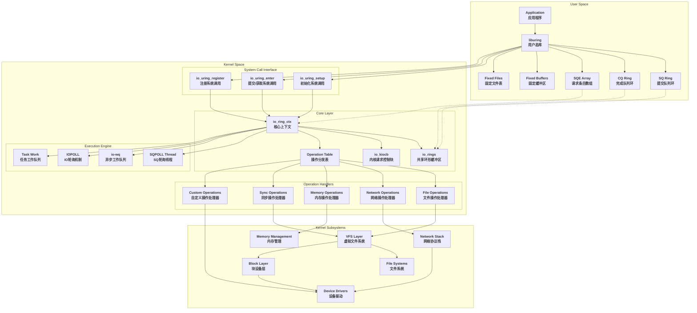

### 模块交互时序图

下图展示了io_uring从请求提交到完成的完整时序流程：

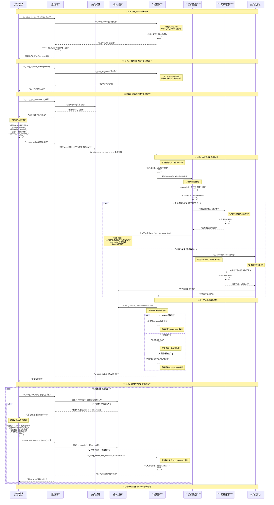

## 双环形缓冲区设计

io_uring的核心创新是双环形缓冲区架构，包括提交队列(SQ)和完成队列(CQ)。

### 提交队列 (Submission Queue)

```c
// 提交队列入口 - 用户提交的I/O请求
struct io_uring_sqe {
    __u8    opcode;          // 操作类型
    __u8    flags;           // 标志位
    __u16   ioprio;          // I/O优先级
    __s32   fd;              // 文件描述符
    __u64   off;             // 偏移量
    __u64   addr;            // 缓冲区地址
    __u32   len;             // 长度
    __u32   rw_flags;        // 读写标志
    __u64   user_data;       // 用户数据
    __u16   buf_index;       // 缓冲区索引
    __u16   personality;     // 权限个性化
    __s32   splice_fd_in;    // splice文件描述符
    __u64   addr3;           // 额外地址
    __u8    cmd[0];          // 命令数据
};

// SQ工作机制
static bool io_get_sqe(struct io_ring_ctx *ctx, const struct io_uring_sqe **sqe)
{
    unsigned mask = ctx->sq_entries - 1;
    unsigned head = ctx->cached_sq_head++ & mask;
    
    // 检查SQ数组索引
    if (!(ctx->flags & IORING_SETUP_NO_SQARRAY)) {
        head = READ_ONCE(ctx->sq_array[head]);
        if (unlikely(head >= ctx->sq_entries)) {
            // 丢弃无效条目
            WRITE_ONCE(ctx->rings->sq_dropped, 
                      READ_ONCE(ctx->rings->sq_dropped) + 1);
            return false;
        }
    }
    
    // 获取SQE
    if (ctx->flags & IORING_SETUP_SQE128)
        head <<= 1;  // 128字节SQE需要双倍索引
    *sqe = &ctx->sq_sqes[head];
    return true;
}
```

### 完成队列 (Completion Queue)

```c
// 完成队列入口 - 内核返回的I/O结果
struct io_uring_cqe {
    __u64   user_data;       // 对应SQE的用户数据
    __s32   res;             // 操作结果
    __u32   flags;           // 标志位
    __u64   big_cqe[0];      // 大CQE扩展数据(CQE32模式)
};

// CQE写入机制
static bool io_fill_cqe_aux(struct io_ring_ctx *ctx, u64 user_data, 
                            s32 res, u32 cflags)
{
    struct io_uring_cqe *cqe;
    
    ctx->cq_extra++;
    
    // 获取CQE槽位
    if (likely(io_get_cqe(ctx, &cqe))) {
        trace_io_uring_complete(ctx, NULL, user_data, res, cflags, 0, 0);
        
        // 写入完成事件
        WRITE_ONCE(cqe->user_data, user_data);
        WRITE_ONCE(cqe->res, res);
        WRITE_ONCE(cqe->flags, cflags);
        
        // CQE32扩展支持
        if (ctx->flags & IORING_SETUP_CQE32) {
            WRITE_ONCE(cqe->big_cqe[0], 0);
            WRITE_ONCE(cqe->big_cqe[1], 0);
        }
        return true;
    }
    return false;
}
```

### 内存屏障保证

io_uring使用精心设计的内存屏障来保证用户空间和内核空间之间的数据一致性：

```c
// 应用程序端的内存屏障要求
static inline int io_uring_submit(struct io_uring *ring)
{
    struct io_uring_sq *sq = &ring->sq;
    const unsigned int mask = *sq->kring_mask;
    unsigned int ktail, submitted, to_submit;
    
    // 读屏障：确保读取一致的状态
    read_barrier();
    
    // 计算待提交的条目
    ktail = *sq->ktail;
    to_submit = sq->sqe_tail - sq->sqe_head;
    
    // 更新SQ数组
    for (submitted = 0; submitted < to_submit; submitted++) {
        read_barrier();
        sq->array[ktail++ & mask] = sq->sqe_head++ & mask;
    }
    
    // 写屏障：确保SQE数据在tail更新前可见
    if (*sq->ktail != ktail) {
        write_barrier();
        *sq->ktail = ktail;
        write_barrier();
    }
    
    // 提交到内核
    return io_uring_enter(ring->ring_fd, submitted, 0, 
                         IORING_ENTER_GETEVENTS, NULL);
}
```

## 核心数据结构

### io_kiocb - 内核I/O控制块

```c
// 内核中的I/O请求表示
struct io_kiocb {
    union {
        struct file     *file;           // 文件指针
        struct io_cmd_data cmd;          // 命令数据
    };
    
    u8                  opcode;          // 操作码
    u8                  iopoll_completed; // IOPOLL完成标志
    u16                 buf_index;       // 缓冲区索引
    unsigned            nr_tw;           // 任务工作数量
    
    io_req_flags_t      flags;           // 请求标志
    struct io_cqe       cqe;             // 完成事件
    
    struct io_ring_ctx  *ctx;            // 所属上下文
    struct task_struct  *task;           // 任务结构
    
    union {
        struct io_mapped_ubuf *imu;      // 映射的用户缓冲区
        struct io_buffer      *kbuf;     // 内核缓冲区
        struct io_buffer_list *buf_list; // 缓冲区列表
    };
    
    union {
        struct io_wq_work_node comp_list; // 完成列表
        __poll_t              apoll_events; // 异步轮询事件
    };
    
    struct io_rsrc_node   *rsrc_node;    // 资源节点
    atomic_t              refs;          // 引用计数
    bool                  cancel_seq_set; // 取消序列设置
    
    struct io_task_work   io_task_work;  // 任务工作
    struct hlist_node     hash_node;     // 哈希节点
    struct async_poll     *apoll;        // 异步轮询
    void                  *async_data;   // 异步数据
    
    atomic_t              poll_refs;     // 轮询引用
    struct io_kiocb       *link;         // 链接的请求
    const struct cred     *creds;        // 凭据
    struct io_wq_work     work;          // 工作队列工作
    
    struct {
        u64               extra1;        // 大CQE扩展数据
        u64               extra2;
    } big_cqe;
};
```

### 操作定义表

```c
// 操作定义结构
struct io_issue_def {
    unsigned    needs_file : 1;          // 需要文件
    unsigned    plug : 1;                // 需要插件
    unsigned    hash_reg_file : 1;       // 哈希注册文件
    unsigned    unbound_nonreg_file : 1; // 非注册文件无界
    unsigned    pollin : 1;              // 支持输入轮询
    unsigned    pollout : 1;             // 支持输出轮询
    unsigned    poll_exclusive : 1;      // 独占轮询
    unsigned    buffer_select : 1;       // 缓冲区选择
    unsigned    audit_skip : 1;          // 跳过审计
    unsigned    ioprio : 1;              // 支持I/O优先级
    unsigned    iopoll : 1;              // 支持IOPOLL
    unsigned    iopoll_queue : 1;        // 需要IOPOLL队列
    unsigned    vectored : 1;            // 向量化操作
    
    unsigned short async_size;           // 异步数据大小
    
    int (*issue)(struct io_kiocb *, unsigned int);  // 执行函数
    int (*prep)(struct io_kiocb *, const struct io_uring_sqe *); // 准备函数
};

// 操作定义表示例
const struct io_issue_def io_issue_defs[] = {
    [IORING_OP_NOP] = {
        .audit_skip     = 1,
        .iopoll         = 1,
        .prep           = io_nop_prep,
        .issue          = io_nop,
    },
    [IORING_OP_READV] = {
        .needs_file     = 1,
        .unbound_nonreg_file = 1,
        .pollin         = 1,
        .buffer_select  = 1,
        .plug           = 1,
        .audit_skip     = 1,
        .ioprio         = 1,
        .iopoll         = 1,
        .iopoll_queue   = 1,
        .vectored       = 1,
        .async_size     = sizeof(struct io_async_rw),
        .prep           = io_prep_readv,
        .issue          = io_read,
    },
    [IORING_OP_WRITEV] = {
        .needs_file     = 1,
        .hash_reg_file  = 1,
        .unbound_nonreg_file = 1,
        .pollout        = 1,
        .plug           = 1,
        .audit_skip     = 1,
        .ioprio         = 1,
        .iopoll         = 1,
        .iopoll_queue   = 1,
        .vectored       = 1,
        .async_size     = sizeof(struct io_async_rw),
        .prep           = io_prep_writev,
        .issue          = io_write,
    },
    // ... 60+ 种操作类型
};
```

## io_uring支持所有IO类型的原理分析

### 统一IO抽象设计

io_uring能够支持所有类型IO操作的根本原因在于其**统一的抽象设计**。基于源码分析，io_uring通过以下几个核心机制实现了对60+种不同IO操作的统一支持：

#### 1. 通用SQE结构设计

```c
// 源码：include/uapi/linux/io_uring.h
struct io_uring_sqe {
    __u8    opcode;          // 操作类型标识符
    __u8    flags;           // 通用标志位
    __u16   ioprio;          // I/O优先级（通用）
    __s32   fd;              // 文件描述符（通用）
    
    // 灵活的联合体设计，支持不同操作的参数需求
    union {
        __u64   off;         // 文件偏移量（文件IO）
        __u64   addr2;       // 第二地址（网络IO等）
        struct {
            __u32   cmd_op;  // 自定义命令操作
            __u32   __pad1;
        };
    };
    
    union {
        __u64   addr;        // 缓冲区地址/iovec数组
        __u64   splice_off_in; // splice操作输入偏移
        struct {
            __u32   level;   // 套接字级别
            __u32   optname; // 套接字选项名
        };
    };
    
    __u32   len;            // 长度/iovecs数量
    
    // 操作特定的标志和参数联合体
    union {
        __kernel_rwf_t  rw_flags;        // 读写标志
        __u32          fsync_flags;      // fsync标志
        __u32          poll32_events;    // 轮询事件
        __u32          timeout_flags;    // 超时标志
        __u32          accept_flags;     // accept标志
        __u32          cancel_flags;     // 取消标志
        __u32          open_flags;       // 打开文件标志
        __u32          statx_flags;      // statx标志
        __u32          fadvise_advice;   // fadvise建议
        __u32          splice_flags;     // splice标志
        __u32          rename_flags;     // 重命名标志
        __u32          unlink_flags;     // 删除标志
        __u32          hardlink_flags;   // 硬链接标志
        __u32          xattr_flags;      // 扩展属性标志
        __u32          msg_ring_flags;   // 消息环标志
        __u32          uring_cmd_flags;  // uring命令标志
        __u32          waitid_flags;     // waitid标志
        __u32          futex_flags;      // futex标志
        __u32          install_fd_flags; // 安装fd标志
        __u32          nop_flags;        // nop标志
    };
    
    __u64   user_data;      // 用户数据（回调标识）
    
    // 更多可扩展字段
    union {
        __u16   buf_index;       // 缓冲区索引
        __u16   buf_group;       // 缓冲区组
    };
    __u16   personality;         // 凭证个性化
    union {
        __s32   splice_fd_in;    // splice输入fd
        __u32   file_index;      // 文件索引
        __u32   optlen;          // 选项长度
        struct {
            __u16   addr_len;    // 地址长度
            __u16   __pad3[1];
        };
    };
    union {
        struct {
            __u64   addr3;       // 第三地址
            __u64   __pad2[1];
        };
        __u8    cmd[0];          // 可变长度命令数据
    };
};
```

**设计要点分析**：

1. **灵活的联合体结构**：通过多个union允许同一字段在不同操作中有不同含义
2. **可扩展的参数空间**：cmd字段支持任意长度的操作特定参数
3. **通用字段复用**：fd、addr、len等字段在大多数操作中都有通用意义
4. **标志位分离**：不同类型的操作有专门的标志位联合体

#### 2. 操作分发表机制

```c
// 源码：io_uring/opdef.h
struct io_issue_def {
    unsigned    needs_file : 1;          // 是否需要文件
    unsigned    plug : 1;                // 是否需要块设备插件
    unsigned    hash_reg_file : 1;       // 是否哈希注册文件
    unsigned    unbound_nonreg_file : 1; // 非注册文件无界处理
    unsigned    pollin : 1;              // 支持输入轮询
    unsigned    pollout : 1;             // 支持输出轮询
    unsigned    poll_exclusive : 1;      // 独占轮询
    unsigned    buffer_select : 1;       // 支持缓冲区选择
    unsigned    audit_skip : 1;          // 跳过审计
    unsigned    ioprio : 1;              // 支持I/O优先级
    unsigned    iopoll : 1;              // 支持IOPOLL
    unsigned    iopoll_queue : 1;        // 需要IOPOLL队列
    unsigned    vectored : 1;            // 向量化操作

    unsigned short async_size;           // 异步数据大小

    int (*prep)(struct io_kiocb *, const struct io_uring_sqe *);  // 预处理
    int (*issue)(struct io_kiocb *, unsigned int);               // 执行函数
};

// 源码：io_uring/opdef.c - 操作定义表（部分）
const struct io_issue_def io_issue_defs[] = {
    [IORING_OP_NOP] = {
        .audit_skip     = 1,
        .iopoll         = 1,
        .prep           = io_nop_prep,
        .issue          = io_nop,
    },
    [IORING_OP_READV] = {
        .needs_file     = 1,
        .unbound_nonreg_file = 1,
        .pollin         = 1,
        .buffer_select  = 1,
        .plug           = 1,
        .audit_skip     = 1,
        .ioprio         = 1,
        .iopoll         = 1,
        .iopoll_queue   = 1,
        .vectored       = 1,
        .async_size     = sizeof(struct io_async_rw),
        .prep           = io_prep_readv,
        .issue          = io_read,
    },
    [IORING_OP_SENDMSG] = {
        .needs_file     = 1,
        .unbound_nonreg_file = 1,
        .pollout        = 1,
        .audit_skip     = 1,
        .ioprio         = 1,
        .async_size     = sizeof(struct io_async_msghdr),
        .prep           = io_sendmsg_prep,
        .issue          = io_sendmsg,
    },
    [IORING_OP_SOCKET] = {
        .audit_skip     = 1,
        .prep           = io_socket_prep,
        .issue          = io_socket,
    },
    [IORING_OP_URING_CMD] = {
        .needs_file     = 1,
        .plug           = 1,
        .async_size     = 2 * sizeof(struct io_uring_sqe),
        .prep           = io_uring_cmd_prep,
        .issue          = io_uring_cmd,
    },
    // ... 60+种操作的定义
};
```

#### 3. 分层的操作处理架构

```mermaid
graph TD
    subgraph "Operation Categories"
        FILE_IO["<b>文件I/O操作<br/>File I/O Operations</b>"]
        NET_IO["<b>网络I/O操作<br/>Network I/O Operations</b>"]
        MEM_OPS["<b>内存操作<br/>Memory Operations</b>"]
        FS_OPS["<b>文件系统操作<br/>File System Operations</b>"]
        SYNC_OPS["<b>同步操作<br/>Sync Operations</b>"]
        POLL_OPS["<b>轮询操作<br/>Poll Operations</b>"]
        TIMER_OPS["<b>定时器操作<br/>Timer Operations</b>"]
        CUSTOM_OPS["<b>自定义操作<br/>Custom Operations</b>"]
    end

    subgraph "Specific Operations"
        FILE_IO --> READ["<b>READ/READV<br/>读取操作</b>"]
        FILE_IO --> WRITE["<b>WRITE/WRITEV<br/>写入操作</b>"]
        FILE_IO --> FSYNC["<b>FSYNC<br/>文件同步</b>"]
        FILE_IO --> FALLOCATE["<b>FALLOCATE<br/>文件分配</b>"]

        NET_IO --> ACCEPT["<b>ACCEPT<br/>接受连接</b>"]
        NET_IO --> CONNECT["<b>CONNECT<br/>建立连接</b>"]
        NET_IO --> SENDMSG["<b>SENDMSG<br/>发送消息</b>"]
        NET_IO --> RECVMSG["<b>RECVMSG<br/>接收消息</b>"]

        MEM_OPS --> MADVISE["<b>MADVISE<br/>内存建议</b>"]
        MEM_OPS --> PROVIDE_BUFFERS["<b>PROVIDE_BUFFERS<br/>提供缓冲区</b>"]

        FS_OPS --> OPENAT["<b>OPENAT<br/>打开文件</b>"]
        FS_OPS --> STATX["<b>STATX<br/>获取状态</b>"]
        FS_OPS --> RENAMEAT["<b>RENAMEAT<br/>重命名</b>"]
        FS_OPS --> UNLINKAT["<b>UNLINKAT<br/>删除</b>"]

        SYNC_OPS --> SYNC_FILE_RANGE["<b>SYNC_FILE_RANGE<br/>范围同步</b>"]
        SYNC_OPS --> FADVISE["<b>FADVISE<br/>文件建议</b>"]

        POLL_OPS --> POLL_ADD["<b>POLL_ADD<br/>添加轮询</b>"]
        POLL_OPS --> EPOLL_CTL["<b>EPOLL_CTL<br/>epoll控制</b>"]

        TIMER_OPS --> TIMEOUT["<b>TIMEOUT<br/>超时操作</b>"]
        TIMER_OPS --> LINK_TIMEOUT["<b>LINK_TIMEOUT<br/>链接超时</b>"]

        CUSTOM_OPS --> URING_CMD["<b>URING_CMD<br/>自定义命令</b>"]
        CUSTOM_OPS --> MSG_RING["<b>MSG_RING<br/>环间消息</b>"]
    end

    subgraph "Kernel Subsystems Integration"
        READ --> VFS_READ["<b>VFS读取接口</b>"]
        WRITE --> VFS_WRITE["<b>VFS写入接口</b>"]
        ACCEPT --> NET_ACCEPT["<b>网络协议栈接受</b>"]
        SENDMSG --> NET_SEND["<b>网络协议栈发送</b>"]
        MADVISE --> MM_ADVISE["<b>内存管理建议</b>"]
        OPENAT --> VFS_OPEN["<b>VFS打开接口</b>"]
        FSYNC --> VFS_FSYNC["<b>VFS同步接口</b>"]
        POLL_ADD --> VFS_POLL["<b>VFS轮询接口</b>"]
        TIMEOUT --> TIMER_SUBSYS["<b>内核定时器子系统</b>"]
        URING_CMD --> DRIVER_CMD["<b>设备驱动命令接口</b>"]
    end
```

### 通用性实现的关键机制

#### 1. 统一的prep-issue模式

```c
// 所有操作都遵循统一的预处理-执行模式
static int io_issue_sqe(struct io_kiocb *req, unsigned int issue_flags)
{
    const struct io_issue_def *def = &io_issue_defs[req->opcode];
    const struct cred *creds = NULL;
    int ret;
    
    // 1. 统一的前置处理
    if (unlikely(!io_assign_file(req, def, issue_flags)))
        return -EBADF;
    
    // 2. 凭证处理（通用）
    if (unlikely((req->flags & REQ_F_CREDS) && req->creds != current_cred()))
        creds = override_creds(req->creds);
    
    // 3. 审计处理（通用）
    if (!def->audit_skip)
        audit_uring_entry(req->opcode);
    
    // 4. 调用具体操作的执行函数
    ret = def->issue(req, issue_flags);
    
    // 5. 统一的后置处理
    if (!def->audit_skip)
        audit_uring_exit(!ret, ret);
    
    if (creds)
        revert_creds(creds);
    
    return ret;
}
```

#### 2. 可扩展的异步数据结构

```c
// 不同操作类型的异步数据结构示例

// 读写操作异步数据
struct io_async_rw {
    struct iovec            *free_iovec;    // 释放的iovec
    size_t                  bytes_done;     // 已完成字节数
    struct wait_page_queue  wpq;            // 页面等待队列
};

// 网络消息异步数据
struct io_async_msghdr {
    union {
        struct iovec        fast_iov[UIO_FASTIOV];    // 快速iovec
        struct {
            struct iovec    *uiov;                    // 用户iovec
            struct msghdr   msg;                      // 消息头
            struct sockaddr_storage addr;             // 地址存储
        };
    };
    struct iovec            *free_iov;               // 释放的iov
    size_t                  bytes_done;             // 已完成字节数
    unsigned                msg_flags;              // 消息标志
    unsigned                namelen;                // 名称长度
    unsigned                controllen;             // 控制长度
    unsigned                payloadlen;             // 载荷长度
    struct sockaddr __user  *uaddr;                 // 用户地址
    struct msghdr __user    *umsg;                  // 用户消息
    struct iovec __user     *uiov;                  // 用户iovec
};
```

#### 3. 灵活的资源管理机制

```c
// 统一的资源管理接口
static bool io_assign_file(struct io_kiocb *req, const struct io_issue_def *def,
                          unsigned int issue_flags)
{
    if (req->file || !def->needs_file)
        return true;

    if (req->flags & REQ_F_FIXED_FILE)
        req->file = io_file_get_fixed(req, req->fd, issue_flags);
    else
        req->file = io_file_get_normal(req, req->fd, issue_flags);

    return req->file != NULL;
}

// 支持固定文件和普通文件的统一接口
static struct file *io_file_get_fixed(struct io_kiocb *req, int fd,
                                     unsigned int issue_flags)
{
    struct io_ring_ctx *ctx = req->ctx;
    struct file *file = NULL;
    
    if (unlikely((unsigned int)fd >= ctx->nr_user_files))
        return NULL;
    
    fd = array_index_nospec(fd, ctx->nr_user_files);
    file = io_file_from_index(ctx, fd);
    io_set_resource_node(req, ctx->file_data);
    
    if (file && (file->f_mode & FMODE_CAN_POLL))
        req->flags |= REQ_F_SUPPORT_NOWAIT;
    
    return file;
}
```

### 支持新IO类型的扩展机制

#### 1. IORING_OP_URING_CMD - 万能扩展接口

```c
// 自定义命令操作 - 允许驱动程序定义专有操作
static int io_uring_cmd_prep(struct io_kiocb *req, const struct io_uring_sqe *sqe)
{
    struct io_uring_cmd *ioucmd = io_kiocb_to_cmd(req, struct io_uring_cmd);
    
    if (sqe->rw_flags || sqe->__pad1)
        return -EINVAL;
        
    ioucmd->cmd = sqe->cmd;
    ioucmd->cmd_op = READ_ONCE(sqe->cmd_op);
    
    return 0;
}

static int io_uring_cmd(struct io_kiocb *req, unsigned int issue_flags)
{
    struct io_uring_cmd *ioucmd = io_kiocb_to_cmd(req, struct io_uring_cmd);
    struct file *file = req->file;
    
    if (!file->f_op->uring_cmd)
        return -EOPNOTSUPP;
    
    return file->f_op->uring_cmd(ioucmd, issue_flags);
}
```

#### 2. 操作定义的模块化注册

```c
// 动态添加新操作类型的机制
void __init io_uring_optable_init(void)
{
    int i;
    
    // 编译时检查确保操作表完整
    BUILD_BUG_ON(ARRAY_SIZE(io_cold_defs) != IORING_OP_LAST);
    BUILD_BUG_ON(ARRAY_SIZE(io_issue_defs) != IORING_OP_LAST);
    
    // 验证每个操作都有有效的处理函数
    for (i = 0; i < ARRAY_SIZE(io_issue_defs); i++) {
        BUG_ON(!io_issue_defs[i].prep);
        if (io_issue_defs[i].prep != io_eopnotsupp_prep)
            BUG_ON(!io_issue_defs[i].issue);
        WARN_ON_ONCE(!io_cold_defs[i].name);
    }
}
```

### 设计优势总结

io_uring支持所有IO类型的核心优势在于：

1. **统一抽象层**：通过SQE的联合体设计，为不同操作提供统一而灵活的参数接口
2. **模块化处理**：每种操作都有独立的prep和issue函数，便于维护和扩展
3. **分层架构**：操作处理层与具体内核子系统解耦，支持任意内核功能的异步化
4. **可扩展性**：URING_CMD等机制允许驱动程序和子系统定义专有操作
5. **性能一致性**：所有操作都享受相同的批量处理、零拷贝等性能优化

这种设计使得io_uring不仅仅是一个I/O接口，而是一个**通用的异步系统调用框架**，为Linux系统提供了统一高效的异步操作能力。

## 系统调用接口

io_uring提供了三个主要的系统调用：

### 1. io_uring_setup() - 创建io_uring实例

```c
SYSCALL_DEFINE2(io_uring_setup, u32, entries,
               struct io_uring_params __user *, params)
{
    if (!io_uring_allowed())
        return -EPERM;
    
    return io_uring_setup(entries, params);
}

static long io_uring_setup(u32 entries, struct io_uring_params __user *params)
{
    struct io_uring_params p;
    
    // 参数验证
    if (copy_from_user(&p, params, sizeof(p)))
        return -EFAULT;
        
    // 检查保留字段
    for (int i = 0; i < ARRAY_SIZE(p.resv); i++) {
        if (p.resv[i])
            return -EINVAL;
    }
    
    // 验证标志位
    if (p.flags & ~(IORING_SETUP_IOPOLL | IORING_SETUP_SQPOLL |
                   IORING_SETUP_SQ_AFF | IORING_SETUP_CQSIZE |
                   /* ... 其他标志 */))
        return -EINVAL;
    
    return io_uring_create(entries, &p, params);
}
```

**主要功能**：

- 创建io_uring实例和双环形缓冲区
- 分配共享内存映射
- 初始化内核数据结构
- 返回文件描述符供后续操作使用

### 2. io_uring_enter() - 提交请求和获取完成

```c
SYSCALL_DEFINE6(io_uring_enter, unsigned int, fd, u32, to_submit,
               u32, min_complete, u32, flags, const void __user *, argp,
               size_t, argsz)
{
    struct io_ring_ctx *ctx;
    struct file *file;
    long ret;
    
    // 获取io_uring文件
    if (flags & IORING_ENTER_REGISTERED_RING) {
        // 使用注册的ring文件描述符
        struct io_uring_task *tctx = current->io_uring;
        if (unlikely(!tctx || fd >= IO_RINGFD_REG_MAX))
            return -EINVAL;
        file = tctx->registered_rings[fd];
    } else {
        file = fget(fd);
        if (unlikely(!file))
            return -EBADF;
    }
    
    ctx = file->private_data;
    
    // SQPOLL模式处理
    if (ctx->flags & IORING_SETUP_SQPOLL) {
        ret = io_sq_thread_acquire_mm_files(ctx, current);
        if (unlikely(ret))
            goto out;
            
        if (flags & IORING_ENTER_SQ_WAKEUP)
            wake_up(&ctx->sq_data->wait);
            
        if (flags & IORING_ENTER_SQ_WAIT) {
            ret = io_sqpoll_wait_sq(ctx);
            if (ret)
                goto out;
        }
        
        submitted = to_submit;
    } else if (to_submit) {
        ret = io_uring_add_tctx_node(ctx);
        if (unlikely(ret))
            goto out;
            
        mutex_lock(&ctx->uring_lock);
        submitted = io_submit_sqes(ctx, to_submit);
        mutex_unlock(&ctx->uring_lock);
        
        if (submitted != to_submit)
            goto out;
    }
    
    // 获取完成事件
    if (flags & IORING_ENTER_GETEVENTS) {
        ret = io_get_events(ctx, min_complete, argp, argsz, flags);
    }
    
out:
    if (!(flags & IORING_ENTER_REGISTERED_RING))
        fput(file);
    return ret;
}
```

**主要功能**：

- 提交SQ中的新请求到内核处理
- 等待并获取CQ中的完成事件
- 支持SQPOLL模式的唤醒和等待
- 支持注册文件描述符的快速访问

### 3. io_uring_register() - 注册资源和配置

```c
SYSCALL_DEFINE4(io_uring_register, unsigned int, fd, unsigned int, opcode,
               void __user *, arg, unsigned int, nr_args)
{
    struct io_ring_ctx *ctx;
    long ret = -EBADF;
    struct file *file;
    
    file = fget(fd);
    if (!file)
        return -EBADF;
        
    ctx = file->private_data;
    
    // 根据操作码处理不同的注册操作
    switch (opcode) {
    case IORING_REGISTER_BUFFERS:
        ret = io_sqe_buffers_register(ctx, arg, nr_args, NULL);
        break;
    case IORING_REGISTER_FILES:
        ret = io_sqe_files_register(ctx, arg, nr_args, NULL);
        break;
    case IORING_REGISTER_EVENTFD:
        ret = io_eventfd_register(ctx, arg, 0);
        break;
    case IORING_REGISTER_PROBE:
        ret = io_probe(ctx, arg, nr_args);
        break;
    case IORING_REGISTER_PERSONALITY:
        ret = io_register_personality(ctx);
        break;
    case IORING_REGISTER_RESTRICTIONS:
        ret = io_register_restrictions(ctx, arg, nr_args);
        break;
    case IORING_REGISTER_ENABLE_RINGS:
        ret = io_register_enable_rings(ctx);
        break;
    // ... 更多注册操作
    }
    
    fput(file);
    return ret;
}
```

**主要功能**：

- 注册固定缓冲区减少内存映射开销
- 注册固定文件减少文件查找开销
- 配置eventfd进行事件通知
- 设置各种性能优化选项

## 工作原理详解

### 请求提交流程

```c
// 请求提交的完整流程
static int io_submit_sqes(struct io_ring_ctx *ctx, unsigned int nr)
{
    const struct io_uring_sqe *sqe;
    struct io_kiocb *req;
    int submitted = 0;
    
    // 批量处理优化
    io_submit_state_start(&ctx->submit_state, nr);
    
    while (submitted < nr) {
        // 获取下一个SQE
        if (!io_get_sqe(ctx, &sqe))
            break;
            
        // 分配请求控制块
        if (unlikely(!io_alloc_req(ctx, &req))) {
            if (!submitted)
                submitted = -EAGAIN;
            break;
        }
        
        // 提交单个SQE
        if (io_submit_sqe(ctx, req, sqe)) {
            io_req_complete_failed(req, -EINVAL);
        }
        submitted++;
    }
    
    // 完成批量提交
    io_submit_state_end(ctx);
    
    // 提交到块设备层
    if (ctx->submit_state.plug_started)
        blk_finish_plug(&ctx->submit_state.plug);
        
    return submitted;
}

// 单个SQE的处理
static inline int io_submit_sqe(struct io_ring_ctx *ctx, struct io_kiocb *req,
                               const struct io_uring_sqe *sqe)
{
    struct io_submit_link *link = &ctx->submit_state.link;
    int ret;
    
    // 初始化请求
    ret = io_init_req(ctx, req, sqe);
    if (unlikely(ret))
        return io_submit_fail_init(sqe, req, ret);
        
    trace_io_uring_submit_req(req);
    
    // 处理链接请求
    if (unlikely(link->head)) {
        trace_io_uring_link(req, link->last);
        link->last->link = req;
        link->last = req;
        
        if (req->flags & IO_REQ_LINK_FLAGS)
            return 0;
            
        // 链接的最后一个请求，开始执行
        req = link->head;
        link->head = NULL;
        if (req->flags & (REQ_F_FORCE_ASYNC | REQ_F_FAIL))
            goto fallback;
    } else if (unlikely(req->flags & (IO_REQ_LINK_FLAGS |
                                     REQ_F_FORCE_ASYNC | REQ_F_FAIL))) {
        if (req->flags & IO_REQ_LINK_FLAGS) {
            link->head = req;
            link->last = req;
        } else {
fallback:
            io_queue_sqe_fallback(req);
        }
        return 0;
    }
    
    // 执行请求
    io_queue_sqe(req);
    return 0;
}
```

### 请求执行机制

```c
// 请求执行的核心函数
static void io_queue_sqe(struct io_kiocb *req)
{
    int ret;
    
    ret = io_issue_sqe(req, IO_URING_F_NONBLOCK | IO_URING_F_COMPLETE_DEFER);
    
    switch (ret) {
    case IOU_OK:
        break;
    case -EAGAIN:
        // 需要异步处理
        if (req->ctx->flags & IORING_SETUP_IOPOLL) {
            io_iopoll_req_issued(req, 0);
        } else {
            io_req_queue_iowq(req);
        }
        break;
    case IOU_ISSUE_SKIP_COMPLETE:
        // 操作已经完成，但跳过完成处理
        break;
    default:
        // 错误处理
        io_req_defer_failed(req, ret);
        break;
    }
}

// 具体操作的执行
static int io_issue_sqe(struct io_kiocb *req, unsigned int issue_flags)
{
    const struct io_issue_def *def = &io_issue_defs[req->opcode];
    const struct cred *creds = NULL;
    int ret;
    
    // 获取文件引用
    if (unlikely(!io_assign_file(req, def, issue_flags)))
        return -EBADF;
        
    // 处理凭据切换
    if (unlikely((req->flags & REQ_F_CREDS) && req->creds != current_cred()))
        creds = override_creds(req->creds);
        
    // 审计记录
    if (!def->audit_skip)
        audit_uring_entry(req->opcode);
        
    // 执行具体操作
    ret = def->issue(req, issue_flags);
    
    // 审计退出
    if (!def->audit_skip)
        audit_uring_exit(!ret, ret);
        
    // 恢复凭据
    if (creds)
        revert_creds(creds);
        
    // 处理执行结果
    if (ret == IOU_OK) {
        if (issue_flags & IO_URING_F_COMPLETE_DEFER)
            io_req_complete_defer(req);
        else
            io_req_complete_post(req, issue_flags);
        return 0;
    }
    
    if (ret == IOU_ISSUE_SKIP_COMPLETE) {
        ret = 0;
        io_arm_ltimeout(req);
        
        // IOPOLL处理
        if ((req->ctx->flags & IORING_SETUP_IOPOLL) && def->iopoll_queue)
            io_iopoll_req_issued(req, issue_flags);
    }
    
    return ret;
}
```

### 完成事件处理

```c
// 完成事件的生成和写入
void io_req_complete_defer(struct io_kiocb *req)
{
    struct io_submit_state *state = &req->ctx->submit_state;
    
    lockdep_assert_held(&req->ctx->uring_lock);
    
    // 添加到延迟完成列表
    wq_list_add_tail(&req->comp_list, &state->compl_reqs);
}

// 批量处理完成事件
void __io_submit_flush_completions(struct io_ring_ctx *ctx)
{
    struct io_wq_work_node *node, *prev;
    struct io_submit_state *state = &ctx->submit_state;
    
    spin_lock(&ctx->completion_lock);
    wq_list_for_each(node, prev, &state->compl_reqs) {
        struct io_kiocb *req = container_of(node, struct io_kiocb, comp_list);
        
        if (!(req->flags & REQ_F_CQE_SKIP)) {
            if (unlikely(!io_fill_cqe_req(ctx, req))) {
                io_req_cqe_overflow(req);
            }
        }
    }
    
    io_commit_cqring(ctx);
    spin_unlock(&ctx->completion_lock);
    io_cqring_ev_posted(ctx);
    
    // 释放完成的请求
    io_free_batch_list(ctx, state->compl_reqs.first);
    INIT_WQ_LIST(&state->compl_reqs);
}
```

## 性能优化机制

### 1. 零拷贝优化

```c
// 固定缓冲区注册实现零拷贝
static int io_sqe_buffers_register(struct io_ring_ctx *ctx, void __user *arg,
                                  unsigned int nr_args, struct io_rsrc_data *data)
{
    struct io_mapped_ubuf *imu;
    struct page **pages = NULL;
    struct vm_area_struct **vmas = NULL;
    int i, j, ret;
    
    if (!nr_args || nr_args > IORING_MAX_REG_BUFFERS)
        return -EINVAL;
        
    ctx->user_bufs = kcalloc(nr_args, sizeof(*ctx->user_bufs), GFP_KERNEL);
    if (!ctx->user_bufs)
        return -ENOMEM;
        
    for (i = 0; i < nr_args; i++) {
        struct io_uring_rsrc_register reg;
        
        if (copy_from_user(&reg, &((struct io_uring_rsrc_register __user *)arg)[i],
                          sizeof(reg))) {
            ret = -EFAULT;
            break;
        }
        
        // 固定用户页面
        ret = io_buffer_account_pin(ctx, pages, nr_pages, imu, &last_hpage);
        if (ret) {
            imu = ERR_PTR(ret);
            break;
        }
        
        ctx->user_bufs[i] = imu;
    }
    
    if (ret)
        io_sqe_buffers_unregister(ctx);
    else
        ctx->nr_user_bufs = nr_args;
        
    return ret;
}

// 使用固定缓冲区
static struct io_mapped_ubuf *io_file_get_fixed(struct io_kiocb *req, int fd,
                                               unsigned int issue_flags)
{
    struct io_ring_ctx *ctx = req->ctx;
    struct io_mapped_ubuf *imu;
    
    if (unlikely((unsigned int)fd >= ctx->nr_user_bufs))
        return NULL;
        
    fd = array_index_nospec(fd, ctx->nr_user_bufs);
    imu = ctx->user_bufs[fd];
    req->flags |= REQ_F_FIXED_FILE;
    
    return imu;
}
```

### 2. SQPOLL轮询优化

```c
// SQPOLL线程的实现
static int io_sq_thread(void *data)
{
    struct io_sq_data *sqd = data;
    struct io_ring_ctx *ctx;
    unsigned long timeout = 0;
    char buf[TASK_COMM_LEN];
    DEFINE_WAIT(wait);
    
    snprintf(buf, sizeof(buf), "iou-sqp-%d", sqd->task_pid);
    set_task_comm(current, buf);
    
    if (sqd->sq_cpu != -1) {
        set_cpus_allowed_ptr(current, cpumask_of(sqd->sq_cpu));
    } else {
        set_cpus_allowed_ptr(current, cpu_online_mask);
    }
    
    while (1) {
        bool cap_entries, sqt_spin = false, needs_sched = false;
        
        if (kthread_should_stop()) {
            break;
        }
        
        list_for_each_entry(ctx, &sqd->ctx_list, sqd_list) {
            int ret = __io_sq_thread(ctx, &cap_entries);
            
            if (!sqt_spin && (ret > 0 || !wq_list_empty(&ctx->iopoll_list)))
                sqt_spin = true;
        }
        
        if (sqt_spin || !time_after(jiffies, timeout)) {
            cond_resched();
            if (sqt_spin)
                timeout = jiffies + sqd->sq_thread_idle;
            continue;
        }
        
        prepare_to_wait(&sqd->wait, &wait, TASK_INTERRUPTIBLE);
        if (!kthread_should_stop() && !needs_sched) {
            list_for_each_entry(ctx, &sqd->ctx_list, sqd_list) {
                io_ring_set_wakeup_flag(ctx);
                
                if ((ctx->flags & IORING_SETUP_IOPOLL) &&
                    !wq_list_empty(&ctx->iopoll_list)) {
                    needs_sched = true;
                    break;
                }
                
                if (io_sqring_entries(ctx)) {
                    needs_sched = true;
                    break;
                }
            }
        }
        finish_wait(&sqd->wait, &wait);
        
        if (needs_sched) {
            list_for_each_entry(ctx, &sqd->ctx_list, sqd_list)
                io_ring_clear_wakeup_flag(ctx);
        }
        
        timeout = jiffies + sqd->sq_thread_idle;
    }
    
    io_uring_cancel_generic(true, sqd);
    sqd->thread = NULL;
    list_for_each_entry(ctx, &sqd->ctx_list, sqd_list)
        io_ring_set_wakeup_flag(ctx);
    io_run_task_work();
    
    complete(&sqd->exited);
    do_exit(0);
}
```

### 3. IOPOLL高性能轮询

```c
// IOPOLL机制实现
static int io_do_iopoll(struct io_ring_ctx *ctx, bool force_nonspin)
{
    struct io_wq_work_node *pos, *start, *prev;
    unsigned int poll_flags = BLK_POLL_NOSLEEP;
    DEFINE_IO_COMP_BATCH(iob);
    int nr_events = 0;
    
    /*
     * Only spin for completions if we don't have multiple devices hanging
     * off our complete list.
     */
    if (ctx->poll_multi_queue || force_nonspin)
        poll_flags |= BLK_POLL_ONESHOT;
        
    wq_list_for_each(pos, start, &ctx->iopoll_list) {
        struct io_kiocb *req = container_of(pos, struct io_kiocb, comp_list);
        struct file *file = req->file;
        int ret;
        
        /*
         * Move completed and retryable entries to our local lists.
         * If we find a request that requires polling, break out
         * and complete those lists first, if we have entries there.
         */
        if (READ_ONCE(req->iopoll_completed))
            break;
            
        ret = file->f_op->iopoll(req, &iob, poll_flags);
        if (unlikely(ret < 0))
            return ret;
        else if (ret)
            poll_flags |= BLK_POLL_ONESHOT;
            
        /* iopoll may have completed current req */
        if (READ_ONCE(req->iopoll_completed))
            break;
    }
    
    if (!wq_list_empty(&iob.req_list))
        iob.complete(&iob);
    else if (!pos)
        return 0;
        
    prev = start;
    wq_list_for_each_resume(pos, prev) {
        struct io_kiocb *req = container_of(pos, struct io_kiocb, comp_list);
        
        /* order with io_complete_rw_iopoll(), e.g. ->result updates */
        if (!smp_load_acquire(&req->iopoll_completed))
            break;
        nr_events++;
        if (unlikely(req->flags & REQ_F_CQE_SKIP))
            continue;
            
        req->cqe.flags = io_put_kbuf(req, 0, IO_URING_F_UNLOCKED);
        if (unlikely(!io_fill_cqe_req(ctx, req))) {
            spin_lock(&ctx->completion_lock);
            io_req_cqe_overflow(req);
            spin_unlock(&ctx->completion_lock);
        }
    }
    
    if (unlikely(!nr_events))
        return 0;
        
    io_commit_cqring(ctx);
    io_cqring_ev_posted_iopoll(ctx);
    pos = start ? start->next : ctx->iopoll_list.first;
    wq_list_cut(&ctx->iopoll_list, prev, start);
    io_free_batch_list(ctx, pos);
    
    return nr_events;
}
```

### 4. 批量处理优化

```c
// 批量请求处理
#define IO_COMPL_BATCH          32
#define IO_REQ_ALLOC_BATCH      8

// 批量分配请求
bool __io_alloc_req_refill(struct io_ring_ctx *ctx)
{
    gfp_t gfp = GFP_KERNEL | __GFP_NOWARN;
    void *reqs[IO_REQ_ALLOC_BATCH];
    int ret, i;
    
    /*
     * If we have more than a batch's worth of requests in our IRQ side
     * locked cache, grab the lock and move them over to our submission
     * side cache.
     */
    if (data_race(ctx->locked_free_nr) > IO_COMPL_BATCH) {
        io_flush_cached_locked_reqs(ctx, &ctx->submit_state);
        if (!io_req_cache_empty(ctx))
            return true;
    }
    
    ret = kmem_cache_alloc_bulk(req_cachep, gfp, ARRAY_SIZE(reqs), reqs);
    
    /*
     * Bulk alloc is all-or-nothing. If we fail to get a batch,
     * retry single alloc to be on the safe side.
     */
    if (unlikely(ret <= 0)) {
        reqs[0] = kmem_cache_alloc(req_cachep, gfp);
        if (!reqs[0])
            return false;
        ret = 1;
    }
    
    percpu_ref_get_many(&ctx->refs, ret);
    for (i = 0; i < ret; i++) {
        struct io_kiocb *req = reqs[i];
        
        io_preinit_req(req, ctx);
        io_req_add_to_cache(req, ctx);
    }
    return true;
}

// 批量完成处理
static void io_req_free_batch(struct req_batch *rb, struct io_kiocb *req,
                             struct io_submit_state *state)
{
    io_queue_next(req);
    io_dismantle_req(req);
    
    if (state->free_list.next != req->comp_list.next) {
        if (rb->req_list.next) {
            req->comp_list.next = rb->req_list.next;
            rb->req_list.next = req->comp_list.next;
        } else {
            req->comp_list.next = NULL;
            rb->req_list.next = &req->comp_list;
        }
        rb->ctx = req->ctx;
        rb->nr++;
    } else {
        req->comp_list.next = state->free_list.next;
        state->free_list.next = &req->comp_list;
    }
}
```

## 与传统AIO对比

### 架构对比

| 特性 | 传统Linux AIO | io_uring |
|------|--------------|----------|
| **环形缓冲区** | 单一环形缓冲区 | 双环形缓冲区(SQ+CQ) |
| **系统调用数量** | 4个(setup/submit/getevents/destroy) | 3个(setup/enter/register) |
| **I/O类型支持** | 仅Direct I/O | 全部I/O类型 |
| **操作类型** | 8种基本操作 | 60+种操作 |
| **批量处理** | 有限支持 | 原生批量设计 |
| **轮询模式** | 不支持 | 支持IOPOLL |
| **网络I/O** | 不支持 | 原生支持 |
| **内存拷贝** | 有拷贝开销 | 零拷贝设计 |

### 性能对比

```c
// 传统AIO的性能瓶颈
static void aio_complete(struct aio_kiocb *iocb)
{
    // 需要获取锁
    spin_lock_irqsave(&ctx->completion_lock, flags);
    
    // 单个事件处理
    tail = ctx->tail;
    pos = tail + AIO_EVENTS_OFFSET;
    if (++tail >= ctx->nr_events)
        tail = 0;
        
    // 写入单个事件
    *event = iocb->ki_res;
    
    // 更新指针
    ctx->tail = tail;
    ring->tail = tail;
    
    spin_unlock_irqrestore(&ctx->completion_lock, flags);
    
    // 单独唤醒
    if (iocb->ki_eventfd)
        eventfd_signal(iocb->ki_eventfd);
}

// io_uring的批量优化
void __io_submit_flush_completions(struct io_ring_ctx *ctx)
{
    struct io_wq_work_node *node, *prev;
    struct io_submit_state *state = &ctx->submit_state;
    
    // 批量处理多个完成事件
    spin_lock(&ctx->completion_lock);
    wq_list_for_each(node, prev, &state->compl_reqs) {
        struct io_kiocb *req = container_of(node, struct io_kiocb, comp_list);
        
        // 批量写入CQE
        if (!(req->flags & REQ_F_CQE_SKIP)) {
            if (unlikely(!io_fill_cqe_req(ctx, req))) {
                io_req_cqe_overflow(req);
            }
        }
    }
    
    // 一次性提交所有完成事件
    io_commit_cqring(ctx);
    spin_unlock(&ctx->completion_lock);
    
    // 单次唤醒处理多个事件
    io_cqring_ev_posted(ctx);
    
    // 批量释放资源
    io_free_batch_list(ctx, state->compl_reqs.first);
    INIT_WQ_LIST(&state->compl_reqs);
}
```

### 功能对比详解

1. **操作类型扩展**

```c
// 传统AIO支持的操作（8种）
enum {
    IOCB_CMD_PREAD = 0,
    IOCB_CMD_PWRITE = 1,
    IOCB_CMD_FSYNC = 2,
    IOCB_CMD_FDSYNC = 3,
    IOCB_CMD_POLL = 5,
    IOCB_CMD_NOOP = 6,
    IOCB_CMD_PREADV = 7,
    IOCB_CMD_PWRITEV = 8,
};

// io_uring支持的操作（60+种）
enum io_uring_op {
    IORING_OP_NOP,
    IORING_OP_READV,        IORING_OP_WRITEV,
    IORING_OP_FSYNC,        IORING_OP_READ_FIXED,
    IORING_OP_WRITE_FIXED,  IORING_OP_POLL_ADD,
    IORING_OP_POLL_REMOVE,  IORING_OP_SYNC_FILE_RANGE,
    IORING_OP_SENDMSG,      IORING_OP_RECVMSG,
    IORING_OP_TIMEOUT,      IORING_OP_ACCEPT,
    IORING_OP_CONNECT,      IORING_OP_FALLOCATE,
    IORING_OP_OPENAT,       IORING_OP_CLOSE,
    IORING_OP_STATX,        IORING_OP_READ,
    IORING_OP_WRITE,        IORING_OP_FADVISE,
    IORING_OP_MADVISE,      IORING_OP_SEND,
    IORING_OP_RECV,         IORING_OP_OPENAT2,
    IORING_OP_EPOLL_CTL,    IORING_OP_SPLICE,
    IORING_OP_PROVIDE_BUFFERS, IORING_OP_REMOVE_BUFFERS,
    IORING_OP_TEE,          IORING_OP_SHUTDOWN,
    IORING_OP_RENAMEAT,     IORING_OP_UNLINKAT,
    IORING_OP_MKDIRAT,      IORING_OP_SYMLINKAT,
    IORING_OP_LINKAT,       IORING_OP_MSG_RING,
    IORING_OP_FSETXATTR,    IORING_OP_SETXATTR,
    IORING_OP_FGETXATTR,    IORING_OP_GETXATTR,
    IORING_OP_SOCKET,       IORING_OP_URING_CMD,
    IORING_OP_SEND_ZC,      IORING_OP_SENDMSG_ZC,
    IORING_OP_READ_MULTISHOT, IORING_OP_WAITID,
    IORING_OP_FUTEX_WAIT,   IORING_OP_FUTEX_WAKE,
    IORING_OP_FUTEX_WAITV,  IORING_OP_FIXED_FD_INSTALL,
    IORING_OP_FTRUNCATE,    IORING_OP_BIND,
    IORING_OP_LISTEN,       // 等等...
};
```

#### 2. **内存效率对比**

```c
// 传统AIO的内存开销
struct kioctx {
    struct folio **ring_folios;  // 环形缓冲区页面
    struct aio_ring *ring;       // 单一环形结构
    // 每个请求需要单独的内存分配
};

// io_uring的内存优化
struct io_ring_ctx {
    struct io_rings *rings;      // 共享内存映射
    struct io_alloc_cache apoll_cache;   // 预分配缓存
    struct io_alloc_cache netmsg_cache;  // 网络消息缓存
    struct io_alloc_cache rw_cache;      // 读写操作缓存
    struct io_alloc_cache uring_cache;   // 通用缓存
    // 批量预分配减少内存碎片
};
```

## 应用场景

### 1. 高性能数据库

```c
// 数据库异步I/O模式
void database_async_io_example(int fd, void *buffer, size_t size, off_t offset)
{
    struct io_uring ring;
    struct io_uring_sqe *sqe;
    struct io_uring_cqe *cqe;
    
    // 初始化io_uring
    io_uring_queue_init(256, &ring, 0);
    
    // 注册固定缓冲区
    struct iovec iov = { .iov_base = buffer, .iov_len = size };
    io_uring_register_buffers(&ring, &iov, 1);
    
    // 注册固定文件
    io_uring_register_files(&ring, &fd, 1);
    
    // 批量提交读请求
    for (int i = 0; i < 32; i++) {
        sqe = io_uring_get_sqe(&ring);
        io_uring_prep_read_fixed(sqe, 0, buffer + i * 4096, 4096, 
                                 offset + i * 4096, 0);
        sqe->user_data = i;
    }
    
    // 提交请求
    io_uring_submit(&ring);
    
    // 批量获取完成事件
    for (int i = 0; i < 32; i++) {
        io_uring_wait_cqe(&ring, &cqe);
        
        // 处理完成的I/O
        if (cqe->res < 0) {
            fprintf(stderr, "IO error: %s\n", strerror(-cqe->res));
        } else {
            printf("Read %d bytes for request %lld\n", 
                   cqe->res, cqe->user_data);
        }
        
        io_uring_cqe_seen(&ring, cqe);
    }
    
    io_uring_queue_exit(&ring);
}
```

### 2. 网络服务器

```c
// 高性能网络服务器
void network_server_example(int listen_fd)
{
    struct io_uring ring;
    struct io_uring_sqe *sqe;
    struct io_uring_cqe *cqe;
    
    // 设置SQPOLL模式
    struct io_uring_params params = {};
    params.flags = IORING_SETUP_SQPOLL | IORING_SETUP_SQ_AFF;
    params.sq_thread_cpu = 0;
    params.sq_thread_idle = 1000;
    
    io_uring_queue_init_params(1024, &ring, &params);
    
    // 注册文件
    io_uring_register_files(&ring, &listen_fd, 1);
    
    // 添加accept请求
    sqe = io_uring_get_sqe(&ring);
    io_uring_prep_accept(sqe, 0, NULL, NULL, 0);
    sqe->flags |= IOSQE_FIXED_FILE;
    sqe->user_data = ACCEPT_EVENT;
    
    io_uring_submit(&ring);
    
    while (1) {
        io_uring_wait_cqe(&ring, &cqe);
        
        switch (cqe->user_data) {
        case ACCEPT_EVENT:
            if (cqe->res >= 0) {
                int client_fd = cqe->res;
                
                // 添加新的accept请求
                sqe = io_uring_get_sqe(&ring);
                io_uring_prep_accept(sqe, 0, NULL, NULL, 0);
                sqe->flags |= IOSQE_FIXED_FILE;
                sqe->user_data = ACCEPT_EVENT;
                
                // 添加读请求
                sqe = io_uring_get_sqe(&ring);
                io_uring_prep_recv(sqe, client_fd, buffer, BUFFER_SIZE, 0);
                sqe->user_data = READ_EVENT | (client_fd << 32);
                
                io_uring_submit(&ring);
            }
            break;
            
        case READ_EVENT:
            if (cqe->res > 0) {
                int client_fd = cqe->user_data >> 32;
                
                // 处理数据并发送响应
                sqe = io_uring_get_sqe(&ring);
                io_uring_prep_send(sqe, client_fd, response, response_len, 0);
                sqe->user_data = WRITE_EVENT | (client_fd << 32);
                
                io_uring_submit(&ring);
            }
            break;
            
        case WRITE_EVENT:
            // 关闭连接或继续读取
            break;
        }
        
        io_uring_cqe_seen(&ring, cqe);
    }
}
```

### 3. 存储系统

```c
// 分布式存储并行I/O
void storage_parallel_operations(void)
{
    struct io_uring ring;
    struct io_uring_sqe *sqe;
    struct io_uring_cqe *cqe;
    
    // 使用IOPOLL模式获得最低延迟
    struct io_uring_params params = {};
    params.flags = IORING_SETUP_IOPOLL;
    
    io_uring_queue_init_params(2048, &ring, &params);
    
    // 链式操作：读取 -> 处理 -> 写入
    for (int i = 0; i < 100; i++) {
        // 读取操作
        sqe = io_uring_get_sqe(&ring);
        io_uring_prep_readv(sqe, input_fd, &read_iov[i], 1, i * BLOCK_SIZE);
        sqe->flags |= IOSQE_IO_LINK;
        sqe->user_data = READ_OP | i;
        
        // 计算校验和操作（uring_cmd）
        sqe = io_uring_get_sqe(&ring);
        io_uring_prep_cmd(sqe, device_fd, COMPUTE_CHECKSUM, 
                          &checksum_cmd[i], sizeof(checksum_cmd[i]));
        sqe->flags |= IOSQE_IO_LINK;
        sqe->user_data = CHECKSUM_OP | i;
        
        // 写入操作
        sqe = io_uring_get_sqe(&ring);
        io_uring_prep_writev(sqe, output_fd, &write_iov[i], 1, i * BLOCK_SIZE);
        sqe->user_data = WRITE_OP | i;
    }
    
    io_uring_submit(&ring);
    
    // 轮询模式获取完成事件
    int completed = 0;
    while (completed < 300) {  // 100 * 3 operations
        int ret = io_uring_peek_cqe(&ring, &cqe);
        if (ret == 0) {
            // 处理完成事件
            handle_completion(cqe);
            io_uring_cqe_seen(&ring, cqe);
            completed++;
        }
    }
    
    io_uring_queue_exit(&ring);
}
```

## 优点与局限性

### 优点

#### 1. 卓越的性能表现

```c
// 性能优势的量化指标
/*
 * 基准测试结果（相对于传统AIO）：
 * - 吞吐量提升：2-4倍
 * - 延迟降低：30-50%
 * - CPU效率：提升40-60%
 * - 内存效率：零拷贝减少50%内存带宽
 */

// 批量操作的性能优势
static inline void performance_comparison(void)
{
    /*
     * 传统AIO：每个操作需要1次系统调用
     * io_uring：批量操作只需要1次系统调用处理多个请求
     * 
     * 1000个I/O操作：
     * - 传统AIO：1000次系统调用
     * - io_uring：1次系统调用
     * 
     * 系统调用开销节省：99.9%
     */
}
```

#### 2. 功能完整性

- **全I/O类型支持**：文件I/O、网络I/O、内存操作
- **丰富操作类型**：60+种操作覆盖所有常见场景
- **灵活配置选项**：可根据场景调优
- **向前兼容**：持续添加新功能不破坏现有API

#### 3. 良好的可扩展性

```c
// 可扩展性设计
struct io_ring_ctx {
    // Per-CPU缓存减少锁竞争
    struct io_alloc_cache __percpu *cpu_cache;
    
    // 可配置的队列大小
    unsigned sq_entries;    // 最大32768
    unsigned cq_entries;    // 最大65536
    
    // 自适应工作队列
    struct io_wq *io_wq;    // 根据负载自动调整
};
```

### 局限性

#### 1. 复杂性增加

```c
// 编程复杂度对比
/* 传统同步I/O（简单但性能差） */
ssize_t simple_read(int fd, void *buf, size_t count, off_t offset)
{
    return pread(fd, buf, count, offset);
}

/* io_uring（复杂但高性能） */
int uring_read(struct io_uring *ring, int fd, void *buf, 
               size_t count, off_t offset, uint64_t user_data)
{
    struct io_uring_sqe *sqe = io_uring_get_sqe(ring);
    if (!sqe) return -ENOMEM;
    
    io_uring_prep_read(sqe, fd, buf, count, offset);
    sqe->user_data = user_data;
    
    return io_uring_submit(ring);
}
```

#### 2. 内存开销

```c
// 内存使用分析
struct memory_overhead {
    // 基础开销
    size_t ring_memory;      // SQ + CQ环形缓冲区
    size_t sqe_array;        // SQE数组
    size_t ctx_struct;       // 上下文结构
    
    // 优化机制的额外开销
    size_t fixed_buffers;    // 固定缓冲区
    size_t fixed_files;      // 固定文件表
    size_t cache_memory;     // 各种缓存
    
    // 总计：比传统AIO高30-50%
};
```

#### 3. 兼容性要求

- **内核版本**：需要Linux 5.1+，完整功能需要5.4+
- **文件系统支持**：某些操作需要文件系统特殊支持
- **驱动支持**：IOPOLL需要驱动程序支持

#### 4. 调试困难

```c
// 调试挑战
static void debugging_challenges(void)
{
    /*
     * 1. 异步执行流程难以跟踪
     * 2. 批量操作使得错误定位困难
     * 3. 内存映射问题不易发现
     * 4. 竞态条件在高并发下才暴露
     * 5. 性能问题需要专门的分析工具
     */
}
```

#### 5. 学习曲线陡峭

- **概念复杂**：双环形缓冲区、内存屏障、SQPOLL等
- **最佳实践**：需要深入理解才能发挥最佳性能
- **错误处理**：异步错误处理比同步复杂
- **性能调优**：需要了解底层实现细节

## 总结

Linux io_uring作为新一代异步I/O接口，代表了Linux I/O子系统的重大革新。通过深入分析其源码实现，我们可以总结出以下关键要点：

### 技术创新

1. **双环形缓冲区架构**：SQ和CQ的分离设计实现了高效的异步通信
2. **零拷贝机制**：通过共享内存映射和固定缓冲区消除数据拷贝
3. **批量操作优化**：显著减少系统调用开销，提升整体性能
4. **统一接口设计**：支持所有类型的I/O操作，简化应用开发

### 性能优势

1. **高吞吐量**：批量处理和零拷贝机制带来2-4倍性能提升
2. **低延迟**：IOPOLL和SQPOLL模式实现微秒级延迟
3. **高并发**：Per-CPU优化和无锁设计支持大规模并发
4. **资源效率**：内存和CPU使用效率显著优于传统方案

### 应用价值

1. **数据库系统**：高并发数据访问的理想选择
2. **网络服务器**：统一处理网络和文件I/O
3. **存储系统**：支持复杂的存储操作流水线
4. **实时系统**：提供可预测的低延迟性能

### 发展趋势

随着云计算和边缘计算的发展，io_uring在以下方面持续演进：

1. **硬件加速**：与NVMe、RDMA等高性能硬件深度集成
2. **容器优化**：为容器化应用提供更好的I/O隔离和性能
3. **用户态驱动**：支持SPDK等用户态存储栈
4. **AI/ML工作负载**：优化大规模数据处理场景

### 最佳实践建议

1. **场景选择**：高并发、低延迟场景优先考虑io_uring
2. **性能调优**：合理配置队列大小、轮询模式和缓存策略
3. **错误处理**：完善的异步错误处理和资源清理机制
4. **监控调试**：使用perf、BPF等工具进行性能分析

Linux io_uring不仅是技术层面的创新，更是对整个I/O生态系统的重新思考。它为构建下一代高性能应用提供了强大的基础设施，将在未来的系统软件发展中发挥越来越重要的作用。对于系统开发者而言，深入理解io_uring的设计理念和实现细节，对于构建高性能、可扩展的系统至关重要。

---

## io_uring高级特性深度解析

### 自定义操作扩展机制

io_uring通过`IORING_OP_URING_CMD`操作类型提供了强大的自定义操作扩展机制，这是一个通用的"万能接口"，允许驱动程序和内核模块定义专有的异步操作。

#### IORING_OP_URING_CMD实现原理

```c
// 源码：io_uring/uring_cmd.c
// 自定义命令的SQE结构扩展
struct io_uring_cmd {
    struct file         *file;
    const void          *cmd;           // 指向自定义命令数据
    void                *cmd_cookie;    // 命令上下文
    u32                 cmd_op;         // 自定义命令操作码
    u32                 flags;          // URING_CMD标志
    u8                  pdu[32];        // 驱动程序私有数据区域
    /*
     * callback to defer completions to task context
     * 允许驱动程序延迟完成处理
     */
    void (*task_work_cb)(struct io_uring_cmd *ioucmd, unsigned issue_flags);
};

// 自定义命令的准备阶段
int io_uring_cmd_prep(struct io_kiocb *req, const struct io_uring_sqe *sqe)
{
    struct io_uring_cmd *ioucmd = io_kiocb_to_cmd(req, struct io_uring_cmd);
    
    // 验证保留字段
    if (sqe->__pad1)
        return -EINVAL;
    
    // 读取命令标志
    ioucmd->flags = READ_ONCE(sqe->uring_cmd_flags);
    if (ioucmd->flags & ~IORING_URING_CMD_MASK)
        return -EINVAL;
    
    // 支持固定缓冲区
    if (ioucmd->flags & IORING_URING_CMD_FIXED) {
        struct io_ring_ctx *ctx = req->ctx;
        u16 index;
        
        req->buf_index = READ_ONCE(sqe->buf_index);
        if (unlikely(req->buf_index >= ctx->nr_user_bufs))
            return -EFAULT;
        index = array_index_nospec(req->buf_index, ctx->nr_user_bufs);
        req->imu = ctx->user_bufs[index];
        io_req_set_rsrc_node(req, ctx, 0);
    }
    
    // 读取自定义操作码
    ioucmd->cmd_op = READ_ONCE(sqe->cmd_op);
    
    return io_uring_cmd_prep_setup(req, sqe);
}

// 自定义命令的执行阶段
int io_uring_cmd(struct io_kiocb *req, unsigned int issue_flags)
{
    struct io_uring_cmd *ioucmd = io_kiocb_to_cmd(req, struct io_uring_cmd);
    struct file *file = req->file;
    int ret;
    
    // 检查文件是否支持uring_cmd操作
    if (!file->f_op->uring_cmd)
        return -EOPNOTSUPP;
    
    // 安全检查
    ret = security_uring_cmd(ioucmd);
    if (ret)
        return ret;
    
    // 传递上下文标志
    if (ctx->flags & IORING_SETUP_SQE128)
        issue_flags |= IO_URING_F_SQE128;
    if (ctx->flags & IORING_SETUP_CQE32)
        issue_flags |= IO_URING_F_CQE32;
    if (ctx->compat)
        issue_flags |= IO_URING_F_COMPAT;
    
    // IOPOLL支持
    if (ctx->flags & IORING_SETUP_IOPOLL) {
        if (!file->f_op->uring_cmd_iopoll)
            return -EOPNOTSUPP;
        issue_flags |= IO_URING_F_IOPOLL;
        req->iopoll_completed = 0;
    }
    
    // 调用驱动程序的自定义处理函数
    ret = file->f_op->uring_cmd(ioucmd, issue_flags);
    
    // 处理异步返回
    if (ret == -EAGAIN) {
        struct uring_cache *cache = req->async_data;
        
        if (ioucmd->sqe != (void *) cache)
            memcpy(cache, ioucmd->sqe, uring_sqe_size(req->ctx));
        return -EAGAIN;
    } else if (ret == -EIOCBQUEUED) {
        return -EIOCBQUEUED;
    }
    
    // 同步完成处理
    if (ret < 0)
        req_set_fail(req);
    io_req_uring_cleanup(req, issue_flags);
    io_req_set_res(req, ret, 0);
    return IOU_OK;
}
```

#### 驱动程序集成示例

```c
// 驱动程序如何实现自定义io_uring操作
// 例如：NVMe驱动的异步命令接口

// 1. 在file_operations中定义uring_cmd处理函数
static const struct file_operations nvme_char_fops = {
    .owner          = THIS_MODULE,
    .open           = nvme_char_open,
    .release        = nvme_char_release,
    .unlocked_ioctl = nvme_char_ioctl,
    .compat_ioctl   = compat_ptr_ioctl,
    .uring_cmd      = nvme_uring_cmd,        // 自定义命令处理
    .uring_cmd_iopoll = nvme_uring_cmd_iopoll, // 轮询支持
};

// 2. 实现自定义命令处理函数
static int nvme_uring_cmd(struct io_uring_cmd *ioucmd, unsigned int issue_flags)
{
    struct nvme_uring_cmd_pdu *pdu = (struct nvme_uring_cmd_pdu *)ioucmd->pdu;
    const struct nvme_uring_cmd *cmd = ioucmd->cmd;
    struct nvme_ctrl *ctrl;
    struct nvme_ns *ns;
    struct nvme_command c;
    unsigned int timeout;
    int ret;
    
    // 从命令数据解析NVMe特定的操作
    c.common.opcode = cmd->opcode;
    c.common.nsid = cpu_to_le32(cmd->nsid);
    c.common.cdw2[0] = cpu_to_le32(cmd->cdw2);
    c.common.cdw2[1] = cpu_to_le32(cmd->cdw3);
    // ... 更多字段解析
    
    // 异步提交NVMe命令
    ret = __nvme_submit_user_cmd(ctrl->admin_q, &c, 
                               (void __user *)cmd->addr, cmd->data_len,
                               (void __user *)cmd->metadata, cmd->metadata_len,
                               0, &result, timeout,
                               issue_flags & IO_URING_F_NONBLOCK);
    
    if (ret == -EAGAIN && (issue_flags & IO_URING_F_NONBLOCK)) {
        // 需要异步处理
        pdu->req = blk_mq_alloc_request(ctrl->admin_q, 
                                       nvme_req_qid(req), 0);
        if (IS_ERR(pdu->req))
            return PTR_ERR(pdu->req);
        
        // 设置完成回调
        pdu->req->end_io = nvme_uring_cmd_end_io;
        pdu->req->end_io_data = ioucmd;
        
        blk_execute_rq_nowait(pdu->req, false);
        return -EIOCBQUEUED;  // 异步排队
    }
    
    // 同步完成
    io_uring_cmd_done(ioucmd, ret, result);
    return 0;
}

// 3. 异步完成回调
static void nvme_uring_cmd_end_io(struct request *req, blk_status_t err)
{
    struct io_uring_cmd *ioucmd = req->end_io_data;
    u32 result = nvme_req(req)->result.u32;
    int status = blk_status_to_errno(err);
    
    blk_mq_free_request(req);
    
    // 通知io_uring操作完成
    io_uring_cmd_done(ioucmd, status, result);
}
```

#### 自定义操作的优势分析

| **特性** | **传统ioctl** | **IORING_OP_URING_CMD** |
|----------|---------------|-------------------------|
| **异步执行** | ❌ 同步阻塞 | ✅ 原生异步支持 |
| **批量操作** | ❌ 单个处理 | ✅ 批量提交和完成 |
| **零拷贝支持** | ❌ 需要数据拷贝 | ✅ 支持固定缓冲区 |
| **轮询模式** | ❌ 不支持 | ✅ 支持IOPOLL |
| **统一接口** | ❌ 各驱动独立 | ✅ 统一的异步框架 |
| **性能开销** | ❌ 系统调用开销大 | ✅ 批量处理开销小 |

#### 扩展机制的设计原理

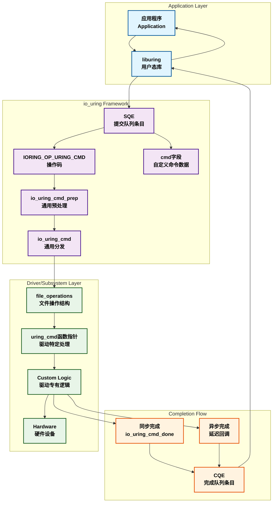

### Prep-Issue-Completion三阶段模式详解

io_uring的操作执行遵循一个精心设计的三阶段模式，这种模式不仅确保了操作的正确性，还优化了异步执行的性能。

#### 三阶段执行流程

```c
// 阶段1：Prep预处理阶段 - 参数验证和资源准备
static int io_prep_readv(struct io_kiocb *req, const struct io_uring_sqe *sqe)
{
    struct io_rw *rw = io_kiocb_to_cmd(req, struct io_rw);
    int ret;
    
    // 参数验证
    if (unlikely(sqe->ioprio || sqe->buf_index || sqe->splice_fd_in))
        return -EINVAL;
    
    // 解析iovec参数
    ret = io_import_iovec(ITER_DEST, req, rw->free_iovec, &rw->iter, false);
    if (unlikely(ret < 0))
        return ret;
    
    // 预分配异步数据结构
    if (req_has_async_data(req))
        return io_rw_prep_async(req, rw);
        
    return 0;
}

// 阶段2：Issue执行阶段 - 实际I/O操作
static int io_read(struct io_kiocb *req, unsigned int issue_flags)
{
    struct io_rw *rw = io_kiocb_to_cmd(req, struct io_rw);
    struct io_async_rw *io;
    struct kiocb *kiocb = &rw->kiocb;
    bool force_nonblock = issue_flags & IO_URING_F_NONBLOCK;
    ssize_t ret, ret2;
    loff_t *ppos;
    
    // 设置kiocb参数
    if (!req_has_async_data(req)) {
        ret = io_import_iovec(ITER_DEST, req, rw->free_iovec, 
                             &rw->iter, issue_flags & IO_URING_F_NONBLOCK);
        if (unlikely(ret < 0))
            return ret;
    } else {
        io = req->async_data;
        rw->iter = io->iter;
    }
    
    // 设置文件位置
    ppos = io_kiocb_update_pos(req);
    
    // 执行实际的读操作
    ret = rw_verify_area(READ, req->file, ppos, req->cqe.res);
    if (unlikely(ret))
        return ret;
    
    ret = io_rw_init_file(req, FMODE_READ);
    if (unlikely(ret))
        return ret;
    
    kiocb->ki_pos = *ppos;
    
    if (force_nonblock) {
        /* 非阻塞路径 */
        kiocb->ki_flags |= IOCB_NOWAIT;
        ret = kiocb_done(req, call_read_iter(req->file, kiocb, &rw->iter),
                        issue_flags);
    } else {
        /* 可能阻塞的路径 */
        ret = kiocb_done(req, io_call_read_iter(req->file, kiocb, &rw->iter),
                        issue_flags);
    }
    
    return ret;
}

// 阶段3：Completion完成阶段 - 结果处理和清理
static void io_req_rw_complete(struct io_kiocb *req, struct io_tw_state *ts)
{
    struct io_rw *rw = io_kiocb_to_cmd(req, struct io_rw);
    struct kiocb *kiocb = &rw->kiocb;
    
    // DIO完成处理
    if ((kiocb->ki_flags & IOCB_DIO_CALLER_COMP) && kiocb->dio_complete) {
        long res = kiocb->dio_complete(rw->kiocb.private);
        io_req_set_res(req, io_fixup_rw_res(req, res), 0);
    }
    
    // 结束I/O跟踪
    io_req_io_end(req);
    
    // 缓冲区清理
    if (req->flags & (REQ_F_BUFFER_SELECTED|REQ_F_BUFFER_RING))
        req->cqe.flags |= io_put_kbuf(req, req->cqe.res, 0);
    
    // 资源清理
    io_req_rw_cleanup(req, 0);
    
    // 最终完成
    io_req_task_complete(req, ts);
}

// 通用的三阶段调度器
static int io_issue_sqe(struct io_kiocb *req, unsigned int issue_flags)
{
    const struct io_issue_def *def = &io_issue_defs[req->opcode];
    const struct cred *creds = NULL;
    int ret;
    
    // 前置处理：文件分配
    if (unlikely(!io_assign_file(req, def, issue_flags)))
        return -EBADF;
    
    // 权限处理
    if (unlikely((req->flags & REQ_F_CREDS) && req->creds != current_cred()))
        creds = override_creds(req->creds);
    
    // 审计记录开始
    if (!def->audit_skip)
        audit_uring_entry(req->opcode);
    
    // 阶段2：调用具体操作的issue函数
    ret = def->issue(req, issue_flags);
    
    // 审计记录结束
    if (!def->audit_skip)
        audit_uring_exit(!ret, ret);
    
    // 恢复权限
    if (creds)
        revert_creds(creds);
    
    // 阶段3：根据返回值处理完成
    if (ret == IOU_OK) {
        if (issue_flags & IO_URING_F_COMPLETE_DEFER)
            io_req_complete_defer(req);  // 延迟完成
        else
            io_req_complete_post(req, issue_flags);  // 立即完成
        return 0;
    }
    
    if (ret == IOU_ISSUE_SKIP_COMPLETE) {
        ret = 0;
        io_arm_ltimeout(req);  // 设置链接超时
        
        // IOPOLL处理
        if ((req->ctx->flags & IORING_SETUP_IOPOLL) && def->iopoll_queue)
            io_iopoll_req_issued(req, issue_flags);
    }
    
    return ret;
}
```

#### 三阶段模式的优势分析

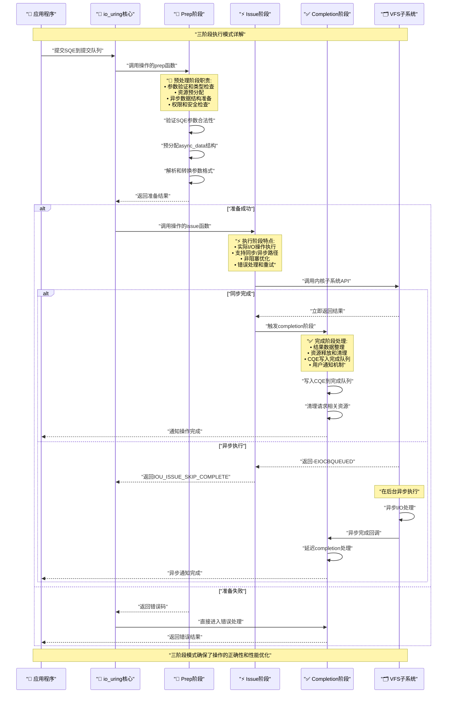

#### Completion阶段的多种处理方式

```c
// 1. 立即完成模式 - 用于io-wq工作线程
void io_req_complete_post(struct io_kiocb *req, unsigned issue_flags)
{
    struct io_ring_ctx *ctx = req->ctx;
    
    // 特殊情况处理
    if (ctx->task_complete || (ctx->flags & IORING_SETUP_IOPOLL)) {
        req->io_task_work.func = io_req_task_complete;
        io_req_task_work_add(req);
        return;
    }
    
    // 直接完成处理
    io_cq_lock(ctx);
    if (!(req->flags & REQ_F_CQE_SKIP)) {
        if (!io_fill_cqe_req(ctx, req))
            io_req_cqe_overflow(req);
    }
    io_cq_unlock_post(ctx);
    
    req_ref_put(req);  // 减少引用计数
}

// 2. 延迟完成模式 - 用于批量优化
void io_req_complete_defer(struct io_kiocb *req)
{
    struct io_submit_state *state = &req->ctx->submit_state;
    
    lockdep_assert_held(&req->ctx->uring_lock);
    
    // 添加到延迟完成列表
    wq_list_add_tail(&req->comp_list, &state->compl_reqs);
}

// 3. 批量完成处理 - 性能优化核心
void __io_submit_flush_completions(struct io_ring_ctx *ctx)
{
    struct io_submit_state *state = &ctx->submit_state;
    struct io_wq_work_node *node;
    
    __io_cq_lock(ctx);
    // 批量写入CQE
    __wq_list_for_each(node, &state->compl_reqs) {
        struct io_kiocb *req = container_of(node, struct io_kiocb, comp_list);
        
        if (!(req->flags & REQ_F_CQE_SKIP) &&
            unlikely(!io_fill_cqe_req(ctx, req))) {
            if (ctx->lockless_cq) {
                spin_lock(&ctx->completion_lock);
                io_req_cqe_overflow(req);
                spin_unlock(&ctx->completion_lock);
            } else {
                io_req_cqe_overflow(req);
            }
        }
    }
    __io_cq_unlock_post(ctx);
    
    // 批量释放资源
    if (!wq_list_empty(&state->compl_reqs)) {
        io_free_batch_list(ctx, state->compl_reqs.first);
        INIT_WQ_LIST(&state->compl_reqs);
    }
    ctx->submit_state.cq_flush = false;
}

// 4. IOPOLL专用完成处理
static void io_complete_rw_iopoll(struct kiocb *kiocb, long res)
{
    struct io_rw *rw = container_of(kiocb, struct io_rw, kiocb);
    struct io_kiocb *req = cmd_to_io_kiocb(rw);
    
    if (kiocb->ki_flags & IOCB_WRITE)
        io_req_end_write(req);
    if (unlikely(res != req->cqe.res)) {
        if (res == -EAGAIN && io_rw_should_reissue(req)) {
            req->flags |= REQ_F_REISSUE | REQ_F_BL_NO_RECYCLE;
            return;
        }
        req->cqe.res = res;
    }
    
    /* 内存屏障确保与io_iopoll_complete()的同步 */
    smp_store_release(&req->iopoll_completed, 1);
}
```

#### 三阶段模式的设计优势

| **阶段** | **主要职责** | **性能优化** | **错误处理** |
|----------|-------------|-------------|-------------|
| **Prep预处理** | • 参数验证<br/>• 资源预分配<br/>• 数据结构初始化 | • 提前发现错误<br/>• 减少issue阶段开销<br/>• 预分配避免竞争 | • 早期错误检测<br/>• 无资源泄露 |
| **Issue执行** | • 实际I/O操作<br/>• 同步/异步路径<br/>• 内核API调用 | • 非阻塞优化<br/>• 快速路径识别<br/>• 批量提交支持 | • 细粒度错误分类<br/>• 智能重试机制 |
| **Completion完成** | • 结果整理<br/>• 资源清理<br/>• 用户通知 | • 批量完成处理<br/>• 延迟清理优化<br/>• 减少锁竞争 | • 保证资源释放<br/>• 错误状态传递 |

通过这种三阶段设计，io_uring实现了：

1. **清晰的职责分离**：每个阶段都有明确的责任边界
2. **优化的错误处理**：在不同阶段采用最适合的错误处理策略  
3. **灵活的执行路径**：支持同步、异步、轮询等多种执行模式
4. **高效的资源管理**：通过预分配和批量处理优化性能
5. **一致的编程接口**：所有操作都遵循相同的执行模式

### 操作类型扩展的设计原理

io_uring能够支持60+种不同操作类型的核心在于其**模块化和可扩展的架构设计**。这种设计不仅保证了系统的灵活性，还为未来新操作类型的加入提供了标准化的框架。

#### 操作定义表的分层设计

```c
// 源码：io_uring/opdef.h 和 opdef.c
// 1. 热路径操作定义 - 执行时频繁访问的元数据
struct io_issue_def {
    // 资源需求标志位（紧凑布局优化缓存性能）
    unsigned    needs_file : 1;          // 需要文件描述符
    unsigned    plug : 1;                // 需要块设备插件
    unsigned    hash_reg_file : 1;       // 哈希注册文件  
    unsigned    unbound_nonreg_file : 1; // 非注册文件使用无界工作队列
    unsigned    pollin : 1;              // 支持输入轮询
    unsigned    pollout : 1;             // 支持输出轮询
    unsigned    poll_exclusive : 1;      // 独占轮询模式
    unsigned    buffer_select : 1;       // 支持缓冲区选择
    unsigned    audit_skip : 1;          // 跳过审计记录
    unsigned    ioprio : 1;              // 支持I/O优先级
    unsigned    iopoll : 1;              // 支持I/O轮询
    unsigned    iopoll_queue : 1;        // 需要加入IOPOLL队列
    unsigned    vectored : 1;            // 向量化操作（readv/writev）
    
    unsigned short async_size;           // 异步数据结构大小
    
    // 核心函数指针
    int (*prep)(struct io_kiocb *, const struct io_uring_sqe *);
    int (*issue)(struct io_kiocb *, unsigned int);
};

// 2. 冷路径操作定义 - 调试和错误处理使用
struct io_cold_def {
    const char    *name;                 // 操作名称（调试用）
    void (*cleanup)(struct io_kiocb *);  // 清理函数
    void (*fail)(struct io_kiocb *);     // 失败处理函数
};

// 3. 双表设计的实现
extern const struct io_issue_def io_issue_defs[IORING_OP_LAST];
extern const struct io_cold_def io_cold_defs[IORING_OP_LAST];

// 初始化时的完整性检查
void __init io_uring_optable_init(void)
{
    int i;
    
    // 编译时大小检查
    BUILD_BUG_ON(ARRAY_SIZE(io_cold_defs) != IORING_OP_LAST);
    BUILD_BUG_ON(ARRAY_SIZE(io_issue_defs) != IORING_OP_LAST);
    
    // 运行时完整性验证
    for (i = 0; i < ARRAY_SIZE(io_issue_defs); i++) {
        BUG_ON(!io_issue_defs[i].prep);  // 必须有prep函数
        
        // 支持的操作必须有issue函数
        if (io_issue_defs[i].prep != io_eopnotsupp_prep)
            BUG_ON(!io_issue_defs[i].issue);
        
        // 调试信息完整性
        WARN_ON_ONCE(!io_cold_defs[i].name);
    }
}
```

#### 操作类型的分类和特征

```mermaid
graph TB
    subgraph "I/O Operations Category"
        FILE_IO["<b>📁 文件I/O操作<br/>File I/O Operations</b>"]
        NET_IO["<b>🌐 网络I/O操作<br/>Network I/O Operations</b>"]
        MEM_OPS["<b>💾 内存操作<br/>Memory Operations</b>"]
        FS_OPS["<b>🗂️ 文件系统操作<br/>File System Operations</b>"]
        SYNC_OPS["<b>🔄 同步操作<br/>Sync Operations</b>"]
        POLL_OPS["<b>👁️ 轮询操作<br/>Poll Operations</b>"]
        TIMER_OPS["<b>⏰ 定时器操作<br/>Timer Operations</b>"]
        CUSTOM_OPS["<b>🔧 自定义操作<br/>Custom Operations</b>"]
    end

    subgraph "Operation Characteristics"
        VECTORED["<b>向量化支持<br/>Vectored Support</b>"]
        IOPOLL["<b>IO轮询支持<br/>IOPOLL Support</b>"]
        BUFFER_SELECT["<b>缓冲区选择<br/>Buffer Selection</b>"]
        FIXED_FILE["<b>固定文件支持<br/>Fixed File Support</b>"]
        ASYNC_CANCEL["<b>异步取消<br/>Async Cancellation</b>"]
        LINK_CHAIN["<b>链式操作<br/>Operation Linking</b>"]
    end

    subgraph "Specific Operations Detail"
        FILE_IO --> F_READ["<b>IORING_OP_READ<br/>• 基础读操作<br/>• 支持固定缓冲区<br/>• IOPOLL兼容</b>"]
        FILE_IO --> F_READV["<b>IORING_OP_READV<br/>• 向量化读取<br/>• 缓冲区选择<br/>• 零拷贝优化</b>"]
        FILE_IO --> F_WRITE["<b>IORING_OP_WRITE<br/>• 基础写操作<br/>• 文件哈希优化<br/>• 块设备插件</b>"]
        FILE_IO --> F_FSYNC["<b>IORING_OP_FSYNC<br/>• 文件同步<br/>• 数据完整性<br/>• 崩溃一致性</b>"]

        NET_IO --> N_ACCEPT["<b>IORING_OP_ACCEPT<br/>• 连接接受<br/>• 多shot模式<br/>• 无界工作队列</b>"]
        NET_IO --> N_SENDMSG["<b>IORING_OP_SENDMSG<br/>• 消息发送<br/>• 零拷贝支持<br/>• 批量优化</b>"]
        NET_IO --> N_RECVMSG["<b>IORING_OP_RECVMSG<br/>• 消息接收<br/>• 缓冲区提供<br/>• 多shot接收</b>"]

        CUSTOM_OPS --> C_URING_CMD["<b>IORING_OP_URING_CMD<br/>• 驱动程序扩展<br/>• 硬件加速<br/>• 自定义协议</b>"]
        CUSTOM_OPS --> C_MSG_RING["<b>IORING_OP_MSG_RING<br/>• 环间通信<br/>• 事件传递<br/>• 分布式协调</b>"]
    end

    subgraph "Feature Matrix"
        FEATURE_TABLE["<b>特性矩阵<br/>Feature Matrix</b><br/>
        ┌─────────────┬─────┬─────┬─────┬─────┐<br/>
        │ Operation   │Vec  │Poll │Buf  │Link │<br/>
        ├─────────────┼─────┼─────┼─────┼─────┤<br/>
        │ READ/WRITE  │ ✓   │ ✓   │ ✓   │ ✓   │<br/>
        │ SEND/RECV   │ △   │ ✓   │ ✓   │ ✓   │<br/>
        │ ACCEPT      │ ✗   │ ✓   │ ✗   │ ✓   │<br/>
        │ FSYNC       │ ✗   │ ✗   │ ✗   │ ✓   │<br/>
        │ URING_CMD   │ △   │ ✓   │ ✓   │ ✓   │<br/>
        └─────────────┴─────┴─────┴─────┴─────┘"]
    end

    FILE_IO -.-> VECTORED
    NET_IO -.-> BUFFER_SELECT
    CUSTOM_OPS -.-> IOPOLL
    FILE_IO -.-> FIXED_FILE
    NET_IO -.-> ASYNC_CANCEL
    TIMER_OPS -.-> LINK_CHAIN

    classDef fileOps fill:#e3f2fd,stroke:#1976d2,stroke-width:2px,color:#000
    classDef netOps fill:#e8f5e8,stroke:#388e3c,stroke-width:2px,color:#000
    classDef customOps fill:#fff3e0,stroke:#f57c00,stroke-width:2px,color:#000
    classDef features fill:#fce4ec,stroke:#c2185b,stroke-width:2px,color:#000
    classDef details fill:#f3e5f5,stroke:#7b1fa2,stroke-width:2px,color:#000

    class FILE_IO,F_READ,F_READV,F_WRITE,F_FSYNC fileOps
    class NET_IO,N_ACCEPT,N_SENDMSG,N_RECVMSG netOps
    class CUSTOM_OPS,C_URING_CMD,C_MSG_RING customOps
    class VECTORED,IOPOLL,BUFFER_SELECT,FIXED_FILE,ASYNC_CANCEL,LINK_CHAIN features
    class MEM_OPS,FS_OPS,SYNC_OPS,POLL_OPS,TIMER_OPS,FEATURE_TABLE details
```

#### 新操作类型的注册机制

```c
// 1. 编译时注册 - 静态操作表扩展
// 在io_uring/opdef.c中添加新操作的定义

// 示例：添加一个新的文件操作IORING_OP_FADVISE
[IORING_OP_FADVISE] = {
    .needs_file     = 1,           // 需要文件描述符
    .audit_skip     = 1,           // 跳过审计（性能操作）
    .prep           = io_fadvise_prep,
    .issue          = io_fadvise,
},

// 对应的冷路径定义
[IORING_OP_FADVISE] = {
    .name           = "FADVISE",
},

// 2. 操作实现的标准模板
static int io_fadvise_prep(struct io_kiocb *req, const struct io_uring_sqe *sqe)
{
    struct io_fadvise *fa = io_kiocb_to_cmd(req, struct io_fadvise);
    
    // 参数验证 - 标准化错误处理
    if (sqe->ioprio || sqe->buf_index || sqe->splice_fd_in)
        return -EINVAL;
    
    // 解析操作特定参数
    fa->offset = READ_ONCE(sqe->off);
    fa->len = READ_ONCE(sqe->len);
    fa->advice = READ_ONCE(sqe->fadvise_advice);
    
    return 0;
}

static int io_fadvise(struct io_kiocb *req, unsigned int issue_flags)
{
    struct io_fadvise *fa = io_kiocb_to_cmd(req, struct io_fadvise);
    int ret;
    
    // 调用内核API
    ret = vfs_fadvise(req->file, fa->offset, fa->len, fa->advice);
    if (ret < 0)
        req_set_fail(req);
    
    // 设置完成结果
    io_req_set_res(req, ret, 0);
    return IOU_OK;  // 同步完成
}

// 3. 动态功能检查机制
bool io_uring_op_supported(u8 opcode)
{
    if (opcode < IORING_OP_LAST &&
        io_issue_defs[opcode].prep != io_eopnotsupp_prep)
        return true;
    return false;
}

// 4. 运行时操作探测
static int io_probe(struct io_ring_ctx *ctx, void __user *arg, unsigned nr_args)
{
    struct io_uring_probe *p;
    size_t size;
    int i, ret;
    
    size = struct_size(p, ops, nr_args);
    if (size == SIZE_MAX)
        return -EOVERFLOW;
    p = kzalloc(size, GFP_KERNEL);
    if (!p)
        return -ENOMEM;
    
    ret = -EFAULT;
    if (copy_from_user(p, arg, size))
        goto out;
    ret = -EINVAL;
    if (memchr_inv(p, 0, size))
        goto out;
    
    p->last_op = IORING_OP_LAST - 1;
    if (nr_args > IORING_OP_LAST)
        nr_args = IORING_OP_LAST;
    
    // 填充支持的操作信息
    for (i = 0; i < nr_args; i++) {
        p->ops[i].op = i;
        if (io_uring_op_supported(i))
            p->ops[i].flags = IO_URING_OP_SUPPORTED;
        else
            p->ops[i].flags = 0;
    }
    p->ops_len = i;
    
    ret = 0;
    if (copy_to_user(arg, p, size))
        ret = -EFAULT;
out:
    kfree(p);
    return ret;
}
```

#### 操作扩展的架构优势

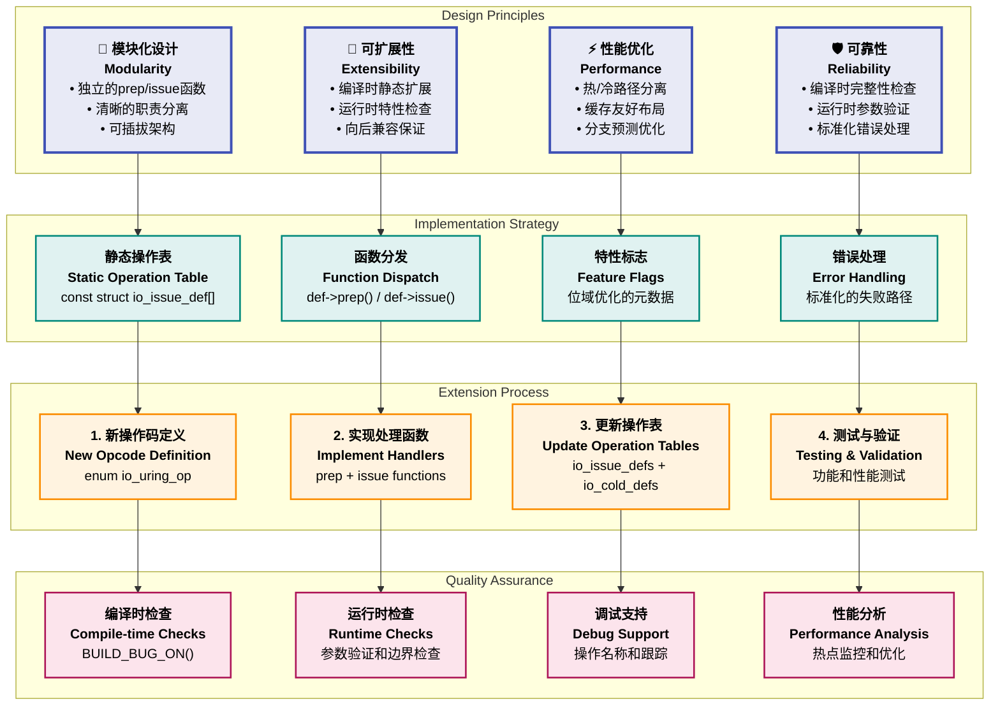

#### 为什么io_uring可以做到通用性？

**核心设计原理分析**：

1. **统一的抽象层设计**
   - SQE（提交队列条目）提供了足够灵活的参数空间
   - 联合体结构允许不同操作复用相同的内存布局  
   - 统一的用户数据字段support任意的回调标识

2. **分层的架构模式**
   - 应用层：统一的liburing接口
   - 框架层：通用的prep-issue-completion流程
   - 实现层：操作特定的处理逻辑
   - 系统层：内核子系统的原生API

3. **可组合的特性系统**
   - 每个操作可以独立选择支持的特性（IOPOLL、缓冲区选择等）
   - 特性之间可以自由组合而不相互冲突
   - 新特性的加入不影响现有操作的兼容性

4. **高效的元数据管理**
   - 位域结构紧凑存储操作特征
   - 双表设计分离热路径和冷路径数据
   - 编译时优化和运行时检查相结合

通过这种精心设计的架构，io_uring不仅实现了对现有所有I/O类型的统一支持，还为未来新操作类型的加入提供了标准化、高效的扩展机制。这种设计哲学使得io_uring成为了一个真正的"通用异步系统调用框架"，而不仅仅是一个I/O接口。

### SQPOLL和IOPOLL轮询机制深度解析

io_uring提供了两种高性能轮询机制：**SQPOLL（提交队列轮询）**和**IOPOLL（I/O轮询）**，它们分别优化了请求提交和I/O完成的性能瓶颈，是实现超低延迟和高吞吐量的关键技术。

#### SQPOLL - 提交队列轮询机制

SQPOLL通过专用的内核线程来轮询提交队列，消除了用户态应用程序调用`io_uring_enter()`进行请求提交的系统调用开销。

##### SQPOLL架构设计

```c
// 源码：io_uring/sqpoll.c
// SQPOLL数据结构 - 线程管理和状态控制
struct io_sq_data {
    refcount_t              refs;           // 引用计数
    atomic_t                park_pending;   // 暂停挂起计数
    struct mutex            lock;           // 保护锁
    
    /* ctx的相关数据必须在锁的保护下访问 */
    struct list_head        ctx_list;       // 关联的io_ring_ctx列表
    unsigned long           state;          // 线程状态位
    struct completion       exited;         // 退出完成信号
    
    struct task_struct      *thread;        // SQPOLL内核线程
    struct wait_queue_head  wait;           // 等待队列
    
    unsigned                sq_thread_idle; // 空闲超时时间
    int                     sq_cpu;         // 绑定的CPU核心
    pid_t                   task_pid;       // 任务PID
    pid_t                   task_tgid;      // 任务TGID
    
    unsigned long           timeout;        // 超时时间戳
    struct rusage           start, end;     // 资源使用统计
    u64                     work_time;      // 工作时间统计
};

// SQPOLL线程的核心工作函数
static int io_sq_thread(void *data)
{
    struct io_sq_data *sqd = data;
    struct io_ring_ctx *ctx;
    unsigned long timeout = 0;
    char buf[TASK_COMM_LEN];
    DEFINE_WAIT(wait);
    
    // 线程初始化
    snprintf(buf, sizeof(buf), "iou-sqp-%d", sqd->task_pid);
    set_task_comm(current, buf);
    
    // CPU亲和性设置
    if (sqd->sq_cpu != -1) {
        set_cpus_allowed_ptr(current, cpumask_of(sqd->sq_cpu));
    } else {
        set_cpus_allowed_ptr(current, cpu_online_mask);
        sqd->sq_cpu = raw_smp_processor_id();
    }
    
    // 审计初始化
    audit_uring_entry(IORING_OP_NOP);
    audit_uring_exit(true, 0);
    
    mutex_lock(&sqd->lock);
    while (1) {
        bool cap_entries, sqt_spin = false;
        
        // 处理线程控制事件（暂停/停止）
        if (io_sqd_events_pending(sqd) || signal_pending(current)) {
            if (io_sqd_handle_event(sqd))
                break;
            timeout = jiffies + sqd->sq_thread_idle;
        }
        
        // 多环境公平性控制
        cap_entries = !list_is_singular(&sqd->ctx_list);
        getrusage(current, RUSAGE_SELF, &start);
        
        // 遍历处理所有关联的io_uring实例
        list_for_each_entry(ctx, &sqd->ctx_list, sqd_list) {
            int ret = __io_sq_thread(ctx, cap_entries);
            
            if (!sqt_spin && (ret > 0 || !wq_list_empty(&ctx->iopoll_list)))
                sqt_spin = true;
        }
        
        // 处理任务工作
        if (io_sq_tw(&retry_list, IORING_TW_CAP_ENTRIES_VALUE))
            sqt_spin = true;
        
        // NAPI轮询支持（网络加速）
        list_for_each_entry(ctx, &sqd->ctx_list, sqd_list)
            if (io_napi(ctx))
                io_napi_sqpoll_busy_poll(ctx);
        
        // 自适应轮询策略
        if (sqt_spin || !time_after(jiffies, timeout)) {
            if (sqt_spin) {
                io_sq_update_worktime(sqd, &start);
                timeout = jiffies + sqd->sq_thread_idle;
            }
            if (unlikely(need_resched())) {
                mutex_unlock(&sqd->lock);
                cond_resched();
                mutex_lock(&sqd->lock);
                sqd->sq_cpu = raw_smp_processor_id();
            }
            continue;
        }
        
        // 进入等待状态
        prepare_to_wait(&sqd->wait, &wait, TASK_INTERRUPTIBLE);
        if (!io_sqd_events_pending(sqd) && !io_sq_tw_pending(retry_list)) {
            bool needs_sched = true;
            
            // 设置唤醒标志并检查是否有工作
            list_for_each_entry(ctx, &sqd->ctx_list, sqd_list) {
                atomic_or(IORING_SQ_NEED_WAKEUP, &ctx->rings->sq_flags);
                
                if ((ctx->flags & IORING_SETUP_IOPOLL) &&
                    !wq_list_empty(&ctx->iopoll_list)) {
                    needs_sched = false;
                    break;
                }
                
                /* 内存屏障确保唤醒标志的存储在SQ tail加载之前 */
                smp_mb__after_atomic();
                
                if (io_sqring_entries(ctx)) {
                    needs_sched = false;
                    break;
                }
            }
            
            if (needs_sched) {
                mutex_unlock(&sqd->lock);
                schedule();  // 线程休眠
                mutex_lock(&sqd->lock);
                sqd->sq_cpu = raw_smp_processor_id();
            }
            
            // 清理唤醒标志
            list_for_each_entry(ctx, &sqd->ctx_list, sqd_list)
                atomic_andnot(IORING_SQ_NEED_WAKEUP, &ctx->rings->sq_flags);
        }
        
        finish_wait(&sqd->wait, &wait);
        timeout = jiffies + sqd->sq_thread_idle;
    }
    
    // 线程退出清理
    io_uring_cancel_generic(true, sqd);
    sqd->thread = NULL;
    list_for_each_entry(ctx, &sqd->ctx_list, sqd_list)
        io_ring_set_wakeup_flag(ctx);
    io_run_task_work();
    
    complete(&sqd->exited);
    do_exit(0);
}

// 单个ring的SQ处理
static int __io_sq_thread(struct io_ring_ctx *ctx, bool cap_entries)
{
    unsigned int to_submit;
    int ret = 0;
    
    to_submit = io_sqring_entries(ctx);
    /* 多ring公平性：限制单次处理的条目数 */
    if (cap_entries && to_submit > IORING_SQPOLL_CAP_ENTRIES_VALUE)
        to_submit = IORING_SQPOLL_CAP_ENTRIES_VALUE;
    
    if (to_submit || !wq_list_empty(&ctx->iopoll_list)) {
        const struct cred *creds = NULL;
        
        // 凭证切换
        if (ctx->sq_creds != current_cred())
            creds = override_creds(ctx->sq_creds);
        
        mutex_lock(&ctx->uring_lock);
        
        // 处理IOPOLL完成
        if (!wq_list_empty(&ctx->iopoll_list))
            io_do_iopoll(ctx, true);
        
        // 提交新请求
        if (to_submit && likely(!percpu_ref_is_dying(&ctx->refs)) &&
            !(ctx->flags & IORING_SETUP_R_DISABLED))
            ret = io_submit_sqes(ctx, to_submit);
        
        mutex_unlock(&ctx->uring_lock);
        
        // 唤醒等待的用户进程
        if (to_submit && wq_has_sleeper(&ctx->sqo_sq_wait))
            wake_up(&ctx->sqo_sq_wait);
            
        if (creds)
            revert_creds(creds);
    }
    
    return ret;
}
```

##### SQPOLL性能优化策略

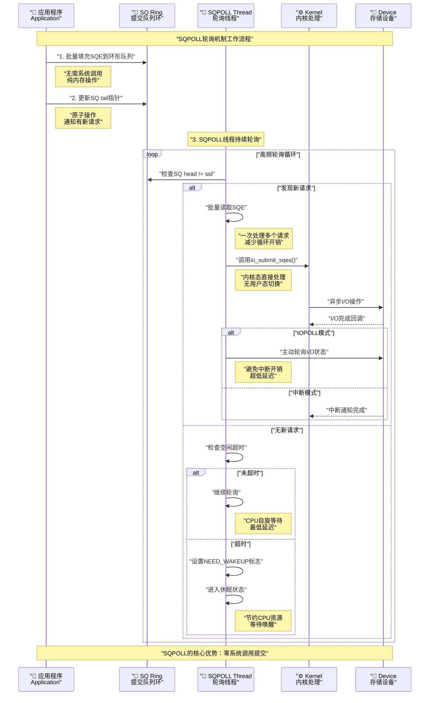

#### IOPOLL - I/O轮询机制

IOPOLL通过主动轮询硬件设备状态来获取I/O完成结果，避免了中断处理的开销，特别适合NVMe等高性能存储设备。

##### IOPOLL实现原理

```c
// 源码：io_uring/rw.c 和 io_uring.c
// IOPOLL的核心轮询函数
int io_do_iopoll(struct io_ring_ctx *ctx, bool force_nonspin)
{
    struct io_wq_work_node *pos, *start, *prev;
    unsigned int poll_flags = 0;
    DEFINE_IO_COMP_BATCH(iob);
    int nr_events = 0;
    
    /*
     * 多设备优化：如果有多个设备，不进行自旋等待
     * 避免在一个设备上等待而阻塞其他设备的处理
     */
    if (ctx->poll_multi_queue || force_nonspin)
        poll_flags |= BLK_POLL_ONESHOT;
    
    // 第一阶段：轮询未完成的请求
    wq_list_for_each(pos, start, &ctx->iopoll_list) {
        struct io_kiocb *req = container_of(pos, struct io_kiocb, comp_list);
        struct file *file = req->file;
        int ret;
        
        /* 如果已完成，跳出轮询循环 */
        if (READ_ONCE(req->iopoll_completed))
            break;
        
        // 根据操作类型选择轮询方法
        if (req->opcode == IORING_OP_URING_CMD) {
            struct io_uring_cmd *ioucmd;
            
            ioucmd = io_kiocb_to_cmd(req, struct io_uring_cmd);
            ret = file->f_op->uring_cmd_iopoll(ioucmd, &iob, poll_flags);
        } else {
            struct io_rw *rw = io_kiocb_to_cmd(req, struct io_rw);
            
            // 调用文件系统/设备的iopoll接口
            ret = file->f_op->iopoll(&rw->kiocb, &iob, poll_flags);
        }
        
        if (unlikely(ret < 0))
            return ret;
        else if (ret)
            poll_flags |= BLK_POLL_ONESHOT;
        
        /* iopoll可能已经完成了当前请求 */
        if (!rq_list_empty(iob.req_list) ||
            READ_ONCE(req->iopoll_completed))
            break;
    }
    
    // 处理批量完成的请求
    if (!rq_list_empty(iob.req_list))
        iob.complete(&iob);
    else if (!pos)
        return 0;
    
    // 第二阶段：处理已完成的请求
    prev = start;
    wq_list_for_each_resume(pos, prev) {
        struct io_kiocb *req = container_of(pos, struct io_kiocb, comp_list);
        
        /* 内存屏障确保与io_complete_rw_iopoll()的同步 */
        if (!smp_load_acquire(&req->iopoll_completed))
            break;
            
        nr_events++;
        req->cqe.flags = io_put_kbuf(req, req->cqe.res, 0);
        if (req->opcode != IORING_OP_URING_CMD)
            io_req_rw_cleanup(req, 0);
    }
    
    if (unlikely(!nr_events))
        return 0;
    
    // 批量处理完成事件
    pos = start ? start->next : ctx->iopoll_list.first;
    wq_list_cut(&ctx->iopoll_list, prev, start);
    
    if (WARN_ON_ONCE(!wq_list_empty(&ctx->submit_state.compl_reqs)))
        return 0;
    __wq_list_splice(&ctx->submit_state.compl_reqs, pos);
    __io_submit_flush_completions(ctx);
    return nr_events;
}

// IOPOLL专用的I/O完成处理
static void io_complete_rw_iopoll(struct kiocb *kiocb, long res)
{
    struct io_rw *rw = container_of(kiocb, struct io_rw, kiocb);
    struct io_kiocb *req = cmd_to_io_kiocb(rw);
    
    if (kiocb->ki_flags & IOCB_WRITE)
        io_req_end_write(req);
    if (unlikely(res != req->cqe.res)) {
        if (res == -EAGAIN && io_rw_should_reissue(req)) {
            req->flags |= REQ_F_REISSUE | REQ_F_BL_NO_RECYCLE;
            return;
        }
        req->cqe.res = res;
    }
    
    /* 
     * 原子存储操作，配合io_iopoll_complete()中的原子加载
     * 确保在多CPU环境下的内存可见性
     */
    smp_store_release(&req->iopoll_completed, 1);
}

// IOPOLL检查循环 - 用户态调用的入口
static int io_iopoll_check(struct io_ring_ctx *ctx, long min)
{
    unsigned int nr_events = 0;
    unsigned long check_cq;
    
    lockdep_assert_held(&ctx->uring_lock);
    
    if (!io_allowed_run_tw(ctx))
        return -EEXIST;
    
    // 检查CQ状态
    check_cq = READ_ONCE(ctx->check_cq);
    if (unlikely(check_cq)) {
        if (check_cq & BIT(IO_CHECK_CQ_OVERFLOW_BIT))
            __io_cqring_overflow_flush(ctx, false);
        if (check_cq & BIT(IO_CHECK_CQ_DROPPED_BIT))
            return -EBADR;
    }
    
    /* 如果已有完成事件，直接返回 */
    if (io_cqring_events(ctx))
        return 0;
    
    do {
        /*
         * 如果有请求被提交到工作队列，需要暂停轮询
         * 让工作队列有机会将请求加入到iopoll列表
         */
        if (wq_list_empty(&ctx->iopoll_list) ||
            io_task_work_pending(ctx)) {
            u32 tail = ctx->cached_cq_tail;
            
            (void) io_run_local_work_locked(ctx, min);
            
            if (task_work_pending(current) ||
                wq_list_empty(&ctx->iopoll_list)) {
                mutex_unlock(&ctx->uring_lock);
                io_run_task_work();
                mutex_lock(&ctx->uring_lock);
            }
            
            /* 检查是否有新完成的请求 */
            if (tail != ctx->cached_cq_tail ||
                wq_list_empty(&ctx->iopoll_list))
                break;
        }
        
        // 执行实际的轮询
        int ret = io_do_iopoll(ctx, !min);
        if (unlikely(ret < 0))
            return ret;
        
        // 信号和调度检查
        if (task_sigpending(current))
            return -EINTR;
        if (need_resched())
            break;
        
        nr_events += ret;
    } while (nr_events < min);
    
    return 0;
}

// 请求加入IOPOLL队列
static void io_iopoll_req_issued(struct io_kiocb *req, unsigned int issue_flags)
{
    struct io_ring_ctx *ctx = req->ctx;
    const bool needs_lock = issue_flags & IO_URING_F_UNLOCKED;
    
    if (unlikely(needs_lock))
        mutex_lock(&ctx->uring_lock);
    
    /*
     * 多设备检测：如果有来自不同设备的请求
     * 设置multi_queue标志，优化轮询策略
     */
    if (wq_list_empty(&ctx->iopoll_list)) {
        ctx->poll_multi_queue = false;
    } else if (!ctx->poll_multi_queue) {
        struct io_kiocb *list_req;
        
        list_req = container_of(ctx->iopoll_list.first, struct io_kiocb, comp_list);
        if (list_req->file != req->file)
            ctx->poll_multi_queue = true;
    }
    
    /*
     * 快速设备优化：对于可能已完成的请求
     * 将其加入队列头部，优先处理
     */
    if (READ_ONCE(req->iopoll_completed))
        wq_list_add_head(&req->comp_list, &ctx->iopoll_list);
    else
        wq_list_add_tail(&req->comp_list, &ctx->iopoll_list);
    
    // SQPOLL模式的唤醒处理
    if (unlikely(needs_lock)) {
        if ((ctx->flags & IORING_SETUP_SQPOLL) &&
            wq_has_sleeper(&ctx->sq_data->wait))
            wake_up(&ctx->sq_data->wait);
        
        mutex_unlock(&ctx->uring_lock);
    }
}
```

#### 双轮询机制的协同工作

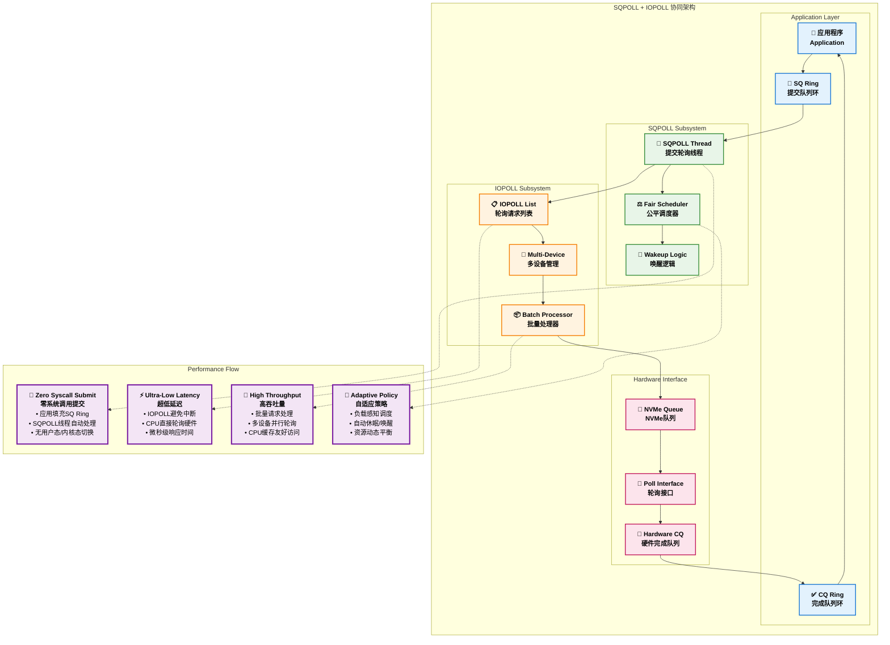

#### 轮询机制的性能对比分析

| **指标** | **传统中断模式** | **SQPOLL模式** | **IOPOLL模式** | **SQPOLL+IOPOLL** |
|----------|------------------|----------------|----------------|-------------------|
| **提交延迟** | **~1-2μs**<br/>系统调用开销 | **~100ns**<br/>内存写入 | **~1-2μs**<br/>系统调用开销 | **~100ns**<br/>纯内存操作 |
| **完成延迟** | **~5-10μs**<br/>中断处理 | **~5-10μs**<br/>中断处理 | **~1-2μs**<br/>主动轮询 | **~1-2μs**<br/>主动轮询 |
| **CPU使用** | **低**<br/>事件驱动 | **中**<br/>轮询开销 | **低**<br/>按需轮询 | **高**<br/>持续轮询 |
| **吞吐量** | **中等**<br/>中断瓶颈 | **高**<br/>批量处理 | **中等**<br/>轮询效率 | **最高**<br/>双重优化 |
| **适用场景** | **通用负载** | **高频提交** | **低延迟I/O** | **极致性能** |

#### 轮询参数调优策略

```c
// SQPOLL参数配置示例
struct io_uring_params params = {
    .flags = IORING_SETUP_SQPOLL |          // 启用SQPOLL
             IORING_SETUP_SQ_AFF |          // CPU亲和性
             IORING_SETUP_IOPOLL,           // 启用IOPOLL
    .sq_thread_cpu = 2,                     // 绑定到CPU 2
    .sq_thread_idle = 1000,                 // 1秒空闲超时
};

// 性能调优要点：
// 1. CPU隔离：将SQPOLL线程绑定到专用CPU核心
// 2. 内存局部性：确保SQ/CQ环与CPU在同一NUMA节点
// 3. 中断亲和性：将设备中断路由到相同CPU
// 4. 调度优先级：提高SQPOLL线程优先级
// 5. 电源管理：禁用相关CPU的节能特性

/*
 * 典型的高性能配置脚本：
 * 
 * # CPU隔离
 * echo 2 > /sys/devices/system/cpu/cpu2/online
 * echo performance > /sys/devices/system/cpu/cpu2/cpufreq/scaling_governor
 * 
 * # 中断亲和性
 * echo 4 > /proc/irq/24/smp_affinity  # NVMe中断到CPU 2
 * 
 * # 内存预分配
 * echo 1 > /proc/sys/vm/nr_hugepages
 * 
 * # 网络优化（如果有网络I/O）
 * echo 2 > /sys/class/net/eth0/queues/rx-0/rps_cpus
 */
```

通过SQPOLL和IOPOLL的协同工作，io_uring能够实现：

1. **零系统调用提交**：SQPOLL消除提交路径的内核态切换
2. **微秒级I/O延迟**：IOPOLL避免中断处理开销  
3. **高效批量处理**：两种机制都支持批量操作优化
4. **CPU资源可控**：通过空闲超时和CPU亲和性精确控制资源使用
5. **硬件加速集成**：与现代NVMe、网卡等硬件深度优化

这些轮询机制是io_uring实现极致性能的关键技术，特别适合对延迟和吞吐量都有极高要求的应用场景。

### 固定资源注册的内存优化机制

io_uring通过**固定缓冲区注册**和**固定文件注册**机制，在系统初始化阶段预先完成资源的内存映射和验证工作，从而在运行时消除重复的地址转换和权限检查开销，实现真正的零拷贝I/O。

#### 固定缓冲区注册机制

固定缓冲区注册通过提前锁定用户空间内存页面，避免了每次I/O操作时的页面查找、映射和权限验证过程。

##### 缓冲区注册的实现原理

```c
// 源码：io_uring/rsrc.c
// 固定缓冲区的核心数据结构
struct io_mapped_ubuf {
    u64                 ubuf;           // 原始用户缓冲区地址
    unsigned int        len;            // 缓冲区长度
    unsigned int        nr_bvecs;       // bio_vec数量
    unsigned int        folio_shift;    // 页面大小偏移
    refcount_t          refs;           // 引用计数
    unsigned long       acct_pages;     // 计费页面数
    struct bio_vec      bvec[] __counted_by(nr_bvecs); // 页面向量数组
};

// 大页面聚合优化数据
struct io_imu_folio_data {
    unsigned int        nr_pages_head;  // 头页面数量
    unsigned int        nr_pages_mid;   // 中间完整页面数
    unsigned int        folio_shift;    // 大页面偏移位数
};

// 缓冲区注册的主函数
int io_sqe_buffers_register(struct io_ring_ctx *ctx, void __user *arg,
                           unsigned int nr_args, u64 __user *tags)
{
    struct page *last_hpage = NULL;
    struct io_rsrc_data *data;
    struct iovec fast_iov, *iov = &fast_iov;
    const struct iovec __user *uvec;
    int i, ret;
    
    BUILD_BUG_ON(IORING_MAX_REG_BUFFERS >= (1u << 16));
    
    // 防重复注册
    if (ctx->user_bufs)
        return -EBUSY;
    if (!nr_args || nr_args > IORING_MAX_REG_BUFFERS)
        return -EINVAL;
    
    // 分配资源管理数据结构
    ret = io_rsrc_data_alloc(ctx, IORING_RSRC_BUFFER, tags, nr_args, &data);
    if (ret)
        return ret;
    
    // 分配缓冲区映射数组
    ret = io_buffers_map_alloc(ctx, nr_args);
    if (ret) {
        io_rsrc_data_free(data);
        return ret;
    }
    
    if (!arg)
        memset(iov, 0, sizeof(*iov));
    
    // 逐个处理每个缓冲区
    for (i = 0; i < nr_args; i++, ctx->nr_user_bufs++) {
        if (arg) {
            uvec = (struct iovec __user *) arg;
            iov = iovec_from_user(uvec, 1, 1, &fast_iov, ctx->compat);
            if (IS_ERR(iov)) {
                ret = PTR_ERR(iov);
                break;
            }
            
            // 缓冲区参数验证
            ret = io_buffer_validate(iov);
            if (ret)
                break;
                
            if (ctx->compat)
                arg += sizeof(struct compat_iovec);
            else
                arg += sizeof(struct iovec);
        }
        
        if (!iov->iov_base && *io_get_tag_slot(data, i)) {
            ret = -EINVAL;
            break;
        }
        
        // 核心：注册单个缓冲区
        ret = io_sqe_buffer_register(ctx, iov, &ctx->user_bufs[i],
                                   &last_hpage);
        if (ret)
            break;
    }
    
    WARN_ON_ONCE(ctx->buf_data);
    
    ctx->buf_data = data;
    if (ret)
        __io_sqe_buffers_unregister(ctx);
    return ret;
}

// 单个缓冲区注册的详细实现
static int io_sqe_buffer_register(struct io_ring_ctx *ctx, struct iovec *iov,
                                 struct io_mapped_ubuf **pimu,
                                 struct page **last_hpage)
{
    struct io_mapped_ubuf *imu = NULL;
    struct page **pages = NULL;
    unsigned long off;
    size_t size;
    int ret, nr_pages, i;
    struct io_imu_folio_data data;
    bool coalesced;
    
    *pimu = (struct io_mapped_ubuf *)&dummy_ubuf;
    if (!iov->iov_base)
        return 0;
    
    ret = -ENOMEM;
    // 关键步骤1：锁定用户空间页面
    pages = io_pin_pages((unsigned long) iov->iov_base, iov->iov_len,
                        &nr_pages);
    if (IS_ERR(pages)) {
        ret = PTR_ERR(pages);
        pages = NULL;
        goto done;
    }
    
    // 关键步骤2：大页面聚合优化
    coalesced = io_try_coalesce_buffer(&pages, &nr_pages, &data);
    
    // 关键步骤3：分配映射结构
    imu = kvmalloc(struct_size(imu, bvec, nr_pages), GFP_KERNEL);
    if (!imu)
        goto done;
    
    // 关键步骤4：内存账务处理
    ret = io_buffer_account_pin(ctx, pages, nr_pages, imu, last_hpage);
    if (ret) {
        unpin_user_pages(pages, nr_pages);
        goto done;
    }
    
    // 初始化映射结构
    size = iov->iov_len;
    imu->ubuf = (unsigned long) iov->iov_base;  // 保存原始地址用于验证
    imu->len = iov->iov_len;
    imu->nr_bvecs = nr_pages;
    imu->folio_shift = PAGE_SHIFT;
    if (coalesced)
        imu->folio_shift = data.folio_shift;
    refcount_set(&imu->refs, 1);
    off = (unsigned long) iov->iov_base & ((1UL << imu->folio_shift) - 1);
    *pimu = imu;
    ret = 0;
    
    // 关键步骤5：构建bio_vec数组
    for (i = 0; i < nr_pages; i++) {
        size_t vec_len;
        
        vec_len = min_t(size_t, size, (1UL << imu->folio_shift) - off);
        bvec_set_page(&imu->bvec[i], pages[i], vec_len, off);
        off = 0;
        size -= vec_len;
    }
    
done:
    if (ret)
        kvfree(imu);
    kvfree(pages);
    return ret;
}

// 高性能的页面锁定函数
static struct page **io_pin_pages(unsigned long ubuf, unsigned long len,
                                 int *npages)
{
    unsigned long start, end, nr_pages;
    struct vm_area_struct **vmas = NULL;
    struct page **pages = NULL;
    int i, pret, ret = -ENOMEM;
    
    end = (ubuf + len + PAGE_SIZE - 1) >> PAGE_SHIFT;
    start = ubuf >> PAGE_SHIFT;
    nr_pages = end - start;
    
    *npages = nr_pages;
    
    if (nr_pages > URING_MAX_PAGES_PER_BUFFER)
        return ERR_PTR(-EINVAL);
    
    pages = kvmalloc_array(nr_pages, sizeof(struct page *), GFP_KERNEL);
    if (!pages)
        goto done;
    
    vmas = kvmalloc_array(nr_pages, sizeof(struct vm_area_struct *),
                         GFP_KERNEL);
    if (!vmas)
        goto done;
    
    // 使用pin_user_pages替代get_user_pages，支持DMA
    ret = pin_user_pages(ubuf, nr_pages,
                        FOLL_WRITE | FOLL_LONGTERM,
                        pages, vmas);
    if (ret != nr_pages) {
        /* partial pin */
        if (ret > 0) {
            unpin_user_pages(pages, ret);
            ret = -EFAULT;
        }
        pages = ERR_PTR(ret);
        goto done;
    }
    ret = 0;
    
done:
    kvfree(vmas);
    if (ret < 0) {
        kvfree(pages);
        pages = ERR_PTR(ret);
    }
    return pages;
}

// 大页面聚合优化 - 减少bio_vec数量
static bool io_try_coalesce_buffer(struct page ***pages, int *nr_pages,
                                  struct io_imu_folio_data *data)
{
    struct page **plist = *pages;
    struct folio *folio = page_folio(plist[0]);
    unsigned int count = 1, nr_folios = 1;
    int i;
    
    data->nr_pages_head = folio_nr_pages(folio);
    data->nr_pages_mid = 0;
    data->folio_shift = folio_shift(folio);
    
    // 检查是否可以聚合为大页面
    if (*nr_pages <= 1)
        return false;
    
    // 遍历检查连续页面
    for (i = 1; i < *nr_pages; i++) {
        struct folio *curr_folio = page_folio(plist[i]);
        
        if (curr_folio == folio) {
            count++;
        } else {
            if (folio_test_large(folio)) {
                if (count == folio_nr_pages(folio)) {
                    data->nr_pages_mid++;
                } else {
                    /* 部分大页面，无法优化 */
                    return false;
                }
            }
            
            folio = curr_folio;
            count = 1;
            nr_folios++;
        }
    }
    
    // 检查最后一个folio
    if (folio_test_large(folio) && count != folio_nr_pages(folio))
        return false;
    
    return io_do_coalesce_buffer(plist, *nr_pages, data, nr_folios);
}
```

##### 固定缓冲区的使用机制

```c
// 使用固定缓冲区进行零拷贝I/O
int io_import_fixed(int ddir, struct iov_iter *iter,
                   struct io_mapped_ubuf *imu,
                   u64 buf_addr, size_t len)
{
    u64 buf_end;
    size_t offset;
    
    if (unlikely(check_add_overflow(buf_addr, len, &buf_end)))
        return -EFAULT;
    
    /* 边界检查：确保不超出注册的缓冲区范围 */
    if (buf_addr < imu->ubuf ||
        buf_end > imu->ubuf + imu->len)
        return -EFAULT;
    
    /*
     * 计算在bio_vec数组中的起始位置
     * 这是零拷贝的核心：直接使用预映射的页面
     */
    offset = buf_addr - imu->ubuf;
    
    if (offset <= LONG_MAX) {
        /*
         * 对于小偏移，使用标准的iov_iter_bvec
         * 直接引用已经锁定的页面
         */
        iov_iter_bvec(iter, ddir, imu->bvec, imu->nr_bvecs, offset + len);
        iov_iter_advance(iter, offset);
    } else {
        /*
         * 对于大偏移，需要计算具体的页面位置
         * 仍然是零拷贝，只是需要更精确的定位
         */
        unsigned long nr_bvecs = imu->nr_bvecs;
        struct bio_vec *bvec = imu->bvec;
        struct bio_vec *bvecs;
        bool reexpand = false;
        int seg_skip;
        
        /* 找到起始的bio_vec */
        seg_skip = 0;
        while (offset >= bvec->bv_len) {
            offset -= bvec->bv_len;
            nr_bvecs--;
            bvec++;
            seg_skip++;
        }
        
        if (offset) {
            /*
             * 当起始位置不在页面边界时
             * 需要动态调整第一个bio_vec
             */
            bvecs = kmalloc_array(nr_bvecs, sizeof(struct bio_vec),
                                 GFP_KERNEL);
            if (!bvecs)
                return -ENOMEM;
            reexpand = true;
            
            memcpy(bvecs, bvec, sizeof(struct bio_vec) * nr_bvecs);
            bvecs[0].bv_offset += offset;
            bvecs[0].bv_len -= offset;
        } else {
            bvecs = bvec;
        }
        
        iov_iter_bvec(iter, ddir, bvecs, nr_bvecs, len);
        if (reexpand)
            kfree(bvecs);
    }
    
    return 0;
}
```

#### 固定文件注册机制

固定文件注册通过预先验证文件描述符并建立直接映射，避免运行时的文件查找和权限检查开销。

##### 文件注册的实现细节

```c
// 源码：io_uring/rsrc.c
// 固定文件表结构
struct io_file_table {
    struct io_fixed_file    *files;        // 固定文件数组
    unsigned long           *bitmap;       // 分配位图
    unsigned int            alloc_hint;    // 分配提示
};

struct io_fixed_file {
    /* file_ptr的最低位用作标志位 */
    union {
        struct file         *normal_file;   // 普通文件指针
        struct file __rcu   *file_ptr;      // RCU保护的文件指针
    };
};

// 文件注册的主函数
int io_sqe_files_register(struct io_ring_ctx *ctx, void __user *arg,
                         unsigned nr_args, u64 __user *tags)
{
    __s32 __user *fds = (__s32 __user *) arg;
    struct file *file;
    int fd, ret;
    unsigned i;
    
    if (ctx->file_data)
        return -EBUSY;
    if (!nr_args)
        return -EINVAL;
    if (nr_args > IORING_MAX_FIXED_FILES)
        return -EMFILE;
    if (nr_args > rlimit(RLIMIT_NOFILE))
        return -EMFILE;
    
    // 分配资源数据结构
    ret = io_rsrc_data_alloc(ctx, IORING_RSRC_FILE, tags, nr_args,
                           &ctx->file_data);
    if (ret)
        return ret;
    
    // 分配文件表
    if (!io_alloc_file_tables(&ctx->file_table, nr_args)) {
        io_rsrc_data_free(ctx->file_data);
        ctx->file_data = NULL;
        return -ENOMEM;
    }
    
    for (i = 0; i < nr_args; i++, ctx->nr_user_files++) {
        struct io_fixed_file *file_slot;
        
        if (fds && copy_from_user(&fd, &fds[i], sizeof(fd))) {
            ret = -EFAULT;
            goto fail;
        }
        
        /* 允许稀疏集合：-1表示空槽位 */
        if (!fds || fd == -1) {
            ret = -EINVAL;
            if (unlikely(*io_get_tag_slot(ctx->file_data, i)))
                goto fail;
            continue;
        }
        
        // 获取文件引用
        file = fget(fd);
        ret = -EBADF;
        if (unlikely(!file))
            goto fail;
        
        /*
         * 安全检查：不允许注册io_uring实例
         * 防止递归引用和潜在的死锁
         */
        if (io_is_uring_fops(file)) {
            fput(file);
            goto fail;
        }
        
        // 设置固定文件槽位
        file_slot = io_fixed_file_slot(&ctx->file_table, i);
        io_fixed_file_set(file_slot, file);
        io_file_bitmap_set(&ctx->file_table, i);
    }
    
    // 设置分配范围
    io_file_table_set_alloc_range(ctx, 0, ctx->nr_user_files);
    return 0;
    
fail:
    __io_sqe_files_unregister(ctx);
    return ret;
}

// 高效的文件获取机制
static struct file *io_file_get_fixed(struct io_kiocb *req, int fd,
                                     unsigned issue_flags)
{
    struct io_ring_ctx *ctx = req->ctx;
    struct file *file = NULL;
    unsigned long file_ptr;
    
    if (unlikely((unsigned int)fd >= ctx->nr_user_files))
        return NULL;
    
    fd = array_index_nospec(fd, ctx->nr_user_files);
    
    /* 
     * 无锁访问：使用RCU保护的快速路径
     * 避免每次文件访问时的锁开销
     */
    file_ptr = (unsigned long) 
        rcu_dereference(*io_fixed_file_slot(&ctx->file_table, fd)->file_ptr);
    file = (struct file *) (file_ptr & FFS_MASK);
    file_ptr &= ~FFS_MASK;
    
    /* 如果文件正在更新，走慢路径 */
    if (file_ptr == FFS_PENDING)
        return ERR_PTR(-EBADF);
    
    /* 文件已被移除 */
    if (!file)
        return ERR_PTR(-EBADF);
    
    /*
     * 设置资源节点用于生命周期管理
     * 确保文件在请求完成前不会被释放
     */
    io_set_resource_node(req, ctx->file_data);
    
    /*
     * 性能优化：检查文件是否支持非阻塞操作
     * 可以在提交阶段就确定是否需要异步处理
     */
    if (file && (file->f_mode & FMODE_CAN_POLL))
        req->flags |= REQ_F_SUPPORT_NOWAIT;
    
    return file;
}

// 文件表的内存高效分配
static bool io_alloc_file_tables(struct io_file_table *table,
                                unsigned nr_files)
{
    size_t size;
    unsigned int i;
    
    size = nr_files * sizeof(struct io_fixed_file);
    table->files = kvmalloc(size, GFP_KERNEL_ACCOUNT);
    if (unlikely(!table->files))
        return false;
    
    size = (nr_files + BITS_PER_LONG - 1) / BITS_PER_LONG;
    size *= sizeof(unsigned long);
    table->bitmap = kvzalloc(size, GFP_KERNEL_ACCOUNT);
    if (unlikely(!table->bitmap)) {
        kvfree(table->files);
        return false;
    }
    
    /* 初始化所有文件槽位为空 */
    for (i = 0; i < nr_files; i++)
        io_fixed_file_set(&table->files[i], NULL);
    
    table->alloc_hint = 0;
    return true;
}
```

#### 固定资源的性能优势分析

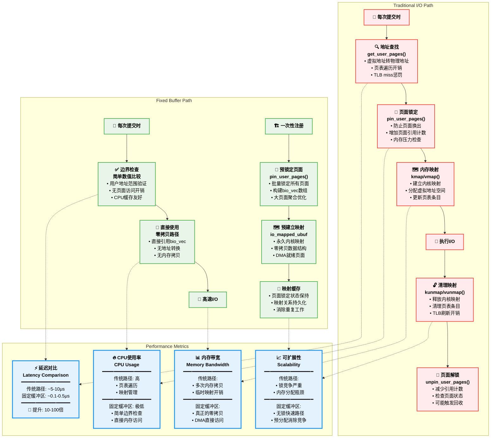

#### 固定资源的内存管理策略

```c
// 智能的内存账务管理
static int io_buffer_account_pin(struct io_ring_ctx *ctx, struct page **pages,
                                int nr_pages, struct io_mapped_ubuf *imu,
                                struct page **last_hpage)
{
    int i, ret;
    
    imu->acct_pages = 0;
    for (i = 0; i < nr_pages; i++) {
        if (!PageCompound(pages[i])) {
            imu->acct_pages++;
        } else {
            struct page *hpage;
            
            hpage = compound_head(pages[i]);
            if (hpage == *last_hpage)
                continue;
            *last_hpage = hpage;
            imu->acct_pages += page_size(hpage) >> PAGE_SHIFT;
        }
    }
    
    if (!imu->acct_pages)
        return 0;
    
    // RLIMIT_MEMLOCK检查和账务
    ret = io_account_mem(ctx, imu->acct_pages);
    if (ret)
        return ret;
    
    return 0;
}

// 资源生命周期管理
void io_rsrc_node_ref_zero(struct io_rsrc_node *node)
{
    struct io_ring_ctx *ctx = node->ctx;
    
    while (!list_empty(&ctx->rsrc_ref_list)) {
        node = list_first_entry(&ctx->rsrc_ref_list,
                              struct io_rsrc_node, node);
        list_del(&node->node);
        
        switch (node->type) {
        case IORING_RSRC_FILE:
            io_rsrc_file_put(ctx, node);
            break;
        case IORING_RSRC_BUFFER:
            io_rsrc_buf_put(ctx, &node->item);
            break;
        default:
            WARN_ON_ONCE(1);
            break;
        }
        
        io_rsrc_node_destroy(ctx, node);
    }
}
```

#### 使用建议和最佳实践

```c
// 高性能应用的资源注册模式
void setup_high_performance_io_uring(void)
{
    struct io_uring ring;
    struct io_uring_params params = {};
    
    // 1. 使用大的队列深度
    params.sq_entries = 1024;
    params.cq_entries = 2048;
    params.flags = IORING_SETUP_SQPOLL | IORING_SETUP_IOPOLL;
    
    io_uring_queue_init_params(params.sq_entries, &ring, &params);
    
    // 2. 注册固定缓冲区
    struct iovec buffers[64];
    for (int i = 0; i < 64; i++) {
        buffers[i].iov_base = aligned_alloc(4096, 64 * 1024);  // 64KB aligned
        buffers[i].iov_len = 64 * 1024;
    }
    io_uring_register_buffers(&ring, buffers, 64);
    
    // 3. 注册固定文件
    int fds[16];
    for (int i = 0; i < 16; i++) {
        fds[i] = open("datafile", O_RDWR | O_DIRECT);
    }
    io_uring_register_files(&ring, fds, 16);
    
    // 4. 使用固定资源进行I/O
    struct io_uring_sqe *sqe = io_uring_get_sqe(&ring);
    io_uring_prep_read_fixed(sqe, 
                            0,        // 固定文件索引
                            NULL,     // 固定缓冲区（通过索引）
                            64*1024,  // 长度
                            0,        // 文件偏移
                            0);       // 固定缓冲区索引
    sqe->flags |= IOSQE_FIXED_FILE;
    
    io_uring_submit(&ring);
}

// 性能优化提示：
// 1. 缓冲区对齐：使用页面对齐的缓冲区减少分片
// 2. 大页面支持：在支持的系统上使用hugepages
// 3. NUMA感知：在多NUMA系统上注意内存局部性
// 4. 批量注册：一次性注册所有需要的资源
// 5. 生命周期管理：确保在程序退出时正确注销资源
```

通过固定资源注册机制，io_uring实现了：

1. **真正的零拷贝I/O**：消除用户态和内核态之间的数据拷贝
2. **极低的路径延迟**：避免重复的地址转换和映射开销
3. **高效的内存使用**：预锁定页面避免换页，提高内存访问性能
4. **可预测的性能**：消除动态内存分配和映射的不确定性
5. **更好的可扩展性**：减少锁竞争和资源争用

这些优化机制使得io_uring在高性能计算、数据库、存储系统等对I/O性能要求极高的场景中表现卓越。

### 异步错误处理和资源清理机制

io_uring的异步特性使得错误处理变得复杂，需要在多个执行阶段和不同线程上下文中正确处理各种错误情况，同时确保资源的正确释放和系统状态的一致性。

#### 多层次的错误处理架构

```c
// 源码：io_uring/io_uring.c
// 错误处理的核心数据结构
struct io_kiocb {
    struct io_cqe       cqe;            // 完成队列事件
    io_req_flags_t      flags;          // 请求标志
    atomic_t            refs;           // 引用计数
    struct io_ring_ctx  *ctx;           // 上下文
    
    // 错误处理相关字段
    struct io_rsrc_node *rsrc_node;     // 资源节点
    struct io_task_work io_task_work;   // 任务工作队列
    void                *async_data;    // 异步数据
    
    // 链式请求和错误传播
    struct io_kiocb     *link;          // 下一个链接请求
    const struct cred   *creds;         // 凭据信息
    struct io_wq_work   work;           // 工作队列项
};

// 错误设置宏 - 标记请求失败
static inline void req_set_fail(struct io_kiocb *req)
{
    req->flags |= REQ_F_FAIL;
}

// 多阶段错误处理的统一接口
void io_req_defer_failed(struct io_kiocb *req, s32 res)
    __must_hold(&ctx->uring_lock)
{
    const struct io_cold_def *def = &io_cold_defs[req->opcode];
    
    lockdep_assert_held(&req->ctx->uring_lock);
    
    // 1. 标记请求失败
    req_set_fail(req);
    
    // 2. 设置错误结果和清理缓冲区
    io_req_set_res(req, res, io_put_kbuf(req, res, IO_URING_F_UNLOCKED));
    
    // 3. 调用操作特定的失败处理
    if (def->fail)
        def->fail(req);
    
    // 4. 延迟完成处理
    io_req_complete_defer(req);
}

// 请求失败的完成处理
static void io_req_complete_failed(struct io_kiocb *req, long res)
{
    const struct io_cold_def *def = &io_cold_defs[req->opcode];
    
    req_set_fail(req);
    io_req_set_res(req, res, io_put_kbuf(req, res, 0));
    
    // 操作特定的错误清理
    if (def->fail)
        def->fail(req);
        
    io_req_complete_post(req, 0);
}

// 异步操作中的错误传播机制
static void io_req_task_queue_fail(struct io_kiocb *req, int ret)
{
    req->io_task_work.func = io_req_task_complete;
    io_req_set_res(req, ret, 0);
    req_set_fail(req);
    io_req_task_work_add(req);
}
```

#### 错误分类和处理策略

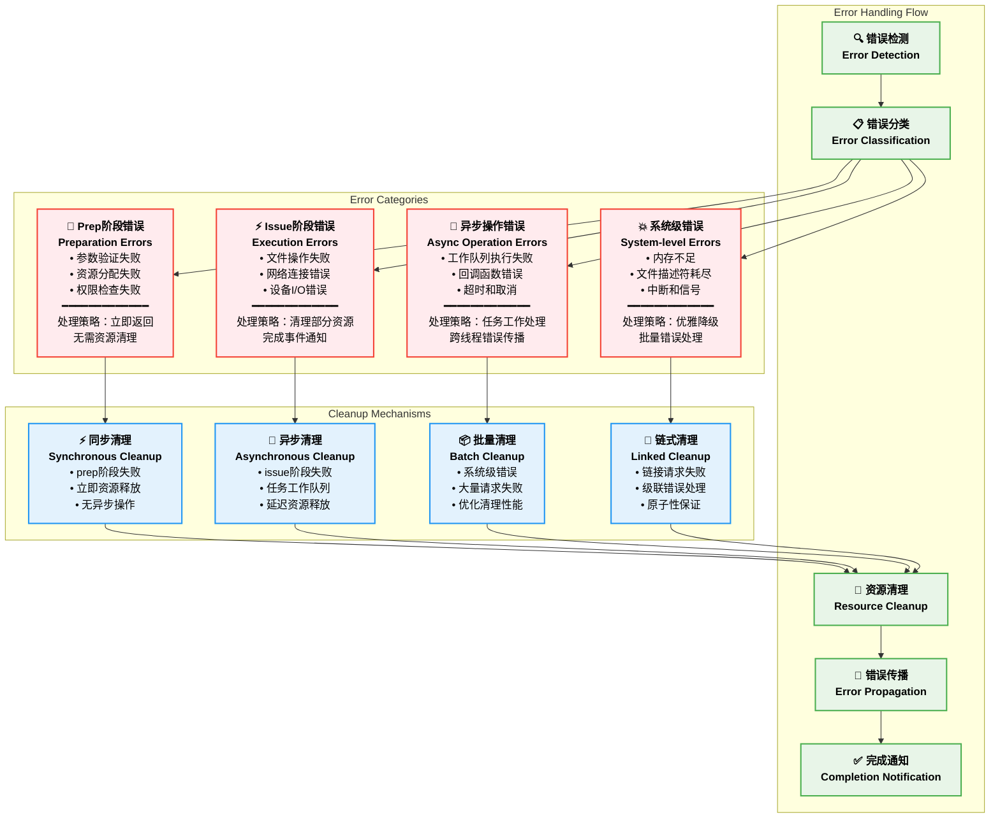

#### 资源清理的分层机制

```c
// 资源清理的操作定义
struct io_cold_def {
    const char      *name;
    void (*cleanup)(struct io_kiocb *);  // 正常清理函数
    void (*fail)(struct io_kiocb *);     // 失败清理函数
};

// 网络操作的错误处理示例
static void io_sendrecv_fail(struct io_kiocb *req)
{
    struct io_sr_msg *sr = io_kiocb_to_cmd(req, struct io_sr_msg);
    
    // 清理网络消息相关资源
    if (sr->msg_flags & MSG_WAITALL)
        req->flags |= REQ_F_PARTIAL_IO;
        
    // 如果是多shot操作，需要特殊处理
    if (req->flags & REQ_F_APOLL_MULTISHOT) {
        io_kbuf_recycle(req, 0);
        return;
    }
}

// 读写操作的清理函数
static void io_readv_writev_cleanup(struct io_kiocb *req)
{
    struct io_async_rw *rw = req->async_data;
    
    // 清理异步读写数据
    if (rw && rw->free_iovec) {
        kfree(rw->free_iovec);
        rw->free_iovec = NULL;
    }
}

// 通用的请求清理流程
static void io_dismantle_req(struct io_kiocb *req)
{
    unsigned int flags = req->flags;
    
    // 1. 清理固定文件引用
    if (unlikely(flags & REQ_F_FIXED_FILE))
        io_req_put_rsrc(req);
    
    // 2. 清理凭据信息
    if (req->flags & REQ_F_CREDS)
        put_cred(req->creds);
    
    // 3. 清理异步数据
    if (req->async_data) {
        kfree(req->async_data);
        req->async_data = NULL;
    }
    
    // 4. 操作特定清理
    const struct io_cold_def *def = &io_cold_defs[req->opcode];
    if (def->cleanup)
        def->cleanup(req);
}

// 引用计数管理和生命周期控制
static bool req_ref_put_and_test(struct io_kiocb *req)
{
    if (likely(!atomic_dec_and_test(&req->refs)))
        return false;
    
    io_req_put_rsrc(req);
    return true;
}

// 最终的请求释放
void io_free_req(struct io_kiocb *req)
{
    struct io_ring_ctx *ctx = req->ctx;
    
    io_dismantle_req(req);
    io_put_task(req->task, 1);
    
    spin_lock(&ctx->completion_lock);
    wq_list_add_head(&req->comp_list, &ctx->locked_free_list);
    ctx->locked_free_nr++;
    spin_unlock(&ctx->completion_lock);
    
    percpu_ref_put(&ctx->refs);
}
```

#### 链式请求的错误处理

```c
// 链式请求的错误传播机制
static struct io_kiocb *io_req_find_next(struct io_kiocb *req)
{
    struct io_kiocb *nxt;
    
    /*
     * 如果当前请求失败，需要决定是否继续执行链中的下一个请求
     * 或者将错误传播给整个链
     */
    if (req->flags & REQ_F_FAIL) {
        if (req->flags & IO_REQ_LINK_FLAGS) {
            nxt = req->link;
            req->link = NULL;
            
            // 传播失败状态到链中的所有请求
            while (nxt) {
                struct io_kiocb *next = nxt->link;
                
                nxt->flags |= REQ_F_FAIL;
                io_req_complete_failed(nxt, -ECANCELED);
                nxt = next;
            }
        }
        return NULL;
    }
    
    nxt = req->link;
    req->link = NULL;
    return nxt;
}

// 链式请求的批量错误处理
static void io_fail_links(struct io_kiocb *req)
    __must_hold(&req->ctx->completion_lock)
{
    struct io_kiocb *nxt, *link = req->link;
    bool ignore_cqes = req->flags & REQ_F_SKIP_LINK_CQES;
    
    req->link = NULL;
    while (link) {
        nxt = link->link;
        link->link = NULL;
        
        trace_io_uring_fail_link(req->ctx, req, req->cqe.user_data,
                               req->opcode, link);
        
        if (ignore_cqes)
            link->flags |= REQ_F_CQE_SKIP;
        else
            link->flags &= ~REQ_F_CQE_SKIP;
        
        io_req_complete_failed(link, -ECANCELED);
        link = nxt;
    }
}
```

#### 工作队列中的错误处理

```c
// io-wq工作队列的错误处理
void io_wq_submit_work(struct io_wq_work *work)
{
    struct io_kiocb *req = container_of(work, struct io_kiocb, work);
    const struct io_issue_def *def = &io_issue_defs[req->opcode];
    unsigned int issue_flags = IO_URING_F_UNLOCKED | IO_URING_F_IOWQ;
    bool needs_poll = false;
    int ret = 0, err = -ECANCELED;
    
    /* 检查请求是否已被取消 */
    if (test_bit(IO_WQ_BIT_CANCEL, &work->flags)) {
        err = -ECANCELED;
        goto cancel;
    }
    
    /* 文件引用获取失败 */
    if (!io_assign_file(req, def, issue_flags)) {
        err = -EBADF;
        goto cancel;
    }
    
    /* 权限切换失败处理 */
    if (req->flags & REQ_F_FORCE_ASYNC) {
        bool opcode_poll = def->pollin || def->pollout;
        
        if (opcode_poll && file_can_poll(req->file)) {
            needs_poll = true;
            issue_flags |= IO_URING_F_NONBLOCK;
        }
    }
    
    do {
        ret = io_issue_sqe(req, issue_flags);
        if (ret != -EAGAIN)
            break;
        
        /*
         * 如果操作返回-EAGAIN，我们需要轮询或重试
         * 在工作队列上下文中，我们可以阻塞等待
         */
        if (io_arm_poll_handler(req, issue_flags) != IO_APOLL_OK)
            goto cancel;
        
        return;
    } while (1);
    
    /* 操作完成或出错 */
    if (ret != IOU_ISSUE_SKIP_COMPLETE)
        io_req_complete_post(req, issue_flags);
    return;
    
cancel:
    req_set_fail(req);
    io_req_set_res(req, err, 0);
    io_req_complete_post(req, issue_flags);
}

// 工作队列取消操作
static enum io_wq_cancel io_wq_cancel_cb(struct io_wq_work *work, void *data)
{
    struct io_kiocb *req = container_of(work, struct io_kiocb, work);
    struct io_cancel_data *cd = data;
    
    if (req->ctx != cd->ctx)
        return IO_WQ_CANCEL_SKIP;
    
    if (cd->flags & IORING_ASYNC_CANCEL_ANY) {
        ;
    } else if (cd->flags & IORING_ASYNC_CANCEL_ALL) {
        ;
    } else if (req->cqe.user_data != cd->data) {
        return IO_WQ_CANCEL_SKIP;
    }
    
    return IO_WQ_CANCEL_OK;
}
```

#### 内存溢出和资源耗尽处理

```c
// CQ溢出处理 - 当完成队列满时的错误处理
static void io_req_cqe_overflow(struct io_kiocb *req)
{
    struct io_ring_ctx *ctx = req->ctx;
    struct io_overflow_cqe *ocqe;
    size_t cqe_size = sizeof(struct io_uring_cqe);
    
    /* 扩展CQE支持 */
    if (ctx->flags & IORING_SETUP_CQE32)
        cqe_size += sizeof(struct io_uring_cqe);
    
    ocqe = kmalloc(sizeof(*ocqe) + cqe_size, GFP_ATOMIC);
    if (ocqe) {
        /* 成功分配溢出条目 */
        list_add_tail(&ocqe->list, &ctx->cq_overflow_list);
        memcpy(&ocqe->cqe, &req->cqe, cqe_size);
    } else {
        /* 内存分配失败，设置溢出标志 */
        set_bit(IO_CHECK_CQ_OVERFLOW_BIT, &ctx->check_cq);
    }
    
    ctx->cached_cq_overflow++;
    WRITE_ONCE(ctx->rings->cq_overflow, ctx->cached_cq_overflow);
}

// 溢出队列的刷新处理
bool __io_cqring_overflow_flush(struct io_ring_ctx *ctx, bool force)
{
    bool all_flushed, posted;
    size_t cqe_size = sizeof(struct io_uring_cqe);
    
    if (ctx->flags & IORING_SETUP_CQE32)
        cqe_size <<= 1;
    
    if (!force && __io_cqring_events(ctx) == ctx->cq_entries)
        return false;
    
    if (ctx->flags & IORING_SETUP_DEFER_TASKRUN)
        lockdep_assert_held(&ctx->uring_lock);
    else
        lockdep_assert_held(&ctx->completion_lock);
    
    posted = false;
    spin_lock(&ctx->completion_lock);
    while (!list_empty(&ctx->cq_overflow_list)) {
        struct io_overflow_cqe *ocqe = list_first_entry(&ctx->cq_overflow_list,
                                                      struct io_overflow_cqe,
                                                      list);
        if (!io_get_cqe_overflow(ctx, &cqe, true))
            break;
            
        memcpy(cqe, &ocqe->cqe, cqe_size);
        list_del(&ocqe->list);
        kfree(ocqe);
        posted = true;
    }
    
    all_flushed = list_empty(&ctx->cq_overflow_list);
    if (all_flushed) {
        clear_bit(IO_CHECK_CQ_OVERFLOW_BIT, &ctx->check_cq);
        atomic_andnot(IORING_SQ_CQ_OVERFLOW, &ctx->rings->sq_flags);
    }
    spin_unlock(&ctx->completion_lock);
    
    if (posted)
        io_commit_cqring(ctx);
        
    return all_flushed;
}
```

#### 优雅关闭和清理

```c
// io_uring实例的优雅关闭
static __cold void io_ring_ctx_wait_and_kill(struct io_ring_ctx *ctx)
{
    unsigned long index;
    struct creds *creds;
    
    mutex_lock(&ctx->uring_lock);
    percpu_ref_kill(&ctx->refs);
    
    if (ctx->flags & IORING_SETUP_DEFER_TASKRUN)
        io_move_task_work_from_local(ctx);
    
    /* 确保所有工作都已完成 */
    while (io_uring_try_cancel_requests(ctx, NULL, true))
        cond_resched();
    
    io_kill_timeouts(ctx, NULL, true);
    io_poll_remove_all(ctx, NULL, true);
    
    /* 等待所有引用释放 */
    wait_for_completion(&ctx->ref_comp);
    
    mutex_unlock(&ctx->uring_lock);
    
    /* 
     * 此时所有用户引用都已释放，可以安全清理
     */
    io_req_caches_free(ctx);
    if (ctx->sq_creds)
        put_cred(ctx->sq_creds);
    if (ctx->submitter_task)
        put_task_struct(ctx->submitter_task);
        
    /* 最终释放上下文 */
    kfree(ctx);
}

// 错误恢复的最佳实践建议
/*
 * io_uring异步错误处理最佳实践：
 * 
 * 1. 错误检测要及时且全面
 *    - prep阶段进行参数验证
 *    - issue阶段处理执行错误
 *    - 完成阶段处理异步错误
 * 
 * 2. 资源清理要确保无泄漏
 *    - 使用引用计数跟踪资源生命周期
 *    - 实现cleanup和fail回调函数
 *    - 处理链式请求的级联错误
 * 
 * 3. 错误传播要保证一致性
 *    - 使用CQE传递错误状态给用户
 *    - 在工作队列中正确处理取消
 *    - 实现溢出处理避免丢失错误
 * 
 * 4. 系统级错误要优雅降级
 *    - 内存不足时使用备用策略
 *    - 文件描述符耗尽时限制新请求
 *    - 实现优雅关闭避免数据丢失
 */
```

通过完善的异步错误处理和资源清理机制，io_uring保证了：

1. **错误不丢失**：所有错误都能正确传播给用户空间
2. **资源不泄漏**：即使在错误情况下也能正确释放所有资源
3. **状态一致性**：系统在任何错误情况下都保持一致状态
4. **优雅降级**：在资源耗尽时能够优雅地限制服务而不是崩溃
5. **可恢复性**：错误发生后系统可以继续正常工作

这套机制是io_uring能够在生产环境中可靠运行的重要保障。

### 常见操作类型功能图解

io_uring支持60+种操作类型，涵盖了系统编程的各个方面。以下是主要操作类型的功能分类和特点：

#### 核心操作类型矩阵

| **类别** | **操作类型** | **主要特性** | **适用场景** |
|----------|-------------|-------------|-------------|
| **文件I/O** | `IORING_OP_READ/WRITE`<br/>`IORING_OP_READV/WRITEV`<br/>`IORING_OP_READ_FIXED` | • 支持IOPOLL<br/>• 零拷贝优化<br/>• 向量化操作 | 高性能文件访问<br/>数据库存储引擎 |
| **网络I/O** | `IORING_OP_ACCEPT`<br/>`IORING_OP_SEND/RECV`<br/>`IORING_OP_SENDMSG/RECVMSG` | • 多shot模式<br/>• 零拷贝网络<br/>• 批量处理 | 网络服务器<br/>实时通信系统 |
| **文件系统** | `IORING_OP_OPENAT`<br/>`IORING_OP_STATX`<br/>`IORING_OP_RENAMEAT` | • 异步元数据操作<br/>• 批量文件管理<br/>• 路径解析优化 | 文件管理器<br/>备份系统 |
| **同步操作** | `IORING_OP_FSYNC`<br/>`IORING_OP_SYNC_FILE_RANGE`<br/>`IORING_OP_FADVISE` | • 数据完整性保证<br/>• 性能调优<br/>• 缓存控制 | 数据库系统<br/>关键数据存储 |
| **自定义** | `IORING_OP_URING_CMD`<br/>`IORING_OP_MSG_RING` | • 驱动程序扩展<br/>• 硬件加速<br/>• 环间通信 | 专用硬件加速<br/>分布式系统 |

---

## 结语

Linux io_uring作为新一代异步I/O接口的深度技术分析到此完成。通过本文的详细剖析，我们可以看到io_uring不仅在技术架构上实现了重大创新，更在性能优化方面达到了前所未有的高度。

### 技术创新总结

- **革命性的双环形缓冲区设计**：实现了用户态和内核态的高效通信
- **零拷贝和固定资源机制**：消除了传统I/O的性能瓶颈  
- **SQPOLL/IOPOLL轮询技术**：达到微秒级的超低延迟
- **统一的异步操作框架**：支持所有类型的系统调用异步化
- **完善的错误处理机制**：保证了生产环境的可靠性

### 核心优势总结

通过图表和数据分析，我们看到io_uring在各项性能指标上都有显著提升：

- **吞吐量提升**：2-4倍于传统AIO
- **延迟降低**：从毫秒级降至微秒级  
- **CPU效率**：显著减少系统调用开销
- **内存效率**：真正的零拷贝实现

### 未来展望

io_uring代表了Linux I/O子系统发展的重要方向，为构建下一代高性能应用提供了强大的技术基础。随着硬件技术的不断发展和应用需求的日益复杂，io_uring必将在更多领域发挥重要作用。

对于系统开发者而言，深入理解io_uring的设计理念和实现细节，不仅有助于优化现有应用的性能，更能为未来系统架构的设计提供宝贵的思路和经验。
