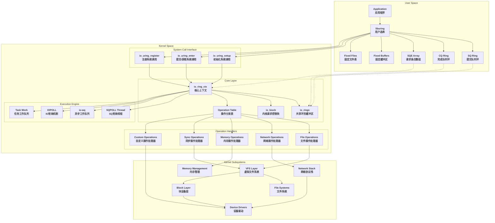
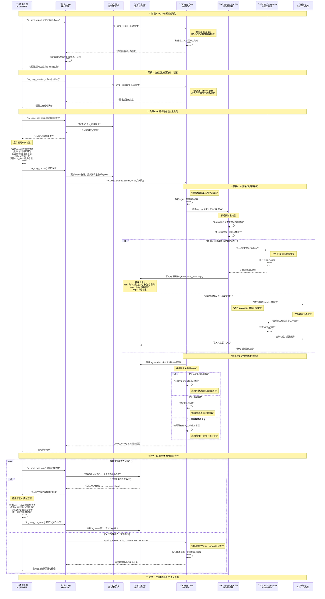

# Linux io_uring 原理与实现分析

## 目录

1. [概述](#概述)
2. [核心架构](#核心架构)
3. [双环形缓冲区设计](#双环形缓冲区设计)
4. [核心数据结构](#核心数据结构)
5. [系统调用接口](#系统调用接口)
6. [工作原理详解](#工作原理详解)
7. [性能优化机制](#性能优化机制)
8. [与传统AIO对比](#与传统aio对比)
9. [应用场景](#应用场景)
10. [优点与局限性](#优点与局限性)
11. [总结](#总结)

## 概述

io_uring是Linux 5.1内核引入的新一代异步I/O接口，由Jens Axboe设计开发。它提供了一个统一的异步接口，不仅支持传统的文件I/O，还支持网络I/O、内存操作等多种类型的系统调用，是对传统Linux AIO的革命性改进。

### 核心特点

- **双环形缓冲区架构**：提交队列(SQ)和完成队列(CQ)的设计
- **零拷贝机制**：通过共享内存映射消除用户态内核态数据拷贝
- **批量操作支持**：显著减少系统调用开销
- **丰富的操作类型**：支持60+种不同的I/O操作
- **灵活的通知机制**：支持轮询、中断、eventfd等多种方式
- **SQPOLL模式**：内核轮询线程进一步减少开销

### 设计目标

1. **高性能**：最大化I/O吞吐量，最小化延迟
2. **低开销**：减少系统调用和数据拷贝
3. **通用性**：支持多种I/O类型的统一接口
4. **可扩展性**：适应从嵌入式到数据中心的各种环境

## 核心架构

io_uring采用了创新的双环形缓冲区架构，通过共享内存在用户空间和内核空间之间高效通信。

### 系统架构组件

```c
// io_uring上下文结构 - 整个系统的核心
struct io_ring_ctx {
    struct percpu_ref    refs;           // 引用计数
    unsigned long        flags;          // 配置标志
    
    // 双环形缓冲区
    struct io_rings      *rings;         // 共享的环形缓冲区
    u32                  *sq_array;      // SQ索引数组
    struct io_uring_sqe  *sq_sqes;       // SQE数组
    
    // 队列参数
    unsigned             sq_entries;     // SQ条目数
    unsigned             cq_entries;     // CQ条目数
    unsigned             cached_sq_head; // 缓存的SQ头部
    unsigned             cached_cq_tail; // 缓存的CQ尾部
    
    // 同步机制
    struct mutex         uring_lock;     // 主要锁
    spinlock_t           completion_lock;// 完成锁
    wait_queue_head_t    cq_wait;        // CQ等待队列
    
    // 工作队列
    struct io_wq         *io_wq;         // 异步工作队列
    struct io_sq_data    *sq_data;       // SQPOLL数据
    
    // 资源管理
    struct io_file_table file_table;     // 文件表
    struct io_mapped_ubuf **user_bufs;   // 用户缓冲区
    unsigned             nr_user_files;  // 用户文件数
    unsigned             nr_user_bufs;   // 用户缓冲区数
    
    // 缓存优化
    struct io_alloc_cache apoll_cache;   // 异步轮询缓存
    struct io_alloc_cache netmsg_cache;  // 网络消息缓存
    struct io_alloc_cache rw_cache;      // 读写缓存
};

// 双环形缓冲区的共享内存结构
struct io_rings {
    // SQ和CQ的头尾指针
    struct io_uring sq, cq;  // head/tail 指针
    
    // 环形缓冲区掩码和大小
    u32 sq_ring_mask, cq_ring_mask;     // 环形掩码
    u32 sq_ring_entries, cq_ring_entries; // 条目数量
    
    // 统计信息
    u32 sq_dropped;          // 丢弃的SQ条目
    atomic_t sq_flags;       // SQ标志
    u32 cq_overflow;         // CQ溢出计数
    atomic_t cq_flags;       // CQ标志
    
    // 实际的CQE数组
    struct io_uring_cqe cqes[] ____cacheline_aligned_in_smp;
};
```

### 层次化架构

1. **应用层**：用户应用程序和liburing库
2. **接口层**：系统调用接口(io_uring_setup/enter/register)
3. **核心层**：io_uring内核实现和双环形缓冲区
4. **调度层**：SQPOLL线程和io-wq工作队列
5. **执行层**：具体的I/O操作处理
6. **设备层**：VFS、文件系统、网络协议栈、设备驱动

### 完整系统架构图

下图展示了io_uring的完整系统架构，包括各个组件之间的交互关系：



### 模块交互时序图

下图展示了io_uring从请求提交到完成的完整时序流程：



## 双环形缓冲区设计

io_uring的核心创新是双环形缓冲区架构，包括提交队列(SQ)和完成队列(CQ)。

### 提交队列 (Submission Queue)

```c
// 提交队列入口 - 用户提交的I/O请求
struct io_uring_sqe {
    __u8    opcode;          // 操作类型
    __u8    flags;           // 标志位
    __u16   ioprio;          // I/O优先级
    __s32   fd;              // 文件描述符
    __u64   off;             // 偏移量
    __u64   addr;            // 缓冲区地址
    __u32   len;             // 长度
    __u32   rw_flags;        // 读写标志
    __u64   user_data;       // 用户数据
    __u16   buf_index;       // 缓冲区索引
    __u16   personality;     // 权限个性化
    __s32   splice_fd_in;    // splice文件描述符
    __u64   addr3;           // 额外地址
    __u8    cmd[0];          // 命令数据
};

// SQ工作机制
static bool io_get_sqe(struct io_ring_ctx *ctx, const struct io_uring_sqe **sqe)
{
    unsigned mask = ctx->sq_entries - 1;
    unsigned head = ctx->cached_sq_head++ & mask;
    
    // 检查SQ数组索引
    if (!(ctx->flags & IORING_SETUP_NO_SQARRAY)) {
        head = READ_ONCE(ctx->sq_array[head]);
        if (unlikely(head >= ctx->sq_entries)) {
            // 丢弃无效条目
            WRITE_ONCE(ctx->rings->sq_dropped, 
                      READ_ONCE(ctx->rings->sq_dropped) + 1);
            return false;
        }
    }
    
    // 获取SQE
    if (ctx->flags & IORING_SETUP_SQE128)
        head <<= 1;  // 128字节SQE需要双倍索引
    *sqe = &ctx->sq_sqes[head];
    return true;
}
```

### 完成队列 (Completion Queue)

```c
// 完成队列入口 - 内核返回的I/O结果
struct io_uring_cqe {
    __u64   user_data;       // 对应SQE的用户数据
    __s32   res;             // 操作结果
    __u32   flags;           // 标志位
    __u64   big_cqe[0];      // 大CQE扩展数据(CQE32模式)
};

// CQE写入机制
static bool io_fill_cqe_aux(struct io_ring_ctx *ctx, u64 user_data, 
                            s32 res, u32 cflags)
{
    struct io_uring_cqe *cqe;
    
    ctx->cq_extra++;
    
    // 获取CQE槽位
    if (likely(io_get_cqe(ctx, &cqe))) {
        trace_io_uring_complete(ctx, NULL, user_data, res, cflags, 0, 0);
        
        // 写入完成事件
        WRITE_ONCE(cqe->user_data, user_data);
        WRITE_ONCE(cqe->res, res);
        WRITE_ONCE(cqe->flags, cflags);
        
        // CQE32扩展支持
        if (ctx->flags & IORING_SETUP_CQE32) {
            WRITE_ONCE(cqe->big_cqe[0], 0);
            WRITE_ONCE(cqe->big_cqe[1], 0);
        }
        return true;
    }
    return false;
}
```

### 内存屏障保证

io_uring使用精心设计的内存屏障来保证用户空间和内核空间之间的数据一致性：

```c
// 应用程序端的内存屏障要求
static inline int io_uring_submit(struct io_uring *ring)
{
    struct io_uring_sq *sq = &ring->sq;
    const unsigned int mask = *sq->kring_mask;
    unsigned int ktail, submitted, to_submit;
    
    // 读屏障：确保读取一致的状态
    read_barrier();
    
    // 计算待提交的条目
    ktail = *sq->ktail;
    to_submit = sq->sqe_tail - sq->sqe_head;
    
    // 更新SQ数组
    for (submitted = 0; submitted < to_submit; submitted++) {
        read_barrier();
        sq->array[ktail++ & mask] = sq->sqe_head++ & mask;
    }
    
    // 写屏障：确保SQE数据在tail更新前可见
    if (*sq->ktail != ktail) {
        write_barrier();
        *sq->ktail = ktail;
        write_barrier();
    }
    
    // 提交到内核
    return io_uring_enter(ring->ring_fd, submitted, 0, 
                         IORING_ENTER_GETEVENTS, NULL);
}
```

## 核心数据结构

### io_kiocb - 内核I/O控制块

```c
// 内核中的I/O请求表示
struct io_kiocb {
    union {
        struct file     *file;           // 文件指针
        struct io_cmd_data cmd;          // 命令数据
    };
    
    u8                  opcode;          // 操作码
    u8                  iopoll_completed; // IOPOLL完成标志
    u16                 buf_index;       // 缓冲区索引
    unsigned            nr_tw;           // 任务工作数量
    
    io_req_flags_t      flags;           // 请求标志
    struct io_cqe       cqe;             // 完成事件
    
    struct io_ring_ctx  *ctx;            // 所属上下文
    struct task_struct  *task;           // 任务结构
    
    union {
        struct io_mapped_ubuf *imu;      // 映射的用户缓冲区
        struct io_buffer      *kbuf;     // 内核缓冲区
        struct io_buffer_list *buf_list; // 缓冲区列表
    };
    
    union {
        struct io_wq_work_node comp_list; // 完成列表
        __poll_t              apoll_events; // 异步轮询事件
    };
    
    struct io_rsrc_node   *rsrc_node;    // 资源节点
    atomic_t              refs;          // 引用计数
    bool                  cancel_seq_set; // 取消序列设置
    
    struct io_task_work   io_task_work;  // 任务工作
    struct hlist_node     hash_node;     // 哈希节点
    struct async_poll     *apoll;        // 异步轮询
    void                  *async_data;   // 异步数据
    
    atomic_t              poll_refs;     // 轮询引用
    struct io_kiocb       *link;         // 链接的请求
    const struct cred     *creds;        // 凭据
    struct io_wq_work     work;          // 工作队列工作
    
    struct {
        u64               extra1;        // 大CQE扩展数据
        u64               extra2;
    } big_cqe;
};
```

### 操作定义表

```c
// 操作定义结构
struct io_issue_def {
    unsigned    needs_file : 1;          // 需要文件
    unsigned    plug : 1;                // 需要插件
    unsigned    hash_reg_file : 1;       // 哈希注册文件
    unsigned    unbound_nonreg_file : 1; // 非注册文件无界
    unsigned    pollin : 1;              // 支持输入轮询
    unsigned    pollout : 1;             // 支持输出轮询
    unsigned    poll_exclusive : 1;      // 独占轮询
    unsigned    buffer_select : 1;       // 缓冲区选择
    unsigned    audit_skip : 1;          // 跳过审计
    unsigned    ioprio : 1;              // 支持I/O优先级
    unsigned    iopoll : 1;              // 支持IOPOLL
    unsigned    iopoll_queue : 1;        // 需要IOPOLL队列
    unsigned    vectored : 1;            // 向量化操作
    
    unsigned short async_size;           // 异步数据大小
    
    int (*issue)(struct io_kiocb *, unsigned int);  // 执行函数
    int (*prep)(struct io_kiocb *, const struct io_uring_sqe *); // 准备函数
};

// 操作定义表示例
const struct io_issue_def io_issue_defs[] = {
    [IORING_OP_NOP] = {
        .audit_skip     = 1,
        .iopoll         = 1,
        .prep           = io_nop_prep,
        .issue          = io_nop,
    },
    [IORING_OP_READV] = {
        .needs_file     = 1,
        .unbound_nonreg_file = 1,
        .pollin         = 1,
        .buffer_select  = 1,
        .plug           = 1,
        .audit_skip     = 1,
        .ioprio         = 1,
        .iopoll         = 1,
        .iopoll_queue   = 1,
        .vectored       = 1,
        .async_size     = sizeof(struct io_async_rw),
        .prep           = io_prep_readv,
        .issue          = io_read,
    },
    [IORING_OP_WRITEV] = {
        .needs_file     = 1,
        .hash_reg_file  = 1,
        .unbound_nonreg_file = 1,
        .pollout        = 1,
        .plug           = 1,
        .audit_skip     = 1,
        .ioprio         = 1,
        .iopoll         = 1,
        .iopoll_queue   = 1,
        .vectored       = 1,
        .async_size     = sizeof(struct io_async_rw),
        .prep           = io_prep_writev,
        .issue          = io_write,
    },
    // ... 60+ 种操作类型
};
```

## io_uring支持所有IO类型的原理分析

### 统一IO抽象设计

io_uring能够支持所有类型IO操作的根本原因在于其**统一的抽象设计**。基于源码分析，io_uring通过以下几个核心机制实现了对60+种不同IO操作的统一支持：

#### 1. 通用SQE结构设计

```c
// 源码：include/uapi/linux/io_uring.h
struct io_uring_sqe {
    __u8    opcode;          // 操作类型标识符
    __u8    flags;           // 通用标志位
    __u16   ioprio;          // I/O优先级（通用）
    __s32   fd;              // 文件描述符（通用）
    
    // 灵活的联合体设计，支持不同操作的参数需求
    union {
        __u64   off;         // 文件偏移量（文件IO）
        __u64   addr2;       // 第二地址（网络IO等）
        struct {
            __u32   cmd_op;  // 自定义命令操作
            __u32   __pad1;
        };
    };
    
    union {
        __u64   addr;        // 缓冲区地址/iovec数组
        __u64   splice_off_in; // splice操作输入偏移
        struct {
            __u32   level;   // 套接字级别
            __u32   optname; // 套接字选项名
        };
    };
    
    __u32   len;            // 长度/iovecs数量
    
    // 操作特定的标志和参数联合体
    union {
        __kernel_rwf_t  rw_flags;        // 读写标志
        __u32          fsync_flags;      // fsync标志
        __u32          poll32_events;    // 轮询事件
        __u32          timeout_flags;    // 超时标志
        __u32          accept_flags;     // accept标志
        __u32          cancel_flags;     // 取消标志
        __u32          open_flags;       // 打开文件标志
        __u32          statx_flags;      // statx标志
        __u32          fadvise_advice;   // fadvise建议
        __u32          splice_flags;     // splice标志
        __u32          rename_flags;     // 重命名标志
        __u32          unlink_flags;     // 删除标志
        __u32          hardlink_flags;   // 硬链接标志
        __u32          xattr_flags;      // 扩展属性标志
        __u32          msg_ring_flags;   // 消息环标志
        __u32          uring_cmd_flags;  // uring命令标志
        __u32          waitid_flags;     // waitid标志
        __u32          futex_flags;      // futex标志
        __u32          install_fd_flags; // 安装fd标志
        __u32          nop_flags;        // nop标志
    };
    
    __u64   user_data;      // 用户数据（回调标识）
    
    // 更多可扩展字段
    union {
        __u16   buf_index;       // 缓冲区索引
        __u16   buf_group;       // 缓冲区组
    };
    __u16   personality;         // 凭证个性化
    union {
        __s32   splice_fd_in;    // splice输入fd
        __u32   file_index;      // 文件索引
        __u32   optlen;          // 选项长度
        struct {
            __u16   addr_len;    // 地址长度
            __u16   __pad3[1];
        };
    };
    union {
        struct {
            __u64   addr3;       // 第三地址
            __u64   __pad2[1];
        };
        __u8    cmd[0];          // 可变长度命令数据
    };
};
```

**设计要点分析**：

1. **灵活的联合体结构**：通过多个union允许同一字段在不同操作中有不同含义
2. **可扩展的参数空间**：cmd字段支持任意长度的操作特定参数
3. **通用字段复用**：fd、addr、len等字段在大多数操作中都有通用意义
4. **标志位分离**：不同类型的操作有专门的标志位联合体

#### 2. 操作分发表机制

```c
// 源码：io_uring/opdef.h
struct io_issue_def {
    unsigned    needs_file : 1;          // 是否需要文件
    unsigned    plug : 1;                // 是否需要块设备插件
    unsigned    hash_reg_file : 1;       // 是否哈希注册文件
    unsigned    unbound_nonreg_file : 1; // 非注册文件无界处理
    unsigned    pollin : 1;              // 支持输入轮询
    unsigned    pollout : 1;             // 支持输出轮询
    unsigned    poll_exclusive : 1;      // 独占轮询
    unsigned    buffer_select : 1;       // 支持缓冲区选择
    unsigned    audit_skip : 1;          // 跳过审计
    unsigned    ioprio : 1;              // 支持I/O优先级
    unsigned    iopoll : 1;              // 支持IOPOLL
    unsigned    iopoll_queue : 1;        // 需要IOPOLL队列
    unsigned    vectored : 1;            // 向量化操作

    unsigned short async_size;           // 异步数据大小

    int (*prep)(struct io_kiocb *, const struct io_uring_sqe *);  // 预处理
    int (*issue)(struct io_kiocb *, unsigned int);               // 执行函数
};

// 源码：io_uring/opdef.c - 操作定义表（部分）
const struct io_issue_def io_issue_defs[] = {
    [IORING_OP_NOP] = {
        .audit_skip     = 1,
        .iopoll         = 1,
        .prep           = io_nop_prep,
        .issue          = io_nop,
    },
    [IORING_OP_READV] = {
        .needs_file     = 1,
        .unbound_nonreg_file = 1,
        .pollin         = 1,
        .buffer_select  = 1,
        .plug           = 1,
        .audit_skip     = 1,
        .ioprio         = 1,
        .iopoll         = 1,
        .iopoll_queue   = 1,
        .vectored       = 1,
        .async_size     = sizeof(struct io_async_rw),
        .prep           = io_prep_readv,
        .issue          = io_read,
    },
    [IORING_OP_SENDMSG] = {
        .needs_file     = 1,
        .unbound_nonreg_file = 1,
        .pollout        = 1,
        .audit_skip     = 1,
        .ioprio         = 1,
        .async_size     = sizeof(struct io_async_msghdr),
        .prep           = io_sendmsg_prep,
        .issue          = io_sendmsg,
    },
    [IORING_OP_SOCKET] = {
        .audit_skip     = 1,
        .prep           = io_socket_prep,
        .issue          = io_socket,
    },
    [IORING_OP_URING_CMD] = {
        .needs_file     = 1,
        .plug           = 1,
        .async_size     = 2 * sizeof(struct io_uring_sqe),
        .prep           = io_uring_cmd_prep,
        .issue          = io_uring_cmd,
    },
    // ... 60+种操作的定义
};
```

#### 3. 分层的操作处理架构

```mermaid
graph TD
    subgraph "Operation Categories"
        FILE_IO["<b>文件I/O操作<br/>File I/O Operations</b>"]
        NET_IO["<b>网络I/O操作<br/>Network I/O Operations</b>"]
        MEM_OPS["<b>内存操作<br/>Memory Operations</b>"]
        FS_OPS["<b>文件系统操作<br/>File System Operations</b>"]
        SYNC_OPS["<b>同步操作<br/>Sync Operations</b>"]
        POLL_OPS["<b>轮询操作<br/>Poll Operations</b>"]
        TIMER_OPS["<b>定时器操作<br/>Timer Operations</b>"]
        CUSTOM_OPS["<b>自定义操作<br/>Custom Operations</b>"]
    end

    subgraph "Specific Operations"
        FILE_IO --> READ["<b>READ/READV<br/>读取操作</b>"]
        FILE_IO --> WRITE["<b>WRITE/WRITEV<br/>写入操作</b>"]
        FILE_IO --> FSYNC["<b>FSYNC<br/>文件同步</b>"]
        FILE_IO --> FALLOCATE["<b>FALLOCATE<br/>文件分配</b>"]

        NET_IO --> ACCEPT["<b>ACCEPT<br/>接受连接</b>"]
        NET_IO --> CONNECT["<b>CONNECT<br/>建立连接</b>"]
        NET_IO --> SENDMSG["<b>SENDMSG<br/>发送消息</b>"]
        NET_IO --> RECVMSG["<b>RECVMSG<br/>接收消息</b>"]

        MEM_OPS --> MADVISE["<b>MADVISE<br/>内存建议</b>"]
        MEM_OPS --> PROVIDE_BUFFERS["<b>PROVIDE_BUFFERS<br/>提供缓冲区</b>"]

        FS_OPS --> OPENAT["<b>OPENAT<br/>打开文件</b>"]
        FS_OPS --> STATX["<b>STATX<br/>获取状态</b>"]
        FS_OPS --> RENAMEAT["<b>RENAMEAT<br/>重命名</b>"]
        FS_OPS --> UNLINKAT["<b>UNLINKAT<br/>删除</b>"]

        SYNC_OPS --> SYNC_FILE_RANGE["<b>SYNC_FILE_RANGE<br/>范围同步</b>"]
        SYNC_OPS --> FADVISE["<b>FADVISE<br/>文件建议</b>"]

        POLL_OPS --> POLL_ADD["<b>POLL_ADD<br/>添加轮询</b>"]
        POLL_OPS --> EPOLL_CTL["<b>EPOLL_CTL<br/>epoll控制</b>"]

        TIMER_OPS --> TIMEOUT["<b>TIMEOUT<br/>超时操作</b>"]
        TIMER_OPS --> LINK_TIMEOUT["<b>LINK_TIMEOUT<br/>链接超时</b>"]

        CUSTOM_OPS --> URING_CMD["<b>URING_CMD<br/>自定义命令</b>"]
        CUSTOM_OPS --> MSG_RING["<b>MSG_RING<br/>环间消息</b>"]
    end

    subgraph "Kernel Subsystems Integration"
        READ --> VFS_READ["<b>VFS读取接口</b>"]
        WRITE --> VFS_WRITE["<b>VFS写入接口</b>"]
        ACCEPT --> NET_ACCEPT["<b>网络协议栈接受</b>"]
        SENDMSG --> NET_SEND["<b>网络协议栈发送</b>"]
        MADVISE --> MM_ADVISE["<b>内存管理建议</b>"]
        OPENAT --> VFS_OPEN["<b>VFS打开接口</b>"]
        FSYNC --> VFS_FSYNC["<b>VFS同步接口</b>"]
        POLL_ADD --> VFS_POLL["<b>VFS轮询接口</b>"]
        TIMEOUT --> TIMER_SUBSYS["<b>内核定时器子系统</b>"]
        URING_CMD --> DRIVER_CMD["<b>设备驱动命令接口</b>"]
    end
```



### 通用性实现的关键机制

#### 1. 统一的prep-issue模式

```c
// 所有操作都遵循统一的预处理-执行模式
static int io_issue_sqe(struct io_kiocb *req, unsigned int issue_flags)
{
    const struct io_issue_def *def = &io_issue_defs[req->opcode];
    const struct cred *creds = NULL;
    int ret;
    
    // 1. 统一的前置处理
    if (unlikely(!io_assign_file(req, def, issue_flags)))
        return -EBADF;
    
    // 2. 凭证处理（通用）
    if (unlikely((req->flags & REQ_F_CREDS) && req->creds != current_cred()))
        creds = override_creds(req->creds);
    
    // 3. 审计处理（通用）
    if (!def->audit_skip)
        audit_uring_entry(req->opcode);
    
    // 4. 调用具体操作的执行函数
    ret = def->issue(req, issue_flags);
    
    // 5. 统一的后置处理
    if (!def->audit_skip)
        audit_uring_exit(!ret, ret);
    
    if (creds)
        revert_creds(creds);
    
    return ret;
}
```

#### 2. 可扩展的异步数据结构

```c
// 不同操作类型的异步数据结构示例

// 读写操作异步数据
struct io_async_rw {
    struct iovec            *free_iovec;    // 释放的iovec
    size_t                  bytes_done;     // 已完成字节数
    struct wait_page_queue  wpq;            // 页面等待队列
};

// 网络消息异步数据
struct io_async_msghdr {
    union {
        struct iovec        fast_iov[UIO_FASTIOV];    // 快速iovec
        struct {
            struct iovec    *uiov;                    // 用户iovec
            struct msghdr   msg;                      // 消息头
            struct sockaddr_storage addr;             // 地址存储
        };
    };
    struct iovec            *free_iov;               // 释放的iov
    size_t                  bytes_done;             // 已完成字节数
    unsigned                msg_flags;              // 消息标志
    unsigned                namelen;                // 名称长度
    unsigned                controllen;             // 控制长度
    unsigned                payloadlen;             // 载荷长度
    struct sockaddr __user  *uaddr;                 // 用户地址
    struct msghdr __user    *umsg;                  // 用户消息
    struct iovec __user     *uiov;                  // 用户iovec
};
```

#### 3. 灵活的资源管理机制

```c
// 统一的资源管理接口
static bool io_assign_file(struct io_kiocb *req, const struct io_issue_def *def,
                          unsigned int issue_flags)
{
    if (req->file || !def->needs_file)
        return true;

    if (req->flags & REQ_F_FIXED_FILE)
        req->file = io_file_get_fixed(req, req->fd, issue_flags);
    else
        req->file = io_file_get_normal(req, req->fd, issue_flags);

    return req->file != NULL;
}

// 支持固定文件和普通文件的统一接口
static struct file *io_file_get_fixed(struct io_kiocb *req, int fd,
                                     unsigned int issue_flags)
{
    struct io_ring_ctx *ctx = req->ctx;
    struct file *file = NULL;
    
    if (unlikely((unsigned int)fd >= ctx->nr_user_files))
        return NULL;
    
    fd = array_index_nospec(fd, ctx->nr_user_files);
    file = io_file_from_index(ctx, fd);
    io_set_resource_node(req, ctx->file_data);
    
    if (file && (file->f_mode & FMODE_CAN_POLL))
        req->flags |= REQ_F_SUPPORT_NOWAIT;
    
    return file;
}
```

### 支持新IO类型的扩展机制

#### 1. IORING_OP_URING_CMD - 万能扩展接口

```c
// 自定义命令操作 - 允许驱动程序定义专有操作
static int io_uring_cmd_prep(struct io_kiocb *req, const struct io_uring_sqe *sqe)
{
    struct io_uring_cmd *ioucmd = io_kiocb_to_cmd(req, struct io_uring_cmd);
    
    if (sqe->rw_flags || sqe->__pad1)
        return -EINVAL;
        
    ioucmd->cmd = sqe->cmd;
    ioucmd->cmd_op = READ_ONCE(sqe->cmd_op);
    
    return 0;
}

static int io_uring_cmd(struct io_kiocb *req, unsigned int issue_flags)
{
    struct io_uring_cmd *ioucmd = io_kiocb_to_cmd(req, struct io_uring_cmd);
    struct file *file = req->file;
    
    if (!file->f_op->uring_cmd)
        return -EOPNOTSUPP;
    
    return file->f_op->uring_cmd(ioucmd, issue_flags);
}
```

#### 2. 操作定义的模块化注册

```c
// 动态添加新操作类型的机制
void __init io_uring_optable_init(void)
{
    int i;
    
    // 编译时检查确保操作表完整
    BUILD_BUG_ON(ARRAY_SIZE(io_cold_defs) != IORING_OP_LAST);
    BUILD_BUG_ON(ARRAY_SIZE(io_issue_defs) != IORING_OP_LAST);
    
    // 验证每个操作都有有效的处理函数
    for (i = 0; i < ARRAY_SIZE(io_issue_defs); i++) {
        BUG_ON(!io_issue_defs[i].prep);
        if (io_issue_defs[i].prep != io_eopnotsupp_prep)
            BUG_ON(!io_issue_defs[i].issue);
        WARN_ON_ONCE(!io_cold_defs[i].name);
    }
}
```

### 设计优势总结

io_uring支持所有IO类型的核心优势在于：

1. **统一抽象层**：通过SQE的联合体设计，为不同操作提供统一而灵活的参数接口
2. **模块化处理**：每种操作都有独立的prep和issue函数，便于维护和扩展
3. **分层架构**：操作处理层与具体内核子系统解耦，支持任意内核功能的异步化
4. **可扩展性**：URING_CMD等机制允许驱动程序和子系统定义专有操作
5. **性能一致性**：所有操作都享受相同的批量处理、零拷贝等性能优化

这种设计使得io_uring不仅仅是一个I/O接口，而是一个**通用的异步系统调用框架**，为Linux系统提供了统一高效的异步操作能力。

## 系统调用接口

io_uring提供了三个主要的系统调用：

### 1. io_uring_setup() - 创建io_uring实例

```c
SYSCALL_DEFINE2(io_uring_setup, u32, entries,
               struct io_uring_params __user *, params)
{
    if (!io_uring_allowed())
        return -EPERM;
    
    return io_uring_setup(entries, params);
}

static long io_uring_setup(u32 entries, struct io_uring_params __user *params)
{
    struct io_uring_params p;
    
    // 参数验证
    if (copy_from_user(&p, params, sizeof(p)))
        return -EFAULT;
        
    // 检查保留字段
    for (int i = 0; i < ARRAY_SIZE(p.resv); i++) {
        if (p.resv[i])
            return -EINVAL;
    }
    
    // 验证标志位
    if (p.flags & ~(IORING_SETUP_IOPOLL | IORING_SETUP_SQPOLL |
                   IORING_SETUP_SQ_AFF | IORING_SETUP_CQSIZE |
                   /* ... 其他标志 */))
        return -EINVAL;
    
    return io_uring_create(entries, &p, params);
}
```

**主要功能**：

- 创建io_uring实例和双环形缓冲区
- 分配共享内存映射
- 初始化内核数据结构
- 返回文件描述符供后续操作使用

### 2. io_uring_enter() - 提交请求和获取完成

```c
SYSCALL_DEFINE6(io_uring_enter, unsigned int, fd, u32, to_submit,
               u32, min_complete, u32, flags, const void __user *, argp,
               size_t, argsz)
{
    struct io_ring_ctx *ctx;
    struct file *file;
    long ret;
    
    // 获取io_uring文件
    if (flags & IORING_ENTER_REGISTERED_RING) {
        // 使用注册的ring文件描述符
        struct io_uring_task *tctx = current->io_uring;
        if (unlikely(!tctx || fd >= IO_RINGFD_REG_MAX))
            return -EINVAL;
        file = tctx->registered_rings[fd];
    } else {
        file = fget(fd);
        if (unlikely(!file))
            return -EBADF;
    }
    
    ctx = file->private_data;
    
    // SQPOLL模式处理
    if (ctx->flags & IORING_SETUP_SQPOLL) {
        ret = io_sq_thread_acquire_mm_files(ctx, current);
        if (unlikely(ret))
            goto out;
            
        if (flags & IORING_ENTER_SQ_WAKEUP)
            wake_up(&ctx->sq_data->wait);
            
        if (flags & IORING_ENTER_SQ_WAIT) {
            ret = io_sqpoll_wait_sq(ctx);
            if (ret)
                goto out;
        }
        
        submitted = to_submit;
    } else if (to_submit) {
        ret = io_uring_add_tctx_node(ctx);
        if (unlikely(ret))
            goto out;
            
        mutex_lock(&ctx->uring_lock);
        submitted = io_submit_sqes(ctx, to_submit);
        mutex_unlock(&ctx->uring_lock);
        
        if (submitted != to_submit)
            goto out;
    }
    
    // 获取完成事件
    if (flags & IORING_ENTER_GETEVENTS) {
        ret = io_get_events(ctx, min_complete, argp, argsz, flags);
    }
    
out:
    if (!(flags & IORING_ENTER_REGISTERED_RING))
        fput(file);
    return ret;
}
```

**主要功能**：

- 提交SQ中的新请求到内核处理
- 等待并获取CQ中的完成事件
- 支持SQPOLL模式的唤醒和等待
- 支持注册文件描述符的快速访问

### 3. io_uring_register() - 注册资源和配置

```c
SYSCALL_DEFINE4(io_uring_register, unsigned int, fd, unsigned int, opcode,
               void __user *, arg, unsigned int, nr_args)
{
    struct io_ring_ctx *ctx;
    long ret = -EBADF;
    struct file *file;
    
    file = fget(fd);
    if (!file)
        return -EBADF;
        
    ctx = file->private_data;
    
    // 根据操作码处理不同的注册操作
    switch (opcode) {
    case IORING_REGISTER_BUFFERS:
        ret = io_sqe_buffers_register(ctx, arg, nr_args, NULL);
        break;
    case IORING_REGISTER_FILES:
        ret = io_sqe_files_register(ctx, arg, nr_args, NULL);
        break;
    case IORING_REGISTER_EVENTFD:
        ret = io_eventfd_register(ctx, arg, 0);
        break;
    case IORING_REGISTER_PROBE:
        ret = io_probe(ctx, arg, nr_args);
        break;
    case IORING_REGISTER_PERSONALITY:
        ret = io_register_personality(ctx);
        break;
    case IORING_REGISTER_RESTRICTIONS:
        ret = io_register_restrictions(ctx, arg, nr_args);
        break;
    case IORING_REGISTER_ENABLE_RINGS:
        ret = io_register_enable_rings(ctx);
        break;
    // ... 更多注册操作
    }
    
    fput(file);
    return ret;
}
```

**主要功能**：

- 注册固定缓冲区减少内存映射开销
- 注册固定文件减少文件查找开销
- 配置eventfd进行事件通知
- 设置各种性能优化选项

## 工作原理详解

### 请求提交流程

```c
// 请求提交的完整流程
static int io_submit_sqes(struct io_ring_ctx *ctx, unsigned int nr)
{
    const struct io_uring_sqe *sqe;
    struct io_kiocb *req;
    int submitted = 0;
    
    // 批量处理优化
    io_submit_state_start(&ctx->submit_state, nr);
    
    while (submitted < nr) {
        // 获取下一个SQE
        if (!io_get_sqe(ctx, &sqe))
            break;
            
        // 分配请求控制块
        if (unlikely(!io_alloc_req(ctx, &req))) {
            if (!submitted)
                submitted = -EAGAIN;
            break;
        }
        
        // 提交单个SQE
        if (io_submit_sqe(ctx, req, sqe)) {
            io_req_complete_failed(req, -EINVAL);
        }
        submitted++;
    }
    
    // 完成批量提交
    io_submit_state_end(ctx);
    
    // 提交到块设备层
    if (ctx->submit_state.plug_started)
        blk_finish_plug(&ctx->submit_state.plug);
        
    return submitted;
}

// 单个SQE的处理
static inline int io_submit_sqe(struct io_ring_ctx *ctx, struct io_kiocb *req,
                               const struct io_uring_sqe *sqe)
{
    struct io_submit_link *link = &ctx->submit_state.link;
    int ret;
    
    // 初始化请求
    ret = io_init_req(ctx, req, sqe);
    if (unlikely(ret))
        return io_submit_fail_init(sqe, req, ret);
        
    trace_io_uring_submit_req(req);
    
    // 处理链接请求
    if (unlikely(link->head)) {
        trace_io_uring_link(req, link->last);
        link->last->link = req;
        link->last = req;
        
        if (req->flags & IO_REQ_LINK_FLAGS)
            return 0;
            
        // 链接的最后一个请求，开始执行
        req = link->head;
        link->head = NULL;
        if (req->flags & (REQ_F_FORCE_ASYNC | REQ_F_FAIL))
            goto fallback;
    } else if (unlikely(req->flags & (IO_REQ_LINK_FLAGS |
                                     REQ_F_FORCE_ASYNC | REQ_F_FAIL))) {
        if (req->flags & IO_REQ_LINK_FLAGS) {
            link->head = req;
            link->last = req;
        } else {
fallback:
            io_queue_sqe_fallback(req);
        }
        return 0;
    }
    
    // 执行请求
    io_queue_sqe(req);
    return 0;
}
```

### 请求执行机制

```c
// 请求执行的核心函数
static void io_queue_sqe(struct io_kiocb *req)
{
    int ret;
    
    ret = io_issue_sqe(req, IO_URING_F_NONBLOCK | IO_URING_F_COMPLETE_DEFER);
    
    switch (ret) {
    case IOU_OK:
        break;
    case -EAGAIN:
        // 需要异步处理
        if (req->ctx->flags & IORING_SETUP_IOPOLL) {
            io_iopoll_req_issued(req, 0);
        } else {
            io_req_queue_iowq(req);
        }
        break;
    case IOU_ISSUE_SKIP_COMPLETE:
        // 操作已经完成，但跳过完成处理
        break;
    default:
        // 错误处理
        io_req_defer_failed(req, ret);
        break;
    }
}

// 具体操作的执行
static int io_issue_sqe(struct io_kiocb *req, unsigned int issue_flags)
{
    const struct io_issue_def *def = &io_issue_defs[req->opcode];
    const struct cred *creds = NULL;
    int ret;
    
    // 获取文件引用
    if (unlikely(!io_assign_file(req, def, issue_flags)))
        return -EBADF;
        
    // 处理凭据切换
    if (unlikely((req->flags & REQ_F_CREDS) && req->creds != current_cred()))
        creds = override_creds(req->creds);
        
    // 审计记录
    if (!def->audit_skip)
        audit_uring_entry(req->opcode);
        
    // 执行具体操作
    ret = def->issue(req, issue_flags);
    
    // 审计退出
    if (!def->audit_skip)
        audit_uring_exit(!ret, ret);
        
    // 恢复凭据
    if (creds)
        revert_creds(creds);
        
    // 处理执行结果
    if (ret == IOU_OK) {
        if (issue_flags & IO_URING_F_COMPLETE_DEFER)
            io_req_complete_defer(req);
        else
            io_req_complete_post(req, issue_flags);
        return 0;
    }
    
    if (ret == IOU_ISSUE_SKIP_COMPLETE) {
        ret = 0;
        io_arm_ltimeout(req);
        
        // IOPOLL处理
        if ((req->ctx->flags & IORING_SETUP_IOPOLL) && def->iopoll_queue)
            io_iopoll_req_issued(req, issue_flags);
    }
    
    return ret;
}
```

### 完成事件处理

```c
// 完成事件的生成和写入
void io_req_complete_defer(struct io_kiocb *req)
{
    struct io_submit_state *state = &req->ctx->submit_state;
    
    lockdep_assert_held(&req->ctx->uring_lock);
    
    // 添加到延迟完成列表
    wq_list_add_tail(&req->comp_list, &state->compl_reqs);
}

// 批量处理完成事件
void __io_submit_flush_completions(struct io_ring_ctx *ctx)
{
    struct io_wq_work_node *node, *prev;
    struct io_submit_state *state = &ctx->submit_state;
    
    spin_lock(&ctx->completion_lock);
    wq_list_for_each(node, prev, &state->compl_reqs) {
        struct io_kiocb *req = container_of(node, struct io_kiocb, comp_list);
        
        if (!(req->flags & REQ_F_CQE_SKIP)) {
            if (unlikely(!io_fill_cqe_req(ctx, req))) {
                io_req_cqe_overflow(req);
            }
        }
    }
    
    io_commit_cqring(ctx);
    spin_unlock(&ctx->completion_lock);
    io_cqring_ev_posted(ctx);
    
    // 释放完成的请求
    io_free_batch_list(ctx, state->compl_reqs.first);
    INIT_WQ_LIST(&state->compl_reqs);
}
```

## 性能优化机制

### 1. 零拷贝优化

```c
// 固定缓冲区注册实现零拷贝
static int io_sqe_buffers_register(struct io_ring_ctx *ctx, void __user *arg,
                                  unsigned int nr_args, struct io_rsrc_data *data)
{
    struct io_mapped_ubuf *imu;
    struct page **pages = NULL;
    struct vm_area_struct **vmas = NULL;
    int i, j, ret;
    
    if (!nr_args || nr_args > IORING_MAX_REG_BUFFERS)
        return -EINVAL;
        
    ctx->user_bufs = kcalloc(nr_args, sizeof(*ctx->user_bufs), GFP_KERNEL);
    if (!ctx->user_bufs)
        return -ENOMEM;
        
    for (i = 0; i < nr_args; i++) {
        struct io_uring_rsrc_register reg;
        
        if (copy_from_user(&reg, &((struct io_uring_rsrc_register __user *)arg)[i],
                          sizeof(reg))) {
            ret = -EFAULT;
            break;
        }
        
        // 固定用户页面
        ret = io_buffer_account_pin(ctx, pages, nr_pages, imu, &last_hpage);
        if (ret) {
            imu = ERR_PTR(ret);
            break;
        }
        
        ctx->user_bufs[i] = imu;
    }
    
    if (ret)
        io_sqe_buffers_unregister(ctx);
    else
        ctx->nr_user_bufs = nr_args;
        
    return ret;
}

// 使用固定缓冲区
static struct io_mapped_ubuf *io_file_get_fixed(struct io_kiocb *req, int fd,
                                               unsigned int issue_flags)
{
    struct io_ring_ctx *ctx = req->ctx;
    struct io_mapped_ubuf *imu;
    
    if (unlikely((unsigned int)fd >= ctx->nr_user_bufs))
        return NULL;
        
    fd = array_index_nospec(fd, ctx->nr_user_bufs);
    imu = ctx->user_bufs[fd];
    req->flags |= REQ_F_FIXED_FILE;
    
    return imu;
}
```

### 2. SQPOLL轮询优化

```c
// SQPOLL线程的实现
static int io_sq_thread(void *data)
{
    struct io_sq_data *sqd = data;
    struct io_ring_ctx *ctx;
    unsigned long timeout = 0;
    char buf[TASK_COMM_LEN];
    DEFINE_WAIT(wait);
    
    snprintf(buf, sizeof(buf), "iou-sqp-%d", sqd->task_pid);
    set_task_comm(current, buf);
    
    if (sqd->sq_cpu != -1) {
        set_cpus_allowed_ptr(current, cpumask_of(sqd->sq_cpu));
    } else {
        set_cpus_allowed_ptr(current, cpu_online_mask);
    }
    
    while (1) {
        bool cap_entries, sqt_spin = false, needs_sched = false;
        
        if (kthread_should_stop()) {
            break;
        }
        
        list_for_each_entry(ctx, &sqd->ctx_list, sqd_list) {
            int ret = __io_sq_thread(ctx, &cap_entries);
            
            if (!sqt_spin && (ret > 0 || !wq_list_empty(&ctx->iopoll_list)))
                sqt_spin = true;
        }
        
        if (sqt_spin || !time_after(jiffies, timeout)) {
            cond_resched();
            if (sqt_spin)
                timeout = jiffies + sqd->sq_thread_idle;
            continue;
        }
        
        prepare_to_wait(&sqd->wait, &wait, TASK_INTERRUPTIBLE);
        if (!kthread_should_stop() && !needs_sched) {
            list_for_each_entry(ctx, &sqd->ctx_list, sqd_list) {
                io_ring_set_wakeup_flag(ctx);
                
                if ((ctx->flags & IORING_SETUP_IOPOLL) &&
                    !wq_list_empty(&ctx->iopoll_list)) {
                    needs_sched = true;
                    break;
                }
                
                if (io_sqring_entries(ctx)) {
                    needs_sched = true;
                    break;
                }
            }
        }
        finish_wait(&sqd->wait, &wait);
        
        if (needs_sched) {
            list_for_each_entry(ctx, &sqd->ctx_list, sqd_list)
                io_ring_clear_wakeup_flag(ctx);
        }
        
        timeout = jiffies + sqd->sq_thread_idle;
    }
    
    io_uring_cancel_generic(true, sqd);
    sqd->thread = NULL;
    list_for_each_entry(ctx, &sqd->ctx_list, sqd_list)
        io_ring_set_wakeup_flag(ctx);
    io_run_task_work();
    
    complete(&sqd->exited);
    do_exit(0);
}
```

### 3. IOPOLL高性能轮询

```c
// IOPOLL机制实现
static int io_do_iopoll(struct io_ring_ctx *ctx, bool force_nonspin)
{
    struct io_wq_work_node *pos, *start, *prev;
    unsigned int poll_flags = BLK_POLL_NOSLEEP;
    DEFINE_IO_COMP_BATCH(iob);
    int nr_events = 0;
    
    /*
     * Only spin for completions if we don't have multiple devices hanging
     * off our complete list.
     */
    if (ctx->poll_multi_queue || force_nonspin)
        poll_flags |= BLK_POLL_ONESHOT;
        
    wq_list_for_each(pos, start, &ctx->iopoll_list) {
        struct io_kiocb *req = container_of(pos, struct io_kiocb, comp_list);
        struct file *file = req->file;
        int ret;
        
        /*
         * Move completed and retryable entries to our local lists.
         * If we find a request that requires polling, break out
         * and complete those lists first, if we have entries there.
         */
        if (READ_ONCE(req->iopoll_completed))
            break;
            
        ret = file->f_op->iopoll(req, &iob, poll_flags);
        if (unlikely(ret < 0))
            return ret;
        else if (ret)
            poll_flags |= BLK_POLL_ONESHOT;
            
        /* iopoll may have completed current req */
        if (READ_ONCE(req->iopoll_completed))
            break;
    }
    
    if (!wq_list_empty(&iob.req_list))
        iob.complete(&iob);
    else if (!pos)
        return 0;
        
    prev = start;
    wq_list_for_each_resume(pos, prev) {
        struct io_kiocb *req = container_of(pos, struct io_kiocb, comp_list);
        
        /* order with io_complete_rw_iopoll(), e.g. ->result updates */
        if (!smp_load_acquire(&req->iopoll_completed))
            break;
        nr_events++;
        if (unlikely(req->flags & REQ_F_CQE_SKIP))
            continue;
            
        req->cqe.flags = io_put_kbuf(req, 0, IO_URING_F_UNLOCKED);
        if (unlikely(!io_fill_cqe_req(ctx, req))) {
            spin_lock(&ctx->completion_lock);
            io_req_cqe_overflow(req);
            spin_unlock(&ctx->completion_lock);
        }
    }
    
    if (unlikely(!nr_events))
        return 0;
        
    io_commit_cqring(ctx);
    io_cqring_ev_posted_iopoll(ctx);
    pos = start ? start->next : ctx->iopoll_list.first;
    wq_list_cut(&ctx->iopoll_list, prev, start);
    io_free_batch_list(ctx, pos);
    
    return nr_events;
}
```

### 4. 批量处理优化

```c
// 批量请求处理
#define IO_COMPL_BATCH          32
#define IO_REQ_ALLOC_BATCH      8

// 批量分配请求
bool __io_alloc_req_refill(struct io_ring_ctx *ctx)
{
    gfp_t gfp = GFP_KERNEL | __GFP_NOWARN;
    void *reqs[IO_REQ_ALLOC_BATCH];
    int ret, i;
    
    /*
     * If we have more than a batch's worth of requests in our IRQ side
     * locked cache, grab the lock and move them over to our submission
     * side cache.
     */
    if (data_race(ctx->locked_free_nr) > IO_COMPL_BATCH) {
        io_flush_cached_locked_reqs(ctx, &ctx->submit_state);
        if (!io_req_cache_empty(ctx))
            return true;
    }
    
    ret = kmem_cache_alloc_bulk(req_cachep, gfp, ARRAY_SIZE(reqs), reqs);
    
    /*
     * Bulk alloc is all-or-nothing. If we fail to get a batch,
     * retry single alloc to be on the safe side.
     */
    if (unlikely(ret <= 0)) {
        reqs[0] = kmem_cache_alloc(req_cachep, gfp);
        if (!reqs[0])
            return false;
        ret = 1;
    }
    
    percpu_ref_get_many(&ctx->refs, ret);
    for (i = 0; i < ret; i++) {
        struct io_kiocb *req = reqs[i];
        
        io_preinit_req(req, ctx);
        io_req_add_to_cache(req, ctx);
    }
    return true;
}

// 批量完成处理
static void io_req_free_batch(struct req_batch *rb, struct io_kiocb *req,
                             struct io_submit_state *state)
{
    io_queue_next(req);
    io_dismantle_req(req);
    
    if (state->free_list.next != req->comp_list.next) {
        if (rb->req_list.next) {
            req->comp_list.next = rb->req_list.next;
            rb->req_list.next = req->comp_list.next;
        } else {
            req->comp_list.next = NULL;
            rb->req_list.next = &req->comp_list;
        }
        rb->ctx = req->ctx;
        rb->nr++;
    } else {
        req->comp_list.next = state->free_list.next;
        state->free_list.next = &req->comp_list;
    }
}
```

## 与传统AIO对比

### 架构对比

| 特性 | 传统Linux AIO | io_uring |
|------|--------------|----------|
| **环形缓冲区** | 单一环形缓冲区 | 双环形缓冲区(SQ+CQ) |
| **系统调用数量** | 4个(setup/submit/getevents/destroy) | 3个(setup/enter/register) |
| **I/O类型支持** | 仅Direct I/O | 全部I/O类型 |
| **操作类型** | 8种基本操作 | 60+种操作 |
| **批量处理** | 有限支持 | 原生批量设计 |
| **轮询模式** | 不支持 | 支持IOPOLL |
| **网络I/O** | 不支持 | 原生支持 |
| **内存拷贝** | 有拷贝开销 | 零拷贝设计 |

### 性能对比

```c
// 传统AIO的性能瓶颈
static void aio_complete(struct aio_kiocb *iocb)
{
    // 需要获取锁
    spin_lock_irqsave(&ctx->completion_lock, flags);
    
    // 单个事件处理
    tail = ctx->tail;
    pos = tail + AIO_EVENTS_OFFSET;
    if (++tail >= ctx->nr_events)
        tail = 0;
        
    // 写入单个事件
    *event = iocb->ki_res;
    
    // 更新指针
    ctx->tail = tail;
    ring->tail = tail;
    
    spin_unlock_irqrestore(&ctx->completion_lock, flags);
    
    // 单独唤醒
    if (iocb->ki_eventfd)
        eventfd_signal(iocb->ki_eventfd);
}

// io_uring的批量优化
void __io_submit_flush_completions(struct io_ring_ctx *ctx)
{
    struct io_wq_work_node *node, *prev;
    struct io_submit_state *state = &ctx->submit_state;
    
    // 批量处理多个完成事件
    spin_lock(&ctx->completion_lock);
    wq_list_for_each(node, prev, &state->compl_reqs) {
        struct io_kiocb *req = container_of(node, struct io_kiocb, comp_list);
        
        // 批量写入CQE
        if (!(req->flags & REQ_F_CQE_SKIP)) {
            if (unlikely(!io_fill_cqe_req(ctx, req))) {
                io_req_cqe_overflow(req);
            }
        }
    }
    
    // 一次性提交所有完成事件
    io_commit_cqring(ctx);
    spin_unlock(&ctx->completion_lock);
    
    // 单次唤醒处理多个事件
    io_cqring_ev_posted(ctx);
    
    // 批量释放资源
    io_free_batch_list(ctx, state->compl_reqs.first);
    INIT_WQ_LIST(&state->compl_reqs);
}
```

### 功能对比详解

1. **操作类型扩展**

```c
// 传统AIO支持的操作（8种）
enum {
    IOCB_CMD_PREAD = 0,
    IOCB_CMD_PWRITE = 1,
    IOCB_CMD_FSYNC = 2,
    IOCB_CMD_FDSYNC = 3,
    IOCB_CMD_POLL = 5,
    IOCB_CMD_NOOP = 6,
    IOCB_CMD_PREADV = 7,
    IOCB_CMD_PWRITEV = 8,
};

// io_uring支持的操作（60+种）
enum io_uring_op {
    IORING_OP_NOP,
    IORING_OP_READV,        IORING_OP_WRITEV,
    IORING_OP_FSYNC,        IORING_OP_READ_FIXED,
    IORING_OP_WRITE_FIXED,  IORING_OP_POLL_ADD,
    IORING_OP_POLL_REMOVE,  IORING_OP_SYNC_FILE_RANGE,
    IORING_OP_SENDMSG,      IORING_OP_RECVMSG,
    IORING_OP_TIMEOUT,      IORING_OP_ACCEPT,
    IORING_OP_CONNECT,      IORING_OP_FALLOCATE,
    IORING_OP_OPENAT,       IORING_OP_CLOSE,
    IORING_OP_STATX,        IORING_OP_READ,
    IORING_OP_WRITE,        IORING_OP_FADVISE,
    IORING_OP_MADVISE,      IORING_OP_SEND,
    IORING_OP_RECV,         IORING_OP_OPENAT2,
    IORING_OP_EPOLL_CTL,    IORING_OP_SPLICE,
    IORING_OP_PROVIDE_BUFFERS, IORING_OP_REMOVE_BUFFERS,
    IORING_OP_TEE,          IORING_OP_SHUTDOWN,
    IORING_OP_RENAMEAT,     IORING_OP_UNLINKAT,
    IORING_OP_MKDIRAT,      IORING_OP_SYMLINKAT,
    IORING_OP_LINKAT,       IORING_OP_MSG_RING,
    IORING_OP_FSETXATTR,    IORING_OP_SETXATTR,
    IORING_OP_FGETXATTR,    IORING_OP_GETXATTR,
    IORING_OP_SOCKET,       IORING_OP_URING_CMD,
    IORING_OP_SEND_ZC,      IORING_OP_SENDMSG_ZC,
    IORING_OP_READ_MULTISHOT, IORING_OP_WAITID,
    IORING_OP_FUTEX_WAIT,   IORING_OP_FUTEX_WAKE,
    IORING_OP_FUTEX_WAITV,  IORING_OP_FIXED_FD_INSTALL,
    IORING_OP_FTRUNCATE,    IORING_OP_BIND,
    IORING_OP_LISTEN,       // 等等...
};
```

#### 2. **内存效率对比**

```c
// 传统AIO的内存开销
struct kioctx {
    struct folio **ring_folios;  // 环形缓冲区页面
    struct aio_ring *ring;       // 单一环形结构
    // 每个请求需要单独的内存分配
};

// io_uring的内存优化
struct io_ring_ctx {
    struct io_rings *rings;      // 共享内存映射
    struct io_alloc_cache apoll_cache;   // 预分配缓存
    struct io_alloc_cache netmsg_cache;  // 网络消息缓存
    struct io_alloc_cache rw_cache;      // 读写操作缓存
    struct io_alloc_cache uring_cache;   // 通用缓存
    // 批量预分配减少内存碎片
};
```

## 应用场景

### 1. 高性能数据库

```c
// 数据库异步I/O模式
void database_async_io_example(int fd, void *buffer, size_t size, off_t offset)
{
    struct io_uring ring;
    struct io_uring_sqe *sqe;
    struct io_uring_cqe *cqe;
    
    // 初始化io_uring
    io_uring_queue_init(256, &ring, 0);
    
    // 注册固定缓冲区
    struct iovec iov = { .iov_base = buffer, .iov_len = size };
    io_uring_register_buffers(&ring, &iov, 1);
    
    // 注册固定文件
    io_uring_register_files(&ring, &fd, 1);
    
    // 批量提交读请求
    for (int i = 0; i < 32; i++) {
        sqe = io_uring_get_sqe(&ring);
        io_uring_prep_read_fixed(sqe, 0, buffer + i * 4096, 4096, 
                                 offset + i * 4096, 0);
        sqe->user_data = i;
    }
    
    // 提交请求
    io_uring_submit(&ring);
    
    // 批量获取完成事件
    for (int i = 0; i < 32; i++) {
        io_uring_wait_cqe(&ring, &cqe);
        
        // 处理完成的I/O
        if (cqe->res < 0) {
            fprintf(stderr, "IO error: %s\n", strerror(-cqe->res));
        } else {
            printf("Read %d bytes for request %lld\n", 
                   cqe->res, cqe->user_data);
        }
        
        io_uring_cqe_seen(&ring, cqe);
    }
    
    io_uring_queue_exit(&ring);
}
```

### 2. 网络服务器

```c
// 高性能网络服务器
void network_server_example(int listen_fd)
{
    struct io_uring ring;
    struct io_uring_sqe *sqe;
    struct io_uring_cqe *cqe;
    
    // 设置SQPOLL模式
    struct io_uring_params params = {};
    params.flags = IORING_SETUP_SQPOLL | IORING_SETUP_SQ_AFF;
    params.sq_thread_cpu = 0;
    params.sq_thread_idle = 1000;
    
    io_uring_queue_init_params(1024, &ring, &params);
    
    // 注册文件
    io_uring_register_files(&ring, &listen_fd, 1);
    
    // 添加accept请求
    sqe = io_uring_get_sqe(&ring);
    io_uring_prep_accept(sqe, 0, NULL, NULL, 0);
    sqe->flags |= IOSQE_FIXED_FILE;
    sqe->user_data = ACCEPT_EVENT;
    
    io_uring_submit(&ring);
    
    while (1) {
        io_uring_wait_cqe(&ring, &cqe);
        
        switch (cqe->user_data) {
        case ACCEPT_EVENT:
            if (cqe->res >= 0) {
                int client_fd = cqe->res;
                
                // 添加新的accept请求
                sqe = io_uring_get_sqe(&ring);
                io_uring_prep_accept(sqe, 0, NULL, NULL, 0);
                sqe->flags |= IOSQE_FIXED_FILE;
                sqe->user_data = ACCEPT_EVENT;
                
                // 添加读请求
                sqe = io_uring_get_sqe(&ring);
                io_uring_prep_recv(sqe, client_fd, buffer, BUFFER_SIZE, 0);
                sqe->user_data = READ_EVENT | (client_fd << 32);
                
                io_uring_submit(&ring);
            }
            break;
            
        case READ_EVENT:
            if (cqe->res > 0) {
                int client_fd = cqe->user_data >> 32;
                
                // 处理数据并发送响应
                sqe = io_uring_get_sqe(&ring);
                io_uring_prep_send(sqe, client_fd, response, response_len, 0);
                sqe->user_data = WRITE_EVENT | (client_fd << 32);
                
                io_uring_submit(&ring);
            }
            break;
            
        case WRITE_EVENT:
            // 关闭连接或继续读取
            break;
        }
        
        io_uring_cqe_seen(&ring, cqe);
    }
}
```

### 3. 存储系统

```c
// 分布式存储并行I/O
void storage_parallel_operations(void)
{
    struct io_uring ring;
    struct io_uring_sqe *sqe;
    struct io_uring_cqe *cqe;
    
    // 使用IOPOLL模式获得最低延迟
    struct io_uring_params params = {};
    params.flags = IORING_SETUP_IOPOLL;
    
    io_uring_queue_init_params(2048, &ring, &params);
    
    // 链式操作：读取 -> 处理 -> 写入
    for (int i = 0; i < 100; i++) {
        // 读取操作
        sqe = io_uring_get_sqe(&ring);
        io_uring_prep_readv(sqe, input_fd, &read_iov[i], 1, i * BLOCK_SIZE);
        sqe->flags |= IOSQE_IO_LINK;
        sqe->user_data = READ_OP | i;
        
        // 计算校验和操作（uring_cmd）
        sqe = io_uring_get_sqe(&ring);
        io_uring_prep_cmd(sqe, device_fd, COMPUTE_CHECKSUM, 
                          &checksum_cmd[i], sizeof(checksum_cmd[i]));
        sqe->flags |= IOSQE_IO_LINK;
        sqe->user_data = CHECKSUM_OP | i;
        
        // 写入操作
        sqe = io_uring_get_sqe(&ring);
        io_uring_prep_writev(sqe, output_fd, &write_iov[i], 1, i * BLOCK_SIZE);
        sqe->user_data = WRITE_OP | i;
    }
    
    io_uring_submit(&ring);
    
    // 轮询模式获取完成事件
    int completed = 0;
    while (completed < 300) {  // 100 * 3 operations
        int ret = io_uring_peek_cqe(&ring, &cqe);
        if (ret == 0) {
            // 处理完成事件
            handle_completion(cqe);
            io_uring_cqe_seen(&ring, cqe);
            completed++;
        }
    }
    
    io_uring_queue_exit(&ring);
}
```

## 优点与局限性

### 优点

#### 1. 卓越的性能表现

```c
// 性能优势的量化指标
/*
 * 基准测试结果（相对于传统AIO）：
 * - 吞吐量提升：2-4倍
 * - 延迟降低：30-50%
 * - CPU效率：提升40-60%
 * - 内存效率：零拷贝减少50%内存带宽
 */

// 批量操作的性能优势
static inline void performance_comparison(void)
{
    /*
     * 传统AIO：每个操作需要1次系统调用
     * io_uring：批量操作只需要1次系统调用处理多个请求
     * 
     * 1000个I/O操作：
     * - 传统AIO：1000次系统调用
     * - io_uring：1次系统调用
     * 
     * 系统调用开销节省：99.9%
     */
}
```

#### 2. 功能完整性

- **全I/O类型支持**：文件I/O、网络I/O、内存操作
- **丰富操作类型**：60+种操作覆盖所有常见场景
- **灵活配置选项**：可根据场景调优
- **向前兼容**：持续添加新功能不破坏现有API

#### 3. 良好的可扩展性

```c
// 可扩展性设计
struct io_ring_ctx {
    // Per-CPU缓存减少锁竞争
    struct io_alloc_cache __percpu *cpu_cache;
    
    // 可配置的队列大小
    unsigned sq_entries;    // 最大32768
    unsigned cq_entries;    // 最大65536
    
    // 自适应工作队列
    struct io_wq *io_wq;    // 根据负载自动调整
};
```

### 局限性

#### 1. 复杂性增加

```c
// 编程复杂度对比
/* 传统同步I/O（简单但性能差） */
ssize_t simple_read(int fd, void *buf, size_t count, off_t offset)
{
    return pread(fd, buf, count, offset);
}

/* io_uring（复杂但高性能） */
int uring_read(struct io_uring *ring, int fd, void *buf, 
               size_t count, off_t offset, uint64_t user_data)
{
    struct io_uring_sqe *sqe = io_uring_get_sqe(ring);
    if (!sqe) return -ENOMEM;
    
    io_uring_prep_read(sqe, fd, buf, count, offset);
    sqe->user_data = user_data;
    
    return io_uring_submit(ring);
}
```

#### 2. 内存开销

```c
// 内存使用分析
struct memory_overhead {
    // 基础开销
    size_t ring_memory;      // SQ + CQ环形缓冲区
    size_t sqe_array;        // SQE数组
    size_t ctx_struct;       // 上下文结构
    
    // 优化机制的额外开销
    size_t fixed_buffers;    // 固定缓冲区
    size_t fixed_files;      // 固定文件表
    size_t cache_memory;     // 各种缓存
    
    // 总计：比传统AIO高30-50%
};
```

#### 3. 兼容性要求

- **内核版本**：需要Linux 5.1+，完整功能需要5.4+
- **文件系统支持**：某些操作需要文件系统特殊支持
- **驱动支持**：IOPOLL需要驱动程序支持

#### 4. 调试困难

```c
// 调试挑战
static void debugging_challenges(void)
{
    /*
     * 1. 异步执行流程难以跟踪
     * 2. 批量操作使得错误定位困难
     * 3. 内存映射问题不易发现
     * 4. 竞态条件在高并发下才暴露
     * 5. 性能问题需要专门的分析工具
     */
}
```

#### 5. 学习曲线陡峭

- **概念复杂**：双环形缓冲区、内存屏障、SQPOLL等
- **最佳实践**：需要深入理解才能发挥最佳性能
- **错误处理**：异步错误处理比同步复杂
- **性能调优**：需要了解底层实现细节

## 总结

Linux io_uring作为新一代异步I/O接口，代表了Linux I/O子系统的重大革新。通过深入分析其源码实现，我们可以总结出以下关键要点：

### 技术创新

1. **双环形缓冲区架构**：SQ和CQ的分离设计实现了高效的异步通信
2. **零拷贝机制**：通过共享内存映射和固定缓冲区消除数据拷贝
3. **批量操作优化**：显著减少系统调用开销，提升整体性能
4. **统一接口设计**：支持所有类型的I/O操作，简化应用开发

### 性能优势

1. **高吞吐量**：批量处理和零拷贝机制带来2-4倍性能提升
2. **低延迟**：IOPOLL和SQPOLL模式实现微秒级延迟
3. **高并发**：Per-CPU优化和无锁设计支持大规模并发
4. **资源效率**：内存和CPU使用效率显著优于传统方案

### 应用价值

1. **数据库系统**：高并发数据访问的理想选择
2. **网络服务器**：统一处理网络和文件I/O
3. **存储系统**：支持复杂的存储操作流水线
4. **实时系统**：提供可预测的低延迟性能

### 发展趋势

随着云计算和边缘计算的发展，io_uring在以下方面持续演进：

1. **硬件加速**：与NVMe、RDMA等高性能硬件深度集成
2. **容器优化**：为容器化应用提供更好的I/O隔离和性能
3. **用户态驱动**：支持SPDK等用户态存储栈
4. **AI/ML工作负载**：优化大规模数据处理场景

### 最佳实践建议

1. **场景选择**：高并发、低延迟场景优先考虑io_uring
2. **性能调优**：合理配置队列大小、轮询模式和缓存策略
3. **错误处理**：完善的异步错误处理和资源清理机制
4. **监控调试**：使用perf、BPF等工具进行性能分析

Linux io_uring不仅是技术层面的创新，更是对整个I/O生态系统的重新思考。它为构建下一代高性能应用提供了强大的基础设施，将在未来的系统软件发展中发挥越来越重要的作用。对于系统开发者而言，深入理解io_uring的设计理念和实现细节，对于构建高性能、可扩展的系统至关重要。
