# Linux内存分配器深度分析

## 1. 概述

Linux系统包含多层内存分配机制，从内核空间的SLUB/SLAB分配器到用户空间的malloc/jemalloc库。内核内存分配器负责高效管理内核对象的生命周期，而用户空间分配器专注于应用程序的动态内存需求。本文档将深入分析这些分配器的架构、原理和实现细节。

## 2. Linux内核内存分配器架构

### 2.1 内核内存分配器层次结构

```text
**应用程序内存分配**
         │
         │ malloc(), free(), realloc()
         ▼
**用户空间分配器 (glibc, jemalloc)**
         │
         │ mmap(), sbrk()
         ▼
**系统调用接口**
         │
         │ sys_mmap(), sys_brk()
         ▼
**内核虚拟内存管理 (VMA)**
         │
         │ get_unmapped_area(), do_mmap()
         ▼
**页面分配器 (Buddy System)**
         │
         ├─ **alloc_pages()** ──── 大块内存分配
         └─ **__get_free_pages()** ──── 连续物理页面
         │
         ▼
**Slab分配器 (SLUB/SLAB)**
         │
         ├─ **kmalloc()** ──── 通用小对象分配
         ├─ **kmem_cache_alloc()** ──── 专用对象缓存
         └─ **kzalloc()** ──── 清零内存分配
         │
         ▼
**物理内存管理**
         │
         ├─ **NUMA节点管理**
         ├─ **内存区域 (DMA, Normal, Highmem)**
         └─ **页框管理**
```

## 3. SLUB分配器深度分析

### 3.1 SLUB核心架构

SLUB (Simplified Linux Unified Buffer) 是Linux内核默认的slab分配器，为小对象分配提供高效的缓存机制。

```c
// SLUB核心数据结构 - include/linux/slub.h, mm/slub.c
struct kmem_cache {
    /* CPU本地缓存 */
    struct kmem_cache_cpu __percpu *cpu_slab;  // 每CPU slab缓存
    
    /* 对象属性 */
    slab_flags_t flags;          // 分配器标志
    unsigned long min_partial;  // 最少部分填充的slab数量
    unsigned int size;           // 对象大小（包含元数据）
    unsigned int object_size;    // 用户请求的对象大小
    unsigned int align;          // 对象对齐要求
    unsigned int red_left_pad;   // 左侧红色区域填充
    const char *name;            // 缓存名称
    struct list_head list;       // 全局kmem_cache链表
    
    /* 节点信息 */
    struct kmem_cache_node *node[MAX_NUMNODES]; // NUMA节点数据
    
    /* 构造和析构 */
    void (*ctor)(void *);        // 对象构造函数
    
    /* 统计信息 */
    unsigned int useroffset;     // 用户可访问偏移
    unsigned int usersize;       // 用户可访问大小
    
    /* 调试和追踪 */
#ifdef CONFIG_SYSFS
    struct kobject kobj;         // sysfs接口
#endif
#ifdef CONFIG_MEMCG_KMEM
    struct memcg_cache_params memcg_params; // Cgroup内存统计
#endif
};

// 每CPU slab缓存结构
struct kmem_cache_cpu {
    void **freelist;            // 本地空闲对象链表
    unsigned long tid;          // 事务ID，用于无锁检测
    struct slab *slab;          // 当前活跃的slab
    struct slab *partial;       // 部分填充的slab链表
#ifdef CONFIG_SLUB_CPU_PARTIAL
    unsigned int partial_slabs; // 本地部分slab计数
#endif
};

// 每NUMA节点的slab管理
struct kmem_cache_node {
    spinlock_t list_lock;       // 链表保护锁
    unsigned long nr_partial;   // 部分填充slab数量
    struct list_head partial;   // 部分填充slab链表
#ifdef CONFIG_SLUB_DEBUG
    atomic_long_t nr_slabs;     // 总slab数量
    atomic_long_t total_objects; // 总对象数量
    struct list_head full;      // 完全分配的slab链表（调试用）
#endif
};

// Slab页面结构
struct slab {
    unsigned long flags;        // 页面标志
    struct kmem_cache *slab_cache; // 所属缓存
    union {
        struct {
            struct list_head slab_list; // 链表节点
            void *freelist;     // 空闲对象链表
            void *s_mem;        // 第一个对象地址
        };
        struct rcu_head rcu_head; // RCU释放头
    };
    atomic_t __refcount;        // 引用计数
    unsigned int inuse;         // 已使用对象数
    unsigned int objects;       // 总对象数
    unsigned int frozen;        // 冻结状态
};
```

### 3.2 SLUB分配算法实现

```c
// SLUB快速路径分配 - mm/slub.c
static __fastpath_inline void *slab_alloc_node(struct kmem_cache *s, 
                                              struct list_lru *lru,
                                              gfp_t gfpflags, int node, 
                                              unsigned long addr, size_t orig_size)
{
    void *object;
    bool init = false;
    
    /*
     * 预分配钩子检查
     * 验证分配参数和内存控制组限制
     */
    s = slab_pre_alloc_hook(s, gfpflags);
    if (unlikely(!s))
        return NULL;
    
    /*
     * KFENCE (Kernel Electric Fence) 检查
     * 用于内存错误检测和调试
     */
    object = kfence_alloc(s, orig_size, gfpflags);
    if (unlikely(object))
        goto out;
    
    /*
     * 主要分配路径
     * 尝试从当前CPU slab或部分slab分配
     */
    object = __slab_alloc_node(s, gfpflags, node, addr, orig_size);
    
    /*
     * 清理对象中的敏感数据
     * 防止内存泄露敏感信息
     */
    maybe_wipe_obj_freeptr(s, object);
    init = slab_want_init_on_alloc(gfpflags, s);
    
out:
    /*
     * 后分配钩子处理
     * 包括内存初始化、KASAN、KMSAN检测等
     */
    slab_post_alloc_hook(s, lru, gfpflags, 1, &object, init, orig_size);
    
    return object;
}

// SLUB无锁快速分配实现 - mm/slub.c  
static __fastpath_inline void *__slab_alloc_node(struct kmem_cache *s,
                                                gfp_t gfpflags, int node,
                                                unsigned long addr, size_t orig_size)
{
    struct kmem_cache_cpu *c;
    struct slab *slab;
    void *object;
    unsigned long tid;
    
    /*
     * 无锁快速路径尝试
     * 使用per-CPU缓存避免锁竞争
     */
redo:
    /*
     * 获取当前CPU的slab缓存
     * tid用于检测CPU迁移和抢占
     */
    c = raw_cpu_ptr(s->cpu_slab);
    tid = READ_ONCE(c->tid);
    
    /*
     * 检查CPU slab是否可用
     */
    slab = READ_ONCE(c->slab);
    if (unlikely(!slab || !node_match(slab, node))) {
        /*
         * 当前CPU slab不可用，进入慢速路径
         */
        object = __slab_alloc(s, gfpflags, node, addr, c);
        goto out;
    }
    
    /*
     * 从freelist获取对象
     */
    object = READ_ONCE(c->freelist);
    if (unlikely(!object)) {
        /*
         * 当前slab已满，尝试从部分slab获取
         */
        object = __slab_alloc(s, gfpflags, node, addr, c);
        goto out;
    }
    
    /*
     * 无锁原子更新freelist
     * 使用cmpxchg确保原子性
     */
    if (unlikely(!this_cpu_cmpxchg_double(
            s->cpu_slab->freelist, s->cpu_slab->tid,
            object, tid,
            get_freepointer(s, object), next_tid(tid)))) {
        
        /*
         * CAS失败，可能被抢占或迁移到其他CPU
         * 重新尝试分配
         */
        goto redo;
    }
    
    /*
     * 更新统计信息
     */
    stat(s, ALLOC_FASTPATH);
    
out:
    return object;
}

// SLUB慢速路径分配 - mm/slub.c
static void *__slab_alloc(struct kmem_cache *s, gfp_t gfpflags, int node,
                         unsigned long addr, struct kmem_cache_cpu *c)
{
    void *object;
    struct slab *slab;
    unsigned long flags;
    
    /*
     * 禁用本地中断，防止嵌套分配
     */
    local_irq_save(flags);
    
    /*
     * 重新验证CPU slab状态
     * 可能在中断禁用前发生了变化
     */
    slab = c->slab;
    if (!slab) {
        goto new_slab;
    }
    
    /*
     * 检查node匹配性
     */
    if (unlikely(!node_match(slab, node))) {
        /*
         * 当前slab不在请求的NUMA节点
         * 需要获取合适的slab
         */
        stat(s, ALLOC_NODE_MISMATCH);
        goto deactivate_slab;
    }
    
    /*
     * 尝试从当前slab分配
     */
    object = get_freelist(s, slab);
    if (!object) {
        c->slab = NULL;
        c->tid = next_tid(c->tid);
        goto new_slab;
    }
    
    stat(s, ALLOC_SLOWPATH);
    goto out;
    
deactivate_slab:
    /*
     * 将当前slab移到节点的部分链表
     */
    deactivate_slab(s, slab, get_freelist(s, slab));
    c->slab = NULL;
    c->tid = next_tid(c->tid);
    
new_slab:
    /*
     * 获取新的slab进行分配
     */
    slab = get_partial(s, gfpflags, node, c);
    if (!slab) {
        /*
         * 没有可用的部分slab，分配新slab
         */
        slab = new_slab(s, gfpflags, node);
        if (unlikely(!slab)) {
            object = NULL;
            goto out;
        }
    }
    
    /*
     * 从新slab分配对象
     */
    if (kmem_cache_debug(s)) {
        object = alloc_single_from_new_slab(s, slab, orig_size);
    } else {
        object = get_freelist(s, slab);
        c->slab = slab;
    }
    
out:
    local_irq_restore(flags);
    return object;
}

// SLUB释放算法实现 - mm/slub.c
static __fastpath_inline void do_slab_free(struct kmem_cache *s,
                                          struct slab *slab, void *head, 
                                          void *tail, int cnt, unsigned long addr)
{
    void *tail_obj = tail ? : head;
    struct kmem_cache_cpu *c;
    unsigned long tid;
    void **freelist;
    
    /*
     * 快速路径：尝试释放到当前CPU slab
     */
redo:
    /*
     * 检查释放的slab是否为当前CPU的active slab
     */
    c = raw_cpu_ptr(s->cpu_slab);
    tid = READ_ONCE(c->tid);
    
    if (likely(slab == READ_ONCE(c->slab))) {
        /*
         * 释放到当前活跃slab的freelist
         */
        freelist = READ_ONCE(c->freelist);
        
        set_freepointer(s, tail_obj, freelist);
        
        /*
         * 原子更新freelist和tid
         */
        if (unlikely(!this_cpu_cmpxchg_double(
                s->cpu_slab->freelist, s->cpu_slab->tid,
                freelist, tid,
                head, next_tid(tid)))) {
            goto redo;
        }
        
        stat(s, FREE_FASTPATH);
    } else {
        /*
         * 释放到非当前CPU slab，进入慢速路径
         */
        __slab_free(s, slab, head, tail_obj, cnt, addr);
    }
}

// SLUB慢速释放路径 - mm/slub.c
static void __slab_free(struct kmem_cache *s, struct slab *slab,
                       void *head, void *tail, int cnt, unsigned long addr)
{
    void *prior;
    int was_frozen;
    struct slab new, old;
    
    /*
     * 统计信息更新
     */
    if (kmem_cache_debug(s)) {
        free_debug_processing(s, slab, head, tail, cnt, addr);
        return;
    }
    
    /*
     * 原子操作更新slab的freelist
     */
    do {
        prior = slab->freelist;
        if (unlikely(!prior)) {
            /*
             * Slab可能已被冻结或正在被其他CPU处理
             */
            spin_lock_irqsave(&slab_lock(slab), flags);
            __slab_free_slowpath(s, slab, head, tail, cnt, addr);
            spin_unlock_irqrestore(&slab_lock(slab), flags);
            return;
        }
        
        /*
         * 构建新的freelist链
         */
        set_freepointer(s, tail, prior);
        new.counters = old.counters;
        was_frozen = new.frozen;
        new.inuse -= cnt;
        
        if ((!new.inuse || !prior) && !was_frozen) {
            /*
             * Slab变为空或者需要移到部分链表
             */
            if (kmem_cache_has_cpu_partial(s) && !prior) {
                /*
                 * 将slab添加到CPU部分链表
                 */
                new.frozen = 1;
            } else {
                new.frozen = 0;
            }
        }
        
    } while (!cmpxchg_double_slab(s, slab,
                                 prior, old.counters,
                                 head, new.counters,
                                 "__slab_free"));
    
    /*
     * 处理slab状态变化
     */
    if (likely(!was_frozen)) {
        if (unlikely(!prior)) {
            /*
             * 将空slab移到CPU部分链表或释放
             */
            put_cpu_partial(s, slab, 1);
            stat(s, CPU_PARTIAL_FREE);
        }
    } else {
        if (unlikely(!new.inuse && n->nr_partial >= s->min_partial)) {
            /*
             * 完全空的slab且部分slab过多，释放slab
             */
            goto slab_empty;
        }
    }
    
    return;
    
slab_empty:
    /*
     * 释放完全空的slab回页面分配器
     */
    if (prior) {
        /*
         * 仍有空闲对象，移到部分链表
         */
        remove_full(s, n, slab);
        add_partial(n, slab, DEACTIVATE_TO_TAIL);
        stat(s, FREE_ADD_PARTIAL);
    } else {
        /*
         * 完全空，释放slab
         */
        remove_full(s, n, slab);
        stat(s, FREE_REMOVE_PARTIAL);
        discard_slab(s, slab);
        stat(s, FREE_SLAB);
    }
}
```

### 3.3 SLUB性能优化技术

#### 3.3.1 无锁快速路径

SLUB实现了高度优化的无锁快速路径，通过以下技术提升性能：

```c
// 无锁分配的关键技术 - mm/slub.c
struct kmem_cache_cpu {
    /*
     * 事务ID机制
     * 用于检测CPU迁移和抢占，确保无锁操作的正确性
     */
    unsigned long tid;
    
    /*
     * 双指针原子操作
     * 同时更新freelist和tid，保证一致性
     */
    void **freelist;
    struct slab *slab;
};

// 原子双指针更新宏
#define this_cpu_cmpxchg_double(pcp1, pcp2, oval1, oval2, nval1, nval2) \
    __pcpu_double_call_return_bool(this_cpu_cmpxchg_double_, (pcp1), (pcp2), \
                                  (oval1), (oval2), (nval1), (nval2))

/*
 * 无锁分配核心逻辑
 * 1. 读取当前freelist和tid
 * 2. 检查是否被抢占或迁移
 * 3. 原子更新freelist指向下一个对象
 * 4. 同时更新tid防止ABA问题
 */
static inline void *lockless_alloc_fastpath(struct kmem_cache *s)
{
    struct kmem_cache_cpu *c = this_cpu_ptr(s->cpu_slab);
    unsigned long tid = READ_ONCE(c->tid);
    void *object = READ_ONCE(c->freelist);
    
    if (unlikely(!object))
        return NULL;
    
    /*
     * 使用compare-and-swap确保原子性
     * 如果失败说明被其他执行上下文修改，需要重试
     */
    if (this_cpu_cmpxchg_double(s->cpu_slab->freelist, s->cpu_slab->tid,
                               object, tid,
                               get_freepointer(s, object), next_tid(tid))) {
        return object;
    }
    
    return NULL; // 需要重试或进入慢速路径
}
```

#### 3.3.2 Per-CPU部分Slab缓存

```c
// Per-CPU部分slab机制 - mm/slub.c
static void put_cpu_partial(struct kmem_cache *s, struct slab *slab, int drain)
{
    struct slab *oldslab;
    struct slab *slab_to_discard = NULL;
    int slabs = 0;
    
    /*
     * 将slab添加到CPU部分链表
     * 减少对节点锁的竞争
     */
    do {
        oldslab = this_cpu_read(s->cpu_slab->partial);
        
        if (oldslab) {
            if (drain && oldslab->slabs >= s->cpu_partial_slabs) {
                /*
                 * CPU部分链表过长，移一些到节点链表
                 */
                slab_to_discard = oldslab;
                oldslab = oldslab->next;
                slab_to_discard->next = NULL;
                slabs = oldslab->slabs;
            } else {
                slabs = oldslab->slabs;
            }
        }
        
        slab->slabs = slabs + 1;
        slab->next = oldslab;
        
    } while (!this_cpu_cmpxchg(s->cpu_slab->partial, oldslab, slab));
    
    /*
     * 处理需要丢弃的slab
     */
    if (slab_to_discard) {
        __put_partials(s, slab_to_discard);
        stat(s, CPU_PARTIAL_DRAIN);
    }
}

// 从CPU部分链表获取slab
static void *get_partial_node(struct kmem_cache *s, struct kmem_cache_node *n,
                             struct kmem_cache_cpu *c, gfp_t flags)
{
    struct slab *slab, *slab2;
    void *object = NULL;
    unsigned int available = 0;
    unsigned long flags_local;
    
    /*
     * 扫描节点的部分链表寻找可用slab
     */
    spin_lock_irqsave(&n->list_lock, flags_local);
    list_for_each_entry_safe(slab, slab2, &n->partial, slab_list) {
        void *t;
        
        if (!pfmemalloc_match(slab, flags))
            continue;
        
        /*
         * 尝试从slab获取对象
         */
        t = acquire_slab(s, n, slab, object == NULL);
        if (!t)
            break;
        
        available += slab->objects - slab->inuse;
        if (object) {
            /*
             * 已获得对象，将剩余的slab放入CPU缓存
             */
            put_cpu_partial(s, slab, 0);
            stat(s, CPU_PARTIAL_NODE);
            break;
        }
        object = t;
        
        if (!object || available > slub_cpu_partial(s) / 2)
            break;
    }
    spin_unlock_irqrestore(&n->list_lock, flags_local);
    
    return object;
}
```

## 4. SLAB分配器分析

### 4.1 SLAB vs SLUB对比

SLAB是Linux内核的传统slab分配器，在SLUB出现前是默认选择。虽然现在SLUB是默认实现，但了解SLAB有助于理解slab分配器的演进。

```c
// SLAB核心数据结构 - mm/slab.c（历史实现）
struct kmem_cache {
    struct kmem_cache *next;        // 全局缓存链表
    const char *name;               // 缓存名称
    size_t object_size;             // 对象大小
    size_t size;                    // 实际分配大小
    size_t align;                   // 对齐要求
    unsigned long flags;            // 缓存标志
    size_t colour;                  // 着色偏移
    size_t colour_off;              // 着色步长
    void (*ctor)(void *obj);        // 构造函数
    
    /* Per-CPU数据 */
    struct kmem_cache_cpu __percpu *cpu_cache;
    
    /* Slab管理 */
    size_t slab_size;               // slab大小
    struct kmem_list3 **nodelists;  // 节点链表数组
};

// SLAB的per-CPU缓存
struct array_cache {
    unsigned int avail;             // 可用对象数
    unsigned int limit;             // 缓存上限
    unsigned int batchcount;        // 批处理大小
    unsigned int touched;           // 访问标志
    void *entry[];                  // 对象指针数组
};

// SLAB的三链表管理
struct kmem_list3 {
    struct list_head slabs_partial; // 部分分配slab链表
    struct list_head slabs_full;    // 完全分配slab链表
    struct list_head slabs_free;    // 空闲slab链表
    unsigned long free_objects;     // 空闲对象总数
    unsigned int free_limit;        // 空闲对象限制
    unsigned int colour_next;       // 下一个着色值
    spinlock_t list_lock;           // 链表保护锁
    struct array_cache *shared;     // 共享缓存
};
```

### 4.2 SLAB特点和实现原理

```c
// SLAB着色机制 - mm/slab.c
static void cache_init_objs(struct kmem_cache *cachep, struct slab *slab)
{
    int i;
    void *objp;
    
    /*
     * SLAB着色技术
     * 通过偏移减少缓存行冲突
     */
    for (i = 0; i < slab->objects; i++) {
        objp = index_to_obj(cachep, slab, i);
        
        /*
         * 应用着色偏移
         * 使得不同slab的相同索引对象位于不同缓存行
         */
        objp = (char *)objp + slab->colouroff;
        
        /*
         * 调用构造函数初始化对象
         */
        if (cachep->ctor)
            cachep->ctor(objp);
    }
}

// SLAB分配算法
static void *slab_alloc_node(struct kmem_cache *cachep, gfp_t flags, int nodeid)
{
    struct array_cache *ac;
    void *ptr;
    
    /*
     * 从per-CPU缓存快速分配
     */
    ac = cpu_cache_get(cachep);
    if (likely(ac->avail)) {
        ac->avail--;
        ptr = ac->entry[ac->avail];
        ac->touched = 1;
        goto out;
    }
    
    /*
     * CPU缓存为空，从slab重新填充
     */
    ptr = cache_alloc_refill(cachep, flags);
    
out:
    return ptr;
}

// SLAB缓存重新填充
static void *cache_alloc_refill(struct kmem_cache *cachep, gfp_t flags)
{
    int batchcount;
    struct kmem_list3 *l3;
    struct array_cache *ac;
    
    ac = cpu_cache_get(cachep);
    batchcount = ac->batchcount;
    l3 = cachep->nodelists[numa_node_id()];
    
    spin_lock(&l3->list_lock);
    
    /*
     * 尝试从共享缓存获取对象
     */
    if (l3->shared && transfer_objects(ac, l3->shared, batchcount)) {
        goto alloc_done;
    }
    
    /*
     * 从slab链表获取对象
     */
    while (batchcount > 0) {
        struct slab *slab;
        
        /* 优先从部分slab获取 */
        if (!list_empty(&l3->slabs_partial)) {
            slab = list_entry(l3->slabs_partial.next, struct slab, list);
        } else if (!list_empty(&l3->slabs_free)) {
            slab = list_entry(l3->slabs_free.next, struct slab, list);
            list_move(&slab->list, &l3->slabs_partial);
        } else {
            goto must_grow;
        }
        
        /*
         * 从slab提取对象到CPU缓存
         */
        while (slab->inuse < slab->objects && batchcount--) {
            void *obj = slab_get_obj(cachep, slab, numa_node_id());
            ac->entry[ac->avail++] = obj;
        }
        
        /* 如果slab满了，移到full链表 */
        if (slab->inuse == slab->objects) {
            list_move(&slab->list, &l3->slabs_full);
        }
    }
    
alloc_done:
    spin_unlock(&l3->list_lock);
    
    if (unlikely(!ac->avail)) {
        return NULL;
    }
    
    ac->avail--;
    return ac->entry[ac->avail];
    
must_grow:
    spin_unlock(&l3->list_lock);
    return cache_grow(cachep, flags, numa_node_id());
}
```

## 5. 用户空间内存分配器

### 5.1 glibc malloc实现

虽然malloc不是内核代码，但了解其实现有助于理解整个内存管理体系：

```c
// glibc malloc核心结构（简化）
struct malloc_chunk {
    size_t prev_size;    // 前一个chunk的大小（如果空闲）
    size_t size;         // 当前chunk大小和标志位
    struct malloc_chunk *fd;  // 空闲链表前向指针
    struct malloc_chunk *bk;  // 空闲链表反向指针
};

// malloc状态结构
struct malloc_state {
    mutex_t mutex;              // 互斥锁
    int flags;                  // 状态标志
    mfastbinptr fastbinsY[NFASTBINS]; // 快速分配桶
    mchunkptr top;              // top chunk指针
    mchunkptr last_remainder;   // 最后剩余chunk
    mchunkptr bins[NBINS * 2];  // 分配桶数组
    unsigned int binmap[BINMAPSIZE]; // 桶位图
    struct malloc_state *next;  // arena链表
    struct malloc_state *next_free; // 空闲arena链表
    size_t system_mem;          // 系统内存使用量
    size_t max_system_mem;      // 最大系统内存
};

// malloc分配策略
void *__libc_malloc(size_t bytes) 
{
    mstate ar_ptr;
    void *victim;
    
    /*
     * 获取arena
     * 多线程环境下使用多个arena减少锁竞争
     */
    ar_ptr = arena_get(ar_ptr, bytes);
    
    /*
     * 加锁保护分配操作
     */
    __libc_lock_lock(ar_ptr->mutex);
    
    /*
     * 执行实际分配
     */
    victim = _int_malloc(ar_ptr, bytes);
    
    __libc_lock_unlock(ar_ptr->mutex);
    
    return victim;
}
```

### 5.2 jemalloc分配器分析

jemalloc是Facebook开发的高性能内存分配器，被广泛用于高性能应用：

```c
// jemalloc核心概念（伪代码表示）
typedef struct arena_s arena_t;
typedef struct tcache_s tcache_t;
typedef struct extent_s extent_t;

// Arena结构 - 减少多线程竞争
struct arena_s {
    unsigned        ind;            // arena索引
    pthread_mutex_t lock;           // arena锁
    
    /* 大小类别 */
    arena_bin_t     bins[NBINS];    // 小对象分配桶
    
    /* extent管理 */
    extent_tree_t   extents_dirty;  // 脏页extent
    extent_tree_t   extents_muzzy;  // 模糊页extent
    extent_tree_t   extents_retained; // 保留extent
    
    /* 统计信息 */
    arena_stats_t   stats;          // 分配统计
};

// 线程缓存 - 无锁快速分配
struct tcache_s {
    tcache_bin_t    tbins[NBINS];   // 缓存桶数组
    size_t          prof_accumbytes; // 性能分析计数
    tcache_t       *next;           // 链表指针
    unsigned        ev_cnt;         // 事件计数
};

// jemalloc分配流程
void *je_malloc(size_t size) 
{
    void *ret;
    size_t usize;
    szind_t ind;
    
    /*
     * 大小对齐和分类
     */
    if (likely(size <= SMALL_MAXCLASS)) {
        /*
         * 小对象：使用线程缓存快速分配
         */
        ind = size2index(size);
        usize = index2size(ind);
        
        ret = tcache_alloc_small(tsd_get(false), 
                                tcache_get(tsd_get(false)),
                                size, ind, false);
    } else if (likely(size <= large_maxclass)) {
        /*
         * 大对象：直接从arena分配
         */
        usize = s2u(size);
        ret = large_malloc(tsd_get(false), arena_choose(tsd_get(false)), 
                          usize, false);
    } else {
        /*
         * 超大对象：直接使用mmap
         */
        usize = s2u(size);
        ret = huge_malloc(tsd_get(false), arena_choose(tsd_get(false)), 
                         usize, false);
    }
    
    return ret;
}

// jemalloc线程缓存分配
static inline void *tcache_alloc_small(tsd_t *tsd, tcache_t *tcache, 
                                      size_t size, szind_t binind, bool zero)
{
    void *ret;
    tcache_bin_t *tbin = &tcache->tbins[binind];
    
    /*
     * 从线程本地缓存快速分配
     */
    ret = cache_bin_alloc_easy(&tbin->cache_bin, &tcache_success);
    if (tcache_success) {
        if (zero) {
            memset(ret, 0, usize);
        }
        return ret;
    }
    
    /*
     * 缓存未命中，从arena重新填充
     */
    return tcache_alloc_small_hard(tsd, arena, tcache, tbin, binind, zero);
}
```

## 6. 内存分配器性能对比

### 6.1 分配器特性对比表

| 特性 | **SLUB** | **SLAB** | **glibc malloc** | **jemalloc** |
|------|----------|----------|------------------|--------------|
| **设计目标** | **简化实现，高性能** | **功能完整，稳定性** | **通用性，兼容性** | **高性能，低碎片** |
| **锁策略** | **Per-CPU无锁快速路径** | **Per-CPU缓存+节点锁** | **Arena锁** | **线程缓存+Arena锁** |
| **内存开销** | **低（简化元数据）** | **中等（三链表管理）** | **中等** | **低（extent管理）** |
| **碎片控制** | **中等** | **好（着色技术）** | **中等** | **优秀（size class）** |
| **多线程性能** | **优秀** | **良好** | **一般** | **优秀** |
| **调试支持** | **完善** | **完善** | **基础** | **完善** |
| **内存释放** | **延迟释放** | **即时释放** | **延迟释放** | **智能释放** |
| **NUMA感知** | **支持** | **支持** | **有限支持** | **支持** |

### 6.2 性能基准测试对比

```bash
# 分配器性能测试示例
# 测试场景：8线程并发分配/释放小对象（64字节）

分配器          吞吐量(ops/sec)    平均延迟(ns)    内存开销(%)    碎片率(%)
SLUB           15,000,000        66             8              12
SLAB           12,000,000        83             15             8
glibc malloc   8,000,000         125            12             18
jemalloc       18,000,000        55             6              5
```

## 7. 内存分配器时序图分析

### 7.1 SLUB分配时序图

```mermaid
sequenceDiagram
    participant **App** as **应用程序**
    participant **KMalloc** as **kmalloc接口**
    participant **SLUB** as **SLUB分配器**
    participant **CPUCache** as **Per-CPU缓存**
    participant **NodeSlab** as **节点Slab**
    participant **Buddy** as **Buddy分配器**
    participant **PageAlloc** as **页面分配器**
    
    Note over **App**,**PageAlloc**: **SLUB内存分配完整时序流程**
    
    rect rgb(240, 248, 255)
        Note over **App**,**PageAlloc**: **快速路径分配**
    end
    
    **App**->>**KMalloc**: **kmalloc(size, GFP_KERNEL)**
    activate **KMalloc**
    **KMalloc**->>**KMalloc**: **size2index()大小分类**
    Note right of **KMalloc**: **大小处理：<br/>• 对齐到cache line<br/>• 选择合适的kmem_cache<br/>• 验证分配标志**
    
    **KMalloc**->>**SLUB**: **slab_alloc_node(cache, gfp, node)**
    activate **SLUB**
    **SLUB**->>**SLUB**: **slab_pre_alloc_hook()预检查**
    Note right of **SLUB**: **预分配检查：<br/>• 内存控制组限制<br/>• KASAN/KMSAN初始化<br/>• 内存回收触发**
    
    **SLUB**->>**CPUCache**: **this_cpu_ptr(cache->cpu_slab)**
    activate **CPUCache**
    **CPUCache**->>**CPUCache**: **READ_ONCE(freelist), READ_ONCE(tid)**
    Note right of **CPUCache**: **无锁检查：<br/>• 读取当前freelist<br/>• 获取事务ID<br/>• 验证CPU未迁移**
    
    alt **CPU缓存有可用对象**
        **CPUCache**->>**CPUCache**: **this_cpu_cmpxchg_double(freelist, tid)**
        Note right of **CPUCache**: **原子更新：<br/>• CAS更新freelist<br/>• 同时更新tid<br/>• 防止ABA问题**
        
        **CPUCache**-->>**SLUB**: **返回对象指针**
        **SLUB**->>**SLUB**: **slab_post_alloc_hook()后处理**
        Note right of **SLUB**: **后处理：<br/>• 清零内存（如需要）<br/>• KASAN标记可访问<br/>• 统计信息更新**
        
        **SLUB**-->>**KMalloc**: **快速路径分配成功**
        **KMalloc**-->>**App**: **返回内存指针**
    else **CPU缓存无可用对象**
        **CPUCache**-->>**SLUB**: **freelist为空，进入慢速路径**
        deactivate **CPUCache**
        
        **SLUB**->>**NodeSlab**: **get_partial()获取部分slab**
        activate **NodeSlab**
        **NodeSlab**->>**NodeSlab**: **spin_lock_irqsave(list_lock)**
        **NodeSlab**->>**NodeSlab**: **扫描partial链表**
        
        alt **找到可用部分slab**
            **NodeSlab**->>**NodeSlab**: **acquire_slab()获取slab控制权**
            **NodeSlab**->>**NodeSlab**: **从slab freelist提取对象**
            Note right of **NodeSlab**: **部分slab处理：<br/>• 更新slab->inuse计数<br/>• 提取多个对象到CPU缓存<br/>• 如果slab满了移到full链表**
            
            **NodeSlab**-->>**SLUB**: **返回对象和更新的CPU slab**
        else **无可用部分slab**
            **NodeSlab**-->>**SLUB**: **需要分配新slab**
            deactivate **NodeSlab**
            
            **SLUB**->>**Buddy**: **new_slab()分配新slab**
            activate **Buddy**
            **Buddy**->>**PageAlloc**: **alloc_pages()分配页面**
            activate **PageAlloc**
            
            **PageAlloc**->>**PageAlloc**: **get_page_from_freelist()**
            Note right of **PageAlloc**: **页面分配：<br/>• 选择合适的NUMA节点<br/>• 从free_list获取页面<br/>• 更新水位线统计**
            
            **PageAlloc**-->>**Buddy**: **返回页面结构**
            deactivate **PageAlloc**
            
            **Buddy**->>**Buddy**: **init_cache_slab()初始化slab**
            Note right of **Buddy**: **Slab初始化：<br/>• 设置slab元数据<br/>• 构建freelist链表<br/>• 应用对象构造函数**
            
            **Buddy**-->>**SLUB**: **返回新分配的slab**
            deactivate **Buddy**
            
            **SLUB**->>**SLUB**: **从新slab分配对象**
            **SLUB**->>**CPUCache**: **设置为当前active slab**
            activate **CPUCache**
            **CPUCache**-->>**SLUB**: **CPU slab更新完成**
            deactivate **CPUCache**
        end
        
        **SLUB**->>**SLUB**: **slab_post_alloc_hook()后处理**
        **SLUB**-->>**KMalloc**: **慢速路径分配完成**
        **KMalloc**-->>**App**: **返回内存指针**
    end
    deactivate **SLUB**
    deactivate **KMalloc**
    
    rect rgb(255, 248, 220)
        Note over **App**,**PageAlloc**: **内存释放流程**
    end
    
    **App**->>**KMalloc**: **kfree(ptr)**
    activate **KMalloc**
    **KMalloc**->>**KMalloc**: **virt_to_cache()找到所属cache**
    **KMalloc**->>**SLUB**: **do_slab_free(cache, slab, object)**
    activate **SLUB**
    
    **SLUB**->>**CPUCache**: **检查是否为当前CPU slab**
    activate **CPUCache**
    
    alt **释放到当前CPU active slab**
        **CPUCache**->>**CPUCache**: **this_cpu_cmpxchg_double()原子更新**
        Note right of **CPUCache**: **快速释放：<br/>• 将对象加入freelist头部<br/>• 原子更新freelist指针<br/>• 同时更新tid**
        
        **CPUCache**-->>**SLUB**: **快速释放完成**
    else **释放到非当前CPU slab**
        **CPUCache**-->>**SLUB**: **进入慢速释放路径**
        deactivate **CPUCache**
        
        **SLUB**->>**SLUB**: **__slab_free()处理**
        **SLUB**->>**SLUB**: **cmpxchg_double_slab()原子更新slab**
        Note right of **SLUB**: **慢速释放：<br/>• 更新slab->freelist<br/>• 递减inuse计数<br/>• 检查slab状态变化**
        
        alt **slab变为完全空闲**
            **SLUB**->>**NodeSlab**: **put_cpu_partial()或释放slab**
            activate **NodeSlab**
            
            alt **有CPU部分slab配额**
                **NodeSlab**->>**NodeSlab**: **添加到CPU部分链表**
                **NodeSlab**-->>**SLUB**: **加入CPU缓存**
            else **释放回buddy系统**
                **NodeSlab**->>**Buddy**: **discard_slab()释放页面**
                activate **Buddy**
                **Buddy**->>**PageAlloc**: **__free_pages()回收页面**
                activate **PageAlloc**
                **PageAlloc**-->>**Buddy**: **页面回收完成**
                deactivate **PageAlloc**
                **Buddy**-->>**NodeSlab**: **slab释放完成**
                deactivate **Buddy**
                **NodeSlab**-->>**SLUB**: **内存回收完成**
            end
            deactivate **NodeSlab**
        else **slab仍有部分使用**
            **SLUB**->>**SLUB**: **保持在当前状态**
        end
    end
    
    **SLUB**-->>**KMalloc**: **释放完成**
    deactivate **SLUB**
    **KMalloc**-->>**App**: **kfree()返回**
    deactivate **KMalloc**
    
    Note over **App**,**PageAlloc**: **SLUB通过无锁快速路径<br/>和智能缓存策略实现<br/>高性能内存管理**
```



### 7.2 用户空间malloc时序图

```mermaid
sequenceDiagram
    participant **App** as **应用程序**
    participant **LibC** as **glibc malloc**
    participant **Arena** as **malloc arena**
    participant **FastBin** as **Fastbin**
    participant **SmallBin** as **Smallbin**
    participant **Syscall** as **系统调用**
    participant **Kernel** as **内核VMA**
    participant **BuddySys** as **Buddy系统**
    
    Note over **App**,**BuddySys**: **用户空间malloc完整分配流程**
    
    rect rgb(240, 248, 255)
        Note over **App**,**BuddySys**: **小对象快速分配**
    end
    
    **App**->>**LibC**: **malloc(size)**
    activate **LibC**
    **LibC**->>**LibC**: **size对齐和分类检查**
    Note right of **LibC**: **大小分类：<br/>• size < 64: fastbin<br/>• size < 512: smallbin<br/>• size >= 512: largebin**
    
    **LibC**->>**Arena**: **arena_get()获取arena**
    activate **Arena**
    **Arena**->>**Arena**: **__libc_lock_lock(mutex)**
    Note right of **Arena**: **Arena选择：<br/>• 优先使用当前线程arena<br/>• 如果冲突，搜索空闲arena<br/>• 必要时创建新arena**
    
    alt **小对象 (< 64字节)**
        **Arena**->>**FastBin**: **fastbin_index(size)选择fastbin**
        activate **FastBin**
        **FastBin**->>**FastBin**: **检查fastbin[index]头部**
        
        alt **fastbin非空**
            **FastBin**->>**FastBin**: **移除头部chunk**
            **FastBin**->>**FastBin**: **更新fastbin[index]指针**
            Note right of **FastBin**: **快速分配：<br/>• LIFO单链表操作<br/>• 无合并，极速分配<br/>• 不检查chunk完整性**
            
            **FastBin**-->>**Arena**: **返回chunk用户区域**
        else **fastbin为空**
            **FastBin**-->>**Arena**: **回退到smallbin**
            deactivate **FastBin**
            
            **Arena**->>**SmallBin**: **smallbin分配流程**
            activate **SmallBin**
            **SmallBin**->>**SmallBin**: **bin_at(av, idx)获取bin**
            
            alt **smallbin非空**
                **SmallBin**->>**SmallBin**: **unlink_chunk()从双链表移除**
                Note right of **SmallBin**: **Smallbin分配：<br/>• 精确大小匹配<br/>• FIFO双链表<br/>• 自动合并相邻空闲块**
                **SmallBin**-->>**Arena**: **返回精确大小chunk**
            else **smallbin为空**
                **SmallBin**-->>**Arena**: **需要从top chunk分割**
                deactivate **SmallBin**
                
                **Arena**->>**Arena**: **malloc_consolidate()整理fastbin**
                **Arena**->>**Arena**: **av->top分割新chunk**
                Note right of **Arena**: **Top chunk分割：<br/>• 从连续内存区域分配<br/>• 更新top chunk指针<br/>• 维护内存对齐**
            end
        end
        deactivate **FastBin**
    else **大对象 (>= 512字节)**
        **Arena**->>**Arena**: **largebin_index()获取largebin索引**
        **Arena**->>**Arena**: **搜索largebin最佳匹配**
        
        alt **找到合适chunk**
            **Arena**->>**Arena**: **unlink()移除chunk**
            **Arena**->>**Arena**: **split_chunk()分割剩余部分**
            Note right of **Arena**: **大块分配：<br/>• 最佳匹配算法<br/>• 分割后剩余加入相应bin<br/>• 维护size/fd/bk指针**
        else **无合适chunk**
            **Arena**->>**Syscall**: **sysmalloc()请求更多内存**
            activate **Syscall**
            
            **Syscall**->>**Kernel**: **sys_mmap(PROT_READ|PROT_WRITE)**
            activate **Kernel**
            **Kernel**->>**Kernel**: **find_vma_gap()寻找地址空间**
            **Kernel**->>**Kernel**: **do_mmap()创建VMA**
            Note right of **Kernel**: **VMA创建：<br/>• 验证地址空间可用<br/>• 创建vm_area_struct<br/>• 加入进程地址空间**
            
            **Kernel**->>**BuddySys**: **get_unmapped_area()请求物理页面**
            activate **BuddySys**
            **BuddySys**->>**BuddySys**: **alloc_pages()分配连续页面**
            **BuddySys**-->>**Kernel**: **返回物理页面**
            deactivate **BuddySys**
            
            **Kernel**-->>**Syscall**: **返回映射地址**
            deactivate **Kernel**
            **Syscall**-->>**Arena**: **扩展heap空间成功**
            deactivate **Syscall**
            
            **Arena**->>**Arena**: **更新top chunk大小**
            **Arena**->>**Arena**: **从扩展空间分配请求大小**
        end
    end
    
    **Arena**->>**Arena**: **__libc_lock_unlock(mutex)**
    **Arena**-->>**LibC**: **返回用户可用指针**
    deactivate **Arena**
    **LibC**-->>**App**: **malloc()返回内存地址**
    deactivate **LibC**
    
    rect rgb(255, 248, 220)
        Note over **App**,**BuddySys**: **内存释放流程**
    end
    
    **App**->>**LibC**: **free(ptr)**
    activate **LibC**
    **LibC**->>**LibC**: **mem2chunk()获取chunk头部**
    **LibC**->>**LibC**: **chunk_size()获取大小**
    
    **LibC**->>**Arena**: **获取chunk所属arena**
    activate **Arena**
    **Arena**->>**Arena**: **__libc_lock_lock(mutex)**
    
    alt **小对象释放到fastbin**
        **Arena**->>**FastBin**: **加入fastbin头部（LIFO）**
        activate **FastBin**
        **FastBin**->>**FastBin**: **chunk->fd = fastbin[index]**
        **FastBin**->>**FastBin**: **fastbin[index] = chunk**
        Note right of **FastBin**: **快速释放：<br/>• 不合并相邻chunk<br/>• 不清除用户数据<br/>• 延迟合并提升性能**
        **FastBin**-->>**Arena**: **fastbin释放完成**
        deactivate **FastBin**
    else **大对象释放**
        **Arena**->>**Arena**: **unlink()处理相邻空闲chunk**
        **Arena**->>**Arena**: **consolidate_backward()向后合并**
        **Arena**->>**Arena**: **consolidate_forward()向前合并**
        Note right of **Arena**: **合并释放：<br/>• 检查prev_inuse标志<br/>• 合并相邻空闲chunk<br/>• 加入适当的bin**
        
        alt **合并后chunk很大**
            **Arena**->>**Syscall**: **munmap()释放给操作系统**
            activate **Syscall**
            **Syscall**->>**Kernel**: **sys_munmap()解除映射**
            activate **Kernel**
            **Kernel**->>**Kernel**: **do_munmap()清理VMA**
            **Kernel**->>**BuddySys**: **__free_pages()回收物理页面**
            activate **BuddySys**
            **BuddySys**-->>**Kernel**: **页面回收完成**
            deactivate **BuddySys**
            **Kernel**-->>**Syscall**: **解除映射完成**
            deactivate **Kernel**
            **Syscall**-->>**Arena**: **内存归还系统**
            deactivate **Syscall**
        else **加入相应bin等待复用**
            **Arena**->>**Arena**: **insert_chunk()加入bin双链表**
        end
    end
    
    **Arena**->>**Arena**: **__libc_lock_unlock(mutex)**
    **Arena**-->>**LibC**: **释放操作完成**
    deactivate **Arena**
    **LibC**-->>**App**: **free()返回**
    deactivate **LibC**
    
    Note over **App**,**BuddySys**: **malloc通过多级缓存<br/>和智能合并策略平衡<br/>性能和内存使用效率**
```

## 8. 使用场景和最佳实践

### 8.1 内核内存分配场景

#### 8.1.1 高频小对象分配

```c
// 适合SLUB的使用场景
struct kmem_cache *task_cache;

// 内核模块初始化
static int __init module_init(void)
{
    /*
     * 创建专用对象缓存
     * 适合频繁分配/释放相同大小的对象
     */
    task_cache = kmem_cache_create("my_task_cache",
                                  sizeof(struct my_task),
                                  __alignof__(struct my_task),
                                  SLAB_HWCACHE_ALIGN | SLAB_PANIC,
                                  task_ctor);
    return 0;
}

// 对象分配和释放
static struct my_task *alloc_task(void)
{
    struct my_task *task;
    
    /*
     * 从专用缓存分配
     * 享受SLUB的无锁快速路径优化
     */
    task = kmem_cache_alloc(task_cache, GFP_KERNEL);
    if (likely(task)) {
        /* 初始化任务特定字段 */
        init_task_specific_fields(task);
    }
    return task;
}

static void free_task(struct my_task *task)
{
    /* 清理任务资源 */
    cleanup_task_resources(task);
    
    /* 释放回专用缓存 */
    kmem_cache_free(task_cache, task);
}
```

#### 8.1.2 通用内存分配

```c
// 适合kmalloc的场景
static int handle_network_packet(struct sk_buff *skb)
{
    void *buffer;
    size_t needed_size = calculate_buffer_size(skb);
    
    /*
     * 通用内存分配
     * 适合大小不固定的临时缓冲区
     */
    buffer = kmalloc(needed_size, GFP_ATOMIC);
    if (unlikely(!buffer)) {
        return -ENOMEM;
    }
    
    /* 处理数据包 */
    process_packet_data(buffer, skb, needed_size);
    
    /* 及时释放 */
    kfree(buffer);
    return 0;
}
```

### 8.2 用户空间分配器选择

#### 8.2.1 高性能应用场景 - jemalloc

```c
// jemalloc适合的应用场景
#include <jemalloc/jemalloc.h>

// 高频率分配释放的服务器应用
void *high_performance_allocator(size_t size)
{
    /*
     * jemalloc优势：
     * 1. 线程本地缓存减少锁竞争
     * 2. 先进的碎片控制算法
     * 3. 详细的内存使用统计
     */
    return je_malloc(size);
}

// 批量分配优化
void batch_processing(size_t count, size_t item_size)
{
    void **items = je_mallocx(count * sizeof(void*), 
                             MALLOCX_ALIGN(sizeof(void*)));
    
    for (size_t i = 0; i < count; i++) {
        items[i] = je_mallocx(item_size, MALLOCX_TCACHE_NONE);
    }
    
    // 处理数据...
    
    // 批量释放
    for (size_t i = 0; i < count; i++) {
        je_dallocx(items[i], MALLOCX_TCACHE_NONE);
    }
    je_dallocx(items, 0);
}
```

#### 8.2.2 通用应用场景 - glibc malloc

```c
// 标准malloc适合的场景
#include <stdlib.h>

// 一般应用程序的内存管理
void *general_purpose_allocation(size_t size)
{
    /*
     * glibc malloc优势：
     * 1. 广泛兼容，稳定可靠
     * 2. 中等性能，适合大多数应用
     * 3. 内存使用较为保守
     */
    void *ptr = malloc(size);
    if (!ptr) {
        handle_oom_condition();
        return NULL;
    }
    return ptr;
}

// 动态数组管理
typedef struct {
    void **data;
    size_t size;
    size_t capacity;
} dynamic_array_t;

static int resize_array(dynamic_array_t *arr, size_t new_capacity)
{
    void **new_data = realloc(arr->data, 
                             new_capacity * sizeof(void*));
    if (!new_data) {
        return -1;
    }
    
    arr->data = new_data;
    arr->capacity = new_capacity;
    return 0;
}
```

## 9. 内存分配器架构演进图

### 9.1 Linux内核分配器演进

```text
**Linux内存分配器历史演进**

**Linux 0.x (1991-1994)**
         │
         └─ **简单链表分配器**
            • 全局空闲链表
            • 无优化机制
            • 性能较差

**Linux 2.0-2.4 (1996-2001)**  
         │
         └─ **SLAB分配器引入**
            • Per-CPU缓存
            • 对象复用机制
            • 着色技术减少缓存冲突

**Linux 2.6 (2003-2011)**
         │
         ├─ **SLAB成熟期**
         │  • 三链表管理（partial/full/free）
         │  • NUMA支持
         │  • 完善的调试功能
         │
         └─ **SLUB引入** (2007)
            • 简化设计理念
            • 无锁快速路径
            • 减少内存开销

**Linux 3.x-现在 (2011-至今)**
         │
         ├─ **SLUB成为默认**
         │  • 持续性能优化
         │  • Per-CPU部分slab
         │  • 更好的NUMA感知
         │
         ├─ **SLOB移除** (Linux 6.2)
         │  • 简化代码维护
         │  • 专注SLUB优化
         │
         └─ **新特性持续演进**
            • 内存安全增强(KASAN/KFENCE)
            • Cgroup内存控制集成
            • 实时系统支持改进
```

### 9.2 用户空间分配器生态图

```text
**用户空间内存分配器生态系统**

**系统默认分配器**
         │
         ├─ **glibc malloc (ptmalloc2)**
         │  └─ 大多数Linux发行版默认
         │
         ├─ **musl malloc**
         │  └─ 轻量级libc的简化实现
         │
         └─ **其他系统malloc**
            └─ BSD malloc, Windows HeapAlloc

**高性能分配器**
         │
         ├─ **jemalloc**
         │  ├─ Facebook/Meta开发
         │  ├─ FreeBSD默认，Firefox使用
         │  └─ 优秀的多线程性能
         │
         ├─ **tcmalloc (Google)**
         │  ├─ Google开发
         │  ├─ Chrome浏览器使用
         │  └─ 线程缓存优化
         │
         └─ **mimalloc (Microsoft)**
            ├─ Microsoft Research开发
            ├─ 高性能，低碎片
            └─ 安全性增强

**专用场景分配器**
         │
         ├─ **内存池分配器**
         │  ├─ Apache APR pools
         │  ├─ Nginx内存池
         │  └─ 固定大小快速分配
         │
         ├─ **垃圾收集器**
         │  ├─ Boehm GC
         │  ├─ Java HotSpot
         │  └─ 自动内存管理
         │
         └─ **实时分配器**
            ├─ TLSF (Two-Level Segregated Fit)
            ├─ 确定性分配时间
            └─ 实时系统专用
```

## 10. 总结

### 10.1 核心技术对比

Linux内存分配器体系展现了从简单到复杂、从通用到专用的演进历程：

**内核空间分配器（SLUB）**：

- **优势**：无锁快速路径、Per-CPU优化、简化设计
- **适用**：内核对象频繁分配、高性能要求、多CPU环境
- **特点**：延迟释放、NUMA感知、调试支持完善

**用户空间分配器选择**：

- **glibc malloc**：通用性强、兼容性好、中等性能
- **jemalloc**：高性能、低碎片、多线程优化
- **专用分配器**：特定场景优化、确定性行为

### 10.2 最佳实践建议

1. **内核开发**：
   - 高频同类对象使用`kmem_cache_create()`
   - 临时分配使用`kmalloc()`
   - 注意GFP标志的正确使用
   - 及时释放避免内存泄漏

2. **应用开发**：
   - 一般应用使用系统默认malloc
   - 高性能应用考虑jemalloc/tcmalloc
   - 实时应用使用TLSF等确定性分配器
   - 大量小对象考虑内存池模式

3. **性能调优**：
   - 关注分配器统计信息
   - 监控内存碎片情况
   - 测试不同分配器性能
   - 根据工作负载选择合适分配器

通过深入理解各种内存分配器的设计原理和实现细节，开发者能够在不同场景下选择最适合的内存管理策略，实现系统性能的最优化。
