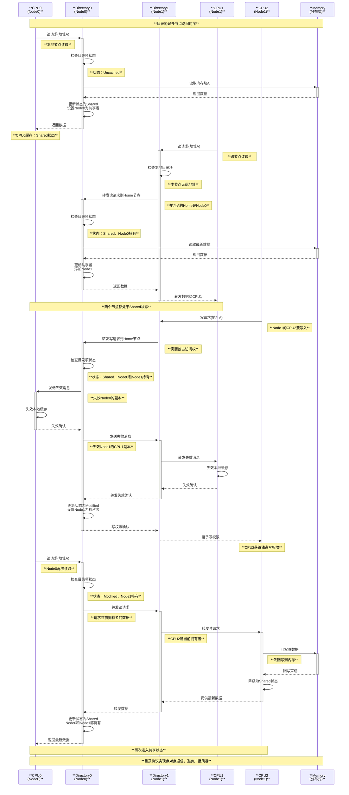

# 内存一致性与通信机制深度分析

## 概述

内存一致性（Memory Consistency）和缓存一致性（Cache Coherence）是多处理器系统中保证数据正确性的核心机制。随着多核处理器的普及和NUMA架构的广泛应用，理解这些机制对于系统性能优化和正确性保证至关重要。

本文档将深入分析Linux内核中的内存一致性机制，包括硬件层面的缓存一致性协议（如MESI）、软件层面的内存屏障和同步原语，以及它们在现代处理器架构中的实现。

## 1. 缓存一致性整体架构

### 1.1 缓存一致性问题的本质

在多处理器系统中，每个处理器都有自己的缓存层次结构。当多个处理器访问同一内存地址时，需要保证所有处理器看到的数据是一致的。

```text
**多处理器缓存架构总览**

┌─────────────────────────────────────────────────────────────────────────┐
│                        **多核处理器缓存层次结构**                         │
│                                                                         │
│ **CPU Core 0**              **CPU Core 1**              **CPU Core 2** │
│ ┌─────────────┐             ┌─────────────┐             ┌─────────────┐ │
│ │**L1I Cache**│             │**L1I Cache**│             │**L1I Cache**│ │
│ │   32KB      │             │   32KB      │             │   32KB      │ │
│ │  8-way      │             │  8-way      │             │  8-way      │ │
│ └─────────────┘             └─────────────┘             └─────────────┘ │
│ ┌─────────────┐             ┌─────────────┐             ┌─────────────┐ │
│ │**L1D Cache**│             │**L1D Cache**│             │**L1D Cache**│ │
│ │   32KB      │             │   32KB      │             │   32KB      │ │
│ │  8-way      │             │  8-way      │             │  8-way      │ │
│ └─────────────┘             └─────────────┘             └─────────────┘ │
│        │                           │                           │       │
│        ▼                           ▼                           ▼       │
│ ┌─────────────┐             ┌─────────────┐             ┌─────────────┐ │
│ │**L2 Cache** │             │**L2 Cache** │             │**L2 Cache** │ │
│ │   256KB     │             │   256KB     │             │   256KB     │ │
│ │  8-way      │             │  8-way      │             │  8-way      │ │
│ └─────────────┘             └─────────────┘             └─────────────┘ │
│        │                           │                           │       │
│        └───────────────┬───────────┴───────────┬───────────────┘       │
│                        │                       │                       │
│                        ▼                       ▼                       │
│                 ┌─────────────────────────────────────┐                │
│                 │           **L3 Cache**             │                │
│                 │             8MB                    │                │
│                 │           16-way                   │                │
│                 │        (共享缓存)                  │                │
│                 └─────────────────────────────────────┘                │
│                                    │                                   │
│                                    ▼                                   │
│                 ┌─────────────────────────────────────┐                │
│                 │        **内存控制器**               │                │
│                 │     (Memory Controller)            │                │
│                 │  • 缓存一致性协议实现               │                │
│                 │  • 内存访问调度                   │                │
│                 │  • NUMA节点管理                   │                │
│                 └─────────────────────────────────────┘                │
│                                    │                                   │
│                                    ▼                                   │
│                 ┌─────────────────────────────────────┐                │
│                 │          **系统内存**               │                │
│                 │           (DDR4/DDR5)              │                │
│                 │        • 主存储器                  │                │
│                 │        • 内存模块                  │                │
│                 │        • ECC保护                   │                │
│                 └─────────────────────────────────────┘                │
└─────────────────────────────────────────────────────────────────────────┘
```

### 1.2 缓存一致性协议分层架构

```text
**缓存一致性协议分层架构**

┌─────────────────────────────────────────────────────────────────────────┐
│                       **应用层** (Application Layer)                     │
│  ┌─────────────────────────────────────────────────────────────────────┐│
│  │ **用户程序**: 多线程/多进程应用                                        ││
│  │ • pthread_mutex_lock/unlock()                                      ││
│  │ • atomic operations (__sync_*, __atomic_*)                         ││
│  │ • memory barriers (__sync_synchronize())                           ││
│  └─────────────────────────────────────────────────────────────────────┘│
└───────────────────────────┬─────────────────────────────────────────────┘
                            │
                            ▼
┌─────────────────────────────────────────────────────────────────────────┐
│                    **内核层** (Kernel Layer)                             │
│  ┌─────────────────────────────────────────────────────────────────────┐│
│  │ **内存管理子系统** (Memory Management Subsystem)                      ││
│  │ • smp_mb(), smp_rmb(), smp_wmb() - 内存屏障                         ││
│  │ • smp_call_function() - CPU间通信                                    ││
│  │ • flush_tlb_*() - TLB一致性                                          ││
│  │ • NUMA topology management                                          ││
│  └─────────────────────────────────────────────────────────────────────┘│
│  ┌─────────────────────────────────────────────────────────────────────┐│
│  │ **同步原语层** (Synchronization Primitives)                          ││
│  │ • spin_lock/unlock() - 自旋锁                                        ││
│  │ • mutex_lock/unlock() - 互斥锁                                       ││
│  │ • rwlock, seqlock, RCU                                              ││
│  │ • atomic_t operations                                               ││
│  └─────────────────────────────────────────────────────────────────────┘│
└───────────────────────────┬─────────────────────────────────────────────┘
                            │
                            ▼
┌─────────────────────────────────────────────────────────────────────────┐
│                   **硬件抽象层** (HAL Layer)                             │
│  ┌─────────────────────────────────────────────────────────────────────┐│
│  │ **处理器架构相关** (Architecture Specific)                           ││
│  │ • x86: LOCK prefix, MFENCE, LFENCE, SFENCE                         ││
│  │ • ARM: DMB, DSB, ISB barriers                                       ││
│  │ • Power: sync, lwsync, eieio                                        ││
│  │ • RISC-V: fence, fence.i                                           ││
│  └─────────────────────────────────────────────────────────────────────┘│
└───────────────────────────┬─────────────────────────────────────────────┘
                            │
                            ▼
┌─────────────────────────────────────────────────────────────────────────┐
│                    **硬件层** (Hardware Layer)                           │
│  ┌─────────────────────────────────────────────────────────────────────┐│
│  │ **缓存一致性协议** (Cache Coherence Protocols)                        ││
│  │ • **MESI Protocol**: Modified, Exclusive, Shared, Invalid          ││
│  │ • **MOESI Protocol**: 增加Owned状态                                  ││
│  │ • **Directory Protocol**: 目录基协议                                ││
│  │ • **Snooping Protocol**: 总线监听协议                               ││
│  └─────────────────────────────────────────────────────────────────────┘│
│  ┌─────────────────────────────────────────────────────────────────────┐│
│  │ **互连网络** (Interconnection Network)                               ││
│  │ • **Coherent Bus**: 一致性总线                                       ││
│  │ • **Ring Bus**: 环形总线                                            ││
│  │ • **Mesh Network**: 网格网络                                        ││
│  │ • **Crossbar**: 交叉开关                                            ││
│  └─────────────────────────────────────────────────────────────────────┘│
│  ┌─────────────────────────────────────────────────────────────────────┐│
│  │ **内存子系统** (Memory Subsystem)                                    ││
│  │ • **Memory Controller**: 内存控制器                                  ││
│  │ • **NUMA Nodes**: NUMA节点                                          ││
│  │ • **Cache Hierarchy**: 缓存层次                                     ││
│  │ • **TLB Management**: TLB管理                                       ││
│  └─────────────────────────────────────────────────────────────────────┘│
└─────────────────────────────────────────────────────────────────────────┘
```

### 1.3 核心组件和模块

#### 1.3.1 硬件组件

```c
// arch/x86/include/asm/processor.h
struct cpuinfo_x86 {
    __u8                    x86;            // CPU family
    __u8                    x86_model;      // Model
    __u8                    x86_stepping;   // Stepping
    char                    x86_vendor_id[16];  // Vendor string
    int                     x86_cache_size; // Cache size in KB
    int                     x86_cache_alignment; // Cache line size
    int                     x86_cache_max_rmid;  // Max RMID for CAT
    int                     x86_cache_occ_scale; // Cache occupancy scale
    int                     x86_power;           // Power management capabilities
    unsigned long           loops_per_jiffy;    // Timing calibration
    // ... 缓存拓扑信息
    struct cpuid_regs       cpuid_level;        // CPUID levels
    u32                     microcode;          // Microcode version
};

// arch/x86/include/asm/cacheinfo.h
struct cacheinfo {
    unsigned int            id;              // Cache ID
    enum cache_type         type;            // Cache type (DATA/INST/UNIFIED)
    unsigned int            level;           // Cache level (L1/L2/L3)
    unsigned int            coherency_line_size; // Cache line size
    unsigned int            number_of_sets;      // Number of sets
    unsigned int            ways_of_associativity; // Associativity
    unsigned int            size;                // Cache size
    unsigned int            shared_cpu_map;      // Shared CPU mask
    unsigned int            attributes;          // Cache attributes
    bool                    disable_sysfs;       // Sysfs disable flag
};
```

#### 1.3.2 内核同步机制

```c
// include/linux/spinlock.h
typedef struct spinlock {
    union {
        struct raw_spinlock rlock;
        
#ifdef CONFIG_DEBUG_LOCK_ALLOC
# define LOCK_PADSIZE (offsetof(struct raw_spinlock, dep_map) + \
                      sizeof(struct lockdep_map))
        struct {
            u8 __padding[LOCK_PADSIZE];
            struct lockdep_map dep_map;
        };
#endif
    };
} spinlock_t;

// 自旋锁实现 - arch/x86/include/asm/spinlock.h
static __always_inline void arch_spin_lock(arch_spinlock_t *lock)
{
    register struct __raw_tickets inc = { .tail = TICKET_LOCK_INC };
    
    inc = xadd(&lock->tickets, inc);    // 原子加法获取ticket
    if (likely(inc.head == inc.tail))   // 检查是否可以立即获得锁
        goto out;
        
    // 自旋等待
    for (;;) {
        unsigned count = SPIN_THRESHOLD;
        
        do {
            inc.head = READ_ONCE(lock->tickets.head);
            if (__tickets_equal(inc.head, inc.tail))
                goto clear_slowpath;
            cpu_relax();  // CPU pause指令
        } while (--count);
        
        __ticket_lock_spinning(lock, inc.tail); // 进入慢路径
    }
    
clear_slowpath:
    __ticket_check_and_clear_slowpath(lock, inc.head);
out:
    barrier(); // 编译器屏障
}

// 内存屏障实现 - arch/x86/include/asm/barrier.h
#define mb()    asm volatile("mfence":::"memory")    // 完全内存屏障
#define rmb()   asm volatile("lfence":::"memory")    // 读屏障  
#define wmb()   asm volatile("sfence":::"memory")    // 写屏障

#define smp_mb()    mb()     // SMP内存屏障
#define smp_rmb()   barrier() // SMP读屏障（x86 TSO模型下优化为编译器屏障）
#define smp_wmb()   barrier() // SMP写屏障

// NUMA感知的内存分配
#define alloc_pages_node(nid, gfp_mask, order) \
        __alloc_pages_node(nid, gfp_mask, order)

static inline struct page *
__alloc_pages_node(int nid, gfp_t gfp_mask, unsigned int order)
{
    VM_BUG_ON(nid < 0 || nid >= MAX_NUMNODES);
    warn_if_node_offline(nid, gfp_mask);
    
    return __alloc_pages(gfp_mask, order, nid, NULL);
}
```

### 1.4 缓存一致性工作原理

#### 1.4.1 缓存行状态管理

```c
// 缓存行状态枚举 (伪代码，基于硬件实现概念)
enum cache_line_state {
    CACHE_INVALID   = 0,    // 无效状态
    CACHE_SHARED    = 1,    // 共享状态  
    CACHE_EXCLUSIVE = 2,    // 独占状态
    CACHE_MODIFIED  = 3,    // 修改状态
    CACHE_OWNED     = 4,    // 拥有状态（MOESI协议）
    CACHE_FORWARD   = 5,    // 转发状态（某些协议）
};

// 缓存一致性操作类型
enum coherence_operation {
    COHERENCE_READ,         // 读操作
    COHERENCE_WRITE,        // 写操作  
    COHERENCE_INVALIDATE,   // 失效操作
    COHERENCE_FLUSH,        // 刷新操作
    COHERENCE_WRITEBACK,    // 回写操作
};

// Linux内核中的缓存管理相关函数
// arch/x86/mm/pat.c
void clflush_cache_range(void *vaddr, unsigned int size)
{
    const unsigned long clflush_size = boot_cpu_data.x86_cache_alignment;
    void *p = (void *)((unsigned long)vaddr & ~(clflush_size - 1));
    void *vend = vaddr + size;
    
    if (p >= vend)
        return;
        
    mb();   // 内存屏障确保之前的操作完成
    
    for (; p < vend; p += clflush_size)
        clflushopt(p);  // 缓存行刷新指令
        
    mb();   // 确保刷新操作完成
}

// 跨CPU缓存刷新
void flush_tlb_mm_range(struct mm_struct *mm, unsigned long start,
                       unsigned long end, unsigned int stride_shift,
                       bool freed_tables)
{
    int cpu = get_cpu();
    
    /* 如果是当前CPU的mm，直接刷新本地TLB */
    if (current->active_mm == mm) {
        if (atomic_read(&mm->mm_users) == 1) {
            /* 只有当前进程在使用，只刷新本地 */
            local_flush_tlb_mm_range(mm, start, end, stride_shift, freed_tables);
            goto out;
        }
    }
    
    /* 需要刷新其他CPU的TLB */
    flush_tlb_others(mm, start, end, stride_shift, freed_tables);
    
out:
    put_cpu();
}
```

## 2. 缓存一致性性能影响分析

### 2.1 性能开销组成

```text
**缓存一致性性能开销分析**

┌─────────────────────────────────────────────────────────────────────────┐
│                        **性能开销组成**                                  │
│                                                                         │
│ **1. 缓存未命中开销** (Cache Miss Penalty)                               │
│ ┌─────────────────────────────────────────────────────────────────────┐ │
│ │ **L1 Cache Miss**: ~4 cycles                                       │ │
│ │ **L2 Cache Miss**: ~12 cycles                                      │ │
│ │ **L3 Cache Miss**: ~40-75 cycles                                   │ │
│ │ **Main Memory**: ~200-300 cycles                                   │ │
│ │ **Remote NUMA Node**: ~300-500 cycles                              │ │
│ └─────────────────────────────────────────────────────────────────────┘ │
│                                                                         │
│ **2. 一致性协议开销** (Coherence Protocol Overhead)                      │
│ ┌─────────────────────────────────────────────────────────────────────┐ │
│ │ **Invalidation Storm**: 大量失效消息导致的性能下降                     │ │
│ │ • 写操作触发其他CPU缓存失效                                           │ │
│ │ • 网络延迟：~10-50 cycles                                            │ │
│ │ • 处理延迟：~5-20 cycles                                             │ │
│ │                                                                     │ │
│ │ **False Sharing**: 伪共享导致的不必要一致性流量                        │ │
│ │ • 同一缓存行内不同变量的修改                                           │ │
│ │ • 性能下降：50-90%                                                   │ │
│ │ • 缓存行大小：64字节（x86）                                           │ │
│ └─────────────────────────────────────────────────────────────────────┘ │
│                                                                         │
│ **3. 同步原语开销** (Synchronization Overhead)                          │
│ ┌─────────────────────────────────────────────────────────────────────┐ │
│ │ **Spinlock**: ~20-100 cycles (无竞争)                              │ │
│ │ **Mutex**: ~500-2000 cycles (包含系统调用)                           │ │
│ │ **Atomic Operations**: ~50-200 cycles                              │ │
│ │ **Memory Barriers**: ~10-50 cycles                                 │ │
│ └─────────────────────────────────────────────────────────────────────┘ │
│                                                                         │
│ **4. NUMA影响** (NUMA Impact)                                           │
│ ┌─────────────────────────────────────────────────────────────────────┐ │
│ │ **本地内存访问**: 100-200 cycles                                      │ │
│ │ **远程内存访问**: 200-500 cycles                                      │ │
│ │ **跨NUMA缓存一致性**: 额外50-200 cycles开销                           │ │
│ │ **内存带宽竞争**: 性能下降20-60%                                       │ │
│ └─────────────────────────────────────────────────────────────────────┘ │
└─────────────────────────────────────────────────────────────────────────┘
```

### 2.2 优化策略和使用场景

缓存一致性机制在不同场景下的应用和优化策略：

1. **高性能计算场景**：使用NUMA-aware的内存分配和CPU绑定
2. **数据库系统**：优化锁粒度，减少缓存行竞争
3. **网络处理**：使用无锁数据结构和per-CPU变量
4. **实时系统**：避免不确定的缓存一致性延迟

这些机制共同构成了现代多处理器系统的缓存一致性基础，确保了内存访问的正确性和性能的可预测性。

## 3. MESI协议深度分析

### 3.1 MESI协议概述

MESI协议是最广泛应用的缓存一致性协议之一，通过四种缓存行状态（Modified、Exclusive、Shared、Invalid）来维护多处理器系统中的数据一致性。该协议在Intel x86架构中得到广泛应用。

#### 3.1.1 MESI四种状态定义

```text
**MESI协议状态详解**

┌─────────────────────────────────────────────────────────────────────────┐
│                        **MESI四种缓存行状态**                            │
│                                                                         │
│ ┌─────────────────┬─────────────────┬─────────────────┬─────────────────┐ │
│ │ **Modified (M)**│ **Exclusive (E)**│ **Shared (S)** │ **Invalid (I)** │ │
│ │    **已修改**   │    **独占**      │   **共享**      │   **无效**       │ │
│ ├─────────────────┼─────────────────┼─────────────────┼─────────────────┤ │
│ │ **特性**:        │ **特性**:        │ **特性**:        │ **特性**:        │ │
│ │ • 数据已被修改   │ • 数据未被修改   │ • 多个CPU共享    │ • 缓存行无效     │ │
│ │ • 仅在当前CPU   │ • 仅在当前CPU   │ • 数据一致       │ • 不能直接读写   │ │
│ │ • 与内存不一致   │ • 与内存一致     │ • 只读状态       │                 │ │
│ │                 │                 │                 │                 │ │
│ │ **权限**:        │ **权限**:        │ **权限**:        │ **权限**:        │ │
│ │ • 可读可写       │ • 可读可写       │ • 只读           │ • 无权限         │ │
│ │ • 独占访问       │ • 独占访问       │ • 共享访问       │                 │ │
│ │                 │                 │                 │                 │ │
│ │ **回写策略**:    │ **回写策略**:    │ **回写策略**:    │ **回写策略**:    │ │
│ │ • 需要回写       │ • 不需要回写     │ • 不需要回写     │ • 无数据         │ │
│ │ • 脏数据         │ • 干净数据       │ • 干净数据       │                 │ │
│ └─────────────────┴─────────────────┴─────────────────┴─────────────────┘ │
└─────────────────────────────────────────────────────────────────────────┘
```

#### 3.1.2 MESI状态转换图

```text
**MESI协议状态转换图**

┌─────────────────────────────────────────────────────────────────────────┐
│                         **状态转换关系**                                 │
│                                                                         │
│                    ┌─────────────────────────┐                          │
│                    │      **Invalid (I)**    │                          │
│                    │        **无效状态**      │                          │
│                    └─────────┬───────────────┘                          │
│                              │                                          │
│                       **PrRd** │ **处理器读**                           │
│                              ▼                                          │
│   ┌─────────────────────────────────────────────────────────────────┐   │
│   │                    **读取决策**                                  │   │
│   │                                                                 │   │
│   │  **BusRd** ─────► 总线读 ──────► 其他缓存有数据？                │   │
│   │     │                              │         │                  │   │
│   │     │                          **有**     **无**               │   │
│   │     ▼                              │         │                  │   │
│   │ 主存读取                           ▼         ▼                  │   │
│   │     │                     ┌─────────────┐ ┌─────────────┐       │   │
│   │     │                     │**Shared(S)**│ │**Exclusive**│       │   │
│   │     │                     │   **共享**   │ │  **(E)**    │       │   │
│   │     │                     └─────────────┘ └─────────────┘       │   │
│   └─────┼─────────────────────────────────────────────────────────────┘   │
│         │                                                                │
│         ▼                                                                │
│ ┌─────────────────────────────────────────────────────────────────────┐ │
│ │                        **读写操作转换**                              │ │
│ │                                                                     │ │
│ │ **从 Shared (S) 状态**:                                              │ │
│ │ ┌─────────────┐  **PrWr**(写请求)  ┌─────────────┐                  │ │
│ │ │**Shared(S)**├──────────────────►│**Modified** │                  │ │
│ │ │   **共享**   │   **BusRdX**      │   **(M)**   │                  │ │
│ │ └─────────────┘   (发送失效消息)    │   **已修改** │                  │ │
│ │                                   └─────────────┘                  │ │
│ │                                                                     │ │
│ │ **从 Exclusive (E) 状态**:                                           │ │
│ │ ┌─────────────┐  **PrWr**(写请求)  ┌─────────────┐                  │ │
│ │ │**Exclusive**├──────────────────►│**Modified** │                  │ │
│ │ │  **(E)**    │   (本地操作)       │   **(M)**   │                  │ │
│ │ │   **独占**   │   (无需总线操作)    │   **已修改** │                  │ │
│ │ └─────────────┘                   └─────────────┘                  │ │
│ └─────────────────────────────────────────────────────────────────────┘ │
│                                                                         │
│ ┌─────────────────────────────────────────────────────────────────────┐ │
│ │                      **失效和回写操作**                              │ │
│ │                                                                     │ │
│ │ **总线操作导致的状态变化**:                                           │ │
│ │                                                                     │ │
│ │ ┌─────────────┐  **BusRd**        ┌─────────────┐                   │ │
│ │ │**Modified** ├─────────────────►│**Shared(S)**│                   │ │
│ │ │   **(M)**   │  (其他CPU读取)     │   **共享**   │                   │ │
│ │ │   **已修改** │  **+Flush**       └─────────────┘                   │ │
│ │ └─────────────┘  (回写到内存)                                        │ │
│ │                                                                     │ │
│ │ ┌─────────────┐  **BusRdX**       ┌─────────────┐                   │ │
│ │ │**Modified** ├─────────────────►│**Invalid**  │                   │ │
│ │ │   **(M)**   │  (其他CPU写入)     │   **(I)**   │                   │ │
│ │ │   **已修改** │  **+Flush**       │   **无效**   │                   │ │
│ │ └─────────────┘  (回写并失效)      └─────────────┘                   │ │
│ │                                                                     │ │
│ │ ┌─────────────┐  **BusRd**        ┌─────────────┐                   │ │
│ │ │**Exclusive**├─────────────────►│**Shared(S)**│                   │ │
│ │ │  **(E)**    │  (其他CPU读取)     │   **共享**   │                   │ │
│ │ │   **独占**   │                  └─────────────┘                   │ │
│ │ └─────────────┘                                                    │ │
│ │                                                                     │ │
│ │ ┌─────────────┐  **BusRdX**       ┌─────────────┐                   │ │
│ │ │ **Any**     ├─────────────────►│**Invalid**  │                   │ │
│ │ │ **State**   │  (其他CPU写入)     │   **(I)**   │                   │ │
│ │ │             │  (失效请求)        │   **无效**   │                   │ │
│ │ └─────────────┘                  └─────────────┘                   │ │
│ └─────────────────────────────────────────────────────────────────────┘ │
└─────────────────────────────────────────────────────────────────────────┘
```

### 3.2 MESI协议实现机制

#### 3.2.1 处理器操作类型

```c
// 处理器缓存操作类型定义（基于硬件概念的抽象）
enum processor_operation {
    PR_RD,      // 处理器读操作
    PR_WR,      // 处理器写操作
    PR_FLUSH,   // 处理器刷新操作
};

// 总线操作类型
enum bus_operation {
    BUS_RD,     // 总线读操作
    BUS_RDX,    // 总线独占读操作（用于写）
    BUS_INV,    // 总线失效操作
    BUS_WB,     // 总线回写操作
    BUS_FLUSH,  // 总线刷新操作
};

// Linux内核中相关的缓存管理实现
// arch/x86/include/asm/cacheflush.h

// 刷新特定地址范围的缓存
static inline void clflush_cache_range(void *addr, size_t size)
{
    const unsigned long clflush_size = boot_cpu_data.x86_cache_alignment;
    void *vaddr = addr;
    void *vend = addr + size;
    
    mb(); // 确保之前的内存操作完成
    
    // 按缓存行对齐刷新
    for (; vaddr < vend; vaddr += clflush_size) {
        clflushopt(vaddr);  // 优化的缓存行刷新指令
    }
    
    mb(); // 确保刷新操作完成
}

// 原子操作实现（体现MESI协议的应用）
// arch/x86/include/asm/atomic.h
static __always_inline int atomic_read(const atomic_t *v)
{
    /*
     * 读操作不需要LOCK前缀，因为：
     * 1. x86保证对齐的32位读取是原子的
     * 2. MESI协议确保读取到一致的值
     */
    return READ_ONCE(v->counter);
}

static __always_inline void atomic_set(atomic_t *v, int i)
{
    WRITE_ONCE(v->counter, i);  // 原子写入
}

static __always_inline int atomic_add_return(int i, atomic_t *v)
{
    /*
     * LOCK XADD指令：
     * 1. 获得对缓存行的独占访问（MESI中的Modified状态）
     * 2. 执行加法操作
     * 3. 返回操作前的值
     */
    return i + xadd(&v->counter, i);
}

static __always_inline bool atomic_try_cmpxchg(atomic_t *v, int *old, int new)
{
    /*
     * LOCK CMPXCHG指令：
     * 1. 比较当前值与期望值
     * 2. 如果相等，设置新值并返回true
     * 3. 如果不等，更新old值并返回false
     * 4. 整个过程在MESI协议保护下原子执行
     */
    return try_cmpxchg(&v->counter, old, new);
}

// SMP缓存一致性的内核实现
// kernel/smp.c
void smp_call_function_single(int cpu, smp_call_func_t func, void *info, int wait)
{
    struct __call_single_data *csd;
    
    /*
     * 跨CPU函数调用，涉及缓存一致性：
     * 1. 准备调用数据结构
     * 2. 通过中断通知目标CPU
     * 3. 等待执行完成（如果需要）
     */
    
    if (cpu == smp_processor_id()) {
        // 本地CPU，直接调用
        local_irq_disable();
        func(info);
        local_irq_enable();
        return;
    }
    
    // 远程CPU调用
    csd = &per_cpu(csd_data, cpu);
    csd_lock(csd);  // 确保缓存行独占访问
    
    csd->func = func;
    csd->info = info;
    csd->flags = CSD_FLAG_SYNCHRONOUS;
    
    // 发送IPI中断
    arch_send_call_function_single_ipi(cpu);
    
    if (wait)
        csd_lock_wait(csd);  // 等待完成
}
```

### 3.3 MESI协议时序分析

#### 3.3.1 多CPU读写时序图

```mermaid
sequenceDiagram
    participant CPU0 as **CPU0缓存**
    participant Bus as **一致性总线**
    participant CPU1 as **CPU1缓存**
    participant CPU2 as **CPU2缓存**
    participant Memory as **主内存**

    Note over CPU0,Memory: **MESI协议多CPU访问时序**
    
    CPU0->>+Bus: PrRd(地址A)
    Note right of CPU0: **处理器读请求**
    
    Bus->>Bus: BusRd(地址A)
    Note right of Bus: **总线读操作**
    
    Bus->>CPU1: 检查缓存状态
    CPU1-->>Bus: 无数据(Invalid)
    Bus->>CPU2: 检查缓存状态  
    CPU2-->>Bus: 无数据(Invalid)
    
    Bus->>+Memory: 读取数据
    Memory-->>-Bus: 返回数据
    Bus-->>-CPU0: 数据 + Exclusive信号
    
    Note over CPU0: **CPU0: Invalid → Exclusive**
    
    CPU1->>+Bus: PrRd(地址A)
    Note right of CPU1: **CPU1读同一地址**
    
    Bus->>Bus: BusRd(地址A)
    Bus->>CPU0: 检查缓存状态
    CPU0-->>Bus: 有数据(Exclusive)
    
    CPU0->>CPU0: Exclusive → Shared
    Note right of CPU0: **状态降级为共享**
    
    CPU0->>Bus: 提供数据
    Bus-->>-CPU1: 数据 + Shared信号
    
    Note over CPU1: **CPU1: Invalid → Shared**
    Note over CPU0,CPU1: **两个CPU都处于Shared状态**
    
    CPU0->>+Bus: PrWr(地址A)
    Note right of CPU0: **CPU0写操作**
    
    Bus->>Bus: BusRdX(地址A)
    Note right of Bus: **独占读请求**
    
    Bus->>CPU1: 失效请求
    CPU1->>CPU1: Shared → Invalid
    CPU1-->>Bus: 确认失效
    
    Bus->>CPU2: 失效请求
    CPU2-->>Bus: 确认失效(已是Invalid)
    
    Bus-->>-CPU0: 独占访问确认
    CPU0->>CPU0: Shared → Modified
    Note right of CPU0: **获得独占写权限**
    
    CPU0->>CPU0: 执行写操作
    Note right CPU0: **修改缓存行数据**
    
    CPU2->>+Bus: PrRd(地址A)
    Note right of CPU2: **CPU2读取数据**
    
    Bus->>Bus: BusRd(地址A)
    Bus->>CPU0: 检查缓存状态
    CPU0-->>Bus: 有脏数据(Modified)
    
    CPU0->>+Memory: 回写脏数据
    Note right of Memory: **写回主内存**
    Memory-->>-CPU0: 回写完成
    
    CPU0->>CPU0: Modified → Shared
    CPU0->>Bus: 提供最新数据
    Bus-->>-CPU2: 数据 + Shared信号
    
    Note over CPU2: **CPU2: Invalid → Shared**
    Note over CPU0,CPU2: **再次进入共享状态**
    
    Note over CPU0,Memory: **MESI协议确保了数据一致性**
```

### 3.4 MESI协议性能优化

#### 3.4.1 Write-Through vs Write-Back策略

```c
// 写策略的性能影响分析
struct cache_performance_metrics {
    unsigned long write_hits;          // 写命中次数
    unsigned long write_misses;        // 写未命中次数  
    unsigned long invalidations;       // 失效操作次数
    unsigned long writebacks;          // 回写操作次数
    unsigned long coherence_traffic;   // 一致性流量
    unsigned long false_sharing_events; // 伪共享事件
};

// Linux内核中的优化示例
// Per-CPU变量避免缓存一致性开销
DEFINE_PER_CPU(struct task_struct *, current_task);

static __always_inline struct task_struct *get_current(void)
{
    /*
     * Per-CPU变量优势：
     * 1. 避免缓存行竞争
     * 2. 每个CPU独占数据
     * 3. 无需MESI协议同步
     */
    return this_cpu_read(current_task);
}

// 缓存行对齐避免伪共享
struct optimized_structure {
    int frequently_written_by_cpu0 ____cacheline_aligned;
    int frequently_written_by_cpu1 ____cacheline_aligned;
    int frequently_written_by_cpu2 ____cacheline_aligned;
};

// 无锁数据结构减少一致性开销
// kernel/locking/lockless.h
static inline bool lockless_dereference_protected(void **ptr)
{
    /*
     * 使用RCU等无锁机制：
     * 1. 减少独占访问需求
     * 2. 允许并发读取
     * 3. 降低MESI协议开销
     */
    return rcu_dereference_protected(*ptr, lockdep_is_held(&rcu_read_lock));
}
```

### 3.5 MESI vs 其他协议比较

```text
**缓存一致性协议比较**

┌─────────────────────────────────────────────────────────────────────────┐
│                       **协议特性对比**                                   │
├─────────────┬─────────────┬─────────────┬─────────────┬─────────────────┤
│   **协议**  │ **状态数** │ **复杂度** │ **性能** │       **特点**        │
├─────────────┼─────────────┼─────────────┼─────────────┼─────────────────┤
│ **MESI**    │     4       │    中等     │    良好     │ • 广泛应用        │
│             │             │             │             │ • 实现相对简单    │
│             │             │             │             │ • Intel x86标准   │
├─────────────┼─────────────┼─────────────┼─────────────┼─────────────────┤
│ **MOESI**   │     5       │    较高     │    更好     │ • 增加Owned状态   │
│             │             │             │             │ • 减少内存流量    │
│             │             │             │             │ • AMD架构使用     │
├─────────────┼─────────────┼─────────────┼─────────────┼─────────────────┤
│ **MSI**     │     3       │    较低     │    较差     │ • 最简单实现      │
│             │             │             │             │ • 缺乏Exclusive   │
│             │             │             │             │ • 较多总线流量    │
├─────────────┼─────────────┼─────────────┼─────────────┼─────────────────┤
│**Directory** │   可扩展    │    最高     │  可扩展性强  │ • 大规模系统      │
│**Based**    │             │             │             │ • 点对点通信      │
│             │             │             │             │ • NUMA优化        │
└─────────────┴─────────────┴─────────────┴─────────────┴─────────────────┘
```

MESI协议通过精确的状态管理和高效的总线操作，在性能和复杂度之间取得了良好的平衡，成为现代处理器缓存一致性的基石。

## 4. 目录协议深度分析

### 4.1 目录协议概述

目录协议（Directory Protocol）是一种面向大规模多处理器系统的缓存一致性协议。与基于总线监听的MESI协议不同，目录协议通过维护分布式目录来跟踪每个内存块的共享状态，特别适用于NUMA架构和大规模并行系统。

#### 4.1.1 目录协议架构图

```text
**目录协议整体架构**

┌─────────────────────────────────────────────────────────────────────────┐
│                        **NUMA节点架构**                                 │
│                                                                         │
│ **NUMA Node 0**          **NUMA Node 1**          **NUMA Node 2**      │
│ ┌─────────────────┐     ┌─────────────────┐     ┌─────────────────┐     │
│ │ **CPU 0-3**     │     │ **CPU 4-7**     │     │ **CPU 8-11**    │     │
│ │ ┌─────────────┐ │     │ ┌─────────────┐ │     │ ┌─────────────┐ │     │
│ │ │L1/L2 Cache  │ │     │ │L1/L2 Cache  │ │     │ │L1/L2 Cache  │ │     │
│ │ └─────────────┘ │     │ └─────────────┘ │     │ └─────────────┘ │     │
│ │ ┌─────────────┐ │     │ ┌─────────────┐ │     │ ┌─────────────┐ │     │
│ │ │ **L3 Cache**│ │     │ │ **L3 Cache**│ │     │ │ **L3 Cache**│ │     │
│ │ │  (Shared)   │ │     │ │  (Shared)   │ │     │ │  (Shared)   │ │     │
│ │ └─────────────┘ │     │ └─────────────┘ │     │ └─────────────┘ │     │
│ │        │        │     │        │        │     │        │        │     │
│ │        ▼        │     │        ▼        │     │        ▼        │     │
│ │ ┌─────────────┐ │     │ ┌─────────────┐ │     │ ┌─────────────┐ │     │
│ │ │**Directory** │ │     │ │**Directory** │ │     │ │**Directory** │ │     │
│ │ │**Controller**│ │     │ │**Controller**│ │     │ │**Controller**│ │     │
│ │ │             │ │     │ │             │ │     │ │             │ │     │
│ │ │•缓存状态跟踪 │ │     │ │•缓存状态跟踪 │ │     │ │•缓存状态跟踪 │ │     │
│ │ │•一致性消息   │ │     │ │•一致性消息   │ │     │ │•一致性消息   │ │     │
│ │ │•权限管理     │ │     │ │•权限管理     │ │     │ │•权限管理     │ │     │
│ │ └─────────────┘ │     │ └─────────────┘ │     │ └─────────────┘ │     │
│ │        │        │     │        │        │     │        │        │     │
│ │        ▼        │     │        ▼        │     │        ▼        │     │
│ │ ┌─────────────┐ │     │ ┌─────────────┐ │     │ ┌─────────────┐ │     │
│ │ │**Local**    │ │     │ │**Local**    │ │     │ │**Local**    │ │     │
│ │ │**Memory**   │ │     │ │**Memory**   │ │     │ │**Memory**   │ │     │
│ │ │  Bank 0     │ │     │ │  Bank 1     │ │     │ │  Bank 2     │ │     │
│ │ └─────────────┘ │     │ └─────────────┘ │     │ └─────────────┘ │     │
│ └─────────────────┘     └─────────────────┘     └─────────────────┘     │
│         │                       │                       │               │
│         └───────────────────────┼───────────────────────┘               │
│                                 │                                       │
│                                 ▼                                       │
│              ┌─────────────────────────────────────────┐                │
│              │        **互连网络** (Interconnect)        │                │
│              │                                         │                │
│              │  • **点对点通信**: Node-to-Node Messages  │                │
│              │  • **目录查询**: Directory Lookup        │                │
│              │  • **失效传播**: Invalidation Propagation │                │
│              │  • **数据转发**: Data Forwarding          │                │
│              │                                         │                │
│              │  **支持的拓扑**:                         │                │
│              │  ├─ Ring (环形)                          │                │
│              │  ├─ Mesh (网格)                         │                │
│              │  ├─ Torus (环面)                        │                │
│              │  └─ Fat-tree (胖树)                     │                │
│              └─────────────────────────────────────────┘                │
└─────────────────────────────────────────────────────────────────────────┘
```

#### 4.1.2 目录项结构

```text
**目录项数据结构**

┌─────────────────────────────────────────────────────────────────────────┐
│                         **Directory Entry**                             │
│                                                                         │
│ **每个内存块对应一个目录项**                                              │
│                                                                         │
│ ┌─────────────────────────────────────────────────────────────────────┐ │
│ │                    **目录项字段布局**                                 │ │
│ │                                                                     │ │
│ │ **Bit 0-1**: **状态字段** (State Field)                              │ │
│ │ ┌─────────────┬─────────────┬─────────────┐                           │ │
│ │ │ **00: U**   │ **01: S**   │ **10: M**   │                           │ │
│ │ │ **Uncached**│ **Shared**  │**Modified** │                           │ │
│ │ │   未缓存     │   共享      │   已修改    │                           │ │
│ │ └─────────────┴─────────────┴─────────────┘                           │ │
│ │                                                                     │ │
│ │ **Bit 2-N**: **共享者位图** (Sharer Vector)                           │ │
│ │ ┌─────────────────────────────────────────────────────────────────┐ │ │
│ │ │ **每一位对应一个处理器节点**                                      │ │ │
│ │ │                                                                 │ │ │
│ │ │ Bit 2: Node 0     Bit 3: Node 1     Bit 4: Node 2  ...        │ │ │
│ │ │ ┌─────────┐      ┌─────────┐      ┌─────────┐                    │ │ │
│ │ │ │    1    │      │    0    │      │    1    │      表示Node0和   │ │ │
│ │ │ └─────────┘      └─────────┘      └─────────┘      Node2缓存该块  │ │ │
│ │ │                                                                 │ │ │
│ │ │ **对于Modified状态**: 只有一位为1，指示独占者                     │ │ │
│ │ │ **对于Shared状态**: 多位可以为1，指示所有共享者                   │ │ │
│ │ │ **对于Uncached状态**: 所有位为0，无任何缓存                       │ │ │
│ │ └─────────────────────────────────────────────────────────────────┘ │ │
│ │                                                                     │ │
│ │ **可选字段**:                                                        │ │
│ │ • **Owner ID**: 当前拥有者ID（用于某些协议变体）                      │ │
│ │ • **Timestamp**: 时间戳（用于顺序保证）                              │ │
│ │ • **Lock Bit**: 锁位（用于原子操作）                                 │ │
│ └─────────────────────────────────────────────────────────────────────┘ │
└─────────────────────────────────────────────────────────────────────────┘
```

### 4.2 目录协议实现机制

#### 4.2.1 Linux内核中的NUMA感知实现

```c
// include/linux/mmzone.h
struct pglist_data {
    struct zone node_zones[MAX_NR_ZONES];   // NUMA节点的内存区域
    struct zonelist node_zonelists[MAX_ZONELISTS]; // 内存分配顺序
    int nr_zones;                           // 区域数量
    
#ifdef CONFIG_NUMA
    int node_id;                            // NUMA节点ID
    wait_queue_head_t kswapd_wait;          // 页面回收等待队列
    wait_queue_head_t pfmemalloc_wait;      // 内存分配等待队列
    struct task_struct *kswapd;             // 页面回收守护进程
    int kswapd_order;                       // 回收页面大小顺序
    enum zone_type kswapd_highest_zoneidx;  // 最高区域索引
    
    int kswapd_failures;                    // 回收失败次数
    int kcompactd_max_order;                // 内存压缩最大顺序
    enum zone_type kcompactd_highest_zoneidx; // 压缩区域索引
    wait_queue_head_t kcompactd_wait;       // 内存压缩等待队列
    struct task_struct *kcompactd;          // 内存压缩守护进程
    
    // NUMA距离和拓扑信息
    nodemask_t node_states[NR_NODE_STATES]; // 节点状态掩码
#endif
    
    struct lruvec __lruvec;                 // LRU向量
    unsigned long node_start_pfn;           // 节点起始页框号
    unsigned long node_present_pages;       // 节点物理页面数
    unsigned long node_spanned_pages;       // 节点跨越页面数
    
    // 目录协议相关的缓存一致性支持
    atomic_long_t vm_numa_events[NR_VM_NUMA_EVENT_ITEMS]; // NUMA事件计数
};

// mm/mempolicy.c - NUMA内存策略实现
struct mempolicy {
    atomic_t refcnt;                        // 引用计数
    unsigned short mode;                    // 内存分配模式
    unsigned short flags;                   // 策略标志
    union {
        short preferred_node;               // 首选节点
        nodemask_t nodes;                   // 节点掩码
        /* 用于 MPOL_BIND 和 MPOL_INTERLEAVE */
    } v;
    union {
        nodemask_t cpuset_mems_allowed;     // cgroup内存允许掩码
        nodemask_t user_nodemask;           // 用户指定掩码
    } w;
};

// NUMA节点间的缓存一致性操作
// arch/x86/mm/numa.c
void __init numa_init_array(void)
{
    int rr, i;
    
    /*
     * 初始化NUMA节点数组，建立节点间通信机制
     * 这是目录协议的基础设施
     */
    rr = first_node(node_states[N_MEMORY]);
    for (i = 0; i < nr_cpu_ids; i++) {
        if (early_cpu_to_node(i) != NUMA_NO_NODE)
            continue;
        numa_set_node(i, rr);
        rr = next_node_in(rr, node_states[N_MEMORY]);
    }
}

// 跨NUMA节点的缓存失效操作
// arch/x86/mm/tlb.c
void flush_tlb_multi(const struct cpumask *cpumask,
                    const struct flush_tlb_info *info)
{
    /*
     * 多节点TLB刷新，体现目录协议的实现：
     * 1. 识别需要失效的节点
     * 2. 发送点对点失效消息
     * 3. 等待确认完成
     */
    
    if (cpumask_test_cpu(smp_processor_id(), cpumask)) {
        lockdep_assert_irqs_enabled();
        local_flush_tlb();
    }
    
    if (cpumask_any_but(cpumask, smp_processor_id()) < nr_cpu_ids) {
        /*
         * 发送IPI到远程节点
         * 这类似于目录协议中的失效消息传播
         */
        flush_tlb_others(cpumask, info);
    }
}

// NUMA感知的页面分配
// mm/page_alloc.c
static struct page *
get_page_from_freelist(gfp_t gfp_mask, unsigned int order, int alloc_flags,
                      const struct alloc_context *ac)
{
    struct zoneref *z;
    struct zone *zone;
    struct pglist_data *last_pgdat_dirty_limit = NULL;
    bool no_fallback;
    
    /*
     * 按NUMA距离顺序尝试分配
     * 体现目录协议的本地性优化
     */
retry:
    no_fallback = alloc_flags & ALLOC_NOFRAGMENT;
    z = ac->preferred_zoneref;
    
    for_next_zone_zonelist_nodemask(zone, z, ac->highest_zoneidx, ac->nodemask) {
        struct page *page;
        unsigned long mark;
        
        /*
         * 检查NUMA节点距离
         * 优先分配本地内存，减少缓存一致性开销
         */
        if (cpusets_enabled() &&
            (alloc_flags & ALLOC_CPUSET) &&
            !__cpuset_zone_allowed(zone, gfp_mask))
            continue;
            
        /*
         * 在NUMA系统中，本地分配减少了
         * 目录协议的消息传递开销
         */
        if (ac->spread_dirty_pages) {
            if (last_pgdat_dirty_limit == zone->zone_pgdat)
                continue;
                
            if (!node_dirty_ok(zone->zone_pgdat)) {
                last_pgdat_dirty_limit = zone->zone_pgdat;
                continue;
            }
        }
        
        // 尝试从当前zone分配页面
        page = rmqueue(ac->preferred_zoneref->zone, zone, order,
                      gfp_mask, alloc_flags, ac->migratetype);
        if (page) {
            prep_new_page(page, order, gfp_mask, alloc_flags);
            /*
             * 成功分配后，更新NUMA统计信息
             * 有助于目录协议的性能优化
             */
            if (prep_new_page(page, order, gfp_mask, alloc_flags))
                goto try_this_zone;
            return page;
        }
        
try_this_zone:
        mark = wmark_pages(zone, alloc_flags & ALLOC_WMARK_MASK);
        if (!zone_watermark_fast(zone, order, mark,
                               ac->highest_zoneidx, alloc_flags,
                               gfp_mask)) {
            int ret;
            
            /*
             * 内存不足时的NUMA感知回收
             * 避免跨节点的昂贵一致性操作
             */
            if (has_unaccepted_memory()) {
                if (try_to_accept_memory(zone, order))
                    goto try_this_zone;
            }
            
#ifdef CONFIG_DEFERRED_STRUCT_PAGE_INIT
            if (static_branch_unlikely(&deferred_pages)) {
                if (_deferred_grow_zone(zone, order))
                    goto try_this_zone;
            }
#endif
            /* 尝试内存回收 */
            ret = node_reclaim(zone->zone_pgdat, gfp_mask, order);
            switch (ret) {
            case NODE_RECLAIM_NOSCAN:
                /* 无需扫描 */
                continue;
            case NODE_RECLAIM_FULL:
                /* 扫描完成，重试 */
                continue;
            default:
                /* 进入下一个zone */
                break;
            }
        }
    }
    
    /*
     * 如果本地分配失败，考虑远程节点
     * 这时目录协议的开销会显著增加
     */
    if (no_fallback) {
        alloc_flags &= ~ALLOC_NOFRAGMENT;
        goto retry;
    }
    
    return NULL;
}
```

### 4.3 目录协议操作时序

#### 4.3.1 目录协议消息类型

```c
// 目录协议消息类型定义（概念性实现）
enum directory_message_type {
    DIR_READ_REQ,           // 读请求
    DIR_WRITE_REQ,          // 写请求
    DIR_READ_REPLY,         // 读回复
    DIR_WRITE_REPLY,        // 写回复
    DIR_INVALIDATE,         // 失效请求
    DIR_INVALIDATE_ACK,     // 失效确认
    DIR_WRITEBACK,          // 回写请求
    DIR_WRITEBACK_ACK,      // 回写确认
    DIR_FORWARD,            // 转发请求
    DIR_FORWARD_ACK,        // 转发确认
};

// 目录协议消息结构
struct directory_message {
    enum directory_message_type type;   // 消息类型
    int source_node;                    // 源节点ID
    int dest_node;                      // 目标节点ID
    unsigned long address;              // 内存地址
    unsigned long data;                 // 数据（如果需要）
    int requestor_id;                   // 请求者ID
    atomic_t pending_acks;              // 待确认数量
    struct list_head list;              // 消息队列链表
    struct completion completion;        // 完成信号量
};

// 目录协议状态管理
struct directory_controller {
    int node_id;                        // 本节点ID
    struct directory_entry *entries;    // 目录项数组
    spinlock_t dir_lock;                // 目录锁
    struct workqueue_struct *msg_wq;    // 消息处理工作队列
    atomic_long_t msg_sent;             // 发送消息计数
    atomic_long_t msg_received;         // 接收消息计数
    atomic_long_t cache_hits;           // 缓存命中计数
    atomic_long_t cache_misses;         // 缓存未命中计数
};

// 处理读请求的目录协议逻辑
static int directory_handle_read_request(struct directory_controller *ctrl,
                                       struct directory_message *msg)
{
    struct directory_entry *entry;
    unsigned long flags;
    int ret = 0;
    
    entry = &ctrl->entries[msg->address >> PAGE_SHIFT];
    
    spin_lock_irqsave(&ctrl->dir_lock, flags);
    
    switch (entry->state) {
    case DIR_STATE_UNCACHED:
        /*
         * 未缓存状态：
         * 1. 从内存读取数据
         * 2. 设置为共享状态
         * 3. 添加请求者到共享列表
         */
        entry->state = DIR_STATE_SHARED;
        set_bit(msg->source_node, &entry->sharers);
        
        /* 发送数据给请求者 */
        ret = send_directory_reply(ctrl, msg, DIR_READ_REPLY, 
                                  read_memory_block(msg->address));
        break;
        
    case DIR_STATE_SHARED:
        /*
         * 共享状态：
         * 1. 添加新的共享者
         * 2. 发送数据
         */
        set_bit(msg->source_node, &entry->sharers);
        ret = send_directory_reply(ctrl, msg, DIR_READ_REPLY,
                                  read_memory_block(msg->address));
        break;
        
    case DIR_STATE_MODIFIED:
        /*
         * 修改状态：
         * 1. 向当前拥有者发送转发请求
         * 2. 等待拥有者发送数据给请求者
         * 3. 更新为共享状态
         */
        int owner = find_first_bit(&entry->sharers, MAX_NODES);
        ret = send_forward_request(ctrl, owner, msg);
        
        /* 状态将在收到转发确认后更新 */
        break;
    }
    
    spin_unlock_irqrestore(&ctrl->dir_lock, flags);
    return ret;
}

// 处理写请求的目录协议逻辑  
static int directory_handle_write_request(struct directory_controller *ctrl,
                                        struct directory_message *msg)
{
    struct directory_entry *entry;
    unsigned long flags;
    int ret = 0;
    
    entry = &ctrl->entries[msg->address >> PAGE_SHIFT];
    
    spin_lock_irqsave(&ctrl->dir_lock, flags);
    
    switch (entry->state) {
    case DIR_STATE_UNCACHED:
        /*
         * 未缓存状态：
         * 1. 设置为修改状态
         * 2. 设置请求者为唯一拥有者
         * 3. 发送确认
         */
        entry->state = DIR_STATE_MODIFIED;
        entry->sharers = 0;
        set_bit(msg->source_node, &entry->sharers);
        
        ret = send_directory_reply(ctrl, msg, DIR_WRITE_REPLY, 0);
        break;
        
    case DIR_STATE_SHARED:
        /*
         * 共享状态：
         * 1. 发送失效消息给所有共享者（除请求者外）
         * 2. 等待所有失效确认
         * 3. 设置为修改状态
         */
        ret = send_invalidate_to_sharers(ctrl, entry, msg->source_node);
        if (ret == 0) {
            entry->state = DIR_STATE_MODIFIED;
            entry->sharers = 0;
            set_bit(msg->source_node, &entry->sharers);
            ret = send_directory_reply(ctrl, msg, DIR_WRITE_REPLY, 0);
        }
        break;
        
    case DIR_STATE_MODIFIED:
        /*
         * 修改状态：
         * 1. 向当前拥有者发送失效请求
         * 2. 等待回写和失效确认
         * 3. 设置新的拥有者
         */
        int owner = find_first_bit(&entry->sharers, MAX_NODES);
        ret = send_invalidate_request(ctrl, owner, msg);
        
        /* 状态将在收到失效确认后更新 */
        break;
    }
    
    spin_unlock_irqrestore(&ctrl->dir_lock, flags);
    return ret;
}
```

### 4.4 目录协议时序图



### 4.5 目录协议 vs 总线协议比较

```text
**协议特性深度对比**

┌─────────────────────────────────────────────────────────────────────────┐
│                     **目录协议 vs 总线监听协议**                         │
├─────────────────┬─────────────────────┬─────────────────────────────────┤
│    **特性**     │   **目录协议**      │      **总线监听协议(MESI)**     │
├─────────────────┼─────────────────────┼─────────────────────────────────┤
│ **通信模式**    │ **点对点通信**       │ **广播通信**                    │
│                 │ • 减少网络流量       │ • 所有节点监听总线              │
│                 │ • 避免广播风暴       │ • 简单但不可扩展                │
├─────────────────┼─────────────────────┼─────────────────────────────────┤
│ **可扩展性**    │ **优秀**            │ **有限**                        │
│                 │ • 适用大规模系统     │ • 受总线带宽限制                │
│                 │ • O(1)消息复杂度     │ • O(n)广播开销                  │
│                 │ • 支持数千个节点     │ • 通常<64个处理器               │
├─────────────────┼─────────────────────┼─────────────────────────────────┤
│ **内存开销**    │ **较高**            │ **较低**                        │
│                 │ • 需要目录存储空间   │ • 无额外存储需求                │
│                 │ • 每块需要目录项     │ • 状态信息在缓存中              │
│                 │ • 大约1-5%内存开销   │ • 仅缓存标签开销                │
├─────────────────┼─────────────────────┼─────────────────────────────────┤
│ **延迟特性**    │ **较高但可预测**     │ **较低但变化大**                │
│                 │ • 3-hop通信模式      │ • 1-2 hop通信                   │
│                 │ • 延迟可预测         │ • 竞争时延迟增加                │
│                 │ • 适合NUMA优化       │ • 适合SMP系统                   │
├─────────────────┼─────────────────────┼─────────────────────────────────┤
│ **带宽利用**    │ **高效**            │ **低效**                        │
│                 │ • 只有相关节点通信   │ • 广播消耗总带宽                │
│                 │ • 网络利用率高       │ • 总线利用率随节点数下降        │
│                 │ • 支持并发操作       │ • 串行化严重                    │
├─────────────────┼─────────────────────┼─────────────────────────────────┤
│ **实现复杂度**  │ **复杂**            │ **相对简单**                    │
│                 │ • 分布式目录管理     │ • 集中式总线仲裁                │
│                 │ • 复杂的消息路由     │ • 简单的监听机制                │
│                 │ • 容错处理困难       │ • 容错相对简单                  │
├─────────────────┼─────────────────────┼─────────────────────────────────┤
│ **适用场景**    │ • **大规模NUMA**     │ • **小规模SMP**                 │
│                 │ • 服务器集群         │ • 工作站                        │
│                 │ • 超级计算机         │ • 嵌入式多核                    │
│                 │ • 云计算平台         │ • 消费电子                      │
└─────────────────┴─────────────────────┴─────────────────────────────────┘
```

目录协议通过分布式目录管理和点对点通信，有效解决了大规模系统中的缓存一致性问题，是现代NUMA架构的重要基础。

## 5. 一致性总线深度分析

### 5.1 一致性总线概述

一致性总线（Coherent Bus）是早期对称多处理器（SMP）系统中使用的缓存一致性机制。它通过共享总线和总线监听（Bus Snooping）技术来维护多个处理器缓存间的一致性。虽然可扩展性有限，但实现相对简单，在小规模多处理器系统中应用广泛。

#### 5.1.1 一致性总线架构图

```text
**一致性总线整体架构**

┌─────────────────────────────────────────────────────────────────────────┐
│                        **SMP一致性总线系统**                             │
│                                                                         │
│ ┌─────────────────┐   ┌─────────────────┐   ┌─────────────────┐         │
│ │   **CPU 0**     │   │   **CPU 1**     │   │   **CPU 2**     │ ... CPU │
│ │                 │   │                 │   │                 │     n   │
│ │ ┌─────────────┐ │   │ ┌─────────────┐ │   │ ┌─────────────┐ │         │
│ │ │ **L1 Cache**│ │   │ │ **L1 Cache**│ │   │ │ **L1 Cache**│ │         │
│ │ │ • I-Cache   │ │   │ │ • I-Cache   │ │   │ │ • I-Cache   │ │         │
│ │ │ • D-Cache   │ │   │ │ • D-Cache   │ │   │ │ • D-Cache   │ │         │
│ │ │ • MESI状态  │ │   │ │ • MESI状态  │ │   │ │ • MESI状态  │ │         │
│ │ └─────────────┘ │   │ └─────────────┘ │   │ └─────────────┘ │         │
│ │                 │   │                 │   │                 │         │
│ │ ┌─────────────┐ │   │ ┌─────────────┐ │   │ ┌─────────────┐ │         │
│ │ │ **L2 Cache**│ │   │ │ **L2 Cache**│ │   │ │ **L2 Cache**│ │         │
│ │ │ • 统一缓存  │ │   │ │ • 统一缓存  │ │   │ │ • 统一缓存  │ │         │
│ │ │ • 包含性    │ │   │ │ • 包含性    │ │   │ │ • 包含性    │ │         │
│ │ │ • 回写策略  │ │   │ │ • 回写策略  │ │   │ │ • 回写策略  │ │         │
│ │ └─────────────┘ │   │ └─────────────┘ │   │ └─────────────┘ │         │
│ │        │        │   │        │        │   │        │        │         │
│ │        ▼        │   │        ▼        │   │        ▼        │         │
│ │ ┌─────────────┐ │   │ ┌─────────────┐ │   │ ┌─────────────┐ │         │
│ │ │**Bus Agent**│ │   │ │**Bus Agent**│ │   │ │**Bus Agent**│ │         │
│ │ │             │ │   │ │             │ │   │ │             │ │         │
│ │ │• 总线仲裁   │ │   │ │• 总线仲裁   │ │   │ │• 总线仲裁   │ │         │
│ │ │• 监听控制   │ │   │ │• 监听控制   │ │   │ │• 监听控制   │ │         │
│ │ │• 响应生成   │ │   │ │• 响应生成   │ │   │ │• 响应生成   │ │         │
│ │ │• 协议转换   │ │   │ │• 协议转换   │ │   │ │• 协议转换   │ │         │
│ │ └─────────────┘ │   │ └─────────────┘ │   │ └─────────────┘ │         │
│ └─────────────────┘   └─────────────────┘   └─────────────────┘         │
│         │                       │                       │               │
│         │                       │                       │               │
│         ▼                       ▼                       ▼               │
│ ┌─────────────────────────────────────────────────────────────────────┐ │
│ │                    **一致性总线系统**                                 │ │
│ │                                                                     │ │
│ │ ┌─────────────────────────────────────────────────────────────────┐ │ │
│ │ │                    **地址总线**                                   │ │ │
│ │ │ • **32/64位地址线**                                              │ │ │
│ │ │ • **地址有效信号**: ADS#（Address Strobe）                       │ │ │
│ │ │ • **地址锁存**: 防止地址变化                                      │ │ │
│ │ │ • **广播传输**: 所有节点同时接收                                  │ │ │
│ │ └─────────────────────────────────────────────────────────────────┘ │ │
│ │                                                                     │ │
│ │ ┌─────────────────────────────────────────────────────────────────┐ │ │
│ │ │                    **数据总线**                                   │ │ │
│ │ │ • **64/128位数据线**                                             │ │ │
│ │ │ • **数据选通信号**: DEN#（Data Enable）                          │ │ │
│ │ │ • **双向传输**: 支持读写操作                                      │ │ │
│ │ │ • **ECC保护**: 错误检测和纠正                                     │ │ │
│ │ └─────────────────────────────────────────────────────────────────┘ │ │
│ │                                                                     │ │
│ │ ┌─────────────────────────────────────────────────────────────────┐ │ │
│ │ │                    **控制总线**                                   │ │ │
│ │ │                                                                 │ │ │
│ │ │ **总线仲裁信号**:                                                │ │ │
│ │ │ • **BR#** (Bus Request): 总线请求                               │ │ │
│ │ │ • **BG#** (Bus Grant): 总线授权                                 │ │ │
│ │ │ • **BPRI#** (Bus Priority): 总线优先级                          │ │ │
│ │ │ • **LOCK#**: 原子操作锁定                                        │ │ │
│ │ │                                                                 │ │ │
│ │ │ **一致性协议信号**:                                              │ │ │
│ │ │ • **HIT#**: 缓存命中信号                                         │ │ │
│ │ │ • **HITM#**: 缓存命中且修改                                      │ │ │
│ │ │ • **INV**: 失效信号                                             │ │ │
│ │ │ • **WB/WT#**: 回写/通写选择                                     │ │ │
│ │ │                                                                 │ │ │
│ │ │ **事务控制信号**:                                                │ │ │
│ │ │ • **BRDY#** (Burst Ready): 突发传输就绪                         │ │ │
│ │ │ • **BOFF#** (Back Off): 事务回退                               │ │ │
│ │ │ • **RETRY#**: 重试请求                                          │ │ │
│ │ │ • **DEFER#**: 延迟响应                                          │ │ │
│ │ └─────────────────────────────────────────────────────────────────┘ │ │
│ └─────────────────────────────────────────────────────────────────────┘ │
│                                   │                                     │
│                                   ▼                                     │
│ ┌─────────────────────────────────────────────────────────────────────┐ │
│ │                        **总线控制器**                                │ │
│ │                                                                     │ │
│ │ ┌─────────────────┐  ┌─────────────────┐  ┌─────────────────┐      │ │
│ │ │  **仲裁器**     │  │  **地址解码器** │  │  **时序控制器** │      │ │
│ │ │                 │  │                 │  │                 │      │ │
│ │ │• 优先级管理     │  │• 地址空间映射   │  │• 总线时钟同步   │      │ │
│ │ │• 公平性保证     │  │• 设备选择       │  │• 信号时序      │      │ │
│ │ │• 死锁避免       │  │• 缓存能力检测   │  │• 延迟控制      │      │ │
│ │ └─────────────────┘  └─────────────────┘  └─────────────────┘      │ │
│ └─────────────────────────────────────────────────────────────────────┘ │
│                                   │                                     │
│                                   ▼                                     │
│ ┌─────────────────────────────────────────────────────────────────────┐ │
│ │                        **内存子系统**                                │ │
│ │                                                                     │ │
│ │ ┌─────────────────────────────────────────────────────────────────┐ │ │
│ │ │                    **内存控制器**                                 │ │ │
│ │ │ • **DRAM刷新**: 定期刷新控制                                     │ │ │
│ │ │ • **交错访问**: Bank交错优化                                     │ │ │
│ │ │ • **ECC控制**: 内存错误处理                                      │ │ │
│ │ │ • **缓存回写**: Write-back缓冲                                   │ │ │
│ │ └─────────────────────────────────────────────────────────────────┘ │ │
│ │                                 │                                   │ │
│ │                                 ▼                                   │ │
│ │ ┌─────────────────────────────────────────────────────────────────┐ │ │
│ │ │                        **物理内存**                             │ │ │
│ │ │ • **DRAM阵列**: 主存储器                                        │ │ │
│ │ │ • **Cache Tags**: 缓存标签存储                                  │ │ │
│ │ │ │ Cache Directory**: 目录信息                                 │ │ │
│ │ └─────────────────────────────────────────────────────────────────┘ │ │
│ └─────────────────────────────────────────────────────────────────────┘ │
└─────────────────────────────────────────────────────────────────────────┘
```

#### 5.1.2 总线监听机制

```text
**总线监听（Bus Snooping）机制**

┌─────────────────────────────────────────────────────────────────────────┐
│                        **监听控制器架构**                               │
│                                                                         │
│ ┌─────────────────────────────────────────────────────────────────────┐ │
│ │                        **地址监听单元**                               │ │
│ │                                                                     │ │
│ │ ┌─────────────────┐  ┌─────────────────┐  ┌─────────────────┐      │ │
│ │ │**地址比较器**   │  │**标签匹配器**   │  │**状态检查器**   │      │ │
│ │ │                 │  │                 │  │                 │      │ │
│ │ │• 监听总线地址   │  │• 缓存标签对比   │  │• MESI状态检查   │      │ │
│ │ │• 缓存行匹配     │  │• 组相联查找     │  │• 权限验证       │      │ │
│ │ │• 快速比较逻辑   │  │• 并行搜索       │  │• 响应生成       │      │ │
│ │ └─────────────────┘  └─────────────────┘  └─────────────────┘      │ │
│ │         │                       │                       │          │ │
│ │         └───────────────────────┼───────────────────────┘          │ │
│ │                                 ▼                                  │ │
│ │ ┌─────────────────────────────────────────────────────────────────┐ │ │
│ │ │                    **命中检测逻辑**                               │ │ │
│ │ │                                                                 │ │ │
│ │ │  if (address_match && tag_match) {                              │ │ │
│ │ │      if (state == MODIFIED) {                                   │ │ │
│ │ │          signal_HITM();  // 命中且修改                          │ │ │
│ │ │          prepare_writeback();                                   │ │ │
│ │ │      } else if (state == SHARED || state == EXCLUSIVE) {        │ │ │
│ │ │          signal_HIT();   // 普通命中                            │ │ │
│ │ │      }                                                          │ │ │
│ │ │  }                                                              │ │ │
│ │ └─────────────────────────────────────────────────────────────────┘ │ │
│ └─────────────────────────────────────────────────────────────────────┘ │
│                                                                         │
│ ┌─────────────────────────────────────────────────────────────────────┐ │
│ │                        **响应生成单元**                               │ │
│ │                                                                     │ │
│ │ ┌─────────────────┐  ┌─────────────────┐  ┌─────────────────┐      │ │
│ │ │**信号驱动器**   │  │**数据准备器**   │  │**状态更新器**   │      │ │
│ │ │                 │  │                 │  │                 │      │ │
│ │ │• HIT#信号输出   │  │• 数据缓冲准备   │  │• MESI状态转换   │      │ │
│ │ │• HITM#信号输出  │  │• 回写数据输出   │  │• 失效处理       │      │ │
│ │ │• 时序控制       │  │• ECC生成        │  │• 权限调整       │      │ │
│ │ └─────────────────┘  └─────────────────┘  └─────────────────┘      │ │
│ │                                 │                                  │ │
│ │                                 ▼                                  │ │
│ │ ┌─────────────────────────────────────────────────────────────────┐ │ │
│ │ │                    **总线响应矩阵**                               │ │ │
│ │ │                                                                 │ │ │
│ │ │   **操作类型**  │ **当前状态** │ **总线响应** │ **新状态**      │ │ │
│ │ │   ────────────┼─────────────┼─────────────┼─────────────     │ │ │
│ │ │   BusRd       │ Invalid     │ 无响应       │ Invalid         │ │ │
│ │ │   BusRd       │ Shared      │ HIT#         │ Shared          │ │ │
│ │ │   BusRd       │ Exclusive   │ HIT#         │ Shared          │ │ │
│ │ │   BusRd       │ Modified    │ HITM#        │ Shared          │ │ │
│ │ │   BusRdX      │ Invalid     │ 无响应       │ Invalid         │ │ │
│ │ │   BusRdX      │ Shared      │ HIT#         │ Invalid         │ │ │
│ │ │   BusRdX      │ Exclusive   │ HIT#         │ Invalid         │ │ │
│ │ │   BusRdX      │ Modified    │ HITM#        │ Invalid         │ │ │
│ │ │   BusUpgrade  │ Invalid     │ 无响应       │ Invalid         │ │ │
│ │ │   BusUpgrade  │ Shared      │ HIT#         │ Invalid         │ │ │
│ │ └─────────────────────────────────────────────────────────────────┘ │ │
│ └─────────────────────────────────────────────────────────────────────┘ │
└─────────────────────────────────────────────────────────────────────────┘
```

### 5.2 一致性总线实现机制

#### 5.2.1 Linux内核中的总线一致性支持

```c
// arch/x86/include/asm/smp.h
/*
 * 总线一致性相关的处理器间通信
 */
struct call_function_data {
    call_single_data_t  __percpu *csd;     // 每CPU调用数据
    cpumask_var_t       cpumask;           // CPU掩码
    cpumask_var_t       cpumask_ipi;       // IPI掩码
};

// SMP缓存一致性的核心数据结构
// arch/x86/include/asm/cacheflush.h
struct flush_tlb_info {
    struct mm_struct    *mm;                // 内存管理结构
    unsigned long       start;              // 刷新起始地址
    unsigned long       end;                // 刷新结束地址
    u64                 new_tlb_gen;        // TLB世代号
    unsigned int        stride_shift;       // 步长移位
    bool                freed_tables;       // 页表释放标志
};

// 总线一致性操作的核心实现
// arch/x86/mm/tlb.c
void flush_tlb_mm_range(struct mm_struct *mm, unsigned long start,
                       unsigned long end, unsigned int stride_shift,
                       bool freed_tables)
{
    struct flush_tlb_info info __aligned(SMP_CACHE_BYTES) = {
        .mm             = mm,
        .start          = start,
        .end            = end,
        .stride_shift   = stride_shift,
        .freed_tables   = freed_tables,
    };
    
    /*
     * 在总线一致性系统中，这个函数模拟了
     * 总线广播失效操作
     */
    
    if (end == TLB_FLUSH_ALL || tlb_flushall_shift == -1 ||
        ((end - start) >> PAGE_SHIFT) > tlb_single_page_flush_ceiling) {
        info.start = 0UL;
        info.end = TLB_FLUSH_ALL;
    }
    
    if (mm == this_cpu_read(cpu_tlbstate.loaded_mm)) {
        lockdep_assert_irqs_enabled();
        /*
         * 本地TLB刷新 - 对应总线事务的发起者操作
         */
        local_flush_tlb();
    }
    
    /*
     * 向其他CPU发送IPI进行TLB刷新
     * 这模拟了总线一致性协议中的失效广播
     */
    if (cpumask_any_but(mm_cpumask(mm), smp_processor_id()) < nr_cpu_ids)
        flush_tlb_others(mm_cpumask(mm), &info);
}

// 模拟总线仲裁的CPU间协调机制
// kernel/smp.c
static DEFINE_PER_CPU_SHARED_ALIGNED(call_single_data_t, csd_data);

int smp_call_function_single(int cpu, smp_call_func_t func, void *info,
                           int wait)
{
    call_single_data_t *csd;
    call_single_data_t csd_stack = {
        .flags = CSD_FLAG_LOCK | CSD_TYPE_SYNC,
        .func = func,
        .info = info,
    };
    int this_cpu;
    int err;
    
    /*
     * 获取总线访问权（类比总线仲裁）
     * preempt_disable确保原子性，类似LOCK#信号
     */
    preempt_disable();
    this_cpu = smp_processor_id();
    
    /*
     * 检查是否为本地调用（类比总线上的地址比较）
     */
    if (cpu == this_cpu) {
        local_irq_disable();
        func(info);
        local_irq_enable();
        preempt_enable();
        return 0;
    }
    
    /*
     * 远程调用需要通过"总线"（IPI）进行通信
     * 这模拟了总线事务的执行过程
     */
    csd = &csd_stack;
    if (!wait) {
        csd = this_cpu_ptr(&csd_data);
        csd_lock(csd);
        csd->func = func;
        csd->info = info;
        csd->flags = CSD_FLAG_LOCK;
    }
    
    /*
     * 发送IPI - 类比总线上的地址/数据传输
     */
    err = generic_exec_single(cpu, csd);
    
    preempt_enable();
    return err;
}

// 总线监听的模拟实现 - 缓存一致性检查
// arch/x86/mm/pat.c
static int reserve_memtype(u64 start, u64 end, enum page_cache_mode req_type,
                          enum page_cache_mode *new_type)
{
    struct memtype *new;
    enum page_cache_mode actual_type;
    int is_range_ram;
    int err = 0;
    
    /*
     * 检查内存类型冲突 - 类似总线监听中的
     * 缓存一致性检查
     */
    BUG_ON(start >= end); /* end is exclusive */
    
    if (!pat_enabled()) {
        /* This is identical to page table setting without PAT */
        if (new_type)
            *new_type = req_type;
        return 0;
    }
    
    /* Low ISA region is always WB and is always reserved. */
    if (is_ISA_range(start, end - 1)) {
        if (new_type)
            *new_type = _PAGE_CACHE_MODE_WB;
        return 0;
    }
    
    /*
     * 对于RAM区域，检查缓存属性一致性
     * 这模拟了总线监听中的一致性检查逻辑
     */
    is_range_ram = pat_pagerange_is_ram(start, end);
    if (is_range_ram == 1) {
        /*
         * RAM区域必须是WB缓存类型
         * 违反此规则会导致缓存一致性问题
         */
        if (!pat_ram_allowed(req_type)) {
            pr_warn("x86/PAT: %s:%d map pfn RAM range req %s for [mem %#010Lx-%#010Lx], got %s\n",
                   current->comm, current->pid,
                   cattr_name(req_type),
                   start, end - 1,
                   cattr_name(_PAGE_CACHE_MODE_WB));
            return -EINVAL;
        }
        
        if (new_type)
            *new_type = _PAGE_CACHE_MODE_WB;
        return 0;
    } else if (is_range_ram == -1) {
        return -EAGAIN;
    }
    
    /*
     * 分配新的内存类型条目
     * 类似总线一致性协议中的状态跟踪
     */
    new = kzalloc(sizeof(struct memtype), GFP_KERNEL);
    if (!new)
        return -ENOMEM;
        
    new->start      = start;
    new->end        = end;
    new->type       = actual_type;
    
    spin_lock(&memtype_lock);
    
    /*
     * 检查与现有条目的冲突
     * 这模拟了总线监听中的冲突检测
     */
    err = rbt_memtype_check_insert(new, new_type);
    if (err) {
        pr_info("x86/PAT: %s:%d conflicting memory types %Lx-%Lx %s<->%s\n",
               current->comm, current->pid, start, end,
               cattr_name(new->type), cattr_name(req_type));
        kfree(new);
    }
    
    spin_unlock(&memtype_lock);
    
    return err;
}

// 总线事务的原子操作支持
// arch/x86/include/asm/atomic.h
static __always_inline int atomic_cmpxchg(atomic_t *v, int old, int new)
{
    /*
     * 使用LOCK前缀确保总线级原子性
     * 这是总线一致性的关键机制
     */
    return cmpxchg(&v->counter, old, new);
}

static __always_inline bool atomic_try_cmpxchg(atomic_t *v, int *old, int new)
{
    int r, o = *old;
    /*
     * LOCK CMPXCHG指令在总线级别是原子的
     * 它会锁住总线，确保操作的一致性
     */
    r = cmpxchg(&v->counter, o, new);
    if (unlikely(r != o))
        *old = r;
    return likely(r == o);
}

// 总线锁定机制的实现
// arch/x86/include/asm/bitops.h
static __always_inline void set_bit(long nr, volatile unsigned long *addr)
{
    /*
     * LOCK BTS指令实现总线级别的位操作
     * 确保多处理器环境下的原子性
     */
    if (__builtin_constant_p(nr)) {
        asm volatile(LOCK_PREFIX "orb %1,%0"
                    : CONST_MASK_ADDR(nr, addr)
                    : "iq" ((u8)CONST_MASK(nr))
                    : "memory");
    } else {
        asm volatile(LOCK_PREFIX __ASM_SIZE(bts) " %1,%0"
                    : : "m" (*(volatile long *) addr),
                    "Ir" (nr) : "memory");
    }
}

// 内存屏障指令 - 确保总线一致性
// arch/x86/include/asm/barrier.h
#ifdef CONFIG_X86_32
#define mb() asm volatile(ALTERNATIVE("lock; addl $0,-4(%%esp)", "mfence", \
                                      X86_FEATURE_XMM2) ::: "memory", "cc")
#define rmb() asm volatile(ALTERNATIVE("lock; addl $0,-4(%%esp)", "lfence", \
                                       X86_FEATURE_XMM2) ::: "memory", "cc")
#define wmb() asm volatile(ALTERNATIVE("lock; addl $0,-4(%%esp)", "sfence", \
                                       X86_FEATURE_XMM2) ::: "memory", "cc")
#else
#define mb()    asm volatile("mfence":::"memory")
#define rmb()   asm volatile("lfence":::"memory")
#define wmb()   asm volatile("sfence" ::: "memory")
#endif

/*
 * 处理器特定的缓存刷新指令
 * 用于总线一致性维护
 */
static inline void clflush(volatile void *__p)
{
    asm volatile("clflush %0" : "+m" (*(volatile char __force *)__p));
}

static inline void clflushopt(volatile void *__p)
{
    alternative_io(".byte " __stringify(NOP_DS_PREFIX) "; clflush %P0",
                   ".byte 0x66; clflush %P0",
                   X86_FEATURE_CLFLUSHOPT,
                   "+m" (*(volatile char __force *)__p));
}
```

### 5.3 总线仲裁机制

#### 5.3.1 总线仲裁算法

```c
// 总线仲裁器的概念性实现
struct bus_arbiter {
    int current_master;                     // 当前总线主控
    unsigned long request_mask;             // 请求掩码
    unsigned long priority_mask;            // 优先级掩码
    spinlock_t arbiter_lock;               // 仲裁器锁
    struct completion bus_available;        // 总线可用信号
    
    // 仲裁统计信息
    atomic_long_t total_requests;          // 总请求数
    atomic_long_t granted_requests;        // 授权请求数
    atomic_long_t arbitration_cycles;      // 仲裁周期数
    
    // 公平性控制
    int last_granted;                      // 上次授权的处理器
    unsigned long fairness_counter[MAX_CPUS]; // 公平性计数器
};

// 固定优先级仲裁算法
static int fixed_priority_arbitration(struct bus_arbiter *arbiter)
{
    unsigned long requests = arbiter->request_mask;
    int cpu;
    
    /*
     * 固定优先级：CPU ID越小，优先级越高
     * 简单但可能导致饥饿问题
     */
    for_each_set_bit(cpu, &requests, MAX_CPUS) {
        if (test_bit(cpu, &arbiter->priority_mask)) {
            return cpu;
        }
    }
    return -1;  // 无请求
}

// 轮询仲裁算法
static int round_robin_arbitration(struct bus_arbiter *arbiter)
{
    unsigned long requests = arbiter->request_mask;
    int cpu;
    int start_cpu = (arbiter->last_granted + 1) % MAX_CPUS;
    
    /*
     * 轮询仲裁：从上次授权的下一个CPU开始
     * 保证公平性，避免饥饿
     */
    
    // 从start_cpu开始查找
    for (cpu = start_cpu; cpu < MAX_CPUS; cpu++) {
        if (test_bit(cpu, &requests)) {
            arbiter->last_granted = cpu;
            return cpu;
        }
    }
    
    // 如果没找到，从头开始查找到start_cpu
    for (cpu = 0; cpu < start_cpu; cpu++) {
        if (test_bit(cpu, &requests)) {
            arbiter->last_granted = cpu;
            return cpu;
        }
    }
    
    return -1;  // 无请求
}

// 加权公平队列仲裁
static int weighted_fair_arbitration(struct bus_arbiter *arbiter)
{
    unsigned long requests = arbiter->request_mask;
    int best_cpu = -1;
    unsigned long min_counter = ULONG_MAX;
    int cpu;
    
    /*
     * 加权公平仲裁：选择计数器最小的请求者
     * 实现长期公平性
     */
    for_each_set_bit(cpu, &requests, MAX_CPUS) {
        if (arbiter->fairness_counter[cpu] < min_counter) {
            min_counter = arbiter->fairness_counter[cpu];
            best_cpu = cpu;
        }
    }
    
    if (best_cpu != -1) {
        // 增加选中CPU的计数器
        arbiter->fairness_counter[best_cpu] += 100;
        
        // 定期重置计数器以防溢出
        if (arbiter->fairness_counter[best_cpu] > 10000) {
            for (cpu = 0; cpu < MAX_CPUS; cpu++) {
                arbiter->fairness_counter[cpu] /= 2;
            }
        }
    }
    
    return best_cpu;
}

// 总线仲裁主函数
static int bus_arbitrate(struct bus_arbiter *arbiter)
{
    int granted_cpu = -1;
    unsigned long flags;
    
    spin_lock_irqsave(&arbiter->arbiter_lock, flags);
    
    if (arbiter->request_mask == 0) {
        // 无请求，释放总线
        arbiter->current_master = -1;
        goto out;
    }
    
    // 根据配置选择仲裁算法
    switch (bus_arbitration_policy) {
    case ARBITER_FIXED_PRIORITY:
        granted_cpu = fixed_priority_arbitration(arbiter);
        break;
        
    case ARBITER_ROUND_ROBIN:
        granted_cpu = round_robin_arbitration(arbiter);
        break;
        
    case ARBITER_WEIGHTED_FAIR:
        granted_cpu = weighted_fair_arbitration(arbiter);
        break;
        
    default:
        granted_cpu = fixed_priority_arbitration(arbiter);
        break;
    }
    
    if (granted_cpu != -1) {
        arbiter->current_master = granted_cpu;
        clear_bit(granted_cpu, &arbiter->request_mask);
        atomic_long_inc(&arbiter->granted_requests);
    }
    
out:
    atomic_long_inc(&arbiter->arbitration_cycles);
    spin_unlock_irqrestore(&arbiter->arbiter_lock, flags);
    return granted_cpu;
}

// 总线请求接口
static int bus_request(struct bus_arbiter *arbiter, int cpu_id)
{
    unsigned long flags;
    int ret;
    
    if (cpu_id >= MAX_CPUS)
        return -EINVAL;
        
    spin_lock_irqsave(&arbiter->arbiter_lock, flags);
    
    // 检查是否已经是总线主控
    if (arbiter->current_master == cpu_id) {
        ret = 0;  // 已经拥有总线
        goto out;
    }
    
    // 设置请求位
    set_bit(cpu_id, &arbiter->request_mask);
    atomic_long_inc(&arbiter->total_requests);
    ret = 1;  // 需要等待仲裁
    
out:
    spin_unlock_irqrestore(&arbiter->arbiter_lock, flags);
    return ret;
}

// 总线释放接口
static void bus_release(struct bus_arbiter *arbiter, int cpu_id)
{
    unsigned long flags;
    
    spin_lock_irqsave(&arbiter->arbiter_lock, flags);
    
    if (arbiter->current_master == cpu_id) {
        arbiter->current_master = -1;
        complete(&arbiter->bus_available);  // 通知等待者
    }
    
    spin_unlock_irqrestore(&arbiter->arbiter_lock, flags);
}
```

### 5.4 一致性总线时序图

```mermaid
sequenceDiagram
    participant CPU0 as **CPU0<br/>(请求者)**
    participant BusCtrl as **总线控制器<br/>(仲裁器)**
    participant Bus as **共享总线<br/>(地址/数据/控制)**
    participant CPU1 as **CPU1<br/>(监听者)**
    participant CPU2 as **CPU2<br/>(监听者)**
    participant Memory as **内存控制器<br/>(目标设备)**

    Note over CPU0,Memory: **一致性总线读操作时序**
    
    CPU0->>+BusCtrl: BR# (总线请求)
    Note right of CPU0: **CPU0请求总线访问权**
    
    BusCtrl->>BusCtrl: 仲裁逻辑处理
    Note right of BusCtrl: **检查优先级和公平性**
    
    BusCtrl-->>-CPU0: BG# (总线授权)
    Note right of BusCtrl: **授权CPU0使用总线**
    
    CPU0->>+Bus: ADS# + Address
    Note right of CPU0: **发送地址和控制信号**
    
    Bus-->>CPU1: Address Broadcast
    Bus-->>CPU2: Address Broadcast
    Note right of Bus: **地址广播到所有CPU**
    
    par 并行监听处理
        CPU1->>CPU1: 地址比较和标签匹配
        Note right of CPU1: **检查缓存是否命中**
        
        CPU2->>CPU2: 地址比较和标签匹配
        Note right of CPU2: **检查缓存是否命中**
    end
    
    CPU1-->>Bus: 无响应
    Note right of CPU1: **CPU1缓存未命中**
    
    CPU2-->>Bus: HIT# + Data
    Note right of CPU2: **CPU2缓存命中(Shared状态)**
    
    Bus-->>CPU0: HIT# 信号
    Note right of Bus: **通知有其他缓存命中**
    
    alt CPU2有最新数据
        CPU2->>+Bus: Data Transfer
        Note right of CPU2: **CPU2提供数据**
        
        Bus-->>-CPU0: Data + BRDY#
        Note right of Bus: **数据传输完成**
        
        CPU0->>CPU0: 更新缓存状态为Shared
        Note right of CPU0: **设置为共享状态**
    else 需要从内存读取
        CPU0->>+Memory: Memory Read
        Note right of CPU0: **从内存读取数据**
        
        Memory-->>-CPU0: Data + BRDY#
        Note right of Memory: **内存提供数据**
        
        CPU0->>CPU0: 更新缓存状态为Exclusive
        Note right of CPU0: **设置为独占状态**
    end
    
    CPU0->>BusCtrl: 释放总线控制权
    Note right of CPU0: **事务完成，释放总线**
    
    Note over CPU0,Memory: **一致性总线写操作时序**
    
    CPU0->>+BusCtrl: BR# (总线请求)
    Note right of CPU0: **CPU0请求写访问**
    
    BusCtrl-->>-CPU0: BG# (总线授权)
    
    CPU0->>+Bus: ADS# + Address + BusRdX
    Note right of CPU0: **发送独占读请求**
    
    Bus-->>CPU1: BusRdX Broadcast
    Bus-->>CPU2: BusRdX Broadcast
    Note right of Bus: **广播独占访问请求**
    
    par 并行失效处理
        CPU1->>CPU1: 检查缓存状态
        Note right of CPU1: **CPU1检查是否需要失效**
        
        CPU2->>CPU2: 检查缓存状态
        Note right of CPU2: **CPU2检查是否需要失效**
    end
    
    CPU1-->>Bus: 无响应
    Note right of CPU1: **CPU1无需处理**
    
    CPU2-->>Bus: HITM# + Writeback
    Note right of CPU2: **CPU2命中修改，需要回写**
    
    CPU2->>+Bus: 回写脏数据
    Note right of CPU2: **回写修改的数据**
    
    Bus->>+Memory: 写入回写数据
    Note right of Bus: **更新内存中的数据**
    Memory-->>-Bus: 回写确认
    
    CPU2->>CPU2: 状态转换为Invalid
    Note right of CPU2: **CPU2缓存失效**
    
    Bus-->>-CPU0: Data + BRDY#
    Note right of Bus: **提供最新数据给CPU0**
    
    CPU0->>CPU0: 更新缓存状态为Modified
    Note right of CPU0: **CPU0获得独占修改权**
    
    CPU0->>CPU0: 执行写操作
    Note right of CPU0: **完成写入操作**
    
    CPU0->>BusCtrl: 释放总线控制权
    Note right of CPU0: **事务完成**
    
    Note over CPU0,Memory: **总线锁定原子操作时序**
    
    CPU0->>+BusCtrl: BR# + BPRI# (高优先级请求)
    Note right of CPU0: **原子操作需要高优先级**
    
    BusCtrl-->>-CPU0: BG# (总线授权)
    
    CPU0->>+Bus: LOCK# + ADS# + Address
    Note right of CPU0: **锁定总线，防止其他访问**
    
    Bus-->>CPU1: LOCK# 信号
    Bus-->>CPU2: LOCK# 信号
    Note right of Bus: **通知所有CPU总线被锁定**
    
    CPU1->>CPU1: 暂停总线请求
    CPU2->>CPU2: 暂停总线请求
    Note right of CPU1: **所有CPU等待锁定释放**
    
    CPU0->>Bus: 原子操作序列
    Note right of CPU0: **Read-Modify-Write序列**
    
    CPU0->>+Memory: 原子读取
    Memory-->>-CPU0: 当前值
    
    CPU0->>CPU0: 修改数据
    Note right of CPU0: **本地计算新值**
    
    CPU0->>+Memory: 原子写入
    Memory-->>-CPU0: 写入确认
    
    CPU0->>Bus: 释放LOCK#
    Note right of CPU0: **释放总线锁定**
    
    Bus-->>CPU1: LOCK#释放通知
    Bus-->>CPU2: LOCK#释放通知
    Note right of Bus: **通知锁定释放**
    
    CPU1->>CPU1: 恢复正常操作
    CPU2->>CPU2: 恢复正常操作
    
    CPU0->>BusCtrl: 释放总线控制权
    
    Note over CPU0,Memory: **总线一致性保证原子性和一致性**
```



### 5.5 一致性总线特性分析与比较

```text
**一致性总线技术特性深度对比**

┌─────────────────────────────────────────────────────────────────────────┐
│                     **一致性总线 vs 其他一致性方案**                      │
├─────────────────┬─────────────────┬─────────────────┬─────────────────────┤
│    **特性**     │ **一致性总线**  │  **目录协议**   │    **软件一致性**   │
├─────────────────┼─────────────────┼─────────────────┼─────────────────────┤
│ **通信机制**    │ **总线广播**    │ **点对点通信**  │ **软件管理**        │
│                 │ • 简单直接      │ • 精确高效      │ • 完全可控          │
│                 │ • 硬件实现      │ • 分布式        │ • 灵活性高          │
│                 │ • 广播风暴      │ • 消息路由      │ • 开销大            │
├─────────────────┼─────────────────┼─────────────────┼─────────────────────┤
│ **延迟特性**    │ **低延迟**      │ **中等延迟**    │ **高延迟**          │
│                 │ • 1-2总线周期   │ • 3-4网络跳数   │ • 软件处理开销      │
│                 │ • 确定性好      │ • 可预测       │ • 变化较大          │
│                 │ • 竞争时增加    │ • 网络拥塞影响  │ • 依赖实现          │
├─────────────────┼─────────────────┼─────────────────┼─────────────────────┤
│ **带宽利用**    │ **低效率**      │ **高效率**      │ **最高效率**        │
│                 │ • 广播占用      │ • 按需通信      │ • 批量处理          │
│                 │ • O(n)复杂度    │ • O(1)复杂度    │ • 自适应优化        │
│                 │ • 串行化严重    │ • 并发友好      │ • 完全并发          │
├─────────────────┼─────────────────┼─────────────────┼─────────────────────┤
│ **可扩展性**    │ **受限**        │ **优秀**        │ **理论无限**        │
│                 │ • <64处理器     │ • 数千节点      │ • 取决于设计        │
│                 │ • 总线瓶颈      │ • 网络瓶颈      │ • 无硬件限制        │
│                 │ • 物理限制      │ • 拓扑灵活      │ • 软件复杂度        │
├─────────────────┼─────────────────┼─────────────────┼─────────────────────┤
│ **实现复杂度**  │ **简单**        │ **复杂**        │ **非常复杂**        │
│                 │ • 硬件直接      │ • 分布式算法    │ • 编程模型复杂      │
│                 │ • 协议简单      │ • 状态管理      │ • 调试困难          │
│                 │ • 调试容易      │ • 容错处理      │ • 性能调优难        │
├─────────────────┼─────────────────┼─────────────────┼─────────────────────┤
│ **容错能力**    │ **一般**        │ **较好**        │ **优秀**            │
│                 │ • 单点故障      │ • 分布式容错    │ • 软件恢复          │
│                 │ • 总线故障      │ • 部分降级      │ • 检查点恢复        │
│                 │ • 恢复简单      │ • 复杂恢复      │ • 事务回滚          │
├─────────────────┼─────────────────┼─────────────────┼─────────────────────┤
│ **功耗特性**    │ **中等**        │ **较低**        │ **最低**            │
│                 │ • 广播功耗      │ • 按需功耗      │ • 软件控制          │
│                 │ • 总线驱动      │ • 网络功耗      │ • 动态调整          │
│                 │ • 固定开销      │ • 负载相关      │ • 休眠优化          │
├─────────────────┼─────────────────┼─────────────────┼─────────────────────┤
│ **适用场景**    │ • **小规模SMP** │ • **大规模NUMA**│ • **异构系统**      │
│                 │ • 工作站        │ • 服务器集群    │ • GPU集群           │
│                 │ • 嵌入式多核    │ • 超算系统      │ • 分布式计算        │
│                 │ • 实时系统      │ • 云计算        │ • 软件定义系统      │
├─────────────────┼─────────────────┼─────────────────┼─────────────────────┤
│ **性能特性**    │ **高频小规模**  │ **中频大规模**  │ **低频超大规模**    │
│                 │ • 低延迟优先    │ • 吞吐量优先    │ • 可扩展性优先      │
│                 │ • 实时友好      │ • 负载均衡好    │ • 编程友好          │
│                 │ • 确定性强      │ • 资源利用高    │ • 调试支持好        │
└─────────────────┴─────────────────┴─────────────────┴─────────────────────┘
```

### 5.6 一致性总线优势与局限性

```text
**一致性总线技术评估**

┌─────────────────────────────────────────────────────────────────────────┐
│                           **技术优势**                                   │
│                                                                         │
│ **1. 实现简单性**                                                        │
│ ┌─────────────────────────────────────────────────────────────────────┐ │
│ │ • **硬件直接支持**: 总线控制器集成，无需复杂软件栈                    │ │
│ │ • **协议简洁**: MESI状态机清晰，调试和验证相对容易                   │ │
│ │ • **开发周期短**: 成熟技术，设计风险低                               │ │
│ │ • **成本可控**: 标准化程度高，开发和制造成本较低                      │ │
│ └─────────────────────────────────────────────────────────────────────┘ │
│                                                                         │
│ **2. 性能确定性**                                                        │
│ ┌─────────────────────────────────────────────────────────────────────┐ │
│ │ • **低延迟保证**: 1-2个总线周期即可完成一致性操作                    │ │
│ │ • **时序可预测**: 总线仲裁算法确定，延迟波动小                       │ │
│ │ • **实时友好**: 适合对响应时间敏感的实时系统                         │ │
│ │ • **调试简单**: 总线信号可直接观察，问题定位容易                      │ │
│ └─────────────────────────────────────────────────────────────────────┘ │
│                                                                         │
│ **3. 一致性强保证**                                                      │
│ ┌─────────────────────────────────────────────────────────────────────┐ │
│ │ • **强一致性**: 总线序列化保证全局一致的内存视图                      │ │
│ │ • **原子性支持**: LOCK#信号提供硬件级原子操作                        │ │
│ │ • **顺序一致性**: 总线事务的全局顺序确保程序顺序                     │ │
│ │ • **无竞态条件**: 硬件仲裁消除软件竞态问题                           │ │
│ └─────────────────────────────────────────────────────────────────────┘ │
│                                                                         │
│                           **技术局限**                                   │
│                                                                         │
│ **1. 可扩展性瓶颈**                                                      │
│ ┌─────────────────────────────────────────────────────────────────────┐ │
│ │ • **物理限制**: 总线长度和负载能力限制处理器数量                      │ │
│ │ • **带宽瓶颈**: 所有通信共享单一总线，带宽不随处理器数增加            │ │
│ │ • **广播风暴**: 每次访问都广播，网络利用率随处理器数下降              │ │
│ │ • **串行化**: 总线仲裁导致并发访问串行化，性能下降                   │ │
│ └─────────────────────────────────────────────────────────────────────┘ │
│                                                                         │
│ **2. 功耗和发热**                                                        │
│ ┌─────────────────────────────────────────────────────────────────────┐ │
│ │ • **高功耗**: 广播通信和总线驱动消耗大量功率                         │ │
│ │ • **发热集中**: 总线控制器和驱动电路产生集中热点                      │ │
│ │ • **无法休眠**: 监听需求导致处理器难以进入深度休眠                   │ │
│ │ • **能效比低**: 在轻负载场景下仍有固定功耗开销                       │ │
│ └─────────────────────────────────────────────────────────────────────┘ │
│                                                                         │
│ **3. 设计灵活性限制**                                                    │
│ ┌─────────────────────────────────────────────────────────────────────┐ │
│ │ • **拓扑固定**: 星形或总线拓扑，无法适应复杂互连需求                  │ │
│ │ • **异构困难**: 不同类型处理器集成困难                               │ │
│ │ • **升级困难**: 总线规格更改影响所有组件                             │ │
│ │ • **定制限制**: 标准化程度高，专用优化空间有限                       │ │
│ └─────────────────────────────────────────────────────────────────────┘ │
└─────────────────────────────────────────────────────────────────────────┘
```

### 5.7 现代应用与发展趋势

虽然一致性总线在大规模系统中被更先进的技术所取代，但在特定场景下仍有其价值：

#### 5.7.1 现代应用场景

```text
**一致性总线在现代系统中的应用**

┌─────────────────────────────────────────────────────────────────────────┐
│                        **适用的现代场景**                                │
│                                                                         │
│ **1. 嵌入式多核系统**                                                    │
│ ┌─────────────────────────────────────────────────────────────────────┐ │
│ │ • **ARM Cortex-A系列**: 4-8核移动处理器                              │ │
│ │ • **车载ECU**: 实时性要求高的汽车电子控制单元                         │ │
│ │ • **工业控制**: 确定性延迟的PLC和运动控制系统                        │ │
│ │ • **IoT网关**: 资源受限但需要多核并行的物联网设备                     │ │
│ └─────────────────────────────────────────────────────────────────────┘ │
│                                                                         │
│ **2. 实时系统**                                                          │
│ ┌─────────────────────────────────────────────────────────────────────┐ │
│ │ • **航空航天**: 飞行控制和导航系统                                   │ │
│ │ • **医疗设备**: 生命支持和监护设备                                   │ │
│ │ • **通信基站**: 5G基带处理和信号处理                                 │ │
│ │ • **音视频处理**: 低延迟的实时编解码系统                             │ │
│ └─────────────────────────────────────────────────────────────────────┘ │
│                                                                         │
│ **3. 专用计算加速器**                                                    │
│ ┌─────────────────────────────────────────────────────────────────────┐ │
│ │ • **DSP阵列**: 数字信号处理器集群                                    │ │
│ │ • **AI加速器**: 小规模神经网络处理单元                               │ │
│ │ • **加密协处理器**: 密码运算专用处理器                               │ │
│ │ • **图形处理**: GPU中的着色器处理单元                                │ │
│ └─────────────────────────────────────────────────────────────────────┘ │
│                                                                         │
│                        **技术演进方向**                                  │
│                                                                         │
│ **1. 混合一致性架构**                                                    │
│ ┌─────────────────────────────────────────────────────────────────────┐ │
│ │ • **分层设计**: 核心内总线 + 核心间目录协议                          │ │
│ │ • **选择性一致性**: 可配置的一致性域                                 │ │
│ │ • **软硬件协同**: 关键路径硬件，非关键路径软件                       │ │
│ │ • **动态切换**: 根据负载动态选择一致性策略                           │ │
│ └─────────────────────────────────────────────────────────────────────┘ │
│                                                                         │
│ **2. 智能总线技术**                                                      │
│ ┌─────────────────────────────────────────────────────────────────────┐ │
│ │ • **自适应仲裁**: AI辅助的动态优先级调整                             │ │
│ │ • **预测性缓存**: 基于访问模式的预取和预失效                         │ │
│ │ • **压缩传输**: 数据压缩减少总线占用                                 │ │
│ │ • **错误预测**: 主动检测和纠正传输错误                               │ │
│ └─────────────────────────────────────────────────────────────────────┘ │
│                                                                         │
│ **3. 新兴技术集成**                                                      │
│ ┌─────────────────────────────────────────────────────────────────────┐ │
│ │ • **光互连**: 光纤总线提高带宽和降低延迟                             │ │
│ │ • **无线连接**: 毫米波无线替代部分有线连接                           │ │
│ │ • **近存计算**: 存储器内置处理单元减少数据传输                       │ │
│ │ • **量子一致性**: 量子纠缠实现瞬时状态同步                           │ │
│ └─────────────────────────────────────────────────────────────────────┘ │
└─────────────────────────────────────────────────────────────────────────┘
```

一致性总线作为缓存一致性技术的重要基础，虽然在可扩展性方面存在限制，但其简单性、确定性和强一致性保证使其在特定领域仍具有重要价值。现代系统通过混合架构和智能优化，正在探索总线技术的新应用可能。

## 6. 内存控制器与NUMA感知机制深度分析

### 6.1 内存控制器概述

内存控制器（Memory Controller）是现代处理器中负责管理CPU与内存子系统间数据传输的关键组件。在NUMA（Non-Uniform Memory Access）架构中，内存控制器不仅要处理本地内存访问，还需要协调跨节点的远程内存访问，并提供NUMA感知机制以优化内存分配和访问模式。

#### 6.1.1 内存控制器整体架构图

```text
**现代NUMA内存控制器架构**

┌─────────────────────────────────────────────────────────────────────────┐
│                        **多节点NUMA系统**                                │
│                                                                         │
│ **NUMA Node 0**          **NUMA Node 1**          **NUMA Node 2**      │
│ ┌─────────────────┐     ┌─────────────────┐     ┌─────────────────┐     │
│ │   **CPU 0-3**   │     │   **CPU 4-7**   │     │   **CPU 8-11**  │     │
│ │                 │     │                 │     │                 │     │
│ │ ┌─────────────┐ │     │ ┌─────────────┐ │     │ ┌─────────────┐ │     │
│ │ │**LLC Cache**│ │     │ │**LLC Cache**│ │     │ │**LLC Cache**│ │     │
│ │ │• 共享L3     │ │     │ │• 共享L3     │ │     │ │• 共享L3     │ │     │
│ │ │• 一致性协议 │ │     │ │• 一致性协议 │ │     │ │• 一致性协议 │ │     │
│ │ │• 缓存目录   │ │     │ │• 缓存目录   │ │     │ │• 缓存目录   │ │     │
│ │ └─────────────┘ │     │ └─────────────┘ │     │ └─────────────┘ │     │
│ │        │        │     │        │        │     │        │        │     │
│ │        ▼        │     │        ▼        │     │        ▼        │     │
│ │ ┌─────────────┐ │     │ ┌─────────────┐ │     │ ┌─────────────┐ │     │
│ │ │**集成内存** │ │     │ │**集成内存** │ │     │ │**集成内存** │ │     │
│ │ │**控制器**   │ │     │ │**控制器**   │ │     │ │**控制器**   │ │     │
│ │ │ (iMC)       │ │     │ │ (iMC)       │ │     │ │ (iMC)       │ │     │
│ │ │             │ │     │ │             │ │     │ │             │ │     │
│ │ │**功能模块**:│ │     │ │**功能模块**:│ │     │ │**功能模块**:│ │     │
│ │ │• 地址解码   │ │     │ │• 地址解码   │ │     │ │• 地址解码   │ │     │
│ │ │• 通道仲裁   │ │     │ │• 通道仲裁   │ │     │ │• 通道仲裁   │ │     │
│ │ │• 刷新控制   │ │     │ │• 刷新控制   │ │     │ │• 刷新控制   │ │     │
│ │ │• ECC纠错    │ │     │ │• ECC纠错    │ │     │ │• ECC纠错    │ │     │
│ │ │• 功耗管理   │ │     │ │• 功耗管理   │ │     │ │• 功耗管理   │ │     │
│ │ │• NUMA感知   │ │     │ │• NUMA感知   │ │     │ │• NUMA感知   │ │     │
│ │ └─────────────┘ │     │ └─────────────┘ │     │ └─────────────┘ │     │
│ │        │        │     │        │        │     │        │        │     │
│ │        ▼        │     │        ▼        │     │        ▼        │     │
│ │ ┌─────────────┐ │     │ ┌─────────────┐ │     │ ┌─────────────┐ │     │
│ │ │**多通道**   │ │     │ │**多通道**   │ │     │ │**多通道**   │ │     │
│ │ │**DDR接口**  │ │     │ │**DDR接口**  │ │     │ │**DDR接口**  │ │     │
│ │ │             │ │     │ │             │ │     │ │             │ │     │
│ │ │• 通道0: DDR5│ │     │ │• 通道0: DDR5│ │     │ │• 通道0: DDR5│ │     │
│ │ │• 通道1: DDR5│ │     │ │• 通道1: DDR5│ │     │ │• 通道1: DDR5│ │     │
│ │ │• 每通道64位 │ │     │ │• 每通道64位 │ │     │ │• 每通道64位 │ │     │
│ │ │• 4800MHz+   │ │     │ │• 4800MHz+   │ │     │ │• 4800MHz+   │ │     │
│ │ └─────────────┘ │     │ └─────────────┘ │     │ └─────────────┘ │     │
│ │        │        │     │        │        │     │        │        │     │
│ │        ▼        │     │        ▼        │     │        ▼        │     │
│ │ ┌─────────────┐ │     │ ┌─────────────┐ │     │ ┌─────────────┐ │     │
│ │ │**本地内存** │ │     │ │**本地内存** │ │     │ │**本地内存** │ │     │
│ │ │**Bank 0**   │ │     │ │**Bank 1**   │ │     │ │**Bank 2**   │ │     │
│ │ │             │ │     │ │             │ │     │ │             │ │     │
│ │ │• 32GB DDR5  │ │     │ │• 32GB DDR5  │ │     │ │• 32GB DDR5  │ │     │
│ │ │• 8x4GB DIMM │ │     │ │• 8x4GB DIMM │ │     │ │• 8x4GB DIMM │ │     │
│ │ │• ECC支持    │ │     │ │• ECC支持    │ │     │ │• ECC支持    │ │     │
│ │ │• 热插拔     │ │     │ │• 热插拔     │ │     │ │• 热插拔     │ │     │
│ │ └─────────────┘ │     │ └─────────────┘ │     │ └─────────────┘ │     │
│ └─────────────────┘     └─────────────────┘     └─────────────────┘     │
│         │                       │                       │               │
│         └───────────────────────┼───────────────────────┘               │
│                                 │                                       │
│                                 ▼                                       │
│              ┌─────────────────────────────────────────┐                │
│              │          **互连网络架构**                │                │
│              │                                         │                │
│              │ ┌─────────────────────────────────────┐ │                │
│              │ │        **NUMA互连协议**             │ │                │
│              │ │                                     │ │                │
│              │ │ • **QPI/UPI**: Intel快速路径互连    │ │                │
│              │ │ • **Infinity Fabric**: AMD无限架构  │ │                │
│              │ │ • **CXL**: Compute Express Link    │ │                │
│              │ │ • **GenZ**: 内存语义协议           │ │                │
│              │ │                                     │ │                │
│              │ │ **特性**:                           │ │                │
│              │ │ ├─ **高带宽**: 100GB/s+             │ │                │
│              │ │ ├─ **低延迟**: <100ns               │ │                │
│              │ │ ├─ **缓存一致性**: 硬件支持         │ │                │
│              │ │ ├─ **错误恢复**: 链路级重传         │ │                │
│              │ │ └─ **QoS**: 服务质量保证           │ │                │
│              │ └─────────────────────────────────────┘ │                │
│              │                                         │                │
│              │ ┌─────────────────────────────────────┐ │                │
│              │ │       **NUMA感知层**                │ │                │
│              │ │                                     │ │                │
│              │ │ • **拓扑发现**: ACPI SRAT/SLIT     │ │                │
│              │ │ • **距离计算**: 节点间延迟测量      │ │                │
│              │ │ • **负载均衡**: 跨节点任务迁移      │ │                │
│              │ │ • **内存分配**: 本地性优先策略      │ │                │
│              │ │ • **缓存管理**: 跨节点一致性协调    │ │                │
│              │ │ • **性能监控**: 访问模式分析        │ │                │
│              │ └─────────────────────────────────────┘ │                │
│              └─────────────────────────────────────────┘                │
└─────────────────────────────────────────────────────────────────────────┘
```

#### 6.1.2 内存控制器核心组件

```text
**内存控制器内部架构详解**

┌─────────────────────────────────────────────────────────────────────────┐
│                      **集成内存控制器 (iMC)**                            │
│                                                                         │
│ ┌─────────────────────────────────────────────────────────────────────┐ │
│ │                      **请求处理流水线**                               │ │
│ │                                                                     │ │
│ │ ┌─────────────┐  ┌─────────────┐  ┌─────────────┐  ┌─────────────┐ │ │
│ │ │**请求接收** │  │**地址解码** │  │**命令调度** │  │**数据路径** │ │ │
│ │ │             │  │             │  │             │  │             │ │ │
│ │ │• CPU请求    │→ │• 物理地址   │→ │• 读写队列   │→ │• 数据缓冲   │ │ │
│ │ │• 一致性请求 │  │• 通道选择   │  │• 优先级     │  │• ECC编解码  │ │ │
│ │ │• 预取请求   │  │• Bank映射   │  │• 冲突检测   │  │• 宽度转换  │ │ │
│ │ │• 回写请求   │  │• Rank选择   │  │• 乱序执行   │  │• 突发控制  │ │ │
│ │ └─────────────┘  └─────────────┘  └─────────────┘  └─────────────┘ │ │
│ └─────────────────────────────────────────────────────────────────────┘ │
│                                 │                                       │
│                                 ▼                                       │
│ ┌─────────────────────────────────────────────────────────────────────┐ │
│ │                      **NUMA感知控制器**                              │ │
│ │                                                                     │ │
│ │ ┌─────────────────┐  ┌─────────────────┐  ┌─────────────────┐      │ │
│ │ │**拓扑管理器**   │  │**距离计算器**   │  │**负载监控器**   │      │ │
│ │ │                 │  │                 │  │                 │      │ │
│ │ │• 节点发现       │  │• 延迟测量       │  │• 带宽统计       │      │ │
│ │ │• 层次构建       │  │• 跳数计算       │  │• 热点检测       │      │ │
│ │ │• 关系维护       │  │• 成本评估       │  │• 瓶颈识别       │      │ │
│ │ │• 动态更新       │  │• 路径选择       │  │• 预测分析       │      │ │
│ │ └─────────────────┘  └─────────────────┘  └─────────────────┘      │ │
│ │         │                       │                       │          │ │
│ │         └───────────────────────┼───────────────────────┘          │ │
│ │                                 ▼                                  │ │
│ │ ┌─────────────────────────────────────────────────────────────────┐ │ │
│ │ │                    **智能路由决策**                               │ │ │
│ │ │                                                                 │ │ │
│ │ │  **决策算法**:                                                   │ │ │
│ │ │  ┌─────────────────────────────────────────────────────────────┐ │ │ │
│ │ │  │ if (is_local_memory(addr)) {                                │ │ │ │
│ │ │  │     route = LOCAL_PATH;                                     │ │ │ │
│ │ │  │     priority = HIGH;                                        │ │ │ │
│ │ │  │ } else {                                                    │ │ │ │
│ │ │  │     target_node = get_node_by_address(addr);               │ │ │ │
│ │ │  │     route = find_optimal_path(current_node, target_node);  │ │ │ │
│ │ │  │     priority = calculate_priority(distance, load);         │ │ │ │
│ │ │  │ }                                                           │ │ │ │
│ │ │  │                                                             │ │ │ │
│ │ │  │ // 自适应调整                                               │ │ │ │
│ │ │  │ if (congestion_detected(route)) {                          │ │ │ │
│ │ │  │     route = find_alternative_path();                       │ │ │ │
│ │ │  │     update_routing_table();                                 │ │ │ │
│ │ │  │ }                                                           │ │ │ │
│ │ │  └─────────────────────────────────────────────────────────────┘ │ │ │
│ │ └─────────────────────────────────────────────────────────────────┘ │ │
│ └─────────────────────────────────────────────────────────────────────┘ │
│                                                                         │
│ ┌─────────────────────────────────────────────────────────────────────┐ │
│ │                      **性能优化引擎**                                │ │
│ │                                                                     │ │
│ │ ┌─────────────────┐  ┌─────────────────┐  ┌─────────────────┐      │ │
│ │ │**预取控制器**   │  │**缓存管理器**   │  │**QoS控制器**    │      │ │
│ │ │                 │  │                 │  │                 │      │ │
│ │ │• 模式识别       │  │• 一致性协调     │  │• 带宽分配       │      │ │
│ │ │• 距离感知       │  │• 跨节点失效     │  │• 延迟保证       │      │ │
│ │ │• 自适应调整     │  │• 回写策略       │  │• 优先级管理     │      │ │
│ │ │• 冲突避免       │  │• 目录管理       │  │• 公平性控制     │      │ │
│ │ └─────────────────┘  └─────────────────┘  └─────────────────┘      │ │
│ │                                                                     │ │
│ │ ┌─────────────────────────────────────────────────────────────────┐ │ │
│ │ │                    **功耗与热管理**                               │ │ │
│ │ │                                                                 │ │ │
│ │ │ • **动态频率调节**: 根据负载调整内存和互连频率                    │ │ │
│ │ │ • **空闲状态管理**: C-state, P-state协调                         │ │ │
│ │ │ • **热感知调度**: 温度监控和负载迁移                             │ │ │
│ │ │ • **电源门控**: 未使用模块的选择性关闭                           │ │ │
│ │ └─────────────────────────────────────────────────────────────────┘ │ │
│ └─────────────────────────────────────────────────────────────────────┘ │
└─────────────────────────────────────────────────────────────────────────┘
```

### 6.2 NUMA感知机制实现

#### 6.2.1 Linux内核NUMA支持实现

```c
// include/linux/topology.h
/*
 * NUMA拓扑信息的核心数据结构
 */
struct numa_meminfo {
    int nr_blks;                        // 内存块数量
    struct numa_memblk {
        u64 start;                      // 起始地址
        u64 end;                        // 结束地址
        int nid;                        // 节点ID
    } blk[NR_NODE_MEMBLKS];            // 内存块数组
};

// NUMA节点距离矩阵
extern int __node_distance(int from, int to);
extern void numa_set_distance(int from, int to, int distance);

// NUMA内存分配策略
enum {
    MPOL_DEFAULT,                       // 默认策略
    MPOL_PREFERRED,                     // 首选节点
    MPOL_BIND,                          // 严格绑定
    MPOL_INTERLEAVE,                    // 交错分配
    MPOL_LOCAL,                         // 本地优先
    MPOL_MAX,                           // 最大值标记
};

// mm/mempolicy.c - NUMA内存策略核心实现
struct mempolicy {
    atomic_t refcnt;                    // 引用计数
    unsigned short mode;                // 分配策略
    unsigned short flags;               // 策略标志
    union {
        short preferred_node;           // 首选节点
        nodemask_t nodes;               // 节点掩码
    } v;
    union {
        nodemask_t cpuset_mems_allowed; // cgroup允许的节点
        nodemask_t user_nodemask;       // 用户指定掩码
    } w;
};

// NUMA感知的页面分配器
// mm/page_alloc.c
static struct page *
get_page_from_freelist(gfp_t gfp_mask, unsigned int order, int alloc_flags,
                      const struct alloc_context *ac)
{
    struct zoneref *z;
    struct zone *zone;
    struct pglist_data *last_pgdat_dirty_limit = NULL;
    bool no_fallback;
    
    /*
     * NUMA感知分配的核心逻辑：
     * 1. 按照节点距离优先级尝试分配
     * 2. 考虑内存策略约束
     * 3. 平衡本地性和可用性
     */
    
retry:
    no_fallback = alloc_flags & ALLOC_NOFRAGMENT;
    z = ac->preferred_zoneref;
    
    /*
     * 遍历zonelist，优先从近距离节点分配
     * zonelist已经按照NUMA距离排序
     */
    for_next_zone_zonelist_nodemask(zone, z, ac->highest_zoneidx, ac->nodemask) {
        struct page *page;
        unsigned long mark;
        
        /*
         * 检查NUMA策略是否允许从此zone分配
         */
        if (cpusets_enabled() &&
            (alloc_flags & ALLOC_CPUSET) &&
            !__cpuset_zone_allowed(zone, gfp_mask))
            continue;
            
        /*
         * 应用NUMA感知的脏页控制
         * 避免跨节点的大量脏页writeback
         */
        if (ac->spread_dirty_pages) {
            if (last_pgdat_dirty_limit == zone->zone_pgdat)
                continue;
                
            if (!node_dirty_ok(zone->zone_pgdat)) {
                last_pgdat_dirty_limit = zone->zone_pgdat;
                continue;
            }
        }
        
        /*
         * 检查水位和进行实际分配
         * 优先使用本地节点，减少NUMA访问延迟
         */
        mark = wmark_pages(zone, alloc_flags & ALLOC_WMARK_MASK);
        if (!zone_watermark_fast(zone, order, mark,
                               ac->highest_zoneidx, alloc_flags,
                               gfp_mask)) {
            int ret;
            
            /*
             * 本地内存不足时的处理策略
             * 尝试回收而非立即跨节点分配
             */
#ifdef CONFIG_DEFERRED_STRUCT_PAGE_INIT
            if (static_branch_unlikely(&deferred_pages)) {
                if (_deferred_grow_zone(zone, order))
                    goto try_this_zone;
            }
#endif
            /*
             * NUMA感知的内存回收
             * 优先回收本节点内存而非远程分配
             */
            ret = node_reclaim(zone->zone_pgdat, gfp_mask, order);
            switch (ret) {
            case NODE_RECLAIM_NOSCAN:
                /* 跳过这个节点 */
                continue;
            case NODE_RECLAIM_FULL:
                /* 回收完成，重试分配 */
                continue;
            default:
                /* 继续到下一个zone */
                break;
            }
        }
        
try_this_zone:
        /*
         * 执行实际的页面分配
         * 成功则返回，失败则尝试下一个节点
         */
        page = rmqueue(ac->preferred_zoneref->zone, zone, order,
                      gfp_mask, alloc_flags, ac->migratetype);
        if (page) {
            prep_new_page(page, order, gfp_mask, alloc_flags);
            
            /*
             * 更新NUMA统计信息
             * 用于后续的策略优化
             */
            if (prep_new_page(page, order, gfp_mask, alloc_flags))
                goto try_this_zone;
            return page;
        }
    }
    
    /*
     * 所有首选节点都分配失败
     * 考虑放宽NUMA限制进行后备分配
     */
    if (no_fallback) {
        alloc_flags &= ~ALLOC_NOFRAGMENT;
        goto retry;
    }
    
    return NULL;
}

// NUMA拓扑初始化
// arch/x86/mm/numa.c
void __init numa_init(void)
{
    int i;
    
    /*
     * 初始化NUMA节点映射
     * 建立CPU到节点的映射关系
     */
    nodes_clear(numa_nodes_parsed);
    nodes_clear(node_possible_map);
    nodes_clear(node_online_map);
    memset(&numa_meminfo, 0, sizeof(numa_meminfo));
    
    /*
     * 尝试从ACPI SRAT表获取拓扑信息
     */
    if (acpi_numa_init() < 0)
        return;
        
    /*
     * 如果ACPI初始化失败，使用默认拓扑
     */
    if (numa_init_distance() < 0)
        return;
        
    /*
     * 建立节点间距离矩阵
     * 用于内存分配策略决策
     */
    for (i = 0; i < MAX_NUMNODES; i++) {
        if (node_distance(0, i) == LOCAL_DISTANCE)
            node_set(i, node_possible_map);
    }
    
    /*
     * 初始化每个节点的内存管理结构
     */
    numa_init_cpu_to_node();
    numa_init_memory_zones();
}

// NUMA距离感知的调度器支持
// kernel/sched/topology.c
static void init_numa_topology_type(void)
{
    int a, b, c, n;
    
    /*
     * 分析NUMA拓扑类型
     * 用于调度器的负载均衡策略
     */
    n = sched_max_numa_distance;
    
    if (sched_numa_topology_type == NUMA_DIRECT)
        return;
        
    for_each_online_node(a) {
        for_each_online_node(b) {
            /*
             * 检查是否存在中间节点
             * 判断拓扑是直连还是多跳
             */
            for_each_online_node(c) {
                if (node_distance(a, b) > node_distance(a, c) + 
                    node_distance(c, b)) {
                    sched_numa_topology_type = NUMA_GLUELESS_MESH;
                    return;
                }
            }
        }
    }
    
    /*
     * 设置拓扑类型，影响负载均衡策略
     */
    pr_info("NUMA topology: %s\n", 
           numa_topology_type_str[sched_numa_topology_type]);
}

// NUMA感知的进程调度
// kernel/sched/fair.c  
static int select_task_rq_numa(struct task_struct *p, int prev_cpu, int sd_flag, int wake_flags)
{
    struct sched_domain *sd;
    struct numa_group *ng;
    int cpu, node, target_node;
    
    /*
     * NUMA感知的CPU选择策略：
     * 1. 优先选择访问内存最频繁节点的CPU
     * 2. 考虑CPU负载均衡
     * 3. 避免频繁跨节点迁移
     */
    
    rcu_read_lock();
    
    /*
     * 获取任务的NUMA组信息
     * 用于群体调度优化
     */
    ng = rcu_dereference(p->numa_group);
    if (ng) {
        target_node = group_fault_target_node(ng);
    } else {
        target_node = task_fault_target_node(p);
    }
    
    /*
     * 如果没有明确的目标节点，使用当前节点
     */
    if (target_node == -1) {
        target_node = cpu_to_node(prev_cpu);
    }
    
    /*
     * 在目标节点内寻找最适合的CPU
     */
    for_each_cpu_and(cpu, tsk_cpus_allowed(p), cpumask_of_node(target_node)) {
        if (cpu_runnable_without(cpu, p))
            break;
    }
    
    /*
     * 如果目标节点没有可用CPU，考虑邻近节点
     */
    if (cpu >= nr_cpu_ids) {
        int min_distance = INT_MAX;
        int best_node = target_node;
        
        for_each_online_node(node) {
            int distance = node_distance(target_node, node);
            if (distance < min_distance &&
                cpumask_intersects(tsk_cpus_allowed(p), cpumask_of_node(node))) {
                min_distance = distance;
                best_node = node;
            }
        }
        
        cpu = cpumask_first_and(tsk_cpus_allowed(p), cpumask_of_node(best_node));
    }
    
    rcu_read_unlock();
    
    return cpu;
}

// NUMA统计和监控
// mm/vmstat.c
static int numa_stats_show(struct seq_file *m, void *arg)
{
    int nid;
    unsigned long total_numa_hit = 0;
    unsigned long total_numa_miss = 0;
    unsigned long total_numa_foreign = 0;
    
    /*
     * 收集NUMA访问统计信息
     * 用于性能分析和优化
     */
    for_each_online_node(nid) {
        struct pglist_data *pgdat = NODE_DATA(nid);
        
        seq_printf(m, "Node %d\n", nid);
        seq_printf(m, "  numa_hit %lu\n", 
                  node_page_state(pgdat, NUMA_HIT));
        seq_printf(m, "  numa_miss %lu\n",
                  node_page_state(pgdat, NUMA_MISS));  
        seq_printf(m, "  numa_foreign %lu\n",
                  node_page_state(pgdat, NUMA_FOREIGN));
        seq_printf(m, "  interleave_hit %lu\n",
                  node_page_state(pgdat, NUMA_INTERLEAVE_HIT));
        seq_printf(m, "  local_node %lu\n",
                  node_page_state(pgdat, NUMA_LOCAL));
        seq_printf(m, "  other_node %lu\n",
                  node_page_state(pgdat, NUMA_OTHER));
                  
        total_numa_hit += node_page_state(pgdat, NUMA_HIT);
        total_numa_miss += node_page_state(pgdat, NUMA_MISS);
        total_numa_foreign += node_page_state(pgdat, NUMA_FOREIGN);
    }
    
    /*
     * 输出全局NUMA效率指标
     */
    seq_printf(m, "\nGlobal NUMA efficiency: %.2f%%\n",
              total_numa_hit * 100.0 / 
              (total_numa_hit + total_numa_miss + total_numa_foreign));
              
    return 0;
}
```

### 6.3 内存控制器性能优化机制

#### 6.3.1 内存访问模式分析与预测

```c
// 内存访问模式识别器（概念性实现）
struct memory_access_pattern {
    unsigned long base_addr;            // 基础地址
    int stride;                         // 访问步长
    int direction;                      // 访问方向
    int confidence;                     // 置信度
    unsigned long last_access_time;     // 最后访问时间
    int hit_count;                      // 命中次数
    int miss_count;                     // 失效次数
};

struct numa_memory_controller {
    int node_id;                        // 节点ID
    
    // 性能监控
    atomic_long_t local_accesses;       // 本地访问计数
    atomic_long_t remote_accesses;      // 远程访问计数
    atomic_long_t cache_hits;           // 缓存命中计数
    atomic_long_t cache_misses;         // 缓存失效计数
    
    // 访问模式跟踪
    struct memory_access_pattern patterns[MAX_PATTERNS];
    spinlock_t pattern_lock;            // 模式锁
    
    // 预取控制
    struct prefetch_controller {
        bool enabled;                   // 预取使能
        int aggressiveness;             // 预取激进程度
        int distance;                   // 预取距离
        atomic_t pending_prefetches;    // 待处理预取请求
    } prefetch;
    
    // QoS控制
    struct qos_controller {
        int bandwidth_allocation[MAX_QOS_CLASSES];  // 带宽分配
        int latency_targets[MAX_QOS_CLASSES];       // 延迟目标
        int priority_weights[MAX_QOS_CLASSES];      // 优先级权重
    } qos;
    
    // 功耗管理
    struct power_controller {
        int current_frequency;          // 当前频率
        int target_frequency;           // 目标频率
        bool deep_sleep_enabled;        // 深度睡眠使能
        unsigned long idle_timeout;     // 空闲超时
    } power;
};

// 访问模式学习算法
static void learn_access_pattern(struct numa_memory_controller *ctrl,
                                unsigned long addr, int access_type)
{
    struct memory_access_pattern *pattern;
    unsigned long flags;
    int i, best_match = -1;
    int best_score = 0;
    
    spin_lock_irqsave(&ctrl->pattern_lock, flags);
    
    /*
     * 寻找最匹配的现有模式
     */
    for (i = 0; i < MAX_PATTERNS; i++) {
        pattern = &ctrl->patterns[i];
        
        if (pattern->confidence == 0)  // 空闲slot
            continue;
            
        /*
         * 计算匹配分数
         */
        int score = 0;
        if (abs((long)addr - (long)pattern->base_addr) <= pattern->stride * 8) {
            score += 50;
        }
        
        if ((addr - pattern->base_addr) / pattern->stride == 
            (pattern->last_access_time - pattern->base_addr) / pattern->stride + 1) {
            score += 30;
        }
        
        if (score > best_score) {
            best_score = score;
            best_match = i;
        }
    }
    
    if (best_match != -1 && best_score > 50) {
        /*
         * 更新现有模式
         */
        pattern = &ctrl->patterns[best_match];
        pattern->hit_count++;
        pattern->confidence = min(pattern->confidence + 10, 100);
        pattern->last_access_time = jiffies;
        
        /*
         * 触发预取
         */
        if (pattern->confidence > 70 && ctrl->prefetch.enabled) {
            schedule_prefetch(ctrl, pattern);
        }
    } else {
        /*
         * 创建新模式或替换置信度最低的模式
         */
        int min_confidence = 101;
        int victim = -1;
        
        for (i = 0; i < MAX_PATTERNS; i++) {
            if (ctrl->patterns[i].confidence < min_confidence) {
                min_confidence = ctrl->patterns[i].confidence;
                victim = i;
            }
        }
        
        if (victim != -1) {
            pattern = &ctrl->patterns[victim];
            pattern->base_addr = addr;
            pattern->stride = 64;  // 默认缓存行大小
            pattern->direction = 1; // 向前
            pattern->confidence = 20;
            pattern->last_access_time = jiffies;
            pattern->hit_count = 1;
            pattern->miss_count = 0;
        }
    }
    
    spin_unlock_irqrestore(&ctrl->pattern_lock, flags);
}

// 智能预取调度
static void schedule_prefetch(struct numa_memory_controller *ctrl,
                             struct memory_access_pattern *pattern)
{
    unsigned long next_addr;
    int prefetch_count;
    int distance;
    
    /*
     * 计算预取地址和数量
     */
    distance = ctrl->prefetch.distance;
    prefetch_count = min(ctrl->prefetch.aggressiveness, 
                        pattern->confidence / 20);
    
    for (int i = 1; i <= prefetch_count; i++) {
        next_addr = pattern->base_addr + 
                   (pattern->stride * pattern->direction * i * distance);
        
        /*
         * 检查预取地址的合法性
         */
        if (is_numa_local_address(ctrl, next_addr)) {
            /*
             * 本地预取：直接发起内存预取
             */
            issue_local_prefetch(ctrl, next_addr);
        } else {
            /*
             * 远程预取：需要评估成本效益
             */
            int remote_node = get_node_by_address(next_addr);
            int distance_cost = node_distance(ctrl->node_id, remote_node);
            
            /*
             * 只有高置信度且距离不太远才执行远程预取
             */
            if (pattern->confidence > 80 && distance_cost < 30) {
                issue_remote_prefetch(ctrl, next_addr, remote_node);
            }
        }
        
        atomic_inc(&ctrl->prefetch.pending_prefetches);
    }
}

// QoS带宽分配管理
static void update_qos_allocation(struct numa_memory_controller *ctrl)
{
    struct qos_controller *qos = &ctrl->qos;
    int total_weight = 0;
    int available_bandwidth = get_max_bandwidth(ctrl);
    int i;
    
    /*
     * 计算总权重
     */
    for (i = 0; i < MAX_QOS_CLASSES; i++) {
        total_weight += qos->priority_weights[i];
    }
    
    /*
     * 按权重分配带宽
     */
    for (i = 0; i < MAX_QOS_CLASSES; i++) {
        if (total_weight > 0) {
            qos->bandwidth_allocation[i] = 
                (available_bandwidth * qos->priority_weights[i]) / total_weight;
        } else {
            qos->bandwidth_allocation[i] = 
                available_bandwidth / MAX_QOS_CLASSES;
        }
        
        /*
         * 设置硬件QoS寄存器
         */
        set_hardware_qos_limit(ctrl, i, qos->bandwidth_allocation[i]);
    }
    
    /*
     * 监控延迟是否满足要求
     */
    for (i = 0; i < MAX_QOS_CLASSES; i++) {
        int current_latency = measure_class_latency(ctrl, i);
        
        if (current_latency > qos->latency_targets[i]) {
            /*
             * 延迟超标，需要调整优先级
             */
            adjust_class_priority(ctrl, i, +10);
        } else if (current_latency < qos->latency_targets[i] * 0.8) {
            /*
             * 延迟余量较大，可以降低优先级
             */
            adjust_class_priority(ctrl, i, -5);
        }
    }
}

// 动态功耗管理
static void manage_power_states(struct numa_memory_controller *ctrl)
{
    struct power_controller *power = &ctrl->power;
    unsigned long current_load;
    unsigned long idle_time;
    int target_freq;
    
    /*
     * 评估当前负载情况
     */
    current_load = calculate_memory_load(ctrl);
    idle_time = jiffies - get_last_access_time(ctrl);
    
    /*
     * 动态频率调节 (DVFS)
     */
    if (current_load > 80) {
        /*
         * 高负载：提升频率
         */
        target_freq = min(power->current_frequency + 200, 
                         get_max_frequency(ctrl));
    } else if (current_load < 20 && idle_time > power->idle_timeout) {
        /*
         * 低负载且长时间空闲：降低频率
         */
        target_freq = max(power->current_frequency - 100,
                         get_min_frequency(ctrl));
    } else {
        /*
         * 中等负载：保持当前频率
         */
        target_freq = power->current_frequency;
    }
    
    if (target_freq != power->current_frequency) {
        /*
         * 执行频率切换
         */
        if (set_memory_frequency(ctrl, target_freq) == 0) {
            power->current_frequency = target_freq;
            power->target_frequency = target_freq;
        }
    }
    
    /*
     * 深度睡眠管理
     */
    if (idle_time > power->idle_timeout * 10 && current_load < 5) {
        if (power->deep_sleep_enabled && 
            atomic_read(&ctrl->prefetch.pending_prefetches) == 0) {
            /*
             * 进入深度睡眠状态
             */
            enter_deep_sleep_state(ctrl);
        }
    }
}
```

### 6.4 NUMA感知内存控制器时序图

```mermaid
sequenceDiagram
    participant App as **应用程序<br/>(Node0)**
    participant OS as **操作系统<br/>(NUMA调度器)**
    participant MC0 as **内存控制器0<br/>(Node0)**
    participant MC1 as **内存控制器1<br/>(Node1)**
    participant Fabric as **互连网络<br/>(QPI/UPI/IF)**
    participant Mem0 as **本地内存<br/>(Node0)**
    participant Mem1 as **远程内存<br/>(Node1)**

    Note over App,Mem1: **NUMA感知内存访问完整时序**
    
    App->>+OS: 内存分配请求
    Note right of App: **malloc(1GB)**
    
    OS->>OS: NUMA策略检查
    Note right of OS: **检查当前节点和策略**
    
    OS->>+MC0: 本地内存分配请求
    Note right of OS: **优先本地分配**
    
    MC0->>MC0: 地址空间检查
    Note right of MC0: **检查本地内存可用性**
    
    alt 本地内存充足
        MC0->>+Mem0: 页面分配
        Note right of MC0: **从本地内存分配**
        
        Mem0-->>-MC0: 分配成功
        Note right of Mem0: **返回页面地址**
        
        MC0->>MC0: 更新NUMA统计
        Note right of MC0: **numa_hit++**
        
        MC0-->>-OS: 本地分配完成
        Note right of MC0: **最佳情况：本地访问**
        
    else 本地内存不足
        MC0->>MC0: 触发内存回收
        Note right of MC0: **尝试回收本地页面**
        
        alt 回收成功
            MC0->>+Mem0: 重试本地分配
            Mem0-->>-MC0: 分配成功
            MC0-->>OS: 本地分配完成
            
        else 回收失败
            MC0-->>OS: 本地分配失败
            Note right of MC0: **需要跨节点分配**
            
            OS->>OS: 选择备用节点
            Note right of OS: **按距离选择Node1**
            
            OS->>+MC1: 远程内存分配请求
            Note right of OS: **跨节点分配**
            
            MC1->>+Mem1: 页面分配
            Note right of MC1: **从远程内存分配**
            
            Mem1-->>-MC1: 分配成功
            Note right of Mem1: **返回页面地址**
            
            MC1->>MC1: 更新统计信息
            Note right of MC1: **numa_foreign++**
            
            MC0->>MC0: 更新统计信息  
            Note right of MC0: **numa_miss++**
            
            MC1-->>-OS: 远程分配完成
            Note right of MC1: **跨节点访问开销**
        end
    end
    
    OS-->>-App: 内存分配完成
    Note right of OS: **返回虚拟地址**
    
    Note over App,Mem1: **应用程序访问阶段**
    
    App->>+MC0: 内存访问请求
    Note right of App: **访问分配的内存**
    
    MC0->>MC0: 地址解码
    Note right of MC0: **确定目标节点**
    
    alt 访问本地内存
        MC0->>MC0: 缓存检查
        Note right of MC0: **L3缓存查找**
        
        alt L3缓存命中
            MC0-->>App: 缓存数据返回
            Note right of MC0: **最快路径：缓存命中**
            
        else L3缓存失效
            MC0->>+Mem0: 本地内存访问
            Note right of MC0: **本地DRAM访问**
            
            Mem0-->>-MC0: 数据返回
            Note right of Mem0: **~100ns延迟**
            
            MC0->>MC0: 更新缓存
            Note right of MC0: **填充L3缓存**
            
            MC0-->>App: 数据返回
        end
        
    else 访问远程内存
        MC0->>MC0: 路由计算
        Note right of MC0: **计算到Node1的路径**
        
        MC0->>+Fabric: 跨节点访问请求
        Note right of MC0: **通过互连网络**
        
        Fabric->>+MC1: 转发访问请求
        Note right of Fabric: **~50ns网络延迟**
        
        MC1->>MC1: 缓存检查
        Note right of MC1: **检查Node1的L3缓存**
        
        alt 远程缓存命中
            MC1->>MC1: 一致性协调
            Note right of MC1: **目录协议处理**
            
            MC1->>-Fabric: 缓存数据返回
            Note right of MC1: **缓存到缓存传输**
            
        else 远程缓存失效
            MC1->>+Mem1: 远程内存访问
            Note right of MC1: **远程DRAM访问**
            
            Mem1-->>-MC1: 数据返回
            Note right of Mem1: **本地访问延迟**
            
            MC1->>-Fabric: 内存数据返回
            Note right of MC1: **通过网络返回**
        end
        
        Fabric-->>-MC0: 数据传输完成
        Note right of Fabric: **总延迟：~200-300ns**
        
        MC0->>MC0: 本地缓存更新
        Note right of MC0: **缓存远程数据**
        
        MC0-->>-App: 远程数据返回
        Note right of MC0: **跨节点访问完成**
    end
    
    Note over App,Mem1: **性能优化阶段**
    
    MC0->>MC0: 访问模式分析
    Note right of MC0: **学习访问模式**
    
    alt 检测到顺序访问
        MC0->>MC0: 启动预取
        Note right of MC0: **预测下次访问地址**
        
        par 本地预取
            MC0->>+Mem0: 预取本地数据
            Note right of MC0: **预取相邻缓存行**
            Mem0-->>-MC0: 预取完成
            
        and 远程预取
            MC0->>+Fabric: 预取远程数据
            Fabric->>+MC1: 远程预取请求
            MC1->>+Mem1: 预取远程数据
            Mem1-->>-MC1: 预取数据返回
            MC1-->>-Fabric: 预取数据转发
            Fabric-->>-MC0: 预取数据到达
        end
        
        MC0->>MC0: 预取效果评估
        Note right of MC0: **调整预取策略**
        
    else 检测到随机访问
        MC0->>MC0: 调整缓存策略
        Note right of MC0: **减少预取，优化替换**
        
        MC0->>OS: 建议进程迁移
        Note right of MC0: **NUMA Balancer建议**
        
        OS->>OS: 评估迁移收益
        Note right of OS: **计算迁移成本**
        
        alt 迁移有利
            OS->>OS: 进程迁移到Node1
            Note right of OS: **将进程迁移到数据附近**
            
        else 保持现状
            OS->>OS: 继续当前配置
            Note right of OS: **迁移成本过高**
        end
    end
    
    Note over App,Mem1: **NUMA感知优化提升整体性能**
```

### 6.5 内存控制器性能影响与调优

```text
**NUMA内存控制器性能特征分析**

┌─────────────────────────────────────────────────────────────────────────┐
│                        **性能影响因素**                                  │
│                                                                         │
│ **1. 内存访问延迟对比**                                                  │
│ ┌─────────────────────────────────────────────────────────────────────┐ │
│ │                                                                     │ │
│ │  **访问类型**        **延迟范围**      **带宽影响**   **适用场景**   │ │
│ │  ──────────────────┬──────────────────┬──────────────┬──────────────  │ │
│ │  L1缓存命中         │  1-2 cycles     │  无影响      │ 热点数据      │ │
│ │  L2缓存命中         │  3-8 cycles     │  无影响      │ 最近访问      │ │
│ │  L3缓存命中         │  12-40 cycles   │  无影响      │ 共享数据      │ │
│ │  本地内存访问       │  ~100ns         │  100GB/s+    │ 本地工作集    │ │
│ │  远程内存访问(1跳)  │  ~150-200ns     │  50-80GB/s   │ 跨节点共享    │ │
│ │  远程内存访问(2跳)  │  ~250-350ns     │  25-40GB/s   │ 大规模NUMA    │ │
│ │  远程内存访问(3跳+) │  ~400-600ns     │  <20GB/s     │ 复杂拓扑      │ │
│ │                                                                     │ │
│ │  **性能比例**: 本地:远程1跳:远程2跳 = 1:1.5-2:2.5-3.5                │ │
│ └─────────────────────────────────────────────────────────────────────┘ │
│                                                                         │
│ **2. 应用负载特征影响**                                                  │
│ ┌─────────────────────────────────────────────────────────────────────┐ │
│ │                                                                     │ │
│ │  **负载类型**      **NUMA敏感度**     **优化策略**   **性能提升**     │ │
│ │  ──────────────────┬──────────────────┬──────────────┬──────────────  │ │
│ │  内存密集型         │  非常高          │ 本地化分配   │  50-200%      │ │
│ │  计算密集型         │  中等            │ 亲和性绑定   │  20-80%       │ │
│ │  I/O密集型          │  较低            │ 中断亲和性   │  10-30%       │ │
│ │  数据库OLTP         │  高              │ 分区策略     │  30-100%      │ │
│ │  数据库OLAP         │  很高            │ 并行分布     │  100-300%     │ │
│ │  HPC科学计算        │  极高            │ 数据本地性   │  200-500%     │ │
│ │  Web服务            │  中等            │ 连接亲和性   │  15-50%       │ │
│ │  虚拟化负载         │  高              │ 拓扑感知     │  40-120%      │ │
│ │                                                                     │ │
│ └─────────────────────────────────────────────────────────────────────┘ │
│                                                                         │
│                        **调优策略与实践**                                │
│                                                                         │
│ **1. 系统级调优**                                                        │
│ ┌─────────────────────────────────────────────────────────────────────┐ │
│ │                                                                     │ │
│ │ **BIOS/UEFI设置**:                                                   │ │
│ │ • **NUMA模式**: 启用NUMA而非UMA模式                                  │ │
│ │ • **内存交错**: 禁用自动内存交错                                     │ │
│ │ • **节点间距**: 调整QPI/UPI链路频率                                  │ │
│ │ • **功耗策略**: 性能优先vs功耗优先                                   │ │
│ │                                                                     │ │
│ │ **内核参数**:                                                        │ │
│ │ • **numa_balancing=enable**: 启用自动NUMA均衡                       │ │
│ │ • **kernel.numa_balancing_scan_delay_ms=1000**: 扫描延迟            │ │
│ │ • **kernel.numa_balancing_scan_period_max_ms=60000**: 最大扫描周期  │ │
│ │ • **vm.zone_reclaim_mode=1**: 启用区域回收                          │ │
│ │                                                                     │ │
│ └─────────────────────────────────────────────────────────────────────┘ │
│                                                                         │
│ **2. 应用级调优**                                                        │
│ ┌─────────────────────────────────────────────────────────────────────┐ │
│ │                                                                     │ │
│ │ **内存分配策略**:                                                    │ │
│ │ • **mbind()**: 绑定内存到特定节点                                   │ │
│ │ • **set_mempolicy()**: 设置进程内存策略                             │ │
│ │ • **numactl**: 命令行工具控制NUMA策略                               │ │
│ │ • **libnuma**: 编程接口精确控制                                     │ │
│ │                                                                     │ │
│ │ **线程亲和性**:                                                      │ │
│ │ • **pthread_setaffinity_np()**: 线程CPU绑定                        │ │
│ │ • **sched_setaffinity()**: 进程CPU亲和性                           │ │
│ │ • **taskset**: 命令行亲和性设置                                     │ │
│ │ • **cgroups cpuset**: 容器级别的资源绑定                           │ │
│ │                                                                     │ │
│ │ **数据结构优化**:                                                    │ │
│ │ • **false sharing避免**: 缓存行对齐                                │ │
│ │ • **NUMA-aware算法**: 数据分区和本地处理                           │ │
│ │ • **批处理优化**: 减少跨节点通信                                    │ │
│ │ • **预取优化**: 软件预取远程数据                                    │ │
│ │                                                                     │ │
│ └─────────────────────────────────────────────────────────────────────┘ │
│                                                                         │
│ **3. 监控与诊断**                                                        │
│ ┌─────────────────────────────────────────────────────────────────────┐ │
│ │                                                                     │ │
│ │ **性能监控工具**:                                                    │ │
│ │ • **numastat**: NUMA统计信息                                        │ │
│ │ • **numactl --hardware**: 拓扑信息查看                             │ │
│ │ • **lstopo**: 层次拓扑可视化                                        │ │
│ │ • **perf numa**: 性能事件分析                                       │ │
│ │                                                                     │ │
│ │ **关键指标**:                                                        │ │
│ │ • **本地访问比例**: >80%为良好                                       │ │
│ │ • **远程访问延迟**: 监控跨节点延迟                                   │ │
│ │ • **内存带宽利用率**: 避免瓶颈                                       │ │
│ │ • **缓存命中率**: L3缓存效率                                         │ │
│ │                                                                     │ │
│ │ **问题诊断**:                                                        │ │
│ │ • **numa_miss过高**: 内存分配策略问题                               │ │
│ │ • **跨节点迁移频繁**: 负载均衡过度活跃                               │ │
│ │ • **内存热点**: 单节点内存压力大                                     │ │
│ │ • **互连饱和**: 跨节点带宽不足                                       │ │
│ │                                                                     │ │
│ └─────────────────────────────────────────────────────────────────────┘ │
└─────────────────────────────────────────────────────────────────────────┘
```

内存控制器与NUMA感知机制是现代多处理器系统性能优化的关键。通过智能的内存分配策略、访问模式学习、预取优化和QoS管理，能够显著提升系统的内存访问效率。正确的调优策略可以将NUMA敏感应用的性能提升数倍，是大规模系统性能优化不可忽视的重要环节。
