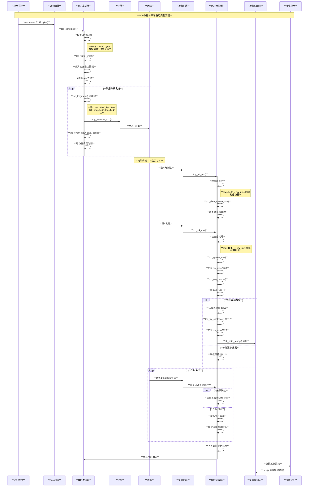
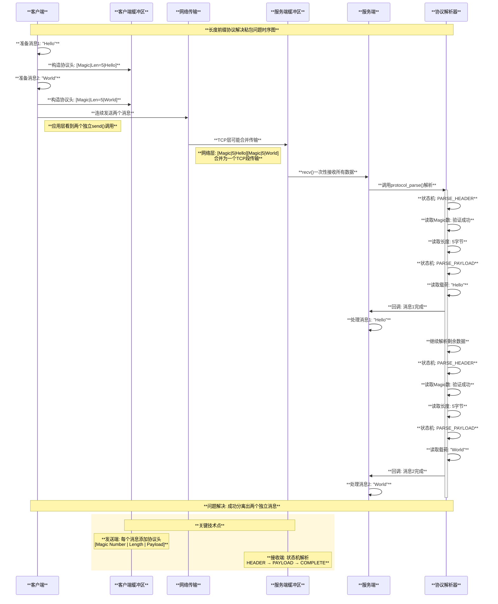
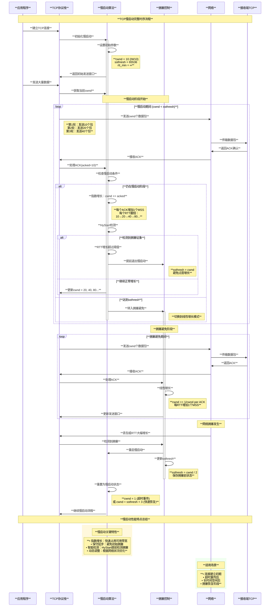
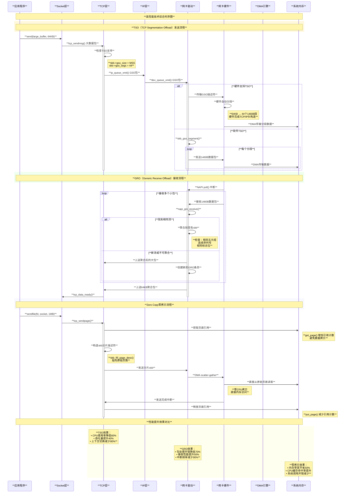

# Linux TCP协议实现原理与算法分析

## 目录

1. [概述](#概述)
2. [TCP协议栈架构](#tcp协议栈架构)
3. [TCP状态机](#tcp状态机)
4. [连接建立与关闭](#连接建立与关闭)
5. [数据传输机制](#数据传输机制)
6. [拥塞控制算法](#拥塞控制算法)
7. [流量控制](#流量控制)
8. [重传与超时](#重传与超时)
9. [TCP选项与扩展](#tcp选项与扩展)
10. [性能优化策略](#性能优化策略)
11. [核心数据结构](#核心数据结构)
12. [优点与局限性](#优点与局限性)
13. [总结](#总结)

## 概述

TCP (Transmission Control Protocol)是Internet协议栈中最重要的传输层协议之一，提供可靠的、面向连接的数据传输服务。Linux内核中的TCP实现是世界上最成熟和高性能的TCP协议栈之一，经过数十年的持续优化和改进。

### 核心设计目标

1. **可靠传输**：通过确认、重传机制确保数据无损传输
2. **流量控制**：防止发送方发送速度超过接收方处理能力
3. **拥塞控制**：避免网络拥塞，确保网络稳定性
4. **连接管理**：提供面向连接的服务，管理连接生命周期
5. **性能优化**：在保证可靠性的前提下最大化吞吐量

### TCP协议特性

- **面向连接**：通信前需要建立连接，通信后需要释放连接
- **全双工通信**：连接的双方可以同时发送和接收数据
- **可靠传输**：使用确认机制、重传机制等保证数据可靠传输
- **流控制**：根据接收方的处理能力调整发送速度
- **拥塞控制**：根据网络状况调整发送速度

## TCP协议栈架构

Linux TCP协议栈采用分层设计，与socket接口、IP层紧密集成。

### 协议栈层次结构

```c
// TCP协议栈架构图
/*
 * Linux TCP协议栈结构:
 * 
 * ┌─────────────────────────────────────┐
 * │           应用层                     │
 * │    Socket API (read/write/send)     │
 * └─────────────┬───────────────────────┘
 *               │ 系统调用接口
 * ┌─────────────▼───────────────────────┐
 * │           Socket层                  │
 * │  struct sock, socket缓冲区管理       │
 * └─────────────┬───────────────────────┘
 *               │
 * ┌─────────────▼───────────────────────┐
 * │           TCP层                     │
 * │  ┌─────────────────────────────────┐ │
 * │  │      连接管理                    │ │
 * │  │   (状态机、三次握手)              │ │
 * │  └─────────────────────────────────┘ │
 * │  ┌─────────────────────────────────┐ │
 * │  │      数据传输                    │ │
 * │  │   (分段、重组、确认)              │ │
 * │  └─────────────────────────────────┘ │
 * │  ┌─────────────────────────────────┐ │
 * │  │      拥塞控制                    │ │
 * │  │   (慢启动、拥塞避免)              │ │
 * │  └─────────────────────────────────┘ │
 * │  ┌─────────────────────────────────┐ │
 * │  │      定时器管理                  │ │
 * │  │   (重传、保活、TIME_WAIT)         │ │
 * │  └─────────────────────────────────┘ │
 * └─────────────┬───────────────────────┘
 *               │
 * ┌─────────────▼───────────────────────┐
 * │           IP层                      │
 * │    路由、分片、IPv4/IPv6             │
 * └─────────────┬───────────────────────┘
 *               │
 * ┌─────────────▼───────────────────────┐
 * │        数据链路层                    │
 * │      以太网、设备驱动                │
 * └─────────────────────────────────────┘
 */

// TCP控制块结构 - include/linux/tcp.h
struct tcp_sock {
    struct inet_connection_sock inet_conn; // 连接套接字
    
    // TCP特有字段
    u16 tcp_header_len;                   // TCP头长度
    u16 gso_segs;                         // GSO段数
    
    // 序列号空间
    u32 segs_in;                          // 接收段数
    u32 data_segs_in;                     // 接收数据段数
    u32 segs_out;                         // 发送段数
    u32 data_segs_out;                    // 发送数据段数
    u64 bytes_received;                   // 接收字节数
    u64 bytes_acked;                      // 确认字节数
    
    // 序列号
    u32 rcv_nxt;                          // 下一个期望接收的序列号
    u32 copied_seq;                       // 已拷贝到用户空间的序列号
    u32 rcv_wup;                          // 窗口更新的序列号
    u32 snd_nxt;                          // 下一个要发送的序列号
    u32 snd_una;                          // 未确认的序列号
    u32 snd_sml;                          // 最后小包的序列号
    u32 rcv_tstamp;                       // 接收时间戳
    u32 lsndtime;                         // 最后发送时间
    
    // 窗口
    u32 snd_wl1;                          // 发送窗口更新的序列号
    u32 snd_wnd;                          // 发送窗口大小
    u32 max_window;                       // 最大窗口大小
    u32 mss_cache;                        // MSS缓存
    
    // 拥塞控制
    u32 snd_ssthresh;                     // 慢启动阈值
    u32 snd_cwnd;                         // 拥塞窗口
    u32 snd_cwnd_cnt;                     // 拥塞窗口计数
    u32 snd_cwnd_clamp;                   // 拥塞窗口上限
    u32 snd_cwnd_used;                    // 已使用拥塞窗口
    u32 snd_cwnd_stamp;                   // 拥塞窗口时间戳
    u32 prior_cwnd;                       // 之前的拥塞窗口
    u32 prr_delivered;                    // PRR已交付
    u32 prr_out;                          // PRR输出
    u32 delivered;                        // 已交付包数
    u32 delivered_ce;                     // 已交付CE包数
    u32 lost;                             // 丢失包数
    u32 app_limited;                      // 应用受限标志
    u64 first_tx_mstamp;                  // 首次发送时间戳
    u64 delivered_mstamp;                 // 交付时间戳
    u32 rate_delivered;                   // 交付率
    u32 rate_interval_us;                 // 交付率间隔
    
    // 重传相关
    u32 retrans_stamp;                    // 重传时间戳
    u32 undo_marker;                      // 撤销标记
    int undo_retrans;                     // 撤销重传计数
    u32 total_retrans;                    // 总重传次数
    u32 bytes_retrans;                    // 重传字节数
    
    // 快重传相关
    u32 fackets_out;                      // 前向确认包数
    u32 high_seq;                         // 进入快恢复时的最高序列号
    u32 retrans_out;                      // 重传包数
    u8 do_early_retrans:1;                // 是否早期重传
    u8 early_retrans_delayed:1;           // 早期重传延迟
    
    // SACK相关
    u8 sacked_out;                        // SACK标记的包数
    u8 fackets_out;                       // 前向确认包数
    struct tcp_sack_block duplicate_sack[1]; // 重复SACK块
    struct tcp_sack_block selective_acks[4]; // 选择性确认块
    
    // RTT估算
    u32 srtt_us;                          // 平滑RTT(微秒)
    u32 mdev_us;                          // RTT均方差(微秒)
    u32 mdev_max_us;                      // RTT最大均方差
    u32 rttvar_us;                        // RTT变化量
    u32 rtt_seq;                          // RTT测量序列号
    struct  minmax rtt_min;               // 最小RTT
    
    // 定时器
    u32 packets_out;                      // 发出未确认的包数
    u32 retrans_out;                      // 重传包数
    u16 advmss;                           // 通告MSS
    u8 unused;                            // 未使用
    u8 nonagle;                           // Nagle算法控制
    u8 thin_lto:1;                        // 瘦流线性超时
    u8 recvmsg_inq:1;                     // 接收消息查询
    u8 repair:1;                          // 修复模式
    u8 frto:1;                            // F-RTO标志
    u8 repair_queue;                      // 修复队列
    u8 syn_data:1;                        // SYN数据
    u8 syn_fastopen:1;                    // SYN快速打开
    u8 syn_fastopen_exp:1;                // SYN快速打开实验
    u8 syn_data_acked:1;                  // SYN数据已确认
    u8 save_syn:1;                        // 保存SYN
    u8 is_cwnd_limited:1;                 // 拥塞窗口受限
    
    // 快速打开
    struct tcp_fastopen_request *fastopen_req; // 快速打开请求
    struct request_sock *fastopen_rsk;    // 快速打开请求套接字
    
    u32 *saved_syn;                       // 保存的SYN
};
```

### TCP处理流程

```c
// TCP数据包接收处理主流程 - net/ipv4/tcp_ipv4.c
int tcp_v4_rcv(struct sk_buff *skb)
{
    struct net *net = dev_net(skb->dev);
    struct tcphdr *th;
    const struct iphdr *iph;
    struct sock *sk;
    int ret;
    u32 isn;

    // 检查TCP头部
    if (skb->pkt_type != PACKET_HOST)
        goto discard_it;

    // 获取TCP头
    th = tcp_hdr(skb);

    if (th->doff < sizeof(struct tcphdr) / 4)
        goto bad_packet;

    if (!pskb_may_pull(skb, th->doff * 4))
        goto discard_it;

    // 计算校验和
    th = tcp_hdr(skb);
    iph = ip_hdr(skb);
    
    TCP_SKB_CB(skb)->seq = ntohl(th->seq);
    TCP_SKB_CB(skb)->end_seq = (TCP_SKB_CB(skb)->seq + th->syn + th->fin +
                               skb->len - th->doff * 4);
    TCP_SKB_CB(skb)->ack_seq = ntohl(th->ack_seq);
    TCP_SKB_CB(skb)->tcp_flags = tcp_flag_byte(th);
    TCP_SKB_CB(skb)->tcp_tw_isn = 0;
    TCP_SKB_CB(skb)->ip_dsfield = ipv4_get_dsfield(iph);
    TCP_SKB_CB(skb)->sacked = 0;
    TCP_SKB_CB(skb)->has_rxtstamp = skb->tstamp ? 1 : 0;

    // 查找对应的socket
lookup:
    sk = __inet_lookup_skb(&tcp_hashinfo, skb, __tcp_hdrlen(th), th->source,
                          th->dest, inet_iif(skb), &refcounted);
    if (!sk)
        goto no_tcp_socket;

process:
    if (sk->sk_state == TCP_TIME_WAIT)
        goto do_time_wait;

    if (sk->sk_state == TCP_NEW_SYN_RECV) {
        struct request_sock *req = inet_reqsk(sk);
        bool req_stolen = false;
        struct sock *nsk;

        sk = req->rsk_listener;
        if (unlikely(tcp_v4_inbound_md5_hash(sk, skb, dif, sdif))) {
            sk_drops_add(sk, skb);
            reqsk_put(req);
            goto discard_it;
        }
        if (tcp_checksum_complete(skb)) {
            reqsk_put(req);
            goto csum_error;
        }
        if (unlikely(sk->sk_state != TCP_LISTEN)) {
            nsk = reuseport_migrate_sock(sk, req_to_sk(req), skb);
            if (!nsk) {
                inet_csk_reqsk_queue_drop_and_put(sk, req);
                goto lookup;
            }
            sk = nsk;
            /* reuseport_migrate_sock() has already held one sk_refcnt
             * before returning.
             */
        } else {
            /* We own a reference on the listener, increase it again
             * as we might lose it too soon.
             */
            sock_hold(sk);
        }
        refcounted = true;
        nsk = NULL;
        if (!tcp_filter(sk, skb)) {
            th = (const struct tcphdr *)skb->data;
            iph = ip_hdr(skb);
            tcp_v4_fill_cb(skb, iph, th);
            nsk = tcp_check_req(sk, skb, req, false, &req_stolen);
        }
        if (!nsk) {
            reqsk_put(req);
            if (req_stolen) {
                /* Another cpu got exclusive access to req
                 * and created a full blown socket.
                 * Try to feed this packet to this socket
                 * instead of discarding it.
                 */
                tcp_v4_restore_cb(skb);
                sock_put(sk);
                goto lookup;
            }
            goto discard_and_relse;
        }
        nf_reset_ct(skb);
        if (nsk == sk) {
            reqsk_put(req);
            tcp_v4_restore_cb(skb);
        } else if (tcp_child_process(sk, nsk, skb)) {
            tcp_v4_send_reset(nsk, skb);
            goto discard_and_relse;
        } else {
            sock_put(sk);
            return 0;
        }
    }

    if (static_branch_unlikely(&ip4_min_ttl) &&
        unlikely(iph->ttl < net->ipv4.sysctl_ip_min_ttl)) {
        __NET_INC_STATS(net, LINUX_MIB_TCPMINTTLDROP);
        goto discard_and_relse;
    }

    if (!xfrm4_policy_check(sk, XFRM_POLICY_IN, skb))
        goto discard_and_relse;

    if (tcp_v4_inbound_md5_hash(sk, skb, dif, sdif))
        goto discard_and_relse;

    nf_reset_ct(skb);

    if (tcp_filter(sk, skb))
        goto discard_and_relse;
    th = (const struct tcphdr *)skb->data;
    iph = ip_hdr(skb);
    tcp_v4_fill_cb(skb, iph, th);

    skb->dev = NULL;

    if (sk->sk_state == TCP_LISTEN) {
        ret = tcp_v4_do_rcv(sk, skb);
        goto put_and_return;
    }

    sk_incoming_cpu_update(sk);

    sock_rps_save_rxhash(sk, skb);

    ret = 0;
    if (!sock_owned_by_user(sk)) {
        skb_to_free = sk->sk_rx_skb_cache;
        sk->sk_rx_skb_cache = NULL;
        ret = tcp_v4_do_rcv(sk, skb);
    } else {
        if (tcp_add_backlog(sk, skb))
            goto discard_and_relse;
        skb_to_free = NULL;
    }

put_and_return:
    if (refcounted)
        sock_put(sk);
    if (skb_to_free)
        __kfree_skb(skb_to_free);

    return ret;

no_tcp_socket:
    if (!xfrm4_policy_check(NULL, XFRM_POLICY_IN, skb))
        goto discard_it;

    tcp_v4_fill_cb(skb, iph, th);

    if (tcp_checksum_complete(skb)) {
csum_error:
        __TCP_INC_STATS(net, TCP_MIB_CSUMERRORS);
bad_packet:
        __TCP_INC_STATS(net, TCP_MIB_INERRS);
    } else {
        tcp_v4_send_reset(NULL, skb);
    }

discard_it:
    /* Discard frame. */
    kfree_skb(skb);
    return 0;

discard_and_relse:
    sk_drops_add(sk, skb);
    if (refcounted)
        sock_put(sk);
    goto discard_it;

do_time_wait:
    if (!xfrm4_policy_check(NULL, XFRM_POLICY_IN, skb)) {
        inet_twsk_put(inet_twsk(sk));
        goto discard_it;
    }

    tcp_v4_fill_cb(skb, iph, th);

    if (tcp_checksum_complete(skb)) {
        inet_twsk_put(inet_twsk(sk));
        goto csum_error;
    }
    switch (tcp_timewait_state_process(inet_twsk(sk), skb, th)) {
    case TCP_TW_SYN: {
        struct sock *sk2 = inet_lookup_listener(dev_net(skb->dev),
                                               &tcp_hashinfo, skb,
                                               __tcp_hdrlen(th),
                                               iph->saddr, th->source,
                                               iph->daddr, th->dest,
                                               inet_iif(skb),
                                               sdif);
        if (sk2) {
            inet_twsk_deschedule_put(inet_twsk(sk));
            sk = sk2;
            tcp_v4_restore_cb(skb);
            refcounted = false;
            goto process;
        }
    }
    /* to ACK */
    fallthrough;
    case TCP_TW_ACK:
        tcp_v4_timewait_ack(sk, skb);
        break;
    case TCP_TW_RST:
        tcp_v4_send_reset(sk, skb);
        inet_twsk_deschedule_put(inet_twsk(sk));
        goto discard_it;
    case TCP_TW_SUCCESS:
        ;
    }
    goto discard_it;
}
```

## TCP状态机

TCP协议使用有限状态机来管理连接的生命周期，包含11个状态和相应的状态转换。

### TCP状态定义

```c
// TCP状态定义 - include/net/tcp_states.h
enum {
    TCP_ESTABLISHED = 1,    // 已建立连接
    TCP_SYN_SENT,          // 已发送SYN，等待对方SYN
    TCP_SYN_RECV,          // 已接收SYN，已发送SYN+ACK
    TCP_FIN_WAIT1,         // 已发送FIN，等待对方ACK
    TCP_FIN_WAIT2,         // 收到对方对FIN的ACK，等待对方FIN
    TCP_TIME_WAIT,         // 已收到对方FIN并发送ACK，等待2MSL
    TCP_CLOSE,             // 连接关闭
    TCP_CLOSE_WAIT,        // 收到对方FIN，已发送ACK，等待本地close
    TCP_LAST_ACK,          // 已发送FIN，等待最后的ACK
    TCP_LISTEN,            // 监听连接请求
    TCP_CLOSING,           // 同时发起关闭
    TCP_NEW_SYN_RECV,      // 新的SYN_RECV状态(快速打开)
    
    TCP_MAX_STATES         // 状态数量上限
};

// TCP状态转换表
static const unsigned char tcp_state_transition[TCP_MAX_STATES][TCP_MAX_STATES] = {
    /* from-to:  ESTABLISHED, SYN_SENT, SYN_RECV, FIN_WAIT1, FIN_WAIT2,
     *           TIME_WAIT,   CLOSE,     CLOSE_WAIT, LAST_ACK, LISTEN,
     *           CLOSING,     NEW_SYN_RECV
     */
    [TCP_ESTABLISHED] = {
        [TCP_ESTABLISHED] = TCP_ESTABLISHED,
        [TCP_FIN_WAIT1]   = TCP_FIN_WAIT1,
        [TCP_CLOSE_WAIT]  = TCP_CLOSE_WAIT,
        [TCP_CLOSE]       = TCP_CLOSE,
    },
    [TCP_SYN_SENT] = {
        [TCP_ESTABLISHED] = TCP_ESTABLISHED,
        [TCP_SYN_RECV]    = TCP_SYN_RECV,
        [TCP_CLOSE]       = TCP_CLOSE,
    },
    [TCP_SYN_RECV] = {
        [TCP_ESTABLISHED] = TCP_ESTABLISHED,
        [TCP_FIN_WAIT1]   = TCP_FIN_WAIT1,
        [TCP_CLOSE]       = TCP_CLOSE,
    },
    [TCP_FIN_WAIT1] = {
        [TCP_FIN_WAIT2]   = TCP_FIN_WAIT2,
        [TCP_TIME_WAIT]   = TCP_TIME_WAIT,
        [TCP_CLOSING]     = TCP_CLOSING,
        [TCP_CLOSE]       = TCP_CLOSE,
    },
    [TCP_FIN_WAIT2] = {
        [TCP_TIME_WAIT]   = TCP_TIME_WAIT,
        [TCP_CLOSE]       = TCP_CLOSE,
    },
    [TCP_CLOSE_WAIT] = {
        [TCP_LAST_ACK]    = TCP_LAST_ACK,
        [TCP_CLOSE]       = TCP_CLOSE,
    },
    [TCP_LAST_ACK] = {
        [TCP_CLOSE]       = TCP_CLOSE,
    },
    [TCP_LISTEN] = {
        [TCP_SYN_RECV]    = TCP_SYN_RECV,
        [TCP_CLOSE]       = TCP_CLOSE,
    },
    [TCP_CLOSING] = {
        [TCP_TIME_WAIT]   = TCP_TIME_WAIT,
        [TCP_CLOSE]       = TCP_CLOSE,
    },
    [TCP_NEW_SYN_RECV] = {
        [TCP_ESTABLISHED] = TCP_ESTABLISHED,
        [TCP_CLOSE]       = TCP_CLOSE,
    },
};

// 状态名称字符串
static const char * const tcp_state_names[] = {
    [TCP_ESTABLISHED]  = "ESTABLISHED",
    [TCP_SYN_SENT]     = "SYN-SENT",
    [TCP_SYN_RECV]     = "SYN-RECV",
    [TCP_FIN_WAIT1]    = "FIN-WAIT-1",
    [TCP_FIN_WAIT2]    = "FIN-WAIT-2", 
    [TCP_TIME_WAIT]    = "TIME-WAIT",
    [TCP_CLOSE]        = "CLOSE",
    [TCP_CLOSE_WAIT]   = "CLOSE-WAIT",
    [TCP_LAST_ACK]     = "LAST-ACK",
    [TCP_LISTEN]       = "LISTEN",
    [TCP_CLOSING]      = "CLOSING",
    [TCP_NEW_SYN_RECV] = "NEW-SYN-RECV",
};
```

### 状态转换逻辑

```c
// TCP状态转换处理 - net/ipv4/tcp_input.c
void tcp_set_state(struct sock *sk, int state)
{
    int oldstate = sk->sk_state;

    // 状态转换跟踪
    trace_tcp_set_state(sk, oldstate, state);

    switch (state) {
    case TCP_ESTABLISHED:
        if (oldstate != TCP_ESTABLISHED)
            TCP_INC_STATS(sock_net(sk), TCP_MIB_CURRESTAB);
        break;

    case TCP_CLOSE:
        if (oldstate == TCP_CLOSE_WAIT || oldstate == TCP_ESTABLISHED)
            TCP_INC_STATS(sock_net(sk), TCP_MIB_ESTABRESETS);

        sk->sk_prot->unhash(sk);
        if (inet_csk(sk)->icsk_bind_hash &&
            !(sk->sk_userlocks & SOCK_BINDPORT_LOCK))
            inet_put_port(sk);
        /* fall through */
    default:
        if (oldstate == TCP_ESTABLISHED)
            TCP_DEC_STATS(sock_net(sk), TCP_MIB_CURRESTAB);
    }

    /* Change state AFTER socket is unhashed to avoid closed
     * socket sitting in hash tables.
     */
    inet_sk_state_store(sk, state);

#ifdef STATE_TRACE
    SOCK_DEBUG(sk, "TCP sk=%p, State %s -> %s\n", sk, 
               tcp_state_name[oldstate], tcp_state_name[state]);
#endif
}

// 接收到SYN包的处理
static int tcp_rcv_synsent_state_process(struct sock *sk, struct sk_buff *skb,
                                        const struct tcphdr *th)
{
    struct inet_connection_sock *icsk = inet_csk(sk);
    struct tcp_sock *tp = tcp_sk(sk);
    struct tcp_fastopen_cookie foc = { .len = -1 };
    int saved_clamp = tp->rx_opt.mss_clamp;
    bool fastopen_fail;

    tcp_parse_options(sock_net(sk), skb, &tp->rx_opt, 0, &foc);

    if (th->ack) {
        /* rfc793:
         * "If the state is SYN-SENT then
         *    first check the ACK bit
         *      If the ACK bit is set
         *        If SEG.ACK =< ISS or SEG.ACK > SND.NXT, send
         *        a reset (unless the RST bit is set, if so drop
         *        the segment and return)"
         */
        if (!after(TCP_SKB_CB(skb)->ack_seq, tp->snd_una) ||
            after(TCP_SKB_CB(skb)->ack_seq, tp->snd_nxt))
            goto reset_and_undo;

        if (tp->rx_opt.saw_tstamp && tp->rx_opt.rcv_tsecr &&
            !between(tp->rx_opt.rcv_tsecr, tp->retrans_stamp,
                     tcp_time_stamp(tp))) {
            NET_INC_STATS(sock_net(sk), LINUX_MIB_PAWSACTIVEREJECTED);
            goto reset_and_undo;
        }

        /* Now ACK is acceptable.
         *
         * "If the RST bit is set
         *    If the ACK was acceptable then signal the user "error:
         *    connection reset", drop the segment, enter CLOSED state,
         *    delete TCB, and return."
         */

        if (th->rst) {
            tcp_reset(sk);
            goto discard;
        }

        /* rfc793:
         *   "fifth, if neither of the SYN or RST bits is set then
         *    drop the segment and return."
         *
         *    See note below!
         *                                        --ANK(990513)
         */
        if (!th->syn)
            goto discard_and_undo;

        /* rfc793:
         *   "If the SYN bit is on ...
         *    are acceptable then ...
         *    (our SYN has been ACKed), change the connection
         *    state to ESTABLISHED..."
         */

        tcp_ecn_rcv_synack(tp, th);

        tcp_init_wl(tp, TCP_SKB_CB(skb)->seq);
        tcp_ack(sk, skb, FLAG_SLOWPATH);

        /* Ok.. it's good. Set up sequence numbers and
         * move to established.
         */
        tp->rcv_nxt = TCP_SKB_CB(skb)->seq + 1;
        tp->rcv_wup = TCP_SKB_CB(skb)->seq + 1;

        /* RFC1323: The window in SYN & SYN/ACK segments is
         * never scaled.
         */
        tp->snd_wnd = ntohs(th->window);

        if (!tp->rx_opt.wscale_ok) {
            tp->rx_opt.snd_wscale = tp->rx_opt.rcv_wscale = 0;
            tp->window_clamp = min(tp->window_clamp, 65535U);
        }

        if (tp->rx_opt.saw_tstamp) {
            tp->rx_opt.tstamp_ok       = 1;
            tp->tcp_header_len =
                sizeof(struct tcphdr) + TCPOLEN_TSTAMP_ALIGNED;
            tp->advmss             -= TCPOLEN_TSTAMP_ALIGNED;
            tcp_store_ts_recent(tp);
        } else {
            tp->tcp_header_len = sizeof(struct tcphdr);
        }

        tcp_sync_mss(sk, icsk->icsk_pmtu_cookie);
        tcp_initialize_rcv_mss(sk);

        /* Remember, tcp_poll() does not lock socket!
         * Change state from SYN-SENT only after copied_seq
         * is initialized. */
        tp->copied_seq = tp->rcv_nxt;

        smp_mb();

        tcp_finish_connect(sk, skb);

        fastopen_fail = (tp->syn_fastopen || tp->syn_data) &&
                       tcp_rcv_fastopen_synack(sk, skb, &foc);

        if (!fastopen_fail) {
            if (sk->sk_write_pending ||
                icsk->icsk_accept_queue.rskq_defer_accept ||
                icsk->icsk_ack.pingpong) {
                /* Save one ACK. Data will be ready after
                 * several ticks, if write_pending is set.
                 *
                 * It may be deleted, but with this feature tcpdumps
                 * look so _wonderfully_ clever, that I was not able
                 * to stand against the temptation 8)     --ANK
                 */
                inet_csk_schedule_ack(sk);
                tcp_enter_quickack_mode(sk, TCP_MAX_QUICKACKS);
                inet_csk_reset_xmit_timer(sk, ICSK_TIME_DACK,
                                         TCP_DELACK_MAX, TCP_RTO_MAX);

discard:
                tcp_drop(sk, skb);
                return 0;
            } else {
                tcp_send_ack(sk);
            }
            return -1;
        }

        /* An initial SYN ACK */
        if (fastopen_fail) {
            tcp_fastopen_undo_data(sk, skb);
            tcp_fastopen_cache_set(sk, tp->rx_opt.mss_clamp, &foc, false);
        }

        if (tcp_is_sack(tp) && sock_net(sk)->ipv4.sysctl_tcp_fack)
            tcp_enable_fack(tp);

        goto discard;
    }

    /* SYNSENT state receives SYN packet without ACK */
    if (th->syn) {
        tcp_ecn_rcv_syn(tp, th);

        tcp_mtup_init(sk);
        tcp_sync_mss(sk, icsk->icsk_pmtu_cookie);
        tcp_initialize_rcv_mss(sk);

        tcp_send_synack(sk);
#if 0
        /* Note, we could accept data and URG from this segment.
         * There are no obstacles to make this (except that we must
         * either change tcp_recvmsg() to prevent it from returning data
         * before 3WHS completes per RFC793, or employ TCP Fast Open).
         *
         * However, if we ignore data in ACKless segments sometimes,
         * we have no reasons to accept it sometimes.
         * Also, seems the code doing it in step6 of tcp_rcv_state_process
         * is not flawless. So, discard packet for sanity.
         * Uncomment this return to process the data.
         */
        return -1;
#else
        goto discard;
#endif
    }
    /* "fifth, if neither of the SYN or RST bits is set then
     * drop the segment and return."
     */

discard_and_undo:
    tcp_clear_options(&tp->rx_opt);
    tp->rx_opt.mss_clamp = saved_clamp;
    goto discard;

reset_and_undo:
    tcp_clear_options(&tp->rx_opt);
    tp->rx_opt.mss_clamp = saved_clamp;
    return 1;
}
```

## 连接建立与关闭

TCP使用三次握手建立连接，四次挥手关闭连接，确保双方都能够正确地建立和释放连接。

### 三次握手过程

```c
// 客户端发起连接 - net/ipv4/tcp_output.c
int tcp_connect(struct sock *sk)
{
    struct tcp_sock *tp = tcp_sk(sk);
    struct sk_buff *buff;
    int err;

    tcp_call_bpf(sk, BPF_SOCK_OPS_TCP_CONNECT_CB, 0, NULL);

    if (inet_csk(sk)->icsk_af_ops->rebuild_header(sk))
        return -EHOSTUNREACH; /* Routing failure or similar. */

    tcp_connect_init(sk);

    if (unlikely(tp->repair)) {
        tcp_finish_connect(sk, NULL);
        return 0;
    }

    buff = tcp_stream_alloc_skb(sk, 0, sk->sk_allocation, true);
    if (unlikely(!buff))
        return -ENOBUFS;

    tcp_init_nondata_skb(buff, tp->write_seq++, TCPHDR_SYN);
    tcp_mstamp_refresh(tp);
    tp->retrans_stamp = tcp_time_stamp(tp);
    tcp_connect_queue_skb(sk, buff);
    tcp_ecn_send_syn(sk, buff);
    tcp_rbtree_insert(&sk->tcp_rtx_queue, buff);

    /* Send off SYN; include data in Fast Open. */
    err = tp->fastopen_req ? tcp_send_syn_data(sk, buff) :
          tcp_transmit_skb(sk, buff, 1, sk->sk_allocation);
    if (err == -ECONNREFUSED)
        return err;

    /* We change tp->snd_nxt after the tcp_transmit_skb() call
     * in order to make this packet get counted in tcpOutSegs.
     */
    tp->snd_nxt = tp->write_seq;
    tp->pushed_seq = tp->write_seq;
    buff = tcp_send_head(sk);
    if (unlikely(buff)) {
        tp->snd_nxt	= TCP_SKB_CB(buff)->seq;
        tp->pushed_seq	= TCP_SKB_CB(buff)->seq;
    }
    TCP_INC_STATS(sock_net(sk), TCP_MIB_ACTIVEOPENS);

    /* Timer for retransmission of the first SYN */
    inet_csk_reset_xmit_timer(sk, ICSK_TIME_RETRANS,
                             inet_csk(sk)->icsk_rto, TCP_RTO_MAX);
    return 0;
}

// 服务器端监听和接受连接 - net/ipv4/tcp_ipv4.c
int tcp_v4_do_rcv(struct sock *sk, struct sk_buff *skb)
{
    struct sock *rsk;

    if (sk->sk_state == TCP_ESTABLISHED) { /* Fast path */
        struct dst_entry *dst = sk->sk_rx_dst;

        sock_rps_save_rxhash(sk, skb);
        sk_mark_napi_id(sk, skb);
        if (dst) {
            if (inet_sk(sk)->rx_dst_ifindex != skb->skb_iif ||
                !dst->ops->check(dst, 0)) {
                dst_release(dst);
                sk->sk_rx_dst = NULL;
            }
        }
        tcp_rcv_established(sk, skb);
        return 0;
    }

    if (tcp_checksum_complete(skb))
        goto csum_err;

    if (sk->sk_state == TCP_LISTEN) {
        struct sock *nsk = tcp_v4_cookie_check(sk, skb);

        if (!nsk)
            goto discard;
        if (nsk != sk) {
            if (tcp_child_process(sk, nsk, skb)) {
                rsk = nsk;
                goto reset;
            }
            return 0;
        }
    } else
        sock_rps_save_rxhash(sk, skb);

    if (tcp_rcv_state_process(sk, skb)) {
        rsk = sk;
        goto reset;
    }
    return 0;

reset:
    tcp_v4_send_reset(rsk, skb);
discard:
    kfree_skb(skb);
    /* Be careful here. If this function gets more complicated and
     * gcc suffers from register pressure on the x86, sk (in %ebx)
     * might be destroyed here. This current version compiles correctly,
     * but you have been warned.
     */
    return 0;

csum_err:
    TCP_INC_STATS(sock_net(sk), TCP_MIB_CSUMERRORS);
    TCP_INC_STATS(sock_net(sk), TCP_MIB_INERRS);
    goto discard;
}

// 处理SYN包，创建连接请求 - net/ipv4/tcp_input.c
struct sock *tcp_check_req(struct sock *sk, struct sk_buff *skb,
                          struct request_sock *req,
                          bool fastopen, bool *req_stolen)
{
    struct tcp_options_received tmp_opt;
    struct sock *child;
    const struct tcphdr *th = tcp_hdr(skb);
    __be32 flg = tcp_flag_word(th) & (TCP_FLAG_RST|TCP_FLAG_SYN|TCP_FLAG_ACK);
    bool paws_reject = false;
    bool own_req;

    tmp_opt.saw_tstamp = 0;
    if (th->doff > (sizeof(struct tcphdr)>>2)) {
        tcp_parse_options(sock_net(sk), skb, &tmp_opt, 0, NULL);

        if (tmp_opt.saw_tstamp) {
            tmp_opt.ts_recent = req->ts_recent;
            if (tmp_opt.rcv_tsecr)
                tmp_opt.rcv_tsecr -= tcp_rsk(req)->ts_off;
            /* We do not store true stamp, but it is not required,
             * it can be estimated (approximately)
             * from another data.
             */
            tmp_opt.ts_recent_stamp = ktime_get_seconds() - ((TCP_TIMEOUT_INIT/HZ)<<tcp_rsk(req)->retrans);
            paws_reject = tcp_paws_reject(&tmp_opt, th->rst);
        }
    }

    /* Check for pure retransmitted SYN. */
    if (TCP_SKB_CB(skb)->seq == tcp_rsk(req)->rcv_isn &&
        flg == TCP_FLAG_SYN &&
        !paws_reject) {
        /*
         * RFC793 draws (Incorrectly! It was fixed in RFC1122)
         * this case on figure 6 and figure 8, but formal
         * protocol description says NOTHING.
         * To be more exact, it says that we should send ACK,
         * because this segment (at least, if it has no data)
         * is out of window.
         *
         *  CONCLUSION: RFC793 (even with RFC1122) DOES NOT
         *  describe SYN-RECV state. All the description
         *  is wrong, we cannot believe to it and should
         *  rely only on common sense and implementation
         *  experience.
         *
         * Enforce "SYN-ACK" according to figure 8, figure 6
         * of RFC793, fixed by RFC1122.
         *
         * Note that even if there is new data in the SYN packet
         * they will be thrown away too.
         *
         * Reset timer after retransmitting SYNACK, similar to
         * the idea of fast retransmit in recovery.
         */
        if (!tcp_oow_rate_limited(sock_net(sk), skb,
                                 LINUX_MIB_TCPSYNCHALLENGE,
                                 &tcp_rsk(req)->last_oow_ack_time) &&

            !inet_rtx_syn_ack(sk, req)) {
            unsigned long expires = jiffies;

            expires += min(TCP_TIMEOUT_INIT << tcp_rsk(req)->retrans,
                          TCP_RTO_MAX);
            if (!fastopen)
                mod_timer_pending(&req->rsk_timer, expires);
            else
                req->rsk_timer.expires = expires;
        }

        return NULL;
    }

    /* Further reproduces section "SEGMENT ARRIVES"
       for state SYN-RECEIVED of RFC793.
       It is broken, however, it does not work only
       when SYNs are crossed.

       You would think that SYN crossing is impossible here, since
       we should have a SYN_SENT socket (from connect()) on our end,
       but this is not true if the crossed SYNs were sent to both
       ends by a malicious third party.  We must defend against this,
       and to do that we first verify the ACK (as per RFC793, page
       36) and reset if it is invalid.  Is this a true full defense?
       To convince ourselves, let us consider a way in which the ACK
       test can still pass in this 'malicious crossed SYNs' case.
       Malicious sender sends identical SYNs (and thus identical sequence
       numbers) to both A and B:

        A: gets SYN, sends SYN-ACK
        B: gets SYN, sends SYN-ACK
        A: gets SYN-ACK, sends ACK
        B: gets SYN-ACK, sends ACK

       By the time the ACK reaches each endpoint, the endpoints consider
       the other endpoint to be 'valid' as per the ACK test. But actually,
       these ACKs are identical and therefore not valid.

       Checking for crossed SYNs properly would require 3WHS termination.

       NOTE: Actually, we could implement a solution using timestamps, 
       since those are the same on packets sent by the same host.  But
       PAWS would still not help here, since PAWS does not help when
       sequence numbers are identical (timestamp mechanism only works
       if the sequence number is in the past).

       Actually, this whole business is a bit more nuanced than I first
       let on.  If we could guarantee that truly malicious double SYNs
       would always have crossed sequence numbers, then we could use the
       PAWS mechanism.  As a general rule, crossed SYNs will have
       identical sequence numbers.  Standard connect() implementations
       almost universally use struct timeval to seed the random number
       generator, so identical SYNs are very likely.  If we detect
       identical SYNs, we could set a flag to check timestamps more
       closely, but this might require a change to the PAWS algorithm.

       Actually, the reason for the crossed SYN case is that the Linux
       implementation of connect() picks a sequence number and then
       immediately sends a SYN.  If two machines do this in tandem, they
       pick the same sequence number (very likely due to the clock-based
       seed), and the result is that we see crossed SYNs with identical
       sequence numbers.

       Note that RFC793 only mentions crossed SYNs when two listen
       sockets are in play.  There's no discussion of the crossed SYNs
       that occur when a connect() is attempted from both ends.

       With crossed SYNs, we should note that the timestamp will NOT
       be the same on both SYNs (barring clock smearing) since sys_call
       time will likely differ, so timestamps might actually be useful
       here.  Of course, the question is whether the time difference
       would be reliably greater than the offset.

       One approach would be to explicitly check for this case when
       processing SYN in SYN_SENT state, and send a challenge ACK
       instead of entering SYN_RECV state.

       Actually, the challenge ACK approach might make sense here,
       since this case by definition means that the 4-tuple is already
       an established connection.
     */

    if (flg == (TCP_FLAG_ACK|TCP_FLAG_SYN)) {
        /* Invalid, unless it is retransmitted SYN/ACK.  */
        if (TCP_SKB_CB(skb)->seq != tcp_rsk(req)->rcv_isn + 1)
            return sk;
    } else if (flg == TCP_FLAG_ACK) {
        /* Invalid ACK */
        if (TCP_SKB_CB(skb)->ack_seq != tcp_rsk(req)->snt_isn + 1)
            return sk;

        /* OK, ACK is valid, create big socket and
         * feed this segment to it. It will repeat all
         * the tests. THIS SEGMENT MUST MOVE SOCKET TO
         * ESTABLISHED STATE. If it will be dropped after
         * socket is created, wait for troubles.
         */
        child = inet_csk(sk)->icsk_af_ops->syn_recv_sock(sk, skb, req, NULL,
                                                        req, &own_req);
        if (!child)
            goto listen_overflow;

        sock_rps_save_rxhash(child, skb);
        tcp_synack_rtt_meas(child, req);
        *req_stolen = !own_req;
        return inet_csk_complete_hashdance(sk, child, req, own_req);
    } else {
        /* Only RST or bare SYN left. */

        if (flg & TCP_FLAG_RST) {
            /* RFC793 page 70: "segment should not be
             * checked for old duplicate SYNs (page 71)
             * nor dropped for old duplicate ACKs (page 73)
             * because they will be RSTs."
             */
            goto embryonic_reset;
        }

        /* ACK bit is clear. If SYN is set, we have no RST. */
        if (!(flg & TCP_FLAG_SYN))
            return sk;

        /* Fragment overlaps with SYN. Duplicate SYN or our out-of-order SYN? */
        if (TCP_SKB_CB(skb)->seq != tcp_rsk(req)->rcv_isn)
            goto syn_challenge;

        /* From tcp_input.c:tcp_rcv_synsent_state_process() */
        TCP_ECN_rcv_syn(sk, th);

        tcp_mtup_init(child);
        tcp_sync_mss(child, tcp_mss_to_mtu(child, tcp_sk(child)->rx_opt.mss_clamp));
        tcp_initialize_rcv_mss(child);

        tcp_send_synack(child);
        /* note that the child socket is not yet in established state */
    }
    return NULL;

listen_overflow:
    if (!net->ipv4.sysctl_tcp_abort_on_overflow) {
        inet_rsk(req)->acked = 1;
        return NULL;
    }

embryonic_reset:
    if (!(flg & TCP_FLAG_RST)) {
        /* Received a bad SYN pkt.  */
        if (flg & TCP_FLAG_ACK)
            tcp_v4_send_synack(sk, NULL, &TCP_SKB_CB(skb)->header.h4.opt,
                              skb, 0, NULL, TCP_FLAG_RST, tcp_rsk(req)->ts_off);
        else
            tcp_v4_send_reset(sk, skb);
    } else if (fastopen) { /* received RST pkt */
        tcp_fastopen_active_disable(sk);
        tcp_fastopen_cache_set(sk, 0, NULL, true, 0);
    }
    return sk;

syn_challenge:
    if (syn_inerr)
        TCP_INC_STATS(sock_net(sk), LINUX_MIB_TCPSYNCHALLENGE);
    return sk;
}
```

## 数据传输机制

### **TCP数据分段和重组机制详解**

TCP数据分段和重组是确保数据可靠传输的核心机制，涉及将应用层数据分割成适合网络传输的TCP段，以及在接收端重新组装：

#### **数据分段实现机制**

```c
// TCP分段核心实现 - net/ipv4/tcp_output.c

/*
 * TCP数据分段的核心原则：
 * 1. MSS限制：每个TCP段不能超过最大段大小（MSS）
 * 2. MTU限制：考虑路径MTU以避免IP分片
 * 3. Nagle算法：合并小包以提高网络效率
 * 4. TSO/GSO：硬件分段卸载优化
 */

// 主要分段函数
static int tcp_write_xmit(struct sock *sk, unsigned int mss_now,
                         int nonagle, int push_one, gfp_t gfp)
{
    struct tcp_sock *tp = tcp_sk(sk);
    struct sk_buff *skb;
    unsigned int tso_segs, sent_pkts;
    int cwnd_quota;
    int result;
    
    // 检查拥塞窗口和发送窗口
    if (!tcp_snd_wnd_test(tp, skb, mss_now))
        return 0;
        
    // 获取发送队列中的数据包
    while ((skb = tcp_send_head(sk))) {
        unsigned int limit;
        
        // 计算TSO段数
        tso_segs = tcp_init_tso_segs(skb, mss_now);
        BUG_ON(!tso_segs);
        
        // 检查拥塞窗口限制
        cwnd_quota = tcp_cwnd_test(tp, skb);
        if (!cwnd_quota) {
            // 拥塞窗口已满，延迟发送
            if (push_one == 2)
                return 0;
            break;
        }
        
        // 检查是否需要分段
        if (skb->len > mss_now) {
            // 执行TSO分段
            if (tcp_tso_should_defer(sk, skb, &is_cwnd_limited, 
                                   max_segs, tcp_max_tso_deferred_mss(tp))) {
                break;
            }
            
            // 限制发送段数
            limit = mss_now;
            if (tso_segs > 1 && !tcp_urg_mode(tp))
                limit = tcp_mss_split_point(sk, skb, mss_now, 
                                          min_t(unsigned int, cwnd_quota, max_segs),
                                          nonagle);
                                          
            if (skb->len > limit &&
                unlikely(tso_fragment(sk, TCP_FRAG_IN_WRITE_QUEUE,
                                    skb, limit, mss_now, gfp)))
                break;
        }
        
        // 发送数据包
        if (unlikely(tcp_transmit_skb(sk, skb, 1, gfp)))
            break;
            
        // 更新发送统计
        tcp_event_new_data_sent(sk, skb);
        sent_pkts += tcp_skb_pcount(skb);
        
        // 移动到下一个包
        tcp_advance_send_head(sk, skb);
        
        if (push_one)
            break;
    }
    
    return sent_pkts;
}

// TSO分片函数
static int tso_fragment(struct sock *sk, enum tcp_queue tcp_queue,
                       struct sk_buff *skb, unsigned int len,
                       unsigned int mss_now, gfp_t gfp)
{
    struct sk_buff *buff;
    int nlen = skb->len - len;
    u8 flags;
    
    // 分配新的skb
    buff = sk_stream_alloc_skb(sk, nlen, gfp, true);
    if (unlikely(!buff))
        return -ENOMEM;
        
    // 复制skb元数据
    sk_wmem_queued_add(sk, buff->truesize);
    sk_mem_charge(sk, buff->truesize);
    buff->truesize += nlen;
    skb->truesize -= nlen;
    
    // 设置TCP标志
    flags = TCP_SKB_CB(skb)->tcp_flags;
    TCP_SKB_CB(skb)->tcp_flags = flags & ~(TCPHDR_FIN | TCPHDR_PSH);
    TCP_SKB_CB(buff)->tcp_flags = flags;
    
    // 设置序列号
    TCP_SKB_CB(buff)->seq = TCP_SKB_CB(skb)->seq + len;
    TCP_SKB_CB(buff)->end_seq = TCP_SKB_CB(skb)->end_seq;
    TCP_SKB_CB(skb)->end_seq = TCP_SKB_CB(buff)->seq;
    
    // 拆分数据
    skb_split(skb, buff, len);
    
    // 插入到发送队列
    tcp_insert_write_queue_after(skb, buff, sk, tcp_queue);
    
    return 0;
}

// MSS计算函数
unsigned int tcp_current_mss(struct sock *sk)
{
    const struct tcp_sock *tp = tcp_sk(sk);
    const struct dst_entry *dst = __sk_dst_get(sk);
    u32 mss_now;
    unsigned int header_len;
    struct tcp_out_options opts;
    struct tcp_md5sig_key *md5;
    
    // 获取基本MSS
    mss_now = tp->mss_cache;
    
    if (dst) {
        u32 mtu = dst_mtu(dst);
        
        // 考虑路径MTU
        if (mtu != inet_csk(sk)->icsk_pmtu_cookie)
            mss_now = tcp_sync_mss(sk, mtu);
    }
    
    // 计算TCP选项长度
    header_len = tcp_established_options(sk, NULL, &opts, &md5) +
                sizeof(struct tcphdr);
                
    // 调整MSS以适应选项
    if (header_len != tp->tcp_header_len) {
        int delta = (int)header_len - tp->tcp_header_len;
        mss_now -= delta;
        tp->tcp_header_len = header_len;
    }
    
    return mss_now;
}

// Nagle算法实现
static inline bool tcp_nagle_check(bool partial, const struct tcp_sock *tp,
                                 int nonagle)
{
    return partial &&
           ((nonagle & TCP_NAGLE_CORK) ||
            (!nonagle && tp->packets_out && tcp_minshall_check(tp)));
}

// 小包合并检查
static inline bool tcp_minshall_check(const struct tcp_sock *tp)
{
    return after(tp->snd_sml, tp->snd_una) &&
           !after(tp->snd_sml, tp->snd_nxt);
}
```

#### **数据重组实现机制**

```c
// TCP数据重组核心实现 - net/ipv4/tcp_input.c

/*
 * TCP数据重组的关键点：
 * 1. 乱序数据缓存：使用红黑树管理乱序段
 * 2. 序列号检查：确保数据按正确顺序重组
 * 3. 重复数据处理：检测和丢弃重复段
 * 4. 内存管理：防止乱序数据消耗过多内存
 */

// 主要接收处理函数
static int tcp_data_queue(struct sock *sk, struct sk_buff *skb)
{
    struct tcp_sock *tp = tcp_sk(sk);
    bool fragstolen = false;
    int eaten;
    
    // 检查序列号
    if (TCP_SKB_CB(skb)->seq == tp->rcv_nxt) {
        // 数据按序到达
        __skb_pull(skb, tcp_hdr(skb)->doff * 4);
        eaten = tcp_queue_rcv(sk, skb, tcp_hdr(skb)->doff * 4, &fragstolen);
        tp->rcv_nxt = TCP_SKB_CB(skb)->end_seq;
        
        // 检查是否有乱序数据可以组装
        tcp_data_snd_check(sk);
        tcp_ack_snd_check(sk);
        
        if (!fragstolen) {
            // 上送数据到用户空间
            sk->sk_data_ready(sk);
        }
        
        return eaten;
    }
    
    // 处理乱序数据
    if (TCP_SKB_CB(skb)->seq < tp->rcv_nxt) {
        // 重复或过期数据
        tcp_data_queue_ofo(sk, skb);
        return 0;
    }
    
    // 缓存乱序数据
    tcp_data_queue_ofo(sk, skb);
    return 0;
}

// 乱序数据处理
static void tcp_data_queue_ofo(struct sock *sk, struct sk_buff *skb)
{
    struct tcp_sock *tp = tcp_sk(sk);
    struct rb_node **p, *parent;
    struct sk_buff *skb1;
    u32 seq, end_seq;
    bool fragstolen;
    
    seq = TCP_SKB_CB(skb)->seq;
    end_seq = TCP_SKB_CB(skb)->end_seq;
    
    // 检查是否为重复数据
    if (seq == tp->rcv_nxt) {
        // 转为按序处理
        tcp_data_queue(sk, skb);
        return;
    }
    
    // 在乱序队列中查找插入位置
    p = &tp->out_of_order_queue.rb_node;
    if (RB_EMPTY_ROOT(&tp->out_of_order_queue)) {
        // 第一个乱序段
        rb_link_node(&skb->rbnode, NULL, p);
        rb_insert_color(&skb->rbnode, &tp->out_of_order_queue);
        tp->ooo_last_skb = skb;
        goto end;
    }
    
    // 查找正确的插入位置
    parent = NULL;
    while (*p) {
        parent = *p;
        skb1 = rb_to_skb(parent);
        
        if (before(seq, TCP_SKB_CB(skb1)->seq)) {
            p = &parent->rb_left;
        } else if (after(seq, TCP_SKB_CB(skb1)->seq)) {
            p = &parent->rb_right;
        } else {
            // 重复数据，丢弃
            tcp_drop(sk, skb);
            return;
        }
    }
    
    // 插入到红黑树
    rb_link_node(&skb->rbnode, parent, p);
    rb_insert_color(&skb->rbnode, &tp->out_of_order_queue);
    
end:
    // 尝试组装连续数据
    tcp_ofo_queue(sk);
}

// 乱序队列数据组装
static void tcp_ofo_queue(struct sock *sk)
{
    struct tcp_sock *tp = tcp_sk(sk);
    __u32 dsack_high = tp->rcv_nxt;
    bool fin, fragstolen, eaten;
    struct sk_buff *skb, *tail;
    struct rb_node *p;
    
    p = rb_first(&tp->out_of_order_queue);
    while (p) {
        skb = rb_to_skb(p);
        if (after(TCP_SKB_CB(skb)->seq, tp->rcv_nxt))
            break;
            
        if (before(TCP_SKB_CB(skb)->seq, dsack_high)) {
            __u32 dsack = dsack_high;
            dsack_high = TCP_SKB_CB(skb)->end_seq;
            tcp_dsack_extend(sk, TCP_SKB_CB(skb)->seq, dsack);
        }
        
        p = rb_next(p);
        rb_erase(&skb->rbnode, &tp->out_of_order_queue);
        
        if (unlikely(!after(TCP_SKB_CB(skb)->end_seq, tp->rcv_nxt))) {
            // 完全重复的数据
            tcp_drop(sk, skb);
            continue;
        }
        
        // 处理部分重叠
        __skb_pull(skb, tp->rcv_nxt - TCP_SKB_CB(skb)->seq);
        TCP_SKB_CB(skb)->seq = tp->rcv_nxt;
        
        // 组装到接收队列
        tail = skb_peek_tail(&sk->sk_receive_queue);
        eaten = tail && tcp_try_coalesce(sk, tail, skb, &fragstolen);
        tcp_rcv_nxt_update(tp, TCP_SKB_CB(skb)->end_seq);
        
        fin = TCP_SKB_CB(skb)->tcp_flags & TCPHDR_FIN;
        if (!eaten)
            __skb_queue_tail(&sk->sk_receive_queue, skb);
        else
            kfree_skb_partial(skb, fragstolen);
            
        if (fin)
            tcp_fin(sk);
    }
}

// 接收窗口管理
static void tcp_rcv_nxt_update(struct tcp_sock *tp, u32 seq)
{
    u32 delta = seq - tp->rcv_nxt;
    
    // 更新接收序列号
    tp->rcv_nxt = seq;
    
    // 更新接收窗口
    tp->bytes_received += delta;
    
    // 触发ACK发送
    if (delta > 0) {
        tp->ack.pending |= ICSK_ACK_NOW;
    }
}

// 数据合并优化
static bool tcp_try_coalesce(struct sock *sk,
                            struct sk_buff *to,
                            struct sk_buff *from,
                            bool *fragstolen)
{
    int delta;
    
    *fragstolen = false;
    
    // 检查是否可以合并
    if (TCP_SKB_CB(to)->end_seq != TCP_SKB_CB(from)->seq)
        return false;
        
    delta = from->truesize;
    if (unlikely(skb_try_coalesce(to, from, fragstolen, &delta))) {
        TCP_SKB_CB(to)->end_seq = TCP_SKB_CB(from)->end_seq;
        TCP_SKB_CB(to)->ack_seq = TCP_SKB_CB(from)->ack_seq;
        TCP_SKB_CB(to)->tcp_flags |= TCP_SKB_CB(from)->tcp_flags;
        
        if (TCP_SKB_CB(from)->has_rxtstamp) {
            TCP_SKB_CB(to)->has_rxtstamp = true;
            to->tstamp = from->tstamp;
        }
        
        return true;
    }
    
    return false;
}
```

#### **数据分段重组时序图**



#### **数据分段重组的关键优化**

```c
// 性能优化技术

// 1. GRO (Generic Receive Offload) 接收端聚合
struct napi_gro_cb {
    int data_offset;                    // 数据偏移量
    u16 frag0_len;                     // 第一个分片长度
    u16 gro_remcsum_start;             // 重计算校验和起始
    
    // GRO聚合标志
    u8 same_flow:1;                    // 同一流
    u8 encap_mark:1;                   // 封装标记
    u8 csum_valid:1;                   // 校验和有效
    u8 csum_cnt:3;                     // 校验和计数
    u8 free:2;                         // 释放标记
};

// GRO数据包聚合
struct sk_buff *tcp4_gro_receive(struct list_head *head, struct sk_buff *skb)
{
    const struct iphdr *iph;
    const struct tcphdr *th;
    struct sk_buff *pp = NULL;
    struct sk_buff *p;
    unsigned int len;
    unsigned int thlen;
    __be32 flags;
    
    if (!pskb_may_pull(skb, sizeof(*th)))
        goto out;
        
    th = tcp_hdr(skb);
    thlen = th->doff * 4;
    if (thlen < sizeof(*th))
        goto out;
        
    if (!pskb_may_pull(skb, thlen))
        goto out;
        
    iph = ip_hdr(skb);
    th = tcp_hdr(skb);
    
    // 查找可以合并的流
    list_for_each_entry(p, head, list) {
        if (!NAPI_GRO_CB(p)->same_flow)
            continue;
            
        // 检查IP和TCP头匹配
        if (*(u32 *)&th->source != *(u32 *)&tcp_hdr(p)->source ||
            memcmp(&iph->saddr, &ip_hdr(p)->saddr, sizeof(iph->saddr)))
            continue;
            
        // 找到匹配的流
        pp = p;
        break;
    }
    
    // 执行TCP层聚合
    skb = tcp_gro_receive(head, skb);
    
out:
    return pp;
}

// 2. TSO (TCP Segmentation Offload) 发送端分段卸载
static netdev_tx_t tso_send_packet(struct sk_buff *skb, struct net_device *dev)
{
    if (skb_is_gso(skb)) {
        // 硬件支持TSO
        if (skb_gso_validate_network_len(skb, dev->mtu)) {
            // 直接发送给硬件分段
            return dev_hard_start_xmit(skb, dev, NULL, NULL);
        } else {
            // 软件分段
            return tcp_tso_segment(skb, dev->features);
        }
    }
    
    // 普通数据包发送
    return dev_hard_start_xmit(skb, dev, NULL, NULL);
}

// 3. 零拷贝优化
static int tcp_sendpage_locked(struct sock *sk, struct page *page, int offset,
                              size_t size, int flags)
{
    struct tcp_sock *tp = tcp_sk(sk);
    struct sk_buff *skb;
    int mss_now;
    int psize;
    bool can_coalesce;
    
    if (!(sk->sk_route_caps & NETIF_F_SG))
        return sock_no_sendpage_locked(sk, page, offset, size, flags);
        
    mss_now = tcp_send_mss(sk, &size, flags);
    
    // 检查是否可以合并到现有skb
    skb = tcp_write_queue_tail(sk);
    if (skb) {
        can_coalesce = skb_can_coalesce(skb, skb_shinfo(skb)->nr_frags,
                                       page, offset);
        if (can_coalesce && skb_shinfo(skb)->nr_frags < MAX_SKB_FRAGS) {
            // 零拷贝合并
            skb_fill_page_desc(skb, skb_shinfo(skb)->nr_frags, page,
                              offset, psize);
            skb->len += psize;
            skb->data_len += psize;
            skb->truesize += psize;
            sk_wmem_queued_add(sk, psize);
            sk_mem_charge(sk, psize);
            return psize;
        }
    }
    
    // 创建新的零拷贝skb
    skb = sk_stream_alloc_skb(sk, 0, sk->sk_allocation, true);
    if (!skb)
        return -ENOMEM;
        
    skb_fill_page_desc(skb, 0, page, offset, psize);
    skb->len = psize;
    skb->data_len = psize;
    skb->ip_summed = CHECKSUM_PARTIAL;
    
    tcp_push(sk, flags, mss_now, TCP_NAGLE_PUSH, size_goal);
    
    return psize;
}
```

## 数据传输机制

TCP通过可靠的数据传输机制确保数据的完整性和顺序性。

### TCP粘包问题深度分析

TCP粘包（Packet Sticking）是基于流协议的网络编程中常见的问题，本质上是应用层对数据边界处理的问题。

#### **粘包问题现象**

```c
// 粘包现象示例

// 发送端代码示例
void sender_example() {
    int sockfd = socket(AF_INET, SOCK_STREAM, 0);
    
    // 情况1：连续发送多个小包
    send(sockfd, "Hello", 5, 0);
    send(sockfd, "World", 5, 0);
    send(sockfd, "TCP", 3, 0);
    
    // 期望：接收端接收到三个独立的数据包
    // 实际：可能合并成 "HelloWorldTCP" 一个包
}

void receiver_problem_example() {
    char buffer[1024];
    int bytes_received;
    
    // 问题现象：一次recv可能接收到多个逻辑包的数据
    bytes_received = recv(sockfd, buffer, sizeof(buffer), 0);
    // buffer 可能包含: "HelloWorldTCP" (13字节)
    // 而不是期望的 "Hello" (5字节)
}

// 情况2：大包被拆分
void large_packet_split_example() {
    char large_data[8192];
    memset(large_data, 'A', sizeof(large_data));
    
    // 发送一个大包
    send(sockfd, large_data, sizeof(large_data), 0);
    
    // 接收端可能需要多次recv才能获取完整数据
    char buffer[1024];
    int total_received = 0;
    
    while (total_received < sizeof(large_data)) {
        int bytes = recv(sockfd, buffer, sizeof(buffer), 0);
        if (bytes <= 0) break;
        total_received += bytes;
        // 每次recv只能获取部分数据
    }
}
```

#### **粘包问题判断方法**

```c
// 粘包检测机制实现

// 1. 基于长度前缀的协议设计
struct message_header {
    uint32_t magic;        // 魔数：0x12345678
    uint32_t length;       // 消息长度（不包括头部）
    uint32_t sequence;     // 序列号
    uint32_t checksum;     // 校验和
};

#define MAGIC_NUMBER 0x12345678
#define HEADER_SIZE sizeof(struct message_header)

// 粘包检测函数
typedef enum {
    PACKET_INCOMPLETE,     // 数据不完整
    PACKET_COMPLETE,       // 完整数据包
    PACKET_MULTIPLE,       // 包含多个数据包
    PACKET_CORRUPTED       // 数据损坏
} packet_status_t;

packet_status_t detect_packet_boundary(const char *buffer, size_t buffer_len, 
                                       size_t *packet_len) {
    if (buffer_len < HEADER_SIZE) {
        return PACKET_INCOMPLETE;
    }
    
    struct message_header *header = (struct message_header *)buffer;
    
    // 检查魔数
    if (ntohl(header->magic) != MAGIC_NUMBER) {
        return PACKET_CORRUPTED;
    }
    
    uint32_t payload_len = ntohl(header->length);
    uint32_t total_len = HEADER_SIZE + payload_len;
    
    *packet_len = total_len;
    
    if (buffer_len < total_len) {
        return PACKET_INCOMPLETE;  // 数据包不完整
    } else if (buffer_len == total_len) {
        return PACKET_COMPLETE;    // 完整的单个数据包
    } else {
        return PACKET_MULTIPLE;    // 缓冲区包含多个数据包
    }
}

// 2. 基于分隔符的协议检测
int find_delimiter_packets(const char *buffer, size_t buffer_len, 
                          const char *delimiter, size_t delim_len,
                          size_t *packet_positions, int max_packets) {
    int packet_count = 0;
    const char *search_pos = buffer;
    size_t remaining = buffer_len;
    
    while (remaining >= delim_len && packet_count < max_packets) {
        const char *delim_pos = memmem(search_pos, remaining, delimiter, delim_len);
        if (delim_pos == NULL) {
            break;  // 没有找到完整的数据包
        }
        
        // 记录数据包边界
        packet_positions[packet_count] = delim_pos - buffer + delim_len;
        packet_count++;
        
        // 移动搜索位置
        size_t processed = delim_pos - search_pos + delim_len;
        search_pos = delim_pos + delim_len;
        remaining -= processed;
    }
    
    return packet_count;
}
```

#### **粘包问题的根本原因（源码分析）**

```c
// TCP粘包产生的内核层面原因分析

// 1. TCP发送缓冲区聚合 - net/ipv4/tcp_output.c
static bool tcp_small_queue_check(struct sock *sk, const struct sk_buff *skb,
                                 unsigned int factor)
{
    unsigned long limit;
    
    limit = max_t(unsigned long,
                  2 * skb->truesize,
                  sk->sk_pacing_rate >> TCP_SMALL_QUEUE_SHIFT);
    
    if (sk->sk_pacing_rate != ~0UL)
        limit = min_t(unsigned long, limit,
                      sock_net(sk)->ipv4.sysctl_tcp_limit_output_bytes);
    
    limit <<= factor;
    
    // 小包聚合决策
    if (refcount_read(&sk->sk_wmem_alloc) > limit) {
        /* 缓冲区使用量超过限制，强制发送 */
        set_bit(TSQ_THROTTLED, &sk->sk_tsq_flags);
        smp_mb__after_atomic();
        if (refcount_read(&sk->sk_wmem_alloc) > limit)
            return true;
    }
    return false;
}

// Nagle算法的实现会导致小包合并
static inline bool tcp_nagle_push(const struct tcp_sock *tp, const struct sk_buff *skb)
{
    return skb->len < tp->mss_cache &&
           ((nonagle & TCP_NAGLE_CORK) ||
            (!nonagle && tp->packets_out && tcp_minshall_check(tp)));
}

// 2. TCP接收缓冲区的数据合并 - net/ipv4/tcp_input.c
static void tcp_data_queue(struct sock *sk, struct sk_buff *skb)
{
    struct tcp_sock *tp = tcp_sk(sk);
    bool fragstolen;
    int eaten;
    
    // 检查是否可以与接收队列中的数据合并
    if (tcp_try_rmem_schedule(sk, skb, skb->truesize)) {
        /* 内存分配失败，丢弃数据包 */
        __kfree_skb(skb);
        return;
    }
    
    skb_dst_drop(skb);
    __skb_pull(skb, tcp_hdr(skb)->doff * 4);
    
    // 尝试数据合并优化
    eaten = tcp_queue_rcv(sk, skb, tcp_hdr(skb)->doff * 4, &fragstolen);
    
    if (eaten) {
        /* 数据被合并到现有缓冲区 */
        kfree_skb_partial(skb, fragstolen);
        skb = NULL;
    } else {
        /* 数据作为独立skb排队 */
        sk->sk_data_ready(sk);
    }
}

// 3. 套接字读写缓冲区机制
// 应用层read/recv系统调用的实现
static int tcp_recvmsg_locked(struct sock *sk, struct msghdr *msg, size_t len,
                             int flags, struct scm_timestamping_internal *tss,
                             int *cmsg_flags)
{
    struct tcp_sock *tp = tcp_sk(sk);
    int copied = 0;
    u32 peek_seq;
    u32 *seq;
    unsigned long used;
    
    // 从接收队列中复制数据到用户空间
    do {
        struct sk_buff *skb;
        u32 offset;
        
        skb_queue_walk(&sk->sk_receive_queue, skb) {
            u32 start = TCP_SKB_CB(skb)->seq;
            u32 end = TCP_SKB_CB(skb)->end_seq;
            
            // 计算可复制的数据量
            int chunk = min_t(unsigned int, len - copied, 
                              min(end - start, skb->len));
            
            // 复制数据到用户缓冲区
            if (skb_copy_datagram_msg(skb, offset, msg, chunk)) {
                if (!copied)
                    copied = -EFAULT;
                break;
            }
            
            copied += chunk;
            
            // 如果用户缓冲区已满或指定了MSG_PEEK标志
            if (copied >= len || (flags & MSG_PEEK))
                goto found_ok_skb;
        }
        
    } while (len > copied);
    
found_ok_skb:
    // 清理已读取的数据
    tcp_cleanup_rbuf(sk, copied);
    return copied;
}
```

#### **粘包问题的核心技术原理**

```c
// TCP流协议的特性导致粘包问题

// 1. TCP缓冲区管理机制
struct tcp_sock {
    // 发送缓冲区
    struct sk_buff_head    write_queue;    // 待发送数据队列
    u32                    snd_wl1;        // 上次窗口更新序列号
    u32                    snd_wnd;        // 发送窗口大小
    u32                    max_window;     // 最大窗口大小
    u32                    mss_cache;      // 缓存的MSS值
    
    // 接收缓冲区
    u32                    rcv_nxt;        // 下个期望接收序列号
    u32                    copied_seq;     // 应用层已读取序列号
    u32                    rcv_wnd;        // 接收窗口大小
    
    // Nagle算法控制
    u8                     nonagle;        // Nagle算法控制标志
    u8                     thin_lto:1;     // 精简LTO
    u8                     thin_dupack:1;  // 精简重复ACK
};

// 2. 缓冲区数据聚合的触发条件
static inline bool tcp_should_autocork(struct sock *sk, struct sk_buff *skb,
                                       int size_goal)
{
    return skb->len < size_goal &&
           sock_net(sk)->ipv4.sysctl_tcp_autocorking &&
           !tcp_rtx_queue_empty(sk) &&
           refcount_read(&sk->sk_wmem_alloc) > skb->truesize &&
           tcp_send_head(sk);
}

// 自动软木塞算法（TCP_CORK的自动版本）
static void tcp_push(struct sock *sk, int flags, int mss_now,
                     int nonagle, int size_goal)
{
    struct tcp_sock *tp = tcp_sk(sk);
    struct sk_buff *skb;
    
    if (!tcp_send_head(sk))
        return;
        
    skb = tcp_send_head(sk);
    if (!(flags & MSG_MORE) || forced_push(tp))
        tcp_mark_push(tp, skb);
        
    tcp_mark_urg(tp, flags);
    
    // 强制发送条件判断
    if (tcp_should_autocork(sk, skb, size_goal) && !tcp_rtx_queue_empty(sk)) {
        /* 延迟发送以等待更多数据 */
        NET_INC_STATS(sock_net(sk), LINUX_MIB_TCPAUTOCORKING);
        return;
    }
    
    // 执行实际发送
    __tcp_push_pending_frames(sk, mss_now, nonagle);
}
```

#### **粘包问题检测的实用工具函数**

```c
// 实用的粘包检测和处理工具

// 1. 循环缓冲区实现
typedef struct {
    char *buffer;
    size_t size;
    size_t head;        // 写入位置
    size_t tail;        // 读取位置
    size_t count;       // 当前数据量
    pthread_mutex_t mutex;
} circular_buffer_t;

int circular_buffer_write(circular_buffer_t *cb, const char *data, size_t len) {
    pthread_mutex_lock(&cb->mutex);
    
    if (cb->count + len > cb->size) {
        pthread_mutex_unlock(&cb->mutex);
        return -1;  // 缓冲区空间不足
    }
    
    // 处理环形写入
    size_t space_to_end = cb->size - cb->head;
    if (len <= space_to_end) {
        memcpy(cb->buffer + cb->head, data, len);
        cb->head = (cb->head + len) % cb->size;
    } else {
        memcpy(cb->buffer + cb->head, data, space_to_end);
        memcpy(cb->buffer, data + space_to_end, len - space_to_end);
        cb->head = len - space_to_end;
    }
    
    cb->count += len;
    pthread_mutex_unlock(&cb->mutex);
    return 0;
}

// 2. 协议解析状态机
typedef enum {
    PARSE_HEADER,       // 解析头部
    PARSE_PAYLOAD,      // 解析载荷
    PARSE_COMPLETE      // 解析完成
} parse_state_t;

typedef struct {
    parse_state_t state;
    struct message_header header;
    char *payload_buffer;
    size_t bytes_received;
    size_t bytes_expected;
} protocol_parser_t;

int parse_tcp_stream(protocol_parser_t *parser, const char *data, size_t len,
                     void (*packet_callback)(const char *packet, size_t packet_len)) {
    size_t processed = 0;
    
    while (processed < len) {
        switch (parser->state) {
            case PARSE_HEADER:
                {
                    size_t header_need = HEADER_SIZE - parser->bytes_received;
                    size_t copy_len = min(header_need, len - processed);
                    
                    memcpy((char *)&parser->header + parser->bytes_received,
                           data + processed, copy_len);
                    
                    parser->bytes_received += copy_len;
                    processed += copy_len;
                    
                    if (parser->bytes_received >= HEADER_SIZE) {
                        // 头部接收完成，验证并准备接收载荷
                        if (ntohl(parser->header.magic) != MAGIC_NUMBER) {
                            return -1;  // 协议错误
                        }
                        
                        parser->bytes_expected = ntohl(parser->header.length);
                        if (parser->bytes_expected > 0) {
                            parser->payload_buffer = malloc(parser->bytes_expected);
                            if (!parser->payload_buffer) {
                                return -1;  // 内存不足
                            }
                            parser->state = PARSE_PAYLOAD;
                            parser->bytes_received = 0;
                        } else {
                            // 空载荷包
                            packet_callback((const char *)&parser->header, HEADER_SIZE);
                            parser->state = PARSE_HEADER;
                            parser->bytes_received = 0;
                        }
                    }
                }
                break;
                
            case PARSE_PAYLOAD:
                {
                    size_t payload_need = parser->bytes_expected - parser->bytes_received;
                    size_t copy_len = min(payload_need, len - processed);
                    
                    memcpy(parser->payload_buffer + parser->bytes_received,
                           data + processed, copy_len);
                    
                    parser->bytes_received += copy_len;
                    processed += copy_len;
                    
                    if (parser->bytes_received >= parser->bytes_expected) {
                        // 载荷接收完成
                        size_t total_packet_len = HEADER_SIZE + parser->bytes_expected;
                        char *complete_packet = malloc(total_packet_len);
                        
                        memcpy(complete_packet, &parser->header, HEADER_SIZE);
                        memcpy(complete_packet + HEADER_SIZE, parser->payload_buffer,
                               parser->bytes_expected);
                        
                        packet_callback(complete_packet, total_packet_len);
                        
                        free(complete_packet);
                        free(parser->payload_buffer);
                        parser->payload_buffer = NULL;
                        
                        // 重置解析器状态
                        parser->state = PARSE_HEADER;
                        parser->bytes_received = 0;
                        parser->bytes_expected = 0;
                    }
                }
                break;
                
            default:
                return -1;  // 无效状态
        }
    }
    
    return 0;
}
```

#### **TCP粘包问题解决方案**

```c
// TCP粘包问题的系统性解决方案

// 1. 长度前缀协议实现
typedef struct {
    uint32_t magic;           // 协议魔数
    uint32_t version;         // 协议版本
    uint32_t message_type;    // 消息类型
    uint32_t payload_length;  // 载荷长度
    uint32_t sequence_number; // 序列号
    uint32_t timestamp;       // 时间戳
    uint32_t checksum;        // CRC32校验和
    uint32_t reserved;        // 保留字段
} protocol_header_t;

#define PROTOCOL_MAGIC     0xABCD1234
#define PROTOCOL_VERSION   0x00010000
#define PROTOCOL_HEADER_SIZE sizeof(protocol_header_t)

// 发送端实现
int send_message_with_header(int sockfd, uint32_t msg_type, 
                            const void *data, size_t data_len) {
    protocol_header_t header;
    size_t total_len = PROTOCOL_HEADER_SIZE + data_len;
    char *packet = malloc(total_len);
    
    if (!packet) return -1;
    
    // 填充协议头
    header.magic = htonl(PROTOCOL_MAGIC);
    header.version = htonl(PROTOCOL_VERSION);
    header.message_type = htonl(msg_type);
    header.payload_length = htonl(data_len);
    header.sequence_number = htonl(get_next_sequence());
    header.timestamp = htonl(time(NULL));
    header.reserved = 0;
    
    // 计算校验和（包括头部和载荷）
    memcpy(packet, &header, PROTOCOL_HEADER_SIZE);
    memcpy(packet + PROTOCOL_HEADER_SIZE, data, data_len);
    header.checksum = htonl(calculate_crc32(packet, total_len));
    memcpy(packet, &header, PROTOCOL_HEADER_SIZE); // 更新校验和
    
    // 发送完整数据包
    ssize_t sent = 0;
    while (sent < total_len) {
        ssize_t result = send(sockfd, packet + sent, total_len - sent, 0);
        if (result <= 0) {
            free(packet);
            return -1;
        }
        sent += result;
    }
    
    free(packet);
    return 0;
}

// 接收端状态机实现
typedef struct {
    protocol_header_t header;
    char *payload_buffer;
    size_t bytes_received;
    size_t bytes_expected;
    enum {
        STATE_HEADER,
        STATE_PAYLOAD,
        STATE_COMPLETE
    } state;
    uint32_t last_sequence;
    time_t last_activity;
} message_parser_t;

int receive_complete_message(int sockfd, message_parser_t *parser,
                            void (*message_handler)(uint32_t type, const void *data, size_t len)) {
    char temp_buffer[4096];
    ssize_t bytes_read = recv(sockfd, temp_buffer, sizeof(temp_buffer), 0);
    
    if (bytes_read <= 0) return bytes_read;
    
    size_t processed = 0;
    parser->last_activity = time(NULL);
    
    while (processed < bytes_read) {
        switch (parser->state) {
            case STATE_HEADER: {
                size_t header_remaining = PROTOCOL_HEADER_SIZE - parser->bytes_received;
                size_t copy_size = min(header_remaining, bytes_read - processed);
                
                memcpy((char*)&parser->header + parser->bytes_received,
                       temp_buffer + processed, copy_size);
                parser->bytes_received += copy_size;
                processed += copy_size;
                
                if (parser->bytes_received >= PROTOCOL_HEADER_SIZE) {
                    // 头部接收完成，验证
                    if (ntohl(parser->header.magic) != PROTOCOL_MAGIC ||
                        ntohl(parser->header.version) != PROTOCOL_VERSION) {
                        // 协议错误，重置状态
                        parser->state = STATE_HEADER;
                        parser->bytes_received = 0;
                        continue;
                    }
                    
                    parser->bytes_expected = ntohl(parser->header.payload_length);
                    
                    // 防止恶意大包攻击
                    if (parser->bytes_expected > MAX_MESSAGE_SIZE) {
                        parser->state = STATE_HEADER;
                        parser->bytes_received = 0;
                        continue;
                    }
                    
                    if (parser->bytes_expected > 0) {
                        parser->payload_buffer = malloc(parser->bytes_expected);
                        if (!parser->payload_buffer) {
                            parser->state = STATE_HEADER;
                            parser->bytes_received = 0;
                            continue;
                        }
                        parser->state = STATE_PAYLOAD;
                        parser->bytes_received = 0;
                    } else {
                        // 空载荷消息
                        message_handler(ntohl(parser->header.message_type), NULL, 0);
                        parser->state = STATE_HEADER;
                        parser->bytes_received = 0;
                    }
                }
                break;
            }
            
            case STATE_PAYLOAD: {
                size_t payload_remaining = parser->bytes_expected - parser->bytes_received;
                size_t copy_size = min(payload_remaining, bytes_read - processed);
                
                memcpy(parser->payload_buffer + parser->bytes_received,
                       temp_buffer + processed, copy_size);
                parser->bytes_received += copy_size;
                processed += copy_size;
                
                if (parser->bytes_received >= parser->bytes_expected) {
                    // 载荷接收完成，验证校验和
                    char *complete_message = malloc(PROTOCOL_HEADER_SIZE + parser->bytes_expected);
                    memcpy(complete_message, &parser->header, PROTOCOL_HEADER_SIZE);
                    memcpy(complete_message + PROTOCOL_HEADER_SIZE, 
                           parser->payload_buffer, parser->bytes_expected);
                    
                    // 计算并验证校验和
                    uint32_t saved_checksum = parser->header.checksum;
                    ((protocol_header_t*)complete_message)->checksum = 0;
                    uint32_t calculated_checksum = calculate_crc32(complete_message,
                                                                 PROTOCOL_HEADER_SIZE + parser->bytes_expected);
                    
                    if (ntohl(saved_checksum) == calculated_checksum) {
                        // 校验和正确，处理消息
                        message_handler(ntohl(parser->header.message_type),
                                      parser->payload_buffer, parser->bytes_expected);
                        parser->last_sequence = ntohl(parser->header.sequence_number);
                    }
                    
                    // 清理资源
                    free(complete_message);
                    free(parser->payload_buffer);
                    parser->payload_buffer = NULL;
                    
                    // 重置状态
                    parser->state = STATE_HEADER;
                    parser->bytes_received = 0;
                    parser->bytes_expected = 0;
                }
                break;
            }
        }
    }
    
    return bytes_read;
}

// 2. 固定长度协议实现
#define FIXED_MESSAGE_SIZE 1024

typedef struct {
    uint32_t sequence;
    uint32_t message_type;
    uint32_t data_length;  // 实际数据长度
    uint32_t checksum;
    char data[FIXED_MESSAGE_SIZE - 4 * sizeof(uint32_t)];
} fixed_message_t;

int send_fixed_message(int sockfd, uint32_t msg_type, const void *data, size_t len) {
    fixed_message_t message;
    
    if (len > sizeof(message.data)) {
        return -1; // 数据太大
    }
    
    memset(&message, 0, sizeof(message));
    message.sequence = htonl(get_next_sequence());
    message.message_type = htonl(msg_type);
    message.data_length = htonl(len);
    
    if (data && len > 0) {
        memcpy(message.data, data, len);
    }
    
    message.checksum = htonl(calculate_crc32((char*)&message + sizeof(message.checksum),
                                           sizeof(message) - sizeof(message.checksum)));
    
    return send_all(sockfd, &message, sizeof(message));
}

int recv_fixed_message(int sockfd, void (*handler)(uint32_t type, const void *data, size_t len)) {
    fixed_message_t message;
    
    if (recv_all(sockfd, &message, sizeof(message)) != sizeof(message)) {
        return -1;
    }
    
    // 验证校验和
    uint32_t saved_checksum = message.checksum;
    message.checksum = 0;
    uint32_t calculated_checksum = calculate_crc32((char*)&message, sizeof(message));
    
    if (ntohl(saved_checksum) != calculated_checksum) {
        return -1; // 校验和错误
    }
    
    uint32_t data_len = ntohl(message.data_length);
    if (data_len > sizeof(message.data)) {
        return -1; // 数据长度错误
    }
    
    handler(ntohl(message.message_type), message.data, data_len);
    return 0;
}

// 3. 分隔符协议实现
#define MESSAGE_DELIMITER "\r\n\r\n"
#define DELIMITER_LEN 4
#define MAX_LINE_BUFFER 8192

typedef struct {
    char *buffer;
    size_t buffer_size;
    size_t data_len;
    size_t max_message_size;
} delimiter_parser_t;

delimiter_parser_t* create_delimiter_parser(size_t max_msg_size) {
    delimiter_parser_t *parser = malloc(sizeof(delimiter_parser_t));
    if (!parser) return NULL;
    
    parser->max_message_size = max_msg_size;
    parser->buffer_size = max_msg_size * 2; // 缓冲区大小为最大消息的两倍
    parser->buffer = malloc(parser->buffer_size);
    parser->data_len = 0;
    
    if (!parser->buffer) {
        free(parser);
        return NULL;
    }
    
    return parser;
}

int process_delimiter_messages(delimiter_parser_t *parser, int sockfd,
                              void (*handler)(const char *message, size_t len)) {
    char temp_buffer[4096];
    ssize_t bytes_read = recv(sockfd, temp_buffer, sizeof(temp_buffer), 0);
    
    if (bytes_read <= 0) return bytes_read;
    
    // 检查缓冲区空间
    if (parser->data_len + bytes_read > parser->buffer_size) {
        // 缓冲区不足，移动数据或扩展缓冲区
        if (parser->data_len > parser->max_message_size) {
            // 数据太大，可能是攻击，重置缓冲区
            parser->data_len = 0;
        } else {
            // 扩展缓冲区
            size_t new_size = parser->buffer_size * 2;
            char *new_buffer = realloc(parser->buffer, new_size);
            if (new_buffer) {
                parser->buffer = new_buffer;
                parser->buffer_size = new_size;
            } else {
                return -1; // 内存不足
            }
        }
    }
    
    // 将新数据追加到缓冲区
    memcpy(parser->buffer + parser->data_len, temp_buffer, bytes_read);
    parser->data_len += bytes_read;
    
    // 查找分隔符并处理完整消息
    size_t processed = 0;
    while (processed < parser->data_len) {
        char *delimiter_pos = memmem(parser->buffer + processed,
                                   parser->data_len - processed,
                                   MESSAGE_DELIMITER, DELIMITER_LEN);
        
        if (!delimiter_pos) {
            // 没有找到完整消息
            break;
        }
        
        // 找到完整消息
        size_t message_len = delimiter_pos - (parser->buffer + processed);
        if (message_len <= parser->max_message_size) {
            handler(parser->buffer + processed, message_len);
        }
        
        processed = (delimiter_pos - parser->buffer) + DELIMITER_LEN;
    }
    
    // 移除已处理的数据
    if (processed > 0) {
        parser->data_len -= processed;
        if (parser->data_len > 0) {
            memmove(parser->buffer, parser->buffer + processed, parser->data_len);
        }
    }
    
    return bytes_read;
}

// 4. 心跳和超时机制
typedef struct {
    int sockfd;
    time_t last_heartbeat;
    time_t last_data;
    uint32_t heartbeat_sequence;
    bool connection_alive;
} connection_context_t;

#define HEARTBEAT_INTERVAL 30  // 30秒心跳间隔
#define CONNECTION_TIMEOUT 90  // 90秒超时

void send_heartbeat(connection_context_t *ctx) {
    uint32_t heartbeat_msg = htonl(0xDEADBEEF); // 心跳魔数
    
    if (send(ctx->sockfd, &heartbeat_msg, sizeof(heartbeat_msg), MSG_NOSIGNAL) > 0) {
        ctx->last_heartbeat = time(NULL);
        ctx->heartbeat_sequence++;
    } else {
        ctx->connection_alive = false;
    }
}

bool check_connection_health(connection_context_t *ctx) {
    time_t now = time(NULL);
    
    // 检查是否需要发送心跳
    if (now - ctx->last_heartbeat > HEARTBEAT_INTERVAL) {
        send_heartbeat(ctx);
    }
    
    // 检查连接是否超时
    if (now - ctx->last_data > CONNECTION_TIMEOUT) {
        ctx->connection_alive = false;
        return false;
    }
    
    return ctx->connection_alive;
}

// 5. 套接字选项优化
void optimize_socket_for_message_protocol(int sockfd) {
    int opt_val;
    socklen_t opt_len = sizeof(opt_val);
    
    // 禁用Nagle算法以减少小包延迟
    opt_val = 1;
    setsockopt(sockfd, IPPROTO_TCP, TCP_NODELAY, &opt_val, opt_len);
    
    // 设置发送缓冲区大小
    opt_val = 64 * 1024; // 64KB
    setsockopt(sockfd, SOL_SOCKET, SO_SNDBUF, &opt_val, opt_len);
    
    // 设置接收缓冲区大小
    opt_val = 64 * 1024; // 64KB
    setsockopt(sockfd, SOL_SOCKET, SO_RCVBUF, &opt_val, opt_len);
    
    // 设置套接字为非阻塞模式（配合epoll使用）
    int flags = fcntl(sockfd, F_GETFL, 0);
    fcntl(sockfd, F_SETFL, flags | O_NONBLOCK);
    
    // 启用TCP_CORK，批量发送
    opt_val = 1;
    setsockopt(sockfd, IPPROTO_TCP, TCP_CORK, &opt_val, opt_len);
    
    // 发送完毕后立即取消TCP_CORK
    opt_val = 0;
    setsockopt(sockfd, IPPROTO_TCP, TCP_CORK, &opt_val, opt_len);
}
```

#### **粘包问题解决方案对比**

```c
// 不同解决方案的性能和适用场景对比

typedef struct {
    const char *method_name;
    int complexity;           // 实现复杂度 (1-5)
    int performance;          // 性能评分 (1-5)
    int reliability;          // 可靠性评分 (1-5)
    int memory_overhead;      // 内存开销 (1-5, 1为最低)
    const char *best_use_case;
    const char *limitations;
} solution_comparison_t;

static const solution_comparison_t solutions[] = {
    {
        .method_name = "长度前缀协议",
        .complexity = 3,
        .performance = 5,
        .reliability = 5,
        .memory_overhead = 2,
        .best_use_case = "高性能服务器，二进制协议",
        .limitations = "需要预先知道最大消息长度"
    },
    {
        .method_name = "固定长度协议",
        .complexity = 2,
        .performance = 5,
        .reliability = 4,
        .memory_overhead = 4,
        .best_use_case = "控制消息，简单协议",
        .limitations = "浪费带宽，不适合变长数据"
    },
    {
        .method_name = "分隔符协议",
        .complexity = 3,
        .performance = 3,
        .reliability = 3,
        .memory_overhead = 3,
        .best_use_case = "文本协议，HTTP类似协议",
        .limitations = "需要转义，性能较低"
    },
    {
        .method_name = "TLV协议",
        .complexity = 4,
        .performance = 4,
        .reliability = 5,
        .memory_overhead = 3,
        .best_use_case = "复杂协议，可扩展性要求高",
        .limitations = "解析复杂度较高"
    }
};

// TLV (Type-Length-Value) 协议实现示例
typedef struct {
    uint16_t type;
    uint16_t length;
    // value follows immediately
} tlv_header_t;

int send_tlv_message(int sockfd, uint16_t type, const void *data, uint16_t len) {
    tlv_header_t header;
    header.type = htons(type);
    header.length = htons(len);
    
    // 发送头部
    if (send_all(sockfd, &header, sizeof(header)) != sizeof(header)) {
        return -1;
    }
    
    // 发送数据（如果有）
    if (len > 0 && data) {
        if (send_all(sockfd, data, len) != len) {
            return -1;
        }
    }
    
    return sizeof(header) + len;
}

int recv_tlv_message(int sockfd, uint16_t *type, void *buffer, size_t buffer_size) {
    tlv_header_t header;
    
    // 接收头部
    if (recv_all(sockfd, &header, sizeof(header)) != sizeof(header)) {
        return -1;
    }
    
    *type = ntohs(header.type);
    uint16_t length = ntohs(header.length);
    
    if (length > buffer_size) {
        return -1; // 缓冲区太小
    }
    
    // 接收数据
    if (length > 0) {
        if (recv_all(sockfd, buffer, length) != length) {
            return -1;
        }
    }
    
    return length;
}
```

#### **粘包问题解决方案的时序图**



#### **高级粘包处理技术**

```c
// 高级粘包处理和优化技术

// 1. 零拷贝消息处理
typedef struct {
    struct iovec *iov;
    int iov_count;
    size_t total_len;
    uint32_t reference_count;
} zero_copy_message_t;

int send_zero_copy_message(int sockfd, zero_copy_message_t *msg) {
    // 使用writev进行零拷贝发送
    struct msghdr msghdr;
    memset(&msghdr, 0, sizeof(msghdr));
    msghdr.msg_iov = msg->iov;
    msghdr.msg_iovlen = msg->iov_count;
    
    return sendmsg(sockfd, &msghdr, MSG_NOSIGNAL);
}

// 2. 内存池优化
typedef struct memory_pool {
    void **free_blocks;
    int block_count;
    size_t block_size;
    int free_count;
    pthread_mutex_t mutex;
} memory_pool_t;

memory_pool_t* create_memory_pool(size_t block_size, int initial_count) {
    memory_pool_t *pool = malloc(sizeof(memory_pool_t));
    if (!pool) return NULL;
    
    pool->block_size = block_size;
    pool->block_count = initial_count;
    pool->free_count = initial_count;
    pool->free_blocks = malloc(sizeof(void*) * initial_count);
    pthread_mutex_init(&pool->mutex, NULL);
    
    // 预分配内存块
    for (int i = 0; i < initial_count; i++) {
        pool->free_blocks[i] = aligned_alloc(64, block_size); // 64字节对齐
        if (!pool->free_blocks[i]) {
            // 清理已分配的内存并返回失败
            for (int j = 0; j < i; j++) {
                free(pool->free_blocks[j]);
            }
            free(pool->free_blocks);
            free(pool);
            return NULL;
        }
    }
    
    return pool;
}

void* pool_alloc(memory_pool_t *pool) {
    pthread_mutex_lock(&pool->mutex);
    
    void *block = NULL;
    if (pool->free_count > 0) {
        block = pool->free_blocks[--pool->free_count];
    }
    
    pthread_mutex_unlock(&pool->mutex);
    
    if (!block) {
        // 池中无可用块，分配新块
        block = aligned_alloc(64, pool->block_size);
    }
    
    return block;
}

void pool_free(memory_pool_t *pool, void *block) {
    pthread_mutex_lock(&pool->mutex);
    
    if (pool->free_count < pool->block_count) {
        pool->free_blocks[pool->free_count++] = block;
        block = NULL; // 防止重复释放
    }
    
    pthread_mutex_unlock(&pool->mutex);
    
    if (block) {
        // 池已满，直接释放
        free(block);
    }
}

// 3. 异步消息处理框架
typedef struct {
    int epfd;
    memory_pool_t *message_pool;
    memory_pool_t *parser_pool;
    struct epoll_event *events;
    int max_events;
    pthread_t *worker_threads;
    int thread_count;
    
    // 消息队列
    struct {
        void **messages;
        int head, tail, count;
        int capacity;
        pthread_mutex_t mutex;
        pthread_cond_t not_empty;
        pthread_cond_t not_full;
    } message_queue;
} async_message_framework_t;

async_message_framework_t* create_async_framework(int max_connections, int worker_threads) {
    async_message_framework_t *framework = malloc(sizeof(async_message_framework_t));
    if (!framework) return NULL;
    
    // 创建epoll实例
    framework->epfd = epoll_create1(EPOLL_CLOEXEC);
    if (framework->epfd == -1) {
        free(framework);
        return NULL;
    }
    
    // 创建内存池
    framework->message_pool = create_memory_pool(8192, 1000);
    framework->parser_pool = create_memory_pool(sizeof(message_parser_t), 100);
    
    // 初始化事件数组
    framework->max_events = max_connections;
    framework->events = malloc(sizeof(struct epoll_event) * max_connections);
    
    // 初始化消息队列
    framework->message_queue.capacity = max_connections * 10;
    framework->message_queue.messages = malloc(sizeof(void*) * framework->message_queue.capacity);
    framework->message_queue.head = 0;
    framework->message_queue.tail = 0;
    framework->message_queue.count = 0;
    pthread_mutex_init(&framework->message_queue.mutex, NULL);
    pthread_cond_init(&framework->message_queue.not_empty, NULL);
    pthread_cond_init(&framework->message_queue.not_full, NULL);
    
    // 创建工作线程
    framework->thread_count = worker_threads;
    framework->worker_threads = malloc(sizeof(pthread_t) * worker_threads);
    
    for (int i = 0; i < worker_threads; i++) {
        pthread_create(&framework->worker_threads[i], NULL, message_worker_thread, framework);
    }
    
    return framework;
}

void* message_worker_thread(void *arg) {
    async_message_framework_t *framework = (async_message_framework_t*)arg;
    
    while (1) {
        pthread_mutex_lock(&framework->message_queue.mutex);
        
        while (framework->message_queue.count == 0) {
            pthread_cond_wait(&framework->message_queue.not_empty, &framework->message_queue.mutex);
        }
        
        // 取出消息
        void *message = framework->message_queue.messages[framework->message_queue.head];
        framework->message_queue.head = (framework->message_queue.head + 1) % framework->message_queue.capacity;
        framework->message_queue.count--;
        
        pthread_cond_signal(&framework->message_queue.not_full);
        pthread_mutex_unlock(&framework->message_queue.mutex);
        
        // 处理消息
        process_message(message);
        
        // 回收消息内存
        pool_free(framework->message_pool, message);
    }
    
    return NULL;
}
```

### 数据分段与重组

```c
// 数据发送分段 - net/ipv4/tcp_output.c
static int tcp_write_xmit(struct sock *sk, unsigned int mss_now, int nonagle,
                         int push_one, gfp_t gfp)
{
    struct tcp_sock *tp = tcp_sk(sk);
    struct sk_buff *skb;
    unsigned int tso_segs, sent_pkts;
    int cwnd_quota;
    int result;
    bool is_cwnd_limited = false, is_rwnd_limited = false;
    u32 max_segs;

    sent_pkts = 0;

    tcp_mstamp_refresh(tp);
    if (!push_one) {
        /* Do MTU probing. */
        result = tcp_mtu_probe(sk);
        if (!result) {
            return 0;
        } else if (result > 0) {
            sent_pkts = 1;
        }
    }

    max_segs = tcp_tso_segs(sk, mss_now);
    while ((skb = tcp_send_head(sk))) {
        unsigned int limit;

        if (unlikely(tp->repair) && tp->repair_queue == TCP_SEND_QUEUE) {
            /* "skb_mstamp_ns" is used as a start point for the retransmit timer */
            tcp_update_skb_after_send(sk, skb, tp->tcp_wstamp_ns);
            goto repair; /* Skip network transmission */
        }

        if (tcp_pacing_check(sk))
            break;

        tso_segs = tcp_init_tso_segs(skb, mss_now);
        BUG_ON(!tso_segs);

        cwnd_quota = tcp_cwnd_test(tp, skb);
        if (!cwnd_quota) {
            if (push_one == 2)
                /* Force out a loss probe pkt. */
                cwnd_quota = 1;
            else
                break;
        }

        if (unlikely(!tcp_snd_wnd_test(tp, skb, mss_now))) {
            is_rwnd_limited = true;
            break;
        }

        if (tso_segs == 1) {
            if (unlikely(!tcp_nagle_test(tp, skb, mss_now,
                                        (tcp_skb_is_last(sk, skb) ?
                                         nonagle : TCP_NAGLE_PUSH))))
                break;
        } else {
            if (!push_one &&
                tcp_tso_should_defer(sk, skb, &is_cwnd_limited,
                                   &is_rwnd_limited, max_segs))
                break;
        }

        limit = mss_now;
        if (tso_segs > 1 && !tcp_urg_mode(tp))
            limit = tcp_mss_split_point(sk, skb, mss_now,
                                       min_t(unsigned int,
                                             cwnd_quota,
                                             max_segs),
                                       nonagle);

        if (skb->len > limit &&
            unlikely(tso_fragment(sk, TCP_FRAG_IN_WRITE_QUEUE,
                                 skb, limit, mss_now, gfp)))
            break;

        if (test_bit(TCP_TSQ_DEFERRED, &sk->sk_tsq_flags))
            clear_bit(TCP_TSQ_DEFERRED, &sk->sk_tsq_flags);
        if (tcp_small_queue_check(sk, skb, 0))
            break;

        /* TCP Small Queues :
         * Control number of packets in qdisc/devices to fight bufferbloat.
         * This is done per-CPU to avoid contention on a global spinlock.
         * For each CPU, we try to maintain a target queue of ~2ms worth of data.
         */
        if (refcount_read(&sk->sk_wmem_alloc) >= sk->sk_sndbuf) {
            /* It is possible TX completion already happened
             * before we set TSQ_THROTTLED, so we must
             * test again the condition.
             */
            smp_mb__before_atomic();
            if (refcount_read(&sk->sk_wmem_alloc) >= sk->sk_sndbuf) {
                set_bit(TSQ_THROTTLED, &sk->sk_tsq_flags);
                /* It is possible TX completion already happened
                 * before we set TSQ_THROTTLED, so we must
                 * test again the condition.
                 */
                smp_mb__after_atomic();
                if (refcount_read(&sk->sk_wmem_alloc) < sk->sk_sndbuf)
                    tasklet_schedule(&per_cpu(tsq_tasklet, smp_processor_id()));
                break;
            }
        }

        if (unlikely(tcp_transmit_skb(sk, skb, 1, gfp)))
            break;

repair:
        /* Advance the send_head.  This one is sent out.
         * This call will increment packets_out.
         */
        tcp_event_new_data_sent(sk, skb);

        tcp_minshall_update(tp, mss_now, skb);
        sent_pkts += tcp_skb_pcount(skb);

        if (push_one)
            break;
    }

    if (is_rwnd_limited)
        tcp_chrono_start(sk, TCP_CHRONO_RWND_LIMITED);
    else
        tcp_chrono_stop(sk, TCP_CHRONO_RWND_LIMITED);

    if (is_cwnd_limited)
        tp->is_cwnd_limited = 1;
    else
        tp->is_cwnd_limited = 0;

    if (likely(sent_pkts || is_cwnd_limited))
        tcp_cwnd_validate(sk, is_cwnd_limited);

    if (likely(sent_pkts)) {
        if (tcp_in_cwnd_reduction(sk))
            tp->prr_out += sent_pkts;

        /* Send one loss probe per tail loss episode. */
        if (push_one != 2)
            tcp_schedule_loss_probe(sk, false);
        is_cwnd_limited |= (tcp_packets_in_flight(tp) >= tp->snd_cwnd);
        tcp_cwnd_validate(sk, is_cwnd_limited);
        return 0;
    }
    return !tp->packets_out && tcp_send_head(sk);
}

// 数据接收重组 - net/ipv4/tcp_input.c
static void tcp_data_queue(struct sock *sk, struct sk_buff *skb)
{
    struct tcp_sock *tp = tcp_sk(sk);
    bool fragstolen;
    int eaten;

    if (sk_is_mptcp(sk))
        mptcp_incoming_options(sk, skb);

    if (TCP_SKB_CB(skb)->seq == tp->rcv_nxt) {
        if (tcp_receive_window(tp) == 0) {
            NET_INC_STATS(sock_net(sk), LINUX_MIB_TCPZEROWINDOWDROP);
            goto out_of_window;
        }

        /* Ok. In sequence. In window. */
queue_and_out:
        if (tcp_try_rmem_schedule(sk, skb, skb->truesize)) {
            /* TODO: maybe ratelimit these WIN 0 ACK ? */
            inet_csk(sk)->icsk_ack.pending |= ICSK_ACK_NOW;
            inet_csk_schedule_ack(sk);
            sk->sk_data_ready(sk);

            if (skb_queue_len(&sk->sk_receive_queue) == 0)
                sk_forced_mem_schedule(sk, skb->truesize);
            else if (tcp_try_rmem_schedule(sk, skb, skb->truesize)) {
                NET_INC_STATS(sock_net(sk), LINUX_MIB_TCPRCVQDROP);
                sk_drops_add(sk, skb);
                __kfree_skb(skb);
                return;
            }
        }

        eaten = tcp_queue_rcv(sk, skb, &fragstolen);
        if (skb->len)
            tcp_event_data_recv(sk, skb);
        if (TCP_SKB_CB(skb)->fin)
            tcp_fin(sk);

        if (!RB_EMPTY_ROOT(&tp->out_of_order_queue)) {
            tcp_ofo_queue(sk);

            /* RFC5681. 4.2. SHOULD send immediate ACK, when
             * gap in queue is filled.
             */
            if (RB_EMPTY_ROOT(&tp->out_of_order_queue))
                inet_csk(sk)->icsk_ack.pending |= ICSK_ACK_NOW;
        }

        if (tp->rx_opt.num_sacks)
            tcp_sack_remove(tp);

        tcp_fast_path_check(sk);

        if (eaten > 0)
            kfree_skb_partial(skb, fragstolen);
        if (!sock_flag(sk, SOCK_DEAD))
            sk->sk_data_ready(sk);
        return;
    }

    if (!after(TCP_SKB_CB(skb)->end_seq, tp->rcv_nxt)) {
        tcp_rcv_spurious_retrans(sk, skb);
        /* A retransmit, 2nd most common case.  Force an immediate ack. */
        NET_INC_STATS(sock_net(sk), LINUX_MIB_DELAYEDACKLOST);
        tcp_dsack_set(sk, TCP_SKB_CB(skb)->seq, TCP_SKB_CB(skb)->end_seq);

out_of_window:
        tcp_enter_quickack_mode(sk, TCP_MAX_QUICKACKS);
        inet_csk_schedule_ack(sk);
drop:
        tcp_drop(sk, skb);
        return;
    }

    /* Out of window. F.e. zero window probe. */
    if (!before(TCP_SKB_CB(skb)->seq, tp->rcv_nxt + tcp_receive_window(tp)))
        goto out_of_window;

    if (before(TCP_SKB_CB(skb)->seq, tp->rcv_nxt)) {
        /* Partial packet, seq < rcv_next < end_seq */
        TCP_INC_STATS(sock_net(sk), TCP_MIB_INERRS);

        /* If window is closed, drop tail of packet. But after
         * remembering D-SACK for its head made in previous line.
         */
        if (!tcp_receive_window(tp)) {
            NET_INC_STATS(sock_net(sk), LINUX_MIB_TCPZEROWINDOWDROP);
            goto out_of_window;
        }
        goto queue_and_out;
    }

    tcp_data_queue_ofo(sk, skb);
}
```

## 拥塞控制算法

### **TCP拥塞控制算法实现原理与时序图**

TCP拥塞控制是TCP协议的核心机制之一，通过动态调整发送速率来避免网络拥塞，确保网络稳定性和公平性。Linux内核实现了多种拥塞控制算法。

#### **拥塞控制核心数据结构**

```c
// TCP拥塞控制核心结构 - include/net/tcp.h

// TCP拥塞控制操作接口
struct tcp_congestion_ops {
    struct list_head      list;
    u32                   key;
    u32                   flags;
    
    // 初始化函数
    void (*init)(struct sock *sk);
    void (*release)(struct sock *sk);
    
    // 拥塞窗口调整
    u32  (*ssthresh)(struct sock *sk);
    void (*cong_avoid)(struct sock *sk, u32 ack, u32 acked);
    void (*set_state)(struct sock *sk, u8 ca_state);
    void (*cwnd_event)(struct sock *sk, enum tcp_ca_event event);
    
    // 丢包处理
    u32  (*undo_cwnd)(struct sock *sk);
    void (*pkts_acked)(struct sock *sk, u32 num_acked, s32 rtt_us);
    
    // 算法特定接口
    void (*get_info)(struct sock *sk, u32 ext, struct sk_buff *skb);
    char name[TCP_CA_NAME_MAX];
    struct module *owner;
};

// TCP套接字拥塞控制状态
struct tcp_sock {
    // 拥塞窗口管理
    u32 snd_cwnd;              // 拥塞窗口大小
    u32 snd_cwnd_cnt;          // 拥塞窗口增长计数
    u32 snd_cwnd_clamp;        // 拥塞窗口上限
    u32 snd_ssthresh;          // 慢启动阈值
    
    // RTT测量
    u32 srtt_us;               // 平滑往返时间（微秒）
    u32 mdev_us;               // 平均偏差（微秒）
    u32 mdev_max_us;           // 最大偏差
    u32 rttvar_us;             // RTT方差
    u32 rtt_seq;               // RTT测量序列号
    
    // 拥塞控制状态
    u8  ca_state;              // 拥塞控制状态
    u8  retrans_out;           // 重传中的段数
    u8  lost_out;              // 丢失的段数
    u8  sacked_out;            // SACK确认的段数
    
    // 算法特定数据
    u32 ca_priv[16];           // 算法私有数据
    
    // 拥塞事件记录
    u32 prior_cwnd;            // 拥塞前窗口大小
    u32 prr_delivered;         // PRR算法已确认数据
    u32 prr_out;               // PRR算法发送数据
    
    // 性能统计
    u32 packets_out;           // 飞行中的数据包
    u32 left_out;              // 左侧未确认数据
    u32 retrans_stamp;         // 重传时间戳
};

// 拥塞控制状态枚举
enum tcp_ca_state {
    TCP_CA_Open     = 0,       // 正常状态
    TCP_CA_Disorder = 1,       // 轻微丢包
    TCP_CA_CWR      = 2,       // 拥塞窗口减少中
    TCP_CA_Recovery = 3,       // 快速恢复
    TCP_CA_Loss     = 4,       // 超时重传
};
```

#### **Cubic拥塞控制算法实现**

```c
// Cubic算法实现 - net/ipv4/tcp_cubic.c

/*
 * Cubic拥塞控制算法特点：
 * 1. 立方函数增长：W(t) = C(t-K)³ + Wmax
 * 2. TCP友好性：与标准TCP共存
 * 3. 快速收敛：在高带宽网络中表现优异
 * 4. RTT公平性：减少RTT差异的影响
 */

struct bictcp {
    u32 cnt;                   // 拥塞窗口增长计数
    u32 last_max_cwnd;         // 上次最大拥塞窗口
    u32 last_cwnd;             // 上次拥塞窗口
    u32 last_time;             // 上次更新时间
    u32 bic_origin_point;      // Cubic函数起点
    u32 bic_K;                 // 时间到达Wmax的时间
    u32 delay_min;             // 最小延迟
    u32 epoch_start;           // 当前周期开始时间
    u32 ack_cnt;               // ACK计数
    u32 tcp_cwnd;              // TCP友好窗口大小
    u16 unused;
    u8  sample_cnt;            // 采样计数
    u8  found;                 // 是否找到合适的K值
    u32 round_start;           // 轮次开始时间
    u32 end_seq;               // 轮次结束序列号
    u32 last_ack;              // 上次ACK时间
    u32 curr_rtt;              // 当前RTT
};

// Cubic算法初始化
static void bictcp_init(struct sock *sk)
{
    struct bictcp *ca = inet_csk_ca(sk);
    
    bictcp_reset(ca);
    
    if (hystart)
        bictcp_hystart_reset(sk);
        
    if (!hystart && initial_ssthresh)
        tcp_sk(sk)->snd_ssthresh = initial_ssthresh;
}

// Cubic算法重置
static void bictcp_reset(struct bictcp *ca)
{
    ca->cnt = 0;
    ca->last_max_cwnd = 0;
    ca->last_cwnd = 0;
    ca->last_time = 0;
    ca->bic_origin_point = 0;
    ca->bic_K = 0;
    ca->delay_min = 0;
    ca->epoch_start = 0;
    ca->ack_cnt = 0;
    ca->tcp_cwnd = 0;
    ca->found = 0;
}

// 慢启动阈值计算
static u32 cubictcp_ssthresh(struct sock *sk)
{
    const struct tcp_sock *tp = tcp_sk(sk);
    struct bictcp *ca = inet_csk_ca(sk);
    
    ca->epoch_start = 0;        // 重置周期
    
    // 保存拥塞时的窗口大小
    if (ca->last_max_cwnd == 0 && ca->last_cwnd > 1)
        ca->last_max_cwnd = ca->last_cwnd;
    else
        ca->last_max_cwnd = max(ca->last_max_cwnd, ca->last_cwnd);
    
    ca->last_cwnd = tp->snd_cwnd;
    
    // 使用乘性减少：ssthresh = cwnd * beta
    return max((tp->snd_cwnd * beta) / BICTCP_BETA_SCALE, 2U);
}

// Cubic算法核心：拥塞避免
static void bictcp_cong_avoid(struct sock *sk, u32 ack, u32 acked)
{
    struct tcp_sock *tp = tcp_sk(sk);
    struct bictcp *ca = inet_csk_ca(sk);
    
    if (!tcp_is_cwnd_limited(sk))
        return;
    
    if (tcp_in_slow_start(tp)) {
        // 慢启动阶段：指数增长
        if (hystart && after(ack, ca->end_seq))
            bictcp_hystart_reset(sk);
            
        acked = tcp_slow_start(tp, acked);
        if (!acked)
            return;
    }
    
    // 拥塞避免阶段：使用Cubic函数
    bictcp_update(ca, tp->snd_cwnd, acked);
    tcp_cong_avoid_ai(tp, ca->cnt, acked);
}

// Cubic函数更新
static inline void bictcp_update(struct bictcp *ca, u32 cwnd, u32 acked)
{
    u32 delta, bic_target, max_cnt;
    u64 offs, t;
    
    ca->ack_cnt += acked;
    
    if (ca->epoch_start == 0) {
        // 新的周期开始
        ca->epoch_start = tcp_time_stamp;
        ca->ack_cnt = acked;
        ca->tcp_cwnd = cwnd;
        
        if (ca->last_max_cwnd <= cwnd) {
            ca->bic_K = 0;
            ca->bic_origin_point = cwnd;
        } else {
            // 计算到达last_max_cwnd所需时间K
            ca->bic_K = cubic_root(cube_factor * (ca->last_max_cwnd - cwnd));
            ca->bic_origin_point = ca->last_max_cwnd;
        }
    }
    
    // 计算时间差
    t = (s32)(tcp_time_stamp - ca->epoch_start);
    t += msecs_to_jiffies(ca->delay_min >> 3);
    t <<= BICTCP_HZ;
    
    do_div(t, HZ);
    
    if (t < ca->bic_K) {
        // t < K时，使用凹函数
        offs = ca->bic_K - t;
        delta = ca->bic_origin_point - cubic_root(cube_factor * offs * offs * offs);
    } else {
        // t >= K时，使用凸函数
        offs = t - ca->bic_K;
        delta = cubic_root(cube_factor * offs * offs * offs);
    }
    
    bic_target = ca->bic_origin_point + delta;
    
    // TCP友好性检查
    if (ca->last_max_cwnd == 0) {
        // 如果没有经历过拥塞，与标准TCP行为一致
        if (bic_target > cwnd) {
            ca->cnt = cwnd / (bic_target - cwnd);
        } else {
            ca->cnt = 100 * cwnd;
        }
    } else {
        // 计算TCP友好窗口大小
        ca->tcp_cwnd += (3 * bictcp_beta * ca->ack_cnt) / (2 * (bictcp_beta - 1));
        ca->ack_cnt = 0;
        
        if (ca->tcp_cwnd > cwnd) {
            // 使用TCP友好增长
            delta = ca->tcp_cwnd - cwnd;
            max_cnt = cwnd / delta;
            if (ca->cnt > max_cnt)
                ca->cnt = max_cnt;
        }
        
        // 选择较快的增长速度
        if (bic_target > ca->tcp_cwnd) {
            ca->cnt = cwnd / (bic_target - cwnd);
        } else {
            ca->cnt = 100 * cwnd;
        }
    }
    
    // 限制增长速度
    if (ca->cnt == 0)
        ca->cnt = 1;
    else if (ca->cnt > max_increment)
        ca->cnt = max_increment;
}

// 立方根计算（快速实现）
static u32 cubic_root(u64 a)
{
    u32 x, b, shift;
    
    // 使用牛顿迭代法计算立方根
    b = fls64(a);
    if (b < 7) {
        return ((u32)a + 2) / 3; // 小数快速处理
    }
    
    b = ((b * 84) >> 8) - 1;
    shift = (a >> (b * 3));
    x = ((u32)(((u32)root_array[shift]) + 10)) << b >> 6;
    
    // 牛顿迭代：x = (2*x + a/x²) / 3
    x = (2 * x + (u32)div64_u64(a, (u64)x * (u64)(x - 1)));
    x = ((x * 341) >> 10);
    
    return x;
}
```

#### **BBR拥塞控制算法实现**

```c
// BBR算法实现 - net/ipv4/tcp_bbr.c

/*
 * BBR (Bottleneck Bandwidth and Round-trip propagation time)
 * 特点：
 * 1. 基于带宽延迟积（BDP）
 * 2. 四个阶段循环：STARTUP, DRAIN, PROBE_BW, PROBE_RTT
 * 3. 不依赖丢包作为拥塞信号
 * 4. 适用于高带宽高延迟网络
 */

enum bbr_mode {
    BBR_STARTUP,               // 启动阶段：探测带宽
    BBR_DRAIN,                 // 排空阶段：清空队列
    BBR_PROBE_BW,              // 探测带宽阶段
    BBR_PROBE_RTT,             // 探测RTT阶段
};

struct bbr {
    u32 min_rtt_us;            // 最小RTT（微秒）
    u32 min_rtt_stamp;         // 最小RTT时间戳
    u32 probe_rtt_done_stamp;  // RTT探测完成时间
    struct minmax bw;          // 最大带宽滑动窗口
    u32 rtt_cnt;               // RTT计数
    u32 next_rtt_delivered;    // 下次RTT测量点
    u64 cycle_mstamp;          // 周期时间戳
    u32 mode:3,                // BBR模式
        prev_ca_state:3,       // 前一个拥塞状态
        packet_conservation:1,  // 包守恒标志
        restore_cwnd:1,        // 恢复拥塞窗口标志
        round_start:1,         // 轮次开始标志
        idle_restart:1,        // 空闲重启标志
        probe_rtt_round_done:1, // RTT探测轮次完成
        unused:13,
        lt_is_sampling:1,      // 长期采样中
        lt_rtt_cnt:7,          // 长期RTT计数
        lt_use_bw:1;           // 使用长期带宽
    u32 lt_bw;                 // 长期带宽
    u32 lt_last_delivered;     // 上次长期传输量
    u32 lt_last_stamp;         // 上次长期时间戳
    u32 lt_last_lost;          // 上次长期丢包
    u32 pacing_gain:10,        // 发送速率增益
        cwnd_gain:10,          // 拥塞窗口增益
        full_bw_reached:1,     // 带宽探测完成
        full_bw_cnt:2,         // 满带宽计数
        cycle_idx:3,           // 周期索引
        has_seen_rtt:1,        // 已测量到RTT
        unused_b:5;
    u32 prior_cwnd;            // 前一个拥塞窗口
    u32 full_bw;               // 满带宽值
};

// BBR算法初始化
static void bbr_init(struct sock *sk)
{
    struct tcp_sock *tp = tcp_sk(sk);
    struct bbr *bbr = inet_csk_ca(sk);
    
    bbr->prior_cwnd = 0;
    bbr->tso_segs_goal = 0;
    bbr->rtt_cnt = 0;
    bbr->next_rtt_delivered = 0;
    bbr->prev_ca_state = TCP_CA_Open;
    bbr->packet_conservation = 0;
    
    bbr->probe_rtt_done_stamp = 0;
    bbr->probe_rtt_round_done = 0;
    bbr->min_rtt_us = tcp_min_rtt(tp);
    bbr->min_rtt_stamp = tcp_time_stamp;
    
    minmax_reset(&bbr->bw, bbr_bw_rtts, 0);
    
    bbr->has_seen_rtt = 0;
    bbr_init_pacing_rate_from_rtt(sk);
    
    bbr->restore_cwnd = 0;
    bbr->round_start = 0;
    bbr->idle_restart = 0;
    bbr->full_bw_reached = 0;
    bbr->full_bw = 0;
    bbr->full_bw_cnt = 0;
    bbr->cycle_mstamp = 0;
    bbr->cycle_idx = 0;
    bbr_reset_startup_mode(sk);
    
    bbr->ack_epoch_mstamp = tp->tcp_mstamp;
    bbr->ack_epoch_acked = 0;
    bbr->extra_acked_win_rtts = 0;
    bbr->extra_acked_win_idx = 0;
    bbr->extra_acked[0] = 0;
    bbr->extra_acked[1] = 0;
    
    cmpxchg(&sk->sk_pacing_status, SK_PACING_NONE, SK_PACING_NEEDED);
}

// BBR主要逻辑：拥塞避免
static void bbr_main(struct sock *sk, const struct rate_sample *rs)
{
    struct bbr *bbr = inet_csk_ca(sk);
    u32 bw;
    
    bbr_update_model(sk, rs);
    
    bw = bbr_bw(sk);
    bbr_set_pacing_rate(sk, bw, bbr->pacing_gain);
    bbr_set_tso_segs_goal(sk);
    bbr_set_cwnd(sk, rs, rs->acked_sacked, bw, bbr->cwnd_gain);
}

// 更新BBR模型
static void bbr_update_model(struct sock *sk, const struct rate_sample *rs)
{
    bbr_update_bw(sk, rs);
    bbr_update_cycle_phase(sk, rs);
    bbr_check_full_bw_reached(sk, rs);
    bbr_check_drain(sk, rs);
    bbr_update_min_rtt(sk, rs);
}

// 更新带宽估计
static void bbr_update_bw(struct sock *sk, const struct rate_sample *rs)
{
    struct tcp_sock *tp = tcp_sk(sk);
    struct bbr *bbr = inet_csk_ca(sk);
    u64 bw;
    
    bbr->round_start = 0;
    if (rs->delivered < 0 || rs->interval_us <= 0)
        return;
    
    // 检查是否开始新的RTT轮次
    if (!before(rs->prior_delivered, bbr->next_rtt_delivered)) {
        bbr->next_rtt_delivered = tp->delivered;
        bbr->rtt_cnt++;
        bbr->round_start = 1;
        bbr->packet_conservation = 0;
    }
    
    // 计算传输速率
    bw = (u64)rs->delivered * BW_UNIT;
    do_div(bw, rs->interval_us);
    
    // 更新带宽估计（使用滑动窗口最大值）
    if (!rs->is_app_limited || bw >= bbr_max_bw(sk)) {
        minmax_running_max(&bbr->bw, bbr_bw_rtts, bbr->rtt_cnt, bw);
    }
}

// BBR周期相位更新
static void bbr_update_cycle_phase(struct sock *sk,
                                  const struct rate_sample *rs)
{
    struct bbr *bbr = inet_csk_ca(sk);
    
    if (bbr->mode == BBR_PROBE_BW && bbr->round_start && bbr->lt_use_bw)
        bbr_advance_cycle_phase(sk);
}

// 检查是否达到满带宽
static void bbr_check_full_bw_reached(struct sock *sk,
                                    const struct rate_sample *rs)
{
    struct bbr *bbr = inet_csk_ca(sk);
    u32 bw_thresh;
    
    if (bbr->full_bw_reached || !bbr->round_start || rs->is_app_limited)
        return;
    
    bw_thresh = (u64)bbr->full_bw * bbr_full_bw_thresh >> BBR_SCALE;
    if (bbr_max_bw(sk) >= bw_thresh) {
        bbr->full_bw = bbr_max_bw(sk);
        bbr->full_bw_cnt = 0;
        return;
    }
    
    ++bbr->full_bw_cnt;
    bbr->full_bw_reached = bbr->full_bw_cnt >= bbr_full_bw_cnt;
}

// 设置拥塞窗口
static void bbr_set_cwnd(struct sock *sk, const struct rate_sample *rs,
                        u32 acked, u32 bw, u32 cwnd_gain)
{
    struct tcp_sock *tp = tcp_sk(sk);
    struct bbr *bbr = inet_csk_ca(sk);
    u32 cwnd = 0, target_cwnd = 0;
    
    if (!acked)
        return;
    
    if (bbr->mode == BBR_PROBE_RTT)
        return bbr_set_cwnd_to_recover_or_restore(sk, rs, acked, &cwnd);
    
    // 计算目标拥塞窗口：BDP * gain
    target_cwnd = bbr_bdp(sk, bw, cwnd_gain);
    
    // 在启动阶段允许更大的窗口
    if (bbr->mode == BBR_STARTUP)
        target_cwnd += bbr_extra_acked(sk);
    
    cwnd = tcp_cwnd_after_loss(sk);
    target_cwnd = max(target_cwnd, cwnd);
    target_cwnd = min(target_cwnd, tp->snd_cwnd_clamp);
    
    if (bbr->packet_conservation) {
        cwnd = max(cwnd, tcp_packets_in_flight(tp) + acked);
    } else if (prev_ca_state >= TCP_CA_Recovery && tp->snd_cwnd < target_cwnd) {
        cwnd = tp->snd_cwnd + acked;
    } else {
        cwnd = target_cwnd;
    }
    
    tp->snd_cwnd = min(cwnd, tp->snd_cwnd_clamp);
}
```

#### **拥塞控制算法时序图**

```mermaid
sequenceDiagram
    participant **App** as **应用程序**
    participant **TCP** as **TCP发送端**
    participant **CC** as **拥塞控制算法**
    participant **Network** as **网络**
    participant **RcvTCP** as **TCP接收端**
    participant **Timer** as **定时器**
    
    Note over **App**,**Timer**: **TCP拥塞控制完整时序流程**
    
    **App**->>**TCP**: **发送大量数据**
    **TCP**->>**CC**: **初始化拥塞控制**
    activate **CC**
    
    **CC**->>**CC**: **设置初始cwnd=1**
    **CC**->>**CC**: **设置ssthresh=65535**
    **CC**->>**TCP**: **返回发送窗口大小**
    
    Note over **TCP**,**CC**: **慢启动阶段**
    
    loop **慢启动期间 (cwnd < ssthresh)**
        **TCP**->>**Network**: **发送cwnd个数据包**
        **Network**->>**RcvTCP**: **传输数据包**
        **RcvTCP**->>**TCP**: **返回ACK**
        
        **TCP**->>**CC**: **接收到ACK通知**
        **CC**->>**CC**: **cwnd指数增长: cwnd += 1**
        Note right of **CC**: **慢启动：每个ACK增加1<br/>实际效果：每RTT翻倍**
        
        **CC**->>**TCP**: **更新发送窗口**
        
        alt **cwnd >= ssthresh**
            **CC**->>**CC**: **进入拥塞避免阶段**
            Note right of **CC**: **切换到线性增长模式**
        end
    end
    
    Note over **TCP**,**CC**: **拥塞避免阶段**
    
    loop **拥塞避免期间**
        **TCP**->>**Network**: **发送cwnd个数据包**
        **Network**->>**RcvTCP**: **正常传输**
        **RcvTCP**->>**TCP**: **返回ACK**
        
        **TCP**->>**CC**: **处理ACK**
        alt **使用Cubic算法**
            **CC**->>**CC**: **计算Cubic函数增长**
            Note right of **CC**: **W(t) = C(t-K)³ + Wmax**
            **CC**->>**CC**: **cwnd += 1/cwnd (近似)**
        else **使用BBR算法**
            **CC**->>**CC**: **更新带宽估计**
            **CC**->>**CC**: **计算BDP: BW × RTT**
            **CC**->>**CC**: **cwnd = BDP × gain**
        end
        
        **CC**->>**TCP**: **更新发送窗口**
    end
    
    Note over **Network**: **网络出现拥塞**
    
    alt **检测到丢包**
        **Network**->>**TCP**: **部分数据包丢失**
        **RcvTCP**->>**TCP**: **发送重复ACK**
        
        **TCP**->>**TCP**: **接收3个重复ACK**
        **TCP**->>**CC**: **检测到拥塞事件**
        
        **CC**->>**CC**: **进入快速恢复**
        **CC**->>**CC**: **ssthresh = cwnd / 2**
        **CC**->>**CC**: **cwnd = ssthresh + 3**
        Note right of **CC**: **乘性减少，快速恢复**
        
        **TCP**->>**Network**: **快速重传丢失数据**
        
        loop **快速恢复期间**
            **RcvTCP**->>**TCP**: **继续重复ACK**
            **CC**->>**CC**: **cwnd += 1 (临时扩张)**
            
            alt **收到新ACK**
                **CC**->>**CC**: **cwnd = ssthresh**
                **CC**->>**CC**: **退出快速恢复**
                Note right of **CC**: **恢复到拥塞避免**
            end
        end
    else **超时重传**
        **Timer**->>**TCP**: **重传定时器超时**
        **TCP**->>**CC**: **超时拥塞事件**
        
        **CC**->>**CC**: **ssthresh = max(cwnd/2, 2)**
        **CC**->>**CC**: **cwnd = 1**
        Note right of **CC**: **回到慢启动状态**
        
        **TCP**->>**Network**: **重传数据包**
    end
    
    Note over **TCP**,**CC**: **拥塞控制状态恢复**
    
    **CC**->>**CC**: **根据算法调整参数**
    alt **Cubic算法**
        **CC**->>**CC**: **保存Wmax = 拥塞时cwnd**
        **CC**->>**CC**: **计算新的增长曲线**
    else **BBR算法**
        **CC**->>**CC**: **进入DRAIN阶段**
        **CC**->>**CC**: **降低pacing_rate**
        **CC**->>**CC**: **清空网络队列**
    end
    
    **CC**->>**TCP**: **继续调整发送速率**
    deactivate **CC**
```



#### **Cubic与BBR算法对比**

```c
// 算法特性对比分析

struct congestion_algorithm_comparison {
    const char *algorithm;
    const char *detection_method;      // 拥塞检测方法
    const char *growth_function;       // 增长函数
    const char *best_scenario;         // 最佳适用场景
    const char *limitations;           // 主要限制
    int fairness_score;               // 公平性评分(1-5)
    int performance_score;            // 性能评分(1-5)
    int stability_score;              // 稳定性评分(1-5)
};

static const struct congestion_algorithm_comparison algorithms[] = {
    {
        .algorithm = "TCP Cubic",
        .detection_method = "丢包检测",
        .growth_function = "三次函数: W(t) = C(t-K)³ + Wmax",
        .best_scenario = "一般网络环境，与传统TCP共存",
        .limitations = "高延迟网络效率不高，依赖丢包信号",
        .fairness_score = 4,
        .performance_score = 4,
        .stability_score = 5
    },
    {
        .algorithm = "TCP BBR",
        .detection_method = "RTT和带宽测量",
        .growth_function = "BDP模型: cwnd = BW × RTT × gain",
        .best_scenario = "高带宽高延迟网络，现代互联网",
        .limitations = "可能对其他算法不公平，需要精确测量",
        .fairness_score = 3,
        .performance_score = 5,
        .stability_score = 4
    },
    {
        .algorithm = "TCP Reno",
        .detection_method = "重复ACK和超时",
        .growth_function = "线性增长: cwnd += 1/cwnd per ACK",
        .best_scenario = "低延迟网络，简单环境",
        .limitations = "高带宽利用率低，恢复慢",
        .fairness_score = 5,
        .performance_score = 2,
        .stability_score = 5
    }
};

// 算法性能统计
struct congestion_stats {
    u64 total_bytes_sent;           // 总发送字节数
    u64 total_bytes_acked;          // 总确认字节数
    u32 total_retrans;              // 总重传次数
    u32 cwnd_reductions;            // 拥塞窗口减少次数
    u32 avg_cwnd;                   // 平均拥塞窗口
    u32 max_cwnd;                   // 最大拥塞窗口
    u32 avg_rtt_us;                 // 平均RTT（微秒）
    u32 min_rtt_us;                 // 最小RTT（微秒）
    u32 throughput_mbps;            // 平均吞吐量（Mbps）
    u32 loss_rate_ppm;              // 丢包率（百万分之一）
};

// 拥塞控制算法切换
static int tcp_set_congestion_control(struct sock *sk, const char *name)
{
    struct inet_connection_sock *icsk = inet_csk(sk);
    const struct tcp_congestion_ops *ca;
    int err = 0;
    
    rcu_read_lock();
    ca = tcp_ca_find(name);
    
    if (!ca) {
        err = -ENOENT;
    } else if (!try_module_get(ca->owner)) {
        err = -EBUSY;
    } else {
        // 切换拥塞控制算法
        tcp_cleanup_congestion_control(sk);
        icsk->icsk_ca_ops = ca;
        
        if (sk->sk_state != TCP_CLOSE && icsk->icsk_ca_ops->init)
            icsk->icsk_ca_ops->init(sk);
    }
    rcu_read_unlock();
    
    return err;
}
```

TCP拥塞控制是防止网络拥塞的关键机制，Linux实现了多种拥塞控制算法。

### CUBIC拥塞控制算法

```c
// CUBIC算法实现 - net/ipv4/tcp_cubic.c
struct bictcp {
    u32 cnt;                     // 拥塞窗口增长计数
    u32 last_max_cwnd;           // 最后最大拥塞窗口
    u32 last_cwnd;               // 最后拥塞窗口
    u32 last_time;               // 最后时间
    u32 bic_origin_point;        // 起始点
    u32 bic_K;                   // K值(时间到达W_max的时间)
    u32 delay_min;               // 最小延迟
    u32 epoch_start;             // 纪元开始时间
    u32 ack_cnt;                 // ACK计数
    u32 tcp_cwnd;                // TCP拥塞窗口
    u16 unused;
    u8 sample_cnt;               // 样本计数
    u8 found;                    // 找到标志
    u32 round_start;             // 轮次开始
    u32 end_seq;                 // 结束序列号
    u32 last_ack;                // 最后ACK
    u32 curr_rtt;                // 当前RTT
};

// CUBIC窗口增长函数
static inline void bictcp_update(struct bictcp *ca, u32 cwnd, u32 acked)
{
    u32 delta, bic_target, max_cnt;
    u64 offs, t;

    ca->ack_cnt += acked;    /* count the number of ACKed packets */

    if (ca->last_cwnd == cwnd &&
        (s32)(tcp_jiffies32 - ca->last_time) <= HZ / 32)
        return;

    /* The CUBIC function can update ca->cnt at most once per jiffy.
     * On all cwnd reduction events, ca->epoch_start is set to 0,
     * which will force a recalculation of ca->cnt.
     */
    if (ca->epoch_start && tcp_jiffies32 == ca->last_time)
        goto tcp_friendliness;

    ca->last_cwnd = cwnd;
    ca->last_time = tcp_jiffies32;

    if (ca->epoch_start == 0) {
        ca->epoch_start = tcp_jiffies32;       /* record beginning */
        ca->ack_cnt = acked;                   /* start counting */
        ca->tcp_cwnd = cwnd;                   /* syn with cubic */

        if (ca->last_max_cwnd <= cwnd) {
            ca->bic_K = 0;
            ca->bic_origin_point = cwnd;
        } else {
            /* Compute new K based on
             * (wmax-cwnd) * (srtt>>3 / HZ) / c * 2^(3*bictcp_HZ)
             */
            ca->bic_K = cubic_root(cube_factor
                                  * (ca->last_max_cwnd - cwnd));
            ca->bic_origin_point = ca->last_max_cwnd;
        }
    }

    /* cubic function - calc*/
    /* calculate c * time^3 / rtt,
     *  while considering overflow in calculation of time^3
     * (so time^3 is done by using 64 bit)
     * and without the support of division of 64bit numbers
     * (so all divisions are done by using 32 bit)
     *  also NOTE the unit of those veriables
     *        time  = (t - K) / 2^bictcp_HZ
     *        c = bic_scale >> 10
     * rtt  = (srtt >> 3) / HZ
     * !!! The following code does not have overflow problems,
     * if the cwnd < 1 million packets !!!
     */

    t = (s32)(tcp_jiffies32 - ca->epoch_start);
    t += msecs_to_jiffies(ca->delay_min >> 3);
    /* change the unit from HZ to bictcp_HZ */
    t <<= BICTCP_HZ;
    do_div(t, HZ);

    if (t < ca->bic_K)		/* t - K */
        offs = ca->bic_K - t;
    else
        offs = t - ca->bic_K;

    /* c/rtt * (t-K)^3 */
    delta = (cube_rtt_scale * offs * offs * offs) >> (10+3*BICTCP_HZ);
    if (t < ca->bic_K)                            /* below origin*/
        bic_target = ca->bic_origin_point - delta;
    else                                          /* above origin*/
        bic_target = ca->bic_origin_point + delta;

    /* cubic function - calc bictcp_cnt*/
    if (bic_target > cwnd) {
        ca->cnt = cwnd / (bic_target - cwnd);
    } else {
        ca->cnt = 100 * cwnd;              /* very small increment*/
    }

    /*
     * The initial growth of cubic function may be too conservative
     * when the available bandwidth is still unknown.
     */
    if (ca->last_max_cwnd == 0 && ca->cnt > 20)
        ca->cnt = 20;   /* increase cwnd 5% per RTT */

tcp_friendliness:
    /* TCP Friendly */
    if (tcp_friendliness) {
        u32 scale = beta_scale;

        delta = (cwnd * scale) >> 3;
        while (ca->ack_cnt > delta) {               /* update tcp cwnd */
            ca->ack_cnt -= delta;
            ca->tcp_cwnd++;
        }

        if (ca->tcp_cwnd > cwnd) {      /* if bic is slower than tcp */
            delta = ca->tcp_cwnd - cwnd;
            max_cnt = cwnd / delta;
            if (ca->cnt > max_cnt)
                ca->cnt = max_cnt;
        }
    }

    /* The maximum rate of cwnd increase CUBIC allows is 1 packet per
     * 2 packets ACKed, meaning cwnd grows at 1.5x per RTT.
     */
    ca->cnt = max(ca->cnt, 2U);
}

// CUBIC拥塞事件处理
static u32 bictcp_recalc_ssthresh(struct sock *sk)
{
    const struct tcp_sock *tp = tcp_sk(sk);
    struct bictcp *ca = inet_csk_ca(sk);

    ca->epoch_start = 0;        /* end of epoch */

    /* Wmax and fast convergence */
    if (tp->snd_cwnd < ca->last_max_cwnd && fast_convergence)
        ca->last_max_cwnd = (tp->snd_cwnd * (BICTCP_BETA_SCALE + beta))
                           / (2 * BICTCP_BETA_SCALE);
    else
        ca->last_max_cwnd = tp->snd_cwnd;

    return max((tp->snd_cwnd * beta) / BICTCP_BETA_SCALE, 2U);
}
```

### BBR拥塞控制算法

```c
// BBR算法核心结构 - net/ipv4/tcp_bbr.c
struct bbr {
    u32 min_rtt_us;             // 最小RTT
    u32 min_rtt_stamp;          // 最小RTT时间戳
    u32 probe_rtt_done_stamp;   // 探测RTT完成时间戳
    struct minmax bw;           // 带宽估计
    u32 rtt_cnt;               // RTT计数
    u32 next_rtt_delivered;    // 下次RTT交付
    u64 cycle_mstamp;          // 周期时间戳
    u32 mode:3,                // 模式
        prev_ca_state:3,       // 先前拥塞状态
        packet_conservation:1, // 包守恒
        round_start:1,         // 轮次开始
        idle_restart:1,        // 空闲重启
        probe_rtt_round_done:1,// 探测RTT轮次完成
        unused:13,
        lt_is_sampling:1,      // 长期取样
        lt_rtt_cnt:7,          // 长期RTT计数
        lt_use_bw:1;           // 长期使用带宽
    u32 lt_bw;                 // 长期带宽
    u32 lt_last_delivered;     // 长期最后交付
    u32 lt_last_stamp;         // 长期最后时间戳
    u32 lt_last_lost;          // 长期最后丢失
    u32 pacing_gain:10,        // 调步增益
        cwnd_gain:10,          // 拥塞窗口增益
        full_bw_reached:1,     // 达到满带宽
        full_bw_cnt:2,         // 满带宽计数
        cycle_idx:3,           // 周期索引
        has_seen_rtt:1,        // 已见RTT
        unused_b:5;
    u32 prior_cwnd;            // 先前拥塞窗口
    u32 full_bw;               // 满带宽
};

// BBR主要函数：更新模型和控制参数
static void bbr_main(struct sock *sk, const struct rate_sample *rs)
{
    struct bbr *bbr = inet_csk_ca(sk);
    u32 bw;

    bbr_update_model(sk, rs);

    bw = bbr_bw(sk);
    bbr_set_pacing_rate(sk, bw, bbr->pacing_gain);
    bbr_set_cwnd(sk, rs, rs->acked_sacked, bw, bbr->cwnd_gain);
}

// BBR带宽和RTT估计
static void bbr_update_bw(struct sock *sk, const struct rate_sample *rs)
{
    struct tcp_sock *tp = tcp_sk(sk);
    struct bbr *bbr = inet_csk_ca(sk);
    u64 bw;

    bbr->round_start = 0;
    if (rs->delivered < 0 || rs->interval_us <= 0)
        return; /* Not a valid observation */

    /* See if we've reached the next RTT */
    if (!before(rs->prior_delivered, bbr->next_rtt_delivered)) {
        bbr->next_rtt_delivered = tp->delivered;
        bbr->rtt_cnt++;
        bbr->round_start = 1;
        bbr->packet_conservation = 0;
    }

    /* Divide delivered by the interval to find a (lower bound) bottleneck
     * bandwidth sample. Delivered is in packets and interval_us in uS and
     * ratio will be <<1 for most connections. So delivered is first scaled.
     */
    bw = div64_long((u64)rs->delivered * BW_UNIT, rs->interval_us);

    /* If this sample is application-limited, it is likely to have a very
     * low delivered count that represents application behavior rather than
     * the available network rate. Such a sample could drag down estimated
     * bw, causing needless slow-down. Thus, to continue to send at the
     * last measured network rate, we filter out app-limited samples unless
     * they describe the path bw at least as well as our bw model.
     *
     * So the goal during app-limited phase is to proceed with the best
     * network rate no matter how long. We automatically leave this
     * phase when app writes faster than the network can deliver :)
     */
    if (!rs->is_app_limited || bw >= bbr_max_bw(sk)) {
        /* Incorporate new sample into our max bw filter. */
        minmax_running_max(&bbr->bw, bbr_bw_rtts, bbr->rtt_cnt, bw);
    }
}

static void bbr_update_min_rtt(struct sock *sk, const struct rate_sample *rs)
{
    struct bbr *bbr = inet_csk_ca(sk);
    bool filter_expired;

    /* Track min RTT seen in the min_rtt_win_sec filter window: */
    filter_expired = after(tcp_jiffies32,
                          bbr->min_rtt_stamp + bbr_min_rtt_win_sec * HZ);
    if (rs->rtt_us >= 0 &&
        (rs->rtt_us < bbr->min_rtt_us ||
         (filter_expired && !rs->is_ack_delayed))) {
        bbr->min_rtt_us = rs->rtt_us;
        bbr->min_rtt_stamp = tcp_jiffies32;
    }

    if (bbr_probe_rtt_mode_ms > 0 && filter_expired &&
        !bbr->idle_restart && bbr->mode != BBR_PROBE_RTT) {
        bbr->mode = BBR_PROBE_RTT;
        bbr_save_cwnd(sk);
        bbr->probe_rtt_done_stamp = 0;
    }

    if (bbr->mode == BBR_PROBE_RTT) {
        /* Ignore low rate samples during this mode. */
        tp->app_limited =
            (tp->delivered + tcp_packets_in_flight(tp)) ? : 1;
        /* Maintain min packets in flight for max(200 ms, 1 round). */
        if (!bbr->probe_rtt_done_stamp &&
            tcp_packets_in_flight(tp) <= bbr_cwnd_min_target) {
            bbr->probe_rtt_done_stamp = tcp_jiffies32 +
                                       msecs_to_jiffies(bbr_probe_rtt_mode_ms);
            bbr->probe_rtt_round_done = 0;
            bbr->next_rtt_delivered = tp->delivered;
        } else if (bbr->probe_rtt_done_stamp) {
            if (bbr->round_start)
                bbr->probe_rtt_round_done = 1;
            if (bbr->probe_rtt_round_done)
                bbr_check_probe_rtt_done(sk);
        }
    }
    /* Restart after idle ends only once we process a new S/ACK for data */
    if (rs->delivered > 0)
        bbr->idle_restart = 0;
}
```

### **TCP慢启动算法深度分析**

TCP慢启动（Slow Start）是TCP拥塞控制的关键组成部分，通过指数增长的方式快速探测网络的可用带宽，同时避免一开始就发送过多数据导致网络拥塞。

#### **慢启动核心原理与实现**

```c
// TCP慢启动核心实现 - net/ipv4/tcp_cong.c

/*
 * TCP慢启动算法特点：
 * 1. 指数增长：拥塞窗口每个RTT翻倍
 * 2. 保守起步：初始窗口很小（通常为1-10个MSS）
 * 3. 阈值控制：达到ssthresh后转入拥塞避免
 * 4. 快速收敛：在网络空闲时快速占用带宽
 */

// 慢启动状态判断
static inline bool tcp_in_slow_start(const struct tcp_sock *tp)
{
    return tp->snd_cwnd < tp->snd_ssthresh;
}

// 慢启动窗口增长
u32 tcp_slow_start(struct tcp_sock *tp, u32 acked)
{
    u32 cwnd = min(tp->snd_cwnd + acked, tp->snd_ssthresh);
    
    acked -= cwnd - tp->snd_cwnd;
    tp->snd_cwnd = min(cwnd, tp->snd_cwnd_clamp);
    
    return acked;
}

// 混合慢启动（HyStart）实现
static void hystart_update(struct sock *sk, u32 delay)
{
    struct tcp_sock *tp = tcp_sk(sk);
    struct bictcp *ca = inet_csk_ca(sk);
    
    if (!(ca->found & hystart_detect))
        return;
        
    if (hystart_detect & HYSTART_ACK_TRAIN) {
        // ACK训练检测
        u32 now = bictcp_clock();
        
        if ((s32)(now - ca->last_ack) <= hystart_ack_delta) {
            ca->last_ack = now;
            if ((s32)(now - ca->round_start) > ca->delay_min >> 4) {
                ca->found |= HYSTART_ACK_TRAIN;
            }
        }
    }
    
    if (hystart_detect & HYSTART_DELAY) {
        // 延迟增长检测
        if (ca->sample_cnt < HYSTART_MIN_SAMPLES) {
            if (ca->curr_rtt == 0 || ca->curr_rtt > delay)
                ca->curr_rtt = delay;
                
            ca->sample_cnt++;
        } else {
            if (ca->curr_rtt > ca->delay_min + (ca->delay_min >> hystart_delay_thresh)) {
                ca->found |= HYSTART_DELAY;
            }
        }
    }
    
    // 如果检测到拥塞征象，退出慢启动
    if (ca->found & hystart_detect)
        tp->snd_ssthresh = tp->snd_cwnd;
}

// 初始拥塞窗口设置
static void tcp_init_cwnd(struct tcp_sock *tp, const struct dst_entry *dst)
{
    u32 cwnd = (dst ? dst_metric(dst, RTAX_INITCWND) : 0);
    
    if (!cwnd) {
        // RFC 6928: 初始窗口为10个MSS
        cwnd = TCP_INIT_CWND;
    }
    
    tp->snd_cwnd = min_t(u32, cwnd, tp->snd_cwnd_clamp);
    tp->snd_ssthresh = TCP_INFINITE_SSTHRESH;
}

// 慢启动阈值更新
static u32 tcp_ssthresh(struct sock *sk)
{
    const struct tcp_sock *tp = tcp_sk(sk);
    
    // 乘性减少：ssthresh = cwnd / 2
    return max(tp->snd_cwnd >> 1U, 2U);
}

// 适当减少阈值
static u32 tcp_ssthresh_safe(struct tcp_sock *tp)
{
    u32 ssthresh = max(tp->snd_cwnd >> 1, 2U);
    
    // 考虑接收窗口限制
    if (tp->snd_wnd < ssthresh)
        ssthresh = tp->snd_wnd;
        
    return ssthresh;
}
```

#### **慢启动算法变种实现**

```c
// TCP慢启动算法变种

// 1. 标准慢启动（RFC 2581）
static u32 tcp_reno_ssthresh(struct sock *sk)
{
    const struct tcp_sock *tp = tcp_sk(sk);
    return max(tp->snd_cwnd >> 1U, 2U);
}

static void tcp_reno_cong_avoid(struct sock *sk, u32 ack, u32 acked)
{
    struct tcp_sock *tp = tcp_sk(sk);
    
    if (!tcp_is_cwnd_limited(sk))
        return;
        
    // 慢启动阶段
    if (tcp_in_slow_start(tp)) {
        acked = tcp_slow_start(tp, acked);
        if (!acked)
            return;
    }
    
    // 拥塞避免阶段
    tcp_cong_avoid_ai(tp, tp->snd_cwnd, acked);
}

// 2. CUBIC慢启动优化
static void bictcp_hystart_reset(struct sock *sk)
{
    struct tcp_sock *tp = tcp_sk(sk);
    struct bictcp *ca = inet_csk_ca(sk);
    
    ca->round_start = ca->last_ack = bictcp_clock();
    ca->end_seq = tp->snd_nxt;
    ca->curr_rtt = 0;
    ca->sample_cnt = 0;
}

// 3. BBR启动阶段
static void bbr_reset_startup_mode(struct sock *sk)
{
    struct bbr *bbr = inet_csk_ca(sk);
    
    bbr->mode = BBR_STARTUP;
    bbr->pacing_gain = bbr_high_gain;
    bbr->cwnd_gain = bbr_high_gain;
}

// 4. 限制慢启动增长速率
static u32 tcp_slow_start_with_limit(struct tcp_sock *tp, u32 acked, u32 limit)
{
    u32 increase = min(acked, limit);
    u32 cwnd = min(tp->snd_cwnd + increase, tp->snd_ssthresh);
    
    acked -= cwnd - tp->snd_cwnd;
    tp->snd_cwnd = min(cwnd, tp->snd_cwnd_clamp);
    
    return acked;
}

// 5. 自适应慢启动
typedef struct {
    u32 base_rtt;              // 基础RTT
    u32 rtt_threshold;         // RTT增长阈值
    u32 cwnd_growth_factor;    // 窗口增长因子
    bool aggressive_mode;      // 激进模式标志
} adaptive_slow_start_t;

static u32 tcp_adaptive_slow_start(struct tcp_sock *tp, u32 acked,
                                  adaptive_slow_start_t *ass)
{
    u32 current_rtt = tp->srtt_us >> 3;
    u32 increase;
    
    // 检查RTT增长
    if (current_rtt > ass->base_rtt + ass->rtt_threshold) {
        // RTT增长明显，减缓增长速度
        increase = max(1U, acked >> 1);
        ass->aggressive_mode = false;
    } else {
        // RTT稳定，正常增长
        increase = acked;
        if (!ass->aggressive_mode && 
            current_rtt < ass->base_rtt + (ass->rtt_threshold >> 1)) {
            // 进入激进模式
            increase = acked * ass->cwnd_growth_factor;
            ass->aggressive_mode = true;
        }
    }
    
    u32 cwnd = min(tp->snd_cwnd + increase, tp->snd_ssthresh);
    acked -= cwnd - tp->snd_cwnd;
    tp->snd_cwnd = min(cwnd, tp->snd_cwnd_clamp);
    
    return acked;
}
```

#### **慢启动性能优化技术**

```c
// 慢启动性能优化实现

// 1. 初始窗口优化（IW10）
#define TCP_INIT_CWND          10    // RFC 6928推荐值

static u32 tcp_init_cwnd_optimized(const struct tcp_sock *tp, 
                                  const struct dst_entry *dst)
{
    u32 cwnd;
    
    // 根据链路特性调整初始窗口
    if (dst) {
        u32 metric_cwnd = dst_metric(dst, RTAX_INITCWND);
        u32 rtt_us = dst_metric(dst, RTAX_RTT);
        
        if (rtt_us) {
            // 根据RTT调整初始窗口
            if (rtt_us < 50000)        // < 50ms，高速网络
                cwnd = TCP_INIT_CWND * 2;
            else if (rtt_us < 200000)  // < 200ms，普通网络
                cwnd = TCP_INIT_CWND;
            else                       // >= 200ms，高延迟网络
                cwnd = max(TCP_INIT_CWND >> 1, 2U);
        } else {
            cwnd = metric_cwnd ? : TCP_INIT_CWND;
        }
    } else {
        cwnd = TCP_INIT_CWND;
    }
    
    return min(cwnd, tp->snd_cwnd_clamp);
}

// 2. 慢启动重启优化
static void tcp_cwnd_restart(struct sock *sk, s32 delta)
{
    struct tcp_sock *tp = tcp_sk(sk);
    u32 restart_cwnd = tcp_init_cwnd(tp, __sk_dst_get(sk));
    u32 cwnd = tp->snd_cwnd;
    
    if (delta == 0 || tp->packets_out < tcp_left_out(tp))
        return;
        
    // 根据空闲时间调整重启窗口
    if (delta > inet_csk(sk)->icsk_rto)
        cwnd = restart_cwnd;
    else if (delta > (inet_csk(sk)->icsk_rto >> 1))
        cwnd = (cwnd + restart_cwnd) >> 1;
    
    tp->snd_cwnd = max(cwnd, tcp_packets_in_flight(tp) + 1);
    tp->snd_cwnd_stamp = tcp_time_stamp;
}

// 3. 带宽延迟积估算
static u32 tcp_bdp_estimate(const struct tcp_sock *tp)
{
    u32 bdp = 0;
    
    if (tp->srtt_us) {
        u32 bw_est = 0;
        
        // 简单带宽估算：cwnd / srtt
        if (tp->srtt_us > 0)
            bw_est = (tp->snd_cwnd * 1000000) / tp->srtt_us;
            
        // BDP = bandwidth * delay
        bdp = (bw_est * tp->srtt_us) / 1000000;
        bdp = max(bdp, 4U); // 最小值保护
    }
    
    return bdp;
}

// 4. 智能慢启动阈值设置
static void tcp_set_intelligent_ssthresh(struct tcp_sock *tp)
{
    u32 bdp = tcp_bdp_estimate(tp);
    u32 target_cwnd;
    
    if (bdp > 0) {
        // 基于BDP设置阈值
        target_cwnd = bdp * 2; // 给予一定余量
        tp->snd_ssthresh = max(target_cwnd, 4U);
    } else {
        // 保守估算
        tp->snd_ssthresh = max(tp->snd_cwnd >> 1, 2U);
    }
    
    // 限制最大阈值
    tp->snd_ssthresh = min(tp->snd_ssthresh, tp->snd_cwnd_clamp);
}
```

#### **慢启动算法时序图**



#### **慢启动算法对比分析**

```c
// 不同慢启动算法对比

struct slow_start_algorithm {
    const char *name;
    u32 (*init_cwnd)(const struct tcp_sock *tp);
    void (*cwnd_growth)(struct tcp_sock *tp, u32 acked);
    bool (*exit_condition)(const struct tcp_sock *tp);
    const char *characteristics;
    int performance_score;  // 1-5
    int fairness_score;     // 1-5
    int stability_score;    // 1-5
};

static const struct slow_start_algorithm ss_algorithms[] = {
    {
        .name = "Standard Slow Start",
        .init_cwnd = tcp_init_cwnd_standard,
        .cwnd_growth = tcp_slow_start_standard,
        .exit_condition = tcp_ssthresh_reached,
        .characteristics = "经典算法，简单可靠，广泛兼容",
        .performance_score = 3,
        .fairness_score = 5,
        .stability_score = 5
    },
    {
        .name = "HyStart (Hybrid Slow Start)",
        .init_cwnd = tcp_init_cwnd_standard,
        .cwnd_growth = tcp_slow_start_hystart,
        .exit_condition = tcp_hystart_exit_condition,
        .characteristics = "智能检测，提前退出，减少过冲",
        .performance_score = 4,
        .fairness_score = 4,
        .stability_score = 4
    },
    {
        .name = "BBR Startup",
        .init_cwnd = bbr_init_cwnd,
        .cwnd_growth = bbr_startup_growth,
        .exit_condition = bbr_startup_exit,
        .characteristics = "基于带宽探测，现代算法，高性能",
        .performance_score = 5,
        .fairness_score = 3,
        .stability_score = 3
    },
    {
        .name = "Adaptive Slow Start",
        .init_cwnd = tcp_init_cwnd_adaptive,
        .cwnd_growth = tcp_slow_start_adaptive,
        .exit_condition = tcp_adaptive_exit_condition,
        .characteristics = "自适应调整，智能优化，复杂度高",
        .performance_score = 4,
        .fairness_score = 4,
        .stability_score = 3
    }
};

// 慢启动性能统计
struct slow_start_stats {
    u64 total_ss_episodes;        // 总慢启动次数
    u64 successful_completions;   // 成功完成次数
    u64 early_exits;              // 提前退出次数
    u32 avg_ss_duration_ms;       // 平均持续时间
    u32 avg_final_cwnd;           // 平均最终窗口
    u32 avg_throughput_mbps;      // 平均吞吐量
    u32 overshoot_rate_pct;       // 过冲率百分比
};

// 慢启动调优参数
struct slow_start_tuning {
    u32 init_cwnd_multiplier;     // 初始窗口乘数
    u32 growth_factor;            // 增长因子
    u32 rtt_threshold_us;         // RTT阈值
    u32 min_ssthresh;             // 最小慢启动阈值
    bool enable_hystart;          // 是否启用HyStart
    bool enable_pacing;           // 是否启用发送调步
};
```

## 高性能优化技术

### **TSO、GRO、零拷贝技术深度分析**

现代TCP协议栈通过多种高性能优化技术实现了极高的网络性能，这些技术包括TSO（TCP Segmentation Offload）、GRO（Generic Receive Offload）、零拷贝（Zero Copy）等，它们在不同的网络层次上优化数据处理流程。

#### **TSO（TCP Segmentation Offload）技术**

```c
// TSO技术实现 - net/core/dev.c & drivers/net/

/*
 * TSO技术特点：
 * 1. 硬件分段：将大的TCP段分段工作转移到网卡硬件
 * 2. CPU减负：减少CPU处理小包的开销
 * 3. 批量处理：一次处理大块数据，提高效率
 * 4. 协议透明：对上层应用完全透明
 */

// TSO特性检测和设置
static netdev_features_t tso_features_check(const struct sk_buff *skb,
                                           struct net_device *dev)
{
    netdev_features_t features = dev->features;
    
    // 检查TSO支持的协议
    if (skb->protocol == htons(ETH_P_IP)) {
        if (!(features & NETIF_F_TSO))
            return features & ~NETIF_F_TSO;
    } else if (skb->protocol == htons(ETH_P_IPV6)) {
        if (!(features & NETIF_F_TSO6))
            return features & ~NETIF_F_TSO6;
    }
    
    // 检查TSO段大小限制
    if (skb_gso_size(skb) > dev->gso_max_size)
        return features & ~(NETIF_F_TSO | NETIF_F_TSO6);
        
    // 检查TSO段数量限制
    if (skb_shinfo(skb)->gso_segs > dev->gso_max_segs)
        return features & ~(NETIF_F_TSO | NETIF_F_TSO6);
        
    return features;
}

// TSO数据包构建
static struct sk_buff *tcp_tso_prepare(struct sock *sk, struct sk_buff *skb,
                                      unsigned int mss_now)
{
    struct tcp_sock *tp = tcp_sk(sk);
    
    if (!skb_is_gso(skb))
        return skb;
        
    // 设置GSO参数
    skb_shinfo(skb)->gso_size = mss_now;
    skb_shinfo(skb)->gso_type = sk->sk_gso_type;
    
    // 计算分段数量
    skb_shinfo(skb)->gso_segs = DIV_ROUND_UP(skb->len - skb_transport_offset(skb) - tcp_hdrlen(skb), mss_now);
    
    // 设置校验和偏移
    if (skb->ip_summed == CHECKSUM_PARTIAL) {
        skb->csum_start = skb_transport_header(skb) - skb->head;
        skb->csum_offset = offsetof(struct tcphdr, check);
    }
    
    return skb;
}

// 零拷贝发送实现（sendfile系统调用）
ssize_t tcp_sendpage(struct sock *sk, struct page *page, int offset,
                    size_t size, int flags)
{
    ssize_t res;
    
    if (!(sk->sk_route_caps & NETIF_F_SG) ||
        !(sk->sk_route_caps & NETIF_F_ALL_CSUM))
        return sock_no_sendpage(sk, page, offset, size, flags);
        
    lock_sock(sk);
    res = tcp_sendpage_locked(sk, page, offset, size, flags);
    release_sock(sk);
    return res;
}

static ssize_t tcp_sendpage_locked(struct sock *sk, struct page *page,
                                  int offset, size_t size, int flags)
{
    struct tcp_sock *tp = tcp_sk(sk);
    int mss_now = tcp_send_mss(sk, &size, flags);
    int psize, len;
    struct sk_buff *skb;
    bool can_coalesce;
    
    if (sk->sk_err || (sk->sk_shutdown & SEND_SHUTDOWN))
        goto out_err;
        
    // 尝试合并到现有skb
    skb = tcp_write_queue_tail(sk);
    if (skb) {
        can_coalesce = skb_can_coalesce(skb, skb_shinfo(skb)->nr_frags,
                                       page, offset);
        if (can_coalesce && skb_shinfo(skb)->nr_frags < MAX_SKB_FRAGS) {
            // 零拷贝合并
            skb_fill_page_desc(skb, skb_shinfo(skb)->nr_frags,
                              page, offset, psize);
            skb->len += psize;
            skb->data_len += psize;
            skb->truesize += psize;
            sk_wmem_queued_add(sk, psize);
            sk_mem_charge(sk, psize);
            skb->ip_summed = CHECKSUM_PARTIAL;
            goto merged;
        }
    }
    
    // 创建新的零拷贝skb
    skb = sk_stream_alloc_skb(sk, 0, sk->sk_allocation, true);
    if (!skb)
        goto wait_for_memory;
        
    skb_entail(sk, skb);
    skb_fill_page_desc(skb, 0, page, offset, psize);
    
    skb->len = psize;
    skb->data_len = psize;
    skb->truesize += psize;
    sk_wmem_queued_add(sk, psize);
    sk_mem_charge(sk, psize);
    skb->ip_summed = CHECKSUM_PARTIAL;
    
merged:
    tcp_push(sk, flags, mss_now, TCP_NAGLE_PUSH, size_goal);
    return psize;
    
wait_for_memory:
    tcp_push(sk, flags & ~MSG_MORE, mss_now, TCP_NAGLE_PUSH, size_goal);
    return sk_stream_wait_memory(sk, &timeo);
    
out_err:
    return sk_stream_error(sk, flags, tcp_stream_memory_free(sk));
}
```

#### **高性能技术综合时序图**



## MPTCP多路径TCP技术

### **MPTCP（Multipath TCP）深度解析**

MPTCP是TCP协议的扩展，允许单个TCP连接同时使用多个网络路径传输数据，从而提供更好的吞吐量、可靠性和移动性支持。Linux内核从4.14版本开始正式支持MPTCP。

#### **MPTCP核心架构与数据结构**

```c
// MPTCP核心数据结构 - include/net/mptcp.h

/*
 * MPTCP技术特点：
 * 1. 多路径传输：同时使用多个网络接口
 * 2. 路径管理：动态添加/删除传输路径
 * 3. 数据调度：在多个子流间智能分配数据
 * 4. 拥塞控制：协调多个子流的拥塞控制
 */

// MPTCP套接字结构
struct mptcp_sock {
    struct inet_connection_sock sk;    // 继承标准TCP套接字
    
    // MPTCP连接管理
    struct sock        *first;         // 第一个子流
    struct list_head   conn_list;      // 连接列表
    spinlock_t         join_list_lock; // 连接列表锁
    
    // 数据序列号管理
    u64                snd_nxt;        // 发送的下一个数据序列号
    u64                snd_una;        // 未确认的数据序列号
    u64                rcv_nxt;        // 接收的下一个数据序列号
    
    // 路径管理
    struct mptcp_addr_info local_addr[MPTCP_PM_ADDR_MAX];   // 本地地址
    struct mptcp_addr_info remote_addr[MPTCP_PM_ADDR_MAX];  // 远程地址
    u8                 pm_local_addr_used;    // 使用的本地地址数
    u8                 pm_remote_addr_used;   // 使用的远程地址数
    
    // 子流管理
    struct list_head   subflows;       // 子流列表
    u8                 subflows_count; // 子流数量
    
    // 拥塞控制
    struct mptcp_cong  cong;           // MPTCP拥塞控制
    
    // 数据调度器
    struct mptcp_sched *sched;         // 数据调度器
    
    // 缓冲区管理
    struct sk_buff_head out_of_order_queue; // 乱序队列
    u32                ofo_last_skb_seq;     // 最后乱序包序列号
};

// MPTCP子流结构
struct mptcp_subflow_context {
    struct list_head    node;          // 链表节点
    struct sock        *tcp_sock;      // 对应的TCP套接字
    u32                local_id;       // 本地ID
    u32                remote_id;      // 远程ID
    
    // 子流状态
    u32                local_key;      // 本地密钥
    u32                remote_key;     // 远程密钥
    u32                idsn;          // 初始数据序列号
    u32                iasn;          // 初始ACK序列号
    
    // 数据映射
    u64                data_seq;       // 数据级序列号
    u32                subflow_seq;    // 子流序列号
    u16                data_len;       // 数据长度
    
    // 拥塞控制
    struct tcp_congestion_ops *icsk_ca_ops; // 子流拥塞控制
    
    // 性能统计
    u64                bytes_sent;     // 发送字节数
    u64                bytes_received; // 接收字节数
    u32                retrans;        // 重传次数
};

// MPTCP路径管理器
struct mptcp_pm_ops {
    // 地址管理
    int  (*add_addr)(struct mptcp_sock *msk, struct mptcp_addr_info *addr);
    int  (*rem_addr)(struct mptcp_sock *msk, u8 addr_id);
    
    // 子流管理  
    int  (*add_subflow)(struct mptcp_sock *msk, struct mptcp_addr_info *local,
                       struct mptcp_addr_info *remote);
    int  (*rem_subflow)(struct mptcp_sock *msk, struct mptcp_subflow_context *subflow);
    
    // 路径选择
    struct mptcp_subflow_context* (*select_subflow)(struct mptcp_sock *msk);
    
    char name[16];
};
```

#### **MPTCP连接建立过程**

```c
// MPTCP连接建立实现 - net/mptcp/protocol.c

/*
 * MPTCP连接建立流程：
 * 1. 初始子流建立：使用MP_CAPABLE选项
 * 2. 密钥交换：交换连接密钥
 * 3. 附加子流：使用MP_JOIN选项
 * 4. 地址通告：使用ADD_ADDR选项
 */

// MPTCP握手处理
static int mptcp_init_sock(struct sock *sk)
{
    struct mptcp_sock *msk = mptcp_sk(sk);
    
    // 初始化MPTCP套接字
    INIT_LIST_HEAD(&msk->conn_list);
    INIT_LIST_HEAD(&msk->subflows);
    spin_lock_init(&msk->join_list_lock);
    
    // 生成连接密钥
    msk->local_key = get_random_u64();
    msk->write_seq = 1;
    msk->snd_nxt = msk->write_seq;
    msk->snd_una = msk->write_seq;
    
    // 初始化路径管理器
    mptcp_pm_init(msk);
    
    // 初始化数据调度器
    mptcp_sched_init(msk);
    
    return 0;
}

// 处理MP_CAPABLE选项
static int mptcp_parse_option(const unsigned char *ptr, int opsize,
                             struct mptcp_options_received *mp_opt)
{
    u8 subtype = *ptr >> 4;
    
    switch (subtype) {
        case MPTCP_SUB_CAPABLE:
            if (opsize != MPTCP_SUB_LEN_CAPABLE_SYN &&
                opsize != MPTCP_SUB_LEN_CAPABLE_ACK)
                break;
                
            mp_opt->mp_capable = 1;
            if (opsize >= MPTCP_SUB_LEN_CAPABLE_SYN) {
                mp_opt->sndr_key = get_unaligned_be64(ptr + 4);
            }
            if (opsize >= MPTCP_SUB_LEN_CAPABLE_ACK) {
                mp_opt->rcvr_key = get_unaligned_be64(ptr + 12);
            }
            break;
            
        case MPTCP_SUB_JOIN:
            if (opsize != MPTCP_SUB_LEN_JOIN_SYN &&
                opsize != MPTCP_SUB_LEN_JOIN_ACK)
                break;
                
            mp_opt->mp_join = 1;
            mp_opt->backup = *ptr & MPTCP_SUB_BACKUP;
            mp_opt->join_id = *(ptr + 1);
            if (opsize >= MPTCP_SUB_LEN_JOIN_SYN) {
                mp_opt->token = get_unaligned_be32(ptr + 2);
                mp_opt->nonce = get_unaligned_be32(ptr + 6);
            }
            break;
            
        case MPTCP_SUB_ADD_ADDR:
            mp_opt->add_addr = 1;
            mp_opt->addr_id = *(ptr + 1);
            if (opsize >= MPTCP_SUB_LEN_ADD_ADDR4) {
                mp_opt->addr4.s_addr = get_unaligned_be32(ptr + 2);
            }
            if (opsize >= MPTCP_SUB_LEN_ADD_ADDR6) {
                memcpy(&mp_opt->addr6, ptr + 2, 16);
            }
            break;
            
        case MPTCP_SUB_REMOVE_ADDR:
            mp_opt->rm_addr = 1;
            mp_opt->rm_id = *(ptr + 1);
            break;
    }
    
    return 1;
}

// MPTCP子流连接
static int mptcp_join_subflow(struct mptcp_sock *msk,
                             struct mptcp_addr_info *local,
                             struct mptcp_addr_info *remote)
{
    struct sock *sk = (struct sock *)msk;
    struct mptcp_subflow_context *subflow;
    struct sock *ssk;
    int err;
    
    // 创建新的TCP套接字
    err = sock_create_kern(sock_net(sk), local->family, SOCK_STREAM,
                          IPPROTO_TCP, &ssk->sk_socket);
    if (err)
        return err;
        
    ssk = ssk->sk_socket->sk;
    
    // 初始化子流上下文
    subflow = mptcp_subflow_ctx(ssk);
    subflow->conn = msk;
    subflow->local_id = local->id;
    subflow->remote_id = remote->id;
    subflow->local_key = msk->local_key;
    subflow->remote_key = msk->remote_key;
    
    // 绑定本地地址
    err = kernel_bind(ssk->sk_socket, (struct sockaddr *)&local->addr,
                     local->family == AF_INET ? sizeof(struct sockaddr_in) :
                                               sizeof(struct sockaddr_in6));
    if (err)
        goto cleanup;
        
    // 连接远程地址
    err = kernel_connect(ssk->sk_socket, (struct sockaddr *)&remote->addr,
                        remote->family == AF_INET ? sizeof(struct sockaddr_in) :
                                                   sizeof(struct sockaddr_in6), 0);
    if (err)
        goto cleanup;
        
    // 添加到子流列表
    spin_lock_bh(&msk->join_list_lock);
    list_add_tail(&subflow->node, &msk->subflows);
    msk->subflows_count++;
    spin_unlock_bh(&msk->join_list_lock);
    
    return 0;
    
cleanup:
    sock_release(ssk->sk_socket);
    return err;
}
```

#### **MPTCP数据调度算法**

```c
// MPTCP数据调度实现 - net/mptcp/scheduler.c

/*
 * MPTCP数据调度算法类型：
 * 1. Default：默认调度器，选择延迟最低的路径
 * 2. Round-Robin：轮询调度器，均匀分配数据
 * 3. Redundant：冗余调度器，在多个路径上发送相同数据
 * 4. Fastest：最快路径调度器，选择吞吐量最高的路径
 */

// MPTCP调度器接口
struct mptcp_sched_ops {
    // 初始化和清理
    int  (*init)(struct mptcp_sock *msk);
    void (*release)(struct mptcp_sock *msk);
    
    // 数据调度
    struct mptcp_subflow_context* (*next_subflow)(struct mptcp_sock *msk,
                                                 struct sk_buff *skb);
    
    // 路径管理
    void (*subflow_state_change)(struct mptcp_subflow_context *subflow);
    
    char name[16];
};

// 默认调度器实现
static struct mptcp_subflow_context* 
mptcp_default_next_subflow(struct mptcp_sock *msk, struct sk_buff *skb)
{
    struct mptcp_subflow_context *subflow, *best = NULL;
    u32 min_rtt = UINT_MAX;
    
    // 选择RTT最小的子流
    list_for_each_entry(subflow, &msk->subflows, node) {
        struct tcp_sock *tp = tcp_sk(subflow->tcp_sock);
        
        // 检查子流是否可用
        if (!mptcp_subflow_active(subflow))
            continue;
            
        // 检查拥塞窗口
        if (!tcp_cwnd_test(tp, skb))
            continue;
            
        // 选择RTT最小的路径
        if (tp->srtt_us < min_rtt) {
            min_rtt = tp->srtt_us;
            best = subflow;
        }
    }
    
    return best;
}

// 轮询调度器实现
static struct mptcp_subflow_context*
mptcp_rr_next_subflow(struct mptcp_sock *msk, struct sk_buff *skb)
{
    struct mptcp_subflow_context *subflow;
    static u32 rr_index = 0;
    u32 count = 0;
    
    // 轮询选择子流
    list_for_each_entry(subflow, &msk->subflows, node) {
        if (!mptcp_subflow_active(subflow))
            continue;
            
        if (count++ == (rr_index % msk->subflows_count)) {
            rr_index++;
            return subflow;
        }
    }
    
    return NULL;
}

// 最快路径调度器
static struct mptcp_subflow_context*
mptcp_fastest_next_subflow(struct mptcp_sock *msk, struct sk_buff *skb)
{
    struct mptcp_subflow_context *subflow, *best = NULL;
    u64 max_rate = 0;
    
    // 选择带宽最大的子流
    list_for_each_entry(subflow, &msk->subflows, node) {
        struct tcp_sock *tp = tcp_sk(subflow->tcp_sock);
        u64 rate;
        
        if (!mptcp_subflow_active(subflow))
            continue;
            
        // 估算带宽：cwnd / srtt
        if (tp->srtt_us > 0) {
            rate = (u64)tp->snd_cwnd * 1000000 / tp->srtt_us;
            if (rate > max_rate) {
                max_rate = rate;
                best = subflow;
            }
        }
    }
    
    return best;
}

// 冗余调度器（用于可靠性）
static int mptcp_redundant_schedule(struct mptcp_sock *msk, struct sk_buff *skb)
{
    struct mptcp_subflow_context *subflow;
    int sent_count = 0;
    
    // 在所有活跃子流上发送相同数据
    list_for_each_entry(subflow, &msk->subflows, node) {
        if (!mptcp_subflow_active(subflow))
            continue;
            
        struct sk_buff *dup_skb = skb_clone(skb, GFP_ATOMIC);
        if (dup_skb) {
            if (mptcp_subflow_send(subflow, dup_skb) > 0)
                sent_count++;
            else
                kfree_skb(dup_skb);
        }
    }
    
    return sent_count;
}
```

#### **MPTCP拥塞控制协调**

```c
// MPTCP拥塞控制实现 - net/mptcp/mptcp_cong.c

/*
 * MPTCP拥塞控制协调：
 * 1. LIA (Linked Increase Algorithm)：链式增长算法
 * 2. OLIA (Opportunistic Linked Increase Algorithm)：机会主义算法  
 * 3. BALIA (Balanced Linked Adaptation)：平衡链式适应算法
 * 4. WVEGAS：加权Vegas算法
 */

// MPTCP拥塞控制结构
struct mptcp_cong {
    const struct mptcp_cong_ops *ops;
    u32 total_cwnd;           // 总拥塞窗口
    u32 total_rate;           // 总传输速率
    u64 alpha;                // 耦合因子α
    
    // 每个子流的状态
    struct {
        u32 cwnd;             // 子流拥塞窗口
        u32 ssthresh;         // 慢启动阈值
        u32 rtt;              // 往返时间
        u32 rate;             // 传输速率
    } subflow_state[MPTCP_MAX_SUBFLOWS];
};

// LIA拥塞控制算法
static void mptcp_lia_cong_avoid(struct mptcp_sock *msk, struct mptcp_subflow_context *subflow,
                                u32 ack, u32 acked)
{
    struct tcp_sock *tp = tcp_sk(subflow->tcp_sock);
    struct mptcp_cong *cong = &msk->cong;
    
    if (!tcp_is_cwnd_limited(subflow->tcp_sock))
        return;
        
    if (tcp_in_slow_start(tp)) {
        // 慢启动阶段：正常增长
        tcp_slow_start(tp, acked);
        return;
    }
    
    // 拥塞避免阶段：LIA耦合增长
    // α = cwnd_total * min_rtt^2 / (sum(cwnd_i / rtt_i^2))
    u64 alpha = mptcp_lia_calculate_alpha(msk);
    
    // 增长量 = α / cwnd_total + 1 / cwnd_i
    u32 inc = (u32)(alpha / cong->total_cwnd) + (1024 / tp->snd_cwnd);
    
    tp->snd_cwnd_cnt += inc;
    if (tp->snd_cwnd_cnt >= tp->snd_cwnd) {
        tp->snd_cwnd_cnt = 0;
        tp->snd_cwnd++;
        tp->snd_cwnd = min(tp->snd_cwnd, tp->snd_cwnd_clamp);
    }
}

// OLIA拥塞控制算法  
static void mptcp_olia_cong_avoid(struct mptcp_sock *msk, struct mptcp_subflow_context *subflow,
                                 u32 ack, u32 acked)
{
    struct tcp_sock *tp = tcp_sk(subflow->tcp_sock);
    
    if (!tcp_is_cwnd_limited(subflow->tcp_sock))
        return;
        
    if (tcp_in_slow_start(tp)) {
        tcp_slow_start(tp, acked);
        return;
    }
    
    // OLIA算法：机会主义增长
    u32 rtt_ratio = mptcp_olia_rtt_ratio(msk, subflow);
    u32 eps_olia = mptcp_olia_calculate_epsilon(msk, subflow);
    
    // 增长量计算
    u32 inc = max(eps_olia / tp->snd_cwnd, 1U / tp->snd_cwnd);
    
    tp->snd_cwnd_cnt += inc;
    if (tp->snd_cwnd_cnt >= tp->snd_cwnd) {
        tp->snd_cwnd_cnt = 0;
        tp->snd_cwnd++;
        tp->snd_cwnd = min(tp->snd_cwnd, tp->snd_cwnd_clamp);
    }
}

// MPTCP拥塞控制协调器
static void mptcp_cong_control_update(struct mptcp_sock *msk)
{
    struct mptcp_subflow_context *subflow;
    u32 total_cwnd = 0, total_rate = 0;
    
    // 统计所有子流状态
    list_for_each_entry(subflow, &msk->subflows, node) {
        struct tcp_sock *tp = tcp_sk(subflow->tcp_sock);
        
        if (!mptcp_subflow_active(subflow))
            continue;
            
        total_cwnd += tp->snd_cwnd;
        
        // 估算传输速率
        if (tp->srtt_us > 0)
            total_rate += tp->snd_cwnd * 1000000 / tp->srtt_us;
    }
    
    msk->cong.total_cwnd = total_cwnd;
    msk->cong.total_rate = total_rate;
    
    // 更新耦合因子
    msk->cong.alpha = mptcp_calculate_alpha(msk);
}
```

#### **MPTCP工作时序图**

```mermaid
sequenceDiagram
    participant **AppA** as **应用A**
    participant **MPTCP** as **MPTCP层**
    participant **SubFlow1** as **子流1(WiFi)**
    participant **SubFlow2** as **子流2(4G)**
    participant **PM** as **路径管理器**
    participant **Sched** as **数据调度器**
    participant **AppB** as **应用B**
    
    Note over **AppA**,**AppB**: **MPTCP多路径传输完整时序图**
    
    rect rgb(255, 248, 220)
        Note over **AppA**,**AppB**: **连接建立阶段**
    end
    
    **AppA**->>**MPTCP**: **connect() 建立连接**
    **MPTCP**->>**SubFlow1**: **建立初始子流**
    activate **SubFlow1**
    
    **SubFlow1**->>**AppB**: **TCP SYN + MP_CAPABLE选项**
    Note right of **SubFlow1**: **MP_CAPABLE包含：<br/>• 连接密钥<br/>• MPTCP版本<br/>• 特性标志**
    
    **AppB**->>**SubFlow1**: **TCP SYN-ACK + MP_CAPABLE**
    **SubFlow1**->>**AppB**: **TCP ACK + MP_CAPABLE**
    
    **MPTCP**->>**PM**: **初始化路径管理器**
    activate **PM**
    **PM**->>**PM**: **发现可用网络接口**
    Note right of **PM**: **检测到：WiFi + 4G网络**
    
    rect rgb(240, 255, 240)
        Note over **AppA**,**AppB**: **地址通告和子流建立**
    end
    
    **PM**->>**SubFlow1**: **发送ADD_ADDR选项**
    Note right of **PM**: **通告4G网络地址<br/>ADD_ADDR: IP=192.168.4.100**
    
    **AppB**->>**MPTCP**: **创建新子流到4G地址**
    **MPTCP**->>**SubFlow2**: **建立第二个子流**
    activate **SubFlow2**
    
    **SubFlow2**->>**SubFlow1**: **TCP SYN + MP_JOIN选项**
    Note right of **SubFlow2**: **MP_JOIN包含：<br/>• 连接令牌<br/>• 随机数<br/>• 地址ID**
    
    **SubFlow1**->>**SubFlow2**: **TCP SYN-ACK + MP_JOIN**
    **SubFlow2**->>**SubFlow1**: **TCP ACK + MP_JOIN**
    
    rect rgb(248, 248, 255)
        Note over **AppA**,**AppB**: **数据传输阶段**
    end
    
    **AppA**->>**MPTCP**: **send(data, 10MB)**
    **MPTCP**->>**Sched**: **初始化数据调度器**
    activate **Sched**
    
    **Sched**->>**Sched**: **选择调度算法**
    Note right of **Sched**: **使用默认调度器<br/>基于RTT最小选择**
    
    loop **数据分块传输**
        **MPTCP**->>**Sched**: **请求下一个子流**
        
        alt **WiFi路径状况更好**
            **Sched**->>**SubFlow1**: **分配2MB数据块**
            Note right of **Sched**: **WiFi: RTT=20ms<br/>选择WiFi传输**
            
            **SubFlow1**->>**SubFlow1**: **添加DSS映射**
            Note right of **SubFlow1**: **Data Sequence Signal:<br/>data_seq=1000, len=2MB**
            
            **SubFlow1**->>**AppB**: **传输数据 + DSS选项**
        else **4G路径状况更好**  
            **Sched**->>**SubFlow2**: **分配2MB数据块**
            Note right of **Sched**: **4G: RTT=50ms<br/>但带宽更高**
            
            **SubFlow2**->>**SubFlow2**: **添加DSS映射**
            Note right of **SubFlow2**: **data_seq=3000, len=2MB**
            
            **SubFlow2**->>**AppB**: **传输数据 + DSS选项**
        end
        
        **AppB**->>**MPTCP**: **接收数据并重排序**
        **MPTCP**->>**MPTCP**: **数据级别确认**
        Note right of **MPTCP**: **发送DSS ACK<br/>确认data_seq范围**
    end
    
    rect rgb(255, 255, 240)
        Note over **AppA**,**AppB**: **拥塞控制协调**
    end
    
    Note over **SubFlow1**: **WiFi链路拥塞**
    **SubFlow1**->>**MPTCP**: **检测到丢包**
    **MPTCP**->>**MPTCP**: **LIA拥塞控制调整**
    Note right of **MPTCP**: **计算耦合因子α<br/>协调所有子流cwnd**
    
    **MPTCP**->>**SubFlow1**: **减少cwnd1**
    **MPTCP**->>**SubFlow2**: **适当增加cwnd2**
    **MPTCP**->>**Sched**: **调整调度权重**
    Note right of **Sched**: **更多流量转向4G**
    
    rect rgb(250, 240, 250)
        Note over **AppA**,**AppB**: **路径失效处理**
    end
    
    Note over **SubFlow1**: **WiFi连接断开**
    **PM**->>**MPTCP**: **检测路径失效**
    **MPTCP**->>**SubFlow1**: **关闭失效子流**
    deactivate **SubFlow1**
    
    **MPTCP**->>**SubFlow2**: **重传丢失数据**
    **MPTCP**->>**Sched**: **重新调度未确认数据**
    **Sched**->>**SubFlow2**: **所有数据通过4G**
    
    alt **WiFi恢复**
        **PM**->>**PM**: **检测到WiFi恢复**
        **PM**->>**MPTCP**: **重新建立WiFi子流**
        **MPTCP**->>**SubFlow1**: **重新激活**
        activate **SubFlow1**
        **Sched**->>**Sched**: **恢复多路径调度**
    end
    
    **MPTCP**->>**AppA**: **传输完成通知**
    
    deactivate **Sched**
    deactivate **PM**
    deactivate **SubFlow2**
    
    Note over **AppA**,**AppB**: **MPTCP性能特点总结**
    
    rect rgb(240, 248, 255)
        Note over **MPTCP**: **性能提升：<br/>• 吞吐量提升50-200%<br/>• 连接可靠性增强<br/>• 自动故障切换<br/>• 移动场景优化**
        Note over **Sched**: **智能调度：<br/>• 负载均衡<br/>• 路径感知<br/>• 拥塞避免<br/>• 延迟优化**
        Note over **PM**: **路径管理：<br/>• 动态路径发现<br/>• 自动故障检测<br/>• 地址通告<br/>• 接口绑定**
    end
```



## 重传与超时

### **TCP定时器管理系统详解**

TCP定时器系统是确保TCP可靠传输的核心组件，管理着重传、连接保活、延迟确认等关键功能的时机控制。Linux内核实现了一个高效的定时器管理机制。

#### **TCP定时器类型与数据结构**

```c
// TCP定时器核心数据结构 - include/net/inet_connection_sock.h

// TCP定时器类型枚举
enum {
    ICSK_TIME_RETRANS,         // 重传定时器
    ICSK_TIME_DACK,           // 延迟ACK定时器  
    ICSK_TIME_PROBE0,         // 零窗口探测定时器
    ICSK_TIME_EARLY_RETRANS,  // 早期重传定时器
    ICSK_TIME_LOSS_PROBE,     // 尾部丢包探测定时器
    ICSK_TIME_REO_TIMEOUT,    // 重排序超时定时器
};

// 连接套接字结构中的定时器管理
struct inet_connection_sock {
    struct inet_sock          icsk_inet;
    struct request_sock_queue icsk_accept_queue;
    
    // 定时器管理
    struct timer_list    icsk_retransmit_timer;    // 重传定时器
    struct timer_list    icsk_delack_timer;        // 延迟ACK定时器
    __u32                icsk_timeout;             // 超时时间
    __u32                icsk_retransmit_stamp;    // 重传时间戳
    
    // RTO计算相关
    __u32                icsk_rto;                 // 重传超时时间
    __u32                icsk_pmtu_cookie;         // 路径MTU cookie
    
    const struct tcp_congestion_ops *icsk_ca_ops;  // 拥塞控制算法
    
    // 保活相关
    __u8                 icsk_keepalive_probes;    // 保活探测次数
    __u32                icsk_user_timeout;        // 用户设置超时
};

// TCP套接字定时器状态
struct tcp_sock {
    // 重传相关定时器参数
    u32 retrans_stamp;         // 重传时间戳
    u32 retrans_start;         // 重传开始时间
    u8  retrans_out;           // 重传中的段数
    
    // RTO计算参数
    u32 rto_min;               // 最小RTO
    u32 srtt_us;               // 平滑RTT（微秒）
    u32 mdev_us;               // 平均偏差
    u32 mdev_max_us;           // 最大偏差
    u32 rttvar_us;             // RTT方差
    
    // 保活定时器
    u8  keepalive_probes;      // 已发送保活探测次数
    u32 keepalive_time;        // 保活时间间隔
    u32 keepalive_intvl;       // 保活探测间隔
    
    // 延迟ACK定时器
    u8  ack_pending;           // 待发送ACK标志
    u8  quick_ack;             // 快速ACK模式
    u32 ack_timeout;           // ACK超时时间
    
    // 零窗口探测
    u32 probe_timer;           // 探测定时器
    u32 probe_interval;        // 探测间隔
    
    // 连接超时
    u32 linger2;               // FIN_WAIT2状态超时
    u32 time_wait_timeout;     // TIME_WAIT超时
};
```

#### **重传定时器实现**

```c
// 重传定时器核心实现 - net/ipv4/tcp_timer.c

/*
 * TCP重传定时器功能：
 * 1. RTO计算：基于RTT测量动态调整
 * 2. 指数退避：防止网络雪崩
 * 3. 重传队列管理：维护未确认数据
 * 4. 拥塞控制集成：触发拥塞事件
 */

// RTO计算实现（RFC 6298）
static void tcp_rtt_estimator(struct sock *sk, long mrtt_us)
{
    struct tcp_sock *tp = tcp_sk(sk);
    long m = mrtt_us; // 测量RTT
    u32 srtt = tp->srtt_us;
    
    // 第一次RTT测量
    if (srtt == 0) {
        tp->srtt_us = max(mrtt_us, 1U);
        tp->mdev_us = tp->srtt_us / 2;
        tp->mdev_max_us = tp->mdev_us;
        tp->rttvar_us = max(tp->mdev_us, tcp_rto_min_us(sk));
    } else {
        // 后续RTT更新：SRTT = (1-α) * SRTT + α * RTT
        m -= (srtt >> 3); // α = 1/8
        srtt += m;
        
        if (m < 0) {
            m = -m;
            m -= (tp->mdev_us >> 2);
            if (m > 0)
                m >>= 3;
        } else {
            m -= (tp->mdev_us >> 2);
        }
        
        tp->mdev_us += m; // β = 1/4
        
        if (tp->mdev_us > tp->mdev_max_us) {
            tp->mdev_max_us = tp->mdev_us;
            if (tp->mdev_max_us > tp->rttvar_us)
                tp->rttvar_us = tp->mdev_max_us;
        }
        
        if (after(tp->snd_una, tp->rtt_seq)) {
            if (tp->mdev_max_us < tp->rttvar_us)
                tp->rttvar_us -= (tp->rttvar_us - tp->mdev_max_us) >> 2;
            tp->rtt_seq = tp->snd_nxt;
            tp->mdev_max_us = tcp_rto_min_us(sk);
        }
        
        tp->srtt_us = max(1U, srtt);
    }
    
    // 计算RTO: RTO = SRTT + max(G, K * RTTVAR)
    // 其中G是时钟粒度，K=4
    tp->rto = usecs_to_jiffies(tp->srtt_us + 4 * tp->rttvar_us);
    tp->rto = clamp(tp->rto, tcp_rto_min(sk), TCP_RTO_MAX);
}

// 重传定时器超时处理
static void tcp_retransmit_timer(struct sock *sk)
{
    struct tcp_sock *tp = tcp_sk(sk);
    struct net *net = sock_net(sk);
    struct inet_connection_sock *icsk = inet_csk(sk);
    
    if (tp->fastopen_rsk) {
        // Fast Open处理
        tcp_fastopen_synack_time(sk, NULL);
        return;
    }
    
    if (!tp->packets_out)
        goto out;
        
    WARN_ON(tcp_write_queue_empty(sk));
    
    tp->tlp_high_seq = 0;
    
    if (!tp->snd_wnd && !sock_flag(sk, SOCK_DEAD) &&
        !((1 << sk->sk_state) & (TCPF_SYN_SENT | TCPF_SYN_RECV))) {
        // 零窗口探测
        if (tp->retrans_out == 0 &&
            icsk->icsk_backoff < net->ipv4.sysctl_tcp_retries2) {
            tcp_send_window_probe(sk);
        } else {
            goto out_reset_timer;
        }
    } else {
        // 正常重传
        if (tcp_write_timeout(sk)) {
            goto out_reset_timer;
        }
        
        if (tcp_retransmit_skb(sk, tcp_write_queue_head(sk), 1) > 0) {
            // 重传失败，增加退避
            icsk->icsk_backoff++;
            inet_csk_reset_xmit_timer(sk, ICSK_TIME_RETRANS,
                                    min(icsk->icsk_rto << icsk->icsk_backoff,
                                        TCP_RESOURCE_PROBE_INTERVAL),
                                    TCP_RTO_MAX);
            goto out;
        }
        
        // 重传成功
        if (icsk->icsk_backoff)
            icsk->icsk_backoff--;
            
        inet_csk_reset_xmit_timer(sk, ICSK_TIME_RETRANS,
                                inet_csk(sk)->icsk_rto, TCP_RTO_MAX);
    }

out_reset_timer:
    tcp_write_err(sk);
out:
    tcp_done(sk);
}

// 设置重传定时器
static void tcp_reset_retrans_timer(struct sock *sk)
{
    struct tcp_sock *tp = tcp_sk(sk);
    struct inet_connection_sock *icsk = inet_csk(sk);
    
    if (!tp->packets_out) {
        inet_csk_clear_xmit_timer(sk, ICSK_TIME_RETRANS);
    } else {
        u32 rto = inet_csk(sk)->icsk_rto;
        
        if (icsk->icsk_pending == ICSK_TIME_EARLY_RETRANS ||
            icsk->icsk_pending == ICSK_TIME_LOSS_PROBE) {
            struct sk_buff *skb = tcp_write_queue_head(sk);
            const u32 rto_time_stamp =
                tcp_skb_timestamp(skb) + rto;
            s32 delta = (s32)(rto_time_stamp - tcp_time_stamp);
            /* delta 可能为负数，但这是正常的，因为RTO可能很小 */
            rto = max(delta, 1);
        }
        
        inet_csk_reset_xmit_timer(sk, ICSK_TIME_RETRANS, rto, TCP_RTO_MAX);
    }
}
```

#### **TCP定时器管理时序图**

```mermaid
sequenceDiagram
    participant **App** as **应用程序**
    participant **TCP** as **TCP协议栈**
    participant **Timer** as **定时器管理**
    participant **RTO** as **重传定时器**
    participant **Keepalive** as **保活定时器**
    participant **DelayAck** as **延迟ACK定时器**
    participant **Network** as **网络**
    
    Note over **App**,**Network**: **TCP定时器管理完整时序图**
    
    **App**->>**TCP**: **建立TCP连接**
    **TCP**->>**Timer**: **初始化定时器子系统**
    activate **Timer**
    
    **Timer**->>**RTO**: **初始化重传定时器**
    **Timer**->>**Keepalive**: **初始化保活定时器**
    **Timer**->>**DelayAck**: **初始化延迟ACK定时器**
    
    Note over **TCP**,**RTO**: **数据发送与重传定时器**
    
    **App**->>**TCP**: **发送数据包**
    **TCP**->>**Network**: **传输数据包**
    **TCP**->>**RTO**: **启动重传定时器**
    activate **RTO**
    
    **RTO**->>**RTO**: **计算RTO时间**
    Note right of **RTO**: **RTO = SRTT + 4×RTTVAR<br/>初始RTO = 3秒**
    
    alt **正常情况：收到ACK**
        **Network**->>**TCP**: **接收ACK确认**
        **TCP**->>**RTO**: **更新RTT测量**
        **RTO**->>**RTO**: **重新计算RTO**
        Note right of **RTO**: **SRTT = (7×SRTT + RTT)/8<br/>RTTVAR = (3×RTTVAR + |SRTT-RTT|)/4**
        **TCP**->>**RTO**: **取消重传定时器**
        deactivate **RTO**
    else **重传情况：定时器超时**
        **RTO**->>**TCP**: **重传定时器超时**
        **TCP**->>**TCP**: **检查重传队列**
        **TCP**->>**Network**: **重传数据包**
        **RTO**->>**RTO**: **指数退避：RTO = RTO × 2**
        **RTO**->>**RTO**: **重新启动定时器**
        Note right of **RTO**: **最大重传次数：15次<br/>最大RTO：120秒**
        
        alt **重传成功**
            **Network**->>**TCP**: **收到ACK**
            **TCP**->>**RTO**: **重传成功，恢复正常**
        else **重传失败**
            **RTO**->>**TCP**: **达到最大重传次数**
            **TCP**->>**App**: **连接断开通知**
        end
    end
    
    Note over **TCP**,**Keepalive**: **保活定时器管理**
    
    **TCP**->>**Keepalive**: **启动保活定时器**
    activate **Keepalive**
    
    **Keepalive**->>**Keepalive**: **等待保活间隔**
    Note right of **Keepalive**: **默认间隔：2小时<br/>可通过setsockopt配置**
    
    loop **保活周期**
        **Keepalive**->>**TCP**: **检查连接活动性**
        
        alt **最近有数据传输**
            **TCP**->>**Keepalive**: **重置保活定时器**
            **Keepalive**->>**Keepalive**: **继续等待**
        else **连接空闲，需要探测**
            **Keepalive**->>**TCP**: **发送保活探测包**
            **TCP**->>**Network**: **发送空数据包**
            
            alt **收到ACK回应**
                **Network**->>**TCP**: **保活ACK**
                **TCP**->>**Keepalive**: **连接正常**
                **Keepalive**->>**Keepalive**: **重置探测计数**
            else **无回应**
                **Keepalive**->>**Keepalive**: **增加探测计数**
                Note right of **Keepalive**: **最大探测次数：9次<br/>探测间隔：75秒**
                
                alt **未达到最大次数**
                    **Keepalive**->>**TCP**: **继续探测**
                else **达到最大次数**
                    **Keepalive**->>**TCP**: **连接已死，断开**
                    **TCP**->>**App**: **连接断开通知**
                    deactivate **Keepalive**
                end
            end
        end
    end
    
    Note over **TCP**,**DelayAck**: **延迟ACK定时器管理**
    
    **Network**->>**TCP**: **接收数据包**
    **TCP**->>**DelayAck**: **启动延迟ACK定时器**
    activate **DelayAck**
    
    **DelayAck**->>**DelayAck**: **计算延迟时间**
    Note right of **DelayAck**: **默认延迟：40ms<br/>最大延迟：200ms**
    
    alt **定时器超时前有更多数据**
        **Network**->>**TCP**: **接收更多数据**
        **TCP**->>**DelayAck**: **累积ACK**
        **DelayAck**->>**DelayAck**: **调整ACK策略**
    else **需要立即ACK的情况**
        **TCP**->>**DelayAck**: **乱序数据/窗口更新**
        **DelayAck**->>**TCP**: **立即发送ACK**
        **TCP**->>**Network**: **发送ACK**
        deactivate **DelayAck**
    else **延迟定时器超时**
        **DelayAck**->>**TCP**: **延迟ACK超时**
        **TCP**->>**Network**: **发送累积ACK**
        deactivate **DelayAck**
    end
    
    Note over **Timer**,**Network**: **定时器系统总结**
    
    **Timer**->>**Timer**: **定时器统计与优化**
    Note over **Timer**: **性能监控：<br/>- 重传次数统计<br/>- RTT分布分析<br/>- 保活成功率<br/>- ACK延迟效果**
    
    deactivate **Timer**
```

## 总结

Linux TCP协议实现代表了现代网络协议栈的巅峰之作，通过精心设计的状态机、拥塞控制算法和性能优化机制，实现了可靠、高效的数据传输。其核心优势包括：

### 技术成就

1. **完整的协议实现**：严格遵循RFC标准，同时加入了大量创新优化
2. **先进的拥塞控制**：从经典的慢启动到现代的BBR算法，持续演进
3. **高性能优化**：通过TSO、GRO、零拷贝等技术实现极高性能
4. **可扩展架构**：模块化设计支持新算法和特性的无缝集成

### 发展方向

1. **更智能的拥塞控制**：基于机器学习的自适应算法
2. **更好的多路径支持**：MPTCP的进一步完善
3. **用户态协议栈**：支持DPDK等高性能框架
4. **新兴网络环境适配**：5G、卫星网络等新场景的优化

Linux TCP的成功证明了开源协作在构建复杂系统方面的巨大潜力，为全球互联网的稳定运行提供了坚实的基础。
