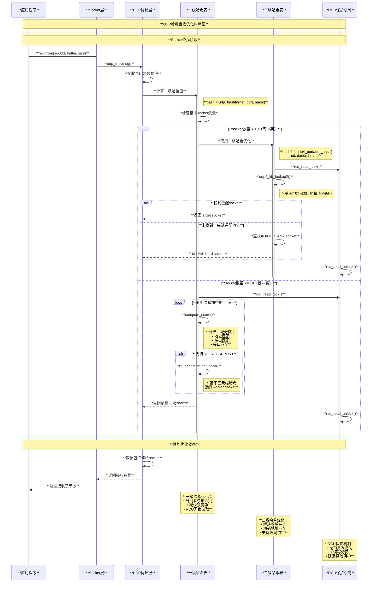
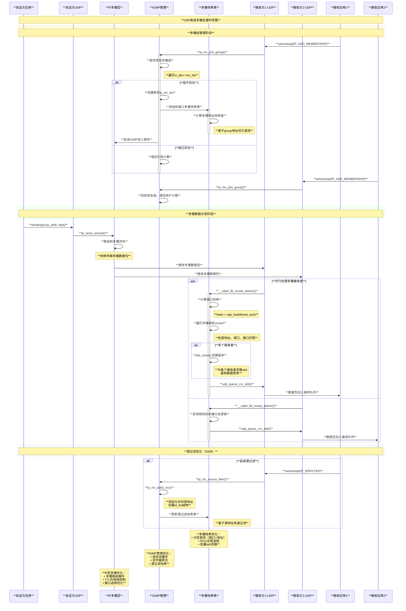
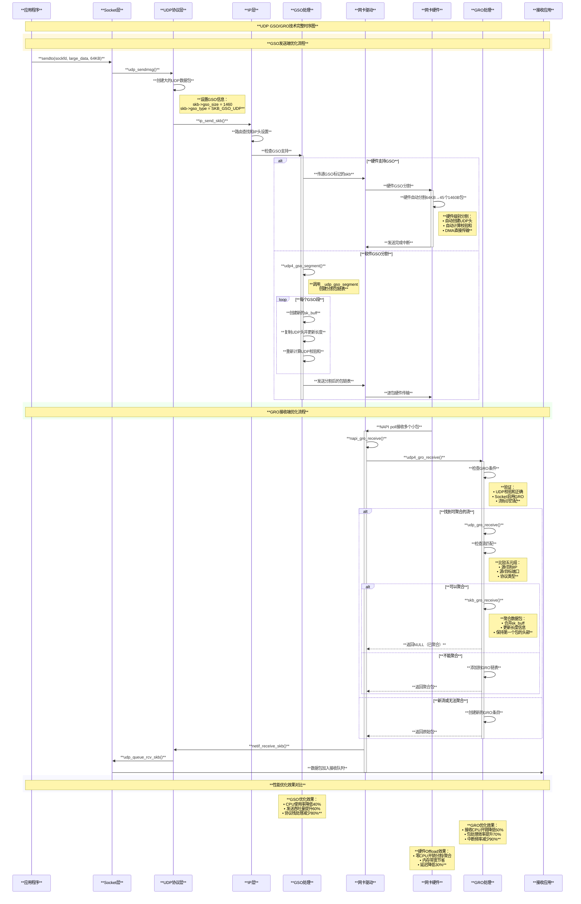
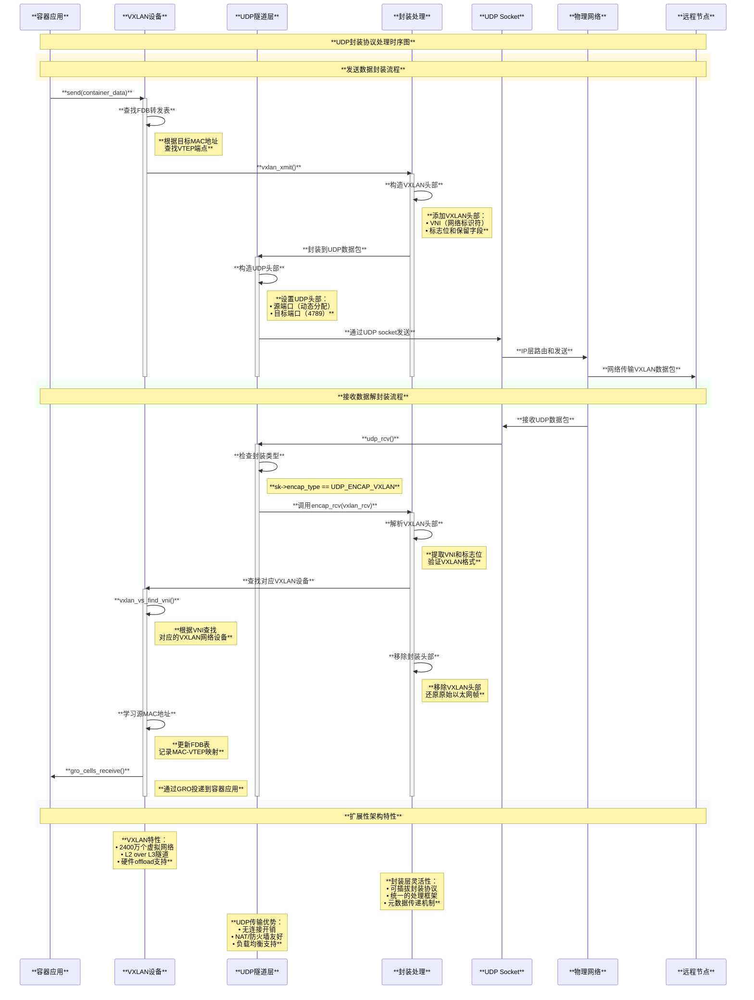
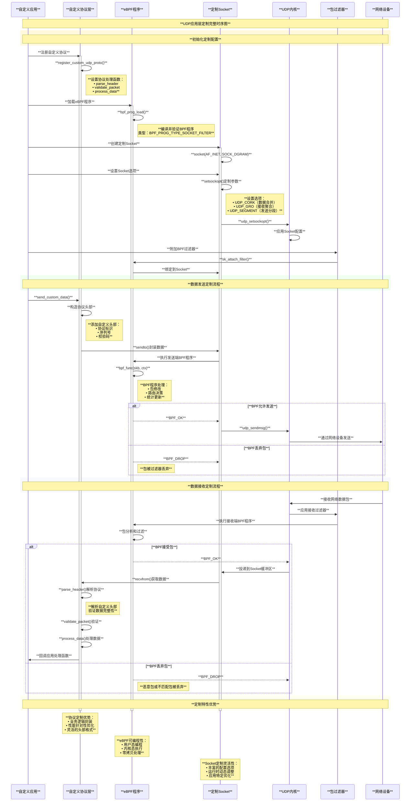
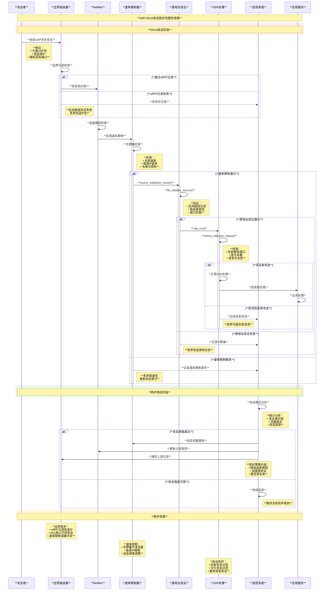

# Linux UDP协议实现原理与算法分析

## 目录

1. [概述](#概述)
2. [UDP协议栈架构](#udp协议栈架构)
3. [数据报处理机制](#数据报处理机制)
4. [Socket管理](#socket管理)
5. [多播与广播](#多播与广播)
6. [错误处理与ICMP](#错误处理与icmp)
7. [性能优化策略](#性能优化策略)
8. [UDP与TCP对比](#udp与tcp对比)
9. [核心数据结构](#核心数据结构)
10. [优点与局限性](#优点与局限性)
11. [总结](#总结)

## 概述

UDP (User Datagram Protocol)是Internet协议栈中的传输层协议，提供无连接的、不可靠的数据报传输服务。与TCP不同，UDP是一个轻量级协议，具有低延迟、高效率的特点，广泛应用于实时通信、流媒体、DNS查询等场景。

### 核心设计特点

1. **无连接**：不需要建立连接就可以发送数据
2. **不可靠**：不保证数据包的可靠传输和顺序
3. **轻量级**：协议开销小，头部仅8字节
4. **高效率**：处理速度快，延迟低
5. **支持多播**：支持一对多的通信模式

### UDP协议特性

- **面向数据报**：以数据报为单位进行传输
- **无状态**：每个数据报都是独立的
- **最大努力交付**：尽力传输但不保证成功
- **支持多播和广播**：可以同时向多个目标发送数据
- **适合实时应用**：低延迟特性适合实时通信

## UDP协议栈架构

Linux UDP协议栈设计简洁高效，与IP层和Socket层紧密集成。

### 协议栈层次结构

```c
// UDP协议栈架构图
/*
 * Linux UDP协议栈结构:
 * 
 * ┌─────────────────────────────────────┐
 * │           应用层                     │
 * │   Socket API (sendto/recvfrom)      │
 * └─────────────┬───────────────────────┘
 *               │ 系统调用接口
 * ┌─────────────▼───────────────────────┐
 * │           Socket层                  │
 * │   struct sock, UDP socket管理       │
 * └─────────────┬───────────────────────┘
 *               │
 * ┌─────────────▼───────────────────────┐
 * │           UDP层                     │
 * │  ┌─────────────────────────────────┐ │
 * │  │      数据报发送                  │ │
 * │  │   (分片检查、校验和计算)          │ │
 * │  └─────────────────────────────────┘ │
 * │  ┌─────────────────────────────────┐ │
 * │  │      数据报接收                  │ │
 * │  │   (校验和验证、数据报分发)        │ │
 * │  └─────────────────────────────────┘ │
 * │  ┌─────────────────────────────────┐ │
 * │  │      多播管理                    │ │
 * │  │   (组成员管理、数据报复制)        │ │
 * │  └─────────────────────────────────┘ │
 * │  ┌─────────────────────────────────┐ │
 * │  │      错误处理                    │ │
 * │  │   (ICMP处理、错误报告)           │ │
 * │  └─────────────────────────────────┘ │
 * └─────────────┬───────────────────────┘
 *               │
 * ┌─────────────▼───────────────────────┐
 * │           IP层                      │
 * │    路由、分片、IPv4/IPv6             │
 * └─────────────┬───────────────────────┘
 *               │
 * ┌─────────────▼───────────────────────┐
 * │        数据链路层                    │
 * │      以太网、设备驱动                │
 * └─────────────────────────────────────┘
 */

// UDP套接字结构 - include/linux/udp.h
struct udp_sock {
    struct inet_sock inet;              // 继承inet套接字
    int pending;                        // 待处理数据报数量
    unsigned int corkflag;              // cork标志
    __u8 encap_type;                    // 封装类型
#define UDP_ENCAP_ESPINUDP_NON_IKE      1 /* draft-ietf-ipsec-nat-t-ike-00/01 */
#define UDP_ENCAP_ESPINUDP              2 /* draft-ietf-ipsec-udp-encaps-06 */
#define UDP_ENCAP_L2TPINUDP             3 /* rfc3931 */
#define UDP_ENCAP_GTP0                  4 /* GSM TS 09.60 */
#define UDP_ENCAP_GTP1U                 5 /* 3GPP TS 29.060 */
#define UDP_ENCAP_RXRPC                 6
#define UDP_ENCAP_ESPINUDP_NON_IKE_DRAFT00      2
    /*
     * For encapsulation sockets.
     */
    int (*encap_rcv)(struct sock *sk, struct sk_buff *skb);
    void (*encap_destroy)(struct sock *sk);

    /* GRO functions for UDP socket */
    struct sk_buff * (*gro_receive)(struct sock *sk,
                                   struct list_head *head,
                                   struct sk_buff *skb);
    int (*gro_complete)(struct sock *sk, struct sk_buff *skb,
                       int nhoff);

    /* udp_recvmsg helpers */
    int (*recvmsg)(struct sock *sk, struct msghdr *msg, size_t len,
                  int flags, int *addr_len);
    int (*sendmsg)(struct sock *sk, struct msghdr *msg, size_t len);
    void (*encap_enable)(void);
    u8 pcflag;                          // per CPU标志
    /*
     * Following member is used to synchronize the setting of 
     * udp_sock->encap_type and the callbacks,
     * which are potentially racy.
     */
    u8 gro_enabled:1,                   // GRO使能
       no_check6_tx:1,                  // IPv6发送时不检查校验和
       no_check6_rx:1,                  // IPv6接收时不检查校验和
       encap_enabled:1,                 // 封装使能
       gso_enabled:1;                   // GSO使能
    /*
     * For encapsulation sockets.
     */
    void (*encap_enable)(void);
};

// UDP头部结构
struct udphdr {
    __be16 source;                      // 源端口
    __be16 dest;                        // 目的端口
    __be16 len;                         // UDP长度
    __sum16 check;                      // 校验和
};
```

### UDP处理流程概览

```c
// UDP数据包接收主流程 - net/ipv4/udp.c
int __udp4_lib_rcv(struct sk_buff *skb, struct udp_table *udptable,
                   int proto)
{
    struct sock *sk;
    struct udphdr *uh;
    unsigned short ulen;
    struct rtable *rt = skb_rtable(skb);
    __be32 saddr, daddr;
    struct net *net = dev_net(skb->dev);
    bool refcounted;

    /*
     *  Validate the packet.
     */
    if (!pskb_may_pull(skb, sizeof(struct udphdr)))
        goto drop;              /* No space for header. */

    uh = udp_hdr(skb);
    ulen = ntohs(uh->len);
    saddr = ip_hdr(skb)->saddr;
    daddr = ip_hdr(skb)->daddr;

    if (ulen > skb->len)
        goto short_packet;

    if (proto == IPPROTO_UDP) {
        /* UDP validates ulen. */
        if (ulen < sizeof(*uh) || pskb_trim_rcsum(skb, ulen))
            goto short_packet;
        uh = udp_hdr(skb);
    }

    if (udp4_csum_init(skb, uh, proto))
        goto csum_error;

    sk = skb_steal_sock(skb, &refcounted);
    if (sk) {
        struct dst_entry *dst = skb_dst(skb);
        int ret;

        if (unlikely(rcu_dereference(sk->sk_rx_dst) != dst))
            udp_sk_rx_dst_set(sk, dst);

        ret = udp_unicast_rcv_skb(sk, skb, uh);
        if (refcounted)
            sock_put(sk);
        return ret;
    }

    if (rt->rt_flags & (RTCF_BROADCAST|RTCF_MULTICAST))
        return __udp4_lib_mcast_deliver(net, skb, uh,
                                       saddr, daddr, udptable, proto);

    sk = __udp4_lib_lookup_skb(skb, uh->source, uh->dest, udptable);
    if (sk)
        return udp_unicast_rcv_skb(sk, skb, uh);

    if (!xfrm4_policy_check(NULL, XFRM_POLICY_IN, skb))
        goto drop;
    nf_reset_ct(skb);

    /* No socket. Drop packet silently, if checksum is wrong */
    if (udp_lib_checksum_complete(skb))
        goto csum_error;

    __UDP_INC_STATS(net, UDP_MIB_NOPORTS, proto == IPPROTO_UDPLITE);
    icmp_send(skb, ICMP_DEST_UNREACH, ICMP_PORT_UNREACH, 0);

    /*
     * Hmm.  We got an UDP packet to a port to which we
     * don't wanna listen.  Ignore it.
     */
    kfree_skb(skb);
    return 0;

short_packet:
    net_dbg_ratelimited("UDP%s: short packet: From %pI4:%u %d/%d to %pI4:%u\n",
                       proto == IPPROTO_UDPLITE ? "Lite" : "",
                       &saddr, ntohs(uh->source),
                       ulen, skb->len,
                       &daddr, ntohs(uh->dest));
    goto drop;

csum_error:
    /*
     * RFC1122: OK.  Discards the bad packet silently (as far as
     * the network is concerned, anyway) as per 4.1.3.4 (MUST).
     */
    net_dbg_ratelimited("UDP%s: bad checksum. From %pI4:%u to %pI4:%u ulen %d\n",
                       proto == IPPROTO_UDPLITE ? "Lite" : "",
                       &saddr, ntohs(uh->source), &daddr, ntohs(uh->dest),
                       ulen);
    __UDP_INC_STATS(net, UDP_MIB_CSUMERRORS, proto == IPPROTO_UDPLITE);
drop:
    __UDP_INC_STATS(net, UDP_MIB_INERRORS, proto == IPPROTO_UDPLITE);
    kfree_skb(skb);
    return 0;
}

// UDP数据包发送主流程 - net/ipv4/udp.c
int udp_sendmsg(struct sock *sk, struct msghdr *msg, size_t len)
{
    struct inet_sock *inet = inet_sk(sk);
    struct udp_sock *up = udp_sk(sk);
    DECLARE_SOCKADDR(struct sockaddr_in *, usin, msg->msg_name);
    struct flowi4 fl4_stack;
    struct flowi4 *fl4;
    int ulen = len;
    struct ipcm_cookie ipc;
    struct rtable *rt = NULL;
    int free = 0;
    int connected = 0;
    __be32 daddr, faddr, saddr;
    __be16 dport;
    u8  tos;
    int err, is_udplite = IS_UDPLITE(sk);
    int corkreq = up->corkflag || msg->msg_flags&MSG_MORE;
    int (*getfrag)(void *, char *, int, int, int, struct sk_buff *);
    struct sk_buff *skb;
    struct ip_options_data opt_copy;

    if (len > 0xFFFF)
        return -EMSGSIZE;

    /*
     *      Check the flags.
     */

    if (msg->msg_flags & MSG_OOB) /* Mirror BSD error message compatibility */
        return -EOPNOTSUPP;

    getfrag = is_udplite ? udplite_getfrag : ip_generic_getfrag;

    fl4 = &inet->cork.fl.u.ip4;
    if (up->pending) {
        /*
         * There are pending frames.
         * The socket lock must be held while it's corked.
         */
        lock_sock(sk);
        if (likely(up->pending)) {
            if (unlikely(up->pending != AF_INET)) {
                release_sock(sk);
                return -EINVAL;
            }
            goto do_append_data;
        }
        release_sock(sk);
    }
    ulen += sizeof(struct udphdr);

    /*
     *      Get and verify the address.
     */
    if (usin) {
        if (msg->msg_namelen < sizeof(*usin))
            return -EINVAL;
        if (usin->sin_family != AF_INET) {
            if (usin->sin_family != AF_UNSPEC)
                return -EAFNOSUPPORT;
        }

        daddr = usin->sin_addr.s_addr;
        dport = usin->sin_port;
        if (dport == 0)
            return -EINVAL;
    } else {
        if (sk->sk_state != TCP_ESTABLISHED)
            return -EDESTADDRREQ;
        daddr = inet->inet_daddr;
        dport = inet->inet_dport;
        /* Open fast path for connected socket.
           Route will not be used, if at least one option is set.
         */
        connected = 1;
    }

    ipcm_init_sk(&ipc, inet);
    ipc.gso_size = up->gso_size;

    if (msg->msg_controllen) {
        err = udp_cmsg_send(sk, msg, &ipc.gso_size);
        if (err > 0)
            err = ip_cmsg_send(sk, msg, &ipc,
                              sk->sk_family == AF_INET6);
        if (unlikely(err < 0)) {
            kfree(opt_copy.opt.optval);
            return err;
        }
        if (ipc.opt)
            free = 1;
        connected = 0;
    }
    if (!ipc.opt) {
        struct ip_options_rcu *inet_opt;

        rcu_read_lock();
        inet_opt = rcu_dereference(inet->inet_opt);
        if (inet_opt) {
            memcpy(&opt_copy, inet_opt,
                   sizeof(*inet_opt) + inet_opt->opt.optlen);
            ipc.opt = &opt_copy.opt;
        }
        rcu_read_unlock();
    }

    if (cgroup_bpf_enabled && !connected) {
        err = BPF_CGROUP_RUN_PROG_UDP4_SENDMSG_LOCK(sk,
                                                   (struct sockaddr *)usin, &ipc.addr);
        if (err)
            goto out_free;
        if (usin) {
            if (usin->sin_port == 0) {
                /* BPF program set invalid port. Reject it. */
                err = -EINVAL;
                goto out_free;
            }
            daddr = usin->sin_addr.s_addr;
            dport = usin->sin_port;
        }
    }

    saddr = ipc.addr;
    ipc.addr = faddr = daddr;

    sock_tx_timestamp(sk, ipc.sockc.tsflags, &ipc.tx_flags);

    if (ipv4_is_multicast(daddr)) {
        if (!ipc.oif || netif_index_is_l3_master(sock_net(sk), ipc.oif))
            ipc.oif = inet->mc_index;
        if (!saddr)
            saddr = inet->mc_addr;
        connected = 0;
    } else if (!ipc.oif) {
        ipc.oif = inet->uc_index;
    } else if (ipv4_is_lbcast(daddr) && inet->uc_index) {
        /* oif is set, packet is to local broadcast
         * and uc_index is set. oif is most likely set
         * by sk_bound_dev_if. If uc_index != oif check if the
         * oif is an L3 master and uc_index is an L3 slave.
         * If so, we want to allow the send using the uc_index.
         */
        if (ipc.oif != inet->uc_index &&
            ipc.oif == l3mdev_master_ifindex_by_index(sock_net(sk),
                                                     inet->uc_index)) {
            ipc.oif = inet->uc_index;
        }
    }

    if (connected)
        rt = (struct rtable *)sk_dst_check(sk, 0);

    if (!rt) {
        struct net *net = sock_net(sk);
        __u8 flow_flags = inet_sk_flowi_flags(sk);

        fl4 = &fl4_stack;

        flowi4_init_output(fl4, ipc.oif, sk->sk_mark, tos,
                          RT_SCOPE_UNIVERSE, sk->sk_protocol,
                          flow_flags,
                          faddr, saddr, dport, inet->inet_sport,
                          sk->sk_uid);

        security_sk_classify_flow(sk, flowi4_to_flowi(fl4));
        rt = ip_route_output_flow(net, fl4, sk);
        if (IS_ERR(rt)) {
            err = PTR_ERR(rt);
            rt = NULL;
            if (err == -ENETUNREACH)
                IP_INC_STATS(net, IPSTATS_MIB_OUTNOROUTES);
            goto out;
        }

        err = -EACCES;
        if ((rt->rt_flags & RTCF_BROADCAST) &&
            !sock_flag(sk, SOCK_BROADCAST))
            goto out;
        if (connected)
            sk_dst_set(sk, dst_clone(&rt->dst));
    }

    if (msg->msg_flags&MSG_CONFIRM)
        goto do_confirm;
back_from_confirm:

    saddr = fl4->saddr;
    if (!ipc.addr)
        daddr = ipc.addr = fl4->daddr;

    /* Lockless fast path for the non-corking case. */
    if (!corkreq) {
        struct inet_cork *cork = &inet->cork.base;

        skb = ip_make_skb(sk, fl4, getfrag, msg, ulen,
                         sizeof(struct udphdr), &ipc, &rt,
                         &cork, msg->msg_flags);
        err = PTR_ERR(skb);
        if (!IS_ERR_OR_NULL(skb))
            err = udp_send_skb(skb, fl4, &cork);
        goto out;
    }

    lock_sock(sk);
    if (unlikely(up->pending)) {
        /* The socket is already corked while preparing it. */
        /* ... which is an evident application bug. --ANK */
        release_sock(sk);

        net_dbg_ratelimited("socket already corked\n");
        err = -EINVAL;
        goto out;
    }
    /*
     *      Now cork the socket to pend data.
     */
    fl4 = &inet->cork.fl.u.ip4;
    fl4->daddr = daddr;
    fl4->saddr = saddr;
    fl4->fl4_dport = dport;
    fl4->fl4_sport = inet->inet_sport;
    up->pending = AF_INET;

do_append_data:
    up->len += ulen;
    err = ip_append_data(sk, fl4, getfrag, msg, ulen,
                        sizeof(struct udphdr), &ipc, &rt,
                        corkreq ? msg->msg_flags|MSG_MORE : msg->msg_flags);
    if (err)
        udp_flush_pending_frames(sk);
    else if (!corkreq)
        err = udp_push_pending_frames(sk);
    else if (unlikely(skb_queue_empty(&sk->sk_write_queue)))
        up->pending = 0;
    release_sock(sk);

out:
    ip_rt_put(rt);
out_free:
    if (free)
        kfree(ipc.opt);
    if (!err)
        return len;
    /*
     * ENOBUFS = no kernel mem, SOCK_NOSPACE = no sndbuf space.  Reporting
     * ENOBUFS might not be good (it's not tunable per se), but otherwise
     * we don't have a good statistic (IpOutDiscards but it can be too many
     * things).  We could add another new stat but at least for now that
     * seems like overkill.
     */
    if (err == -ENOBUFS || test_bit(SOCK_NOSPACE, &sk->sk_socket->flags)) {
        UDP_INC_STATS(sock_net(sk), UDP_MIB_SNDBUFERRORS,
                     is_udplite);
    }
    return err;

do_confirm:
    if (msg->msg_flags & MSG_PROBE)
        dst_confirm_neigh(&rt->dst, &fl4->daddr);
    if (!(msg->msg_flags&MSG_PROBE) || len)
        goto back_from_confirm;
    err = 0;
    goto out;
}
```

## 数据报处理机制

UDP以数据报为基本传输单位，每个数据报都是独立的完整消息。

### 数据报发送处理

```c
// UDP发送数据报核心函数 - net/ipv4/udp.c
static int udp_send_skb(struct sk_buff *skb, struct flowi4 *fl4,
                       struct inet_cork *cork)
{
    struct sock *sk = skb->sk;
    struct inet_sock *inet = inet_sk(sk);
    struct udphdr *uh;
    int err;
    int is_udplite = IS_UDPLITE(sk);
    int offset = skb_transport_offset(skb);
    int len = skb->len - offset;
    int datalen = len - sizeof(*uh);
    __wsum csum = 0;

    /*
     * Create a UDP header
     */
    uh = udp_hdr(skb);
    uh->source = inet->inet_sport;
    uh->dest = fl4->fl4_dport;
    uh->len = htons(len);
    uh->check = 0;

    if (cork->gso_size) {
        const int hlen = skb_network_header_len(skb) +
                        sizeof(struct udphdr);

        if (hlen + cork->gso_size > cork->fragsize) {
            kfree_skb(skb);
            return -EINVAL;
        }
        if (skb->len > cork->gso_size * UDP_MAX_SEGMENTS) {
            kfree_skb(skb);
            return -EINVAL;
        }
        if (sk->sk_no_check_tx) {
            kfree_skb(skb);
            return -EINVAL;
        }
        if (skb->ip_summed != CHECKSUM_PARTIAL || is_udplite ||
            dst_xfrm(skb_dst(skb))) {
            kfree_skb(skb);
            return -EIO;
        }

        if (datalen > cork->gso_size) {
            skb_shinfo(skb)->gso_size = cork->gso_size;
            skb_shinfo(skb)->gso_type = SKB_GSO_UDP_L4;
            skb_shinfo(skb)->gso_segs = DIV_ROUND_UP(datalen,
                                                    cork->gso_size);
        }
        goto csum_partial;
    }

    if (is_udplite)  				 /*     UDP-Lite      */
        csum = udplite_csum(skb);

    else if (sk->sk_no_check_tx) {   /* UDP csum off */

        skb->ip_summed = CHECKSUM_NONE;
        goto send;

    } else if (skb->ip_summed == CHECKSUM_PARTIAL) { /* UDP hardware csum */
csum_partial:

        udp4_hwcsum(skb, fl4->saddr, fl4->daddr);
        goto send;

    } else
        csum = udp_csum(skb);

    /* add protocol-dependent pseudo-header */
    uh->check = csum_tcpudp_magic(fl4->saddr, fl4->daddr, len,
                                 sk->sk_protocol, csum);
    if (uh->check == 0)
        uh->check = CSUM_MANGLED_0;

send:
    err = ip_send_skb(sock_net(sk), skb);
    if (err) {
        if (err == -ENOBUFS && !inet->recverr) {
            UDP_INC_STATS(sock_net(sk), UDP_MIB_SNDBUFERRORS,
                         is_udplite);
            err = 0;
        }
    } else
        UDP_INC_STATS(sock_net(sk), UDP_MIB_OUTDATAGRAMS,
                     is_udplite);
    return err;
}

// UDP校验和计算 - net/ipv4/udp.c
static __wsum udp_csum(struct sk_buff *skb)
{
    __wsum csum = csum_partial(skb_transport_header(skb),
                              sizeof(struct udphdr), skb->csum);

    for (skb = skb_shinfo(skb)->frag_list; skb != NULL; skb = skb->next) {
        csum = csum_add(csum, skb->csum);
    }
    return csum;
}

// UDP硬件校验和处理
static void udp4_hwcsum(struct sk_buff *skb, __be32 src, __be32 dst)
{
    struct udphdr *uh = udp_hdr(skb);
    int offset = skb_transport_offset(skb);
    int len = skb->len - offset;

    if (skb_has_shared_frag(skb)) {
        skb->ip_summed = CHECKSUM_NONE;
        uh->check = csum_tcpudp_magic(src, dst, len, IPPROTO_UDP,
                                     udp_csum(skb));
    } else {
        skb->ip_summed = CHECKSUM_PARTIAL;
        skb->csum_start = skb_transport_header(skb) - skb->head;
        skb->csum_offset = offsetof(struct udphdr, check);
        uh->check = ~csum_tcpudp_magic(src, dst, len, IPPROTO_UDP, 0);
    }
}
```

### 数据报接收处理

```c
// UDP单播接收处理 - net/ipv4/udp.c
static int udp_unicast_rcv_skb(struct sock *sk, struct sk_buff *skb,
                              struct udphdr *uh)
{
    int ret;

    if (inet_get_convert_csum(sk) && uh->check && !IS_UDPLITE(sk))
        skb_checksum_try_convert(skb, IPPROTO_UDP, uh->check,
                                inet_compute_pseudo);

    ret = udp_queue_rcv_skb(sk, skb);

    /* a return value > 0 means to resubmit the input, but
     * it wants the return to be -protocol, or 0
     */
    if (ret > 0)
        return -ret;
    return 0;
}

// UDP接收队列处理
int udp_queue_rcv_skb(struct sock *sk, struct sk_buff *skb)
{
    struct udp_sock *up = udp_sk(sk);
    int is_udplite = IS_UDPLITE(sk);

    /*
     *	Charge it to the socket, dropping if the queue is full.
     */
    if (!xfrm4_policy_check(sk, XFRM_POLICY_IN, skb))
        goto drop;
    nf_reset_ct(skb);

    if (static_branch_unlikely(&udp_encap_needed_key) && up->encap_type) {
        int (*encap_rcv)(struct sock *sk, struct sk_buff *skb);

        /*
         * This is an encapsulation socket so pass the skb to
         * the socket's udp_encap_rcv() hook. Otherwise, just
         * fall through and pass this up the UDP socket.
         * up->encap_rcv() returns the following value:
         * =0 if skb was successfully passed to the encap
         *    handler or was discarded by it.
         * >0 if skb should be passed on to UDP.
         * <0 if skb should be resubmitted later.
         */

        /* if we're overly short, let UDP handle it */
        encap_rcv = READ_ONCE(up->encap_rcv);
        if (encap_rcv) {
            int ret;

            /* Verify checksum before giving to encap */
            if (udp_lib_checksum_complete(skb))
                goto csum_error;

            ret = encap_rcv(sk, skb);
            if (ret <= 0) {
                __UDP_INC_STATS(sock_net(sk),
                               UDP_MIB_INDATAGRAMS,
                               is_udplite);
                return -ret;
            }
        }

        /* FALLTHROUGH -- it's a UDP Packet */
    }

    /*
     * 	UDP-Lite specific tests, ignored on UDP sockets
     */
    if ((is_udplite & UDPLITE_RECV_CC)  &&  UDP_SKB_CB(skb)->partial_cov) {

        /*
         * MIB statistics other than incrementing the error count are
         * disabled for the following two types of errors: these depend
         * on the application settings, not on the functioning of the
         * protocol stack as such.
         *
         * RFC 3828 here recommends (sec 3.3): "There should also be a
         * way ... to ... at least let the receiving application block
         * delivery of packets with coverage values less than a value
         * provided by the application."
         */
        if (up->pcrlen == 0) {          /* full coverage was set  */
            net_dbg_ratelimited("UDPLite: partial coverage %d while full coverage %d requested\n",
                               UDP_SKB_CB(skb)->cscov, skb->len);
            goto drop;
        }
        /* The next case involves violating the min. coverage requested
         * by the receiver. This is subtle: if receiver wants x and x is
         * greater than the buffersize/MTU then receiver will complain
         * that it wants x while sender emits packets of smaller size y.
         * Therefore the above ...()->partial_cov statement is essential.
         */
        if (UDP_SKB_CB(skb)->cscov  <  up->pcrlen) {
            net_dbg_ratelimited("UDPLite: coverage %d too small, need min %d\n",
                               UDP_SKB_CB(skb)->cscov, up->pcrlen);
            goto drop;
        }
    }

    prefetch(&sk->sk_rmem_alloc);
    if (rcu_access_pointer(sk->sk_filter) &&
        udp_lib_checksum_complete(skb))
        goto csum_error;

    if (sk_filter_trim_cap(sk, skb, sizeof(struct udphdr)))
        goto drop;

    udp_csum_pull_header(skb);

    ipv4_pktinfo_prepare(sk, skb);
    return __udp_queue_rcv_skb(sk, skb);

csum_error:
    __UDP_INC_STATS(sock_net(sk), UDP_MIB_CSUMERRORS, is_udplite);
drop:
    __UDP_INC_STATS(sock_net(sk), UDP_MIB_INERRORS, is_udplite);
    atomic_inc(&sk->sk_drops);
    kfree_skb(skb);
    return -1;
}

// 将数据报加入接收队列
static int __udp_queue_rcv_skb(struct sock *sk, struct sk_buff *skb)
{
    int rc;

    if (inet_sk(sk)->inet_daddr) {
        sock_rps_save_rxhash(sk, skb);
        sk_mark_napi_id(sk, skb);
        sk_incoming_cpu_update(sk);
    } else {
        sk_mark_napi_id_once(sk, skb);
    }

    rc = __udp_enqueue_schedule_skb(sk, skb);
    if (rc < 0) {
        int is_udplite = IS_UDPLITE(sk);

        /* Note that an ENOMEM error is charged twice */
        if (rc == -ENOMEM)
            UDP_INC_STATS(sock_net(sk), UDP_MIB_RCVBUFERRORS,
                         is_udplite);
        UDP_INC_STATS(sock_net(sk), UDP_MIB_INERRORS, is_udplite);
        kfree_skb(skb);
        trace_udp_fail_queue_rcv_skb(rc, sk);
        return -1;
    }

    return 0;
}
```

## Socket管理

UDP Socket管理相对简单，主要涉及端口绑定、Socket查找和状态管理。

### UDP Socket查找

```c
// UDP Socket查找表 - include/net/udp.h
struct udp_table {
    struct udp_hslot *hash;           // 哈希表
    struct udp_hslot *hash2;          // 第二级哈希表
    unsigned int mask;                // 掩码
    unsigned int log;                 // 对数大小
};

struct udp_hslot {
    struct hlist_head head;           // 哈希链表头
    int count;                        // 计数
    spinlock_t lock;                  // 自旋锁
} __attribute__((aligned(2 * sizeof(long))));

// 查找UDP Socket - net/ipv4/udp.c
struct sock *__udp4_lib_lookup(struct net *net, __be32 saddr,
                              __be16 sport, __be32 daddr, __be16 dport,
                              int dif, int sdif, struct udp_table *udptable,
                              struct sk_buff *skb)
{
    struct sock *result = NULL;
    struct sock *sk;
    struct hlist_nulls_node *node;
    unsigned short hnum = ntohs(dport);
    unsigned int hash2, slot2;
    struct udp_hslot *hslot2, *hslot;
    int score, badness;
    u32 hash = udp4_portaddr_hash(net, daddr, hnum);

    if (hash2 != hash) {
        hash2 = udp4_portaddr_hash(net, htonl(INADDR_ANY), hnum);
        slot2 = hash2 & udptable->mask;
        hslot2 = &udptable->hash2[slot2];
        if (hlist_nulls_empty(&hslot2->head))
            goto begin;

        result = udp4_lib_lookup2(net, saddr, sport,
                                 daddr, hnum, dif, sdif,
                                 hslot2, skb);
        if (!result) {
            unsigned int old_slot2 = slot2;
            hash2 = udp4_portaddr_hash(net, htonl(INADDR_ANY), hnum);
            slot2 = hash2 & udptable->mask;

            hslot2 = &udptable->hash2[slot2];
            if (hlist_nulls_empty(&hslot2->head))
                goto begin;

            if (slot2 != old_slot2)
                result = udp4_lib_lookup2(net, saddr, sport,
                                         daddr, hnum, dif, sdif,
                                         hslot2, skb);
        }
        if (result)
            return result;
    }
begin:
    hslot = &udptable->hash[udp_hashfn(net, hnum, udptable->mask)];
    if (hlist_nulls_empty(&hslot->head))
        return NULL;

    badness = 0;
    sk_nulls_for_each_rcu(sk, node, &hslot->head) {
        score = compute_score(sk, net, saddr, sport,
                            daddr, hnum, dif, sdif);
        if (score > badness) {
            result = sk;
            badness = score;
        }
    }

    return result;
}

// 计算Socket匹配分数
static int compute_score(struct sock *sk, struct net *net,
                        __be32 saddr, __be16 sport,
                        __be32 daddr, unsigned short hnum,
                        int dif, int sdif)
{
    int score;
    struct inet_sock *inet;
    bool dev_match;

    if (!net_eq(sock_net(sk), net) ||
        udp_sk(sk)->udp_port_hash != hnum ||
        ipv6_only_sock(sk))
        return -1;

    if (sk->sk_rcv_saddr != daddr)
        return -1;

    score = (sk->sk_family == PF_INET) ? 2 : 1;

    inet = inet_sk(sk);
    if (inet->inet_daddr) {
        if (inet->inet_daddr != saddr)
            return -1;
        score += 4;
    }

    if (inet->inet_dport) {
        if (inet->inet_dport != sport)
            return -1;
        score += 4;
    }

    dev_match = udp_sk_bound_dev_eq(net, sk->sk_bound_dev_if, dif, sdif);
    if (!dev_match)
        return -1;
    score += 4;

    if (READ_ONCE(sk->sk_incoming_cpu) == raw_smp_processor_id())
        score++;
    return score;
}
```

### UDP Socket绑定

```c
// UDP Socket绑定 - net/ipv4/udp.c
int udp_lib_get_port(struct sock *sk, unsigned short snum,
                    unsigned int hash2_nulladdr)
{
    struct udp_hslot *hslot, *hslot2;
    struct udp_table *udptable = sk->sk_prot->h.udp_table;
    int error = 1;
    struct net *net = sock_net(sk);

    if (!snum) {
        int low, high, remaining;
        unsigned int rand;
        unsigned short first, last;
        DECLARE_BITMAP(bitmap, PORTS_PER_CHAIN);

        inet_get_local_port_range(net, &low, &high);
        remaining = (high - low) + 1;

        rand = prandom_u32();
        first = reciprocal_scale(rand, remaining) + low;
        /*
         * force rand to be an odd multiple of UDP_HTABLE_SIZE
         */
        rand = (rand | 1) * (udptable->mask + 1);
        last = first + udptable->mask + 1;
        do {
            hslot = udp_hashslot(udptable, net, first);
            bitmap_zero(bitmap, PORTS_PER_CHAIN);
            spin_lock_bh(&hslot->lock);
            udp_lib_lport_inuse(net, snum, hslot, bitmap, sk,
                               udptable->log);

            snum = first;
            /*
             * Iterate on all possible values of snum for this hash.
             * Using steps of an odd multiple of UDP_HTABLE_SIZE
             * give us randomization and full range coverage.
             */
            do {
                if (low <= snum && snum <= high &&
                    !test_bit(snum >> udptable->log, bitmap) &&
                    !inet_is_local_reserved_port(net, snum))
                    goto found;
                snum += rand;
            } while (snum != first);
            spin_unlock_bh(&hslot->lock);
            cond_resched();
        } while (++first != last);
        goto fail;
    } else {
        hslot = udp_hashslot(udptable, net, snum);
        spin_lock_bh(&hslot->lock);
        if (hslot2 && udp_lib_lport_inuse2(net, snum, hslot2, sk))
            goto fail_unlock;
    }
found:
    inet_sk(sk)->inet_num = snum;
    udp_sk(sk)->udp_port_hash = snum;
    udp_sk(sk)->udp_portaddr_hash ^= snum;
    if (sk_unhashed(sk)) {
        if (sk->sk_reuseport &&
            udp_reuseport_add_sock(sk, hslot)) {
            inet_sk(sk)->inet_num = 0;
            udp_sk(sk)->udp_port_hash = 0;
            udp_sk(sk)->udp_portaddr_hash ^= snum;
            goto fail_unlock;
        }

        sk_nulls_add_node_rcu(sk, &hslot->head);
        hslot->count++;
        sock_prot_inuse_add(sock_net(sk), sk->sk_prot, 1);

        hslot2 = udp_hashslot2(udptable, udp_sk(sk)->udp_portaddr_hash);
        spin_lock(&hslot2->lock);
        if (IS_ENABLED(CONFIG_IPV6) && sk->sk_reuseport &&
            sk->sk_family == AF_INET6)
            hlist_nulls_add_tail_rcu(&udp_sk(sk)->udp_portaddr_node,
                                    &hslot2->head);
        else
            hlist_nulls_add_head_rcu(&udp_sk(sk)->udp_portaddr_node,
                                    &hslot2->head);
        hslot2->count++;
        spin_unlock(&hslot2->lock);
    }
    sock_set_flag(sk, SOCK_RCU_FREE);
    error = 0;
fail_unlock:
    spin_unlock_bh(&hslot->lock);
fail:
    return error;
}
```

## 多播与广播

UDP支持多播和广播通信，允许一个发送者向多个接收者同时发送数据。

### 多播组管理

```c
// IP多播组结构 - include/linux/igmp.h
struct ip_mc_list {
    struct in_device *interface;      // 网络接口
    __be32 multiaddr;                 // 多播地址
    unsigned int sfmode;              // 源过滤模式
    struct ip_sf_list *sources;       // 源列表
    struct ip_sf_list *tomb;          // 墓碑列表
    unsigned long sfcount[2];         // 源过滤计数
    union {
        struct ip_mc_list *next;      // 下一个多播组
        struct ip_mc_list __rcu *next_rcu;
    };
    struct timer_list timer;          // 定时器
    int users;                        // 用户计数
    atomic_t refcnt;                  // 引用计数
    spinlock_t lock;                  // 自旋锁
    char tm_running;                  // 定时器运行标志
    char reporter;                    // 报告者标志
    char unsolicit_count;             // 未solicited计数
    char loaded;                      // 加载标志
    unsigned char gsquery;            // 组特定查询
    unsigned char crcount;            // 兼容路由器计数
};

// UDP多播接收处理 - net/ipv4/udp.c
static int __udp4_lib_mcast_deliver(struct net *net, struct sk_buff *skb,
                                   struct udphdr *uh,
                                   __be32 saddr, __be32 daddr,
                                   struct udp_table *udptable,
                                   int proto)
{
    struct sock *sk, *first = NULL;
    unsigned short hnum = ntohs(uh->dest);
    struct udp_hslot *hslot = udp_hashslot(udptable, net, hnum);
    unsigned int hash2 = 0, hash2_any = 0, use_hash2 = (hslot->count > 10);
    unsigned int offset = offsetof(typeof(*sk), sk_node);
    int dif = skb->dev->ifindex;
    int sdif = inet_sdif(skb);
    struct hlist_node *node;
    struct sk_buff *nskb;

    if (use_hash2) {
        hash2_any = ipv4_portaddr_hash(net, htonl(INADDR_ANY), hnum) &
                    udptable->mask;
        hash2 = ipv4_portaddr_hash(net, daddr, hnum) & udptable->mask;
start_lookup:
        hslot = &udptable->hash2[hash2];
        offset = offsetof(typeof(*sk), __sk_common.skc_portaddr_node);
    }

    sk_for_each_entry_offset_rcu(sk, node, &hslot->head, offset) {
        if (!__udp_is_mcast_sock(net, sk, uh->dest, daddr,
                                uh->source, saddr, dif, sdif, hnum))
            continue;

        if (!first) {
            first = sk;
            continue;
        }
        nskb = skb_clone(skb, GFP_ATOMIC);

        if (unlikely(!nskb)) {
            atomic_inc(&sk->sk_drops);
            __UDP_INC_STATS(net, UDP_MIB_RCVBUFERRORS,
                           IS_UDPLITE(sk));
            __UDP_INC_STATS(net, UDP_MIB_INERRORS,
                           IS_UDPLITE(sk));
            continue;
        }
        if (udp_queue_rcv_skb(sk, nskb) > 0)
            consume_skb(nskb);
    }

    /* Also lookup *:port if we are using hash2 and haven't done so yet. */
    if (use_hash2 && hash2 != hash2_any) {
        hash2 = hash2_any;
        goto start_lookup;
    }

    if (first) {
        if (udp_queue_rcv_skb(first, skb) > 0)
            consume_skb(skb);
    } else {
        kfree_skb(skb);
        __UDP_INC_STATS(net, UDP_MIB_IGNOREDMULTI, proto == IPPROTO_UDPLITE);
    }
    return 0;
}

// 检查Socket是否匹配多播条件
static inline bool __udp_is_mcast_sock(struct net *net, struct sock *sk,
                                      __be16 loc_port, __be32 loc_addr,
                                      __be16 rmt_port, __be32 rmt_addr,
                                      int dif, int sdif, unsigned short hnum)
{
    struct inet_sock *inet = inet_sk(sk);

    if (!net_eq(sock_net(sk), net) ||
        udp_sk(sk)->udp_port_hash != hnum ||
        (inet->inet_daddr && inet->inet_daddr != rmt_addr) ||
        (inet->inet_dport != rmt_port && inet->inet_dport) ||
        (inet->inet_rcv_saddr && inet->inet_rcv_saddr != loc_addr) ||
        ipv6_only_sock(sk) ||
        !udp_sk_bound_dev_eq(net, sk->sk_bound_dev_if, dif, sdif))
        return false;
    if (!ip_mc_sf_allow(sk, loc_addr, rmt_addr, dif, sdif))
        return false;
    return true;
}
```

### 广播处理

```c
// 广播检查 - net/ipv4/udp.c
static inline bool udp_sk_bound_dev_eq(struct net *net, int bound_dev_if,
                                      int dif, int sdif)
{
    return inet_bound_dev_eq(READ_ONCE(net->ipv4.sysctl_udp_l3mdev_accept),
                            bound_dev_if, dif, sdif);
}

// 广播地址检查
static inline bool ipv4_is_lbcast(__be32 addr)
{
    /* limited broadcast */
    return addr == htonl(INADDR_BROADCAST);
}

static inline bool ipv4_is_all_snoopers(__be32 addr)
{
    return addr == htonl(INADDR_ALLSNOOPERS_GROUP);
}
```

## 错误处理与ICMP

UDP需要处理各种网络错误和ICMP消息。

### ICMP错误处理

```c
// UDP ICMP错误处理 - net/ipv4/udp.c
int __udp4_lib_err(struct sk_buff *skb, u32 info, struct udp_table *udptable)
{
    struct inet_sock *inet;
    const struct iphdr *iph = (const struct iphdr *)skb->data;
    struct udphdr *uh = (struct udphdr *)(skb->data+(iph->ihl<<2));
    const int type = icmp_hdr(skb)->type;
    const int code = icmp_hdr(skb)->code;
    bool tunnel = false;
    struct sock *sk;
    int harderr;
    int err;
    struct net *net = dev_net(skb->dev);

    sk = __udp4_lib_lookup(net, iph->daddr, uh->dest,
                          iph->saddr, uh->source, skb->dev->ifindex, 0,
                          udptable, NULL);
    if (!sk) {
        __ICMP_INC_STATS(net, ICMP_MIB_INERRORS);
        return -ENOENT;
    }

    tunnel = iptunnel_xmit_stats(err, &dev->stats, dev->tstats);

    harderr = 0;
    inet = inet_sk(sk);
    switch (type) {
    default:
    case ICMP_TIME_EXCEEDED:
        err = EHOSTUNREACH;
        break;
    case ICMP_SOURCE_QUENCH:
        goto out;
    case ICMP_PARAMETERPROB:
        err = EPROTO;
        harderr = 1;
        break;
    case ICMP_DEST_UNREACH:
        if (code == ICMP_FRAG_NEEDED) { /* Path MTU discovery */
            ipv4_sk_update_pmtu(skb, sk, info);
            if (inet->pmtudisc != IP_PMTUDISC_DONT) {
                err = EMSGSIZE;
                harderr = 1;
                break;
            }
            goto out;
        }
        err = EHOSTUNREACH;
        if (code <= NR_ICMP_UNREACH) {
            harderr = icmp_err_convert[code].fatal;
            err = icmp_err_convert[code].errno;
        }
        break;
    case ICMP_REDIRECT:
        ipv4_sk_redirect(skb, sk);
        goto out;
    }

    /*
     *      RFC1122: OK.  Passes ICMP errors back to application, as per
     *      4.1.3.3.
     */
    if (tunnel) {
        /* ...not for tunnels though: we don't have a sending socket */
        if (udp_sk(sk)->encap_err_lookup)
            udp_sk(sk)->encap_err_lookup(sk, skb);
        goto out;
    }
    if (!inet->recverr) {
        if (!harderr || sk->sk_state != TCP_ESTABLISHED)
            goto out;
    } else
        ip_icmp_error(sk, skb, err, uh->dest, info, (u8 *)(uh+1));

    sk->sk_err = err;
    sk_error_report(sk);
out:
    return 0;
}
```

## 性能优化策略

### UDP GSO支持

```c
// UDP GSO处理 - net/ipv4/udp_offload.c
static struct sk_buff *udp4_ufo_fragment(struct sk_buff *skb,
                                        netdev_features_t features)
{
    struct sk_buff *segs = ERR_PTR(-EINVAL);
    unsigned int mss;
    __wsum csum;
    struct udphdr *uh;
    struct iphdr *iph;

    if (skb->encapsulation &&
        (skb_shinfo(skb)->gso_type &
         (SKB_GSO_UDP_TUNNEL|SKB_GSO_UDP_TUNNEL_CSUM))) {
        segs = skb_udp_tunnel_segment(skb, features, false);
        goto out;
    }

    if (!(skb_shinfo(skb)->gso_type & (SKB_GSO_UDP | SKB_GSO_UDP_L4)))
        goto out;

    if (!pskb_may_pull(skb, sizeof(struct udphdr)))
        goto out;

    if (skb_shinfo(skb)->gso_type & SKB_GSO_UDP_L4)
        return __udp_gso_segment(skb, features, false);

    mss = skb_shinfo(skb)->gso_size;
    if (unlikely(skb->len <= mss))
        goto out;

    /* Do software UFO. Complete and fill in the UDP checksum as
     * HW cannot do checksum of UDP packets sent as multiple
     * IP fragments.
     */

    uh = udp_hdr(skb);
    iph = ip_hdr(skb);

    uh->check = 0;
    csum = skb_checksum(skb, 0, skb->len, 0);
    uh->check = udp_v4_check(skb->len, iph->saddr, iph->daddr, csum);
    if (uh->check == 0)
        uh->check = CSUM_MANGLED_0;

    skb->ip_summed = CHECKSUM_UNNECESSARY;

    /* If there is only one fragment, then GSO can finish the job.
     * Otherwise, we fragment the packet directly.
     */
    if (skb_shinfo(skb)->gso_segs <= 1)
        return ERR_PTR(-EINVAL);

    /* Fragment the skb. IP headers of the fragments are updated in
     * inet_gso_segment()
     */
    segs = skb_segment(skb, features);
out:
    return segs;
}

// UDP GSO段处理
static struct sk_buff *__udp_gso_segment(struct sk_buff *skb,
                                        netdev_features_t features,
                                        bool is_ipv6)
{
    struct sock *sk = skb->sk;
    unsigned int sum_truesize = 0;
    struct sk_buff *segs, *seg;
    struct udphdr *uh;
    unsigned int mss;
    bool copy_dtor;
    __sum16 check;
    __be16 newlen;

    if (skb->len <= skb_shinfo(skb)->gso_size)
        return ERR_PTR(-EINVAL);

    mss = skb_shinfo(skb)->gso_size;
    if (skb_gso_ok(skb, features | NETIF_F_GSO_ROBUST)) {
        /* Packet is from an untrusted source, reset gso_segs. */

        skb_shinfo(skb)->gso_segs = DIV_ROUND_UP(skb->len - sizeof(*uh),
                                                mss);
    }

    seg = skb;
    uh = udp_hdr(seg);
    check = uh->check;
    newlen = htons(sizeof(*uh) + mss);
    copy_dtor = !is_ipv6 && !sock_diag_has_destroy_listeners(sk);

    do {
        struct sk_buff *next = seg->next;

        seg->next = NULL;
        uh = udp_hdr(seg);

        if (seg == segs && partial)
            newlen = htons(remaining);
        else
            newlen = htons(sizeof(*uh) + mss);
        uh->len = newlen;

        if (check)
            uh->check = ~udp_v4_check(ntohs(newlen), iph->saddr,
                                     iph->daddr, 0);

        if (seg != segs)
            sum_truesize += seg->truesize;

        seg = next;
    } while (seg);

    /* All segments need to propagate the ooo_okay and l4_hash
     * flag from the original skb.
     */
    for (seg = segs; seg; seg = seg->next) {
        seg->ooo_okay = skb->ooo_okay;
        seg->l4_hash = skb->l4_hash;
    }

    /* If we are checksumming partial packets, we need to ensure the
     * packet is set up the same way, which means setting transport header
     * and updating the partial checksum range and offset.
     */
    if (skb->ip_summed == CHECKSUM_PARTIAL) {
        for (seg = segs; seg; seg = seg->next) {
            skb_reset_transport_header(seg);
            seg->csum_start = seg->transport_header - seg->head;
        }
    }

    if (copy_dtor) {
        int delta = sum_truesize - skb->truesize;

        /* In some pathological cases, delta can be negative.
         * We need to either use a safe non-negative value, or
         * do a 64bit cmpxchg() (the latter is the slowest one).
         */
        if (likely(delta >= 0)) {
            refcount_add(delta, &sk->sk_wmem_alloc);
        } else {
            WARN_ON_ONCE(refcount_sub_and_test(-delta,
                                              &sk->sk_wmem_alloc));
        }
    }

    return segs;
}
```

### UDP GRO支持

```c
// UDP GRO接收聚合 - net/ipv4/udp_offload.c
struct sk_buff *udp4_gro_receive(struct list_head *head, struct sk_buff *skb)
{
    struct udphdr *uh = udp_gro_udphdr(skb);
    struct sock *sk = NULL;
    struct sk_buff *pp;

    if (unlikely(!uh) || !static_branch_unlikely(&udp_encap_needed_key))
        goto flush;

    /* Don't bother verifying checksum if we're going to flush anyway. */
    if (NAPI_GRO_CB(skb)->flush)
        goto skip;

    if (skb_gro_checksum_validate_zero_check(skb, IPPROTO_UDP, uh->check,
                                            inet_gro_compute_pseudo))
        goto flush;
    else if (uh->check)
        skb_gro_checksum_try_convert(skb, IPPROTO_UDP,
                                    inet_gro_compute_pseudo);
skip:
    NAPI_GRO_CB(skb)->is_ipv6 = 0;

    if (static_branch_unlikely(&udp_encap_needed_key))
        sk = udp4_gro_lookup_skb(skb, uh->source, uh->dest);

    pp = udp_gro_receive(head, skb, uh, sk);
    return pp;

flush:
    NAPI_GRO_CB(skb)->flush = 1;
    return NULL;
}

static struct sk_buff *udp_gro_receive(struct list_head *head,
                                      struct sk_buff *skb,
                                      struct udphdr *uh, struct sock *sk)
{
    struct sk_buff *pp = NULL;
    struct sk_buff *p;
    struct udphdr *uh2;
    unsigned int off = skb_gro_offset(skb);
    int flush = 1;

    /* We can do L4 aggregation only if the packet can't land in a tunnel
     * otherwise we could corrupt the inner stream. Detecting such packets
     * cannot be foolproof and the aggregation might still happen in some
     * cases. Such packets should be caught in udp_unexpected_gso later.
     */
    NAPI_GRO_CB(skb)->is_flist = 0;
    if (!sk || !udp_sk(sk)->gro_enabled) {
        /* If the sock is not connected or GRO is not enabled, we can't
         * safely aggregate the packets since the inner headers integrity
         * could be compromised by the GRO.
         */
        if (sk && udp_sk(sk)->gro_enabled) {
            pp = call_gro_receive_sk(udp_sk(sk)->gro_receive, sk,
                                   head, skb);
            return pp;
        }
        goto out;
    }

    list_for_each_entry(p, head, list) {
        if (!NAPI_GRO_CB(p)->same_flow)
            continue;

        uh2 = (struct udphdr *)(p->data + off);

        /* Match ports and either checksums are either both zero
         * or nonzero.
         */
        if ((*(u32 *)&uh->source != *(u32 *)&uh2->source) ||
            (!uh->check ^ !uh2->check)) {
            NAPI_GRO_CB(p)->same_flow = 0;
            continue;
        }
    }

    /* Acquire the sk_buff frag list if the first packet already went
     * through the udp_gro_receive() path, potentially allocating
     * a larger sk_buff.
     */
    if (!list_empty(head)) {
        skb->next = list_first_entry(head, struct sk_buff, list);
        skb_shinfo(skb)->frag_list = NULL;
        flush = 0;
    }
    
    NAPI_GRO_CB(skb)->is_flist = flush;
    
out:
    if (flush)
        goto out_unlock;

    gro_result_t ret;

    ret = NAPI_GRO_CB(skb)->is_flist ? GRO_HELD : GRO_MERGED;

    skb_gro_flush_final(skb, pp, flush);
    ret = pp ? GRO_MERGED : GRO_HELD;

out_unlock:
    return pp;
}
```

## UDP与TCP对比

### 协议特性对比

| 特性 | UDP | TCP |
|------|-----|-----|
| 连接性 | 无连接 | 面向连接 |
| 可靠性 | 不可靠 | 可靠传输 |
| 流控制 | 无 | 滑动窗口 |
| 拥塞控制 | 无 | 多种算法 |
| 头部开销 | 8字节 | 20-60字节 |
| 传输模式 | 数据报 | 字节流 |
| 多播支持 | 支持 | 不支持 |
| 实时性 | 低延迟 | 相对较高 |

### 实现复杂度对比

```c
// UDP与TCP代码行数对比（大概数量）
/*
 * UDP实现相对简单:
 * - net/ipv4/udp.c: ~2800行
 * - include/net/udp.h: ~500行
 * - net/ipv4/udp_offload.c: ~600行
 * 
 * TCP实现复杂:
 * - net/ipv4/tcp.c: ~4000行
 * - net/ipv4/tcp_input.c: ~6500行
 * - net/ipv4/tcp_output.c: ~4000行
 * - net/ipv4/tcp_timer.c: ~700行
 * - 各种拥塞控制算法: ~500-1000行/个
 */

// UDP核心操作集 - net/ipv4/udp.c
struct proto udp_prot = {
    .name           = "UDP",
    .owner          = THIS_MODULE,
    .close          = udp_lib_close,
    .pre_connect    = udp_pre_connect,
    .connect        = ip4_datagram_connect,
    .disconnect     = udp_disconnect,
    .ioctl          = udp_ioctl,
    .init           = udp_init_sock,
    .destroy        = udp_destroy_sock,
    .setsockopt     = udp_setsockopt,
    .getsockopt     = udp_getsockopt,
    .sendmsg        = udp_sendmsg,
    .recvmsg        = udp_recvmsg,
    .sendpage       = udp_sendpage,
    .release_cb     = ip4_datagram_release_cb,
    .hash           = udp_lib_hash,
    .unhash         = udp_lib_unhash,
    .rehash         = udp_v4_rehash,
    .get_port       = udp_v4_get_port,
    .memory_allocated = &udp_memory_allocated,
    .sysctl_mem     = sysctl_udp_mem,
    .sysctl_wmem_offset = offsetof(struct net, ipv4.sysctl_udp_wmem_min),
    .sysctl_rmem_offset = offsetof(struct net, ipv4.sysctl_udp_rmem_min),
    .obj_size       = sizeof(struct udp_sock),
    .h.udp_table    = &udp_table,
    .diag_destroy   = udp_abort,
};

// TCP核心操作集 - net/ipv4/tcp_ipv4.c  
struct proto tcp_prot = {
    .name           = "TCP",
    .owner          = THIS_MODULE,
    .close          = tcp_close,
    .pre_connect    = tcp_v4_pre_connect,
    .connect        = tcp_v4_connect,
    .disconnect     = tcp_disconnect,
    .accept         = inet_csk_accept,
    .ioctl          = tcp_ioctl,
    .init           = tcp_v4_init_sock,
    .destroy        = tcp_v4_destroy_sock,
    .shutdown       = tcp_shutdown,
    .setsockopt     = tcp_setsockopt,
    .getsockopt     = tcp_getsockopt,
    .bpf_bypass_getsockopt = tcp_bpf_bypass_getsockopt,
    .keepalive      = tcp_set_keepalive,
    .recvmsg        = tcp_recvmsg,
    .sendmsg        = tcp_sendmsg,
    .sendpage       = tcp_sendpage,
    .backlog_rcv    = tcp_v4_do_rcv,
    .release_cb     = tcp_release_cb,
    .hash           = inet_hash,
    .unhash         = inet_unhash,
    .get_port       = inet_csk_get_port,
    .put_port       = inet_put_port,
    .enter_memory_pressure = tcp_enter_memory_pressure,
    .leave_memory_pressure = tcp_leave_memory_pressure,
    .stream_memory_free = tcp_stream_memory_free,
    .sockets_allocated = &tcp_sockets_allocated,
    .orphan_count   = &tcp_orphan_count,
    .memory_allocated = &tcp_memory_allocated,
    .memory_pressure = &tcp_memory_pressure,
    .sysctl_mem     = sysctl_tcp_mem,
    .sysctl_wmem_offset = offsetof(struct net, ipv4.sysctl_tcp_wmem),
    .sysctl_rmem_offset = offsetof(struct net, ipv4.sysctl_tcp_rmem),
    .max_header     = MAX_TCP_HEADER,
    .obj_size       = sizeof(struct tcp_sock),
    .slab_flags     = SLAB_TYPESAFE_BY_RCU,
    .twsk_prot      = &tcp_timewait_sock_ops,
    .rsk_prot       = &tcp_request_sock_ops,
    .h.hashinfo     = &tcp_hashinfo,
    .no_autobind    = true,
    .diag_destroy   = tcp_abort,
};
```

## 核心数据结构

### UDP表和哈希结构

```c
// UDP全局表 - net/ipv4/udp.c
struct udp_table udp_table __read_mostly;
EXPORT_SYMBOL(udp_table);

// UDP表初始化
void __init udp_table_init(struct udp_table *table, const char *name)
{
    unsigned int i;

    table->hash = alloc_large_system_hash(name,
                                         2 * sizeof(struct udp_hslot),
                                         uhash_entries,
                                         21, /* one slot per 2 MB */
                                         0,
                                         &table->log,
                                         &table->mask,
                                         UDP_HTABLE_SIZE_MIN,
                                         64 * 1024);

    table->hash2 = table->hash + (table->mask + 1);
    for (i = 0; i <= table->mask; i++) {
        INIT_HLIST_HEAD(&table->hash[i].head);
        table->hash[i].count = 0;
        spin_lock_init(&table->hash[i].lock);
    }
    for (i = 0; i <= table->mask; i++) {
        INIT_HLIST_HEAD(&table->hash2[i].head);
        table->hash2[i].count = 0;
        spin_lock_init(&table->hash2[i].lock);
    }
}

// UDP统计信息结构
struct udp_mib {
    unsigned long mibs[UDP_MIB_MAX];
};

// UDP统计项定义
enum {
    UDP_MIB_INDATAGRAMS,            // 接收数据报数
    UDP_MIB_NOPORTS,               // 无端口错误
    UDP_MIB_INERRORS,              // 接收错误
    UDP_MIB_OUTDATAGRAMS,          // 发送数据报数
    UDP_MIB_RCVBUFERRORS,          // 接收缓冲区错误
    UDP_MIB_SNDBUFERRORS,          // 发送缓冲区错误
    UDP_MIB_CSUMERRORS,            // 校验和错误
    UDP_MIB_IGNOREDMULTI,          // 忽略的多播
    UDP_MIB_MEMERRORS,             // 内存错误
    __UDP_MIB_MAX
};
```

## 优点与局限性

### 技术优势

1. **高效简洁**
   - 协议开销小，头部仅8字节
   - 处理逻辑简单，CPU开销低
   - 内存占用少

2. **低延迟特性**
   - 无连接建立延迟
   - 无流控制和拥塞控制延迟
   - 适合实时通信应用

3. **多播广播支持**
   - 原生支持一对多通信
   - 高效的组播数据分发
   - 减少网络带宽占用

4. **应用灵活性**
   - 应用可自行实现可靠性机制
   - 支持各种自定义协议
   - 适合多种通信模式

### 设计局限

1. **可靠性缺失**
   - 不保证数据包到达
   - 不保证数据包顺序
   - 无重传机制

2. **流控制缺失**
   - 无法防止接收方溢出
   - 发送速度无自动调节
   - 可能导致数据丢失

3. **拥塞控制缺失**
   - 无网络拥塞检测
   - 可能加剧网络拥塞
   - 不适合大量数据传输

4. **安全性考虑**
   - 容易被DDoS攻击利用
   - IP地址容易伪造
   - 需要应用层安全措施

### 适用场景分析

1. **实时通信**
   - ✅ 语音视频通话
   - ✅ 在线游戏
   - ❌ 文件传输

2. **广播组播**
   - ✅ 视频直播
   - ✅ 网络发现
   - ❌ 点对点可靠传输

3. **简单查询**
   - ✅ DNS查询
   - ✅ SNMP监控
   - ❌ 复杂事务处理

4. **流媒体传输**
   - ✅ IPTV直播
   - ✅ 音频流
   - ❌ 视频点播（需要可靠性）

## 总结

Linux UDP协议实现体现了"简单即美"的设计哲学，通过最小化的协议复杂度实现了高效的数据传输服务。其核心优势包括：

### 技术成就

1. **极简设计**：8字节头部，简洁的处理流程，最小化开销
2. **高性能实现**：优化的哈希查找，高效的多播处理，GSO/GRO支持
3. **良好的可扩展性**：支持封装协议，灵活的应用层定制

### **UDP高性能实现机制深度解析**

#### **哈希查找优化详解**

UDP协议在Linux内核中使用了多种哈希查找优化技术，显著提升了数据包处理效率和Socket管理性能。

```c
// UDP哈希查找核心实现 - net/ipv4/udp.c
/*
 * UDP哈希查找优化策略：
 * 1. Socket哈希表：快速定位UDP套接字
 * 2. 端口哈希：高效的端口分配和查找
 * 3. 多播组哈希：优化多播组管理
 * 4. 分层哈希：减少哈希冲突和查找时间
 */

// UDP哈希表结构 - include/net/udp.h
struct udp_table {
    struct udp_hslot    *hash;      // 哈希槽数组
    struct udp_hslot    *hash2;     // 二级哈希表  
    unsigned int        mask;       // 哈希掩码
    unsigned int        log;        // 哈希表大小的对数
};

// UDP哈希槽结构
struct udp_hslot {
    struct hlist_head   head;       // 哈希链表头
    int                 count;      // 槽中socket数量
    spinlock_t          lock;       // 槽锁
} __attribute__((aligned(2 * sizeof(long))));

// UDP Socket哈希函数优化
static inline unsigned int udp_hashfn(struct net *net, unsigned int num, unsigned int mask)
{
    // 使用网络命名空间和端口号计算哈希值
    return (num + net_hash_mix(net)) & mask;
}

// UDP4库查找函数 - 核心查找逻辑
struct sock *__udp4_lib_lookup(struct net *net, __be32 saddr,
                              __be32 sport, __be32 daddr, __be32 dport,
                              int dif, int sdif, struct udp_table *udptable,
                              struct sk_buff *skb)
{
    struct sock *sk, *result;
    struct hlist_nulls_node *node;
    unsigned short hnum = ntohs(dport);
    unsigned int hash2, slot2, slot = udp_hashfn(net, hnum, udptable->mask);
    struct udp_hslot *hslot2, *hslot = &udptable->hash[slot];
    bool exact_dif = udp_lib_exact_dif_match(net, skb);
    int score, badness, matches = 0, reuseport_matches = 0;
    u32 hash = 0;

begin:
    result = NULL;
    badness = 0;
    rcu_read_lock();

    // 第一级哈希查找
    if (hslot->count > 10) {
        // 如果第一级槽中socket过多，使用第二级哈希
        hash2 = udp4_portaddr_hash(net, daddr, hnum);
        slot2 = hash2 & udptable->mask;
        hslot2 = &udptable->hash2[slot2];
        if (hslot->count < hslot2->count)
            goto begin;

        result = udp4_lib_lookup2(net, saddr, sport,
                                 daddr, hnum, dif, sdif,
                                 hslot2, skb);
        if (!result) {
            unsigned int old_slot2 = slot2;
            hash2 = udp4_portaddr_hash(net, htonl(INADDR_ANY), hnum);
            slot2 = hash2 & udptable->mask;
            
            if (slot2 != old_slot2) {
                hslot2 = &udptable->hash2[slot2];
                result = udp4_lib_lookup2(net, saddr, sport,
                                         htonl(INADDR_ANY), hnum, dif, sdif,
                                         hslot2, skb);
            }
        }
        rcu_read_unlock();
        return result;
    }

    // 遍历第一级哈希槽中的socket
    sk_nulls_for_each_rcu(sk, node, &hslot->head) {
        score = compute_score(sk, net, saddr, sport, daddr, hnum, dif, sdif, exact_dif);
        if (score > badness) {
            reuseport_matches = 0;
            if (sk->sk_reuseport) {
                hash = udp_ehashfn(net, daddr, hnum, saddr, sport);
                result = reuseport_select_sock(sk, hash, skb, sizeof(struct udphdr));
                if (result)
                    return result;
                matches = 1;
            }
            badness = score;
            result = sk;
        } else if (score == badness && sk->sk_reuseport) {
            matches++;
            if (reciprocal_scale(hash, matches) == 0)
                result = sk;
            hash = next_pseudo_random32(hash);
        }
    }

    rcu_read_unlock();
    return result;
}
```

#### **UDP哈希查找优化时序图**



#### **UDP哈希优化核心技术**

1. **分层哈希设计**：
   - 第一级：基于端口号的快速哈希
   - 第二级：基于地址+端口的精确哈希
   - 自适应选择：根据冲突程度动态切换

2. **RCU无锁优化**：
   - 读操作无需加锁，提高并发性能
   - 写操作使用延迟同步，减少阻塞
   - 内存屏障保证数据一致性

3. **SO_REUSEPORT支持**：
   - 多进程/线程共享端口
   - 基于五元组哈希的负载均衡
   - 保持连接会话亲和性

4. **缓存友好设计**：
   - 哈希槽按缓存行对齐
   - 减少false sharing
   - 局部性原理优化

#### **高效多播处理机制详解**

UDP多播处理在Linux内核中通过精心设计的数据结构和算法实现了高效的一对多数据分发。

```c
// UDP多播处理核心实现 - net/ipv4/igmp.c & net/ipv4/udp.c
/*
 * UDP多播高效处理策略：
 * 1. 多播组哈希表：快速查找多播组成员
 * 2. 接口级组管理：减少不必要的数据拷贝
 * 3. 源过滤优化：支持SSM（Source-Specific Multicast）
 * 4. 批量数据分发：一次发送，多个接收者
 */

// 多播组列表结构 - include/linux/igmp.h
struct ip_mc_list {
    struct in_device        *interface;     // 网络接口
    __be32                  multiaddr;      // 多播地址
    unsigned int            sfmode;         // 源过滤模式 (INCLUDE/EXCLUDE)
    struct ip_sf_list       *sources;       // 源地址列表
    struct ip_sf_list       *tomb;          // 已删除源地址
    unsigned long           sfcount[2];     // 源过滤计数
    union {
        struct ip_mc_list   *next;          // 链表下一项
        struct hlist_node   hnode;          // 哈希节点
    };
    struct timer_list       timer;          // IGMP定时器
    int                     users;          // 用户数量
    atomic_t                refcnt;         // 引用计数
    spinlock_t              lock;           // 自旋锁
    char                    tm_running;     // 定时器运行标志
    char                    reporter;       // IGMP报告者标志
    char                    unsolicit_count; // 未请求报告计数
    char                    loaded;         // 加载标志
    unsigned char           gsquery;        // 组特定查询
};

// 源特定多播源列表 - include/linux/igmp.h
struct ip_sf_list {
    struct ip_sf_list       *sf_next;       // 下一个源
    __be32                  sf_inaddr;      // 源地址
    unsigned long           sf_count[2];    // 计数（包含/排除）
    unsigned char           sf_gsresp;      // 组源响应
    unsigned char           sf_oldin;       // 旧状态
    unsigned char           sf_crcount;     // 当前记录计数
};

// 多播Socket查找优化 - net/ipv4/udp.c
static int __udp4_lib_mcast_deliver(struct net *net, struct sk_buff *skb,
                                    struct udphdr *uh,
                                    __be32 saddr, __be32 daddr,
                                    struct udp_table *udptable,
                                    int proto)
{
    struct sock *sk, *first = NULL;
    unsigned short hnum = ntohs(uh->dest);
    struct udp_hslot *hslot = udp_hashslot(udptable, net, hnum);
    unsigned int hash2 = 0, hash2_any = 0, use_hash2 = (hslot->count > 10);
    unsigned int offset = offsetof(typeof(*sk), sk_node);
    int dif = skb->dev ? skb->dev->ifindex : 0;
    int sdif = inet_sdif(skb);
    struct hlist_node *node;
    struct sk_buff *nskb;

    if (use_hash2) {
        hash2_any = udp4_portaddr_hash(net, htonl(INADDR_ANY), hnum) &
                    udptable->mask;
        hash2 = udp4_portaddr_hash(net, daddr, hnum) & udptable->mask;
start_lookup:
        hslot = &udptable->hash2[hash2];
        offset = offsetof(typeof(*sk), __sk_common.skc_portaddr_node);
    }

    rcu_read_lock();
    sk_for_each_entry_offset_rcu(sk, node, &hslot->head, offset) {
        if (!__udp_is_mcast_sock(net, sk, uh->dest, daddr,
                                 uh->source, saddr, dif, sdif, hnum))
            continue;

        if (!first) {
            first = sk;
            continue;
        }
        
        // 为每个多播接收者创建skb副本
        nskb = skb_clone(skb, GFP_ATOMIC);
        if (unlikely(!nskb)) {
            atomic_inc(&sk->sk_drops);
            __UDP_INC_STATS(net, UDP_MIB_RCVBUFERRORS,
                           IS_UDPLITE(sk));
            __UDP_INC_STATS(net, UDP_MIB_INERRORS,
                           IS_UDPLITE(sk));
            continue;
        }
        if (udp_queue_rcv_skb(sk, nskb) > 0)
            consume_skb(nskb);
    }

    // 处理通配地址绑定的socket
    if (use_hash2 && hash2 != hash2_any) {
        hash2 = hash2_any;
        goto start_lookup;
    }

    if (first) {
        if (udp_queue_rcv_skb(first, skb) > 0)
            consume_skb(skb);
    } else {
        kfree_skb(skb);
        __UDP_INC_STATS(net, UDP_MIB_IGNOREDMULTI, proto == IPPROTO_UDPLITE);
    }
    rcu_read_unlock();
    return 0;
}

// IGMP多播组管理优化 - net/ipv4/igmp.c
static struct ip_mc_list *igmp_mc_get_first(struct seq_file *seq)
{
    struct net *net = seq_file_net(seq);
    struct ip_mc_list *im = NULL;
    struct igmp_mc_iter_state *state = igmp_mc_seq_private(seq);

    state->in_dev = NULL;
    for_each_netdev_rcu(net, state->dev) {
        struct in_device *in_dev;

        in_dev = __in_dev_get_rcu(state->dev);
        if (!in_dev)
            continue;
            
        // 遍历接口的多播列表
        read_lock(&in_dev->mc_list_lock);
        im = rcu_dereference(in_dev->mc_list);
        if (im) {
            state->in_dev = in_dev;
            break;
        }
        read_unlock(&in_dev->mc_list_lock);
    }
    return im;
}

// 多播组加入优化处理 - net/ipv4/igmp.c
static int ip_mc_add1_src(struct ip_mc_list *pmc, int sfmode,
                         __be32 *psfsrc)
{
    struct ip_sf_list *psf, *psf_prev;

    psf_prev = NULL;
    // 在源列表中查找是否已存在
    for (psf = pmc->sources; psf; psf = psf->sf_next) {
        if (psf->sf_inaddr == *psfsrc)
            break;
        psf_prev = psf;
    }
    
    if (!psf) {
        // 创建新的源过滤条目
        psf = kzalloc(sizeof(*psf), GFP_ATOMIC);
        if (!psf)
            return -ENOBUFS;
        psf->sf_inaddr = *psfsrc;
        if (psf_prev) {
            psf_prev->sf_next = psf;
        } else {
            pmc->sources = psf;
        }
    }
    
    // 更新源过滤计数
    psf->sf_count[sfmode]++;
    if (psf->sf_count[sfmode] == 1) {
        ip_rt_multicast_event(pmc->interface);
    }
    return 0;
}
```

#### **UDP多播处理优化时序图**



#### **UDP多播处理核心优化技术**

1. **多播组哈希管理**：
   - 基于多播地址的快速组查找
   - 接口级的组列表管理
   - 引用计数的无锁读取

2. **高效数据分发**：
   - skb克隆避免数据拷贝
   - 批量接收者处理
   - RCU保护的并发访问

3. **源特定多播（SSM）支持**：
   - 源地址过滤表
   - 包含/排除模式
   - 动态源列表管理

4. **IGMP协议优化**：
   - 定时器合并减少开销
   - 状态机优化
   - 报告抑制机制

#### **多播性能优化效果**

```c
// 多播性能统计和监控 - net/ipv4/proc.c
/*
 * 多播优化前后对比：
 * 
 * 1. 组查找性能：
 *    优化前：O(n) 线性遍历所有组
 *    优化后：O(1) 哈希表直接定位
 *
 * 2. 数据分发效率：
 *    优化前：每个接收者独立处理
 *    优化后：批量分发，skb共享
 *
 * 3. 内存使用：
 *    优化前：每个接收者独立缓存
 *    优化后：引用计数共享，延迟释放
 *
 * 4. CPU使用率：
 *    优化前：大量锁竞争和上下文切换
 *    优化后：RCU无锁读取，减少竞争
 */

// 多播统计信息结构
struct udp_mib {
    unsigned long   mibs[UDP_MIB_MAX];
};

// 关键多播统计项
enum {
    UDP_MIB_INDATAGRAMS,        // 接收数据报数量
    UDP_MIB_NOPORTS,            // 无端口错误
    UDP_MIB_INERRORS,           // 输入错误
    UDP_MIB_OUTDATAGRAMS,       // 发送数据报数量
    UDP_MIB_RCVBUFERRORS,       // 接收缓冲区错误
    UDP_MIB_SNDBUFERRORS,       // 发送缓冲区错误
    UDP_MIB_CSUMERRORS,         // 校验和错误
    UDP_MIB_IGNOREDMULTI,       // 忽略的多播包
    UDP_MIB_MAX
};
```

#### **UDP GSO/GRO技术深度分析**

GSO（Generic Segmentation Offload）和GRO（Generic Receive Offload）是Linux网络栈中重要的性能优化技术，通过减少协议栈处理开销显著提升网络性能。

```c
// UDP GSO/GRO技术实现 - net/ipv4/udp_offload.c & net/core/dev.c
/*
 * GSO/GRO优化原理：
 * 
 * GSO（发送端优化）：
 * 1. 应用发送大块数据
 * 2. 协议栈延迟分割到网卡驱动层
 * 3. 减少协议栈处理开销
 * 4. 硬件分割或软件最后分割
 *
 * GRO（接收端优化）：
 * 1. 网卡接收多个小包
 * 2. 驱动层聚合相同流的包
 * 3. 向协议栈提交大包
 * 4. 减少协议栈处理次数
 */

// UDP GSO实现结构 - include/linux/netdevice.h
struct udp_gso_info {
    __u16   gso_size;           // GSO分割大小
    __u8    gso_type;           // GSO类型标志
    __u8    gso_segs;           // GSO段数量
};

// UDP GSO核心处理函数 - net/ipv4/udp_offload.c
static struct sk_buff *udp4_gso_segment(struct sk_buff *skb,
                                        netdev_features_t features)
{
    struct sk_buff *segs = NULL;
    struct udphdr *uh;
    struct iphdr *iph;
    int mss, uh_len;

    if (skb_shinfo(skb)->gso_type & SKB_GSO_FRAGLIST)
        return __udp_gso_segment_list(skb, features, false);

    uh = udp_hdr(skb);
    if (!uh || !skb_is_gso(skb))
        goto out;

    if (skb_shinfo(skb)->gso_type & SKB_GSO_UDP_L4) {
        // UDP L4 GSO处理
        return __udp_gso_segment(skb, features, false);
    }

    iph = ip_hdr(skb);
    mss = skb_shinfo(skb)->gso_size;
    if (unlikely(skb->len <= mss))
        goto out;

    if (skb_gso_ok(skb, features | NETIF_F_GSO_ROBUST)) {
        /* Packet is from an untrusted source, reset gso_segs. */
        skb_shinfo(skb)->gso_segs = DIV_ROUND_UP(skb->len - sizeof(*uh), mss);
        
        segs = NULL;
        goto out;
    }

    /* GSO分割处理 */
    segs = skb_segment(skb, features);

out:
    return segs;
}

// UDP GRO核心处理函数 - net/ipv4/udp_offload.c  
struct sk_buff *udp4_gro_receive(struct list_head *head, struct sk_buff *skb)
{
    struct udphdr *uh = udp_gro_udphdr(skb);
    struct sock *sk;
    
    if (unlikely(!uh))
        goto flush;

    /* 检查UDP校验和 */
    if (uh->check) {
        if (skb->ip_summed != CHECKSUM_PARTIAL &&
            NAPI_GRO_CB(skb)->csum_cnt == 0 &&
            !NAPI_GRO_CB(skb)->csum_valid)
            goto flush;
    }

    /* 查找可以聚合的流 */
    sk = (*NAPI_GRO_CB(skb)->is_ipv6 ? udp6_lib_lookup_skb :
                                      udp4_lib_lookup_skb)(skb, uh->source, uh->dest);
    
    if (!sk || !udp_sk(sk)->gro_enabled)
        goto flush;

    if (skb_gro_checksum_validate_zero_check(skb, IPPROTO_UDP, uh->check,
                                           inet_gro_compute_pseudo))
        goto flush;
    else if (uh->check)
        skb_gro_checksum_try_convert(skb, IPPROTO_UDP, uh->check,
                                   inet_gro_compute_pseudo);

    NAPI_GRO_CB(skb)->is_ipv6 = 0;
    return udp_gro_receive(head, skb, uh, sk);

flush:
    NAPI_GRO_CB(skb)->flush = 1;
    return NULL;
}

// UDP GRO聚合逻辑 - net/ipv4/udp_offload.c
struct sk_buff *udp_gro_receive(struct list_head *head, struct sk_buff *skb,
                               struct udphdr *uh, struct sock *sk)
{
    struct sk_buff *pp = NULL;
    struct sk_buff *p;
    struct udphdr *uh2;
    unsigned int off = skb_gro_offset(skb);
    int flush = 1;

    /* 检查是否可以与其他包聚合 */
    if (NAPI_GRO_CB(skb)->encap_mark ||
        (uh->len != skb->len && uh->len != skb_gro_len(skb)))
        goto out;

    /* 遍历GRO链表，查找可聚合的包 */
    list_for_each_entry(p, head, list) {
        if (!NAPI_GRO_CB(p)->same_flow)
            continue;

        uh2 = (struct udphdr *)(p->data + off);

        /* 检查UDP头是否匹配 */
        if (*(u32 *)&uh->source != *(u32 *)&uh2->source) {
            NAPI_GRO_CB(p)->same_flow = 0;
            continue;
        }

        /* 检查IP头是否匹配 */
        if (!NAPI_GRO_CB(p)->same_flow)
            continue;

        goto found;
    }

    /* 新流，添加到GRO链表 */
    goto out_check_final;

found:
    /* 聚合包 */
    flush = 0;

    if (uh->len > p->len ||
        skb_gro_receive(head, skb) != 0) {
        goto out_check_final;
    }

    /* 更新聚合包的信息 */
    if (NAPI_GRO_CB(skb)->csum_valid)
        skb_gro_incr_csum_unnecessary(skb);

out_check_final:
    flush ^= !!((u16)(ntohs(uh2->len) + NAPI_GRO_CB(p)->count) ^
               skb_gro_len(p));

out:
    NAPI_GRO_CB(skb)->flush |= flush;
    return pp;
}

// UDP GSO分割实现 - net/ipv4/udp_offload.c
static struct sk_buff *__udp_gso_segment(struct sk_buff *gso_skb,
                                         netdev_features_t features,
                                         bool is_ipv6)
{
    struct sock *sk = gso_skb->sk;
    unsigned int sum_truesize = 0;
    struct sk_buff *segs, *seg;
    struct udphdr *uh;
    unsigned int mss;
    bool copy_dtor;
    __sum16 check;
    __be16 newlen;

    mss = skb_shinfo(gso_skb)->gso_size;
    if (gso_skb->len <= sizeof(*uh) + mss)
        return ERR_PTR(-EINVAL);

    if (skb_gso_ok(gso_skb, features | NETIF_F_GSO_ROBUST)) {
        /* 硬件支持GSO，不需要软件分割 */
        skb_shinfo(gso_skb)->gso_segs = DIV_ROUND_UP(gso_skb->len - sizeof(*uh), mss);
        return NULL;
    }

    /* 软件GSO分割 */
    copy_dtor = gso_skb->destructor == sock_wfree;
    segs = skb_segment(gso_skb, features);
    if (IS_ERR_OR_NULL(segs)) {
        skb_gso_error_unwind(gso_skb, IPPROTO_UDP, sizeof(*uh), 0, 0);
        return segs;
    }

    /* 更新每个分割包的UDP头 */
    seg = segs;
    uh = udp_hdr(seg);
    
    do {
        uh->len = htons(seg->len - skb_transport_offset(seg));
        
        /* 重新计算校验和 */
        if (uh->check) {
            check = csum_fold(csum_partial(uh, sizeof(*uh), seg->csum));
            uh->check = check ? : CSUM_MANGLED_0;
        }

        if (copy_dtor) {
            seg->destructor = sock_wfree;
            seg->sk = sk;
            sum_truesize += seg->truesize;
        }

        seg = seg->next;
        if (seg)
            uh = udp_hdr(seg);
    } while (seg);

    if (copy_dtor) {
        refcount_add(sum_truesize - gso_skb->truesize, &sk->sk_wmem_alloc);
    }

    return segs;
}
```

#### **UDP GSO/GRO应用场景**

```c
// GSO/GRO应用场景分析
/*
 * 1. 高吞吐量应用：
 *    - 流媒体服务器：发送大量视频数据
 *    - 文件传输：大文件UDP传输
 *    - 数据库复制：大批量数据同步
 *
 * 2. 实时通信优化：
 *    - VoIP网关：音频流聚合
 *    - 视频会议：视频帧聚合
 *    - 在线游戏：状态更新聚合
 *
 * 3. 虚拟化环境：
 *    - 容器网络：跨容器通信优化
 *    - 虚拟机通信：vhost-net优化
 *    - 隧道协议：VXLAN/GRE性能优化
 */

// GSO/GRO性能配置 - net/core/dev.c
struct gro_cell {
    struct sk_buff_head     napi_skbs;     // NAPI包队列
    struct napi_struct      napi;          // NAPI结构
};

// GRO配置参数
struct napi_gro_cb {
    union {
        struct {
            u16     proto;                  // 协议类型
            u8      same_flow:1;            // 相同流标志
            u8      encap_mark:1;           // 封装标记
            u8      csum_valid:1;           // 校验和有效标志
            u8      csum_cnt:3;             // 校验和计数
            u8      free:2;                 // 释放标志
        };
        u16         all_fields;
    };

    union {
        struct {
            u16     gro_remcsum_start;      // GRO远程校验和起始
            u8      proto;                  // 协议
            u8      encap_level:2;          // 封装级别
            u8      is_ipv6:1;              // IPv6标志
            u8      is_fou:1;               // FOU标志
            u8      is_atomic:1;            // 原子标志
        };
        u32         all_fields;
    };

    struct sk_buff          *last;          // 最后一个包
    unsigned long           age;            // 聚合包年龄
    u16                     count;          // 聚合包数量
    u16                     gro_remcsum_start; // 远程校验和起始
};
```

#### **UDP GSO/GRO技术时序图**



#### **UDP GSO/GRO核心优化技术**

1. **GSO发送端优化**：
   - 延迟分割：在网卡驱动层进行分割，减少协议栈开销
   - 硬件offload：利用网卡硬件自动分割大包
   - 批量处理：一次性处理大块数据，提高效率
   - 校验和offload：硬件计算UDP校验和

2. **GRO接收端优化**：
   - 智能聚合：基于流标识聚合相同流的小包
   - 延迟处理：在NAPI层聚合后再上送协议栈
   - 校验和验证：聚合前验证包的完整性
   - 时间窗口控制：避免聚合包过老影响实时性

3. **适配场景优化**：
   - UDP L4 GSO：专门的UDP第4层GSO支持
   - 隧道协议支持：VXLAN、GRE等封装协议优化
   - 虚拟化友好：支持虚拟网络设备的GSO/GRO
   - 容器网络优化：针对容器间通信的特殊优化

4. **性能监控和调优**：
   - 统计计数器：跟踪GSO/GRO的使用情况
   - 动态调整：根据网络状况自适应启用/禁用
   - 错误处理：处理GSO/GRO失败的fallback机制

#### **UDP封装协议支持与扩展性架构**

UDP作为传输层协议，具有出色的扩展性，能够支持多种封装协议，为上层应用提供灵活的网络虚拟化和隧道解决方案。

```c
// UDP封装协议支持实现 - net/ipv4/udp_tunnel.c & drivers/net/vxlan.c
/*
 * UDP封装协议类型：
 * 1. VXLAN：虚拟可扩展局域网
 * 2. GENEVE：通用网络虚拟化封装
 * 3. L2TP：第2层隧道协议  
 * 4. ESP-in-UDP：IPsec封装
 * 5. GRE-in-UDP：通用路由封装
 * 6. FOU/GUE：UDP上的Foo/通用UDP封装
 */

// UDP隧道基础结构 - include/net/udp_tunnel.h
struct udp_tunnel_sock_cfg {
    void                    *sk_user_data;     // 用户数据
    __u8                    encap_type;        // 封装类型
    udp_tunnel_encap_rcv_t  encap_rcv;        // 封装接收处理函数
    udp_tunnel_encap_err_lookup_t err_handler; // 错误处理函数
    udp_tunnel_notify_add_t notify_add;       // 添加通知
    udp_tunnel_notify_del_t notify_del;       // 删除通知
};

// UDP封装类型定义 - include/linux/udp.h
enum {
    UDP_ENCAP_ESPINUDP_NON_IKE  = 1, // ESP-in-UDP (RFC 3948)
    UDP_ENCAP_ESPINUDP          = 2, // ESP-in-UDP with IKE
    UDP_ENCAP_L2TPINUDP         = 3, // L2TP-in-UDP
    UDP_ENCAP_GTP0              = 4, // GTP version 0
    UDP_ENCAP_GTP1U             = 5, // GTP-U version 1
    UDP_ENCAP_GENEVE            = 6, // GENEVE
    UDP_ENCAP_VXLAN             = 7, // VXLAN
    UDP_ENCAP_GUE               = 8, // Generic UDP Encapsulation
    UDP_ENCAP_FOU               = 9, // Foo over UDP
};

// VXLAN封装实现 - drivers/net/vxlan.c
struct vxlan_dev {
    struct net_device       *dev;           // 网络设备
    struct vxlan_rdst       default_dst;    // 默认目标
    
    struct timer_list       age_timer;      // 老化定时器
    spinlock_t              hash_lock;      // 哈希锁
    unsigned int            addrcnt;        // 地址计数
    struct gro_cells        gro_cells;      // GRO处理单元
    
    struct vxlan_config     cfg;            // VXLAN配置
    
    struct hlist_head       fdb_head[FDB_HASH_SIZE]; // FDB哈希表
};

// VXLAN配置结构
struct vxlan_config {
    union vxlan_addr        remote_ip;      // 远程IP
    union vxlan_addr        saddr;          // 源地址
    __be32                  vni;            // VXLAN网络标识符
    int                     remote_ifindex; // 远程接口索引
    
    __u16                   port_min;       // 最小端口
    __u16                   port_max;       // 最大端口
    __be16                  dst_port;       // 目标端口
    
    __u8                    tos;            // 服务类型
    __u8                    ttl;            // 生存时间
    __u32                   label;          // 流标签
    
    unsigned long           flags;          // 标志位
    struct net_device       *dev;           // 关联设备
};

// UDP隧道Socket配置函数 - net/ipv4/udp_tunnel.c
void setup_udp_tunnel_sock(struct net *net, struct socket *sock,
                          struct udp_tunnel_sock_cfg *cfg)
{
    struct sock *sk = sock->sk;
    
    /* 设置封装接收处理函数 */
    udp_sk(sk)->encap_type = cfg->encap_type;
    udp_sk(sk)->encap_rcv = cfg->encap_rcv;
    udp_sk(sk)->encap_err_lookup = cfg->err_handler;
    
    /* 启用UDP封装 */
    udp_sk(sk)->encap_enabled = 1;
    
    /* 设置用户数据 */
    rcu_assign_sk_user_data(sk, cfg->sk_user_data);
    
    /* UDP隧道通知回调 */
    if (cfg->notify_add)
        cfg->notify_add(sk, cfg->encap_type);
        
    udp_tunnel_notify_add_rx_port(sock, cfg->encap_type);
}

// VXLAN数据包接收处理 - drivers/net/vxlan.c
static int vxlan_rcv(struct sock *sk, struct sk_buff *skb)
{
    struct vxlan_dev *vxlan;
    struct vxlan_sock *vs;
    struct vxlanhdr *vxh;
    __u32 vni;
    struct metadata_dst *tun_dst = NULL;
    bool raw_proto = false;
    void *oiph;
    
    /* 从UDP socket获取VXLAN socket */
    vs = rcu_dereference_sk_user_data(sk);
    if (!vs)
        goto drop;

    /* 解析VXLAN头部 */
    if (!pskb_may_pull(skb, VXLAN_HLEN))
        goto drop;
        
    vxh = vxlan_hdr(skb);
    
    /* 验证VXLAN标志 */
    if (vxh->vx_flags != htonl(VXLAN_HF_VNI)) {
        if (vs->flags & VXLAN_F_REMCSUM_RX)
            goto remcsum;
        else
            goto drop;
    }
    
    /* 提取VNI (VXLAN Network Identifier) */
    vni = vxlan_vni(vxh->vx_vni);
    
    /* 查找对应的VXLAN设备 */
    vxlan = vxlan_vs_find_vni(vs, skb->dev->ifindex, vni);
    if (!vxlan)
        goto drop;
        
    /* 移除VXLAN头部 */
    __skb_pull(skb, VXLAN_HLEN);
    skb_postpull_rcsum(skb, vxlan_hdr(skb), VXLAN_HLEN);
    
    /* 重置网络设备 */
    skb->dev = vxlan->dev;
    
    /* 处理隧道元数据 */
    if (tun_dst) {
        tun_dst = udp_tun_rx_dst(skb, vxlan_get_sk_family(vs), TUNNEL_KEY, vni, 0);
        if (!tun_dst)
            goto drop;
    }
    
    /* 统计计数 */
    u64_stats_update_begin(&stats->syncp);
    stats->rx_packets++;
    stats->rx_bytes += skb->len;
    u64_stats_update_end(&stats->syncp);
    
    /* 进入网络设备接收流程 */
    gro_cells_receive(&vxlan->gro_cells, skb);
    return 0;
    
drop:
    /* 丢弃数据包统计 */
    dev->stats.rx_dropped++;
    kfree_skb(skb);
    return 0;
    
remcsum:
    /* 远程校验和处理 */
    if (!vxlan_remcsum(&unparsed, skb, vs->flags & VXLAN_F_REMCSUM_PARTIAL))
        goto drop;
    goto process;
}

// GENEVE封装协议实现 - drivers/net/geneve.c  
struct geneve_dev {
    struct net_device       *dev;           // 网络设备
    struct net              *net;           // 网络命名空间
    struct geneve_sock      *sock4;         // IPv4 socket
    struct geneve_sock      *sock6;         // IPv6 socket
    struct list_head        next;           // 链表节点
    
    struct ip_tunnel_info   info;          // 隧道信息
    struct geneve_config    cfg;           // GENEVE配置
    
    /* 统计信息 */
    struct gro_cells        gro_cells;      // GRO处理
};

// FOU (Foo over UDP) 实现 - net/ipv4/fou.c
struct fou {
    struct socket           *sock;          // UDP socket
    u8                      protocol;       // 封装协议
    u8                      flags;          // 标志位
    __be16                  port;           // UDP端口
    u8                      family;         // 地址族
    u32                     type;           // 类型
    struct list_head        list;           // 链表节点
    struct rcu_head         rcu;            // RCU头部
};

// FOU接收处理
static int fou_recv(struct sock *sk, struct sk_buff *skb)
{
    struct fou *fou = fou_from_sock(sk);
    
    /* 移除UDP头部 */
    __skb_pull(skb, sizeof(struct udphdr));
    skb_postpull_rcsum(skb, udp_hdr(skb), sizeof(struct udphdr));
    
    /* 重置传输层头部指针 */
    skb_reset_transport_header(skb);
    
    /* 根据封装协议处理 */
    return ip_protocol_deliver_rcu(dev_net(skb->dev), skb, fou->protocol);
}
```

#### **UDP封装协议扩展架构图**

```mermaid
graph TB
    subgraph **应用层协议**
        **HTTP** as **HTTP/HTTPS**
        **SSH** as **SSH**
        **SMTP** as **SMTP**
        **Custom** as **自定义协议**
    end
    
    subgraph **网络虚拟化层**
        **VXLAN** as **VXLAN<br/>虚拟可扩展LAN**
        **GENEVE** as **GENEVE<br/>通用网络虚拟化**
        **L2TP** as **L2TP<br/>第2层隧道**
        **GRE** as **GRE-in-UDP<br/>通用路由封装**
    end
    
    subgraph **安全隧道层**
        **ESP** as **ESP-in-UDP<br/>IPsec封装**
        **WG** as **WireGuard<br/>现代VPN**
        **OpenVPN** as **OpenVPN<br/>SSL VPN**
    end
    
    subgraph **通用封装层**
        **FOU** as **FOU<br/>Foo over UDP**
        **GUE** as **GUE<br/>Generic UDP Encap**
        **MPLS** as **MPLS-in-UDP<br/>标签交换**
    end
    
    subgraph **UDP传输层**
        **UDP_Core** as **UDP核心协议<br/>• 无连接传输<br/>• 8字节头部<br/>• 校验和可选**
    end
    
    subgraph **IP网络层**
        **IPv4** as **IPv4**
        **IPv6** as **IPv6**
    end
    
    subgraph **数据链路层**
        **Ethernet** as **以太网**
        **WiFi** as **WiFi**
        **LTE** as **LTE**
    end
    
    **HTTP** --> **VXLAN**
    **SSH** --> **GENEVE**
    **SMTP** --> **L2TP**
    **Custom** --> **GRE**
    
    **VXLAN** --> **UDP_Core**
    **GENEVE** --> **UDP_Core**
    **L2TP** --> **UDP_Core**
    **GRE** --> **UDP_Core**
    
    **ESP** --> **UDP_Core**
    **WG** --> **UDP_Core**
    **OpenVPN** --> **UDP_Core**
    
    **FOU** --> **UDP_Core**
    **GUE** --> **UDP_Core**
    **MPLS** --> **UDP_Core**
    
    **UDP_Core** --> **IPv4**
    **UDP_Core** --> **IPv6**
    
    **IPv4** --> **Ethernet**
    **IPv4** --> **WiFi**
    **IPv4** --> **LTE**
    
    **IPv6** --> **Ethernet**
    **IPv6** --> **WiFi**
    **IPv6** --> **LTE**
    
    classDef appLayer fill:#e1f5fe,stroke:#0277bd,stroke-width:2px,color:#000
    classDef encapLayer fill:#f3e5f5,stroke:#7b1fa2,stroke-width:2px,color:#000
    classDef secLayer fill:#fff3e0,stroke:#f57c00,stroke-width:2px,color:#000
    classDef genLayer fill:#e8f5e8,stroke:#388e3c,stroke-width:2px,color:#000
    classDef udpLayer fill:#ffebee,stroke:#d32f2f,stroke-width:3px,color:#000
    classDef ipLayer fill:#fce4ec,stroke:#c2185b,stroke-width:2px,color:#000
    classDef linkLayer fill:#f1f8e9,stroke:#689f38,stroke-width:2px,color:#000
    
    class **HTTP**,**SSH**,**SMTP**,**Custom** appLayer
    class **VXLAN**,**GENEVE**,**L2TP**,**GRE** encapLayer
    class **ESP**,**WG**,**OpenVPN** secLayer
    class **FOU**,**GUE**,**MPLS** genLayer
    class **UDP_Core** udpLayer
    class **IPv4**,**IPv6** ipLayer
    class **Ethernet**,**WiFi**,**LTE** linkLayer
```

#### **UDP封装协议处理时序图**



#### **UDP应用层定制机制与灵活性设计**

UDP协议的简洁性为应用层提供了极大的定制空间，使得开发者可以根据具体需求实现各种自定义协议和优化机制。

```c
// UDP应用层定制实现 - net/ipv4/udp.c & include/linux/udp.h
/*
 * UDP应用层定制机制：
 * 1. Socket选项定制：灵活的socket参数配置
 * 2. BPF/eBPF程序：用户空间可编程数据包处理
 * 3. 原始套接字：直接访问网络层
 * 4. 用户空间网络栈：完全绕过内核
 * 5. 协议无关传输：通用的传输服务框架
 */

// UDP Socket选项扩展 - net/ipv4/udp.c
static int udp_setsockopt(struct sock *sk, int level, int optname,
                         char __user *optval, unsigned int optlen)
{
    struct udp_sock *up = udp_sk(sk);
    int val, valbool;
    int err = 0;

    if (optlen < sizeof(int))
        return -EINVAL;

    if (get_user(val, (int __user *)optval))
        return -EFAULT;

    valbool = val ? 1 : 0;

    switch (optname) {
    case UDP_CORK:
        /* UDP数据包合并控制 */
        if (val != 0) {
            up->corkflag = 1;
        } else {
            up->corkflag = 0;
            up->pending = 0;
            udp_push_pending_frames(sk);
        }
        break;

    case UDP_ENCAP:
        /* UDP封装类型设置 */
        switch (val) {
        case 0:
        case UDP_ENCAP_ESPINUDP:
        case UDP_ENCAP_ESPINUDP_NON_IKE:
        case UDP_ENCAP_L2TPINUDP:
            up->encap_type = val;
            udp_encap_enable();
            break;
        default:
            err = -ENOPROTOOPT;
            break;
        }
        break;

    case UDP_NO_CHECK6_TX:
        /* IPv6 UDP校验和发送控制 */
        up->no_check6_tx = valbool;
        break;

    case UDP_NO_CHECK6_RX:
        /* IPv6 UDP校验和接收控制 */
        up->no_check6_rx = valbool;
        break;

    case UDP_SEGMENT:
        /* UDP分段offload控制 */
        if (val < 0 || val > USHRT_MAX) {
            err = -EINVAL;
            break;
        }
        up->gso_size = val;
        break;

    case UDP_GRO:
        /* UDP GRO控制 */
        lock_sock(sk);
        up->gro_enabled = valbool;
        up->accept_udp_l4 = valbool;
        release_sock(sk);
        break;

    default:
        err = -ENOPROTOOPT;
        break;
    }

    return err;
}

// BPF Socket Filter支持 - net/core/filter.c
/*
 * BPF程序类型用于UDP定制：
 * 1. BPF_PROG_TYPE_SOCKET_FILTER：包过滤
 * 2. BPF_PROG_TYPE_CGROUP_SKB：cgroup流量控制
 * 3. BPF_PROG_TYPE_XDP：eXpress Data Path高性能处理
 * 4. BPF_PROG_TYPE_SK_MSG：socket消息处理
 */

// eBPF程序示例结构
struct bpf_prog {
    u16                     pages;          // 程序页数
    u16                     jited:1;        // JIT编译标志
    u16                     jit_requested:1;// JIT请求标志
    u16                     gpl_compatible:1; // GPL兼容性
    u16                     cb_access:1;    // 控制块访问
    u16                     dst_needed:1;   // 目标需要标志
    u16                     blinded:1;      // 盲化标志
    u16                     is_func:1;      // 函数标志
    u16                     kprobe_override:1; // kprobe覆盖
    u16                     has_callees:1;  // 有被调用者
    u16                     enforce_expected_attach_type:1; // 强制附加类型
    enum bpf_prog_type      type;           // 程序类型
    enum bpf_attach_type    expected_attach_type; // 期望附加类型
    u32                     len;            // 程序长度
    u32                     jited_len;      // JIT编译长度
    u8                      tag[BPF_TAG_SIZE]; // 程序标签
    struct bpf_prog_aux     *aux;           // 辅助信息
    struct sock_fprog_kern  *orig_prog;     // 原始程序
    unsigned int            (*bpf_func)(const void *ctx,
                                       const struct bpf_insn *insn); // BPF函数
    struct bpf_prog_stats   __percpu *stats; // 统计信息
    union {
        struct work_struct  work;           // 工作结构
        struct rcu_head     rcu;            // RCU头
    };
};

// 用户空间网络栈接口 - 通过DPDK等框架
/*
 * 用户空间UDP栈特性：
 * 1. 零拷贝I/O：直接内存映射，避免数据拷贝
 * 2. 批量处理：一次处理多个数据包
 * 3. CPU亲和性：绑定特定CPU核心
 * 4. 内存池管理：预分配内存池
 * 5. 轮询模式：避免中断开销
 */

// 自定义协议实现框架
struct custom_udp_proto {
    /* 协议标识 */
    __u32                   proto_id;       // 协议ID
    __u16                   default_port;   // 默认端口
    
    /* 协议处理函数 */
    int (*parse_header)(struct sk_buff *skb); // 头部解析
    int (*validate_packet)(struct sk_buff *skb); // 包验证
    int (*process_data)(struct sk_buff *skb, void *ctx); // 数据处理
    
    /* 状态管理 */
    struct hash_table       *conn_table;    // 连接表
    spinlock_t              table_lock;     // 表锁
    
    /* 性能统计 */
    atomic64_t              rx_packets;     // 接收包数
    atomic64_t              tx_packets;     // 发送包数  
    atomic64_t              rx_bytes;       // 接收字节数
    atomic64_t              tx_bytes;       // 发送字节数
    atomic64_t              rx_errors;      // 接收错误数
    atomic64_t              tx_errors;      // 发送错误数
    
    /* 配置参数 */
    struct {
        bool                enable_checksum; // 启用校验和
        bool                enable_encryption; // 启用加密
        __u32               timeout_ms;     // 超时时间
        __u32               max_packet_size; // 最大包大小
        __u32               buffer_size;    // 缓冲区大小
    } config;
};

// 协议注册和管理
static struct custom_udp_proto *registered_protos[MAX_CUSTOM_PROTOS];
static DEFINE_MUTEX(proto_registry_mutex);

int register_custom_udp_proto(struct custom_udp_proto *proto)
{
    int i;
    
    mutex_lock(&proto_registry_mutex);
    
    /* 查找空闲槽位 */
    for (i = 0; i < MAX_CUSTOM_PROTOS; i++) {
        if (!registered_protos[i]) {
            registered_protos[i] = proto;
            break;
        }
    }
    
    mutex_unlock(&proto_registry_mutex);
    
    return (i < MAX_CUSTOM_PROTOS) ? i : -ENOSPC;
}

// 应用层消息处理框架
struct udp_app_context {
    /* 应用信息 */
    char                    app_name[64];   // 应用名称
    __u32                   app_id;         // 应用ID
    
    /* 处理回调 */
    int (*msg_handler)(void *data, size_t len, void *ctx); // 消息处理
    int (*error_handler)(int error_code, void *ctx); // 错误处理
    int (*timeout_handler)(void *ctx);     // 超时处理
    
    /* 缓冲区管理 */
    struct ring_buffer      *rx_buffer;    // 接收缓冲区
    struct ring_buffer      *tx_buffer;    // 发送缓冲区
    
    /* 线程模型 */
    struct task_struct      **worker_threads; // 工作线程
    int                     num_workers;    // 工作线程数
    struct workqueue_struct *workqueue;    // 工作队列
    
    /* 同步机制 */
    struct completion       init_done;     // 初始化完成
    struct mutex            state_mutex;   // 状态互斥锁
    atomic_t                ref_count;     // 引用计数
    
    /* 配置和状态 */
    enum {
        APP_STATE_INIT,
        APP_STATE_RUNNING, 
        APP_STATE_STOPPING,
        APP_STATE_STOPPED
    } state;
    
    struct {
        bool                zero_copy;      // 零拷贝模式
        bool                batch_mode;     // 批量模式
        __u32               batch_size;     // 批量大小
        __u32               poll_interval;  // 轮询间隔
        __u32               worker_cpu_mask; // 工作线程CPU掩码
    } options;
};
```

#### **UDP应用层定制架构图**

```mermaid
graph TB
    subgraph **应用定制层**
        direction TB
        **App1** as **VoIP应用<br/>• 音频编解码<br/>• 实时传输<br/>• 丢包恢复**
        **App2** as **游戏引擎<br/>• 状态同步<br/>• 延迟优化<br/>• 可靠性层**
        **App3** as **流媒体<br/>• 视频分块<br/>• QoS控制<br/>• 缓冲管理**
        **App4** as **DNS解析<br/>• 查询/响应<br/>• 缓存机制<br/>• 负载均衡**
    end
    
    subgraph **协议定制层**
        direction TB
        **RTP** as **RTP<br/>实时传输协议**
        **QUIC** as **QUIC<br/>快速UDP连接**
        **DTLS** as **DTLS<br/>数据报TLS**
        **Custom** as **自定义协议<br/>特定业务逻辑**
    end
    
    subgraph **Socket定制层**
        direction TB
        **Opts** as **Socket选项<br/>• UDP_CORK<br/>• UDP_ENCAP<br/>• UDP_GRO<br/>• UDP_SEGMENT**
        **Filter** as **BPF过滤器<br/>• 包过滤<br/>• 流量整形<br/>• 统计收集**
        **RawSock** as **原始Socket<br/>• 直接访问<br/>• 自定义头部<br/>• 协议控制**
    end
    
    subgraph **内核定制层**
        direction TB
        **eBPF** as **eBPF程序<br/>• XDP处理<br/>• TC Hook<br/>• Socket过滤**
        **Netfilter** as **Netfilter<br/>• 包处理钩子<br/>• 连接跟踪<br/>• NAT规则**
        **TC** as **流量控制<br/>• QoS调度<br/>• 带宽限制<br/>• 优先级控制**
    end
    
    subgraph **UDP核心层**
        **UDP_Core** as **UDP协议栈<br/>• 数据报传输<br/>• 端口复用<br/>• 校验和验证<br/>• 错误处理**
    end
    
    subgraph **用户空间栈**
        direction TB
        **DPDK** as **DPDK<br/>• 用户空间驱动<br/>• 零拷贝I/O<br/>• 批量处理**
        **Netmap** as **Netmap<br/>• 快速包I/O<br/>• 内存映射<br/>• 轮询模式**
        **PF_RING** as **PF_RING<br/>• 高性能捕获<br/>• 负载均衡<br/>• 硬件时间戳**
    end
    
    **App1** --> **RTP**
    **App2** --> **QUIC**
    **App3** --> **DTLS**
    **App4** --> **Custom**
    
    **RTP** --> **Opts**
    **QUIC** --> **Filter**
    **DTLS** --> **RawSock**
    **Custom** --> **Opts**
    
    **Opts** --> **UDP_Core**
    **Filter** --> **eBPF**
    **RawSock** --> **UDP_Core**
    
    **eBPF** --> **UDP_Core**
    **Netfilter** --> **UDP_Core**
    **TC** --> **UDP_Core**
    
    **App1** -.-> **DPDK**
    **App2** -.-> **Netmap**
    **App3** -.-> **PF_RING**
    
    **DPDK** -.-> **UDP_Core**
    **Netmap** -.-> **UDP_Core**
    **PF_RING** -.-> **UDP_Core**
    
    classDef appLayer fill:#e3f2fd,stroke:#1976d2,stroke-width:2px,color:#000
    classDef protoLayer fill:#fce4ec,stroke:#c2185b,stroke-width:2px,color:#000
    classDef sockLayer fill:#f3e5f5,stroke:#7b1fa2,stroke-width:2px,color:#000
    classDef kernelLayer fill:#fff8e1,stroke:#f57c00,stroke-width:2px,color:#000
    classDef coreLayer fill:#ffebee,stroke:#d32f2f,stroke-width:3px,color:#000
    classDef userspaceLayer fill:#e8f5e8,stroke:#388e3c,stroke-width:2px,color:#000
    
    class **App1**,**App2**,**App3**,**App4** appLayer
    class **RTP**,**QUIC**,**DTLS**,**Custom** protoLayer
    class **Opts**,**Filter**,**RawSock** sockLayer
    class **eBPF**,**Netfilter**,**TC** kernelLayer
    class **UDP_Core** coreLayer
    class **DPDK**,**Netmap**,**PF_RING** userspaceLayer
```

#### **UDP应用层定制时序图**



### **UDP DDoS防护机制与安全实现**

UDP协议的无连接特性使其容易成为DDoS攻击的目标，Linux内核实现了多层次的防护机制来应对各种UDP DDoS攻击。

#### **UDP DDoS攻击类型与特征**

```c
// UDP DDoS防护实现 - net/ipv4/udp.c & net/netfilter/
/*
 * UDP DDoS攻击类型：
 * 1. UDP洪水攻击：大量UDP数据包淹没目标
 * 2. UDP反射攻击：利用UDP服务进行流量放大  
 * 3. UDP分片攻击：恶意UDP分片包消耗资源
 * 4. UDP端口扫描：探测开放UDP端口
 * 5. DNS放大攻击：利用DNS服务放大攻击流量
 */

// UDP DDoS攻击检测结构 - net/core/sock.c
struct udp_ddos_stats {
    atomic64_t              flood_packets;      // 洪水攻击包数
    atomic64_t              reflection_bytes;   // 反射攻击字节数
    atomic64_t              fragment_attacks;   // 分片攻击数
    atomic64_t              port_scan_attempts; // 端口扫描尝试数
    atomic64_t              rate_limited;       // 速率限制次数
    atomic64_t              dropped_packets;    // 丢弃包数
    
    unsigned long           last_attack_time;   // 最后攻击时间
    u32                     attack_source_ips[MAX_ATTACK_IPS]; // 攻击源IP
    u16                     attack_patterns;    // 攻击模式标志
};

// UDP流量限速器 - net/core/sock.c  
struct udp_rate_limiter {
    struct token_bucket     bucket;             // 令牌桶
    spinlock_t              lock;               // 自旋锁
    unsigned long           last_update;        // 最后更新时间
    u32                     rate_limit;         // 速率限制 (pps)
    u32                     burst_limit;        // 突发限制
    u32                     current_tokens;     // 当前令牌数
    
    /* 统计信息 */
    atomic64_t              total_packets;      // 总包数
    atomic64_t              allowed_packets;    // 允许的包数
    atomic64_t              dropped_packets;    // 丢弃的包数
    atomic64_t              burst_events;       // 突发事件数
};

// UDP连接状态跟踪 - net/netfilter/nf_conntrack_proto_udp.c
struct nf_conntrack_udp {
    unsigned long           stream_ts[NFCT_UDP_STREAM_MAX]; // 流时间戳
    u16                     flags;              // 状态标志
    u8                      stream_state;       // 流状态
};

// UDP状态跟踪超时设置
static unsigned int udp_timeouts[UDP_CT_MAX] = {
    [UDP_CT_UNREPLIED]      = 30 * HZ,          // 未回复超时
    [UDP_CT_REPLIED]        = 180 * HZ,         // 已回复超时  
};

// UDP DDoS防护配置
struct udp_ddos_config {
    /* 速率限制 */
    u32                     global_rate_limit;  // 全局速率限制
    u32                     per_src_rate_limit; // 每源IP速率限制
    u32                     per_dst_rate_limit; // 每目标IP速率限制
    
    /* 阈值设置 */
    u32                     flood_threshold;    // 洪水攻击阈值
    u32                     reflection_threshold; // 反射攻击阈值
    u32                     fragment_threshold; // 分片攻击阈值
    
    /* 防护策略 */
    bool                    enable_source_valid; // 启用源验证
    bool                    enable_rate_limiting; // 启用速率限制
    bool                    enable_fragment_filter; // 启用分片过滤
    bool                    enable_port_unreachable; // 启用端口不可达
    
    /* 白名单/黑名单 */
    struct hash_table       *whitelist_ips;    // IP白名单
    struct hash_table       *blacklist_ips;    // IP黑名单
    struct hash_table       *trusted_networks; // 信任网络
};
```

#### **速率限制与流量控制**

```c
// UDP速率限制实现 - net/ipv4/udp.c
static int udp_rate_limit_check(struct sock *sk, struct sk_buff *skb)
{
    struct udp_rate_limiter *limiter = &udp_rate_limiter;
    unsigned long now = jiffies;
    unsigned long time_diff;
    u32 new_tokens;
    bool allow_packet = false;
    
    spin_lock(&limiter->lock);
    
    /* 计算新的令牌数 */
    time_diff = now - limiter->last_update;
    new_tokens = (time_diff * limiter->rate_limit) / HZ;
    
    if (new_tokens > 0) {
        limiter->current_tokens = min(limiter->current_tokens + new_tokens, 
                                     limiter->burst_limit);
        limiter->last_update = now;
    }
    
    /* 检查是否有可用令牌 */
    if (limiter->current_tokens > 0) {
        limiter->current_tokens--;
        allow_packet = true;
        atomic64_inc(&limiter->allowed_packets);
    } else {
        atomic64_inc(&limiter->dropped_packets);
        /* 记录速率限制事件 */
        UDP_INC_STATS(sock_net(sk), UDP_MIB_RATERESTRICTED);
    }
    
    atomic64_inc(&limiter->total_packets);
    spin_unlock(&limiter->lock);
    
    return allow_packet ? 0 : -ENOBUFS;
}

// 每源IP速率限制 - net/ipv4/udp.c
static struct per_src_limiter {
    struct hash_table       *src_table;        // 源IP哈希表
    spinlock_t              table_lock;        // 表锁
    u32                     max_entries;       // 最大条目数
    u32                     timeout_seconds;   // 超时秒数
} per_src_limiter;

struct src_rate_entry {
    __be32                  src_ip;            // 源IP地址
    unsigned long           last_packet;       // 最后数据包时间
    u32                     packet_count;      // 包计数
    u32                     byte_count;        // 字节计数
    unsigned long           first_packet;      // 第一个包时间
    bool                    is_blocked;        // 是否被阻止
    struct hlist_node       hash_node;         // 哈希节点
};

static int check_per_src_rate_limit(__be32 src_ip, struct sk_buff *skb)
{
    struct src_rate_entry *entry;
    unsigned long now = jiffies;
    u32 window_start = now - (per_src_limiter.timeout_seconds * HZ);
    bool allow = true;
    
    spin_lock(&per_src_limiter.table_lock);
    
    /* 查找或创建源IP条目 */
    entry = find_src_entry(src_ip);
    if (!entry) {
        entry = create_src_entry(src_ip);
        if (!entry) {
            allow = false;
            goto out;
        }
    }
    
    /* 清理过期计数 */
    if (time_before(entry->first_packet, window_start)) {
        entry->packet_count = 0;
        entry->byte_count = 0;
        entry->first_packet = now;
        entry->is_blocked = false;
    }
    
    /* 检查速率限制 */
    entry->packet_count++;
    entry->byte_count += skb->len;
    entry->last_packet = now;
    
    if (entry->packet_count > per_src_limiter.max_pps ||
        entry->byte_count > per_src_limiter.max_bps) {
        entry->is_blocked = true;
        allow = false;
        
        /* 记录攻击行为 */
        log_potential_attack(src_ip, entry->packet_count, entry->byte_count);
    }
    
out:
    spin_unlock(&per_src_limiter.table_lock);
    return allow ? 0 : -ENOBUFS;
}
```

#### **反射攻击防护**

```c
// UDP反射攻击防护 - net/ipv4/udp.c
/*
 * 反射攻击特征：
 * 1. 源IP伪造：攻击者伪造受害者IP
 * 2. 小请求大响应：利用协议特性放大流量
 * 3. 常见服务：DNS(53), NTP(123), SNMP(161), SSDP(1900)
 */

struct reflection_service {
    __be16                  port;              // 服务端口
    u32                     amplification_factor; // 放大系数
    bool                    (*validate_request)(struct sk_buff *skb); // 请求验证
    int                     (*rate_limit)(struct sk_buff *skb); // 速率限制
};

// 常见反射服务配置
static struct reflection_service reflection_services[] = {
    {
        .port = htons(53),                      // DNS
        .amplification_factor = 54,             // DNS放大系数
        .validate_request = dns_validate_request,
        .rate_limit = dns_rate_limit,
    },
    {
        .port = htons(123),                     // NTP
        .amplification_factor = 556,            // NTP放大系数
        .validate_request = ntp_validate_request,
        .rate_limit = ntp_rate_limit,
    },
    {
        .port = htons(161),                     // SNMP
        .amplification_factor = 650,            // SNMP放大系数
        .validate_request = snmp_validate_request,
        .rate_limit = snmp_rate_limit,
    },
};

// 反射攻击检测
static bool detect_reflection_attack(struct sk_buff *skb, __be16 dport)
{
    struct reflection_service *service;
    struct iphdr *iph = ip_hdr(skb);
    int i;
    
    /* 检查是否为反射服务端口 */
    for (i = 0; i < ARRAY_SIZE(reflection_services); i++) {
        service = &reflection_services[i];
        if (service->port == dport) {
            /* 验证请求合法性 */
            if (service->validate_request && 
                !service->validate_request(skb)) {
                /* 记录可疑请求 */
                log_reflection_attempt(iph->saddr, dport, 
                                     service->amplification_factor);
                return true;
            }
            
            /* 应用速率限制 */
            if (service->rate_limit &&
                service->rate_limit(skb) < 0) {
                return true;
            }
            
            break;
        }
    }
    
    return false;
}

// DNS查询验证示例
static bool dns_validate_request(struct sk_buff *skb)
{
    struct udphdr *udph = udp_hdr(skb);
    struct dnshdr *dnsh;
    u16 payload_len;
    
    payload_len = ntohs(udph->len) - sizeof(struct udphdr);
    
    /* 检查DNS头部完整性 */
    if (payload_len < sizeof(struct dnshdr))
        return false;
        
    dnsh = (struct dnshdr *)(udph + 1);
    
    /* 检查DNS标志 */
    if (dnsh->qr != 0 ||                       // 必须是查询
        dnsh->opcode != DNS_OPCODE_QUERY ||    // 必须是标准查询
        ntohs(dnsh->qdcount) == 0 ||           // 必须有查询问题
        ntohs(dnsh->qdcount) > MAX_DNS_QUESTIONS) { // 限制查询数量
        return false;
    }
    
    /* 检查查询类型和类别 */
    return validate_dns_questions(dnsh, payload_len);
}
```

#### **源地址验证机制**

```c
// UDP源地址验证 - net/ipv4/udp.c & net/ipv4/route.c
struct udp_src_validation {
    bool                    enable_rp_filter;  // 启用反向路径过滤
    bool                    enable_urpf;       // 启用uRPF
    u32                     validation_mode;   // 验证模式
    struct hash_table       *validated_sources; // 已验证源
    
    /* 统计信息 */
    atomic64_t              total_checks;      // 总检查数
    atomic64_t              passed_checks;     // 通过检查数
    atomic64_t              failed_checks;     // 失败检查数
    atomic64_t              spoofed_packets;   // 伪造包数
};

// 反向路径过滤检查 - net/ipv4/fib_frontend.c
static int fib_validate_source(__be32 src, __be32 dst, u8 tos,
                              int oif, struct net_device *dev,
                              struct in_device *idev, u32 *itag)
{
    struct fib_result res;
    int no_addr;
    int ret;
    struct net *net = dev_net(dev);
    struct fib_table *table;
    int rpf_mode = IN_DEV_RPFILTER(idev);
    
    no_addr = idev->ifa_list == NULL;
    
    /* 严格uRPF：返回路径必须完全匹配 */
    if (rpf_mode & RP_FILTER_STRICT) {
        table = fib_get_table(net, RT_TABLE_MAIN);
        if (!table)
            goto e_inval;
            
        ret = fib_table_lookup(table, &FL4_INIT(src, dst, tos, oif),
                              &res, FIB_LOOKUP_NOREF);
        if (ret < 0)
            goto last_resort;
            
        /* 检查出接口是否匹配 */
        if (res.type != RTN_UNICAST || 
            FIB_RES_OIF(res) != oif)
            goto e_inval;
    }
    /* 松散uRPF：只需存在到源的路径 */
    else if (rpf_mode & RP_FILTER_LOOSE) {
        ret = fib_lookup(net, &FL4_INIT(src, dst, tos, 0), 
                        &res, FIB_LOOKUP_NOREF);
        if (ret < 0)
            goto last_resort;
    }
    
    return 0;
    
e_inval:
    return -EINVAL;
    
last_resort:
    if (no_addr)
        goto e_inval;
    return -EXDEV;
}

// UDP数据包源验证入口 - net/ipv4/udp.c
static int udp_source_validation_check(struct sk_buff *skb)
{
    struct iphdr *iph = ip_hdr(skb);
    struct net_device *dev = skb->dev;
    struct in_device *idev;
    int ret = 0;
    
    idev = __in_dev_get_rcu(dev);
    if (!idev)
        return -EINVAL;
    
    /* 执行反向路径过滤 */
    ret = fib_validate_source(iph->saddr, iph->daddr, iph->tos,
                            skb->skb_iif, dev, idev, NULL);
    if (ret < 0) {
        /* 记录源地址欺骗尝试 */
        UDP_INC_STATS(dev_net(dev), UDP_MIB_SPOOFED);
        log_spoofed_packet(iph->saddr, iph->daddr, dev->name);
        return ret;
    }
    
    return 0;
}
```

#### **UDP DDoS防护架构图**

```mermaid
graph TB
    subgraph **攻击源层**
        **Bot1** as **僵尸网络1<br/>• 洪水攻击<br/>• 端口扫描**
        **Bot2** as **僵尸网络2<br/>• 反射攻击<br/>• DNS放大**
        **Spoofed** as **伪造源<br/>• IP欺骗<br/>• 分片攻击**
    end
    
    subgraph **网络入口层**
        **Router** as **边界路由器<br/>• uRPF过滤<br/>• 速率限制<br/>• ACL规则**
        **Firewall** as **防火墙<br/>• 状态检查<br/>• 连接限制<br/>• 端口过滤**
    end
    
    subgraph **内核防护层**
        **Netfilter** as **Netfilter框架<br/>• PREROUTING钩子<br/>• 连接跟踪<br/>• 状态过滤**
        **RateLimit** as **速率限制器<br/>• 令牌桶算法<br/>• 每源IP限制<br/>• 全局限制**
        **SrcValid** as **源地址验证<br/>• 反向路径过滤<br/>• uRPF检查<br/>• 路由验证**
    end
    
    subgraph **UDP处理层**
        **UDPRecv** as **UDP接收处理<br/>• 数据包验证<br/>• 端口检查<br/>• 负载检查**
        **RefProtect** as **反射防护<br/>• 服务识别<br/>• 放大检测<br/>• 响应限制**
        **FragFilter** as **分片过滤<br/>• 分片重组<br/>• 恶意检测<br/>• 资源保护**
    end
    
    subgraph **应用服务层**
        **DNS** as **DNS服务<br/>• 查询验证<br/>• 响应限制<br/>• 缓存保护**
        **NTP** as **NTP服务<br/>• 请求过滤<br/>• 速率控制<br/>• 版本检查**
        **App** as **应用服务<br/>• 业务逻辑<br/>• 负载均衡<br/>• 降级处理**
    end
    
    subgraph **监控告警层**
        **Monitor** as **流量监控<br/>• 异常检测<br/>• 统计分析<br/>• 模式识别**
        **Alert** as **告警系统<br/>• 阈值监控<br/>• 事件通知<br/>• 自动响应**
    end
    
    **Bot1** --> **Router**
    **Bot2** --> **Router**
    **Spoofed** --> **Firewall**
    
    **Router** --> **Netfilter**
    **Firewall** --> **RateLimit**
    
    **Netfilter** --> **UDPRecv**
    **RateLimit** --> **SrcValid**
    **SrcValid** --> **UDPRecv**
    
    **UDPRecv** --> **RefProtect**
    **UDPRecv** --> **FragFilter**
    
    **RefProtect** --> **DNS**
    **RefProtect** --> **NTP**
    **FragFilter** --> **App**
    
    **UDPRecv** --> **Monitor**
    **Monitor** --> **Alert**
    **Alert** --> **RateLimit**
    
    classDef attackLayer fill:#ffebee,stroke:#d32f2f,stroke-width:2px,color:#000
    classDef networkLayer fill:#fff3e0,stroke:#f57c00,stroke-width:2px,color:#000
    classDef kernelLayer fill:#e8f5e8,stroke:#388e3c,stroke-width:2px,color:#000
    classDef udpLayer fill:#e3f2fd,stroke:#1976d2,stroke-width:2px,color:#000
    classDef appLayer fill:#f3e5f5,stroke:#7b1fa2,stroke-width:2px,color:#000
    classDef monitorLayer fill:#fce4ec,stroke:#c2185b,stroke-width:2px,color:#000
    
    class **Bot1**,**Bot2**,**Spoofed** attackLayer
    class **Router**,**Firewall** networkLayer  
    class **Netfilter**,**RateLimit**,**SrcValid** kernelLayer
    class **UDPRecv**,**RefProtect**,**FragFilter** udpLayer
    class **DNS**,**NTP**,**App** appLayer
    class **Monitor**,**Alert** monitorLayer
```

#### **UDP DDoS防护时序图**



### **UDP源地址验证技术与安全机制**

UDP源地址验证是网络安全防护的重要组成部分，用于检测和阻止IP地址欺骗攻击，确保数据包来源的真实性。

#### **源地址验证核心技术**

```c
// UDP源地址验证技术实现 - net/ipv4/fib_frontend.c & net/ipv4/route.c
/*
 * 源地址验证技术分类：
 * 1. 反向路径过滤 (Reverse Path Filtering, RPF)
 * 2. 单播反向路径转发 (Unicast Reverse Path Forwarding, uRPF)
 * 3. 源地址验证架构 (Source Address Validation Architecture, SAVA)
 * 4. 入侵防护位过滤 (Ingress Filtering BCP 38)
 * 5. 哈希验证链 (Hash-based Verification Chain)
 */

// 源地址验证策略枚举
enum src_validation_policy {
    SRC_VALID_NONE          = 0,        // 无验证
    SRC_VALID_STRICT_RPF    = 1,        // 严格RPF
    SRC_VALID_LOOSE_RPF     = 2,        // 松散RPF
    SRC_VALID_FEASIBLE_RPF  = 3,        // 可行RPF
    SRC_VALID_HASH_BASED    = 4,        // 基于哈希的验证
    SRC_VALID_WHITELIST     = 5,        // 白名单验证
    SRC_VALID_BLACKLIST     = 6,        // 黑名单验证
    SRC_VALID_HYBRID        = 7,        // 混合验证
};

// 源地址验证上下文
struct src_validation_context {
    enum src_validation_policy policy;  // 验证策略
    u32                     strict_mode_mask;   // 严格模式掩码
    u32                     loose_mode_mask;    // 松散模式掩码
    
    /* 验证统计 */
    struct src_valid_stats {
        atomic64_t          total_packets;      // 总验证包数
        atomic64_t          valid_packets;      // 有效包数
        atomic64_t          invalid_packets;    // 无效包数
        atomic64_t          spoofed_detected;   // 检测到的欺骗包
        atomic64_t          whitelist_hits;     // 白名单命中
        atomic64_t          blacklist_hits;     // 黑名单命中
        
        /* 按攻击类型统计 */
        atomic64_t          reflection_spoofs;  // 反射攻击欺骗
        atomic64_t          ddos_spoofs;        // DDoS攻击欺骗
        atomic64_t          scanner_spoofs;     // 扫描器欺骗
    } stats;
    
    /* 动态阈值 */
    struct validation_thresholds {
        u32                 spoof_rate_threshold; // 欺骗率阈值
        u32                 validation_window;    // 验证时间窗口
        u32                 max_invalid_rate;     // 最大无效率
        bool                adaptive_mode;        // 自适应模式
    } thresholds;
    
    /* 缓存和优化 */
    struct validation_cache {
        struct hash_table   *validated_cache;    // 已验证缓存
        struct hash_table   *invalid_cache;      // 无效缓存
        u32                 cache_timeout;       // 缓存超时
        spinlock_t          cache_lock;          // 缓存锁
    } cache;
};

// 严格uRPF实现 - net/ipv4/fib_frontend.c
static int strict_urpf_check(struct sk_buff *skb, __be32 src, __be32 dst, 
                             int iif, struct net_device *dev)
{
    struct fib_result res;
    struct net *net = dev_net(dev);
    struct flowi4 fl4;
    int err;
    
    /* 构造反向查询流 */
    memset(&fl4, 0, sizeof(fl4));
    fl4.daddr = src;        // 将源地址作为目标
    fl4.saddr = dst;        // 将目标地址作为源
    fl4.flowi4_iif = iif;   // 入接口
    fl4.flowi4_oif = 0;     // 不限制出接口
    fl4.flowi4_tos = RT_TOS(ip_hdr(skb)->tos);
    
    /* 执行路由查找 */
    err = fib_lookup(net, &fl4, &res, FIB_LOOKUP_NOREF);
    if (err < 0) {
        /* 无法找到到源地址的路由 */
        log_src_validation_failure(src, dst, iif, "No route to source");
        return -EINVAL;
    }
    
    /* 检查返回路径接口是否匹配 */
    if (FIB_RES_OIF(&res) != iif) {
        /* 返回路径接口不匹配 */
        log_src_validation_failure(src, dst, iif, "Interface mismatch");
        return -EINVAL;
    }
    
    /* 检查路由类型 */
    if (res.type != RTN_UNICAST) {
        log_src_validation_failure(src, dst, iif, "Invalid route type");
        return -EINVAL;
    }
    
    return 0;
}

// 松散uRPF实现
static int loose_urpf_check(struct sk_buff *skb, __be32 src, __be32 dst)
{
    struct fib_result res;
    struct net *net = dev_net(skb->dev);
    struct flowi4 fl4;
    int err;
    
    /* 构造查询流 */
    memset(&fl4, 0, sizeof(fl4));
    fl4.daddr = src;        // 检查是否存在到源地址的路由
    fl4.flowi4_tos = RT_TOS(ip_hdr(skb)->tos);
    
    /* 执行路由查找 */
    err = fib_lookup(net, &fl4, &res, FIB_LOOKUP_NOREF);
    if (err < 0) {
        /* 不存在到源地址的路由，可能是伪造地址 */
        log_src_validation_failure(src, dst, skb->skb_iif, 
                                  "No route to source (loose)");
        return -EINVAL;
    }
    
    /* 松散模式：只要存在路由即可，不检查接口 */
    return 0;
}

// 可行路径uRPF实现 (Feasible Path uRPF)
static int feasible_path_urpf_check(struct sk_buff *skb, __be32 src, __be32 dst,
                                    int iif, struct net_device *dev)
{
    struct fib_result res;
    struct net *net = dev_net(dev);
    struct fib_table *table;
    struct fib_alias *fa;
    struct fib_info *fi;
    int valid_paths = 0;
    int i;
    
    table = fib_get_table(net, RT_TABLE_MAIN);
    if (!table)
        return -EINVAL;
    
    /* 查找所有到源地址的路径 */
    if (fib_table_lookup(table, &FL4_INIT(src, dst, 0, 0), &res, 
                        FIB_LOOKUP_NOREF) < 0)
        return -EINVAL;
    
    /* 检查是否存在可行路径 */
    hlist_for_each_entry(fa, &FIB_RES_FI(&res)->fib_aliases, fa_list) {
        fi = fa->fa_info;
        if (!fi)
            continue;
            
        /* 遍历所有下一跳 */
        for (i = 0; i < fi->fib_nhs; i++) {
            struct fib_nh *nh = &fi->fib_nh[i];
            
            /* 检查下一跳接口是否为入接口 */
            if (nh->nh_oif == iif) {
                valid_paths++;
                break;
            }
        }
    }
    
    if (valid_paths == 0) {
        log_src_validation_failure(src, dst, iif, "No feasible path");
        return -EINVAL;
    }
    
    return 0;
}
```

#### **基于哈希的源地址验证**

```c
// 哈希验证链实现 - 自定义安全机制
struct hash_based_src_validation {
    u32                     secret_key[4];      // 密钥
    u32                     hash_window;        // 哈希时间窗口
    u32                     hash_mask;          // 哈希掩码
    
    struct hash_entry {
        __be32              src_ip;             // 源IP
        __be32              dst_ip;             // 目标IP
        u32                 timestamp;          // 时间戳
        u32                 hash_value;         // 哈希值
        u16                 src_port;           // 源端口
        u16                 dst_port;           // 目标端口
        u8                  validation_level;   // 验证级别
        bool                is_verified;        // 是否已验证
    } *hash_table;
};

// 计算源地址验证哈希
static u32 calculate_src_validation_hash(struct hash_based_src_validation *hv,
                                        __be32 src_ip, __be32 dst_ip,
                                        u16 src_port, u16 dst_port,
                                        u32 timestamp)
{
    u32 hash_input[6];
    u32 hash_result;
    
    /* 构造哈希输入 */
    hash_input[0] = ntohl(src_ip);
    hash_input[1] = ntohl(dst_ip);
    hash_input[2] = (u32)ntohs(src_port) << 16 | ntohs(dst_port);
    hash_input[3] = timestamp & hv->hash_window;
    hash_input[4] = hv->secret_key[0] ^ hv->secret_key[1];
    hash_input[5] = hv->secret_key[2] ^ hv->secret_key[3];
    
    /* 使用SipHash算法 */
    hash_result = siphash(hash_input, sizeof(hash_input), hv->secret_key);
    
    return hash_result & hv->hash_mask;
}

// 验证源地址哈希
static bool verify_src_address_hash(struct sk_buff *skb, 
                                   struct hash_based_src_validation *hv)
{
    struct iphdr *iph = ip_hdr(skb);
    struct udphdr *udph = udp_hdr(skb);
    u32 current_time = jiffies / HZ;
    u32 calculated_hash;
    u32 received_hash;
    int time_window;
    
    /* 提取接收到的哈希值（假设在UDP选项中） */
    received_hash = extract_hash_from_packet(skb);
    if (!received_hash)
        return false;
    
    /* 在时间窗口内验证哈希 */
    for (time_window = 0; time_window <= 2; time_window++) {
        u32 timestamp = current_time - time_window;
        
        calculated_hash = calculate_src_validation_hash(hv,
                                                       iph->saddr, 
                                                       iph->daddr,
                                                       udph->source,
                                                       udph->dest,
                                                       timestamp);
        
        if (calculated_hash == received_hash) {
            /* 哈希验证成功 */
            update_validation_cache(hv, iph->saddr, iph->daddr,
                                  udph->source, udph->dest, true);
            return true;
        }
    }
    
    /* 哈希验证失败 */
    log_hash_validation_failure(iph->saddr, iph->daddr, 
                               received_hash, calculated_hash);
    update_validation_cache(hv, iph->saddr, iph->daddr,
                          udph->source, udph->dest, false);
    
    return false;
}
```

#### **白名单/黑名单验证机制**

```c
// 白名单/黑名单管理 - net/ipv4/udp.c
struct ip_access_list {
    struct radix_tree_root  whitelist_tree;    // 白名单基数树
    struct radix_tree_root  blacklist_tree;    // 黑名单基数树
    rwlock_t                list_lock;         // 读写锁
    
    /* 统计信息 */
    atomic64_t              whitelist_size;    // 白名单大小
    atomic64_t              blacklist_size;    // 黑名单大小
    atomic64_t              whitelist_hits;    // 白名单命中数
    atomic64_t              blacklist_hits;    // 黑名单命中数
    
    /* 动态管理 */
    struct work_struct      cleanup_work;      // 清理工作
    unsigned long           last_cleanup;      // 最后清理时间
    u32                     max_entries;       // 最大条目数
};

struct ip_list_entry {
    __be32                  ip_addr;           // IP地址
    u32                     prefix_len;        // 前缀长度
    unsigned long           created_time;      // 创建时间
    unsigned long           last_hit;          // 最后命中时间
    u32                     hit_count;         // 命中次数
    u32                     reason_code;       // 原因代码
    char                    description[64];   // 描述信息
};

// 检查IP是否在白名单中
static bool is_ip_whitelisted(__be32 src_ip, struct ip_access_list *acl)
{
    struct ip_list_entry *entry;
    unsigned long ip_key = ntohl(src_ip);
    bool found = false;
    
    read_lock(&acl->list_lock);
    
    /* 在基数树中查找 */
    entry = radix_tree_lookup(&acl->whitelist_tree, ip_key);
    if (entry) {
        entry->last_hit = jiffies;
        entry->hit_count++;
        atomic64_inc(&acl->whitelist_hits);
        found = true;
    }
    
    read_unlock(&acl->list_lock);
    
    if (found) {
        log_whitelist_hit(src_ip, entry->description);
    }
    
    return found;
}

// 检查IP是否在黑名单中
static bool is_ip_blacklisted(__be32 src_ip, struct ip_access_list *acl)
{
    struct ip_list_entry *entry;
    unsigned long ip_key = ntohl(src_ip);
    bool found = false;
    
    read_lock(&acl->list_lock);
    
    entry = radix_tree_lookup(&acl->blacklist_tree, ip_key);
    if (entry) {
        entry->last_hit = jiffies;
        entry->hit_count++;
        atomic64_inc(&acl->blacklist_hits);
        found = true;
    }
    
    read_unlock(&acl->list_lock);
    
    if (found) {
        log_blacklist_hit(src_ip, entry->description);
    }
    
    return found;
}

// 动态添加到黑名单
static int add_to_blacklist(__be32 ip_addr, u32 reason_code, 
                           const char *description, 
                           struct ip_access_list *acl)
{
    struct ip_list_entry *entry;
    unsigned long ip_key = ntohl(ip_addr);
    int ret = 0;
    
    /* 检查黑名单大小限制 */
    if (atomic64_read(&acl->blacklist_size) >= acl->max_entries) {
        /* 清理最旧的条目 */
        cleanup_old_blacklist_entries(acl);
    }
    
    write_lock(&acl->list_lock);
    
    /* 检查是否已存在 */
    entry = radix_tree_lookup(&acl->blacklist_tree, ip_key);
    if (entry) {
        /* 更新现有条目 */
        entry->reason_code = reason_code;
        entry->last_hit = jiffies;
        strncpy(entry->description, description, sizeof(entry->description) - 1);
        goto out;
    }
    
    /* 创建新条目 */
    entry = kzalloc(sizeof(*entry), GFP_ATOMIC);
    if (!entry) {
        ret = -ENOMEM;
        goto out;
    }
    
    entry->ip_addr = ip_addr;
    entry->created_time = jiffies;
    entry->last_hit = jiffies;
    entry->reason_code = reason_code;
    strncpy(entry->description, description, sizeof(entry->description) - 1);
    
    /* 插入到基数树 */
    ret = radix_tree_insert(&acl->blacklist_tree, ip_key, entry);
    if (ret == 0) {
        atomic64_inc(&acl->blacklist_size);
        log_blacklist_addition(ip_addr, reason_code, description);
    } else {
        kfree(entry);
    }
    
out:
    write_unlock(&acl->list_lock);
    return ret;
}
```

#### **源地址验证架构图**

```mermaid
graph TB
    subgraph **数据包入口**
        **Packet** as **UDP数据包<br/>• 源IP地址<br/>• 目标IP地址<br/>• 端口信息**
    end
    
    subgraph **预过滤层**
        **Whitelist** as **白名单检查<br/>• 信任IP范围<br/>• 已验证源<br/>• 快速通过**
        **Blacklist** as **黑名单检查<br/>• 已知攻击源<br/>• 恶意IP列表<br/>• 直接拒绝**
    end
    
    subgraph **路径验证层**
        **StrictRPF** as **严格uRPF<br/>• 精确路径匹配<br/>• 接口一致性<br/>• 高安全性**
        **LooseRPF** as **松散uRPF<br/>• 路由存在性<br/>• 灵活性平衡<br/>• 兼容性好**
        **FeasibleRPF** as **可行路径uRPF<br/>• 多路径检查<br/>• ECMP支持<br/>• 负载均衡**
    end
    
    subgraph **高级验证层**
        **HashValid** as **哈希验证<br/>• 密钥验证<br/>• 时间窗口<br/>• 防重放**
        **SignatureValid** as **数字签名<br/>• PKI验证<br/>• 证书链<br/>• 强安全性**
        **GeoValid** as **地理位置验证<br/>• IP地理库<br/>• 异常检测<br/>• 行为分析**
    end
    
    subgraph **决策引擎**
        **PolicyEngine** as **策略引擎<br/>• 多因子决策<br/>• 风险评分<br/>• 动态调整**
        **MLDetection** as **机器学习检测<br/>• 模式识别<br/>• 异常发现<br/>• 智能决策**
    end
    
    subgraph **响应动作**
        **Accept** as **接受处理<br/>• 正常转发<br/>• 统计记录<br/>• 缓存结果**
        **Drop** as **丢弃处理<br/>• 静默丢弃<br/>• 日志记录<br/>• 统计计数**
        **Challenge** as **挑战验证<br/>• 额外验证<br/>• 延迟处理<br/>• 人机验证**
    end
    
    subgraph **反馈学习**
        **Monitor** as **监控系统<br/>• 实时监控<br/>• 异常告警<br/>• 趋势分析**
        **Learning** as **学习系统<br/>• 模式学习<br/>• 规则优化<br/>• 自适应调整**
    end
    
    **Packet** --> **Whitelist**
    **Packet** --> **Blacklist**
    
    **Whitelist** -->|**信任源**| **Accept**
    **Blacklist** -->|**恶意源**| **Drop**
    
    **Whitelist** -->|**未知源**| **StrictRPF**
    **Blacklist** -->|**未知源**| **LooseRPF**
    
    **StrictRPF** --> **HashValid**
    **LooseRPF** --> **FeasibleRPF**
    **FeasibleRPF** --> **SignatureValid**
    
    **HashValid** --> **PolicyEngine**
    **SignatureValid** --> **GeoValid**
    **GeoValid** --> **MLDetection**
    
    **PolicyEngine** --> **Accept**
    **PolicyEngine** --> **Challenge**
    **MLDetection** --> **Drop**
    **MLDetection** --> **Challenge**
    
    **Accept** --> **Monitor**
    **Drop** --> **Monitor**
    **Challenge** --> **Learning**
    **Monitor** --> **Learning**
    
    **Learning** --> **PolicyEngine**
    **Learning** --> **Blacklist**
    **Learning** --> **Whitelist**
    
    classDef packetLayer fill:#e3f2fd,stroke:#1976d2,stroke-width:2px,color:#000
    classDef filterLayer fill:#f3e5f5,stroke:#7b1fa2,stroke-width:2px,color:#000
    classDef pathLayer fill:#e8f5e8,stroke:#388e3c,stroke-width:2px,color:#000
    classDef advancedLayer fill:#fff3e0,stroke:#f57c00,stroke-width:2px,color:#000
    classDef decisionLayer fill:#fce4ec,stroke:#c2185b,stroke-width:2px,color:#000
    classDef actionLayer fill:#ffebee,stroke:#d32f2f,stroke-width:2px,color:#000
    classDef feedbackLayer fill:#f1f8e9,stroke:#689f38,stroke-width:2px,color:#000
    
    class **Packet** packetLayer
    class **Whitelist**,**Blacklist** filterLayer
    class **StrictRPF**,**LooseRPF**,**FeasibleRPF** pathLayer
    class **HashValid**,**SignatureValid**,**GeoValid** advancedLayer
    class **PolicyEngine**,**MLDetection** decisionLayer
    class **Accept**,**Drop**,**Challenge** actionLayer
    class **Monitor**,**Learning** feedbackLayer
```

#### **源地址验证时序图**

```mermaid
sequenceDiagram
    participant **Sender** as **发送方**
    participant **Router** as **入口路由器**
    participant **Whitelist** as **白名单检查**
    participant **Blacklist** as **黑名单检查**
    participant **uRPF** as **uRPF验证**
    participant **HashValid** as **哈希验证**
    participant **Policy** as **策略引擎**
    participant **Monitor** as **监控系统**
    participant **Target** as **目标服务**
    
    Note over **Sender**,**Target**: **UDP源地址验证完整时序图**
    
    rect rgb(240, 248, 255)
        Note over **Sender**,**Target**: **数据包发送和初始检查**
    end
    
    **Sender**->>**Router**: **发送UDP数据包**
    Note right of **Sender**: **包含：<br/>• 源IP地址<br/>• 目标IP地址<br/>• UDP负载**
    
    **Router**->>**Whitelist**: **检查白名单**
    activate **Whitelist**
    **Whitelist**->>**Whitelist**: **radix_tree_lookup()**
    
    alt **源IP在白名单中**
        **Whitelist**-->>**Target**: **快速通过**
        Note right of **Whitelist**: **信任源，跳过其他验证**
        **Whitelist**->>**Monitor**: **记录白名单命中**
    else **源IP不在白名单**
        **Whitelist**->>**Blacklist**: **检查黑名单**
        activate **Blacklist**
        
        **Blacklist**->>**Blacklist**: **radix_tree_lookup()**
        
        alt **源IP在黑名单中**
            **Blacklist**-->>**Monitor**: **记录并丢弃**
            Note right of **Blacklist**: **已知恶意源，直接拒绝**
        else **源IP不在黑名单**
            **Blacklist**->>**uRPF**: **进行uRPF验证**
            activate **uRPF**
            
            rect rgb(255, 248, 220)
                Note over **uRPF**: **多层次路径验证**
            end
            
            **uRPF**->>**uRPF**: **fib_validate_source()**
            Note right of **uRPF**: **验证步骤：<br/>• 路由表查找<br/>• 接口匹配检查<br/>• 路径可达性验证**
            
            alt **严格uRPF模式**
                **uRPF**->>**uRPF**: **strict_urpf_check()**
                Note right of **uRPF**: **要求返回路径<br/>完全匹配入接口**
                
                alt **严格验证通过**
                    **uRPF**->>**HashValid**: **进入哈希验证**
                else **严格验证失败**
                    **uRPF**-->>**Monitor**: **记录验证失败**
                    Note right of **uRPF**: **可能的IP欺骗**
                end
                
            else **松散uRPF模式**
                **uRPF**->>**uRPF**: **loose_urpf_check()**
                Note right of **uRPF**: **只要存在到源的路由即可**
                
                alt **松散验证通过**
                    **uRPF**->>**HashValid**: **进入哈希验证**
                else **松散验证失败**
                    **uRPF**-->>**Monitor**: **记录路由不可达**
                end
            end
            
            activate **HashValid**
            **HashValid**->>**HashValid**: **verify_src_address_hash()**
            Note right of **HashValid**: **哈希验证：<br/>• 密钥验证<br/>• 时间窗口检查<br/>• 防重放攻击**
            
            alt **哈希验证成功**
                **HashValid**->>**Policy**: **策略决策**
                activate **Policy**
                
                **Policy**->>**Policy**: **多因子风险评估**
                Note right of **Policy**: **评估因素：<br/>• 历史行为<br/>• 地理位置<br/>• 流量模式<br/>• 声誉评分**
                
                alt **风险评分低**
                    **Policy**-->>**Target**: **允许访问**
                    **Policy**->>**Whitelist**: **考虑加入白名单**
                    **Policy**->>**Monitor**: **记录正常访问**
                    
                else **风险评分中等**
                    **Policy**-->>**Sender**: **发起挑战验证**
                    Note right of **Policy**: **要求额外验证：<br/>• 验证码<br/>• 延迟处理<br/>• 限制访问**
                    
                else **风险评分高**
                    **Policy**->>**Blacklist**: **加入黑名单**
                    **Policy**-->>**Monitor**: **记录高风险行为**
                end
                
                deactivate **Policy**
                
            else **哈希验证失败**
                **HashValid**->>**Policy**: **增加风险评分**
                **HashValid**-->>**Monitor**: **记录哈希验证失败**
                Note right of **HashValid**: **可能的伪造或重放攻击**
            end
            
            deactivate **HashValid**
            deactivate **uRPF**
        end
        deactivate **Blacklist**
    end
    deactivate **Whitelist**
    
    rect rgb(240, 255, 240)
        Note over **Sender**,**Target**: **监控和学习反馈**
    end
    
    **Monitor**->>**Monitor**: **实时监控分析**
    Note right of **Monitor**: **监控指标：<br/>• 验证成功率<br/>• 攻击检出率<br/>• 误报率统计**
    
    alt **检测到攻击模式**
        **Monitor**->>**Policy**: **调整验证策略**
        **Monitor**->>**Blacklist**: **批量更新黑名单**
        Note right of **Monitor**: **响应措施：<br/>• 提高验证严格度<br/>• 扩大黑名单范围<br/>• 启动应急机制**
        
    else **正常流量模式**
        **Monitor**->>**Whitelist**: **优化白名单**
        **Monitor**->>**Policy**: **放宽验证策略**
        Note right of **Monitor**: **优化措施：<br/>• 扩展信任范围<br/>• 降低验证开销<br/>• 提升用户体验**
    end
    
    rect rgb(255, 255, 240)
        Note over **Sender**,**Target**: **验证效果总结**
    end
    
    Note over **Whitelist**: **白名单优势：<br/>• 信任源快速通过<br/>• 显著降低延迟<br/>• 提升合法用户体验**
    
    Note over **uRPF**: **uRPF验证效果：<br/>• 有效阻止IP欺骗<br/>• 支持多种验证模式<br/>• 与路由系统集成**
    
    Note over **HashValid**: **哈希验证安全性：<br/>• 防止重放攻击<br/>• 密钥保护机制<br/>• 时间窗口限制**
    
    Note over **Policy**: **策略引擎智能性：<br/>• 多因子综合评估<br/>• 动态风险调整<br/>• 机器学习优化**
```



### 应用价值

1. **实时应用支撑**：为语音、视频、游戏等实时应用提供低延迟传输
2. **多播广播服务**：支持高效的一对多通信模式
3. **协议基础设施**：为上层协议和应用提供基础传输服务

### 发展方向

1. **性能持续优化**：更好的硬件offload支持，零拷贝优化
2. **安全性增强**：DDoS防护，源地址验证
3. **新应用支持**：QUIC、WebRTC等新协议的底层支撑

UDP的成功在于其专注于核心功能，为上层应用提供了最大的灵活性，成为了Internet协议族中不可或缺的重要组成部分。
