# Linux 网络协议栈详解

## 1. 网络协议栈概述

Linux网络协议栈是一个复杂的分层系统，从物理网卡到应用层Socket，涉及多个层次的数据处理。

### 1.1 整体架构

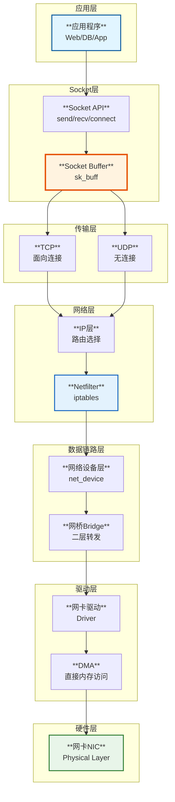

### 1.2 核心数据结构

| **层次** | **核心结构** | **功能** |
|---------|-------------|---------|
| **应用层** | file descriptor | 文件描述符 |
| **Socket层** | struct socket | Socket抽象 |
| **传输层** | struct sk_buff | 数据包缓冲区 |
| **网络层** | struct iphdr | IP头部 |
| **链路层** | struct net_device | 网络设备 |
| **硬件层** | struct pci_dev | PCI设备 |

## 2. 数据包接收流程（RX）

### 2.1 接收路径架构图

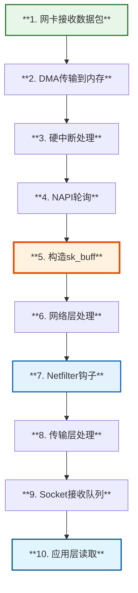

### 2.2 接收流程时序图

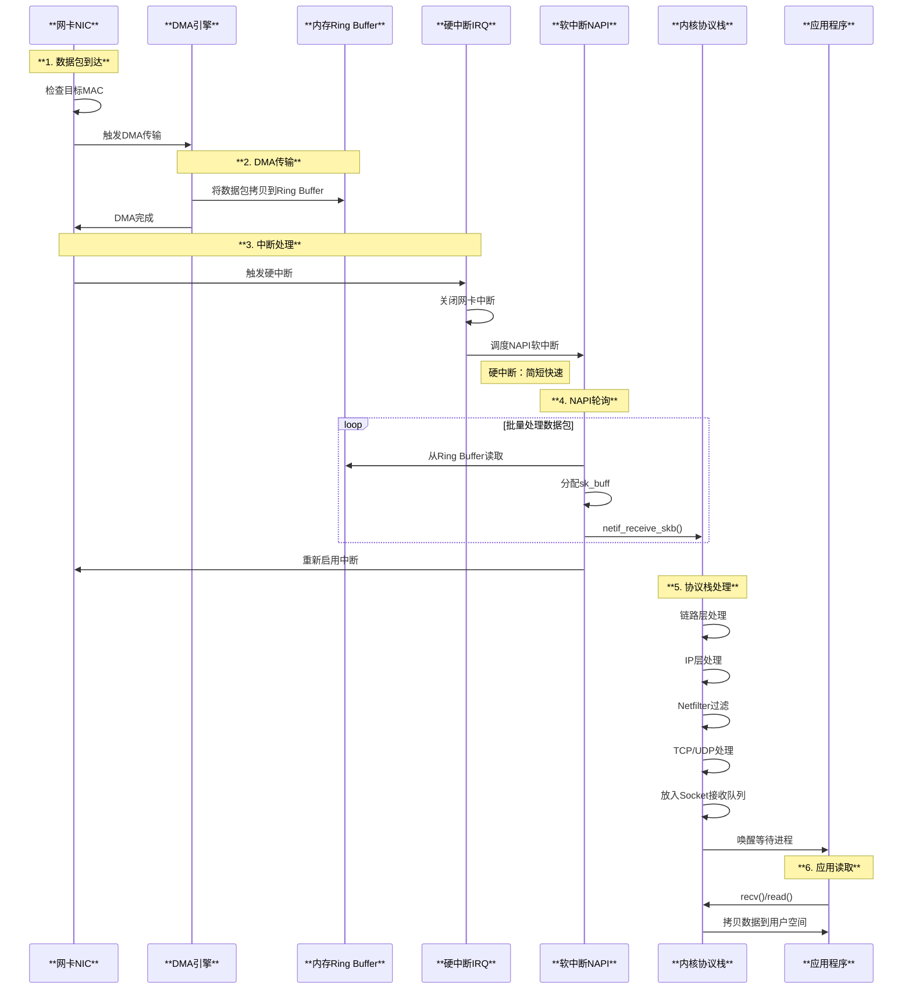

### 2.3 网卡中断处理

源码分析 `net/core/dev.c`:

```c
/**
 * netif_rx - 接收数据包入口
 * @skb: 数据包缓冲区
 * 
 * 从设备驱动接收数据包，将其放入处理队列
 */
int netif_rx(struct sk_buff *skb)
{
    int ret;
    
    // 记录时间戳
    net_timestamp_check(READ_ONCE(net_hotdata.tstamp_prequeue), skb);
    
    trace_netif_rx(skb);
    
#ifdef CONFIG_RPS
    // RPS (Receive Packet Steering) - 多核负载均衡
    if (static_branch_unlikely(&rps_needed)) {
        int cpu;
        rcu_read_lock();
        
        // 根据数据包特征选择CPU
        cpu = get_rps_cpu(skb->dev, skb, &rflow);
        if (cpu < 0)
            cpu = smp_processor_id();
            
        // 放入对应CPU的队列
        ret = enqueue_to_backlog(skb, cpu, &rflow->last_qtail);
        rcu_read_unlock();
    }
#endif
    
    return ret;
}

/**
 * netif_receive_skb - 处理接收到的数据包
 * @skb: 数据包
 * 
 * 主要的接收数据处理函数，调用协议栈各层处理
 */
int netif_receive_skb(struct sk_buff *skb)
{
    int ret;
    
    trace_netif_receive_skb_entry(skb);
    
    ret = netif_receive_skb_internal(skb);
    
    trace_netif_receive_skb_exit(ret);
    
    return ret;
}
```

### 2.4 NAPI (New API) 机制

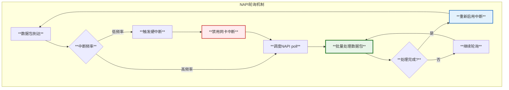

**NAPI优点：**
- **减少中断数量**：高负载时用轮询代替中断
- **批量处理**：一次处理多个数据包
- **提高吞吐量**：减少上下文切换开销

## 3. sk_buff核心数据结构

### 3.1 sk_buff结构图

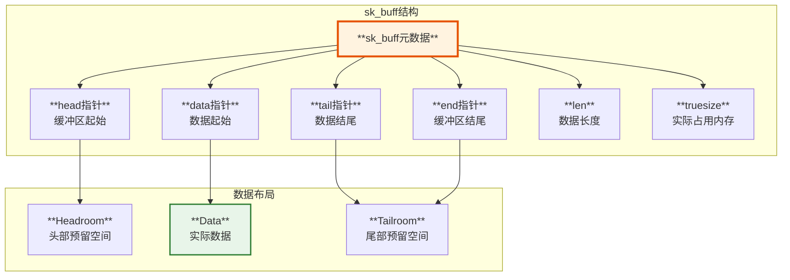

源码 `include/linux/skbuff.h`:

```c
/**
 * struct sk_buff - socket buffer
 * @next: 链表下一个skb
 * @prev: 链表前一个skb
 * @sk: 关联的socket
 * @dev: 关联的网络设备
 * @len: 数据长度
 * @data_len: 分片数据长度
 * @mac_len: MAC头长度
 * @head: 缓冲区起始指针
 * @data: 数据起始指针
 * @tail: 数据结束指针
 * @end: 缓冲区结束指针
 * @destructor: 析构函数
 * @truesize: 实际占用的内存大小
 */
struct sk_buff {
    union {
        struct {
            struct sk_buff *next;    // 链表指针
            struct sk_buff *prev;
            union {
                struct net_device *dev;
                unsigned long dev_scratch;
            };
        };
        struct rb_node rbnode;
        struct list_head list;
    };
    
    union {
        struct sock *sk;
        int ip_defrag_offset;
    };
    
    // 时间戳
    union {
        ktime_t tstamp;
        u64 skb_mstamp_ns;
    };
    
    // 数据指针
    unsigned char *head;     // 缓冲区开始
    unsigned char *data;     // 数据开始
    unsigned char *tail;     // 数据结束
    unsigned char *end;      // 缓冲区结束
    
    // 数据长度
    unsigned int len;        // 数据总长度
    unsigned int data_len;   // 非线性数据长度
    __u16 mac_len;           // MAC头长度
    __u16 hdr_len;           // 可写头长度
    
    // 校验和
    __wsum csum;
    __u32 priority;
    
    // 引用计数
    refcount_t users;
    
    // 析构函数
    void (*destructor)(struct sk_buff *skb);
    
    // 实际内存大小
    unsigned int truesize;
};
```

### 3.2 sk_buff操作

```c
// 分配sk_buff
struct sk_buff *alloc_skb(unsigned int size, gfp_t priority);

// 在头部预留空间
void skb_reserve(struct sk_buff *skb, int len);

// 在头部添加数据
unsigned char *skb_push(struct sk_buff *skb, unsigned int len);

// 在尾部添加数据
unsigned char *skb_put(struct sk_buff *skb, unsigned int len);

// 从头部移除数据
unsigned char *skb_pull(struct sk_buff *skb, unsigned int len);

// 复制sk_buff
struct sk_buff *skb_clone(struct sk_buff *skb, gfp_t priority);
```

### 3.3 协议头操作

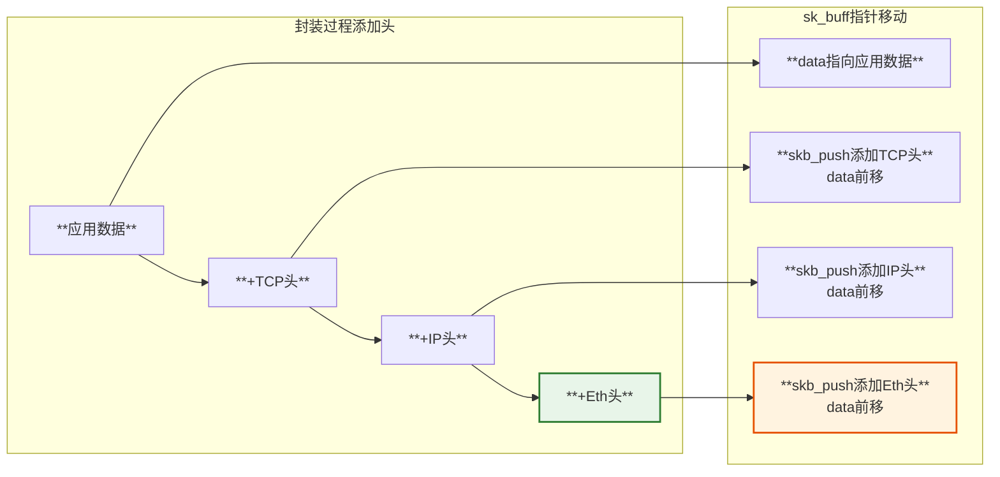

## 4. IP层处理

### 4.1 IP数据包处理流程

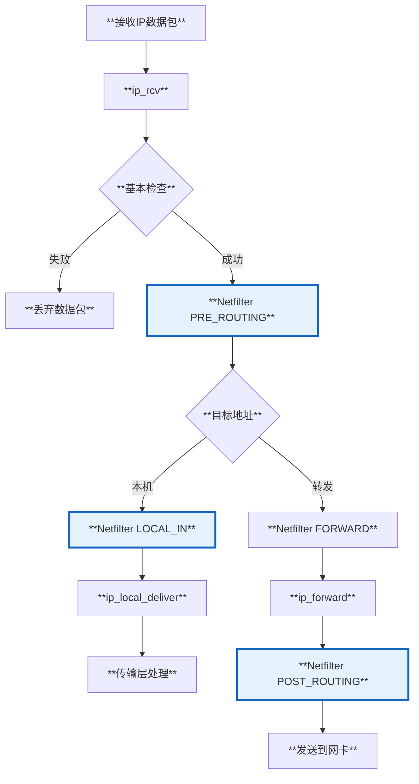

源码 `net/ipv4/ip_input.c`:

```c
/*
 * IP接收入口函数
 */
int ip_rcv(struct sk_buff *skb, struct net_device *dev,
           struct packet_type *pt, struct net_device *orig_dev)
{
    struct net *net = dev_net(dev);
    
    // 基本检查
    skb = ip_rcv_core(skb, net);
    if (skb == NULL)
        return NET_RX_DROP;
        
    // Netfilter PRE_ROUTING钩子
    return NF_HOOK(NFPROTO_IPV4, NF_INET_PRE_ROUTING,
                   net, NULL, skb, dev, NULL,
                   ip_rcv_finish);
}

/*
 * IP接收完成处理
 */
static int ip_rcv_finish(struct net *net, struct sock *sk, struct sk_buff *skb)
{
    struct net_device *dev = skb->dev;
    int ret;
    
    // 路由查找
    ret = ip_rcv_finish_core(net, sk, skb, dev, NULL);
    if (ret != NET_RX_DROP)
        ret = dst_input(skb);  // 根据路由表决定转发或本地投递
    return ret;
}

/*
 * 本地投递
 */
int ip_local_deliver(struct sk_buff *skb)
{
    struct net *net = dev_net(skb->dev);
    
    // 处理IP分片重组
    if (ip_is_fragment(ip_hdr(skb))) {
        if (ip_defrag(net, skb, IP_DEFRAG_LOCAL_DELIVER))
            return 0;
    }
    
    // Netfilter LOCAL_IN钩子
    return NF_HOOK(NFPROTO_IPV4, NF_INET_LOCAL_IN,
                   net, NULL, skb, skb->dev, NULL,
                   ip_local_deliver_finish);
}
```

### 4.2 IP路由表

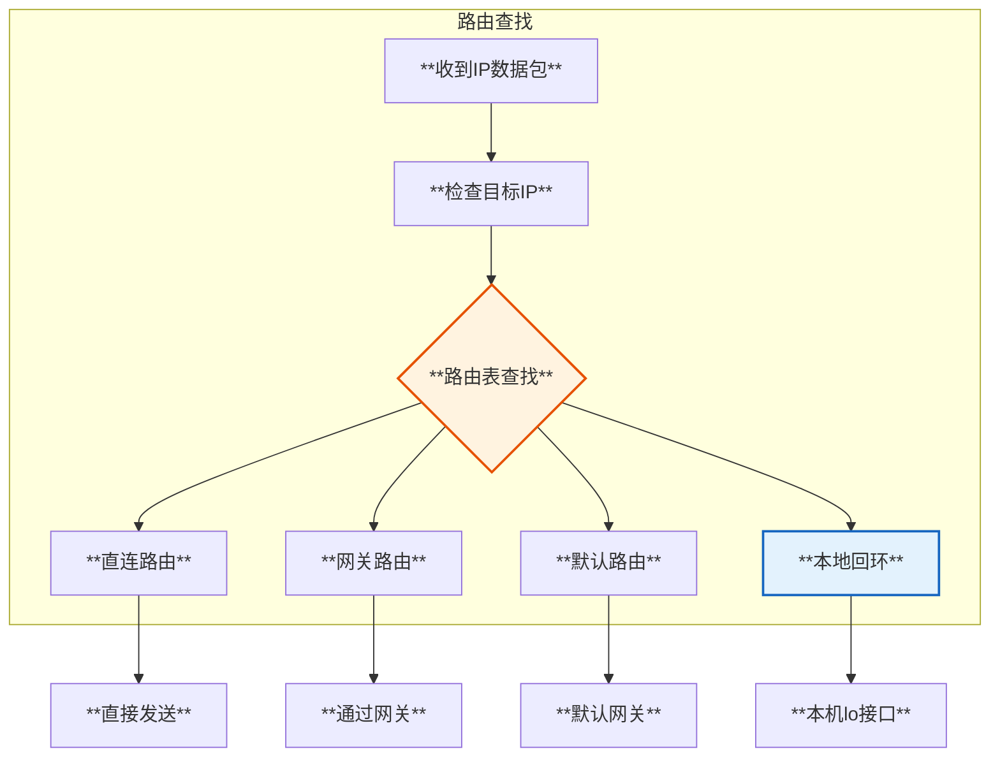

## 5. Netfilter 和 iptables

### 5.1 Netfilter钩子点

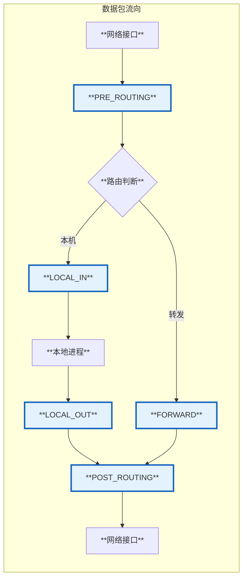

### 5.2 Netfilter五个钩子点

| **钩子点** | **位置** | **用途** |
|-----------|---------|---------|
| **NF_INET_PRE_ROUTING** | 路由前 | DNAT、连接跟踪 |
| **NF_INET_LOCAL_IN** | 本地接收 | INPUT链过滤 |
| **NF_INET_FORWARD** | 转发 | FORWARD链过滤 |
| **NF_INET_LOCAL_OUT** | 本地发送 | OUTPUT链过滤 |
| **NF_INET_POST_ROUTING** | 路由后 | SNAT、MASQUERADE |

### 5.3 iptables表和链

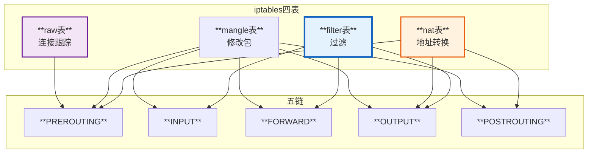

源码 `net/netfilter/core.c`:

```c
/*
 * Netfilter钩子调用
 */
int nf_hook_slow(struct sk_buff *skb, struct nf_hook_state *state,
                 const struct nf_hook_entries *e, unsigned int s)
{
    unsigned int verdict;
    int ret;
    
    for (; s < e->num_hook_entries; s++) {
        // 调用每个注册的钩子函数
        verdict = nf_hook_entry_hookfn(&e->hooks[s], skb, state);
        
        switch (verdict & NF_VERDICT_MASK) {
        case NF_ACCEPT:
            // 接受，继续处理
            break;
        case NF_DROP:
            // 丢弃数据包
            kfree_skb(skb);
            ret = NF_DROP_GETERR(verdict);
            return ret;
        case NF_QUEUE:
            // 放入队列
            ret = nf_queue(skb, state, s, verdict);
            return ret;
        case NF_STOLEN:
            // 被钩子偷走
            return NF_DROP_GETERR(verdict);
        default:
            // 其他情况
            WARN_ON_ONCE(1);
            return 0;
        }
    }
    
    return 1;
}
```

## 6. TCP/UDP传输层

### 6.1 TCP处理流程

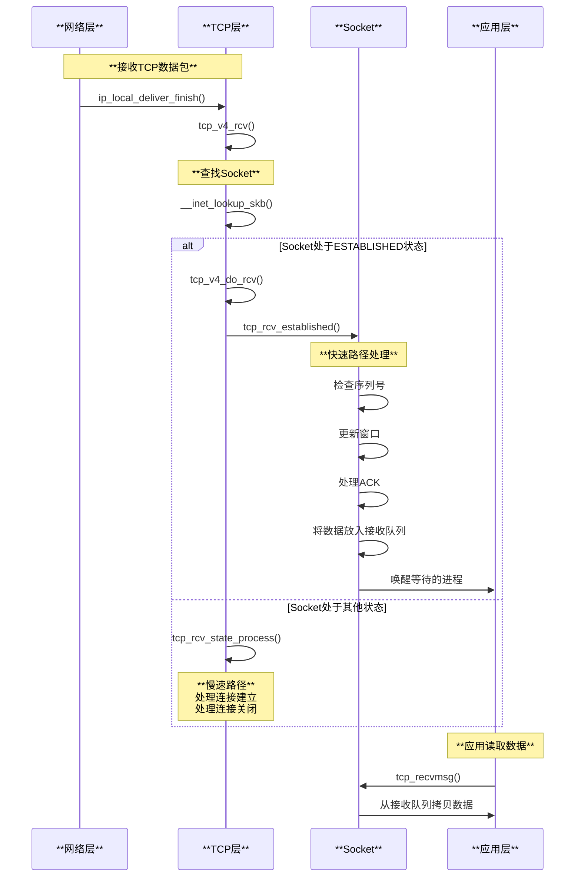

源码 `net/ipv4/tcp_ipv4.c`:

```c
/*
 * TCP数据包接收处理
 */
int tcp_v4_rcv(struct sk_buff *skb)
{
    struct net *net = dev_net(skb->dev);
    struct sock *sk;
    const struct tcphdr *th;
    
    // 获取TCP头
    th = tcp_hdr(skb);
    
    // 查找socket
    sk = __inet_lookup_skb(&tcp_hashinfo, skb, __tcp_hdrlen(th),
                           th->source, th->dest, inet_sdif(skb), &refcounted);
    if (!sk)
        goto no_tcp_socket;
        
    // 根据socket状态处理
    if (sk->sk_state == TCP_ESTABLISHED) {
        // 快速路径
        ret = tcp_v4_do_rcv(sk, skb);
    } else {
        // 慢速路径
        if (!sock_owned_by_user(sk)) {
            ret = tcp_v4_do_rcv(sk, skb);
        } else {
            // socket被用户空间锁定，放入backlog
            __sk_add_backlog(sk, skb);
        }
    }
    
    return ret;
    
no_tcp_socket:
    // 没有找到对应的socket，发送RST
    tcp_v4_send_reset(NULL, skb);
    kfree_skb(skb);
    return 0;
}
```

### 6.2 TCP三次握手

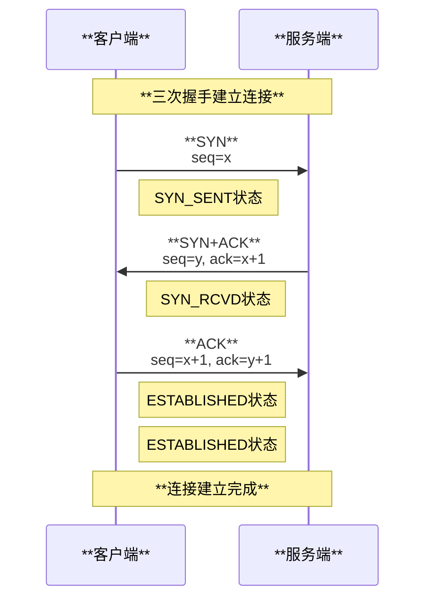

### 6.3 UDP处理

UDP比TCP简单，无连接、无状态。

```c
// net/ipv4/udp.c
int udp_rcv(struct sk_buff *skb)
{
    return __udp4_lib_rcv(skb, &udp_table, IPPROTO_UDP);
}

int __udp4_lib_rcv(struct sk_buff *skb, struct udp_table *udptable,
                   int proto)
{
    struct sock *sk;
    struct udphdr *uh;
    
    uh = udp_hdr(skb);
    
    // 查找socket
    sk = __udp4_lib_lookup_skb(skb, uh->source, uh->dest, udptable);
    
    if (sk) {
        // 找到socket，投递数据
        int ret = udp_queue_rcv_skb(sk, skb);
        return ret;
    }
    
    // 没有找到socket，发送ICMP端口不可达
    icmp_send(skb, ICMP_DEST_UNREACH, ICMP_PORT_UNREACH, 0);
    kfree_skb(skb);
    return 0;
}
```

## 7. Socket层

### 7.1 Socket结构

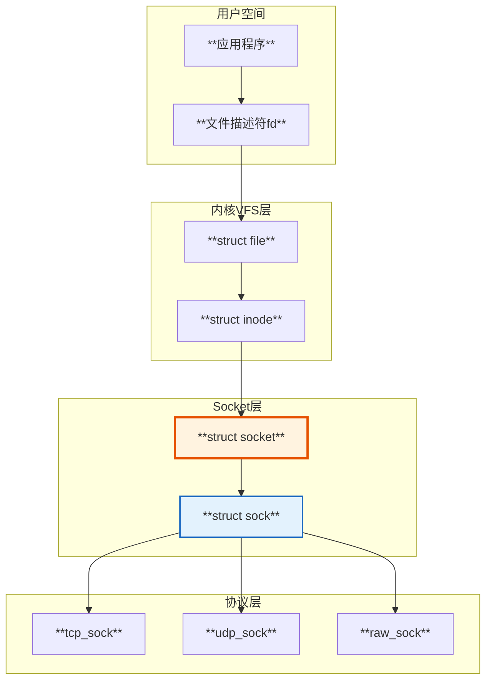

源码 `include/linux/net.h` 和 `include/net/sock.h`:

```c
/**
 * struct socket - 通用BSD socket
 */
struct socket {
    socket_state state;           // socket状态
    short type;                   // SOCK_STREAM/SOCK_DGRAM等
    unsigned long flags;
    struct file *file;            // 关联的文件
    struct sock *sk;              // 网络层socket
    const struct proto_ops *ops;  // 协议操作函数
    struct socket_wq wq;          // 等待队列
};

/**
 * struct sock - 网络层socket
 */
struct sock {
    struct sock_common __sk_common;
    
    // 接收队列
    struct sk_buff_head sk_receive_queue;
    // 发送队列  
    struct sk_buff_head sk_write_queue;
    
    // Socket缓冲区大小
    int sk_sndbuf;                // 发送缓冲区
    int sk_rcvbuf;                // 接收缓冲区
    
    // 等待队列
    wait_queue_head_t *sk_sleep;
    
    // 回调函数
    void (*sk_state_change)(struct sock *sk);
    void (*sk_data_ready)(struct sock *sk);
    void (*sk_write_space)(struct sock *sk);
    void (*sk_error_report)(struct sock *sk);
    
    // 协议相关
    struct proto *sk_prot;
};
```

### 7.2 Socket系统调用

```mermaid
graph TD
    A[**socket()**<br/>创建socket] --> B[**bind()**<br/>绑定地址]
    B --> C{**TCP or UDP?**}
    
    C -->|TCP服务端| D[**listen()**<br/>监听]
    D --> E[**accept()**<br/>接受连接]
    
    C -->|TCP客户端| F[**connect()**<br/>连接服务器]
    
    C -->|UDP| G[**直接通信**]
    
    E --> H[**send()/recv()**<br/>发送接收数据]
    F --> H
    G --> I[**sendto()/recvfrom()**<br/>发送接收数据]
    
    H --> J[**close()**<br/>关闭连接]
    I --> J
    
    style A fill:#e1f5ff,stroke:#01579b,stroke-width:2px
    style F fill:#fff3e0,stroke:#e65100,stroke-width:2px
    style H fill:#e8f5e9,stroke:#2e7d32,stroke-width:2px
```

## 8. 数据包发送流程（TX）

### 8.1 发送路径

```mermaid
graph TD
    A[**应用调用send()**] --> B[**tcp_sendmsg()**]
    B --> C[**构造sk_buff**]
    C --> D[**tcp_write_xmit()**]
    D --> E[**ip_queue_xmit()**]
    E --> F[**Netfilter LOCAL_OUT**]
    F --> G[**ip_output()**]
    G --> H[**Netfilter POST_ROUTING**]
    H --> I[**dev_queue_xmit()**]
    I --> J[**qdisc排队**]
    J --> K[**网卡驱动发送**]
    K --> L[**DMA传输**]
    L --> M[**网卡发送**]
    
    style C fill:#fff3e0,stroke:#e65100,stroke-width:2px
    style F fill:#e3f2fd,stroke:#1565c0,stroke-width:2px
    style H fill:#e3f2fd,stroke:#1565c0,stroke-width:2px
    style M fill:#e8f5e9,stroke:#2e7d32,stroke-width:2px
```

### 8.2 发送时序图

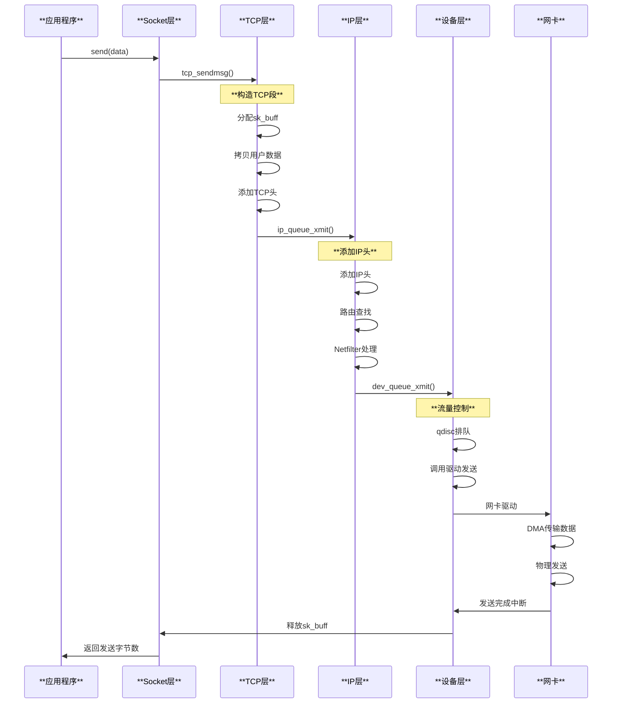

## 9. veth pair虚拟网络设备

### 9.1 veth pair概念

veth (Virtual Ethernet) pair是一对虚拟网络设备，它们像一根网线的两端，从一端发送的数据会从另一端接收。

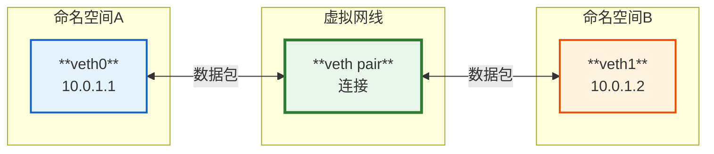

### 9.2 veth实现原理

源码 `drivers/net/veth.c`:

```c
/*
 * veth设备的发送函数
 */
static netdev_tx_t veth_xmit(struct sk_buff *skb, struct net_device *dev)
{
    struct veth_priv *priv = netdev_priv(dev);
    struct net_device *rcv;
    int length = skb->len;
    
    rcu_read_lock();
    // 获取对端设备
    rcv = rcu_dereference(priv->peer);
    
    if (unlikely(!rcv)) {
        kfree_skb(skb);
        goto drop;
    }
    
    // 将数据包直接送到对端设备的接收队列
    if (likely(veth_forward_skb(rcv, skb, rq, rcv_xdp) == NET_RX_SUCCESS)) {
        // 更新统计信息
        dev->stats.tx_bytes += length;
        dev->stats.tx_packets++;
    } else {
drop:
        dev->stats.tx_dropped++;
    }
    
    rcu_read_unlock();
    return NETDEV_TX_OK;
}

/*
 * 转发skb到对端
 */
static int veth_forward_skb(struct net_device *dev, struct sk_buff *skb,
                            struct veth_rq *rq, bool xdp)
{
    // 直接调用对端的接收函数
    return __dev_forward_skb(dev, skb) ?: xdp ?
        veth_xdp_rx(rq, skb) :
        netif_rx(skb);  // 送入接收队列
}
```

### 9.3 veth使用场景

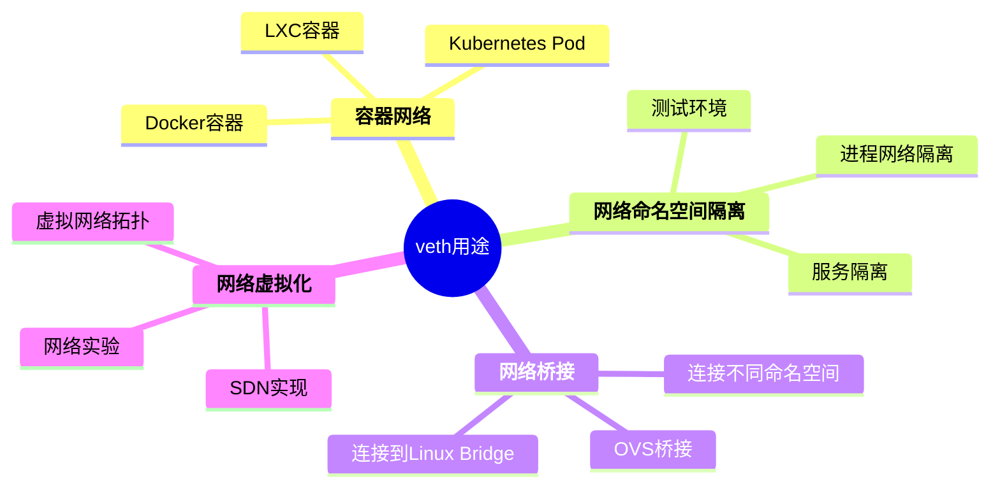

### 9.4 创建veth pair

```bash
# 创建veth pair
ip link add veth0 type veth peer name veth1

# 查看设备
ip link show veth0
ip link show veth1

# 将veth1移动到新的命名空间
ip netns add ns1
ip link set veth1 netns ns1

# 配置IP地址
ip addr add 10.0.1.1/24 dev veth0
ip netns exec ns1 ip addr add 10.0.1.2/24 dev veth1

# 启动设备
ip link set veth0 up
ip netns exec ns1 ip link set veth1 up

# 测试连通性
ping 10.0.1.2
```

## 10. 容器网络

### 10.1 容器网络模式

```mermaid
graph TB
    subgraph 主机
        A[**物理网卡eth0**]
        B[**Linux Bridge docker0**]
        
        subgraph 容器1
            C1[**eth0@container1**]
            V1[**veth-xxx**]
        end
        
        subgraph 容器2
            C2[**eth0@container2**]
            V2[**veth-yyy**]
        end
    end
    
    A <--> B
    B <--> V1
    B <--> V2
    V1 <--> C1
    V2 <--> C2
    
    style A fill:#e8f5e9,stroke:#2e7d32,stroke-width:2px
    style B fill:#fff3e0,stroke:#e65100,stroke-width:3px
    style C1 fill:#e3f2fd,stroke:#1565c0,stroke-width:2px
    style C2 fill:#e3f2fd,stroke:#1565c0,stroke-width:2px
```

### 10.2 Docker网络架构

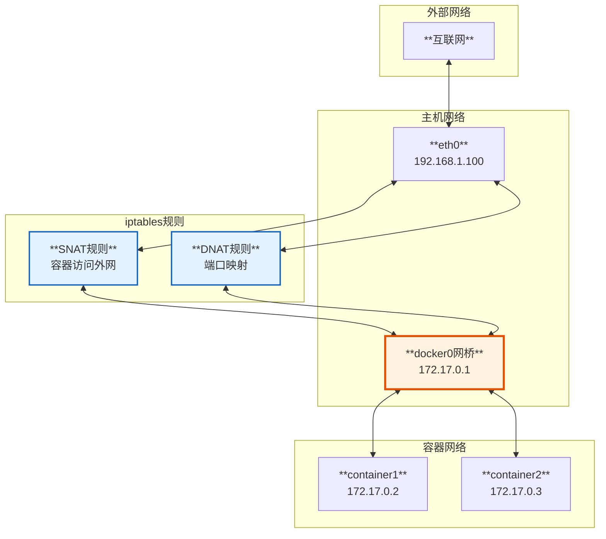

### 10.3 容器网络流量路径

#### 10.3.1 容器访问外网

```mermaid
sequenceDiagram
    participant C as **容器**<br/>172.17.0.2
    participant V as **veth pair**
    participant B as **docker0桥**
    participant I as **iptables**
    participant E as **eth0物理网卡**
    participant N as **外部网络**
    
    Note over C,N: **容器访问外网**
    
    C->>V: 发送数据包<br/>src=172.17.0.2
    V->>B: 转发到网桥
    B->>I: POSTROUTING链
    
    Note over I: **SNAT转换**
    I->>I: src: 172.17.0.2 → 192.168.1.100
    
    I->>E: 转发到物理网卡
    E->>N: 发送到外网
    
    Note over N,C: **返回数据包**
    N->>E: dst=192.168.1.100
    E->>I: PREROUTING链
    
    Note over I: **DNAT转换**
    I->>I: dst: 192.168.1.100 → 172.17.0.2
    
    I->>B: 转发到网桥
    B->>V: 查找容器
    V->>C: 送达容器
```

#### 10.3.2 外网访问容器（端口映射）

```bash
# Docker端口映射示例
# -p 8080:80 表示主机8080端口映射到容器80端口
docker run -p 8080:80 nginx

# 对应的iptables规则
iptables -t nat -A DOCKER -p tcp --dport 8080 \
    -j DNAT --to-destination 172.17.0.2:80
```

```mermaid
sequenceDiagram
    participant N as **外部客户端**
    participant E as **eth0**<br/>192.168.1.100:8080
    participant I as **iptables**
    participant B as **docker0桥**
    participant C as **容器**<br/>172.17.0.2:80
    
    Note over N,C: **外网访问容器服务**
    
    N->>E: 请求<br/>dst=192.168.1.100:8080
    E->>I: PREROUTING链
    
    Note over I: **DNAT端口映射**
    I->>I: dst: 192.168.1.100:8080<br/>→ 172.17.0.2:80
    
    I->>B: 路由到docker0
    B->>C: 转发到容器
    
    Note over C: **容器处理请求**
    
    C->>B: 响应<br/>src=172.17.0.2:80
    B->>I: POSTROUTING链
    
    Note over I: **SNAT源地址转换**
    I->>I: src: 172.17.0.2:80<br/>→ 192.168.1.100:8080
    
    I->>E: 转发
    E->>N: 返回响应
```

### 10.4 Kubernetes网络

#### 10.4.1 Kubernetes Pod网络模型

```mermaid
graph TB
    subgraph Node1
        P1[**Pod1**<br/>10.244.1.10]
        P2[**Pod2**<br/>10.244.1.11]
        C1[**cni0网桥**]
    end
    
    subgraph Node2
        P3[**Pod3**<br/>10.244.2.10]
        P4[**Pod4**<br/>10.244.2.11]
        C2[**cni0网桥**]
    end
    
    subgraph CNI网络插件
        N[**Flannel/Calico/Cilium**<br/>跨节点通信]
    end
    
    P1 --> C1
    P2 --> C1
    P3 --> C2
    P4 --> C2
    C1 --> N
    C2 --> N
    
    style P1 fill:#e3f2fd,stroke:#1565c0,stroke-width:2px
    style P3 fill:#fff3e0,stroke:#e65100,stroke-width:2px
    style N fill:#e8f5e9,stroke:#2e7d32,stroke-width:3px
```

#### 10.4.2 Kubernetes Service流量

```mermaid
graph LR
    subgraph 客户端Pod
        C[**Client Pod**]
    end
    
    subgraph Service
        S[**ClusterIP Service**<br/>10.96.0.100:80]
    end
    
    subgraph kube-proxy
        K[**iptables/IPVS规则**]
    end
    
    subgraph 后端Pods
        P1[**Pod1**<br/>10.244.1.10:8080]
        P2[**Pod2**<br/>10.244.2.20:8080]
        P3[**Pod3**<br/>10.244.3.30:8080]
    end
    
    C -->|访问Service IP| S
    S -->|iptables DNAT| K
    K -->|负载均衡| P1
    K -->|负载均衡| P2
    K -->|负载均衡| P3
    
    style S fill:#fff3e0,stroke:#e65100,stroke-width:3px
    style K fill:#e3f2fd,stroke:#1565c0,stroke-width:2px
```

### 10.5 容器 vs 物理机网络对比

| **方面** | **物理机** | **容器** |
|---------|-----------|---------|
| **网络设备** | 物理网卡 | veth虚拟设备 |
| **网络命名空间** | 共享主机命名空间 | 独立命名空间 |
| **IP地址** | 主机IP | 容器独立IP |
| **网络隔离** | 无隔离 | 完全隔离 |
| **网络性能** | 最高 | 略低（veth开销） |
| **NAT** | 可选 | 通常需要 |
| **端口冲突** | 可能冲突 | 隔离无冲突 |

## 11. 网络设备抽象

### 11.1 net_device结构

```mermaid
graph TB
    subgraph net_device核心
        A[**name**<br/>设备名称eth0]
        B[**ifindex**<br/>接口索引]
        C[**mtu**<br/>最大传输单元]
        D[**flags**<br/>IFF_UP等]
        E[**dev_addr**<br/>MAC地址]
    end
    
    subgraph 操作函数
        F[**ndo_start_xmit**<br/>发送函数]
        G[**ndo_open**<br/>打开设备]
        H[**ndo_stop**<br/>关闭设备]
        I[**ndo_get_stats**<br/>获取统计]
    end
    
    subgraph 队列
        J[**tx_queue**<br/>发送队列]
        K[**rx_queue**<br/>接收队列]
    end
    
    A --> F
    B --> G
    C --> H
    D --> I
    E --> J
    J --> K
    
    style A fill:#fff3e0,stroke:#e65100,stroke-width:2px
    style F fill:#e3f2fd,stroke:#1565c0,stroke-width:2px
```

## 12. DMA (Direct Memory Access)

### 12.1 DMA工作原理

```mermaid
sequenceDiagram
    participant C as **CPU**
    participant D as **DMA控制器**
    participant M as **内存**
    participant N as **网卡**
    
    Note over C,N: **数据包接收（DMA方式）**
    
    C->>D: 初始化DMA<br/>设置Ring Buffer地址
    C->>N: 启动网卡接收
    
    Note over N: **数据包到达**
    N->>D: 请求DMA传输
    D->>M: 直接写入Ring Buffer
    Note right of D: **CPU不参与数据拷贝**
    
    D->>N: DMA完成
    N->>C: 触发中断
    
    Note over C: **CPU只处理中断**<br/>无需拷贝数据
```

### 12.2 Ring Buffer机制

```mermaid
graph TB
    subgraph Ring Buffer环形缓冲区
        R0[**Desc 0**]
        R1[**Desc 1**]
        R2[**Desc 2**]
        R3[**Desc 3**]
        R4[**...Desc N**]
    end
    
    subgraph 描述符内容
        D[**物理地址**<br/>数据包位置]
        S[**长度**<br/>数据包大小]
        F[**标志位**<br/>Own/Ready]
    end
    
    R0 --> R1
    R1 --> R2
    R2 --> R3
    R3 --> R4
    R4 -.循环.-> R0
    
    R1 --> D
    R1 --> S
    R1 --> F
    
    style R1 fill:#e8f5e9,stroke:#2e7d32,stroke-width:3px
    style D fill:#fff3e0,stroke:#e65100,stroke-width:2px
```

**DMA优势：**
- ✅ **零拷贝**：数据直接在内存和设备间传输
- ✅ **降低CPU负载**：CPU无需参与数据拷贝
- ✅ **提高吞吐量**：并行处理，不阻塞CPU
- ✅ **降低延迟**：减少数据拷贝次数

## 13. 完整数据流图

### 13.1 接收完整流程

```mermaid
graph TD
    A[**1. 数据包到达网卡**] --> B[**2. 网卡DMA到Ring Buffer**]
    B --> C[**3. 触发硬中断**]
    C --> D[**4. 驱动处理**<br/>分配sk_buff]
    D --> E[**5. NAPI软中断**<br/>批量处理]
    E --> F[**6. netif_receive_skb**<br/>进入协议栈]
    F --> G[**7. 链路层处理**<br/>去除Eth头]
    G --> H[**8. Netfilter PRE_ROUTING**]
    H --> I[**9. 路由判断**]
    I -->|本机| J[**10. Netfilter LOCAL_IN**]
    I -->|转发| K[**Netfilter FORWARD**]
    J --> L[**11. IP层处理**<br/>去除IP头]
    L --> M[**12. TCP/UDP处理**]
    M --> N[**13. 查找Socket**]
    N --> O[**14. 放入Socket接收队列**]
    O --> P[**15. 唤醒应用进程**]
    P --> Q[**16. 应用读取数据**<br/>recv()/read()]
    
    style A fill:#e8f5e9,stroke:#2e7d32,stroke-width:2px
    style E fill:#fff3e0,stroke:#e65100,stroke-width:2px
    style H fill:#e3f2fd,stroke:#1565c0,stroke-width:2px
    style J fill:#e3f2fd,stroke:#1565c0,stroke-width:2px
    style Q fill:#e1f5ff,stroke:#01579b,stroke-width:2px
```

### 13.2 发送完整流程

```mermaid
graph TD
    A[**1. 应用调用send()**] --> B[**2. Socket层处理**]
    B --> C[**3. TCP/UDP层**<br/>添加传输层头]
    C --> D[**4. IP层处理**<br/>添加IP头]
    D --> E[**5. Netfilter LOCAL_OUT**]
    E --> F[**6. 路由查找**]
    F --> G[**7. Netfilter POST_ROUTING**]
    G --> H[**8. 链路层**<br/>添加Eth头]
    H --> I[**9. dev_queue_xmit**<br/>设备队列]
    I --> J[**10. qdisc流量控制**]
    J --> K[**11. 网卡驱动发送**]
    K --> L[**12. DMA传输到网卡**]
    L --> M[**13. 网卡物理发送**]
    M --> N[**14. 发送完成中断**]
    N --> O[**15. 释放sk_buff**]
    
    style A fill:#e1f5ff,stroke:#01579b,stroke-width:2px
    style E fill:#e3f2fd,stroke:#1565c0,stroke-width:2px
    style G fill:#e3f2fd,stroke:#1565c0,stroke-width:2px
    style L fill:#fff3e0,stroke:#e65100,stroke-width:2px
    style M fill:#e8f5e9,stroke:#2e7d32,stroke-width:2px
```

## 14. 性能优化

### 14.1 网络性能优化点

```mermaid
mindmap
  root((网络性能优化))
    **硬件层**
      RSS多队列
      网卡Offload
      中断合并
      DMA优化
    **驱动层**
      NAPI机制
      Ring Buffer大小
      中断亲和性
      批量处理
    **协议栈**
      TCP窗口调优
      拥塞控制算法
      零拷贝技术
      Sendfile/Splice
    **应用层**
      异步IO
      批量发送
      连接复用
      缓冲区调优
```

### 14.2 关键优化参数

```bash
# 网卡Ring Buffer大小
ethtool -G eth0 rx 4096 tx 4096

# TCP窗口大小
sysctl -w net.ipv4.tcp_rmem="4096 87380 16777216"
sysctl -w net.ipv4.tcp_wmem="4096 16384 16777216"

# 启用TCP Fast Open
sysctl -w net.ipv4.tcp_fastopen=3

# RSS队列数（需要网卡支持）
ethtool -L eth0 combined 4

# 中断合并
ethtool -C eth0 rx-usecs 50

# backlog队列大小
sysctl -w net.core.netdev_max_backlog=5000
```

## 15. 源码关键路径总结

### 15.1 关键源码文件

| **功能** | **源码路径** | **说明** |
|---------|-------------|---------|
| **网卡驱动** | `drivers/net/` | 各类网卡驱动 |
| **sk_buff** | `net/core/skbuff.c` | 数据包缓冲区 |
| **设备层** | `net/core/dev.c` | 网络设备核心 |
| **IP层** | `net/ipv4/ip_input.c` | IP接收处理 |
| **TCP层** | `net/ipv4/tcp.c` | TCP核心实现 |
| **Socket层** | `net/socket.c` | Socket系统调用 |
| **Netfilter** | `net/netfilter/core.c` | Netfilter钩子 |
| **veth** | `drivers/net/veth.c` | veth虚拟设备 |

### 15.2 关键函数调用链

#### 接收路径
```
网卡驱动中断
  → napi_schedule()
  → __napi_poll()
  → netif_receive_skb()
  → __netif_receive_skb_core()
  → ip_rcv()
  → NF_HOOK(PRE_ROUTING)
  → ip_local_deliver()
  → NF_HOOK(LOCAL_IN)
  → tcp_v4_rcv()
  → tcp_v4_do_rcv()
  → tcp_rcv_established()
  → tcp_queue_rcv()
  → sk_data_ready()
  → wake_up_interruptible()
```

#### 发送路径
```
send() 系统调用
  → tcp_sendmsg()
  → tcp_write_xmit()
  → tcp_transmit_skb()
  → ip_queue_xmit()
  → NF_HOOK(LOCAL_OUT)
  → ip_output()
  → NF_HOOK(POST_ROUTING)
  → ip_finish_output()
  → dev_queue_xmit()
  → __dev_xmit_skb()
  → sch_direct_xmit()
  → dev_hard_start_xmit()
  → ndo_start_xmit() [网卡驱动]
```

---

**文档基于Linux内核源码分析**
- 内核版本：基于最新主线
- 主要源码路径：
  - `net/core/` - 网络核心层
  - `net/ipv4/` - IPv4协议栈
  - `net/netfilter/` - Netfilter框架
  - `drivers/net/` - 网络设备驱动

**参考资料**
- Linux网络子系统源码
- TCP/IP协议栈实现
- Docker/Kubernetes网络模型
- veth虚拟设备实现

