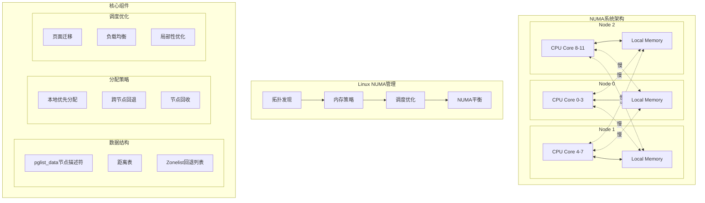

# Linux NUMA架构原理与实现

## 概述

NUMA (Non-Uniform Memory Access, 非均匀内存访问) 是现代多核、多插槽计算机系统中的一种内存架构设计。在NUMA系统中，内存访问时间依赖于处理器和内存的相对位置 - 访问本地内存比访问远程内存更快。Linux内核提供了完整的NUMA感知支持，包括拓扑发现、内存分配策略、进程调度优化等机制。

## 核心概念

### NUMA节点 (NUMA Nodes)

Linux将系统的硬件资源抽象为多个软件节点，每个节点可能包含：
- CPU核心
- 本地内存
- I/O总线和外围设备

**关键特征**：
- **本地访问优势**：访问同节点内存速度最快
- **远程访问延迟**：跨节点内存访问有额外延迟
- **可变配置**：节点可能是无内存节点或无CPU节点

### NUMA距离 (NUMA Distance)

节点间的相对访问成本用距离值表示：
- **本地距离** (`LOCAL_DISTANCE = 10`)：同节点内访问
- **远程距离** (`REMOTE_DISTANCE = 20`)：跨节点访问
- **自定义距离**：根据实际拓扑设置

## 核心数据结构

### 节点描述符 (pglist_data)

每个NUMA节点用 `pg_data_t` 结构表示，包含节点的所有内存管理信息：

```c
// 节点描述符 - include/linux/mmzone.h
typedef struct pglist_data {
    // 节点包含的所有内存区域
    struct zone node_zones[MAX_NR_ZONES];
    
    // 内存分配回退列表（按NUMA距离排序）
    struct zonelist node_zonelists[MAX_ZONELISTS];
    
    int nr_zones;                    // 该节点活跃zone数量
    struct page *node_mem_map;       // 页面描述符数组
    
    // 节点内存统计
    unsigned long node_start_pfn;    // 起始物理页帧号
    unsigned long node_present_pages; // 实际存在的页数
    unsigned long node_spanned_pages; // 跨越的总页数（包括洞）
    
    int node_id;                     // 节点ID
    
    // 页面回收相关
    wait_queue_head_t kswapd_wait;
    struct task_struct *kswapd;      // 页面回收守护进程
    
    // 内存压缩相关  
    struct task_struct *kcompactd;   // 内存压缩守护进程
    
#ifdef CONFIG_NUMA
    // NUMA专用字段
    unsigned long min_unmapped_pages; // 最小未映射页数
    unsigned long min_slab_pages;     // 最小slab页数
#endif

#ifdef CONFIG_NUMA_BALANCING
    // NUMA平衡相关
    unsigned int nbp_rl_start;       // 当前推广速率限制周期开始时间
    unsigned long nbp_rl_nr_cand;    // 推广候选页数
    unsigned int nbp_threshold;      // 推广阈值
#endif
} pg_data_t;

// 全局节点数组
extern struct pglist_data *node_data[MAX_NUMNODES];
#define NODE_DATA(nid) (node_data[nid])
```

### NUMA拓扑管理

```c
// NUMA拓扑类型 - kernel/sched/topology.c
enum numa_topology_type {
    NUMA_DIRECT,        // 直接连接：所有节点直连或非NUMA系统
    NUMA_GLUELESS_MESH, // 无胶网格：通过中间节点通信
    NUMA_BACKPLANE      // 背板架构：通过背板控制器通信
};

// 距离表管理 - mm/numa_memblks.c
static u8 *numa_distance;           // 节点间距离表
static int numa_distance_cnt;       // 距离表大小

// 获取节点间距离
int __node_distance(int from, int to)
{
    if (from >= numa_distance_cnt || to >= numa_distance_cnt)
        return from == to ? LOCAL_DISTANCE : REMOTE_DISTANCE;
    return numa_distance[from * numa_distance_cnt + to];
}

// 设置节点间距离
void __init numa_set_distance(int from, int to, int distance)
{
    if (!numa_distance && numa_alloc_distance() < 0)
        return;
        
    if (from >= numa_distance_cnt || to >= numa_distance_cnt ||
        from < 0 || to < 0) {
        pr_warn_once("Warning: node ids are out of bound\n");
        return;
    }
    
    numa_distance[from * numa_distance_cnt + to] = distance;
}
```

### CPU-NUMA映射

```c
// CPU到节点映射 - include/asm-generic/numa.h
extern cpumask_var_t node_to_cpumask_map[MAX_NUMNODES];

// 获取节点上的CPU掩码
static inline const struct cpumask *cpumask_of_node(int node)
{
    if (node == NUMA_NO_NODE)
        return cpu_all_mask;
    return node_to_cpumask_map[node];
}

// 获取CPU所属节点
#ifdef CONFIG_USE_PERCPU_NUMA_NODE_ID
DECLARE_PER_CPU(int, numa_node);
static inline int numa_node_id(void)
{
    return raw_cpu_read(numa_node);
}
#endif
```

## NUMA拓扑发现

### 拓扑类型识别

```c
// 拓扑类型初始化 - kernel/sched/topology.c
static void init_numa_topology_type(int offline_node)
{
    int a, b, c, n;
    n = sched_max_numa_distance;

    if (sched_domains_numa_levels <= 2) {
        sched_numa_topology_type = NUMA_DIRECT;
        return;
    }

    for_each_cpu_node_but(a, offline_node) {
        for_each_cpu_node_but(b, offline_node) {
            // 寻找距离最远的两个节点
            if (node_distance(a, b) < n)
                continue;

            // 检查是否存在中间节点
            for_each_cpu_node_but(c, offline_node) {
                if (node_distance(a, c) < n && node_distance(b, c) < n) {
                    sched_numa_topology_type = NUMA_GLUELESS_MESH;
                    return;
                }
            }
            
            sched_numa_topology_type = NUMA_BACKPLANE;
            return;
        }
    }
    
    sched_numa_topology_type = NUMA_DIRECT;
}
```

### 调度域初始化

```c
// NUMA调度域初始化
void sched_init_numa(int offline_node)
{
    struct sched_domain_topology_level *tl;
    unsigned long *distance_map;
    int nr_levels = 0;
    int i, j, *distances;
    struct cpumask ***masks;

    // 收集所有唯一的距离值
    distance_map = bitmap_alloc(NR_DISTANCE_VALUES, GFP_KERNEL);
    if (!distance_map)
        return;

    bitmap_zero(distance_map, NR_DISTANCE_VALUES);
    for_each_cpu_node_but(i, offline_node) {
        for_each_cpu_node_but(j, offline_node) {
            int distance = node_distance(i, j);
            if (distance < LOCAL_DISTANCE || 
                distance >= NR_DISTANCE_VALUES) {
                sched_numa_warn("Invalid distance value range");
                bitmap_free(distance_map);
                return;
            }
            bitmap_set(distance_map, distance, 1);
        }
    }
    
    nr_levels = bitmap_weight(distance_map, NR_DISTANCE_VALUES);
    distances = kcalloc(nr_levels, sizeof(int), GFP_KERNEL);
    
    // 为每个距离级别构建CPU掩码
    for (i = 0; i < nr_levels; i++) {
        masks[i] = kzalloc(nr_node_ids * sizeof(void *), GFP_KERNEL);
        
        for_each_cpu_node_but(j, offline_node) {
            struct cpumask *mask = kzalloc(cpumask_size(), GFP_KERNEL);
            masks[i][j] = mask;
            
            for_each_cpu_node_but(k, offline_node) {
                if (node_distance(j, k) > sched_domains_numa_distance[i])
                    continue;
                cpumask_or(mask, mask, cpumask_of_node(k));
            }
        }
    }
    
    rcu_assign_pointer(sched_domains_numa_masks, masks);
    sched_domains_numa_levels = nr_levels;
    
    init_numa_topology_type(offline_node);
}
```

## NUMA感知内存分配

### Zonelist构建

每个节点维护一个zonelist，按NUMA距离排序，用于内存分配回退：

```c
// 构建zonelist - mm/page_alloc.c
static void build_zonelists(pg_data_t *pgdat)
{
    static int node_order[MAX_NUMNODES];
    int node, nr_nodes = 0;
    nodemask_t used_mask = NODE_MASK_NONE;
    int local_node, prev_node;

    local_node = pgdat->node_id;
    prev_node = local_node;

    memset(node_order, 0, sizeof(node_order));
    
    // 按距离排序节点
    while ((node = find_next_best_node(local_node, &used_mask)) >= 0) {
        // 对相同距离组中的第一个节点增加惩罚，实现轮询
        if (node_distance(local_node, node) !=
            node_distance(local_node, prev_node))
            node_load[node] += 1;

        node_order[nr_nodes++] = node;
        prev_node = node;
    }

    build_zonelists_in_node_order(pgdat, node_order, nr_nodes);
}

// 寻找最佳下一个节点
int find_next_best_node(int node, nodemask_t *used_node_mask)
{
    int n, val;
    int min_val = INT_MAX;
    int best_node = NUMA_NO_NODE;

    // 优先使用本地节点（如果有内存）
    if (!node_isset(node, *used_node_mask) && node_state(node, N_MEMORY)) {
        node_set(node, *used_node_mask);
        return node;
    }

    for_each_node_state(n, N_MEMORY) {
        if (node_isset(n, *used_node_mask))
            continue;

        // 使用距离数组计算距离
        val = node_distance(node, n);

        // 惩罚序号较小的节点（"偏好下一个节点"）
        val += (n < node);

        // 偏好无头节点和未使用节点
        if (!cpumask_empty(cpumask_of_node(n)))
            val += PENALTY_FOR_NODE_WITH_CPUS;

        // 轻微偏好负载较少的节点
        val *= MAX_NUMNODES;
        val += node_load[n];

        if (val < min_val) {
            min_val = val;
            best_node = n;
        }
    }

    if (best_node >= 0)
        node_set(best_node, *used_node_mask);

    return best_node;
}
```

### 页面分配流程

```c
// 页面分配主函数 - mm/page_alloc.c
struct page *__alloc_pages_noprof(gfp_t gfp, unsigned int order,
                                  int preferred_nid, nodemask_t *nodemask)
{
    struct page *page;
    unsigned int alloc_flags = ALLOC_WMARK_LOW;
    gfp_t alloc_gfp;
    struct alloc_context ac = { };

    // 准备分配上下文
    if (!prepare_alloc_pages(gfp, order, preferred_nid, nodemask, &ac,
                           &alloc_gfp, &alloc_flags))
        return NULL;

    // 首次分配尝试
    page = get_page_from_freelist(alloc_gfp, order, alloc_flags, &ac);
    if (likely(page))
        goto out;

    // 如果失败，进入慢路径
    return __alloc_pages_slowpath(alloc_gfp, order, &ac);
}

// 从空闲列表获取页面
static struct page *get_page_from_freelist(gfp_t gfp_mask, unsigned int order,
                                         int alloc_flags,
                                         const struct alloc_context *ac)
{
    struct zoneref *z;
    struct zone *zone;
    struct pglist_data *last_pgdat = NULL;

    // 扫描zonelist，寻找有足够空闲内存的zone
    for_next_zone_zonelist_nodemask(zone, z, ac->highest_zoneidx,
                                   ac->nodemask) {
        struct page *page;
        unsigned long mark;

        // 检查cpuset限制
        if (cpusets_enabled() &&
            (alloc_flags & ALLOC_CPUSET) &&
            !__cpuset_zone_allowed(zone, gfp_mask))
                continue;

        // 检查脏页限制
        if (ac->spread_dirty_pages) {
            if (last_pgdat != zone->zone_pgdat) {
                last_pgdat = zone->zone_pgdat;
                last_pgdat_dirty_ok = node_dirty_ok(zone->zone_pgdat);
            }
            if (!last_pgdat_dirty_ok)
                continue;
        }

        // 检查水印
        mark = wmark_pages(zone, alloc_flags & ALLOC_WMARK_MASK);
        if (!zone_watermark_fast(zone, order, mark,
                               ac->highest_zoneidx, alloc_flags, gfp_mask)) {
            
            // 尝试节点回收
            if (!node_reclaim_enabled() ||
                !zone_allows_reclaim(zonelist_zone(ac->preferred_zoneref), zone))
                continue;

            ret = node_reclaim(zone->zone_pgdat, gfp_mask, order);
            switch (ret) {
            case NODE_RECLAIM_NOSCAN:
                continue;
            case NODE_RECLAIM_FULL:
                continue;
            default:
                if (zone_watermark_ok(zone, order, mark,
                    ac->highest_zoneidx, alloc_flags))
                    goto try_this_zone;
                continue;
            }
        }

try_this_zone:
        page = rmqueue(zonelist_zone(ac->preferred_zoneref), zone, order,
                      gfp_mask, alloc_flags, ac->migratetype);
        if (page) {
            prep_new_page(page, order, gfp_mask, alloc_flags);
            return page;
        }
    }

    return NULL;
}
```

## 内存策略 (Memory Policy)

Linux提供了多种NUMA内存分配策略：

```c
// 内存策略类型 - include/uapi/linux/mempolicy.h
enum {
    MPOL_DEFAULT,        // 默认策略：本地节点优先
    MPOL_PREFERRED,      // 首选策略：优先指定节点
    MPOL_BIND,          // 绑定策略：仅从指定节点分配  
    MPOL_INTERLEAVE,    // 交错策略：在节点间轮询分配
    MPOL_LOCAL,         // 本地策略：仅从本地节点分配
    MPOL_PREFERRED_MANY // 多首选策略：从多个首选节点分配
};

// 内存策略结构
struct mempolicy {
    atomic_t refcnt;                // 引用计数
    unsigned short mode;            // 策略模式
    unsigned short flags;           // 策略标志
    nodemask_t nodes;              // 节点掩码
    int home_node;                 // 主节点（用于BIND和PREFERRED_MANY）
    
    union {
        nodemask_t cpuset_mems_allowed; // cpuset允许的内存节点
        nodemask_t user_nodemask;       // 用户指定的节点掩码
    } w;
};

// 策略应用示例
static int policy_node(gfp_t gfp, struct mempolicy *policy, int nd)
{
    switch (policy->mode) {
    case MPOL_PREFERRED:
        if (node_isset(curnid, policy->nodes))
            goto out;
        polnid = first_node(policy->nodes);
        break;

    case MPOL_INTERLEAVE:
        polnid = interleave_nid(policy, ilx);
        break;

    case MPOL_BIND:
        // 仅使用策略允许的节点
        if (node_isset(curnid, policy->nodes))
            goto out;
        z = first_zones_zonelist(
                node_zonelist(thisnid, GFP_HIGHUSER),
                gfp_zone(GFP_HIGHUSER),
                &policy->nodes);
        polnid = zonelist_node_idx(z);
        break;

    case MPOL_LOCAL:
        polnid = numa_node_id();
        break;
    }
    
    return polnid;
}
```

## NUMA感知调度

### NUMA平衡 (NUMA Balancing)

Linux通过自动页面迁移来优化NUMA局部性：

```c
// NUMA故障处理 - kernel/sched/fair.c  
void task_numa_fault(int last_cpupid, int mem_node, int pages, int flags)
{
    struct task_struct *p = current;
    bool migrated = flags & TNF_MIGRATED;
    int cpu_node = task_node(current);
    int local = !!(flags & TNF_FAULT_LOCAL);
    struct numa_group *ng;
    int priv;

    if (!static_branch_likely(&sched_numa_balancing))
        return;

    // 跳过内核线程
    if (!p->mm)
        return;

    // 分配NUMA故障统计数组
    if (unlikely(!p->numa_faults)) {
        int size = sizeof(*p->numa_faults) * 
                   NR_NUMA_HINT_FAULT_BUCKETS * nr_node_ids;

        p->numa_faults = kzalloc(size, GFP_KERNEL|__GFP_NOWARN);
        if (!p->numa_faults)
            return;

        p->total_numa_faults = 0;
        memset(p->numa_faults_locality, 0, sizeof(p->numa_faults_locality));
    }

    // 确定访问类型（私有/共享）
    if (unlikely(last_cpupid == (-1 & LAST_CPUPID_MASK))) {
        priv = 1;
    } else {
        priv = cpupid_match_pid(p, last_cpupid);
        if (!priv && !(flags & TNF_NO_GROUP))
            task_numa_group(p, last_cpupid, flags, &priv);
    }

    // 更新NUMA统计
    task_numa_placement(p);

    // 检查是否需要迁移
    if (time_after(jiffies, p->numa_migrate_retry)) {
        task_numa_migrate(p);
    }
}

// 页面迁移决策
bool should_numa_migrate_memory(struct task_struct *p, struct folio *folio,
                               int src_nid, int dst_cpu)
{
    struct numa_group *ng = deref_curr_numa_group(p);
    int dst_nid = cpu_to_node(dst_cpu);
    int last_cpupid, this_cpupid;

    // 不能迁移到无内存节点
    if (!node_state(dst_nid, N_MEMORY))
        return false;

    // 慢内存节点处理
    if (folio_use_access_time(folio)) {
        struct pglist_data *pgdat;
        unsigned long rate_limit;
        unsigned int latency, th, def_th;

        pgdat = NODE_DATA(dst_nid);
        if (pgdat_free_space_enough(pgdat)) {
            pgdat->nbp_threshold = 0;  // 重置热阈值
            return true;
        }

        // 检查访问延迟阈值
        def_th = sysctl_numa_balancing_hot_threshold;
        rate_limit = sysctl_numa_balancing_promote_rate_limit << (20 - PAGE_SHIFT);
        numa_promotion_adjust_threshold(pgdat, rate_limit, def_th);

        th = pgdat->nbp_threshold ? : def_th;
        latency = numa_hint_fault_latency(folio);
        if (latency >= th)
            return false;

        return !numa_promotion_rate_limit(pgdat, rate_limit,
                                         folio_nr_pages(folio));
    }

    this_cpupid = cpu_pid_to_cpupid(dst_cpu, current->pid);
    last_cpupid = folio_xchg_last_cpupid(folio, this_cpupid);

    // 允许早期故障或私有故障立即迁移
    if ((p->numa_preferred_nid == NUMA_NO_NODE || p->numa_scan_seq <= 4) &&
        (cpupid_pid_unset(last_cpupid) || cpupid_match_pid(p, last_cpupid)))
        return true;

    // 多阶段节点选择过滤
    if (!cpupid_pid_unset(last_cpupid) &&
        cpupid_to_nid(last_cpupid) != dst_nid)
        return false;

    // 总是允许私有故障迁移  
    if (cpupid_match_pid(p, last_cpupid))
        return true;

    return false;
}
```

### NUMA组调度

```c
// NUMA组结构
struct numa_group {
    refcount_t refcount;             // 引用计数
    spinlock_t lock;                 // 组锁
    
    int nr_tasks;                    // 任务数量
    pid_t gid;                       // 组ID
    int active_nodes;                // 活跃节点数
    
    struct rcu_head rcu;             // RCU头
    unsigned long total_faults;      // 总故障数
    unsigned long max_faults_cpu;    // CPU最大故障数
    
    unsigned long *faults_cpu;       // 每CPU故障数组  
    unsigned long faults[];          // 故障数组
};

// 任务迁移评估
static int task_numa_migrate(struct task_struct *p)
{
    struct task_numa_env env = {
        .p = p,
        .src_cpu = task_cpu(p),
        .src_nid = task_node(p),
        .imbalance_pct = 112,
        .best_task = NULL,
        .best_imp = 0,
        .best_cpu = -1,
    };
    
    unsigned long taskweight, groupweight;
    struct sched_domain *sd;
    long taskimp, groupimp;
    struct numa_group *ng;
    int nid, ret, dist;

    // 获取最小的SD_NUMA域
    rcu_read_lock();
    sd = rcu_dereference(per_cpu(sd_numa, env.src_cpu));
    if (sd) {
        env.imbalance_pct = 100 + (sd->imbalance_pct - 100) / 2;
        env.imb_numa_nr = sd->imb_numa_nr;
    }
    rcu_read_unlock();

    if (unlikely(!sd)) {
        sched_setnuma(p, task_node(p));
        return -EINVAL;
    }

    env.dst_nid = p->numa_preferred_nid;
    dist = env.dist = node_distance(env.src_nid, env.dst_nid);
    
    // 计算任务和组权重
    taskweight = task_weight(p, env.src_nid, dist);
    groupweight = group_weight(p, env.src_nid, dist);
    
    // 更新源和目标统计
    update_numa_stats(&env, &env.src_stats, env.src_nid, false);
    taskimp = task_weight(p, env.dst_nid, dist) - taskweight;
    groupimp = group_weight(p, env.dst_nid, dist) - groupweight;
    update_numa_stats(&env, &env.dst_stats, env.dst_nid, true);

    // 在首选节点上寻找位置
    task_numa_find_cpu(&env, taskimp, groupimp);

    // 如果没找到合适位置，搜索其他节点
    ng = deref_curr_numa_group(p);
    if (env.best_cpu == -1 || (ng && ng->active_nodes > 1)) {
        for_each_node_state(nid, N_CPU) {
            if (nid == env.src_nid || nid == p->numa_preferred_nid)
                continue;

            dist = node_distance(env.src_nid, env.dst_nid);
            
            // 只考虑对任务和组都有益的节点
            taskimp = task_weight(p, nid, dist) - taskweight;
            groupimp = group_weight(p, nid, dist) - groupweight;
            if (taskimp < 0 && groupimp < 0)
                continue;

            env.dist = dist;
            env.dst_nid = nid;
            update_numa_stats(&env, &env.dst_stats, env.dst_nid, true);
            task_numa_find_cpu(&env, taskimp, groupimp);
        }
    }

    // 执行迁移
    if (env.best_cpu == -1) {
        trace_sched_stick_numa(p, env.src_cpu, NULL, -1);
        return -EAGAIN;
    }

    best_rq = cpu_rq(env.best_cpu);
    if (env.best_task == NULL) {
        ret = migrate_task_to(p, env.best_cpu);
        if (ret != 0)
            trace_sched_stick_numa(p, env.src_cpu, NULL, env.best_cpu);
        return ret;
    }

    // 执行任务交换
    ret = migrate_swap(p, env.best_task, env.best_cpu, env.src_cpu);
    if (ret != 0)
        trace_sched_stick_numa(p, env.src_cpu, env.best_task, env.best_cpu);
    
    put_task_struct(env.best_task);
    return ret;
}
```

### NUMA扫描任务

```c
// NUMA扫描工作
static void task_numa_work(struct callback_head *work)
{
    unsigned long migrate, next_scan, now = jiffies;
    struct task_struct *p = current;
    struct mm_struct *mm = p->mm;
    u64 runtime = p->se.sum_exec_runtime;
    struct vm_area_struct *vma;
    unsigned long start, end;
    unsigned long nr_pte_updates = 0;
    long pages, virtpages;

    // 检查进程是否退出
    if (p->flags & PF_EXITING)
        return;

    if (!mm->numa_next_scan) {
        mm->numa_next_scan = now +
            msecs_to_jiffies(sysctl_numa_balancing_scan_delay);
    }

    // 执行扫描频率限制
    migrate = mm->numa_next_scan;
    if (time_before(now, migrate))
        return;

    if (p->numa_scan_period == 0) {
        p->numa_scan_period_max = task_scan_max(p);
        p->numa_scan_period = task_scan_start(p);
    }

    next_scan = now + msecs_to_jiffies(p->numa_scan_period);
    if (!try_cmpxchg(&mm->numa_next_scan, &migrate, next_scan))
        return;

    // 延迟任务，让其他任务有机会
    p->node_stamp += 2 * TICK_NSEC;

    pages = sysctl_numa_balancing_scan_size;
    pages <<= 20 - PAGE_SHIFT; /* MB转页 */
    virtpages = pages * 8;     /* 扫描8倍虚拟空间 */
    
    if (!pages)
        return;

    if (!mmap_read_trylock(mm))
        return;

    // 扫描VMA并设置NUMA提示
    start = mm->numa_scan_offset;
    // ... VMA扫描逻辑 ...
    
    mmap_read_unlock(mm);
    
    // 更新扫描周期
    if (nr_pte_updates)
        update_task_scan_period(p, jiffies, nr_pte_updates);
}

// 初始化NUMA平衡
void init_numa_balancing(unsigned long clone_flags, struct task_struct *p)
{
    int mm_users = 0;
    struct mm_struct *mm = p->mm;

    if (mm) {
        mm_users = atomic_read(&mm->mm_users);
        if (mm_users == 1) {
            mm->numa_next_scan = jiffies + 
                msecs_to_jiffies(sysctl_numa_balancing_scan_delay);
            mm->numa_scan_seq = 0;
        }
    }
    
    p->node_stamp = 0;
    p->numa_scan_seq = mm ? mm->numa_scan_seq : 0;
    p->numa_scan_period = sysctl_numa_balancing_scan_delay;
    p->numa_migrate_retry = 0;
    
    p->numa_work.next = &p->numa_work;
    p->numa_faults = NULL;
    p->numa_pages_migrated = 0;
    p->total_numa_faults = 0;
    RCU_INIT_POINTER(p->numa_group, NULL);
    p->last_task_numa_placement = 0;
    p->last_sum_exec_runtime = 0;

    init_task_work(&p->numa_work, task_numa_work);

    // 新地址空间，重置首选nid
    if (!(clone_flags & CLONE_VM)) {
        p->numa_preferred_nid = NUMA_NO_NODE;
        return;
    }

    // 新线程，错开扫描开始时间
    if (mm) {
        unsigned int delay;
        delay = min_t(unsigned int, task_scan_max(current),
                     current->numa_scan_period * mm_users * NSEC_PER_MSEC);
        delay += 2 * TICK_NSEC;
        p->node_stamp = delay;
    }
}
```

## 性能优化

### 本地性优化策略

```c
// 检查迁移是否降低局部性 - kernel/sched/fair.c
static int migrate_degrades_locality(struct task_struct *p, struct lb_env *env)
{
    struct numa_group *numa_group = rcu_dereference(p->numa_group);
    unsigned long src_weight, dst_weight;
    int src_nid, dst_nid, dist;

    if (!static_branch_likely(&sched_numa_balancing))
        return -1;

    if (!p->numa_faults || !(env->sd->flags & SD_NUMA))
        return -1;

    src_nid = cpu_to_node(env->src_cpu);
    dst_nid = cpu_to_node(env->dst_cpu);

    if (src_nid == dst_nid)
        return -1;

    // 从首选节点迁移总是不好的
    if (src_nid == p->numa_preferred_nid) {
        if (env->src_rq->nr_running > env->src_rq->nr_preferred_running)
            return 1;
        else
            return -1;
    }

    // 鼓励迁移到首选节点
    if (dst_nid == p->numa_preferred_nid)
        return 0;

    // 保持核心空闲通常比降低局部性更糟糕
    if (env->idle == CPU_IDLE)
        return -1;

    dist = node_distance(src_nid, dst_nid);
    if (numa_group) {
        src_weight = group_weight(p, src_nid, dist);
        dst_weight = group_weight(p, dst_nid, dist);
    } else {
        src_weight = task_weight(p, src_nid, dist);
        dst_weight = task_weight(p, dst_nid, dist);
    }

    return dst_weight < src_weight;
}
```

### CPU缓存友好调度

```c
// NUMA感知唤醒 - kernel/sched/fair.c
static int select_idle_sibling(struct task_struct *p, int prev, int target)
{
    bool has_idle_core = false;
    struct sched_domain *sd;
    unsigned long task_util, util_min, util_max;
    int i, recent_used_cpu, prev_aff = -1;

    // 考虑NUMA亲和性
    if (static_branch_likely(&sched_numa_balancing)) {
        if (p->numa_preferred_nid != NUMA_NO_NODE) {
            int preferred_cpu = cpumask_any(cpumask_of_node(p->numa_preferred_nid));
            if (preferred_cpu < nr_cpu_ids && 
                cpumask_test_cpu(preferred_cpu, p->cpus_ptr)) {
                if (available_idle_cpu(preferred_cpu) || 
                    sched_idle_cpu(preferred_cpu))
                    return preferred_cpu;
            }
        }
    }

    // 继续常规调度逻辑...
    return target;
}
```

## 系统配置

### 内核参数

NUMA相关的重要内核参数：

```bash
# NUMA平衡开关
/proc/sys/kernel/numa_balancing = 1

# NUMA平衡扫描延迟（毫秒）
/proc/sys/kernel/numa_balancing_scan_delay_ms = 1000

# NUMA平衡扫描周期最大值（毫秒）  
/proc/sys/kernel/numa_balancing_scan_period_max_ms = 60000

# NUMA平衡扫描大小（MB）
/proc/sys/kernel/numa_balancing_scan_size_mb = 256

# 节点回收距离阈值
/proc/sys/vm/node_reclaim_distance = 30

# 节点回收模式
/proc/sys/vm/zone_reclaim_mode = 0
```

### 用户空间工具

```bash
# 查看NUMA拓扑
numactl --hardware

# 设置NUMA策略运行程序
numactl --membind=0,1 --cpunodebind=0,1 ./program

# 查看进程NUMA信息  
numastat -p <pid>

# 查看NUMA统计
cat /proc/meminfo | grep Numa
cat /sys/devices/system/node/node*/meminfo
```

## 架构图



## 总结

Linux NUMA架构通过以下核心机制实现高效的非均匀内存访问管理：

**拓扑管理**：
- 自动发现NUMA拓扑结构
- 计算节点间访问距离
- 构建调度域层次结构

**内存分配**：
- 本地节点优先分配策略
- 基于距离的回退机制
- 多种内存分配策略支持

**进程调度**：
- NUMA感知的任务调度
- 自动页面迁移优化
- 内存访问局部性保持

**性能优化**：
- 减少跨节点内存访问
- 优化缓存友好性
- 动态负载均衡

这些机制共同工作，使Linux能够在NUMA系统上实现接近硬件最优的内存访问性能，为现代多核、多插槽服务器提供了强大的可扩展性支持。
