# Linux pthread_cond 底层原理深度分析

## 概述

`pthread_cond`（POSIX条件变量）是多线程编程中用于线程同步的核心原语。条件变量允许线程阻塞等待某个条件成立，当条件满足时被其他线程唤醒。

本文深入分析 Linux 下 pthread_cond 的底层实现机制，包括用户态 glibc 实现和内核态 futex 系统调用。

## 架构图

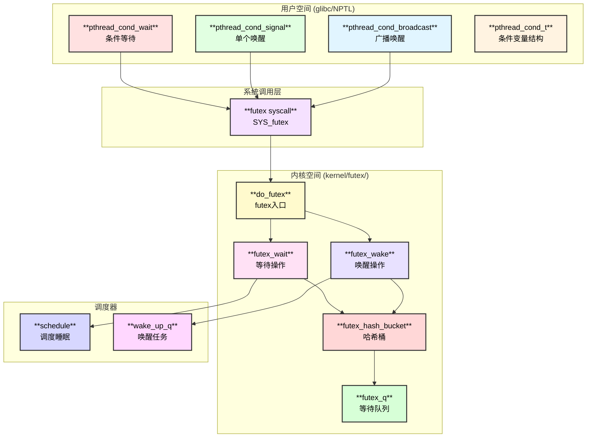
```mermaid
graph TB
    subgraph "用户空间 (glibc/NPTL)"
        A[**pthread_cond_wait**<br/>条件等待]
        B[**pthread_cond_signal**<br/>单个唤醒]
        C[**pthread_cond_broadcast**<br/>广播唤醒]
        D[**pthread_cond_t**<br/>条件变量结构]
    end
    
    subgraph "系统调用层"
        E[**futex syscall**<br/>SYS_futex]
    end
    
    subgraph "内核空间 (kernel/futex/)"
        F[**do_futex**<br/>futex入口]
        G[**futex_wait**<br/>等待操作]
        H[**futex_wake**<br/>唤醒操作]
        I[**futex_hash_bucket**<br/>哈希桶]
        J[**futex_q**<br/>等待队列]
    end
    
    subgraph "调度器"
        K[**schedule**<br/>调度睡眠]
        L[**wake_up_q**<br/>唤醒任务]
    end
    
    A --> E
    B --> E
    C --> E
    E --> F
    F --> G
    F --> H
    G --> I
    H --> I
    I --> J
    G --> K
    H --> L
    
    style A fill:#ffe1e1,stroke:#333,stroke-width:2px,color:#000
    style B fill:#e1ffe1,stroke:#333,stroke-width:2px,color:#000
    style C fill:#e1f5ff,stroke:#333,stroke-width:2px,color:#000
    style D fill:#fff3e1,stroke:#333,stroke-width:2px,color:#000
    style E fill:#f5e1ff,stroke:#333,stroke-width:2px,color:#000
    style F fill:#fffacd,stroke:#333,stroke-width:2px,color:#000
    style G fill:#ffe1f5,stroke:#333,stroke-width:2px,color:#000
    style H fill:#e8e1ff,stroke:#333,stroke-width:2px,color:#000
    style I fill:#ffd7d7,stroke:#333,stroke-width:2px,color:#000
    style J fill:#d7ffd7,stroke:#333,stroke-width:2px,color:#000
    style K fill:#d7d7ff,stroke:#333,stroke-width:2px,color:#000
    style L fill:#ffd7ff,stroke:#333,stroke-width:2px,color:#000
```

## 核心数据结构

### pthread_cond_t 结构 (glibc)

```c
// glibc/nptl/sysdeps/nptl/bits/thread-shared-types.h
struct __pthread_cond_s {
    __extension__ union {
        __extension__ unsigned long long int __wseq;  // 等待序列号
        struct {
            unsigned int __low;
            unsigned int __high;
        } __wseq32;
    };
    __extension__ union {
        __extension__ unsigned long long int __g1_start;
        struct {
            unsigned int __low;
            unsigned int __high;
        } __g1_start32;
    };
    unsigned int __g_refs[2];    // 组引用计数
    unsigned int __g_size[2];    // 组大小
    unsigned int __g1_orig_size; // G1原始大小
    unsigned int __wrefs;        // 写者引用
    unsigned int __g_signals[2]; // 组信号 (futex等待地址)
};
```

### futex_hash_bucket 结构 (内核)

```c
// kernel/futex/futex.h:115
struct futex_hash_bucket {
    atomic_t waiters;        // 等待者计数
    spinlock_t lock;         // 自旋锁
    struct plist_head chain; // 优先级链表
} ____cacheline_aligned_in_smp;
```

### futex_q 结构 (内核)

```c
// kernel/futex/futex.h:171
struct futex_q {
    struct plist_node list;           // 优先级排序链表节点
    struct task_struct *task;         // 等待的任务 (指向 task_struct)
    spinlock_t *lock_ptr;             // 哈希桶锁指针
    futex_wake_fn *wake;              // 唤醒处理函数
    void *wake_data;                  // 唤醒数据
    union futex_key key;              // futex键
    struct futex_pi_state *pi_state;  // PI状态
    struct rt_mutex_waiter *rt_waiter;
    union futex_key *requeue_pi_key;
    u32 bitset;                       // 位掩码
    atomic_t requeue_state;
};
```

## Futex 完整架构图（含唤醒队列和CPU调度）

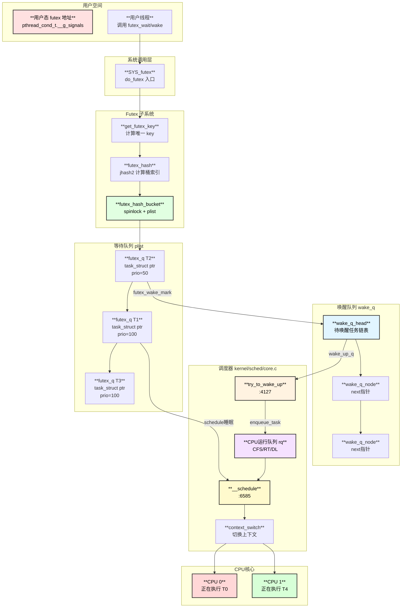
```mermaid
graph TB
    subgraph "用户空间"
        UA["**用户态 futex 地址**<br/>pthread_cond_t.__g_signals"]
        UT["**用户线程**<br/>调用 futex_wait/wake"]
    end
    
    subgraph "系统调用层"
        SC["**SYS_futex**<br/>do_futex 入口"]
    end
    
    subgraph "Futex 子系统"
        FK["**get_futex_key**<br/>计算唯一 key"]
        FH["**futex_hash**<br/>jhash2 计算桶索引"]
        HB["**futex_hash_bucket**<br/>spinlock + plist"]
    end
    
    subgraph "等待队列 plist"
        FQ1["**futex_q T1**<br/>task_struct ptr<br/>prio=100"]
        FQ2["**futex_q T2**<br/>task_struct ptr<br/>prio=50"]
        FQ3["**futex_q T3**<br/>task_struct ptr<br/>prio=100"]
    end
    
    subgraph "唤醒队列 wake_q"
        WQ["**wake_q_head**<br/>待唤醒任务链表"]
        WN1["**wake_q_node**<br/>next指针"]
        WN2["**wake_q_node**<br/>next指针"]
    end
    
    subgraph "调度器 kernel/sched/core.c"
        TTWU["**try_to_wake_up**<br/>:4127"]
        RQ["**CPU运行队列 rq**<br/>CFS/RT/DL"]
        SCHED["**__schedule**<br/>:6585"]
        CS["**context_switch**<br/>切换上下文"]
    end
    
    subgraph "CPU核心"
        CPU0["**CPU 0**<br/>正在执行 T0"]
        CPU1["**CPU 1**<br/>正在执行 T4"]
    end
    
    UT --> SC
    SC --> FK
    FK --> FH
    FH --> HB
    HB --> FQ2
    FQ2 --> FQ1
    FQ1 --> FQ3
    
    FQ2 -->|"futex_wake_mark"| WQ
    WQ --> WN1
    WN1 --> WN2
    
    WQ -->|"wake_up_q"| TTWU
    TTWU -->|"enqueue_task"| RQ
    RQ --> SCHED
    SCHED --> CS
    CS --> CPU0
    CS --> CPU1
    
    FQ1 -->|"schedule睡眠"| SCHED
    
    style UA fill:#ffe1e1,stroke:#333,stroke-width:2px,color:#000
    style HB fill:#e1ffe1,stroke:#333,stroke-width:2px,color:#000
    style WQ fill:#e1f5ff,stroke:#333,stroke-width:2px,color:#000
    style TTWU fill:#fff3e1,stroke:#333,stroke-width:2px,color:#000
    style RQ fill:#f5e1ff,stroke:#333,stroke-width:2px,color:#000
    style SCHED fill:#fffacd,stroke:#333,stroke-width:2px,color:#000
    style CPU0 fill:#ffd7d7,stroke:#333,stroke-width:2px,color:#000
    style CPU1 fill:#d7ffd7,stroke:#333,stroke-width:2px,color:#000
```

### 架构组件说明

| **组件** | **位置** | **功能** |
|:---|:---|:---|
| **futex_hash_bucket** | `kernel/futex/futex.h:115` | 哈希桶，含自旋锁和等待队列 |
| **futex_q** | `kernel/futex/futex.h:171` | 等待者描述符，含 task_struct 指针 |
| **wake_q_head** | `include/linux/sched/wake_q.h` | 唤醒队列头，收集待唤醒任务 |
| **try_to_wake_up** | `kernel/sched/core.c:4127` | 唤醒任务，加入运行队列 |
| **rq (运行队列)** | `kernel/sched/sched.h` | 每CPU运行队列，含CFS/RT/DL子队列 |
| **__schedule** | `kernel/sched/core.c:6585` | 调度主函数，选择下一个任务 |

### 等待与唤醒完整流程

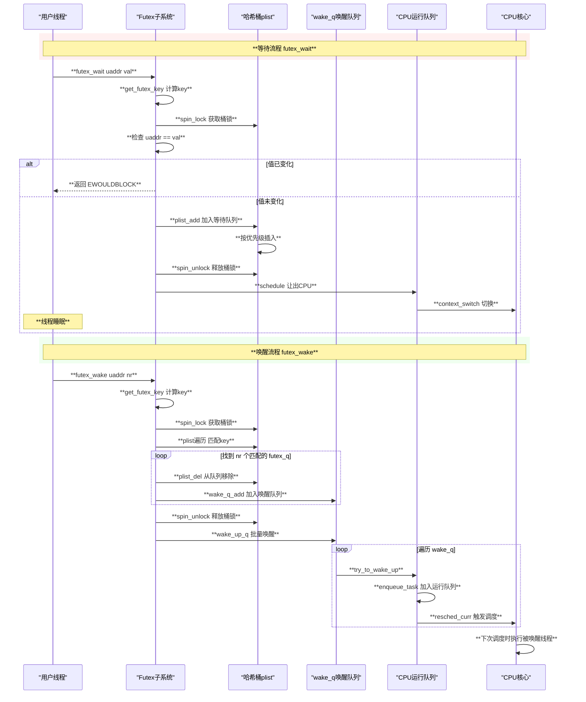
```mermaid
sequenceDiagram
    participant T as "用户线程"
    participant F as "Futex子系统"
    participant HB as "哈希桶plist"
    participant WQ as "wake_q唤醒队列"
    participant RQ as "CPU运行队列"
    participant CPU as "CPU核心"
    
    rect rgb(255, 240, 240)
    Note over T,CPU: **等待流程 futex_wait**
    end
    
    T->>F: **futex_wait uaddr val**
    F->>F: **get_futex_key 计算key**
    F->>HB: **spin_lock 获取桶锁**
    F->>F: **检查 uaddr == val**
    
    alt 值已变化
        F-->>T: **返回 EWOULDBLOCK**
    else 值未变化
        F->>HB: **plist_add 加入等待队列**
        HB->>HB: **按优先级插入**
        F->>HB: **spin_unlock 释放桶锁**
        F->>RQ: **schedule 让出CPU**
        RQ->>CPU: **context_switch 切换**
        Note over T: **线程睡眠**
    end
    
    rect rgb(240, 255, 240)
    Note over T,CPU: **唤醒流程 futex_wake**
    end
    
    T->>F: **futex_wake uaddr nr**
    F->>F: **get_futex_key 计算key**
    F->>HB: **spin_lock 获取桶锁**
    F->>HB: **plist遍历 匹配key**
    
    loop 找到 nr 个匹配的 futex_q
        F->>HB: **plist_del 从队列移除**
        F->>WQ: **wake_q_add 加入唤醒队列**
    end
    
    F->>HB: **spin_unlock 释放桶锁**
    
    F->>WQ: **wake_up_q 批量唤醒**
    
    loop 遍历 wake_q
        WQ->>RQ: **try_to_wake_up**
        RQ->>RQ: **enqueue_task 加入运行队列**
        RQ->>CPU: **resched_curr 触发调度**
    end
    
    CPU->>CPU: **下次调度时执行被唤醒线程**
```

### 调度器核心逻辑

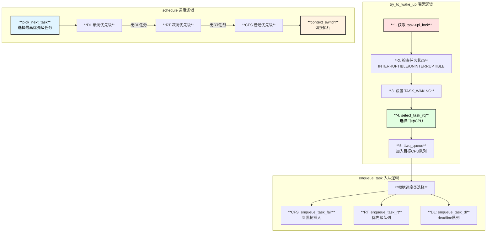
```mermaid
graph TB
    subgraph "try_to_wake_up 唤醒逻辑"
        A["**1. 获取 task->pi_lock**"]
        B["**2. 检查任务状态**<br/>INTERRUPTIBLE/UNINTERRUPTIBLE"]
        C["**3. 设置 TASK_WAKING**"]
        D["**4. select_task_rq**<br/>选择目标CPU"]
        E["**5. ttwu_queue**<br/>加入目标CPU队列"]
    end
    
    subgraph "enqueue_task 入队逻辑"
        F["**根据调度类选择**"]
        G["**CFS: enqueue_task_fair**<br/>红黑树插入"]
        H["**RT: enqueue_task_rt**<br/>优先级队列"]
        I["**DL: enqueue_task_dl**<br/>deadline队列"]
    end
    
    subgraph "schedule 调度逻辑"
        J["**pick_next_task**<br/>选择最高优先级任务"]
        K["**DL 最高优先级**"]
        L["**RT 次高优先级**"]
        M["**CFS 普通优先级**"]
        N["**context_switch**<br/>切换执行"]
    end
    
    A --> B --> C --> D --> E
    E --> F
    F --> G
    F --> H
    F --> I
    
    J --> K
    K -->|无DL任务| L
    L -->|无RT任务| M
    M --> N
    
    style A fill:#ffe1e1,stroke:#333,stroke-width:2px,color:#000
    style D fill:#e1ffe1,stroke:#333,stroke-width:2px,color:#000
    style J fill:#e1f5ff,stroke:#333,stroke-width:2px,color:#000
    style N fill:#fff3e1,stroke:#333,stroke-width:2px,color:#000
```

### wake_q 唤醒队列详解

**为什么需要 wake_q？**

1. **减少锁持有时间**：在持有桶锁时只收集任务，释放锁后再批量唤醒
2. **避免嵌套锁**：唤醒可能涉及调度器锁，先收集避免死锁
3. **批量处理**：一次 `wake_up_q` 唤醒多个任务更高效

```c
// include/linux/sched/wake_q.h
struct wake_q_head {
    struct wake_q_node *first;
    struct wake_q_node **lastp;
};

// kernel/sched/core.c:930
void wake_up_q(struct wake_q_head *head)
{
    struct wake_q_node *node = head->first;
    
    while (node != WAKE_Q_TAIL) {
        struct task_struct *task;
        
        task = container_of(node, struct task_struct, wake_q);
        node = node->next;
        task->wake_q.next = NULL;
        
        // 真正的唤醒操作
        try_to_wake_up(task, TASK_NORMAL, 0);
        
        // 减少引用计数（wake_q_add 时增加的）
        put_task_struct(task);
    }
}
```

## Futex Key 的作用

### Futex Key 是什么？可以理解为实例吗？

**不完全正确**。Futex Key 不是一个"创建出来的实例"，而是一个**计算出来的标识符**：

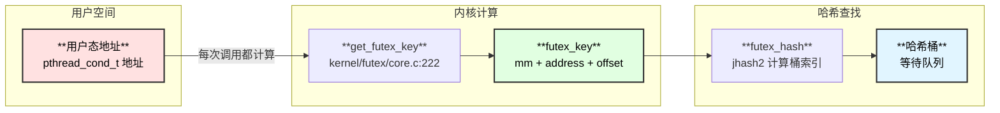
```mermaid
graph LR
    subgraph "用户空间"
        UA["**用户态地址**<br/>pthread_cond_t 地址"]
    end
    
    subgraph "内核计算"
        GFK["**get_futex_key**<br/>kernel/futex/core.c:222"]
        KEY["**futex_key**<br/>mm + address + offset"]
    end
    
    subgraph "哈希查找"
        HASH["**futex_hash**<br/>jhash2 计算桶索引"]
        HB["**哈希桶**<br/>等待队列"]
    end
    
    UA -->|"每次调用都计算"| GFK
    GFK --> KEY
    KEY --> HASH
    HASH --> HB
    
    style UA fill:#ffe1e1,stroke:#333,stroke-width:2px,color:#000
    style KEY fill:#e1ffe1,stroke:#333,stroke-width:2px,color:#000
    style HB fill:#e1f5ff,stroke:#333,stroke-width:2px,color:#000
```

**正确理解**：

| **概念** | **说明** |
|:---|:---|
| **Futex Key 不是实例** | 它是根据用户态地址**每次计算**出来的 |
| **用户态地址才是"实例"** | `pthread_cond_t` 的地址是多个线程共享的标识 |
| **Key 用于内核查找** | 内核根据 key 找到对应的哈希桶和等待队列 |

**多个线程如何使用同一个 futex？**

```c
// 多个线程共享同一个 pthread_cond_t
pthread_cond_t cond = PTHREAD_COND_INITIALIZER;  // 地址固定

// 线程1 和 线程2 都调用 wait
pthread_cond_wait(&cond, &mutex);  // 传入相同的 &cond 地址

// 内核中：
// 线程1: get_futex_key(&cond->__g_signals[g]) → key1 = (mm, addr, offset)
// 线程2: get_futex_key(&cond->__g_signals[g]) → key2 = (mm, addr, offset)
// key1 == key2，所以进入同一个等待队列！
```

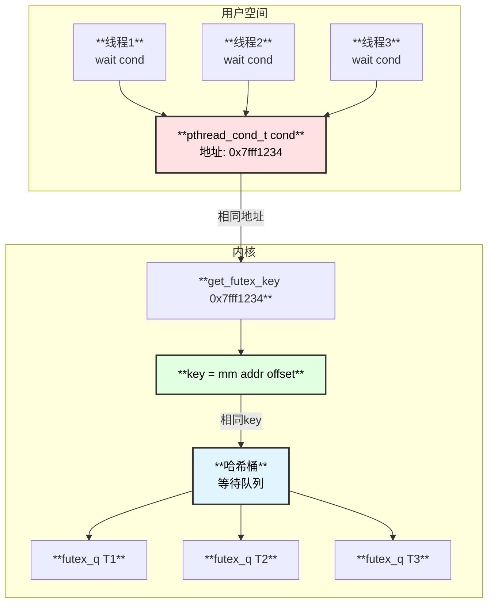
```mermaid
graph TB
    subgraph "用户空间"
        COND["**pthread_cond_t cond**<br/>地址: 0x7fff1234"]
        T1["**线程1**<br/>wait cond"]
        T2["**线程2**<br/>wait cond"]
        T3["**线程3**<br/>wait cond"]
    end
    
    subgraph "内核"
        GFK["**get_futex_key 0x7fff1234**"]
        KEY["**key = mm addr offset**"]
        HB["**哈希桶**<br/>等待队列"]
        Q1["**futex_q T1**"]
        Q2["**futex_q T2**"]
        Q3["**futex_q T3**"]
    end
    
    T1 --> COND
    T2 --> COND
    T3 --> COND
    COND -->|"相同地址"| GFK
    GFK --> KEY
    KEY -->|"相同key"| HB
    HB --> Q1
    HB --> Q2
    HB --> Q3
    
    style COND fill:#ffe1e1,stroke:#333,stroke-width:2px,color:#000
    style KEY fill:#e1ffe1,stroke:#333,stroke-width:2px,color:#000
    style HB fill:#e1f5ff,stroke:#333,stroke-width:2px,color:#000
```

**总结**：
- ✅ 多个线程可以使用**同一个用户态地址**添加到等待队列
- ✅ 内核根据地址计算 key，相同地址 = 相同 key = 同一个等待队列
- ❌ Key 不是预先创建的实例，而是每次调用时动态计算的

---

**Futex Key** 是内核用来唯一标识一个 futex 的结构：

```c
// kernel/futex/futex.h:72
union futex_key {
    struct {
        u64 i_seq;           // inode 序列号
        unsigned long pgoff; // 页偏移
        unsigned int offset; // 页内偏移
    } shared;                // 共享映射 (文件/共享内存)
    struct {
        union {
            struct mm_struct *mm;  // 进程地址空间
            u64 __tmp;
        };
        unsigned long address;     // 虚拟地址
        unsigned int offset;       // 页内偏移
    } private;               // 私有映射 (进程内)
    struct {
        u64 ptr;
        unsigned long word;
        unsigned int offset;
    } both;
};
```

**Futex Key 的三大用途**：

| **用途** | **说明** |
|:---|:---|
| **唯一标识** | 不同进程的相同虚拟地址对应不同 key |
| **计算哈希桶** | `jhash2(&key)` 决定进入哪个桶 |
| **匹配唤醒** | signal 时遍历桶，只唤醒 key 匹配的等待者 |

## 为什么不同进程会有相同的虚拟地址？

### Linux 虚拟地址空间详解

每个进程都有独立的 **虚拟地址空间**（0x0 - 0xFFFFFFFFFFFFFFFF 64位），但物理内存由操作系统统一管理。虚拟地址通过 **页表** 映射到物理地址。

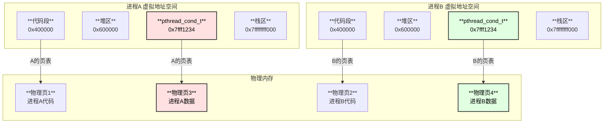
```mermaid
graph TB
    subgraph "进程A 虚拟地址空间"
        A1["**代码段**<br/>0x400000"]
        A2["**堆区**<br/>0x600000"]
        A3["**pthread_cond_t**<br/>0x7fff1234"]
        A4["**栈区**<br/>0x7ffffffff000"]
    end
    
    subgraph "进程B 虚拟地址空间"
        B1["**代码段**<br/>0x400000"]
        B2["**堆区**<br/>0x600000"]
        B3["**pthread_cond_t**<br/>0x7fff1234"]
        B4["**栈区**<br/>0x7ffffffff000"]
    end
    
    subgraph "物理内存"
        P1["**物理页1**<br/>进程A代码"]
        P2["**物理页2**<br/>进程B代码"]
        P3["**物理页3**<br/>进程A数据"]
        P4["**物理页4**<br/>进程B数据"]
    end
    
    A1 -->|"A的页表"| P1
    B1 -->|"B的页表"| P2
    A3 -->|"A的页表"| P3
    B3 -->|"B的页表"| P4
    
    style A3 fill:#ffe1e1,stroke:#333,stroke-width:2px,color:#000
    style B3 fill:#e1ffe1,stroke:#333,stroke-width:2px,color:#000
    style P3 fill:#ffe1e1,stroke:#333,stroke-width:2px,color:#000
    style P4 fill:#e1ffe1,stroke:#333,stroke-width:2px,color:#000
```

**为什么虚拟地址会相同？**

| **原因** | **说明** |
|:---|:---|
| **ASLR 基址随机化** | 栈/堆/库的基址随机，但偏移量一致，可能碰撞 |
| **相同程序** | 两个相同程序运行，代码段地址一致 |
| **fork 后** | 父子进程初始虚拟地址空间完全相同 |
| **内存分配器** | malloc 返回的地址在各进程内可能恰好相同 |

### fork 出来的线程虚拟地址一样吗？

**需要区分 fork 和 pthread_create：**

| **操作** | **地址空间** | **虚拟地址** |
|:---|:---|:---|
| **fork()** | 创建新进程，**复制**地址空间 | 初始相同，后续各自演变 |
| **pthread_create()** | 同一进程，**共享**地址空间 | 完全相同，就是同一地址空间 |

```c
// fork 示例
int shared_var = 0;  // 地址 0x601000

pid_t pid = fork();
if (pid == 0) {
    // 子进程：shared_var 虚拟地址仍是 0x601000
    // 但物理页已被 COW 复制，是独立的副本
    shared_var = 100;  // 只影响子进程
} else {
    // 父进程：shared_var 虚拟地址也是 0x601000
    shared_var = 200;  // 只影响父进程
}

// pthread_create 示例
pthread_t thread;
pthread_create(&thread, NULL, func, NULL);
// 新线程与主线程共享 shared_var，地址相同，物理页也相同
// 任何线程修改都对其他线程可见
```

### Futex 如何区分不同进程的相同虚拟地址？

**关键在于 `mm_struct` 指针**：

```c
// kernel/futex/core.c:222 - get_futex_key()
int get_futex_key(u32 __user *uaddr, unsigned int flags, 
                  union futex_key *key, enum futex_access rw)
{
    // ...
    if (flags & FLAGS_SHARED) {
        // 共享映射：使用 inode + pgoff
        key->shared.i_seq = inode->i_sequence;
        key->shared.pgoff = page->index;
    } else {
        // 私有映射：使用 mm + address
        key->private.mm = current->mm;      // 关键！每个进程的 mm 不同
        key->private.address = address;     // 虚拟地址
    }
    // ...
}
```

**源码分析：为什么能区分**

| **组件** | **进程A** | **进程B** | **比较结果** |
|:---|:---|:---|:---|
| mm | 0xffff88800a000000 | 0xffff88800b000000 | **不同** |
| address | 0x7fff1234 | 0x7fff1234 | 相同 |
| offset | 0x234 | 0x234 | 相同 |
| **key** | (mm_A, 0x7fff1234, 0x234) | (mm_B, 0x7fff1234, 0x234) | **不同** |

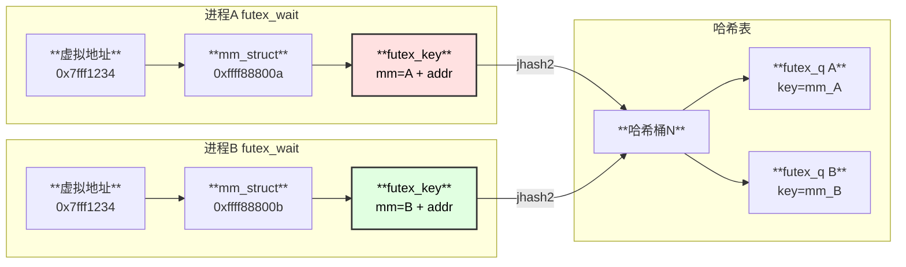
```mermaid
graph LR
    subgraph "进程A futex_wait"
        A_VA["**虚拟地址**<br/>0x7fff1234"]
        A_MM["**mm_struct**<br/>0xffff88800a"]
        A_KEY["**futex_key**<br/>mm=A + addr"]
    end
    
    subgraph "进程B futex_wait"
        B_VA["**虚拟地址**<br/>0x7fff1234"]
        B_MM["**mm_struct**<br/>0xffff88800b"]
        B_KEY["**futex_key**<br/>mm=B + addr"]
    end
    
    subgraph "哈希表"
        HB["**哈希桶N**"]
        QA["**futex_q A**<br/>key=mm_A"]
        QB["**futex_q B**<br/>key=mm_B"]
    end
    
    A_VA --> A_MM
    A_MM --> A_KEY
    A_KEY -->|"jhash2"| HB
    
    B_VA --> B_MM
    B_MM --> B_KEY
    B_KEY -->|"jhash2"| HB
    
    HB --> QA
    HB --> QB
    
    style A_KEY fill:#ffe1e1,stroke:#333,stroke-width:2px,color:#000
    style B_KEY fill:#e1ffe1,stroke:#333,stroke-width:2px,color:#000
```

**同一哈希桶但 key 不同**：即使两个进程的 futex 落入同一哈希桶，唤醒时会比较完整 key（包括 mm），所以不会误唤醒。

### 共享内存场景

如果两个进程通过 **共享内存** (mmap MAP_SHARED) 共享同一个 futex，则使用 **shared key**：

```c
// 共享映射的 key 使用 inode + pgoff
key->shared.i_seq = inode->i_sequence;  // 共享文件/shm 的 inode
key->shared.pgoff = page->index;         // 页索引
key->shared.offset = offset;             // 页内偏移

// 此时两个进程的 key 相同，可以互相唤醒！
```

## Futex 的本质：内核线程队列机制

**Futex 是什么？**

是的，你可以理解为 **Futex 是 Linux 提供的用户态/内核态协作的线程队列机制**：

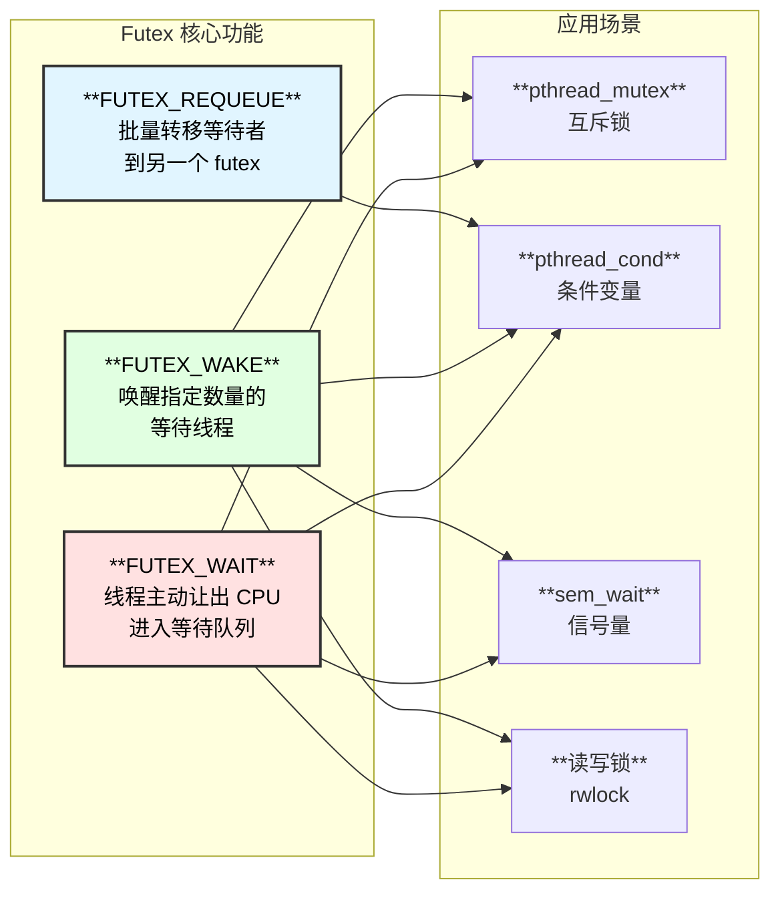
```mermaid
graph LR
    subgraph "Futex 核心功能"
        A["**FUTEX_WAIT**<br/>线程主动让出 CPU<br/>进入等待队列"]
        B["**FUTEX_WAKE**<br/>唤醒指定数量的<br/>等待线程"]
        C["**FUTEX_REQUEUE**<br/>批量转移等待者<br/>到另一个 futex"]
    end
    
    subgraph "应用场景"
        D["**pthread_mutex**<br/>互斥锁"]
        E["**pthread_cond**<br/>条件变量"]
        F["**sem_wait**<br/>信号量"]
        G["**读写锁**<br/>rwlock"]
    end
    
    A --> D
    A --> E
    B --> D
    B --> E
    C --> E
    A --> F
    B --> F
    A --> G
    B --> G
    
    style A fill:#ffe1e1,stroke:#333,stroke-width:2px,color:#000
    style B fill:#e1ffe1,stroke:#333,stroke-width:2px,color:#000
    style C fill:#e1f5ff,stroke:#333,stroke-width:2px,color:#000
```

**Futex 的核心操作**：

| **操作** | **功能** | **典型场景** |
|:---|:---|:---|
| FUTEX_WAIT | 检查值未变则睡眠 | pthread_cond_wait |
| FUTEX_WAKE | 唤醒 N 个等待者 | pthread_cond_signal/broadcast |
| FUTEX_REQUEUE | 批量移动等待者 | 条件变量优化 |
| FUTEX_WAIT_BITSET | 带位掩码的等待 | 选择性唤醒 |
| FUTEX_LOCK_PI | 优先级继承锁 | 实时系统 |

## 内核如何通过 task_struct 指针唤醒线程

**唤醒流程源码分析**：

```
futex_wake() - kernel/futex/waitwake.c:155
├── get_futex_key() - 获取 futex key
├── futex_hash(&key) - 计算哈希桶
│   └── jhash2() + 取模 → 桶索引
├── spin_lock(&hb->lock) - 获取桶锁
├── plist_for_each_entry_safe(q, &hb->chain) - 遍历等待队列
│   └── futex_match(&q->key, &key) - 匹配 key
│       └── 比较 word, ptr, offset 三个字段
├── futex_wake_mark(wake_q, q) - kernel/futex/waitwake.c:134
│   ├── __futex_unqueue(q) - kernel/futex/core.c:513
│   │   └── plist_del(&q->list) - 从队列移除
│   └── wake_q_add_safe(wake_q, q->task) - 加入唤醒队列
│       └── ┌──────────────────────┬──────────────────────────────────────────┐
│           │  操作                 │  说明                                     │
│           ├──────────────────────┼──────────────────────────────────────────┤
│           │  get_task_struct     │  增加 task 引用计数，防止被释放             │
│           ├──────────────────────┼──────────────────────────────────────────┤
│           │  链入 wake_q         │  wake_q 是一个单链表，收集待唤醒的 task     │
│           └──────────────────────┴──────────────────────────────────────────┘
├── spin_unlock(&hb->lock) - 释放桶锁
└── wake_up_q(wake_q) - kernel/sched/core.c:930
    └── 遍历 wake_q 链表
        └── try_to_wake_up(task, TASK_NORMAL, 0) - kernel/sched/core.c:4127
            ├── 获取 task->pi_lock 自旋锁
            ├── ttwu_state_match(p, state) - 检查任务状态
            │   └── 确认 task 处于可唤醒状态 (INTERRUPTIBLE/UNINTERRUPTIBLE)
            ├── WRITE_ONCE(p->__state, TASK_WAKING) - 设置为唤醒中
            ├── select_task_rq(p) - 选择目标 CPU 运行队列
            │   └── 考虑 CPU 亲和性、负载均衡等
            ├── ttwu_queue(p, cpu) - kernel/sched/core.c:4029
            │   └── ttwu_do_activate(rq, p) - kernel/sched/core.c:3963
            │       ├── activate_task(rq, p) - 激活任务
            │       │   └── enqueue_task(rq, p) - 加入运行队列
            │       │       └── 根据调度类调用 enqueue_task_fair/rt/dl
            │       └── ttwu_do_wakeup(p) - kernel/sched/core.c:3936
            │           ├── WRITE_ONCE(p->__state, TASK_RUNNING) - 设置为运行状态
            │           └── resched_curr(rq) - 触发重新调度
            └── put_task_struct(task) - 减少引用计数
```

**关键理解**：内核通过 `futex_q.task` 指针直接访问 `struct task_struct`，然后调用 `try_to_wake_up()` 将其状态从 `TASK_INTERRUPTIBLE` 改为 `TASK_RUNNING`，并加入 CPU 运行队列。

## 函数调用链

### pthread_cond_wait 调用链

```
pthread_cond_wait() - glibc/nptl/pthread_cond_wait.c
├── 参数检查
├── 获取当前等待序列号
│   └── __condvar_fetch_add_wseq_acquire()
├── 释放关联的互斥锁
│   └── __pthread_mutex_unlock_usercnt() - glibc/nptl/pthread_mutex_unlock.c
├── 进入等待循环
│   └── futex() - 系统调用
│       └── ┌──────────────────┬───────────────────────────────┬──────────────────────────────┐
│           │  参数             │  值                            │  说明                         │
│           ├──────────────────┼───────────────────────────────┼──────────────────────────────┤
│           │  uaddr            │  &cond->__g_signals[g]        │  等待地址（组信号）            │
│           ├──────────────────┼───────────────────────────────┼──────────────────────────────┤
│           │  op               │  FUTEX_WAIT_PRIVATE           │  私有等待操作                 │
│           ├──────────────────┼───────────────────────────────┼──────────────────────────────┤
│           │  val              │  signals                       │  期望值                       │
│           ├──────────────────┼───────────────────────────────┼──────────────────────────────┤
│           │  timeout          │  abs_time                      │  超时时间（可选）              │
│           └──────────────────┴───────────────────────────────┴──────────────────────────────┘
│       └── SYS_futex 系统调用入口
│           └── do_futex() - kernel/futex/syscalls.c:84
│               ├── futex_to_flags() - kernel/futex/futex.h:42
│               │   └── 转换futex操作标志
│               └── futex_wait() - kernel/futex/waitwake.c:688
│                   ├── futex_setup_timer() - kernel/futex/core.c:136
│                   │   └── 设置超时定时器
│                   └── __futex_wait() - kernel/futex/waitwake.c:647
│                       ├── futex_wait_setup() - kernel/futex/waitwake.c:592
│                       │   ├── get_futex_key() - kernel/futex/core.c:222
│                       │   │   └── 生成futex唯一键
│                       │   │       └── ┌──────────────────┬───────────────────────────────┬──────────────────────────────┐
│                       │   │           │  字段             │  私有映射                      │  共享映射                     │
│                       │   │           ├──────────────────┼───────────────────────────────┼──────────────────────────────┤
│                       │   │           │  key.private.mm   │  current->mm                  │  -                            │
│                       │   │           ├──────────────────┼───────────────────────────────┼──────────────────────────────┤
│                       │   │           │  key.private.addr │  address                       │  -                            │
│                       │   │           ├──────────────────┼───────────────────────────────┼──────────────────────────────┤
│                       │   │           │  key.shared.i_seq │  -                             │  inode->i_sequence            │
│                       │   │           ├──────────────────┼───────────────────────────────┼──────────────────────────────┤
│                       │   │           │  key.shared.pgoff │  -                             │  page->index                  │
│                       │   │           └──────────────────┴───────────────────────────────┴──────────────────────────────┘
│                       │   ├── futex_q_lock() - kernel/futex/futex.h
│                       │   │   └── 获取哈希桶锁
│                       │   └── futex_get_value_locked() - kernel/futex/futex.h
│                       │       └── 读取用户空间futex值
│                       └── futex_wait_queue() - kernel/futex/waitwake.c:343
│                           ├── set_current_state(TASK_INTERRUPTIBLE) - 设置任务状态
│                           ├── __futex_queue() - kernel/futex/core.c:557
│                           │   └── plist_add() - lib/plist.c:73
│                           │       ├── 计算优先级
│                           │       │   └── prio = min(current->normal_prio, MAX_RT_PRIO)
│                           │       │       └── ┌─────────────────┬───────────────────────────────────────────┐
│                           │       │           │  线程类型        │  优先级值                                  │
│                           │       │           ├─────────────────┼───────────────────────────────────────────┤
│                           │       │           │  RT线程          │  0-99 (数值越小优先级越高)                 │
│                           │       │           ├─────────────────┼───────────────────────────────────────────┤
│                           │       │           │  普通线程        │  100 (MAX_RT_PRIO, 统一优先级)            │
│                           │       │           └─────────────────┴───────────────────────────────────────────┘
│                           │       ├── plist_node_init(&q->list, prio) - 初始化节点
│                           │       ├── 按优先级查找插入位置
│                           │       │   └── while (node->prio >= iter->prio) iter = next
│                           │       ├── list_add_tail(&node->prio_list, &iter->prio_list) - 插入优先级链表
│                           │       └── list_add_tail(&node->node_list, node_next) - 插入节点链表
│                           ├── spin_unlock(&hb->lock) - 释放哈希桶锁
│                           └── schedule() - kernel/sched/core.c:6772
│                               ├── sched_submit_work(tsk) - 提交待处理工作
│                               └── __schedule_loop(SM_NONE) - kernel/sched/core.c:6763
│                                   └── __schedule(SM_NONE) - kernel/sched/core.c:6585
│                                       ├── pick_next_task(rq) - 选择下一个任务
│                                       │   └── 遍历调度类选择最高优先级任务
│                                       ├── deactivate_task(rq, prev) - 停用当前任务
│                                       │   └── dequeue_task(rq, p) - 从运行队列移除
│                                       ├── context_switch(rq, prev, next) - 上下文切换
│                                       │   ├── switch_mm_irqs_off() - 切换内存映射
│                                       │   └── switch_to(prev, next, prev) - 切换寄存器
│                                       └── 当前线程进入睡眠，CPU执行其他任务
├── 被唤醒后重新获取互斥锁
│   └── __pthread_mutex_lock() - glibc/nptl/pthread_mutex_lock.c
└── 返回
```

### pthread_cond_signal 调用链

```
pthread_cond_signal() - glibc/nptl/pthread_cond_signal.c
├── 检查是否有等待者
│   └── 读取 cond->__wrefs 和 __g_size
├── 增加信号计数
│   └── atomic_fetch_add(&cond->__g_signals[g], 2)
├── 调用futex唤醒
│   └── futex() - 系统调用
│       └── ┌──────────────────┬───────────────────────────────┬──────────────────────────────┐
│           │  参数             │  值                            │  说明                         │
│           ├──────────────────┼───────────────────────────────┼──────────────────────────────┤
│           │  uaddr            │  &cond->__g_signals[g]        │  唤醒地址                     │
│           ├──────────────────┼───────────────────────────────┼──────────────────────────────┤
│           │  op               │  FUTEX_WAKE_PRIVATE           │  私有唤醒操作                 │
│           ├──────────────────┼───────────────────────────────┼──────────────────────────────┤
│           │  val              │  1                             │  唤醒1个等待者                │
│           └──────────────────┴───────────────────────────────┴──────────────────────────────┘
│       └── SYS_futex 系统调用入口
│           └── do_futex() - kernel/futex/syscalls.c:84
│               └── futex_wake() - kernel/futex/waitwake.c:155
│                   ├── get_futex_key() - kernel/futex/core.c:222
│                   │   └── 获取futex键
│                   ├── futex_hash() - kernel/futex/core.c:117
│                   │   └── 计算哈希桶
│                   │       └── ┌──────────────────┬───────────────────────────────────────────────────────┐
│                   │           │  操作             │  说明                                                  │
│                   │           ├──────────────────┼───────────────────────────────────────────────────────┤
│                   │           │  jhash2()         │  使用Jenkins哈希算法计算键的哈希值                      │
│                   │           ├──────────────────┼───────────────────────────────────────────────────────┤
│                   │           │  hash & mask      │  取模映射到哈希桶数组                                  │
│                   │           └──────────────────┴───────────────────────────────────────────────────────┘
│                   ├── futex_hb_waiters_pending() - kernel/futex/futex.h
│                   │   └── 检查是否有等待者
│                   ├── spin_lock(&hb->lock) - 获取哈希桶锁
│                   ├── plist_for_each_entry_safe() - 遍历等待队列
│                   │   └── futex_match() - kernel/futex/futex.h
│                   │       └── 匹配futex键
│                   ├── futex_wake_mark() - kernel/futex/waitwake.c:134
│                   │   ├── __futex_unqueue() - kernel/futex/core.c
│                   │   │   └── plist_del() 从队列移除
│                   │   └── wake_q_add_safe() - 加入唤醒队列
│                   ├── spin_unlock(&hb->lock) - 释放哈希桶锁
│                   └── wake_up_q() - kernel/sched/core.c:930
│                       └── try_to_wake_up(p, TASK_NORMAL, 0) - kernel/sched/core.c:4127
│                           ├── guard(preempt)() - 禁用抢占
│                           ├── raw_spinlock_irqsave(&p->pi_lock) - 获取任务自旋锁
│                           ├── ttwu_state_match(p, state, &success) - kernel/sched/core.c:4075
│                           │   └── 检查 p->__state & state 是否匹配
│                           ├── trace_sched_waking(p) - 跟踪点
│                           ├── smp_rmb() - 内存屏障
│                           │   └── 确保读取 p->on_rq 在 p->state 之后
│                           ├── READ_ONCE(p->on_rq) && ttwu_runnable(p) - 检查是否已在运行队列
│                           ├── WRITE_ONCE(p->__state, TASK_WAKING) - 设置为唤醒中状态
│                           ├── select_task_rq(p, p->wake_cpu, &wake_flags) - kernel/sched/core.c:3731
│                           │   └── 选择目标 CPU (考虑亲和性/负载均衡)
│                           ├── ttwu_queue(p, cpu, wake_flags) - kernel/sched/core.c:4029
│                           │   └── ttwu_do_activate(rq, p, wake_flags) - kernel/sched/core.c:3963
│                           │       ├── activate_task(rq, p, en_flags) - kernel/sched/core.c:2066
│                           │       │   └── enqueue_task(rq, p, flags) - kernel/sched/core.c:2025
│                           │       │       └── p->sched_class->enqueue_task(rq, p, flags)
│                           │       │           └── ┌─────────────────┬───────────────────────────────────────────┐
│                           │       │               │  调度类          │  入队函数                                  │
│                           │       │               ├─────────────────┼───────────────────────────────────────────┤
│                           │       │               │  CFS             │  enqueue_task_fair()                      │
│                           │       │               ├─────────────────┼───────────────────────────────────────────┤
│                           │       │               │  RT              │  enqueue_task_rt()                        │
│                           │       │               ├─────────────────┼───────────────────────────────────────────┤
│                           │       │               │  DL              │  enqueue_task_dl()                        │
│                           │       │               └─────────────────┴───────────────────────────────────────────┘
│                           │       └── ttwu_do_wakeup(p) - kernel/sched/core.c:3936
│                           │           ├── WRITE_ONCE(p->__state, TASK_RUNNING) - 设置为运行状态
│                           │           ├── trace_sched_wakeup(p) - 跟踪点
│                           │           └── resched_curr(rq) - kernel/sched/core.c:1034
│                           │               └── 设置 TIF_NEED_RESCHED 标志触发重新调度
│                           └── put_task_struct(task) - 减少引用计数
└── 返回
```

## 时序图

### pthread_cond_wait 完整流程

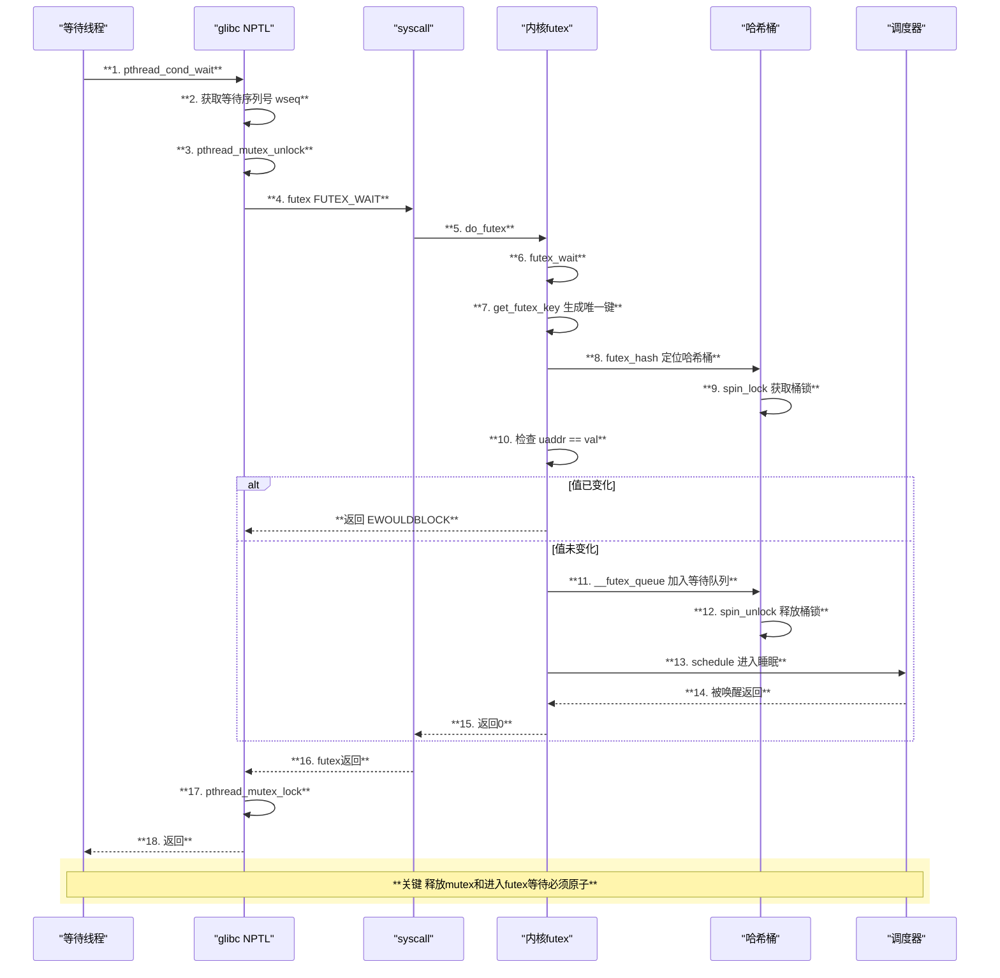
```mermaid
sequenceDiagram
    participant T as "等待线程"
    participant G as "glibc NPTL"
    participant S as "syscall"
    participant K as "内核futex"
    participant H as "哈希桶"
    participant SC as "调度器"
    
    T->>G: **1. pthread_cond_wait**
    G->>G: **2. 获取等待序列号 wseq**
    G->>G: **3. pthread_mutex_unlock**
    
    G->>S: **4. futex FUTEX_WAIT**
    S->>K: **5. do_futex**
    K->>K: **6. futex_wait**
    
    K->>K: **7. get_futex_key 生成唯一键**
    K->>H: **8. futex_hash 定位哈希桶**
    H->>H: **9. spin_lock 获取桶锁**
    
    K->>K: **10. 检查 uaddr == val**
    
    alt 值已变化
        K-->>G: **返回 EWOULDBLOCK**
    else 值未变化
        K->>H: **11. __futex_queue 加入等待队列**
        H->>H: **12. spin_unlock 释放桶锁**
        K->>SC: **13. schedule 进入睡眠**
        SC-->>K: **14. 被唤醒返回**
        K-->>S: **15. 返回0**
    end
    
    S-->>G: **16. futex返回**
    G->>G: **17. pthread_mutex_lock**
    G-->>T: **18. 返回**
    
    rect rgb(255, 250, 205)
    Note over T,SC: **关键 释放mutex和进入futex等待必须原子**
    end
```

### pthread_cond_signal 完整流程

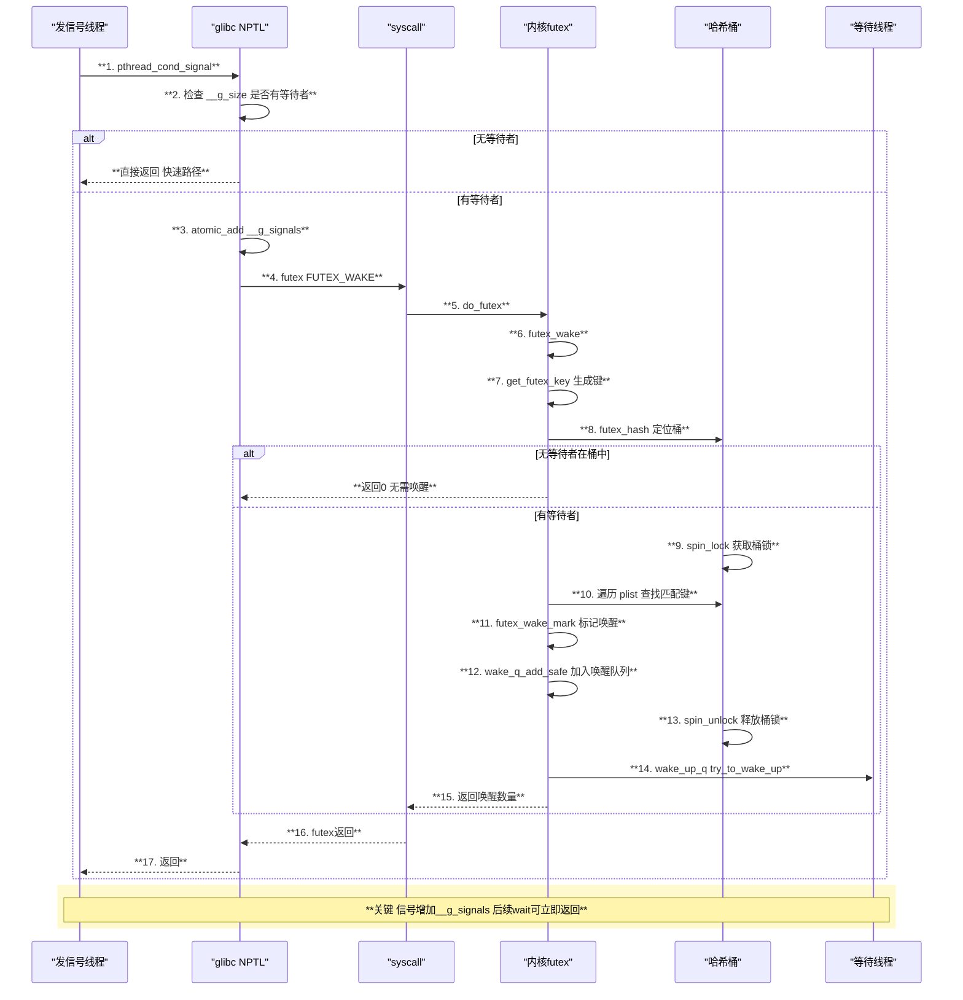
```mermaid
sequenceDiagram
    participant T as "发信号线程"
    participant G as "glibc NPTL"
    participant S as "syscall"
    participant K as "内核futex"
    participant H as "哈希桶"
    participant W as "等待线程"
    
    T->>G: **1. pthread_cond_signal**
    G->>G: **2. 检查 __g_size 是否有等待者**
    
    alt 无等待者
        G-->>T: **直接返回 快速路径**
    else 有等待者
        G->>G: **3. atomic_add __g_signals**
        G->>S: **4. futex FUTEX_WAKE**
        S->>K: **5. do_futex**
        K->>K: **6. futex_wake**
        
        K->>K: **7. get_futex_key 生成键**
        K->>H: **8. futex_hash 定位桶**
        
        alt 无等待者在桶中
            K-->>G: **返回0 无需唤醒**
        else 有等待者
            H->>H: **9. spin_lock 获取桶锁**
            K->>H: **10. 遍历 plist 查找匹配键**
            K->>K: **11. futex_wake_mark 标记唤醒**
            K->>K: **12. wake_q_add_safe 加入唤醒队列**
            H->>H: **13. spin_unlock 释放桶锁**
            K->>W: **14. wake_up_q try_to_wake_up**
            K-->>S: **15. 返回唤醒数量**
        end
        
        S-->>G: **16. futex返回**
        G-->>T: **17. 返回**
    end
    
    rect rgb(255, 250, 205)
    Note over T,W: **关键 信号增加__g_signals 后续wait可立即返回**
    end
```

## Futex 工作原理

### Futex 哈希表结构

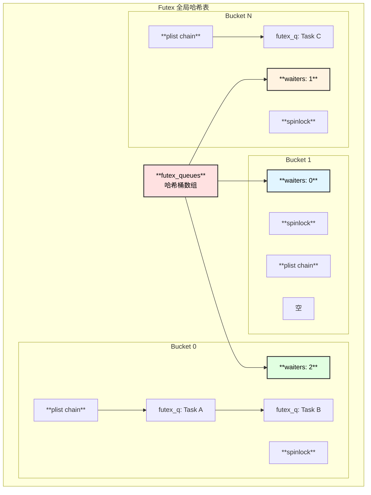
```mermaid
graph TB
    subgraph "Futex 全局哈希表"
        A[**futex_queues**<br/>哈希桶数组]
        
        subgraph "Bucket 0"
            B0[**waiters: 2**]
            B0L[**spinlock**]
            B0C[**plist chain**]
            B0N1[futex_q: Task A]
            B0N2[futex_q: Task B]
        end
        
        subgraph "Bucket 1"
            B1[**waiters: 0**]
            B1L[**spinlock**]
            B1C[**plist chain**]
            B1N[空]
        end
        
        subgraph "Bucket N"
            BN[**waiters: 1**]
            BNL[**spinlock**]
            BNC[**plist chain**]
            BNN1[futex_q: Task C]
        end
    end
    
    A --> B0
    A --> B1
    A --> BN
    B0C --> B0N1
    B0N1 --> B0N2
    BNC --> BNN1
    
    style A fill:#ffe1e1,stroke:#333,stroke-width:2px,color:#000
    style B0 fill:#e1ffe1,stroke:#333,stroke-width:2px,color:#000
    style B1 fill:#e1f5ff,stroke:#333,stroke-width:2px,color:#000
    style BN fill:#fff3e1,stroke:#333,stroke-width:2px,color:#000
```

### Futex 键计算

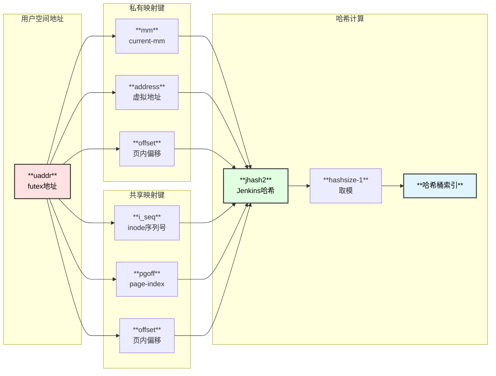
```mermaid
graph LR
    subgraph "用户空间地址"
        U["**uaddr**<br/>futex地址"]
    end
    
    subgraph "私有映射键"
        P1["**mm**<br/>current-mm"]
        P2["**address**<br/>虚拟地址"]
        P3["**offset**<br/>页内偏移"]
    end
    
    subgraph "共享映射键"
        S1["**i_seq**<br/>inode序列号"]
        S2["**pgoff**<br/>page-index"]
        S3["**offset**<br/>页内偏移"]
    end
    
    subgraph "哈希计算"
        H["**jhash2**<br/>Jenkins哈希"]
        M["**hashsize-1**<br/>取模"]
        B["**哈希桶索引**"]
    end
    
    U --> P1
    U --> P2
    U --> P3
    U --> S1
    U --> S2
    U --> S3
    
    P1 --> H
    P2 --> H
    P3 --> H
    S1 --> H
    S2 --> H
    S3 --> H
    
    H --> M
    M --> B
    
    style U fill:#ffe1e1,stroke:#333,stroke-width:2px,color:#000
    style H fill:#e1ffe1,stroke:#333,stroke-width:2px,color:#000
    style B fill:#e1f5ff,stroke:#333,stroke-width:2px,color:#000
```

## 唤醒机制详解

### 队列存储与唤醒确定

**放入队列的内容**：每个等待线程对应一个 `futex_q` 结构体，其中 `task` 字段指向线程的 `task_struct`。

**单个唤醒 (signal) 如何确定唤醒哪一个？**

```c
// kernel/futex/core.c:557-573
void __futex_queue(struct futex_q *q, struct futex_hash_bucket *hb)
{
    int prio;
    
    // 关键：使用优先级决定在队列中的位置
    // - 实时线程：使用实际优先级 (0-99)
    // - 普通线程：统一使用 MAX_RT_PRIO (100)
    prio = min(current->normal_prio, MAX_RT_PRIO);
    
    plist_node_init(&q->list, prio);
    plist_add(&q->list, &hb->chain);  // 按优先级插入
    q->task = current;
}
```

### 等待队列优先级来源（源码确认）

**是的！优先级来自线程 task_struct 结构中的 normal_prio 字段**：

```c
// include/linux/sched.h:825-829
struct task_struct {
    // ...
    int             prio;           // 动态优先级（调度器使用）
    int             static_prio;    // 静态优先级（nice 值转换）
    int             normal_prio;    // 正常优先级（不含 PI 提升）  ← futex 使用这个
    unsigned int    rt_priority;    // 实时优先级（0-99）
    // ...
};
```

**优先级计算源码分析**：

```c
// kernel/futex/core.c:569
prio = min(current->normal_prio, MAX_RT_PRIO);

// include/linux/sched/prio.h:16
#define MAX_RT_PRIO     100   // 实时优先级的最大值
```

**优先级值范围**：

| **线程类型** | **normal_prio 范围** | **futex 使用的 prio** | **说明** |
|:---|:---|:---|:---|
| **SCHED_FIFO/RR** | 0-99 | 0-99 | 实时线程，数值越小优先级越高 |
| **SCHED_NORMAL** | 100-139 | 100 | 普通线程，统一截断为 100 |
| **SCHED_BATCH** | 100-139 | 100 | 批处理线程，统一截断为 100 |
| **SCHED_IDLE** | 140 | 100 | 空闲线程，统一截断为 100 |

**源码中的关键注释**：

```c
// kernel/futex/core.c:561-567
/*
 * The priority used to register this element is
 * - either the real thread-priority for the real-time threads
 *   (i.e. threads with a priority lower than MAX_RT_PRIO)
 * - or MAX_RT_PRIO for non-RT threads.
 * Thus, all RT-threads are woken first in priority order, and
 * the others are woken last, in FIFO order.
 */
```

**为什么这样设计？**

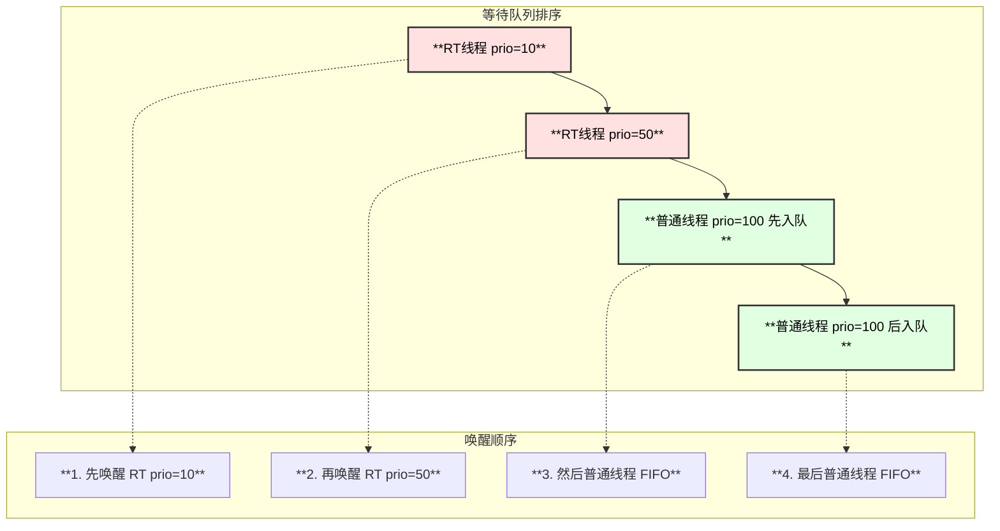
```mermaid
graph TB
    subgraph "等待队列排序"
        A["**RT线程 prio=10**"] --> B["**RT线程 prio=50**"]
        B --> C["**普通线程 prio=100 先入队**"]
        C --> D["**普通线程 prio=100 后入队**"]
    end
    
    subgraph "唤醒顺序"
        W1["**1. 先唤醒 RT prio=10**"]
        W2["**2. 再唤醒 RT prio=50**"]
        W3["**3. 然后普通线程 FIFO**"]
        W4["**4. 最后普通线程 FIFO**"]
    end
    
    A -.-> W1
    B -.-> W2
    C -.-> W3
    D -.-> W4
    
    style A fill:#ffe1e1,stroke:#333,stroke-width:2px,color:#000
    style B fill:#ffe1e1,stroke:#333,stroke-width:2px,color:#000
    style C fill:#e1ffe1,stroke:#333,stroke-width:2px,color:#000
    style D fill:#e1ffe1,stroke:#333,stroke-width:2px,color:#000
```

| **设计目标** | **实现方式** |
|:---|:---|
| **RT 线程优先** | RT 线程 prio < 100，排在前面 |
| **RT 按优先级** | prio 值越小越靠前 |
| **普通线程公平** | 所有普通线程 prio=100，按入队顺序（FIFO） |

**总结**：
- ✅ 优先级**来自 task_struct->normal_prio**
- ✅ **不是自定义的**，直接使用内核调度器的优先级
- ✅ 但会**截断**：普通线程统一变成 100

**唤醒顺序规则**：
1. **实时线程优先**：优先级值越小越先被唤醒 (0最高)
2. **普通线程 FIFO**：所有普通线程优先级相同 (MAX_RT_PRIO=100)，按加入顺序唤醒

### 线程添加与唤醒架构图

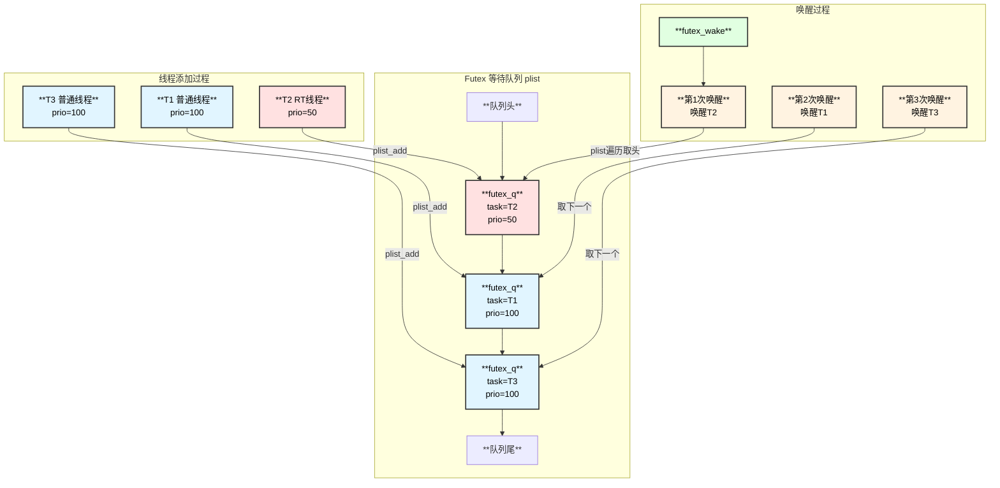
```mermaid
graph TB
    subgraph "线程添加过程"
        T1["**T1 普通线程**<br/>prio=100"]
        T2["**T2 RT线程**<br/>prio=50"]
        T3["**T3 普通线程**<br/>prio=100"]
    end
    
    subgraph "Futex 等待队列 plist"
        Q1["**队列头**"]
        N2["**futex_q**<br/>task=T2<br/>prio=50"]
        N1["**futex_q**<br/>task=T1<br/>prio=100"]
        N3["**futex_q**<br/>task=T3<br/>prio=100"]
        Q2["**队列尾**"]
    end
    
    subgraph "唤醒过程"
        W["**futex_wake**"]
        WK1["**第1次唤醒**<br/>唤醒T2"]
        WK2["**第2次唤醒**<br/>唤醒T1"]
        WK3["**第3次唤醒**<br/>唤醒T3"]
    end
    
    T1 -->|"plist_add"| N1
    T2 -->|"plist_add"| N2
    T3 -->|"plist_add"| N3
    
    Q1 --> N2
    N2 --> N1
    N1 --> N3
    N3 --> Q2
    
    W --> WK1
    WK1 -->|"plist遍历取头"| N2
    WK2 -->|"取下一个"| N1
    WK3 -->|"取下一个"| N3
    
    style T1 fill:#e1f5ff,stroke:#333,stroke-width:2px,color:#000
    style T2 fill:#ffe1e1,stroke:#333,stroke-width:2px,color:#000
    style T3 fill:#e1f5ff,stroke:#333,stroke-width:2px,color:#000
    style N2 fill:#ffe1e1,stroke:#333,stroke-width:2px,color:#000
    style N1 fill:#e1f5ff,stroke:#333,stroke-width:2px,color:#000
    style N3 fill:#e1f5ff,stroke:#333,stroke-width:2px,color:#000
    style W fill:#e1ffe1,stroke:#333,stroke-width:2px,color:#000
    style WK1 fill:#fff3e1,stroke:#333,stroke-width:2px,color:#000
    style WK2 fill:#fff3e1,stroke:#333,stroke-width:2px,color:#000
    style WK3 fill:#fff3e1,stroke:#333,stroke-width:2px,color:#000
```

**队列存储说明**：
- 放入队列的是 `futex_q` 结构体
- `futex_q.task` 字段存储 `struct task_struct *` 指针，指向等待线程的任务结构体
- 通过 `task` 指针可以找到并唤醒对应的线程

**单个唤醒确定规则**：
1. **RT线程优先**：plist 按优先级排序，优先级值越小越靠前
2. **同优先级FIFO**：相同优先级的线程按入队顺序排列
3. **从队列头取**：`futex_wake` 遍历 plist，取第一个匹配的 `futex_q`

### 线程添加与唤醒时序图

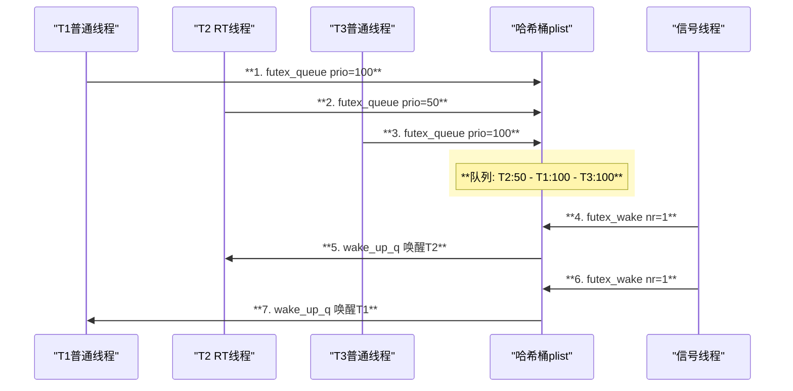
```mermaid
sequenceDiagram
    participant T1 as "T1普通线程"
    participant T2 as "T2 RT线程"
    participant T3 as "T3普通线程"
    participant HB as "哈希桶plist"
    participant TS as "信号线程"
    
    T1->>HB: **1. futex_queue prio=100**
    
    T2->>HB: **2. futex_queue prio=50**
    
    T3->>HB: **3. futex_queue prio=100**
    
    rect rgb(255, 250, 205)
    Note over HB: **队列: T2:50 - T1:100 - T3:100**
    end
    
    TS->>HB: **4. futex_wake nr=1**
    HB->>T2: **5. wake_up_q 唤醒T2**
    
    TS->>HB: **6. futex_wake nr=1**
    HB->>T1: **7. wake_up_q 唤醒T1**
```

## 信号丢失问题详解

### 问题本质

**信号丢失 (Lost Wakeup)** 是条件变量的经典竞态条件：signal 发生时目标线程尚未进入 wait 状态，导致唤醒信号被"丢失"。

**为什么会发生？**

条件变量的使用涉及三个步骤：
1. 释放 mutex（让其他线程能修改条件）
2. 检查条件值
3. 如果条件不满足，进入等待队列

**如果步骤 1 和 3 不是原子的，就会出问题：**

### 问题场景图解

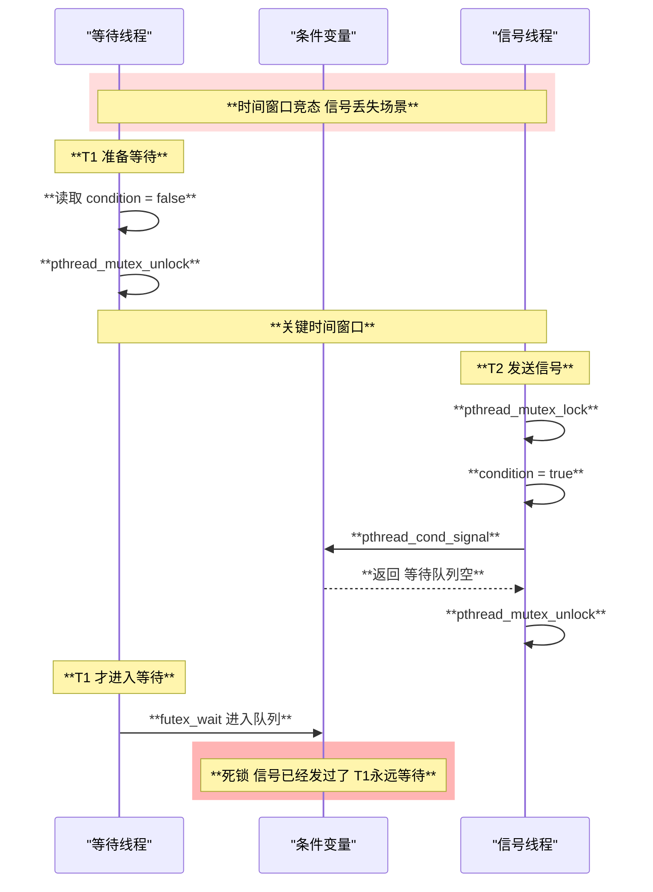
```mermaid
sequenceDiagram
    participant W as "等待线程"
    participant CV as "条件变量"
    participant S as "信号线程"
    
    rect rgb(255, 220, 220)
    Note over W,S: **时间窗口竞态 信号丢失场景**
    end
    
    Note over W: **T1 准备等待**
    W->>W: **读取 condition = false**
    W->>W: **pthread_mutex_unlock**
    
    Note over W,S: **关键时间窗口**
    
    Note over S: **T2 发送信号**
    S->>S: **pthread_mutex_lock**
    S->>S: **condition = true**
    S->>CV: **pthread_cond_signal**
    CV-->>S: **返回 等待队列空**
    S->>S: **pthread_mutex_unlock**
    
    Note over W: **T1 才进入等待**
    W->>CV: **futex_wait 进入队列**
    
    rect rgb(255, 180, 180)
    Note over CV: **死锁 信号已经发过了 T1永远等待**
    end
```

**问题的根本原因**：

| **时刻** | **等待线程状态** | **条件变量状态** | **问题** |
|:---|:---|:---|:---|
| T0 | 持有 mutex，检查条件 | 队列空 | - |
| T1 | 释放 mutex | 队列空 | - |
| T2 | 还没进入 wait | 队列空 | **信号发出，但没人收到** |
| T3 | 进入 wait | T1 在队列中 | **永远等不到信号** |

### Futex 如何解决信号丢失？

**核心思路**：不依赖"信号"本身，而是检查**值是否变化**。

```c
// futex_wait 系统调用的关键语义
int futex_wait(int *uaddr, int expected_val) {
    // 1. 获取哈希桶锁
    spin_lock(&hb->lock);
    
    // 2. 关键检查：当前值是否等于期望值
    int current_val = *uaddr;
    if (current_val != expected_val) {
        // 值已变化，说明有 signal 发生过
        spin_unlock(&hb->lock);
        return -EWOULDBLOCK;  // 立即返回，不睡眠
    }
    
    // 3. 值未变化，安全进入等待
    __futex_queue(q, hb);
    spin_unlock(&hb->lock);
    schedule();  // 睡眠
    
    return 0;
}
```

**值检查机制详解**：

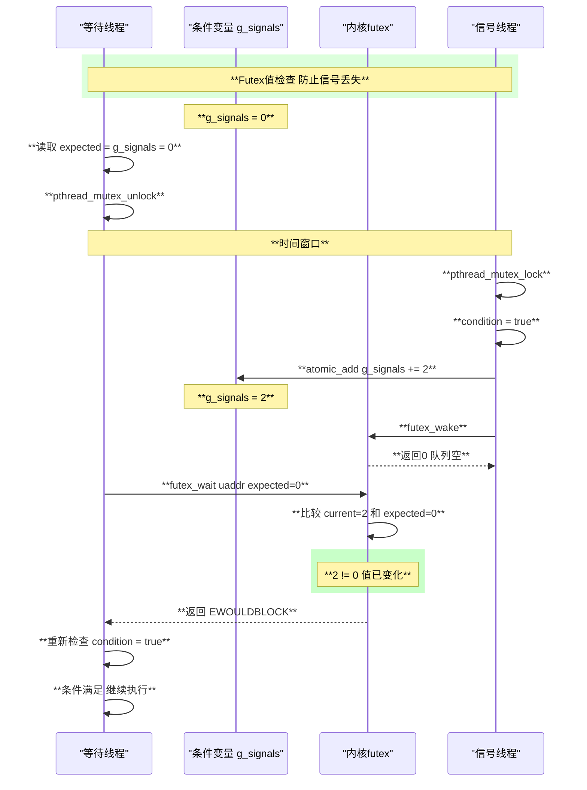
```mermaid
sequenceDiagram
    participant W as "等待线程"
    participant CV as "条件变量 g_signals"
    participant K as "内核futex"
    participant S as "信号线程"
    
    rect rgb(220, 255, 220)
    Note over W,S: **Futex值检查 防止信号丢失**
    end
    
    Note over CV: **g_signals = 0**
    
    W->>W: **读取 expected = g_signals = 0**
    W->>W: **pthread_mutex_unlock**
    
    Note over W,S: **时间窗口**
    
    S->>S: **pthread_mutex_lock**
    S->>S: **condition = true**
    S->>CV: **atomic_add g_signals += 2**
    Note over CV: **g_signals = 2**
    S->>K: **futex_wake**
    K-->>S: **返回0 队列空**
    
    W->>K: **futex_wait uaddr expected=0**
    K->>K: **比较 current=2 和 expected=0**
    
    rect rgb(200, 255, 200)
    Note over K: **2 != 0 值已变化**
    end
    
    K-->>W: **返回 EWOULDBLOCK**
    W->>W: **重新检查 condition = true**
    W->>W: **条件满足 继续执行**
```

### 完整的防丢失机制

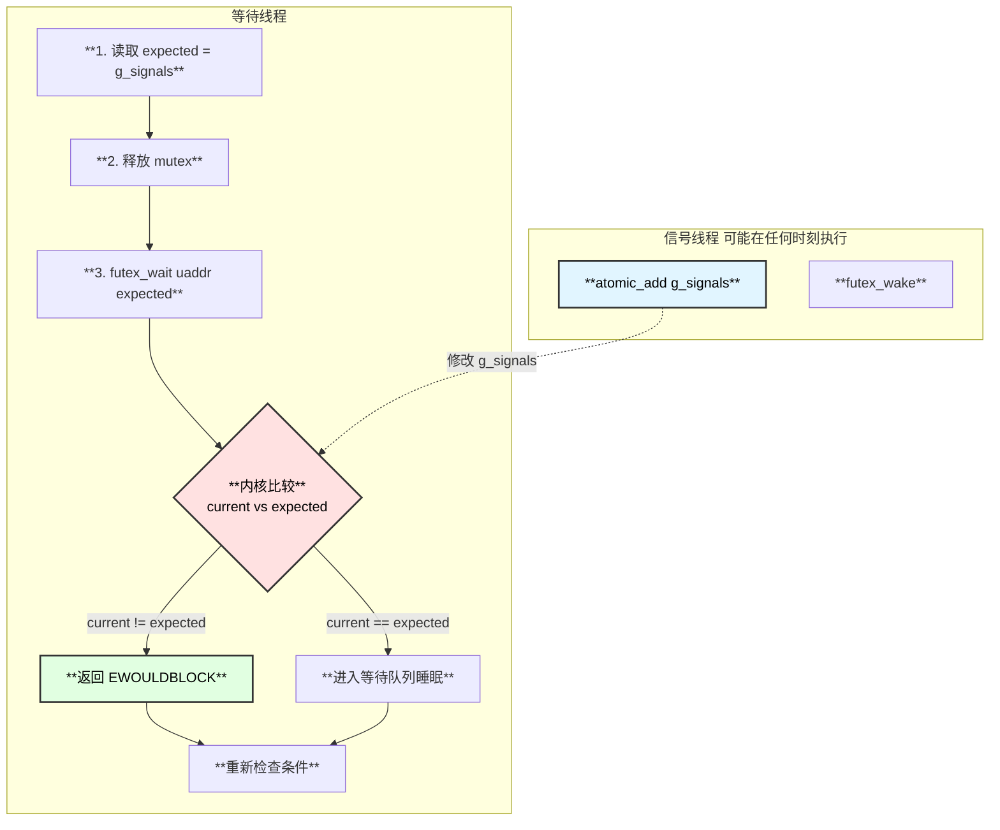
```mermaid
graph TB
    subgraph "等待线程"
        W1["**1. 读取 expected = g_signals**"]
        W2["**2. 释放 mutex**"]
        W3["**3. futex_wait uaddr expected**"]
        W4{"**内核比较**<br/>current vs expected"}
        W5["**返回 EWOULDBLOCK**"]
        W6["**进入等待队列睡眠**"]
        W7["**重新检查条件**"]
    end
    
    subgraph "信号线程 可能在任何时刻执行"
        S1["**atomic_add g_signals**"]
        S2["**futex_wake**"]
    end
    
    W1 --> W2
    W2 --> W3
    W3 --> W4
    W4 -->|"current != expected"| W5
    W4 -->|"current == expected"| W6
    W5 --> W7
    W6 --> W7
    
    S1 -.->|"修改 g_signals"| W4
    
    style W4 fill:#ffe1e1,stroke:#333,stroke-width:2px,color:#000
    style W5 fill:#e1ffe1,stroke:#333,stroke-width:2px,color:#000
    style S1 fill:#e1f5ff,stroke:#333,stroke-width:2px,color:#000
```

**为什么这个方案有效？**

| **场景** | **g_signals** | **futex_wait 结果** | **线程行为** |
|:---|:---|:---|:---|
| signal 在 wait 前发生 | 已变化 | 返回 EWOULDBLOCK | 立即重新检查条件 |
| signal 在 wait 后发生 | 未变化，入队后变化 | 被正常唤醒 | 重新检查条件 |
| 没有 signal | 未变化 | 进入睡眠等待 | 等待唤醒 |

**关键保证**：无论 signal 发生在什么时刻，线程都能正确响应！

### 源码中的实现

```c
// glibc/nptl/pthread_cond_wait.c 简化版
int pthread_cond_wait(pthread_cond_t *cond, pthread_mutex_t *mutex) {
    // 1. 读取当前信号值（在释放 mutex 前）
    uint64_t wseq = __condvar_fetch_add_wseq_acquire(cond, 2);
    unsigned int g = wseq & 1;  // 当前组
    uint32_t signals = cond->__g_signals[g];  // 期望值
    
    // 2. 释放 mutex（让 signal 线程能执行）
    pthread_mutex_unlock(mutex);
    
    // 3. 进入 futex 等待
    do {
        int ret = futex(&cond->__g_signals[g], FUTEX_WAIT, signals, ...);
        
        if (ret == -EWOULDBLOCK) {
            // 值已变化，说明有 signal 发生
            // 不是错误，继续循环检查
        }
        
        // 重新读取信号值
        signals = cond->__g_signals[g];
        
    } while (!should_wakeup(cond, g, wseq));  // 检查是否应该醒来
    
    // 4. 重新获取 mutex
    pthread_mutex_lock(mutex);
    
    return 0;
}
```

```c
// kernel/futex/waitwake.c:592 简化版
static int futex_wait_setup(u32 __user *uaddr, u32 val, ...) {
    // ...
    
    // 关键：在持有桶锁时检查值
    uval = futex_get_value_locked(&uval, uaddr);
    
    if (uval != val) {
        // 值已变化，拒绝进入等待
        ret = -EWOULDBLOCK;
        goto out;
    }
    
    // 值相同，允许入队
    // ...
}
```

## 虚假唤醒问题

### 什么是虚假唤醒？

**虚假唤醒 (Spurious Wakeup)** 是指：线程被唤醒但条件并未满足。

**产生原因**：
1. **内核层面**：信号中断、超时、futex 重新哈希等
2. **用户层面**：broadcast 唤醒多个线程，但只有一个能获得资源
3. **实现优化**：为了简化内核代码，允许虚假唤醒

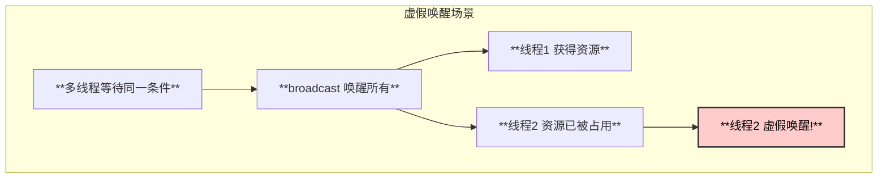
```mermaid
graph TB
    subgraph "虚假唤醒场景"
        A["**多线程等待同一条件**"]
        B["**broadcast 唤醒所有**"]
        C["**线程1 获得资源**"]
        D["**线程2 资源已被占用**"]
        E["**线程2 虚假唤醒!**"]
    end
    
    A --> B
    B --> C
    B --> D
    D --> E
    
    style E fill:#ffcccc,stroke:#333,stroke-width:2px,color:#000
```

### 解决方案：循环检查

```c
// 错误写法 - 可能因虚假唤醒导致问题
pthread_mutex_lock(&mutex);
if (!condition) {           // ❌ 只检查一次
    pthread_cond_wait(&cond, &mutex);
}
// 此时 condition 可能仍为 false!
do_something_with_resource();
pthread_mutex_unlock(&mutex);

// 正确写法 - 循环检查防止虚假唤醒
pthread_mutex_lock(&mutex);
while (!condition) {        // ✅ 循环检查
    pthread_cond_wait(&cond, &mutex);
}
// 此时 condition 一定为 true
do_something_with_resource();
pthread_mutex_unlock(&mutex);
```

### 为什么内核允许虚假唤醒？

| **原因** | **说明** |
|:---|:---|
| **简化实现** | 不需要在唤醒路径上做复杂的条件验证 |
| **性能优化** | 减少锁持有时间，允许批量唤醒 |
| **信号处理** | EINTR 返回时可能条件未满足 |
| **PI 继承** | 优先级继承机制可能导致额外唤醒 |

## 内存屏障与原子操作

### Wait 操作的原子性保证

```c
// kernel/futex/waitwake.c:58-84
// 关键的内存屏障保证：

CPU 0 (Waiter)                    CPU 1 (Waker)
==============                    ==============
val = *futex;
waiters++;        (a)
smp_mb();         (A) <-----.
                            |
lock(hash_bucket);          |
uval = *futex;              |
                            |     *futex = newval;
                            `---> smp_mb();   (B)
if (uval == val)
    queue();
    unlock(hash_bucket);
    schedule();                   if (waiters)
                                      lock(hash_bucket);
else                                  wake_waiters();
    waiters--;    (b)                 unlock(hash_bucket);
```

### 条件变量的双组机制 G1和G2

glibc 使用双组机制避免虚假唤醒和信号丢失：

```mermaid
graph TB
    subgraph "条件变量双组"
        G0["**G0 当前等待组**<br/>正在等待的线程"]
        G1["**G1 上一等待组**<br/>被唤醒中的线程"]
    end
    
    subgraph "关键字段"
        WS["**__wseq**<br/>等待序列号"]
        GS["**__g_signals**<br/>各组信号计数"]
        GR["**__g_refs**<br/>各组引用计数"]
        GSZ["**__g_size**<br/>各组大小"]
    end
    
    subgraph "操作"
        W["**wait**<br/>加入当前组"]
        S["**signal**<br/>增加当前组信号"]
        B["**broadcast**<br/>切换组加唤醒所有"]
    end
    
    W --> G0
    S --> GS
    B --> G0
    B --> G1
    
    style G0 fill:#ffe1e1,stroke:#333,stroke-width:2px,color:#000
    style G1 fill:#e1ffe1,stroke:#333,stroke-width:2px,color:#000
    style WS fill:#e1f5ff,stroke:#333,stroke-width:2px,color:#000
    style GS fill:#fff3e1,stroke:#333,stroke-width:2px,color:#000
```

## 使用方法

### 基本用法示例

```c
#include <pthread.h>
#include <stdio.h>
#include <stdlib.h>

pthread_mutex_t mutex = PTHREAD_MUTEX_INITIALIZER;
pthread_cond_t cond = PTHREAD_COND_INITIALIZER;
int ready = 0;

// 等待线程
void* waiter(void* arg) {
    pthread_mutex_lock(&mutex);
    
    // 必须在循环中检查条件（防止虚假唤醒）
    while (!ready) {
        printf("等待线程: 等待条件...\n");
        pthread_cond_wait(&cond, &mutex);
    }
    
    printf("等待线程: 条件满足，继续执行\n");
    pthread_mutex_unlock(&mutex);
    
    return NULL;
}

// 发信号线程
void* signaler(void* arg) {
    sleep(1);  // 模拟一些工作
    
    pthread_mutex_lock(&mutex);
    ready = 1;
    printf("发信号线程: 设置条件并发信号\n");
    pthread_cond_signal(&cond);
    pthread_mutex_unlock(&mutex);
    
    return NULL;
}

int main() {
    pthread_t t1, t2;
    
    pthread_create(&t1, NULL, waiter, NULL);
    pthread_create(&t2, NULL, signaler, NULL);
    
    pthread_join(t1, NULL);
    pthread_join(t2, NULL);
    
    pthread_mutex_destroy(&mutex);
    pthread_cond_destroy(&cond);
    
    return 0;
}
```

### 生产者-消费者模式

```c
#include <pthread.h>
#include <stdio.h>
#include <stdlib.h>
#include <unistd.h>

#define BUFFER_SIZE 10

int buffer[BUFFER_SIZE];
int count = 0;
int in = 0, out = 0;

pthread_mutex_t mutex = PTHREAD_MUTEX_INITIALIZER;
pthread_cond_t not_full = PTHREAD_COND_INITIALIZER;
pthread_cond_t not_empty = PTHREAD_COND_INITIALIZER;

void* producer(void* arg) {
    int id = *(int*)arg;
    for (int i = 0; i < 20; i++) {
        int item = rand() % 100;
        
        pthread_mutex_lock(&mutex);
        
        // 缓冲区满时等待
        while (count == BUFFER_SIZE) {
            printf("生产者 %d: 缓冲区满，等待...\n", id);
            pthread_cond_wait(&not_full, &mutex);
        }
        
        // 放入数据
        buffer[in] = item;
        in = (in + 1) % BUFFER_SIZE;
        count++;
        printf("生产者 %d: 生产 %d, 缓冲区大小: %d\n", id, item, count);
        
        // 通知消费者
        pthread_cond_signal(&not_empty);
        pthread_mutex_unlock(&mutex);
        
        usleep(rand() % 100000);
    }
    return NULL;
}

void* consumer(void* arg) {
    int id = *(int*)arg;
    for (int i = 0; i < 20; i++) {
        pthread_mutex_lock(&mutex);
        
        // 缓冲区空时等待
        while (count == 0) {
            printf("消费者 %d: 缓冲区空，等待...\n", id);
            pthread_cond_wait(&not_empty, &mutex);
        }
        
        // 取出数据
        int item = buffer[out];
        out = (out + 1) % BUFFER_SIZE;
        count--;
        printf("消费者 %d: 消费 %d, 缓冲区大小: %d\n", id, item, count);
        
        // 通知生产者
        pthread_cond_signal(&not_full);
        pthread_mutex_unlock(&mutex);
        
        usleep(rand() % 150000);
    }
    return NULL;
}

int main() {
    pthread_t producers[2], consumers[2];
    int ids[] = {0, 1};
    
    for (int i = 0; i < 2; i++) {
        pthread_create(&producers[i], NULL, producer, &ids[i]);
        pthread_create(&consumers[i], NULL, consumer, &ids[i]);
    }
    
    for (int i = 0; i < 2; i++) {
        pthread_join(producers[i], NULL);
        pthread_join(consumers[i], NULL);
    }
    
    return 0;
}
```

### 带超时的条件等待

```c
#include <pthread.h>
#include <stdio.h>
#include <time.h>
#include <errno.h>

pthread_mutex_t mutex = PTHREAD_MUTEX_INITIALIZER;
pthread_cond_t cond = PTHREAD_COND_INITIALIZER;
int ready = 0;

void* timed_waiter(void* arg) {
    struct timespec ts;
    int ret;
    
    pthread_mutex_lock(&mutex);
    
    // 设置绝对超时时间 (当前时间 + 2秒)
    clock_gettime(CLOCK_REALTIME, &ts);
    ts.tv_sec += 2;
    
    while (!ready) {
        printf("等待线程: 带超时等待 (2秒)...\n");
        ret = pthread_cond_timedwait(&cond, &mutex, &ts);
        
        if (ret == ETIMEDOUT) {
            printf("等待线程: 超时!\n");
            break;
        }
    }
    
    if (ready) {
        printf("等待线程: 条件满足\n");
    }
    
    pthread_mutex_unlock(&mutex);
    return NULL;
}
```

## 常见陷阱与最佳实践

### 陷阱1：虚假唤醒

```c
// 错误写法
pthread_mutex_lock(&mutex);
if (!condition) {  // 只检查一次
    pthread_cond_wait(&cond, &mutex);
}
// 可能因虚假唤醒导致条件不满足就继续执行

// 正确写法
pthread_mutex_lock(&mutex);
while (!condition) {  // 循环检查
    pthread_cond_wait(&cond, &mutex);
}
// 保证条件一定满足
```

### 陷阱2：信号丢失

```c
// 错误写法 - 在unlock后signal
pthread_mutex_lock(&mutex);
condition = true;
pthread_mutex_unlock(&mutex);
pthread_cond_signal(&cond);  // 信号可能丢失

// 正确写法 - 在lock内signal
pthread_mutex_lock(&mutex);
condition = true;
pthread_cond_signal(&cond);  // 保证信号不丢失
pthread_mutex_unlock(&mutex);
```

### 陷阱3：使用错误的mutex

```c
// 错误 - wait和signal使用不同mutex
pthread_cond_wait(&cond, &mutex1);  // 线程A
pthread_cond_signal(&cond);          // 线程B (没持有mutex1)

// 正确 - 必须使用相同的mutex
```

## API 总结

| API | 功能 | 内核调用 |
|:---|:---|:---|
| pthread_cond_init | 初始化条件变量 | 无 |
| pthread_cond_destroy | 销毁条件变量 | 无 |
| pthread_cond_wait | 等待条件 | futex(FUTEX_WAIT) |
| pthread_cond_timedwait | 带超时等待 | futex(FUTEX_WAIT) |
| pthread_cond_signal | 唤醒一个等待者 | futex(FUTEX_WAKE, 1) |
| pthread_cond_broadcast | 唤醒所有等待者 | futex(FUTEX_WAKE, INT_MAX) |

## pthread_condattr_setclock 单调时钟支持

### 为什么需要单调时钟？

`pthread_cond_timedwait` 默认使用 `CLOCK_REALTIME`（系统墙钟），但墙钟可能被 NTP 调整或用户手动修改：

### Futex 哪里使用了时钟？

**Futex 在带超时的等待操作中使用时钟**（`kernel/futex/core.c:136`）：

```c
// futex_setup_timer - 设置 futex 等待超时定时器
struct hrtimer_sleeper *
futex_setup_timer(ktime_t *time, struct hrtimer_sleeper *timeout,
                  int flags, u64 range_ns)
{
    if (!time)
        return NULL;

    // 关键：根据标志选择时钟类型
    // FLAGS_CLOCKRT = 使用 REALTIME
    // 默认 = 使用 MONOTONIC
    hrtimer_init_sleeper_on_stack(timeout,
        (flags & FLAGS_CLOCKRT) ? CLOCK_REALTIME : CLOCK_MONOTONIC,
        HRTIMER_MODE_ABS);

    hrtimer_set_expires_range_ns(&timeout->timer, *time, range_ns);
    return timeout;
}
```

**使用场景**：
- `FUTEX_WAIT` 带超时参数
- `pthread_cond_timedwait` 底层实现

**如果使用 REALTIME 会有什么问题**：

```
场景：等待条件变量，超时 10 秒

时间线：
  T=0:  pthread_cond_timedwait(&cond, &mutex, deadline=10:00:10)
  T=0:  futex(FUTEX_WAIT, timeout=10:00:10)  // 基于 REALTIME
  T=5:  NTP 调整：系统时间 10:00:05 → 11:00:05
  T=5:  hrtimer 检查：11:00:05 > 10:00:10，立即触发超时！
  
  结果：本该等待 10 秒，实际只等了 5 秒就超时返回
```

```mermaid
graph LR
    subgraph "CLOCK_REALTIME 问题"
        A["**等待 10 秒**<br/>deadline = now + 10s"]
        B["**NTP 调快 1 小时**"]
        C["**立即超时**<br/>deadline 已过去"]
    end
    
    subgraph "CLOCK_MONOTONIC 解决"
        D["**等待 10 秒**<br/>deadline = mono + 10s"]
        E["**NTP 调整**<br/>不影响 MONOTONIC"]
        F["**正常等待 10 秒**"]
    end
    
    A --> B --> C
    D --> E --> F
    
    style C fill:#ff6b6b,stroke:#333,stroke-width:2px,color:#000
    style F fill:#51cf66,stroke:#333,stroke-width:2px,color:#000
```

### 使用方法

```c
#include <pthread.h>
#include <time.h>

pthread_cond_t cond;
pthread_condattr_t attr;

// 1. 初始化属性
pthread_condattr_init(&attr);

// 2. 设置使用单调时钟
pthread_condattr_setclock(&attr, CLOCK_MONOTONIC);

// 3. 用属性初始化条件变量
pthread_cond_init(&cond, &attr);

// 4. 使用单调时钟计算超时
struct timespec ts;
clock_gettime(CLOCK_MONOTONIC, &ts);  // 使用 MONOTONIC！
ts.tv_sec += 10;  // 10 秒后超时

pthread_cond_timedwait(&cond, &mutex, &ts);
```

### 内核源码分析

**glibc 将时钟类型编码到 futex 操作中**：

```c
// glibc: nptl/pthread_cond_timedwait.c
int __pthread_cond_timedwait(pthread_cond_t *cond, pthread_mutex_t *mutex,
                             const struct timespec *abstime)
{
    // 获取条件变量配置的时钟类型
    clockid_t clockid = cyclic_clock_get(cond);  // MONOTONIC 或 REALTIME
    
    // 转换为 futex 标志
    int op = FUTEX_WAIT_BITSET;
    if (clockid == CLOCK_REALTIME)
        op |= FUTEX_CLOCK_REALTIME;
    // CLOCK_MONOTONIC 时不设置此标志
    
    futex(&cond->__g_signals[g], op, ...);
}
```

**内核根据标志选择时钟源**：

```c
// kernel/futex/core.c:139-145
struct hrtimer_sleeper *
futex_setup_timer(ktime_t *time, struct hrtimer_sleeper *timeout,
                  int flags, u64 range_ns)
{
    // 关键：根据 FLAGS_CLOCKRT 选择时钟
    hrtimer_init_sleeper_on_stack(timeout, 
        (flags & FLAGS_CLOCKRT) ? CLOCK_REALTIME : CLOCK_MONOTONIC,
        HRTIMER_MODE_ABS);
    // ...
}
```

```c
// kernel/futex/syscalls.c:156
static int futex_init_timeout(...)
{
    *t = timespec64_to_ktime(*ts);
    if (cmd == FUTEX_WAIT)
        *t = ktime_add_safe(ktime_get(), *t);
    else if (cmd != FUTEX_LOCK_PI && !(op & FUTEX_CLOCK_REALTIME))
        *t = timens_ktime_to_host(CLOCK_MONOTONIC, *t);  // 单调时钟
    return 0;
}
```

### 时钟类型对比

| **时钟** | **特点** | **使用场景** |
|:---|:---|:---|
| CLOCK_REALTIME | 系统墙钟，可被调整 | 与现实时间相关的超时 |
| CLOCK_MONOTONIC | 单调递增，不可调整 | 相对时间间隔（推荐） |

### CLOCK_MONOTONIC 实现原理

**核心问题**：代码里确实用到了 REALTIME，为什么 MONOTONIC 还能不受影响？

**关键机制**：**当 NTP 调整 REALTIME 时，内核同时反向调整 wall_to_monotonic 偏移量，使得 MONOTONIC 保持不变。**

```
MONOTONIC = REALTIME + wall_to_monotonic
           ↑ 改变      ↑ 反向改变
           结果：MONOTONIC 不变
```

**具体例子**：

```
系统启动时：
  - 硬件时钟读取：2024-01-01 00:00:00 (REALTIME)
  - MONOTONIC 从 0 开始计时
  - wall_to_monotonic = 0 - 2024-01-01 = -1704067200 秒

启动后 100 秒：
  - REALTIME     = 2024-01-01 00:01:40 (1704067300)
  - wall_to_mono = -1704067200
  - MONOTONIC    = 1704067300 + (-1704067200) = 100 秒 ✓

此时 NTP 调快 1 小时 (3600秒)：
  - 旧 REALTIME  = 1704067300
  - 新 REALTIME  = 1704067300 + 3600 = 1704070900
  
  关键步骤 (do_settimeofday64):
  - ts_delta = 新REALTIME - 旧REALTIME = 3600
  - wall_to_mono = 旧wall_to_mono - ts_delta
                 = -1704067200 - 3600 = -1704070800
  
计算 MONOTONIC：
  - MONOTONIC = 新REALTIME + 新wall_to_mono
              = 1704070900 + (-1704070800)
              = 100 秒 ✓ (不变！)
```

```mermaid
graph TB
    subgraph "时钟计算原理"
        RT["**CLOCK_REALTIME**<br/>xtime_sec + xtime_nsec"]
        WTM["**wall_to_monotonic**<br/>启动时计算的偏移量"]
        MONO["**CLOCK_MONOTONIC**<br/>= REALTIME + wall_to_monotonic"]
    end
    
    subgraph "NTP 调整影响"
        ADJ["**NTP 调整 +3600s**"]
        RT2["**REALTIME += 3600s**"]
        WTM2["**wall_to_mono -= 3600s**"]
        MONO2["**MONOTONIC 不变**"]
    end
    
    RT --> MONO
    WTM --> MONO
    ADJ --> RT2
    ADJ --> WTM2
    RT2 --> MONO2
    WTM2 --> MONO2
    
    style MONO fill:#e1ffe1,stroke:#333,stroke-width:2px,color:#000
    style MONO2 fill:#e1ffe1,stroke:#333,stroke-width:2px,color:#000
```

**这就是为什么叫"单调"时钟**：
- 它不关心当前是几点（墙钟时间）
- 它只关心从启动到现在过了多少时间
- 硬件时钟（TSC/HPET）持续滴答，NTP 调整只影响 REALTIME 的解释，不影响硬件滴答的累积

**内核源码分析** (`kernel/time/timekeeping.c`):

```c
// MONOTONIC 时间获取 (kernel/time/timekeeping.c:971)
void ktime_get_ts64(struct timespec64 *ts)
{
    struct timekeeper *tk = &tk_core.timekeeper;
    struct timespec64 tomono;
    
    do {
        seq = read_seqcount_begin(&tk_core.seq);
        ts->tv_sec = tk->xtime_sec;           // REALTIME 秒
        nsec = timekeeping_get_ns(&tk->tkr_mono);  // 纳秒部分
        tomono = tk->wall_to_monotonic;       // 关键偏移量
    } while (read_seqcount_retry(&tk_core.seq, seq));
    
    // MONOTONIC = REALTIME + wall_to_monotonic
    *ts = timespec64_add(*ts, tomono);
}
```

**NTP/settimeofday 调整时的处理** (`kernel/time/timekeeping.c:1441`):

```c
int do_settimeofday64(const struct timespec64 *ts)
{
    struct timespec64 ts_delta, xt;
    
    // 1. 获取当前时间
    xt = tk_xtime(tk);
    
    // 2. 计算时间差
    ts_delta = timespec64_sub(*ts, xt);  // 新时间 - 旧时间
    
    // 3. 关键：反向调整 wall_to_monotonic
    //    使得 MONOTONIC = (新REALTIME) + (新wall_to_mono) 保持不变
    tk_set_wall_to_mono(tk, timespec64_sub(tk->wall_to_monotonic, ts_delta));
    //                      ↑ 旧偏移量 - 时间差 = 新偏移量
    
    // 4. 设置新的 REALTIME
    tk_set_xtime(tk, ts);
}
```

**wall_to_monotonic 的设置** (`kernel/time/timekeeping.c:151`):

```c
static void tk_set_wall_to_mono(struct timekeeper *tk, struct timespec64 wtm)
{
    // 验证一致性：offs_real = -wall_to_monotonic
    set_normalized_timespec64(&tmp, -tk->wall_to_monotonic.tv_sec,
                              -tk->wall_to_monotonic.tv_nsec);
    WARN_ON_ONCE(tk->offs_real != timespec64_to_ktime(tmp));
    
    // 设置新的偏移量
    tk->wall_to_monotonic = wtm;
    
    // 更新 ktime 快速路径偏移
    set_normalized_timespec64(&tmp, -wtm.tv_sec, -wtm.tv_nsec);
    tk->offs_real = timespec64_to_ktime(tmp);
}
```

**VDSO 快速路径** (`kernel/time/vsyscall.c:39`):

```c
// 预计算 MONOTONIC 基准值存入 VDSO 共享内存
// CLOCK_MONOTONIC
vdso_ts = &vdata[CS_HRES_COARSE].basetime[CLOCK_MONOTONIC];
vdso_ts->sec = tk->xtime_sec + tk->wall_to_monotonic.tv_sec;

nsec = tk->tkr_mono.xtime_nsec;
nsec += ((u64)tk->wall_to_monotonic.tv_nsec << tk->tkr_mono.shift);
// 处理进位...
vdso_ts->nsec = nsec;
```

**NTP 调整时的处理**:

| **操作** | **REALTIME** | **wall_to_monotonic** | **MONOTONIC** |
|:---|:---|:---|:---|
| 初始状态 | 1000s | -1000s | 0s |
| NTP +3600s | 4600s | -4600s | **0s 不变** |
| NTP -3600s | -2600s | 2600s | **0s 不变** |

**关键保证**：
1. ✅ **单调递增**：MONOTONIC 永不回退
2. ✅ **不受 NTP 影响**：wall_to_monotonic 反向补偿
3. ✅ **高精度**：使用硬件时钟源（TSC/HPET）
4. ✅ **VDSO 加速**：clock_gettime(CLOCK_MONOTONIC) 无需系统调用

## Linux 内核原生事件机制

### Futex 的定位

你的理解是正确的：**Futex 提供的是底层的睡眠/唤醒原语**，业务逻辑（条件检查、event 语义）需要用户态包装。

```mermaid
graph TB
    subgraph "用户态包装"
        COND["**pthread_cond**<br/>条件变量"]
        SEM["**sem_t**<br/>信号量"]
        MUTEX["**pthread_mutex**<br/>互斥锁"]
        RW["**pthread_rwlock**<br/>读写锁"]
    end
    
    subgraph "Futex 原语"
        FW["**FUTEX_WAIT**<br/>值匹配则睡眠"]
        FK["**FUTEX_WAKE**<br/>唤醒 N 个"]
    end
    
    COND --> FW
    COND --> FK
    SEM --> FW
    SEM --> FK
    MUTEX --> FW
    MUTEX --> FK
    RW --> FW
    RW --> FK
    
    style FW fill:#e1f5ff,stroke:#333,stroke-width:2px,color:#000
    style FK fill:#e1f5ff,stroke:#333,stroke-width:2px,color:#000
```

### 内核原生事件机制（不需要业务包装）

Linux 内核提供了多种**封装好的**事件机制，内核模块可以直接使用：

#### 1. Completion（完成量）

**最简单的一次性事件通知机制**：

```c
// include/linux/completion.h
struct completion {
    unsigned int done;          // 完成计数
    struct swait_queue_head wait;  // 等待队列
};

// 使用示例
DECLARE_COMPLETION(my_completion);

// 等待方
wait_for_completion(&my_completion);           // 阻塞等待
wait_for_completion_timeout(&my_completion, HZ);  // 带超时
wait_for_completion_interruptible(&my_completion);  // 可中断

// 通知方
complete(&my_completion);      // 唤醒一个等待者
complete_all(&my_completion);  // 唤醒所有等待者
```

**源码分析** (`kernel/sched/completion.c`):

```c
void complete(struct completion *x)
{
    unsigned long flags;
    raw_spin_lock_irqsave(&x->wait.lock, flags);
    
    if (x->done != UINT_MAX)
        x->done++;              // 增加完成计数
    swake_up_locked(&x->wait, 0);  // 唤醒等待者
    
    raw_spin_unlock_irqrestore(&x->wait.lock, flags);
}
```

#### 2. Wait Queue（等待队列）

**通用的条件等待机制**，支持复杂条件：

```c
// 声明等待队列头
DECLARE_WAIT_QUEUE_HEAD(my_wq);

// 等待特定条件
wait_event(my_wq, condition);                    // 不可中断
wait_event_interruptible(my_wq, condition);      // 可中断
wait_event_timeout(my_wq, condition, timeout);   // 带超时

// 唤醒
wake_up(&my_wq);          // 唤醒一个
wake_up_all(&my_wq);      // 唤醒所有
wake_up_interruptible(&my_wq);
```

**与 Futex 的区别**：
- `wait_event` 自动检查条件并循环等待
- 不需要用户手动实现条件检查逻辑

#### 3. Eventfd（用户态可用）

**用户态和内核态都可以使用的事件计数器**：

```c
// 用户态
int efd = eventfd(0, EFD_NONBLOCK);

// 发送事件（计数 +1）
uint64_t val = 1;
write(efd, &val, sizeof(val));

// 等待事件
uint64_t count;
read(efd, &count, sizeof(count));  // 阻塞直到 count > 0
```

**内核态**:

```c
// fs/eventfd.c
struct eventfd_ctx {
    struct kref kref;
    wait_queue_head_t wqh;   // 等待队列
    __u64 count;             // 事件计数
    unsigned int flags;
};

void eventfd_signal_mask(struct eventfd_ctx *ctx, __poll_t mask)
{
    ctx->count++;
    wake_up_locked_poll(&ctx->wqh, EPOLLIN | mask);
}
```

### 机制对比

```mermaid
graph TB
    subgraph "用户态可用"
        FUTEX["**Futex**<br/>底层原语<br/>需要包装"]
        EVENTFD["**Eventfd**<br/>计数器事件<br/>可跨进程"]
    end
    
    subgraph "仅内核态"
        COMP["**Completion**<br/>一次性事件<br/>简单易用"]
        WQ["**Wait Queue**<br/>条件等待<br/>功能强大"]
    end
    
    subgraph "特点"
        F1["需要自己实现<br/>条件检查"]
        F2["自动条件检查<br/>循环等待"]
        F3["计数语义<br/>可累积"]
        F4["一次性/多次<br/>同步点"]
    end
    
    FUTEX --> F1
    WQ --> F2
    EVENTFD --> F3
    COMP --> F4
    
    style FUTEX fill:#ffe1e1,stroke:#333,stroke-width:2px,color:#000
    style COMP fill:#e1ffe1,stroke:#333,stroke-width:2px,color:#000
    style WQ fill:#e1f5ff,stroke:#333,stroke-width:2px,color:#000
    style EVENTFD fill:#fff3e1,stroke:#333,stroke-width:2px,color:#000
```

| **机制** | **使用场景** | **条件检查** | **用户态可用** |
|:---|:---|:---|:---|
| **Futex** | 用户态同步原语基础 | 需自己实现 | ✅ |
| **Completion** | 内核模块同步点 | 内置 done 计数 | ❌ |
| **Wait Queue** | 内核复杂条件等待 | 自动循环检查 | ❌ |
| **Eventfd** | 用户态/内核事件通知 | 计数器语义 | ✅ |

### 为什么用户态需要包装 Futex？

**Futex 设计哲学**：
1. **最小化内核开销**：快速路径（无竞争）完全在用户态
2. **灵活性**：支持各种同步原语（mutex/cond/sem/rwlock）
3. **零拷贝**：直接操作用户态内存

**如果内核提供完整的条件变量**：
- 每次操作都需要系统调用
- 条件检查逻辑无法定制
- 性能损失巨大

## 性能考虑

| 场景 | 开销 | 说明 |
|:---|:---|:---|
| 无等待者时signal | **极低** | 用户态检查，无系统调用 |
| 有等待者时signal | **中等** | 需要futex系统调用+调度 |
| wait进入 | **高** | 系统调用+加入队列+调度切换 |
| wait被唤醒 | **高** | 调度切换+重新获取mutex |

## 参考资料

1. Linux Kernel Source - `kernel/futex/`
2. glibc/NPTL Source - `nptl/pthread_cond_*`
3. Ulrich Drepper - "Futexes Are Tricky"
4. LWN.net - Condition variable scalability
5. `kernel/sched/completion.c` - Completion 实现
6. `include/linux/wait.h` - Wait Queue API

