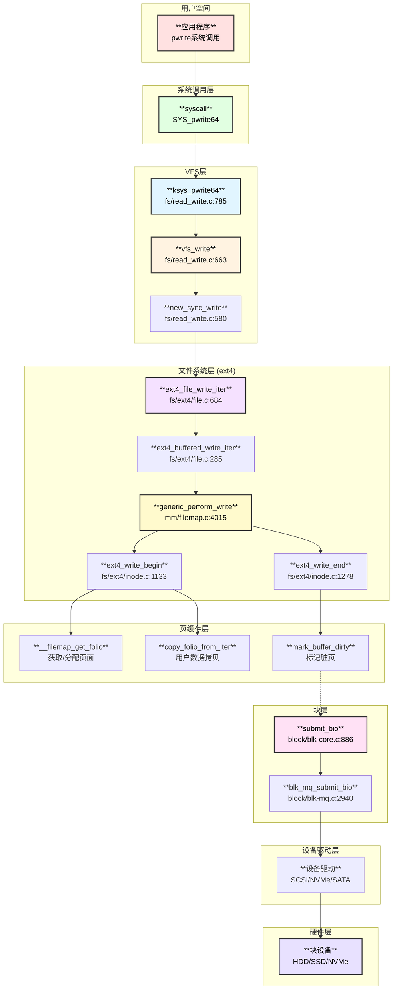
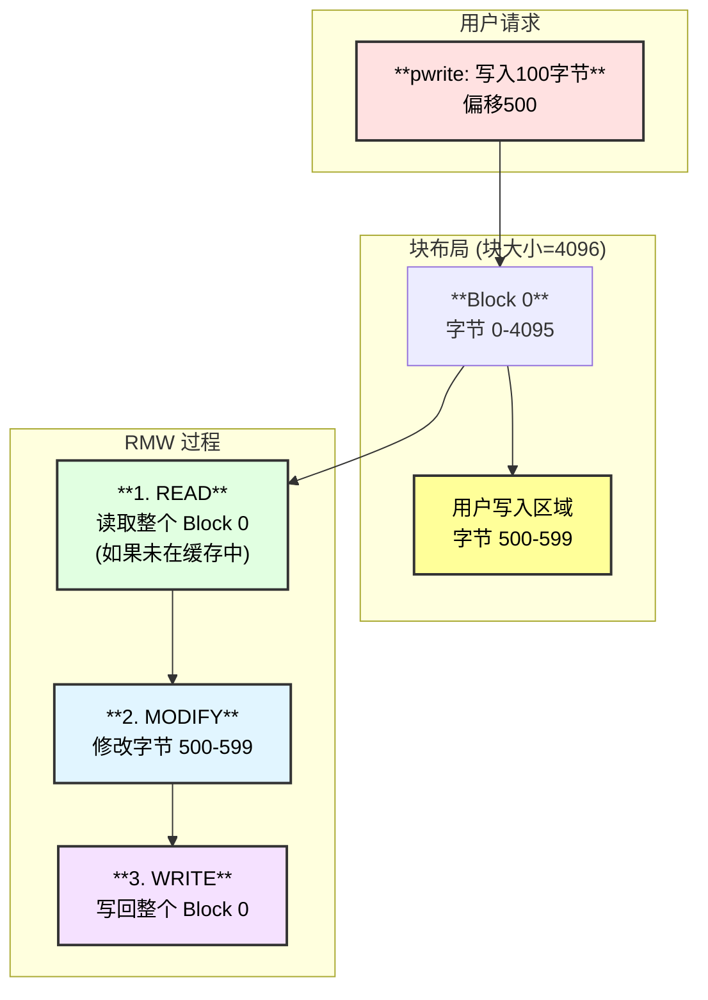
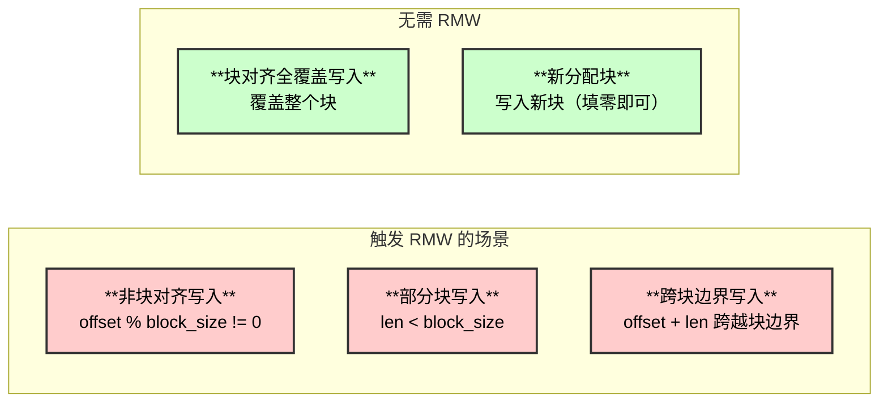
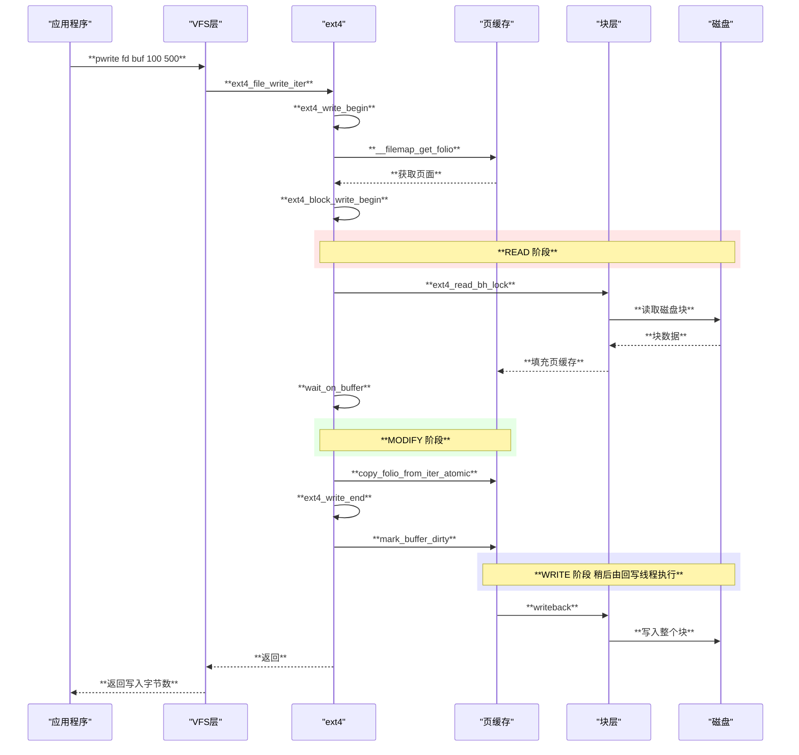
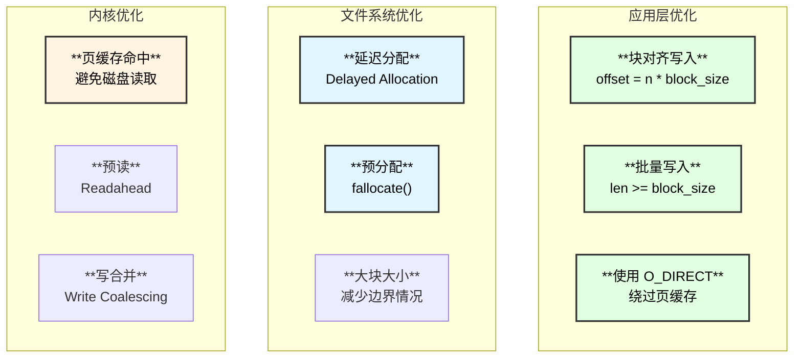
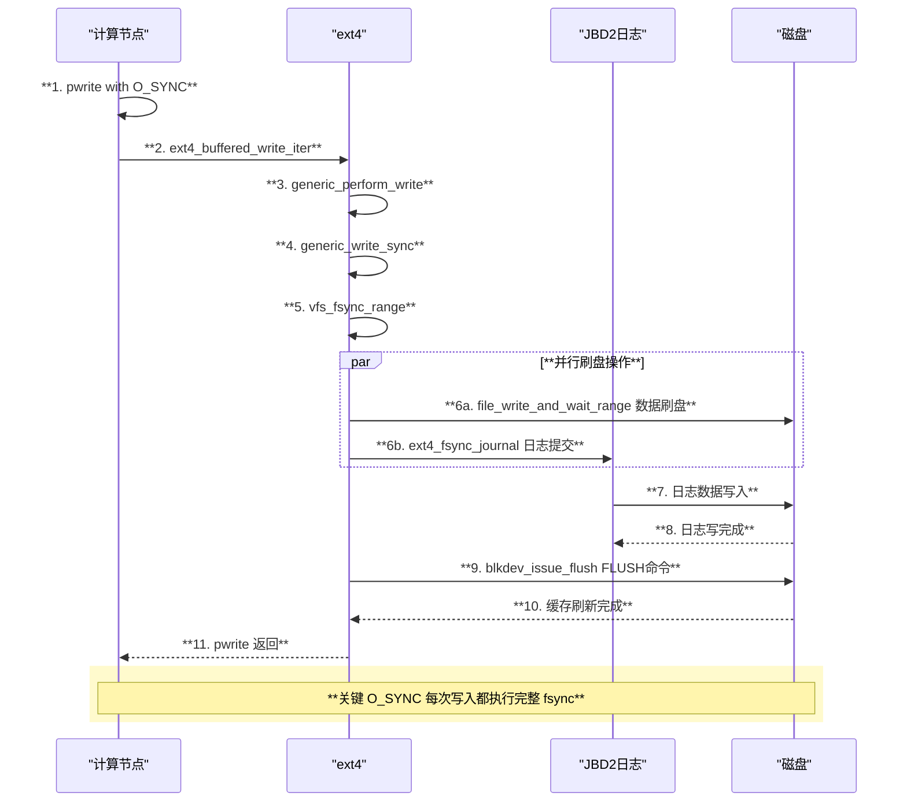
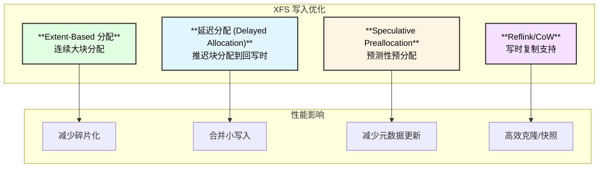

# Linux pwrite 系统调用深度解析

## 概述

`pwrite` 是 Linux 中用于在指定偏移量位置写入数据的系统调用。与 `write` 不同，`pwrite` 不会修改文件偏移量，允许多线程并发写入同一文件的不同位置。

本文从源码层面深入分析 pwrite 的完整调用链，从用户态到硬件层，以 ext4 文件系统为例，并重点解析 **Read-Modify-Write (RMW)** 问题的产生原因。

## 架构图



## 核心数据结构

### kiocb 结构

```c
// include/linux/fs.h
struct kiocb {
    struct file     *ki_filp;     // 文件指针
    loff_t          ki_pos;       // 文件偏移量
    void (*ki_complete)(struct kiocb *iocb, long ret);
    int             ki_flags;     // IOCB_DIRECT, IOCB_NOWAIT 等
    u16             ki_ioprio;    // I/O 优先级
};
```

### iov_iter 结构

```c
// include/linux/uio.h
struct iov_iter {
    u8              iter_type;    // 迭代器类型
    size_t          iov_offset;   // 当前 iov 内偏移
    union {
        const struct iovec *__iov;
        const struct bio_vec *bvec;
        // ...
    };
    size_t          count;        // 剩余字节数
};
```

### buffer_head 结构

```c
// include/linux/buffer_head.h
struct buffer_head {
    unsigned long   b_state;      // 缓冲区状态标志
    struct buffer_head *b_this_page; // 页内下一个 buffer
    struct page     *b_page;      // 所属页面
    sector_t        b_blocknr;    // 块号
    size_t          b_size;       // 块大小
    char            *b_data;      // 数据指针
    struct block_device *b_bdev;  // 块设备
};
```

## 函数调用链

### 完整 pwrite 调用链 (Buffered I/O 模式)

```
pwrite(fd, buf, count, offset) - 用户空间 libc
└── syscall(SYS_pwrite64, ...) - 系统调用入口
    └── SYSCALL_DEFINE4(pwrite64, ...) - fs/read_write.c:805
        └── ksys_pwrite64() - fs/read_write.c:785
            ├── fdget() - 获取文件描述符
            │   └── ┌─────────────┬──────────────────────────────────────────┐
            │       │  操作        │  说明                                     │
            │       ├─────────────┼──────────────────────────────────────────┤
            │       │  fd -> file  │  通过文件描述符查找 struct file            │
            │       ├─────────────┼──────────────────────────────────────────┤
            │       │  引用计数++   │  增加 file 引用计数防止并发释放            │
            │       └─────────────┴──────────────────────────────────────────┘
            └── vfs_write() - fs/read_write.c:663
                ├── rw_verify_area(WRITE, file, &pos, count) - 权限检查
                ├── file_start_write(file) - 获取 inode sb_writers 锁
                └── new_sync_write() - fs/read_write.c:580
                    ├── init_sync_kiocb(&kiocb, filp) - 初始化 kiocb
                    │   └── ┌─────────────┬──────────────────────────────────────────┐
                    │       │  字段        │  值                                       │
                    │       ├─────────────┼──────────────────────────────────────────┤
                    │       │  ki_filp     │  filp                                     │
                    │       ├─────────────┼──────────────────────────────────────────┤
                    │       │  ki_pos      │  offset (pwrite的偏移参数)                 │
                    │       ├─────────────┼──────────────────────────────────────────┤
                    │       │  ki_flags    │  0 (buffered I/O) 或 IOCB_DIRECT          │
                    │       └─────────────┴──────────────────────────────────────────┘
                    ├── iov_iter_ubuf(&iter, ITER_SOURCE, buf, len)
                    └── filp->f_op->write_iter(&kiocb, &iter)
                        └── ext4_file_write_iter() - fs/ext4/file.c:684
                            ├── ext4_forced_shutdown() 检查
                            └── ext4_buffered_write_iter() - fs/ext4/file.c:285
                                ├── inode_lock(inode) - 获取 inode 写锁
                                ├── ext4_write_checks() - 写入检查
                                │   └── generic_write_checks() - 通用检查
                                └── generic_perform_write() - mm/filemap.c:4015
                                    └── [循环处理每个 chunk]
                                        ├── balance_dirty_pages_ratelimited() - 脏页平衡
                                        ├── a_ops->write_begin() 
                                        │   └── ext4_write_begin() - fs/ext4/inode.c:1133
                                        │       ├── __filemap_get_folio() - 获取/分配页面
                                        │       ├── ext4_journal_start() - 开启日志事务
                                        │       └── ext4_block_write_begin() - fs/ext4/inode.c:1015
                                        │           └── [关键: RMW 处理] 见下文详解
                                        ├── copy_folio_from_iter_atomic() - 拷贝用户数据
                                        │   └── ┌─────────────┬──────────────────────────────────────────┐
                                        │       │  操作        │  说明                                     │
                                        │       ├─────────────┼──────────────────────────────────────────┤
                                        │       │  kmap_local  │  映射页面到内核虚拟地址                   │
                                        │       ├─────────────┼──────────────────────────────────────────┤
                                        │       │  memcpy      │  从用户空间拷贝数据                       │
                                        │       ├─────────────┼──────────────────────────────────────────┤
                                        │       │  kunmap_local│  解除映射                                 │
                                        │       └─────────────┴──────────────────────────────────────────┘
                                        └── a_ops->write_end()
                                            └── ext4_write_end() - fs/ext4/inode.c:1278
                                                ├── block_write_end() - 完成块写入
                                                │   └── ┌─────────────┬──────────────────────────────────────────┐
                                                │       │  操作        │  说明                                     │
                                                │       ├─────────────┼──────────────────────────────────────────┤
                                                │       │  set_uptodate│  标记 buffer_head 为最新                  │
                                                │       ├─────────────┼──────────────────────────────────────────┤
                                                │       │  mark_dirty  │  标记为脏                                 │
                                                │       └─────────────┴──────────────────────────────────────────┘
                                                ├── ext4_update_inode_size() - 更新 inode 大小
                                                ├── ext4_mark_inode_dirty() - 标记 inode 脏
                                                └── ext4_journal_stop() - 结束日志事务
```

## Read-Modify-Write (RMW) 问题深度解析

### 什么是 RMW 问题？

当应用程序执行**非块对齐**或**部分块**写入时，文件系统必须：
1. **Read**: 先从磁盘读取整个块的内容
2. **Modify**: 在内存中修改部分内容
3. **Write**: 将整个块写回磁盘

这就是 **Read-Modify-Write (RMW)** 问题，也称为 **Read-Before-Write**。

### RMW 问题架构图



### RMW 触发条件



### RMW 源码分析

RMW 的核心逻辑在 `ext4_block_write_begin()` 函数中：

```
ext4_block_write_begin() - fs/ext4/inode.c:1015
├── 计算写入范围
│   └── ┌─────────────┬─────────────────────────────────────────────────────┐
│       │  变量        │  计算                                                │
│       ├─────────────┼─────────────────────────────────────────────────────┤
│       │  from        │  pos & (PAGE_SIZE - 1)  // 页内起始偏移              │
│       ├─────────────┼─────────────────────────────────────────────────────┤
│       │  to          │  from + len             // 页内结束偏移              │
│       ├─────────────┼─────────────────────────────────────────────────────┤
│       │  blocksize   │  inode->i_sb->s_blocksize  // 块大小 (通常4KB)       │
│       └─────────────┴─────────────────────────────────────────────────────┘
├── 遍历页面中的每个块
│   └── for (bh = head; bh != head || !block_start; bh = bh->b_this_page)
│       ├── 跳过不需要处理的块
│       │   └── if (block_end <= from || block_start >= to) continue;
│       ├── 映射块到磁盘
│       │   └── get_block(inode, block, bh, 1)  // ext4_get_block
│       └── **关键判断: 是否需要 RMW**
│           └── if (!buffer_uptodate(bh) && !buffer_delay(bh) &&
│               !buffer_unwritten(bh) &&
│               (block_start < from || block_end > to))
│               └── ┌─────────────┬─────────────────────────────────────────────────────┐
│                   │  条件        │  含义                                                │
│                   ├─────────────┼─────────────────────────────────────────────────────┤
│                   │  !uptodate   │  块内容不在内存中是最新的                            │
│                   ├─────────────┼─────────────────────────────────────────────────────┤
│                   │  !delay      │  不是延迟分配的块                                   │
│                   ├─────────────┼─────────────────────────────────────────────────────┤
│                   │  !unwritten  │  不是未写入的预分配块                               │
│                   ├─────────────┼─────────────────────────────────────────────────────┤
│                   │  部分覆盖    │  block_start < from (起始不对齐)                    │
│                   │              │  或 block_end > to (结束不对齐)                     │
│                   └─────────────┴─────────────────────────────────────────────────────┘
│               └── **需要读取块**
│                   ├── ext4_read_bh_lock(bh, 0, false) - 发起读 I/O
│                   └── wait[nr_wait++] = bh  // 记录需要等待的块
└── 等待读 I/O 完成
    └── for (i = 0; i < nr_wait; i++) {
            wait_on_buffer(wait[i]);
            if (!buffer_uptodate(wait[i]))
                err = -EIO;
        }
```

### RMW 时序图



### RMW 性能影响

| **场景** | **额外 I/O** | **延迟影响** | **典型用例** |
|:---|:---|:---|:---|
| 块对齐全覆盖 | 无 | 最优 | 数据库块写入 |
| 首次写入新块 | 无 (填零) | 较优 | 文件扩展 |
| 非对齐小写入 | 1次读 | 高 | 日志追加 |
| 跨块边界写入 | 1-2次读 | 很高 | 随机小写入 |

### RMW 避免策略



## 块层处理

### bio 提交流程

```
mark_buffer_dirty() - fs/buffer.c
└── __set_page_dirty_buffers() - 标记页面脏
    └── [稍后由回写线程处理]
        └── writeback_single_inode() - fs/fs-writeback.c
            └── do_writepages() - 启动回写
                └── ext4_writepages() - fs/ext4/inode.c
                    └── mpage_prepare_extent_to_map()
                        └── mpage_map_and_submit_extent()
                            └── ext4_io_submit() - fs/ext4/page-io.c
                                └── submit_bio() - block/blk-core.c:886
                                    ├── bio_set_ioprio() - 设置 I/O 优先级
                                    └── submit_bio_noacct() - block/blk-core.c:751
                                        └── __submit_bio() - block/blk-core.c:604
                                            └── blk_mq_submit_bio() - block/blk-mq.c:2940
                                                ├── blk_mq_get_new_requests() - 获取请求
                                                ├── blk_mq_bio_to_request() - bio转request
                                                └── blk_mq_sched_insert_request() - 插入调度队列
                                                    └── [硬件队列处理]
                                                        └── 驱动层 scsi_queue_rq / nvme_queue_rq
```

### bio 结构

```c
// include/linux/blk_types.h
struct bio {
    struct bio          *bi_next;      // 链表下一个
    struct block_device *bi_bdev;      // 目标块设备
    blk_opf_t           bi_opf;        // 操作类型 + 标志
    unsigned short      bi_flags;      // 状态标志
    struct bvec_iter    bi_iter;       // 迭代器 (扇区, 大小)
    bio_end_io_t        *bi_end_io;    // 完成回调
    void                *bi_private;   // 私有数据
    struct bio_vec      *bi_io_vec;    // I/O 向量数组
    // ...
};
```

## Buffer I/O vs Direct I/O

### Buffer I/O 模式 (默认)

**Buffer I/O 使用条件**：打开文件时 **不指定** `O_DIRECT` 标志即可。

```c
// Buffer I/O 模式 - 默认行为
int fd = open("/data/file.txt", O_RDWR | O_CREAT, 0644);

// 带同步的 Buffer I/O
int fd = open("/data/file.txt", O_RDWR | O_CREAT | O_SYNC, 0644);

// 常用的 Buffer I/O 标志组合
O_RDWR                    // 读写模式，走 Buffer I/O
O_RDWR | O_CREAT          // 创建文件，走 Buffer I/O
O_RDWR | O_SYNC           // 同步写入，仍走 Buffer I/O (但每次写后自动 fsync)
O_RDWR | O_DSYNC          // 数据同步，仍走 Buffer I/O (每次写后自动 fdatasync)
O_RDWR | O_APPEND         // 追加模式，走 Buffer I/O
```

**Buffer I/O 特点**：
- 数据先写入页缓存 (Page Cache)
- 由内核回写线程 (writeback) 异步刷盘
- 无对齐要求，支持任意偏移和大小
- 可能触发 RMW (Read-Modify-Write)

## Direct I/O 路径

如果使用 O_DIRECT 标志打开文件，写入路径不同：

```
ext4_file_write_iter() - fs/ext4/file.c:684
├── if (iocb->ki_flags & IOCB_DIRECT)
│   └── ext4_dio_write_iter() - fs/ext4/file.c:498
│       ├── ext4_dio_write_checks() - 检查和锁定
│       └── iomap_dio_rw() - fs/iomap/direct-io.c
│           ├── iomap_dio_bio_iter() - 构造 bio
│           └── submit_bio() - 直接提交
└── else
    └── ext4_buffered_write_iter() - Buffered I/O 路径
```

**Direct I/O 特点**：
- 绕过页缓存，直接读写磁盘
- 必须块对齐 (通常 512 字节或 4KB)
- 无 RMW 问题 (因为要求对齐)
- 同步 I/O，延迟较高

## O_SYNC / O_DSYNC 写入行为

### O_SYNC 标志解析

当文件以 `O_SYNC` 或 `O_DSYNC` 标志打开时，每次写入都会在返回前确保数据持久化到磁盘。

```c
// include/linux/fs.h:2340-2347
static inline void init_sync_kiocb(struct kiocb *kiocb, struct file *filp)
{
    *kiocb = (struct kiocb) {
        .ki_filp = filp,
        .ki_flags = filp->f_iocb_flags,  // 从文件标志继承 IOCB_SYNC/IOCB_DSYNC
        .ki_ioprio = get_current_ioprio(),
    };
}

// include/linux/fs.h:2868-2879
static inline ssize_t generic_write_sync(struct kiocb *iocb, ssize_t count)
{
    if (iocb_is_dsync(iocb)) {
        int ret = vfs_fsync_range(iocb->ki_filp,
                iocb->ki_pos - count, iocb->ki_pos - 1,
                (iocb->ki_flags & IOCB_SYNC) ? 0 : 1);  // O_SYNC=fsync, O_DSYNC=fdatasync
        if (ret)
            return ret;
    }
    return count;
}
```

### O_SYNC vs O_DSYNC

| **标志** | **IOCB标志** | **同步方式** | **同步内容** |
|:---|:---|:---|:---|
| O_SYNC | IOCB_SYNC + IOCB_DSYNC | vfs_fsync_range(datasync=0) | 数据 + 所有元数据 |
| O_DSYNC | IOCB_DSYNC | vfs_fsync_range(datasync=1) | 数据 + 必要元数据 |

### O_SYNC 调用链

```
pwrite() with O_SYNC
└── vfs_write() - fs/read_write.c:663
    └── new_sync_write() - fs/read_write.c:580
        ├── init_sync_kiocb(&kiocb, filp) - 设置 ki_flags = IOCB_SYNC | IOCB_DSYNC
        └── ext4_file_write_iter() - fs/ext4/file.c:684
            └── ext4_buffered_write_iter() - fs/ext4/file.c:285
                ├── generic_perform_write() - 写入页缓存
                └── generic_write_sync(iocb, ret) - **关键: 同步刷盘**
                    └── vfs_fsync_range() - fs/sync.c:180
                        └── ext4_sync_file() - fs/ext4/fsync.c:129
                            ├── file_write_and_wait_range() - 数据刷盘
                            ├── ext4_fsync_journal() - 日志提交
                            └── blkdev_issue_flush() - 磁盘缓存刷新
```

### O_SYNC 时序图



## XFS 文件系统的不同行为

### XFS vs ext4 写入差异

| **特性** | **ext4** | **XFS** |
|:---|:---|:---|
| 日志类型 | JBD2 日志 | 内置日志 (xlog) |
| 延迟分配 | 支持 | 支持，更激进 |
| 预分配 | fallocate | 更完善的 extent 预分配 |
| 写入对齐 | 推荐 4KB | 推荐 stripe unit 对齐 |
| 并发写入 | inode 锁 | 更细粒度的锁 |

### XFS 写入调用链

```
xfs_file_write_iter() - fs/xfs/xfs_file.c:835
├── xfs_is_shutdown() 检查
├── IS_DAX(inode)
│   └── xfs_file_dax_write() - DAX 写入路径
├── iocb->ki_flags & IOCB_DIRECT
│   └── xfs_file_dio_write() - fs/xfs/xfs_file.c:713
│       ├── xfs_file_dio_write_aligned() - 对齐 DIO
│       └── xfs_file_dio_write_unaligned() - 非对齐 DIO
└── xfs_file_buffered_write() - fs/xfs/xfs_file.c:771
    ├── xfs_ilock_iocb() - 获取 XFS inode 锁
    ├── xfs_file_write_checks() - 写入检查
    ├── iomap_file_buffered_write() - 使用 iomap 框架
    │   └── xfs_buffered_write_iomap_ops
    └── generic_write_sync(iocb, ret) - O_SYNC 时同步
```

### XFS fsync 调用链

```
xfs_file_fsync() - fs/xfs/xfs_file.c:125
├── file_write_and_wait_range() - 数据回写
├── xfs_is_shutdown() 检查
├── XFS_IS_REALTIME_INODE(ip)
│   └── blkdev_issue_flush(mp->m_rtdev_targp->bt_bdev) - RT设备刷新
├── mp->m_logdev_targp != mp->m_ddev_targp
│   └── blkdev_issue_flush(mp->m_ddev_targp->bt_bdev) - 数据设备刷新
├── xfs_ipincount(ip) > 0
│   └── xfs_fsync_flush_log() - 刷新日志
│       └── xfs_log_force_seq() - 强制日志到指定序列号
└── blkdev_issue_flush() - 最终刷新
```

### XFS 特有优化



### XFS O_SYNC 行为

```c
// fs/xfs/xfs_file.c:871-883
static inline bool xfs_file_sync_writes(struct file *filp)
{
    struct xfs_inode *ip = XFS_I(file_inode(filp));

    // XFS 检查多个同步写入条件
    if (xfs_has_wsync(ip->i_mount))  // 挂载选项 wsync
        return true;
    if (filp->f_flags & (__O_SYNC | O_DSYNC))  // 文件标志
        return true;
    if (IS_SYNC(file_inode(filp)))  // inode 同步属性
        return true;

    return false;
}
```

**XFS wsync 挂载选项**：使所有写入行为类似 O_SYNC，适用于需要高数据完整性的场景。

## 写入模式对比

| **模式** | **路径** | **是否有RMW** | **延迟** | **吞吐** |
|:---|:---|:---|:---|:---|
| Buffered 块对齐 | 页缓存 | 否 | 低 (仅写缓存) | 高 |
| Buffered 非对齐 | 页缓存 | **是** | 中-高 | 中 |
| Direct I/O | 直接 | 否 (要求对齐) | 高 | 中 |
| O_SYNC | 页缓存+刷盘 | 可能 | 很高 | 低 |
| O_DSYNC | 页缓存+刷盘 | 可能 | 高 | 低 |

## 使用示例

### 基本 pwrite 使用

```c
#include <fcntl.h>
#include <unistd.h>
#include <string.h>

int main() {
    int fd = open("/tmp/test.txt", O_RDWR | O_CREAT, 0644);
    
    // 块对齐写入 (推荐，避免 RMW)
    char buf[4096];
    memset(buf, 'A', 4096);
    pwrite(fd, buf, 4096, 0);  // 偏移0，写4KB
    
    // 非块对齐写入 (可能触发 RMW)
    pwrite(fd, "hello", 5, 100);  // 偏移100，写5字节
    
    close(fd);
    return 0;
}
```

### 使用 O_DIRECT 避免 RMW

```c
#include <fcntl.h>
#include <unistd.h>
#include <stdlib.h>

int main() {
    // 打开时指定 O_DIRECT
    int fd = open("/tmp/test.txt", O_RDWR | O_CREAT | O_DIRECT, 0644);
    
    // 分配对齐内存
    char *buf;
    posix_memalign((void**)&buf, 4096, 4096);  // 4KB 对齐
    memset(buf, 'A', 4096);
    
    // Direct I/O 写入 (必须块对齐)
    pwrite(fd, buf, 4096, 0);  // 偏移0，写4KB (块对齐)
    
    free(buf);
    close(fd);
    return 0;
}
```

### 使用 fallocate 预分配

```c
#include <fcntl.h>
#include <linux/falloc.h>

int main() {
    int fd = open("/tmp/test.txt", O_RDWR | O_CREAT, 0644);
    
    // 预分配 1MB 空间，避免后续写入触发分配
    fallocate(fd, 0, 0, 1024 * 1024);
    
    // 写入预分配区域 (无需读取原始块)
    pwrite(fd, "data", 4, 0);
    
    close(fd);
    return 0;
}
```

## 性能优化建议

| **优化策略** | **实现方式** | **效果** |
|:---|:---|:---|
| **块对齐写入** | offset % 4096 == 0, len % 4096 == 0 | 避免 RMW |
| **使用 O_DIRECT** | open(path, O_DIRECT) | 绕过缓存，无 RMW |
| **预分配空间** | fallocate() | 减少元数据操作 |
| **批量写入** | 合并多个小写入 | 减少系统调用 |
| **利用页缓存** | 热数据保持在缓存 | 避免磁盘读 |
| **异步 I/O** | io_uring / aio | 提高并发 |

## 参考资料

1. Linux Kernel Source - `fs/read_write.c`, `fs/ext4/inode.c`
2. Linux Kernel Documentation - `Documentation/filesystems/ext4/`
3. Understanding the Linux Kernel - Chapter 16: Accessing Files
4. ext4 Data Mode - `data=ordered`, `data=writeback`, `data=journal`

