# RDMA (Remote Direct Memory Access) 架构详解

## 1. RDMA 概述

RDMA（Remote Direct Memory Access，远程直接内存访问）是一种高性能网络技术，允许网络适配器直接在应用程序内存间传输数据，无需操作系统内核和CPU的参与。

### 1.1 核心特性

- **零拷贝（Zero Copy）**：数据直接从用户空间传输到网络适配器
- **内核旁路（Kernel Bypass）**：绕过操作系统内核，减少上下文切换
- **低延迟（Low Latency）**：微秒级延迟，适合高频交易、HPC等场景
- **高带宽（High Bandwidth）**：支持100Gbps及以上带宽
- **CPU卸载（CPU Offload）**：降低CPU使用率

## 2. RDMA 核心架构

### 2.1 整体架构图

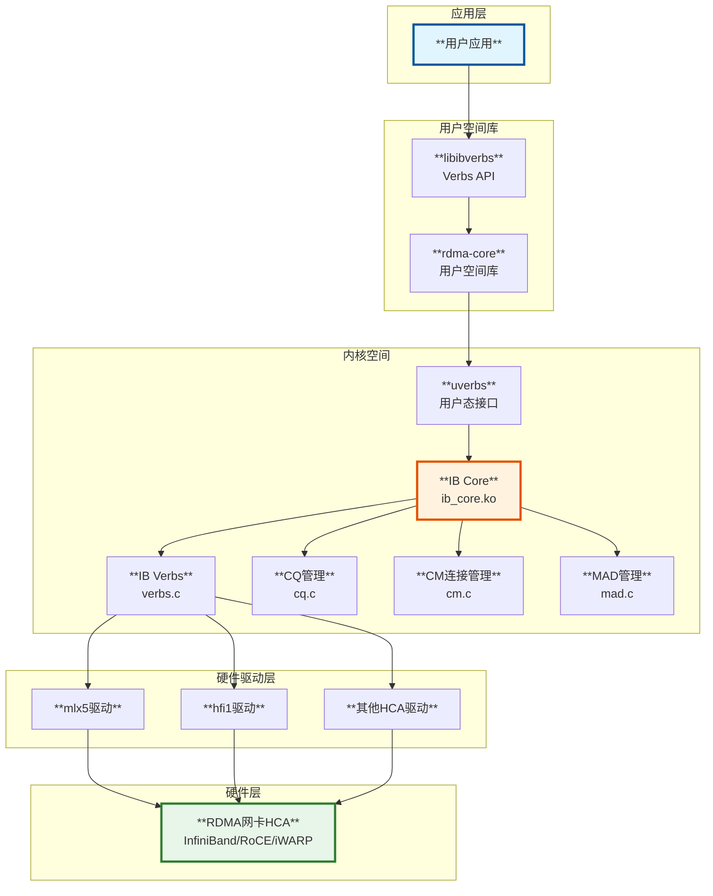

### 2.2 核心模块组成

基于源码 `drivers/infiniband/core/Makefile`:

```c
// 核心模块组成
ib_core-y := packer.o ud_header.o verbs.o cq.o rw.o sysfs.o \
             device.o cache.o netlink.o \
             roce_gid_mgmt.o mr_pool.o addr.o sa_query.o \
             multicast.o mad.o smi.o agent.o mad_rmpp.o \
             nldev.o restrack.o counters.o ib_core_uverbs.o \
             trace.o lag.o
```

| **模块** | **文件** | **功能** |
|---------|---------|---------|
| **verbs.c** | 核心Verbs实现 | 提供IB Verbs API实现 |
| **cq.c** | 完成队列管理 | CQ创建、轮询、事件处理 |
| **device.c** | 设备管理 | HCA设备注册和管理 |
| **cm.c** | 连接管理 | QP连接建立和断开 |
| **mad.c** | 管理数据报 | 管理协议消息处理 |
| **uverbs_*.c** | 用户空间接口 | 用户态Verbs接口 |
| **rw.c** | 读写操作 | RDMA READ/WRITE实现 |

## 3. RDMA 核心队列机制

### 3.1 队列类型架构

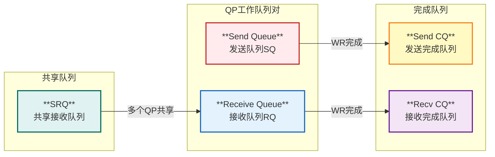

### 3.2 Queue Pair (QP) 详解

QP是RDMA通信的核心数据结构，每个QP包含一个发送队列（SQ）和一个接收队列（RQ）。

#### 3.2.1 QP类型

| **类型** | **说明** | **使用场景** |
|---------|---------|-------------|
| **RC (Reliable Connection)** | 可靠连接 | 需要可靠传输的应用 |
| **UC (Unreliable Connection)** | 不可靠连接 | 对延迟敏感场景 |
| **UD (Unreliable Datagram)** | 不可靠数据报 | 多播、广播场景 |
| **XRC (Extended RC)** | 扩展可靠连接 | 节省QP资源 |

#### 3.2.2 QP状态机

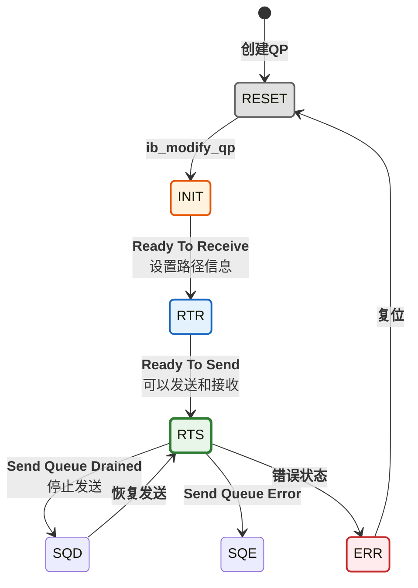

### 3.3 Completion Queue (CQ) 机制

源码分析 `drivers/infiniband/core/cq.c`:

```c
/**
 * __ib_alloc_cq - 分配完成队列
 * @dev: 设备
 * @private: 私有数据
 * @nr_cqe: CQ条目数量
 * @comp_vector: 完成向量
 * @poll_ctx: 轮询上下文
 */
struct ib_cq *__ib_alloc_cq(struct ib_device *dev, void *private, int nr_cqe,
                            int comp_vector, enum ib_poll_context poll_ctx,
                            const char *caller)
{
    struct ib_cq *cq;
    
    // 分配CQ结构
    cq = rdma_zalloc_drv_obj(dev, ib_cq);
    
    // 设置轮询上下文
    switch (cq->poll_ctx) {
    case IB_POLL_DIRECT:       // 直接轮询
        cq->comp_handler = ib_cq_completion_direct;
        break;
    case IB_POLL_SOFTIRQ:      // 软中断轮询
        cq->comp_handler = ib_cq_completion_softirq;
        irq_poll_init(&cq->iop, IB_POLL_BUDGET_IRQ, ib_poll_handler);
        break;
    case IB_POLL_WORKQUEUE:    // 工作队列轮询
        cq->comp_handler = ib_cq_completion_workqueue;
        INIT_WORK(&cq->work, ib_cq_poll_work);
        break;
    }
    
    return cq;
}
```

#### CQ轮询机制

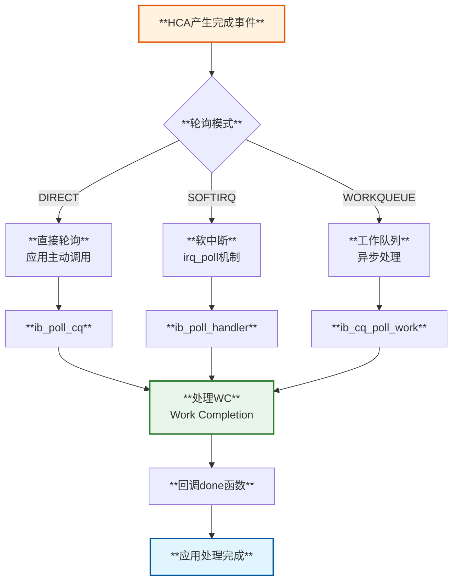

## 4. RDMA 数据传输流程

### 4.1 RDMA SEND/RECV 操作时序图

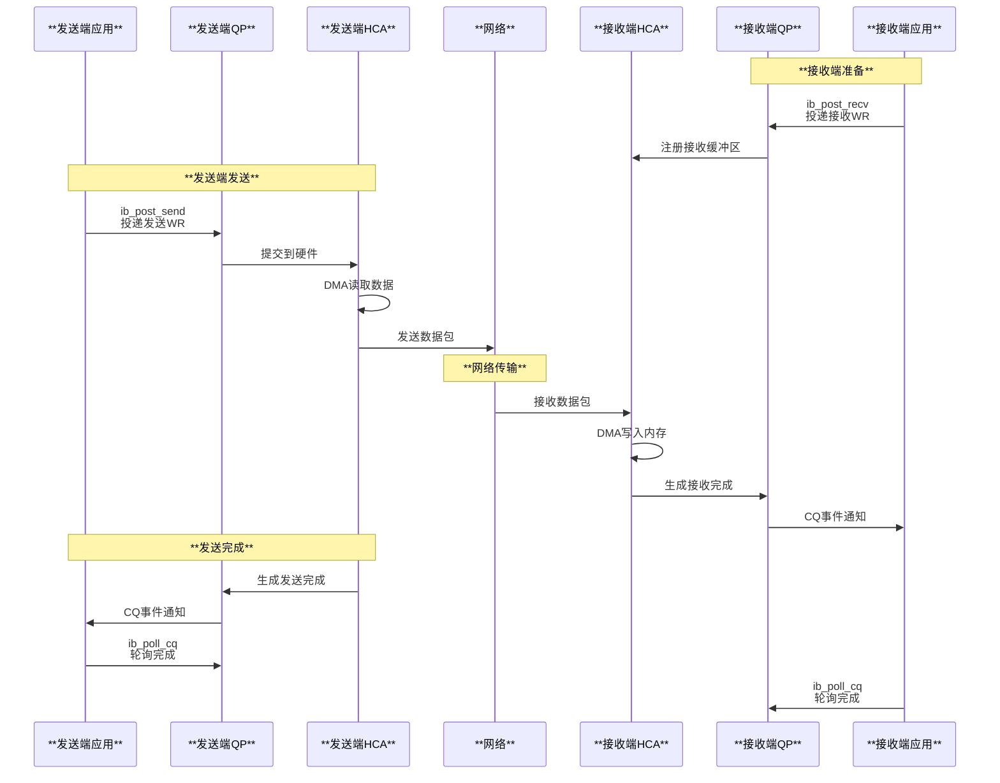

### 4.2 RDMA READ 操作流程

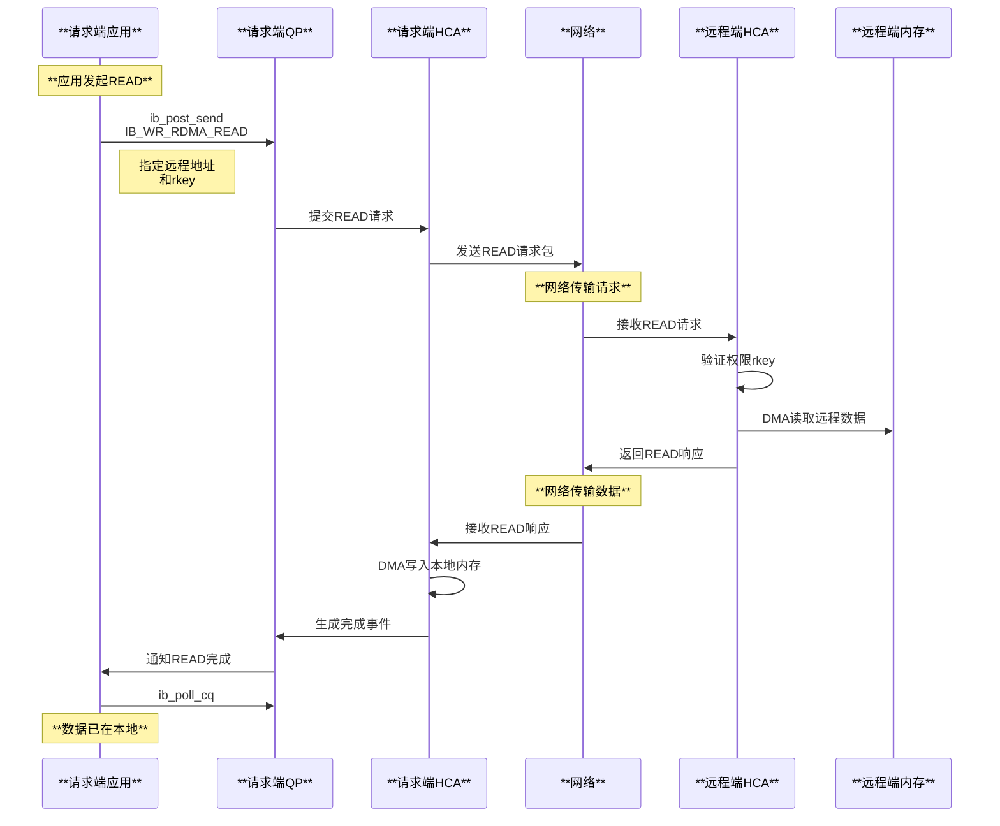

### 4.3 Work Request (WR) 结构

源码 `include/rdma/ib_verbs.h`:

```c
struct ib_send_wr {
    struct ib_send_wr      *next;        // 链表指针
    struct ib_cqe          *wr_cqe;      // 完成回调
    struct ib_sge          *sg_list;     // 散列表
    int                     num_sge;     // SGE数量
    enum ib_wr_opcode       opcode;      // 操作类型
    int                     send_flags;  // 发送标志
    
    union {
        __be32              imm_data;    // 立即数
        u32                 invalidate_rkey;
    } ex;
    
    union {
        struct {
            u64             remote_addr;  // 远程地址
            u32             rkey;         // 远程密钥
        } rdma;                          // RDMA操作参数
        struct {
            u64             remote_addr;
            u64             compare_add;
            u64             swap;
            u32             rkey;
        } atomic;                        // 原子操作参数
        // ... 其他操作类型
    } wr;
};
```

### 4.4 数据包流转图

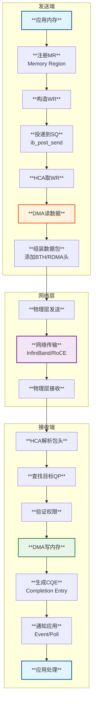

## 5. RDMA 连接管理 (CM)

### 5.1 连接建立流程

源码分析 `drivers/infiniband/core/cm.c`:

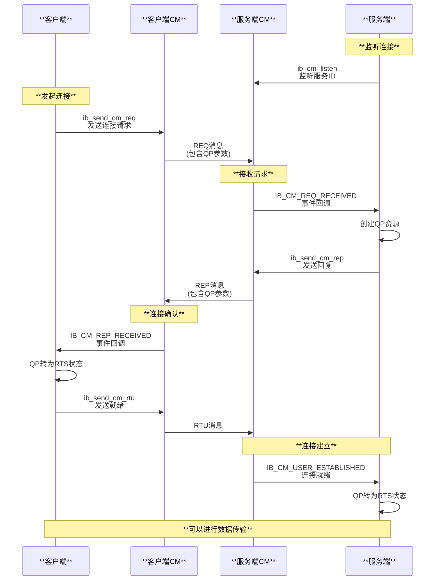

### 5.2 CM消息处理

```c
// CM工作处理函数 - drivers/infiniband/core/cm.c
static void cm_work_handler(struct work_struct *_work)
{
    struct cm_work *work = container_of(_work, struct cm_work, work.work);
    
    switch (work->cm_event.event) {
    case IB_CM_REQ_RECEIVED:      // 连接请求
        ret = cm_req_handler(work);
        break;
    case IB_CM_REP_RECEIVED:      // 连接回复
        ret = cm_rep_handler(work);
        break;
    case IB_CM_RTU_RECEIVED:      // 就绪通知
        ret = cm_rtu_handler(work);
        break;
    case IB_CM_DREQ_RECEIVED:     // 断连请求
        ret = cm_dreq_handler(work);
        break;
    case IB_CM_DREP_RECEIVED:     // 断连回复
        ret = cm_drep_handler(work);
        break;
    // ... 其他事件处理
    }
}
```

## 6. RDMA 内存注册机制

### 6.1 Memory Region (MR) 概念

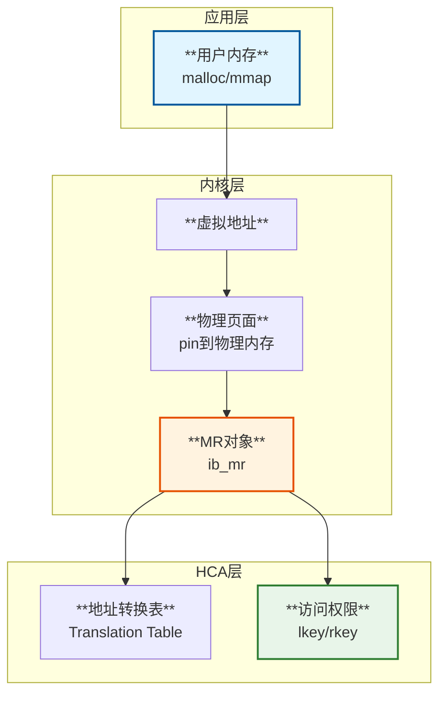

### 6.2 MR注册流程

```c
// 注册内存区域 - drivers/infiniband/core/verbs.c
struct ib_mr *ib_reg_user_mr(struct ib_pd *pd, u64 start, u64 length,
                             u64 virt_addr, int access_flags)
{
    struct ib_mr *mr;
    
    // 1. 分配MR对象
    mr = pd->device->ops.reg_user_mr(pd, start, length, 
                                      virt_addr, access_flags, NULL);
    
    // 2. Pin住物理页面（防止被swap出去）
    // 3. 构建地址转换表
    // 4. 生成lkey和rkey
    
    return mr;
}
```

## 7. rdma-core 用户空间库

### 7.1 rdma-core 架构

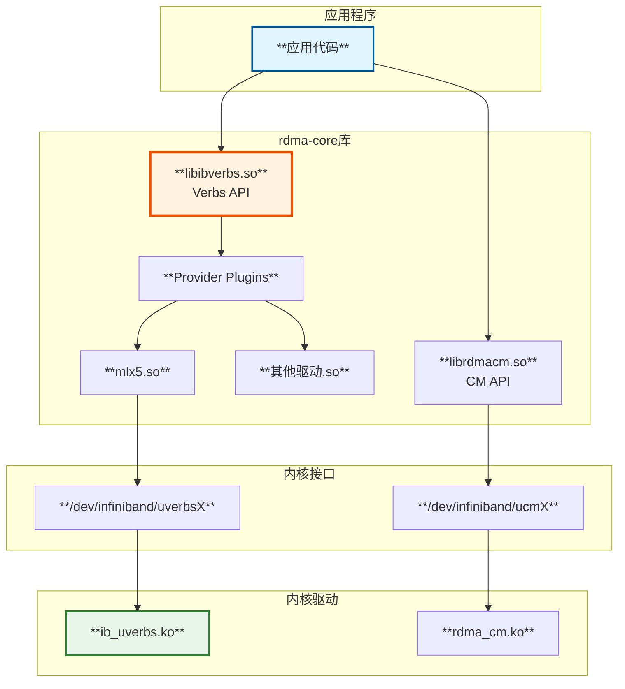

### 7.2 rdma-core 主要命令

| **命令** | **功能** | **使用示例** |
|---------|---------|-------------|
| **rdma link** | 查看RDMA设备 | `rdma link show` |
| **ibv_devinfo** | 显示设备信息 | `ibv_devinfo -v` |
| **ibv_devices** | 列出所有设备 | `ibv_devices` |
| **perftest工具** | 性能测试 | `ib_send_bw` |
| **rdma-ndd** | 更新node描述 | `rdma-ndd` |
| **ibstat** | 查看IB状态 | `ibstat` |

### 7.3 使用 rdma-core 编程示例

#### 7.3.1 基本流程

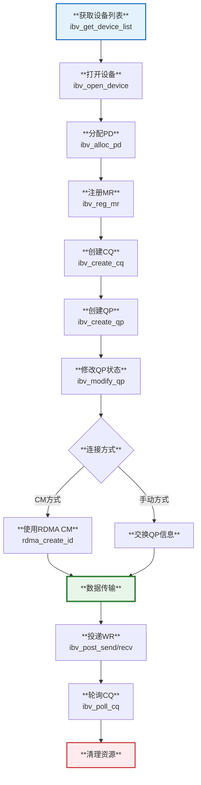

#### 7.3.2 代码示例

```c
// RDMA 发送端示例代码
int main() {
    // 1. 获取设备
    struct ibv_device **dev_list = ibv_get_device_list(NULL);
    struct ibv_context *ctx = ibv_open_device(dev_list[0]);
    
    // 2. 分配保护域
    struct ibv_pd *pd = ibv_alloc_pd(ctx);
    
    // 3. 注册内存
    void *buf = malloc(BUF_SIZE);
    struct ibv_mr *mr = ibv_reg_mr(pd, buf, BUF_SIZE, 
                                    IBV_ACCESS_LOCAL_WRITE | 
                                    IBV_ACCESS_REMOTE_READ);
    
    // 4. 创建完成队列
    struct ibv_cq *cq = ibv_create_cq(ctx, 10, NULL, NULL, 0);
    
    // 5. 创建队列对
    struct ibv_qp_init_attr qp_attr = {
        .send_cq = cq,
        .recv_cq = cq,
        .qp_type = IBV_QPT_RC,
        .cap = {
            .max_send_wr = 10,
            .max_recv_wr = 10,
            .max_send_sge = 1,
            .max_recv_sge = 1
        }
    };
    struct ibv_qp *qp = ibv_create_qp(pd, &qp_attr);
    
    // 6. 修改QP到INIT状态
    struct ibv_qp_attr attr = {
        .qp_state = IBV_QPS_INIT,
        .pkey_index = 0,
        .port_num = 1,
        .qp_access_flags = IBV_ACCESS_REMOTE_READ | IBV_ACCESS_REMOTE_WRITE
    };
    ibv_modify_qp(qp, &attr, IBV_QP_STATE | IBV_QP_PKEY_INDEX | 
                              IBV_QP_PORT | IBV_QP_ACCESS_FLAGS);
    
    // 7. 投递发送请求
    struct ibv_sge sge = {
        .addr = (uint64_t)buf,
        .length = BUF_SIZE,
        .lkey = mr->lkey
    };
    struct ibv_send_wr wr = {
        .wr_id = 0,
        .sg_list = &sge,
        .num_sge = 1,
        .opcode = IBV_WR_SEND,
        .send_flags = IBV_SEND_SIGNALED
    };
    ibv_post_send(qp, &wr, NULL);
    
    // 8. 轮询完成
    struct ibv_wc wc;
    while (ibv_poll_cq(cq, 1, &wc) == 0);
    
    // 9. 清理资源
    ibv_destroy_qp(qp);
    ibv_destroy_cq(cq);
    ibv_dereg_mr(mr);
    ibv_dealloc_pd(pd);
    ibv_close_device(ctx);
    free(buf);
}
```

## 8. RDMA 性能优化

### 8.1 性能关键点

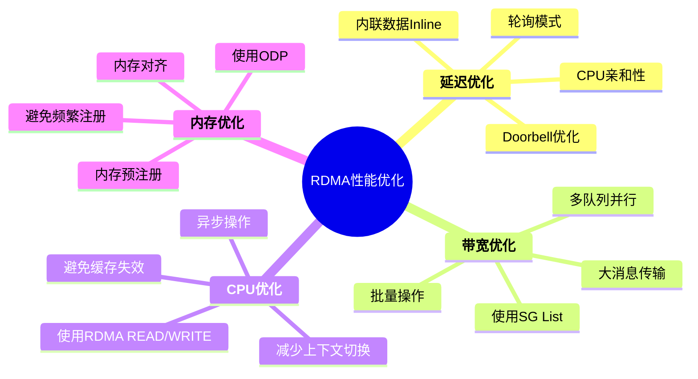

### 8.2 性能测试工具

```bash
# 带宽测试 - SEND/RECV
ib_send_bw -d mlx5_0 -i 1 -s 4096

# 延迟测试 - SEND/RECV
ib_send_lat -d mlx5_0 -i 1 -s 2

# RDMA WRITE带宽
ib_write_bw -d mlx5_0 -i 1 -s 65536

# RDMA READ延迟
ib_read_lat -d mlx5_0 -i 1 -s 2

# 多连接测试
ib_send_bw -d mlx5_0 -q 8

# 查看性能计数器
rdma statistic show
```

## 9. RDMA 使用场景

### 9.1 典型应用场景

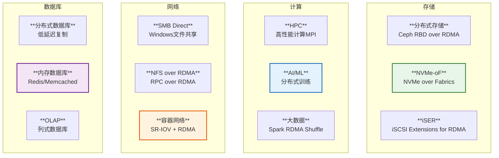

### 9.2 性能对比

| **指标** | **TCP/IP** | **RDMA** | **提升** |
|---------|------------|----------|---------|
| **延迟** | 10-100 μs | 1-5 μs | **10-20x** |
| **带宽** | 10-40 Gbps | 100-200 Gbps | **5-10x** |
| **CPU使用率** | 30-50% | 5-10% | **5x降低** |
| **消息速率** | 1M msg/s | 10M msg/s | **10x** |

## 10. RDMA 协议栈对比

### 10.1 三种RDMA技术

```mermaid
graph TB
    subgraph InfiniBand
        A1[**应用层**]
        A2[**Verbs API**]
        A3[**IB传输层**]
        A4[**IB网络层**]
        A5[**IB链路层**]
        A6[**IB物理层**]
    end
    
    subgraph RoCE
        B1[**应用层**]
        B2[**Verbs API**]
        B3[**IB传输层**]
        B4[**UDP/IP网络层**]
        B5[**以太网链路层**]
        B6[**以太网物理层**]
    end
    
    subgraph iWARP
        C1[**应用层**]
        C2[**Verbs API**]
        C3[**RDMAP/DDP**]
        C4[**MPA**]
        C5[**TCP/IP**]
        C6[**以太网**]
    end
    
    A1 --> A2 --> A3 --> A4 --> A5 --> A6
    B1 --> B2 --> B3 --> B4 --> B5 --> B6
    C1 --> C2 --> C3 --> C4 --> C5 --> C6
    
    style A3 fill:#e8f5e9,stroke:#2e7d32,stroke-width:2px
    style B3 fill:#e3f2fd,stroke:#1565c0,stroke-width:2px
    style C3 fill:#fff3e0,stroke:#e65100,stroke-width:2px
```

### 10.2 技术对比

| **特性** | **InfiniBand** | **RoCE v2** | **iWARP** |
|---------|---------------|-------------|-----------|
| **网络** | IB专用网络 | 以太网 | 以太网 |
| **延迟** | 最低 (0.5-1 μs) | 低 (1-2 μs) | 中 (3-5 μs) |
| **协议** | IB原生 | IB over UDP/IP | DDP over TCP |
| **无损** | 是 | 需要PFC | 需要PFC |
| **路由** | IB交换机 | IP路由 | IP路由 |
| **成本** | 高 | 中 | 中 |
| **互操作性** | 中 | 好 | 最好 |

## 11. 源码关键路径总结

### 11.1 发送路径

```c
// 用户态
ibv_post_send()           // libibverbs
  -> write(uverbs_fd)     // 系统调用

// 内核态
ib_uverbs_post_send()     // drivers/infiniband/core/uverbs_cmd.c
  -> qp->device->ops.post_send()   // 调用驱动
    -> mlx5_ib_post_send()         // drivers/infiniband/hw/mlx5/qp.c
      -> mlx5_post_send_db()       // 写doorbell
        -> HCA硬件处理
```

### 11.2 接收路径

```c
// HCA产生中断/事件
mlx5_comp_irq()              // 中断处理
  -> ib_cq_completion()      // 触发CQ完成
    -> cq->comp_handler()    // 完成处理函数
      -> ib_poll_handler()   // 轮询处理
        -> __ib_process_cq() // drivers/infiniband/core/cq.c
          -> wc->wr_cqe->done()  // 回调应用

// 用户态轮询
ibv_poll_cq()              // libibverbs
  -> read(uverbs_fd)       // 系统调用
    -> ib_uverbs_poll_cq() // 内核处理
```

## 12. 常见问题和调试

### 12.1 常见错误码

| **错误** | **说明** | **解决方法** |
|---------|---------|-------------|
| **IBV_WC_LOC_PROT_ERR** | 本地保护错误 | 检查MR权限 |
| **IBV_WC_REM_ACCESS_ERR** | 远程访问错误 | 检查rkey和权限 |
| **IBV_WC_RETRY_EXC_ERR** | 重试超限 | 检查网络和QP参数 |
| **IBV_WC_RNR_RETRY_EXC_ERR** | RNR重试超限 | 增加接收WR数量 |

### 12.2 调试工具

```bash
# 查看设备状态
ibstat

# 查看连接状态  
ibv_rc_pingpong -g 0

# 抓包分析
tcpdump -i ib0 -w rdma.pcap

# 查看错误计数器
rdma statistic show

# 内核日志
dmesg | grep -i rdma
```

---

**文档基于Linux内核源码分析**
- 内核版本：基于最新主线
- 主要源码路径：
  - `drivers/infiniband/core/` - RDMA核心实现
  - `drivers/infiniband/hw/` - 硬件驱动
  - `include/rdma/` - RDMA头文件
  - `include/uapi/rdma/` - 用户态接口

**参考资料**
- Linux RDMA子系统源码
- InfiniBand Architecture Specification
- RoCE v2 Specification
- rdma-core用户态库

