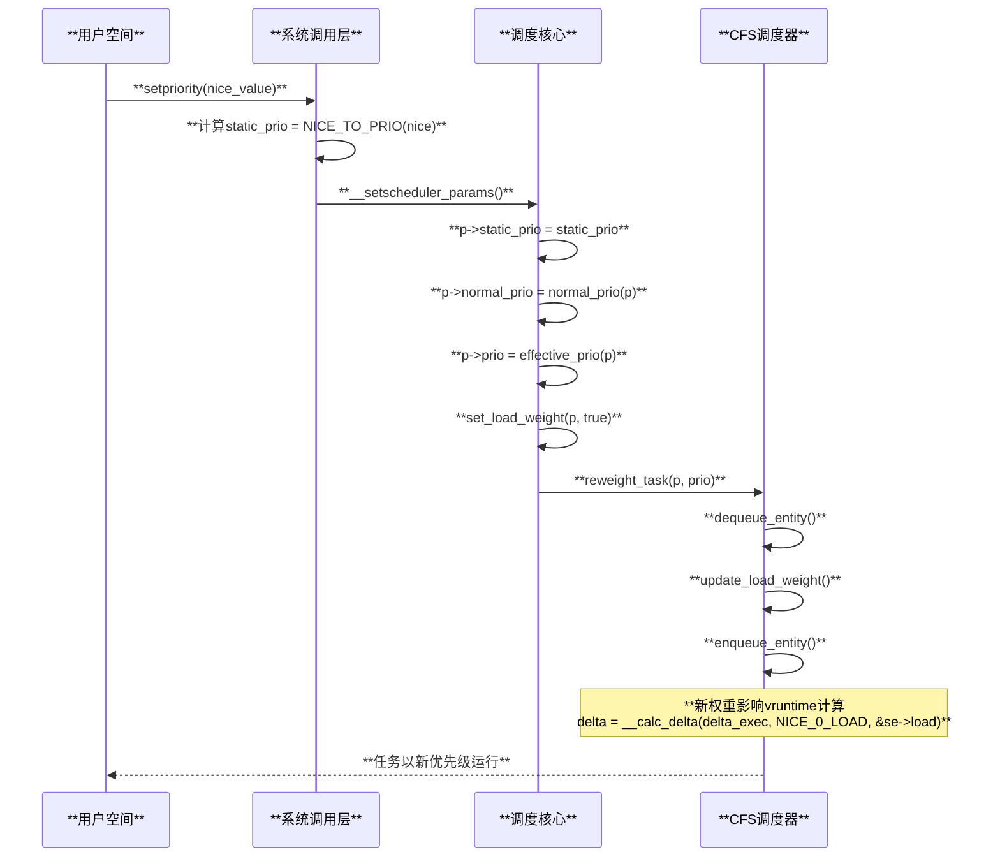
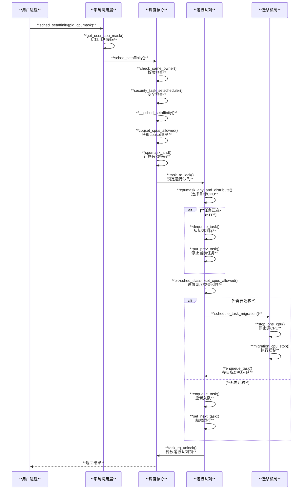
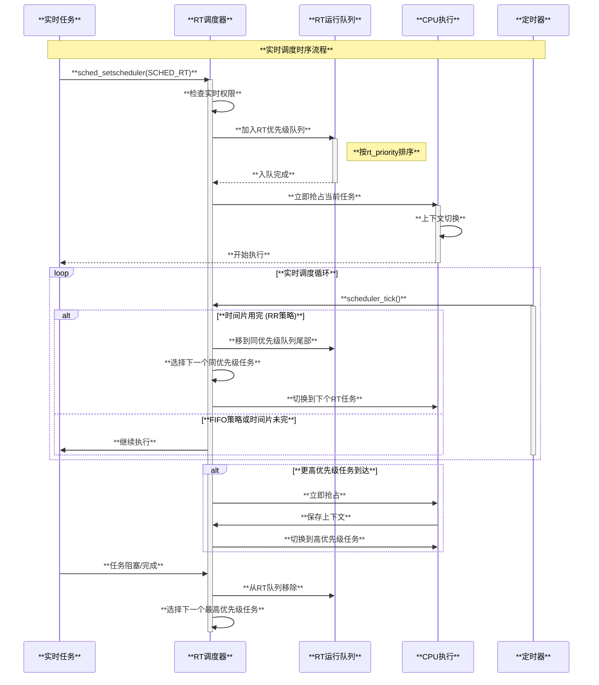
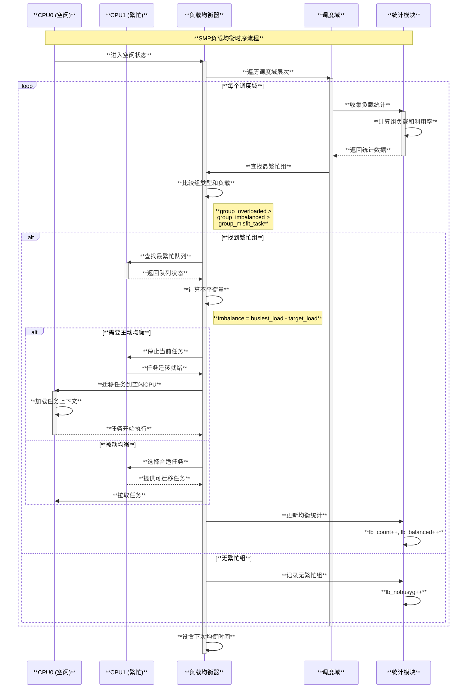
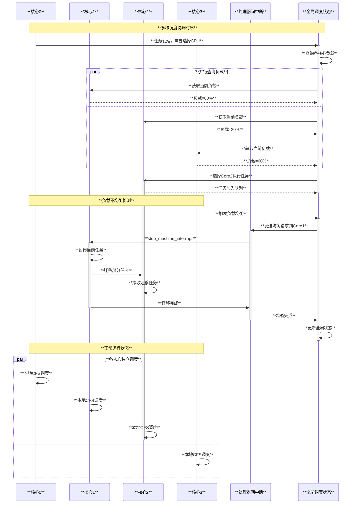

# Linux CPU调度器原理与实现分析

## 目录

1. [概述](#概述)
2. [调度器架构](#调度器架构)
3. [调度类体系](#调度类体系)
4. [CFS调度算法详解](#cfs调度算法详解)
5. [核心数据结构](#核心数据结构)
6. [SMP负载均衡](#smp负载均衡)
7. [实时调度](#实时调度)
8. [调度域与拓扑](#调度域与拓扑)
9. [性能优化机制](#性能优化机制)
10. [扩展调度框架](#扩展调度框架)
11. [优点与局限性](#优点与局限性)
12. [总结](#总结)

## 概述

Linux CPU调度器是内核的核心组件之一，负责在多个可运行任务之间分配CPU时间，确保系统的公平性、响应性和整体性能。现代Linux调度器采用分层的调度类架构，支持多种调度策略，能够满足从桌面交互到高性能计算等各种场景的需求。

### 核心设计目标

1. **公平性**：确保每个任务获得公平的CPU时间份额
2. **响应性**：保证交互式任务的低延迟响应
3. **吞吐量**：最大化系统整体的处理能力
4. **实时性**：支持硬实时和软实时任务的确定性调度
5. **可扩展性**：在大规模SMP系统上保持良好性能

### 发展历程

- **Linux 2.4及之前**：简单的时间片轮转调度器
- **Linux 2.6.0-2.6.22**：O(1)调度器，引入优先级数组
- **Linux 2.6.23+**：CFS(完全公平调度器)成为默认调度器
- **Linux 3.14+**：引入Deadline调度器支持硬实时任务
- **Linux 6.6+**：开始过渡到EEVDF(最早合格虚拟截止时间优先)算法
- **Linux 6.12+**：引入sched_ext可扩展调度框架

## 调度器架构

Linux调度器采用分层的调度类(Scheduling Class)架构，每个调度类实现特定的调度策略。

### 调度器层次结构

```c
// 调度器核心架构图
/*
 * 调度器层次结构:
 * 
 * ┌─────────────────────────────────────────┐
 * │           调度器核心(Core)                │
 * │         __schedule()                   │
 * └─────────┬───────────────────────────────┘
 *           │
 * ┌─────────▼───────────────────────────────┐
 * │          调度类选择                      │
 * │      pick_next_task()                  │
 * └─┬───┬───┬───┬───┬───┬───────────────────┘
 *   │   │   │   │   │   │
 *   ▼   ▼   ▼   ▼   ▼   ▼
 *  stop rt  dl fair idle scx
 *  调度 实时 截止 公平 空闲 扩展
 *  类   类   期类  类  类   类
 */

// 调度类优先级（按优先级从高到低排列）
extern const struct sched_class stop_sched_class;      // 最高优先级，停止任务
extern const struct sched_class dl_sched_class;        // Deadline调度类
extern const struct sched_class rt_sched_class;        // 实时调度类
extern const struct sched_class fair_sched_class;      // 公平调度类(CFS)
extern const struct sched_class idle_sched_class;      // 空闲调度类
```

### 任务选择流程

```c
// 核心任务选择逻辑 - kernel/sched/core.c
static inline struct task_struct *
__pick_next_task(struct rq *rq, struct task_struct *prev, struct rq_flags *rf)
{
    const struct sched_class *class;
    struct task_struct *p;

    // CFS快速路径优化：如果所有任务都在fair类中
    if (likely(!sched_class_above(prev->sched_class, &fair_sched_class) &&
               rq->nr_running == rq->cfs.h_nr_running)) {
        p = pick_next_task_fair(rq, prev, rf);
        if (unlikely(p == RETRY_TASK))
            goto restart;

        if (!p) {
            p = pick_task_idle(rq);
            put_prev_set_next_task(rq, prev, p);
        }
        return p;
    }

restart:
    prev_balance(rq, prev, rf);

    // 按优先级遍历所有调度类
    for_each_active_class(class) {
        if (class->pick_next_task) {
            p = class->pick_next_task(rq, prev);
            if (p)
                return p;
        } else {
            p = class->pick_task(rq);
            if (p) {
                put_prev_set_next_task(rq, prev, p);
                return p;
            }
        }
    }

    BUG(); /* idle类应该总是有可运行任务 */
}
```

## 调度类体系

### 调度类抽象接口

```c
// 调度类结构体 - kernel/sched/sched.h
struct sched_class {
    // 任务入队和出队
    void (*enqueue_task) (struct rq *rq, struct task_struct *p, int flags);
    bool (*dequeue_task) (struct rq *rq, struct task_struct *p, int flags);
    
    // 主动让出CPU
    void (*yield_task)   (struct rq *rq);
    bool (*yield_to_task)(struct rq *rq, struct task_struct *p);

    // 抢占检查
    void (*wakeup_preempt)(struct rq *rq, struct task_struct *p, int flags);

    // 负载均衡
    int (*balance)(struct rq *rq, struct task_struct *prev, struct rq_flags *rf);
    
    // 任务选择
    struct task_struct *(*pick_task)(struct rq *rq);
    struct task_struct *(*pick_next_task)(struct rq *rq, struct task_struct *prev);

    // 任务放置和设置
    void (*put_prev_task)(struct rq *rq, struct task_struct *p, struct task_struct *next);
    void (*set_next_task)(struct rq *rq, struct task_struct *p, bool first);

#ifdef CONFIG_SMP
    // SMP相关操作
    int  (*select_task_rq)(struct task_struct *p, int task_cpu, int flags);
    void (*migrate_task_rq)(struct task_struct *p, int new_cpu);
    void (*task_woken)(struct rq *this_rq, struct task_struct *task);
    void (*set_cpus_allowed)(struct task_struct *p, struct affinity_context *ctx);
    void (*rq_online)(struct rq *rq);
    void (*rq_offline)(struct rq *rq);
    struct rq *(*find_lock_rq)(struct task_struct *p, struct rq *rq);
#endif

    // 时钟节拍处理
    void (*task_tick)(struct rq *rq, struct task_struct *p, int queued);
    void (*task_fork)(struct task_struct *p);
    void (*task_dead)(struct task_struct *p);

    // 调度类切换
    void (*switching_to) (struct rq *this_rq, struct task_struct *task);
    void (*switched_from)(struct rq *this_rq, struct task_struct *task);
};
```

### 调度策略映射

```c
// 调度策略定义 - include/uapi/linux/sched.h
#define SCHED_NORMAL    0   // 普通任务(CFS)
#define SCHED_FIFO      1   // 实时FIFO
#define SCHED_RR        2   // 实时轮转
#define SCHED_BATCH     3   // 批处理任务(CFS)
#define SCHED_IDLE      5   // 空闲任务
#define SCHED_DEADLINE  6   // 截止期任务
#define SCHED_EXT       7   // 扩展调度类

// 策略到调度类的映射
static const struct sched_class *sched_class_map[NR_SCHED_CLASSES] = {
    [SCHED_NORMAL]   = &fair_sched_class,
    [SCHED_FIFO]     = &rt_sched_class,
    [SCHED_RR]       = &rt_sched_class,
    [SCHED_BATCH]    = &fair_sched_class,
    [SCHED_IDLE]     = &idle_sched_class,
    [SCHED_DEADLINE] = &dl_sched_class,
    [SCHED_EXT]      = &ext_sched_class,
};
```

## CFS调度算法详解

CFS(Completely Fair Scheduler)是Linux的默认调度器，实现了一个"理想多任务CPU"的概念。

### 核心原理

CFS基于虚拟运行时间(Virtual Runtime)的概念，将CPU时间公平地分配给所有任务：

```c
// 虚拟运行时间计算公式
virtual_runtime = actual_runtime * (NICE_0_LOAD / task_weight)

// 其中：
// - actual_runtime：实际运行时间
// - NICE_0_LOAD：nice值为0的标准权重(1024)
// - task_weight：任务权重(由nice值决定)
```

### CFS数据结构

```c
// CFS运行队列 - kernel/sched/sched.h
struct cfs_rq {
    struct load_weight  load;              // 总负载权重
    unsigned int        nr_running;        // 运行任务数
    unsigned int        h_nr_running;      // 层级运行任务数
    unsigned int        idle_nr_running;   // IDLE任务数
    
    s64                 avg_vruntime;      // 平均虚拟运行时间
    u64                 avg_load;          // 平均负载
    u64                 min_vruntime;      // 最小虚拟运行时间
    
    struct rb_root_cached tasks_timeline;  // 红黑树时间线
    
    struct sched_entity *curr;             // 当前运行的调度实体
    struct sched_entity *next;             // 下一个调度实体

#ifdef CONFIG_SMP
    struct sched_avg    avg;               // SMP负载追踪
#endif

#ifdef CONFIG_CFS_BANDWIDTH
    s64                 runtime_remaining; // 剩余运行时间
    u64                 throttled_clock;   // 限流时钟
    int                 throttled;         // 限流标志
    struct list_head    throttled_list;    // 限流列表
#endif
};

// 调度实体 - include/linux/sched.h
struct sched_entity {
    struct load_weight  load;              // 负载权重
    struct rb_node      run_node;          // 红黑树节点
    u64                 deadline;          // 截止时间
    u64                 min_vruntime;      // 最小虚拟运行时间
    u64                 min_slice;         // 最小时间片

    struct list_head    group_node;        // 组节点
    unsigned char       on_rq;             // 是否在运行队列
    unsigned char       sched_delayed;     // 调度延迟标志

    u64                 exec_start;        // 执行开始时间
    u64                 sum_exec_runtime;  // 累计执行时间
    u64                 prev_sum_exec_runtime; // 上一次累计时间
    u64                 vruntime;          // 虚拟运行时间
    s64                 vlag;              // 虚拟滞后
    u64                 slice;             // 时间片

    u64                 nr_migrations;     // 迁移次数

#ifdef CONFIG_FAIR_GROUP_SCHED
    int                 depth;             // 层次深度
    struct sched_entity *parent;          // 父调度实体
    struct cfs_rq       *cfs_rq;           // 所属CFS运行队列
    struct cfs_rq       *my_q;             // 拥有的CFS队列
    unsigned long       runnable_weight;   // 可运行权重
#endif

#ifdef CONFIG_SMP
    struct sched_avg    avg;               // 平均负载追踪
#endif
};
```

### CFS调度流程

```c
// CFS任务选择 - kernel/sched/fair.c
static struct task_struct *
pick_next_task_fair(struct rq *rq, struct task_struct *prev, struct rq_flags *rf)
{
    struct cfs_rq *cfs_rq = &rq->cfs;
    struct sched_entity *se;
    struct task_struct *p;

    // 如果没有可运行任务
    if (!cfs_rq->nr_running)
        goto idle;

    // 处理先前任务
    put_prev_task_balance(rq, prev, rf);

    do {
        se = pick_next_entity(cfs_rq);
        cfs_rq = group_cfs_rq(se);
    } while (cfs_rq);

    p = task_of(se);

done: __maybe_unused;
    if (hrtick_enabled_fair(rq))
        hrtick_start_fair(rq, p);

    util_est_update(&rq->cfs, p, true);

    return p;

idle:
    if (!rf)
        return NULL;

    new_tasks = sched_balance_newidle(rq, rf);
    if (new_tasks)
        return RETRY_TASK;

    return NULL;
}

// 选择下一个调度实体
static struct sched_entity *pick_next_entity(struct cfs_rq *cfs_rq)
{
    struct sched_entity *se = __pick_first_entity(cfs_rq);
    struct sched_entity *left = __pick_first_entity(cfs_rq);

    // 从红黑树最左侧选择vruntime最小的任务
    if (left) {
        se = left;
        // 检查是否需要抢占
        if (sched_feat(NEXT_BUDDY) && cfs_rq->next && wakeup_preempt_entity(cfs_rq->next, left) < 1)
            se = cfs_rq->next;
    }

    // 清除下一个提示
    cfs_rq->next = NULL;

    return se;
}
```

### 虚拟运行时间更新

```c
// 更新当前任务的虚拟运行时间
static void update_curr(struct cfs_rq *cfs_rq)
{
    struct sched_entity *curr = cfs_rq->curr;
    u64 now = rq_clock_task(rq_of(cfs_rq));
    u64 delta_exec;

    if (unlikely(!curr))
        return;

    // 计算执行时间增量
    delta_exec = now - curr->exec_start;
    if (unlikely((s64)delta_exec <= 0))
        return;

    curr->exec_start = now;

    if (schedstat_enabled()) {
        struct sched_statistics *stats = __schedstat_from_se(curr);
        __schedstat_set(stats->exec_max,
                       max(delta_exec, stats->exec_max));
    }

    curr->sum_exec_runtime += delta_exec;
    schedstat_add(cfs_rq->exec_clock, delta_exec);

    // 更新虚拟运行时间
    curr->vruntime += calc_delta_fair(delta_exec, curr);
    update_min_vruntime(cfs_rq);

    if (entity_is_task(curr))
        update_curr_task(task_of(curr), delta_exec);

    account_cfs_rq_runtime(cfs_rq, delta_exec);
}

// 计算公平的时间增量
static u64 calc_delta_fair(u64 delta, struct sched_entity *se)
{
    if (unlikely(se->load.weight != NICE_0_LOAD))
        delta = __calc_delta(delta, NICE_0_LOAD, &se->load);

    return delta;
}
```

### 红黑树维护

```c
// 将调度实体加入红黑树
static void
enqueue_entity(struct cfs_rq *cfs_rq, struct sched_entity *se, int flags)
{
    bool renorm = !(flags & ENQUEUE_WAKEUP) || (flags & ENQUEUE_MIGRATED);
    bool curr = cfs_rq->curr == se;

    // 如果不是当前运行任务且需要重新规范化
    if (renorm && !curr)
        se->vruntime += cfs_rq->min_vruntime;

    update_curr(cfs_rq);

    // 更新统计信息
    if (flags & ENQUEUE_WAKEUP)
        enqueue_sleeper(cfs_rq, se);

    account_entity_enqueue(cfs_rq, se);

    // 如果不是当前任务，加入红黑树
    if (!curr)
        __enqueue_entity(cfs_rq, se);
    
    se->on_rq = 1;

    if (cfs_rq->nr_running == 1) {
        check_enqueue_throttle(cfs_rq);
        if (!throttled_hierarchy(cfs_rq))
            list_add_leaf_cfs_rq(cfs_rq);
    }
}

// 红黑树插入操作
static void __enqueue_entity(struct cfs_rq *cfs_rq, struct sched_entity *se)
{
    struct rb_node **link = &cfs_rq->tasks_timeline.rb_root.rb_node;
    struct rb_node *parent = NULL;
    struct sched_entity *entry;
    bool leftmost = true;

    // 找到插入位置
    while (*link) {
        parent = *link;
        entry = rb_entry(parent, struct sched_entity, run_node);

        if (entity_before(se, entry)) {
            link = &parent->rb_left;
        } else {
            link = &parent->rb_right;
            leftmost = false;
        }
    }

    // 插入节点
    rb_link_node(&se->run_node, parent, link);
    rb_insert_color_cached(&se->run_node, &cfs_rq->tasks_timeline, leftmost);
}
```

### CFS中VFS（虚拟运行时间）计算机制深度解析

#### VFS计算的核心原理

VFS（Virtual Runtime，虚拟运行时间）是CFS实现公平调度的核心机制。其设计目标是将不同权重的任务映射到同一个虚拟时间轴上，确保每个任务获得公平的CPU时间份额。

```c
// VFS计算的核心函数 - kernel/sched/fair.c
static void update_curr(struct cfs_rq *cfs_rq)
{
    struct sched_entity *curr = cfs_rq->curr;
    struct rq *rq = rq_of(cfs_rq);
    s64 delta_exec;
    bool resched;

    if (unlikely(!curr))
        return;

    delta_exec = update_curr_se(rq, curr);
    if (unlikely(delta_exec <= 0))
        return;

    // 关键：虚拟运行时间更新公式
    curr->vruntime += calc_delta_fair(delta_exec, curr);
    resched = update_deadline(cfs_rq, curr);
    update_min_vruntime(cfs_rq);

    if (entity_is_task(curr)) {
        struct task_struct *p = task_of(curr);
        update_curr_task(p, delta_exec);
    }

    account_cfs_rq_runtime(cfs_rq, delta_exec);

    if (cfs_rq->nr_running == 1)
        return;

    if (resched || did_preempt_short(cfs_rq, curr)) {
        resched_curr(rq);
        clear_buddies(cfs_rq, curr);
    }
}

// 公平时间增量计算
static u64 calc_delta_fair(u64 delta, struct sched_entity *se)
{
    if (unlikely(se->load.weight != NICE_0_LOAD))
        delta = __calc_delta(delta, NICE_0_LOAD, &se->load);
    return delta;
}

// 通用时间增量计算函数
static u64 __calc_delta(u64 delta_exec, unsigned long weight, struct load_weight *lw)
{
    u64 fact = scale_load_down(weight);
    u32 fact_hi = (u32)(fact >> 32);
    int shift = WMULT_SHIFT;
    u64 tmp;

    if (unlikely(fact_hi)) {
        while (fact_hi) {
            fact_hi >>= 1;
            shift--;
        }
    }

    fact = (u64)(u32)fact * lw->inv_weight;

    while (fact >> 32) {
        fact >>= 1;
        shift--;
    }

    return mul_u64_u32_shr(delta_exec, fact, shift);
}
```

#### VFS初始值设计

```c
// CFS运行队列初始化 - kernel/sched/fair.c
void init_cfs_rq(struct cfs_rq *cfs_rq)
{
    cfs_rq->tasks_timeline = RB_ROOT_CACHED;
    // 关键：min_vruntime初始化为一个大的负值
    cfs_rq->min_vruntime = (u64)(-(1LL << 20));
#ifdef CONFIG_SMP
    raw_spin_lock_init(&cfs_rq->removed.lock);
#endif
}

// 新任务的vruntime初始化
static void place_entity(struct cfs_rq *cfs_rq, struct sched_entity *se, int flags)
{
    u64 vruntime = avg_vruntime(cfs_rq);
    s64 lag = 0;

    // 对于新任务，使用平均虚拟运行时间作为起点
    if (sched_feat(PLACE_LAG) && cfs_rq->nr_running) {
        struct sched_entity *curr = cfs_rq->curr;
        unsigned long load;

        lag = se->vlag;
        
        // 计算延迟补偿
        if (sched_feat(PLACE_DEADLINE_INITIAL) && 
            (flags & ENQUEUE_INITIAL))
            vruntime = avg_vruntime(cfs_rq);
    }

    // 确保新任务的vruntime不会太落后
    se->vruntime = max_vruntime(se->vruntime, vruntime - lag);
}
```

#### 动态VFS计算和平均值维护

```c
// 计算加权平均虚拟运行时间 - kernel/sched/fair.c
u64 avg_vruntime(struct cfs_rq *cfs_rq)
{
    struct sched_entity *curr = cfs_rq->curr;
    s64 avg = cfs_rq->avg_vruntime;
    long load = cfs_rq->avg_load;

    // 包含当前运行任务的贡献
    if (curr && curr->on_rq) {
        unsigned long weight = scale_load_down(curr->load.weight);
        avg += entity_key(cfs_rq, curr) * weight;
        load += weight;
    }

    if (load) {
        // 符号翻转有效的向下/向上取整
        if (avg < 0)
            avg -= (load - 1);
        avg = div_s64(avg, load);
    }

    return cfs_rq->min_vruntime + avg;
}

// 更新平均虚拟运行时间
static void avg_vruntime_add(struct cfs_rq *cfs_rq, struct sched_entity *se)
{
    unsigned long weight = scale_load_down(se->load.weight);
    s64 key = entity_key(cfs_rq, se);

    cfs_rq->avg_vruntime += key * weight;
    cfs_rq->avg_load += weight;
}

static void avg_vruntime_sub(struct cfs_rq *cfs_rq, struct sched_entity *se)
{
    unsigned long weight = scale_load_down(se->load.weight);
    s64 key = entity_key(cfs_rq, se);

    cfs_rq->avg_vruntime -= key * weight;
    cfs_rq->avg_load -= weight;
}

// 更新最小虚拟运行时间
static void update_min_vruntime(struct cfs_rq *cfs_rq)
{
    struct sched_entity *se = __pick_first_entity(cfs_rq);
    struct sched_entity *curr = cfs_rq->curr;
    u64 vruntime = cfs_rq->min_vruntime;

    if (curr) {
        if (curr->on_rq)
            vruntime = curr->vruntime;
        else
            curr = NULL;
    }

    if (se) {
        if (!curr)
            vruntime = se->vruntime;
        else
            vruntime = min_vruntime(vruntime, se->vruntime);
    }

    // min_vruntime单调递增
    cfs_rq->min_vruntime = __update_min_vruntime(cfs_rq, vruntime);
}
```

#### VFS计算的数学原理图解

```mermaid
graph **LR**
    A[**实际运行时间<br/>delta_exec**] --> B[**权重转换<br/>NICE_0_LOAD / task_weight**]
    B --> C[**虚拟时间增量<br/>__calc_delta()**]
    C --> D[**更新vruntime<br/>curr->vruntime += delta**]
    
    E[**所有任务的<br/>加权平均**] --> F[**avg_vruntime**]
    F --> G[**公平性检查<br/>entity_eligible()**]
    
    H[**min_vruntime**] --> I[**单调递增<br/>防止溢出**]
    I --> J[**新任务放置<br/>place_entity()**]
    
    style A fill:**#e3f2fd**
    style D fill:**#c8e6c9**
    style F fill:**#fff3e0**
    style I fill:**#f3e5f5**
```

### Linux调度器优先级系统深度分析

#### 优先级类型层次结构

Linux调度器实现了一个复杂的多层次优先级系统，包含静态、动态、正常和实时优先级：

```c
// 优先级计算函数 - kernel/sched/syscalls.c

// 计算正常优先级（不考虑RT继承）
static inline int __normal_prio(int policy, int rt_prio, int nice)
{
    int prio;

    if (dl_policy(policy))
        prio = MAX_DL_PRIO - 1;        // DL: -1
    else if (rt_policy(policy))
        prio = MAX_RT_PRIO - 1 - rt_prio;  // RT: 0-99
    else
        prio = NICE_TO_PRIO(nice);     // CFS: 100-139

    return prio;
}

// 正常优先级（考虑策略但不考虑继承）
static inline int normal_prio(struct task_struct *p)
{
    return __normal_prio(p->policy, p->rt_priority, PRIO_TO_NICE(p->static_prio));
}

// 有效优先级（最终调度优先级）
static int effective_prio(struct task_struct *p)
{
    p->normal_prio = normal_prio(p);
    
    // 如果任务被RT提升或本身是RT任务，保持当前优先级
    if (!rt_or_dl_prio(p->prio))
        return p->normal_prio;
    return p->prio;
}
```

#### 优先级类型详解

| **优先级类型** | **范围** | **特点** | **用途** |
|---------------|---------|---------|---------|
| **静态优先级<br/>(static_prio)** | 100-139<br/>**(nice: -20~19)** | • 用户设置的基础优先级<br/>• **通过nice值调整**<br/>• 进程创建时继承父进程 | **确定任务的基础调度权重**<br/>**影响CPU时间片分配** |
| **正常优先级<br/>(normal_prio)** | 取决于调度策略<br/>**(-1, 0-99, 100-139)** | • 根据调度策略计算<br/>• **不考虑RT继承影响**<br/>• 反映任务的预期优先级 | **作为动态优先级的基准**<br/>**调度策略切换时参考** |
| **动态优先级<br/>(prio)** | -1 ~ 139<br/>**实时覆盖所有范围** | • 调度器实际使用的优先级<br/>• **可能被RT继承改变**<br/>• 反映当前的调度需求 | **调度器任务选择的直接依据**<br/>**决定任务的实际执行优先级** |
| **实时优先级<br/>(rt_priority)** | 1-99<br/>**（用户空间视角）** | • 仅对RT任务有意义<br/>• **数值越大优先级越高**<br/>• 可抢占所有非RT任务 | **硬实时和软实时任务调度**<br/>**系统关键服务保障** |

#### Nice值到权重的映射机制

```c
// Nice值权重表 - kernel/sched/core.c
const int sched_prio_to_weight[40] = {
 /* -20 */     88761,     71755,     56483,     46273,     36291,
 /* -15 */     29154,     23254,     18705,     14949,     11916,
 /* -10 */      9548,      7620,      6100,      4904,      3906,
 /*  -5 */      3121,      2501,      1991,      1586,      1277,
 /*   0 */      1024,       820,       655,       526,       423,
 /*   5 */       335,       272,       215,       172,       137,
 /*  10 */       110,        87,        70,        56,        45,
 /*  15 */        36,        29,        23,        18,        15,
};

// 逆权重表（用于快速计算）
const u32 sched_prio_to_wmult[40] = {
 /* -20 */     48388,     59856,     76040,     92818,    118348,
 /* -15 */    147320,    184698,    229616,    287308,    360437,
 /* -10 */    449829,    563644,    704093,    875809,   1099582,
 /*  -5 */   1376151,   1717300,   2157191,   2708050,   3363326,
 /*   0 */   4194304,   5237765,   6557202,   8165337,  10153587,
 /*   5 */  12820798,  15790321,  19976592,  24970740,  31350126,
 /*  10 */  39045157,  49367440,  61356676,  76695844,  95443717,
 /*  15 */ 119304647, 148102320, 186737708, 238609294, 286331153,
};

// Nice值转换函数
#define NICE_TO_PRIO(nice)    ((nice) + DEFAULT_PRIO)  // nice -> 100-139
#define PRIO_TO_NICE(prio)    ((prio) - DEFAULT_PRIO)  // 100-139 -> nice
#define TASK_NICE(p)          PRIO_TO_NICE((p)->static_prio)

// 权重设置函数
static void set_load_weight(struct task_struct *p, bool update_load)
{
    int prio = p->static_prio - MAX_RT_PRIO;
    struct load_weight *load = &p->se.load;

    if (task_has_idle_policy(p)) {
        // IDLE任务使用最小权重
        load->weight = scale_load(WEIGHT_IDLEPRIO);
        load->inv_weight = WMULT_IDLEPRIO;
    } else {
        // 根据nice值设置权重
        load->weight = scale_load(sched_prio_to_weight[prio]);
        load->inv_weight = sched_prio_to_wmult[prio];
    }

    if (update_load && p->on_rq) {
        reweight_task(p, prio);
    }
}
```

#### 优先级继承和动态调整

```c
// RT优先级继承实现
void rt_mutex_adjust_pi(struct task_struct *p)
{
    struct rt_mutex_waiter *w, *top_w = NULL;
    struct rt_mutex *lock;
    int prio, oldprio;

    lockdep_assert_held(&p->pi_lock);

    // 找到最高优先级的等待者
    if (!rt_mutex_has_waiters(lock))
        return;

    w = rt_mutex_top_waiter(lock);
    if (rt_mutex_waiter_less(w, top_w))
        top_w = w;

    oldprio = p->prio;
    prio = __rt_mutex_adjust_prio(p, top_w->prio);

    if (prio == p->prio)
        return;

    // 实际调整优先级
    __rt_mutex_adjust_prio_chain(p, prio, oldprio, lock, next_lock, NULL, task);
}

// CPU优先级映射
static int convert_prio(int prio)
{
    int cpupri;

    switch (prio) {
    case CPUPRI_INVALID:
        cpupri = CPUPRI_INVALID;    /* -1 */
        break;
    case 0 ... 98:
        cpupri = MAX_RT_PRIO-1 - prio;  /* 99 ... 1 */
        break;
    case MAX_RT_PRIO-1:
        cpupri = CPUPRI_NORMAL;     /*  0 */
        break;
    case MAX_RT_PRIO:
        cpupri = CPUPRI_HIGHER;     /* 100 */
        break;
    }

    return cpupri;
}
```

#### 优先级系统时序图



### CPU亲和性配置机制深度分析

#### CPU亲和性的设计理念

CPU亲和性(CPU Affinity)允许将任务绑定到特定的CPU或CPU集合上运行，提供了精确的任务放置控制，对于性能优化、实时系统和NUMA优化具有重要意义。

```c
// CPU亲和性相关数据结构 - include/linux/sched.h
struct task_struct {
    // CPU亲和性掩码
    const struct cpumask        *cpus_ptr;     // 指向实际使用的CPU掩码
    cpumask_t                   cpus_mask;     // 当前生效的CPU掩码
    struct cpumask              *user_cpus_ptr; // 用户设置的CPU掩码

    // 任务绑定状态
    int                         nr_cpus_allowed; // 允许的CPU数量
    unsigned int                migration_disabled; // 迁移禁用计数

#ifdef CONFIG_NUMA_BALANCING
    int                         numa_preferred_nid; // NUMA首选节点
    unsigned long               numa_migrate_retry; // NUMA迁移重试
#endif
    
    // 防止亲和性设置的标志
    unsigned int                flags;         // 包含PF_NO_SETAFFINITY等
};

// 亲和性设置上下文
struct affinity_context {
    const struct cpumask        *new_mask;     // 新的CPU掩码
    struct cpumask              *user_mask;    // 用户掩码备份
    unsigned int                flags;         // 设置标志
};

// 亲和性设置标志
#define SCA_CHECK               0x01    // 检查权限和有效性
#define SCA_MIGRATE_DISABLE     0x02    // 迁移禁用状态下设置
#define SCA_MIGRATE_ENABLE      0x04    // 启用迁移后设置
#define SCA_USER                0x08    // 用户空间设置
```

#### CPU亲和性类型和选择

| **亲和性类型** | **特点** | **适用场景** | **实现机制** |
|---------------|---------|-------------|-------------|
| **硬亲和性<br/>(Hard Affinity)** | • 严格限制在指定CPU运行<br/>• **通过cpumask强制执行**<br/>• 违反时触发迁移 | **实时系统**<br/>**关键性能路径**<br/>**避免缓存失效** | `sched_setaffinity()`<br/>**系统调用设置** |
| **软亲和性<br/>(Soft Affinity)** | • 首选在指定CPU运行<br/>• **负载均衡时可能违反**<br/>• 性能优化导向 | **NUMA优化**<br/>**缓存局部性**<br/>**负载分布** | **调度器自动选择**<br/>**基于历史和拓扑** |
| **NUMA亲和性<br/>(NUMA Affinity)** | • 绑定到NUMA节点<br/>• **内存访问局部性**<br/>• 自动迁移优化 | **大内存应用**<br/>**多NUMA节点系统**<br/>**内存密集型负载** | `numa_preferred_nid`<br/>**自动平衡算法** |
| **隔离CPU<br/>(CPU Isolation)** | • 独占CPU资源<br/>• **最小化中断和调度**<br/>• 确定性执行环境 | **实时计算**<br/>**高频交易**<br/>**科学计算** | **isolcpus启动参数**<br/>**专用CPU池** |

#### 系统调用接口实现

```c
// 设置CPU亲和性系统调用 - kernel/sched/syscalls.c
SYSCALL_DEFINE3(sched_setaffinity, pid_t, pid, unsigned int, len,
        unsigned long __user *, user_mask_ptr)
{
    cpumask_var_t new_mask;
    int retval;

    if (!alloc_cpumask_var(&new_mask, GFP_KERNEL))
        return -ENOMEM;

    // 从用户空间复制CPU掩码
    retval = get_user_cpu_mask(user_mask_ptr, len, new_mask);
    if (retval == 0)
        retval = sched_setaffinity(pid, new_mask);
    
    free_cpumask_var(new_mask);
    return retval;
}

// 内核亲和性设置实现
long sched_setaffinity(pid_t pid, const struct cpumask *in_mask)
{
    struct affinity_context ac;
    struct cpumask *user_mask;
    int retval;

    // 查找目标进程
    CLASS(find_get_task, p)(pid);
    if (!p)
        return -ESRCH;

    // 检查权限
    if (p->flags & PF_NO_SETAFFINITY)
        return -EINVAL;

    if (!check_same_owner(p)) {
        guard(rcu)();
        if (!ns_capable(__task_cred(p)->user_ns, CAP_SYS_NICE))
            return -EPERM;
    }

    retval = security_task_setscheduler(p);
    if (retval)
        return retval;

    // 分配用户CPU掩码
    user_mask = alloc_user_cpus_ptr(NUMA_NO_NODE);
    if (user_mask) {
        cpumask_copy(user_mask, in_mask);
    } else if (IS_ENABLED(CONFIG_SMP)) {
        return -ENOMEM;
    }

    ac = (struct affinity_context){
        .new_mask  = in_mask,
        .user_mask = user_mask,
        .flags     = SCA_USER,
    };

    retval = __sched_setaffinity(p, &ac);
    kfree(ac.user_mask);

    return retval;
}
```

#### 底层CPU掩码操作

```c
// 核心CPU亲和性设置函数 - kernel/sched/core.c
int __set_cpus_allowed_ptr(struct task_struct *p, struct affinity_context *ctx)
{
    struct rq_flags rf;
    struct rq *rq;

    rq = task_rq_lock(p, &rf);
    
    // 处理用户掩码与内核掩码的交集
    if (p->user_cpus_ptr &&
        !(ctx->flags & (SCA_USER | SCA_MIGRATE_ENABLE | SCA_MIGRATE_DISABLE)) &&
        cpumask_and(rq->scratch_mask, ctx->new_mask, p->user_cpus_ptr))
        ctx->new_mask = rq->scratch_mask;

    return __set_cpus_allowed_ptr_locked(p, ctx, rq, &rf);
}

static int __set_cpus_allowed_ptr_locked(struct task_struct *p,
                     struct affinity_context *ctx,
                     struct rq *rq,
                     struct rq_flags *rf)
{
    const struct cpumask *cpu_allowed_mask = task_cpu_possible_mask(p);
    const struct cpumask *cpu_valid_mask = cpu_active_mask;
    bool kthread = p->flags & PF_KTHREAD;
    unsigned int dest_cpu;
    int ret = 0;

    update_rq_clock(rq);

    // 内核线程允许在在线但非活跃的CPU上运行
    if (kthread || is_migration_disabled(p)) {
        cpu_valid_mask = cpu_online_mask;
    }

    // 验证新掩码的有效性
    if (!kthread && !cpumask_subset(ctx->new_mask, cpu_allowed_mask)) {
        ret = -EINVAL;
        goto out;
    }

    // 检查PF_NO_SETAFFINITY标志
    if ((ctx->flags & SCA_CHECK) && (p->flags & PF_NO_SETAFFINITY)) {
        ret = -EINVAL;
        goto out;
    }

    // 如果掩码相同，仅更新用户掩码
    if (!(ctx->flags & SCA_MIGRATE_ENABLE)) {
        if (cpumask_equal(&p->cpus_mask, ctx->new_mask)) {
            if (ctx->flags & SCA_USER)
                swap(p->user_cpus_ptr, ctx->user_mask);
            goto out;
        }
    }

    // 选择目标CPU：随机分布有助于负载均衡
    dest_cpu = cpumask_any_and_distribute(cpu_valid_mask, ctx->new_mask);
    if (dest_cpu >= nr_cpu_ids) {
        ret = -EINVAL;
        goto out;
    }

    __do_set_cpus_allowed(p, ctx);

    return schedule_task_migration(rq, p, dest_cpu, rf);

out:
    task_rq_unlock(rq, p, rf);
    return ret;
}

// 实际应用CPU掩码更改
static void __do_set_cpus_allowed(struct task_struct *p, struct affinity_context *ctx)
{
    struct rq *rq = task_rq(p);
    bool queued, running;

    queued = task_on_rq_queued(p);
    running = task_current(rq, p);

    // 从运行队列移除任务
    if (queued) {
        lockdep_assert_rq_held(rq);
        dequeue_task(rq, p, DEQUEUE_SAVE | DEQUEUE_NOCLOCK);
    }
    if (running)
        put_prev_task(rq, p);

    // 调用调度类特定的亲和性设置
    p->sched_class->set_cpus_allowed(p, ctx);

    // 重新加入运行队列
    if (queued)
        enqueue_task(rq, p, ENQUEUE_RESTORE | ENQUEUE_NOCLOCK);
    if (running)
        set_next_task(rq, p);
}
```

#### NUMA感知的任务迁移

```c
// NUMA感知的任务迁移 - kernel/sched/core.c
#ifdef CONFIG_NUMA_BALANCING
int migrate_task_to(struct task_struct *p, int target_cpu)
{
    struct migration_arg arg = { p, target_cpu };
    int curr_cpu = task_cpu(p);

    if (curr_cpu == target_cpu)
        return 0;

    // 检查目标CPU是否在允许范围内
    if (!cpumask_test_cpu(target_cpu, p->cpus_ptr))
        return -EINVAL;

    trace_sched_move_numa(p, curr_cpu, target_cpu);
    return stop_one_cpu(curr_cpu, migration_cpu_stop, &arg);
}

void sched_setnuma(struct task_struct *p, int nid)
{
    bool queued, running;
    struct rq_flags rf;
    struct rq *rq;

    rq = task_rq_lock(p, &rf);
    queued = task_on_rq_queued(p);
    running = task_current(rq, p);

    if (queued)
        dequeue_task(rq, p, DEQUEUE_SAVE);
    if (running)
        put_prev_task(rq, p);

    // 设置NUMA首选节点
    p->numa_preferred_nid = nid;

    if (queued)
        enqueue_task(rq, p, ENQUEUE_RESTORE | ENQUEUE_NOCLOCK);
    if (running)
        set_next_task(rq, p);
    task_rq_unlock(rq, p, &rf);
}
#endif
```

#### CPU亲和性设置时序图



#### CPU亲和性的性能影响

```c
// CPU亲和性性能监控和调优
struct sched_statistics {
    // 迁移统计
    u64                     nr_migrations;      // 迁移次数
    u64                     nr_migrations_cold; // 冷迁移次数
    u64                     exec_max;           // 最大执行时间
    u64                     slice_max;          // 最大时间片
    
    // 等待时间统计
    u64                     wait_start;         // 等待开始时间
    u64                     wait_max;           // 最大等待时间
    u64                     wait_count;         // 等待次数
    u64                     wait_sum;           // 总等待时间
    
    // 唤醒统计
    u64                     wakeup_count;       // 唤醒次数
};

// 亲和性违反检测
static inline bool task_affinity_violated(struct task_struct *p)
{
    return !cpumask_test_cpu(task_cpu(p), p->cpus_ptr);
}

// 缓存热度评估
static inline bool task_hot(struct task_struct *p, s64 delta)
{
    if (p->sched_class != &fair_sched_class)
        return false;
    
    if (unlikely(task_has_idle_policy(p)))
        return false;
        
    return delta < sysctl_sched_migration_cost;
}
```

#### 最佳实践和调优建议

1. **实时系统优化**：
   ```bash
   # 隔离CPU核心
   isolcpus=2-7 nohz_full=2-7 rcu_nocbs=2-7
   
   # 绑定关键任务
   taskset -cp 2 <critical_pid>
   
   # 设置实时调度策略
   chrt -f 99 <critical_program>
   ```

2. **NUMA系统优化**：
   ```bash
   # 查看NUMA拓扑
   numactl --hardware
   
   # 绑定到特定NUMA节点
   numactl --cpunodebind=0 --membind=0 <program>
   
   # 监控NUMA性能
   numastat -p <pid>
   ```

3. **高吞吐量应用**：
   ```bash
   # 允许在所有CPU运行，负载均衡优化
   taskset -cp 0-$(nproc) <high_throughput_app>
   
   # 启用NUMA平衡
   echo 1 > /proc/sys/kernel/numa_balancing
   ```

### 任务调度统计信息深度分析

#### 调度统计的分层架构

Linux调度器实现了一套完整的统计信息收集系统，为性能监控、调试和优化提供详细的数据支持：

```c
// 任务级调度统计结构 - include/linux/sched.h
struct sched_statistics {
#ifdef CONFIG_SCHEDSTATS
    // 等待时间统计
    u64                wait_start;      // 开始等待时间戳
    u64                wait_max;        // 最大等待时间
    u64                wait_count;      // 等待次数
    u64                wait_sum;        // 总等待时间

    // I/O等待统计
    u64                iowait_count;    // I/O等待次数
    u64                iowait_sum;      // 总I/O等待时间

    // 睡眠统计
    u64                sleep_start;     // 开始睡眠时间戳
    u64                sleep_max;       // 最大睡眠时间
    s64                sum_sleep_runtime; // 总睡眠时间

    // 阻塞统计
    u64                block_start;     // 开始阻塞时间戳
    u64                block_max;       // 最大阻塞时间
    s64                sum_block_runtime; // 总阻塞时间

    // 执行时间统计
    s64                exec_max;        // 最大执行时间
    u64                slice_max;       // 最大时间片

    // 迁移统计
    u64                nr_migrations_cold;       // 冷迁移次数
    u64                nr_failed_migrations_affine; // 亲和性迁移失败次数
    u64                nr_failed_migrations_running; // 运行时迁移失败次数
    u64                nr_failed_migrations_hot;  // 热迁移失败次数
    u64                nr_forced_migrations;      // 强制迁移次数

    // 唤醒统计
    u64                nr_wakeups;              // 总唤醒次数
    u64                nr_wakeups_sync;         // 同步唤醒次数
    u64                nr_wakeups_migrate;      // 迁移唤醒次数
    u64                nr_wakeups_local;        // 本地唤醒次数
    u64                nr_wakeups_remote;       // 远程唤醒次数
    u64                nr_wakeups_affine;       // 亲和性唤醒次数
    u64                nr_wakeups_affine_attempts; // 亲和性唤醒尝试次数
    u64                nr_wakeups_passive;      // 被动唤醒次数
    u64                nr_wakeups_idle;         // 空闲CPU唤醒次数

#ifdef CONFIG_SCHED_CORE
    u64                core_forceidle_sum;      // 强制空闲时间总和
#endif
#endif /* CONFIG_SCHEDSTATS */
} ____cacheline_aligned;

// 调度信息结构 - include/linux/sched.h
struct sched_info {
#ifdef CONFIG_SCHED_INFO
    // 累积计数器
    unsigned long      pcount;          // 在此CPU上运行的次数
    unsigned long long run_delay;       // 在运行队列上等待的时间

    // 时间戳
    unsigned long long last_arrival;    // 最后一次在CPU上运行的时间
    unsigned long long last_queued;     // 最后一次入队等待运行的时间
#endif /* CONFIG_SCHED_INFO */
};
```

#### 运行队列级统计信息

```c
// 运行队列统计 - kernel/sched/sched.h
struct rq {
    // 基础计数器
    unsigned int       nr_running;      // 当前运行任务数
    u64               nr_switches;      // 上下文切换次数
    
    // 调度统计
    unsigned int       yld_count;       // yield调用次数
    unsigned int       sched_count;     // 调度次数
    unsigned int       sched_goidle;    // 进入空闲的调度次数
    
    // 唤醒统计
    unsigned int       ttwu_count;      // try_to_wake_up调用次数
    unsigned int       ttwu_local;      // 本地唤醒次数
    
    // 时间统计
    u64               rq_cpu_time;      // CPU运行时间
    
    // 调度信息
    struct {
        unsigned long long run_delay;   // 运行延迟
        unsigned long      pcount;      // 进程计数
    } rq_sched_info;
};
```

#### 调度域级负载均衡统计

```c
// 调度域统计 - include/linux/sched/topology.h
struct sched_domain {
#ifdef CONFIG_SCHEDSTATS
    // 负载均衡统计（按CPU空闲类型分类）
    unsigned int lb_count[CPU_MAX_IDLE_TYPES];    // 负载均衡尝试次数
    unsigned int lb_failed[CPU_MAX_IDLE_TYPES];   // 负载均衡失败次数
    unsigned int lb_balanced[CPU_MAX_IDLE_TYPES]; // 负载已均衡次数
    unsigned int lb_imbalance[CPU_MAX_IDLE_TYPES]; // 负载不均衡次数
    unsigned int lb_gained[CPU_MAX_IDLE_TYPES];   // 负载均衡获得任务次数
    unsigned int lb_hot_gained[CPU_MAX_IDLE_TYPES]; // 获得热任务次数
    unsigned int lb_nobusyg[CPU_MAX_IDLE_TYPES];  // 无繁忙组次数
    unsigned int lb_nobusyq[CPU_MAX_IDLE_TYPES];  // 无繁忙队列次数

    // 主动负载均衡统计
    unsigned int alb_count;     // 主动负载均衡尝试次数
    unsigned int alb_failed;    // 主动负载均衡失败次数
    unsigned int alb_pushed;    // 主动负载均衡推送任务次数

    // exec()时负载均衡统计
    unsigned int sbe_count;     // exec负载均衡尝试次数
    unsigned int sbe_balanced;  // exec负载均衡成功次数
    unsigned int sbe_pushed;    // exec负载均衡推送任务次数

    // fork()时负载均衡统计
    unsigned int sbf_count;     // fork负载均衡尝试次数
    unsigned int sbf_balanced;  // fork负载均衡成功次数
    unsigned int sbf_pushed;    // fork负载均衡推送任务次数

    // try_to_wake_up统计
    unsigned int ttwu_wake_remote;    // 远程唤醒次数
    unsigned int ttwu_move_affine;    // 亲和性移动次数
    unsigned int ttwu_move_balance;   // 负载均衡移动次数
#endif
};

// CPU空闲类型定义
enum cpu_idle_type {
    CPU_IDLE,           // CPU空闲
    CPU_NOT_IDLE,       // CPU非空闲
    CPU_NEWLY_IDLE,     // CPU新近空闲
    CPU_MAX_IDLE_TYPES  // 最大空闲类型数
};
```

#### 统计信息的更新机制

```c
// 等待时间统计更新 - kernel/sched/stats.c
void __update_stats_wait_start(struct rq *rq, struct task_struct *p,
                               struct sched_statistics *stats)
{
    u64 wait_start = rq_clock(rq);

    if (p)
        trace_sched_stat_wait(p, wait_start);
    
    __schedstat_set(stats->wait_start, wait_start);
}

void __update_stats_wait_end(struct rq *rq, struct task_struct *p,
                            struct sched_statistics *stats)
{
    u64 delta = rq_clock(rq) - schedstat_val(stats->wait_start);

    if (p) {
        if (task_on_rq_migrating(p)) {
            __schedstat_inc(stats->nr_migrations_cold);
            trace_sched_stat_runtime(p, delta, 0);
        }
        trace_sched_stat_wait(p, delta);
        account_scheduler_latency(p, delta >> 10, 1);
    }

    __schedstat_add(stats->wait_sum, delta);
    __schedstat_inc(stats->wait_count);
    __schedstat_set(stats->wait_start, 0);
}

// 睡眠和阻塞时间统计
void __update_stats_enqueue_sleeper(struct rq *rq, struct task_struct *p,
                                   struct sched_statistics *stats)
{
    u64 sleep_start, block_start;

    sleep_start = schedstat_val(stats->sleep_start);
    block_start = schedstat_val(stats->block_start);

    // 处理睡眠统计
    if (sleep_start) {
        u64 delta = rq_clock(rq) - sleep_start;

        if ((s64)delta < 0)
            delta = 0;

        if (unlikely(delta > schedstat_val(stats->sleep_max)))
            __schedstat_set(stats->sleep_max, delta);

        __schedstat_set(stats->sleep_start, 0);
        __schedstat_add(stats->sum_sleep_runtime, delta);

        if (p) {
            account_scheduler_latency(p, delta >> 10, 1);
            trace_sched_stat_sleep(p, delta);
        }
    }

    // 处理阻塞统计
    if (block_start) {
        u64 delta = rq_clock(rq) - block_start;

        if ((s64)delta < 0)
            delta = 0;

        if (unlikely(delta > schedstat_val(stats->block_max)))
            __schedstat_set(stats->block_max, delta);

        __schedstat_set(stats->block_start, 0);
        __schedstat_add(stats->sum_sleep_runtime, delta);
        __schedstat_add(stats->sum_block_runtime, delta);

        if (p) {
            if (p->in_iowait) {
                __schedstat_add(stats->iowait_sum, delta);
                __schedstat_inc(stats->iowait_count);
                trace_sched_stat_iowait(p, delta);
            }

            trace_sched_stat_blocked(p, delta);
            account_scheduler_latency(p, delta >> 10, 0);
        }
    }
}
```

#### 统计信息的导出和访问

```c
// /proc/schedstat接口实现 - kernel/sched/stats.c
static int show_schedstat(struct seq_file *seq, void *v)
{
    int cpu;

    if (v == (void *)1) {
        seq_printf(seq, "version %d\n", SCHEDSTAT_VERSION);
        seq_printf(seq, "timestamp %lu\n", jiffies);
    } else {
        struct rq *rq;
        cpu = (unsigned long)(v - 2);
        rq = cpu_rq(cpu);

        // 运行队列特定统计
        seq_printf(seq,
            "cpu%d %u 0 %u %u %u %u %llu %llu %lu",
            cpu, rq->yld_count,                      // yield次数
            rq->sched_count, rq->sched_goidle,       // 调度次数，空闲调度次数
            rq->ttwu_count, rq->ttwu_local,          // 唤醒次数，本地唤醒次数
            rq->rq_cpu_time,                         // CPU时间
            rq->rq_sched_info.run_delay,             // 运行延迟
            rq->rq_sched_info.pcount);               // 进程计数

        seq_printf(seq, "\n");

#ifdef CONFIG_SMP
        // 域特定统计
        rcu_read_lock();
        for_each_domain(cpu, sd) {
            enum cpu_idle_type itype;

            seq_printf(seq, "domain%d %*pb", dcount++,
                       cpumask_pr_args(sched_domain_span(sd)));
            
            for (itype = 0; itype < CPU_MAX_IDLE_TYPES; itype++) {
                seq_printf(seq, " %u %u %u %u %u %u %u %u",
                    sd->lb_count[itype],      // 负载均衡尝试
                    sd->lb_balanced[itype],   // 负载已均衡
                    sd->lb_failed[itype],     // 负载均衡失败
                    sd->lb_imbalance[itype],  // 负载不均衡
                    sd->lb_gained[itype],     // 获得任务
                    sd->lb_hot_gained[itype], // 获得热任务
                    sd->lb_nobusyq[itype],    // 无繁忙队列
                    sd->lb_nobusyg[itype]);   // 无繁忙组
            }
            seq_printf(seq,
                       " %u %u %u %u %u %u %u %u %u %u %u %u\n",
                sd->alb_count, sd->alb_failed, sd->alb_pushed,      // 主动负载均衡
                sd->sbe_count, sd->sbe_balanced, sd->sbe_pushed,    // exec负载均衡
                sd->sbf_count, sd->sbf_balanced, sd->sbf_pushed,    // fork负载均衡
                sd->ttwu_wake_remote, sd->ttwu_move_affine,         // 唤醒移动
                sd->ttwu_move_balance);                             // 负载均衡移动
        }
        rcu_read_unlock();
#endif
    }
    return 0;
}
```

#### 调度统计信息的分类和用途

```mermaid
graph **LR**
    A[**调度统计信息**] --> B[**任务级统计**]
    A --> C[**CPU/队列级统计**]
    A --> D[**调度域级统计**]
    
    B --> E[**等待时间<br/>wait_sum, wait_count**]
    B --> F[**执行时间<br/>exec_max, slice_max**]
    B --> G[**睡眠统计<br/>sleep_max, sum_sleep_runtime**]
    B --> H[**迁移统计<br/>nr_migrations_***]
    B --> I[**唤醒统计<br/>nr_wakeups_***]
    
    C --> J[**运行队列状态<br/>nr_running, nr_switches**]
    C --> K[**调度计数<br/>sched_count, yld_count**]
    C --> L[**唤醒计数<br/>ttwu_count, ttwu_local**]
    
    D --> M[**负载均衡<br/>lb_count, lb_failed**]
    D --> N[**任务迁移<br/>ttwu_move_affine**]
    D --> O[**域间平衡<br/>alb_count, sbe_count**]
    
    style B fill:**#e3f2fd**
    style C fill:**#e8f5e8**
    style D fill:**#fff3e0**
```

#### 统计信息的实际应用场景

| **统计类型** | **主要字段** | **用途** | **性能调优指导** |
|-------------|-------------|---------|------------------|
| **等待时间统计** | `wait_sum`<br/>`wait_count`<br/>`wait_max` | • 分析调度延迟<br/>• **识别性能瓶颈**<br/>• 调优负载均衡 | **高wait_sum**：CPU过载或调度不均<br/>**高wait_max**：存在长时间等待任务 |
| **迁移统计** | `nr_migrations_***`<br/>`nr_failed_migrations_***` | • 监控任务移动频率<br/>• **评估亲和性效果**<br/>• 分析NUMA影响 | **高迁移率**：可能需要调整亲和性<br/>**失败迁移多**：负载分布不均 |
| **唤醒统计** | `nr_wakeups_***`<br/>`ttwu_move_***` | • 分析任务交互模式<br/>• **优化缓存局部性**<br/>• 评估负载分布 | **remote唤醒多**：考虑CPU绑定<br/>**affine失败多**：检查NUMA配置 |
| **睡眠阻塞统计** | `sum_sleep_runtime`<br/>`iowait_sum` | • 识别I/O密集任务<br/>• **分析系统资源使用**<br/>• 优化调度策略 | **高iowait**：I/O子系统瓶颈<br/>**长sleep_max**：可能有锁竞争 |

#### 统计信息的监控和调试工具

```bash
# 1. 查看系统级调度统计
cat /proc/schedstat

# 输出格式：
# version 16
# timestamp 4295916941
# cpu0 0 0 16751 2 12861 12861 2449849384 2203297306 3552
# domain0 00000001 7 0 7 0 0 0 0 0 7 0 7 0 0 0 0 0 0 0 0 0 0 0
# cpu1 0 0 11150 6 9495 9495 1767967875 1690648014 2629
# ...

# 2. 查看任务级统计信息
cat /proc/<pid>/sched

# 3. 使用perf监控调度事件
perf stat -e 'sched:*' -p <pid> -- sleep 10

# 4. 系统调度统计分析脚本
#!/bin/bash
# schedstat分析工具
parse_schedstat() {
    awk '/^cpu/ {
        printf "CPU%s: sched_count=%s, ttwu_count=%s, run_delay=%s ms\n",
               substr($1,4), $4, $6, $8/1000000
    }' /proc/schedstat
}

# 5. 实时调度延迟监控
watch -n 1 'grep "se.statistics.wait_sum" /proc/*/sched | head -10'
```

#### 性能分析的最佳实践

```c
// 调度延迟阈值监控
#define SCHED_LATENCY_WARN_THRESH_NS    (50 * NSEC_PER_MSEC)  // 50ms

static void check_sched_latency(struct task_struct *p, u64 latency_ns)
{
    if (unlikely(latency_ns > SCHED_LATENCY_WARN_THRESH_NS)) {
        pr_warn("High scheduling latency %llu ns for task %s[%d]\n",
                latency_ns, p->comm, p->pid);
        
        // 收集详细统计信息用于分析
        struct sched_statistics *stats = &p->stats;
        pr_info("Task stats: wait_count=%llu, wait_sum=%llu, "
                "nr_migrations=%llu, nr_wakeups=%llu\n",
                schedstat_val(stats->wait_count),
                schedstat_val(stats->wait_sum),
                schedstat_val(p->se.nr_migrations),
                schedstat_val(stats->nr_wakeups));
    }
}

// 统计信息重置和采样
struct sched_stats_snapshot {
    u64 timestamp;
    u64 wait_sum_prev;
    u64 wait_count_prev;
    u64 nr_wakeups_prev;
    u64 nr_migrations_prev;
};

static void take_sched_stats_snapshot(struct task_struct *p,
                                     struct sched_stats_snapshot *snap)
{
    struct sched_statistics *stats = &p->stats;
    
    snap->timestamp = ktime_get_ns();
    snap->wait_sum_prev = schedstat_val(stats->wait_sum);
    snap->wait_count_prev = schedstat_val(stats->wait_count);
    snap->nr_wakeups_prev = schedstat_val(stats->nr_wakeups);
    snap->nr_migrations_prev = schedstat_val(p->se.nr_migrations);
}

static void analyze_sched_stats_diff(struct task_struct *p,
                                    struct sched_stats_snapshot *snap)
{
    struct sched_statistics *stats = &p->stats;
    u64 time_delta = ktime_get_ns() - snap->timestamp;
    u64 wait_delta = schedstat_val(stats->wait_sum) - snap->wait_sum_prev;
    u64 wakeup_delta = schedstat_val(stats->nr_wakeups) - snap->nr_wakeups_prev;
    
    pr_info("Task %s[%d]: %.2f%% wait time, %llu wakeups/sec\n",
            p->comm, p->pid,
            (double)wait_delta * 100.0 / time_delta,
            wakeup_delta * NSEC_PER_SEC / time_delta);
}
```

通过这些详细的调度统计信息，系统管理员和开发者可以：

1. **性能瓶颈识别**：通过wait_sum和wait_count分析调度延迟
2. **负载均衡评估**：通过迁移统计评估负载分布效果
3. **缓存局部性优化**：通过唤醒统计优化任务放置策略
4. **系统资源监控**：通过各类计数器监控系统运行状态
5. **调度策略调优**：根据统计数据调整调度参数和策略

### SMP负载均衡机制深度分析

#### 负载均衡的理论基础

Linux CFS调度器的SMP负载均衡基于数学公式，旨在实现跨CPU的公平性：

```c
// 负载均衡的核心数学模型 - kernel/sched/fair.c

/*
 * 负载均衡的目标是实现跨CPU的基本公平性，表达式为：
 *
 *   W_i,n/P_i == W_j,n/P_j for all i,j                               (1)
 *
 * 其中 W_i,n 是CPU i的第n个权重平均值。瞬时权重 W_i,0 定义为：
 *
 *   W_i,0 = \Sum_j w_i,j                                             (2)
 *
 * w_i,j 是CPU i上第j个可运行任务的权重，由nice值通过sched_prio_to_weight[]得出。
 *
 * 权重平均是瞬时权重的指数衰减平均：
 *
 *   W'_i,n = (2^n - 1) / 2^n * W_i,n + 1 / 2^n * W_i,0               (3)
 *
 * C_i 是CPU i的计算能力，通常是可用于SCHED_OTHER任务执行的'最近'时间分数。
 *
 * 为实现这种平衡，我们定义了直接从(1)得出的不平衡测量：
 *
 *   imb_i,j = max{ avg(W/C), W_i/C_i } - min{ avg(W/C), W_j/C_j }    (4)
 *
 * 然后我们移动任务以最小化不平衡。
 */

// 最大负载均衡间隔
static unsigned long __read_mostly max_load_balance_interval = HZ/10;
```

#### 调度域层次结构和复杂度优化

```c
// 调度域架构 - kernel/sched/fair.c

/*
 * 调度域(SCHED DOMAINS)
 *
 * 为了解决不平衡方程(4)，避免显而易见的O(n^2)所有i,j解决方案，
 * 我们创建了一个遵循硬件拓扑的CPU树，其中每个级别配对两个较低的组。
 * 这产生O(log n)层。此外，我们减少向上树的CPU数量到仅前一级的第一个，
 * 并且在每个级别的负载均衡频率与组中CPU数量成反比。
 *
 * 这产生：
 *     log_2 n     1     n
 *   \Sum       { --- * --- * 2^i } = O(n)                            (5)
 *     i = 0      2^i   2^i
 *                               `- 每个组的大小
 *         |         |     `- 执行负载均衡的CPU数量
 *         |         `- 频率
 *         `- 所有级别的总和
 *
 * 结合我们每次平衡可以迁移的任务数量限制，这使(5)成为均衡器的运行时复杂度。
 */

// 负载均衡环境结构
struct lb_env {
    struct sched_domain *sd;
    
    struct rq       *src_rq;      // 源运行队列
    int             src_cpu;      // 源CPU
    
    int             dst_logical_cpu; // 目标逻辑CPU
    int             dst_cpu;         // 目标CPU
    struct rq       *dst_rq;         // 目标运行队列
    struct cpumask  *dst_grpmask;    // 目标组掩码
    int             new_dst_cpu;     // 新目标CPU
    enum cpu_idle_type idle;         // CPU空闲类型
    long            imbalance;       // 不平衡量
    
    /* The set of CPUs under consideration for load-balancing */
    struct cpumask  *cpus;           // 考虑负载均衡的CPU集合
    
    unsigned int    flags;           // 标志位
    
    unsigned int    loop;            // 循环计数
    unsigned int    loop_break;      // 循环中断点
    unsigned int    loop_max;        // 最大循环
    
    enum fbq_type   fbq_type;        // find_busiest_queue类型
    enum migration_type migration_type; // 迁移类型
    struct list_head tasks;          // 待迁移任务链表
};
```

#### CPU组类型分类和优先级

```c
// CPU组类型定义 - kernel/sched/fair.c

/*
 * 'group_type'描述了负载均衡时刻的CPU组。
 * 该枚举按拉取优先级排序，最低优先级的组在前，
 * 这样在选择最忙的组时可以简单地比较group_type。
 */
enum group_type {
    group_has_spare = 0,      // 组有备用容量可运行更多任务
    group_fully_busy,         // 组完全繁忙，任务不竞争更多CPU周期
    group_misfit_task,        // 一个任务不适合CPU的容量，必须迁移到更强大的CPU
    group_smt_balance,        // 平衡完全繁忙的SMT组，可以从迁移中受益
    group_asym_packing,       // SD_ASYM_PACKING：有更高容量的本地CPU可用
    group_imbalanced,         // 任务的亲和性约束之前阻止了调度器平衡负载
    group_overloaded          // CPU过载，无法为所有任务提供期望的CPU周期
};

// 迁移类型
enum migration_type {
    migrate_load = 0,         // 基于负载的迁移
    migrate_util,             // 基于利用率的迁移
    migrate_task,             // 基于任务的迁移
    migrate_misfit            // 不适合任务的迁移
};

// 负载均衡标志
#define LBF_ALL_PINNED    0x01    // 所有任务都被固定
#define LBF_NEED_BREAK    0x02    // 需要中断
#define LBF_DST_PINNED    0x04    // 目标固定
#define LBF_SOME_PINNED   0x08    // 部分固定
#define LBF_ACTIVE_LB     0x10    // 主动负载均衡
```

#### 负载均衡决策算法

```c
// 更新最忙组选择逻辑 - kernel/sched/fair.c
static bool update_sd_pick_busiest(struct lb_env *env,
                   struct sd_lb_stats *sds,
                   struct sched_group *sg,
                   struct sg_lb_stats *sgs)
{
    struct sg_lb_stats *busiest = &sds->busiest_stat;

    // 候选组和当前最忙组是相同类型的组
    // 让我们检查哪一个根据类型是最忙的
    switch (sgs->group_type) {
    case group_overloaded:
        // 选择具有最高avg_load的过载组
        return sgs->avg_load > busiest->avg_load;

    case group_imbalanced:
        // 选择第1个不平衡组，因为我们没有办法选择一个比另一个更好的
        return false;

    case group_asym_packing:
        // 倾向于从最低优先级CPU的工作移动
        return sched_asym_prefer(sds->busiest->asym_prefer_cpu, 
                                sg->asym_prefer_cpu);

    case group_misfit_task:
        // 如果我们有多个不适合的sg，选择最大的不适合
        return sgs->group_misfit_task_load > busiest->group_misfit_task_load;

    case group_fully_busy:
        // 选择具有最高avg_load的完全繁忙组
        if (sgs->avg_load < busiest->avg_load)
            return false;

        if (sgs->avg_load == busiest->avg_load) {
            // SMT调度组比非SMT组需要更多帮助
            if (sds->busiest->flags & SD_SHARE_CPUCAPACITY)
                return false;
        }
        break;

    case group_has_spare:
        // 不要选择具有SMT CPU的sg而不是具有纯CPU的sg
        // 因为我们不想从只有一个任务的SMT核心拉取任务
        // 并使核心空闲
        break;
    }
    
    return true;
}
```

#### 主动负载均衡机制

```c
// 主动负载均衡判断 - kernel/sched/fair.c

// 非对称打包主动均衡
static inline bool asym_active_balance(struct lb_env *env)
{
    /*
     * ASYM_PACKING需要强制从繁忙但优先级较低的CPU迁移任务，
     * 以便将所有任务打包到最高优先级的CPU中。
     */
    return env->idle && sched_use_asym_prio(env->sd, env->dst_cpu) &&
           (sched_asym_prefer(env->dst_cpu, env->src_cpu) ||
            !sched_use_asym_prio(env->sd, env->src_cpu));
}

// 不平衡主动均衡
static inline bool imbalanced_active_balance(struct lb_env *env)
{
    struct sched_domain *sd = env->sd;

    /*
     * 不平衡情况包括固定任务阻止系统负载公平分布的情况，
     * 以及在有备用容量的系统上线程的均匀分布
     */
    if ((env->migration_type == migrate_task) &&
        (sd->nr_balance_failed > sd->cache_nice_tries+2))
        return 1;

    return 0;
}

// 主动负载均衡需求判断
static int need_active_balance(struct lb_env *env)
{
    struct sched_domain *sd = env->sd;

    if (asym_active_balance(env))
        return 1;

    if (imbalanced_active_balance(env))
        return 1;

    /*
     * dst_cpu空闲，src_cpu只有1个CFS任务。
     * 如果由于其他sched_class或IRQ导致src_cpu的容量减少，
     * 如果dst_cpu上有更多容量可用，则值得迁移任务。
     */
    if (env->idle && (env->src_rq->cfs.h_nr_running == 1)) {
        if ((check_cpu_capacity(env->src_rq, sd)) &&
            (capacity_of(env->src_cpu)*sd->imbalance_pct < 
             capacity_of(env->dst_cpu)*100))
            return 1;
    }

    if (env->migration_type == migrate_misfit)
        return 1;

    return 0;
}
```

#### 负载均衡主循环

```c
// 调度域负载均衡主函数 - kernel/sched/fair.c
static void sched_balance_domains(struct rq *rq, enum cpu_idle_type idle)
{
    int continue_balancing = 1;
    int cpu = rq->cpu;
    int busy = idle != CPU_IDLE && !sched_idle_cpu(cpu);
    unsigned long interval;
    struct sched_domain *sd;
    unsigned long next_balance = jiffies + 60*HZ;
    int update_next_balance = 0;
    int need_serialize, need_decay = 0;
    u64 max_cost = 0;

    rcu_read_lock();
    for_each_domain(cpu, sd) {
        /*
         * 在这里衰减newidle最大时间，因为这是对所有域的定期访问
         */
        need_decay = update_newidle_cost(sd, 0);
        max_cost += sd->max_newidle_lb_cost;

        /*
         * 在此级别停止负载均衡。我们调度组中有另一个CPU
         * 正在更积极地进行负载均衡。
         */
        if (!continue_balancing) {
            if (need_decay)
                continue;
            break;
        }

        interval = get_sd_balance_interval(sd, busy);

        need_serialize = sd->flags & SD_SERIALIZE;
        if (need_serialize) {
            if (atomic_cmpxchg_acquire(&sched_balance_running, 0, 1))
                goto out;
        }

        if (time_after_eq(jiffies, sd->last_balance + interval)) {
            if (sched_balance_rq(cpu, rq, sd, idle, &continue_balancing)) {
                /*
                 * LBF_DST_PINNED逻辑可能已更改env->dst_cpu，
                 * 因此即使我们迁移了任务，我们也无法知道我们的空闲状态。
                 * 更新它。
                 */
                idle = idle_cpu(cpu);
                busy = !idle && !sched_idle_cpu(cpu);
            }
            sd->last_balance = jiffies;
            interval = get_sd_balance_interval(sd, busy);
        }
        
        if (need_serialize)
            atomic_set_release(&sched_balance_running, 0);
out:
        if (time_after(next_balance, sd->last_balance + interval)) {
            next_balance = sd->last_balance + interval;
            update_next_balance = 1;
        }
    }
    
    if (need_decay) {
        /*
         * 确保rq范围的值也衰减，但保持在合理的最低限度
         * 以避免rq->avg_idle的奇怪情况。
         */
        rq->max_idle_balance_cost =
            max((u64)sysctl_sched_migration_cost, max_cost);
    }
    rcu_read_unlock();
}
```

#### SMP负载均衡算法总览

```mermaid
graph **TD**
    A[**负载均衡触发**] --> B{**CPU空闲类型判断**}
    
    B --> |**CPU_IDLE**| C[**空闲负载均衡**]
    B --> |**CPU_NOT_IDLE**| D[**繁忙负载均衡**]  
    B --> |**CPU_NEWLY_IDLE**| E[**新空闲负载均衡**]
    
    C --> F[**遍历调度域**]
    D --> F
    E --> F
    
    F --> G{**域间隔检查**}
    G --> |**未到时间**| H[**跳过此域**]
    G --> |**到时间**| I[**查找源组**]
    
    I --> J{**找到最忙组？**}
    J --> |**未找到**| K[**标记无繁忙组**]
    J --> |**找到**| L[**查找源队列**]
    
    L --> M{**找到最忙队列？**}
    M --> |**未找到**| N[**标记无繁忙队列**]
    M --> |**找到**| O[**计算不平衡量**]
    
    O --> P{**需要主动均衡？**}
    P --> |**是**| Q[**主动负载均衡**]
    P --> |**否**| R[**被动负载均衡**]
    
    Q --> S[**迁移任务**]
    R --> S
    
    S --> T{**迁移成功？**}
    T --> |**成功**| U[**更新统计**]
    T --> |**失败**| V[**增加失败计数**]
    
    U --> W[**下一个调度域**]
    V --> W
    H --> W
    K --> W
    N --> W
    
    W --> X{**所有域处理完？**}
    X --> |**否**| F
    X --> |**是**| Y[**设置下次均衡时间**]
    
    style A fill:**#e3f2fd**
    style F fill:**#e8f5e8**
    style S fill:**#fff3e0**
    style Y fill:**#f3e5f5**
```

#### 工作保守原则和新空闲均衡

```c
// 工作保守机制 - kernel/sched/fair.c

/*
 * 工作保守(WORK CONSERVING)
 *
 * 为了避免CPU在仍有工作要做时变为空闲，新的空闲均衡更加积极，
 * 让新空闲的CPU自己向上遍历域树，而不是依赖其他CPU为其带来工作。
 *
 * 这为(5)和(8)增加了一些复杂性，但减少了总空闲时间。
 */

// 应该进行负载均衡判断
static int should_we_balance(struct lb_env *env)
{
    struct cpumask *swb_cpus = this_cpu_cpumask_var_ptr(should_we_balance_tmpmask);
    struct sched_group *sg = env->sd->groups;
    int cpu, idle_smt = -1;

    // 确保负载均衡环境一致；热插拔时可能发生
    if (!cpumask_test_cpu(env->dst_cpu, env->cpus))
        return 0;

    /*
     * 在新空闲情况下，我们将允许所有CPU进行新空闲负载均衡。
     * 但是，如果我们已经有任务或唤醒待处理，我们会退出，
     * 以优化唤醒延迟。
     */
    if (env->idle == CPU_NEWLY_IDLE) {
        if (env->dst_rq->nr_running > 0 || env->dst_rq->ttwu_pending)
            return 0;
        return 1;
    }

    cpumask_copy(swb_cpus, group_balance_mask(sg));
    
    // 尝试查找第一个空闲CPU
    for_each_cpu_and(cpu, swb_cpus, env->cpus) {
        if (!idle_cpu(cpu))
            continue;

        /*
         * 在平衡核心时，不要立即平衡到繁忙核心中的空闲SMT，
         * 但记住第一个空闲SMT CPU供以后考虑。首先在空闲核心上找到CPU。
         */
        if (!(env->sd->flags & SD_SHARE_CPUCAPACITY) && !is_core_idle(cpu)) {
            if (idle_smt == -1)
                idle_smt = cpu;
#ifdef CONFIG_SCHED_SMT
            cpumask_andnot(swb_cpus, swb_cpus, cpu_smt_mask(cpu));
#endif
            continue;
        }

        /*
         * 我们是非SMT域或更高级别中的第一个空闲核心，
         * 还是SMT域中的第一个空闲CPU？
         */
        return cpu == env->dst_cpu;
    }

    // 我们是第一个有繁忙兄弟的空闲CPU吗？
    if (idle_smt != -1)
        return idle_smt == env->dst_cpu;

    // 我们是这个组的第一个CPU吗？
    return group_balance_cpu(sg) == env->dst_cpu;
}
```

#### 负载均衡性能优化技术

| **优化技术** | **实现机制** | **效果** | **适用场景** |
|-------------|-------------|---------|-------------|
| **分层调度域** | `O(log n)`复杂度的树状结构 | 避免**O(n²)暴力搜索** | **大规模SMP系统** |
| **频率调节** | 基于层级的不同均衡频率 | 减少**不必要的均衡开销** | **多层次拓扑** |
| **工作保守** | 新空闲CPU主动拉取任务 | 降低**空闲时间** | **负载波动场景** |
| **任务迁移限制** | `SCHED_NR_MIGRATE_BREAK`限制 | 控制**单次均衡成本** | **高负载系统** |
| **亲和性感知** | 考虑CPU亲和性约束 | 保持**缓存局部性** | **NUMA系统** |
| **组类型分级** | 按优先级排序的组类型 | 优化**均衡决策效率** | **异构计算环境** |

#### 负载均衡的调试和监控

```bash
# 1. 查看负载均衡统计
cat /proc/schedstat | grep domain

# 输出示例：
# domain0 00000001 7 0 7 0 0 0 0 0 7 0 7 0 0 0 0 0 0 0 0 0 0 0

# 2. 实时监控负载均衡活动
perf record -e 'sched:sched_*balance*' -a -- sleep 10
perf report

# 3. 查看调度域信息
find /proc/sys/kernel/sched_domain -name "*" -exec echo {} \; -exec cat {} \;

# 4. 负载均衡延迟分析
#!/bin/bash
# 负载均衡性能分析脚本
analyze_lb_performance() {
    echo "=== 负载均衡性能分析 ==="
    
    # 解析schedstat中的负载均衡统计
    awk '/^domain/ {
        domain=$1
        lb_count=$3; lb_balanced=$4; lb_failed=$5
        success_rate = (lb_count > 0) ? (lb_balanced * 100.0 / lb_count) : 0
        
        printf "%s: 尝试=%d, 成功=%d, 失败=%d, 成功率=%.1f%%\n",
               domain, lb_count, lb_balanced, lb_failed, success_rate
    }' /proc/schedstat
    
    # CPU利用率分布
    echo -e "\n=== CPU利用率分布 ==="
    top -bn1 | grep "Cpu" | head -n$(nproc)
}

# 5. 调度域拓扑可视化
ls /sys/devices/system/cpu/cpu0/topology/
cat /sys/devices/system/cpu/cpu0/topology/thread_siblings_list
cat /sys/devices/system/cpu/cpu0/topology/core_siblings_list
```

通过这些深入的SMP负载均衡机制，Linux调度器能够：

1. **智能负载分配**：基于数学模型的公平性保证
2. **拓扑感知优化**：利用硬件拓扑结构优化迁移路径
3. **自适应均衡频率**：根据系统负载动态调整均衡频率
4. **工作保守原则**：最小化CPU空闲时间
5. **细粒度控制**：支持多种均衡策略和任务类型
6. **性能监控**：全面的统计信息支持性能调优

### 各类调度算法的时序图分析

#### CFS调度算法时序流程

```mermaid
sequenceDiagram
    participant **User** as **用户进程**
    participant **Scheduler** as **CFS调度器**
    participant **RBTree** as **红黑树**
    participant **CPU** as **CPU执行单元**
    participant **Timer** as **定时器中断**
    
    Note over **User**,**Timer**: **任务调度完整时序流程**
    
    **User**->>**Scheduler**: **fork()创建新任务**
    activate **Scheduler**
    **Scheduler**->>**Scheduler**: **计算初始vruntime**
    Note right of **Scheduler**: **vruntime = max(curr_vruntime,<br/>min_vruntime - thresh)**
    **Scheduler**->>**RBTree**: **enqueue_entity()**
    activate **RBTree**
    **RBTree**->>**RBTree**: **插入红黑树节点**
    **RBTree**-->>**Scheduler**: **返回插入位置**
    deactivate **RBTree**
    
    loop **调度周期循环**
        **Timer**->>**Scheduler**: **scheduler_tick()**
        activate **Timer**
        **Scheduler**->>**Scheduler**: **update_curr()**
        Note right of **Scheduler**: **更新当前任务vruntime**
        **Scheduler**->>**Scheduler**: **check_preempt_tick()**
        
        alt **需要抢占**
            **Scheduler**->>**CPU**: **set_tsk_need_resched()**
            **Timer**-->>**Scheduler**: **触发调度**
            deactivate **Timer**
            
            **Scheduler**->>**RBTree**: **pick_next_entity()**
            activate **RBTree**
            **RBTree**->>**RBTree**: **选择最左节点**
            **RBTree**-->>**Scheduler**: **返回下个任务**
            deactivate **RBTree**
            
            **Scheduler**->>**CPU**: **context_switch()**
            activate **CPU**
            **CPU**->>**CPU**: **切换页表和寄存器**
            **CPU**-->>**User**: **任务开始执行**
            deactivate **CPU**
        else **无需抢占**
            **Timer**-->>**Scheduler**: **继续当前任务**
            deactivate **Timer**
        end
    end
    
    **User**->>**Scheduler**: **任务阻塞(sleep/wait)**
    **Scheduler**->>**RBTree**: **dequeue_entity()**
    activate **RBTree**
    **RBTree**->>**RBTree**: **从红黑树删除**
    **RBTree**-->>**Scheduler**: **删除完成**
    deactivate **RBTree**
    
    **User**->>**Scheduler**: **任务唤醒**
    **Scheduler**->>**Scheduler**: **try_to_wake_up()**
    **Scheduler**->>**RBTree**: **enqueue_entity()**
    **Scheduler**->>**Scheduler**: **check_preempt_curr()**
    
    deactivate **Scheduler**
```

#### 实时调度算法(RT)时序流程



#### 负载均衡时序详解



#### 任务唤醒和选择CPU时序

```mermaid
sequenceDiagram
    participant **Waker** as **唤醒任务**
    participant **WakeUp** as **唤醒系统**
    participant **LoadBal** as **负载均衡**
    participant **TargetCPU** as **目标CPU**
    participant **Task** as **被唤醒任务**
    
    Note over **Waker**,**Task**: **任务唤醒和CPU选择时序**
    
    **Waker**->>**WakeUp**: **wake_up_process()**
    activate **WakeUp**
    **WakeUp**->>**WakeUp**: **try_to_wake_up()**
    
    **WakeUp**->>**LoadBal**: **select_task_rq()**
    activate **LoadBal**
    
    alt **cache affinity优先**
        **LoadBal**->>**LoadBal**: **检查prev_cpu负载**
        **LoadBal**->>**LoadBal**: **检查wake_cpu负载**
        Note right of **LoadBal**: **倾向于选择缓存热的CPU**
        
        alt **prev_cpu可用且负载低**
            **LoadBal**-->>**WakeUp**: **选择prev_cpu**
        else **wake_cpu更优**
            **LoadBal**-->>**WakeUp**: **选择wake_cpu**
        end
    else **负载均衡优先**
        **LoadBal**->>**LoadBal**: **遍历调度域**
        
        loop **每个调度域层级**
            **LoadBal**->>**LoadBal**: **查找空闲CPU**
            **LoadBal**->>**LoadBal**: **计算负载差值**
            
            alt **找到最优CPU**
                **LoadBal**-->>**WakeUp**: **选择最优CPU**
                break
            end
        end
        
        **LoadBal**-->>**WakeUp**: **回退到默认选择**
    end
    deactivate **LoadBal**
    
    **WakeUp**->>**TargetCPU**: **enqueue_task()**
    activate **TargetCPU**
    **TargetCPU**->>**Task**: **加入运行队列**
    activate **Task**
    
    **WakeUp**->>**TargetCPU**: **check_preempt_curr()**
    
    alt **需要抢占**
        **TargetCPU**->>**TargetCPU**: **set_tsk_need_resched()**
        **TargetCPU**->>**TargetCPU**: **发送reschedule IPI**
        
        Note over **TargetCPU**: **中断处理**
        **TargetCPU**->>**TargetCPU**: **context_switch()**
        **TargetCPU**-->>**Task**: **任务开始执行**
    else **无需抢占**
        **Task**->>**Task**: **等待调度**
        deactivate **Task**
    end
    
    deactivate **TargetCPU**
    deactivate **WakeUp**
```

#### 调度延迟和响应时间分析

```mermaid
gantt
    title **调度延迟时序分析图**
    dateFormat X
    axisFormat %s
    
    section **任务A(CFS)**
    **运行** :active, a1, 0, 10
    **等待** :crit, a2, 10, 15
    **运行** :active, a3, 15, 25
    **阻塞** :done, a4, 25, 30
    **唤醒等待** :crit, a5, 30, 32
    **运行** :active, a6, 32, 40
    
    section **任务B(RT)**
    **等待** :crit, b1, 0, 5
    **运行** :active, b2, 5, 15
    **等待** :crit, b3, 15, 20
    **运行** :active, b4, 20, 30
    **完成** :milestone, b5, 30, 30
    
    section **系统事件**
    **定时器中断** :milestone, t1, 10, 10
    **RT任务到达** :milestone, t2, 5, 5
    **负载均衡** :milestone, t3, 15, 15
    **I/O完成中断** :milestone, t4, 30, 30
    
    section **延迟分析**
    **调度延迟** :crit, l1, 10, 15
    **抢占延迟** :crit, l2, 5, 6
    **唤醒延迟** :crit, l3, 30, 32
```



#### 多核调度协调时序



这些详细的时序图展现了Linux调度器的核心工作流程：

1. **CFS时序流程**：展示了公平调度的完整生命周期，从任务创建到执行切换的全过程
2. **实时调度时序**：体现了实时任务的严格优先级和时间确定性特征
3. **负载均衡协调**：说明了多CPU系统中负载自动分配和再平衡的机制
4. **任务唤醒流程**：详细展示了任务唤醒时的CPU选择策略和缓存亲和性考虑
5. **调度延迟分析**：通过甘特图直观显示了不同类型任务的调度延迟特征
6. **多核协调机制**：展现了现代多核处理器上调度器的协同工作模式

这些时序图为理解Linux调度器的复杂行为提供了直观的可视化参考。

## 核心数据结构

### 运行队列(struct rq)

运行队列是每个CPU的核心调度数据结构：

```c
// 主运行队列结构 - kernel/sched/sched.h
struct rq {
    raw_spinlock_t      __lock;            // 运行队列锁

    unsigned int        nr_running;        // 运行任务总数
    u64                 nr_switches;       // 上下文切换次数

    // 各调度类的运行队列
    struct cfs_rq       cfs;               // CFS运行队列
    struct rt_rq        rt;                // RT运行队列
    struct dl_rq        dl;                // DL运行队列
    struct scx_rq       scx;               // SCX运行队列

    // 当前运行任务
    struct task_struct __rcu *curr;        // 当前任务
    struct task_struct  *idle;             // 空闲任务
    struct task_struct  *stop;             // 停止任务

    // 时钟相关
    unsigned int        clock_update_flags;
    u64                 clock;             // 运行队列时钟
    u64                 clock_task;        // 任务时钟
    u64                 clock_pelt;        // PELT时钟
    u64                 clock_idle;        // 空闲时钟

    atomic_t            nr_iowait;         // IO等待任务数

#ifdef CONFIG_SMP
    struct root_domain      *rd;           // 根域
    struct sched_domain __rcu *sd;         // 调度域

    unsigned long       cpu_capacity;      // CPU容量
    
    struct balance_callback *balance_callback; // 均衡回调

    // 负载均衡相关
    unsigned char       nohz_idle_balance;
    unsigned char       idle_balance;
    unsigned long       misfit_task_load;

    // 主动均衡
    int                 active_balance;
    int                 push_cpu;
    struct cpu_stop_work active_balance_work;

    int                 cpu;               // CPU编号
    int                 online;            // 是否在线

    struct list_head    cfs_tasks;         // CFS任务列表

    // 平均负载统计
    struct sched_avg    avg_rt;            // RT平均负载
    struct sched_avg    avg_dl;            // DL平均负载
    struct sched_avg    avg_irq;           // IRQ平均负载

    u64                 idle_stamp;        // 空闲时间戳
    u64                 avg_idle;          // 平均空闲时间
#endif

    // 高精度时钟tick
#ifdef CONFIG_SCHED_HRTICK
    struct hrtimer      hrtick_timer;
#endif

    // 调度统计
#ifdef CONFIG_SCHEDSTATS
    struct sched_info   rq_sched_info;
    unsigned long long  rq_cpu_time;
    
    unsigned int        yld_count;         // yield计数
    unsigned int        sched_count;       // 调度计数
    unsigned int        sched_goidle;      // 空闲调度计数
    unsigned int        ttwu_count;        // 唤醒计数
    unsigned int        ttwu_local;        // 本地唤醒计数
#endif
};
```

### 任务结构(struct task_struct)

任务结构中的调度相关字段：

```c
// 任务调度相关字段 - include/linux/sched.h
struct task_struct {
    // 调度相关状态
    unsigned int            __state;       // 任务状态
    int                     on_rq;         // 是否在运行队列
    int                     on_cpu;        // 是否在CPU上运行

    // 优先级
    int                     prio;          // 动态优先级
    int                     static_prio;   // 静态优先级
    int                     normal_prio;   // 正常优先级
    unsigned int            rt_priority;   // 实时优先级

    // 调度实体
    struct sched_entity     se;            // CFS调度实体
    struct sched_rt_entity  rt;            // RT调度实体
    struct sched_dl_entity  dl;            // DL调度实体
    struct sched_ext_entity scx;           // SCX调度实体

    const struct sched_class *sched_class; // 调度类

#ifdef CONFIG_SMP
    // SMP相关
    int                     wake_cpu;      // 唤醒CPU
    int                     recent_used_cpu; // 最近使用的CPU
    unsigned int            wakee_flips;   // 唤醒翻转次数
    struct task_struct      *last_wakee;   // 最后唤醒的任务
#endif

#ifdef CONFIG_CGROUP_SCHED
    struct task_group       *sched_task_group; // 任务组
#endif

    // CPU亲和性
    const struct cpumask    *cpus_ptr;     // CPU掩码指针
    cpumask_t               cpus_mask;     // CPU掩码
    int                     nr_cpus_allowed; // 允许的CPU数量

    // 统计信息
    u64                     nvcsw;         // 自愿上下文切换
    u64                     nivcsw;        // 非自愿上下文切换
};
```

## SMP负载均衡

Linux调度器在SMP系统上实现了复杂的负载均衡机制，确保工作负载在多个CPU之间的公平分布。

### 负载均衡架构

```c
// 负载均衡的基本原理
/*
 * 负载均衡目标：实现公平的CPU时间分配
 * 
 * 公式：W_i,n/P_i == W_j,n/P_j for all i,j
 * 
 * 其中：
 * - W_i,n：CPU i的第n次权重平均
 * - P_i：CPU i的处理能力
 * 
 * 不平衡度量：
 * imb_i,j = max{avg(W/C), W_i/C_i} - min{avg(W/C), W_j/C_j}
 */

// 负载均衡触发时机
enum load_balance_trigger {
    LB_TICK,           // 周期性负载均衡
    LB_NEWIDLE,        // 新空闲负载均衡  
    LB_WAKEUP,         // 唤醒时负载均衡
    LB_FORK,           // fork时负载均衡
    LB_EXEC,           // exec时负载均衡
};
```

### 调度域层次结构

```c
// 调度域结构 - kernel/sched/topology.c
struct sched_domain {
    struct sched_domain __rcu *parent;     // 父调度域
    struct sched_domain_shared *shared;   // 共享数据
    struct sched_group *groups;           // 调度组链表
    
    unsigned long min_interval;           // 最小均衡间隔
    unsigned long max_interval;           // 最大均衡间隔
    unsigned int busy_factor;             // 忙碌因子
    unsigned int imbalance_pct;           // 不平衡百分比
    
    unsigned int cache_nice_tries;        // 缓存友好尝试次数
    unsigned int flags;                   // 调度域标志
    int level;                            // 层次级别
    
    // 最后均衡时间戳
    unsigned long last_balance;
    
    // 均衡失败计数
    unsigned int balance_interval;
    unsigned int nr_balance_failed;
    
    // 空闲CPU掩码
    unsigned long max_newidle_lb_cost;
    unsigned long next_decay_max_lb_cost;
    
    char *name;                           // 调度域名称

#ifdef CONFIG_SCHED_DEBUG
    // 调试统计
    u64 max_newidle_lb_cost;
    unsigned long next_decay_max_lb_cost;
#endif
};

// 调度组结构
struct sched_group {
    struct sched_group *next;             // 下一个组
    atomic_t ref;                         // 引用计数
    unsigned int group_weight;            // 组权重
    unsigned long group_capacity;         // 组容量
    unsigned long group_util;             // 组利用率
    unsigned int group_type;              // 组类型
    unsigned int group_asym_packing;      // 非对称打包
    unsigned long cpumask[];              // CPU掩码
};
```

### 负载均衡算法

```c
// 主要负载均衡函数 - kernel/sched/fair.c
static int sched_balance_rq(int this_cpu, struct rq *this_rq,
                           struct sched_domain *sd, enum cpu_idle_type idle,
                           int *continue_balancing)
{
    int ld_moved, active_balance = 0;
    struct sched_domain_statistics sds;
    struct sched_group *group;
    struct rq *busiest;
    struct rq_flags rf;
    
    // 收集调度域统计信息
    update_sd_statistics(&sds, sd, this_cpu);
    group = find_busiest_group(&sds, this_cpu, &imbalance, idle);
    
    if (!group)
        goto out_balanced;
    
    // 找到最忙的运行队列
    busiest = find_busiest_queue(&sds, group, idle, imbalance, this_cpu);
    
    if (!busiest)
        goto out_balanced;
    
    BUG_ON(busiest == this_rq);
    
    // 执行负载均衡
    schedstat_add(sd->lb_count[idle], 1);
    
    ld_moved = 0;
    
    // 尝试获取busiest运行队列的锁
    if (busiest->nr_running > 1) {
        rq_lock_irqsave(busiest, &rf);
        
        // 迁移任务
        ld_moved = move_tasks(this_rq, this_cpu, busiest,
                             imbalance, idle, &rf);
        
        rq_unlock(busiest, &rf);
        
        if (ld_moved)
            schedstat_inc(sd->lb_gained[idle]);
    }
    
    // 如果没有迁移任务，尝试主动均衡
    if (!ld_moved && !sd_numa) {
        if (idle != CPU_NOT_IDLE ||
            time_after(jiffies, busiest->next_balance)) {
            
            // 设置主动均衡
            raw_spin_rq_lock(busiest);
            
            if (!busiest->active_balance &&
                (busiest->nr_running > 1) &&
                (this_rq->avg_idle > sysctl_sched_migration_cost ||
                 idle != CPU_NOT_IDLE)) {
                
                busiest->active_balance = 1;
                busiest->push_cpu = this_cpu;
                active_balance = 1;
            }
            raw_spin_rq_unlock(busiest);
            
            if (active_balance) {
                stop_one_cpu_nowait(cpu_of(busiest),
                                   active_load_balance_cpu_stop,
                                   busiest, &busiest->active_balance_work);
            }
        }
    }
    
    return ld_moved;

out_balanced:
    schedstat_inc(sd->lb_balanced[idle]);
    return 0;
}

// 任务迁移函数
static int move_tasks(struct rq *this_rq, int this_cpu, struct rq *busiest,
                     unsigned long imbalance, enum cpu_idle_type idle,
                     struct rq_flags *rf)
{
    struct cfs_rq *busy_cfs_rq;
    struct list_head *tasks = &busiest->cfs_tasks;
    struct task_struct *p;
    int pulled = 0;
    
    if (imbalance <= 0)
        return 0;
    
    while (!list_empty(tasks)) {
        p = list_first_entry(tasks, struct task_struct, se.group_node);
        
        // 检查是否可以迁移此任务
        if (!can_migrate_task(p, this_cpu, idle))
            goto next;
        
        // 尝试获取任务
        if (task_running(busiest, p))
            goto next;
        
        // 迁移任务
        dequeue_task(busiest, p, DEQUEUE_NOCLOCK);
        set_task_cpu(p, this_cpu);
        enqueue_task(this_rq, p, ENQUEUE_NOCLOCK);
        
        pulled++;
        imbalance -= task_h_load(p);
        
        if (imbalance <= 0)
            break;

next:
        list_move_tail(&p->se.group_node, tasks);
    }
    
    return pulled;
}
```

### CPU选择策略

```c
// 为唤醒任务选择CPU - kernel/sched/fair.c
static int
select_task_rq_fair(struct task_struct *p, int prev_cpu, int wake_flags)
{
    int sync = (wake_flags & WF_SYNC) && !(current->flags & PF_EXITING);
    struct sched_domain *tmp, *sd = NULL;
    int cpu = smp_processor_id();
    int new_cpu = prev_cpu;
    int want_affine = 0;
    int sd_flag = wake_flags & 0xF;

    // 快速路径：如果要求在当前CPU上运行
    if ((wake_flags & WF_CURRENT_CPU) &&
        cpumask_test_cpu(cpu, p->cpus_ptr))
        return cpu;

    // 能效感知调度
    if (!is_rd_overutilized(this_rq()->rd)) {
        new_cpu = find_energy_efficient_cpu(p, prev_cpu);
        if (new_cpu >= 0)
            return new_cpu;
        new_cpu = prev_cpu;
    }

    // CPU亲和性检查
    want_affine = !wake_wide(p) && cpumask_test_cpu(cpu, p->cpus_ptr);

    rcu_read_lock();
    
    // 遍历调度域层次
    for_each_domain(cpu, tmp) {
        if (want_affine && (tmp->flags & SD_WAKE_AFFINE) &&
            cpumask_test_cpu(prev_cpu, sched_domain_span(tmp))) {
            
            if (cpu != prev_cpu)
                new_cpu = wake_affine(tmp, p, cpu, prev_cpu, sync);
            
            sd = NULL;
            break;
        }

        if (tmp->flags & sd_flag)
            sd = tmp;
        else if (!want_affine)
            break;
    }

    // 在选定的调度域中选择CPU
    if (sd) {
        new_cpu = find_idlest_cpu(sd, p, cpu, prev_cpu, sd_flag);
    } else if (wake_flags & WF_TTWU) {
        // Try to find an idle sibling CPU
        if (want_affine)
            new_cpu = select_idle_sibling(p, prev_cpu, cpu);
    }
    
    rcu_read_unlock();

    return new_cpu;
}

// 查找空闲兄弟CPU
static int select_idle_sibling(struct task_struct *p, int prev, int target)
{
    struct sched_domain *sd;
    unsigned long time = cpu_clock(this) >> 10;
    int i, recent_used_cpu;

    // 检查target是否空闲
    if ((unsigned long)time - p->recent_used_cpu > 3*sysctl_sched_migration_cost ||
        p->recent_used_cpu == prev)
        recent_used_cpu = -1;
    else
        recent_used_cpu = p->recent_used_cpu;

    if (target == recent_used_cpu)
        return target;

    // 检查prev CPU是否空闲
    if (cpumask_test_cpu(prev, p->cpus_ptr) && idle_cpu(prev) &&
        (recent_used_cpu != prev || time - p->recent_used_cpu > sysctl_sched_migration_cost))
        return prev;

    // 检查recent_used_cpu是否空闲
    if (recent_used_cpu != prev && recent_used_cpu != target &&
        cpumask_test_cpu(recent_used_cpu, p->cpus_ptr) &&
        idle_cpu(recent_used_cpu) &&
        cpumask_test_cpu(recent_used_cpu, sched_domain_span(sd)))
        return recent_used_cpu;

    // 在LLC域中查找空闲CPU
    sd = rcu_dereference(per_cpu(sd_llc, target));
    for_each_cpu_wrap(i, sched_domain_span(sd), target + 1) {
        if (!cpumask_test_cpu(i, p->cpus_ptr))
            continue;
        if (idle_cpu(i))
            return i;
    }

    return target;
}
```

## 实时调度

Linux支持两类实时调度：SCHED_FIFO和SCHED_RR，提供确定性的调度保证。

### 实时调度器结构

```c
// RT运行队列 - kernel/sched/sched.h  
struct rt_rq {
    struct rt_prio_array    active;           // 活动优先级数组
    unsigned int            rt_nr_running;    // RT任务数量
    unsigned int            rr_nr_running;    // RR任务数量

    struct {
        int                 curr;             // 当前优先级
        int                 next;             // 下一个优先级
    } highest_prio;

    u64                     rt_time;          // RT时间
    u64                     rt_runtime;       // RT运行时间
    raw_spinlock_t          rt_runtime_lock;  // RT运行时锁

#ifdef CONFIG_RT_GROUP_SCHED
    struct rq              *rq;               // 所属运行队列
    struct task_group      *tg;               // 任务组
#endif
};

// RT优先级数组
struct rt_prio_array {
    DECLARE_BITMAP(bitmap, MAX_RT_PRIO+1);    // 优先级位图
    struct list_head queue[MAX_RT_PRIO];      // 优先级队列数组
};

// RT调度实体
struct sched_rt_entity {
    struct list_head        run_list;         // 运行列表
    unsigned long           timeout;          // 超时时间
    unsigned long           watchdog_stamp;   // 看门狗时间戳
    unsigned int            time_slice;       // 时间片
    unsigned short          on_rq;            // 在队列标志
    unsigned short          on_list;          // 在列表标志

    struct sched_rt_entity  *back;            // 后向指针
#ifdef CONFIG_RT_GROUP_SCHED
    struct sched_rt_entity  *parent;          // 父RT实体
    struct rt_rq            *rt_rq;           // RT运行队列
    struct rt_rq            *my_q;            // 拥有的队列
#endif
};
```

### RT调度算法

```c
// RT任务选择 - kernel/sched/rt.c
static struct task_struct *_pick_next_task_rt(struct rq *rq)
{
    struct sched_rt_entity *rt_se;
    struct task_struct *p;
    struct rt_rq *rt_rq = &rq->rt;

    do {
        rt_se = pick_next_rt_entity(rt_rq);
        BUG_ON(!rt_se);
        rt_rq = group_rt_rq(rt_se);
    } while (rt_rq);

    p = rt_task_of(rt_se);
    p->se.exec_start = rq_clock_task(rq);

    return p;
}

// 选择下一个RT实体
static struct sched_rt_entity *pick_next_rt_entity(struct rt_rq *rt_rq)
{
    struct rt_prio_array *array = &rt_rq->active;
    struct sched_rt_entity *next = NULL;
    struct list_head *queue;
    int idx;

    // 找到最高优先级
    idx = sched_find_first_bit(array->bitmap);
    BUG_ON(idx >= MAX_RT_PRIO);

    queue = array->queue + idx;
    next = list_entry(queue->next, struct sched_rt_entity, run_list);

    return next;
}

// RT任务入队
static void enqueue_task_rt(struct rq *rq, struct task_struct *p, int flags)
{
    struct sched_rt_entity *rt_se = &p->rt;

    if (flags & ENQUEUE_WAKEUP)
        rt_se->timeout = 0;

    check_schedstat_required();
    update_stats_wait_start_rt(rt_rq_of_se(rt_se), rt_se);

    enqueue_rt_entity(rt_se, flags);

    if (!task_current(rq, p) && tsk_nr_cpus_allowed(p) > 1)
        enqueue_pushable_task(rq, p);
}

// RT实体入队
static void enqueue_rt_entity(struct sched_rt_entity *rt_se, int flags)
{
    struct rq *rq = rq_of_rt_se(rt_se);
    struct rt_rq *rt_rq = rt_rq_of_se(rt_se);
    struct rt_prio_array *array = &rt_rq->active;
    struct list_head *queue = array->queue + rt_se_prio(rt_se);

    // 如果是组调度实体，需要递归处理
    if (group_rt_rq && (rt_rq_throttled(group_rt_rq) ||
                        !rt_rq_has_rt_tasks(group_rt_rq)))
        return;

    if (flags & ENQUEUE_HEAD)
        list_add(&rt_se->run_list, queue);
    else
        list_add_tail(&rt_se->run_list, queue);
    
    // 设置优先级位图
    __set_bit(rt_se_prio(rt_se), array->bitmap);

    add_rt_entity_load(rt_se);
    inc_rt_tasks(rt_se, rt_rq);
    inc_rt_group(rt_se, rt_rq);
}
```

### RT带宽控制

```c
// RT带宽结构
struct rt_bandwidth {
    raw_spinlock_t      rt_runtime_lock;     // RT运行时锁
    ktime_t             rt_period;           // RT周期
    u64                 rt_runtime;          // RT运行时间
    struct hrtimer      rt_period_timer;     // 周期定时器
    unsigned int        rt_period_active;    // 周期激活标志
};

// RT带宽检查
static int do_sched_rt_period_timer(struct rt_bandwidth *rt_b, int overrun)
{
    int i, idle = 1, throttled = 0;
    const struct cpumask *span;

    span = sched_rt_period_mask();
    
    // 为每个CPU补充运行时间
    for_each_cpu(i, span) {
        struct rt_rq *rt_rq = sched_rt_period_rt_rq(rt_b, i);
        struct rq *rq = rq_of_rt_rq(rt_rq);
        struct rq_flags rf;
        int skip;

        rq_lock(rq, &rf);

        skip = !rt_rq->rt_time && !rt_rq->rt_nr_running;
        if (skip) {
            rq_unlock(rq, &rf);
            continue;
        }

        raw_spin_lock(&rt_rq->rt_runtime_lock);
        
        if (rt_rq->rt_throttled)
            balance_runtime(rt_rq);
        
        // 重新填充运行时间
        rt_rq->rt_time = 0;
        rt_rq->rt_throttled = 0;
        
        raw_spin_unlock(&rt_rq->rt_runtime_lock);

        rq_unlock(rq, &rf);
    }

    return idle;
}

// RT限流检查
static void update_curr_rt(struct rq *rq)
{
    struct task_struct *curr = rq->curr;
    struct sched_rt_entity *rt_se = &curr->rt;
    u64 delta_exec, runtime;

    if (curr->sched_class != &rt_sched_class)
        return;

    delta_exec = rq_clock_task(rq) - curr->se.exec_start;
    if (unlikely((s64)delta_exec <= 0))
        return;

    curr->se.sum_exec_runtime += delta_exec;
    account_group_exec_runtime(curr, delta_exec);

    curr->se.exec_start = rq_clock_task(rq);
    cgroup_account_cputime(curr, delta_exec);

    if (!rt_bandwidth_enabled())
        return;

    for_each_sched_rt_entity(rt_se) {
        struct rt_rq *rt_rq = rt_rq_of_se(rt_se);

        raw_spin_lock(&rt_rq->rt_runtime_lock);
        rt_rq->rt_time += delta_exec;
        
        // 检查是否超出运行时间
        if (sched_rt_runtime_exceeded(rt_rq))
            resched_curr(rq);
        
        raw_spin_unlock(&rt_rq->rt_runtime_lock);
    }
}
```

## 调度域与拓扑

Linux调度器使用调度域来表示系统的CPU拓扑结构，实现层次化的负载均衡。

### 调度域构建

```c
// 调度域拓扑级别定义
static struct sched_domain_topology_level default_topology[] = {
#ifdef CONFIG_SCHED_SMT
    { cpu_smt_mask, cpu_smt_flags, SD_INIT_NAME(SMT) },
#endif
#ifdef CONFIG_SCHED_MC
    { cpu_coregroup_mask, cpu_core_flags, SD_INIT_NAME(MC) },
#endif
#ifdef CONFIG_SCHED_BOOK
    { cpu_book_mask, SD_INIT_NAME(BOOK) },
#endif
#ifdef CONFIG_SCHED_DRAWER
    { cpu_drawer_mask, SD_INIT_NAME(DRAWER) },
#endif
    { cpu_cpu_mask, SD_INIT_NAME(NODE) },
    { NULL, },
};

// 调度域标志
enum {
    SD_LOAD_BALANCE         = 0x0001,    // 负载均衡
    SD_BALANCE_NEWIDLE      = 0x0002,    // 新空闲均衡
    SD_BALANCE_EXEC         = 0x0004,    // exec时均衡
    SD_BALANCE_FORK         = 0x0008,    // fork时均衡
    SD_BALANCE_WAKE         = 0x0010,    // 唤醒时均衡
    SD_WAKE_AFFINE          = 0x0020,    // 唤醒亲和
    SD_ASYM_CPUCAPACITY     = 0x0040,    // 非对称CPU容量
    SD_SHARE_CPUCAPACITY    = 0x0080,    // 共享CPU容量
    SD_SHARE_PKG_RESOURCES  = 0x0200,    // 共享包资源
    SD_SERIALIZE            = 0x0400,    // 串行化
    SD_ASYM_PACKING         = 0x0800,    // 非对称打包
    SD_PREFER_SIBLING       = 0x1000,    // 优选兄弟
    SD_OVERLAP              = 0x2000,    // 重叠
    SD_NUMA                 = 0x4000,    // NUMA
};

// 构建调度域
static struct sched_domain *
build_sched_domain(struct sched_domain_topology_level *tl,
                  const struct cpumask *cpu_map, struct sched_domain_attr *attr,
                  struct sched_domain *child, int dflags, int cpu)
{
    struct sched_domain *sd = sd_init(tl, cpu_map, child, dflags, cpu);

    if (child) {
        sd->level = child->level + 1;
        sched_domain_level_max = max(sched_domain_level_max, sd->level);
        child->parent = sd;

        if (!cpumask_subset(sched_domain_span(child), sched_domain_span(sd))) {
            pr_err("BUG: arch topology broken\n");
        }
    }
    
    set_domain_attribute(sd, attr);

    return sd;
}

// 调度域初始化
static struct sched_domain *sd_init(struct sched_domain_topology_level *tl,
                                   const struct cpumask *cpu_map,
                                   struct sched_domain *child, int dflags, int cpu)
{
    struct sd_data *sdd = &tl->data;
    struct sched_domain *sd = *per_cpu_ptr(sdd->sd, cpu);
    int sd_id, sd_size, fls = 0;

    // 初始化调度域基本参数
    sd_size = cpumask_weight(tl->mask(cpu));

    if (fls)
        sd->cache_nice_tries = fls;

    sd->flags = tl->flags | dflags;
    sd->private = &tl->data;

    // 设置均衡间隔
    sd->balance_interval = sd_size;
    sd->max_interval = 2*sd->balance_interval;
    sd->busy_factor = 32;
    sd->imbalance_pct = 125;

    // 为特定拓扑级别设置参数
    if (sd->flags & SD_SHARE_CPUCAPACITY) {
        sd->imbalance_pct = 110;
        sd->cache_nice_tries = 0;

    } else if (sd->flags & SD_SHARE_PKG_RESOURCES) {
        sd->cache_nice_tries = 1;
        sd->busy_factor = 64;
        sd->imbalance_pct = 117;

    } else if (sd->flags & SD_NUMA) {
        sd->cache_nice_tries = 2;
        sd->busy_factor = 64;
        sd->imbalance_pct = 125;

        sd->flags |= SD_SERIALIZE;
        if (sched_domains_numa_distance[tl->numa_level] > RECLAIM_DISTANCE) {
            sd->flags &= ~(SD_BALANCE_EXEC | SD_BALANCE_FORK | SD_WAKE_AFFINE);
        }
    }

    return sd;
}
```

### NUMA感知调度

```c
// NUMA平衡器
struct numa_group {
    refcount_t refcount;
    spinlock_t lock;
    int nr_tasks;
    pid_t gid;
    int active_nodes;
    struct rcu_head rcu;
    unsigned long total_faults;
    unsigned long max_faults_cpu;
    unsigned long *faults_cpu;
    unsigned long faults[];
};

// NUMA故障统计
void task_numa_fault(int last_cpupid, int mem_node, int pages, int flags)
{
    struct task_struct *p = current;
    bool migrated = flags & TNF_MIGRATED;
    int cpu_node = task_node(current);
    int local = !!(flags & TNF_FAULT_LOCAL);
    struct numa_group *ng;
    int priv;

    if (!static_branch_likely(&sched_numa_balancing))
        return;

    // 跳过内核线程
    if (unlikely(!p->mm))
        return;

    priv = !(flags & TNF_SHARED);

    // 分配NUMA统计结构
    if (unlikely(!p->numa_faults)) {
        int size = sizeof(*p->numa_faults) * NR_NUMA_HINT_FAULT_STATS * nr_node_ids;
        p->numa_faults = kzalloc(size, GFP_KERNEL | __GFP_NOWARN);
        if (!p->numa_faults)
            return;

        p->total_numa_faults = 0;
        p->numa_faults_locality[0] = 0;
        p->numa_faults_locality[1] = 0;
    }

    // 记录故障
    task_numa_placement(p);

    // 更新NUMA组
    if (time_after(jiffies, p->numa_migrate_retry)) {
        task_numa_migrate(p);
    }
}

// NUMA任务迁移
static void task_numa_migrate(struct task_struct *p)
{
    struct migration_arg arg = { p, -1 };
    int dest_cpu;

    spin_lock_irq(&p->pi_lock);
    dest_cpu = p->numa_preferred_nid;
    spin_unlock_irq(&p->pi_lock);

    if (dest_cpu == -1)
        return;

    // 尝试迁移到首选NUMA节点
    if (cpumask_any_and(cpumask_of_node(dest_cpu), p->cpus_ptr) < nr_cpu_ids) {
        arg.dest_cpu = cpumask_any_and(cpumask_of_node(dest_cpu), p->cpus_ptr);
        stop_one_cpu(task_cpu(p), migration_cpu_stop, &arg);
    }
}
```

## 性能优化机制

### CPU缓存友好调度

```c
// 亲和性检查 - kernel/sched/fair.c
static int wake_affine(struct sched_domain *sd, struct task_struct *p,
                      int this_cpu, int prev_cpu, int sync)
{
    int target = nr_cpumask_bits;

    if (sched_feat(WA_IDLE))
        target = wake_affine_idle(this_cpu, prev_cpu, sync);

    if (sched_feat(WA_WEIGHT) && target == nr_cpumask_bits)
        target = wake_affine_weight(sd, p, this_cpu, prev_cpu, sync);

    schedstat_inc(p->stats.nr_wakeups_affine_attempts);
    
    if (target != this_cpu)
        return prev_cpu;

    schedstat_inc(p->stats.nr_wakeups_affine);
    schedstat_inc(sd->ttwu_move_affine);

    return target;
}

// 权重感知亲和性
static int
wake_affine_weight(struct sched_domain *sd, struct task_struct *p,
                  int this_cpu, int prev_cpu, int sync)
{
    s64 this_eff_load, prev_eff_load;
    unsigned long task_load;

    this_eff_load = cpu_load(cpu_rq(this_cpu));

    if (sync) {
        unsigned long current_load = task_h_load(current);

        if (current_load > this_eff_load)
            return this_cpu;

        this_eff_load -= current_load;
    }

    task_load = task_h_load(p);
    this_eff_load += task_load;
    
    prev_eff_load = cpu_load(cpu_rq(prev_cpu));
    prev_eff_load -= task_load;

    return this_eff_load <= prev_eff_load ? this_cpu : nr_cpumask_bits;
}
```

### 能效感知调度

```c
// 能效感知CPU选择
static int find_energy_efficient_cpu(struct task_struct *p, int prev_cpu)
{
    struct root_domain *rd = this_rq()->rd;
    int cpu, best_energy_cpu, target = -1;
    int prev_delta = INT_MAX, best_delta = INT_MAX;
    struct sched_domain *sd;
    struct perf_domain *pd;
    
    rcu_read_lock();
    pd = rcu_dereference(rd->pd);
    if (!pd || READ_ONCE(rd->overutilized))
        goto unlock;

    // 遍历性能域
    for (; pd; pd = pd->next) {
        unsigned long cpu_cap, util, base_energy = 0;
        unsigned long prev_delta_pwr = 0, best_delta_pwr = 0;
        int max_spare_cap = -1, max_spare_cap_cpu = -1;

        // 计算当前能耗
        for_each_cpu_and(cpu, perf_domain_span(pd), sched_domain_span(sd)) {
            if (!cpumask_test_cpu(cpu, p->cpus_ptr))
                continue;

            util = cpu_util_next(cpu, p, cpu);
            cpu_cap = capacity_of(cpu);
            
            // 计算备用容量
            if (cpu_cap > util) {
                int spare_cap = cpu_cap - util;
                if (spare_cap > max_spare_cap) {
                    max_spare_cap = spare_cap;
                    max_spare_cap_cpu = cpu;
                }
            }
        }

        if (max_spare_cap_cpu < 0)
            continue;

        // 计算能耗影响
        prev_delta_pwr = compute_energy(pd, prev_cpu, p);
        best_delta_pwr = compute_energy(pd, max_spare_cap_cpu, p);

        // 选择能效最佳的CPU
        if (best_delta_pwr < prev_delta_pwr) {
            prev_delta = prev_delta_pwr;
            best_delta = best_delta_pwr;
            best_energy_cpu = max_spare_cap_cpu;
            target = max_spare_cap_cpu;
        }
    }

unlock:
    rcu_read_unlock();

    return target;
}

// 计算能耗
static unsigned long compute_energy(struct perf_domain *pd, int dst_cpu,
                                  struct task_struct *p)
{
    unsigned long max_util = 0, sum_util = 0, energy = 0;
    int cpu;

    for_each_cpu(cpu, perf_domain_span(pd)) {
        unsigned long cpu_util, util_running = cpu_util_cfs(cpu_rq(cpu));
        unsigned long util_freq = util_running;
        unsigned long util_cap = util_running;

        if (cpu == dst_cpu) {
            // 添加迁移任务的影响
            if (p) {
                util_freq += task_util_est(p);
                util_cap += task_util_est(p);
            }
        }

        cpu_util = effective_cpu_util(cpu, util_freq, ENERGY_UTIL, NULL);
        
        sum_util += min(cpu_util, capacity_orig_of(cpu));
        
        // 记录最大利用率
        max_util = max(max_util, min(cpu_util, capacity_orig_of(cpu)));
    }

    return em_cpu_energy(pd->em_pd, max_util, sum_util);
}
```

### 高精度tick优化

```c
// 高精度tick处理 - kernel/sched/fair.c
#ifdef CONFIG_SCHED_HRTICK
static void hrtick_start_fair(struct rq *rq, struct task_struct *p)
{
    struct sched_entity *se = &p->se;
    struct cfs_rq *cfs_rq = cfs_rq_of(se);

    SCHED_WARN_ON(task_rq(p) != rq);

    if (rq->cfs.h_nr_running > 1) {
        u64 slice = sched_slice(cfs_rq, se);
        u64 ran = se->sum_exec_runtime - se->prev_sum_exec_runtime;
        s64 delta = slice - ran;

        if (delta < 0) {
            if (task_current(rq, p))
                resched_curr(rq);
            return;
        }
        hrtick_start(rq, delta);
    }
}

// 计算时间片
static u64 sched_slice(struct cfs_rq *cfs_rq, struct sched_entity *se)
{
    unsigned int nr_running = cfs_rq->nr_running;
    u64 slice;

    if (sched_feat(ALT_PERIOD))
        nr_running = rq_of(cfs_rq)->cfs.h_nr_running;

    slice = __sched_period(nr_running + !se->on_rq) * se->load.weight;
    do_div(slice, cfs_rq->load.weight);

    if (sched_feat(BASE_SLICE)) {
        if (se_is_idle(se))
            slice = max_t(u64, slice, NSEC_PER_SEC/HZ);
        else
            slice = max_t(u64, slice, sysctl_sched_base_slice);
    }

    return slice;
}
#endif
```

## 扩展调度框架

Linux 6.12引入了sched_ext框架，允许通过BPF程序实现自定义调度策略。

### SCX架构

```c
// SCX运行队列 - kernel/sched/ext.c
struct scx_rq {
    struct scx_dispatch_q   local_dsq;              // 本地调度队列
    struct list_head        runnable_list;          // 可运行任务列表
    struct list_head        ddsp_deferred_locals;   // 延迟调度列表
    
    unsigned long           ops_qseq;               // 操作序列号
    u64                     extra_enq_flags;        // 额外入队标志
    u32                     nr_running;             // 运行任务数
    u32                     flags;                  // 标志位
    u32                     cpuperf_target;         // CPU性能目标
    
    bool                    cpu_released;           // CPU释放标志
    cpumask_var_t           cpus_to_kick;           // 需要唤醒的CPU
    cpumask_var_t           cpus_to_kick_if_idle;   // 空闲时唤醒的CPU
    cpumask_var_t           cpus_to_preempt;        // 需要抢占的CPU
    cpumask_var_t           cpus_to_wait;           // 需要等待的CPU
    
    unsigned long           pnt_seq;                // 抢占通知序列
    struct balance_callback deferred_bal_cb;        // 延迟均衡回调
    struct irq_work         deferred_irq_work;      // 延迟IRQ工作
    struct irq_work         kick_cpus_irq_work;     // 唤醒CPU IRQ工作
};

// SCX调度实体
struct sched_ext_entity {
    struct scx_dispatch_q   *dsq;                   // 调度队列
    struct scx_dsq_list_node dsq_list;             // 调度队列列表节点
    struct rb_node          dsq_priq;              // 优先级队列节点
    
    u32                     dsq_seq;               // 队列序列号
    u32                     dsq_flags;             // 队列标志
    u32                     flags;                 // SCX标志
    u32                     weight;                // 权重
    s32                     sticky_cpu;            // 粘性CPU
    s32                     holding_cpu;           // 持有CPU
    
    u32                     kf_mask;               // 内核函数掩码
    struct task_struct      *kf_tasks[2];          // 内核函数任务
    atomic_long_t           ops_state;             // 操作状态
    
    struct list_head        runnable_node;         // 可运行节点
    unsigned long           runnable_at;           // 可运行时间
    
    u64                     slice;                 // 时间片
    u64                     dsq_vtime;             // 虚拟时间
};
```

### BPF调度器接口

```c
// BPF调度器操作集 - include/linux/sched/ext.h
struct sched_ext_ops {
    int (*select_cpu)(struct task_struct *p, s32 prev_cpu, u64 wake_flags);
    void (*enqueue)(struct task_struct *p, u64 enq_flags);
    void (*dequeue)(struct task_struct *p, u64 deq_flags);
    void (*dispatch)(s32 cpu, struct task_struct *prev);
    void (*tick)(struct task_struct *p);
    void (*runnable)(struct task_struct *p, u64 enq_flags);
    void (*running)(struct task_struct *p);
    void (*stopping)(struct task_struct *p, bool runnable);
    void (*quiescent)(struct task_struct *p, u64 deq_flags);
    bool (*yield)(struct task_struct *from, struct task_struct *to);
    bool (*core_sched_before)(struct task_struct *a, struct task_struct *b);
    void (*set_weight)(struct task_struct *p, u32 weight);
    void (*set_cpumask)(struct task_struct *p, const struct cpumask *cpumask);
    void (*update_idle)(s32 cpu, bool idle);
    void (*cpu_acquire)(s32 cpu, struct scx_cpu_acquire_args *args);
    void (*cpu_release)(s32 cpu, struct scx_cpu_release_args *args);
    void (*init_task)(struct task_struct *p, struct scx_init_task_args *args);
    void (*exit_task)(struct task_struct *p, struct scx_exit_task_args *args);
    void (*enable)(struct task_struct *p);
    void (*disable)(struct task_struct *p);
    s32 (*init)(void);
    void (*exit)(struct scx_exit_info *info);
    void (*dump)(struct scx_dump_ctx *ctx);
    void (*dump_task)(struct scx_dump_ctx *ctx, struct task_struct *p);
    
    u64                     flags;
    const char              name[SCX_OPS_NAME_LEN];
    u32                     timeout_ms;
};

// SCX调度类实现示例
BPF_STRUCT_OPS(scx_example_ops) = {
    .select_cpu     = (void *)scx_example_select_cpu,
    .enqueue        = (void *)scx_example_enqueue,
    .dispatch       = (void *)scx_example_dispatch,
    .running        = (void *)scx_example_running,
    .stopping       = (void *)scx_example_stopping,
    .enable         = (void *)scx_example_enable,
    .name           = "example",
};
```

## 优点与局限性

### 技术优势

1. **模块化设计**
   - 调度类架构支持多种调度策略
   - 插件式扩展机制(sched_ext)
   - 清晰的抽象接口设计

2. **公平性保证**
   - CFS实现O(log n)复杂度的公平调度
   - 红黑树保证任务选择效率
   - 虚拟运行时间确保长期公平性

3. **实时支持**
   - 硬实时调度类(SCHED_DEADLINE)
   - 软实时调度类(SCHED_FIFO/RR)
   - 优先级继承防止优先级倒置

4. **SMP优化**
   - 层次化负载均衡
   - NUMA感知调度
   - CPU亲和性优化
   - 能效感知调度

5. **性能优化**
   - 高精度时钟tick
   - 缓存友好的任务放置
   - 批量操作减少开销
   - 无锁快速路径

### 设计局限

1. **复杂性管理**
   - 多层调度逻辑增加调试难度
   - 各类调度器交互复杂
   - 参数调优困难

2. **延迟敏感性**
   - 负载均衡可能引入延迟
   - 多核竞争影响响应时间
   - tick中断影响实时性能

3. **能耗权衡**
   - 性能与功耗的平衡困难
   - 频繁迁移增加功耗
   - 动态电压频率调节延迟

4. **可预测性**
   - CFS公平性与响应性冲突
   - 负载均衡引入不确定性
   - 多级缓存影响性能预测

5. **扩展性瓶颈**
   - 大规模系统负载均衡开销大
   - 全局状态同步成本高
   - NUMA拓扑复杂度增长

### 应用场景分析

1. **桌面/移动设备**
   - ✅ 交互响应性好
   - ✅ 能效调度优化电池续航
   - ❌ 复杂性对轻量级设备过度

2. **服务器应用**
   - ✅ 多核扩展性良好
   - ✅ 负载均衡提升吞吐量
   - ❌ 延迟敏感应用需要特殊优化

3. **实时系统**
   - ✅ 硬实时调度器支持确定性
   - ❌ 非实时调度器干扰实时性能
   - ❌ 负载均衡引入不可预测延迟

4. **高性能计算**
   - ✅ CPU亲和性减少迁移开销
   - ✅ NUMA感知优化内存访问
   - ❌ 公平调度可能影响计算密集型任务

## 总结

Linux CPU调度器作为操作系统内核的核心组件，经过多年演进已发展成为一个功能完善、性能优秀的调度系统。其分层的调度类架构既保证了系统的灵活性，也满足了不同场景的性能需求。

### 核心技术成就

1. **CFS算法创新**：基于虚拟运行时间的公平调度算法实现了O(log n)的高效任务选择，在保证公平性的同时提供良好的交互性能。

2. **多级调度架构**：从stop调度类到idle调度类的分层设计，为不同优先级和类型的任务提供了合适的调度策略。

3. **SMP负载均衡**：基于调度域的层次化负载均衡机制，有效利用多核系统的处理能力，同时考虑了NUMA拓扑和缓存局部性。

4. **实时调度支持**：Deadline调度器为硬实时任务提供了确定性保证，满足了对时间敏感的应用需求。

5. **能效感知优化**：在移动设备日益普及的今天，调度器的能效感知特性对延长电池续航时间具有重要意义。

6. **可扩展框架**：sched_ext框架的引入为用户空间定制调度策略提供了强大的工具，展现了Linux调度器的前瞻性设计。

### 发展趋势展望

随着计算系统的不断演进，Linux调度器也将继续发展：

1. **异构计算支持**：针对CPU+GPU、大小核等异构架构的调度优化
2. **机器学习增强**：利用AI技术优化调度决策和参数调优
3. **云原生优化**：更好地支持容器和虚拟化环境的调度需求
4. **边缘计算适配**：为资源受限的边缘设备提供轻量级调度方案

Linux调度器的成功在于其在公平性、响应性、吞吐量和实时性之间找到了良好的平衡点，为现代操作系统的高效运行提供了坚实的基础。对于系统开发者和研究人员而言，深入理解Linux调度器的设计原理和实现机制，对于构建高性能系统和优化应用程序性能都具有重要的指导意义。
