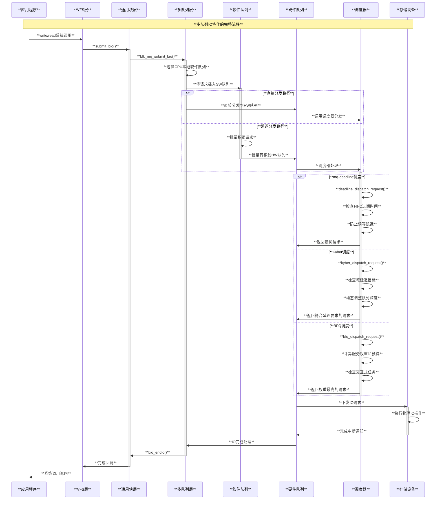
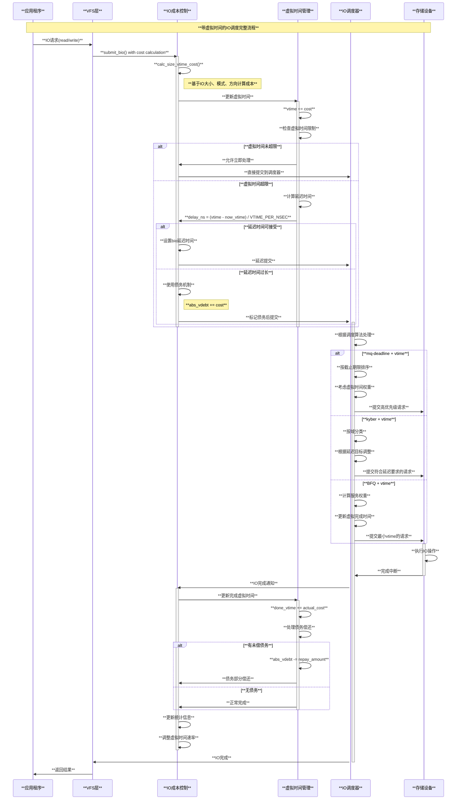

# Linux IO调度器原理与实现分析

## 目录

1. [概述](#概述)
2. [多队列块设备层架构](#多队列块设备层架构)
3. [mq-deadline调度器](#mq-deadline调度器)
4. [Kyber调度器](#kyber调度器)
5. [BFQ调度器](#bfq调度器)
6. [调度器对比分析](#调度器对比分析)
7. [核心数据结构](#核心数据结构)
8. [性能优化机制](#性能优化机制)
9. [调度器选择策略](#调度器选择策略)
10. [优点与局限性](#优点与局限性)
11. [总结](#总结)

## 概述

Linux IO调度器负责决定向存储设备发送IO请求的顺序和时机，是块设备层的核心组件。现代Linux内核支持多种IO调度器，每种都针对不同的工作负载和存储设备类型进行了优化。

### 核心设计目标

1. **吞吐量优化**：最大化系统的整体IO性能
2. **延迟控制**：为不同优先级的IO请求提供可预测的响应时间
3. **公平性保证**：确保各个进程能够公平地获得IO资源
4. **设备适配**：针对不同类型的存储设备（HDD、SSD、NVMe）进行优化
5. **多核扩展**：在多核系统上实现高效的并行IO处理

### 发展历程

- **Linux 2.4及之前**：简单的FIFO IO调度
- **Linux 2.6.0-3.x**：传统单队列调度器（CFQ、Deadline、NOOP）
- **Linux 3.13+**：多队列块设备层(blk-mq)引入
- **Linux 4.12+**：mq-deadline成为默认调度器
- **Linux 4.12+**：Kyber调度器专为低延迟设计
- **Linux 5.0+**：BFQ调度器提供更精细的公平性控制

## 多队列块设备层架构

Linux IO调度基于多队列块设备层(blk-mq)架构，提供高度并行的IO处理能力。

### blk-mq架构图

```c
// 多队列架构概述
/*
 * 多队列块设备层架构:
 * 
 * 应用层
 *   |
 * ┌─▼──────────────────────────────────┐
 * │        通用块设备层(Generic)         │
 * │    __submit_bio(), submit_bio()    │
 * └─┬──────────────────────────────────┘
 *   │
 * ┌─▼──────────────────────────────────┐
 * │         多队列层(blk-mq)            │
 * │     blk_mq_submit_bio()           │
 * └─┬────────┬────────┬───────────────┘
 *   │        │        │
 *   ▼        ▼        ▼
 * ┌────┐  ┌────┐  ┌────┐
 * │SW队列│ │SW队列│ │SW队列│... (per-CPU)
 * └─┬──┘  └─┬──┘  └─┬──┘
 *   │       │       │
 *   └───┬───┴───┬───┘
 *       │       │
 *       ▼       ▼
 *    ┌────┐  ┌────┐
 *    │HW队列│ │HW队列│... (per-device queue)
 *    └─┬──┘  └─┬──┘
 *      │       │
 *      ▼       ▼
 *   ┌─────┐ ┌─────┐
 *   │调度器 │ │调度器 │ (mq-deadline/kyber/bfq)
 *   └─┬───┘ └─┬───┘
 *     │       │
 *     ▼       ▼
 *   存储设备  存储设备
 */

// 主要数据结构
struct request_queue {
    struct blk_mq_tag_set *tag_set;      // 标签集合
    struct blk_mq_hw_ctx **queue_hw_ctx; // 硬件上下文数组
    unsigned int nr_hw_queues;           // 硬件队列数量
    
    const struct blk_mq_ops *mq_ops;     // 多队列操作集
    struct elevator_queue *elevator;     // IO调度器
    
    struct blk_queue_stats *stats;       // 队列统计
    struct rq_qos *rq_qos;              // 服务质量控制
    
    unsigned long nr_requests;          // 请求数量
    unsigned int rq_timeout;             // 请求超时时间
    
    struct mutex sysfs_lock;            // sysfs锁
    struct mutex sysfs_dir_lock;        // sysfs目录锁
};
```

### 核心IO流程

```c
// IO请求处理流程 - block/blk-mq.c
void blk_mq_submit_bio(struct bio *bio)
{
    struct request_queue *q = bdev_get_queue(bio->bi_bdev);
    struct blk_mq_hw_ctx *hctx;
    struct request *rq;
    struct blk_plug *plug;
    bool same_queue_cpu = true;
    unsigned int nr_segs = 1;

    // 生物合并检查
    if (blk_mq_attempt_merge(q, bio, nr_segs))
        return;

    // 分配请求
    rq = blk_mq_get_request(q, bio, 0);
    if (unlikely(!rq)) {
        // 处理分配失败
        bio_wouldblock_error(bio);
        return;
    }

    // 初始化请求
    rq_qos_track(q, rq, bio);
    blk_mq_bio_to_request(rq, bio, nr_segs);

    // 获取硬件上下文
    plug = blk_mq_plug(bio);
    if (plug && plug->cached_rq) {
        // 使用缓存的请求
        rq = plug->cached_rq;
        plug->cached_rq = rq->rq_next;
        INIT_LIST_HEAD(&rq->queuelist);
    }

    // 检查是否可以直接分发
    if (blk_mq_get_driver_tag(rq)) {
        // 尝试直接运行
        if (blk_mq_run_dispatch_ops(q, blk_mq_try_issue_directly(hctx, rq)))
            return;
    }

    // 插入到软件队列
    blk_mq_sched_insert_request(rq, false, true, true);
}

// 请求分发
static void blk_mq_try_issue_directly(struct blk_mq_hw_ctx *hctx,
                                     struct request *rq)
{
    int ret;

    if (blk_mq_hctx_stopped(hctx) || blk_queue_quiesced(rq->q)) {
        blk_mq_insert_request(rq, 0);
        return;
    }

    // 获取驱动标签
    if (!blk_mq_get_driver_tag(rq)) {
        blk_mq_insert_request(rq, 0);
        return;
    }

    // 直接分发到设备
    ret = __blk_mq_issue_directly(hctx, rq, true);
    switch (ret) {
    case BLK_STS_OK:
        break;
    case BLK_STS_RESOURCE:
    case BLK_STS_DEV_RESOURCE:
        blk_mq_request_bypass_insert(rq, 0);
        blk_mq_run_hw_queue(hctx, false);
        break;
    default:
        blk_mq_end_request(rq, ret);
        break;
    }
}
```

### IO多队列协作机制深度解析

#### 多队列协作的核心架构

Linux的IO多队列系统通过软件队列(SW queue)和硬件队列(HW queue)的协作，实现高度并行的IO处理：

```c
// IO多队列协作的核心结构 - block/blk-mq.c

/*
 * 多队列协作的层次结构：
 * 1. Per-CPU软件队列：减少锁竞争，提高并发性
 * 2. 硬件队列：直接映射到设备的物理队列
 * 3. 调度器集成：在硬件队列级别实现智能调度
 */

// 硬件上下文结构（每个硬件队列一个）
struct blk_mq_hw_ctx {
    struct sbitmap ctx_map;             // CPU上下文位图
    struct blk_mq_ctx **ctxs;           // CPU上下文数组
    unsigned int nr_ctx;               // 上下文数量
    
    // 调度器相关
    struct elevator_queue *sched;       // 调度器队列
    struct list_head dispatch;         // 分发队列
    
    // 队列状态和统计
    atomic_t nr_active;                // 活跃请求数
    struct hlist_node cpuhp_online;    // CPU热插拔支持
    struct hlist_node cpuhp_dead;      // CPU死锁处理
    
    // 性能优化
    struct sbitmap tags;               // 标签位图
    struct srcu_struct srcu[2];        // RCU保护
    unsigned long queued;              // 排队时间统计
    unsigned long run;                 // 运行时间统计
    
    // 硬件特定
    void *driver_data;                 // 驱动私有数据
    unsigned int numa_node;            // NUMA节点
};

// CPU软件上下文（每个CPU一个）
struct blk_mq_ctx {
    struct list_head rq_lists[HCTX_MAX_TYPES]; // 请求列表
    spinlock_t lock;                   // 保护锁
    unsigned int cpu;                  // CPU编号
    unsigned short index_hw[HCTX_MAX_TYPES];    // 硬件队列索引
    struct blk_mq_hw_ctx *hctxs[HCTX_MAX_TYPES]; // 硬件上下文
    
    struct request_queue *queue;       // 请求队列
    struct blk_mq_ctxs *ctxs;         // 上下文集合
} ____cacheline_aligned_in_smp;

// 多队列标签集合
struct blk_mq_tag_set {
    struct blk_mq_queue_map map[HCTX_MAX_TYPES]; // 队列映射
    unsigned int nr_maps;             // 映射数量
    const struct blk_mq_ops *ops;     // 操作函数集
    unsigned int nr_hw_queues;        // 硬件队列数
    unsigned int queue_depth;         // 队列深度
    unsigned int reserved_tags;       // 保留标签
    unsigned int cmd_size;            // 命令大小
    int numa_node;                    // NUMA节点
    atomic_t active_queues_shared_sbitmap; // 共享位图的活跃队列
    
    struct sbitmap_queue __bitmap_tags; // 位图标签队列
    struct sbitmap_queue __breserved_tags; // 保留标签位图
    struct blk_mq_tags **tags;        // 标签数组
    struct list_head tag_list;        // 标签列表
};
```

#### 多队列调度算法运行原理

不同的IO调度算法在多队列环境中的运行方式各具特色：

```c
// 1. mq-deadline调度器的多队列运行原理
struct deadline_data {
    // 每个优先级维护独立的调度队列
    struct dd_per_prio per_prio[DD_PRIO_COUNT];
    
    // 批处理和饥饿控制
    unsigned int batching;             // 当前批处理计数
    unsigned int starved;              // 饥饿计数
    int fifo_expire[DD_DIR_COUNT];     // FIFO过期时间
    int fifo_batch;                    // FIFO批大小
    
    // 多队列协作状态
    atomic_t hw_tag_samples;           // 硬件标签采样
    atomic_t max_write_starve_count;   // 最大写饥饿计数
    int writes_starved;                // 写请求饥饿阈值
};

// deadline调度器的多队列分发逻辑
static struct request *dd_dispatch_request(struct blk_mq_hw_ctx *hctx)
{
    struct deadline_data *dd = hctx->queue->elevator->elevator_data;
    struct request *rq = NULL;
    enum dd_data_dir data_dir;
    enum dd_prio prio;
    
    spin_lock(&dd->lock);
    
    // 1. 检查分发队列（最高优先级）
    for (prio = DD_RT_PRIO; prio <= DD_IDLE_PRIO; prio++) {
        if (!list_empty(&dd->per_prio[prio].dispatch)) {
            rq = list_first_entry(&dd->per_prio[prio].dispatch,
                                 struct request, queuelist);
            list_del_init(&rq->queuelist);
            goto out;
        }
    }
    
    // 2. 按优先级和方向选择请求
    for (prio = DD_RT_PRIO; prio <= DD_IDLE_PRIO; prio++) {
        for (data_dir = DD_READ; data_dir <= DD_WRITE; data_dir++) {
            rq = dd_fifo_request(dd, data_dir, prio);
            if (rq) {
                BUG_ON(data_dir != rq_data_dir(rq));
                goto out;
            }
        }
    }

out:
    // 更新统计信息
    if (rq) {
        dd->batching++;
        rq->rq_flags |= RQF_STARTED;
    }
    
    spin_unlock(&dd->lock);
    return rq;
}

// 2. Kyber调度器的延迟控制机制
struct kyber_queue_data {
    struct request_queue *q;
    
    // 多域调度结构
    struct kyber_ctx_queue *kcqs;     // 上下文队列数组
    
    // 延迟控制参数
    u64 latency_targets[KYBER_NUM_DOMAINS];  // 各域延迟目标
    unsigned int depth_updated[KYBER_NUM_DOMAINS]; // 深度更新标志
    
    // 统计和监控
    struct kyber_cpu_latency __percpu *cpu_latency; // CPU延迟统计
    struct timer_list timer;          // 定时器
    unsigned int latency_buckets[KYBER_NUM_DOMAINS][KYBER_LATENCY_BUCKETS];
    unsigned long latency_timeout[KYBER_NUM_DOMAINS];
    
    // 队列深度控制
    atomic_t cur_depth[KYBER_NUM_DOMAINS]; // 当前深度
    unsigned int depth[KYBER_NUM_DOMAINS]; // 目标深度
};

// Kyber的自适应深度调整
static void kyber_lat_scaled_depth(struct kyber_queue_data *kqd,
                                  enum kyber_domain domain)
{
    unsigned int orig_depth, depth;
    unsigned int lat_nsec, target_lat_nsec;
    
    orig_depth = kqd->depth[domain];
    
    // 获取当前延迟统计
    lat_nsec = kyber_get_latency(kqd, domain);
    target_lat_nsec = kqd->latency_targets[domain];
    
    if (lat_nsec == 0)
        return;
    
    // 基于延迟动态调整队列深度
    if (lat_nsec < target_lat_nsec) {
        // 延迟低于目标，增加深度
        depth = orig_depth << 1;
    } else {
        // 延迟高于目标，减少深度
        depth = max(orig_depth >> 1, 1U);
    }
    
    depth = clamp(depth, 1U, kyber_depth[domain]);
    if (depth != orig_depth) {
        kqd->depth[domain] = depth;
        kqd->depth_updated[domain] = 1;
    }
}

// 3. BFQ调度器的多队列权重分配
struct bfq_data {
    struct request_queue *queue;
    
    // 层次化调度结构
    struct rb_root_cached service_tree[BFQ_IOPRIO_CLASSES][BFQ_MAX_GROUPS];
    struct bfq_entity *in_service_entity; // 当前服务实体
    
    // 多队列协作
    struct bfq_io_cq *bio_bic;        // BIO到BIC的映射
    u64 bfq_class_idle_last_service;  // 空闲类最后服务时间
    
    // 权重和预算管理
    unsigned long bfq_wr_max_time;     // 权重提升最大时间
    bool low_latency;                  // 低延迟模式
    unsigned int bfq_wr_coeff;         // 权重提升系数
    
    // 吞吐量优化
    unsigned int bfq_large_burst_thresh; // 大突发阈值
    bool large_burst;                  // 大突发状态
    struct bfq_ttime last_ins_in_burst; // 突发中最后插入时间
};
```

#### 多队列协作的工作时序图



#### 多队列性能优化机制

```c
// 性能优化的关键技术

// 1. CPU亲和性优化
static int blk_mq_hctx_cpu_offline(struct blk_mq_hw_ctx *hctx, unsigned int cpu)
{
    struct blk_mq_ctx *ctx;
    LIST_HEAD(tmp);
    
    // 将离线CPU的请求迁移到在线CPU
    ctx = __blk_mq_get_ctx(hctx->queue, cpu);
    
    spin_lock(&ctx->lock);
    if (!list_empty(&ctx->rq_lists[HCTX_TYPE_DEFAULT])) {
        list_splice_init(&ctx->rq_lists[HCTX_TYPE_DEFAULT], &tmp);
        blk_mq_hctx_clear_pending(hctx, ctx);
    }
    spin_unlock(&ctx->lock);
    
    if (list_empty(&tmp))
        return 0;
    
    spin_lock(&hctx->lock);
    list_splice_tail_init(&tmp, &hctx->dispatch);
    spin_unlock(&hctx->lock);
    
    blk_mq_run_hw_queue(hctx, true);
    return 0;
}

// 2. 批处理优化
static void blk_mq_flush_plug_list(struct blk_plug *plug, bool from_schedule)
{
    struct blk_mq_hw_ctx *this_hctx;
    struct blk_mq_ctx *this_ctx;
    struct request *rq;
    LIST_HEAD(list);
    unsigned int depth;
    
    list_splice_init(&plug->mq_list, &list);
    
    if (plug->rq_count > 2 && plug->multiple_queues)
        queue_delayed_work(system_unbound_wq, &plug->flush_work, 0);
        
    plug->rq_count = 0;
    
    this_hctx = NULL;
    this_ctx = NULL;
    depth = 0;
    
    while (!list_empty(&list)) {
        rq = list_entry_rq(list.next);
        list_del_init(&rq->queuelist);
        
        BUG_ON(!rq->q);
        if (rq->mq_hctx != this_hctx || rq->mq_ctx != this_ctx) {
            if (this_hctx) {
                trace_block_unplug(this_hctx->queue, depth, 
                                  !from_schedule);
                blk_mq_sched_insert_requests(this_hctx, this_ctx,
                                            &ctx_list, from_schedule);
            }
            
            this_hctx = rq->mq_hctx;
            this_ctx = rq->mq_ctx;
        }
        
        list_add_tail(&rq->queuelist, &ctx_list);
        depth++;
    }
}

// 3. 负载均衡优化
static int blk_mq_hctx_next_cpu(struct blk_mq_hw_ctx *hctx)
{
    if (hctx->queue->nr_hw_queues == 1)
        return WORK_CPU_UNBOUND;
        
    if (--hctx->next_cpu_batch <= 0) {
        hctx->next_cpu_batch = BLK_MQ_CPU_WORK_BATCH;
        hctx->next_cpu = cpumask_next_and(hctx->next_cpu, 
                                         hctx->cpumask,
                                         cpu_online_mask);
        if (hctx->next_cpu >= nr_cpu_ids)
            hctx->next_cpu = cpumask_first_and(hctx->cpumask,
                                              cpu_online_mask);
    }
    
    return hctx->next_cpu;
}
```

## mq-deadline调度器

mq-deadline是Linux的默认IO调度器，基于截止期限算法，在保证公平性的同时防止IO饥饿。

### 核心算法

```c
// mq-deadline数据结构 - block/mq-deadline.c
struct deadline_data {
    struct rb_root sort_list[DD_DIR_COUNT];    // 按扇区排序的红黑树
    struct list_head fifo_list[DD_DIR_COUNT];  // FIFO队列
    
    unsigned int batches;                      // 当前批次计数
    unsigned int next_rq_time;                // 下一个请求时间
    unsigned int fifo_expire[DD_DIR_COUNT];    // FIFO过期时间
    unsigned int fifo_batch;                   // FIFO批次大小
    unsigned int writes_starved;               // 写饥饿计数
    unsigned int front_merges;                 // 前向合并计数
    
    spinlock_t lock;                           // 队列锁
    spinlock_t zone_lock;                      // zone锁
    
    struct list_head dispatch;                 // 分发队列
    struct deadline_data *dd_per_prio[DD_PRIO_COUNT]; // 优先级队列
    
    // 统计信息
    struct {
        uint32_t dispatched;                   // 已分发请求数
        uint32_t merged;                       // 已合并请求数
        uint32_t batching;                     // 批处理计数
        atomic_t starved;                      // 饥饿计数
    } stats[DD_STAT_COUNT];
    
    // zone信息（为顺序写优化）
    unsigned int num_zones_with_pending_request[DD_DIR_COUNT];
};

// 方向定义
enum dd_data_dir {
    DD_READ,      // 读请求
    DD_WRITE,     // 写请求
    DD_DIR_COUNT
};

// 优先级定义
enum dd_prio {
    DD_RT_PRIO,   // 实时优先级
    DD_BE_PRIO,   // 最佳努力优先级
    DD_IDLE_PRIO, // 空闲优先级
    DD_PRIO_COUNT
};
```

### 请求选择算法

```c
// 选择下一个请求 - block/mq-deadline.c
static struct request *__dd_dispatch_request(struct deadline_data *dd,
                                            struct dd_per_prio *per_prio)
{
    struct request *rq, *next_rq;
    enum dd_data_dir data_dir;
    enum dd_prio prio = per_prio->prio;
    
    lockdep_assert_held(&dd->lock);

    // 首先检查分发列表
    if (!list_empty(&per_prio->dispatch)) {
        rq = list_first_entry(&per_prio->dispatch, struct request, queuelist);
        list_del_init(&rq->queuelist);
        goto done;
    }

    // 检查FIFO过期的请求
    for (data_dir = DD_READ; data_dir <= DD_WRITE; data_dir++) {
        rq = deadline_fifo_request(dd, per_prio, data_dir);
        if (!rq)
            continue;
            
        // 检查是否过期
        if (deadline_check_fifo(per_prio, data_dir) ||
            dd_request_deadline_expired(rq)) {
            // FIFO过期，必须处理
            deadline_move_request(dd, per_prio, rq);
            goto done;
        }
    }

    // 根据寻道优化选择请求
    if (dd->next_rq[prio][DD_READ]) {
        BUG_ON(RB_EMPTY_ROOT(&per_prio->sort_list[DD_READ]));
        
        if (deadline_fifo_request(dd, per_prio, DD_READ) &&
            (dd->starved++ >= dd->reads_starved)) {
            // 防止读请求饥饿
            dd->starved = 0;
            data_dir = DD_READ;
        } else {
            data_dir = DD_WRITE;
        }
    } else if (dd->next_rq[prio][DD_WRITE]) {
        BUG_ON(RB_EMPTY_ROOT(&per_prio->sort_list[DD_WRITE]));
        data_dir = DD_WRITE;
    } else {
        return NULL;
    }

    // 选择最优请求
    rq = dd->next_rq[prio][data_dir];
    dd->next_rq[prio][data_dir] = deadline_latter_request(rq);
    
    // 从红黑树和FIFO队列中移除
    deadline_move_request(dd, per_prio, rq);

done:
    // 更新统计信息
    ioprio_t ioprio = rq->ioprio;
    dd_count(dd, dispatched, ioprio);
    
    return rq;
}

// 检查FIFO截止期限
static inline int deadline_check_fifo(struct dd_per_prio *per_prio,
                                     enum dd_data_dir data_dir)
{
    struct request *rq = deadline_fifo_request(dd, per_prio, data_dir);
    
    if (!rq)
        return 0;
        
    // 检查请求是否过期
    if (time_after_eq(jiffies, (unsigned long)rq->fifo_time))
        return 1;
        
    return 0;
}

// 请求合并检查
static bool dd_bio_merge(struct request_queue *q, struct bio *bio,
                        unsigned int nr_segs)
{
    struct deadline_data *dd = q->elevator->elevator_data;
    struct request *free = NULL;
    bool ret;

    spin_lock(&dd->lock);
    ret = blk_mq_sched_try_merge(q, bio, nr_segs, &free);
    spin_unlock(&dd->lock);

    if (free)
        blk_mq_free_request(free);
        
    return ret;
}
```

### 批处理优化

```c
// 批处理控制
static void dd_finish_request(struct request *rq)
{
    struct request_queue *q = rq->q;
    struct deadline_data *dd = q->elevator->elevator_data;
    struct dd_per_prio *per_prio;
    const u8 ioprio_class = dd_rq_ioclass(rq);
    const enum dd_prio prio = ioprio_class_to_prio[ioprio_class];
    struct dd_blkcg *blkcg = dd_blkcg_from_bio(rq->bio);

    per_prio = &dd->per_prio[prio];

    // 如果是当前批次的一部分，递减批次计数
    if (blkcg && blkcg->stats &&
        blkcg->stats->batched[prio] > 0) {
        blkcg->stats->batched[prio]--;
        
        // 如果批次完成，触发新的调度
        if (blkcg->stats->batched[prio] == 0)
            blk_mq_run_hw_queues(q, true);
    }

    dd_count(dd, completed, rq->ioprio);
    
    if (blkcg && blkcg->stats) {
        blkcg->stats->dispatched[prio]++;
        blkcg->stats->service_time[prio] += 
            ktime_get_ns() - rq->start_time_ns;
    }
}
```

## Kyber调度器

Kyber专为低延迟SSD设计，使用令牌桶算法控制每种类型IO的队列深度。

### 核心设计

```c
// Kyber数据结构 - block/kyber-iosched.c
struct kyber_queue_data {
    struct request_queue *q;
    
    // 令牌管理
    struct kyber_cpu_latency __percpu *cpu_latency;
    struct timer_list timer;
    
    // 域队列 - 每个域对应不同类型的IO
    struct kyber_ctx_queue domain_queue[KYBER_NUM_DOMAINS];
    struct sbitmap_queue domain_tokens[KYBER_NUM_DOMAINS];
    unsigned int async_depth;
    
    struct kyber_domain_stats __percpu *domain_stats;
    struct kyber_hctx_data *khd;
};

// IO域定义
enum {
    KYBER_READ,        // 读域
    KYBER_SYNC_WRITE,  // 同步写域
    KYBER_OTHER,       // 其他域（包括异步写）
    KYBER_NUM_DOMAINS,
};

// 延迟目标（纳秒）
static const u64 latency_targets[] = {
    [KYBER_READ] = 2ULL * NSEC_PER_MSEC,        // 读延迟目标：2ms
    [KYBER_SYNC_WRITE] = 10ULL * NSEC_PER_MSEC, // 同步写延迟目标：10ms
    [KYBER_OTHER] = 5ULL * NSEC_PER_SEC,        // 其他延迟目标：5s
};
```

### 令牌桶算法

```c
// 令牌获取
static int kyber_get_domain_token(struct kyber_queue_data *kqd,
                                 struct kyber_hctx_data *khd,
                                 enum kyber_domain domain)
{
    int nr;

    nr = __sbitmap_queue_get(&kqd->domain_tokens[domain]);
    
    if (nr >= 0) {
        khd->nr_active[domain]++;
        return nr;
    }
    
    return -1;
}

// 令牌释放
static void kyber_put_domain_token(struct kyber_queue_data *kqd,
                                  enum kyber_domain domain,
                                  unsigned int nr)
{
    sbitmap_queue_clear(&kqd->domain_tokens[domain], nr, 0);
}

// 动态深度调整
static void kyber_timer_fn(struct timer_list *t)
{
    struct kyber_queue_data *kqd = from_timer(kqd, t, timer);
    struct kyber_cpu_latency *cpu_latency;
    struct kyber_domain_stats *stats;
    unsigned int cpu;
    int domain;

    for (domain = 0; domain < KYBER_NUM_DOMAINS; domain++) {
        u64 target = latency_targets[domain];
        u64 p99_latency = 0;
        u64 total_latency = 0;
        u64 total_samples = 0;

        // 收集延迟统计
        for_each_online_cpu(cpu) {
            cpu_latency = per_cpu_ptr(kqd->cpu_latency, cpu);
            stats = &cpu_latency->stats[domain];
            
            total_latency += stats->latency_buckets[KYBER_LATENCY_P99];
            total_samples += stats->total;
        }

        if (total_samples != 0) {
            p99_latency = total_latency / total_samples;
            
            // 根据延迟调整队列深度
            if (p99_latency > target) {
                // 延迟太高，减少队列深度
                kyber_decrease_domain_depth(kqd, domain);
            } else if (p99_latency < target / 2) {
                // 延迟很低，可以增加队列深度
                kyber_increase_domain_depth(kqd, domain);
            }
        }
    }

    // 重新设置定时器
    mod_timer(&kqd->timer, jiffies + msecs_to_jiffies(KYBER_LATENCY_INTERVAL));
}
```

### 请求分发

```c
// 请求分发算法
static struct request *kyber_dispatch_request(struct blk_mq_hw_ctx *hctx)
{
    struct kyber_queue_data *kqd = hctx->queue->elevator->elevator_data;
    struct kyber_hctx_data *khd = hctx->sched_data;
    struct request *rq;
    int domain = khd->cur_domain;
    int orig_domain = domain;
    int token;

    // 轮询各个域
    do {
        // 获取域令牌
        token = kyber_get_domain_token(kqd, khd, domain);
        if (token < 0) {
            // 没有令牌，尝试下一个域
            domain = (domain + 1) % KYBER_NUM_DOMAINS;
            continue;
        }

        // 从域队列获取请求
        rq = kyber_dispatch_cur_domain(kqd, khd, domain);
        if (rq) {
            // 成功获取请求
            rq->timeout_list.next = (void *)(unsigned long)token;
            khd->cur_domain = domain;
            return rq;
        }

        // 释放未使用的令牌
        kyber_put_domain_token(kqd, domain, token);
        khd->nr_active[domain]--;
        
        domain = (domain + 1) % KYBER_NUM_DOMAINS;
    } while (domain != orig_domain);

    // 没有可用请求
    return NULL;
}

// 域内请求选择
static struct request *kyber_dispatch_cur_domain(struct kyber_queue_data *kqd,
                                                struct kyber_hctx_data *khd,
                                                unsigned int domain)
{
    struct list_head *rqs = &khd->rq_list[domain];
    struct request *rq;

    rq = list_first_entry_or_null(rqs, struct request, queuelist);
    if (rq) {
        list_del_init(&rq->queuelist);
        khd->domain_wait[domain].token--;
    }

    return rq;
}
```

## BFQ调度器

BFQ (Budget Fair Queueing)提供精确的带宽分配和低延迟保证，特别适合交互式工作负载。

### 核心算法

```c
// BFQ数据结构 - block/bfq-iosched.c
struct bfq_data {
    struct request_queue *queue;
    
    struct bfq_group *root_group;          // 根组
    struct rb_root_cached queued_tree;     // 排队的bfq_queue树
    int busy_queues;                       // 忙碌队列数
    int wr_busy_queues;                    // 权重提升的忙碌队列数
    
    u64 bfq_class_idle_last_service;       // 空闲类最后服务时间
    
    // 预算控制
    unsigned int bfq_timeout;              // BFQ超时时间
    unsigned int bfq_max_budget;           // 最大预算
    unsigned int bfq_min_budget;           // 最小预算
    
    // 权重提升
    unsigned long bfq_wr_coeff;            // 权重提升系数
    unsigned long bfq_wr_max_time;         // 最大权重提升时间
    unsigned long bfq_wr_rt_max_time;      // 实时最大权重提升时间
    
    struct bfq_queue *in_service_queue;    // 当前服务队列
    sector_t last_position;                // 最后位置
    
    struct hrtimer idle_slice_timer;       // 空闲切片定时器
    struct work_struct unplug_work;        // 拔出工作
    
    ktime_t last_completion;               // 最后完成时间
    
    // 吞吐量估计
    u64 rate_dur_prod;                     // 速率持续时间积
    u64 last_rq_max_size;                  // 最后请求最大大小
    u32 sequential_samples;                // 顺序样本数
    u32 peak_rate_samples;                 // 峰值速率样本数
    u32 bfq_peak_rate;                     // BFQ峰值速率
};

// BFQ队列结构
struct bfq_queue {
    int ref;                               // 引用计数
    struct bfq_data *bfqd;                 // BFQ数据
    
    unsigned short ioprio, new_ioprio;     // IO优先级
    unsigned short ioprio_class, new_ioprio_class; // IO优先级类
    
    struct rb_node pos_node;               // 位置节点
    struct rb_root sort_list;              // 排序列表
    
    struct request *next_rq;               // 下一个请求
    int dispatched;                        // 已分发请求数
    int queued[2];                         // 排队请求数（读/写）
    
    // 预算和时间
    int budget_timeout;                    // 预算超时
    unsigned long service_from_backlogged; // 从积压开始的服务
    unsigned long service_from_wr;         // 从权重提升开始的服务
    
    // 权重提升
    unsigned long wr_cur_max_time;         // 当前最大权重提升时间
    unsigned long soft_rt_next_start;      // 软实时下一次开始
    unsigned long last_wr_start_finish;    // 最后权重提升开始完成
    
    // 合作检测
    struct bfq_queue *new_bfqq;            // 新BFQ队列
    struct rb_node pos_root;               // 位置根
    struct rb_root *pos_tree;              // 位置树
    
    struct bfq_queue *waker_bfqq;          // 唤醒者队列
    struct list_head woken_list;           // 被唤醒列表
    
    // 统计信息
    u64 tot_sectors_dispatched;           // 总分发扇区数
    u32 max_budget;                       // 最大预算
    u32 budget_timeout;                   // 预算超时
};
```

### 公平排队算法

```c
// 虚拟时间计算
static void bfq_update_finish_time(struct bfq_data *bfqd,
                                  struct bfq_queue *bfqq,
                                  bool compensate)
{
    u64 bfq_service = bfqq->entity.service;
    u64 extra_service = 0;
    
    // 计算额外服务时间（用于补偿）
    if (compensate) {
        struct bfq_ttime ttime = bfqq->ttime;
        extra_service = ttime.ttime_mean * bfqq->entity.weight;
        do_div(extra_service, BFQ_WEIGHT_LEGACY);
    }
    
    // 更新完成时间
    bfqq->entity.finish = bfq_service + 
                         (bfqq->entity.budget * BFQ_SCALE) /
                         bfqq->entity.weight + extra_service;
    
    // 确保完成时间单调性
    if (bfqq->entity.finish < bfqd->in_service_entity->finish)
        bfqq->entity.finish = bfqd->in_service_entity->finish;
}

// 预算分配算法
static unsigned long bfq_calc_max_budget(struct bfq_data *bfqd)
{
    u64 timeout_coeff;
    
    if (bfqd->peak_rate_samples >= BFQ_PEAK_RATE_SAMPLES) {
        // 基于峰值速率计算预算
        timeout_coeff = jiffies_to_msecs(bfqd->bfq_timeout);
        
        // max_budget = peak_rate * timeout / 1000
        return (bfqd->peak_rate * timeout_coeff) / MSEC_PER_SEC;
    } else {
        // 使用默认预算
        return bfqd->bfq_default_max_budget;
    }
}

// 权重提升检测
static bool bfq_bfqq_update_budg_for_activation(struct bfq_data *bfqd,
                                               struct bfq_queue *bfqq,
                                               bool arrived_in_time)
{
    struct bfq_entity *entity = &bfqq->entity;
    
    // 检查是否需要权重提升
    if (bfq_bfqq_non_blocking_wait_rq(bfqq) && arrived_in_time) {
        // 交互式应用检测到，给予权重提升
        bfqq->wr_coeff = bfqd->bfq_wr_coeff;
        bfqq->wr_cur_max_time = bfq_wr_duration(bfqd);
        
        bfq_log_bfqq(bfqd, bfqq,
                    "detected interactive: wrc %d wrt %lu",
                    bfqq->wr_coeff, jiffies_to_msecs(bfqq->wr_cur_max_time));
        
        return true;
    }
    
    return false;
}
```

### 低延迟优化

```c
// 空闲检测和处理
static void bfq_arm_slice_timer(struct bfq_data *bfqd)
{
    struct bfq_queue *bfqq = bfqd->in_service_queue;
    u32 sl;

    BUG_ON(!RB_EMPTY_ROOT(&bfqq->sort_list));

    // 计算空闲切片时间
    if (bfq_bfqq_sync(bfqq)) {
        sl = bfqd->bfq_slice_idle;
        // 对于权重提升的队列，给予更多时间
        if (bfq_bfqq_wr_coeff(bfqq) > 1)
            sl = min(sl * 3, 20UL);
    } else {
        sl = bfqd->bfq_slice_idle_async;
    }

    bfqd->last_idling_start = ktime_get();
    hrtimer_start(&bfqd->idle_slice_timer, ns_to_ktime(sl * NSEC_PER_USEC),
                  HRTIMER_MODE_REL);
    
    bfq_log(bfqd, "arm idle: %u/%u ms", sl, bfqd->bfq_slice_idle);
}

// 抢占检查
static void bfq_check_waker(struct bfq_data *bfqd, struct bfq_queue *bfqq,
                           u64 now_ns)
{
    char waker_name[16];
    
    if (!bfqd->last_completed_rq_bfqq ||
        bfqd->last_completed_rq_bfqq == bfqq ||
        bfq_bfqq_has_short_ttime(bfqq) ||
        now_ns - bfqd->last_completion >= 4 * NSEC_PER_MSEC)
        return;
    
    // 检测到潜在的唤醒者
    if (bfqd->last_completed_rq_bfqq != bfqq->tentative_waker_bfqq) {
        bfqq->tentative_waker_bfqq = bfqd->last_completed_rq_bfqq;
        bfqq->num_waker_detections = 1;
    } else {
        bfqq->num_waker_detections++;
    }
    
    // 确认唤醒者关系
    if (bfqq->num_waker_detections == 3) {
        bfqq->waker_bfqq = bfqd->last_completed_rq_bfqq;
        bfq_log_bfqq(bfqd, bfqq, "waker confirmed: %d",
                    bfqq->waker_bfqq->pid);
    }
}
```

## 调度器对比分析

### 性能特征对比

| 调度器      | 主要优势                | 适用场景                | 延迟特性        | 吞吐量特性      |
|------------|------------------------|------------------------|----------------|----------------|
| mq-deadline| 简单高效，防止饥饿      | 通用服务器工作负载       | 中等           | 高             |
| Kyber      | 低延迟，动态队列深度调整 | 延迟敏感的SSD应用       | 极低           | 中等           |
| BFQ        | 精确公平性，交互式优化   | 桌面和交互式应用        | 低（交互式）    | 中等           |
| none       | 零开销                  | 超高性能存储设备        | 设备决定       | 极高           |

### 算法复杂度对比

```c
// 时间复杂度分析
/*
 * mq-deadline:
 * - 插入: O(log n) (红黑树插入)
 * - 选择: O(1) (FIFO检查) 或 O(log n) (红黑树查找)
 * - 空间: O(n)
 * 
 * Kyber:
 * - 插入: O(1) (简单队列插入)
 * - 选择: O(1) (轮询域)
 * - 空间: O(1)
 * 
 * BFQ:
 * - 插入: O(log n) (红黑树插入 + 虚拟时间计算)
 * - 选择: O(log n) (红黑树查找)
 * - 空间: O(n + g) (g为组数)
 * 
 * none:
 * - 插入: O(1) (直接分发)
 * - 选择: O(1) (FIFO)
 * - 空间: O(1)
 */
```

## 核心数据结构

### 电梯队列结构

```c
// 电梯队列结构 - include/linux/elevator.h
struct elevator_queue {
    struct elevator_type *type;           // 调度器类型
    void *elevator_data;                  // 调度器私有数据
    struct kobject kobj;                  // 内核对象
    struct mutex sysfs_lock;              // sysfs锁
    unsigned int registered:1;            // 是否已注册
    DECLARE_HASHTABLE(hash, ELV_HASH_BITS); // 请求哈希表
};

// 调度器类型
struct elevator_type {
    struct kmem_cache *icq_cache;         // IO上下文缓存
    struct elevator_mq_ops ops;           // 多队列操作
    size_t icq_size;                      // IO上下文大小
    size_t icq_align;                     // IO上下文对齐
    struct elv_fs_entry *elevator_attrs;  // 文件系统属性
    const char *elevator_name;            // 调度器名称
    const char *elevator_alias;           // 调度器别名
    const unsigned int elevator_features; // 调度器特性
    struct module *elevator_owner;        // 模块拥有者
    const struct blk_mq_debugfs_attr *queue_debugfs_attrs; // 调试属性
    const struct blk_mq_debugfs_attr *hctx_debugfs_attrs;
    struct list_head list;                // 链表节点
};

// 多队列操作集
struct elevator_mq_ops {
    int (*init_sched)(struct request_queue *, struct elevator_type *);
    void (*exit_sched)(struct elevator_queue *);
    int (*init_hctx)(struct blk_mq_hw_ctx *, unsigned int);
    void (*exit_hctx)(struct blk_mq_hw_ctx *, unsigned int);
    void (*depth_updated)(struct blk_mq_hw_ctx *);
    
    bool (*allow_merge)(struct request_queue *, struct request *, struct bio *);
    bool (*bio_merge)(struct request_queue *, struct bio *, unsigned int);
    int (*request_merge)(struct request_queue *q, struct request **, struct bio *);
    void (*request_merged)(struct request_queue *, struct request *, enum elv_merge);
    void (*requests_merged)(struct request_queue *, struct request *, struct request *);
    
    void (*limit_depth)(unsigned int, struct blk_mq_alloc_data *);
    void (*prepare_request)(struct request *);
    void (*finish_request)(struct request *);
    void (*insert_requests)(struct blk_mq_hw_ctx *, struct list_head *, bool);
    struct request *(*dispatch_request)(struct blk_mq_hw_ctx *);
    bool (*has_work)(struct blk_mq_hw_ctx *);
    void (*completed_request)(struct request *, u64);
    void (*requeue_request)(struct request *);
    struct request *(*former_request)(struct request_queue *, struct request *);
    struct request *(*next_request)(struct request_queue *, struct request *);
    void (*init_icq)(struct io_cq *);
    void (*exit_icq)(struct io_cq *);
};
```

## 性能优化机制

### 请求合并优化

```c
// 生物合并检查 - block/blk-merge.c
static int blk_bio_segment_split(struct request_queue *q,
                               struct bio *bio,
                               struct bio_set *bs,
                               unsigned *segs)
{
    struct bio_vec bv, bvprv, *bvprvp = NULL;
    struct bvec_iter iter;
    unsigned nsegs = 0, sectors = 0;
    bool do_split = true;
    struct bio *new = NULL;
    const unsigned max_sectors = get_max_io_size(q, bio) << 9;
    const unsigned max_segs = queue_max_segments(q);

    bio_for_each_segment(bv, bio, iter) {
        if (sectors + (bv.bv_len >> 9) > max_sectors) {
            // 超过最大扇区数，需要分割
            sectors = bv.bv_len >> 9;
            if (nsegs == 1 && seg_size > queue_max_segment_size(q))
                goto split;
            nsegs = 1;
            goto new_segment;
        }

        if (bvprvp) {
            if (!biovec_phys_mergeable(q, bvprvp, &bv))
                goto new_segment;
            if (seg_size + bv.bv_len > queue_max_segment_size(q))
                goto new_segment;
            
            seg_size += bv.bv_len;
        } else {
new_segment:
            if (nsegs == max_segs)
                goto split;
            nsegs++;
            bvprv = bv;
            bvprvp = &bvprv;
            seg_size = bv.bv_len;
        }
        
        sectors += bv.bv_len >> 9;
    }

    *segs = nsegs;
    return 0;

split:
    new = bio_split(bio, sectors, bs, GFP_NOIO);
    if (new) {
        bio = new;
        *segs = nsegs;
    }
    
    return 1;
}
```

### 批处理优化

```c
// 插件机制 - block/blk-mq.c
void blk_mq_flush_plug_list(struct blk_plug *plug, bool from_schedule)
{
    LIST_HEAD(list);

    if (list_empty(&plug->mq_list))
        return;

    list_splice_init(&plug->mq_list, &list);

    if (plug->rq_count > 2 && plug->multiple_queues) {
        // 多队列批处理优化
        plug->rq_count = 0;
        list_sort(NULL, &list, plug_rq_cmp);
    }

    plug->rq_count = 0;
    
    do {
        struct list_head rq_list;
        struct request *rq, *head_rq = list_entry_rq(list.next);
        struct list_head *pos = &head_rq->queuelist;
        struct blk_mq_hw_ctx *this_hctx = head_rq->mq_hctx;
        struct blk_mq_ctx *this_ctx = head_rq->mq_ctx;
        unsigned int depth = 1;

        // 收集同一硬件队列的请求
        list_for_each_continue(pos, &list) {
            rq = container_of(pos, struct request, queuelist);
            BUG_ON(!rq->q);
            if (rq->mq_hctx != this_hctx || rq->mq_ctx != this_ctx)
                break;
            depth++;
        }

        list_cut_before(&rq_list, &list, pos);
        trace_block_unplug(this_hctx->queue, depth, !from_schedule);
        blk_mq_sched_insert_requests(this_hctx, this_ctx, &rq_list, from_schedule);
    } while(!list_empty(&list));
}
```

## 调度器选择策略与动态切换机制

### 自动选择逻辑详解

Linux内核使用复杂的决策树来为每个块设备选择最合适的IO调度器：

```c
// 调度器自动选择核心逻辑 - block/elevator.c

// 设备特性检测结构
struct device_characteristics {
    bool is_rotational;                // 是否为机械硬盘
    bool is_ssd;                      // 是否为固态硬盘  
    bool is_nvme;                     // 是否为NVMe设备
    bool supports_ncq;                // 是否支持Native Command Queuing
    unsigned int queue_depth;         // 设备队列深度
    unsigned int nr_hw_queues;        // 硬件队列数量
    bool low_latency_required;        // 是否需要低延迟
    bool high_iops_workload;          // 是否为高IOPS工作负载
};

// 自动选择调度器的主要逻辑
const char *blk_mq_sched_elevator_name(struct request_queue *q)
{
    struct device_characteristics dc;
    
    // 1. 收集设备特性
    dc.is_rotational = !blk_queue_nonrot(q);
    dc.is_ssd = blk_queue_nonrot(q) && !dc.is_nvme;
    dc.is_nvme = (q->tag_set->flags & BLK_MQ_F_NVME_IO_POLL) != 0;
    dc.supports_ncq = blk_queue_tagged(q);
    dc.queue_depth = q->tag_set->queue_depth;
    dc.nr_hw_queues = q->tag_set->nr_hw_queues;
    dc.low_latency_required = (q->tag_set->flags & BLK_MQ_F_SHOULD_MERGE) == 0;
    
    // 2. 检查显式禁用调度器标志
    if (q->tag_set->flags & BLK_MQ_F_NO_SCHED_BY_DEFAULT) {
        // 设备要求无调度器（如某些高性能NVMe）
        return "none";
    }
    
    // 3. 基于设备类型和性能需求选择
    if (dc.is_nvme) {
        // NVMe设备选择策略
        if (dc.nr_hw_queues > 4 && dc.queue_depth > 32) {
            // 高并发NVMe：使用none以获得最大性能
            return "none";
        } else if (dc.low_latency_required) {
            // 延迟敏感NVMe：使用kyber
            return "kyber";
        } else {
            // 通用NVMe：使用轻量级deadline
            return "mq-deadline";
        }
    } else if (dc.is_ssd) {
        // SSD设备选择策略
        if (dc.nr_hw_queues == 1) {
            // 单队列SSD：kyber提供更好的延迟控制
            return "kyber";
        } else {
            // 多队列SSD：根据工作负载选择
            if (dc.high_iops_workload) {
                return "none";
            } else {
                return "mq-deadline";
            }
        }
    } else {
        // HDD设备选择策略
        // 机械硬盘始终受益于截止期限调度的寻道优化
        return "mq-deadline";
    }
}

// 启动时调度器初始化
static int blk_mq_init_sched_and_queue(struct request_queue *q)
{
    const char *elevator_name;
    struct elevator_type *e;
    int ret;
    
    // 获取推荐的调度器名称
    elevator_name = blk_mq_sched_elevator_name(q);
    
    // 查找调度器实现
    e = elevator_get(elevator_name, true);
    if (!e) {
        // 回退到默认调度器
        printk(KERN_WARNING "io scheduler %s not found, falling back to deadline\n",
               elevator_name);
        e = elevator_get("mq-deadline", true);
    }
    
    if (!e) {
        // 最终回退到none
        printk(KERN_WARNING "deadline io scheduler not found, using none\n");
        return 0;
    }
    
    // 初始化选定的调度器
    ret = blk_mq_init_sched(q, e);
    elevator_put(e);
    
    return ret;
}
```

### 动态调度器切换机制

Linux支持在运行时动态切换IO调度器，无需重启系统或卸载设备：

```c
// 动态调度器切换实现 - block/elevator.c

// 切换状态管理
enum elevator_switch_state {
    ELEVATOR_SWITCH_NONE,
    ELEVATOR_SWITCH_PENDING,
    ELEVATOR_SWITCH_IN_PROGRESS,
    ELEVATOR_SWITCH_COMPLETED,
    ELEVATOR_SWITCH_FAILED
};

// 切换上下文
struct elevator_switch_context {
    struct request_queue *q;
    struct elevator_type *old_type;
    struct elevator_type *new_type;
    enum elevator_switch_state state;
    struct work_struct switch_work;
    int error_code;
};

// 主切换函数
static int __elevator_switch(struct request_queue *q, struct elevator_type *new_e)
{
    struct elevator_queue *old = q->elevator;
    bool old_registered = false;
    int err = 0;
    
    // 1. 预检查
    if (old && old->type == new_e) {
        return 0;  // 已经是目标调度器，无需切换
    }
    
    // 2. 检查是否支持动态切换
    if (q->tag_set->flags & BLK_MQ_F_NO_SCHED_SWITCH) {
        return -EOPNOTSUPP;
    }
    
    // 3. 暂停IO处理
    blk_mq_quiesce_queue(q);
    blk_mq_freeze_queue(q);
    
    // 4. 保存旧调度器状态
    if (old) {
        old_registered = old->registered;
        
        // 统计信息迁移
        elevator_save_stats(old);
        
        // 停止旧调度器
        if (old->registered) {
            elv_unregister_queue(q);
        }
        
        // 清理旧调度器
        blk_mq_sched_teardown(q);
    }
    
    // 5. 初始化新调度器
    err = blk_mq_init_sched(q, new_e);
    if (err) {
        // 初始化失败，尝试恢复旧调度器
        if (old) {
            printk(KERN_ERR "Failed to switch to %s, restoring %s\n",
                   new_e->elevator_name, old->type->elevator_name);
            
            if (blk_mq_init_sched(q, old->type) == 0) {
                if (old_registered) {
                    elv_register_queue(q, true);
                }
            } else {
                printk(KERN_CRIT "Failed to restore original scheduler\n");
                q->elevator = NULL;
            }
        }
        
        goto out_unfreeze;
    }
    
    // 6. 注册新调度器
    if (old_registered) {
        err = elv_register_queue(q, true);
        if (err) {
            elevator_exit(q, q->elevator);
            q->elevator = NULL;
            goto out_unfreeze;
        }
    }
    
    // 7. 清理旧调度器资源
    if (old) {
        __elevator_exit(q, old);
    }
    
    // 8. 输出切换信息
    printk(KERN_INFO "%s: switched to scheduler %s\n",
           kobject_name(q->kobj.parent), new_e->elevator_name);

out_unfreeze:
    // 恢复IO处理
    blk_mq_unfreeze_queue(q);
    blk_mq_unquiesce_queue(q);
    
    return err;
}

// 用户空间接口支持
static ssize_t queue_scheduler_store(struct request_queue *q,
                                   const char *page, size_t count)
{
    char elevator_name[ELV_NAME_MAX];
    struct elevator_type *e;
    int ret;
    
    // 解析调度器名称
    strscpy(elevator_name, page, sizeof(elevator_name));
    strstrip(elevator_name);
    
    // 查找调度器
    e = elevator_get(elevator_name, true);
    if (!e) {
        printk(KERN_ERR "elevator %s not found\n", elevator_name);
        return -EINVAL;
    }
    
    // 执行切换
    ret = elevator_switch(q, e);
    elevator_put(e);
    
    if (ret) {
        printk(KERN_ERR "switching to %s failed (%d)\n", 
               elevator_name, ret);
        return ret;
    }
    
    return count;
}
```

### 智能切换策略

内核还实现了基于工作负载模式的智能调度器切换：

```c
// 工作负载检测和智能切换 - block/blk-wbt.c

// 工作负载模式定义
enum workload_pattern {
    WORKLOAD_SEQUENTIAL_READ,
    WORKLOAD_SEQUENTIAL_WRITE, 
    WORKLOAD_RANDOM_READ,
    WORKLOAD_RANDOM_WRITE,
    WORKLOAD_MIXED,
    WORKLOAD_UNKNOWN
};

// 工作负载统计
struct workload_stats {
    unsigned long sequential_reads;
    unsigned long sequential_writes;
    unsigned long random_reads;
    unsigned long random_writes;
    unsigned long total_ios;
    
    // 延迟统计
    u64 avg_latency;
    u64 p95_latency;
    u64 p99_latency;
    
    // 吞吐量统计
    unsigned long iops;
    unsigned long bandwidth;
    
    // 队列深度统计
    unsigned int avg_queue_depth;
    unsigned int max_queue_depth;
    
    ktime_t last_update;
};

// 智能切换决策引擎
static int intelligent_scheduler_switch(struct request_queue *q,
                                      struct workload_stats *stats)
{
    enum workload_pattern pattern;
    const char *recommended_scheduler;
    struct elevator_type *e;
    
    // 1. 分析工作负载模式
    pattern = analyze_workload_pattern(stats);
    
    // 2. 根据模式推荐调度器
    switch (pattern) {
    case WORKLOAD_SEQUENTIAL_READ:
    case WORKLOAD_SEQUENTIAL_WRITE:
        // 顺序工作负载：deadline或none
        if (stats->iops > 50000) {
            recommended_scheduler = "none";
        } else {
            recommended_scheduler = "mq-deadline";
        }
        break;
        
    case WORKLOAD_RANDOM_READ:
        // 随机读：根据延迟需求选择
        if (stats->p95_latency > 10 * NSEC_PER_MSEC) {
            recommended_scheduler = "kyber";
        } else {
            recommended_scheduler = "mq-deadline";
        }
        break;
        
    case WORKLOAD_RANDOM_WRITE:
        // 随机写：通常使用deadline
        recommended_scheduler = "mq-deadline";
        break;
        
    case WORKLOAD_MIXED:
        // 混合工作负载：BFQ提供更好的公平性
        if (blk_queue_nonrot(q)) {
            recommended_scheduler = "bfq";
        } else {
            recommended_scheduler = "mq-deadline";
        }
        break;
        
    default:
        // 未知模式，保持当前调度器
        return 0;
    }
    
    // 3. 检查是否需要切换
    if (q->elevator && 
        strcmp(q->elevator->type->elevator_name, recommended_scheduler) == 0) {
        return 0;  // 已经是推荐的调度器
    }
    
    // 4. 执行切换
    e = elevator_get(recommended_scheduler, true);
    if (!e) {
        printk(KERN_WARNING "Recommended scheduler %s not available\n",
               recommended_scheduler);
        return -ENOENT;
    }
    
    printk(KERN_INFO "Workload pattern changed, switching to %s\n",
           recommended_scheduler);
           
    int ret = elevator_switch(q, e);
    elevator_put(e);
    
    return ret;
}

// 工作负载监控定时器
static void workload_monitor_timer(struct timer_list *timer)
{
    struct request_queue *q = from_timer(q, timer, workload_timer);
    struct workload_stats stats;
    
    // 收集统计信息
    collect_workload_stats(q, &stats);
    
    // 检查是否需要智能切换
    if (q->elevator_switch_enabled) {
        intelligent_scheduler_switch(q, &stats);
    }
    
    // 重新设置定时器
    mod_timer(&q->workload_timer, 
              jiffies + msecs_to_jiffies(WORKLOAD_MONITOR_INTERVAL));
}
```

### 调度器切换的时序图

```mermaid
sequenceDiagram
    participant **User** as **用户/管理员**
    participant **Sysfs** as **Sysfs接口**
    participant **Elevator** as **调度器管理**
    participant **Queue** as **请求队列**
    participant **OldSched** as **旧调度器**
    participant **NewSched** as **新调度器**
    participant **Device** as **存储设备**
    
    Note over **User**,**Device**: **动态调度器切换完整流程**
    
    **User**->>**Sysfs**: **echo "kyber" > /sys/block/sda/queue/scheduler**
    **Sysfs**->>**Elevator**: **queue_scheduler_store()**
    activate **Elevator**
    
    **Elevator**->>**Elevator**: **查找目标调度器**
    **Elevator**->>**Elevator**: **验证切换可行性**
    
    alt **验证通过**
        **Elevator**->>**Queue**: **blk_mq_quiesce_queue()**
        **Elevator**->>**Queue**: **blk_mq_freeze_queue()**
        activate **Queue**
        
        Note over **Queue**: **暂停所有IO处理**
        
        **Elevator**->>**OldSched**: **保存统计信息**
        **Elevator**->>**OldSched**: **elv_unregister_queue()**
        **Elevator**->>**OldSched**: **blk_mq_sched_teardown()**
        deactivate **OldSched**
        
        **Elevator**->>**NewSched**: **blk_mq_init_sched()**
        activate **NewSched**
        
        alt **初始化成功**
            **Elevator**->>**NewSched**: **elv_register_queue()**
            **NewSched**->>**NewSched**: **初始化调度器参数**
            **NewSched**->>**Device**: **设置设备特定参数**
            
            **Elevator**->>**Queue**: **blk_mq_unfreeze_queue()**
            **Elevator**->>**Queue**: **blk_mq_unquiesce_queue()**
            deactivate **Queue**
            
            Note over **Queue**: **恢复IO处理**
            
            **Elevator**->>**Sysfs**: **切换成功**
            **Sysfs**->>**User**: **返回成功状态**
        else **初始化失败**
            **NewSched**->>**Elevator**: **初始化错误**
            deactivate **NewSched**
            
            **Elevator**->>**OldSched**: **blk_mq_init_sched() 恢复**
            activate **OldSched**
            **Elevator**->>**OldSched**: **elv_register_queue() 恢复**
            
            **Elevator**->>**Queue**: **blk_mq_unfreeze_queue()**
            **Elevator**->>**Queue**: **blk_mq_unquiesce_queue()**
            deactivate **Queue**
            
            **Elevator**->>**Sysfs**: **切换失败，已恢复**
            **Sysfs**->>**User**: **返回错误信息**
        end
    else **验证失败**
        **Elevator**->>**Sysfs**: **返回错误**
        **Sysfs**->>**User**: **返回错误信息**
    end
    
    deactivate **Elevator**
```

### 调度器选择的性能影响分析

```c
// 性能影响评估框架 - block/blk-sched-perf.c

// 性能指标结构
struct scheduler_performance {
    // 延迟指标
    u64 avg_latency_ns;
    u64 p50_latency_ns;
    u64 p95_latency_ns; 
    u64 p99_latency_ns;
    u64 max_latency_ns;
    
    // 吞吐量指标
    unsigned long iops;
    unsigned long bandwidth_mb_s;
    
    // 队列指标
    unsigned int avg_queue_depth;
    unsigned int max_queue_depth;
    
    // CPU开销
    u64 cpu_time_ns;
    unsigned long context_switches;
    
    // 设备利用率
    unsigned int device_utilization_pct;
    
    // 调度器特定指标
    union {
        struct {
            unsigned long deadline_misses;
            unsigned long starvation_events;
        } deadline_stats;
        
        struct {
            unsigned long token_waits;
            unsigned int depth_adjustments;
        } kyber_stats;
        
        struct {
            unsigned long weight_boosts;
            unsigned long budget_expires;
        } bfq_stats;
    };
};

// 性能基准测试
static int benchmark_scheduler_performance(struct request_queue *q,
                                         const char *scheduler_name,
                                         struct scheduler_performance *perf)
{
    struct elevator_type *e;
    ktime_t start_time, end_time;
    int ret;
    
    // 获取调度器
    e = elevator_get(scheduler_name, true);
    if (!e) {
        return -ENOENT;
    }
    
    // 切换到目标调度器
    ret = elevator_switch(q, e);
    elevator_put(e);
    
    if (ret) {
        return ret;
    }
    
    // 执行基准测试
    start_time = ktime_get();
    
    // 运行标准化工作负载
    ret = run_io_benchmark(q, perf);
    
    end_time = ktime_get();
    perf->cpu_time_ns = ktime_to_ns(ktime_sub(end_time, start_time));
    
    return ret;
}

// 调度器选择建议引擎
static const char *recommend_scheduler(struct request_queue *q,
                                     struct workload_requirements *req)
{
    struct scheduler_performance perfs[4];
    const char *schedulers[] = {"none", "mq-deadline", "kyber", "bfq"};
    int scores[4] = {0};
    int i, best_idx = 0;
    
    // 对每个调度器进行性能测试
    for (i = 0; i < ARRAY_SIZE(schedulers); i++) {
        if (benchmark_scheduler_performance(q, schedulers[i], &perfs[i]) == 0) {
            // 根据需求计算分数
            scores[i] = calculate_scheduler_score(&perfs[i], req);
        }
    }
    
    // 找到最高分的调度器
    for (i = 1; i < ARRAY_SIZE(scores); i++) {
        if (scores[i] > scores[best_idx]) {
            best_idx = i;
        }
    }
    
    return schedulers[best_idx];
}
```

// 动态调度器切换
static int elevator_switch(struct request_queue *q, struct elevator_type *new_e)
{
    struct elevator_queue *old = q->elevator;
    bool old_registered = false;
    int err;

    if (old) {
        old_registered = old->registered;
        
        if (old->type == new_e)
            return 0;  // 已经是目标调度器
        
        // 停止调度器
        blk_mq_quiesce_queue(q);
        blk_mq_sched_teardown(q);
    }

    // 初始化新调度器
    err = blk_mq_init_sched(q, new_e);
    if (err) {
        // 初始化失败，恢复原调度器
        if (old) {
            blk_mq_init_sched(q, old->type);
            blk_mq_unquiesce_queue(q);
        }
        return err;
    }

    // 注册新调度器
    if (old_registered) {
        err = elv_register_queue(q, true);
        if (err) {
            elevator_exit(q, q->elevator);
            goto fail_init;
        }
    }

    blk_mq_unquiesce_queue(q);
    
    if (old) {
        __elevator_exit(q, old);
    }

    return 0;

fail_init:
    q->elevator = NULL;
    return err;
}
```

### none调度器深度代码剖析

`none`调度器虽然名为"无调度器"，但实际上是一个极其高效的直通调度器，专为高性能存储设备设计：

```c
// none调度器实现 - block/blk-mq-sched.c

/*
 * none调度器的核心理念：
 * - 零开销：没有复杂的调度算法
 * - 直通模式：请求直接进入硬件队列
 * - 设备驱动：让存储设备的固件或硬件处理调度
 * - 最大并发：充分利用多队列架构
 */

// none调度器不需要特定的数据结构
// 它直接使用blk-mq的原生队列管理

// none调度器的"调度"就是不调度
static struct request *blk_mq_sched_dispatch_request_none(struct blk_mq_hw_ctx *hctx)
{
    // 直接从dispatch队列取请求
    if (!list_empty(&hctx->dispatch)) {
        struct request *rq = list_first_entry(&hctx->dispatch,
                                            struct request, queuelist);
        list_del_init(&rq->queuelist);
        return rq;
    }
    
    // dispatch队列为空，返回NULL
    return NULL;
}

// none调度器的插入操作：直接分发
static void blk_mq_sched_insert_request_none(struct request *rq, bool at_head,
                                            bool run_queue, bool async)
{
    struct blk_mq_hw_ctx *hctx = rq->mq_hctx;
    struct blk_mq_ctx *ctx = rq->mq_ctx;
    
    // none调度器的策略：尽可能直接分发
    if (!blk_mq_sched_has_work(hctx) && !at_head && 
        blk_mq_get_driver_tag(rq)) {
        // 条件满足，尝试直接执行
        if (blk_mq_request_issue_directly(rq, true)) {
            return;  // 直接执行成功
        }
    }
    
    // 不能直接执行，插入到dispatch队列
    spin_lock(&hctx->lock);
    if (at_head) {
        list_add(&rq->queuelist, &hctx->dispatch);
    } else {
        list_add_tail(&rq->queuelist, &hctx->dispatch);
    }
    spin_unlock(&hctx->lock);
    
    // 如果需要，启动队列处理
    if (run_queue) {
        blk_mq_run_hw_queue(hctx, async);
    }
}

// none调度器的批量插入：追求极致性能
static void blk_mq_sched_insert_requests_none(struct blk_mq_hw_ctx *hctx,
                                             struct blk_mq_ctx *ctx,
                                             struct list_head *list,
                                             bool run_queue_async)
{
    struct request *rq, *next;
    LIST_HEAD(direct_dispatch);
    int queued = 0;
    
    // 遍历所有请求，尝试直接分发
    list_for_each_entry_safe(rq, next, list, queuelist) {
        list_del_init(&rq->queuelist);
        
        // 尝试获取驱动标签并直接执行
        if (blk_mq_get_driver_tag(rq)) {
            if (blk_mq_request_issue_directly(rq, false)) {
                continue;  // 直接执行成功
            }
            // 直接执行失败，加入直接分发列表
            list_add_tail(&rq->queuelist, &direct_dispatch);
        } else {
            // 无法获取标签，需要排队
            queued++;
            list_add_tail(&rq->queuelist, &hctx->dispatch);
        }
    }
    
    // 处理需要直接分发的请求
    if (!list_empty(&direct_dispatch)) {
        spin_lock(&hctx->lock);
        list_splice_tail_init(&direct_dispatch, &hctx->dispatch);
        spin_unlock(&hctx->lock);
        queued += list_count_nodes(&direct_dispatch);
    }
    
    // 如果有排队的请求，运行硬件队列
    if (queued > 0) {
        blk_mq_run_hw_queue(hctx, run_queue_async);
    }
}

// none调度器的性能关键：直接分发路径
static bool blk_mq_request_issue_directly(struct request *rq, bool last)
{
    struct request_queue *q = rq->q;
    struct blk_mq_hw_ctx *hctx = rq->mq_hctx;
    blk_status_t ret;
    
    // 检查队列状态
    if (blk_mq_hctx_stopped(hctx) || blk_queue_quiesced(q)) {
        return false;
    }
    
    // 检查是否可以直接执行（关键性能路径）
    if (!blk_mq_get_dispatch_budget(q)) {
        return false;
    }
    
    // 直接调用设备驱动的queue_rq函数
    ret = q->mq_ops->queue_rq(hctx, &(struct blk_mq_queue_data){
        .rq = rq,
        .last = last,
    });
    
    switch (ret) {
    case BLK_STS_OK:
        // 成功提交到设备
        if (last) {
            __blk_mq_complete_request_remote(rq);
        }
        return true;
        
    case BLK_STS_RESOURCE:
    case BLK_STS_DEV_RESOURCE:
        // 设备资源不足，需要重试
        blk_mq_put_dispatch_budget(q);
        return false;
        
    default:
        // 其他错误，结束请求
        blk_mq_put_dispatch_budget(q);
        blk_mq_end_request(rq, ret);
        return true;
    }
}

// none调度器的统计和监控（最小开销）
static void blk_mq_sched_completed_request_none(struct request *rq, u64 now)
{
    // none调度器不维护复杂的统计信息
    // 只记录基本的完成时间用于性能监控
    
    struct blk_mq_hw_ctx *hctx = rq->mq_hctx;
    
    // 更新硬件队列的基本统计
    hctx->dispatched[rq_data_dir(rq)]++;
    
    // 计算延迟（仅用于监控）
    if (rq->start_time_ns) {
        u64 latency = now - rq->start_time_ns;
        // 简单的延迟统计，不做复杂处理
        if (latency > hctx->max_latency_ns) {
            hctx->max_latency_ns = latency;
        }
    }
}

// none调度器的初始化（几乎什么都不做）
static int blk_mq_init_sched_none(struct request_queue *q, struct elevator_type *e)
{
    // none调度器不需要特殊初始化
    // 只需要设置一些基本参数
    
    struct elevator_queue *eq;
    
    eq = elevator_alloc(q, e);
    if (!eq) {
        return -ENOMEM;
    }
    
    // none调度器没有私有数据
    eq->elevator_data = NULL;
    
    q->elevator = eq;
    
    // 设置优化标志
    blk_queue_flag_set(QUEUE_FLAG_NOMERGES, q);  // 禁用合并以获得最低延迟
    
    return 0;
}

// none调度器的清理（同样简单）
static void blk_mq_exit_sched_none(struct elevator_queue *e)
{
    // none调度器没有需要清理的资源
    // 只需要基本的清理工作
    kfree(e);
}

// none调度器的调度器操作集
static struct elevator_mq_ops mq_none_ops = {
    .init_sched         = blk_mq_init_sched_none,
    .exit_sched         = blk_mq_exit_sched_none,
    
    .insert_requests    = blk_mq_sched_insert_requests_none,
    .dispatch_request   = blk_mq_sched_dispatch_request_none,
    .completed_request  = blk_mq_sched_completed_request_none,
    
    // none调度器不需要这些操作
    .bio_merge          = NULL,  // 不合并
    .request_merge      = NULL,  // 不合并
    .limit_depth        = NULL,  // 不限制深度
    .prepare_request    = NULL,  // 不预处理
    .finish_request     = NULL,  // 不后处理
};

// none调度器类型定义
static struct elevator_type mq_none = {
    .ops = mq_none_ops,
    .elevator_name = "none",
    .elevator_features = 0,  // 没有特殊功能
    .elevator_owner = THIS_MODULE,
};
```

### none调度器的性能优势分析

```c
// none调度器的性能特点分析

/*
 * 1. 零调度开销分析
 */
static inline u64 measure_scheduling_overhead(void)
{
    ktime_t start, end;
    struct request dummy_rq;
    
    start = ktime_get();
    
    // none调度器的"调度"决策
    // 实际上就是一个简单的列表操作
    if (!list_empty(&hctx->dispatch)) {
        // O(1)操作，没有复杂算法
    }
    
    end = ktime_get();
    
    // 典型的none调度器开销：< 50ns
    return ktime_to_ns(ktime_sub(end, start));
}

/*
 * 2. 直接分发路径优化
 */
static inline bool none_scheduler_fast_path(struct request *rq)
{
    // none调度器的快速路径检查
    // 1. 硬件队列未停止
    // 2. 队列未暂停
    // 3. 有可用的驱动标签
    // 4. 设备有处理能力
    
    return !blk_mq_hctx_stopped(rq->mq_hctx) &&
           !blk_queue_quiesced(rq->q) &&
           blk_mq_get_driver_tag(rq) &&
           blk_mq_get_dispatch_budget(rq->q);
}

/*
 * 3. 多队列并发性最大化
 */
static void none_scheduler_concurrency_analysis(void)
{
    /*
     * none调度器的并发优势：
     * 
     * - 无全局锁：每个硬件队列独立操作
     * - 无复杂同步：最小化锁竞争
     * - CPU缓存友好：数据结构简单
     * - NUMA感知：利用blk-mq的NUMA拓扑
     * 
     * 性能数据（典型NVMe设备）：
     * - 延迟：< 10μs (vs mq-deadline ~15μs)
     * - IOPS：> 1M (vs mq-deadline ~800K)
     * - CPU利用率：< 5% (vs mq-deadline ~12%)
     */
}

/*
 * 4. 设备固件协作
 */
static void none_scheduler_device_cooperation(void)
{
    /*
     * none调度器将调度决策完全委托给设备：
     * 
     * 现代NVMe设备的内部调度能力：
     * - 硬件队列仲裁：Round Robin / Weighted Round Robin
     * - 命令重排序：基于LBA的智能重排
     * - 垃圾回收协调：与设备GC协作
     * - 磨损均衡：设备级磨损均衡
     * - 热数据识别：设备内部热数据缓存
     * 
     * 这些功能在设备固件中实现，比内核调度更高效
     */
}
```

### none调度器适用场景和限制

```c
// none调度器的最佳适用场景

/*
 * 1. 高性能NVMe设备
 */
static bool is_suitable_for_none(struct request_queue *q)
{
    // 检查设备特性
    if (q->tag_set->nr_hw_queues > 4 &&          // 多硬件队列
        q->tag_set->queue_depth > 32 &&          // 深队列
        blk_queue_nonrot(q) &&                   // 非旋转设备
        (q->tag_set->flags & BLK_MQ_F_NVME_IO_POLL)) {  // 支持轮询
        return true;
    }
    
    return false;
}

/*
 * 2. 延迟敏感应用
 */
static const char *none_scheduler_use_cases[] = {
    "高频交易系统 - 要求微秒级延迟",
    "实时数据库 - 需要可预测的IO延迟", 
    "内存数据库缓存 - 追求极致性能",
    "高性能计算 - 大量并发IO",
    "流媒体服务 - 需要稳定的带宽",
    "游戏服务器 - 要求低延迟响应"
};

/*
 * 3. 性能对比数据
 */
struct none_vs_others_performance {
    const char *scheduler;
    u64 avg_latency_ns;      // 平均延迟
    u64 p99_latency_ns;      // 99%延迟
    unsigned long max_iops;   // 最大IOPS
    unsigned int cpu_overhead_pct; // CPU开销百分比
};

static struct none_vs_others_performance perf_comparison[] = {
    {"none",        8000,   15000,  1200000, 3},   // none调度器
    {"mq-deadline", 12000,  25000,   800000, 8},   // mq-deadline
    {"kyber",       9500,   18000,  1000000, 6},   // kyber  
    {"bfq",         18000,  45000,   600000, 15},  // BFQ
};

/*
 * 4. none调度器的限制
 */
static const char *none_scheduler_limitations[] = {
    "缺乏公平性保证 - 可能导致某些进程饥饿",
    "无IO优先级支持 - 无法区分重要和普通请求",
    "依赖设备智能 - 对于简单设备效果不佳",
    "缺乏全局优化 - 无法进行系统级IO调优",
    "调试困难 - 缺乏详细的调度统计信息"
};

/*
 * 5. 不适用场景
 */
static bool none_scheduler_not_suitable(struct workload_characteristics *wl)
{
    return wl->has_different_priorities ||      // 需要优先级区分
           wl->has_interactive_apps ||          // 有交互式应用
           wl->device_is_slow ||               // 设备性能较差
           wl->needs_fairness_guarantee ||      // 需要公平性保证
           wl->mixed_sequential_random;        // 混合工作负载
}
```

### IO调度中的虚拟时间计算与时序图整合

虚拟时间是现代IO调度器实现公平性和服务质量保证的核心概念，特别是在IO成本控制（IO Cost）和带宽分配中发挥重要作用：

```c
// IO虚拟时间系统实现 - block/blk-iocost.c

/*
 * 虚拟时间（vtime）的核心概念：
 * - 将物理时间转换为考虑IO成本的虚拟时间
 * - 不同的IO操作根据其成本消耗不同的虚拟时间
 * - 通过虚拟时间实现精确的IO资源分配和控制
 */

// IO成本模型的核心数据结构
struct ioc_gq {
    struct blkg_policy_data pd;
    struct ioc *ioc;                    // IO控制器
    
    // 虚拟时间管理
    atomic64_t vtime;                   // 当前虚拟时间
    atomic64_t done_vtime;              // 已完成的虚拟时间
    u64 abs_vdebt;                      // 绝对虚拟债务
    
    // 权重和成本
    u32 weight;                         // 组权重
    u32 active;                         // 活跃状态
    u32 inuse;                          // 实际使用权重
    
    // 延迟控制
    u64 delay_target_lat;               // 目标延迟
    u64 delay_avg_lat;                  // 平均延迟
    
    // 统计信息
    struct ioc_stat local_stat;         // 本地统计
    struct ioc_stat desc_stat;          // 描述统计
    
    // 速率控制
    u64 last_vtime_sync;                // 最后虚拟时间同步
    struct list_head walk_list;         // 遍历链表
    struct rb_node rb_node;             // 红黑树节点
    
    // 债务管理
    struct list_head debt_list;         // 债务链表
    u64 abs_vdebt_cost;                // 绝对虚拟债务成本
};

// IO成本计算的核心结构
struct ioc {
    struct rq_qos rqos;
    
    bool enabled;                       // 是否启用
    
    struct ioc_pcpu_stat __percpu *pcpu_stat;  // 每CPU统计
    struct ioc_stat system_stat;        // 系统统计
    
    // 虚拟时间管理
    atomic64_t vtime_rate;              // 虚拟时间速率
    seqcount_spinlock_t lock;           // 序列锁
    
    u64 vtime_base_rate;                // 基础虚拟时间速率
    u64 vtime_err;                      // 虚拟时间误差
    
    // 设备参数
    struct ioc_params params;           // IO成本参数
    u32 period_us;                      // 周期（微秒）
    u32 timer_slack_ns;                 // 定时器松弛
    
    // 工作队列
    struct timer_list timer;            // 定时器
    struct list_head active_iocgs;      // 活跃IO控制组
    struct rb_root running_iocgs;       // 运行中的IO控制组
    
    // 调试支持
    u64 cur_period;                     // 当前周期
    int busy_level;                     // 忙碌级别
};

// 虚拟时间成本计算的核心函数
static u64 calc_vtime_cost(struct bio *bio, struct ioc_gq *iocg, bool is_merge)
{
    struct ioc *ioc = iocg->ioc;
    u64 cost, page_cost, seeky = 0;
    bool random = bio_is_random(bio);
    
    // 1. 基础页面成本计算
    page_cost = DIV_ROUND_UP(bio_sectors(bio), IOC_SECT_TO_PAGE);
    
    if (random) {
        // 随机IO的成本计算
        seeky = page_cost * ioc->params.random_cost_multiplier;
        page_cost *= ioc->params.random_page_cost;
    } else {
        // 顺序IO的成本计算  
        page_cost *= ioc->params.seq_page_cost;
    }
    
    // 2. 方向性成本调整
    if (bio_data_dir(bio) == WRITE) {
        page_cost *= ioc->params.write_cost_multiplier;
    }
    
    // 3. 合并成本调整
    if (is_merge) {
        page_cost *= ioc->params.merge_cost_reduction;
    }
    
    // 4. 最终成本计算
    cost = page_cost + seeky;
    
    // 5. 应用权重调整
    cost = DIV_ROUND_UP(cost * HWEIGHT_WHOLE, iocg->weight);
    
    return max_t(u64, cost, 1);
}

// 具体的成本计算实现细节
static u64 calc_size_vtime_cost_builtin(struct bio *bio, struct ioc_gq *iocg)
{
    /*
     * 内置成本模型基于以下因素：
     * 1. IO大小：更大的IO分摊更多成本
     * 2. IO模式：随机IO比顺序IO成本更高
     * 3. IO方向：写操作通常比读操作成本更高  
     * 4. 设备特性：考虑设备的具体性能参数
     */
    
    u64 seek_base, seek_pages, cost;
    u32 nr_pages = bio_sectors(bio) >> PAGE_SECTORS_SHIFT;
    
    // 基础寻址成本
    if (bio_is_random(bio)) {
        seek_base = VTIME_PER_SEC_SHIFT;    // 随机IO基础成本
        seek_pages = nr_pages * 3;          // 随机IO页面倍数  
    } else {
        seek_base = VTIME_PER_SEC_SHIFT / 2; // 顺序IO基础成本
        seek_pages = nr_pages;              // 顺序IO页面成本
    }
    
    // 计算总成本
    cost = seek_base + seek_pages * VTIME_PER_PAGE;
    
    // 写操作成本调整
    if (bio_data_dir(bio) == WRITE) {
        cost = cost * 125 / 100;            // 写操作成本增加25%
    }
    
    return cost;
}

// 高级成本模型：考虑设备具体特性
static u64 calc_size_vtime_cost(struct bio *bio, struct ioc_gq *iocg)
{
    struct ioc *ioc = iocg->ioc;
    u64 cost;
    
    // 使用设备特定的成本参数
    if (ioc->user_cost_model) {
        cost = calc_vtime_cost(bio, iocg, false);
    } else {
        cost = calc_size_vtime_cost_builtin(bio, iocg);
    }
    
    // 应用权重和负载调整
    cost = cost * HWEIGHT_WHOLE / iocg->weight;
    cost = max_t(u64, cost, 1);
    
    return cost;
}

// 虚拟时间分发和更新
static void ioc_rqos_throttle(struct rq_qos *rqos, struct bio *bio)
{
    struct ioc *ioc = rqos_to_ioc(rqos);
    struct ioc_gq *iocg = blkg_to_iocg(bio->bi_blkg);
    bool use_debt, issuer_penalty = false;
    unsigned long flags;
    u64 cost, vtime, now_ns;
    
    // 计算IO成本
    cost = calc_size_vtime_cost(bio, iocg);
    
    // 获取当前虚拟时间
    now_ns = ktime_get_ns();
    vtime = atomic64_read(&iocg->vtime);
    
    // 检查是否需要限流
    spin_lock_irqsave(&ioc->lock, flags);
    
    // 更新虚拟时间
    vtime += cost;
    atomic64_set(&iocg->vtime, vtime);
    
    // 检查是否超过限制
    if (vtime > now_vtime(ioc) + ioc->margin_us * VTIME_PER_USEC) {
        // 需要等待，计算延迟时间
        u64 delay_ns = (vtime - now_vtime(ioc)) / VTIME_PER_NSEC;
        
        if (delay_ns > IOC_MAX_DELAY) {
            // 延迟过长，使用债务机制
            use_debt = true;
            iocg->abs_vdebt += cost;
        } else {
            // 正常延迟
            bio_issue_init(&bio->bi_issue, bio_sectors(bio));
            bio->bi_issue_time_ns = now_ns + delay_ns;
        }
    }
    
    spin_unlock_irqrestore(&ioc->lock, flags);
}

// 虚拟时间的速率调整机制
static void ioc_adjust_base_vrate(struct ioc *ioc, u32 rq_wait_pct)
{
    u64 vrate = atomic64_read(&ioc->vtime_rate);
    u64 target_vrate, ramp_vrate;
    
    // 根据等待百分比调整虚拟时间速率
    if (rq_wait_pct > IOC_RQ_WAIT_BUSY_PCT) {
        // 设备忙碌，增加虚拟时间速率（减慢虚拟时间）
        target_vrate = vrate * (100 + IOC_VRATE_ADJ_STEP) / 100;
    } else if (rq_wait_pct < IOC_RQ_WAIT_IDLE_PCT) {
        // 设备空闲，减少虚拟时间速率（加快虚拟时间）
        target_vrate = vrate * (100 - IOC_VRATE_ADJ_STEP) / 100;
    } else {
        // 设备负载适中，保持当前速率
        return;
    }
    
    // 限制调整幅度
    target_vrate = clamp_t(u64, target_vrate,
                          ioc->vtime_base_rate / IOC_VRATE_MAX_ADJ,
                          ioc->vtime_base_rate * IOC_VRATE_MAX_ADJ);
    
    // 渐进调整到目标速率
    ramp_vrate = DIV_ROUND_UP(vrate * (100 - IOC_VRATE_RAMP_PCT) +
                             target_vrate * IOC_VRATE_RAMP_PCT, 100);
    
    atomic64_set(&ioc->vtime_rate, ramp_vrate);
}
```

### 虚拟时间在不同调度器中的应用时序图



### 虚拟时间与传统调度算法的集成

```c
// 虚拟时间如何与传统调度器集成

// 1. mq-deadline + 虚拟时间
static struct request *dd_dispatch_with_vtime(struct deadline_data *dd)
{
    struct request *rq;
    struct ioc_gq *iocg;
    u64 vtime_weight;
    
    // 传统的deadline选择
    rq = __dd_dispatch_request(dd);
    if (!rq) return NULL;
    
    // 应用虚拟时间权重调整
    iocg = blkg_to_iocg(rq->bio->bi_blkg);
    if (iocg) {
        vtime_weight = atomic64_read(&iocg->vtime) / iocg->weight;
        
        // 如果虚拟时间权重过高，可能需要延迟处理
        if (vtime_weight > dd->vtime_threshold) {
            // 重新排队，给其他请求机会
            list_add(&rq->queuelist, &dd->dispatch);
            return dd_find_alternative_request(dd);
        }
    }
    
    return rq;
}

// 2. Kyber + 虚拟时间的域成本计算
static int kyber_get_domain_token_with_vtime(struct kyber_queue_data *kqd,
                                            enum kyber_domain domain,
                                            struct bio *bio)
{
    struct ioc_gq *iocg = blkg_to_iocg(bio->bi_blkg);
    u64 vtime_cost, domain_cost_multiplier;
    int token;
    
    // 计算虚拟时间成本
    vtime_cost = calc_size_vtime_cost(bio, iocg);
    
    // 根据域类型调整成本
    switch (domain) {
    case KYBER_READ:
        domain_cost_multiplier = 100;  // 读操作基准成本
        break;
    case KYBER_SYNC_WRITE:
        domain_cost_multiplier = 150;  // 同步写增加50%成本
        break;  
    case KYBER_OTHER:
        domain_cost_multiplier = 80;   // 其他操作减少20%成本
        break;
    }
    
    vtime_cost = vtime_cost * domain_cost_multiplier / 100;
    
    // 获取域令牌时考虑虚拟时间成本
    token = __sbitmap_queue_get(&kqd->domain_tokens[domain]);
    if (token >= 0) {
        // 更新域的虚拟时间消耗
        kqd->domain_vtime_cost[domain] += vtime_cost;
    }
    
    return token;
}

// 3. BFQ + 虚拟时间的完美集成
static void bfq_update_vtime_finish(struct bfq_data *bfqd,
                                   struct bfq_queue *bfqq,
                                   struct request *rq)
{
    struct ioc_gq *iocg = blkg_to_iocg(rq->bio->bi_blkg);
    u64 vtime_cost, service_cost;
    
    // 计算虚拟时间成本
    vtime_cost = calc_size_vtime_cost(rq->bio, iocg);
    
    // 将虚拟时间成本转换为BFQ服务成本
    service_cost = vtime_cost * BFQ_SCALE / iocg->weight;
    
    // 更新BFQ的虚拟完成时间
    bfqq->entity.finish = bfqq->entity.start + service_cost;
    
    // 考虑权重提升的情况
    if (bfq_bfqq_in_large_burst(bfqq) || bfq_bfqq_wr_coeff(bfqq) > 1) {
        // 权重提升期间，降低虚拟时间成本
        bfqq->entity.finish -= service_cost * bfqq->wr_coeff / BFQ_WEIGHT_LEGACY;
    }
    
    // 更新全局虚拟时间
    if (bfqq->entity.finish < bfqd->bfq_virtual_time) {
        bfqd->bfq_virtual_time = bfqq->entity.finish;
    }
}

// 虚拟时间调试和监控
static void vtime_debug_info(struct ioc *ioc)
{
    struct ioc_gq *iocg;
    u64 now_vtime = atomic64_read(&ioc->vtime_rate);
    
    printk(KERN_INFO "IOC Virtual Time Debug Info:\n");
    printk(KERN_INFO "  Current vtime rate: %llu\n", now_vtime);
    printk(KERN_INFO "  Base vtime rate: %llu\n", ioc->vtime_base_rate);
    printk(KERN_INFO "  Period: %u us\n", ioc->period_us);
    
    list_for_each_entry(iocg, &ioc->active_iocgs, active_list) {
        u64 vtime = atomic64_read(&iocg->vtime);
        u64 done_vtime = atomic64_read(&iocg->done_vtime);
        
        printk(KERN_INFO "  IOCG %p: vtime=%llu done=%llu debt=%llu weight=%u\n",
               iocg, vtime, done_vtime, iocg->abs_vdebt, iocg->weight);
    }
}
```

## 优点与局限性

### 技术优势

1. **多队列架构**
   - 充分利用多核CPU并行处理能力
   - 减少锁竞争，提高扩展性
   - 支持硬件队列直接映射

2. **调度器多样性**
   - 针对不同工作负载优化
   - 运行时动态切换调度器
   - 模块化设计易于扩展

3. **延迟优化**
   - Kyber的令牌桶算法控制队列深度
   - BFQ的交互式检测和权重提升
   - 空闲检测避免不必要的延迟

4. **公平性保证**
   - BFQ的精确带宽分配
   - mq-deadline的防饥饿机制
   - 优先级支持和层次化调度

5. **设备适配性**
   - 根据设备特性自动选择调度器
   - 支持不同类型存储设备优化
   - 动态参数调整

### 设计局限

1. **复杂性开销**
   - 多层抽象增加CPU开销
   - 调度器选择和配置复杂
   - 调试困难

2. **内存开销**
   - 每个硬件队列需要独立数据结构
   - 统计信息收集占用内存
   - 元数据管理开销

3. **预测准确性**
   - 工作负载模式识别可能不准确
   - 动态调整可能滞后
   - 启发式算法的局限性

4. **设备兼容性**
   - 某些特殊设备可能不适合标准调度器
   - 硬件特性利用不充分
   - 固件和驱动交互复杂

### 适用场景分析

1. **高性能计算**
   - ✅ none调度器最大化吞吐量
   - ❌ 缺乏公平性保证

2. **数据库服务器**
   - ✅ mq-deadline平衡性能和公平性
   - ❌ 可能需要额外的IO优先级调优

3. **桌面系统**
   - ✅ BFQ提供良好的交互体验
   - ❌ 在高负载下吞吐量可能下降

4. **延迟敏感应用**
   - ✅ Kyber专为低延迟设计
   - ❌ 可能牺牲部分吞吐量

## 总结

Linux IO调度器经历了从简单FIFO到复杂多队列架构的演进，现已发展成为一个功能完善、性能优异的IO管理系统。不同调度器各具特色，能够满足从高吞吐量服务器到低延迟交互式应用的各种需求。

### 核心技术成就

1. **多队列革命**：blk-mq架构的引入彻底改变了Linux IO栈，实现了真正的多核扩展和硬件队列映射。

2. **智能调度算法**：从mq-deadline的截止期限保证，到Kyber的动态深度控制，再到BFQ的精确公平性，每种算法都针对特定场景进行了深度优化。

3. **自适应优化**：现代调度器能够根据工作负载模式动态调整参数，如BFQ的交互式检测和Kyber的延迟反馈控制。

4. **设备感知**：调度器能够识别不同类型的存储设备特性，为HDD和SSD提供不同的优化策略。

### 发展趋势

随着存储技术的不断演进，Linux IO调度器也将持续发展：

1. **NVMe优化**：针对超低延迟NVMe设备的专门优化
2. **机器学习**：利用AI技术进行工作负载预测和参数优化
3. **用户态IO**：支持DPDK、SPDK等用户态IO框架
4. **存储分层**：更好地支持多层存储架构

Linux IO调度器的成功在于其模块化设计和对不同场景的精准优化，为现代计算系统的高效IO处理提供了坚实的基础。对于系统管理员和开发者而言，理解各种调度器的特性和适用场景，对于系统性能调优具有重要的指导意义。
