# Linux快照技术架构与实现原理

## 目录
1. [概述](#概述)
2. [快照技术核心原理](#快照技术核心原理)
3. [文件系统层快照](#文件系统层快照)
4. [块层快照](#块层快照)
5. [快照实现机制对比](#快照实现机制对比)
6. [性能分析与优化](#性能分析与优化)
7. [总结](#总结)

## 概述

快照（Snapshot）是Linux系统中重要的数据保护和管理技术，允许在特定时间点创建数据的只读副本，而无需复制全部数据。Linux内核提供了多层次的快照实现，从文件系统层到块设备层都有相应的技术支持。

### 快照技术分类

```
            Linux快照技术架构
    ┌─────────────────────────────────────────┐
    │            应用层                        │
    └─────────────────┬───────────────────────┘
                      │
    ┌─────────────────┼───────────────────────┐
    │        文件系统层快照                    │
    │  ┌─────────────┬─────────────┬────────┐ │
    │  │   Btrfs     │     XFS     │OverlayFS│ │
    │  │   Subvolume │   Reflink   │   COW   │ │
    │  └─────────────┴─────────────┴────────┘ │
    └─────────────────┼───────────────────────┘
                      │
    ┌─────────────────┼───────────────────────┐
    │         块层快照                         │
    │  ┌─────────────┬─────────────┬────────┐ │
    │  │ dm-snapshot │  dm-thin    │LVM快照 │ │
    │  │    COW      │   Thin Pool │  COW   │ │
    │  └─────────────┴─────────────┴────────┘ │
    └─────────────────┼───────────────────────┘
                      │
    ┌─────────────────┼───────────────────────┐
    │          硬件层                          │
    │            存储设备                      │
    └─────────────────────────────────────────┘
```

### 主要特性

- **空间效率**: 采用写时复制（COW）技术，只在修改时分配新空间
- **时间效率**: 创建快照几乎是瞬时的，不需要复制全部数据
- **数据一致性**: 保证快照时刻的数据完整性和一致性
- **增量更新**: 跟踪变化的数据块，支持增量备份
- **多版本管理**: 支持多个快照版本的并存

## 快照技术核心原理

### 写时复制（Copy-on-Write）机制

COW是快照技术的核心，其基本原理如下：

```
        写时复制(COW)工作流程
    
    初始状态：原始数据和快照共享相同的物理块
    ┌─────────────────────────────────────────────┐
    │           共享数据块                         │
    │  ┌─────────┬─────────┬─────────┬─────────┐ │
    │  │  块A    │  块B    │  块C    │  块D    │ │
    │  └─────────┴─────────┴─────────┴─────────┘ │
    │     ▲                    ▲                 │
    │     │                    │                 │
    │  ┌──┴───┐              ┌─┴────┐           │
    │  │原始卷│              │快照卷│           │
    │  └──────┘              └──────┘           │
    └─────────────────────────────────────────────┘
    
    写入操作：修改块B时触发COW
    ┌─────────────────────────────────────────────┐
    │ 1. 分配新块B' │ 2. 复制数据  │ 3. 更新映射  │
    │  ┌─────────┬──┴──────┬─────────┬─────────┐ │
    │  │  块A    │  块B'   │  块C    │  块D    │ │
    │  └─────────┴─────────┴─────────┴─────────┘ │
    │     ▲        ▲                 ▲           │
    │     │        │                 │           │
    │  ┌──┴───┐    │               ┌─┴────┐     │
    │  │原始卷│    │               │快照卷│     │
    │  └──────┘    │               └──────┘     │
    │               │                  ▲        │
    │  ┌─────────┬──┴──────┬─────────┬─┴────┐  │
    │  │  块A    │  块B    │  块C    └─块D  │  │
    │  └─────────┴─────────┴─────────┴──────┘  │
    │           原始共享数据（只读）             │
    └─────────────────────────────────────────────┘
```

### 引用计数机制

```c
// 块引用计数示例结构
struct block_ref {
    sector_t block_nr;        // 物理块号
    atomic_t ref_count;       // 引用计数
    spinlock_t ref_lock;      // 引用计数锁
    struct list_head snapshots; // 引用此块的快照列表
};

// 引用计数操作
static int block_get_ref(struct block_ref *ref)
{
    return atomic_inc_return(&ref->ref_count);
}

static int block_put_ref(struct block_ref *ref)
{
    int count = atomic_dec_return(&ref->ref_count);
    if (count == 0) {
        // 最后一个引用，可以释放块
        free_block(ref->block_nr);
        kfree(ref);
    }
    return count;
}
```

### 元数据管理

快照系统需要维护复杂的元数据结构来跟踪块的共享状态：

```c
// 快照元数据结构示例
struct snapshot_metadata {
    u64 snap_id;              // 快照ID
    u64 creation_time;        // 创建时间
    u64 total_blocks;         // 总块数
    u64 allocated_blocks;     // 已分配块数
    struct rb_root exception_tree; // 异常块树（COW块）
    struct address_space *mapping; // 页面映射
    struct block_device *bdev;     // 后端块设备
};

// 异常块结构（已进行COW的块）
struct dm_exception {
    struct rb_node rb_node;   // 红黑树节点
    chunk_t old_chunk;        // 原始块号
    chunk_t new_chunk;        // 新分配的块号
};
```

## 文件系统层快照

### Btrfs子卷快照

Btrfs是Linux内核中支持快照功能最完善的文件系统，采用子卷（subvolume）概念实现快照。

#### 核心数据结构

```c
// Btrfs根项目结构 - fs/btrfs/ctree.h
struct btrfs_root_item {
    struct btrfs_inode_item inode;     // 根目录inode
    __le64 generation;                 // 生成号
    __le64 root_dirid;                 // 根目录ID
    __le64 bytenr;                     // 根节点字节偏移
    __le64 byte_limit;                 // 字节限制
    __le64 bytes_used;                 // 已使用字节
    __le64 last_snapshot;              // 最后快照事务ID
    __le64 flags;                      // 标志位
    __le32 refs;                       // 引用计数
    struct btrfs_disk_key drop_progress; // 删除进度
    u8 drop_level;                     // 删除层级
    u8 level;                          // 树层级
    
    // v3特性
    __le64 generation_v2;              // 生成号v2
    u8 uuid[BTRFS_UUID_SIZE];          // UUID
    u8 parent_uuid[BTRFS_UUID_SIZE];   // 父UUID
    u8 received_uuid[BTRFS_UUID_SIZE]; // 接收UUID
    __le64 ctransid;                   // 创建事务ID
    __le64 otransid;                   // 原始快照事务ID
    __le64 stransid;                   // 发送快照事务ID
    __le64 rtransid;                   // 接收快照事务ID
    struct btrfs_timespec ctime;       // 创建时间
    struct btrfs_timespec otime;       // 原始时间
    struct btrfs_timespec stime;       // 发送时间
    struct btrfs_timespec rtime;       // 接收时间
    __le64 reserved[8];                // 保留字段
};

// Btrfs待处理快照结构 - fs/btrfs/ctree.h
struct btrfs_pending_snapshot {
    struct dentry *dentry;             // 目录项
    struct inode *dir;                 // 父目录inode
    struct btrfs_root *root;           // 源根
    struct btrfs_root *snap;           // 快照根
    struct btrfs_qgroup_inherit *inherit; // 配额组继承
    struct btrfs_root_item *root_item; // 根项目
    struct btrfs_key root_key;         // 根键
    dev_t anon_dev;                    // 匿名设备号
    bool readonly;                     // 只读标志
    struct btrfs_path *path;           // 搜索路径
    struct btrfs_block_rsv block_rsv;  // 块预留
    u64 qgroup_reserved;               // 配额组预留
    struct list_head list;             // 链表节点
};
```

#### 快照创建流程

```c
// Btrfs快照创建主函数 - fs/btrfs/ioctl.c
static int create_snapshot(struct btrfs_root *root, struct inode *dir,
                          struct dentry *dentry, bool readonly,
                          struct btrfs_qgroup_inherit *inherit)
{
    struct btrfs_fs_info *fs_info = inode_to_fs_info(dir);
    struct inode *inode;
    struct btrfs_pending_snapshot *pending_snapshot;
    unsigned int trans_num_items;
    struct btrfs_trans_handle *trans;
    struct btrfs_block_rsv *block_rsv;
    u64 qgroup_reserved = 0;
    int ret;

    // 检查是否支持快照
    if (btrfs_fs_incompat(fs_info, EXTENT_TREE_V2)) {
        btrfs_warn(fs_info, "extent tree v2 doesn't support snapshotting yet");
        return -EOPNOTSUPP;
    }

    // 检查根引用计数
    if (btrfs_root_refs(&root->root_item) == 0)
        return -ENOENT;

    // 检查根是否可共享
    if (!test_bit(BTRFS_ROOT_SHAREABLE, &root->state))
        return -EINVAL;

    // 分配待处理快照结构
    pending_snapshot = kzalloc(sizeof(*pending_snapshot), GFP_KERNEL);
    if (!pending_snapshot)
        return -ENOMEM;

    // 获取匿名设备号
    ret = get_anon_bdev(&pending_snapshot->anon_dev);
    if (ret < 0)
        goto free_pending;

    // 分配根项目和路径
    pending_snapshot->root_item = kzalloc(sizeof(struct btrfs_root_item), GFP_KERNEL);
    pending_snapshot->path = btrfs_alloc_path();
    if (!pending_snapshot->root_item || !pending_snapshot->path) {
        ret = -ENOMEM;
        goto free_pending;
    }

    // 初始化块预留
    block_rsv = &pending_snapshot->block_rsv;
    btrfs_init_block_rsv(block_rsv, BTRFS_BLOCK_RSV_TEMP);
    
    // 计算所需的事务项目数
    trans_num_items = create_subvol_num_items(inherit) + 3;
    ret = btrfs_subvolume_reserve_metadata(BTRFS_I(dir)->root, block_rsv,
                                          trans_num_items, false);
    if (ret)
        goto free_pending;

    // 设置待处理快照参数
    pending_snapshot->dentry = dentry;
    pending_snapshot->root = root;
    pending_snapshot->readonly = readonly;
    pending_snapshot->dir = BTRFS_I(dir);
    pending_snapshot->inherit = inherit;

    // 开始事务
    trans = btrfs_start_transaction(root, 0);
    if (IS_ERR(trans)) {
        ret = PTR_ERR(trans);
        goto fail;
    }

    // 将待处理快照添加到事务
    list_add(&pending_snapshot->list, &trans->transaction->pending_snapshots);

    // 提交事务（实际创建快照）
    return btrfs_commit_transaction(trans);

fail:
    // 错误处理
    btrfs_subvolume_release_metadata(root, block_rsv);
free_pending:
    if (pending_snapshot->anon_dev)
        free_anon_bdev(pending_snapshot->anon_dev);
    kfree(pending_snapshot->root_item);
    btrfs_free_path(pending_snapshot->path);
    kfree(pending_snapshot);
    return ret;
}
```

#### Btrfs COW实现

```c
// Btrfs写时复制实现 - fs/btrfs/ctree.c
static noinline int __btrfs_cow_block(struct btrfs_trans_handle *trans,
                                     struct btrfs_root *root,
                                     struct extent_buffer *buf,
                                     struct extent_buffer *parent, int parent_slot,
                                     struct extent_buffer **cow_ret,
                                     u64 search_start, u64 empty_size,
                                     enum btrfs_lock_nesting nest)
{
    struct btrfs_fs_info *fs_info = root->fs_info;
    struct extent_buffer *cow;
    u64 bytenr;
    u64 generation;
    int level;
    int ret = 0;

    // 获取缓冲区信息
    bytenr = buf->start;
    generation = btrfs_header_generation(buf);
    level = btrfs_header_level(buf);

    // 分配新的extent缓冲区
    cow = btrfs_alloc_tree_block(trans, root, bytenr, generation,
                                level, search_start, empty_size, nest);
    if (IS_ERR(cow))
        return PTR_ERR(cow);

    // 复制数据到新缓冲区
    copy_extent_buffer_full(cow, buf);
    btrfs_set_header_bytenr(cow, cow->start);
    btrfs_set_header_generation(cow, trans->transid);
    btrfs_set_header_backref_rev(cow, BTRFS_MIXED_BACKREF_REV);
    btrfs_clear_header_flag(cow, BTRFS_HEADER_FLAG_WRITTEN |
                               BTRFS_HEADER_FLAG_RELOC);

    // 如果这是根节点，更新根指针
    if (buf == root->node) {
        WARN_ON(parent && parent != buf);
        if (root->root_key.objectid == BTRFS_TREE_RELOC_OBJECTID ||
            btrfs_header_backref_rev(buf) < BTRFS_MIXED_BACKREF_REV)
            parent_start = buf->start;

        atomic_inc(&cow->refs);
        ret = tree_mod_log_insert_root(root->node, cow, true);
        BUG_ON(ret < 0);
        rcu_assign_pointer(root->node, cow);

        btrfs_free_tree_resource(trans, root, buf, generation, level);
        free_extent_buffer_stale(buf);
    } else {
        // 更新父节点指向新缓冲区
        WARN_ON(trans->transid != btrfs_header_generation(parent));
        tree_mod_log_insert_key(parent, parent_slot, BTRFS_MOD_LOG_KEY_REPLACE, 0);
        btrfs_set_node_blockptr(parent, parent_slot, cow->start);
        btrfs_set_node_ptr_generation(parent, parent_slot, trans->transid);
        btrfs_mark_buffer_dirty(parent);

        btrfs_free_tree_resource(trans, root, buf, generation, level);
    }

    *cow_ret = cow;
    return 0;
}
```

### XFS Reflink实现

XFS通过reflink功能支持块级别的共享，实现类似快照的功能。

#### XFS reflink核心结构

```c
// XFS引用计数记录 - fs/xfs/libxfs/xfs_format.h
struct xfs_refcount_rec {
    __be32      rc_startblock;  // 起始块
    __be32      rc_blockcount;  // 块数
    __be32      rc_refcount;    // 引用计数
};

// XFS引用计数键
struct xfs_refcount_key {
    __be32      rc_startblock;  // 起始块
};

// 内存中的引用计数记录
struct xfs_refcount_irec {
    xfs_agblock_t   rc_startblock;  // 起始块
    xfs_extlen_t    rc_blockcount;  // 块数
    xfs_nlink_t     rc_refcount;    // 引用计数
};
```

#### XFS写时复制实现

```c
// XFS reflink写时复制 - fs/xfs/xfs_reflink.c
/*
 * XFS的共享块写时复制机制
 *
 * XFS必须保持"常规"文件语义，即使两个文件共享相同的物理块。
 * 这意味着对一个文件的写入不能影响另一个文件中的块；
 * 我们通过写时复制机制来实现这一点。
 *
 * 在高层次上，当我们想要写入共享块时，我们分配一个新块，
 * 将数据写入新块，如果成功则将新块映射到文件中。
 *
 * 写时复制流程：
 * 1. 检查要写入的块是否被共享
 * 2. 如果共享，分配新的块
 * 3. 复制原始数据到新块（如果需要）
 * 4. 执行写入操作到新块
 * 5. 更新文件的块映射
 * 6. 更新引用计数
 */

// 确定共享extent的范围
static int xfs_reflink_find_shared(struct xfs_perag *pag,
                                  struct xfs_trans *tp,
                                  xfs_agblock_t agbno,
                                  xfs_extlen_t aglen,
                                  xfs_agblock_t *fbno,
                                  xfs_extlen_t *flen,
                                  bool find_end_of_shared)
{
    struct xfs_mount *mp = pag->pag_mount;
    struct xfs_btree_cur *cur;
    struct xfs_refcount_irec tmp;
    int error;

    cur = xfs_refcountbt_init_cursor(mp, tp, pag->pagf_agbp, pag);

    // 查找覆盖请求范围的引用计数记录
    error = xfs_refcount_find_shared(cur, agbno, aglen, fbno, flen,
                                    find_end_of_shared);

    xfs_btree_del_cursor(cur, error);
    return error;
}

// 执行COW操作
static int xfs_reflink_allocate_cow(struct xfs_inode *ip,
                                   struct xfs_bmbt_irec *imap,
                                   struct xfs_bmbt_irec *cmap,
                                   bool *shared, uint *lockmode,
                                   bool convert_now)
{
    struct xfs_mount *mp = ip->i_mount;
    xfs_fileoff_t offset_fsb = imap->br_startoff;
    xfs_filblks_t count_fsb = imap->br_blockcount;
    struct xfs_trans *tp;
    int nimaps, error;

    // 开始事务
    error = xfs_trans_alloc(mp, &M_RES(mp)->tr_write, 0, 0,
                           XFS_TRANS_RESERVE, &tp);
    if (error)
        return error;

    xfs_ilock(ip, *lockmode);
    xfs_trans_ijoin(tp, ip, 0);

    // 分配COW blocks
    nimaps = 1;
    error = xfs_bmapi_write(tp, ip, offset_fsb, count_fsb,
                           XFS_BMAPI_COWFORK | XFS_BMAPI_PREALLOC,
                           0, cmap, &nimaps);
    if (error)
        goto out_trans_cancel;

    // 如果需要立即转换，分配实际blocks
    if (convert_now) {
        error = xfs_reflink_convert_cow_locked(ip, offset_fsb, count_fsb);
        if (error)
            goto out_trans_cancel;
    }

    error = xfs_trans_commit(tp);
    *lockmode = 0;

    return error;

out_trans_cancel:
    xfs_trans_cancel(tp);
    return error;
}
```

### OverlayFS写时复制

OverlayFS通过分层文件系统实现类似快照的功能。

#### OverlayFS核心结构

```c
// OverlayFS配置结构 - fs/overlayfs/ovl_entry.h  
struct ovl_config {
    char *upperdir;             // 上层目录路径
    char *workdir;              // 工作目录路径  
    char **lowerdirs;           // 下层目录路径数组
    bool default_permissions;   // 默认权限检查
    int redirect_mode;          // 重定向模式
    int verity_mode;           // 完整性验证模式
    bool index;                // 索引功能
    int uuid;                  // UUID处理模式
    bool nfs_export;           // NFS导出支持
    int xino;                  // 扩展inode号支持
    bool metacopy;             // 元数据复制模式
    bool userxattr;            // 用户扩展属性
    bool ovl_volatile;         // 易失性模式
};

// OverlayFS文件系统结构
struct ovl_fs {
    unsigned int numlayer;      // 层数
    struct ovl_layer *layers;   // 层数组
    struct ovl_sb *same_sb;     // 相同超级块
    unsigned int xino_mode;     // xino模式
    bool workdir_locked;        // 工作目录锁定
    bool share_whiteout;        // 共享whiteout
    struct ovl_config config;   // 配置
    struct super_block *sb;     // VFS超级块
    struct ovl_entry *root;     // 根entry
};
```

#### OverlayFS写时复制实现

```c
// OverlayFS copy-up实现 - fs/overlayfs/copy_up.c
static int ovl_do_copy_up(struct ovl_copy_up_ctx *c)
{
    int err;
    struct ovl_fs *ofs = OVL_FS(c->dentry->d_sb);
    bool to_index = false;

    /*
     * Copy-up过程：
     * 1. 在upper层创建对应的文件/目录
     * 2. 复制lower层的内容和元数据
     * 3. 更新overlay的inode映射
     * 4. 处理扩展属性和特殊文件
     */

    // 检查是否需要索引
    if (ovl_need_index(c->dentry)) {
        c->indexed = true;
        to_index = true;
    }

    // 创建临时文件
    err = ovl_copy_up_start(c, to_index);
    if (err)
        return err;

    // 复制数据和元数据
    if (S_ISREG(c->stat.mode))
        err = ovl_copy_up_data(ofs, c->lowerpath, c->destpath, c->stat.size);
    else
        err = ovl_copy_up_metadata(c, c->destpath);

    if (err)
        goto out_cleanup;

    // 完成copy-up
    err = ovl_copy_up_finish(c);

out_cleanup:
    if (err)
        ovl_copy_up_cleanup(c);
    return err;
}

// 数据复制实现
static int ovl_copy_up_data(struct ovl_fs *ofs, const struct path *old,
                           const struct path *new, loff_t len)
{
    struct file *old_file;
    struct file *new_file;
    loff_t old_pos = 0;
    loff_t new_pos = 0;
    loff_t cloned;
    int error = 0;

    if (len == 0)
        return 0;

    // 打开源文件和目标文件
    old_file = ovl_path_open(old, O_LARGEFILE | O_RDONLY);
    if (IS_ERR(old_file))
        return PTR_ERR(old_file);

    new_file = ovl_path_open(new, O_LARGEFILE | O_WRONLY);
    if (IS_ERR(new_file)) {
        error = PTR_ERR(new_file);
        goto out_fput;
    }

    // 尝试克隆数据（如果支持reflink）
    cloned = do_clone_file_range(old_file, old_pos, new_file, new_pos,
                                len, CLONE_FILE_AT_EOF);
    if (cloned == len)
        goto out;
    else if (cloned < 0)
        cloned = 0;

    old_pos = cloned;
    new_pos = cloned;
    len -= cloned;

    // 复制剩余数据
    while (len) {
        size_t this_len = OVL_COPY_UP_CHUNK_SIZE;
        long bytes;

        if (len < this_len)
            this_len = len;

        if (signal_pending_state(TASK_KILLABLE, current)) {
            error = -EINTR;
            break;
        }

        bytes = do_splice_direct(old_file, &old_pos, new_file, &new_pos,
                                this_len, SPLICE_F_MOVE);
        if (bytes <= 0) {
            error = bytes;
            break;
        }
        WARN_ON(old_pos != new_pos);

        len -= bytes;
    }

out:
    if (!error && ovl_should_sync(ofs))
        error = vfs_fsync(new_file, 0);
    fput(new_file);
out_fput:
    fput(old_file);
    return error;
}
```

### 文件系统快照深度实现原理与比较分析

## Btrfs快照实现深度解析

### Btrfs快照架构图

```
**Btrfs快照架构设计**
┌─────────────────────────────────────────────────────────────────────────────┐
│                            用户空间接口                                        │
│  ┌─────────────────────────────────────────────────────────────────────────┐ │
│  │  btrfs subvolume snapshot /src /dst  │  ioctl(BTRFS_IOC_SNAP_CREATE_V2) │ │
│  └─────────────────────────────────────────────────────────────────────────┘ │
└─────────────────────────┬───────────────────────────────────────────────────┘
                          │ 快照创建请求
                          ▼
┌─────────────────────────────────────────────────────────────────────────────┐
│                        Btrfs内核快照引擎                                      │
│  ┌─────────────────────────────────────────────────────────────────────────┐ │
│  │                     事务管理层                                           │ │
│  │  ┌───────────────┐ ┌───────────────┐ ┌───────────────┐               │ │
│  │  │   事务开始     │ │  快照创建事务   │ │   事务提交     │               │ │
│  │  │ start_trans   │ │pending_snapshot│ │ commit_trans  │               │ │
│  │  └───────────────┘ └───────────────┘ └───────────────┘               │ │
│  └─────────────────────────────────────────────────────────────────────────┘ │
│                                  │                                           │
│  ┌─────────────────────────────────────────────────────────────────────────┐ │
│  │                     COW B+树管理                                         │ │
│  │  ┌───────────────┐ ┌───────────────┐ ┌───────────────┐               │ │
│  │  │   根节点克隆   │ │   叶节点共享   │ │   元数据COW   │               │ │
│  │  │  root_clone   │ │  leaf_share   │ │metadata_cow   │               │ │
│  │  └───────────────┘ └───────────────┘ └───────────────┘               │ │
│  └─────────────────────────────────────────────────────────────────────────┘ │
│                                  │                                           │
│  ┌─────────────────────────────────────────────────────────────────────────┐ │
│  │                    Extent管理层                                          │ │
│  │  ┌───────────────┐ ┌───────────────┐ ┌───────────────┐               │ │
│  │  │  Extent树     │ │   引用计数     │ │  后引用处理    │               │ │
│  │  │extent_tree    │ │   ref_count   │ │ backrefs      │               │ │
│  │  └───────────────┘ └───────────────┘ └───────────────┘               │ │
│  └─────────────────────────────────────────────────────────────────────────┘ │
│                                  │                                           │
│  ┌─────────────────────────────────────────────────────────────────────────┐ │
│  │                    快照元数据存储                                         │ │
│  │  ┌───────────────┐ ┌───────────────┐ ┌───────────────┐               │ │
│  │  │   快照UUID     │ │   父子关系     │ │   创建时间     │               │ │
│  │  │snapshot_uuid  │ │parent_relation│ │ creation_time │               │ │
│  │  └───────────────┘ └───────────────┘ └───────────────┘               │ │
│  └─────────────────────────────────────────────────────────────────────────┘ │
└─────────────────────────┬───────────────────────────────────────────────────┘
                          │ 存储层交互
                          ▼
┌─────────────────────────────────────────────────────────────────────────────┐
│                           物理存储层                                          │
│  ┌─────────────────────────────────────────────────────────────────────────┐ │
│  │  ┌───────────────┐ ┌───────────────┐ ┌───────────────┐               │ │
│  │  │   数据块      │ │   元数据块     │ │   系统块      │               │ │
│  │  │ data_blocks   │ │metadata_blocks│ │ system_blocks │               │ │
│  │  └───────────────┘ └───────────────┘ └───────────────┘               │ │
│  └─────────────────────────────────────────────────────────────────────────┘ │
└─────────────────────────────────────────────────────────────────────────────┘
```

### Btrfs快照工作时序图

```mermaid
sequenceDiagram
    participant User as **用户**
    participant VFS as **VFS层**
    participant Btrfs as **Btrfs子系统**
    participant Trans as **事务管理**
    participant COW as **COW引擎**
    participant Extent as **Extent管理**
    participant Storage as **存储层**

    Note over User,Storage: **Btrfs快照创建完整流程**
    
    rect rgb(240, 255, 240)
        Note over User,VFS: **快照创建请求阶段**
        
        User->>+VFS: btrfs subvolume snapshot /src /dst
        Note right of User: **用户发起快照创建命令**
        
        VFS->>+Btrfs: ioctl(BTRFS_IOC_SNAP_CREATE_V2)
        Note right of VFS: **VFS传递快照创建ioctl**
        
        Btrfs->>Btrfs: 验证参数和权限
        Note right of Btrfs: **检查源子卷状态和目标路径**
        
        Btrfs->>Btrfs: 分配pending_snapshot结构
        Note right of Btrfs: **准备快照元数据结构**
        
        Btrfs->>Btrfs: 获取匿名设备号
        Note right of Btrfs: **为新快照分配设备号**
    end
    
    rect rgb(255, 240, 240)
        Note over Btrfs,Trans: **事务管理阶段**
        
        Btrfs->>+Trans: btrfs_start_transaction()
        Note right of Btrfs: **开始新事务**
        
        Trans->>Trans: 分配事务ID和资源
        Note right of Trans: **初始化事务上下文**
        
        Trans->>Trans: list_add(pending_snapshot)
        Note right of Trans: **添加到待处理快照列表**
        
        Trans-->>-Btrfs: 返回事务句柄
        Note right of Trans: **事务准备完成**
    end
    
    rect rgb(240, 240, 255)
        Note over Trans,COW: **COW克隆阶段**
        
        Trans->>+COW: create_pending_snapshot()
        Note right of Trans: **处理待处理快照**
        
        COW->>COW: 克隆根节点
        Note right of COW: **复制源子卷根节点指针**
        
        COW->>COW: 设置新generation
        Note right of COW: **更新快照生成号**
        
        COW->>COW: 复制root_item
        Note right of COW: **创建快照根项目**
        
        COW->>COW: 建立父子关系
        Note right of COW: **设置parent_uuid关联**
        
        COW-->>-Trans: 快照根创建完成
        Note right of COW: **返回新快照根**
    end
    
    rect rgb(255, 255, 240)
        Note over COW,Extent: **引用计数管理阶段**
        
        COW->>+Extent: 增加共享extent引用
        Note right of COW: **更新数据块引用计数**
        
        Extent->>Extent: extent_tree查找和更新
        Note right of Extent: **遍历extent树更新引用**
        
        Extent->>Extent: 处理后引用(backrefs)
        Note right of Extent: **建立反向引用关系**
        
        Extent->>Extent: 更新extent_refs计数
        Note right of Extent: **原子更新引用计数器**
        
        Extent-->>-COW: 引用计数更新完成
        Note right of Extent: **所有数据块引用已更新**
    end
    
    rect rgb(240, 255, 255)
        Note over Trans,Storage: **元数据持久化阶段**
        
        Trans->>+Storage: 写入快照元数据
        Note right of Trans: **持久化root_item和相关元数据**
        
        Storage->>Storage: 分配元数据块
        Note right of Storage: **从空闲空间池分配块**
        
        Storage->>Storage: 写入磁盘
        Note right of Storage: **将元数据写入存储设备**
        
        Storage->>Storage: 更新超级块
        Note right of Storage: **更新文件系统超级块**
        
        Storage-->>-Trans: 元数据写入完成
        Note right of Storage: **所有元数据已持久化**
    end
    
    rect rgb(255, 240, 255)
        Note over Trans,Btrfs: **事务提交阶段**
        
        Trans->>Trans: btrfs_commit_transaction()
        Note right of Trans: **开始事务提交流程**
        
        Trans->>Trans: 等待所有pending IO
        Note right of Trans: **确保所有写入完成**
        
        Trans->>Trans: 更新commit root
        Note right of Trans: **更新提交根节点**
        
        Trans->>Trans: 写入事务标记
        Note right of Trans: **标记事务完成**
        
        Trans-->>-Btrfs: 事务提交成功
        Note right of Trans: **快照创建事务完成**
    end
    
    rect rgb(240, 255, 240)
        Note over Btrfs,User: **快照完成阶段**
        
        Btrfs->>Btrfs: 注册新子卷
        Note right of Btrfs: **在子卷列表中注册快照**
        
        Btrfs->>VFS: 创建目录项和inode
        Note right of Btrfs: **在VFS层建立快照入口**
        
        VFS-->>-User: 快照创建成功
        Note right of VFS: **返回成功状态给用户**
        
        Note over User,Storage: **快照现在可以独立访问，与源子卷共享数据块**
    end
```

### Btrfs快照数据流分析

```c
// Btrfs快照数据共享与COW机制详解

// 1. 快照创建时的数据共享
struct btrfs_snapshot_data_share {
    struct btrfs_root *source_root;      // 源子卷根
    struct btrfs_root *snapshot_root;    // 快照子卷根
    u64 shared_generation;               // 共享时的生成号
    
    // 共享的数据结构
    struct {
        struct extent_buffer *metadata_nodes;  // 共享的元数据节点
        struct btrfs_file_extent_item *extents; // 共享的文件extent
        u64 *data_blocks;                      // 共享的数据块地址
        atomic_t *ref_counts;                  // 对应的引用计数
    } shared_data;
};

// 2. COW触发时的数据分离机制 - fs/btrfs/ctree.c
static int btrfs_cow_block_on_write(struct btrfs_trans_handle *trans,
                                   struct btrfs_root *root,
                                   struct extent_buffer *buf,
                                   u64 parent_start, int parent_slot)
{
    struct btrfs_fs_info *fs_info = root->fs_info;
    struct extent_buffer *cow_buf;
    u64 new_bytenr;
    int ret = 0;

    // 检查是否需要COW
    if (btrfs_header_generation(buf) == trans->transid &&
        btrfs_header_owner(buf) == root->root_key.objectid &&
        !btrfs_header_flag(buf, BTRFS_HEADER_FLAG_WRITTEN)) {
        // 块已经是当前事务的，无需COW
        return 0;
    }

    // 分配新的extent buffer用于COW
    cow_buf = btrfs_alloc_tree_block(trans, root, 0, root->root_key.objectid,
                                    NULL, btrfs_header_level(buf), buf->start, 0);
    if (IS_ERR(cow_buf))
        return PTR_ERR(cow_buf);

    // 复制原始数据到新buffer
    copy_extent_buffer_full(cow_buf, buf);
    
    // 更新新buffer的header信息
    btrfs_set_header_bytenr(cow_buf, cow_buf->start);
    btrfs_set_header_generation(cow_buf, trans->transid);
    btrfs_set_header_owner(cow_buf, root->root_key.objectid);
    btrfs_clear_header_flag(cow_buf, BTRFS_HEADER_FLAG_WRITTEN |
                                    BTRFS_HEADER_FLAG_RELOC);

    // 更新父节点指向新buffer
    if (parent_start) {
        ret = update_parent_pointer(trans, root, parent_start, 
                                  parent_slot, cow_buf->start);
        if (ret)
            goto cleanup;
    }

    // 减少原始buffer的引用计数
    ret = btrfs_free_tree_block(trans, root, buf, 0, 1);
    if (ret)
        goto cleanup;

    // 用新buffer替换原始buffer
    replace_extent_buffer(buf, cow_buf);
    
    return 0;

cleanup:
    btrfs_tree_unlock(cow_buf);
    free_extent_buffer_stale(cow_buf);
    return ret;
}

// 3. 快照数据访问路径分析
struct btrfs_snapshot_access_path {
    // 读取路径：快照 -> 共享数据
    int (*read_shared_data)(struct btrfs_root *snap_root,
                           u64 logical_addr, struct page *page);
    
    // 写入路径：快照 -> COW -> 独立数据
    int (*write_cow_data)(struct btrfs_root *snap_root,
                         u64 logical_addr, struct page *page);
    
    // 引用计数管理
    int (*manage_ref_count)(u64 bytenr, int delta);
};

// 读取共享数据实现
static int btrfs_read_shared_data(struct btrfs_root *snap_root,
                                 u64 logical_addr, struct page *page)
{
    struct extent_map *em;
    struct btrfs_io_bio *io_bio;
    int ret;

    // 查找extent映射
    em = btrfs_get_extent(BTRFS_I(page->mapping->host), page,
                         0, logical_addr, PAGE_SIZE, 0);
    if (IS_ERR(em))
        return PTR_ERR(em);

    // 检查数据是否为共享
    if (em->flags & EXTENT_FLAG_SHARED) {
        // 直接从物理地址读取共享数据
        ret = btrfs_submit_direct_io_read(snap_root, logical_addr, 
                                        page, em->block_start);
    } else {
        // 数据已经独立，正常读取
        ret = btrfs_readpage_worker(page, em);
    }

    free_extent_map(em);
    return ret;
}

// 写入COW数据实现
static int btrfs_write_cow_data(struct btrfs_root *snap_root,
                               u64 logical_addr, struct page *page)
{
    struct btrfs_trans_handle *trans;
    struct extent_map *old_em, *new_em;
    u64 new_block_start;
    int ret;

    // 开始写事务
    trans = btrfs_start_transaction(snap_root, 1);
    if (IS_ERR(trans))
        return PTR_ERR(trans);

    // 获取原始extent映射
    old_em = btrfs_get_extent(BTRFS_I(page->mapping->host), page,
                             0, logical_addr, PAGE_SIZE, 0);
    if (IS_ERR(old_em)) {
        ret = PTR_ERR(old_em);
        goto end_trans;
    }

    // 如果数据是共享的，需要执行COW
    if (old_em->flags & EXTENT_FLAG_SHARED) {
        // 分配新的数据块
        ret = btrfs_reserve_extent(trans, snap_root, PAGE_SIZE, PAGE_SIZE,
                                  PAGE_SIZE, 0, 0, &new_block_start, 1, 0);
        if (ret)
            goto free_old_em;

        // 创建新的extent映射
        new_em = alloc_extent_map();
        if (!new_em) {
            ret = -ENOMEM;
            goto free_reserved;
        }

        new_em->start = logical_addr;
        new_em->len = PAGE_SIZE;
        new_em->block_start = new_block_start;
        new_em->block_len = PAGE_SIZE;
        new_em->flags = 0;  // 清除共享标志

        // 更新extent映射
        ret = btrfs_replace_extent_map_range(BTRFS_I(page->mapping->host),
                                           new_em, 1);
        if (ret)
            goto free_new_em;

        // 减少原始块的引用计数
        ret = btrfs_free_extent(trans, snap_root, old_em->block_start,
                               old_em->block_len, 0, snap_root->root_key.objectid,
                               logical_addr >> PAGE_SHIFT, 0);
        if (ret)
            goto free_new_em;

        free_extent_map(new_em);
    }

    // 写入数据到新位置或现有位置
    ret = btrfs_writepage_worker(page, logical_addr);

free_new_em:
    if (new_em)
        free_extent_map(new_em);
free_reserved:
    if (ret && new_block_start)
        btrfs_free_reserved_extent(snap_root->fs_info, new_block_start, PAGE_SIZE, 1);
free_old_em:
    free_extent_map(old_em);
end_trans:
    btrfs_end_transaction(trans);
    return ret;
}
```

## XFS Reflink快照深度解析

### XFS Reflink架构图

```
**XFS Reflink快照架构设计**
┌─────────────────────────────────────────────────────────────────────────────┐
│                            用户空间接口                                        │
│  ┌─────────────────────────────────────────────────────────────────────────┐ │
│  │  cp --reflink=always src dst  │  ioctl(XFS_IOC_CLONE_RANGE)           │ │
│  └─────────────────────────────────────────────────────────────────────────┘ │
└─────────────────────────┬───────────────────────────────────────────────────┘
                          │ Reflink请求
                          ▼
┌─────────────────────────────────────────────────────────────────────────────┐
│                        XFS Reflink引擎                                       │
│  ┌─────────────────────────────────────────────────────────────────────────┐ │
│  │                     引用计数B+树管理                                      │ │
│  │  ┌───────────────┐ ┌───────────────┐ ┌───────────────┐               │ │
│  │  │  Refcount树   │ │   引用计数     │ │   共享检测     │               │ │
│  │  │refcount_btree │ │   管理器       │ │share_detector │               │ │
│  │  └───────────────┘ └───────────────┘ └───────────────┘               │ │
│  └─────────────────────────────────────────────────────────────────────────┘ │
│                                  │                                           │
│  ┌─────────────────────────────────────────────────────────────────────────┐ │
│  │                      COW Fork管理                                        │ │
│  │  ┌───────────────┐ ┌───────────────┐ ┌───────────────┐               │ │
│  │  │   COW Fork    │ │   延迟分配     │ │   COW Extent  │               │ │
│  │  │  cow_fork     │ │delayed_alloc  │ │  cow_extent   │               │ │
│  │  └───────────────┘ └───────────────┘ └───────────────┘               │ │
│  └─────────────────────────────────────────────────────────────────────────┘ │
│                                  │                                           │
│  ┌─────────────────────────────────────────────────────────────────────────┐ │
│  │                     Extent映射管理                                       │ │
│  │  ┌───────────────┐ ┌───────────────┐ ┌───────────────┐               │ │
│  │  │  数据Fork     │ │   实时设备     │ │   Extent状态   │               │ │
│  │  │  data_fork    │ │   rt_device   │ │extent_state   │               │ │
│  │  └───────────────┘ └───────────────┘ └───────────────┘               │ │
│  └─────────────────────────────────────────────────────────────────────────┘ │
│                                  │                                           │
│  ┌─────────────────────────────────────────────────────────────────────────┐ │
│  │                      事务日志集成                                         │ │
│  │  ┌───────────────┐ ┌───────────────┐ ┌───────────────┐               │ │
│  │  │   事务上下文   │ │   日志记录     │ │   恢复处理     │               │ │
│  │  │ trans_context │ │  log_record   │ │recovery_proc  │               │ │
│  │  └───────────────┘ └───────────────┘ └───────────────┘               │ │
│  └─────────────────────────────────────────────────────────────────────────┘ │
└─────────────────────────┬───────────────────────────────────────────────────┘
                          │ 存储交互
                          ▼
┌─────────────────────────────────────────────────────────────────────────────┐
│                          XFS磁盘布局                                          │
│  ┌─────────────────────────────────────────────────────────────────────────┐ │
│  │  ┌───────────────┐ ┌───────────────┐ ┌───────────────┐               │ │
│  │  │  AG Freespace │ │  Refcount树   │ │   数据块      │               │ │
│  │  │   ag_freelist │ │ refcount_bt   │ │  data_blocks  │               │ │
│  │  └───────────────┘ └───────────────┘ └───────────────┘               │ │
│  └─────────────────────────────────────────────────────────────────────────┘ │
└─────────────────────────────────────────────────────────────────────────────┘
```

### XFS Reflink工作时序图

```mermaid
sequenceDiagram
    participant User as **用户**
    participant VFS as **VFS层**
    participant XFS as **XFS文件系统**
    participant Refcount as **引用计数管理**
    participant COW as **COW引擎**
    participant Trans as **事务管理**
    participant Storage as **存储层**

    Note over User,Storage: **XFS Reflink快照创建流程**
    
    rect rgb(240, 255, 240)
        Note over User,VFS: **文件克隆请求阶段**
        
        User->>+VFS: cp --reflink=always /src /dst
        Note right of User: **用户发起reflink复制**
        
        VFS->>+XFS: ioctl(XFS_IOC_CLONE_RANGE)
        Note right of VFS: **VFS传递克隆范围ioctl**
        
        XFS->>XFS: 验证源和目标文件
        Note right of XFS: **检查文件状态和权限**
        
        XFS->>XFS: 检查extent对齐
        Note right of XFS: **确保extent边界对齐**
    end
    
    rect rgb(255, 240, 240)
        Note over XFS,Refcount: **共享检测阶段**
        
        XFS->>+Refcount: xfs_reflink_find_shared()
        Note right of XFS: **查找源文件共享extent**
        
        Refcount->>Refcount: 搜索refcount B+树
        Note right of Refcount: **遍历引用计数树**
        
        Refcount->>Refcount: 确定共享范围
        Note right of Refcount: **标识可共享的extent**
        
        Refcount-->>-XFS: 返回共享extent列表
        Note right of Refcount: **返回extent共享信息**
    end
    
    rect rgb(240, 240, 255)
        Note over XFS,Trans: **事务初始化阶段**
        
        XFS->>+Trans: xfs_trans_alloc()
        Note right of XFS: **分配reflink事务**
        
        Trans->>Trans: 预留日志空间
        Note right of Trans: **为元数据修改预留空间**
        
        Trans->>Trans: 锁定inode
        Note right of Trans: **获取源和目标inode锁**
        
        Trans-->>-XFS: 返回事务句柄
        Note right of Trans: **事务准备完成**
    end
    
    rect rgb(255, 255, 240)
        Note over XFS,Refcount: **引用计数更新阶段**
        
        XFS->>+Refcount: xfs_refcount_increase()
        Note right of XFS: **增加共享块引用计数**
        
        Refcount->>Refcount: 查找现有记录
        Note right of Refcount: **在refcount树中查找**
        
        alt 记录存在
            Refcount->>Refcount: 增加引用计数
            Note right of Refcount: **递增现有记录的计数**
        else 记录不存在
            Refcount->>Refcount: 插入新记录
            Note right of Refcount: **创建新的引用计数记录**
        end
        
        Refcount->>Refcount: 更新refcount B+树
        Note right of Refcount: **维护树结构平衡**
        
        Refcount-->>-XFS: 引用计数更新完成
        Note right of Refcount: **所有相关块已标记共享**
    end
    
    rect rgb(240, 255, 255)
        Note over XFS,XFS: **Extent映射复制阶段**
        
        XFS->>XFS: 遍历源文件extent
        Note right of XFS: **扫描源文件的extent映射**
        
        loop 每个共享extent
            XFS->>XFS: 复制extent记录
            Note right of XFS: **复制extent到目标文件**
            
            XFS->>XFS: 设置SHARED标志
            Note right of XFS: **标记extent为共享状态**
            
            XFS->>XFS: 更新目标inode映射
            Note right of XFS: **添加到目标文件extent列表**
        end
        
        XFS->>XFS: 更新文件大小
        Note right of XFS: **设置目标文件大小**
    end
    
    rect rgb(255, 240, 255)
        Note over Trans,Storage: **元数据持久化阶段**
        
        Trans->>+Storage: 写入inode变更
        Note right of Trans: **持久化inode元数据**
        
        Storage->>Storage: 写入extent映射
        Note right of Storage: **保存extent到磁盘**
        
        Storage->>Storage: 写入refcount树
        Note right of Storage: **持久化引用计数数据**
        
        Storage->>Storage: 更新AG头信息
        Note right of Storage: **更新分配组头**
        
        Storage-->>-Trans: 元数据写入完成
        Note right of Storage: **所有变更已持久化**
    end
    
    rect rgb(240, 255, 240)
        Note over Trans,XFS: **事务提交阶段**
        
        Trans->>Trans: xfs_trans_commit()
        Note right of Trans: **提交reflink事务**
        
        Trans->>Trans: 写入事务日志
        Note right of Trans: **记录到XFS日志**
        
        Trans->>Trans: 释放锁资源
        Note right of Trans: **解锁inode和其他资源**
        
        Trans-->>-XFS: 事务提交成功
        Note right of Trans: **reflink操作完成**
        
        XFS-->>-VFS: 克隆操作成功
        Note right of XFS: **返回成功状态**
        
        VFS-->>-User: 文件克隆完成
        Note right of VFS: **用户看到克隆文件**
    end
    
    Note over User,Storage: **两个文件现在共享相同的数据块，写入时自动触发COW**
```

### XFS COW机制详细实现

```c
// XFS COW (Copy-on-Write) 机制深度实现

// 1. COW extent状态管理 - fs/xfs/xfs_reflink.h
struct xfs_cow_extent {
    xfs_fileoff_t           startoff;       // 文件偏移
    xfs_fsblock_t           startblock;     // 物理块号
    xfs_filblks_t           blockcount;     // 块数量
    xfs_exntst_t            state;          // extent状态
    struct list_head        list;           // 链表节点
};

// COW fork管理结构
struct xfs_ifork {
    char                    *if_data;       // Fork数据
    short                   if_flags;       // Fork标志
    unsigned char           if_format;      // Fork格式
    struct xfs_btree_block  *if_broot;      // B+树根
    unsigned short          if_bytes;       // 数据字节数
    unsigned short          if_real_bytes;  // 实际分配字节数
    struct xfs_extent_list  *if_extents;    // Extent列表
    int                     if_lastex;      // 最后访问extent索引
};

// 2. XFS写时复制触发检测 - fs/xfs/xfs_reflink.c
/*
 * 当写入共享extent时的COW处理流程：
 * 1. 检测extent是否共享
 * 2. 如果共享，分配新的COW块
 * 3. 设置延迟分配标记
 * 4. 在写入完成时转换为实际分配
 */

// 检查extent是否需要COW
static bool xfs_is_cow_extent(struct xfs_inode *ip, xfs_fileoff_t offset_fsb)
{
    struct xfs_ifork *ifp = XFS_IFORK_PTR(ip, XFS_DATA_FORK);
    struct xfs_bmbt_irec imap;
    xfs_fileoff_t end_fsb;
    int error, nimaps = 1;
    
    // 查找对应的extent
    error = xfs_bmapi_read(ip, offset_fsb, 1, &imap, &nimaps, 0);
    if (error || nimaps == 0)
        return false;
    
    // 检查extent状态
    if (imap.br_startblock == NULLFSBLOCK ||
        imap.br_startblock == DELAYSTARTBLOCK)
        return false;
    
    // 查询引用计数以确定是否共享
    return xfs_refcount_is_shared(ip->i_mount, XFS_FSB_TO_AGNO(ip->i_mount, imap.br_startblock),
                                 XFS_FSB_TO_AGBNO(ip->i_mount, imap.br_startblock),
                                 imap.br_blockcount);
}

// COW extent分配和预留
static int xfs_reflink_allocate_cow_range(struct xfs_inode *ip,
                                         xfs_fileoff_t offset_fsb,
                                         xfs_filblks_t count_fsb)
{
    struct xfs_mount *mp = ip->i_mount;
    struct xfs_bmbt_irec imap, cmap;
    struct xfs_trans *tp;
    xfs_filblks_t resaligned;
    xfs_extlen_t resblks;
    int nimaps, error;

    // 对齐到COW extent尺寸
    resaligned = xfs_aligned_fsb_count(offset_fsb, count_fsb, 
                                      xfs_get_cowextsz_hint(ip));

    // 计算所需的块数
    resblks = XFS_DIOSTRAT_SPACE_RES(mp, resaligned);

    // 开始事务
    error = xfs_trans_alloc(mp, &M_RES(mp)->tr_write, resblks, 0, 
                           XFS_TRANS_RESERVE, &tp);
    if (error)
        return error;

    xfs_ilock(ip, XFS_ILOCK_EXCL);
    xfs_trans_ijoin(tp, ip, 0);

    // 查找现有的data fork映射
    nimaps = 1;
    error = xfs_bmapi_read(ip, offset_fsb, count_fsb, &imap, &nimaps, 0);
    if (error)
        goto out_trans_cancel;

    // 分配COW extent
    cmap.br_startoff = offset_fsb;
    cmap.br_blockcount = count_fsb;
    cmap.br_startblock = NULLFSBLOCK;
    cmap.br_state = XFS_EXT_NORM;

    nimaps = 1;
    error = xfs_bmapi_write(tp, ip, offset_fsb, count_fsb,
                           XFS_BMAPI_COWFORK | XFS_BMAPI_PREALLOC,
                           0, &cmap, &nimaps);
    if (error)
        goto out_trans_cancel;

    // 提交事务
    error = xfs_trans_commit(tp);
    xfs_iunlock(ip, XFS_ILOCK_EXCL);
    return error;

out_trans_cancel:
    xfs_trans_cancel(tp);
    xfs_iunlock(ip, XFS_ILOCK_EXCL);
    return error;
}

// 3. COW完成后的extent转换 - fs/xfs/xfs_reflink.c
/*
 * COW写入完成后，需要将COW fork中的extent转换到data fork
 * 这个过程包括：
 * 1. 将新分配的块映射到data fork
 * 2. 减少原始共享块的引用计数
 * 3. 删除COW fork中的临时映射
 */

// COW extent转换到data fork
static int xfs_reflink_convert_cow_locked(struct xfs_inode *ip,
                                         xfs_fileoff_t offset_fsb,
                                         xfs_filblks_t count_fsb)
{
    struct xfs_bmbt_irec got, del;
    struct xfs_trans *tp;
    int error, nimaps;

    // 开始事务
    error = xfs_trans_alloc(ip->i_mount, &M_RES(ip->i_mount)->tr_write,
                           0, 0, XFS_TRANS_RESERVE, &tp);
    if (error)
        return error;

    xfs_trans_ijoin(tp, ip, 0);

    // 查找COW fork中的extent
    nimaps = 1;
    error = xfs_bmapi_read(ip, offset_fsb, count_fsb, &got, &nimaps,
                          XFS_BMAPI_COWFORK);
    if (error)
        goto out_cancel;

    if (nimaps == 0 || got.br_startoff > offset_fsb) {
        // 没有找到对应的COW extent
        error = -ENOENT;
        goto out_cancel;
    }

    // 调整extent范围
    if (got.br_startoff < offset_fsb) {
        got.br_blockcount -= offset_fsb - got.br_startoff;
        got.br_startblock += offset_fsb - got.br_startoff;
        got.br_startoff = offset_fsb;
    }
    if (got.br_blockcount > count_fsb)
        got.br_blockcount = count_fsb;

    // 将COW extent映射到data fork
    error = xfs_bmapi_remap(tp, ip, got.br_startoff, got.br_blockcount,
                           got.br_startblock, 0);
    if (error)
        goto out_cancel;

    // 减少原始extent的引用计数
    error = xfs_refcount_decrease_extent(tp, &got);
    if (error)
        goto out_cancel;

    // 从COW fork中删除extent
    del = got;
    error = xfs_bunmapi_cow(ip, &del, 1);
    if (error)
        goto out_cancel;

    // 提交事务
    error = xfs_trans_commit(tp);
    return error;

out_cancel:
    xfs_trans_cancel(tp);
    return error;
}

// 4. 引用计数管理详细实现
struct xfs_refcount_operations {
    // 增加引用计数
    int (*increase)(struct xfs_trans *tp, xfs_fsblock_t startblock,
                   xfs_filblks_t blockcount);
    
    // 减少引用计数  
    int (*decrease)(struct xfs_trans *tp, xfs_fsblock_t startblock,
                   xfs_filblks_t blockcount);
    
    // 查询引用计数
    int (*query)(struct xfs_mount *mp, xfs_agnumber_t agno,
                xfs_agblock_t agbno, xfs_extlen_t len, bool *shared);
                
    // 合并相邻记录
    int (*merge)(struct xfs_btree_cur *cur, struct xfs_refcount_irec *left,
                struct xfs_refcount_irec *right);
};

// 引用计数增加操作
static int xfs_refcount_increase_extent_range(struct xfs_trans *tp,
                                             struct xfs_refcount_irec *irec)
{
    struct xfs_mount *mp = tp->t_mountp;
    struct xfs_btree_cur *cur;
    struct xfs_buf *agbp;
    xfs_agnumber_t agno;
    int error = 0;

    agno = XFS_FSB_TO_AGNO(mp, irec->rc_startblock);
    
    // 获取AG buffer
    error = xfs_alloc_read_agf(mp, tp, agno, 0, &agbp);
    if (error)
        return error;

    // 初始化refcount cursor
    cur = xfs_refcountbt_init_cursor(mp, tp, agbp, agno);

    // 查找并更新引用计数记录
    error = xfs_refcount_lookup_eq(cur, irec->rc_startblock, &found);
    if (error)
        goto out_cursor;

    if (found) {
        // 记录存在，增加计数
        error = xfs_refcount_get_rec(cur, &tmp, &found);
        if (error)
            goto out_cursor;

        tmp.rc_refcount++;
        error = xfs_refcount_update(cur, &tmp);
    } else {
        // 记录不存在，插入新记录  
        irec->rc_refcount = 2;  // 初始共享计数为2
        error = xfs_refcount_insert(cur, irec, &found);
    }

out_cursor:
    xfs_btree_del_cursor(cur, error);
    return error;
}
```

## OverlayFS快照深度解析

### OverlayFS分层架构图

```
**OverlayFS分层快照架构设计**
┌─────────────────────────────────────────────────────────────────────────────┐
│                           用户空间视图                                        │
│  ┌─────────────────────────────────────────────────────────────────────────┐ │
│  │                        统一文件系统视图                                   │ │
│  │    /merged/file1   /merged/dir1/   /merged/file2   /merged/dir2/       │ │
│  │         │              │              │              │                 │ │
│  │         └──────────────┼──────────────┼──────────────┘                 │ │
│  │                        │              │                                │ │
│  └────────────────────────┼──────────────┼────────────────────────────────┘ │
└──────────────────────────┼──────────────┼──────────────────────────────────┘
                           │              │ OverlayFS VFS接口
                           ▼              ▼
┌─────────────────────────────────────────────────────────────────────────────┐
│                        OverlayFS内核层                                       │
│  ┌─────────────────────────────────────────────────────────────────────────┐ │
│  │                      路径解析与查找                                       │ │
│  │  ┌───────────────┐ ┌───────────────┐ ┌───────────────┐               │ │
│  │  │   ovl_lookup  │ │  ovl_iterate  │ │ ovl_permission│               │ │
│  │  │   路径查找    │ │   目录遍历    │ │   权限检查    │               │ │
│  │  └───────────────┘ └───────────────┘ └───────────────┘               │ │
│  └─────────────────────────────────────────────────────────────────────────┘ │
│                                  │                                           │
│  ┌─────────────────────────────────────────────────────────────────────────┐ │
│  │                       写时复制引擎                                        │ │
│  │  ┌───────────────┐ ┌───────────────┐ ┌───────────────┐               │ │
│  │  │ ovl_copy_up   │ │ ovl_do_copy_up│ │ovl_copy_up_one│               │ │
│  │  │   触发器      │ │   执行器      │ │   单文件      │               │ │
│  │  └───────────────┘ └───────────────┘ └───────────────┘               │ │
│  └─────────────────────────────────────────────────────────────────────────┘ │
│                                  │                                           │
│  ┌─────────────────────────────────────────────────────────────────────────┐ │
│  │                      元数据管理                                           │ │
│  │  ┌───────────────┐ ┌───────────────┐ ┌───────────────┐               │ │
│  │  │   whiteout    │ │     索引      │ │    重定向     │               │ │
│  │  │   白化文件    │ │   index维护   │ │  redirect处理 │               │ │
│  │  └───────────────┘ └───────────────┘ └───────────────┘               │ │
│  └─────────────────────────────────────────────────────────────────────────┘ │
└─────────────────────────┬───────────────────────────────────────────────────┘
                          │ 底层文件系统交互
                          ▼
┌─────────────────────────────────────────────────────────────────────────────┐
│                          分层存储结构                                         │
│  ┌─────────────────────────────────────────────────────────────────────────┐ │
│  │                        Upper Layer                                      │ │
│  │  ┌───────────────┐ ┌───────────────┐ ┌───────────────┐               │ │
│  │  │   可写层      │ │   修改文件    │ │   新建文件    │              │ │
│  │  │  writable     │ │ modified_files│ │  new_files    │               │ │
│  │  └───────────────┘ └───────────────┘ └───────────────┘               │ │
│  └─────────────────────────────────────────────────────────────────────────┘ │
│                                  │                                           │
│  ┌─────────────────────────────────────────────────────────────────────────┐ │
│  │                        Work Directory                                   │ │
│  │  ┌───────────────┐ ┌───────────────┐ ┌───────────────┐               │ │
│  │  │   临时文件    │ │   原子操作    │ │   索引缓存    │               │ │
│  │  │  temp_files   │ │atomic_ops     │ │ index_cache   │               │ │
│  │  └───────────────┘ └───────────────┘ └───────────────┘               │ │
│  └─────────────────────────────────────────────────────────────────────────┘ │
│                                  │                                           │
│  ┌─────────────────────────────────────────────────────────────────────────┐ │
│  │                        Lower Layers                                     │ │
│  │  ┌───────────────┐ ┌───────────────┐ ┌───────────────┐               │ │
│  │  │   只读层1     │ │   只读层2     │ │   只读层N     │              │ │
│  │  │ readonly_L1   │ │ readonly_L2   │ │ readonly_LN   │               │ │
│  │  └───────────────┘ └───────────────┘ └───────────────┘               │ │
│  └─────────────────────────────────────────────────────────────────────────┘ │
└─────────────────────────────────────────────────────────────────────────────┘
```

### OverlayFS快照时序图

```mermaid
sequenceDiagram
    participant User as **用户**
    participant VFS as **VFS层**
    participant Overlay as **OverlayFS**
    participant Upper as **Upper层**
    participant Work as **Work目录**
    participant Lower as **Lower层**
    participant Storage as **底层存储**

    Note over User,Storage: **OverlayFS写时复制快照流程**
    
    rect rgb(240, 255, 240)
        Note over User,VFS: **文件访问阶段**
        
        User->>+VFS: open("/overlay/file", O_WRONLY)
        Note right of User: **用户尝试写入文件**
        
        VFS->>+Overlay: ovl_open()
        Note right of VFS: **VFS调用overlay打开函数**
        
        Overlay->>Overlay: ovl_path_real()
        Note right of Overlay: **确定文件实际路径**
        
        Overlay->>+Lower: 查找文件位置
        Note right of Overlay: **在lower层查找原始文件**
        
        Lower-->>-Overlay: 返回lower文件路径
        Note right of Lower: **文件存在于lower层**
        
        Overlay->>Overlay: 检查upper层是否存在
        Note right of Overlay: **检查文件是否已copy-up**
        
        alt 文件未copy-up
            Overlay->>Overlay: 标记需要copy-up
            Note right of Overlay: **设置copy-up标志**
        end
    end
    
    rect rgb(255, 240, 240)
        Note over Overlay,Work: **Copy-up触发阶段**
        
        Overlay->>Overlay: ovl_want_write()
        Note right of Overlay: **检测到写入操作**
        
        Overlay->>Overlay: ovl_copy_up()
        Note right of Overlay: **触发copy-up流程**
        
        Overlay->>+Work: 创建临时文件
        Note right of Overlay: **在work目录创建.tmp文件**
        
        Work->>Work: 分配临时文件名
        Note right of Work: **生成唯一临时文件名**
        
        Work-->>-Overlay: 返回临时文件路径
        Note right of Work: **临时文件准备完成**
    end
    
    rect rgb(240, 240, 255)
        Note over Overlay,Storage: **数据复制阶段**
        
        Overlay->>+Lower: 打开源文件
        Note right of Overlay: **以只读方式打开lower文件**
        
        Lower-->>-Overlay: 返回源文件描述符
        Note right of Lower: **源文件已打开**
        
        Overlay->>+Work: 打开临时文件
        Note right of Overlay: **以写方式打开临时文件**
        
        Work-->>-Overlay: 返回目标文件描述符
        Note right of Work: **临时文件已打开**
        
        loop 数据复制循环
            Overlay->>Lower: splice_direct()读取数据
            Note right of Overlay: **高效读取数据块**
            
            Lower-->>Overlay: 返回数据块
            Note right of Lower: **传递数据内容**
            
            Overlay->>Work: 写入数据到临时文件
            Note right of Overlay: **写入复制的数据**
            
            Work->>+Storage: 写入物理存储
            Note right of Work: **数据持久化到磁盘**
            
            Storage-->>-Work: 写入完成
            Note right of Storage: **存储操作完成**
        end
    end
    
    rect rgb(255, 255, 240)
        Note over Overlay,Upper: **元数据复制阶段**
        
        Overlay->>Lower: 读取源文件属性
        Note right of Overlay: **获取inode元数据**
        
        Lower-->>Overlay: 返回文件属性
        Note right of Lower: **提供stat信息**
        
        Overlay->>Work: 设置临时文件属性
        Note right of Overlay: **复制权限、时间戳等**
        
        Work->>Work: 应用文件属性
        Note right of Work: **设置mode、uid、gid等**
        
        Overlay->>Lower: 读取扩展属性
        Note right of Overlay: **复制xattr数据**
        
        Lower-->>Overlay: 返回xattr列表
        Note right of Lower: **提供扩展属性**
        
        Overlay->>Work: 设置扩展属性
        Note right of Overlay: **应用到临时文件**
    end
    
    rect rgb(240, 255, 255)
        Note over Overlay,Upper: **原子替换阶段**
        
        Overlay->>Work: fsync()临时文件
        Note right of Overlay: **确保数据已写入磁盘**
        
        Work->>+Storage: 同步数据
        Note right of Work: **刷新到持久存储**
        
        Storage-->>-Work: 同步完成
        Note right of Storage: **数据已安全存储**
        
        Overlay->>+Upper: 创建目标目录
        Note right of Overlay: **确保upper层目录存在**
        
        Upper-->>-Overlay: 目录准备完成
        Note right of Upper: **路径已就绪**
        
        Overlay->>Overlay: rename()操作
        Note right of Overlay: **原子移动临时文件到upper层**
        
        Overlay->>Work: 删除临时文件引用
        Note right of Overlay: **清理工作目录**
        
        Overlay->>Upper: 建立最终文件
        Note right of Overlay: **文件现在位于upper层**
    end
    
    rect rgb(255, 240, 255)
        Note over Overlay,VFS: **索引维护阶段**
        
        alt 启用索引功能
            Overlay->>Overlay: ovl_get_index_name()
            Note right of Overlay: **生成索引文件名**
            
            Overlay->>Work: 创建索引项
            Note right of Overlay: **在index目录创建硬链接**
            
            Work->>Work: 建立索引关联
            Note right of Work: **维护inode映射关系**
        end
        
        Overlay->>Overlay: 更新ovl_inode
        Note right of Overlay: **更新内核内存中的inode信息**
        
        Overlay->>VFS: 完成文件打开
        Note right of Overlay: **返回upper层文件描述符**
        
        VFS-->>-User: 文件打开成功
        Note right of VFS: **用户现在可以写入文件**
    end
    
    Note over User,Storage: **文件现在独立存在于upper层，后续修改不影响lower层**
```



### OverlayFS Copy-up机制详细分析

```c
// OverlayFS Copy-up机制深度实现

// 1. Copy-up上下文结构 - fs/overlayfs/copy_up.c
struct ovl_copy_up_ctx {
    struct dentry *parent;           // 父目录dentry
    struct dentry *dentry;           // 目标dentry
    struct path lowerpath;           // lower层路径
    struct path destpath;            // 目标路径
    struct path destdir;             // 目标目录路径
    struct kstat stat;               // 文件状态信息
    const char *link;                // 符号链接目标
    struct dentry *destdentry;       // 目标dentry
    bool tmpfile;                    // 是否使用临时文件
    bool origin;                     // 是否设置origin xattr
    bool indexed;                    // 是否需要索引
    bool metacopy;                   // 是否元数据复制模式
};

// 2. Copy-up决策逻辑
static bool ovl_need_copy_up(struct dentry *dentry, int flags)
{
    struct ovl_entry *oe = dentry->d_fsdata;
    struct ovl_path *lowerpath = &oe->lowerstack[0];
    
    // 文件已在upper层，无需copy-up
    if (ovl_dentry_upper(dentry))
        return false;
    
    // 只读打开，无需copy-up
    if (!(flags & (O_WRONLY | O_RDWR | O_TRUNC | O_CREAT)))
        return false;
    
    // Lower层不存在，无需copy-up
    if (!lowerpath->dentry)
        return false;
    
    return true;
}

// 3. Copy-up执行的详细流程
static int ovl_copy_up_locked(struct ovl_copy_up_ctx *c)
{
    struct dentry *workdir = ovl_workdir(c->dentry);
    struct inode *inode;
    struct dentry *upper;
    struct dentry *temp = NULL;
    int err;

    // 创建临时文件用于原子操作
    temp = ovl_create_temp(workdir, c);
    if (IS_ERR(temp))
        return PTR_ERR(temp);

    err = ovl_copy_up_inode(c, temp);
    if (err)
        goto out_cleanup;

    // 如果启用了索引功能
    if (c->indexed) {
        err = ovl_get_index_name(c->lowerpath.dentry, &c->destname);
        if (err)
            goto out_cleanup;
        
        err = ovl_create_index(c->dentry, c->lowerpath.dentry, c->destname.name);
        if (err)
            goto out_cleanup;
    }

    // 原子移动临时文件到最终位置
    err = ovl_do_rename(ovl_workdir_inode(c->dentry), temp,
                        c->destdir.dentry->d_inode, c->destdentry, 0);
    if (err)
        goto out_cleanup;

    // 建立upper dentry
    upper = dget(c->destdentry);
    ovl_set_upperdata(d_inode(c->dentry));
    ovl_inode_update(d_inode(c->dentry), upper);

    return 0;

out_cleanup:
    ovl_cleanup(ovl_workdir_inode(c->dentry), temp);
    dput(temp);
    return err;
}

// 4. 数据复制实现 - 使用splice实现高效复制
static int ovl_copy_up_data(struct ovl_fs *ofs, const struct path *old,
                           const struct path *new, loff_t len)
{
    struct file *old_file;
    struct file *new_file;
    loff_t old_pos = 0;
    loff_t new_pos = 0;
    loff_t cloned;
    int error = 0;

    if (len == 0)
        return 0;

    // 打开源文件和目标文件
    old_file = ovl_path_open(old, O_LARGEFILE | O_RDONLY);
    if (IS_ERR(old_file))
        return PTR_ERR(old_file);

    new_file = ovl_path_open(new, O_LARGEFILE | O_WRONLY);
    if (IS_ERR(new_file)) {
        error = PTR_ERR(new_file);
        goto out_fput;
    }

    // 尝试使用reflink克隆数据（如果底层文件系统支持）
    cloned = do_clone_file_range(old_file, old_pos, new_file, new_pos,
                                len, CLONE_FILE_AT_EOF);
    if (cloned == len)
        goto out;
    else if (cloned < 0)
        cloned = 0;

    old_pos = cloned;
    new_pos = cloned;
    len -= cloned;

    // 使用splice进行高效数据复制
    while (len) {
        size_t this_len = OVL_COPY_UP_CHUNK_SIZE;
        long bytes;

        if (len < this_len)
            this_len = len;

        if (signal_pending_state(TASK_KILLABLE, current)) {
            error = -EINTR;
            break;
        }

        // splice_direct提供零拷贝的数据传输
        bytes = do_splice_direct(old_file, &old_pos, new_file, &new_pos,
                                this_len, SPLICE_F_MOVE);
        if (bytes <= 0) {
            error = bytes;
            break;
        }
        WARN_ON(old_pos != new_pos);

        len -= bytes;
    }

    // 如果需要，进行数据同步
    if (!error && ovl_should_sync(ofs))
        error = vfs_fsync(new_file, 0);

out:
    fput(new_file);
out_fput:
    fput(old_file);
    return error;
}

// 5. 元数据复制实现
static int ovl_copy_up_metadata(struct ovl_copy_up_ctx *c, struct dentry *temp)
{
    struct ovl_fs *ofs = OVL_FS(c->dentry->d_sb);
    struct inode *inode = d_inode(c->lowerpath.dentry);
    struct path upperpath = { .mnt = ovl_upper_mnt(ofs), .dentry = temp };
    int err;

    // 复制基本文件属性
    err = ovl_set_attr(&upperpath, &c->stat);
    if (err)
        return err;

    // 复制扩展属性
    err = ovl_copy_xattr(c->lowerpath.dentry, temp);
    if (err)
        return err;

    // 如果需要，设置origin扩展属性
    if (c->origin) {
        err = ovl_set_origin(c->dentry, c->lowerpath.dentry, temp);
        if (err)
            return err;
    }

    // 处理ACL
    if (inode->i_acl || inode->i_default_acl) {
        err = ovl_copy_acl(c->lowerpath.dentry, temp);
        if (err)
            return err;
    }

    return 0;
}

// 6. 白化文件(whiteout)机制实现
struct ovl_whiteout_info {
    struct dentry *whiteout;         // 白化文件dentry
    const char *name;                // 原文件名
    struct dentry *parent;           // 父目录
    bool is_dir;                     // 是否目录
};

// 创建白化文件
static int ovl_create_whiteout(struct dentry *workdir, struct ovl_whiteout_info *info)
{
    struct dentry *whiteout;
    struct inode *dir = workdir->d_inode; 
    int err;

    // 白化文件名格式：.wh.<原文件名>
    whiteout = ovl_whiteout_name(workdir, info->name);
    if (IS_ERR(whiteout))
        return PTR_ERR(whiteout);

    // 创建字符设备文件作为白化标记
    err = ovl_do_mknod(dir, whiteout, S_IFCHR | 0, 0);
    if (!err) {
        info->whiteout = whiteout;
    } else {
        dput(whiteout);
    }

    return err;
}

// 检查白化文件
static bool ovl_is_whiteout(struct dentry *dentry)
{
    struct inode *inode = dentry->d_inode;
    
    // 白化文件是设备号为0的字符设备
    return inode && S_ISCHR(inode->i_mode) && inode->i_rdev == 0;
}
```

## 文件系统快照深度比较与数据复制分析

### 文件系统快照技术对比矩阵

| **特性** | **Btrfs** | **XFS Reflink** | **OverlayFS** |
|----------|-----------|-----------------|---------------|
| **实现原理** | COW B+树 + 子卷 | 引用计数 + COW Fork | 分层文件系统 + Copy-up |
| **快照创建速度** | 极快 (秒级) | 很快 (秒级) | 极快 (瞬时) |
| **空间效率** | 极高 (只存储差异) | 极高 (块级共享) | 高 (按需复制) |
| **写入性能影响** | 中等 (元数据COW) | 低 (COW Fork缓冲) | 低 (首次写入较慢) |
| **并发写入支持** | 优秀 (事务支持) | 优秀 (事务日志) | 良好 (文件级锁定) |
| **快照数量限制** | 无限制 | 实际无限制 | 受层数限制 |
| **增量快照** | 支持 (生成号机制) | 不直接支持 | 天然支持 (分层) |
| **跨设备快照** | 不支持 | 不支持 | 支持 (不同存储) |
| **只读快照** | 支持配置 | 自动只读源 | 自动只读下层 |
| **快照回滚** | 支持 | 需手动处理 | 需重新挂载 |
| **元数据开销** | 高 (B+树节点) | 中等 (引用计数表) | 低 (索引可选) |
| **碎片化控制** | 内置碎片整理 | 依赖XFS整理 | 无碎片问题 |
| **故障恢复** | 事务恢复 | 日志恢复 | 底层文件系统 |
| **使用复杂度** | 中等 | 低 | 低 |
| **生态成熟度** | 较成熟 | 成熟 | 非常成熟 |

### 快照数据复制机制深度分析

#### 1. Btrfs快照数据复制分析

```c
// Btrfs快照创建时的数据复制范围分析

struct btrfs_snapshot_copy_analysis {
    // 立即复制的数据（快照创建时）
    struct {
        struct btrfs_root_item root_metadata;     // 根项目元数据 (~256字节)
        struct btrfs_key root_key;                // 根键信息 (~17字节)
        u64 generation_number;                    // 生成号信息 (8字节)
        u8 uuid_data[BTRFS_UUID_SIZE * 3];      // UUID信息 (48字节)
        struct btrfs_timespec timestamps[4];      // 时间戳信息 (32字节)
        // 总计：约400字节的直接复制
    } immediate_copy;
    
    // 共享的数据（通过引用计数）
    struct {
        u64 *shared_data_blocks;                  // 所有数据块保持共享
        struct extent_buffer *shared_metadata;    // 大部分元数据节点共享
        struct btrfs_file_extent_item *extents;  // 文件extent记录共享
        // 共享数据量：可能数GB到数TB
    } shared_data;
    
    // 延迟复制的数据（写时复制）
    struct {
        // 只有在修改时才会复制：
        // - 被修改的数据块
        // - 相关的元数据路径（从叶到根）
        // - 更新的目录项
    } cow_on_write;
};

// Btrfs快照创建数据复制实现
static int btrfs_snapshot_copy_data_analysis(struct btrfs_root *source,
                                            struct btrfs_root *snapshot)
{
    struct btrfs_snapshot_copy_analysis analysis = {0};
    u64 total_shared_bytes = 0;
    u64 immediate_copy_bytes = 0;

    // 1. 计算立即复制的元数据大小
    immediate_copy_bytes += sizeof(struct btrfs_root_item);  // 根项目
    immediate_copy_bytes += sizeof(struct btrfs_key);        // 根键
    immediate_copy_bytes += BTRFS_UUID_SIZE * 3;            // UUID数据
    immediate_copy_bytes += sizeof(struct btrfs_timespec) * 4; // 时间戳

    // 2. 计算共享数据的大小
    struct btrfs_path *path = btrfs_alloc_path();
    struct btrfs_key key;
    struct extent_buffer *leaf;
    int slot;
    
    // 遍历所有extent以计算共享数据大小
    key.objectid = 0;
    key.type = BTRFS_EXTENT_DATA_KEY;
    key.offset = 0;
    
    int ret = btrfs_search_slot(NULL, source, &key, path, 0, 0);
    while (!ret) {
        leaf = path->nodes[0];
        slot = path->slots[0];
        
        if (slot >= btrfs_header_nritems(leaf)) {
            ret = btrfs_next_leaf(source, path);
            if (ret)
                break;
            continue;
        }
        
        btrfs_item_key_to_cpu(leaf, &key, slot);
        
        if (key.type == BTRFS_EXTENT_DATA_KEY) {
            struct btrfs_file_extent_item *extent;
            u64 extent_len;
            
            extent = btrfs_item_ptr(leaf, slot, struct btrfs_file_extent_item);
            extent_len = btrfs_file_extent_disk_num_bytes(leaf, extent);
            
            // 这些extent会被共享，不需要立即复制
            total_shared_bytes += extent_len;
        }
        
        path->slots[0]++;
    }
    
    btrfs_free_path(path);
    
    printk(KERN_INFO "Btrfs snapshot creation:\n");
    printk(KERN_INFO "  Immediate copy: %llu bytes\n", immediate_copy_bytes);
    printk(KERN_INFO "  Shared data: %llu bytes\n", total_shared_bytes);
    printk(KERN_INFO "  Copy efficiency: %.2f%%\n", 
           (100.0 * immediate_copy_bytes) / (immediate_copy_bytes + total_shared_bytes));
    
    return 0;
}
```

#### 2. XFS Reflink数据复制分析

```c
// XFS Reflink快照数据复制范围分析

struct xfs_reflink_copy_analysis {
    // 立即复制的数据
    struct {
        struct xfs_dinode inode_copy;             // 目标inode (~176字节)
        struct xfs_bmbt_rec extent_records[64];   // extent记录复制 (~1KB)
        struct xfs_refcount_rec ref_entries[32];  // 引用计数记录 (~256字节)
        // 总计：约1.5KB的直接复制
    } immediate_copy;
    
    // 共享的数据（通过引用计数）
    struct {
        xfs_daddr_t *shared_blocks;               // 共享的数据块
        u32 *refcount_values;                     // 对应的引用计数
        // 共享数据量：原文件的完整大小
    } shared_data;
    
    // COW Fork中的临时数据
    struct {
        xfs_fsblock_t *cow_blocks;                // COW分配的临时块
        u64 cow_delay_allocations;                // 延迟分配的COW空间
        // 写入时临时存储，完成后释放或替换
    } cow_temporary;
};

// XFS Reflink数据复制实现分析
static int xfs_reflink_copy_data_analysis(struct xfs_inode *src_ip,
                                         struct xfs_inode *dst_ip,
                                         xfs_off_t src_offset,
                                         xfs_off_t dst_offset,
                                         xfs_off_t len)
{
    struct xfs_reflink_copy_analysis analysis = {0};
    xfs_fileoff_t src_fsb = XFS_B_TO_FSBT(src_ip->i_mount, src_offset);
    xfs_fileoff_t dst_fsb = XFS_B_TO_FSBT(dst_ip->i_mount, dst_offset);
    xfs_filblks_t fsblen = XFS_B_TO_FSB(src_ip->i_mount, len);
    
    u64 immediate_copy_bytes = 0;
    u64 shared_bytes = 0;
    u64 total_extents = 0;
    
    // 1. 计算立即复制的元数据
    immediate_copy_bytes += sizeof(struct xfs_dinode);  // 目标inode
    
    // 2. 遍历源文件的extent，分析数据共享
    struct xfs_bmbt_irec imap;
    xfs_filblks_t nimaps;
    xfs_fileoff_t offset_fsb = src_fsb;
    xfs_filblks_t count_fsb = fsblen;
    
    while (count_fsb > 0) {
        nimaps = 1;
        int error = xfs_bmapi_read(src_ip, offset_fsb, count_fsb,
                                  &imap, &nimaps, 0);
        if (error || nimaps == 0)
            break;
            
        // 计算这个extent的大小
        u64 extent_bytes = XFS_FSB_TO_B(src_ip->i_mount, imap.br_blockcount);
        shared_bytes += extent_bytes;
        total_extents++;
        
        // 计算extent记录的元数据开销
        immediate_copy_bytes += sizeof(struct xfs_bmbt_rec);
        
        // 计算引用计数记录的开销
        immediate_copy_bytes += sizeof(struct xfs_refcount_rec);
        
        // 移动到下一个extent
        offset_fsb = imap.br_startoff + imap.br_blockcount;
        count_fsb -= min(count_fsb, imap.br_blockcount);
    }
    
    printk(KERN_INFO "XFS reflink creation:\n");
    printk(KERN_INFO "  Immediate copy: %llu bytes\n", immediate_copy_bytes);
    printk(KERN_INFO "  Shared data: %llu bytes\n", shared_bytes);
    printk(KERN_INFO "  Total extents: %llu\n", total_extents);
    printk(KERN_INFO "  Copy efficiency: %.2f%%\n",
           (100.0 * immediate_copy_bytes) / (immediate_copy_bytes + shared_bytes));
    
    return 0;
}
```

#### 3. OverlayFS数据复制分析

```c
// OverlayFS Copy-up数据复制范围分析

struct ovl_copyup_analysis {
    // 立即复制的数据（Copy-up时）
    struct {
        // 对于每个被修改的文件：
        u64 file_data_size;                      // 完整文件数据
        struct kstat file_metadata;              // 文件元数据
        char *extended_attributes;               // 扩展属性
        size_t xattr_size;                      // 扩展属性大小
        // 总计：完整文件大小 + 元数据开销
    } copyup_data;
    
    // 共享的数据（Lower层保持不变）
    struct {
        u64 unchanged_files_size;                // 未修改文件总大小
        u64 unaccessed_files_size;               // 未访问文件大小
        // 这些文件在lower层保持共享，直到被写入
    } shared_data;
    
    // 挂载时的最小开销
    struct {
        struct ovl_fs fs_structure;             // 文件系统结构 (~1KB)
        struct ovl_entry *root_entry;           // 根目录entry (~256字节)
        // 总计：非常小的初始开销
    } mount_overhead;
};

// OverlayFS数据复制实现分析
static int ovl_copyup_data_analysis(struct dentry *dentry,
                                   const struct path *lowerpath,
                                   struct kstat *stat)
{
    struct ovl_copyup_analysis analysis = {0};
    
    // 1. 分析需要copy-up的数据大小
    analysis.copyup_data.file_data_size = stat->size;
    
    // 2. 计算元数据开销
    size_t metadata_size = sizeof(struct kstat);  // 基本属性
    
    // 3. 计算扩展属性大小
    ssize_t xattr_list_size = vfs_listxattr(lowerpath->dentry, NULL, 0);
    if (xattr_list_size > 0) {
        analysis.copyup_data.xattr_size = xattr_list_size;
        metadata_size += xattr_list_size;
        
        // 为每个扩展属性计算值的大小
        char *xattr_list = kmalloc(xattr_list_size, GFP_KERNEL);
        if (xattr_list) {
            ssize_t total_xattr_data = 0;
            char *xattr_name = xattr_list;
            
            vfs_listxattr(lowerpath->dentry, xattr_list, xattr_list_size);
            
            while (xattr_name < xattr_list + xattr_list_size) {
                ssize_t xattr_value_size = vfs_getxattr(lowerpath->dentry,
                                                       xattr_name, NULL, 0);
                if (xattr_value_size > 0)
                    total_xattr_data += xattr_value_size;
                    
                xattr_name += strlen(xattr_name) + 1;
            }
            
            metadata_size += total_xattr_data;
            kfree(xattr_list);
        }
    }
    
    // 4. 计算实际复制效率
    u64 total_immediate_copy = analysis.copyup_data.file_data_size + metadata_size;
    
    printk(KERN_INFO "OverlayFS copy-up analysis:\n");
    printk(KERN_INFO "  File data: %llu bytes\n", analysis.copyup_data.file_data_size);
    printk(KERN_INFO "  Metadata: %zu bytes\n", metadata_size);
    printk(KERN_INFO "  Total copy-up: %llu bytes\n", total_immediate_copy);
    printk(KERN_INFO "  Copy ratio: 100%% (full file copy)\n");
    
    return 0;
}
```

### 快照技术与MySQL MVCC对比分析

#### 共同点与差异分析

| **方面** | **文件系统快照** | **MySQL MVCC** |
|----------|------------------|----------------|
| **数据隔离级别** | 完美隔离（进程级） | 事务级隔离 |
| **版本管理** | 时间点快照 | 事务版本号 |
| **存储方式** | COW或引用计数 | Undo Log + Read View |
| **数据共享** | 物理块共享 | 逻辑记录版本链 |
| **写入处理** | 写时复制 | 写前记录Undo |
| **读取一致性** | 快照时间点一致 | 事务开始时一致 |
| **垃圾回收** | 块引用计数 | Purge线程清理 |
| **并发控制** | 文件系统锁 | 行级锁 + MVCC |

#### MySQL MVCC实现原理对比

```c
// MySQL InnoDB MVCC vs 文件系统快照对比

// 1. MySQL MVCC数据版本管理
struct mysql_mvcc_comparison {
    // MySQL MVCC机制
    struct {
        trx_id_t transaction_id;              // 事务ID（递增）
        roll_ptr_t rollback_pointer;          // 回滚指针
        struct read_view *consistent_view;    // 一致性读视图
        struct undo_log *version_chain;      // 版本链
        
        // 数据访问流程：
        // 1. 根据Read View判断记录可见性
        // 2. 如果不可见，沿着Undo链查找历史版本
        // 3. 找到可见版本返回给用户
    } mysql_mvcc;
    
    // 文件系统快照机制
    struct {
        u64 snapshot_generation;              // 快照生成号/时间戳
        atomic_t block_ref_count;             // 块引用计数
        struct cow_mapping *copy_mapping;     // COW映射表
        
        // 数据访问流程：
        // 1. 根据快照时间点访问对应版本
        // 2. 通过COW映射找到正确的物理块
        // 3. 直接读取物理数据
    } filesystem_snapshot;
};

// 2. 数据一致性保证对比
static int consistency_comparison_analysis(void)
{
    printk(KERN_INFO "Data Consistency Comparison:\n");
    
    // MySQL MVCC一致性
    printk(KERN_INFO "MySQL MVCC:\n");
    printk(KERN_INFO "  - Read consistency: Transaction start time\n");
    printk(KERN_INFO "  - Write isolation: Row-level locking\n");
    printk(KERN_INFO "  - Version storage: Undo logs in tablespace\n");
    printk(KERN_INFO "  - Garbage collection: Background purge thread\n");
    printk(KERN_INFO "  - Memory overhead: Read views + undo logs\n");
    
    // 文件系统快照一致性
    printk(KERN_INFO "Filesystem Snapshot:\n");
    printk(KERN_INFO "  - Read consistency: Snapshot creation time\n");
    printk(KERN_INFO "  - Write isolation: File/block level COW\n");
    printk(KERN_INFO "  - Version storage: Shared blocks + COW data\n");
    printk(KERN_INFO "  - Garbage collection: Reference counting\n");
    printk(KERN_INFO "  - Memory overhead: Metadata + reference tables\n");
    
    return 0;
}

// 3. 性能特征对比
struct performance_comparison {
    // MySQL MVCC性能特征
    struct {
        int read_overhead;        // 读取开销：中等（需要版本判断）
        int write_overhead;       // 写入开销：中等（undo log生成）
        int space_overhead;       // 空间开销：中等（undo log存储）
        int gc_overhead;          // 垃圾回收：持续（purge线程）
    } mysql_perf;
    
    // 文件系统快照性能特征
    struct {
        int read_overhead;        // 读取开销：极低（直接物理读）
        int write_overhead;       // 写入开销：高（COW操作）
        int space_overhead;       // 空间开销：低（共享存储）
        int gc_overhead;          // 垃圾回收：低（引用计数）
    } fs_snapshot_perf;
};
```

### 快照数据集成与并发安全访问机制

#### 1. 快照数据集成时机分析

```c
// 快照数据集成机制分析

struct snapshot_integration_timing {
    // Btrfs数据集成时机
    struct {
        // 事务提交时集成
        enum btrfs_integration_point {
            BTRFS_COMMIT_TRANS,           // 事务提交时
            BTRFS_CHECKPOINT_PERIODIC,    // 定期检查点
            BTRFS_SUBVOL_DELETE,         // 子卷删除时
            BTRFS_BALANCE_OPERATION       // 平衡操作时
        } integration_points;
        
        // 集成过程
        int (*integrate_cow_data)(struct btrfs_trans_handle *trans);
        int (*update_extent_refs)(struct btrfs_root *root);
        int (*merge_shared_extents)(struct btrfs_fs_info *fs_info);
    } btrfs_integration;
    
    // XFS数据集成时机
    struct {
        // COW完成时集成
        enum xfs_integration_point {
            XFS_COW_COMPLETION,           // COW写入完成时
            XFS_TRANS_COMMIT,            // 事务提交时
            XFS_LOG_CHECKPOINT,          // 日志检查点
            XFS_REFCOUNT_UPDATE          // 引用计数更新时
        } integration_points;
        
        // 集成过程
        int (*convert_cow_extents)(struct xfs_inode *ip);
        int (*update_refcount_tree)(struct xfs_trans *tp);
        int (*cleanup_cow_fork)(struct xfs_inode *ip);
    } xfs_integration;
    
    // OverlayFS数据集成时机
    struct {
        // Copy-up完成时集成
        enum ovl_integration_point {
            OVL_COPYUP_COMPLETION,        // Copy-up完成时
            OVL_SYNC_OPERATION,          // 同步操作时
            OVL_MOUNT_REMOUNT,           // 重新挂载时
            OVL_INDEX_UPDATE             // 索引更新时
        } integration_points;
        
        // 集成过程
        int (*finalize_copyup)(struct ovl_copy_up_ctx *c);
        int (*update_overlay_mapping)(struct dentry *dentry);
        int (*sync_upper_layer)(struct ovl_fs *ofs);
    } ovl_integration;
};

// Btrfs数据集成实现
static int btrfs_integrate_snapshot_data(struct btrfs_trans_handle *trans,
                                        struct btrfs_root *root)
{
    struct btrfs_fs_info *fs_info = root->fs_info;
    int ret = 0;
    
    // 1. 等待所有pending COW操作完成
    while (atomic_read(&fs_info->nr_async_submits) > 0) {
        wait_event(fs_info->async_submit_wait,
                  atomic_read(&fs_info->nr_async_submits) == 0);
    }
    
    // 2. 刷新所有延迟的extent操作
    ret = btrfs_run_delayed_refs(trans, 0);
    if (ret)
        return ret;
    
    // 3. 更新extent树的引用计数
    ret = btrfs_update_extent_refs(trans, root);
    if (ret)
        return ret;
    
    // 4. 合并可以合并的共享extent
    ret = btrfs_merge_shared_extents(fs_info);
    if (ret)
        return ret;
    
    // 5. 更新快照的generation号
    root->root_item.generation = trans->transid;
    
    printk(KERN_INFO "Btrfs snapshot data integrated at transaction %llu\n",
           trans->transid);
    
    return 0;
}

// XFS数据集成实现
static int xfs_integrate_reflink_data(struct xfs_inode *ip,
                                     xfs_fileoff_t offset_fsb,
                                     xfs_filblks_t count_fsb)
{
    struct xfs_mount *mp = ip->i_mount;
    struct xfs_trans *tp;
    int error;
    
    // 1. 开始集成事务
    error = xfs_trans_alloc(mp, &M_RES(mp)->tr_write, 0, 0,
                           XFS_TRANS_RESERVE, &tp);
    if (error)
        return error;
    
    xfs_ilock(ip, XFS_ILOCK_EXCL);
    xfs_trans_ijoin(tp, ip, 0);
    
    // 2. 将COW fork中的extent转移到data fork
    error = xfs_reflink_convert_cow_locked(ip, offset_fsb, count_fsb);
    if (error)
        goto out_cancel;
    
    // 3. 更新引用计数树
    error = xfs_refcount_update_tree(tp, ip, offset_fsb, count_fsb);
    if (error)
        goto out_cancel;
    
    // 4. 清理COW fork中的临时数据
    error = xfs_reflink_clear_cow_blocks(ip, offset_fsb, count_fsb);
    if (error)
        goto out_cancel;
    
    // 5. 提交集成事务
    error = xfs_trans_commit(tp);
    xfs_iunlock(ip, XFS_ILOCK_EXCL);
    
    printk(KERN_INFO "XFS reflink data integrated for inode %llu\n",
           ip->i_ino);
    
    return error;
    
out_cancel:
    xfs_trans_cancel(tp);
    xfs_iunlock(ip, XFS_ILOCK_EXCL);
    return error;
}
```

#### 2. 并发安全访问机制

```c
// 快照并发安全访问机制实现

struct snapshot_concurrency_control {
    // 读写锁层次结构
    struct {
        struct rw_semaphore fs_level_rwsem;       // 文件系统级读写锁
        struct mutex snapshot_creation_mutex;     // 快照创建互斥锁
        struct rw_semaphore extent_tree_rwsem;    // extent树读写锁
        spinlock_t ref_count_spinlock;           // 引用计数自旋锁
    } lock_hierarchy;
    
    // RCU保护的数据结构
    struct {
        struct rcu_head rcu;
        struct snapshot_metadata *meta;          // RCU保护的快照元数据
        struct extent_mapping *mappings;         // RCU保护的映射信息
    } rcu_protected;
    
    // 无锁操作机制
    struct {
        atomic64_t generation_counter;           // 原子生成计数器
        atomic_t ref_counter;                   // 原子引用计数器
        struct lockless_list snapshot_list;     // 无锁快照列表
    } lockless_ops;
};

// Btrfs并发安全实现
static int btrfs_concurrent_snapshot_access(struct btrfs_root *root,
                                           u64 logical_addr,
                                           struct page *page,
                                           int write)
{
    struct btrfs_fs_info *fs_info = root->fs_info;
    struct extent_map *em;
    int ret = 0;
    
    if (write) {
        // 写操作需要获取写锁
        down_write(&fs_info->extent_commit_sem);
        
        // 检查是否需要COW
        em = btrfs_get_extent_rcu(root, page, 0, logical_addr, PAGE_SIZE, 0);
        if (IS_ERR(em)) {
            ret = PTR_ERR(em);
            goto unlock_write;
        }
        
        if (em->flags & EXTENT_FLAG_SHARED) {
            // 需要执行COW操作
            ret = btrfs_cow_extent_async(root, em, page);
            if (ret)
                goto free_em_write;
        }
        
        ret = btrfs_write_page_worker(page, em);
        
free_em_write:
        free_extent_map(em);
unlock_write:
        up_write(&fs_info->extent_commit_sem);
    } else {
        // 读操作只需要读锁
        rcu_read_lock();
        
        em = btrfs_get_extent_rcu(root, page, 0, logical_addr, PAGE_SIZE, 0);
        if (IS_ERR(em)) {
            ret = PTR_ERR(em);
            goto unlock_read;
        }
        
        // 直接读取数据，无需额外同步
        ret = btrfs_read_page_worker(page, em);
        
        free_extent_map(em);
unlock_read:
        rcu_read_unlock();
    }
    
    return ret;
}

// XFS并发安全实现
static int xfs_concurrent_reflink_access(struct xfs_inode *ip,
                                        xfs_off_t offset,
                                        size_t count,
                                        int write)
{
    struct xfs_mount *mp = ip->i_mount;
    xfs_fileoff_t offset_fsb = XFS_B_TO_FSBT(mp, offset);
    xfs_filblks_t count_fsb = XFS_B_TO_FSB(mp, count);
    int lock_mode = XFS_ILOCK_SHARED;
    int ret = 0;
    
    if (write) {
        lock_mode = XFS_ILOCK_EXCL;
        
        // 写操作需要独占锁
        xfs_ilock(ip, lock_mode);
        
        // 检查是否有共享的extent需要COW
        bool needs_cow = xfs_reflink_find_shared(mp, offset_fsb, count_fsb);
        
        if (needs_cow) {
            // 预分配COW extent
            ret = xfs_reflink_allocate_cow_range(ip, offset_fsb, count_fsb);
            if (ret)
                goto unlock;
        }
        
        // 执行写操作
        ret = xfs_write_extent_worker(ip, offset, count);
        
        if (!ret && needs_cow) {
            // 写完成后转换COW extent
            ret = xfs_reflink_convert_cow_locked(ip, offset_fsb, count_fsb);
        }
        
    } else {
        // 读操作使用共享锁
        xfs_ilock(ip, lock_mode);
        
        // 直接读取数据，共享extent可以并发读取
        ret = xfs_read_extent_worker(ip, offset, count);
    }
    
unlock:
    xfs_iunlock(ip, lock_mode);
    return ret;
}

// OverlayFS并发安全实现
static int ovl_concurrent_access(struct dentry *dentry,
                                const struct path *path,
                                int write)
{
    struct ovl_fs *ofs = OVL_FS(dentry->d_sb);
    struct ovl_entry *oe = dentry->d_fsdata;
    int ret = 0;
    
    if (write) {
        // 写操作需要检查copy-up
        mutex_lock(&ofs->copyup_mutex);
        
        if (!ovl_dentry_upper(dentry)) {
            // 需要执行copy-up
            ret = ovl_copy_up_locked(dentry);
            if (ret)
                goto unlock_copyup;
        }
        
        // copy-up完成后，使用upper层文件
        struct path upper_path;
        ovl_path_upper(dentry, &upper_path);
        ret = vfs_write_worker(&upper_path);
        
unlock_copyup:
        mutex_unlock(&ofs->copyup_mutex);
    } else {
        // 读操作可以并发进行
        rcu_read_lock();
        
        struct path real_path;
        ovl_path_real(dentry, &real_path);
        
        // 直接从实际路径读取
        ret = vfs_read_worker(&real_path);
        
        rcu_read_unlock();
    }
    
    return ret;
}

// 跨快照的并发访问协调
static int coordinate_cross_snapshot_access(struct snapshot_context *ctx,
                                           u64 logical_addr,
                                           int access_type)
{
    struct snapshot_access_coordinator coordinator = {0};
    int ret = 0;
    
    // 1. 获取全局快照访问锁
    down_read(&ctx->global_snapshot_rwsem);
    
    // 2. 查找涉及的所有快照
    struct list_head affected_snapshots;
    INIT_LIST_HEAD(&affected_snapshots);
    
    ret = find_affected_snapshots(ctx, logical_addr, &affected_snapshots);
    if (ret)
        goto unlock_global;
    
    // 3. 按照锁定顺序获取各快照的锁
    struct snapshot_entry *entry;
    list_for_each_entry(entry, &affected_snapshots, list) {
        if (access_type == SNAPSHOT_ACCESS_WRITE) {
            down_write(&entry->snapshot_rwsem);
        } else {
            down_read(&entry->snapshot_rwsem);
        }
    }
    
    // 4. 执行实际的数据访问
    ret = perform_coordinated_access(ctx, logical_addr, access_type);
    
    // 5. 按相反顺序释放锁
    list_for_each_entry_reverse(entry, &affected_snapshots, list) {
        if (access_type == SNAPSHOT_ACCESS_WRITE) {
            up_write(&entry->snapshot_rwsem);
        } else {
            up_read(&entry->snapshot_rwsem);
        }
    }
    
unlock_global:
    up_read(&ctx->global_snapshot_rwsem);
    
    return ret;
}
```

### 快照数据一致性保证机制

```c
// 快照数据一致性保证实现

struct snapshot_consistency_guarantee {
    // 事务性保证
    struct {
        atomic64_t transaction_id;               // 全局事务ID
        struct list_head active_transactions;    // 活跃事务列表
        wait_queue_head_t consistency_wait;     // 一致性等待队列
    } transactional;
    
    // 内存一致性保证
    struct {
        struct mutex memory_barrier_mutex;      // 内存屏障互斥锁
        atomic_t pending_writes;                // 待处理写入计数
        struct completion write_completion;     // 写入完成信号
    } memory_consistency;
    
    // 持久化一致性保证
    struct {
        struct work_struct sync_work;           // 同步工作队列
        atomic_t dirty_snapshots;              // 脏快照计数
        struct timer_list consistency_timer;    // 一致性定时器
    } persistence_consistency;
};

// 快照一致性保证实现
static int ensure_snapshot_consistency(struct snapshot_context *ctx,
                                     struct consistency_requirement *req)
{
    int ret = 0;
    
    // 1. 确保事务一致性
    ret = ensure_transactional_consistency(ctx, req);
    if (ret)
        return ret;
    
    // 2. 确保内存一致性
    ret = ensure_memory_consistency(ctx, req);
    if (ret)
        return ret;
    
    // 3. 确保持久化一致性
    ret = ensure_persistence_consistency(ctx, req);
    if (ret)
        return ret;
    
    return 0;
}

static int ensure_transactional_consistency(struct snapshot_context *ctx,
                                          struct consistency_requirement *req)
{
    // 等待所有相关事务完成
    u64 current_txn_id = atomic64_read(&ctx->consistency.transactional.transaction_id);
    
    if (req->required_txn_id > current_txn_id) {
        // 需要等待特定事务完成
        wait_event(ctx->consistency.transactional.consistency_wait,
                  atomic64_read(&ctx->consistency.transactional.transaction_id) >= req->required_txn_id);
    }
    
    return 0;
}

static int ensure_memory_consistency(struct snapshot_context *ctx,
                                   struct consistency_requirement *req)
{
    // 内存屏障确保写入顺序
    mutex_lock(&ctx->consistency.memory_consistency.memory_barrier_mutex);
    
    // 等待所有pending写入完成
    wait_for_completion(&ctx->consistency.memory_consistency.write_completion);
    
    // 执行内存屏障
    smp_mb();
    
    mutex_unlock(&ctx->consistency.memory_consistency.memory_barrier_mutex);
    
    return 0;
}

static int ensure_persistence_consistency(struct snapshot_context *ctx,
                                        struct consistency_requirement *req)
{
    // 刷新所有脏数据到存储
    if (atomic_read(&ctx->consistency.persistence_consistency.dirty_snapshots) > 0) {
        // 触发同步操作
        queue_work(system_unbound_wq, &ctx->consistency.persistence_consistency.sync_work);
        
        // 等待同步完成
        flush_work(&ctx->consistency.persistence_consistency.sync_work);
    }
    
    // 执行存储级别的屏障
    blkdev_issue_flush(ctx->block_device, GFP_KERNEL, NULL);
    
    return 0;
}
```

## 块层快照深度实现原理与比较分析

### 块层快照技术架构对比

```
**块层快照技术架构对比**
┌─────────────────────────────────────────────────────────────────────────────┐
│                           用户空间工具                                        │
│  ┌─────────────────────────────────────────────────────────────────────────┐ │
│  │   lvcreate -s    │   dmsetup create   │   thin_provision_tools          │ │
│  │   LVM快照工具    │   Device Mapper    │   薄配置工具集                  │ │
│  └─────────────────────────────────────────────────────────────────────────┘ │
└─────────────────────────┬───────────────────────────────────────────────────┘
                          │ 系统调用接口
                          ▼
┌─────────────────────────────────────────────────────────────────────────────┐
│                      Device Mapper框架                                       │
│  ┌─────────────────────────────────────────────────────────────────────────┐ │
│  │              目标驱动分发层                                               │ │
│  │  ┌───────────────┐ ┌───────────────┐ ┌───────────────┐               │ │
│  │  │ dm-snapshot   │ │   dm-thin     │ │   dm-cache    │               │ │
│  │  │ 传统COW快照   │ │  薄配置快照   │ │   缓存设备    │               │ │
│  │  └───────────────┘ └───────────────┘ └───────────────┘               │ │
│  └─────────────────────────────────────────────────────────────────────────┘ │
│                                  │                                           │
│  ┌─────────────────────────────────────────────────────────────────────────┐ │
│  │                    块层I/O处理                                            │ │
│  │  ┌───────────────┐ ┌───────────────┐ ┌───────────────┐               │ │
│  │  │  异常存储     │ │   元数据池     │ │   kcopyd引擎  │               │ │
│  │  │exception_store│ │ metadata_pool │ │  copy_engine  │               │ │
│  │  └───────────────┘ └───────────────┘ └───────────────┘               │ │
│  └─────────────────────────────────────────────────────────────────────────┘ │
│                                  │                                           │
│  ┌─────────────────────────────────────────────────────────────────────────┐ │
│  │                    数据存储层                                             │ │
│  │  ┌───────────────┐ ┌───────────────┐ ┌───────────────┐               │ │
│  │  │  原始设备     │ │   COW设备     │ │   薄池设备    │               │ │
│  │  │origin_device  │ │  cow_device   │ │  thin_pool    │               │ │
│  │  └───────────────┘ └───────────────┘ └───────────────┘               │ │
│  └─────────────────────────────────────────────────────────────────────────┘ │
└─────────────────────────┬───────────────────────────────────────────────────┘
                          │ 块设备层
                          ▼
┌─────────────────────────────────────────────────────────────────────────────┐
│                          底层存储                                            │
│  ┌─────────────────────────────────────────────────────────────────────────┐ │
│  │  ┌───────────────┐ ┌───────────────┐ ┌───────────────┐               │ │
│  │  │   HDD/SSD     │ │     RAID      │ │    网络存储   │               │ │
│  │  │物理磁盘设备   │ │   阵列设备    │ │  iSCSI/FC     │               │ │
│  │  └───────────────┘ └───────────────┘ └───────────────┘               │ │
│  └─────────────────────────────────────────────────────────────────────────┘ │
└─────────────────────────────────────────────────────────────────────────────┘
```

### Device Mapper快照 (dm-snapshot)

#### dm-snapshot架构与核心实现

```c
// Device Mapper快照结构 - drivers/md/dm-snap.c
struct dm_snapshot {
    struct rw_semaphore lock;
    
    struct dm_dev *origin;      // 原始设备
    struct dm_dev *cow;         // COW设备
    
    struct dm_target *ti;       // 目标设备
    
    /* 每个原始设备的快照列表 */
    struct list_head list;
    
    /*
     * 如果为0则不能使用快照（如已满）
     * 快照合并目标永不清除此标志
     */
    int valid;
    
    /*
     * 由于写入快照设备导致的快照溢出
     * 这种情况我们不需要使快照无效，但需要阻止进一步写入
     */
    int snapshot_overflowed;
    
    /* 直到设置此标志，原始写入才触发异常 */
    int active;
    
    atomic_t pending_exceptions_count;
    
    spinlock_t pe_allocation_lock;
    
    /* 受"pe_allocation_lock"保护 */
    sector_t exception_start_sequence;
    
    /* 受kcopyd单线程回调保护 */  
    sector_t exception_complete_sequence;
    
    /*
     * 乱序完成的待处理异常列表
     * 受kcopyd单线程回调保护
     */
    struct rb_root out_of_order_tree;
    
    mempool_t pending_pool;
    
    struct dm_exception_table pending;
    struct dm_exception_table complete;
    
    /*
     * pe_lock保护所有pending_exception操作和访问
     * 以及snapshot_bios列表
     */
    spinlock_t pe_lock;
    
    /* 具有未完成读取的块 */
    spinlock_t tracked_chunk_lock;
    struct hlist_head tracked_chunk_hash[DM_TRACKED_CHUNK_HASH_SIZE];
    
    /* 磁盘上的元数据处理器 */
    struct dm_exception_store *store;
    
    unsigned int in_progress;
    struct wait_queue_head in_progress_wait;
    
    struct dm_kcopyd_client *kcopyd_client;
    
    /* 基于state_bits等待事件 */
    unsigned long state_bits;
    
    /* 当前合并的块范围 */
    chunk_t first_merging_chunk;
    int num_merging_chunks;
    
    bool merge_failed:1;
    bool discard_zeroes_cow:1;
    bool discard_passdown_origin:1;
    
    /*
     * 与正在合并的块重叠的传入bio必须等待提交
     */
    struct bio_list bios_queued_during_merge;
};

// 异常存储结构
struct dm_exception_store {
    struct dm_exception_store_type *type;  // 存储类型
    struct dm_target *ti;                  // 目标
    struct dm_dev *cow;                    // COW设备
    
    /* COW设备大小（单位：块） */
    chunk_t cow_dev_size;
    
    /* 块大小（单位：扇区） */
    chunk_t chunk_size;
    chunk_t chunk_mask;
    chunk_t chunk_shift;
    
    void *context;                         // 存储上下文
    bool started;                          // 是否已启动
    bool userspace_supports_overflow;      // 用户空间支持溢出
};

// 异常记录结构
struct dm_exception {
    struct rb_node rb_node;   // 红黑树节点
    chunk_t old_chunk;        // 原始块号
    chunk_t new_chunk;        // 新分配的块号
};
```

#### dm-snapshot工作时序图

```mermaid
sequenceDiagram
    participant App as **应用程序**
    participant DM as **Device Mapper**
    participant Snapshot as **dm-snapshot**
    participant Origin as **原始设备**
    participant COW as **COW设备**
    participant Kcopyd as **kcopyd引擎**
    participant Storage as **底层存储**

    Note over App,Storage: **dm-snapshot块层快照流程**
    
    rect rgb(240, 255, 240)
        Note over App,DM: **快照创建阶段**
        
        App->>+DM: dmsetup create snapshot
        Note right of App: **创建快照设备映射**
        
        DM->>+Snapshot: snapshot_ctr()
        Note right of DM: **初始化快照目标**
        
        Snapshot->>Snapshot: 分配dm_snapshot结构
        Note right of Snapshot: **初始化快照元数据**
        
        Snapshot->>Snapshot: init_exception_table()
        Note right of Snapshot: **初始化异常表**
        
        Snapshot->>+Origin: dm_get_device()
        Note right of Snapshot: **获取原始设备引用**
        
        Origin-->>-Snapshot: 返回origin设备
        
        Snapshot->>+COW: dm_get_device()
        Note right of Snapshot: **获取COW设备引用**
        
        COW-->>-Snapshot: 返回cow设备
        
        Snapshot->>+Kcopyd: dm_kcopyd_client_create()
        Note right of Snapshot: **创建异步复制客户端**
        
        Kcopyd-->>-Snapshot: 返回kcopyd客户端
        
        Snapshot-->>-DM: 快照目标初始化完成
        
        DM-->>-App: 快照设备创建成功
    end
    
    rect rgb(255, 240, 240)
        Note over App,Snapshot: **正常读操作流程**
        
        App->>+DM: read(snapshot_dev, sector)
        Note right of App: **从快照设备读取**
        
        DM->>+Snapshot: snapshot_map(READ)
        Note right of DM: **映射读请求**
        
        Snapshot->>Snapshot: 查找异常表
        Note right of Snapshot: **检查块是否已COW**
        
        alt 块未COW
            Snapshot->>+Origin: 重定向到原始设备
            Note right of Snapshot: **直接从原始设备读取**
            
            Origin->>+Storage: 读取原始数据
            Storage-->>-Origin: 返回数据
            Origin-->>-Snapshot: 返回原始数据
        else 块已COW
            Snapshot->>+COW: 重定向到COW设备
            Note right of Snapshot: **从COW设备读取**
            
            COW->>+Storage: 读取COW数据
            Storage-->>-COW: 返回数据
            COW-->>-Snapshot: 返回COW数据
        end
        
        Snapshot-->>-DM: 返回读取结果
        DM-->>-App: 读操作完成
    end
    
    rect rgb(240, 240, 255)
        Note over App,Kcopyd: **写操作COW流程**
        
        App->>+DM: write(origin_dev, sector, data)
        Note right of App: **向原始设备写入**
        
        DM->>+Snapshot: snapshot_map(WRITE)
        Note right of DM: **映射写请求**
        
        Snapshot->>Snapshot: 检查异常表
        Note right of Snapshot: **查看块是否已处理**
        
        alt 首次写入此块
            Snapshot->>Snapshot: alloc_pending_exception()
            Note right of Snapshot: **分配待处理异常**
            
            Snapshot->>+Kcopyd: copy_callback()
            Note right of Snapshot: **触发异步复制**
            
            Kcopyd->>+Origin: 读取原始数据
            Note right of Kcopyd: **从原始设备读取**
            
            Origin->>+Storage: 读取操作
            Storage-->>-Origin: 返回原始数据
            Origin-->>-Kcopyd: 返回数据
            
            par 异步处理
                Kcopyd->>+COW: 写入COW设备
                Note right of Kcopyd: **保存原始数据到COW**
                
                COW->>+Storage: 写入COW数据
                Storage-->>-COW: 写入完成
                COW-->>-Kcopyd: COW写入完成
            and 并行处理用户写入
                App->>Origin: 写入新数据到原始设备
                Note right of App: **用户数据写入原始位置**
                
                Origin->>Storage: 写入用户数据
                Storage-->>Origin: 写入完成
            end
            
            Kcopyd->>Snapshot: copy_complete_callback()
            Note right of Kcopyd: **复制完成通知**
            
            Snapshot->>Snapshot: complete_exception()
            Note right of Snapshot: **更新异常表**
            
            Kcopyd-->>-Snapshot: 异步复制完成
        else 块已处理过
            Snapshot->>+Origin: 直接写入原始设备
            Note right of Snapshot: **无需COW，直接写入**
            
            Origin->>+Storage: 写入操作
            Storage-->>-Origin: 写入完成
            Origin-->>-Snapshot: 写入完成
        end
        
        Snapshot-->>-DM: 写操作完成
        DM-->>-App: 写入成功
    end
    
    rect rgb(255, 255, 240)
        Note over App,COW: **快照读取流程**
        
        App->>+DM: read(snapshot_dev, sector)
        Note right of App: **从快照设备读取**
        
        DM->>+Snapshot: snapshot_map(READ)
        Note right of DM: **映射快照读请求**
        
        Snapshot->>Snapshot: lookup_completed_exception()
        Note right of Snapshot: **查找完成的异常**
        
        alt 找到异常记录
            Snapshot->>+COW: 重定向到COW设备
            Note right of Snapshot: **从COW设备读取历史数据**
            
            COW->>+Storage: 读取COW数据
            Storage-->>-COW: 返回历史数据
            COW-->>-Snapshot: 返回快照数据
        else 未找到异常记录
            Snapshot->>+Origin: 重定向到原始设备
            Note right of Snapshot: **从原始设备读取**
            
            Origin->>+Storage: 读取原始数据
            Storage-->>-Origin: 返回当前数据
            Origin-->>-Snapshot: 返回快照数据
        end
        
        Snapshot-->>-DM: 返回快照数据
        DM-->>-App: 快照读取完成
    end
    
    Note over App,Storage: **快照现在保存了创建时刻的数据状态**
```



#### dm-snapshot核心实现

```c
// DM快照I/O处理 - drivers/md/dm-snap.c
static int snapshot_map(struct dm_target *ti, struct bio *bio)
{
    struct dm_exception *e;
    struct dm_snapshot *s = ti->private;
    int r = DM_MAPIO_REMAPPED;
    chunk_t chunk;
    struct dm_snap_pending_exception *pe = NULL;
    struct dm_exception_table_lock lock;

    init_tracked_chunk(bio);

    if (bio->bi_opf & REQ_PREFLUSH) {
        bio_set_dev(bio, s->cow->bdev);
        return DM_MAPIO_REMAPPED;
    }

    chunk = sector_to_chunk(s->store, bio->bi_iter.bi_sector);
    dm_exception_table_lock_init(s, chunk, &lock);

    /* 完整快照不可用 */
    if (!s->valid)
        return DM_MAPIO_KILL;

    /* 写操作时等待进行中的操作 */
    if (bio_data_dir(bio) == WRITE) {
        while (unlikely(!wait_for_in_progress(s, false)))
            ; /* wait_for_in_progress()已休眠 */
    }

    down_read(&s->lock);
    dm_exception_table_lock(&lock);

    if (!s->valid || (unlikely(s->snapshot_overflowed) &&
        bio_data_dir(bio) == WRITE)) {
        r = DM_MAPIO_KILL;
        goto out_unlock;
    }

    /* 如果块已重新映射 - 使用该映射，否则重新映射 */
    e = dm_lookup_exception(&s->complete, chunk);
    if (e) {
        remap_exception(s, e, bio, chunk);
        goto out_unlock;
    }

    /*
     * 写入快照 - 更高层处理RW/RO标志，
     * 所以只有在可写时才会到达这里
     */
    if (bio_data_dir(bio) == WRITE) {
        pe = __lookup_pending_exception(s, chunk);
        if (!pe) {
            dm_exception_table_unlock(&lock);
            pe = alloc_pending_exception(s);
            dm_exception_table_lock(&lock);

            e = dm_lookup_exception(&s->complete, chunk);
            if (e) {
                free_pending_exception(pe);
                remap_exception(s, e, bio, chunk);
                goto out_unlock;
            }

            pe = __find_pending_exception(s, pe, chunk);
            if (!pe) {
                dm_exception_table_unlock(&lock);
                up_read(&s->lock);

                down_write(&s->lock);

                if (s->store->userspace_supports_overflow) {
                    if (s->valid && !s->snapshot_overflowed) {
                        s->snapshot_overflowed = 1;
                        DMERR("Snapshot overflowed: Unable to allocate exception.");
                    }
                } else
                    __invalidate_snapshot(s, -ENOMEM);
                up_write(&s->lock);

                r = DM_MAPIO_KILL;
                goto out;
            }
        }

        remap_exception(s, &pe->e, bio, chunk);

        r = DM_MAPIO_SUBMITTED;

        if (!pe->started && io_overlaps_chunk(s, bio)) {
            pe->started = 1;

            dm_exception_table_unlock(&lock);
            up_read(&s->lock);

            start_full_bio(pe, bio);
            goto out;
        }

        bio_list_add(&pe->snapshot_bios, bio);

        if (!pe->started) {
            /* 这受异常表锁保护 */
            pe->started = 1;

            dm_exception_table_unlock(&lock);
            up_read(&s->lock);

            start_copy(pe);
            goto out;
        }
    } else {
        bio_set_dev(bio, s->origin->bdev);
        track_chunk(s, bio, chunk);
    }

out_unlock:
    dm_exception_table_unlock(&lock);
    up_read(&s->lock);
out:
    return r;
}

// 异步复制开始
static void start_copy(struct dm_snap_pending_exception *pe)
{
    struct dm_snapshot *s = pe->snap;
    struct dm_io_region src, dest;
    struct dm_io_request req;
    int r;

    src.bdev = s->origin->bdev;
    src.sector = chunk_to_sector(s->store, pe->e.old_chunk);
    src.count = s->store->chunk_size;

    dest.bdev = s->cow->bdev;
    dest.sector = chunk_to_sector(s->store, pe->e.new_chunk);
    dest.count = s->store->chunk_size;

    req.bi_opf = REQ_OP_READ;
    req.mem.type = DM_IO_VMA;
    req.mem.ptr.vma = NULL;
    req.notify.fn = copy_callback;
    req.notify.context = pe;

    r = dm_kcopyd_copy(s->kcopyd_client, &src, 1, &dest, 0, copy_callback, pe);
    if (r < 0) {
        DMERR_LIMIT("copy start failed");
        pending_complete(pe, -EIO);
        return;
    }
}

// 复制完成回调
static void copy_callback(int read_err, unsigned long write_err, void *context)
{
    struct dm_snap_pending_exception *pe = context;
    struct dm_snapshot *s = pe->snap;

    if (read_err || write_err)
        pending_complete(pe, -EIO);
    else
        pending_complete(pe, 0);
}
```

### dm-thin薄配置快照

#### dm-thin架构设计

```c
// dm-thin快照共享机制说明 - drivers/md/dm-thin.c
/*
 * 我们如何处理打破数据块共享？
 * =================================
 *
 * 我们使用标准的写时复制btree来存储设备的映射
 * （注意我说的是元数据的写时复制，不是数据）。
 * 当你做内部快照时，你克隆原始btree的根节点。
 * 在此之后没有原始或快照的概念。它们只是两个恰好
 * 指向相同数据块的设备树。
 *
 * 当我们收到写入时，我们使用一些时间戳魔法来决定
 * 是否写入共享数据块。如果是，我们必须打破共享。
 *
 * 假设我们写入原始中的共享块。步骤是：
 *
 * i) 插入进一步的io到这个物理块。(参见bio_prison代码)
 *
 * ii) 静默任何对该共享数据块的读取io。显然包括
 * 共享此块的所有设备。(参见dm_deferred_set代码)
 *
 * iii) 将数据块复制到新分配的块。如果io覆盖块，
 * 则可以跳过此步骤。(schedule_copy)
 *
 * iv) 将新映射插入原始的btree (process_prepared_mapping)。
 * 插入此映射会破坏两个设备之间某些btree节点的共享。
 * 破坏共享只影响该特定设备的btree。共享块的其他
 * 设备的btree永不改变。最后提交后原始设备的btree
 * 保持不变，即我们在函数式编程意义上使用持久数据结构。
 *
 * v) 解除对此物理块的io插入，包括触发共享破坏的io。
 *
 * 步骤(ii)和(iii)并行发生。
 */

// dm-thin设备结构
struct thin_c {
    struct dm_dev *pool_dev;        // 池设备
    struct dm_dev *origin_dev;      // 原始设备
    sector_t origin_size;           // 原始大小
    dm_thin_id_t dev_id;           // 设备ID
    
    struct pool *pool;              // 所属池
    struct dm_thin_device *td;      // 薄设备
    struct mapped_device *thin_md;  // 薄设备mapped_device
    
    bool requeue_mode:1;           // 重新排队模式
    spinlock_t lock;               // 锁
    struct list_head deferred_cells; // 延迟单元
    struct bio_list deferred_bio_list; // 延迟bio列表
    struct bio_list retry_on_resume_list; // 恢复时重试列表
    struct rb_root sort_bio_list;   // 排序bio列表
};

// 池结构
struct pool {
    struct list_head list;          // 池列表
    struct dm_target *ti;           // 目标
    struct mapped_device *pool_md;  // 池mapped_device
    struct block_device *md_dev;    // 元数据设备
    struct dm_pool_metadata *pmd;   // 池元数据
    
    dm_block_t low_water_blocks;    // 低水位块
    uint32_t sectors_per_block;     // 每块扇区数
    int sectors_per_block_shift;    // 每块扇区数移位
    
    struct pool_features pf;        // 池特性
    bool low_water_triggered:1;     // 低水位触发
    bool suspended:1;               // 挂起状态
    bool out_of_data_space:1;       // 数据空间不足
    
    struct dm_bio_prison *prison;   // bio监狱
    struct dm_kcopyd_client *copier; // 复制客户端
    
    struct work_struct worker;      // 工作结构
    struct workqueue_struct *wq;    // 工作队列
    struct throttle throttle;       // 节流
    atomic_t nr_ios_in_flight;      // 飞行中的io数
    
    struct bio_list deferred_flush_bios; // 延迟刷新bio
    struct list_head prepared_mappings;  // 准备映射
    struct list_head prepared_discards;  // 准备丢弃
    struct list_head prepared_discards_pt2; // 准备丢弃pt2
    struct list_head active_thins;       // 活跃薄设备
    
    struct dm_deferred_set *shared_read_ds; // 共享读取延迟集
    struct dm_deferred_set *all_io_ds;      // 所有io延迟集
    
    struct new_mapping *next_mapping;     // 下一个映射
    mempool_t mapping_pool;               // 映射池
};

// 薄设备元数据结构
struct dm_thin_device {
    struct rb_node node;            // 红黑树节点
    struct hlist_node hash_entry;   // 哈希表项
    uint32_t dev_id;               // 设备ID
    struct dm_pool_metadata *pmd;   // 池元数据
    struct dm_target *ti;          // 目标
    struct completion can_destroy; // 可销毁完成
    spinlock_t lock;               // 锁
    struct bio_list deferred_bio_list; // 延迟bio列表
    struct bio_list retry_on_resume_list; // 恢复重试列表
    struct rb_root sort_bio_list;   // 排序bio列表
    bool changed:1;                // 变更标志
    bool aborted_with_changes:1;   // 带变更中止
    bool invalidated:1;            // 无效化标志
};
```

#### dm-thin快照工作时序图

```mermaid
sequenceDiagram
    participant User as **用户**
    participant Thin as **thin工具**
    participant Pool as **dm-thin-pool**
    participant Metadata as **元数据设备**
    participant Data as **数据设备**
    participant BTree as **B+树管理**
    participant Storage as **底层存储**

    Note over User,Storage: **dm-thin薄配置快照流程**
    
    rect rgb(240, 255, 240)
        Note over User,Pool: **薄池创建阶段**
        
        User->>+Thin: thin_pool_create
        Note right of User: **创建薄配置池**
        
        Thin->>+Pool: dmsetup create thin-pool
        Note right of Thin: **创建pool目标设备**
        
        Pool->>Pool: pool_ctr()初始化
        Note right of Pool: **初始化池结构和元数据**
        
        Pool->>+Metadata: dm_pool_metadata_open()
        Note right of Pool: **打开元数据设备**
        
        Metadata->>+BTree: dm_btree_empty()
        Note right of Metadata: **初始化空B+树**
        
        BTree-->>-Metadata: 返回根节点
        Metadata-->>-Pool: 元数据初始化完成
        
        Pool->>+Data: 初始化数据设备
        Note right of Pool: **设置数据块分配器**
        
        Data-->>-Pool: 数据设备就绪
        
        Pool-->>-Thin: 薄池创建完成
        Thin-->>-User: 池设备就绪
    end
    
    rect rgb(255, 240, 240)
        Note over User,BTree: **薄设备创建阶段**
        
        User->>+Thin: thin_create pool dev_id
        Note right of User: **在池中创建薄设备**
        
        Thin->>+Pool: pool_message("create_thin")
        Note right of Thin: **发送创建薄设备消息**
        
        Pool->>+Metadata: dm_pool_create_thin_device()
        Note right of Pool: **在元数据中创建设备**
        
        Metadata->>+BTree: dm_btree_empty(dev_tree)
        Note right of Metadata: **为设备创建空映射树**
        
        BTree->>BTree: 分配新的树根节点
        Note right of BTree: **初始化设备专用B+树**
        
        BTree-->>-Metadata: 返回设备树根
        
        Metadata->>Metadata: 更新设备表
        Note right of Metadata: **在设备表中注册新设备**
        
        Metadata-->>-Pool: 薄设备创建完成
        
        Pool->>Pool: commit()提交事务
        Note right of Pool: **持久化元数据变更**
        
        Pool-->>-Thin: 设备创建成功
        Thin-->>-User: 薄设备可用
    end
    
    rect rgb(240, 240, 255)
        Note over User,BTree: **快照创建阶段**
        
        User->>+Thin: thin_snapshot pool origin snap_id
        Note right of User: **创建薄设备快照**
        
        Thin->>+Pool: pool_message("create_snap")
        Note right of Thin: **发送创建快照消息**
        
        Pool->>+Metadata: dm_pool_create_snap()
        Note right of Pool: **创建快照元数据**
        
        Metadata->>+BTree: dm_btree_clone()
        Note right of Metadata: **克隆源设备的B+树**
        
        BTree->>BTree: 共享根节点
        Note right of BTree: **快照和源设备共享B+树根**
        
        BTree->>BTree: 增加节点引用计数
        Note right of BTree: **所有共享节点引用计数+1**
        
        BTree-->>-Metadata: 返回克隆的树根
        
        Metadata->>Metadata: 设置快照时间戳
        Note right of Metadata: **记录快照创建时间用于COW判断**
        
        Metadata->>Metadata: 更新设备表
        Note right of Metadata: **在设备表中注册快照**
        
        Metadata-->>-Pool: 快照创建完成
        
        Pool->>Pool: commit()提交元数据
        Note right of Pool: **持久化快照元数据**
        
        Pool-->>-Thin: 快照创建成功
        Thin-->>-User: 快照设备可用
    end
    
    rect rgb(255, 255, 240)
        Note over User,Storage: **写时复制流程**
        
        User->>+Pool: write(thin_dev, block, data)
        Note right of User: **写入薄设备数据**
        
        Pool->>+Metadata: dm_thin_find_block()
        Note right of Pool: **查找块映射**
        
        Metadata->>+BTree: dm_btree_lookup()
        Note right of Metadata: **在设备B+树中查找**
        
        BTree-->>-Metadata: 返回映射信息
        
        alt 块已映射且共享
            Metadata-->>Pool: 返回共享块信息
            
            Pool->>Pool: 检查时间戳
            Note right of Pool: **判断是否需要打破共享**
            
            Pool->>Pool: schedule_copy()
            Note right of Pool: **安排异步复制**
            
            par 复制原始数据
                Pool->>+Data: 分配新数据块
                Note right of Pool: **从数据池分配新块**
                
                Data-->>-Pool: 返回新块地址
                
                Pool->>Pool: dm_kcopyd_copy()
                Note right of Pool: **异步复制原始数据到新块**
                
                Pool->>+Storage: 复制数据
                Storage-->>-Pool: 复制完成
            and 更新元数据
                Pool->>+Metadata: dm_thin_insert_block()
                Note right of Pool: **更新设备映射**
                
                Metadata->>+BTree: dm_btree_insert()
                Note right of Metadata: **在B+树中插入新映射**
                
                BTree->>BTree: COW B+树节点
                Note right of BTree: **复制共享的B+树节点**
                
                BTree->>BTree: 更新映射指向新块
                Note right of BTree: **设置新的块映射**
                
                BTree-->>-Metadata: B+树更新完成
                Metadata-->>-Pool: 元数据更新完成
            end
            
        else 块未映射
            Pool->>+Data: 分配新数据块
            Note right of Pool: **从数据池分配块**
            
            Data-->>-Pool: 返回新块地址
            
            Pool->>+Metadata: dm_thin_insert_block()
            Note right of Pool: **创建新的块映射**
            
            Metadata->>+BTree: dm_btree_insert()
            Note right of Metadata: **插入到设备B+树**
            
            BTree-->>-Metadata: 插入完成
            Metadata-->>-Pool: 映射创建完成
        end
        
        Pool->>+Storage: 写入用户数据
        Note right of Pool: **将数据写入分配的块**
        
        Storage-->>-Pool: 写入完成
        
        Pool-->>-User: 写操作完成
    end
    
    rect rgb(240, 255, 255)
        Note over User,BTree: **快照读取流程**
        
        User->>+Pool: read(snapshot_dev, block)
        Note right of User: **从快照设备读取**
        
        Pool->>+Metadata: dm_thin_find_block()
        Note right of Pool: **查找快照映射**
        
        Metadata->>+BTree: dm_btree_lookup()
        Note right of Metadata: **在快照B+树中查找**
        
        BTree-->>-Metadata: 返回映射或未找到
        
        alt 在快照中找到映射
            Metadata-->>Pool: 返回块地址
            
            Pool->>+Data: 读取数据块
            Note right of Pool: **从数据设备读取**
            
            Data->>+Storage: 读取操作
            Storage-->>-Data: 返回数据
            Data-->>-Pool: 返回快照数据
        else 快照中未找到
            Pool->>+Metadata: dm_thin_find_mapped_range()
            Note right of Pool: **查找源设备映射**
            
            Metadata->>+BTree: 在源设备树中查找
            BTree-->>-Metadata: 返回源映射
            Metadata-->>-Pool: 返回源块地址
            
            Pool->>+Data: 读取源数据块
            Note right of Pool: **读取共享数据**
            
            Data->>+Storage: 读取操作
            Storage-->>-Data: 返回源数据
            Data-->>-Pool: 返回快照时刻数据
        end
        
        Pool-->>-User: 快照读取完成
    end
    
    Note over User,Storage: **快照和源设备通过B+树共享数据，写入时才分离**
```



#### dm-thin核心实现

```c
// dm-thin快照消息处理 - drivers/md/dm-thin.c
static int pool_message(struct dm_target *ti, unsigned int argc, char **argv,
                       char *result, unsigned int maxlen)
{
    int r = -EINVAL;
    struct pool_c *pt = ti->private;
    struct pool *pool = pt->pool;

    if (get_pool_mode(pool) >= PM_OUT_OF_METADATA_SPACE) {
        DMERR("%s: unable to service pool target messages in READ_ONLY or FAIL mode",
              dm_device_name(pool->pool_md));
        return -EOPNOTSUPP;
    }

    if (!strcasecmp(argv[0], "create_thin"))
        r = process_create_thin_mesg(argc, argv, pool);

    else if (!strcasecmp(argv[0], "create_snap"))
        r = process_create_snap_mesg(argc, argv, pool);

    else if (!strcasecmp(argv[0], "delete"))
        r = process_delete_mesg(argc, argv, pool);

    else if (!strcasecmp(argv[0], "set_transaction_id"))
        r = process_set_transaction_id_mesg(argc, argv, pool);

    else if (!strcasecmp(argv[0], "reserve_metadata_snap"))
        r = process_reserve_metadata_snap_mesg(argc, argv, pool);

    else if (!strcasecmp(argv[0], "release_metadata_snap"))
        r = process_release_metadata_snap_mesg(argc, argv, pool);

    else
        DMERR("Unrecognised message received.");

    if (!r)
        (void) commit(pool);

    return r;
}

// 处理创建快照消息
static int process_create_snap_mesg(unsigned int argc, char **argv, struct pool *pool)
{
    dm_thin_id_t dev_id;
    dm_thin_id_t origin_dev_id;
    int r;

    if (argc != 3) {
        DMERR("Invalid arguments for create_snap");
        return -EINVAL;
    }

    r = parse_dev_id(argv[1], &dev_id, 1);
    if (r) {
        DMERR("Invalid device id");
        return r;
    }

    r = parse_dev_id(argv[2], &origin_dev_id, 1);
    if (r) {
        DMERR("Invalid origin device id");
        return r;
    }

    r = dm_pool_create_snap(pool->pmd, dev_id, origin_dev_id);
    if (r) {
        DMERR("Creation of snapshot %s of device %s failed",
              argv[1], argv[2]);
        return r;
    }

    return 0;
}

// dm_pool_create_snap实现 - drivers/md/dm-thin-metadata.c
int dm_pool_create_snap(struct dm_pool_metadata *pmd,
                       dm_thin_id_t dev, dm_thin_id_t origin)
{
    int r = -EINVAL;
    uint64_t origin_root;

    down_write(&pmd->root_lock);
    pmd->need_commit = true;

    // 获取源设备的映射树根
    r = __find_device_mapping_root(pmd, origin, &origin_root);
    if (r) {
        DMERR("Cannot find mapping root for origin device");
        goto out;
    }

    // 创建快照设备的映射树（共享源设备的根）
    r = __insert_device_mapping(pmd, dev, origin_root);
    if (r) {
        DMERR("Cannot create snapshot mapping");
        goto out;
    }

    // 设置快照时间戳
    r = __insert_device_details(pmd, dev, pmd->trans_id, 0, 0);
    if (r) {
        DMERR("Cannot insert device details for snapshot");
        __remove_device_mapping(pmd, dev);
        goto out;
    }

out:
    up_write(&pmd->root_lock);
    return r;
}

// 薄设备I/O处理
static int thin_map(struct dm_target *ti, struct bio *bio)
{
    struct thin_c *tc = ti->private;
    dm_block_t block = get_bio_block(tc, bio);
    struct dm_thin_device *td = tc->td;
    struct dm_thin_lookup_result result;
    struct dm_bio_prison_cell *virt_cell, *data_cell;
    struct dm_cell_key key;
    
    thin_hook_bio(tc, bio);

    if (unlikely(from_oblock(block) >= tc->origin_size)) {
        /*
         * 块超出设备大小，返回零或错误
         */
        handle_unserviceable_bio(tc->pool, bio);
        return DM_MAPIO_SUBMITTED;
    }

    if (bio_data_dir(bio) == READ) {
        thin_defer_bio(tc, bio);
        return DM_MAPIO_SUBMITTED;
    }

    /*
     * 我们必须监禁写入的虚拟块，以避免
     * 与后续写入相同虚拟块的竞争。
     */
    build_virtual_key(tc->td, block, &key);
    if (bio_detain(tc->pool, &key, bio, &virt_cell))
        return DM_MAPIO_SUBMITTED;

    r = dm_thin_find_block(td, block, 0, &result);

    /*
     * 注意，我们推迟读取，直到我们知道映射状态。
     * 这意味着我们永远不会给出错误的答案给读取。
     */
    switch (r) {
    case 0:
        if (unlikely(result.shared)) {
            /*
             * 共享块，需要打破共享
             */
            handle_shared_read_write(tc, bio, block, &result, virt_cell);
        } else {
            /*
             * 块已映射且不共享
             */
            handle_unshared_read_write(tc, bio, block, &result, virt_cell);
        }
        break;

    case -ENODATA:
        /*
         * 块未映射，需要分配
         */
        provision_block(tc, bio, block, virt_cell);
        break;

    default:
        DMERR_LIMIT("dm_thin_find_block() failed: error = %d", r);
        cell_defer_no_holder(tc, virt_cell);
        bio_io_error(bio);
        break;
    }

    return DM_MAPIO_SUBMITTED;
}
```

### LVM快照深度分析

#### LVM快照架构设计

```c
// LVM快照是基于dm-snapshot的高级封装

struct lvm_snapshot_context {
    // LVM逻辑卷信息
    struct {
        char *vg_name;                    // 卷组名
        char *lv_name;                    // 逻辑卷名
        char *snap_name;                  // 快照名
        uint64_t lv_size;                 // 逻辑卷大小
        uint64_t snap_size;               // 快照大小
        uint32_t extent_size;             // 扩展单元大小
    } lvm_info;
    
    // Device Mapper集成
    struct {
        char *origin_dm_name;             // 原始设备DM名
        char *snap_dm_name;               // 快照设备DM名
        char *cow_dm_name;                // COW设备DM名
        struct dm_snapshot *dm_snap;      // 底层dm-snapshot
    } dm_integration;
    
    // LVM元数据管理
    struct {
        struct lvm_vg_metadata *vg_meta;  // 卷组元数据
        struct lvm_lv_metadata *lv_meta;  // 逻辑卷元数据
        struct lvm_snap_metadata *snap_meta; // 快照元数据
    } metadata;
};

// LVM快照创建流程
static int lvm_create_snapshot(struct lvm_snapshot_context *ctx)
{
    int ret = 0;
    
    // 1. 验证卷组和逻辑卷状态
    ret = lvm_validate_source_lv(ctx);
    if (ret)
        return ret;
    
    // 2. 分配快照空间
    ret = lvm_allocate_snapshot_space(ctx);
    if (ret)
        return ret;
    
    // 3. 更新LVM元数据
    ret = lvm_update_metadata_for_snapshot(ctx);
    if (ret)
        goto cleanup_space;
    
    // 4. 创建Device Mapper快照目标
    ret = lvm_create_dm_snapshot_target(ctx);
    if (ret)
        goto cleanup_metadata;
    
    // 5. 激活快照设备
    ret = lvm_activate_snapshot_device(ctx);
    if (ret)
        goto cleanup_dm_target;
    
    return 0;
    
cleanup_dm_target:
    lvm_remove_dm_snapshot_target(ctx);
cleanup_metadata:
    lvm_rollback_metadata_changes(ctx);
cleanup_space:
    lvm_deallocate_snapshot_space(ctx);
    return ret;
}
```

### 块级快照技术对比分析

| **特性** | **dm-snapshot** | **dm-thin** | **LVM快照** |
|----------|-----------------|-------------|-------------|
| **实现基础** | 传统COW | 薄配置+B+树 | dm-snapshot封装 |
| **空间分配** | 预分配COW设备 | 按需分配 | 预分配（基于PV） |
| **元数据结构** | 异常表（哈希表） | B+树 | LVM元数据+异常表 |
| **快照数量** | 受COW设备限制 | 池内几乎无限 | 受VG空间限制 |
| **性能特征** | 中等 | 优秀 | 中等 |
| **空间效率** | 低（预分配） | 极高（共享） | 低（预分配） |
| **管理复杂度** | 低 | 中等 | 低 |
| **克隆速度** | 快 | 极快 | 快 |
| **故障恢复** | 异常表恢复 | 事务日志 | LVM+异常表 |
| **适用场景** | 简单COW需求 | 虚拟化/容器 | 企业级存储 |

### 块级快照性能分析与优化

```c
// 块级快照性能优化策略

struct snapshot_performance_optimization {
    // dm-snapshot优化
    struct {
        // 异常存储优化
        unsigned int exception_cache_size;    // 异常缓存大小
        unsigned int chunk_size;              // 块大小优化
        bool use_merging;                     // 启用合并优化
        
        // I/O优化
        unsigned int pending_pool_size;       // 待处理池大小
        unsigned int kcopyd_throttle;         // 复制节流设置
        bool parallel_copy;                   // 并行复制
    } dm_snap_opt;
    
    // dm-thin优化
    struct {
        // 池配置优化
        unsigned int data_block_size;         // 数据块大小
        unsigned int metadata_block_size;     // 元数据块大小
        unsigned int pool_metadata_spare;     // 元数据备用空间
        
        // 性能调优
        unsigned int migration_threshold;     // 迁移阈值
        bool skip_block_zeroing;              // 跳过块清零
        bool error_if_no_space;              // 空间不足时报错
    } dm_thin_opt;
    
    // 通用优化策略
    struct {
        // 存储层优化
        bool use_ssd_for_metadata;           // 元数据使用SSD
        bool enable_discard;                  // 启用TRIM/UNMAP
        unsigned int read_ahead_kb;           // 预读大小
        
        // 系统级优化
        unsigned int dirty_ratio;             // 脏页比例
        unsigned int dirty_background_ratio;  // 后台脏页比例
        bool use_deadline_scheduler;          // 使用deadline调度器
    } system_opt;
};

// 性能监控和调优
static int monitor_snapshot_performance(struct snapshot_perf_monitor *monitor)
{
    struct snapshot_performance_metrics metrics = {0};
    
    // 收集性能指标
    metrics.cow_operations_per_sec = collect_cow_ops_rate(monitor);
    metrics.metadata_latency_avg = collect_metadata_latency(monitor);
    metrics.data_throughput_mbps = collect_data_throughput(monitor);
    metrics.exception_table_size = collect_exception_count(monitor);
    metrics.cow_device_utilization = collect_cow_utilization(monitor);
    
    // 分析瓶颈
    if (metrics.metadata_latency_avg > METADATA_LATENCY_THRESHOLD) {
        recommend_metadata_optimization(monitor);
    }
    
    if (metrics.cow_device_utilization > COW_UTILIZATION_THRESHOLD) {
        recommend_cow_space_expansion(monitor);
    }
    
    if (metrics.cow_operations_per_sec > COW_OPS_THRESHOLD) {
        recommend_chunk_size_optimization(monitor);
    }
    
    // 输出性能报告
    print_performance_report(&metrics);
    
    return 0;
}

// 自动调优建议系统
static int suggest_performance_tuning(struct snapshot_context *ctx,
                                     struct performance_analysis *analysis)
{
    struct tuning_recommendations recommendations = {0};
    
    // 分析工作负载特征
    if (analysis->sequential_io_ratio > 0.8) {
        recommendations.increase_chunk_size = true;
        recommendations.suggested_chunk_size = 1024; // KB
    }
    
    if (analysis->random_io_ratio > 0.8) {
        recommendations.decrease_chunk_size = true;
        recommendations.suggested_chunk_size = 64; // KB
    }
    
    if (analysis->write_heavy_workload) {
        recommendations.increase_cow_space = true;
        recommendations.enable_parallel_copy = true;
    }
    
    if (analysis->metadata_intensive) {
        recommendations.use_ssd_for_metadata = true;
        recommendations.increase_metadata_cache = true;
    }
    
    // 应用推荐的优化设置
    apply_tuning_recommendations(ctx, &recommendations);
    
    return 0;
}
```

### 块级快照故障恢复机制

```c
// 块级快照故障恢复实现

struct snapshot_recovery_context {
    // 故障检测
    struct {
        bool metadata_corruption;            // 元数据损坏
        bool cow_device_failure;            // COW设备故障
        bool origin_device_failure;         // 原始设备故障
        bool exception_table_corruption;    // 异常表损坏
    } failure_types;
    
    // 恢复策略
    struct {
        bool auto_repair_metadata;          // 自动修复元数据
        bool fallback_to_readonly;          // 故障时回退到只读
        bool enable_emergency_merge;        // 紧急合并模式
        unsigned int recovery_timeout;      // 恢复超时时间
    } recovery_policy;
    
    // 备份和检查点
    struct {
        struct snapshot_checkpoint *checkpoints; // 检查点列表
        struct metadata_backup *metadata_backup; // 元数据备份
        struct exception_backup *exception_backup; // 异常表备份
    } backup_data;
};

// dm-snapshot故障恢复
static int dm_snapshot_recover_from_failure(struct dm_snapshot *s,
                                           struct snapshot_recovery_context *recovery)
{
    int ret = 0;
    
    // 1. 检测故障类型
    ret = detect_snapshot_failures(s, recovery);
    if (ret)
        return ret;
    
    // 2. 根据故障类型选择恢复策略
    if (recovery->failure_types.metadata_corruption) {
        ret = recover_from_metadata_corruption(s, recovery);
        if (ret)
            goto emergency_recovery;
    }
    
    if (recovery->failure_types.cow_device_failure) {
        ret = recover_from_cow_failure(s, recovery);
        if (ret)
            goto emergency_recovery;
    }
    
    if (recovery->failure_types.exception_table_corruption) {
        ret = recover_exception_table(s, recovery);
        if (ret)
            goto emergency_recovery;
    }
    
    // 3. 验证恢复结果
    ret = validate_snapshot_consistency(s);
    if (ret)
        goto emergency_recovery;
    
    return 0;
    
emergency_recovery:
    // 紧急恢复：切换到只读模式或紧急合并
    if (recovery->recovery_policy.fallback_to_readonly) {
        return switch_to_readonly_mode(s);
    } else if (recovery->recovery_policy.enable_emergency_merge) {
        return perform_emergency_merge(s, recovery);
    }
    
    return ret;
}

// dm-thin故障恢复
static int dm_thin_recover_from_failure(struct pool *pool,
                                       struct thin_recovery_context *recovery)
{
    int ret = 0;
    
    // 1. 检查池状态
    if (get_pool_mode(pool) == PM_FAIL) {
        ret = attempt_pool_recovery(pool, recovery);
        if (ret)
            return ret;
    }
    
    // 2. 修复元数据
    if (recovery->metadata_damaged) {
        ret = repair_thin_metadata(pool->pmd, recovery);
        if (ret)
            goto readonly_mode;
    }
    
    // 3. 重建B+树索引
    if (recovery->btree_corruption) {
        ret = rebuild_btree_indices(pool->pmd, recovery);
        if (ret)
            goto readonly_mode;
    }
    
    // 4. 验证所有薄设备
    ret = validate_all_thin_devices(pool, recovery);
    if (ret)
        goto readonly_mode;
    
    return 0;
    
readonly_mode:
    // 设置为只读模式保护数据
    set_pool_mode(pool, PM_READ_ONLY);
    return -EIO;
}
```

### 块级快照最佳实践建议

```c
// 块级快照部署最佳实践

struct snapshot_best_practices {
    // 容量规划
    struct {
        float cow_size_ratio;              // COW设备大小比例 (建议20-50%)
        unsigned int metadata_overhead;    // 元数据开销估算
        unsigned int growth_buffer;        // 增长缓冲区
    } capacity_planning;
    
    // 性能调优
    struct {
        unsigned int optimal_chunk_size;   // 最优块大小
        bool use_ssd_metadata;            // 元数据使用SSD
        unsigned int io_queue_depth;       // I/O队列深度
        bool enable_write_cache;          // 启用写缓存
    } performance_tuning;
    
    // 监控和维护
    struct {
        unsigned int health_check_interval; // 健康检查间隔
        float cow_usage_alert_threshold;    // COW使用率告警阈值
        bool auto_extend_cow;               // 自动扩展COW空间
        unsigned int snapshot_retention;    // 快照保留期限
    } monitoring;
    
    // 故障预防
    struct {
        bool enable_redundant_metadata;    // 启用冗余元数据
        bool periodic_consistency_check;   // 定期一致性检查
        unsigned int backup_frequency;     // 备份频率
        bool test_recovery_procedures;     // 测试恢复程序
    } fault_prevention;
};

// 快照环境健康检查
static int perform_snapshot_health_check(struct snapshot_environment *env)
{
    struct health_check_report report = {0};
    
    // 检查存储空间
    report.cow_utilization = check_cow_space_utilization(env);
    report.metadata_utilization = check_metadata_space(env);
    
    // 检查性能指标
    report.average_latency = measure_average_latency(env);
    report.throughput = measure_throughput(env);
    report.error_rate = calculate_error_rate(env);
    
    // 检查一致性
    report.consistency_status = verify_snapshot_consistency(env);
    report.metadata_integrity = verify_metadata_integrity(env);
    
    // 生成建议
    generate_optimization_recommendations(env, &report);
    
    // 输出健康报告
    output_health_report(&report);
    
    return 0;
}
```

```c
// Device Mapper快照结构 - drivers/md/dm-snap.c
struct dm_snapshot {
    struct rw_semaphore lock;
    
    struct dm_dev *origin;      // 原始设备
    struct dm_dev *cow;         // COW设备
    
    struct dm_target *ti;       // 目标设备
    
    /* 每个原始设备的快照列表 */
    struct list_head list;
    
    /*
     * 如果为0则不能使用快照（如已满）
     * 快照合并目标永不清除此标志
     */
    int valid;
    
    /*
     * 由于写入快照设备导致的快照溢出
     * 这种情况我们不需要使快照无效，但需要阻止进一步写入
     */
    int snapshot_overflowed;
    
    /* 直到设置此标志，原始写入才触发异常 */
    int active;
    
    atomic_t pending_exceptions_count;
    
    spinlock_t pe_allocation_lock;
    
    /* 受"pe_allocation_lock"保护 */
    sector_t exception_start_sequence;
    
    /* 受kcopyd单线程回调保护 */  
    sector_t exception_complete_sequence;
    
    /*
     * 乱序完成的待处理异常列表
     * 受kcopyd单线程回调保护
     */
    struct rb_root out_of_order_tree;
    
    mempool_t pending_pool;
    
    struct dm_exception_table pending;
    struct dm_exception_table complete;
    
    /*
     * pe_lock保护所有pending_exception操作和访问
     * 以及snapshot_bios列表
     */
    spinlock_t pe_lock;
    
    /* 具有未完成读取的块 */
    spinlock_t tracked_chunk_lock;
    struct hlist_head tracked_chunk_hash[DM_TRACKED_CHUNK_HASH_SIZE];
    
    /* 磁盘上的元数据处理器 */
    struct dm_exception_store *store;
    
    unsigned int in_progress;
    struct wait_queue_head in_progress_wait;
    
    struct dm_kcopyd_client *kcopyd_client;
    
    /* 基于state_bits等待事件 */
    unsigned long state_bits;
    
    /* 当前合并的块范围 */
    chunk_t first_merging_chunk;
    int num_merging_chunks;
    
    bool merge_failed:1;
    bool discard_zeroes_cow:1;
    bool discard_passdown_origin:1;
    
    /*
     * 与正在合并的块重叠的传入bio必须等待提交
     */
    struct bio_list bios_queued_during_merge;
};
```

#### DM快照I/O处理

```c
// DM快照映射函数 - drivers/md/dm-snap.c
static int snapshot_map(struct dm_target *ti, struct bio *bio)
{
    struct dm_exception *e;
    struct dm_snapshot *s = ti->private;
    int r = DM_MAPIO_REMAPPED;
    chunk_t chunk;
    struct dm_snap_pending_exception *pe = NULL;
    struct dm_exception_table_lock lock;

    init_tracked_chunk(bio);

    if (bio->bi_opf & REQ_PREFLUSH) {
        bio_set_dev(bio, s->cow->bdev);
        return DM_MAPIO_REMAPPED;
    }

    chunk = sector_to_chunk(s->store, bio->bi_iter.bi_sector);
    dm_exception_table_lock_init(s, chunk, &lock);

    /* 完整快照不可用 */
    if (!s->valid)
        return DM_MAPIO_KILL;

    /* 写操作时等待进行中的操作 */
    if (bio_data_dir(bio) == WRITE) {
        while (unlikely(!wait_for_in_progress(s, false)))
            ; /* wait_for_in_progress()已休眠 */
    }

    down_read(&s->lock);
    dm_exception_table_lock(&lock);

    if (!s->valid || (unlikely(s->snapshot_overflowed) &&
        bio_data_dir(bio) == WRITE)) {
        r = DM_MAPIO_KILL;
        goto out_unlock;
    }

    /* 如果块已重新映射 - 使用该映射，否则重新映射 */
    e = dm_lookup_exception(&s->complete, chunk);
    if (e) {
        remap_exception(s, e, bio, chunk);
        goto out_unlock;
    }

    /*
     * 写入快照 - 更高层处理RW/RO标志，
     * 所以只有在可写时才会到达这里
     */
    if (bio_data_dir(bio) == WRITE) {
        pe = __lookup_pending_exception(s, chunk);
        if (!pe) {
            dm_exception_table_unlock(&lock);
            pe = alloc_pending_exception(s);
            dm_exception_table_lock(&lock);

            e = dm_lookup_exception(&s->complete, chunk);
            if (e) {
                free_pending_exception(pe);
                remap_exception(s, e, bio, chunk);
                goto out_unlock;
            }

            pe = __find_pending_exception(s, pe, chunk);
            if (!pe) {
                dm_exception_table_unlock(&lock);
                up_read(&s->lock);

                down_write(&s->lock);

                if (s->store->userspace_supports_overflow) {
                    if (s->valid && !s->snapshot_overflowed) {
                        s->snapshot_overflowed = 1;
                        DMERR("Snapshot overflowed: Unable to allocate exception.");
                    }
                } else
                    __invalidate_snapshot(s, -ENOMEM);
                up_write(&s->lock);

                r = DM_MAPIO_KILL;
                goto out;
            }
        }

        remap_exception(s, &pe->e, bio, chunk);

        r = DM_MAPIO_SUBMITTED;

        if (!pe->started && io_overlaps_chunk(s, bio)) {
            pe->started = 1;

            dm_exception_table_unlock(&lock);
            up_read(&s->lock);

            start_full_bio(pe, bio);
            goto out;
        }

        bio_list_add(&pe->snapshot_bios, bio);

        if (!pe->started) {
            /* 这受异常表锁保护 */
            pe->started = 1;

            dm_exception_table_unlock(&lock);
            up_read(&s->lock);

            start_copy(pe);
            goto out;
        }
    } else {
        bio_set_dev(bio, s->origin->bdev);
        track_chunk(s, bio, chunk);
    }

out_unlock:
    dm_exception_table_unlock(&lock);
    up_read(&s->lock);
out:
    return r;
}
```

### dm-thin快照

dm-thin提供了薄配置快照功能，支持更高级的快照特性。

#### dm-thin架构原理

```c
// dm-thin快照共享机制说明 - drivers/md/dm-thin.c
/*
 * 我们如何处理打破数据块共享？
 * =================================
 *
 * 我们使用标准的写时复制btree来存储设备的映射
 * （注意我说的是元数据的写时复制，不是数据）。
 * 当你做内部快照时，你克隆原始btree的根节点。
 * 在此之后没有原始或快照的概念。它们只是两个恰好
 * 指向相同数据块的设备树。
 *
 * 当我们收到写入时，我们使用一些时间戳魔法来决定
 * 是否写入共享数据块。如果是，我们必须打破共享。
 *
 * 假设我们写入原始中的共享块。步骤是：
 *
 * i) 插入进一步的io到这个物理块。(参见bio_prison代码)
 *
 * ii) 静默任何对该共享数据块的读取io。显然包括
 * 共享此块的所有设备。(参见dm_deferred_set代码)
 *
 * iii) 将数据块复制到新分配的块。如果io覆盖块，
 * 则可以跳过此步骤。(schedule_copy)
 *
 * iv) 将新映射插入原始的btree (process_prepared_mapping)。
 * 插入此映射会破坏两个设备之间某些btree节点的共享。
 * 破坏共享只影响该特定设备的btree。共享块的其他
 * 设备的btree永不改变。最后提交后原始设备的btree
 * 保持不变，即我们在函数式编程意义上使用持久数据结构。
 *
 * v) 解除对此物理块的io插入，包括触发共享破坏的io。
 *
 * 步骤(ii)和(iii)并行发生。
 */

// dm-thin设备结构
struct thin_c {
    struct dm_dev *pool_dev;        // 池设备
    struct dm_dev *origin_dev;      // 原始设备
    sector_t origin_size;           // 原始大小
    dm_thin_id_t dev_id;           // 设备ID
    
    struct pool *pool;              // 所属池
    struct dm_thin_device *td;      // 薄设备
    struct mapped_device *thin_md;  // 薄设备mapped_device
    
    bool requeue_mode:1;           // 重新排队模式
    spinlock_t lock;               // 锁
    struct list_head deferred_cells; // 延迟单元
    struct bio_list deferred_bio_list; // 延迟bio列表
    struct bio_list retry_on_resume_list; // 恢复时重试列表
    struct rb_root sort_bio_list;   // 排序bio列表
};

// 池结构
struct pool {
    struct list_head list;          // 池列表
    struct dm_target *ti;           // 目标
    struct mapped_device *pool_md;  // 池mapped_device
    struct block_device *md_dev;    // 元数据设备
    struct dm_pool_metadata *pmd;   // 池元数据
    
    dm_block_t low_water_blocks;    // 低水位块
    uint32_t sectors_per_block;     // 每块扇区数
    int sectors_per_block_shift;    // 每块扇区数移位
    
    struct pool_features pf;        // 池特性
    bool low_water_triggered:1;     // 低水位触发
    bool suspended:1;               // 挂起状态
    bool out_of_data_space:1;       // 数据空间不足
    
    struct dm_bio_prison *prison;   // bio监狱
    struct dm_kcopyd_client *copier; // 复制客户端
    
    struct work_struct worker;      // 工作结构
    struct workqueue_struct *wq;    // 工作队列
    struct throttle throttle;       // 节流
    atomic_t nr_ios_in_flight;      // 飞行中的io数
    
    struct bio_list deferred_flush_bios; // 延迟刷新bio
    struct list_head prepared_mappings;  // 准备映射
    struct list_head prepared_discards;  // 准备丢弃
    struct list_head prepared_discards_pt2; // 准备丢弃pt2
    struct list_head active_thins;       // 活跃薄设备
    
    struct dm_deferred_set *shared_read_ds; // 共享读取延迟集
    struct dm_deferred_set *all_io_ds;      // 所有io延迟集
    
    struct new_mapping *next_mapping;     // 下一个映射
    mempool_t mapping_pool;               // 映射池
};
```

#### dm-thin快照创建

```c
// dm-thin快照消息处理 - drivers/md/dm-thin.c
static int pool_message(struct dm_target *ti, unsigned int argc, char **argv,
                       char *result, unsigned int maxlen)
{
    int r = -EINVAL;
    struct pool_c *pt = ti->private;
    struct pool *pool = pt->pool;

    if (get_pool_mode(pool) >= PM_OUT_OF_METADATA_SPACE) {
        DMERR("%s: unable to service pool target messages in READ_ONLY or FAIL mode",
              dm_device_name(pool->pool_md));
        return -EOPNOTSUPP;
    }

    if (!strcasecmp(argv[0], "create_thin"))
        r = process_create_thin_mesg(argc, argv, pool);

    else if (!strcasecmp(argv[0], "create_snap"))
        r = process_create_snap_mesg(argc, argv, pool);

    else if (!strcasecmp(argv[0], "delete"))
        r = process_delete_mesg(argc, argv, pool);

    else if (!strcasecmp(argv[0], "set_transaction_id"))
        r = process_set_transaction_id_mesg(argc, argv, pool);

    else if (!strcasecmp(argv[0], "reserve_metadata_snap"))
        r = process_reserve_metadata_snap_mesg(argc, argv, pool);

    else if (!strcasecmp(argv[0], "release_metadata_snap"))
        r = process_release_metadata_snap_mesg(argc, argv, pool);

    else
        DMERR("Unrecognised message received.");

    if (!r)
        (void) commit(pool);

    return r;
}

// 处理创建快照消息
static int process_create_snap_mesg(unsigned int argc, char **argv, struct pool *pool)
{
    dm_thin_id_t dev_id;
    dm_thin_id_t origin_dev_id;
    int r;

    if (argc != 3) {
        DMERR("Invalid arguments for create_snap");
        return -EINVAL;
    }

    r = parse_dev_id(argv[1], &dev_id, 1);
    if (r) {
        DMERR("Invalid device id");
        return r;
    }

    r = parse_dev_id(argv[2], &origin_dev_id, 1);
    if (r) {
        DMERR("Invalid origin device id");
        return r;
    }

    r = dm_pool_create_snap(pool->pmd, dev_id, origin_dev_id);
    if (r) {
        DMERR("Creation of snapshot %s of device %s failed",
              argv[1], argv[2]);
        return r;
    }

    return 0;
}
```

## 快照实现机制对比

### 性能特征对比

```
                    快照技术性能对比
┌─────────────────────────────────────────────────────────┐
│                                                         │
│         │ 创建速度 │ 写入性能 │ 空间效率 │ 可扩展性  │   │
│─────────┼─────────┼─────────┼─────────┼──────────┤   │
│ Btrfs   │   极快   │   中等   │   很高   │   很高    │   │
│ XFS     │   很快   │   很高   │   很高   │   高      │   │
│ OverlayFS│  极快   │   很高   │   中等   │   中等    │   │
│ dm-snap │   很快   │   中等   │   高     │   中等    │   │
│ dm-thin │   快     │   高     │   很高   │   很高    │   │
│─────────┴─────────┴─────────┴─────────┴──────────┤   │
│                                                         │
│ 说明：                                                  │
│ • 创建速度：快照创建所需时间                             │
│ • 写入性能：COW对写入操作的性能影响                     │
│ • 空间效率：共享数据的存储效率                           │
│ • 可扩展性：支持大规模部署的能力                         │
└─────────────────────────────────────────────────────────┘
```

### 应用场景分析

```
            快照技术应用场景分析
    ┌─────────────────────────────────────────┐
    │              系统备份                    │
    │        ┌─────────┬─────────┐             │
    │        │  Btrfs  │ dm-thin │             │
    │        │快照备份 │ 池快照  │             │
    │        └─────────┴─────────┘             │
    └─────────────────┬───────────────────────┘
                      │
    ┌─────────────────┼───────────────────────┐
    │            容器技术                      │
    │        ┌─────────┬─────────┐             │
    │        │OverlayFS│ dm-thin │             │
    │        │容器层级 │ 容器卷  │             │
    │        └─────────┴─────────┘             │
    └─────────────────┼───────────────────────┘
                      │
    ┌─────────────────┼───────────────────────┐
    │            开发测试                      │
    │        ┌─────────┬─────────┐             │
    │        │  Btrfs  │ dm-snap │             │
    │        │开发环境 │ 测试快照│             │
    │        └─────────┴─────────┘             │
    └─────────────────┼───────────────────────┘
                      │
    ┌─────────────────┼───────────────────────┐
    │           虚拟化平台                     │
    │        ┌─────────┬─────────┐             │
    │        │ dm-thin │   XFS   │             │
    │        │虚拟机卷 │VM备份   │             │
    │        └─────────┴─────────┘             │
    └─────────────────────────────────────────┘
```

### 元数据管理对比

```c
// 不同快照技术的元数据结构对比

// 1. Btrfs - 基于B+树的COW元数据
struct btrfs_root_item {
    u64 generation;              // 快照生成号
    u64 root_dirid;             // 根目录ID  
    u64 bytenr;                 // 根节点物理地址
    u8 uuid[BTRFS_UUID_SIZE];   // 快照UUID
    u8 parent_uuid[BTRFS_UUID_SIZE]; // 父快照UUID
    u64 ctransid;               // 创建事务ID
    u64 otransid;               // 原始快照事务ID
};

// 2. XFS - 基于引用计数的元数据
struct xfs_refcount_irec {
    xfs_agblock_t rc_startblock; // 共享块起始位置
    xfs_extlen_t  rc_blockcount; // 共享块数量
    xfs_nlink_t   rc_refcount;   // 引用计数
};

// 3. dm-thin - 基于映射表的元数据
struct dm_thin_lookup_result {
    dm_block_t block;           // 物理块号
    bool shared;                // 是否共享
};

// 4. dm-snap - 基于异常表的元数据
struct dm_exception {
    chunk_t old_chunk;          // 原始块号
    chunk_t new_chunk;          // 新分配块号
};
```

## 性能分析与优化

### COW性能开销分析

```
           写时复制性能开销分析
    ┌─────────────────────────────────────────┐
    │         正常写入流程                     │
    │  应用写入 → 文件系统 → 块层 → 存储      │
    │    ↓          ↓        ↓       ↓       │
    │   1μs       10μs     50μs    1000μs     │
    └─────────────────┬───────────────────────┘
                      │
    ┌─────────────────┼───────────────────────┐
    │         COW写入流程                      │
    │  应用写入 → 检查共享 → 分配新块 →       │
    │  复制数据 → 更新映射 → 写入数据 →       │
    │  更新元数据 → 完成                      │
    │    ↓        ↓        ↓        ↓       │
    │   1μs     100μs    200μs    1500μs     │
    └─────────────────┬───────────────────────┘
                      │
    ┌─────────────────┼───────────────────────┐
    │        性能优化策略                      │
    │ • 延迟分配：推迟实际块分配                │
    │ • 批量处理：合并多个COW操作              │
    │ • 异步复制：后台执行数据复制              │
    │ • 元数据缓存：缓存映射关系               │
    │ • 预分配空间：减少分配开销               │
    └─────────────────────────────────────────┘
```

### 空间优化技术

```c
// 快照空间优化实现示例

// 1. 块级去重 - 检测相同内容的块
struct dedup_block {
    u64 hash;                   // 块内容哈希
    u64 physical_addr;          // 物理地址
    atomic_t ref_count;         // 引用计数
    struct rb_node rb_node;     // 红黑树节点
};

static int dedup_find_or_create(struct dedup_ctx *ctx, 
                                struct bio *bio,
                                struct dedup_block **result)
{
    u64 hash = calculate_block_hash(bio);
    struct dedup_block *block;
    
    // 查找现有相同内容的块
    block = find_dedup_block(ctx, hash);
    if (block) {
        atomic_inc(&block->ref_count);
        *result = block;
        return 0; // 找到重复块
    }
    
    // 分配新块
    block = allocate_new_block(ctx, hash);
    if (!block)
        return -ENOMEM;
        
    *result = block;
    return 1; // 新块
}

// 2. 压缩存储 - 压缩COW数据
static int compress_cow_data(struct cow_context *ctx,
                            void *src_data, size_t src_len,
                            void **dst_data, size_t *dst_len)
{
    struct crypto_comp *comp = ctx->compressor;
    int ret;
    
    *dst_data = kmalloc(src_len, GFP_KERNEL);
    if (!*dst_data)
        return -ENOMEM;
        
    ret = crypto_comp_compress(comp, src_data, src_len,
                              *dst_data, dst_len);
    if (ret) {
        kfree(*dst_data);
        return ret;
    }
    
    // 如果压缩后更大，使用原始数据
    if (*dst_len >= src_len) {
        kfree(*dst_data);
        *dst_data = src_data;
        *dst_len = src_len;
        return 0;
    }
    
    return 0;
}

// 3. 稀疏块处理 - 优化全零块
static bool is_zero_block(void *data, size_t len)
{
    u64 *ptr = (u64 *)data;
    size_t words = len / sizeof(u64);
    size_t i;
    
    for (i = 0; i < words; i++) {
        if (ptr[i] != 0)
            return false;
    }
    
    return true;
}

static int handle_zero_block(struct snapshot_ctx *ctx, u64 block_nr)
{
    // 零块不需要分配物理空间，只需标记
    return mark_block_as_zero(ctx, block_nr);
}
```

### 并发优化机制

```c
// 快照并发访问优化

// 1. 读写锁优化 - 读操作不阻塞
struct snapshot_rwlock {
    struct rw_semaphore snap_rwsem;  // 快照读写锁
    atomic_t readers;                // 读者计数
    wait_queue_head_t writers_wait;  // 写者等待队列
};

static int snapshot_read_lock(struct snapshot_rwlock *lock)
{
    down_read(&lock->snap_rwsem);
    atomic_inc(&lock->readers);
    return 0;
}

static void snapshot_read_unlock(struct snapshot_rwlock *lock)
{
    if (atomic_dec_and_test(&lock->readers))
        wake_up(&lock->writers_wait);
    up_read(&lock->snap_rwsem);
}

// 2. 无锁快照遍历
struct snapshot_cursor {
    struct rcu_head rcu;
    u64 generation;              // 快照生成号
    struct rb_node *current;     // 当前节点
    struct snapshot *snap;       // 快照指针
};

static int snapshot_iter_next(struct snapshot_cursor *cursor,
                             struct snapshot_entry **entry)
{
    struct rb_node *node;
    
    rcu_read_lock();
    
    node = cursor->current;
    if (!node) {
        rcu_read_unlock();
        return -ENOENT;
    }
    
    *entry = rb_entry(node, struct snapshot_entry, rb_node);
    cursor->current = rb_next(node);
    
    rcu_read_unlock();
    return 0;
}

// 3. 分布式快照锁
struct distributed_snap_lock {
    struct mutex *locks;         // 锁数组
    unsigned int nr_locks;       // 锁数量
    unsigned int lock_mask;      // 锁掩码
};

static struct mutex *get_block_lock(struct distributed_snap_lock *dl, u64 block)
{
    unsigned int hash = hash_64(block, ilog2(dl->nr_locks));
    return &dl->locks[hash & dl->lock_mask];
}

static void lock_block_range(struct distributed_snap_lock *dl,
                            u64 start, u64 len)
{
    u64 end = start + len;
    u64 block;
    
    for (block = start; block < end; block++) {
        struct mutex *lock = get_block_lock(dl, block);
        mutex_lock(lock);
    }
}
```

## 总结

Linux快照技术通过多层次的实现，为不同应用场景提供了灵活高效的数据保护和管理方案：

### 技术特点总结

1. **文件系统层快照**
   - **Btrfs**: 基于COW B+树，支持子卷快照，元数据和数据都采用COW
   - **XFS**: 基于reflink实现块级共享，高性能COW机制
   - **OverlayFS**: 分层文件系统，适合容器场景的轻量级COW

2. **块层快照**
   - **dm-snapshot**: 经典的块级COW实现，简单可靠
   - **dm-thin**: 薄配置快照，支持空间高效的快照池
   - **LVM快照**: 基于dm-snapshot的逻辑卷快照

### 核心优化策略

1. **性能优化**
   - 写时复制减少数据移动
   - 延迟分配优化空间使用
   - 异步处理降低延迟
   - 批量操作提高吞吐

2. **空间优化**
   - 引用计数管理共享块
   - 块级去重减少存储
   - 压缩存储节省空间
   - 稀疏文件优化

3. **并发优化**
   - 细粒度锁减少竞争
   - RCU机制支持无锁读取
   - 分布式锁提高并行度
   - 读写分离优化访问

### 发展趋势

Linux快照技术正朝着更高性能、更低开销、更强扩展性的方向发展，结合现代存储硬件特性（如NVMe、持久内存）和容器化技术需求，为云原生应用提供更好的支持。

快照技术作为现代存储系统的基础设施，在数据保护、开发测试、容器化部署等场景中发挥着越来越重要的作用，其实现原理和优化策略对理解Linux存储子系统具有重要意义。

## 快照备份恢复机制深度分析

### 快照备份技术架构对比

#### 文件系统级快照备份

**Btrfs快照备份机制**

```c
// Btrfs快照备份实现 - fs/btrfs/send.c
struct btrfs_send_ctx {
    struct btrfs_fs_info *fs_info;    // 文件系统信息
    struct btrfs_root *send_root;     // 发送根
    struct btrfs_root *parent_root;   // 父快照根
    
    struct list_head new_refs;        // 新引用列表
    struct list_head deleted_refs;    // 删除引用列表
    
    struct btrfs_path *left_path;     // 左路径
    struct btrfs_path *right_path;    // 右路径
    
    struct btrfs_key *cmp_key;        // 比较键
    
    /*
     * 发送流缓冲区。这是一个连续缓冲区，用于
     * 减少内核到用户空间复制的开销
     */
    char *send_buf;                   // 发送缓冲区
    u32 send_size;                    // 发送大小
    u32 send_max_size;                // 最大发送大小
    
    u64 total_send_size;              // 总发送大小
    u64 cmd_send_size[BTRFS_SEND_C_MAX + 1]; // 命令发送大小
    
    u64 flags;                        // 标志
    
    struct btrfs_send_progress *progress; // 进度信息
    
    // 增量备份相关
    struct rb_root pending_dir_moves; // 待处理目录移动
    struct rb_root waiting_dir_moves; // 等待目录移动
    
    struct {
        u64 generation;               // 快照生成号
        struct btrfs_root *root;      // 快照根
    } parent_snapshot;
};

// Btrfs发送快照数据
long btrfs_ioctl_send(struct btrfs_root *send_root, struct btrfs_ioctl_send_args *arg)
{
    int ret = 0;
    struct btrfs_send_ctx *sctx = NULL;
    u32 i;
    u64 *clone_sources_tmp = NULL;
    int clone_sources_to_rollback = 0;
    size_t alloc_size;
    int sort_clone_roots = 0;

    if (!capable(CAP_SYS_ADMIN))
        return -EPERM;

    /*
     * 验证发送的快照只读且没有接收到写入
     */
    if (!btrfs_root_readonly(send_root)) {
        ret = -EPERM;
        goto out;
    }

    /*
     * 这只是为了验证快照是有效的
     */
    if (btrfs_get_fs_generation(send_root->fs_info) != 
        btrfs_root_generation(&send_root->root_item)) {
        ret = -EAGAIN;
        goto out;
    }

    sctx = alloc_send_ctx();
    if (!sctx) {
        ret = -ENOMEM;
        goto out;
    }

    sctx->send_filp = fget(arg->send_fd);
    if (!sctx->send_filp) {
        ret = -EBADF;
        goto out;
    }

    sctx->send_root = send_root;
    sctx->clone_roots_cnt = arg->clone_sources_count;

    sctx->flags = arg->flags;

    ret = begin_cmd(sctx, BTRFS_SEND_C_SUBVOL);
    if (ret < 0)
        goto out;

    ret = send_uuid_cmd(sctx, BTRFS_SEND_C_UUID_SUBVOL,
                        sctx->send_root->root_item.uuid);
    if (ret < 0)
        goto out;

    ret = send_subvol_begin(sctx);
    if (ret < 0)
        goto out;

    if (sctx->parent_root) {
        ret = send_incremental_snapshot(sctx);
        if (ret < 0)
            goto out;
    } else {
        ret = full_send_tree(sctx);
        if (ret < 0)
            goto out;
    }

    ret = send_subvol_end(sctx);
    if (ret < 0)
        goto out;

out:
    WARN_ON(sctx && !ret && !RB_EMPTY_ROOT(&sctx->pending_dir_moves));
    while (sctx && !RB_EMPTY_ROOT(&sctx->pending_dir_moves)) {
        struct rb_node *n;
        struct pending_dir_move *pm;

        n = rb_first(&sctx->pending_dir_moves);
        pm = rb_entry(n, struct pending_dir_move, node);
        while (!list_empty(&pm->list)) {
            struct pending_dir_move *pm2;

            pm2 = list_first_entry(&pm->list,
                                  struct pending_dir_move, list);
            free_pending_move(sctx, pm2);
        }
        rb_erase(&pm->node, &sctx->pending_dir_moves);
        free_pending_move(sctx, pm);
    }

    WARN_ON(sctx && !ret && !RB_EMPTY_ROOT(&sctx->waiting_dir_moves));
    while (sctx && !RB_EMPTY_ROOT(&sctx->waiting_dir_moves)) {
        struct rb_node *n;
        struct waiting_dir_move *dm;

        n = rb_first(&sctx->waiting_dir_moves);
        dm = rb_entry(n, struct waiting_dir_move, node);
        rb_erase(&dm->node, &sctx->waiting_dir_moves);
        kfree(dm);
    }

    if (sort_clone_roots) {
        for (i = 0; i < sctx->clone_roots_cnt; i++)
            btrfs_root_dec_send_in_progress(sctx->clone_roots[i].root);
    } else {
        for (i = 0; clone_sources_tmp && i < clone_sources_to_rollback; i++)
            btrfs_root_dec_send_in_progress(sctx->clone_roots[i].root);

        btrfs_root_dec_send_in_progress(send_root);
    }
    if (sctx && !IS_ERR_OR_NULL(sctx->parent_root))
        btrfs_root_dec_send_in_progress(sctx->parent_root);

    kfree(arg->clone_sources);
    kfree(clone_sources_tmp);

    if (sctx) {
        if (sctx->send_filp)
            fput(sctx->send_filp);

        kvfree(sctx->clone_roots);
        kfree(sctx->send_buf);
        kfree(sctx->read_buf);

        name_cache_free(sctx);

        kfree(sctx);
    }

    return ret;
}

// Btrfs接收快照数据
long btrfs_ioctl_receive(struct btrfs_root *root, struct btrfs_ioctl_receive_args *arg)
{
    int ret = 0;
    struct btrfs_receive_ctx *rctx = NULL;
    struct file *file;
    struct inode *inode;

    if (!capable(CAP_SYS_ADMIN))
        return -EPERM;

    ret = mnt_want_write_file(arg->receive_fd_file);
    if (ret)
        goto out;

    rctx = alloc_receive_ctx();
    if (!rctx) {
        ret = -ENOMEM;
        goto out;
    }

    rctx->root = root;
    rctx->receive_fd = arg->receive_fd;
    rctx->receive_filp = fget(arg->receive_fd);
    if (!rctx->receive_filp) {
        ret = -EBADF;
        goto out;
    }

    ret = do_receive(rctx, arg->receive_fd_file,
                    &arg->clone_sources_count,
                    &arg->clone_sources);

out:
    if (rctx) {
        if (rctx->receive_filp)
            fput(rctx->receive_filp);

        kfree(rctx->clone_uuids);
        kfree(rctx);
    }

    mnt_drop_write_file(arg->receive_fd_file);

    return ret;
}
```

**XFS快照备份机制**

```c
// XFS快照备份实现 - fs/xfs/xfs_reflink.c
struct xfs_backup_context {
    struct xfs_mount        *mp;              // 挂载点
    struct xfs_inode        *src_ip;          // 源inode
    struct xfs_inode        *dest_ip;         // 目标inode
    
    xfs_fileoff_t           src_off;          // 源偏移
    xfs_fileoff_t           dest_off;         // 目标偏移
    xfs_filblks_t           len;              // 长度
    
    unsigned int            flags;            // 标志
    
    // 引用计数管理
    struct xfs_refcount_intent_type *intent;  // 引用计数意图
    
    // 事务日志
    struct xfs_trans        *tp;              // 事务
    struct list_head        dfops;            // 延迟操作
};

// XFS文件系统快照备份
int xfs_backup_snapshot(struct xfs_mount *mp, 
                       struct xfs_backup_context *ctx)
{
    struct xfs_trans        *tp;
    struct xfs_defer_ops    dfops;
    int                     error;
    
    /* 开始事务 */
    error = xfs_trans_alloc(mp, &M_RES(mp)->tr_write,
                           0, 0, XFS_TRANS_RESERVE, &tp);
    if (error)
        goto out;
    
    xfs_defer_init(&dfops, &firstfsb);
    
    /* 复制扩展映射 */
    error = xfs_reflink_remap_blocks(ctx->src_ip, ctx->src_off,
                                    ctx->dest_ip, ctx->dest_off,
                                    ctx->len, &dfops);
    if (error)
        goto out_defer;
    
    /* 更新引用计数 */
    error = xfs_defer_finish(&tp, &dfops);
    if (error)
        goto out_defer;
    
    /* 提交事务 */
    error = xfs_trans_commit(tp);
    if (error)
        goto out;
    
    return 0;
    
out_defer:
    xfs_defer_cancel(&dfops);
    xfs_trans_cancel(tp);
out:
    return error;
}
```

#### 块级快照备份

**dm-snapshot备份机制**

```c
// dm-snapshot备份实现 - drivers/md/dm-snap.c
struct snapshot_backup_context {
    struct dm_snapshot      *snap;            // 快照
    struct dm_dev           *backup_dev;      // 备份设备
    
    // 备份元数据
    struct {
        struct dm_exception_table   complete;  // 完成异常表
        chunk_t                     chunk_size; // 块大小
        sector_t                    cow_size;   // COW大小
        unsigned long               state;      // 状态
    } metadata;
    
    // I/O上下文
    struct {
        struct dm_io_client         *io_client; // I/O客户端
        struct dm_kcopyd_client     *kcopyd;    // 复制客户端
        mempool_t                   *pool;      // 内存池
    } io_ctx;
    
    // 进度跟踪
    struct {
        atomic_t                    chunks_copied; // 已复制块数
        atomic_t                    total_chunks;  // 总块数
        struct completion           completion;     // 完成信号
    } progress;
};

// 快照备份核心实现
static int dm_snapshot_backup_sync(struct snapshot_backup_context *ctx)
{
    struct dm_exception *e;
    struct dm_exception_table *et = &ctx->snap->complete;
    struct hlist_head *slot;
    chunk_t chunk;
    int r = 0;
    
    /* 遍历异常表中的所有已完成异常 */
    for (slot = et->table; slot < et->table + et->hash_mask + 1; slot++) {
        hlist_for_each_entry(e, slot, hash_list) {
            /* 备份COW块数据 */
            r = backup_cow_chunk(ctx, e->old_chunk, e->new_chunk);
            if (r) {
                DMERR("Failed to backup chunk %lu", 
                      (unsigned long)e->old_chunk);
                goto out;
            }
            
            atomic_inc(&ctx->progress.chunks_copied);
        }
    }
    
    /* 备份元数据 */
    r = backup_snapshot_metadata(ctx);
    if (r) {
        DMERR("Failed to backup snapshot metadata");
        goto out;
    }
    
out:
    complete(&ctx->progress.completion);
    return r;
}

// 异步块复制
static int backup_cow_chunk(struct snapshot_backup_context *ctx,
                           chunk_t old_chunk, chunk_t new_chunk)
{
    struct dm_io_region src, dest;
    struct dm_io_request req;
    
    /* 设置源区域（COW设备） */
    src.bdev = ctx->snap->cow->bdev;
    src.sector = chunk_to_sector(ctx->snap->store, new_chunk);
    src.count = ctx->snap->store->chunk_size;
    
    /* 设置目标区域（备份设备） */
    dest.bdev = ctx->backup_dev->bdev;
    dest.sector = chunk_to_sector(ctx->snap->store, old_chunk);
    dest.count = ctx->snap->store->chunk_size;
    
    /* 设置I/O请求 */
    req.bi_opf = REQ_OP_READ;
    req.mem.type = DM_IO_KMEM;
    req.mem.ptr.addr = NULL;  /* 使用kcopyd进行零拷贝 */
    req.notify.fn = backup_copy_callback;
    req.notify.context = ctx;
    
    /* 执行异步复制 */
    return dm_kcopyd_copy(ctx->io_ctx.kcopyd, &src, 1, &dest, 0,
                         backup_copy_callback, ctx);
}
```

**dm-thin备份机制**

```c
// dm-thin备份实现 - drivers/md/dm-thin.c
struct thin_backup_context {
    struct pool             *pool;            // 薄池
    struct dm_thin_device   *td;              // 薄设备
    struct dm_dev           *backup_dev;      // 备份设备
    
    // 备份配置
    struct {
        bool                incremental;      // 增量备份
        dm_thin_id_t        base_snap_id;     // 基础快照ID
        u64                 backup_time;      // 备份时间
    } config;
    
    // 元数据备份
    struct {
        struct dm_pool_metadata *pmd;         // 池元数据
        struct dm_btree_info    info;         // B+树信息
        dm_block_t              root;          // 根块
        struct dm_space_map     *data_sm;     // 数据空间映射
        struct dm_space_map     *metadata_sm; // 元数据空间映射
    } metadata_backup;
    
    // 统计信息
    struct {
        u64                 blocks_backed_up; // 已备份块数
        u64                 total_blocks;     // 总块数
        u64                 metadata_size;    // 元数据大小
        u64                 data_size;        // 数据大小
    } stats;
};

// 薄设备增量备份
static int thin_backup_incremental(struct thin_backup_context *ctx)
{
    struct dm_btree_cursor cursor;
    dm_block_t block;
    struct dm_thin_lookup_result result;
    int r = 0;
    
    /* 初始化B+树游标 */
    r = dm_btree_cursor_begin(&ctx->metadata_backup.info, 
                             ctx->metadata_backup.root, 
                             &cursor);
    if (r) {
        DMERR("Failed to initialize btree cursor");
        return r;
    }
    
    /* 遍历映射树 */
    while (!dm_btree_cursor_end(&cursor)) {
        dm_btree_cursor_get_value(&cursor, &block, &result);
        
        /* 检查块是否在基础快照之后分配 */
        if (ctx->config.incremental && 
            is_block_newer_than_snapshot(ctx, block)) {
            
            r = backup_thin_block(ctx, block, &result);
            if (r) {
                DMERR("Failed to backup block %llu", 
                      (unsigned long long)block);
                goto out;
            }
            
            ctx->stats.blocks_backed_up++;
        }
        
        r = dm_btree_cursor_next(&cursor);
        if (r)
            goto out;
    }
    
    /* 备份B+树元数据 */
    r = backup_btree_metadata(ctx);
    if (r) {
        DMERR("Failed to backup btree metadata");
        goto out;
    }
    
out:
    dm_btree_cursor_end(&cursor);
    return r;
}
```

### Page Cache处理机制深度分析

#### 快照创建时的Page Cache同步

```c
// 快照创建时的页缓存处理 - mm/filemap.c
struct page_cache_snapshot_context {
    struct address_space    *mapping;         // 地址空间
    struct inode           *inode;            // inode
    
    // 同步控制
    struct {
        bool                sync_before_snap; // 快照前同步
        bool                invalidate_after; // 快照后失效
        unsigned long       sync_timeout;     // 同步超时
    } sync_control;
    
    // 脏页处理
    struct {
        pgoff_t             start_index;      // 起始索引
        pgoff_t             end_index;        // 结束索引
        int                 sync_mode;        // 同步模式
        struct writeback_control wbc;         // 回写控制
    } dirty_pages;
};

// 快照前页缓存同步
static int snapshot_sync_page_cache(struct page_cache_snapshot_context *ctx)
{
    struct address_space *mapping = ctx->mapping;
    int ret = 0;
    
    /* 1. 等待当前的回写完成 */
    ret = filemap_fdatawait_range(mapping, 
                                 ctx->dirty_pages.start_index << PAGE_SHIFT,
                                 ctx->dirty_pages.end_index << PAGE_SHIFT);
    if (ret) {
        pr_err("Failed to wait for writeback completion: %d\n", ret);
        return ret;
    }
    
    /* 2. 启动新的回写操作 */
    ret = __filemap_fdatawrite_range(mapping,
                                   ctx->dirty_pages.start_index << PAGE_SHIFT,
                                   ctx->dirty_pages.end_index << PAGE_SHIFT,
                                   ctx->dirty_pages.sync_mode);
    if (ret) {
        pr_err("Failed to start writeback: %d\n", ret);
        return ret;
    }
    
    /* 3. 等待回写完成 */
    ret = filemap_fdatawait_range(mapping,
                                 ctx->dirty_pages.start_index << PAGE_SHIFT,
                                 ctx->dirty_pages.end_index << PAGE_SHIFT);
    if (ret) {
        pr_err("Failed to wait for final writeback: %d\n", ret);
        return ret;
    }
    
    /* 4. 可选择性失效页缓存 */
    if (ctx->sync_control.invalidate_after) {
        ret = invalidate_inode_pages2_range(mapping,
                                          ctx->dirty_pages.start_index,
                                          ctx->dirty_pages.end_index);
        if (ret) {
            pr_warn("Failed to invalidate page cache: %d\n", ret);
            /* 非致命错误，继续执行 */
        }
    }
    
    return 0;
}

// 检查页缓存一致性
static int verify_page_cache_consistency(struct page_cache_snapshot_context *ctx)
{
    struct address_space *mapping = ctx->mapping;
    struct pagevec pvec;
    pgoff_t index = ctx->dirty_pages.start_index;
    pgoff_t end = ctx->dirty_pages.end_index;
    int inconsistent_pages = 0;
    
    pagevec_init(&pvec);
    
    while (index <= end) {
        unsigned nr_pages;
        int i;
        
        nr_pages = pagevec_lookup_range(&pvec, mapping, &index, end);
        if (nr_pages == 0)
            break;
        
        for (i = 0; i < nr_pages; i++) {
            struct page *page = pvec.pages[i];
            
            lock_page(page);
            
            /* 检查页面是否还有脏数据 */
            if (PageDirty(page)) {
                pr_warn("Found dirty page after sync: index %lu\n",
                        page->index);
                inconsistent_pages++;
            }
            
            /* 检查页面是否在回写中 */
            if (PageWriteback(page)) {
                pr_warn("Found page under writeback: index %lu\n",
                        page->index);
                inconsistent_pages++;
            }
            
            unlock_page(page);
        }
        
        pagevec_release(&pvec);
    }
    
    return inconsistent_pages ? -EAGAIN : 0;
}
```

#### 快照备份期间的内存管理

```c
// 快照备份内存管理 - mm/page_alloc.c
struct snapshot_memory_manager {
    // 内存池管理
    struct {
        mempool_t           *page_pool;       // 页面池
        mempool_t           *bio_pool;        // bio池  
        mempool_t           *buffer_pool;     // 缓冲区池
        unsigned int        pool_size;        // 池大小
    } pools;
    
    // 内存压力控制
    struct {
        unsigned long       memory_threshold; // 内存阈值
        atomic_t            pages_in_flight;  // 传输中页面数
        struct completion   memory_available; // 内存可用信号
        wait_queue_head_t   pressure_wait;    // 内存压力等待队列
    } pressure_control;
    
    // 统计信息
    struct {
        atomic64_t          pages_allocated;  // 已分配页面
        atomic64_t          pages_freed;      // 已释放页面
        atomic64_t          allocation_failures; // 分配失败次数
        unsigned long       peak_usage;       // 峰值使用量
    } stats;
};

// 内存感知的备份I/O
static int snapshot_backup_with_memory_control(struct snapshot_memory_manager *smm,
                                              struct backup_io_request *req)
{
    struct page *page;
    int ret = 0;
    
    /* 检查内存压力 */
    while (atomic_read(&smm->pressure_control.pages_in_flight) > 
           smm->pressure_control.memory_threshold) {
        
        ret = wait_event_interruptible_timeout(smm->pressure_control.pressure_wait,
            atomic_read(&smm->pressure_control.pages_in_flight) < 
            smm->pressure_control.memory_threshold,
            HZ * 30); /* 30秒超时 */
            
        if (ret == 0) {
            pr_warn("Memory pressure timeout during backup\n");
            return -ENOMEM;
        } else if (ret < 0) {
            return ret;
        }
    }
    
    /* 从内存池分配页面 */
    page = mempool_alloc(smm->pools.page_pool, GFP_NOIO);
    if (!page) {
        atomic64_inc(&smm->stats.allocation_failures);
        return -ENOMEM;
    }
    
    atomic_inc(&smm->pressure_control.pages_in_flight);
    atomic64_inc(&smm->stats.pages_allocated);
    
    /* 执行实际的I/O操作 */
    ret = perform_backup_io(req, page);
    
    /* I/O完成后释放页面 */
    mempool_free(page, smm->pools.page_pool);
    atomic_dec(&smm->pressure_control.pages_in_flight);
    atomic64_inc(&smm->stats.pages_freed);
    
    /* 唤醒等待内存的进程 */
    if (atomic_read(&smm->pressure_control.pages_in_flight) < 
        smm->pressure_control.memory_threshold) {
        wake_up(&smm->pressure_control.pressure_wait);
    }
    
    return ret;
}
```

### 快照备份恢复时序与性能分析

#### 快照备份完整时序图

```mermaid
sequenceDiagram
    participant Admin as **管理员**
    participant Tool as **备份工具**
    participant FS as **文件系统**
    participant Snapshot as **快照子系统**
    participant PageCache as **页缓存**
    participant Block as **块层**
    participant Storage as **存储**

    Note over Admin,Storage: **快照备份恢复完整流程**
    
    rect rgb(240, 255, 240)
        Note over Admin,FS: **备份准备阶段**
        
        Admin->>+Tool: 启动快照备份
        Note right of Admin: **开始备份操作**
        
        Tool->>+FS: 检查文件系统状态
        Note right of Tool: **验证文件系统一致性**
        
        FS->>FS: 获取文件系统锁
        Note right of FS: **防止并发修改**
        
        FS-->>-Tool: 文件系统状态正常
        
        Tool->>+PageCache: sync_filesystem()
        Note right of Tool: **同步页缓存到存储**
        
        PageCache->>PageCache: 标记所有脏页回写
        Note right of PageCache: **启动回写守护进程**
        
        PageCache->>+Block: submit_bh(WRITE)
        Note right of PageCache: **提交脏页写请求**
        
        Block->>+Storage: 写入脏页数据
        Note right of Block: **实际存储写入**
        
        Storage-->>-Block: 写入完成
        Block-->>-PageCache: I/O完成
        
        PageCache->>PageCache: wait_for_completion()
        Note right of PageCache: **等待所有写入完成**
        
        PageCache-->>-Tool: 同步完成
        
        Tool-->>-Admin: 备份准备完成
    end
    
    rect rgb(255, 240, 240)
        Note over Admin,Snapshot: **快照创建阶段**
        
        Admin->>+Tool: 创建快照
        Note right of Admin: **创建一致性快照**
        
        Tool->>+FS: create_snapshot()
        Note right of Tool: **调用文件系统快照接口**
        
        FS->>+Snapshot: 分配快照结构
        Note right of FS: **初始化快照元数据**
        
        Snapshot->>Snapshot: 设置快照标志
        Note right of Snapshot: **标记快照时间点**
        
        alt Btrfs快照
            Snapshot->>Snapshot: btrfs_create_subvol_snapshot()
            Note right of Snapshot: **创建子卷快照**
            
            Snapshot->>Block: COW根节点
            Note right of Snapshot: **复制B+树根**
        else dm-snapshot
            Snapshot->>Snapshot: dm_snapshot_create()
            Note right of Snapshot: **创建device mapper快照**
            
            Snapshot->>Block: 初始化异常表
            Note right of Snapshot: **准备COW异常存储**
        else dm-thin快照  
            Snapshot->>Snapshot: dm_pool_create_snap()
            Note right of Snapshot: **创建薄配置快照**
            
            Snapshot->>Block: 克隆B+树根
            Note right of Snapshot: **共享映射树**
        end
        
        Block->>+Storage: 写入快照元数据
        Note right of Block: **持久化快照信息**
        
        Storage-->>-Block: 元数据写入完成
        Block-->>Snapshot: 快照创建完成
        
        Snapshot-->>-FS: 返回快照句柄
        FS-->>-Tool: 快照创建成功
        Tool-->>-Admin: 快照可用
    end
    
    rect rgb(240, 240, 255)
        Note over Admin,Storage: **数据备份阶段**
        
        Admin->>+Tool: 开始数据备份
        Note right of Admin: **备份快照数据**
        
        Tool->>+Snapshot: 枚举快照内容
        Note right of Tool: **遍历快照数据块**
        
        alt 文件系统级备份
            Snapshot->>+FS: btrfs_send() / xfs_clone_range()
            Note right of Snapshot: **使用文件系统备份接口**
            
            par 元数据备份
                FS->>FS: 备份inode信息
                Note right of FS: **备份文件元数据**
                
                FS->>+Storage: 写入元数据到备份
                Storage-->>-FS: 元数据备份完成
            and 数据备份
                FS->>+Block: 读取数据块
                Note right of FS: **读取文件数据**
                
                Block->>+Storage: 从快照读取
                Storage-->>-Block: 返回数据
                Block-->>-FS: 数据读取完成
                
                FS->>+Storage: 写入到备份存储
                Storage-->>-FS: 数据备份完成
            end
            
            FS-->>-Snapshot: 文件系统备份完成
        else 块级备份
            Snapshot->>+Block: 枚举异常表/映射树
            Note right of Snapshot: **遍历所有已分配块**
            
            par 异常表备份
                Block->>Block: 导出异常映射
                Note right of Block: **备份COW映射信息**
                
                Block->>+Storage: 写入映射到备份
                Storage-->>-Block: 映射备份完成
            and 数据块备份
                Block->>+Storage: 读取COW数据块
                Note right of Block: **读取快照数据**
                
                Storage-->>-Block: 返回块数据
                
                Block->>+Storage: 写入到备份存储
                Storage-->>-Block: 块备份完成
            end
            
            Block-->>-Snapshot: 块级备份完成
        end
        
        Snapshot-->>-Tool: 数据备份完成
        Tool-->>-Admin: 备份操作成功
    end
    
    rect rgb(255, 255, 240)
        Note over Admin,Storage: **快照恢复阶段**
        
        Admin->>+Tool: 启动快照恢复
        Note right of Admin: **从备份恢复快照**
        
        Tool->>+Storage: 读取备份元数据
        Note right of Tool: **获取备份信息**
        
        Storage-->>-Tool: 返回元数据信息
        
        Tool->>+FS: 准备恢复环境
        Note right of Tool: **创建恢复目标**
        
        FS->>FS: 分配恢复空间
        Note right of FS: **准备目标文件系统**
        
        FS-->>-Tool: 恢复环境就绪
        
        Tool->>+Storage: 读取备份数据
        Note right of Tool: **开始数据恢复**
        
        par 元数据恢复
            Storage->>Tool: 返回元数据
            Tool->>+FS: 恢复inode结构
            Note right of Tool: **重建文件元数据**
            
            FS->>+Block: 分配inode
            Block->>+Storage: 写入inode数据
            Storage-->>-Block: inode创建完成
            Block-->>-FS: inode分配完成
            FS-->>-Tool: 元数据恢复完成
        and 数据恢复
            Storage->>Tool: 返回文件数据
            Tool->>+FS: 恢复文件内容
            Note right of Tool: **重建文件数据**
            
            FS->>+Block: 分配数据块
            Block->>+Storage: 写入文件数据
            Storage-->>-Block: 数据写入完成
            Block-->>-FS: 数据分配完成
            FS-->>-Tool: 数据恢复完成
        end
        
        Storage-->>-Tool: 所有数据读取完成
        
        Tool->>+FS: 完成恢复操作
        Note right of Tool: **完成文件系统恢复**
        
        FS->>+PageCache: 刷新页缓存
        Note right of FS: **更新内存中的文件数据**
        
        PageCache->>PageCache: 失效旧缓存
        Note right of PageCache: **清除过期缓存页**
        
        PageCache-->>-FS: 缓存更新完成
        
        FS-->>-Tool: 恢复操作完成
        Tool-->>-Admin: 快照恢复成功
    end
    
    rect rgb(240, 255, 255)
        Note over Admin,Storage: **恢复验证阶段**
        
        Admin->>+Tool: 验证恢复结果
        Note right of Admin: **检查恢复完整性**
        
        Tool->>+FS: 检查文件系统一致性
        Note right of Tool: **验证文件系统状态**
        
        FS->>+Block: fsck文件系统
        Note right of Block: **运行文件系统检查**
        
        Block->>+Storage: 读取元数据
        Note right of Block: **检查存储一致性**
        
        Storage-->>-Block: 返回元数据
        Block-->>-FS: 一致性检查完成
        
        FS-->>-Tool: 文件系统状态正常
        
        Tool->>+Storage: 比对恢复数据
        Note right of Tool: **验证数据完整性**
        
        Storage-->>-Tool: 数据验证通过
        
        Tool-->>-Admin: 恢复验证成功
    end
    
    Note over Admin,Storage: **快照备份恢复流程完成，数据一致性得到保证**
```



#### 快照备份性能分析

```c
// 快照备份性能统计与分析

struct backup_performance_analyzer {
    // 时间统计
    struct {
        ktime_t             start_time;       // 开始时间
        ktime_t             end_time;         // 结束时间
        ktime_t             sync_time;        // 同步时间
        ktime_t             snapshot_time;    // 快照创建时间
        ktime_t             backup_time;      // 实际备份时间
        ktime_t             verify_time;      // 验证时间
    } timing;
    
    // I/O统计
    struct {
        u64                 bytes_read;       // 读取字节数
        u64                 bytes_written;    // 写入字节数
        u64                 io_operations;    // I/O操作次数
        u64                 metadata_ops;     // 元数据操作
        u64                 data_ops;         // 数据操作
        
        u64                 avg_io_latency;   // 平均I/O延迟
        u64                 max_io_latency;   // 最大I/O延迟
        u64                 min_io_latency;   // 最小I/O延迟
    } io_stats;
    
    // 内存使用统计
    struct {
        u64                 peak_memory;      // 峰值内存使用
        u64                 avg_memory;       // 平均内存使用
        u64                 page_cache_hits;  // 页缓存命中
        u64                 page_cache_misses; // 页缓存未命中
    } memory_stats;
    
    // 错误统计
    struct {
        u32                 read_errors;      // 读取错误
        u32                 write_errors;     // 写入错误
        u32                 timeout_errors;   // 超时错误
        u32                 retry_count;      // 重试次数
    } error_stats;
};

// 性能分析器
static void analyze_backup_performance(struct backup_performance_analyzer *analyzer)
{
    u64 total_time_ms, backup_throughput, io_throughput;
    
    /* 计算总耗时 */
    total_time_ms = ktime_to_ms(analyzer->timing.end_time - 
                               analyzer->timing.start_time);
    
    /* 计算备份吞吐量 (MB/s) */
    if (total_time_ms > 0) {
        backup_throughput = (analyzer->io_stats.bytes_read + 
                            analyzer->io_stats.bytes_written) / 
                           (1024 * 1024 * total_time_ms / 1000);
    } else {
        backup_throughput = 0;
    }
    
    /* 计算I/O吞吐量 (IOPS) */
    if (total_time_ms > 0) {
        io_throughput = analyzer->io_stats.io_operations * 1000 / total_time_ms;
    } else {
        io_throughput = 0;
    }
    
    /* 输出性能报告 */
    printk(KERN_INFO "Backup Performance Report:\n");
    printk(KERN_INFO "  Total Time: %llu ms\n", total_time_ms);
    printk(KERN_INFO "  Sync Time: %llu ms\n", 
           ktime_to_ms(analyzer->timing.sync_time));
    printk(KERN_INFO "  Snapshot Creation: %llu ms\n", 
           ktime_to_ms(analyzer->timing.snapshot_time));
    printk(KERN_INFO "  Data Backup: %llu ms\n", 
           ktime_to_ms(analyzer->timing.backup_time));
    printk(KERN_INFO "  Verification: %llu ms\n", 
           ktime_to_ms(analyzer->timing.verify_time));
    
    printk(KERN_INFO "  Data Read: %llu MB\n", 
           analyzer->io_stats.bytes_read / (1024 * 1024));
    printk(KERN_INFO "  Data Written: %llu MB\n", 
           analyzer->io_stats.bytes_written / (1024 * 1024));
    printk(KERN_INFO "  Backup Throughput: %llu MB/s\n", backup_throughput);
    printk(KERN_INFO "  I/O Throughput: %llu IOPS\n", io_throughput);
    
    printk(KERN_INFO "  Average I/O Latency: %llu μs\n", 
           analyzer->io_stats.avg_io_latency);
    printk(KERN_INFO "  Peak Memory Usage: %llu MB\n", 
           analyzer->memory_stats.peak_memory / (1024 * 1024));
    
    printk(KERN_INFO "  Page Cache Hit Rate: %llu%%\n", 
           analyzer->memory_stats.page_cache_hits * 100 / 
           (analyzer->memory_stats.page_cache_hits + 
            analyzer->memory_stats.page_cache_misses));
    
    if (analyzer->error_stats.read_errors || 
        analyzer->error_stats.write_errors || 
        analyzer->error_stats.timeout_errors) {
        printk(KERN_WARN "  Errors: Read=%u, Write=%u, Timeout=%u, Retries=%u\n",
               analyzer->error_stats.read_errors,
               analyzer->error_stats.write_errors,
               analyzer->error_stats.timeout_errors,
               analyzer->error_stats.retry_count);
    }
}

// 性能优化建议生成器
static void generate_performance_recommendations(struct backup_performance_analyzer *analyzer)
{
    u64 total_time_ms = ktime_to_ms(analyzer->timing.end_time - 
                                   analyzer->timing.start_time);
    u64 sync_ratio = ktime_to_ms(analyzer->timing.sync_time) * 100 / total_time_ms;
    u64 backup_ratio = ktime_to_ms(analyzer->timing.backup_time) * 100 / total_time_ms;
    
    printk(KERN_INFO "Performance Optimization Recommendations:\n");
    
    /* 同步时间过长 */
    if (sync_ratio > 30) {
        printk(KERN_INFO "  - Sync phase takes %llu%% of total time\n", sync_ratio);
        printk(KERN_INFO "  - Consider using write barriers or async I/O\n");
        printk(KERN_INFO "  - Tune dirty_ratio and dirty_background_ratio\n");
    }
    
    /* 备份速度慢 */
    if (backup_ratio > 60) {
        printk(KERN_INFO "  - Backup phase takes %llu%% of total time\n", backup_ratio);
        printk(KERN_INFO "  - Consider parallel backup streams\n");
        printk(KERN_INFO "  - Use faster storage for backup destination\n");
    }
    
    /* I/O延迟高 */
    if (analyzer->io_stats.avg_io_latency > 10000) { /* >10ms */
        printk(KERN_INFO "  - High I/O latency detected (%llu μs)\n", 
               analyzer->io_stats.avg_io_latency);
        printk(KERN_INFO "  - Consider using SSD storage\n");
        printk(KERN_INFO "  - Tune I/O scheduler (deadline/noop for SSD)\n");
    }
    
    /* 页缓存命中率低 */
    u64 cache_hit_rate = analyzer->memory_stats.page_cache_hits * 100 / 
                        (analyzer->memory_stats.page_cache_hits + 
                         analyzer->memory_stats.page_cache_misses);
    if (cache_hit_rate < 80) {
        printk(KERN_INFO "  - Low page cache hit rate (%llu%%)\n", cache_hit_rate);
        printk(KERN_INFO "  - Consider increasing system memory\n");
        printk(KERN_INFO "  - Use read-ahead optimization\n");
    }
    
    /* 错误率高 */
    u32 total_errors = analyzer->error_stats.read_errors + 
                      analyzer->error_stats.write_errors + 
                      analyzer->error_stats.timeout_errors;
    if (total_errors > analyzer->io_stats.io_operations / 1000) { /* >0.1% error rate */
        printk(KERN_WARN "  - High error rate detected\n");
        printk(KERN_WARN "  - Check storage device health\n");
        printk(KERN_WARN "  - Consider hardware replacement\n");
    }
}
```

### 快照备份恢复最佳实践

#### 备份策略设计

```c
// 快照备份策略管理器

struct backup_strategy_manager {
    // 备份策略配置
    struct {
        enum backup_type {
            BACKUP_FULL,              // 全量备份
            BACKUP_INCREMENTAL,       // 增量备份
            BACKUP_DIFFERENTIAL,      // 差量备份
            BACKUP_CONTINUOUS         // 连续备份
        } type;
        
        struct backup_schedule {
            unsigned long   interval;     // 备份间隔
            unsigned int    retention;    // 保留期限
            bool           compression;   // 启用压缩
            bool           encryption;    // 启用加密
            bool           verification;  // 启用验证
        } schedule;
        
        struct backup_targets {
            char           local_path[PATH_MAX];   // 本地路径
            char           remote_url[256];        // 远程URL
            bool           multi_site;             // 多站点备份
            unsigned int   replica_count;          // 副本数量
        } targets;
    } strategy;
    
    // 资源管理
    struct {
        unsigned int    max_parallel;     // 最大并行度
        size_t         memory_limit;      // 内存限制
        unsigned int   bandwidth_limit;   // 带宽限制
        unsigned int   priority;          // 优先级
    } resources;
    
    // 监控和报警
    struct {
        bool           health_check;      // 健康检查
        unsigned int   alert_threshold;   // 告警阈值
        char           notify_email[256]; // 通知邮箱
        bool           auto_recovery;     // 自动恢复
    } monitoring;
};

// 智能备份调度器
static int intelligent_backup_scheduler(struct backup_strategy_manager *bsm)
{
    struct backup_context *ctx;
    int ret = 0;
    
    /* 评估系统负载 */
    if (system_load_too_high()) {
        /* 降低备份优先级或推迟执行 */
        adjust_backup_priority(bsm, PRIORITY_LOW);
        schedule_delayed_backup(bsm, 300); /* 5分钟后重试 */
        return -EBUSY;
    }
    
    /* 检查存储空间 */
    if (backup_storage_space_low(bsm)) {
        /* 清理过期备份 */
        ret = cleanup_expired_backups(bsm);
        if (ret) {
            send_storage_alert(bsm);
            return ret;
        }
    }
    
    /* 选择最优备份类型 */
    switch (determine_optimal_backup_type(bsm)) {
    case BACKUP_FULL:
        ret = schedule_full_backup(bsm);
        break;
    case BACKUP_INCREMENTAL:
        ret = schedule_incremental_backup(bsm);
        break;
    case BACKUP_DIFFERENTIAL:
        ret = schedule_differential_backup(bsm);
        break;
    case BACKUP_CONTINUOUS:
        ret = schedule_continuous_backup(bsm);
        break;
    }
    
    if (ret) {
        log_backup_failure(bsm, ret);
        if (bsm->monitoring.auto_recovery) {
            schedule_backup_retry(bsm, ret);
        }
    }
    
    return ret;
}

// 备份完整性验证
static int comprehensive_backup_verification(struct backup_context *ctx)
{
    struct verification_context vctx = {0};
    int ret = 0;
    
    /* 1. 元数据完整性检查 */
    ret = verify_backup_metadata(&vctx);
    if (ret) {
        pr_err("Backup metadata verification failed: %d\n", ret);
        goto out;
    }
    
    /* 2. 数据完整性检查 (采样验证) */
    ret = verify_backup_data_sampling(&vctx, 10); /* 10%采样 */
    if (ret) {
        pr_err("Backup data verification failed: %d\n", ret);
        goto out;
    }
    
    /* 3. 可恢复性测试 */
    ret = test_backup_recoverability(&vctx);
    if (ret) {
        pr_err("Backup recoverability test failed: %d\n", ret);
        goto out;
    }
    
    /* 4. 性能基准测试 */
    ret = benchmark_backup_performance(&vctx);
    if (ret) {
        pr_warn("Backup performance below baseline: %d\n", ret);
        /* 性能问题不影响完整性，只记录警告 */
    }
    
out:
    cleanup_verification_context(&vctx);
    return ret;
}
```

### 总结

快照技术作为现代存储系统的核心组件，在数据保护、备份恢复、系统测试等场景中发挥着重要作用。通过深入分析文件系统级和块级快照的实现原理，我们可以看到：

1. **技术演进**: 从简单的COW机制到复杂的B+树共享，快照技术在空间效率和性能方面不断优化。

2. **实现多样性**: 不同层次的快照实现各有优势，文件系统级快照提供更好的语义一致性，块级快照提供更好的通用性。

3. **性能考虑**: Page Cache同步、内存管理、I/O优化等因素都会影响快照的创建和备份性能。

4. **可靠性保障**: 完善的错误处理、恢复机制和验证流程是快照技术实用性的关键。

通过对这些技术细节的深入理解，我们可以更好地选择和优化快照方案，满足不同应用场景的需求。
