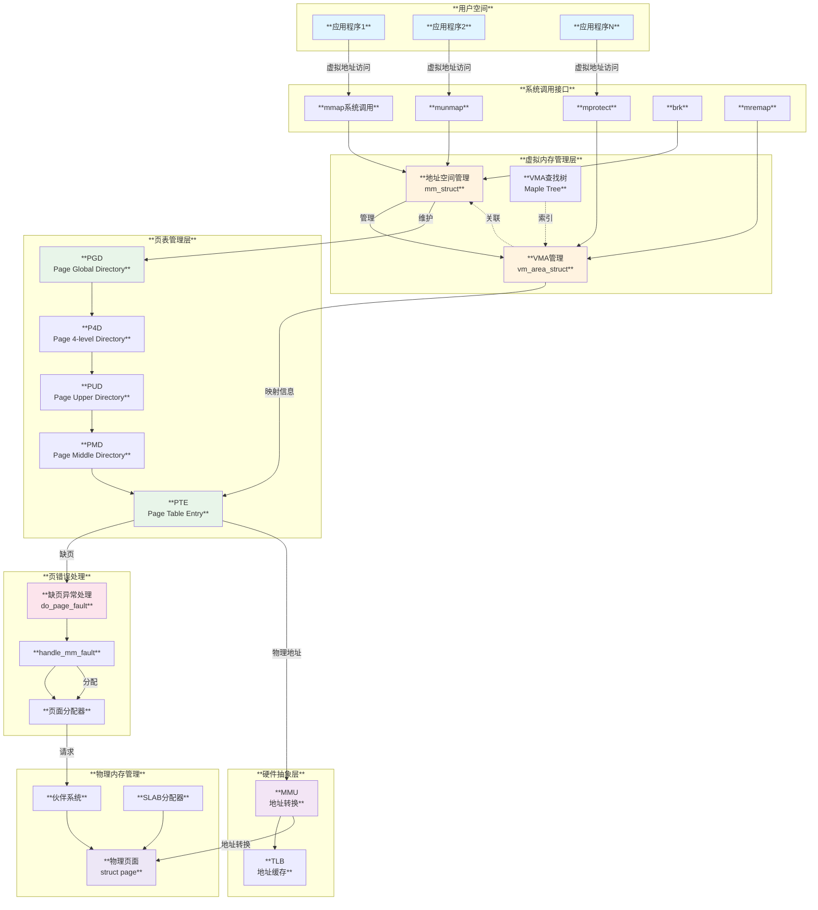
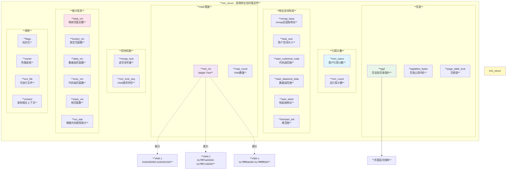
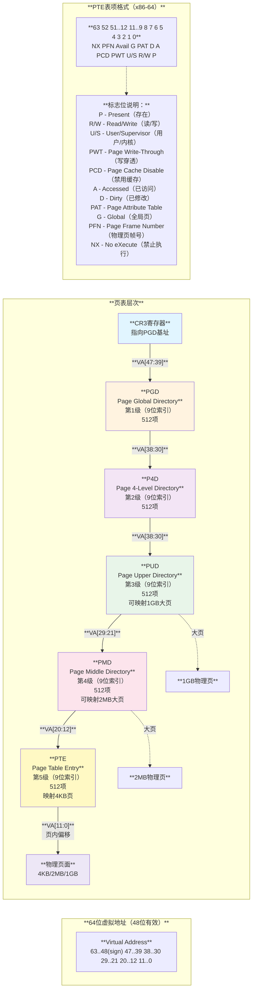
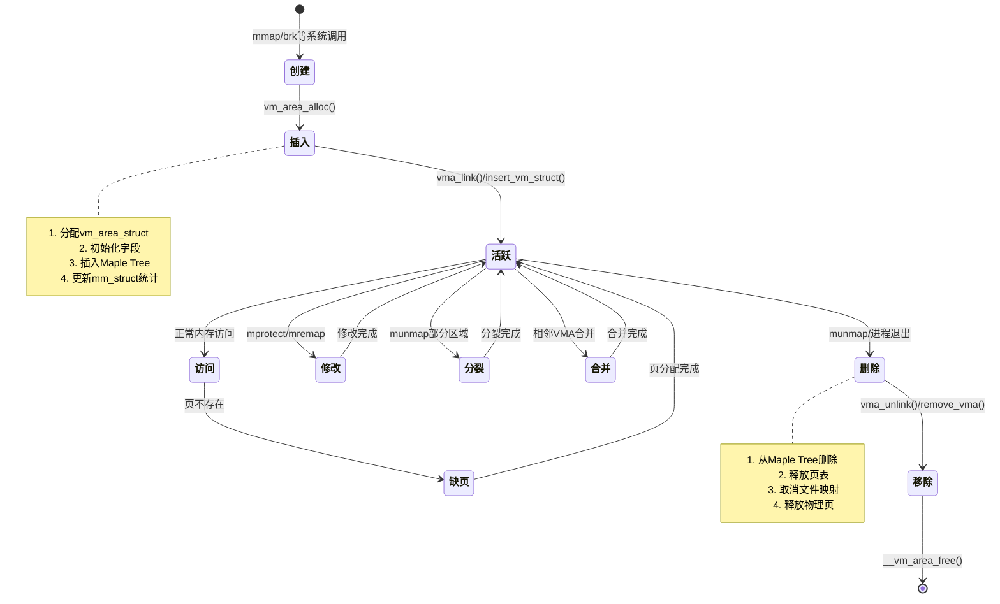

# Linux虚拟地址管理机制

## 目录

- [概述](#概述)
- [虚拟地址管理架构](#虚拟地址管理架构)
- [核心数据结构](#核心数据结构)
  - [mm_struct](#mm_struct)
  - [vm_area_struct](#vm_area_struct)
  - [页表结构](#页表结构)
- [地址空间布局](#地址空间布局)
- [VMA管理机制](#vma管理机制)
- [页表管理](#页表管理)
- [页错误处理](#页错误处理)
- [内存映射操作](#内存映射操作)
- [使用场景](#使用场景)
- [性能优化](#性能优化)
- [总结](#总结)

---

## 概述

虚拟地址管理是Linux内核内存管理子系统的核心组件，它为每个进程提供独立的地址空间，实现了内存保护、共享、按需分配等重要功能。虚拟地址管理通过MMU（Memory Management Unit）将虚拟地址转换为物理地址，使得应用程序可以使用连续的虚拟地址空间，而无需关心物理内存的实际布局。

### 主要功能

- **地址空间隔离**：每个进程拥有独立的虚拟地址空间，相互隔离
- **内存保护**：通过页表权限位控制读写执行权限
- **按需分配**：通过缺页异常实现延迟分配和加载
- **内存共享**：多个进程可以共享同一物理页面
- **地址映射**：支持文件映射、匿名映射、共享内存等
- **透明管理**：对应用程序透明，简化内存使用

---

## 虚拟地址管理架构

### 整体架构图



### 地址转换流程

```mermaid
sequenceDiagram
    participant App as **应用程序**
    participant CPU as **CPU**
    participant TLB as **TLB缓存**
    participant PageWalk as **页表遍历**
    participant PGD as **PGD**
    participant PUD as **PUD**
    participant PMD as **PMD**
    participant PTE as **PTE**
    participant Memory as **物理内存**
    
    Note over App,Memory: **虚拟地址到物理地址转换流程**
    
    rect rgb(240, 255, 240)
        Note over App,CPU: **地址访问阶段**
        
        App->>+CPU: 访问虚拟地址0x7ffff000
        Note right of App: **读取/写入数据**
        
        CPU->>CPU: 解码指令
        Note right of CPU: **获取虚拟地址**
    end
    
    rect rgb(255, 240, 240)
        Note over CPU,TLB: **TLB查找阶段**
        
        CPU->>+TLB: 查询虚拟地址转换
        Note right of CPU: **先查快表**
        
        alt TLB命中
            TLB->>TLB: 找到映射关系
            Note right of TLB: **快速路径**
            
            TLB->>CPU: 返回物理地址0x12345000
            Note right of TLB: **TLB Hit**
            
            TLB->>-CPU: 完成查询
            Note right of TLB: **释放TLB**
            
            CPU->>+Memory: 访问物理地址
            Note right of CPU: **直接访问**
            
            Memory->>Memory: 读写数据
            Note right of Memory: **完成访问**
            
            Memory->>-CPU: 返回数据
            Note right of Memory: **数据返回**
            
            CPU->>App: 返回结果
            Note right of CPU: **访问完成**
        else TLB未命中
            TLB->>CPU: TLB Miss
            Note right of TLB: **需要页表遍历**
        end
    end
    
    rect rgb(240, 240, 255)
        Note over CPU,PageWalk: **页表遍历阶段（TLB Miss）**
        
        CPU->>+PageWalk: 触发页表遍历
        Note right of CPU: **硬件或软件遍历**
        
        PageWalk->>PageWalk: 获取CR3寄存器值
        Note right of PageWalk: **指向PGD基址**
        
        PageWalk->>+PGD: 用VA[47:39]索引PGD
        Note right of PageWalk: **第1级查找**
        
        PGD->>PGD: 读取PGD表项
        Note right of PGD: **获取P4D基址**
        
        PGD->>-PageWalk: 返回P4D地址
        Note right of PGD: **指向下一级**
        
        PageWalk->>+PUD: 用VA[38:30]索引PUD
        Note right of PageWalk: **第2级查找**
        
        PUD->>PUD: 读取PUD表项
        Note right of PUD: **获取PMD基址**
        
        alt 大页映射（2MB/1GB）
            PUD->>PUD: 检测到大页标志
            Note right of PUD: **巨页优化**
            
            PUD->>PageWalk: 返回物理地址
            Note right of PUD: **直接映射**
        else 普通页映射（4KB）
            PUD->>-PageWalk: 返回PMD地址
            Note right of PUD: **继续遍历**
            
            PageWalk->>+PMD: 用VA[29:21]索引PMD
            Note right of PageWalk: **第3级查找**
            
            PMD->>PMD: 读取PMD表项
            Note right of PMD: **获取PTE基址**
            
            PMD->>-PageWalk: 返回PTE地址
            Note right of PMD: **指向最后一级**
            
            PageWalk->>+PTE: 用VA[20:12]索引PTE
            Note right of PageWalk: **第4级查找**
            
            PTE->>PTE: 读取PTE表项
            Note right of PTE: **获取物理页帧号**
        end
    end
    
    rect rgb(255, 255, 240)
        Note over PTE,Memory: **页表项检查阶段**
        
        PTE->>PTE: 检查Present位
        Note right of PTE: **页面是否在内存**
        
        alt 页面在内存
            PTE->>PTE: 检查权限位
            Note right of PTE: **R/W/X权限**
            
            alt 权限检查通过
                PTE->>PTE: 提取物理地址
                Note right of PTE: **PFN + 偏移**
                
                PTE->>-PageWalk: 返回物理地址
                Note right of PTE: **转换成功**
                
                PageWalk->>-CPU: 物理地址0x12345000
                Note right of PageWalk: **遍历完成**
                
                CPU->>TLB: 更新TLB缓存
                Note right of CPU: **加速下次访问**
                
                TLB->>-CPU: 更新完成
                Note right of TLB: **释放TLB**
                
                CPU->>+Memory: 访问物理地址
                Note right of CPU: **内存访问**
                
                Memory->>-CPU: 返回数据
                Note right of Memory: **数据返回**
                
                CPU->>App: 返回结果
                Note right of CPU: **访问成功**
                
            else 权限检查失败
                PTE->>CPU: 触发保护异常
                Note right of PTE: **Permission Fault**
                
                CPU->>App: 发送SIGSEGV信号
                Note right of CPU: **权限错误**
            end
            
        else 页面不在内存
            PTE->>CPU: 触发缺页异常
            Note right of PTE: **Page Fault**
            
            Note over CPU,Memory: **进入缺页处理流程（下一图）**
        end
    end
```

---

## 核心数据结构

### mm_struct

`mm_struct`是描述进程地址空间的核心数据结构，每个进程都有一个mm_struct实例。

#### mm_struct结构图



#### mm_struct关键字段

```c
// mm_struct核心字段
struct mm_struct {
    /* 引用计数 */
    atomic_t mm_users;           // 用户态引用计数
    atomic_t mm_count;           // 总引用计数（包括内核）
    
    /* VMA管理 - 使用Maple Tree实现高效查找 */
    struct maple_tree mm_mt;     // VMA索引树（替代旧的红黑树）
    int map_count;               // VMA数量
    
    /* 地址空间布局 */
    unsigned long mmap_base;     // mmap区域起始地址
    unsigned long task_size;     // 用户空间大小
    
    unsigned long start_code;    // 代码段起始
    unsigned long end_code;      // 代码段结束
    unsigned long start_data;    // 数据段起始
    unsigned long end_data;      // 数据段结束
    unsigned long start_brk;     // 堆起始
    unsigned long brk;           // 堆当前结束位置
    unsigned long start_stack;   // 栈起始
    unsigned long arg_start;     // 参数区起始
    unsigned long arg_end;       // 参数区结束
    unsigned long env_start;     // 环境变量起始
    unsigned long env_end;       // 环境变量结束
    
    /* 页表 */
    pgd_t *pgd;                  // 页全局目录指针（CR3指向这里）
    atomic_long_t pgtables_bytes; // 页表占用的内存大小
    
    /* 同步 */
    struct rw_semaphore mmap_lock; // 保护VMA的读写信号量
    spinlock_t page_table_lock;    // 保护页表的自旋锁
    
    /* 统计 */
    unsigned long total_vm;      // 映射的总页面数
    unsigned long locked_vm;     // 被锁定的页面数
    unsigned long pinned_vm;     // 被pin的页面数
    unsigned long data_vm;       // 数据段页面数
    unsigned long exec_vm;       // 代码段页面数
    unsigned long stack_vm;      // 栈页面数
    
    struct percpu_counter rss_stat[NR_MM_COUNTERS]; // RSS统计
    
    /* 其他 */
    unsigned long flags;         // 标志位
    struct task_struct *owner;   // 所属进程
    struct file *exe_file;       // 可执行文件
    
    /* 架构相关 */
    mm_context_t context;        // 架构相关上下文（如ASID）
};

// RSS计数器类型
enum {
    MM_FILEPAGES,    // 文件页面
    MM_ANONPAGES,    // 匿名页面
    MM_SWAPENTS,     // 交换条目
    MM_SHMEMPAGES,   // 共享内存页面
    NR_MM_COUNTERS
};
```

### vm_area_struct

`vm_area_struct`（VMA）描述进程虚拟地址空间中的一个连续区域。

#### VMA结构图

```mermaid
graph TB
    subgraph "**vm_area_struct - 虚拟内存区域**"
        direction TB
        
        subgraph "**地址范围**"
            Start[**vm_start<br/>起始虚拟地址**]
            End[**vm_end<br/>结束虚拟地址**]
            Size["**大小 = vm_end - vm_start**"]
            
            Start --> Size
            End --> Size
        end
        
        subgraph "**所属地址空间**"
            VMMM[**vm_mm<br/>指向mm_struct**]
        end
        
        subgraph "**权限和标志**"
            Prot[**vm_page_prot<br/>页面保护位**]
            Flags[**vm_flags<br/>区域标志**]
            
            FlagDetail["**标志详解：**<br/>VM_READ - 可读<br/>VM_WRITE - 可写<br/>VM_EXEC - 可执行<br/>VM_SHARED - 共享<br/>VM_GROWSDOWN - 向下增长<br/>VM_LOCKED - 锁定在内存<br/>VM_IO - 设备I/O映射<br/>..."]
            
            Flags -.-> FlagDetail
        end
        
        subgraph "**文件映射**"
            File[**vm_file<br/>映射的文件**]
            Offset[**vm_pgoff<br/>文件偏移（页）**]
            Private[**vm_private_data<br/>私有数据**]
        end
        
        subgraph "**操作函数**"
            Ops[**vm_ops<br/>vm_operations_struct**]
            
            OpsDetail["**操作函数：**<br/>open() - 打开VMA<br/>close() - 关闭VMA<br/>fault() - 页错误处理<br/>map_pages() - 批量映射<br/>..."]
            
            Ops -.-> OpsDetail
        end
        
        subgraph "**匿名映射**"
            Anon[**anon_vma<br/>反向映射**]
            AnonChain[**anon_vma_chain<br/>链表节点**]
            AnonName[**anon_name<br/>匿名区域名称**]
        end
        
        subgraph "**文件映射**"
            Shared[**shared.rb<br/>红黑树节点**]
            Interval["**i_mmap interval tree**"]
            
            Shared -.链接到.-> Interval
        end
        
        subgraph "**VMA锁（Per-VMA Lock）**"
            VMALock[**vm_lock<br/>VMA级别的锁**]
            LockSeq[**vm_lock_seq<br/>锁序列号**]
            Detached[**detached<br/>已分离标志**]
        end
    end
    
    VMMM --> MM[**mm_struct**]
    File -.映射.-> FileObj[**struct file**]
    
    style vm_area_struct fill:#e1f5ff
    style Start fill:#fff3e0
    style Flags fill:#f3e5f5
    style File fill:#e8f5e9
    style Anon fill:#fce4ec
```



#### VMA关键字段和标志

```c
// vm_area_struct核心字段
struct vm_area_struct {
    /* 地址范围：[vm_start, vm_end) */
    unsigned long vm_start;      // 起始虚拟地址（包含）
    unsigned long vm_end;        // 结束虚拟地址（不包含）
    
    /* 所属地址空间 */
    struct mm_struct *vm_mm;     // 指向所属的mm_struct
    
    /* 权限 */
    pgprot_t vm_page_prot;       // 页面保护位（实际写入PTE）
    vm_flags_t vm_flags;         // VMA标志位
    
    /* 文件映射相关 */
    struct file *vm_file;        // 映射的文件（NULL表示匿名映射）
    unsigned long vm_pgoff;      // 文件中的偏移（以PAGE_SIZE为单位）
    void *vm_private_data;       // 私有数据
    
    /* 操作函数 */
    const struct vm_operations_struct *vm_ops;
    
    /* 匿名映射：反向映射支持 */
    struct list_head anon_vma_chain;
    struct anon_vma *anon_vma;
    struct anon_vma_name *anon_name;
    
    /* 文件映射：地址空间的interval tree */
    struct {
        struct rb_node rb;
        unsigned long rb_subtree_last;
    } shared;
    
    /* Per-VMA锁（新特性） */
    struct vma_lock *vm_lock;
    int vm_lock_seq;
    bool detached;
};

// vm_flags标志位
#define VM_READ        0x00000001  // 可读
#define VM_WRITE       0x00000002  // 可写
#define VM_EXEC        0x00000004  // 可执行
#define VM_SHARED      0x00000008  // 共享映射
#define VM_MAYREAD     0x00000010  // 可以设置为可读
#define VM_MAYWRITE    0x00000020  // 可以设置为可写
#define VM_MAYEXEC     0x00000040  // 可以设置为可执行
#define VM_MAYSHARE    0x00000080  // 可以设置为共享
#define VM_GROWSDOWN   0x00000100  // 向下增长（栈）
#define VM_PFNMAP      0x00000400  // 页帧映射（无struct page）
#define VM_LOCKED      0x00002000  // 页面锁定在内存
#define VM_IO          0x00004000  // I/O映射
#define VM_SEQ_READ    0x00008000  // 顺序读取
#define VM_RAND_READ   0x00010000  // 随机读取
#define VM_DONTCOPY    0x00020000  // fork时不复制
#define VM_DONTEXPAND  0x00040000  // 不能通过mremap扩展
#define VM_LOCKONFAULT 0x00080000  // 访问时才锁定
#define VM_ACCOUNT     0x00100000  // 需要记账
#define VM_NORESERVE   0x00200000  // 不预留空间
#define VM_HUGETLB     0x00400000  // 大页
#define VM_SYNC        0x00800000  // 同步页错误

// vm_operations_struct操作函数
struct vm_operations_struct {
    void (*open)(struct vm_area_struct *area);
    void (*close)(struct vm_area_struct *area);
    int (*may_split)(struct vm_area_struct *area, unsigned long addr);
    int (*mremap)(struct vm_area_struct *area);
    int (*mprotect)(struct vm_area_struct *vma, unsigned long start,
                    unsigned long end, unsigned long newflags);
    vm_fault_t (*fault)(struct vm_fault *vmf);
    vm_fault_t (*huge_fault)(struct vm_fault *vmf,
                             unsigned int order);
    vm_fault_t (*map_pages)(struct vm_fault *vmf,
                            pgoff_t start_pgoff, pgoff_t end_pgoff);
    unsigned long (*pagesize)(struct vm_area_struct *area);
};
```

### 页表结构

Linux使用5级页表结构，可根据架构和配置灵活调整层级。

#### 五级页表结构图



#### 页表管理代码

```c
// 页表层次定义
typedef struct { unsigned long pgd; } pgd_t;
typedef struct { unsigned long p4d; } p4d_t;
typedef struct { unsigned long pud; } pud_t;
typedef struct { unsigned long pmd; } pmd_t;
typedef struct { unsigned long pte; } pte_t;

// x86-64页表标志位
#define _PAGE_PRESENT     0x001  // 页面存在
#define _PAGE_RW          0x002  // 可写
#define _PAGE_USER        0x004  // 用户可访问
#define _PAGE_PWT         0x008  // 写穿透
#define _PAGE_PCD         0x010  // 禁用缓存
#define _PAGE_ACCESSED    0x020  // 已访问
#define _PAGE_DIRTY       0x040  // 已修改
#define _PAGE_PSE         0x080  // 大页（2MB/1GB）
#define _PAGE_GLOBAL      0x100  // 全局页
#define _PAGE_NX          (1ULL << 63) // 禁止执行

// 页表操作宏
#define pgd_index(addr)   (((addr) >> PGDIR_SHIFT) & (PTRS_PER_PGD - 1))
#define p4d_index(addr)   (((addr) >> P4D_SHIFT) & (PTRS_PER_P4D - 1))
#define pud_index(addr)   (((addr) >> PUD_SHIFT) & (PTRS_PER_PUD - 1))
#define pmd_index(addr)   (((addr) >> PMD_SHIFT) & (PTRS_PER_PMD - 1))
#define pte_index(addr)   (((addr) >> PAGE_SHIFT) & (PTRS_PER_PTE - 1))

// 页表遍历函数
static inline unsigned long virt_to_phys(struct mm_struct *mm, unsigned long vaddr)
{
    pgd_t *pgd;
    p4d_t *p4d;
    pud_t *pud;
    pmd_t *pmd;
    pte_t *pte;
    unsigned long paddr;
    
    /* 1. PGD查找 */
    pgd = pgd_offset(mm, vaddr);
    if (pgd_none(*pgd) || pgd_bad(*pgd))
        return 0;
    
    /* 2. P4D查找 */
    p4d = p4d_offset(pgd, vaddr);
    if (p4d_none(*p4d) || p4d_bad(*p4d))
        return 0;
    
    /* 3. PUD查找 */
    pud = pud_offset(p4d, vaddr);
    if (pud_none(*pud))
        return 0;
    
    /* 检查是否是1GB大页 */
    if (pud_large(*pud)) {
        paddr = pud_pfn(*pud) << PAGE_SHIFT;
        paddr |= vaddr & (PUD_SIZE - 1);
        return paddr;
    }
    
    /* 4. PMD查找 */
    pmd = pmd_offset(pud, vaddr);
    if (pmd_none(*pmd))
        return 0;
    
    /* 检查是否是2MB大页 */
    if (pmd_large(*pmd)) {
        paddr = pmd_pfn(*pmd) << PAGE_SHIFT;
        paddr |= vaddr & (PMD_SIZE - 1);
        return paddr;
    }
    
    /* 5. PTE查找 */
    pte = pte_offset_map(pmd, vaddr);
    if (!pte || pte_none(*pte)) {
        if (pte)
            pte_unmap(pte);
        return 0;
    }
    
    /* 6. 获取物理地址 */
    paddr = pte_pfn(*pte) << PAGE_SHIFT;
    paddr |= vaddr & (PAGE_SIZE - 1);
    
    pte_unmap(pte);
    return paddr;
}

// 页表分配和释放
static inline int __pte_alloc(struct mm_struct *mm, pmd_t *pmd)
{
    spinlock_t *ptl;
    pgtable_t new = pte_alloc_one(mm);
    
    if (!new)
        return -ENOMEM;
    
    ptl = pmd_lock(mm, pmd);
    if (likely(pmd_none(*pmd))) {
        mm_inc_nr_ptes(mm);
        pmd_populate(mm, pmd, new);
        new = NULL;
    }
    spin_unlock(ptl);
    
    if (new)
        pte_free(mm, new);
    return 0;
}

// 页表清理
static inline void free_pte_range(struct mmu_gather *tlb, pmd_t *pmd,
                                 unsigned long addr)
{
    pgtable_t token = pmd_pgtable(*pmd);
    pmd_clear(pmd);
    pte_free_tlb(tlb, token, addr);
    mm_dec_nr_ptes(tlb->mm);
}
```

---

## 地址空间布局

### 典型64位进程地址空间布局

```text
**Linux x86-64进程地址空间布局（48位）**

┌─────────────────────────────────────────────────────────────────────────┐
│ 0xFFFFFFFFFFFFFFFF                                                      │
│         │                                                               │
│         ▼                                                               │
│ **内核空间（128TB）**  ────┐                                             │
│ ┌────────────────────┐    │                                             │
│ │ 内核代码/数据      │    │ ffff800000000000 - ffffffffffffffff        │
│ │ 直接映射区         │    │                                             │
│ │ vmalloc区          │    │                                             │
│ │ 固定映射区         │    │                                             │
│ └────────────────────┘    │                                             │
│ 0xFFFF800000000000    ────┘                                             │
│                                                                         │
│                                                                         │
│ **非规范地址空间（无效）**                                               │
│ 0x0000800000000000 - 0xFFFF7FFFFFFFFFFF                                │
│                                                                         │
│                                                                         │
│ 0x00007FFFFFFFFFFF    ────┐                                             │
│         │                 │                                             │
│         ▼                 │                                             │
│ **用户空间（128TB）**   ───┤                                             │
│                           │                                             │
│ ┌────────────────────┐    │ **栈（向下增长）**                           │
│ │ 0x7ffffffde000     │    │ VM_GROWSDOWN                               │
│ │ [stack]            │    │ 栈段：局部变量、函数调用                      │
│ │ ▼▼▼▼▼▼             │    │ 大小：通常8MB，可扩展                        │
│ └────────────────────┘    │                                             │
│         ...               │                                             │
│ ┌────────────────────┐    │ **mmap区域（向下增长）**                     │
│ │ 0x7ffff7a00000     │    │ 动态库、大块内存分配                          │
│ │ libc.so            │    │ VM_READ | VM_WRITE | VM_EXEC                │
│ │ 0x7ffff7800000     │    │                                             │
│ │ libpthread.so      │    │                                             │
│ │ ...                │    │                                             │
│ └────────────────────┘    │                                             │
│         ...               │                                             │
│ ┌────────────────────┐    │ **堆（向上增长）**                           │
│ │ ▲▲▲▲▲▲             │    │ 动态内存分配（malloc/free）                  │
│ │ [heap]             │    │ brk/sbrk系统调用                            │
│ │ 0x00602000         │    │                                             │
│ └────────────────────┘    │                                             │
│ ┌────────────────────┐    │ **BSS段（未初始化数据）**                    │
│ │ 0x00601000         │    │ VM_READ | VM_WRITE                          │
│ │ .bss               │    │ 全局未初始化变量                             │
│ │ 0x00600000         │    │                                             │
│ └────────────────────┘    │                                             │
│ ┌────────────────────┐    │ **数据段（已初始化数据）**                    │
│ │ 0x00600000         │    │ VM_READ | VM_WRITE                          │
│ │ .data              │    │ 全局和静态初始化变量                          │
│ │ 0x00500000         │    │                                             │
│ └────────────────────┘    │                                             │
│ ┌────────────────────┐    │ **代码段（只读）**                           │
│ │ 0x00401000         │    │ VM_READ | VM_EXEC                           │
│ │ .text              │    │ 可执行代码                                   │
│ │ 0x00400000         │    │                                             │
│ └────────────────────┘    │                                             │
│ 0x0000000000000000    ────┘                                             │
└─────────────────────────────────────────────────────────────────────────┘

**布局特点：**
- 代码段从较低地址开始（0x400000），方便加载
- 堆向上增长，从BSS段结束位置开始
- mmap区域向下增长，从用户空间高地址开始
- 栈在用户空间最高地址，向下增长
- 中间有大量空闲地址空间用于mmap分配
- ASLR（地址空间随机化）会随机化各段起始地址
```

### 内存布局管理

```c
// 进程地址空间布局示例
void print_mm_layout(struct mm_struct *mm)
{
    pr_info("Process Memory Layout:\n");
    pr_info("  Code:  0x%016lx - 0x%016lx  (%8lu KB)\n",
            mm->start_code, mm->end_code,
            (mm->end_code - mm->start_code) / 1024);
    
    pr_info("  Data:  0x%016lx - 0x%016lx  (%8lu KB)\n",
            mm->start_data, mm->end_data,
            (mm->end_data - mm->start_data) / 1024);
    
    pr_info("  Heap:  0x%016lx - 0x%016lx  (%8lu KB)\n",
            mm->start_brk, mm->brk,
            (mm->brk - mm->start_brk) / 1024);
    
    pr_info("  Stack: 0x%016lx (grows down)\n", mm->start_stack);
    pr_info("  Mmap:  0x%016lx (mmap_base)\n", mm->mmap_base);
    
    pr_info("Statistics:\n");
    pr_info("  VMAs:      %d\n", mm->map_count);
    pr_info("  Total VM:  %lu pages (%lu KB)\n",
            mm->total_vm, mm->total_vm * PAGE_SIZE / 1024);
    pr_info("  Locked VM: %lu pages (%lu KB)\n",
            mm->locked_vm, mm->locked_vm * PAGE_SIZE / 1024);
    pr_info("  Data VM:   %lu pages\n", mm->data_vm);
    pr_info("  Exec VM:   %lu pages\n", mm->exec_vm);
    pr_info("  Stack VM:  %lu pages\n", mm->stack_vm);
}

// ASLR地址随机化
unsigned long arch_mmap_rnd(void)
{
    unsigned long rnd;
    
    if (mmap_is_ia32())
        rnd = get_random_long() & ((1UL << mmap_rnd_compat_bits) - 1);
    else
        rnd = get_random_long() & ((1UL << mmap_rnd_bits) - 1);
    
    return rnd << PAGE_SHIFT;
}

unsigned long arch_randomize_brk(struct mm_struct *mm)
{
    return randomize_page(mm->brk, 0x02000000);
}
```

---

## VMA管理机制

### VMA的生命周期



---

## 总结

Linux虚拟地址管理机制是内核最复杂和最关键的子系统之一，它通过以下核心组件实现了高效的内存管理：

### 核心特性

1. **分层管理**
   - mm_struct管理进程级别的地址空间
   - vm_area_struct管理连续的虚拟内存区域
   - 五级页表实现灵活的地址转换
   - TLB缓存加速地址翻译

2. **按需分配**
   - 延迟分配物理内存直到实际访问
   - 通过缺页异常动态分配页面
   - 支持写时复制（COW）节省内存
   - 页面交换支持超额使用

3. **高效查找**
   - Maple Tree替代红黑树提高查找效率
   - Per-VMA锁支持细粒度并发
   - RCU保护的快速路径
   - TLB缓存减少页表遍历

4. **灵活映射**
   - 支持文件映射和匿名映射
   - 支持共享和私有映射
   - 支持固定映射和动态映射
   - 支持大页优化性能

### 性能优化策略

- **TLB管理**：批量刷新、延迟刷新、精准刷新
- **页表缓存**：快速分配和释放页表
- **大页支持**：减少TLB miss和页表层级
- **Per-VMA锁**：提高多核并发性能
- **预分配和预填充**：减少缺页异常次数

### 实际应用

虚拟地址管理机制广泛应用于：
- 进程隔离和保护
- 动态库加载
- 内存映射文件
- 共享内存通信
- 大规模数据处理
- 虚拟化和容器

通过深入理解虚拟地址管理机制，我们可以更好地优化应用程序的内存使用，提高系统性能和稳定性。
